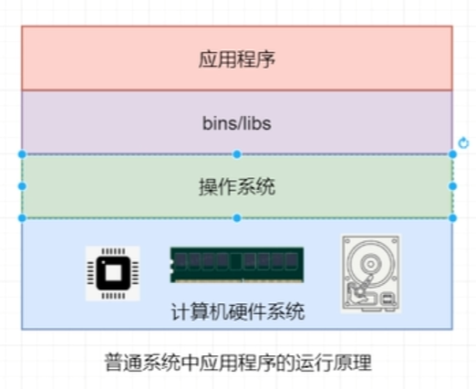
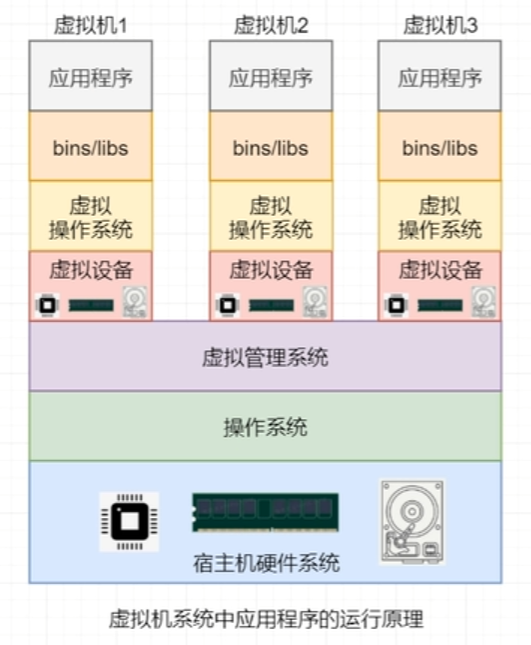
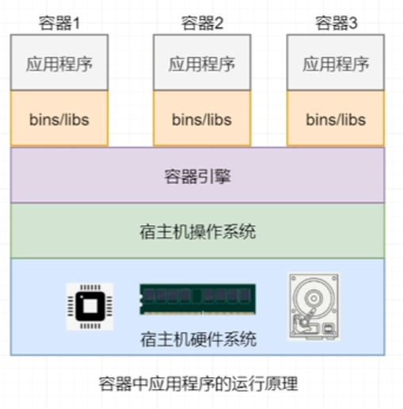
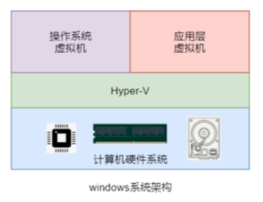
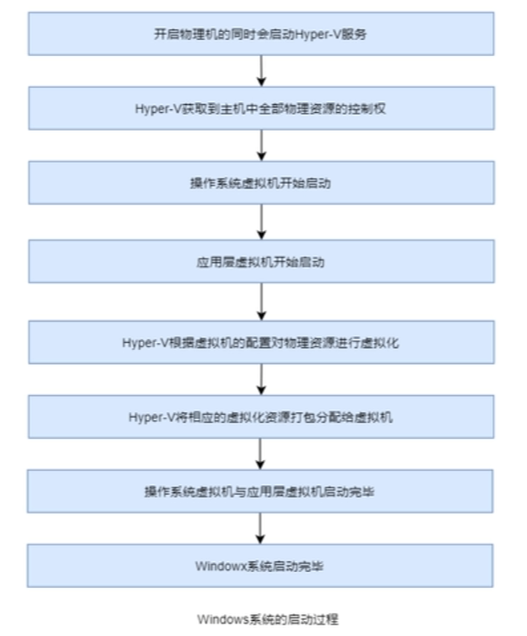

# Docker概述
## DevOps概述
- DevOps是一种思想，一种管理模式，一种执行规范和标志。它主要用于促进开发，测试与运维部门之间的沟通，写作与整合
## Docker简介
-  Docker是一个开源的应用容器Container引擎，其可以让开发者将应用及应用运行的环境打包到一个轻量级、可移植的镜像中，然后发布到任何流行的Linux、Windows机器上。
- Docker是由一个<abbr title="云计算中的服务，平台技术服务">PaaS</abbr>提供商dotCloud公司的创始人Solomon Hykes发起的一个内部项目，是基于多年云服务技术的一次革新，使用Go语言开发。2013年3月开源，并在Github上进行维护。后由于Docker项目的火爆，2013年底，dotCloud公司更名为Docker。官网更新为<a href="https://docker.com">docker.com</a>。
### Docker的用途
- 提供统一的运行环境
- 便捷的应用迁移
- 超快的启动时间
- 更轻松的维护和扩展
  - Docker公司及各个开源项目团队一起维护了一大批高质量的官方镜像：<a href="https://hub.docker.com/">hub.docker.com</a>。既可以在生产环境使用，又可以作为基础进一步定制，大大的降低了应用服务的镜像制作成本。
  - Docker使用的<b><i>分层存储</i></b>以及镜像的技术，使得应用重复部分的复用更为容易，也使得应用的维护更新更加简单，基于基础镜像进一步扩展镜像也变得非常简单。
## 容器与虚拟机的区别
- 普通系统的应用程序

  
- 虚拟机系统中应用程序的运行原理

  
- 容器中应用程序的运行原理

  
## Windows系统的虚拟化
- Hypervisor
  - 一种运行在基础物理服务器和操作系统之间的中间层软件，可允许多个操作系统和应用共享硬件。也可叫做VMM(virtual machine monitor),即虚拟机监视器。Hypervisors是一种在虚拟环境中过的“元”操作系统。他们可以访问服务器上包括磁盘和内存在内的所有物理设备。Hypervisors不但协调着这些硬件资源的访问，也同时在各个虚拟机之间施加防护。当服务器启动并执行Hypervisor时，它会加载所有虚拟机客户端的操作系统同时会分配给每一台虚拟机适量的内存，CPU，网络和磁盘。 ——来自百度百科
- Hyper-V
  - 是微软提供的商业化的Hypervisor.现在用的win10其本质是运行在Hyper-V上的虚拟机
- Windows系统架构
  
  
  现在的Windows系统并不是一个“纯洁”的Windows了，而是运行在Hpyer-V上的虚拟机。而原来的应用层现在也是一个运行在Hpyer-V上的虚拟机。系统上运行的一个个应用，其实就是运行在应用层虚拟机上。操作系统虚拟机能够管理应用层虚拟机

  

- VMware与Windows系统
  - VMware采用的是VMM虚拟化技术，该技术要求直接访问CPU硬件的虚拟化功能。但VMware作为Windows系统中的应用，是运行在应用层虚拟机中的，导致VMware无法直接访问CPU硬件虚拟化功能，所以在安装VMware Workstation时会出现VMware Workstation与Hyper-V不兼容的问题——早期出现的问题
  - 从VMware Workstation15.5.5版本开始，VMware重构了VMM技术，使其不需要直接访问CPU硬件，而是通过调用Windows10系统的WHP的API来运行，这样就解决了不兼容的问题。
  - 结论：在安装VMware Workstation时，要安装15.5.5以上版本，而Windows系统也需要使用w10以上的版本。
  
## Docker系统架构
- Docker Daemon
  - Docker Daemon,即Dockerd，Docker守护进程，其监听着Docker API请求并管理Docker对象，例如镜像、容器、网络和卷。守护进程还可以与其他守护进程通信以管理Docker服务。
- Image镜像
  - Docker镜像是用于创建Docker容器的模板。就像面向对象编程中的类 
- Container容器
  - Docker容器是镜像运行时的实体。就像面向对象编程中类的实例。一个类可以创建出N多个实例，那么一个镜像同样也可以创建出N多个容器。每个处于运行状态的容器中都包含着一个或多个相关的应用，且它的运行不会干扰到其它容器。因为它们之间是相互隔离的。
- Repository仓库
  - Docker镜像仓库用来保存相关的一组镜像，这组镜像具有相同的镜像名称，都与镜像仓库名称相同。仓库根据其中的镜像是否可以被公开共享，可以分为公开库和私有库。
- Tag标签
  - 通过<repository>:<tag>即可唯一定位一个镜像。即镜像标签其实就是镜像仓库中用于区分各个镜像的一种标识，同一仓库中的镜像具有不同标签，如：版本号。
- Registry镜像中心
  - Docker的镜像中心中存放着很多官方，其他机构或个人创建的Docker仓库，Docker用户可以直接从这些仓库pull需要的镜像，也可以将自己制作的镜像push到镜像中心相应的仓库中。最常用的镜像中心是Docker官方的<a href="https://hub.docker.com">Docker Hub</a>。

## 总结
### 概述
- 理解引发开发，测试与运维关系不和谐的原因
  - 环境不同
- 理解运维对架构师的抱怨点
  - 希望可以实现一键部署
- 了解学习过程中集群搭建所面临的问题
  - 虚拟机过多启动，依赖机器的配置
- 能够描述什么是DevOps
  - 一种思想，一种管理模式，用于促进3个部门间沟通协作
### 简介
- 能够描述Docker LOGO的由来
  - Container这个单词的意思不仅有“容器”，还有“集装箱”。这就是为什么LOGO中出现很多集装箱的原因。至于鲸鱼是在众多LOGO方案中，网友投票的结果。
- Docker含义
  - Docker的本义为码头工人，即操作集装箱的人。
- Docker用途
  - Docker了解Docker可以将应用与环境打包为镜像，然后实现“一处可运行，处处可运行”
### 容器与虚拟机区别（重点与难点）
- 最大区别
  - 虚拟机中存在独立的硬件系统和操作系统，但容器中的全部是共享的宿主机中的操作系统与硬件系统
### Windows系统的虚拟化
- 了解什么是Hypervisor
  - 位于操作系统和硬件系统之间，用于实现多个虚拟机共享宿主机的硬件系统
- 什么是Hyper-V
  - 微软提供的商业化的Hypervisor，运行在windwos系统上
  - KVM与Xen是Linux系统上的Hypervisor
- 理解现在的windows系统架构
  - 操作系统与应用层分别是两个虚拟机，位于Hpyer-V之上。
### Docker系统架构
- 能够对Docker系统架构图进行简述即可