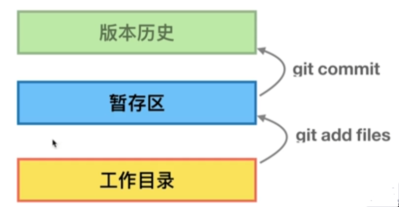
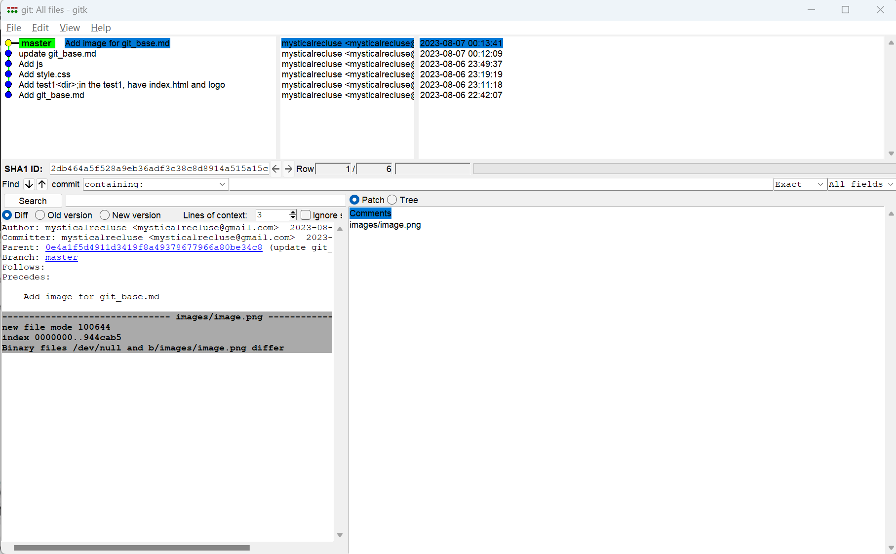
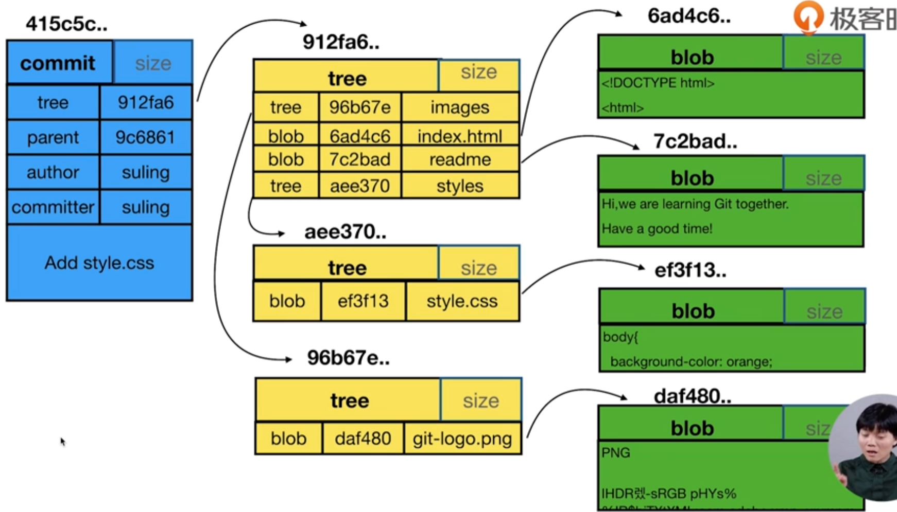
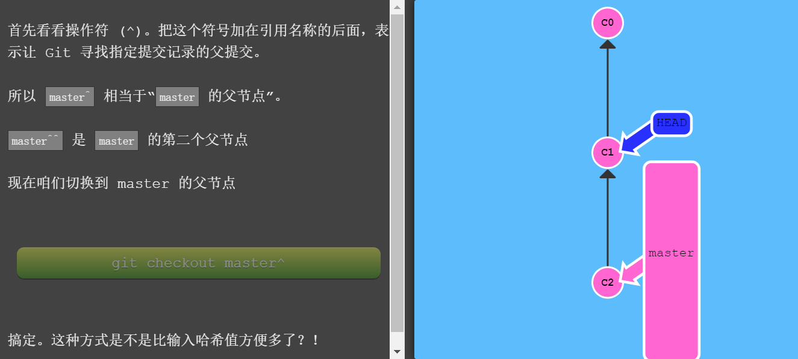

# Git 基础
## git的最小配置
```shell
# 配置user.name和user.email
$ git config --global user.name 'your_name'
$ git config --global user.email 'your_email@domain.com'
```
### config的三个作用域
缺省等同于local(默认)
```shell
$ git config --local    #local只对某个仓库有效
$ git config --global   #global对当前用户所有仓库有效
$ git config --system   #system对系统所有登录的用户有效
```
显示config的配置，加 --list
```shell
$ git config --list --local
$ git config --list --global
$ git config --list --system
```
## 建Git仓库 
### 场景一：把已有的项目代码纳入Git管理
```shell
$ cd 项目代码所在的文件夹
$ git init
```
### 场景二：新建的项目直接用Git管理
```shell
$ cd 某个文件夹
$ git init your_project  #会在当前路径下创建和项目名称同名的文件夹
$ cd your_project
```
## 往仓库里添加文件
示例：4次提交，生成一个静态页面 <font color=royalblue>（所有示例文件位于test1目录）</font>
```shell
#在仓库中建立一个放置实验一的目录，并进入
$ mkdir test1
$ cd test1

#将logo和index复制到仓库中
$ cp /d/mysticalgit/git_learning/index.html .
$ cp -r /d/mysticalgit/git_learning/images .

#返回主目录，并查看git的状态
$ cd ..
$ git status  #查看git状态
On branch master
Untracked files:
  (use "git add <file>..." to include in what will be committed)
        test1/  #显示test/目录尚未被添加到暂存区

#将test1目录添加至git暂存区
$ git add test1
$ git status
On branch master
Changes to be committed:
  (use "git restore --staged <file>..." to unstage)
        new file:   test1/images/git-logo.png
        new file:   test1/index.html    #显示该目录及目录下的文件都被添加至暂存区

#将test1从暂存区放置到git仓库，并备注原因
$ git commit -m'Add test1<dir>; in the test1, have index.html and logo'
[master 24a0d4b] Add test1<dir>;in the test1, have index.html and logo
 2 files changed, 54 insertions(+)
 create mode 100644 test1/images/git-logo.png
 create mode 100644 test1/index.html    #表示成功放置到仓库中

 #查看历史记录
 $ git log
 commit 24a0d4b56f1b4cb112d226443cad4f6ca6a3df79 (HEAD -> master)
Author: mysticalrecluse <mysticalrecluse@gmail.com>
Date:   Sun Aug 6 23:11:18 2023 +0800

    Add test1<dir>;in the test1, have index.html and logo

#将网页样式文件:styles/style.css放置于test1目录下，并git查看状态
$ cp -r /d/mysticalgit/git_learning/styles .
$ git status
Untracked files:
  (use "git add <file>..." to include in what will be committed)
        styles/

#重复上述操作：git add <file/dir> && git commit -m''
$ git add styles
$ git status
On branch master
Changes to be committed:
  (use "git restore --staged <file>..." to unstage)
        new file:   styles/style.css
$ git commit -m'Add style.css'
[master c406498] Add style.css
 1 file changed, 61 insertions(+)
 create mode 100644 test1/styles/style.css
$ git log
commit c40649887a0c7a5c079c8b7a16dd811f052b63b2 (HEAD -> master)
Author: mysticalrecluse <mysticalrecluse@gmail.com>
Date:   Sun Aug 6 23:19:19 2023 +0800

    Add style.css

commit 24a0d4b56f1b4cb112d226443cad4f6ca6a3df79
Author: mysticalrecluse <mysticalrecluse@gmail.com>
Date:   Sun Aug 6 23:11:18 2023 +0800

    Add test1<dir>;in the test1, have index.html and logo

#添加js文件，并重复上述操作
$ cp -r /d/mysticalgit/git_learning/js .
$ git status
Untracked files:
  (use "git add <file>..." to include in what will be committed)
        js/
$ git add js
warning: in the working copy of 'test1/js/script.js', LF will be replaced by CRLF the next time Git touches it

$ git commit -m'Add js'
[master 0b94dc2] Add js
 1 file changed, 15 insertions(+)
 create mode 100644 test1/js/script.js

$ git log
commit 0b94dc21f9482851f734e7998f453282de50c0be (HEAD -> master)
Author: mysticalrecluse <mysticalrecluse@gmail.com>
Date:   Sun Aug 6 23:49:37 2023 +0800

    Add js

commit c40649887a0c7a5c079c8b7a16dd811f052b63b2
Author: mysticalrecluse <mysticalrecluse@gmail.com>
Date:   Sun Aug 6 23:19:19 2023 +0800

    Add style.css

commit 24a0d4b56f1b4cb112d226443cad4f6ca6a3df79
Author: mysticalrecluse <mysticalrecluse@gmail.com>
Date:   Sun Aug 6 23:11:18 2023 +0800

    Add test1<dir>;in the test1, have index.html and logo

#将之前修改的markdown文件提交到git仓库
#原文件修改后，git状态变为：
$ git status
 On branch master
Changes not staged for commit:
  (use "git add <file>..." to update what will be committed)
  (use "git restore <file>..." to discard changes in working directory)
        modified:   ../git_base.md

#git add -u 将本来就在git管理下的文件，全部直接提交至暂存区
$ git add -u
$ git commit -m'update git_base.md'
[master 0e4a1f5] update git_base.md
 1 file changed, 164 insertions(+)
$ git log
commit 0e4a1f5d4911d3419f8a49378677966a80be34c8 (HEAD -> master)
Author: mysticalrecluse <mysticalrecluse@gmail.com>
Date:   Mon Aug 7 00:12:09 2023 +0800

    update git_base.md

commit 0b94dc21f9482851f734e7998f453282de50c0be
Author: mysticalrecluse <mysticalrecluse@gmail.com>
Date:   Sun Aug 6 23:49:37 2023 +0800

    Add js

commit c40649887a0c7a5c079c8b7a16dd811f052b63b2
Author: mysticalrecluse <mysticalrecluse@gmail.com>
Date:   Sun Aug 6 23:19:19 2023 +0800

    Add style.css

commit 24a0d4b56f1b4cb112d226443cad4f6ca6a3df79
Author: mysticalrecluse <mysticalrecluse@gmail.com>
Date:   Sun Aug 6 23:11:18 2023 +0800

    Add test1<dir>;in the test1, have index.html and logo

```

该图展示了git将文件提交管理的过程
### 总结：实验所学命令
```shell
#上述实验所学的重点命令、
$ git add <file>
$ git commit -m''
$ git stauts    #查看git的当前状态
$ git log       #查看git的历史
$ git add -u    #批量将当前已被管理的变更文件上传暂存区
```
## 给文件重命名的简便方法
```shell
$ git rm  <file>     #清除仓库里不要文件的记录
$ git restore --staged test1.txt  #清除指定暂存区的文件
$ git reset --hard  #清空暂存区的记录
$ git mv <file.name> <new_file.name> #文件重命名
```
## 详解git log 查看版本演变历史
```shell
$ git log --oneline #简易查看版本历史，省略参数
2db464a (HEAD -> master) Add image for git_base.md
0e4a1f5 update git_base.md
0b94dc2 Add js
c406498 Add style.css
24a0d4b Add test1<dir>;in the test1, have index.html and logo
4c22586 Add git_base.md

#查看最近的n#个历史记录
$ git log -n3
commit 2db464a5f528a9eb36adf3c38c8d8914a515a15c (HEAD -> master)
Author: mysticalrecluse <mysticalrecluse@gmail.com>
Date:   Mon Aug 7 00:13:41 2023 +0800

    Add image for git_base.md

commit 0e4a1f5d4911d3419f8a49378677966a80be34c8
Author: mysticalrecluse <mysticalrecluse@gmail.com>
Date:   Mon Aug 7 00:12:09 2023 +0800

    update git_base.md

commit 0b94dc21f9482851f734e7998f453282de50c0be
Author: mysticalrecluse <mysticalrecluse@gmail.com>
Date:   Sun Aug 6 23:49:37 2023 +0800

    Add js

#查看本地有多少分支
$ git branch -v

#新建分支并切换到该分支
$ git checkout -b temp <hash值>

#只是创建分支
$ git branch <branch.name> <hash>

#删除分支;如果这个分支包含了一些尚未合并到其他分支的更改，那么 Git 将不会删除它，并会显示一个错误消息
$ git branch -d <branch.name>

#强行删除分支
$ git branch -D <branch .name>

#切换分支
$ git checkout <branch.name>


#查看所有分支的版本历史信息
$ git log --all
$ git log  #只用git log只能显示当前分支的信息
$ git log --all --graph  #版本信息图形化 
$ git log --oneline <brach.name> #指定分支查看版本信息

#查看git命令的详细参考文档
$ git help --web <指令>
```
### 总结：分支操作指令
```shell
#查看本地有多少分支
$ git branch -v

#新建分支并切换到该分支
$ git checkout -b temp <hash值>

#只是创建分支
$ git branch <branch.name> <hash>

#删除分支;如果这个分支包含了一些尚未合并到其他分支的更改，那么 Git 将不会删除它，并会显示一个错误消息
$ git branch -d <branch.name>

#强行删除分支
$ git branch -D <branch .name>

#切换分支
$ git checkout <branch.name>

#强制移动分支
$ git branch -f <branch.name> <relate commit position>
eg: git branch -f master HEAD~3


#查看所有分支的版本历史信息
$ git log --all
$ git log  #只用git log只能显示当前分支的信息
```
## git的图形界面
```shell
#输入gitk，显示图形界面
$ gitk
```


## 探秘.git
```shell
#.git目录下的文件
$ ll
total 14
-rw-r--r-- 1 31403 197121  26 Aug  7 00:13 COMMIT_EDITMSG
-rw-r--r-- 1 31403 197121  23 Aug  6 12:07 HEAD 
-rw-r--r-- 1 31403 197121 130 Aug  6 12:07 config
-rw-r--r-- 1 31403 197121  73 Aug  6 12:07 description
-rw-r--r-- 1 31403 197121 298 Aug  7 09:19 gitk.cache
drwxr-xr-x 1 31403 197121   0 Aug  6 12:07 hooks/
-rw-r--r-- 1 31403 197121 719 Aug  7 00:13 index
drwxr-xr-x 1 31403 197121   0 Aug  6 12:07 info/
drwxr-xr-x 1 31403 197121   0 Aug  6 22:42 logs/
drwxr-xr-x 1 31403 197121   0 Aug  7 00:13 objects/
drwxr-xr-x 1 31403 197121   0 Aug  6 12:07 refs/

#HEAD文件中的信息，指向当前分支
$ cat HEAD
ref: refs/heads/master
#该master文件中，记录了commit的hash值
$ cat refs/heads/master
2db464a5f528a9eb36adf3c38c8d8914a515a15c
#查看hash值类型的命令
$ git cat-file -t 2db464a5f528a9eb36adf3c38c8d8914a515a15c
commit
#查看hash值指向的内容
$ git cat-file -p 2db464a5f52
tree 33040e3423afa9615e0a580890bb447711462afa
parent 0e4a1f5d4911d3419f8a49378677966a80be34c8
author mysticalrecluse <mysticalrecluse@gmail.com> 1691338421 +0800
committer mysticalrecluse <mysticalrecluse@gmail.com> 1691338421 +0800

Add image for git_base.md


#查看config文件,config中记录了local的信息
$ cat config
[core]
        repositoryformatversion = 0
        filemode = false
        bare = false
        logallrefupdates = true
        symlinks = false
        ignorecase = true
[user]
        name = zhangyifeng
        email = mysticalrecluse@gmail.com

```
### 总结：hash值查询指令
```shell
$ git cat-file -t <hash值>  #查看hash值对应文件类型
$ git cat-file -p <hash值>  #查看hash值对应文件内容
```
## commit,tree和blob之间的关系

文字解析：
1. 一个commit对应一个tree（仓库目录），继承一切皆文件
2. tree相当于一个commit时间点的快照，记录了该时间点下的项目文件的内容，可以看作是整个项目的目录
3. 从某种角度还讲，tree相当于目录
4. blob和文件名无关，git中blob只关注文件的内容，只要内容相同，文件名不管是否相同，blob的hash值都不变

### 学完本节掌握的效果
- <font color=seagreen>对于文件创建后，commit到工作区的整个git流程中，objects文件下产生的对应文件及类型有清晰的了解。</font>

## 分离头指针
### 分离头指针的产生
```shell
# 直接切换到未创建分支的commit，就会发生'detanched HEAD',即分离头指针
$ git checkout 24a0d4b
Note: switching to '24a0d4b'.

You are in 'detached HEAD' state. You can look around, make experimental
changes and commit them, and you can discard any commits you make in this
state without impacting any branches by switching back to a branch.

If you want to create a new branch to retain commits you create, you may
do so (now or later) by using -c with the switch command. Example:

  git switch -c <new-branch-name>

Or undo this operation with:

  git switch -

Turn off this advice by setting config variable advice.detachedHead to false

HEAD is now at 24a0d4b Add test1<dir>;in the test1, have index.html and logo

```
### 分离头指针的问题
在分离头指针的情况下，这个地方的修改，在后面切换分支之后不会保存，会被git清除掉
### 分离头指针的应用
优点在于，在测试代码时，可以随时丢弃，只要切换会原分支，之前的所有修改都会消失，不会影响到原分支

## HEAD和branch进阶
```shell
#打印出两个分支的不同，即修改的具体地方
$ git diff <commit1> <commit2>
#HEAD~1或HEAD^1指HEAD的父级commit
$ git diff HEAD HEAD^1
diff --git a/test1/styles/style.css b/test1/styles/style.css
index cba8f37..d297a85 100644
--- a/test1/styles/style.css
+++ b/test1/styles/style.css
@@ -1,5 +1,5 @@
 body{
-  background-color: yellow;
+  background-color: orange;
   font-family: 'Monaco', sans-serif;
   color: white;
 }
```
- 头指针的相对引用
  - 使用`^`向上移动一个提交记录
  - 使用`~num`向上移动num个提交记录
  
## 修改commit的描述
```shell
#变更最近一次提交的commit
$ git commit --amend

#修改老旧commit的message
$ git rebase -i <需变更的commit的父级hash值>
#进入文件
pick 24a0d4b Add test1<dir>;in the test1, have index.html and logo
pick c406498 Add style.css
pick 0b94dc2 Add js
pick 0e4a1f5 update git_base.md
pick 2db464a Add image for git_base.md
pick 34861e1 update git_base.md
pick 1dbb1bb update image of gitbase_md

# Rebase 4c22586..1dbb1bb onto 4c22586 (7 commands)
#
# Commands:
# p, pick <commit> = use commit
# r, reword <commit> = use commit, but edit the commit message
# e, edit <commit> = use commit, but stop for amending
# s, squash <commit> = use commit, but meld into previous commit
# f, fixup [-C | -c] <commit> = like "squash" but keep only the previous
#                    commit's log message, unless -C is used, in which case
#                    keep only this commit's message; -c is same as -C but
#                    opens the editor
# x, exec <command> = run command (the rest of the line) using shell
......


#修改pick的值，如果要修改message，则将其改为r|reword，然后保存:wq!
#之后进入message修改界面，修改完之后，继续保存退出
```
### 更改旧commit's message原理
1. 先分离头指针，在上面做调整，
2. 调整之后，用一个新的hash值指向新的master
3. commit对应的tree和blob不变
4. 这种利用变基修改message的方法仅限于在团队分享前，在自己的主机操作的情况

## 把连续多个commit合并
```shell
#合并commit同样需要'变基'
$ git rebase -i <parent_hash>
#保留一开始的'pick'，将其他合并过来的'pick'改为's'
#保存后，进入编辑message的页面进行操作后保存
```
## 合并不连续的多个commit
- 一样使用到git rebase(变基)
- 同样是将需要合并的记录的pick -> s
- 需要将合并的文件手动放到一起
- 如果合并文件涉及最开始的记录，需要手动添加hash值
## 比较暂存区和HEAD所含文件的差异
```shell
#比较暂存区文件和HEAD（即刚修改前原文件的不同）
#如果发现问题，可以即使修改，重新导入暂存区
$ git diff --cached
```
## 比较工作区和暂存区（历史库里的文件）的差异
```shell
#默认比较全部修改过的文件
$ git diff
#查看指定文件的差异
$ git diff -- <file.name>
```
## git的备份
- 常用协议：
  - 本地协议1：/path/to/repo.git 哑协议
  - 本地协议2：file:///path/to/repo.git 智能协议
  - http协议：http://git-server.com:port/path/to/repo.git 智能协议
  - https协议：https://git-server.com:port/path/to/repo.git 智能协议
  - ssh协议：user@git-server.com:path/to/repo.git 智能协议
- 哑协议和智能协议的区别
  - 哑协议进度不可见，智能协议传输可见
  - 智能协议比哑协议传输速度快

```shell
#创建哑协议
$ git clone --bare <待备份的仓库路径> <备份名称>
#创建智能协议
$ git clone --bare <file://待备份的仓库路径> <备份名称>

#同步变更
$ git push
#查看远端仓库和本地仓库之间的关联
$ git remote -v
#使用remote建立链接
$ git remote add <自定义连接名称> <需同步的仓库地址>
```
## Git与GitHub的简单同步
```shell
#查看本地是否已经有公私钥
$ cd ~/.sh
$ ls -al
total 26
drwxr-xr-x 1 31403 197121    0 Aug  6 10:50 ./
drwxr-xr-x 1 31403 197121    0 Aug  7 21:02 ../
-rw-r--r-- 1 31403 197121 2610 Aug  6 10:46 id_rsa
-rw-r--r-- 1 31403 197121  579 Aug  6 10:46 id_rsa.pub
-rw-r--r-- 1 31403 197121 1006 Aug  6 10:50 known_hosts
-rw-r--r-- 1 31403 197121  271 Aug  6 10:50 known_hosts.old
#如果存在id_rsa，就说明本地已有，不存在就创建一个公私钥

# 创建公私钥
$ ssh -keygen -t rsa -b 4096 -C "your_email@example.com"
# 后续一路回车
# 查看公钥，并复制
$ cat id_rsa.pub

# 将公钥内容粘贴到
https://github.com/settings/keys

# 生成SSH keys

#将本地仓库推送到GitHub，前路径要是在git仓库下
$ git remote add github <github上的ssh路径> 

#拉取远程文件到本地仓库
$ git pull github master

#本地仓库修改后，更新并同步远程仓库
$ git push github master
```
## Git中的marge命令
### marge的作用
用于将两个或多个开发历史合并起来。这意味着，如果你在两个不同的分支上有两个不同的开发历史，merge 命令允许你将它们合并为一个单一的线性历史
### marge的用法
```shell
git checkout master      # 切换到master分支
git merge feature        # 合并feature分支到当前分支 (master)

```
 ## GitHub的使用技巧
### 检索技巧：
- 关键词：用空格分开
- in：readme：将关键词检索范围扩展到readme文档
- star:>1000 查询大于1000星的优质项目仓库


### 更新github仓库至本地
```shell
git branch --set-upstream-to=github/master master
# 将分支指向上游

git pull # 本地更新
```

### 查看本地目录指向的github的哪个仓库
```shell
git remote -v
```