# 作业一
分别使用AWVS和Xray（被动扫描模式）去扫描任一SRC允许测试的目标，对比扫描结果的不同

- AWVS的扫描站点：https://mgs.marriott.com/
- （确认允许扫描）
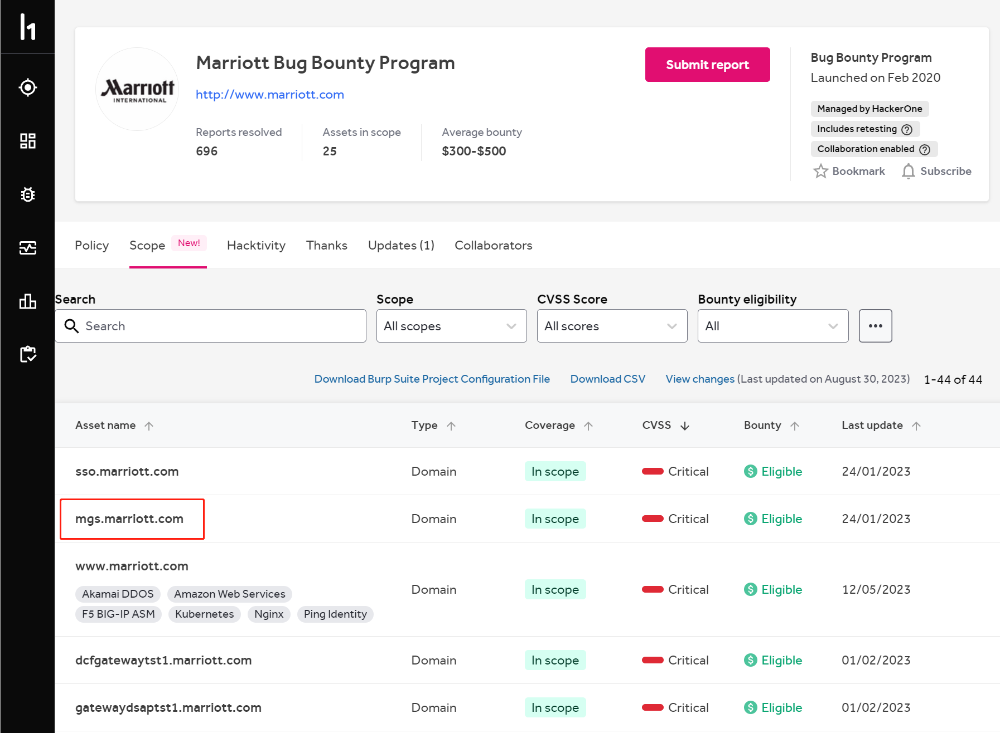

- AWVS扫描结果
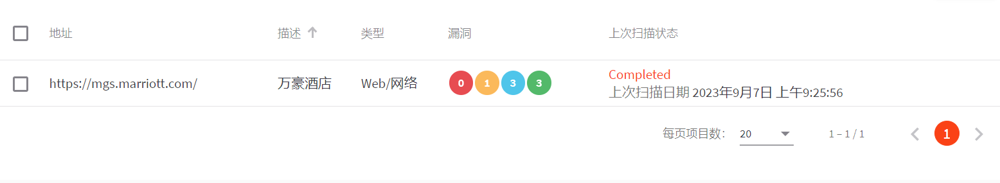
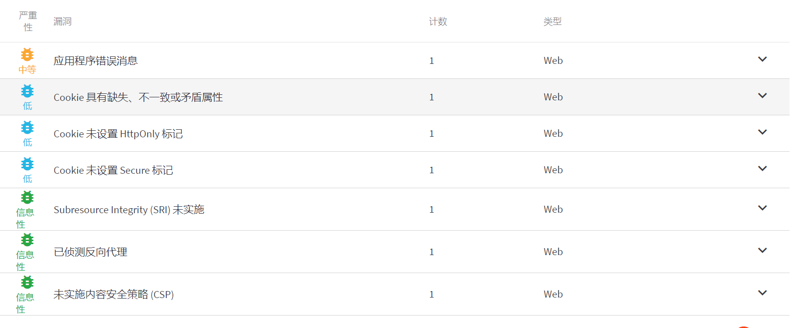

- Xray（被动扫描结果）
<a href="./xray_wanhao_report.html">Marriott被动扫描结果</a>
- 扫描报告位于同文件夹的xray_wanhao_report.html文件

- 区别：没太看懂，xray的扫出来的漏洞基本都是baseline/sensitive/server-error类型的，大概是关于敏感信息泄露的漏洞

# 作业二
使用Nessus扫描任意主机，要求使用全端口扫描，提供主机扫描报告

- 主机扫描报告：
<a href="./hostscan.html">本地虚拟机主机扫描结果</a>
- 扫描报告位于同文件夹的hostscan.html文件
- 备注：扫描了本地虚拟机，虚拟机中开启了dvma

# 作业三
- 安装 Burp，分别在本机上实现全局代理和局部代理，提供设置过程的说明文档；
  - 火狐浏览器的代理（局部代理）：
    - 设置 -> 常规 -> 网络设置 -> 手动配置代理 -> HTTP:127.0.0.1 -> 端口(p):8080
  - 全局代理(Windows 11)：
    - 电脑设置 -> 网络和Internet -> 代理 -> 手动设置代理 -> 地址：127.0.0.1 ，端口号：8080

# 作业四

- Burp实现对HTTPS站点抓包
- 对百度进行搜索，观察百度搜索关键字的过程
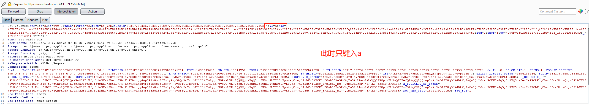
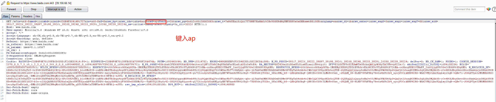
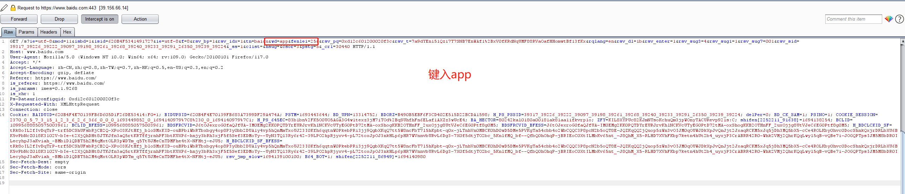
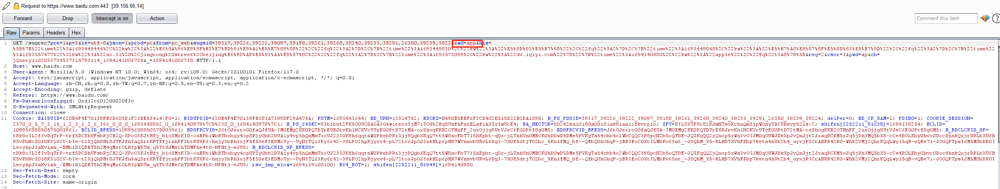 每个字符会发送两个请求包
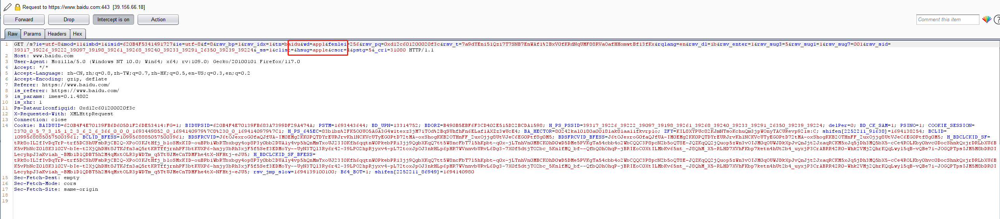
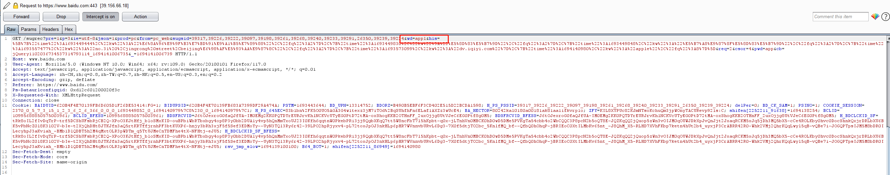
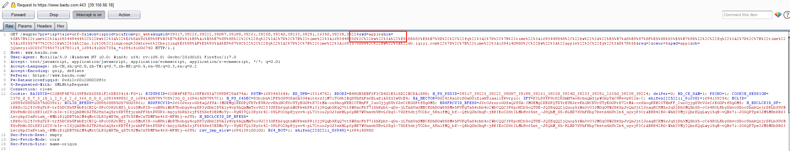
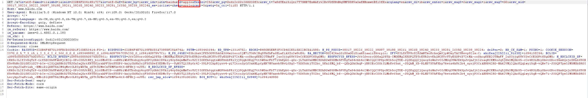
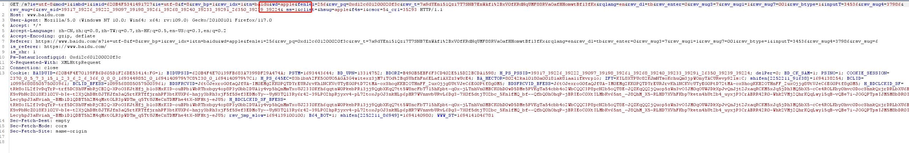
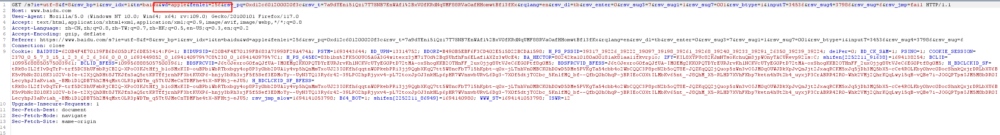
...

- 总结 
  - 百度在搜索关键字的时候，在键入关键字点击搜索之前已经发起了单个字符的请求，比如键入apple，每输入一个字符，就会伴随两个请求数据包的发出a -> ap -> app -> appl -> apple，每多一个字符，是发送两个请求包！
