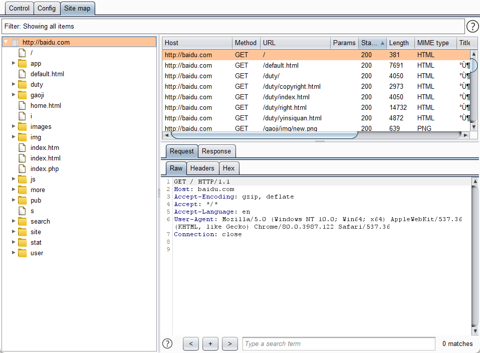
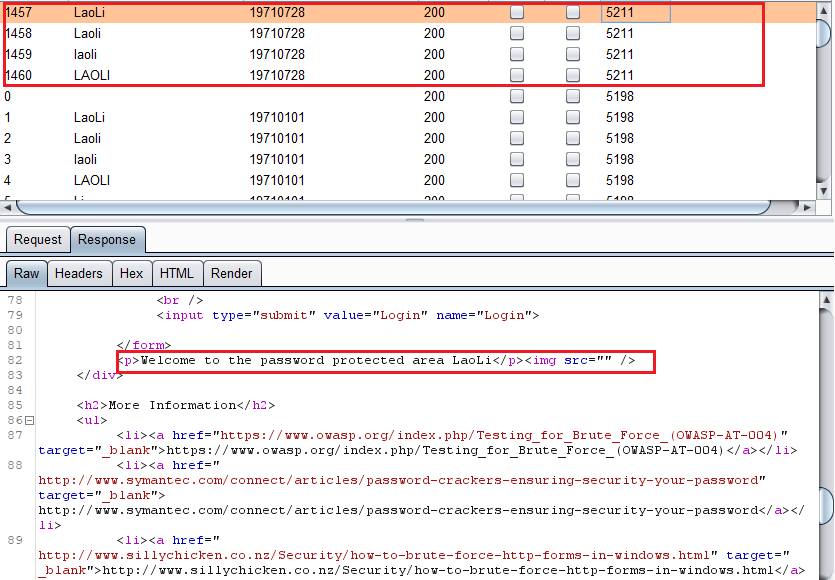
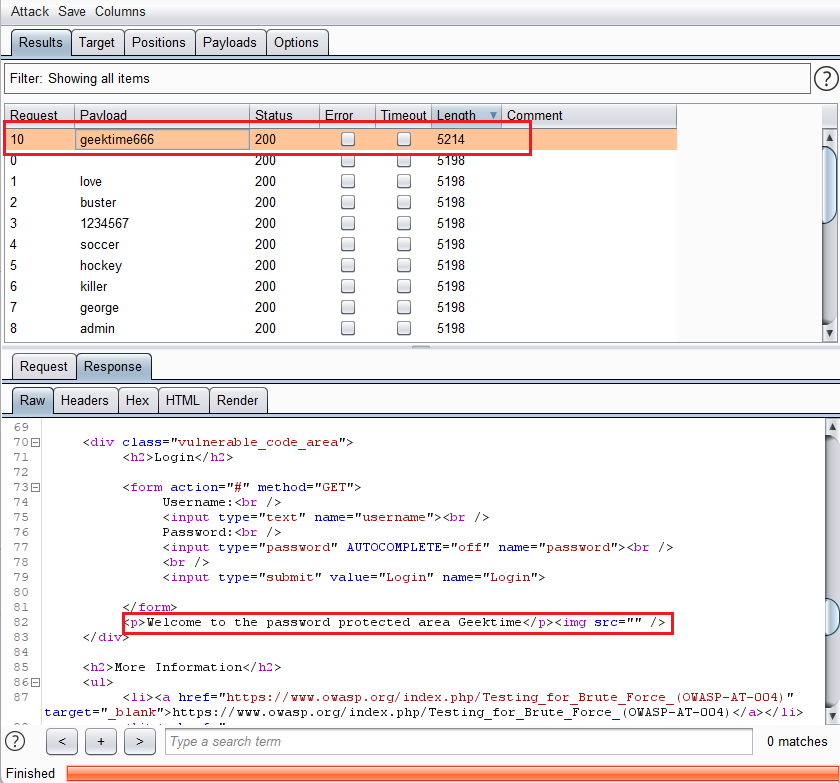

# 作业1 
- 使用Burp的Discover Content功能爬取任意网站目录
  - 爬取过程：（baidu.com）
    - 配置好浏览器和burp的ip端口设置
    - 用浏览器打开baidu.com
    - 在target模块的sitemap中，找到baidu的目录
    - 右键 -> Engagement tools -> Discover Content, 进入Discover Content页面
    - 点击control下的Session is not running, 进行目录爬取
  - 站点树截图：
  

# 作业2
- 使用Burp Scan的主动扫描和被动扫描功能对DVWA站点进行扫描，输出扫描报告
  - <a href="./DVWA主动扫描">主动扫描报告</a>（同目录下主动扫描报告文件）
  - <a href="./DVWA被动扫描">被动扫描报告</a>（同目录下被动扫描报告文件）

# 作业3 爆破题目
## 老李的账号密码

## Geektime的正确密码及字典文件的位置
- 字典位置：http://121.196.62.22:8082/geekbang.txt

# 作业4
- 在不依赖于 DVWA 后端数据库的情况，如何通过前端验证的方法判断 DVWA 中的注入点是数字型注入还是字符型注入？
  
- 解析：
  - 情况一：该网站对于输入字段不做任何处理
    - 输入1',看程序是否报错，如果报错，则
      - 可能性1：服务器将这个输入字段当作SQL语句执行（大概率）
      - 可能性2：程序本身可能存在问题
    - 输入1 and 1 = 1，如果语句正常执行，但是1 and 1 = 2 虽然也执行，但返回结果与1 and 1 = 1 不同，基本可以判定，and 1 = ? 这个逻辑运算被识别，且进行了执行，进而得出是SQL语句
    - 如果该语句是字符型注入，那么'1 and 1=1' 和 '1 and 1 = 2' 作为不可能是查询结果的长字符串，应该返回结果是相同的,同时输入`1' or 1 = 1 #` 应该能够成功执行，并返回该表单查询列的所有数据
    - 如果是数字型注入，则且网站没有经过处理，则输入`1' or 1 = 1 #`，语句会报错

  - 情况二：如果网站对于输入字段添加了引号，使其转变成字符串
    - 输入 1 and 1 = 1 
      - 如果是数字型，则会发生隐式转换，转换后，等价于直接输入1
      - 如果是字符型，则不会发生隐式转换，按照长字符串的值，进行sql查询