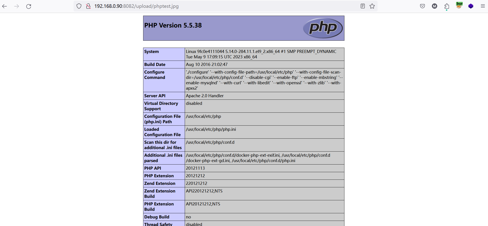
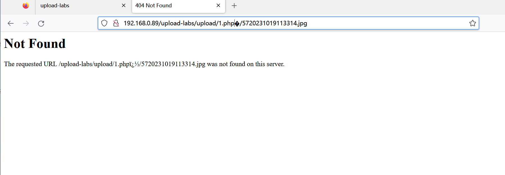
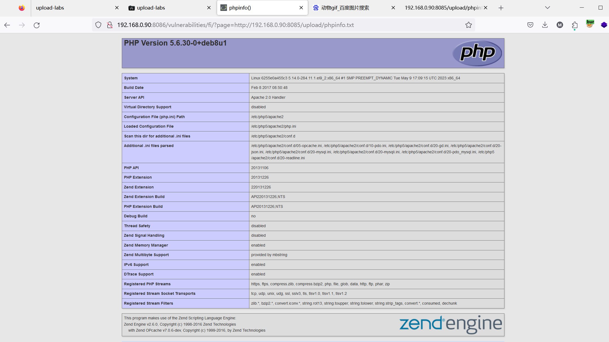

## 作业1：文件上传
### 客户端绕过


### 服务端黑名单绕过：.htaccess文件绕过
- .htaccess代码
```
<FilesMatch "phptest.jpg">
    SetHandler application/x-httpd-php
</FilesMatch>
```
- phptest.jph
```php
<?php phpinfo();
```
- 依次上传后即可成功


### 服务端白名单绕过：%00截断绕过，要求虚拟机中搭建实验环境，分别实现GET、POST方法绕过
- GET方法绕过



- 删掉.php后面的字符

- 成功绕过 ~~~

- POST方法绕过

- 手动解码

- 成功上传


- 删掉.php后面的字符

- 成功绕过~~~

### 二次渲染绕过


## 作业2：文件包含
### DVWA环境下包含其他目录的任意3个文件，要求使用相对路径


### 远程文件包含
- 靶机：DVWA (192.168.0.90:8086)
- 远程服务器：upload-labs (192.168.0.90:8085)

### 中间件日志包含绕过，要求使用蚁剑连接成功
- 更改目录及文件权限

- 使用burp更改编码后的url


- 访问apache日志文件
- 
- 使用蚁剑链接
