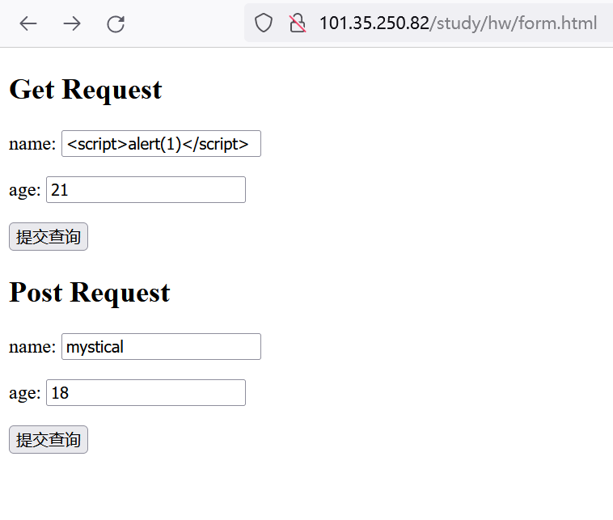
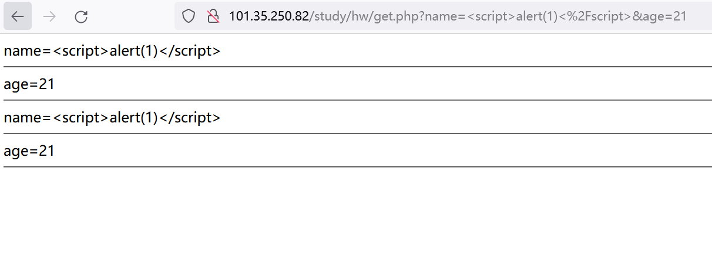
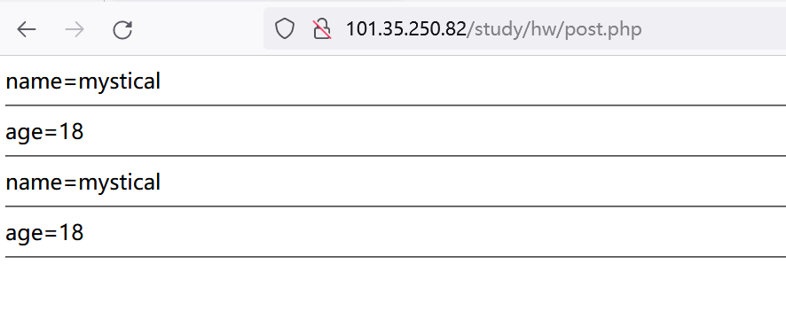

## 作业1和作业3
- 表单form.html
```html
<!DOCTYPE html>
<html lang="en">
<head>
    <meta charset="UTF-8">
    <meta name="viewport" content="width=device-width, initial-scale=1.0">
    <title>Document</title>
</head>
<body>
    <form action="get.php" method="get">
        <h2>Get Request</h2>
        <p>name: <input type="text" name="name" placeholder="input your name"></p>
        <p>age: <input type="text" name="age" placeholder="input your age"></p>
        <p><input type="submit"></p>
    </form>
    <form action="post.php" method="post">
        <h2>Post Request</h2>
        <p>name: <input type="text" name="name" placeholder="input your name"></p>
        <p>age: <input type="text" name="age" placeholder="input your age"></p>
        <p><input type="submit"></p>
    </form>
</body>
</html>
```
- get.php
```php
<?php
foreach ($_GET as $key => $value) {
    echo $key."=".htmlspecialchars($value)."<hr/>";
}

for ($i = 0, $count = count($_GET); $i < $count; $i++)
{
    echo key($_GET)."=".htmlspecialchars($_GET[key($_GET)])."<hr/>";
    next($_GET);
}
?>
```
- post.php
```php
<?php
foreach ($_POST as $key => $value) {
    echo $key."=".htmlspecialchars($value)."<hr/>";
}

for ($i = 0, $count = count($_POST); $i < $count; $i++)
{
    echo key($_POST)."=".htmlspecialchars($_POST[key($_POST)])."<hr/>";
    next($_POST);
}
?>
```

- get.php
  


- post.php



## 作业2
```php
<?php
function printCount(int $count): void
{
    $i = 0;
    while (++$i) {
        echo "Outer\n";
        while (1) {
            echo "Middle\n";
            while (1) {
                echo "Inner\n";
                if ($i == $count) {
                    break 3;
                }
                continue 3;
                
            }
            echo "This never gets output.\n";
        }
        echo "Neither does this.\n";
    }
}

printCount(4); // 打印n次
```