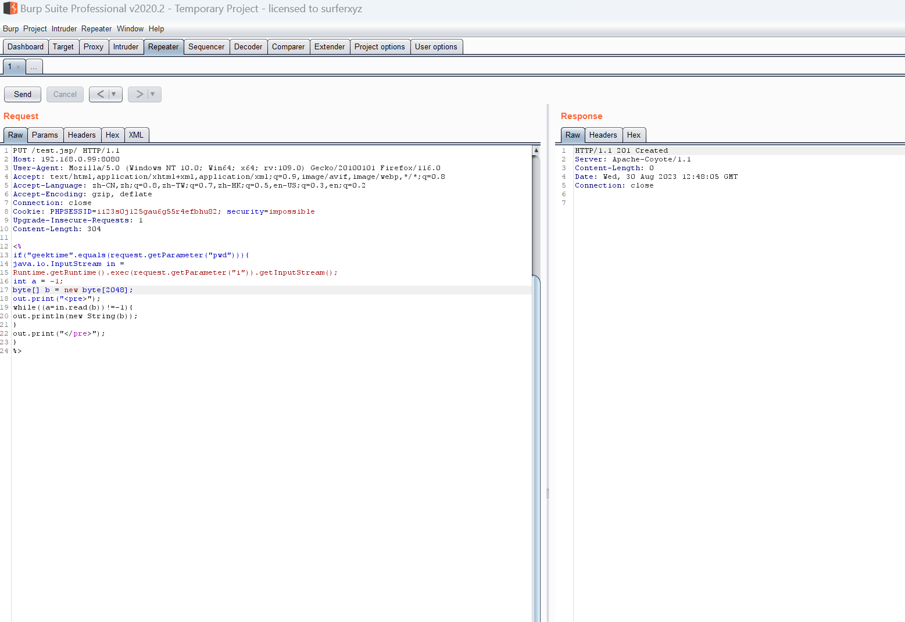
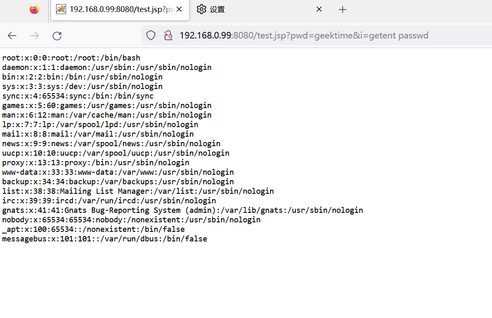
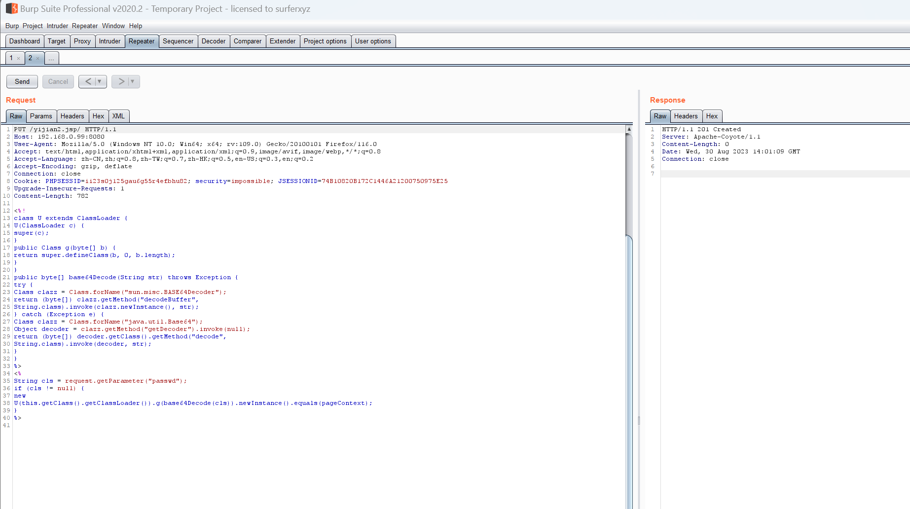
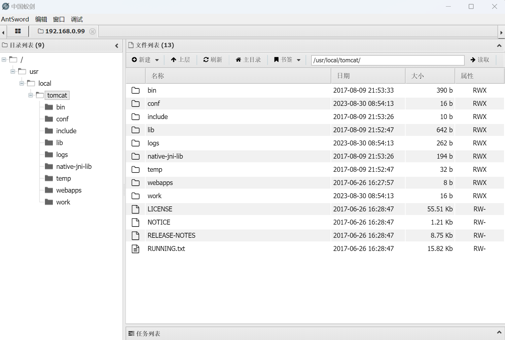
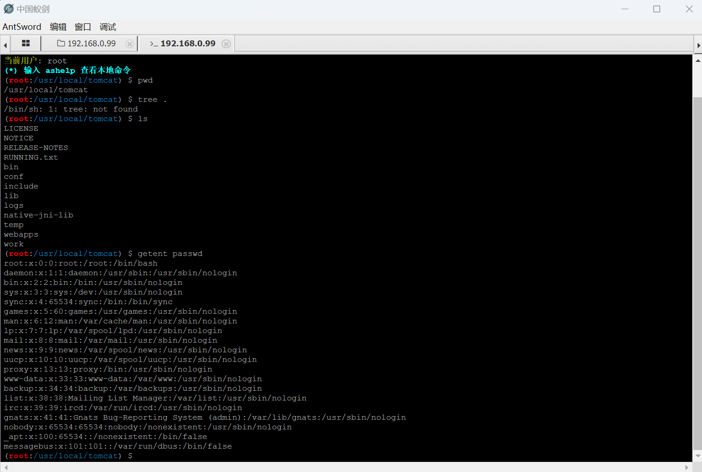
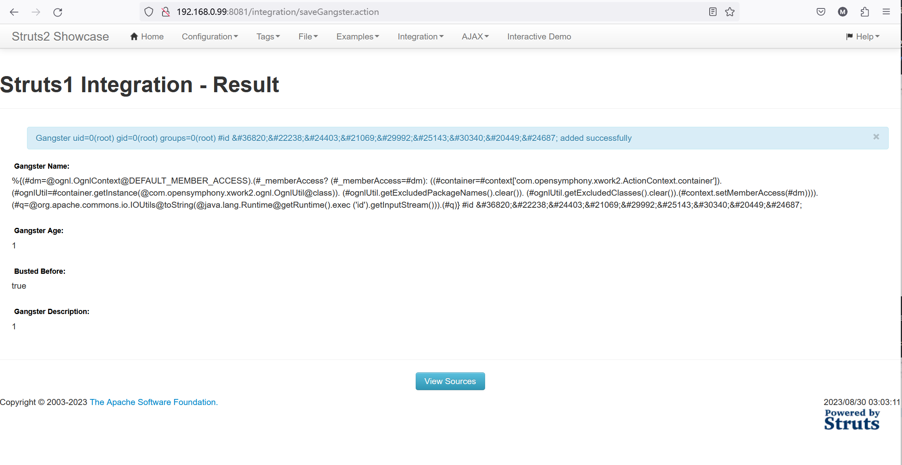
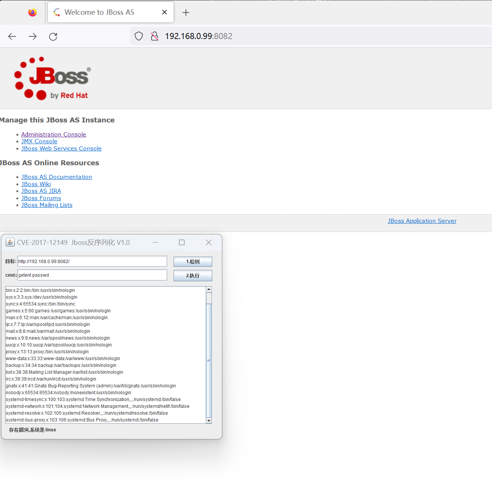
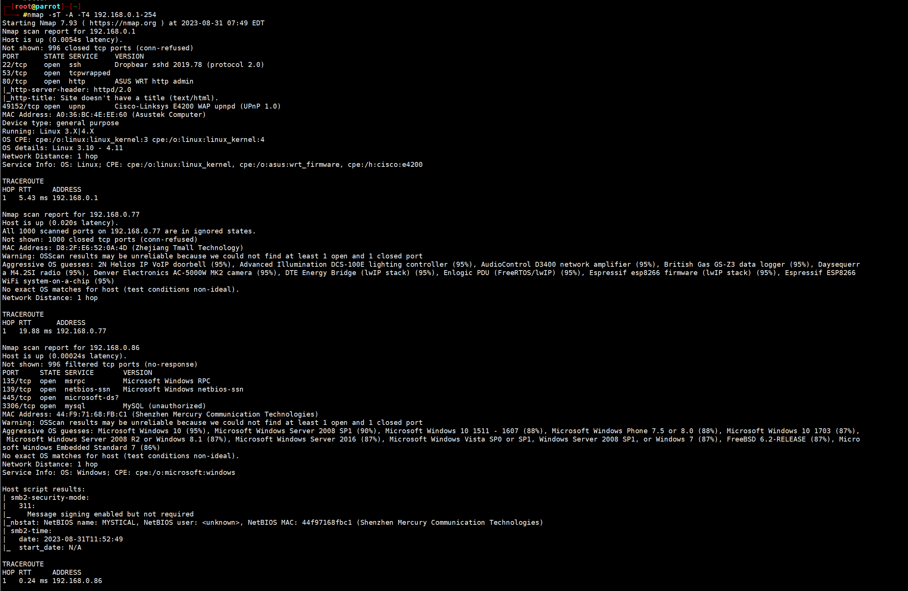

- Tomcat PUT 方法任意写文件漏洞（CVE-2017-12615）
  

-  Tomcat PUT 方法任意写文件漏洞（CVE-2017-12615）—— 御剑
  

- S2-048 远程代码执行漏洞（CVE-2017-9791）

- JBoss 5.x/6.x 反序列化漏洞（CVE-2017-12149）

- nmap扫描家庭局域网

  
  - 其中有扫描到了家庭路由，小米净水器，天猫精灵，一台安卓手机，本机电脑和开启的虚拟机（有两台苹果手机未扫描到，但是后来添加-P0 -T1,成功扫描到）

  

