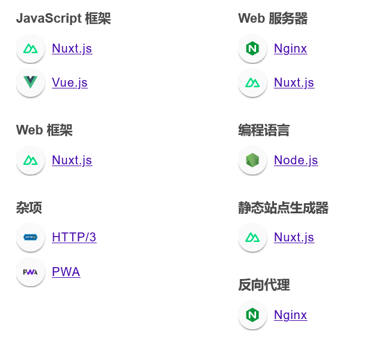

# 信息收集报告
## 概述
- 目标：爱奇艺
- 报告日期：2023/09/01
- 负责人：张艺峰

## 目录
- 域名和子域名信息
- IP地址
- WHOIS信息
- DNS信息
- 开放端口和服务
- 应用程序信息
- 邮箱和联系信息
  
## 域名和子域名
- 域名：
  - https://www.iqiyi.com/
  - 
  - http://www.iqiyizhishi.com
- 子域名：
  - m.iqiyi.com(爱奇艺官网同网页)
    - 同主页其他服务域名
      - 太多了，略
  - docs.iqiyi.com（爱奇艺云文档）
    - doc.iqiyi.com
    - ip:CDN
    - 
  - static.iqiyi.com(空白网页)
    - ip:CDN
  - home.iqiyi.com转移至内网
    - 同地址域名
      - chat.iqiyi.com	
    - 内网域名；reliao.qiyi.domain/chat/（提示需要VPN进入）
  - crm.iqiyi.com
    - 同网页域名
      - sso.iqiyi.com
    - ip:CDN
    - 
  - live.iqiyi.com（爱奇艺直播）
    - ip:CDN
    - 
  - careers.iqiyi.com（爱奇艺招聘网站）
    - 同网页域名：
      - campus.iqiyi.com
    - ip:CDN
    - 
  - ckm.iqiyi.com(nginx)
    - transfer.iqiyi.com
    - ip:CDN
    - 
  - ticket.iqiyi.com(json数据原始数据及请求头)
    - 
  - report.iqiyi.com
    - ip：真实IP：118.26.96.23
    - nmap报告（端口及版本信息）
      - 
  - mall.iqiyi.com（页面升级中）
    - ip：CDN 
    - JavaScript 库
      - jQuery 1.7.2
  - 2012.iqiyi.com/（以前的伦敦奥运特制网页）
    - ip:CDN
    - 
  - mp.iqiyi.com/(爱奇艺IQ号)
    - ip:CDN
    - 
  - re-zero.iqiyi.com(爱奇艺和天象互动合作游戏)
    - 《re:从零开始的异世界生活-infinity》官网-无尽的爱与挑战
    - ip:真实ip:116.211.198.190
    - nmap:
      - 
    - 
  - union.iqiyi.com（爱奇艺-联盟）
    - ip:CDN（还好看了下whois……，全球同一IP）
  - libra.iqiyi.com
    - ip:CDN(全球统一ip)
    - 
  - asset.iqiyi.com(爱奇艺数字资产库)
    - ip:CDN(全球统一ip)
    - 大致同上
    - 
  - privacy.iqiyi.com（爱奇艺隐私保护中心）
    - ip:CDN
    - 
  - invoice.iqiyi.com(发票申请入口？)
    - ip:CDN
  - http://ibc.iqiyi.com(合作伙伴管理平台)
    - ip:CDN
    - 
  - adx.iqiyi.com (xchange服务平台)
    - 真实ip：103.44.58.191
    - whois:
      - 
    - nmap
      - 
    - 
  - http://showtime.iqiyi.com(项目管理平台)
    - ip:CND
    - 

## WHOIS信息
- 企业名称：北京爱奇艺科技有限公司
  - 曾用名：北京新联信德广告传媒有限公司（2007-03 至 2012-05）
  - 法定代表人：耿晓华（持股比例100%）
  - 电话：010-62677171
  - 邮箱
    - zhangzhuoman@qiyi.com(2022年报)
    - duying01@qiyi.com(2020年报)
    - wuchen@qiyi.com(2019年报)
    - lixiaoxiao01@qiyi.com(2018年报)
    - tiaoxiaobo@qiyi.com(2016年报)
    - maryhuang@qiyi.com(2015年报)
    - Edison@qiyi.com（？？？）
  - 官网：https://www.iqiyi.com/
  - 人员规模：998（2022年）

- 企业分公司：北京爱奇艺互联科技有限公司
  - 法定代表人：龚宇
  - 成立时间；2019年
  - 电话：010-62677171
  - 邮箱：
    - zhangzhuoman@qiyi.com(2022年报)
    - duying01@qiyi.com(2020年报)
    - wuchen@qiyi.com(2019年报)
  - 参保人：223人（2022年报）

- 企业分公司：北京爱奇艺新媒体科技有限公司
  - 法定代表人：龚宇
  - 成立时间：2017年
  - 邮箱：zhangzhuoman@qiyi.com
  - 参保人：1人？？
  - 股东：爱奇艺电影集团香港有限公司（100%占股）

- 企业分公司：北京爱奇艺智慧娱乐科技有限公司
  - 法定代表人：杨向华
  - 成立时间：2017年
  - 电话；010-62677171
  - 邮箱：
    - zhangzhuoman@qiyi.com(2022年报)
    - duying01@qiyi.com(2020年报)
    - wuchen@qiyi.com(2019年报)
  - 股东：杨向华（50%）龚宇（50%）

- 企业分公司：北京爱奇艺知识科技有限公
  - 法定代表人：周柳青
  - 成立时间：2021年
  - 电话：010-62983789
  - 邮箱：liuyane@qiyi.com
  - 官网：www.iqiyizhishi.com
  - 参保人：3人？
  - 股东：北京遍知教育科技有限公司（占股100%）

- 企业分公司：京爱奇艺科技有限公司上海分公司
  - 成立时间：2012年
  - 负责人：吴刚
  - 电话：021-54519520
  - 邮箱：xihaisheng@qiyi.com
  - 人员规模：50人（2022年）

- 企业分公司：北京爱奇艺科技有限公司上海长宁分公司
  - 成立时间2018年
  - 负责人：吴刚
  - 电话：021-54519520
  - 邮箱：peiyingfei@qiyi.com
  - 人员规模：188（参保）(22年报)

- 企业分公司：北京爱奇艺科技有限公司重庆分公司
  - 成立时间：2013年
  - 负责人：杨海涛
  - 电话：010-62677171
  - 邮箱：
    - zhangzhuoman@qiyi.com(2022年报)
    - duying01@qiyi.com(2020年报)
    - wuchen@qiyi.com(2019年报)
    - lixiaoxiao01@qiyi.com(2018年报)
    - tiaoxiaobo@qiyi.com(2016年报)
    - maryhuang@qiyi.com(2015年报)
  - 人员规模：690（2022年）

- 企业分公司：北京爱奇艺科技有限公司深圳分公司
  - 成立时间：2016年
  - 负责人：段有桥
  - 电话：010-62677171
  - 邮箱：
    - copyright@qiyi.com (2022年报)
    - zhangzhouman@qiyi.com(2021年报)
    - duying01@qiyi.com(2020年报)
    - wuchen@qiyi.com(2019年报)
    - lixiaoxiao01@qiyi.com(2018年报)

- 企业分公司：北京爱奇艺科技有限公司杭州分公司
  - 负责人：王晓晖
  - 电话：0571-62677171
  - 邮箱：
    -  zhangzhouman@qiyi.com(2022年报)
    - duying01@qiyi.com(2020年报)
  
### 总结
- 官网：
  - https://www.iqiyi.com/
  - http://www.iqiyizhishi.com
- 邮箱：
    - copyright@qiyi.com (2022年报)
    - zhangzhouman@qiyi.com(2021年报)
    - duying01@qiyi.com(2020年报)
    - wuchen@qiyi.com(2019年报)
    - lixiaoxiao01@qiyi.com(2018年报)
    - tiaoxiaobo@qiyi.com(2016年报)
    - maryhuang@qiyi.com(2015年报)
    - Edison@qiyi.com（总公司最早邮箱）
    - liuyane@qiyi.com
    - xihaisheng@qiyi.com
