# web架构介绍

## 单机房架构

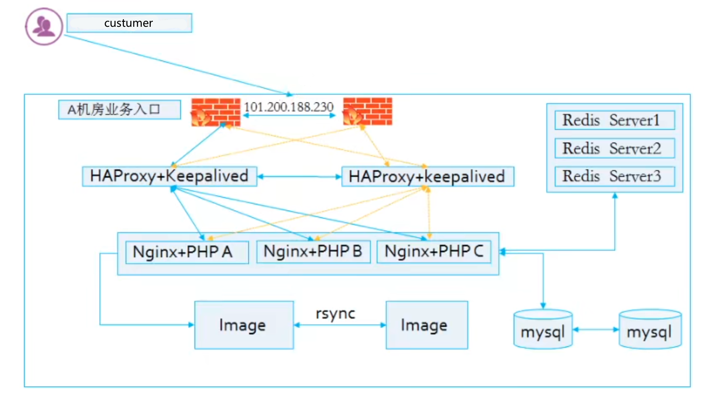


## 多机房架构

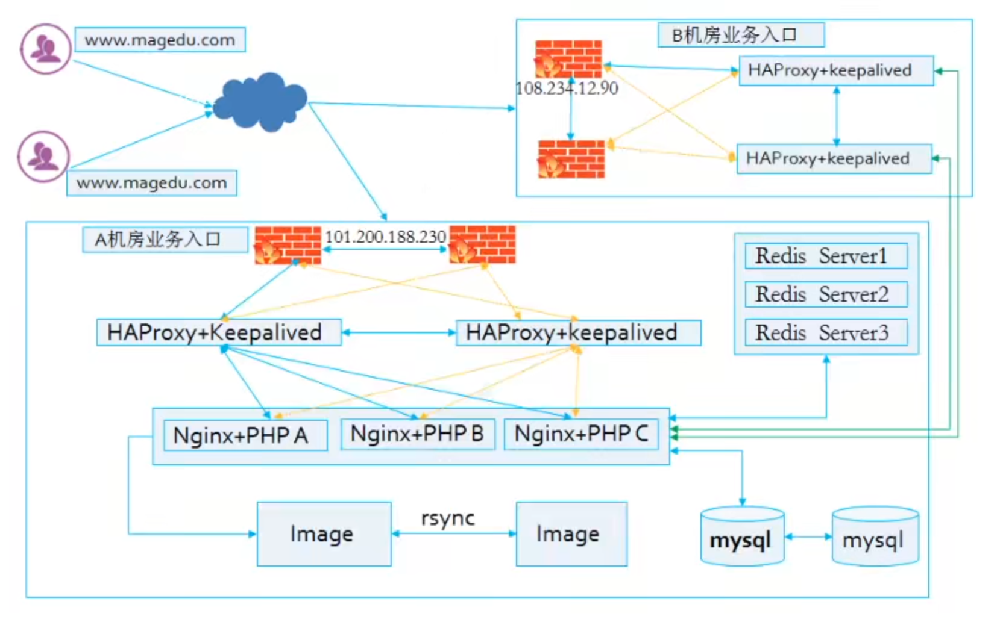

```ABAP
Tips1：绿色是运营商专线，需要花钱，目的是打通A机房和B机房的网络，使其可以直接通信（由网络工程师配置好静态路由）

Tips2：这里使用DNS解析多个IP，从而实现DNS级别的高可用保障，配合商用产品做健康性检测（一年几万），一但其中一个IP所在机房被攻击或出故障，健康性检测失败，DNS自动不会解析过去，而是解析到其他没问题的IP
```


## 公有云架构

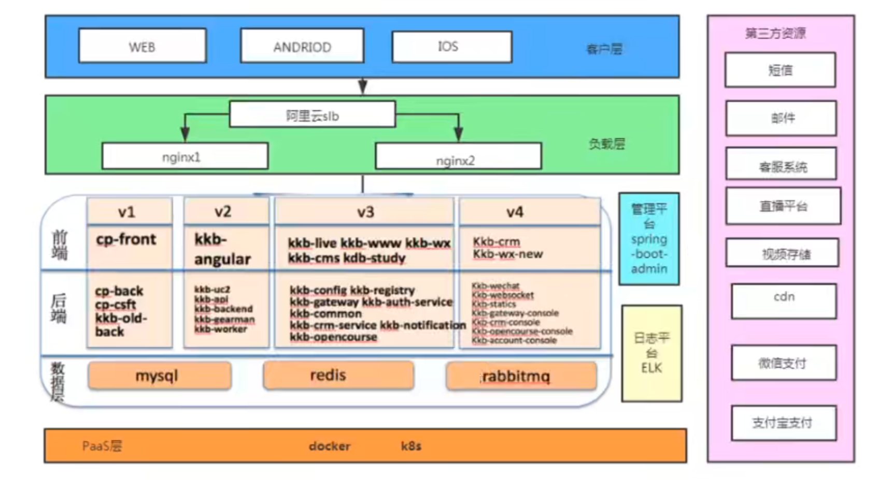


## 私有云架构

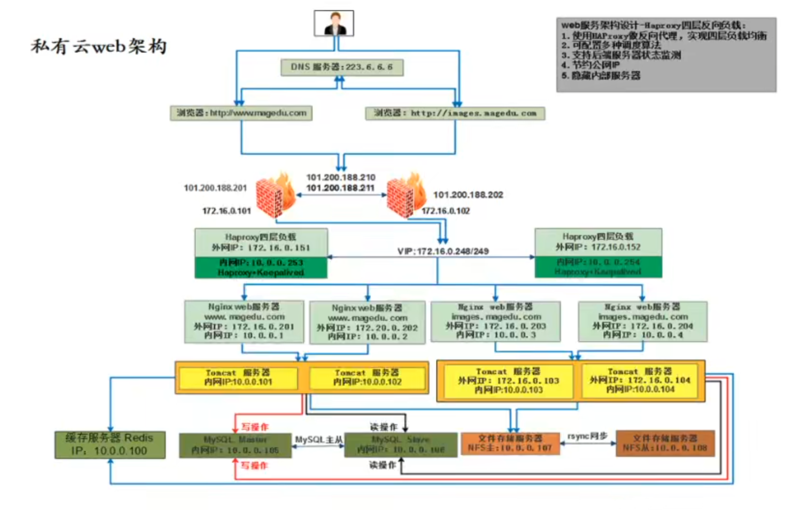


# 负载均衡简介

负载均衡（Load Balance，简称LB）是一种服务或基于硬件设备等实现的高可用反向代理技术，负载均衡将特定的业务（Web服务，网站流量等）分担给指定的一个或多个后端特定的服务器或设备，从而提高了公司业务的并发处理能力，保证了业务的高可用性、方便了业务后期的水平动态扩展

阿里云SLB介绍：https://developer.aliyun.com/article/1803

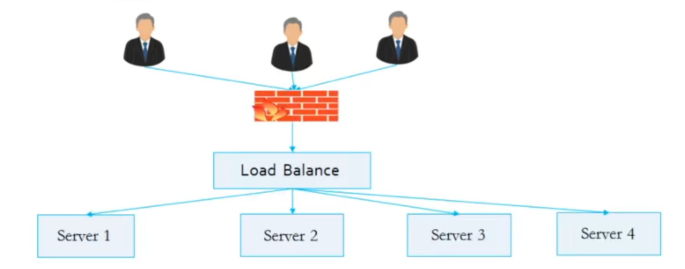


## 负载均衡类型

**四层**

```bash
LVS (Linux Virtual Server)
HAProxy (High Availability Proxy)
Nginx (1.9)
```

**七层**

```bash
HAProxy
Nginx
```

**硬件**

```bash
F5         # https://f5.com/zh
Netscaler  # https://www.citrix.com.cn/products/citrix-abc/
Array      # https://www.arraynetworks.com.cn/
深信服      # https://www.sangfor.com.cn/
北京灵州     # https://www.lingzhou.com.cn/cpzx/llfzjh/
```


## HAProxy介绍

HAproxy是法国开发者 威利塔罗(Willy Tarreau)在2000年使用C语言开发的一个开源软件，是一款具备高并发（一万以上），高性能的TCP和HTTP负载均衡器，支持基于cookie的持久性，自动故障切换，支持正则表达式及web状态统计，目前最新LTS版本为**3.0.10**

截图时间2025-05-02

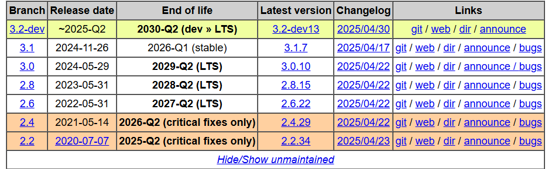


### HAProxy功能

**支持的功能**

- TCP和HTTP反向代理
- SSL/TSL服务器
- 可以针对HTTP请求添加cookie，进行路由后端服务器
- 可平衡负载至后端服务器，并支持持久连接
- 支持所有主服务器故障切换至备用服务器
- 支持专用端口实现监控服务
- 可以在双向添加，修改或删除HTTP报文首部
- 响应报文压缩
- 支持基于Pattern实现连接请求的访问控制
- 通过特定的URI为授权的用户提供详细的状态信息


**不具备的功能**

- 正向代理：squid，nginx
- 缓存代理：varnish，nginx
- web服务：nginx，tengine，apache，tomcat
- 单机性能：小于LVS，大于Nginx


# HAProxy安装及基础配置

介绍HAProxy的基础安装及基础配置

## Ubuntu安装

```http
https://haproxy.debian.net/#distribution=Ubuntu&release=jammy&version=3.0
```

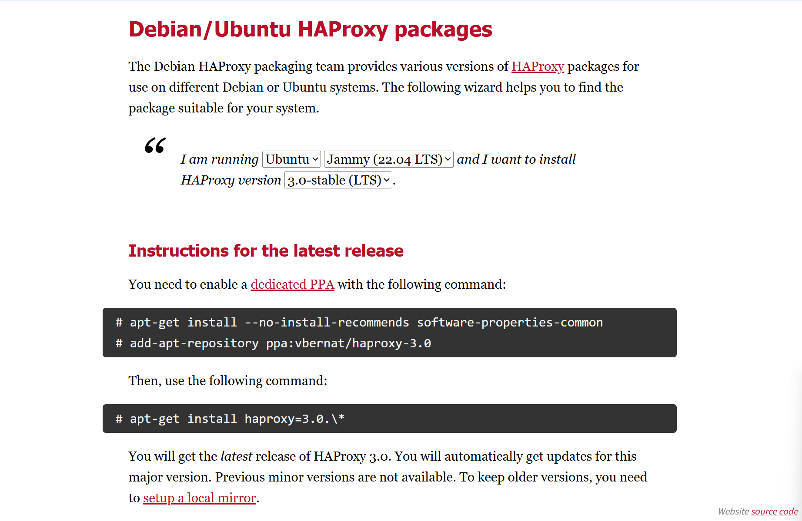


```bash
# 配置仓库
[root@ubuntu2204 ~]# apt-get install --no-install-recommends software-properties-common
[root@ubuntu2204 ~]# add-apt-repository ppa:vbernat/haproxy-3.0

# 查看所有版本
[root@ubuntu2204 ~]# apt-cache madison haproxy
   haproxy | 3.0.10-1ppa1~jammy | https://ppa.launchpadcontent.net/vbernat/haproxy-3.0/ubuntu jammy/main amd64 Packages
   haproxy | 2.4.24-0ubuntu0.22.04.2 | http://mirrors.aliyun.com/ubuntu jammy-security/main amd64 Packages
   haproxy | 2.4.24-0ubuntu0.22.04.2 | http://mirrors.aliyun.com/ubuntu jammy-updates/main amd64 Packages
   haproxy | 2.4.14-1ubuntu1 | http://mirrors.aliyun.com/ubuntu jammy/main amd64 Packages
   haproxy | 2.4.14-1ubuntu1 | http://mirrors.aliyun.com/ubuntu jammy/main Sources
   haproxy | 2.4.24-0ubuntu0.22.04.2 | http://mirrors.aliyun.com/ubuntu jammy-security/main Sources
   haproxy | 2.4.24-0ubuntu0.22.04.2 | http://mirrors.aliyun.com/ubuntu jammy-updates/main Sources


# 下载3.0版本的HAProxy
[root@ubuntu2204 ~]# apt-get install haproxy=3.0.\*

# 查看配置文件
[root@ubuntu2204 ~]# ls /etc/haproxy/haproxy.cfg 
/etc/haproxy/haproxy.cfg

# 启用haproxy
[root@ubuntu2204 ~]# systemctl restart haproxy

# 查看进程
[root@ubuntu2204 ~]# ps -ef |grep haproxy
root        3025       1  0 18:53 ?        00:00:00 /usr/sbin/haproxy -Ws -f /etc/haproxy/haproxy.cfg -p /run/haproxy.pid -S /run/haproxy-master.sock
haproxy     3027    3025  0 18:53 ?        00:00:00 /usr/sbin/haproxy -Ws -f /etc/haproxy/haproxy.cfg -p /run/haproxy.pid -S /run/haproxy-master.sock
root        3038    1262  0 18:54 pts/0    00:00:00 grep --color=auto haproxy
```


## CentOS安装

### 默认yum源

默认的base仓库中包含haproxy的安装包文件，但是版本比较旧，是1.5.18的版本，距离当前版本已经有较长时间没有更新，由于版本比较旧，所以有很多功能不支持，如果对功能和性能没有要求可以使用此版本，否则推荐使用新版本

```bash
[root@ubuntu2204 ~]# yum install -y haproxy

# 验证haproxy版本
[root@ubuntu2204 ~]# haproxy -v
```


### 第三方安装包

https://pkgs.org/download/haproxy  下载rpm包

**下载依赖repo**

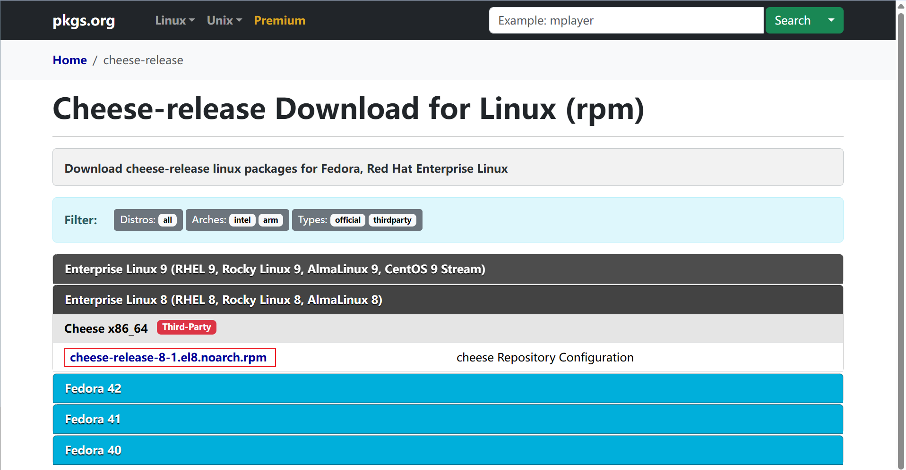

**下载Haproxy的rpm包**

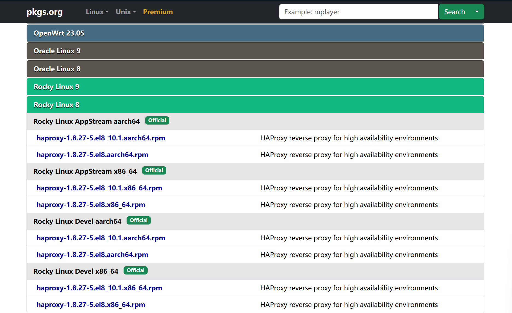

```bash
# cheese-release用于解决依赖关系
[root@localhost ~]# wget http://www.nosuchhost.net/~cheese/fedora/packages/epel-8/x86_64/cheese-release-8-1.el8.noarch.rpm
[root@localhost ~]# yum install -y ./cheese-release-8-1.el8.noarch.rpm 

# 本质上是部署了一个yum repo
[root@localhost ~]# ls /etc/yum.repos.d/
cheese.repo                  Rocky-Media.repo
Rocky-AppStream.repo         Rocky-NFV.repo
Rocky-BaseOS.repo            Rocky-Plus.repo
Rocky-Debuginfo.repo         Rocky-PowerTools.repo
Rocky-Devel.repo             Rocky-ResilientStorage.repo
Rocky-Extras.repo            Rocky-RT.repo
Rocky-HighAvailability.repo  Rocky-Sources.repo

# 点击查看Rocky Linux9
[root@ubuntu2204 ~]# wget https://dl.rockylinux.org/pub/rocky/8/AppStream/x86_64/os/Packages/h/haproxy-1.8.27-5.el8.x86_64.rpm

# 安装haproxy之前必须安装cheese-release，因为它提供了haproxy所需依赖的软件源
[root@ubuntu2204 ~]# rpm -ivh haproxy-2.4.22-3.el9_5.1.x86_64.rpm
[root@ubuntu2204 ~]# yum install -y haproxy-2.4.22-3.el9_5.1.x86_64.rpm
```


## 编译安装HAProxy

编译安装HAProxy 3.0 LTS版本，更多源码包下载地址：http://www.haproxy.org/download/


### 解决lua环境

HAProxy 支持基于lua实现功能扩展，lua是一种小巧的脚本语言，于1993年由巴西里约热内卢天主教大学（Pontifical Catholic University of Rio de Janeiro）里的一个研究小组开发，其设计目的是为了嵌入应用程序中，从而为应用程序提供灵活的扩展的定制功能

```http
https://www.lua.org/download.html
```

```bash
[root@ubuntu2204 src]# curl -L -R -O https://www.lua.org/ftp/lua-5.4.7.tar.gz
[root@ubuntu2204 src]# tar zxf lua-5.4.7.tar.gz
[root@ubuntu2204 src]# cd lua-5.4.7
[root@ubuntu2204 src]# make linux
```


### 下载源码包

```http
https://www.haproxy.org/download/3.0/src/
```

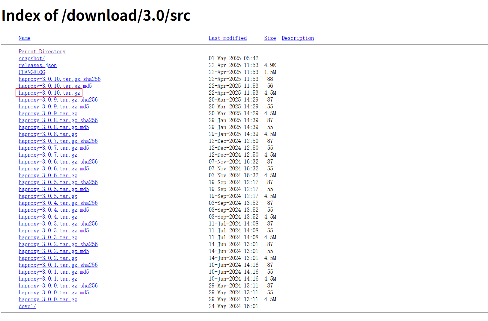

```bash
# 安装编译环境
# CentOS/Rocky
yum install gcc gcc-c++ glibc glibc-devel pcre pcre-devel openssl openssl-devel systemd-devel net-tools vim iotop bc zip unzip zlib-devel lrzsz tree screen lsof tcpdump wget ntpdate

# Ubuntu/Debian
apt update && apt install -y \
  build-essential \
  libpcre3 libpcre3-dev \
  libssl-dev \
  libsystemd-dev \
  libpcre2-dev \
  net-tools \
  vim \
  iotop \
  bc \
  zip unzip \
  zlib1g-dev \
  lrzsz \
  tree \
  screen \
  lsof \
  tcpdump \
  wget \
  ntpdate

[root@ubuntu2204 ~]# wget https://www.haproxy.org/download/3.0/src/haproxy-3.0.10.tar.gz -O /usr/local/src/haproxy-3.0.10.tar.gz
[root@ubuntu2204 ~]#cd /usr/local/src
[root@ubuntu2204 src]#ls
haproxy-3.0.10.tar.gz
[root@ubuntu2204 src]#tar xf haproxy-3.0.10.tar.gz

# 注意这里没有configure，所以直接make即可(选看)
[root@ubuntu2204 haproxy-3.0.10]#ls
addons    BSDmakefile   dev       include  MAINTAINERS  reg-tests  SUBVERS  VERSION
admin     CHANGELOG     doc       INSTALL  Makefile     scripts    tests
BRANCHES  CONTRIBUTING  examples  LICENSE  README       src        VERDATE

# 查看INSTALL（选看）
......
Areas covered in this document
==============================

1) Quick build & install
2) Basic principles
3) Build environment
4) Dependencies
5) Advanced build options
6) How to install HAProxy

......
1) Quick build & install
========================

If you've already built HAProxy and are just looking for a quick reminder, here
are a few build examples :

  - recent Linux system with all options, make and install :
    $ make clean
    $ make -j $(nproc) TARGET=linux-glibc \
           USE_OPENSSL=1 USE_QUIC=1 USE_QUIC_OPENSSL_COMPAT=1 \
           USE_LUA=1 USE_PCRE2=1 
    $ sudo make install
......
4.7) Lua
......
If Lua is not provided on your system, it can be very simply built locally. It
can be downloaded from https://www.lua.org/, extracted and built, for example :

  $ cd /opt/lua-5.4.6
  $ make linux

The path to the include files and library files may be set using "LUA_INC" and
"LUA_LIB" respectively. For example :

  $ make TARGET=generic \
    USE_LUA=1 LUA_INC=/opt/lua-5.4.6/src LUA_LIB=/opt/lua-5.4.6/src    # 这个指定LUA环境也加上
......
5.1) Configuring the TARGET
---------------------------
To build haproxy, you have to choose your target OS amongst the following ones
and assign it to the TARGET variable :

  - linux-glibc         for Linux kernel 2.6.28 and above       # 可以选择linux-glibc目标OS
  - linux-glibc-legacy  for Linux kernel 2.6.28 and above without new features
  - linux-musl          for Linux kernel 2.6.28 and above with musl libc
  - solaris             for Solaris 10 and above
  - freebsd             for FreeBSD 10 and above
  - dragonfly           for DragonFlyBSD 4.3 and above
  - netbsd              for NetBSD 8 and above
  - osx                 for Mac OS/X
  - openbsd             for OpenBSD 6.3 and above
  - aix51               for AIX 5.1
  - aix52               for AIX 5.2

...... #选择要使用的CPU架构
Some platforms may benefit from some CPU-specific options that will enable
certain instruction sets, word size or endianness for example. One of them is
the common "-march=native" that indicates to modern compilers that they need to
optimize for the machine the compiler is running on. Such options may be either
passed in the CPU_CFLAGS or in the CFLAGS variable, either will work though
one may be more convenient for certain methods of packaging and the other one
for other methods. Among the many possible options, the following ones are
known for having successfully been used:

  - "-march=native" for a native build
  - "-march=armv8-a+crc" for older ARM Cortex A53/A72/A73 (such as RPi 3B/4B)
  - "-march=armv8.1-a" for modern ARM Cortex A55/A76, Graviton2+, RPi 5
  - "-march=armv8-a+crc -moutline-atomics" to support older ARM with better
      support of modern cores with gcc-10+
  - "-mavx", "-mavx2", "-mavx512", to enable certain x86 SIMD instruction sets
  - "-march=i586" to support almost all 32-bit x86 systems
  - "-march=i686" to support only the latest 32-bit x86 systems
  - "-march=i386" to support even the oldest 32-bit x86 systems
  - "-mlittle-endian -march=armv5te" for some little-endian ARMv5 systems
  - "-mcpu=v9 -mtune=ultrasparc -m64" for a 64-bit Solaris SPARC build
  - "-march=1004kc -mtune=1004kc" for some multi-core 32-bit MIPS 1004Kc
  - "-march=24kc -mtune=24kc" for some single-core 32-bit MIPS 24Kc
  
  
# 总结上面的参数，编译命令为
[root@ubuntu2204 haproxy-3.0.10]# make -j 2 TARGET=linux-glibc \
           USE_OPENSSL=1 USE_QUIC=1 USE_QUIC_OPENSSL_COMPAT=1 \
           USER_THREAD=1 \  # 开启多线程
           USE_CPU_AFFINITY=1 \ # 开启CPU绑定
           USE_LUA=1 USE_PCRE2=1 \
           USE_SYSTEMD=1 \
           TARGET=generic \
           USE_LUA=1 LUA_INC=/usr/local/src/lua-5.4.7/src LUA_LIB=/usr/local/src/lua-5.4.7/src \
           LUA_LIB_NAME=lua
           ARCH=x86_64 \
           USE_CPU_AFFINITY=1 \
           PREFIX=/apps/haproxy
           
[root@ubuntu2204 haproxy-3.0.10]# make install PREFIX=/apps/haproxy
[root@ubuntu2204 haproxy-3.0.10]# /apps/haproxy/sbin/haproxy -v
HAProxy version 3.0.10-346eb4f 2025/04/22 - https://haproxy.org/
Status: long-term supported branch - will stop receiving fixes around Q2 2029.
Known bugs: http://www.haproxy.org/bugs/bugs-3.0.10.html
Running on: Linux 5.15.0-52-generic #58-Ubuntu SMP Thu Oct 13 08:03:55 UTC 2022 x86_64
```


### HAProxy启用脚本

```bash
[root@ubuntu2204 haproxy]# cat /lib/systemd/system/haproxy.service 
[Unit]
Description=HAProxy Load Balancer
After=syslog.target network.target

[Service]
ExecStartPre=/apps/haproxy/sbin/haproxy -f /etc/haproxy/haproxy.cfg -c -q
ExecStart=/apps/haproxy/sbin/haproxy -Ws -f /etc/haproxy/haproxy.cfg -p /var/lib/haproxy/haproxy.pid
ExecReload=/bin/kill -USR2 $MAINPID

[Install]
WantedBy=multi-user.target
```


### 配置文件

```bash
# 生产环境真实案例
[root@ubuntu2204 haproxy-3.0.10]#cat /etc/haproxy/haproxy.cfg 
global
maxconn 1000000            # 这里linux的最大描述符数量要配置增大，默认1024,需要配置/etc/security/limits.conf
chroot /usr/local/haproxy
stats socket /var/lib/haproxy/haproxy.sock mode 600 level admin
user haproxy
group haproxy
daemon
#nbproc 4                 # 默认为1，这里最好和CPU核数相同，速度会快非常多
#cpu-map 1 0              # 前面的数字表示第n个进程，后面的数字表示绑定在哪个CPU上，这行表示将进程1绑定在cpu0上
#cpu-map 2 1
#cpu-map 3 2
#cpu-map 4 3
#spread-checks 5
pidfile /var/lib/haproxy/haproxy.pid
log 127.0.0.1 local3 info  # 基于syslog做日志收集


defaults
option http-keep-alive
option forwardfor
maxconn 1000000           # defaults 段的 maxconn 优先级高于 global maxconn，用于限制 frontend/backend 的连接数。

mode http
timeout connect 300000ms
timeout client 300000ms
timeout server 300000ms

listen stats
  mode http
  bind 0.0.0.0:9999
  stats enable
  log global
  stats uri /haproxy-status
  stats auth haadmin:123456

listen web_port
  bind 192.168.7.101:80
  mode http
  log global
  server web1 127.0.0.1:8080 check inter 3000 fail 2 rise 5
```


### 启用HAProxy

```bash
[root@ubuntu2204 haproxy]# mkdir /var/lib/haproxy -p
[root@ubuntu2204 haproxy]# mkdir -p /etc/haproxy
[root@ubuntu2204 haproxy]# vim /etc/haproxy/haproxy.cfg
[root@ubuntu2204 haproxy-3.0.10]#systemctl restart haproxy.service
```


## 基础配置详解

HAProxy的配置文件haproxy.cfg由两大部分组成，分别是global和proxies部分。

**global：全局配置段**

```bash
进程及安全配置相关的参数
性能调整相关参数
Debug参数
```

**proxies：代理配置段**

```bash
defaults: 为frontend，backend，listen提供默认配置
frontend: 前端，相当于nginx中的server {}
backend: 后端，相当于nginx中的upstream {}
listen: 同时拥有前端和后端配置
```


### global配置参数

官方文档

```http
https://cbonte.github.io/haproxy-dconv/2.0/intro.html
```

```bash
chroot       # 锁定运行目录
daemon       # 以守护进程运行
# stats socket /var/lib/haproxy/haproxy.sock mode 600 level admin    # socket文件
user, group, uid, gid  # 运行haproxy的身份
nbproc       # 开启的haproxy进程数，与CPU保持一致，默认是1个，如果是多核CPU,这里一定要指定和CPU数相同
             # nbproc依赖线程支持，必须编译的时候开启USE_THREAD=1
nbthread     # 指定每个haproxy进程开启的线程数，默认为每个进程一个线程
             # 当开启多进程的时候，这里不支持多线程，只有单进程的时候支持多线程
             # 配合CPU绑定：nbthread 4; cpu-map auto:1/1-4 0-3
             # 1/1-4表示1进程的1到4线程，0-3表示绑定到cpu0-3
cpu-map 1 0  # 绑定haproxy进程至指定CPU
maxconn      # 每个haproxy进程的最大并发连接数
             # 注意：FD ≈ nbthread × maxconn + 几百（管理/统计等）
             # 也就是linux上的LimitNOFILE或者ulimit -n值必须大于nbthread × maxconn
maxsslconn   # 每个haproxy进程ssl最大连接数，用于haproxy配置了证书的场景下
maxconnrate  # 每个进程每秒创建的最大连接数，这个值最好不做限制

spread-checks # 后端server状态check随机提前或延迟百分比时间，建议2-5（2%-5%）之间
pidfile       # 指定pid文件路径
log 127.0.0.1 local3 info  # 定义全局的syslog服务器，最多可以定义两个
```

#### 补充1：最佳实践nbthread + cpu-map

**✅ 线程共享内存结构（连接池、监听 FD、缓存）**

在多线程模式下：

- 所有线程运行在 **同一个进程地址空间**
- 能够共享：
  - listener sockets（监听端口）
  - connection pool（连接池）
  - session table（会话状态）
  - DNS/cache/resolvers
  - SSL session cache
- 这样可以避免重复建立监听端口、重复解析域名等操作。

👉 **节省内存 + 减少 IO 争抢 + 提高命中率**


**✅ CPU 绑定避免线程上下文切换**

如果你不绑定 CPU，线程会被调度器在多个 CPU 核之间迁移：

- 增加 cache miss
- 触发 NUMA 节点跨访问（跨 socket）
- 降低流水线执行效率

**绑定后效果：**

- 每个线程“固定在一个核”上
- 避免 CPU Cache/TLB 的频繁失效
- 提升线程亲和性、并行度


**✅ 对高并发连接场景优化更明显**

在高并发连接场景下，多线程共享连接池，可以：

- **动态平衡线程负载**（某线程空闲可接管其他监听）
- 避免 SO_REUSEPORT 带来的端口 hash 失衡（多进程才用）

同时配合 **`thread affinity` + `SO_REUSEPORT` + `epoll`** 能获得非常高的吞吐。


#### 补充2：spread-checks 详解

`spread-checks 5` 是 HAProxy 中的一个优化参数，用于**平滑地分散健康检查（health checks）的触发时间**，防止所有检查同时触发，造成“检查风暴”。

**简单定义**

```haproxy
spread-checks <N>
```

在每个后端服务器配置了健康检查 (`check`) 的前提下，HAProxy 会**随机延迟触发时间**，在每个健康检查周期内 **打散触发点 ±N%**。


**举例说明**

**场景设定：**你有一个后端服务器组：

```haproxy
backend web_servers
  option httpchk
  server web1 10.0.0.1:80 check
  server web2 10.0.0.2:80 check
  server web3 10.0.0.3:80 check
  spread-checks 5
```

默认每个 `server` 的健康检查周期是 2 秒（由 `inter` 决定）。

如果没有 `spread-checks`，每 2 秒，3 台服务器会**同时**被检查，这可能导致：

- 瞬间 CPU 抖动
- 网络集中打满
- 某些后端误判为故障（特别在云环境下）

**加上 `spread-checks 5` 后：**

- 每个检查时间会在 `±5%` 的周期内波动
- 实际触发时间可能是：
  - web1：2.00s
  - web2：2.09s
  - web3：1.91s
- **检查变得“错峰”，更平滑、更稳定**
- 检查时间会**在 ±5% 的范围内进行均匀分布随机**，**是 0~±5% 范围内随机取值**


### Proxies配置

```bash
defaults [<name>]  # 默认配置项，针对一下的fronted、backend和listen生效，可以多个name，也可以没有name
frontend <name>     # 前端servername，类似于Nginx的一个虚拟主机 server
backend <name>     # 后端服务器组，等于nginx的upstream
listen  <name>     # 将fronted和backend合并在一起配置
```

```ABAP
Tips: All proxy names must be formed from upper and lower case letters, digits,'-' (dash), '_' (underscore) , '.' (dot) and ':' (colon). ACL names are case-sensitive, which means that "www" and "WWW" are two different proxies.

注意：所有代理名称必须由大小写字母、数字、“-”（短划线）、“_”（下划线）、“.”（点）和“:”（冒号）组成。ACL 名称区分大小写，这意味着“www”和“WWW”是两个不同的代理。
```


#### Proxies配置-default

**default配置参数**

```bash
option redispatch      # 当server Id对应的服务器挂掉后，强制定向到其他健康的服务器，重新派发
option abortonclose    # 当服务器负载很高的时候，自动结束掉当前队列处理比较久的链接，关闭
option http-keep-alive # 开启与客户端的会话保持，通常都会加上
option forwardfor      # 透传客户端真实IP至后端web服务器，通常都会加上
mode http              # 设置默认工作类型
timout http-keep-alive 120s  # session 会话保持超时时间，范围内会转发到相同的后端服务器
timeout connect 120s   # 客户端请求从haproxy到后端server的最长连接等待时间（TCP之前）
timeout server 60s    # 客户端请求从haproxy到后端服务端的请求处理超时时长（TCP之后）
                       # 正常服务端响应可能不到1s，但是在高并发高负载情况下，这个处理时间可能很长，为避免haproxy过早返回超#                          时，这个时间可以设置的久一点
timeout client 60s    # 设置haproxy与客户端的最长非活动时间
timeout check 5s       # 对后端服务器的默认检测超时时间
```

##### 补充：haproxy connect和http server区别详解

**简要结论（先给答案）：**

| 参数              | 生效时机                     | 含义                                                    | 失败会触发什么                       |
| ----------------- | ---------------------------- | ------------------------------------------------------- | ------------------------------------ |
| `timeout connect` | **建立 TCP 连接阶段**        | 发起连接到后端服务器时，等待 TCP 三次握手完成的最大时间 | 会报 502 Bad Gateway（连接失败）     |
| `timeout server`  | **建立连接后，请求处理阶段** | 后端服务器响应数据的最大等待时间                        | 会报 504 Gateway Timeout（响应超时） |

**对比说明（结合 TCP 连接过程）**

你可以这样想象一次请求处理过程的生命周期：

```css
客户端 → HAProxy → 后端服务器
          ↓
       [1] TCP连接阶段（→ 后端）
          ↓
       [2] 连接建立成功后，请求被转发给后端
          ↓
       [3] 等待后端响应、返回内容
```

**`timeout connect` ⏱️：**

- 控制第 `[1] TCP 三次握手` 的超时时间

- 如果后端**网络拥塞**、**端口没开**、**半连接状态**，会卡在这一步

- 如果超过设定时间，例如：

  ```haproxy
  timeout connect 3s
  ```

- 三秒内握手未完成，HAProxy 会中断连接、报 **502**。

**`timeout server` ⏱️：**

- 控制 `[3] 后端已连接，等待数据返回]` 的超时时间
- 连接已经成功建立，但后端服务器长时间无响应或卡住
- 如果超过时间，比如：

```haproxy
timeout server 5s
```

后端没有返回响应，HAProxy 会断开连接，报 **504**。

**示意流程图（简化版）**

```css
      客户端请求
          ↓
      HAProxy 接收
          ↓
┌─────────timeout connect────────┐
│   向后端发起 TCP 三次握手      │
└─────────完成连接────────────┘
          ↓
┌─────────timeout server────────┐
│  等待后端业务处理与响应        │
└─────────返回或超时断开────────┘
```


#### Proxies配置-frontend

**frontend配置参数**

```bash
bind: 指定HAProxy的监听地址，可以是IPV4或IPV6，可以同时监听多个IP或端口，可同时用于listen字段中
bind [<address>]:<port_range> [, ...] [param*]

listen http_proxy  # 监听http的多个IP的多个端口和sock文件
    bind :80, :443, :8081-8810
    bind 10.0.0.1:10080, 10.0.0.1:10443
    bind /var/run/ssl-frontend.sock user root mode 600 accept-proxy
    
listen http_https_proxy  #https监听
    bind :80
    bind :443 ssl crt /etc/haproxy/site.pem
    
listen http_https_proxy_explicit  # 监听ipv6, ipv4和unix sock文件
    binb ipv6@:80
    bind ipv4@public_ssl:443 ssl crt /etc/haproxy/site.pem
    bind unix@ssl-frontend.sock user root mode 600 accept-proxy
    
listen external_bind_app1    # 监听file descriptor
    bind "fd@{FD_APP1}"
    
生产示例：
frontend WEB_PORT
    bind :80, :8080
    bind 192.168.7.102:10000,:8081,:8801-8810,192.168.7.101:9001-9010
    mode http/tcp              # 指定负载均衡协议类型
    use_backend backend_name   # 调用的后端服务器组名称
```


#### Proxies配置backend

定义一组后端服务器，backend服务器将被frontend进行调用

```bash
mode http/tcp     # 指定负载协议类型
option            # 配置选项
server            # 定义后端real server
```

*注意：option后端加httpshk，smtpchk，mysql-check，pgsql-chk，ssl-hello-chk方法，可用于实现更多应用层检测功能

```bash
check       # 指定real进行健康状态检查，默认不开启
  addr IP   # 可指定的健康状态监测IP
  port num  # 指定的健康状态监测端口
  inter num # 健康状态检测间隔时间，默认2000ms，这个时间太短，在服务高负载不稳定的时候，可能会导致服务频繁上下线
  fail num  # 后端服务器失效检测次数，默认为3
  rise num  # 后端服务器从下线恢复检测次数，默认为2
weight      # 默认为1，最大值为256,0表示不参与负载均衡
backup      # 将后端服务器标记为备份状态
disabled    # 将后端服务器标记为不可用状态
redirect prefix http://www.mysticalrecluse.com/ # 将请求临时重定向至其他URL，只适用于http模式、
# 一旦匹配，会立即返回一个 301/302 重定向响应给客户端，把客户端引导到 http://www.mysticalrecluse.com，不会继续转发请求到 backend。
maxconn <maxconn> # 当前后端server的最大并发连接数
backlog <backlog> # 当server的连接数达到上限后的后援队列长度  

# 示例
# 这里的addr和port一般用于检测多ip和多端口的服务
server web2 10.0.0.133:80 check addr 10.0.0.133 port 80 inter 3s fall 3 rise 5
```


#### frontend+backend配置实例

```bash
# 官网业务访问入口================================
frontend WEB_PORT_80
    bind 192.168.7.248:80
    mode http
    use_backend web_prot_http_nodes
    
backend web_prot_http_nodes
    mode http
    option forwardfor
    server 192.168.7.101 192.168.7.101:8080  check inter 3000 fall 3 rise 5
    server 192.168.7.102 192.168.7.102:8080  check inter 3000 fall 3 rise 5
```


#### Proxies配置-listen替代frontend+backend

```bash
# 使用listen替换frontend和backend的配置方式
# 官网业务入口====================================
listen WEB_PORT_80
    bind 192.168.7.102:80
    mode http
    option forwardfor
    server web1 192.168.7.101:80 check inter 3000 fall 3 rise 5  # 这里的web1，必须加，HAProxy 必须通过这个名字来标识后端服务器
```


#### 语法检查命令

```bash
haproxy -f /etc/haproxy/haproxy.cfg -c
```


#### 实战示例

```bash
# 10.0.0.132，配置nginx
[root@ubuntu2204 ~]# apt update && apt install -y nginx
[root@ubuntu2204 ~]# echo "10.0.0.132" > /var/www/html/index.html

# 10.0.0.131，是编译安装的haproxy
# 配置如下
[root@ubuntu2204 ~]# cat /etc/haproxy/haproxy.cfg 
global
  maxconn 1024
  chroot /var/lib/haproxy
  stats socket /var/lib/haproxy/haproxy.sock mode 600 level admin
  user haproxy
  group haproxy
  daemon
  #nbproc 2
  #cpu-map 1 0
  #cpu-map 2 1
  #cpu-map 3 2
  #cpu-map 4 3
#  nbthread 2
#  cpu-map auto:1/1-2 0-1
  pidfile /var/lib/haproxy/haproxy.pid
  log 127.0.0.1 local3 info

defaults
  option redispatch
  option http-keep-alive
  option forwardfor
  maxconn 1024
  mode http
  timeout connect 300000ms
  timeout client 300000ms
  timeout server 300000ms

listen stats
  mode http
  bind 0.0.0.0:9999
  stats enable
  log global
  stats uri /haproxy-status
  stats auth haadmin:123456

frontend WEB_PORT_80
  bind :80
  use_backend web_prot

backend web_prot
  #option httpchk GET / HTTP/1.1\r\nHost:\ 10.0.0.132
  #http-request set-header Host 10.0.0.132
  server web1 10.0.0.132:80 check inter 3s fall 3 rise 5
  
# 在10.0.0.134上进行测试
[root@ubuntu2204 ~]# curl 10.0.0.131
10.0.0.132

# 在浏览器上，观察haproxy状态页
```

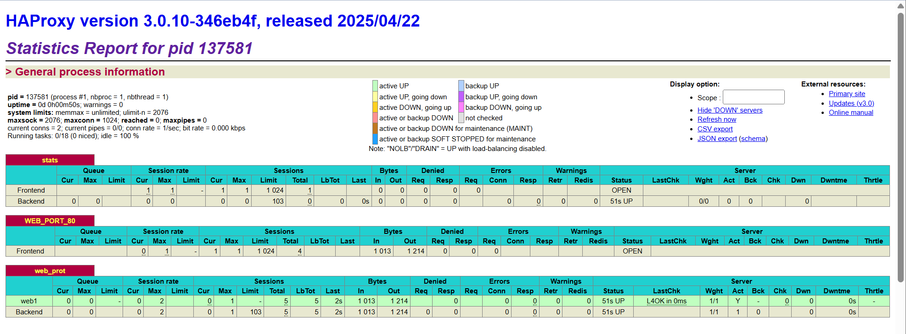


# HAProxy调度算法

HAProxy通过固定参数balance指明对后端服务器的调度算法，该参数可以配置在**listen**或**backend**选项中

HAProxy的调度算法分为静态和动态调度算法，但是有些算法可以根据参数在静态和动态算法中相互转换

**官方文档**

```http
https://cbonte.github.io/haproxy-dconv/2.0/configuration.html#4
```


## 静态算法

静态算法：按照事先定义好的规则轮询公平调度，不关心后端服务器的当前负载，连接数和响应速度等，且无法实现修改权重，只能靠重启HAProxy生效

**服务器动态权重调整**

```bash
# yum install socat   #Socat 是 Linux 下的一个多功能网络工具，名字来由是Socket CAT，Socat 的主要特点就是在两个数据流之间建立通信，且支持众多协议和链接方式。如IP,TCP,UDP,IPv6,Socket文件
[root@ubuntu2204 ~]# echo "help" |socat stdio /var/lib/haproxy/haproxy.sock

# 可以通过show info 或者show stat 得到监控指标
[root@ubuntu2204 ~]# echo "show info" | socat stdio /var/lib/haproxy/haproxy.sock

# 查看服务权重：get weight backend/server
[root@ubuntu2204 ~]# echo "get weight web_host/web1" | socat stdio /var/lib/haproxy/haproxy.sock
1(initial 1)

[root@ubuntu2204 ~]# echo "set weight web_host/web1 2" | socat stdio /var/lib/haproxy/haproxy.sock
Backend is using a static LB alorithm and only accepts weights "0%" and "100%"
```


**补充：使用`disable server`下线服务器，仅下线某个进程管理的那个server，在多进程（即多nbproc场景下）其他进程并没有下线，会导致部分用户访问非预期，仍可能访问到下线服务器**

解决方案

```bash
global
maxconn 1000000
chroot /var/lib/haproxy
# 将每个进程分别绑定一个socket文件
stats socket /var/lib/haproxy/haproxy.sock1 mode 600 level admin process 1
stats socket /var/lib/haproxy/haproxy.sock2 mode 600 level admin process 2
stats socket /var/lib/haproxy/haproxy.sock3 mode 600 level admin process 3
stats socket /var/lib/haproxy/haproxy.sock4 mode 600 level admin process 4
uid 1001
gid 1001
daemon
nbproc 4
......

# 在下线服务的时候，将4个进程全部下线
[root@ubuntu2204 ~]# echo “disable server web_port/web1” | socat stdio /var/lib/haproxy/haproxy.sock1
[root@ubuntu2204 ~]# echo “disable server web_port/web1” | socat stdio /var/lib/haproxy/haproxy.sock2
[root@ubuntu2204 ~]# echo “disable server web_port/web1” | socat stdio /var/lib/haproxy/haproxy.sock3
[root@ubuntu2204 ~]# echo “disable server web_port/web1” | socat stdio /var/lib/haproxy/haproxy.sock4
```


### static-rr

**static-rr：**基于权重的轮询调度，不支持权重的运行时调整及后端服务器慢启动，其后端主机数量没有限制

```bash
listen web_host
  bind 192.168.7.101:80,:8081-8810,192.168.7.101:9001-9010
  mode http
  log global
  balance static-rr
  server web1 192.168.7.103:80 weight 1 check inter 3000 fall 2 rise 5
  server web2 192.168.7.104:80 weight 2 check inter 3000 fall 2 rise 5
```


### first

**first: **根据服务器在列表中的位置，自上而下进行调度，但是其只会当第一台服务器的连接达到上限，新请求才会分配给下一台服务器，因此会忽略服务器的权重设置

```bash
listen web_hsot
  bind 192.168.7.101:80,:8081-8810,192.168.7.101:9001-9010
  mode http
  log global
  balance first
  server web1 192.168.7.103:80 weight 1 check inter 3000 fall 2 rise 5
  server web2 192.168.7.104:80 weight 2 check inter 3000 fall 2 rise 5
```


## 动态算法

**动态算法：**基于后端服务器状态进行调度适当调整，比如优先调度至当前负载较低的服务器，且权重可以在HAProxy运行时动态调整无需重启


### roundrobin

**roundrobin：**基于权重的轮询动态调度算法，支持权重的运行时调整，不完全等于lvs中的rr轮询模式，HAProxy中的roundrobin支持慢启动（新加的服务器会逐渐增加转发数），其每个后端backend中做多支持4095个real server，**roundrobin为默认调度算法**，且支持对real server权重动态调整

```bash
listen web_hsot
  bind 192.168.7.101:80,:8081-8810,192.168.7.101:9001-9010
  mode http
  log global
  balance roundrobin
  server web1 192.168.7.103:80 weight 1 check inter 3000 fall 2 rise 5
  server web2 192.168.7.104:80 weight 2 check inter 3000 fall 2 rise 5
```

**动态调整权限**

```bash
# echo "get weight web_host/web1" | socat stdio /var/lib/haproxy/haproxy.sock
1 (initial 1)

# echo "set weight web_host/web1 3" | socat stdio /var/lib/haproxy/haproxy.sock

# echo "get weight web_host/web1" | socat stdio /var/lib/haproxy/haproxy.sock
3 (initial 1)
```


### leastconn

**leastconn**加权的最少连接的动态，支持权重的运行时调整和慢启动，即当前后端服务器连接最少的优先调度（新客户端连接），比较适合长连接的场景使用，比如MySQL等场景

```bash
listen web_hsot
  bind 192.168.7.101:80,:8081-8810,192.168.7.101:9001-9010
  mode http
  log global
  balance leastconn
  server web1 192.168.7.103:80 weight 1 check inter 3000 fall 2 rise 5
  server web2 192.168.7.104:80 weight 2 check inter 3000 fall 2 rise 5
```

