# 初始Nginx
## Nginx的三个主要应用场景
- 静态资源服务
    - 通过本地文件系统提供服务
- 反向代理服务
    -  Nginx的强大性能
    - 缓存
    - 负载均衡
- API服务
    - OpenResty


- 往往一个Web请求会先经过Nginx，再到应用服务，比如（Tomcat，Django），然后去访问redis或数据库提供基本的数据功能，那么这里存在一个问题
- 我们的一个应用服务，因为开发效率要求很高，所以运行效率会很低，他的QPS，TPS或者并发都是受限的，所以需要把很多这样的应用服务，组成一个集群，向用户提供高可用性，而一旦很多服务做成集群，这时就要求Nginx具有反向代理功能，可以把动态请求传导给应用服务
- 而很多应用服务构成集群，它一定会带来两个需求
     - 第一个需求就是：需要动态的扩容
     - 第二个需求是：有些服务出问题的时候，我们需要做容灾，这样的话，反向代理就必须具备负载均衡功能
    
- 其次，在这样的链路中，Nginx是处在企业内网的边缘节点，随着网路链路的增长，用户体验到的时延会增加
    - 其中一个解决方案就是，将用户在一段时间内 看起来不变的内容，缓存在Nginx部分，由Nginx直接向用户提供访问，那么这样的话，用户时延就会减少很多
    - 因此反向代理衍生出的另外一个功能就是缓存，它能够加速用户的访问，在很多时候，我们在访问一些（css,js,pic等）静态资源时没有必要向应用服务来访问的
    - 它只需要通过本地文件，系统上放置的静态资源，直接由Nginx提供访问就可以了，这是Nginx的静态资源功能

- 应用场景三：
    - 因为很多的应用服务，在性能上有很多的问题，但是数据库服务要比应用服务好得多，因为它的业务场景比较简单，它的并发性能和TPS都要远高于应用服务，所以这里就衍生出第三个应用场景，由Nginx直接去访问数据库或者redis，或者类似的应用服务，利用Nginx强大的并发性能，实现如Web防火墙，这样复杂的业务功能，来提供给用户
    - 这样就要求Nginx的API服务有很强大的业务处理功能，所以像openresty或者像Nginx集成的javascript，利用js，lua这样的语言功能，和这些语言先天自带的工具库，来提供完整的API服务


## Nginx的背景与优点
- Nginx出现的三个主要原因
    - 互联网用户的快速增长，（全球化和物联网的发展，导致使用互联网的人和物的数量都在快速上升），数据的爆炸对硬件的性能提出了很高的要求
    - apache的低效：它的架构模型里，一个进程同一时间，只会处理一个连接，一个请求，只有在这个请求处理完以后，才会去处理下一个请求
        - 这里的潜台词就是，它实际上使用的是操作系统的进程间切换特性，因为操作系统微观上只有有限的CPU，但是操作系统被设计为同时服务于数百甚至上千的进程，而Apache一个进程只能服务一个连接，这样的模式会导致i，当apache需要面对几十万，几百万连接的时候，它没有办法去开几百万的进程，而进程间切换代价和成本又太高了，当我们并发的连接数越多，这种无谓的进程间切换引发的性能消耗也就越大，而nginx是专门为这样的应用场景而生的，nginx可以处理数百万，甚至是上千万的连接

- Nginx的使用优点
    - 高并发，高性能
        - 大部分的程序或者web服务器，随着并发连接数的上升，它的RPS会下降
        - nginx同时具备高并发，和并性能，往往高并发只要每个连接所使用的内存尽可能少就能达到，而具有高并发的同时具有高性能，需要一个非常好的设计
        - nginx可以达到的标准：比如一些主流服务器，32核64G内存，可以达到千万级别的并发连接，如果处理一些简单的静态资源请求，可以达到一百万级别的RPS
    - 可扩展性好
        - 模块化设计，生态圈丰富
    - 高可靠性
        - nginx可以在服务器上不间断运行数年
    - 热部署（在不停止服务的情况下，升级Nginx）
    - BSD许可证（开源免费，并且在有特定需求的场景下，可以修改Nginx的源代码，然后运行在商业场景下）


## Nginx的组成
- Nginx二进制可执行文件
    - 由各模块源码编译出的一个文件

- Nginx.conf配置文件
    - 控制Nginx的行为

- （Nginx二进制可执行文件和Ngix.conf定义了Nginx处理请求的方式）

- access访问日志
    - 记录每一条http请求信息

- error.log错误日志
    - 定位问题


- （对Web服务做一些运营或运维的分析，需要对access.log做进一步分析，如果出现任何未知的错误，和预期的行为不一致的时候，可以通过error.log去定位根本性的问题）


## Nginx安装
- 直接使用apt或者yum来安装Nginx会出现的问题
    - Nginx的二进制文件，会把模块直接编译进来，Nginx的官方模块并不是默认都会开启的，如果你想添加第三方的Nginx模块，你必须通过编译Nginx的方式，才能把第三方生态圈的强大的一些功能，添加到Nginx中

### 编译Nginx
- 编译Nginx主要分为6个部分

#### 下载Nginx
```shell
# 下载网站
nginx.org

# 点击右下角的download

# 进入download页面，会发现Nginx有两类版本：mainline version 和 stable verison

# 选择stable version中最新版本，然后右键复制链接地址

# 进入Linux中，wget + 复制的链接地址

# 解压
tar -xzf nginx-1.14.0.tar.gz

# 进入解压后的源码版本

# 解压后，源码目录的简单介绍
auto目录

# auto目录中目录结构
cd auto
CHANGES文件，就是nginx每个版本中，提供了哪些特性，和bugfix，里面每个版本包括CHANGE, BUGFIX, FEATURE
CHANGES.ru，是因为作者是俄罗斯人，因此提供了俄语版
conf目录：示例文件，我们把nginx安装好后，为了方便运维去配置，会把conf中的示例文件拷贝到安装目录
configure脚本：用来生成中间文件，执行编译前的必备动作
contrib： 提供了两个perl脚本和Vim工具，比如我们在没有使用vim工具时，用vim打开nignx的配置文件，会发现它的色彩没有变化（无法体现nginx语法），这个时候，需要把contrib下vim目录下的所有文件，拷贝到自己的目录中
执行：cp -r contrib/vim/* ~/.vim/
拷贝完之后，再用vim打开nginx的配置文件，就会显示nginx的语法高亮
html目录：提哦功能了两个标准的html文件，分别是50x.html(发生500错误时，可以重定向到这个文件)和index.html
man目录：linux对nginx的一个帮助文件

# auto里面有4个子目录
# 这里面所有的文件都是为了辅助configure脚本执行的时候，去判定nginx支持哪些模块，当前的操作系统有什么特性可以供给nginx使用
cc（用于编译） lib（库） os（对所有操作系统的判断） types

# nginx的源代码在src目录
src目录：core目录, event, http, mail, misc, os, stream
--------------------------------------------------------------------------------------------------
进行编译：
编译前，可以看下configure可以执行哪些参数
./configure --help | more

这里主要分为几个大块，
第一大块：确定nginx执行中，他会找哪些目录下文件，作为它的辅助的文件，如果没有什么变动，只需要确定--prefix=PATH，其他的都会在prefix下，创建相应的文件夹，
第二类参数： 确定使用哪些模块和不使用哪些模块，它的前缀通常是with和without；通常需要我们主动加with模块的时候，意味着该模块默认不会编译进nginx，与之相反，显示without的模块，意味着默认会编译进nginx模块中

第三类参数：指定了nginx编译中需要的一些特殊的参数，比如用gcc编译的时候，需要加哪些优化参数，或者需要打印debug级别的日志，以及需要加一些第三方模块等等

----------------------------------------------------------------------------------------------------

实际编译nginx
首先用它的默认参数
./configure --prefix=/home/nginx  # 这里指定了nginx的安装目录是在home/nginx
如果没有任何报错，则nginx编译成功

--------------------------------------------------------------------------
configure执行完毕后，会生成一些中间文件，中间文件放在objs文件夹下
这里最重要的是：ngx_modules.c这个文件决定了在编译的时候，会有哪些模块被编译进Nginx

# 确定好需要的模块后，cd..,执行make编译

# 编译完成后，如果没有任何错误，就会生成大量的中间文件（C语言编译时生成的所有的中间文件都会放在src目录下）和二进制nginx可执行文件，可以在0bjs的目录下看到
知道nginx可执行文件位置的原因：如果要进行升级，不能使用make install，而需要从这里把目标文件nginx拷贝到安装目录中，

C语言编译时生成的中间文件，都被放在src目录中

如果我们使用了动态模块，动态模块编译会生成so动态文件，也会放在objs目录下

首次安装可以使用make install进行安装

然后完成后，我们去到proxy指定的安装目录中，可以看到以下目录，这里最终要的nginx可执行文件，就在sbin目录下，决定nginx配置功能的配置文件在conf目录下

access.log和error.log 在logs目录下
```

### nginx配置语法
- 配置文件由指令与指令块构成
- 每条指令以；分号结尾，指令和参数以（一个或多个）空格符号分隔
- 指令块以{}大括号将多条指令组织在一起
- include语句允许组合多个配置文件，以提升可维护性
- 使用#符号添加注释，提高可读性
- 使用$符号，使用变量
- 部分指令的参数支持正则表达式

#### 配置参数：时间单位
- ms,s,m,h,d,w,M,y

#### 空间单位
- bytes（什么单位都不加，默认byte）， k/K， m/M，g/G

#### http配置的指令块
- http
- server：对应一个或一组域名
- location：一个url表达式
- upstream：表示上游服务，当nginx需要与tomcat，django等等，企业内网的其他服务交互的时候，可以定义一个upstream

## Nginx命令行
- 格式：`nginx -s reload`
- 帮助：`-?` `-h`
- 使用指定的配置文件：`-c`
- 指定配置命令：`-g`
- 指定运行目录：`-p`
- 发送信号`-s`
  - 立刻停止服务：`stop`
  - 优雅的停止服务：`quit`
  - 重载配置文件：`reload`
  - 重新开始记录日志文件：`reopen`
- 测试配置文件是否有语法错误：`-t` `-T`
- 打印nginx的版本信息，编译信息等：`-v`,`-V`

### 重载配置文件
```shell
nginx -s reload    # 在不停止对用户的服务的情况下，重新加载配置
```

### 平滑升级流程（热部署）
- 平滑升级4个阶段
    - 只有旧版nginx的master和worker进程
    - 旧版和新版nginx的master和worker进程并存，由旧版nginx接收处理用户的新请求
    - 旧版和新版nginx的master和worker进程并存，由新版ngnix接收处理用户的新请求
    - 只有新版nginx的master和worker进程

- 不停机更新Nginx二进制文件
```shell
# 服务端创建一个大文件
dd if=/dev/zero of=/apps/nginx/html/test.img bs=1M count=10

# 客户端下载该文件，保证有进程在工作
wget --limit-rate=1k http://10.0.0.200/test.img

# 编译新版本，得到新版本的二进制文件
wget http://nginx.org/download/nginx.1.24.0.tar.gz
tar xf nginx.1.24.0.tar.gz
cd nginx-1.24.0/

# 参考老版本的编译选项，去编译新版本
# 查看老版本
nginx -V
./configure --prefix=/apps/nginx --user=nginx --group=nginx ...
make # 只执行make，不执行make install
# 在objs/nginx -v

# 把之前的nginx命令备份
cp /apps/nginx/sbin/nginx opt/nginx.old

#  把新版的nginx复制过去，覆盖旧版的文件，需要-f选项，强制覆盖，否则会提示Text file busy

# 此时master的pid仍是4659，也就是依然是老版本的nginx进程在处理请求
# worker的pid是132676,他的PPID是4659
[root@ubuntu2204 ~]#ps -ef |grep nginx
root        4659       1  0 14:02 ?        00:00:00 nginx: master process /apps/nginx/sbin/nginx
nginx     132676    4659  0 14:37 ?        00:00:00 nginx: worker process
root      143839  143289  0 14:52 pts/3    00:00:00 grep --color=auto nginx

# 启动新版本,给旧版本的master进程发送一个信号，表示我们要开始热部署了
# 注意：新版本nginx编译的时候-prefix指定的路径必须和老版本一致
kill -USR2 `cat /apps/nginx/logs/nginx.pid`   #-USER2,并来实现USR2

# 此时可以观察到新老master，worker进程都在进程，而且新master进程是老master进程fork出来的
# 而且此时老的worker进程已经不再监听80/443端口了，所以新的连接只会进入新的nginx进程中，可以使用lsof -i :port查看，即可查看到当前监听80的端口的进程变成了新的worker进程
[root@ubuntu2204 objs]#ps -ef |grep nginx
root        4659       1  0 14:02 ?        00:00:00 nginx: master process /apps/nginx/sbin/nginx
nginx     132676    4659  0 14:37 ?        00:00:00 nginx: worker process
root      147105    4659  0 15:10 ?        00:00:00 nginx: master process /apps/nginx/sbin/nginx
nginx     147106  147105  0 15:10 ?        00:00:00 nginx: worker process
root      147108    1017  0 15:10 pts/0    00:00:00 grep --color=auto nginx

# 此时如果旧版worker进程有用户的旧的请求，会一直等待处理完后才会关闭，即平滑关闭
kill -WINCH `cat /apps/nginx/logs/nginx.pid.oldbin`  # -WINCH这个信号意思是告诉老的master进程，请优雅的关闭worker进程

[root@ubuntu2204 objs]#ps -ef | grep nginx
root        4659       1  0 14:02 ?        00:00:00 nginx: master process /apps/nginx/sbin/nginx
nginx     132676    4659  0 14:37 ?        00:00:00 nginx: worker process is shutting down  # 正在关闭，说明此时有用户在连接老的进程，当旧的连接都处理结束了，老的worker进程会直接关闭销毁
root      147105    4659  0 15:10 ?        00:00:00 nginx: master process /apps/nginx/sbin/nginx
nginx     147106  147105  0 15:10 ?        00:00:00 nginx: worker process
root      147126    1017  0 15:29 pts/0    00:00:00 grep --color=auto nginx

# 如果有新请求，则由新版本提供服务

# 经过一段时间测试，如果新版本没问题，最后发送QUIT信号，退出老的master，完成全部升级过程
# 老的master是不会自动退出了，会一致挂在那里，允许我们做版本回退
kill -QUIT `cat /apps/nginx/logs/nginx.pid.oldbin`

############### 回滚 ####################
#如果升级的新版本发现问题，需要回滚，可以发送HUP信号，重新拉起旧版本的worker
kill -HUP `cat /apps/nginx/logs/nginx.pid.oldbin`

# 最后关闭新版的master和worker，如果不执行上面的HUP信号，此步QUIT信号也可以重新拉起旧版本的woker进程
kill -QUIT `cat /apps/nginx/logs/nginx/pid`
# 恢复旧的文件
mv /opt/nginx.old   /apps/nginx/sbin
```

### 日志切割
```shell
# 不使用logrotate日志转储的方式
备份当前的日志文件
mv access.log bak.log
nginx -s reopen  # nginx会重新生成一个access.log
```
- 将上述过程写成一个脚本
```shell
#!/bin/bash
LOGS_PATH=/usr/local/openresty/nginx/logs/history
CUR_LOGS_PATH=/usr/local/openresty/nginx/logs
YESTERDAY=$(date -d "yesterday" +%Y-%m-%d)
mv ${CUR_LOGS_PATH}/access.log ${LOGS_PATH}/access_${YESTERDAY}.log
mv ${CUR_LOGS_PATH}/error.log ${LOGS_PATH}/error_${YESTERDAY}.log
## 向Nginx主进程发送USR1信号。USR1信号是重新打开日志文件
# kill -USR1 等同于 nginx -s reopen
kill -USR1 $(cat /usr/local/openresty/nginx/logs/nginx.pid)
```

### 传输文件时压缩gzip（优化手段之一）
```shell
gzip on;   # 开启gzip
gzip_min_length 1;  # 表示小于1字节的文件不压缩，节省资源 
gzip_comp_level 2;  # 压缩级别
# gzip_types表示哪些类型的文件才进行压缩
gzip_types text/plain application/x-javascript text/css application/xml text/javascript application/x-httpd-php image/jpeg image/gif image/pnp
```


### ngx_http_autoindex_module模块
提供当我们访问以"/"为结尾的url时，把我们对应到一个目录中，显示这个目录的结构
```shell
location / {
    autoindex on;
}
```

### 限速(core模块)
```shell
set $limit_rate 1k;   # 限制nginx发送响应的速度
```


### access_log日志
```shell
# 自定义access_log格式
log_format main '$remote_addr - Rremote_user [$time_local] "$request"' '$status $body_bytes_sent "$http_referer"'
'"$http_user_agent" "$http_x_forwarded_for"';

# 指定日志文件
access_log logs/access.log main;
```

### proxy_cache
当nginx作为反向代理时，通常只有动态的请求，也就是不同的用户访问同一个url，看到的内容是不同的，这个时候才会交给上游服务器处理，但是有些内容可能是一段时间不会发生变化的，这个时候，为了减轻上游服务器的压力，我们会让nginx把上游服务器返回的内容，缓存一段时间，比如缓存一天，在一天之内，即使上游服务器的内容响应发生变化，我们也不管，我们只会去拿缓存住的内容向浏览器发出响应，因为nginx的性能通常远远领先上游服务器的性能，所以使用这个特性，对一些小的站点，会有非常大的性能提升

#### 缓存服务器实现
```shell
proxy_cache_path /tmp/nginxcache levels=1:2 keys_zone=my_cache:10m max_size=10g inactive=60m use_temp_path=off;
# /tmp/nginxcache   指明放缓存数据的路经
# 以及这些文件的命名方式
# keys_zone=my_cache：10m   这些文件的关键字放在共享内存中
# 这里开辟了一个10m的共享内存，命名为my_cache

在需要做缓存的路径下添加proxy_cache

server {
    server_name mystical.feng.com;
    listen 80;

    location / {
        proxy_cache my_cache;  # 这里添刚刚开辟的共享内存

        proxy_cache_key $host$uri$is_args$args;
        proxy_cache_valid 200 304 302 1d;
        proxy_pass http://local;
    }
}
```

# Nginx的架构基础


为什么讨论Nginx架构基础：

nginx运行在企业内网的最外层，也就是边缘节点，因此它处理的流量是其他应用服务器处理流量的数倍，甚至是几个数量级，

任何一种问题，在不同的数量级下，它的解决方案是完全不同的，所以在nignx所处理的应用场景中，所有的问题就会被放大，

所以我们必须理解为什么nginx采用master，worker这样一种架构模型，为什么woker进程的数量要和CPU的核数相匹配，当我们需要在多个worker进程间共享数据的时候，为什么在tls或者说在一些限流限速的场景下，他们的共享方式是有所不同过的，这些需要对nginx架构有一个清晰的了解


## Nginx的请求流程
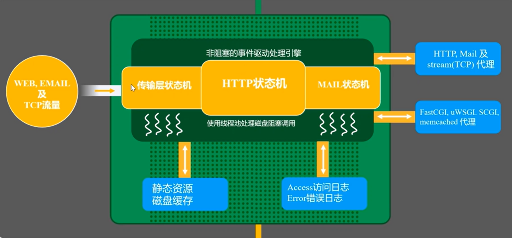

- 初始一般有三种流量Web，TCP，Email
- 进入Nginx后，nginx中有三个大的状态机
    - 一个是处理TCP，UDP的传输层状态机
    - 一个处理应用程的HTTP状态机
    - 以及处理邮件的MAIL状态机
- nginx中，核心的深绿色的框，它使用非阻塞的事件驱动处理引擎，也就是EPOLL
- 一旦我们使用这样的异步处理引擎以后，通常都是需要状态机来把请求正确的识别和处理的

- 基于这样的状态处理机
    - 我们在解析出请求需要访问静态资源的时候, 解析出静态资源
    - 当我们去做反向代理的时候，对反向代理的内容可以做磁盘缓存，缓存到磁盘上
    - 当整个内存已经不足以缓存住所有的文件缓存信息时
        - 会退化成阻塞的磁盘调用，通常使用线程池处理磁盘阻塞调用

- 对于每一个处理完成的请求
    - 记录access日志和error日志，这两个日志也是记录磁盘中的，可以通过rsyslog，把它记录到远程主机上
    - 更多的时候，nginx作为负载均衡和反向代理使用
    - 这个时候可以把请求协议级传输到后面的服务器
    - 也可以通过例如：应用层的一些协议，fasetcgi、uWSGL(Python)，SCGL等代理到相应的应用服务器


## 状态机的详细讲解与示例

状态机（State Machine）可以用来描述复杂系统中状态之间的转换和行为。以下是一个详细的讲解和实际的例子，帮助你更清晰地理解状态机的概念及其应用。

------

### **1. 什么是状态机**

状态机由以下几个部分组成：

1. 状态（State）
   - 系统可能处于的某种情况。
2. 事件（Event）
   - 导致状态发生改变的触发条件。
3. 动作（Action）
   - 状态转换时的操作。
4. 转换（Transition）
   - 从一个状态到另一个状态的变化过程。

------

### **2. 示例背景：HTTP 状态机**

以一个 **HTTP 请求处理过程** 为例，Nginx 的 HTTP 状态机可以被描述为：

1. 接收 HTTP 请求。
2. 解析请求行和请求头。
3. 检查请求体是否完整。
4. 生成并发送响应。
5. 完成请求处理，关闭连接。

------

### **3. 状态机的状态与事件**

#### **状态定义**

在 HTTP 请求处理中，我们可以定义以下状态：

1. **WAIT_REQUEST**：等待接收 HTTP 请求。
2. **PARSE_HEADERS**：解析请求行和请求头。
3. **PROCESS_BODY**：处理请求体。
4. **SEND_RESPONSE**：生成并发送响应。
5. **DONE**：完成请求处理。

#### **事件定义**

- **RequestReceived**：接收到 HTTP 请求行。
- **HeadersParsed**：解析请求头完成。
- **BodyProcessed**：请求体处理完成。
- **ResponseSent**：响应发送完成。

------

### **4. 状态转移表**

我们可以用一张表描述状态机的行为：

| **当前状态**    | **事件**          | **动作**             | **下一个状态**  |
| --------------- | ----------------- | -------------------- | --------------- |
| `WAIT_REQUEST`  | `RequestReceived` | 接收请求行并保存     | `PARSE_HEADERS` |
| `PARSE_HEADERS` | `HeadersParsed`   | 验证并解析请求头     | `PROCESS_BODY`  |
| `PROCESS_BODY`  | `BodyProcessed`   | 处理请求体并准备响应 | `SEND_RESPONSE` |
| `SEND_RESPONSE` | `ResponseSent`    | 发送响应             | `DONE`          |
| `DONE`          | -                 | 释放资源             | -               |

------

### **5. 图示化状态机**

```ini
WAIT_REQUEST  --(RequestReceived)--> PARSE_HEADERS
PARSE_HEADERS --(HeadersParsed)--> PROCESS_BODY
PROCESS_BODY  --(BodyProcessed)--> SEND_RESPONSE
SEND_RESPONSE --(ResponseSent)--> DONE
```

------

### **6. 示例代码**

以下是一个用伪代码实现的状态机示例：

```
class HTTPStateMachine:
    def __init__(self):
        self.state = "WAIT_REQUEST"

    def handle_event(self, event):
        if self.state == "WAIT_REQUEST":
            if event == "RequestReceived":
                print("Request received, transitioning to PARSE_HEADERS")
                self.state = "PARSE_HEADERS"
        elif self.state == "PARSE_HEADERS":
            if event == "HeadersParsed":
                print("Headers parsed, transitioning to PROCESS_BODY")
                self.state = "PROCESS_BODY"
        elif self.state == "PROCESS_BODY":
            if event == "BodyProcessed":
                print("Body processed, transitioning to SEND_RESPONSE")
                self.state = "SEND_RESPONSE"
        elif self.state == "SEND_RESPONSE":
            if event == "ResponseSent":
                print("Response sent, transitioning to DONE")
                self.state = "DONE"
        elif self.state == "DONE":
            print("Request handling completed.")
        else:
            print(f"Unknown state: {self.state}")

# 示例流程
fsm = HTTPStateMachine()

# 模拟事件触发
fsm.handle_event("RequestReceived")  # WAIT_REQUEST -> PARSE_HEADERS
fsm.handle_event("HeadersParsed")    # PARSE_HEADERS -> PROCESS_BODY
fsm.handle_event("BodyProcessed")    # PROCESS_BODY -> SEND_RESPONSE
fsm.handle_event("ResponseSent")     # SEND_RESPONSE -> DONE
```

------

### **7. 实际应用中，状态机的好处**

1. **简化复杂逻辑**：
   - 将复杂的请求处理分解成多个独立状态。
   - 每个状态的逻辑清晰、易于维护。
2. **事件驱动**：
   - 通过事件触发状态转换，避免阻塞等待。
3. **扩展性强**：
   - 可以轻松添加新的状态或事件，而不影响已有逻辑。

------

### **8. 扩展示例：TCP 状态机**

除了 HTTP，TCP 协议本身也是一个典型的状态机。例如：

- **状态**：
  - `LISTEN`：等待客户端连接。
  - `SYN_RCVD`：收到 SYN 请求。
  - `ESTABLISHED`：连接已建立。
  - `FIN_WAIT`：等待连接关闭。
- **状态转移**：
  1. `LISTEN` --(收到 SYN)--> `SYN_RCVD`
  2. `SYN_RCVD` --(收到 ACK)--> `ESTABLISHED`
  3. `ESTABLISHED` --(收到 FIN)--> `FIN_WAIT`

------

### **9. 状态机的总结**

- 状态机是描述系统中状态及其转换的一种有效方式。
- 在 Nginx 中，状态机用于管理异步请求的处理过程，将复杂的逻辑拆解为简单的状态和事件。
- 通过状态机，Nginx 实现了高效的请求管理，支持 HTTP、TCP、UDP 等多种协议的异步处理。

这种设计不仅提高了代码的可维护性和扩展性，也显著提升了系统的并发处理能力。


##  Nginx的进程结构

nginx有两种进程结构：单进程结构和多进程结构， 默认配置是多进程nginx

### 单进程结构
不适合生产环境，只适合我们做开发，调试用的

### 多进程结构(默认)
默认的配置中都是打开多进程的nginx

MASTER PROCESS 下面分为两类子进程，一类是worker 进程，一类是cache相关的进程

#### Nginx采用多进程结构，而不是多线程结构的原因
Nginx要保证它的高可用性和高可靠性

Nginx在使用多线程的时候，因为线程之间是共享同一个地址空间的，当有一个第三方模块引发了一个地址空间引发的段错误时，在地址越界出现时会导致nginx进程全部挂掉，而多进程的模型往往不会出现这种问题

```shell
Master 进程 --> Worker进程 --> Cache manager --> Cache loader
# nginx的父子进程间的通信是通过信号进行管理的
# cache manager 和 cache loader 不会默认启动，只有在配置了缓存功能时才会启动。
```

Nginx在做进程设计时，同样遵循了实现高可用，高可靠的目的，比如：在Master进程中，通常第三方模块是不会在这里加入自己的功能代码的，虽然在Nginx在设计时，允许第三方模块在master进程中，添加自己独有的自定义的方法，但是通常没有第三方模块会这么做。master进程被设计的目的是用来做worker进程的管理的，也就是说，所有的worker进程，使用来处理真正的请求的，而master进程负责监控每个worker进程是不是在正常的工作，需不需要做重新载入配置文件，需不需要做部署。


Cache缓存，实际上是在多个worker进程间共享的，而且缓存不仅要在worker进程间使用，还要被CacheManger和Cache Loader进程使用，CacheManager和Cache Loader也是为反向代理时后端发来的动态请求做缓存所使用的，Cache Loader只是用来做缓存的载入，Cache Manager是用来做缓存的管理，实际上每一个请求处理时使用的缓存还是由worker进程来进行的，这些进程间的通信，都是使用共享内存来解决的，在这个结构里，worker进程有很多，而Cache Manager和Cache Loader只有一个，而Master进程因为是父进程，肯定只有一个，worker进程有很多的原因：nginx采用事件驱动的模型后，它希望每个worker进程，从头到尾占有一个CPU，所以往往我们除了把woker进程的数量和我们的CPU核数设置一致以外，还需要把每一个worker进程和某个CPU核绑定在一起，这样可以更好的使用每个CPU核上面的CPU缓存，还减少缓存失效的命中率


### Nginx父子进程间是通过信号进行管理

命令中的很多子命令都是发送信号给进程

``````bash
[root@ubuntu2204 /apps/nginx/conf]$ pstree -p|grep nginx
           |-nginx(6376)-+-nginx(6484)
           |             `-nginx(6485)
[root@ubuntu2204 /apps/nginx/conf]$ pstree -p|grep nginx
           |-nginx(6376)-+-nginx(6484)
           |             `-nginx(6485)
           
# 旧的worker进程和cache进程退出，新的worker进程和cache生成
# 等价于 kill -SIGHUP <父进程>
[root@ubuntu2204 /apps/nginx/conf]$ nginx -s reload
[root@ubuntu2204 /apps/nginx/conf]$ pstree -p|grep nginx
           |-nginx(6376)-+-nginx(6504)
           |             `-nginx(6505)
           
           
# 发送一个SIGTERM信号该指定worker进程，会使其退出，
# 但是master进程检测worker进程退出后，会自动创建一个新worker进程，维持总共2个worker进程的架构
[root@ubuntu2204 /apps/nginx/conf]$ pstree -p|grep nginx
           |-nginx(6376)-+-nginx(6504)
           |             `-nginx(6505)
[root@ubuntu2204 /apps/nginx/conf]$ kill -SIGTERM 6504
[root@ubuntu2204 /apps/nginx/conf]$ pstree -p|grep nginx
           |-nginx(6376)-+-nginx(6505)
           |             `-nginx(6515)

``````


## Nginx进程管理：信号

```shell
# Master进程
监控worker进程
- CHLD ----- 当子进程终止的时候，回向父进程发送CHLD信号，如果Worker进程由于一些模块，出现bug，导致意外终止，Master进程可以立刻通过CHLD发现这个事件，然后重新把Worker进程拉起

Master进程还可以接受一些信号管理Worker进程
TERM,INT ----- 立即停止nginx进程
QUIT     ----- 优雅的停止nginx进程
HUP      ----- 重载配置文件
USR1     ----- 重新打开日志文件，做日志文件的切割

管理worker进程

接收信号
- TERM, INT
- QUIT
- HUP
- USR1
- USR2       ------- 针对热部署时使用 
- WINCH      ------- 针对热部署时使用 

# Worker进程
接收信号   ----------- 通常不会向worker进程发送信号，因为我们希望让Master进程来管理Worker进程，实际上直接向worker进程发送信号是一样的，但是我们通常是将信号发送给Master进程，然后Master进程会给Worker进程发送信号
- TERM, INT
- QUIT
- USR1
- WINCH

# nginx命令行
# 当我们启动了nginx之后，nginx会把它的PID寄到一个文件中，通常默认是Nginx安装目录的logs文件下的nginx.pid文件中，这里会记录master进程的pid
[root@ubuntu2204 /apps/nginx/logs]$ pwd
/apps/nginx/logs
[root@ubuntu2204 /apps/nginx/logs]$ cat nginx.pid 
6376

# 当我们再次执行nginx -s，nginx这个工具命令行会读取pid文件中的master文件中的pid，然后想这个pid中发送下面各种信号
reload: HUP
reopen: USR1
stop: TERM
quit: QUIT
```


## reload流程

- 向master进程发送HUP信号(reload命令)
- master进程校验配置语法是否正确
- master进程打开新的监听端口，而worker进程会继承父进程打开的端口，这个是linux操作系统中定义的
- master进程用新配置启动新的worker子进程
- master进程向老worker子进程发送QUIT信号，这里QUIT是优雅退出，这里要注意顺序，一定是先启新的worker子进程，再发送QUIT信号，保证平滑
- 老的worker进程收到信号后，老worker进程关闭监听句柄（此时新的连接只会到新的worker子进程），处理完当前连接后结束进程
- 在新版本中，会有个参数`worker_shutdown_timeout`这个是如果在启新的子进程时，老的子进程上会有一个定时器，超时会强制关闭


## 热升级的完整流程


- 将旧nginx文件换成新nginx文件（binary文件）--- （注意备份）
  - 新编译的nginx文件所指定的响应的配置选项，比如配置文件的目录在哪里，log的所在目录等等必须和老的nginx保持一致，否则无法复用nginx.conf文件
  - 新版本linux中，会要求使用`cp -f`才能替换正在运行的binary文件
- 向master进程发送USR2信号
- master收到信号后，会做如下几件事
  - master进程修改pid文件，加后缀`.oldbin` ---- 给新的master进程让路，让新的master使用pid.bin这个文件名
  - master进程使用新的nginx文件启动新master进程 --- 此时会出现两个master进程和老的worker进程
- 向老的master进程发送QUIT信号  --->  关闭老master进程，老master进程会优雅关闭老worker进程，老master进程会一直保持下来，等待后续可能得回滚操作
- 回滚：向老master进程发送HUP，向新master发送QUIT


## Worker进程：优雅关闭

优雅关闭只对worker进程而言，因为只有worker进程会去处理请求，如果我们在处理一个连接的时候，不管连接对于请求是一个怎样的作用，我们直接关闭这个链接，会导致用户收到错误，所以优雅的关闭就是指nginx的worker进程可以**识别出当前的链接没有正在处理的请求**，这个时候我们再把连接关闭


对于有些请求，nginx是做不到优雅关闭的，比如nginx代理websocket协议的时候，在websocket进行通信的frame帧里面，nginx是不解析这个帧的，所以这个时候是没有办法识别当前连接是否有正在处理的请求，nginx在做tcp或UDP层反向代理的时候，也没有办法识别一个请求需要经历多少报文，才算结束，但是对于HTTP请求，nginx是可以做到的，**所以优雅的关闭主要针对http请求**


### 优雅关闭的流程


- 设置一个定时器，在nginx.conf中配置一个`worker_shutdown_timeout`，设置完定时器后，会加一个标志位，表示现在进入优雅关闭的这个流程
- 然后关闭监听句柄，也就是保证当前所在的worker进程不会再去处理新的连接请求
- 然后会去看连接池，因为nignx实际上为了保证自己对资源的利用是最大化的，经常会保存一些空闲的连接，但是没有断开，这是会关闭所有的空闲连接
- （第四步可能是时间非常长的一步）因为nginx不是主动的立即关闭，所以通过第一步增加一个标志位，在循环中每当发现一个请求处理完毕，就会把这个请求使用的连接关掉，在循环中等待全部连接关闭的时间可能会超过第一步中的`worker_shutdown_timeout`的时间，当我们设置了这个参数，那么即使请求还没有处理完，这些连接都会被强制关闭，也就是说优雅关闭只完成一半。
  - 也就是说，两个条件---> 所有连接都关闭或者达到`worker_shutdown_timeout`的时间
- 然后worker进程关闭退出


很多时候我们都会使用到这个特性（优雅关闭退出），当这个特性失效的时候，我们需要考虑nginx有没有能力去判定一个连接此时应当被正确关掉，或者如果出现错误，有些模块或客户端不能正常处理请求时，nginx需要有一些例外的措施，比如：`worker_shutdown_timeout`l来保证nginx老的进程能够正常的退出掉


## 网络收发与Nginx事件间的对应关系

Nginx是一个事件驱动的框架，所谓事件指的是网络事件，Nginx每一个连接会自然对应两个网络事件，一个读事件，一个写事件。
所以，我们在深入了解Nginx的各种原理，及它在极端场景下的一些错误场景的处理时，我们必须首先理解什么是网络事件


比如当主机A向服务端主机B发送一个GET请求时，这个过程中经历了哪些网络事件

- 应用层里发送了一个HTTP请求
- 传输层：我们浏览器打开了一个端口（可以从Windows的任务管理器上看到这一点），然后它会把这个端口记下来，以及将nignx打开的端口比如80或443也记到传输层
- 网络层会记录我们主机所在IP，和目标主机，也就是nginx所在服务器的公网IP
- 在链路层，经过以太网到达家里的路由器 ---> 路由器里会记录运行商的下一段的IP，经过广域网最终跳转到主机B所在的机器中，这个时候，报文会通过链路层，网络层，传输层，最终到传输层后，操作系统就知道是将报文给到打开80或443端口的进程，也就是nginx服务，nginx在它的http状态处理机里面就会处理这个请求


在上述过程中，网络报文扮演了一个怎样的角色？

了解TCP报文
在数据链路层，它会在数据的前面header部分和最尾的footer部分添加上mac地址，包括源mac地址，目标mac地址
到网络层，数据的header部分会有一个ip头部，上面则是nginx的公网地址和浏览器的公网地址
到TCP层，指定了nginx打开的端口和浏览器打开的端口
到应用层，则是HTTP协议

上述就是一个报文层层封装和解封装的过程

### 什么是网络事件         
我们发送的http协议会被切割成很多小的报文，在网络层会切割成小的mtu，在以太网，mtu是1500字节，TCP层它会考虑中间每个环节中，最大的一个mtu值，这个时候往往每个报文只有几百字节，这个报文大小我们称为mss，所以每收到一个小于mss大小的报文时，就是一个网络事件 - 上述描述详解
```shell
这句话解释了HTTP协议的报文在网络传输过程中是如何被切分的，特别是在TCP和以太网的不同层次之间。我们可以分解这句话逐步进行解释：

HTTP协议报文被切割成多个小报文：HTTP协议是应用层协议，当发送一个较大的HTTP请求或响应时，传输过程中并不是一次性发送整个报文。相反，数据会被分割成更小的部分。

网络层切割成MTU大小的报文：MTU（最大传输单元）是指在网络层（特别是IP层）每个数据包的最大大小。例如，在以太网中，MTU通常为1500字节。因此，超过MTU的数据包需要被分割成更小的片段，以适应这个限制。

TCP层考虑最大MTU值：在传输层（TCP层），为了确保数据能够顺利传输，TCP会根据网络中所有路径上的MTU大小来决定一个安全的传输数据大小。TCP通过一种叫“路径MTU发现”（PMTU）的机制，找到路径中各个环节的最大MTU值。这个过程帮助TCP知道该如何将数据切分，以避免在中间某一环节因为MTU过大导致的丢包和重新传输。

MSS（最大报文段长度）：MSS是TCP层特有的概念，它表示在不发生IP层分片的情况下，TCP报文段中数据部分的最大长度。通常，MSS是MTU减去TCP/IP报头后的值。因为MTU包含了以太网帧、IP头和TCP头，所以MSS会比MTU小。一般情况下，在以太网中，MSS的典型值是1460字节（1500字节的MTU减去20字节的IP头和20字节的TCP头）。

每个报文只有几百字节：在某些网络路径上，MTU可能比以太网的标准1500字节更小，因此，实际传输的数据段往往小于这个MSS值，导致TCP报文只有几百字节大小。
```

### TCP协议中网络事件是怎样和日常调用的接口关联在一起的
- 日常调用接口
  - Accept()
  - Read()
  - Write()
  - close()


### 读事件

#### 请求建立TCP连接事件 ---> accept建立连接事件
比如：请求建立TCP连接事件，实际上是发送了一个TCP的报文，通过上述流程到达Nginx，这个网络事件其实对应的是一个读事件，对nginx来说我读取到了一个报文，也就是accept建立连接的事件

#### TCP连接可读事件 
我们发送一个消息，对nginx来说也是一个读事件，即Read读消息

#### TCP连接关闭事件
对于nginx来说，依然是读事件，因为对于nginx来说，它只是读取一个报文

### 写事件
当我们的nginx需要向浏览器发送一个响应报文时，我们需要把消息写到操作系统中，要由操作系统发送到网络中，这就是一个Write写事件


网络中的读写事件，在nginx中，或者在任何一个异步事件的处理框架中，它一定会有一个事件收集分发器，

### 事件收集分发器

我们会定义每一类事件，他处理的消费者，也就事件它本身是一个生产者，是网络中自动生产到nginx中的，我们对每种事件要建立一个消费者
- 比如连接建立的事件消费者，就是我们对accept()的调用，那么http模块就会去建立一个新的连接
- 还有很多读消息或者写消息，那么在http的状态机中，不同的时间段，我们会调用不同的方法，也就是每一个消费者去处理。

上述网络事件和对应消费者的概念，对我们理解nginx的异步处理框架是非常有帮助的，包括我们后面谈到openResty，他也是常依赖于我们的网络事件以及事件分发的，包括lua的同步代码


### 通过三次握手感受Nginx网络事件处理
三次握手的过程：

当浏览器向Nginx服务器发起请求时，会经历经典的TCP三次握手：
第一次握手：浏览器向服务器发送SYN包，表示请求建立连接。
第二次握手：服务器收到SYN包后，返回SYN+ACK包，表示同意建立连接。
第三次握手：浏览器收到SYN+ACK包后，再发送一个ACK包，表示确认连接已经建立。
浏览器和操作系统的通信：

在三次握手的过程中，浏览器发出的数据包（SYN和ACK等）通过操作系统的TCP/IP栈处理，网络层负责实际的数据包传输。
这期间，Nginx服务器并不会立即被通知到，操作系统的内核会负责处理这个TCP连接的建立。
操作系统通知Nginx进程：

只有在三次握手成功完成后，操作系统才会将这个新的连接通知给Nginx。这是因为，在握手过程中，连接还没有正式建立，操作系统只是在处理网络数据包。
当操作系统收到浏览器发送的最后一个ACK包（三次握手的第三步），连接才被认为成功建立。这时，操作系统会通知Nginx服务器进程，告诉它有一个新的连接已经建立，并触发Nginx的读事件。

Nginx的读事件：
Nginx作为一个事件驱动的服务器，会等待内核的通知，通常通过epoll（或kqueue在BSD系统上）监听新连接的到来。内核收到ACK包后，Nginx的事件循环就会被唤醒，并触发相应的读事件（也就是开始处理来自浏览器的HTTP请求）。这个读事件对应的是一个建立新连接，所以nginx此时应该调用accept()这个方法，去建立一个新的连接


## Nginx的事件驱动模型
### Nginx事件循环
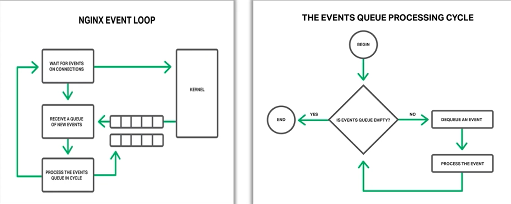

当nginx刚刚启动的时候，我们在`WAIT FOR EVENTS ON CONECTIONS`，也就是我们打开了80或者443端口，这个时候，我们在等待新的事件进来（比如：新的客户端连上了我们的nginx，它向我们发起了连接，我们在等待这样的事件）

这个步骤往往对应着我们epoll中的`epollwait`这样一个方法（此时Nginx处于sleep进程状态的）

epoll_wait 是 Linux 中 epoll 机制的一部分，用来高效地处理大量的并发连接。它是一个阻塞调用，等待内核监听的文件描述符（例如，socket、文件等）上发生事件。当事件发生时，epoll_wait 会返回这些事件，通知应用程序去处理。

当操作系统收到了一个建立tcp连接的报文，并处理完握手流程后，操作系统就会通知epoll_wait(),唤醒阻塞中的epoll_wait，同时也唤醒nginx的worker进程，我们往下走，就会找操作系统去要事件，这里的kernel就是操作系统内核，操作系统会把他准备好的事件放到事件队列中，从这个事件队列中就可以获取到我们要处理的事件，比如建立连接，比如收到tcp的请求报文

取出事件后，我们就可以去处理它，即`PROCESS THE EVENT QUEUE IN CYTCLE`

这里看图片，处理事件就是一个循环，当队列不为空，我们就把事件取出来，开始处理，在处理事件的过程中，可能会生成一些新的事件，比如：我发现一个连接被新建立了，我可能会添加一个超时时间，比如60s，也就是说60s之内，如果浏览器不向我发送请求的话，我就会把这个连接关闭掉

又比如说，我收完了完整的http请求后，我已经可以生成响应了，那么这个新生成的响应是需要我可以向操作系统的写缓存区里面去把响应写进去，要求操作系统尽快的把这样的一个响应内容发给浏览器

如果所有的事件都处理完，我们就会返回到`WAIT FOR EVENTS ON CONNECTIONS`

#### 知道Nginx事件循环的好处
这个时候我们再去理解，有时候我们使用一些第三方模块，这个第三方模块可能会去做大量的CPU计算，这样的计算任务会导致我处理一个事件的事件非常的长，在我们刚刚所说的流程图里，就可以看到，它会导致后续的队列中的大量事件长时间得不到处理，从而引发恶性循环，也就是它们的超时时间可能到了，我们大量的CPU都用来处理连接不正常的断开，所以往往nginx不能容忍有些第三方模块长时间消耗大量的CPU进行计算任务，就是这个原因

比如gzip这种模块，它们都不会一次性使用大量CPU，都是分段使用都与这是有关系的


在上述循环流程中，最关键的就是Nginx怎样能够快速的从操作系统的Kernel中获取到等待处理的事件，这么一个简单的步骤，其实经历了很长时间的解决，比如：到现在Nginx主要在使用Epoll这样一个网络事件收集器的模型


## epoll的基本概念
epoll 是 Linux 提供的一种高效的 I/O 事件通知机制，尤其适用于需要处理大量并发连接的场景，比如 Web 服务器、代理服务器等。相比于传统的 select 和 poll，epoll 可以处理大规模并发连接，而不会随着监听的文件描述符数量增加而线性增长

- 事件驱动：Nginx 是事件驱动的服务器，它通过 epoll 等机制来处理 I/O 事件，如新连接、可读/可写事件等。
- epoll 文件描述符：Nginx 启动时，会向内核注册一些文件描述符（FD），包括监听的端口（如80、443）。这些描述符会被加入到 epoll 中，由 epoll 来监控它们上是否有事件发生。

#### epoll_wait 的作用
当 Nginx 启动后，它会在 epoll 中注册它的监听 socket，并等待事件。此时，epoll_wait 被调用，它会：
- 进入阻塞状态：epoll_wait 进入阻塞状态，等待内核通知它有事件发生。例如，当有客户端试图连接 Nginx 的监听端口时，epoll_wait 就会被唤醒。

- 监听并处理事件：当有客户端连接进来，或者之前的连接有了新的数据，epoll_wait 会返回发生事件的文件描述符列表（FDs），这样 Nginx 可以知道该处理哪些连接。

- 返回事件列表：epoll_wait 返回一个包含已经发生的事件的文件描述符的数组，Nginx 再根据这些事件决定下一步的处理，比如接受新的连接或处理现有连接的读写操作。

#### epoll_wait 的参数
```C
int epoll_wait(int epfd, struct epoll_event *events, int maxevents, int timeout);

//epfd：epoll 实例的文件描述符，它是通过 epoll_create() 或 epoll_create1() 创建的。
//events：这是一个数组，用来保存发生事件的文件描述符的集合。epoll_wait 会将检测到的事件填充到这个数组中。
//maxevents：最多返回的事件数量。这个参数限制了 events 数组的大小，告诉 epoll_wait 最多返回多少个事件。
//timeout：等待事件发生的超时时间（毫秒）。如果设置为 -1，则表示无限期等待事件；如果设置为 0，则表示立即返回，不等待。
```

#### Nginx 中的 epoll_wait 使用
- 初始化阶段：Nginx 启动后，会初始化 epoll 事件循环，打开监听端口（如80或443），并将这些监听 socket 的文件描述符注册到 epoll 中。

- 等待事件：在 Nginx 的事件循环中，epoll_wait 被反复调用。每次 epoll_wait 会阻塞，直到有客户端连接或数据可用，事件触发时它会返回，并将触发的事件传递给 Nginx。

- 处理事件：Nginx 根据事件类型（如可读事件、新连接事件）来做相应的处理，可能是接受新的连接，也可能是读取现有连接的数据。


#### 举例：客户端连接时的流程
- Nginx 在启动后，监听 80 或 443 端口，并通过 epoll 机制注册这些端口的文件描述符。
- 调用 epoll_wait 等待事件。
- 当有客户端发起连接时，epoll_wait 被唤醒，返回监听 socket 上的可读事件。
- Nginx 得到这个事件后，调用 accept 接受新的连接。
- e接下来，这个新连接的文件描述符也会被加入到 epoll 的监控列表中，用来处理后续的读写操作。


### epoll的优劣及原理
在上述的循环流程中，最关键的就是nginx怎样能够快速的从操作系统的kernel中获取到等待处理的事件，这么一个简单的步骤其实经历了很长时间的解决

比如：到现在nginx主要在使用epoll这样一个网络事件收集器的模型，那么下面我们来简单的回顾下epoll的特点

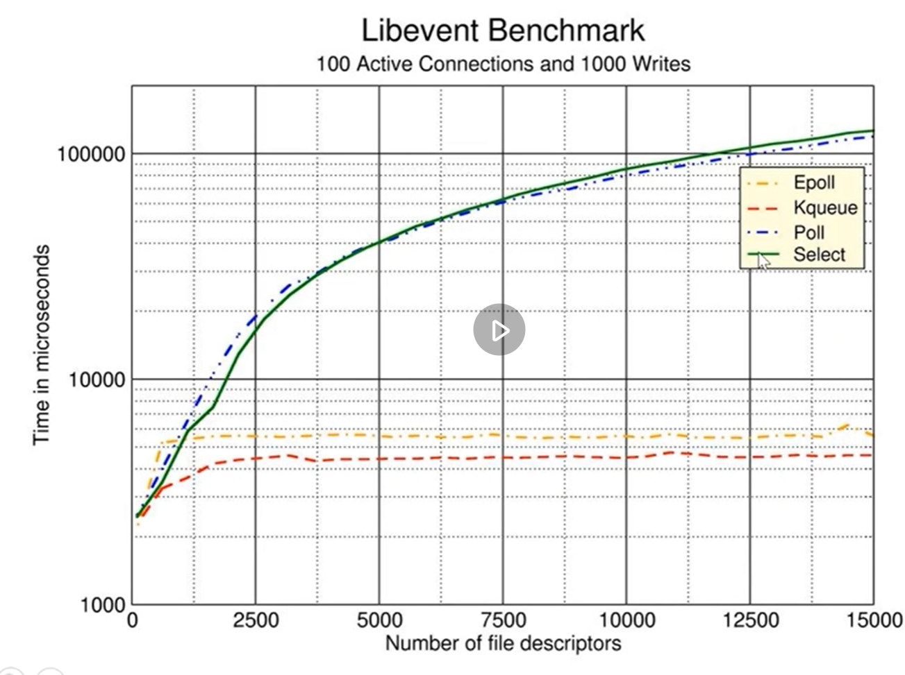

从图中可以看出，随着并发连接数（即句柄数）的增加，Poll和Select所消耗的事件是急剧上升的，而Epoll基本与句柄数是无关的，所以它非常适合做大并发连接处理，那么为什么会这样呢，我们看一下它的场景

#### epoll原理
比如我们nginx要处理100w个连接，那么从我们之前所谈到的事件分发图中可以看到，我们每两次等待新的连接中，时间可能会非常的短，在短短的几百ms这样一个连接的时间中，所能收到的报文数量是有限的，而这些有限的事件对应的连接也是有限的，也就是说每次我处理事件时，虽然我总共会有100w个并发连接，但我可能只接收到几百个活跃的连接，我只需要处理几百个活跃的请求，而select或者poll，它们的实现是有问题的，因为每一次我去取操作系统的事件的时候，我都需要把这100w个连接统统的扔给操作系统，让它去依次判断哪些连接上面有事件进来了，所以可以看到这里操作系统做了大量的无用功，它扫描了大量不活跃的连接

而epoll使用了一种特性，因为高并发连接中，每次处理的活跃连接数量占比很小

#### epoll的实现

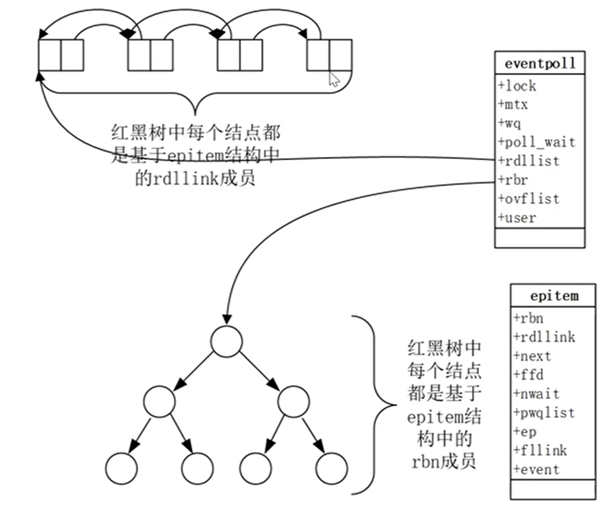

epoll维护了一个数据结构，叫eventpoll，然后他通过两个数据结构将这两件事分开了，也就是说nginx每次取活跃连接的时候，我们只需要去遍历一个链表，这个链表里仅仅只有活跃的连接，这样我们的效率就很高

然后我们还会经常做，比如说nginx收到80端口建立连接的请求，那么收到80连接的端口建立连接后，我要添加一个读事件，这个读事件是用来读取http消息的，这个时候我可能会添加一个新的事件，比如写事件添加进来，将其放入一个红黑树中，这个二叉平衡树可以保证我的查找效率是2logn，如果我现在不想处理读写事件，我只需要从这个红黑树中移除一个节点即可，所以它的效率非常高

红黑树中的每个节点都是基于epitem结构中的rdllink成员


### Nginx中链表和红黑树的关系


### **1. 红黑树的作用**

红黑树在 Nginx 中的主要作用是用来**管理所有已建立的连接**，无论这些连接是否活跃。它是一个快速查找结构，能够高效地进行插入、删除和查找操作。

#### **特点**

1. **存储所有连接**：
   - 每当有一个新的连接建立时，Nginx 会将该连接插入到红黑树中。
   - 无论连接是活跃的还是非活跃的，都需要先存储到红黑树中。
2. **快速查找**：
   - 红黑树是一个自平衡二叉搜索树，查找操作的时间复杂度是 **O(log n)**。
   - Nginx 需要频繁地对连接进行操作（如超时检查、删除等），红黑树提供了高效的查找性能。
3. **连接管理**：
   - 红黑树用于存储所有的连接，因此是 Nginx 连接管理的基础。

------

### **2. 链表的作用**

链表在 Nginx 的 `epoll` 实现中主要用于管理**当前活跃的连接**，即那些在某个事件循环周期中有 I/O 事件的连接。

#### **特点**

1. **只存储活跃连接**：
   - 当一个连接上有可读或可写事件时，`epoll` 会将其标记为活跃，并添加到链表中。
2. **快速遍历**：
   - 链表的结构适合顺序遍历。在每个事件循环周期中，Nginx 通过遍历链表处理所有的活跃连接。
3. **短期存储**：
   - 链表中的连接只在当前事件循环周期内存在，当该周期结束时，链表会被清空。

------

### **3. 红黑树和链表的关系**

红黑树和链表在 Nginx 的 `epoll` 实现中是密切相关的，分别管理不同范围的连接：

1. **红黑树存储全局连接**：
   - 所有的连接（活跃或非活跃）都存储在红黑树中，用于管理生命周期。
2. **链表存储活跃连接**：
   - 链表中只存储当前有事件发生的连接。
   - 这些连接也是红黑树中的节点，但链表中存储的只是这些节点的引用。
3. **红黑树是静态集合，链表是动态集合**：
   - 红黑树是所有连接的全局集合，不会因为事件循环的结束而清空。
   - 链表是动态集合，每个事件循环周期都会被重新构建。
4. **连接的生命周期**：
   - 一个新连接建立后，会插入到红黑树中。
   - 当该连接有 I/O 活动时，`epoll` 会将其标记为活跃，并引用到链表中。
   - 事件处理完成后，连接仍然留在红黑树中，等待下次事件。

------

### **4. 示例流程**

以下是连接在红黑树和链表之间的流转过程：

1. **新连接到来**：
   - 新的连接通过 `accept` 接收。
   - 插入红黑树中，表示它是一个被 Nginx 管理的连接。
2. **I/O 事件触发**：
   - 当连接上有 I/O 活动（如可读或可写事件）时，`epoll` 检测到这些事件。
   - 连接被添加到链表中，等待在本次事件循环中处理。
3. **事件处理**：
   - Nginx 遍历链表，逐一处理活跃连接上的事件。
   - 事件处理完成后，连接从链表中移除，但仍然存在于红黑树中。
4. **连接关闭**：
   - 当连接被关闭（如超时或客户端断开），它会从红黑树中删除，完全退出 Nginx 的管理。

------

### **5. 结构总结**

| 数据结构   | 存储内容                | 特点                 | 用途                             |
| ---------- | ----------------------- | -------------------- | -------------------------------- |
| **红黑树** | 所有连接（活跃+非活跃） | 高效查找（O(log n)） | 全局管理连接，支持快速查找       |
| **链表**   | 当前活跃连接            | 高效顺序遍历         | 在事件循环中处理活跃连接上的事件 |

------

### **6. 为什么需要两种结构**

1. **红黑树的作用是全局管理**：
   - 红黑树的作用是存储所有的连接，提供高效的查找、插入和删除操作。
   - 这是连接生命周期管理的核心。
2. **链表的作用是高效处理活跃连接**：
   - 在事件循环中，链表的顺序遍历性能高，可以快速处理当前活跃的连接。
   - 链表不适合管理全局连接，因为随机访问性能低。

------

### **7. 总结**

- **红黑树** 用于存储和管理所有连接，支持快速查找、插入和删除。
- **链表** 用于管理当前活跃的连接，支持事件循环中的高效遍历。
- 红黑树是全局静态集合，链表是动态的临时集合，两者通过引用关联，协同工作以实现高效的事件处理和连接管理。


上面讲到了Nginx如何使用epoll，运行自己的事件驱动框架的，那么这样的事件驱动框架到底能给我们带来怎样的好处，下面我们来看请求切换的场景下，这种事件驱动框架给我们带来的真意  ·


## Nginx的请求切换
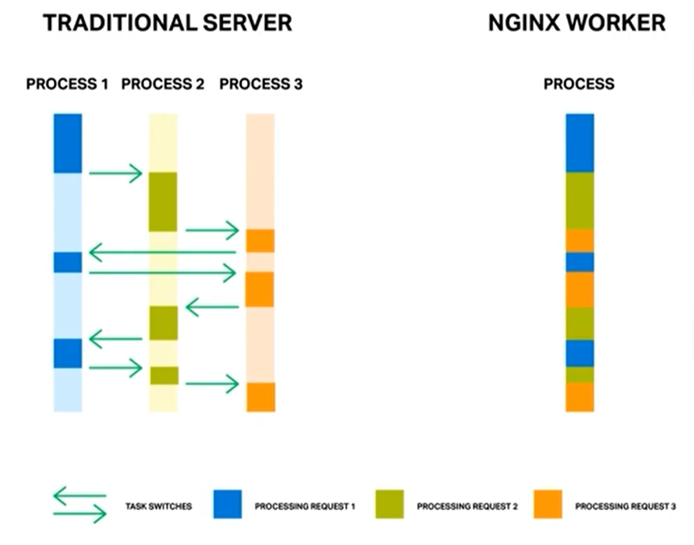

在上图中，实际上有三个请求，蓝色的，绿色的，还有橘黄色的，每一个请求如果是一个http请求的话，我们把它简化为三部分，比如说第一部分，我们收到http请求的header，如果收完header以后，大致就可以知道我应该交给上游的哪一台服务器去处理，利用一些负载均衡算法，那么接下来我可能会向上游服务器建立连接，或者说我本地处理的时候我接下来去判断这个header中有没有content_length指明它还有body，如果它有body的话，我接下来会去读下一个读事件，去处理完它所有的httpbody，处理完httpbody后，我可能还会向它发送一个http响应，那么在这样的一个过程中，它实际上可能表现为三个事件，那么传统的服务，比如apache或者tomcat，它们在处理的时候是每一个进程process同一时间只处理一个请求，比如说process1在处理request1的时候，当request1目前网络事件不满足的情况下，就会切换到process2，去处理process2上面的request2，而request2可能很快就又不满足了，比如想写一个响应的时候，发现写缓存区已经满了，也就是说网络中已经比较拥塞了，所以我们的滑动窗口没有向前滑动，以至于我们调用write方法，我们没有办法写入我们需要写入的字节，当write方法是非阻塞的时候；

这个时候阻塞类的写方法一定会导致我们所在的进程又发生了一次切换，现在切换到process3，操作系统选择了process3，因为process3上的request3处于满足状态，我们可以继续往下执行，执行到一定的过程中，process3可能用完了它的时间片，此时process3又被操作系统进行切换，此时又切换到process1，那么如此往复下去，这里就会有一个很大的问题

就是每做一次切换，就是上图绿色箭头，在我们当前的CPU频率下，它所消耗的时间大约是5微秒，这个5微秒虽然很小，但是如果我们的并发连接开始增加的时候，它不是一个线性增加，而是一个指数增加，所以当我们的并发连接非常多的时候，这个进程间的消耗会非常可观，以至于消耗我们绝大部分计算资源，所以这种传统的web服务，它在依赖操作系统的进程调度的方法去实现它的并发连接数，而操作系统的进程调度仅仅适用于很少量的数百，上千的进程间切换，那么相对来说，进程间切换消耗的时间成本还能够接受，但是到了几万几十万的情况下，就不可接受了。

那么nginx是如何处理的呢

当蓝色的请求处理事件不满足的情况下，它在用户态直接就切到了绿色的请求，这样的话，我们就没有了中间这个进程间切换的成本，因为网络事件不满足，除非是nginx worker所使用的时间片到了，而时间片的长度一般是5ms到800ms，
所以我们在nginx worker的配置上往往会把它的优先级加到最高，比如通常会加到-19,这样我们的优先级调的比较高的时候，往往操作系统给我们分配的时间片就比较大，这样我们的nginx才能比较好的在用户态完成请求的切换使得CPU少做无用功

## 阻塞与非阻塞，同步与异步
阻塞和非阻塞主要是指操作系统底层的C库提供的方法或者是一个系统调用，也就是说我们调用这个方法的时候，这个方法可能会导致我们进程进入sleep状态，为什么会进入sleep状态呢，就是当前的条件不满足的情况下，操作系统主动把我的进程切换为另外一个进程在使用当前的CPU了，那么这样就是一个阻塞方法

而非阻塞方法就是我们调用该方法永远不会因为当我们时间片未用完时，把我们的进程主动切换掉

同步和异步则是从我们调用的方式而言，就是我们的编码中写我们的业务逻辑这样的角度

### 阻塞调用
在阻塞调用中，我们以accept为例，因为绝大部分程序在调用accept的时候，他都是在使用阻塞socket的，使用阻塞socket的时候，当我们调用accept方法的时候，如果说我们监听的端口所对应的accept队列，就是操作系统已经为我们做好了三次握手建立成功的socket，那么阻塞方法可能立刻得到返回，而不会被阻塞，但是如果accept队列是空的，那么操作系统就会去等待新的三次握手的连接到达内核中，我们才会去唤醒这个accept调用，这个时间往往是可控的，我们可以去设置阻塞socket最长的超时时间，如果没有达到的话，也可以唤醒我们这个调用

问题在于在上述过程中会产生进程间的主动切换，而之前说过nginx是不能容忍这种进程间切换的，因为它是高并发场景

#### 扩展：阻塞socket
阻塞 socket 是一种默认的 socket 工作模式。当一个程序使用阻塞模式的 socket 进行 I/O 操作（如 accept()、read() 或 write()）时，如果没有数据或事件可用，该操作会挂起（阻塞），直到有事件发生。例如，调用 accept() 时，如果没有新的连接到达，程序将一直等待，直到有新的客户端连接请求才会继续执行。

在这种阻塞模式下，操作系统会暂停程序的执行，直到对应的事件（如客户端的连接请求、数据可读/写等）发生。该模式简单，但会导致程序在等待事件期间无法做其他事情，效率较低。

#### 扩展：为什么阻塞socket会产生进程间主动切换
阻塞 socket 会导致进程间的主动切换，是因为当一个进程或线程发起阻塞调用（如 accept()、read()、write() 等）时，操作系统会将该进程挂起并调度其他进程执行。具体来说：

阻塞操作的触发：当程序调用阻塞的 accept() 函数时，如果监听端口的 accept 队列中没有可用的已完成三次握手的连接，系统无法立即返回给程序。此时，操作系统会将该进程或线程置为 睡眠状态，表示它在等待某个事件发生（如新连接的到达）。

进程切换：由于当前进程（例如 Nginx 进程）在等待事件而无法继续执行，操作系统的调度器会将 CPU 资源分配给其他可以继续执行的进程或线程。这样，当前进程会被挂起，等待事件的发生。

事件发生时唤醒进程：一旦有新的客户端连接请求到达（即三次握手完成并加入到 accept 队列中），内核会唤醒阻塞在 accept() 调用上的进程，程序可以继续执行并处理新的连接。这个唤醒过程就是由内核负责的。

进程切换的原因：当某个进程进入阻塞状态时，无法继续使用 CPU，操作系统就会主动将 CPU 分配给其他可以继续运行的进程。这就是所谓的 进程间主动切换，即从一个被阻塞的进程切换到另一个可运行的进程。切换的目的是为了最大化 CPU 利用率，不让资源空闲。

### 非阻塞调用
如果使用非阻塞socket去执行accept的时候，如果accept的队列为空，它是不等待立刻返回的，它会返回一个EAGAIN（一个错误码），此时代码会收到一个错误码，该错误码是一个特殊的错误码，需要我们的代码去处理它，如果我们再次调用accept是非阻塞的，那么如果accept不为空，则把成功的socket建立好的套接字返回给我们的代码，所以这里有一个很大的问题，就是由我们的代码决定当accept收到换一个EAGAIN这样的错误码时，我们究竟是应该等一会继续处理这个连接（比如sleep一下）还是先切换到其他的任务再处理

#### 非阻塞调用下的同步与异步代码
- 同步代码
```lua
local client=redis:new()
client:set_timeout(30000)
local ok,err=client:connect(ip,port)
if not ok then
    ngx.say("failed:",err)
    return
end
```

- 异步代码调用
```lua
rc=ngx_http_read_request_body(r,ngx_http_upstream_init);
if(rc>=NGX_HTTP_SPECIAL_RESPONSE) {
    return rc;
}
```

- 这个方法执行完调用post_handler异步方法
```lua
ngx_int_t
ngx_http_read_client_request_body(ngx_http_request_t *r.ngx_http_client_body_hander_pt post_handler)
```

- 最终读完body后调用`ngx_http_upstream_init`方法
```lua
void
ngx_http_upstream_init(ngx_http_request_t *r) {}
```

## Nginx模块
```shell
# 查询模块的文档
nginx.org/en/docs/
```

### 如何查看第三方模块的实现（通过编译和源码查看配置项）
```shell
./configure --prefix=... --with... --without...
# 执行之后，去objs目录下去查看模块是否被编译进nginx
cd objs/
# 在objs目录下，会生成一个文件ngx_modules.c
# 在ngx_modules.c的文件中，有一个数组：ngx_module_t *nginx_modules[]
# 这个数组中包含了所有编译进nginx的模块
# 查看该数组下，指定模块究竟提供了哪些指令，以gzip为例
&ngx_http_gzip_filiter_module

# 查看nginx源代码
cd src/http/modules/
vim ngx_http_gzip_filter_module.c  # 如果是第三份模块，都会有这样一个~.c的源文件

# 在该源文件下，一定有一个这样的结构体，他一定的是唯一的
static ngx_command_t ...  # 这是每一个模块必须具备的结构体，这个结构体是一个数组，数组中的每一个成员是他所支持的指令名，再后面就是它的参数和类型

# ngx_module_t是通用的模块，每个模块下还有子模块，每种模块将具体化ctx上下文

# ngx_module_t的ctx_index提供了模块的顺序
```
```C
ngx_module_t

+ctx_index
+index
+spare0-3
+version
+ctx
+commands : ngx_command_t
+type
+spare_hook0-7
+init_master
+init_module
+init_process
+init_thread
+exit_thread
+exit_process
+exit_master
```


### nginx模块的分类
`ngx_module_t`是每个模块必须具备的数据结构，其中它有个成员type，它定义了这个模块是属于哪个类型的模块

#### 模块类型
- `NGX_CORE_MODULE（核心模块）`
  - 核心模块中会有一类核心模块,它们本身可以定义出新的子类型模块
    - events
      - NGX_EVENT_MODULE
        - 该类型模块中的通用模块统一命名为~_core,比如：event_core
        - 每个core类型模块的顺序通常都是该模块的第一位
    - http
      - NGX_HTTP_MODULE
        - ngx_http_core_module
          - 请求处理模块（为请求生成响应）
          - 响应过滤模块（专注于把响应做二次处理）
          - upstream相关模块（专注于在一个请求内部去访问上游服务）
    - mail
      - NGX_MAIL_MODULE
        - ngx_mail_core_module
    - stream
      - NGX_STREAM_MODULE
        - ngx_stream_core_module
- `NGX_CONF_MODULE`该类型模块只有一个模块，就是`ngx_conf_module`
  - 该模块仅负责解析nginx.conf文件

#### 通过编译nginx所看到的源码文件分析目录与子类型模块的对应关系
```shell
# 进入安装目录
[root@ubuntu2204 nginx-1.26.2]#ls
auto  CHANGES  CHANGES.ru  conf  configure  contrib  html  LICENSE  Makefile  man  objs  README  src

# 有个src目录
[root@ubuntu2204 src]#ll
总计 36
drwxr-xr-x 9 root root 4096  9月 10 13:48 ./
drwxr-xr-x 3 root root 4096  9月 10 13:48 ../
drwxr-xr-x 2 root root 4096  9月 10 13:48 core/
drwxr-xr-x 4 root root 4096  9月 10 13:48 event/
drwxr-xr-x 5 root root 4096  9月 10 13:48 http/
drwxr-xr-x 2 root root 4096  9月 10 13:48 mail/
drwxr-xr-x 2 root root 4096  9月 10 13:48 misc/
drwxr-xr-x 4 root root 4096  9月 10 13:48 os/
drwxr-xr-x 2 root root 4096  9月 10 13:48 stream/

# 这里core指的是nginx核心框架代码，而不是core module的意思
# 所有子类型模块都在event,http,mail,stream
# 以最复杂的http为例

[root@ubuntu2204 http]#ls
modules                        ngx_http_core_module.h           ngx_http_parse.c                   ngx_http_script.h                ngx_http_variables.c
ngx_http.c                     ngx_http_file_cache.c            ngx_http_postpone_filter_module.c  ngx_http_special_response.c      ngx_http_variables.h
ngx_http_cache.h               ngx_http.h                       ngx_http_request_body.c            ngx_http_upstream.c              ngx_http_write_filter_module.c
ngx_http_config.h              ngx_http_header_filter_module.c  ngx_http_request.c                 ngx_http_upstream.h              v2
ngx_http_copy_filter_module.c  ngx_http_huff_decode.c           ngx_http_request.h                 ngx_http_upstream_round_robin.c  v3
ngx_http_core_module.c         ngx_http_huff_encode.c           ngx_http_script.c                  ngx_http_upstream_round_robin.h

# 这里有部分代码是核心框架代码，这部分不算模块，不用care
# 每个子模块都有个核心模块，它定义了该模块的工作方式，这里http的核心模块就是ngx_http.c

ngx_module_t  ngx_http_module = {
    NGX_MODULE_V1,
    &ngx_http_module_ctx,                  /* module context */
    ngx_http_commands,                     /* module directives */
    NGX_CORE_MODULE,                       /* module type */
    NULL,                                  /* init master */
    NULL,                                  /* init module */
    NULL,                                  /* init process */
    NULL,                                  /* init thread */
    NULL,                                  /* exit thread */
    NULL,                                  /* exit process */
    NULL,                                  /* exit master */
    NGX_MODULE_V1_PADDING
};

# 官方提供的非核心的可有可无的模块放在了modules目录下
# 这里分为三类，处理请求，响应过滤（filter），上游交互(upstream)
```


之前谈到的Nginx中的读写事件，这些网络读写事件究竟是怎么引用在nginx之上的，nginx使用了连接池来增加它对资源的利用率，那么Nginx的连接池究竟是如何使用的


## 简述 ngx_cycle_t 

### `ngx_cycle_t` 的作用

- **Nginx 运行周期的核心上下文（cycle）**；
- 保存了 **全局运行时资源**，包括：
  - 连接池（`connections[]`）
  - 事件池（`read_events[]`, `write_events[]`）
  - 内存池（`ngx_pool_t`）
  - 配置信息（`conf_ctx`）
  - 日志、监听端口、模块信息等。


### 连接池相关字段

在 `ngx_cycle_t` 中，跟连接池直接相关的字段有：

```c
typedef struct ngx_cycle_s {
    ngx_connection_t   *connections;   // 连接池数组
    ngx_event_t        *read_events;   // 读事件数组
    ngx_event_t        *write_events;  // 写事件数组
    ngx_connection_t   *free_connections; // 空闲连接链表头
    ngx_uint_t          connection_n;  // 连接池大小 (worker_connections)
    ...
} ngx_cycle_t;
```

🔹 **含义**：

- `connections[]` → 连接池主体，每个元素是 `ngx_connection_t`；
- `read_events[]` / `write_events[]` → 事件对象数组；
- `free_connections` → 维护空闲链表，实现快速复用。


### 连接池的实现关系

```scss
ngx_cycle_t
 ├── connections[]    (连接池对象数组 ngx_connection_t)
 │     ├── read  ─────► read_events[]  (ngx_event_t 读事件)
 │     └── write ─────► write_events[] (ngx_event_t 写事件)
 │
 └── free_connections (空闲链表头, 连接回收后挂这里)
```


## Nginx如何通过连接池处理网路请求


### 连接池的作用

#### 连接池的核心目的

**提前开辟好一块内存空间，用于复用**。

- 避免每次新建连接时 `malloc()` / 关闭连接时 `free()`；
- 省去频繁的内存分配/释放开销（尤其在高并发场景下非常显著）；
- 通过 **对象复用** 减少 CPU 调用内核内存分配器的次数。


#### Nginx 如何实现复用

- 在 worker 进程启动时，Nginx **一次性分配**一个 `ngx_connection_t connections[worker_connections]` 数组；
- 同时创建一个 **空闲链表**，记录哪些 `ngx_connection_t` 可以使用；
- 当 `accept()` 新连接 → 从空闲链表取一个 `ngx_connection_t`；
- 连接关闭 → 清理状态并 **放回链表**。

💡 **因此**：连接池是 **对象池模式（Object Pool Pattern）** 的典型应用。


#### 连接池带来的优化

| 优化点           | 传统（malloc/free）    | Nginx 连接池                          |
| ---------------- | ---------------------- | ------------------------------------- |
| **内存分配开销** | 每次连接动态分配       | 仅初始化时分配一次                    |
| **系统调用频率** | 高频调用 `malloc/free` | 仅维护链表指针                        |
| **缓存局部性**   | 差（分散内存）         | 好（连续数组，提高 CPU cache 命中率） |
| **高并发表现**   | 容易成为瓶颈           | 极高（百万连接可支撑）                |


#### 额外收益

- **内存管理简单**：统一在启动时分配，减少内存碎片；
- **减少系统调用**：`malloc` / `free` 都是用户态→内核态操作，有成本；
- **更好的可预测性**：内存使用上限受 `worker_connections` 控制，避免 OOM。


#### 结论

>  **Nginx 使用连接池的目的就是提前开辟好内存空间，在连接建立/关闭时直接复用，避免频繁的动态分配和释放，极大提升性能。**


### **事件触发与连接池分配的过程**

#### **真实流程（连接建立时）**

1. **客户端 → 服务器 TCP 三次握手**

   - 内核 TCP 栈完成握手 → `listen_fd` 变为 **可读（EPOLLIN）**。

2. **epoll 事件触发**

   - 内核将 `listen_fd` 的 `epitem` 加入 `ready_list`；
   - `epoll_wait()` 被唤醒 → **拷贝事件到用户空间 `events[]`**。

3. **Nginx 处理 `listen_fd` 事件**

   - 扫描 `events[]` 发现 `listen_fd` 触发可读 → 调用 `accept()`；
   - `accept()` 返回一个新的 `client_fd`。

4. **连接池分配 `ngx_connection_t`**

   - Nginx 从 `connections[]`（连接池）空闲链表中取一个 `ngx_connection_t`；

   - 将 `client_fd` 绑定到这个 `ngx_connection_t`；

     > **这句话的意思是**：当 Nginx `accept()` 一个新的 `client_fd` 时，会把这个 **内核 socket fd** 和 **连接池中的一个 `ngx_connection_t` 对象** 进行关联，后续所有关于这个 socket 的读写事件、状态管理，都通过这个 `ngx_connection_t` 来处理。
     >
     > **举例说明**
     >
     > 假设当前有 `connections[100]` 这个空闲的 `ngx_connection_t`，
     >  `accept()` 新建了 `client_fd = 56`，Nginx 会：
     >
     > ```C
     > ngx_connection_t *c = &cycle->connections[100];  // 取一个空闲连接
     > c->fd = 56;                                      // 绑定 client_fd
     > c->read = &cycle->read_events[100];              // 绑定读事件对象
     > c->write = &cycle->write_events[100];            // 绑定写事件对象
     > c->read->data = c;                               // 事件回调能找到连接
     > c->write->data = c;
     > ```
     >
     > 之后，当 `client_fd=56` 触发 `EPOLLIN`，
     >  `epoll_wait` 返回事件 → 通过 `data.ptr` → 找到 `ngx_connection_t c` → 调用 `c->read->handler(c->read)` 来处理。
     >
     > **直观类比**
     >
     > 你可以把 **`ngx_connection_t` 看作 client_fd 的身份证**：
     >
     > - `client_fd`（socket）是**内核对象**；
     > - `ngx_connection_t` 是 **Nginx 用户空间对象**，存储与这个 fd 相关的所有上下文；
     > - **绑定 fd → 连接对象** 意味着 **以后只要知道 fd，就能通过 Nginx 的指针链找到它的整个状态和缓冲区**。

     

   - 初始化其 `read` / `write` 指针，关联到 `read_events[]` / `write_events[]` 对应位置；

   - 设置 `data` 指向上层 HTTP 请求对象（稍后创建）。

     > 当 Nginx 建立一个连接后，`ngx_connection_t` 只是底层 socket 的抽象，**它本身并不存储 HTTP 请求的全部信息**。
     >  当真正收到 HTTP 请求时，Nginx 会为这个连接创建一个 `ngx_http_request_t`（HTTP 请求对象），并把 `ngx_connection_t->data` 指针指向这个请求对象，以便后续所有事件处理时都能找到 HTTP 层上下文。
     >
     >
     > **具体做了什么？**
     >
     > 1. **刚 accept() 新连接时**：
     >    - `c->data` 可能先指向一个简单的回调处理函数的上下文，例如 `ngx_http_init_connection(c)` 处理阶段。
     > 2. **当开始接收 HTTP 请求头时**：
     >    - Nginx 调用 `ngx_http_create_request(c)` 创建 `ngx_http_request_t *r`；
     >    - 这个 `r` 保存 HTTP 请求的状态、解析缓冲、响应链表等；
     >    - **然后执行 `c->data = r`**，把连接对象和 HTTP 请求对象绑定。
     > 3. **以后所有的事件（EPOLLIN/EPOLLOUT）**：
     >    - 当 epoll 返回事件时，通过 `c->read->handler` 或 `c->write->handler` 被调用；
     >    - 事件处理函数内部会通过 `ngx_http_request_t *r = c->data;` 找到 HTTP 请求对象来处理业务。
     >      
     >
     > **举例说明**
     >
     > ```C
     > void ngx_http_init_connection(ngx_connection_t *c) {
     >     // 1. 创建 HTTP 请求对象
     >     ngx_http_request_t *r = ngx_http_create_request(c);
     >     
     >     // 2. 将 HTTP 请求对象绑定到这个连接
     >     c->data = r;  
     > 
     >     // 3. 设置读事件的 handler 指向 HTTP 处理函数
     >     c->read->handler = ngx_http_process_request_line;
     > }
     > ```
     >
     > 之后，当 `client_fd` 触发 `EPOLLIN`：
     >
     > - epoll_wait 返回事件；
     > - 调用 `c->read->handler(c->read)`；
     > - 在 `ngx_http_process_request_line()` 里通过 `r = c->data` 找到 HTTP 请求对象，继续解析请求行。


### 简述连接池中的连接

#### **✅ **1.  连接池（connections[]）包含哪些连接？

`connections[]` 是 **Nginx worker 进程的全局连接池**， 其中的**已使用元素**包括：

1. **客户端 → Nginx** 的连接
   - 每个 `client_fd`（浏览器/用户请求）占用一个 `ngx_connection_t`；
   - `c->data` → `ngx_http_request_t`（HTTP 请求对象）。
2. **Nginx → 上游服务器** 的连接
   - 每个到上游（后端 API、FastCGI、代理目标）的 socket 也占用一个 `ngx_connection_t`；
   - `c->data` → `ngx_http_upstream_t`（上游请求上下文）。
3. **其他 socket（监听 socket、内部通信）**
   - `listen_fd`（监听 80/443）也占用一个 `ngx_connection_t`；
   - 还有可能包括 DNS 解析、缓存同步等内部 socket。


#### ✅ **2. 已使用连接池大小 = 客户端连接 + 上游连接 + 其他 socket**

> **worker_connections** 配置项限制的是 **一个 worker 进程能同时使用多少 `ngx_connection_t`**。

例如：

- `worker_connections 1024;`
- 如果有 **800 个客户端连接** + **200 个上游连接** + **1 个监听 socket** →
   **总使用数 = 1001**，仍在限制内。


#### ✅ **3. 关键结论**

> ✔ **是的**：连接池中的已使用元素数量 =
>  **客户端与 Nginx 的连接数** + **Nginx 与上游服务器的连接数** + **少量其他 socket 连接数**。


连接池 `connections[]` 中的 **已使用连接** 也可以按 **连接生命周期** 分为 **长连接** 和 **短连接**。

#### ✅ **1. 客户端 → Nginx 的连接**

🔹 **短连接（HTTP/1.0 或 Connection: close）**

- 客户端请求 → Nginx 响应 → 立即关闭连接；
- `ngx_connection_t` 用完后立即回收到空闲链表。

🔹 **长连接（HTTP/1.1 keep-alive / HTTP/2）**

- 连接保持一段时间（keep-alive_timeout）以复用；
- 同一个 `ngx_connection_t` 可处理多个 HTTP 请求/响应；
- 只有超时或主动关闭时才释放。


#### ✅ **2. Nginx → 上游服务器的连接**

🔹 **短连接**

- 每次代理请求（`proxy_pass`）建立一个新的 TCP 连接到上游；
- 请求完成后立即关闭（默认行为）。

🔹 **长连接（上游连接复用）**

- 通过 `proxy_http_version 1.1` + `proxy_set_header Connection keep-alive`
   或 `keepalive` 指令（在 upstream 配置中），Nginx 会复用上游连接；
- 这些空闲的上游连接 **仍然占用 `ngx_connection_t`**，直到超时或被回收。


#### ✅ **3. 连接池中的元素分类**

```perl
connections[]  (Nginx 连接池)
 ├── 客户端连接
 │     ├─ 短连接：响应完关闭，快速回收
 │     └─ 长连接：keep-alive 复用，超时后回收
 │
 ├── 上游连接
 │     ├─ 短连接：请求完成立即释放
 │     └─ 长连接：upstream keepalive 复用
 │
 └── 监听 socket / 内部 socket (少量)
```

​	


### 实际生产中的数值调整

在真实环境中，`worker_connections` 的配置不仅取决于**并发连接数**，还受到**内存**、**上游连接**和**文件描述符限制**等多方面因素影响。


####  `worker_connections` 是什么？

- 这是 **每个 worker 进程能同时打开的最大连接数**；
- 包含：
  - **客户端连接**（浏览器 → Nginx）
  - **上游连接**（Nginx → 后端）
  - **监听 socket** 等少量内部连接
- **总连接数** = `worker_connections * worker_processes`


#### 生产环境如何确定 `worker_connections`？

🔹 **（1）根据实际并发连接数**

- 如果预计同时有 **10k 并发请求**，且 `worker_processes=4`，则单 worker 需支撑约 **2500 连接**；
- 设置 `worker_connections` ≥ 2500（通常预留 20~30%）。

🔹 **（2）考虑上游连接占用**

- 如果 Nginx 是反向代理，每个客户端连接 **可能对应一个上游连接**；
- 这意味着 **每个请求可能消耗 2 个连接池元素**；
- 例如：10k 并发请求 → 实际需支撑 20k 连接对象。

🔹 **（3）考虑系统文件描述符限制**

- 受 `ulimit -n` 和 `worker_rlimit_nofile` 约束；
- 必须确保 `worker_connections <= (系统可用 fd 数量 / worker 进程数)`。

🔹 **（4）考虑内存开销**

- 每个 `ngx_connection_t` ≈ **256~512B**（不含 HTTP 请求对象和缓冲区）；
- 10k 连接 ≈ 5MB 左右（连接对象）；
- 如果每个连接还要使用 4k 缓冲区，10k 连接则 ≈ 40MB 额外内存；
- 必须结合内存使用情况评估。


#### 经验公式（生产推荐）

```scss
worker_connections ≈ (可用文件描述符数 / worker_processes) - 100
```

- 预留 100~200 fd 供日志、内部 socket 使用；
- 如果开启代理（上游连接） → 再乘 2；
- 同时考虑内存上限，避免 OOM。


#### 例子

- **场景**：4 核 CPU、16GB 内存、100k 并发访问
- **设置**：
  - `worker_processes 4;`
  - `ulimit -n 200000;`
  - `worker_connections 50000;`（4 worker → 20w 连接上限）
  - 如果反向代理 → 需要 10w 连接，可能需要调到 `worker_connections 100000`（2x）。


#### 结论

> ✔ **生产上 `worker_connections` 的设置依据：**
>
> 1. **实际并发访问量（并发连接数）**
> 2. **是否代理（是否需要为上游连接预留）**
> 3. **系统 fd 限制（ulimit -n / worker_rlimit_nofile）**
> 4. **Nginx 内存使用情况（每连接开销）**


### 相关参数实现

#### 客户端 → Nginx 的长连接（HTTP keepalive）**

🔹 **相关参数**

| 参数                     | 作用                                       | 影响连接池？       |
| ------------------------ | ------------------------------------------ | ------------------ |
| **`keepalive_timeout`**  | 客户端空闲时长，超过后关闭连接             | ✅ 影响连接占用时间 |
| **`keepalive_requests`** | 一个长连接允许的最大请求数，超过后关闭连接 | ✅ 限制连接复用次数 |
| **`keepalive_disable`**  | 禁止特定 UA 使用长连接                     | ❌（功能性）        |


🔹 **配置示例**

```nginx
http {
    keepalive_timeout  65s;        # 客户端空闲65秒后断开
    keepalive_requests 100;        # 每个长连接最多处理100个请求
}
```

💡 **关系到连接池**：

- 客户端长连接**长时间占用 `ngx_connection_t`**，会影响池子可用连接数；
- 适当设置 `keepalive_timeout` 和 `keepalive_requests`，避免空闲连接占满池。


#### Nginx → 上游服务器的长连接（Upstream keepalive）

🔹 **相关参数（`upstream` 块）**

| 参数                              | 作用                                        | 影响连接池？             |
| --------------------------------- | ------------------------------------------- | ------------------------ |
| **`keepalive`**                   | 定义 **Nginx → 上游** 复用的空闲 TCP 连接数 | ✅ 直接决定上游连接占用池 |
| **`keepalive_timeout`**（1.15+）  | 上游空闲连接保持时长                        | ✅ 控制上游连接回收速度   |
| **`keepalive_requests`**（1.15+） | 上游长连接最大请求数                        | ✅ 限制上游连接生命周期   |


🔹 **配置示例**

```nginx
upstream backend {
    server 10.0.0.1;
    server 10.0.0.2;
    keepalive 32;                   # 复用最多32个空闲连接
    keepalive_timeout 60s;          # 60s内未使用的上游连接将关闭
    keepalive_requests 1000;        # 每条连接最多处理1000个请求
}

server {
    location /api/ {
        proxy_pass http://backend;
        proxy_http_version 1.1;      # 必须启用 HTTP/1.1
        proxy_set_header Connection ""; # 必须清除 Connection: close
    }
}
```

💡 **关系到连接池**：

- `keepalive 32` → 每个 worker 进程最多保留 32 条空闲上游连接（会占用 `ngx_connection_t`）；
- 如果设置过大，**上游连接会占用大量连接池资源**，影响客户端连接。


#### 连接池相关的其他参数

除了 `worker_connections` 和 `keepalive_*`，以下参数也影响连接池使用：

| 参数                                 | 作用                                                         |
| ------------------------------------ | ------------------------------------------------------------ |
| **`worker_rlimit_nofile`**           | 提升 worker 进程可用 fd 上限（否则连接池无法完全利用）       |
| **`ulimit -n`**                      | 系统 fd 限制，必须 > (`worker_connections` × `worker_processes`) |
| **`proxy_http_version`**             | 必须设置为 `1.1` 才能使用上游 keepalive                      |
| **`proxy_set_header Connection ""`** | 必须清空 `Connection` 头，否则上游可能关闭连接               |
| **`keepalive_requests`**             | 防止长连接占用太久导致内存泄漏或 fd 不释放                   |


#### 客户端 vs 上游 keepalive 关系总结

| 维度                        | 客户端 keepalive                           | 上游 keepalive                                           |
| --------------------------- | ------------------------------------------ | -------------------------------------------------------- |
| 复用对象                    | 客户端 TCP 连接                            | 上游 TCP 连接                                            |
| 关键配置                    | `keepalive_timeout` / `keepalive_requests` | `keepalive` / `keepalive_timeout` / `keepalive_requests` |
| 是否占用 `ngx_connection_t` | ✅ 是                                       | ✅ 是                                                     |
| 风险                        | 空闲连接过多 → 占满连接池                  | 上游连接过多 → 占用过多 fd，影响客户端                   |


#### 生产实践调优建议

1. **客户端长连接**
   - `keepalive_timeout` 一般设 **30~75s**（浏览器兼容）；
   - `keepalive_requests` 设 **100~1000**，避免连接过长。
2. **上游长连接**
   - `keepalive` 控制在 **每 worker 32~128**（取决于 upstream 服务器数量）；
   - `keepalive_timeout` 设 **30~60s**，避免空闲连接占用过久；
   - `keepalive_requests` 设 **1000~10000**，防止 fd 长期占用。
3. **结合连接池**
   - 确保 `worker_connections` 足够大（客户端+上游连接总数×1.2）；
   - 结合 `worker_rlimit_nofile` 调高 fd 限制。


#### 结论

> ✔ **客户端长连接** 和 **上游服务器长连接** **都会占用 `ngx_connection_t` 连接池元素**；
>  ✔ 通过 `keepalive_timeout` / `keepalive_requests` / `upstream keepalive` 参数控制连接复用和回收；
>  ✔ **调优时必须同时考虑连接池容量、fd 限制、内存开销**，否则会出现连接耗尽。


nginx使用连接池来增加它对资源的利用率
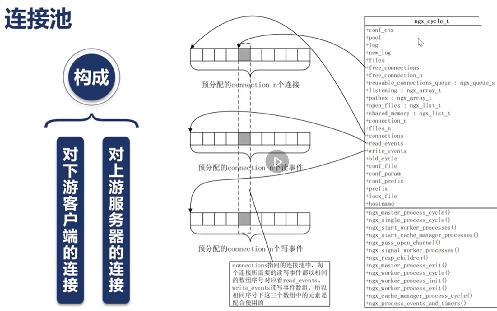
每一个worker进程，里面都有一个独立的ngx_cycle_t的数据结构
这里有三个主要的数组

- +connections
  - 这是一个数组，就是所谓的连接池，它的大小默认512(**这里可以看到512是很少的，Nginx上经常会有成千上万的连接，而且这个链接不止用于客户端的连接，也用于面向上游服务器的，所以做反向代理的时候，每个客户端都会消耗2个connection**)，这里每个数组的元素就相当于一个连接，而每个连接自动对应一个读事件和一个写事件，因此也有一个read_events和write_events数组的大小，它们大小和connection是一模一样的，而connections数组上的连接和read_events和write_events是根据序号，也就是数组下标对应的（也就是说比如第5个连接，自然对应着第5个读事件和第5个写事件），所以我们在考虑nginx能够释放多大性能的时候，首选需要把work_connectinos保证足够使用
  
  ```shell
  https://nginx.org/en/docs/ngx_core_module.html#worker_connections
  
  Syntax:	worker_connections number;
  Default:  worker_connections 512;  
  Context:	events
  ```
  - connections这个数组也影响nginx打开的内存大小，当我们配置更大的worker_connections也就意味着nginx使用了更大的内存，所以每个`nginx_connection_s`连接占用多大的内存？在64位操作系统，占用内存大约是232字节，具体nginx版本不同，可能会有微小差异，每一个nginx_connection对应两个事件，一个读事件，一个写事件，在nginx中每个事件对应的结构体是`ngx_event_s{}`,每个事件结构体所占用的内存大约是96字节，因此，一个连接所占用的内存就是232+96*2，我们worker_connections所设置的越大，预分配的内存就越多
  
  ``````C
  struct ngx_connection_s { // 总共232字节左右
      void *data;
      ngx_event_t *read;
      ngx_evetn_t *write; // 读写事件
      ngx_socket_t fd;
      // rev和send是操作系统的一个底层方法，定义怎样发送和接收
      ngx_recv_pt recv;
      ngx_send_pt send; // 抽象解耦os底层方法
      // off_t可以理解为一个无符号的整型，它表达该连接上已经发送了多少字节，也就是配置中经常使用到的bytes_sent变量，
      // bytes_sent变量的作用：通常会在access.log中记录该变量
      
      // nginx.conf中如下配置
      // log_format main '$remote_addr - $remote_user [$time_local] "$request" '
      //    '$status [$request_length:$bytes_sent] "$http_referer"'
      //    '"$http_user_agent" "$http_x_forwarded_for" "$upstream_cache_status"';
      
      off_t sent; // bytes_sent变量
      ngx_log_t *log; 
      ngx_pool_t *pool; // 初始connection_pool_size配置
      int type;
      struct sockaddr *sockaddr
      socklen_t socklen;
      ngx_str_t addr_text;
      ngx_str_t proxy_protocol_addr;
      in_port_t proxy_protocol_port;
      ngx_buf_t *buffer;
      ngx_queue_t queue;
  }
  ``````
  
  ``````C
  struct ngx_evetn_s { // 共96字节左右
      void *data;
      unsigned instance:1;
      unsigned timedout:1;
      unsigned timer_set:1;
      unsigned available:1;
      ngx_event_handler_pt handler;
      ngx_unit_t index;
      ngx_log_t *log;
      ngx_rbtree_node_1 timer;
      ngx_queue_t queue;
      ...
  }
  ``````
  
  
  
  - `ngx_events_s{}`结构体中的重要成员
    - `handler`这是一个回调方法，也就是很多第三方模块会把handler作为自己的实现
    - 我们在对http请求做读超时写超时设置时，其实是在设置读写事件结构体中的`timer`，这个timer就是nginx实现超时定时器也就是基于rbtree去实现的结构体，红黑树中每个成员叫做它的node，`timer`就是这个rbtree的node，用来指向读写事件是否超时
    - 定时器的配置
    ```shell
    https://nginx.org/en/docs/http/ngx_http_core_module.html#client_header_timeout
    
    Syntax:	client_header_timeout time;
    Default: client_header_timeout 60s;
    Context:	http, server
    ```
    - 当多个事件形成一个队列的时候，可以使用ngx_queue形成一个队列
- +read_events
- +write_events


上述讲解了Nginx_connection_t和nginx_event连接和事件是如何对应在一起的，当我们需要配置高并发的Nginx时，必须把connection的数目配置到足够大，而每个connection对应两个event都会消耗一定的内存，需要我们注意

nginx中很多结构体中，他们的一些成员和我们的内置变量是可以对应起来的，比如说：bytes_sent,或者body_bytes_sent等都是我们在access.log或者lua代码中，我们需要获取nginx的状态时，经常使用到的方法


## 内存池对性能的影响

虽然对nginx模块开发是在写C语言代码，但是我们不需要关心内存的释放，如果是在配置一些比较罕见的nginx使用场景，可能会需要修改Nginx在请求和连接上初始分配的内存池大小，但是Nginx官方上可能是写推荐通常不需要修改这样的配置，那么是否需要修改这样的配置需要我们去了解内存池是怎样运转的


``````C
struct ngx_connection_s { // 总共232字节左右
    void *data;
    ngx_event_t *read;
    ngx_evetn_t *write; // 读写事件
    ngx_socket_t fd;
    // rev和send是操作系统的一个底层方法，定义怎样发送和接收
    ngx_recv_pt recv;
    ngx_send_pt send; // 抽象解耦os底层方法    
    off_t sent; // bytes_sent变量
    ngx_log_t *log; 
    ngx_pool_t *pool; // 初始connection_pool_size配置
    int type;
    struct sockaddr *sockaddr
    socklen_t socklen;
    ngx_str_t addr_text;
    ngx_str_t proxy_protocol_addr;
    in_port_t proxy_protocol_port;
    ngx_buf_t *buffer;
    ngx_queue_t queue;
}
``````


每一个连接都会使用`ngx_connection_s`这样的结构体，在这个结构体中，有一个成员变量`ngx_pool_t *pool`这个pool，表示该连接所使用的内存池，这个内存池可以使用`connection_pool_size`进行配置


### 为什么需要内存池

我们可以用一些工具发现nginx产生的内存碎片是很小的，这就是内存池的一个功劳，内存池会把内存提前分配好一批，而且当我们使用小块内存的时候，它会使用next指针，将这些小块的内存一个个连接在一起，那每次使用的内存比较少的时候，第二次再分配小块内存的时候，会连接在一起去使用，这样就大大减少了我们的内存碎片


#### 通俗理解内存池如何减少内存碎片

**什么是内存碎片？**

- 当程序频繁地分配和释放内存（比如动态分配小块内存）时，内存会变得“不连续”。
- 比如：
  - 你申请了 4 KB、8 KB 的内存，用完释放了。
  - 这些小块的内存空闲了，但是不连续，造成碎片。
  - 如果后续需要一块 16 KB 的连续内存，系统可能无法找到，尽管总内存足够。


**内存池是怎么避免这个问题的？**

**1. 提前分配一大块内存：**

- **内存池**会一次性分配一大块连续的内存，比如 1 MB。
- 这样做避免了频繁从系统申请小块内存，减少系统级分配的碎片化问题。

**2. 将大块内存拆分成小块：**

- 内存池会把这 1 MB 划分成多个小块，比如 4 KB 一块。
- 当程序需要小内存（比如几百字节或几 KB），直接从这些小块中分配。

**3. 用“指针链”管理未用内存：**

- 如果某块内存没有用完，内存池会用“指针”把这些未使用的小块连接起来，形成一个链表。
- 这样后续再需要分配内存时，可以直接复用这些小块。


**举例说明****没有内存池的情况：**

1. 程序向系统申请 8 KB、16 KB、32 KB 内存，每次都是独立的分配。
2. 使用完释放时，可能留下不连续的小空闲块（碎片）。
3. 如果后续需要 64 KB 的连续内存，可能无法满足（尽管总内存足够）。

**有内存池的情况：**

1. 程序启动时，内存池一次性从系统申请 1 MB。
2. 程序需要 8 KB 内存时，从内存池中切一块 8 KB。
3. 程序释放 8 KB 后，内存池会将这块内存挂到“可用链表”上。
4. 下次程序需要 8 KB 内存时，直接从链表中取，避免重新向系统申请，减少碎片。


因为nginx主要在处理web请求，web请求对于http请求有两个非常明显的特点：

每当我们有一个tcp连接的时候，这个tcp连接上面可能会运行很多http请求，也就是所谓的Keepalived请求

连接没有关闭，执行完一条请求后，继续负责处理下一条请求，而我有一些内存为连接分配一次就够了，比如：我去读取每个请求的前1k字节，那么在连接内存池上，我分配一次，只要这个连接不关闭，那么这段1k的内存我永远不需要释放，直到连接关闭的时候，我才会使用掉这个内存。

对于请求内存池，每个http请求，我在分配的时候，并不清楚需要分配多大，但是http请求特别是http1.1而言，通常需要分配4k大小的内存，因为我们的URL或者header往往需要分配那么多，如果没有内存池，我们可能需要频繁并且小块的分配，而分配内存是有代价的，如果我们一次性分配较多的内存就没有这样的问题。而请求执行完毕后，哪怕链接还可以复用，我们也可以将这部分请求内存池销毁，而这样所有的nginx开发者就不需要考虑内存释放的问题，它只需要关注我是从请求内存池里面申请分配的内存还是从连接内存池申请分配的内存。


``````bash
# 在http_core_module中，有一个connection_pool_size

# 连接内存池
Syntax: connection_pool_size size;
# 这里并不是只能分配512,仅仅是说因为我提前分配了这么大，可以减少分配内存的次数
Default: connection_pool_size 256|512; #这个和操作系统位数相关
Context: http, server

# 请求内存池
Syntax: request_pool_size size;
Default: request_pool_size 4k;  # 这里请求内存池比较大是因为，对于连接而言，它需要保存的上下文信息比较少，只需要帮助后面的请求读取最初一部分字节就可以了，而对于请求而言我们需要保存大量的上下文信息，比如：所有读取到的url或者header,我们需要一直保存下来，而url通常比较长
# 官方说明这里的性能影响很小，但是如果是极端情况，比如你的url非常长，可以考虑将该参数放大，或者你的内存很小，url和header很小，也可以考虑将request_pool_size适当减少，这样nginx效率的内存会小一些，也意味着可以做更大并发量的请求
Context: http,server
``````


内存池就与减少内存碎片，对于第三方模块的快速开发是有很大意义的


## 共享内存

nginx是一个多进程程序，不同的worker进程间如果需要共享数据，只能通过共享内存，下面我们看看nginx中的共享内存是如何使用的


### nginx进程间的通信方式

- 基础同步工具
  - 信号
  - 共享内存
- 高级通讯方式
  - 锁
  - Slab内存管理器


nginx进程间的通信方式，主要有两种，一种是信号，上文的nginx进程管理中已经做了详细的介绍，那么如果需要做数据的同步呢？那么就需要通过共享内存，所谓共享内存，也就是我们打开了一块内存，比如说10M，那么一整块0~10M之间，多个worker进程之间可以同时的访问它，包括读取和写入，那么为了使用好这块共享内存，就会引入另外两个问题


第一问题就是**锁**，因为多个worker进程同时操作一块内存，一定会存在竞争关系，所以需要加锁，在nignx的锁中，在早期还有基于信号量的锁，信号量是Linux中比较久远的进程同步方式，它会导致进程进入休眠状态，也就是发生了主动切换，而现在大多数操作系统的版本中，Nginx所使用的锁都是**自旋锁**，而不会基于信号量。


自旋锁，也就是说，当锁的条件没有满足，比如说这块内存被一号worker进程使用，那么2号worker进程需要去获取锁的时候，只要1号进程没有释放锁，二号进程会一直不停的去请求这把锁

就好像如果是基于信号量的早期的Nginx的锁，那么假设这把锁锁住了一扇门，如果worker进程1已经拿到了这把锁，进到屋里，那么worker进程2视图去拿锁，敲门，发现里面已经有人了，worker进程2就会就地休息，等待worker进程1从门里出来后，去通知他，


而自旋锁不一样，worker进程2发现门里已经有worker进程1了，它就会一直持续的在敲门，所以使用自旋锁要求所有的nginx模块必须快速的使用共享内存，也就是快速的取得锁之后，快速的释放锁，一旦出现有第三方模块不遵守这样的规则，就可能导致死锁或者性能下降的问题。


那么有了这块共享内存，会引入第二个问题


因为一整块共享内存，往往是给很多对象同时使用的，如果我们在模块中，手动的去编写分配，把这些内存给到不同的对象，是非常繁琐的，所以这个时候，我们使用了slab内存管理器


### nginx使用共享内存的模块

``````bash
# Ngx_http_lua_api

# rebtree
Ngx_stream_limit_conn_module
Ngx_http_limit_conn_module
Ngx_stream_limit_req_module

http cache
    Ngx_http_file_cache
    Ngx_http_proxy_module
    Ngx_http_scgi_module
    Ngx_http_uwsgi_module
    Ngx_http_fastcgi_module
    
ssl
    Ngx_http_ssl_module
    Ngx_mail_ssl_module
    Ngx_stream_ssl_module
    
# 单链表
Ngx_http_upstream_zone_module
Ngx_stream_upstream_zone_module
``````


我们在做限速或者流控等等场景时，我们是不能容忍在内存中做的，否则一个worker进程对某一个用户触发了流控，而其他worker进程还不知道，所以我们只能在共享内存中做。比如说limit_conn，limit_req，还有所有的http cache做反向代理时用的


红黑树有个特点：就是他的插入删除非常的快，当然也可以做遍历，所以这些模块都有一个特点，就是需要做快速的插入和删除，比如发现了一个客户端，对他限速，限速如果达到了，我需要将它的客户端从我的限速的数据结构容器中移出，都需要非常的快速。


第二个常用的数据结构是单链表，也就是只需要将这些需要共享的元素串起来就可以了比如`Ngx_http_upstream_zone_module`


共享内存是nginx跨worker通信的做有效的手段，只要我们需要让一段业务逻辑在多个worker进程中同时生效，比如许多在集群的流控上，那么必须使用共享内存，而不能再每一个worker内存中去使用


### slab管理器

Nginx不同的worker进程间需要共享信息的时候，只能通过共享内存，我们也谈到了共享内存上可以使用链表或者红黑树这样的数据结构，但是每个红黑树上有很多节点，每个节点都需要分配内存去存放，那么如何把一整块共享内存切割成小块给红黑树上的每个节点去使用呢，下面看下slab内存分配管理是怎样应用于共享内存上的


# 详解HTTP模块

Nginx的模块非常多，包括官方模块和第三方模块，而每个模块又有各自独特的指令，这繁多的指令其实记忆起来都是很苦难的，那么在这一部分中，我们将以请求处理流程的方式，把所有的常用的http模块的指令梳理在一起，把http模块以在nginx设计架构中定义的11个阶段的方式依次的去讲解每一个模块的使用方法，在Nginx11个阶段讲完之后，我们还会讲到Nginx的http过滤模块，它会通过加工我们向客户端返回的响应，来给客户端返回不一样的内容，最后还会介绍Nginx的核心的一个概念：变量，Nginx通过变量来实现非常繁复的功能，与它低层的以高性能为主的这样一种实现，来进行解耦，基于变量Nginx提供了非常多样化的功能。


## HTTP配置指令的嵌套结构


### 一个典型的配置块嵌套

``````nginx
main
http {
    upstream {...}
    split_clients {...}
    map {...}
    geo {...}  # 上面这些模块时http中某一个模块，自己可以配置自己的配置块
    #----------------------------------------------------------------------
    # http --> server --> location，这三个是非常核心的，这是http的框架定义的，因为我们处理一个请求的时候需要先按照请求中指示的域名，
    # 比如根据host，找到相应的server块，
    # 然后再根据uri，找到某一给location，
    # 然后根据location下面具体的指令来处理请求
    server {
        if () {...}
        location {
            limit_except{...}
        }
        location {
            location {
                
            }
        }
    }
    server{
        
    }
}
``````


在这个嵌套中，我们会发现很多冲突，或者奇怪的指令


### 理解指令的Context

``````bash
# 示例
syntax: log_format name [escape=default|json|none] string...;
Default: log_format conbined "...";
Context: http

Syntax: access_log path [format[buffer=size][gzip[=level]][flush=time][if=condition]];
        access_log off
Default: access_log logs/access.log combined;
Context: http, server, location, if in location, limit_except
``````


### 指令的合并

当指令在多个上下文同时存在的时候，它是可以和合并的，但是并不是所有的指令都可以合并


#### 指令合并的整体规则

所有的指令分为两类指令

- **值指令**：存储配置项的值
  - 可以合并
  - 示例
    - root
    - access_log
    - gzip
- **动作类指令**：指定行为
  - 不可以合并
  - 示例
    - rewrite
    - proxy_pass
  - 生效阶段（后面介绍11个阶段的时候会讲到）
    - server_rewrite阶段
    - rewrite阶段
    - content阶段


#### 存储值的指令继承规则：向上覆盖

- 子配置不存在时，直接使用父配置块
- 子配置存在时，直接覆盖父配置块

``````nginx
server {
    listen 8080;
    root /home/mystical/nginx/html;
    access_log logs/mystical.access.log main;
    location /test {
        root /home/mystical/nginx/test; # 子配置存在时，直接使用子配置，覆盖掉父配置 
        access_log logs/access.test.log main;
    }
    location /dlib {
        alias dlib/;
    }
    location / {
        # 这里location会继承父配置快server下的root指令
    }
}
``````


### HTTP模块合并配置的实现

Nginx的官方模块都遵循上述的配置值指令的合并规则，但是有一些第三方模块很可能没有遵循这套规则，这个时候如果它相应的说明文档也不是非常详细的话，就需要我们通过源码来判断，当它们的值指令出现冲突的时候，究竟以哪一个为准


如何通过源码判断：抓住一下四个点

- 指令在哪个快下生效？

  - 部分指令在Server快下生效
  - 大部分指令在location块下生效

- 指令允许出现在哪个块下？

- 在server块内生效，从http向server合并指令

  - 当这个指令是在server块内生效的话，它会定义一个方法

  ``````C
  char *(*merge_srv_conf)(ngx_conf_t *cf, void *prev, void *conf);
  // 当这个指令即出现在http块下，也出现在server块下的时候，那么从http向server合并的时候，会提供一个函数是merge_srv_conf
  
  // 如果是在location中生效，就是merge_loc_conf
  char *(*merge_loc_conf)(ngx_conf_t *cf, void *prev, void *conf);
  ``````

  

- 配置缓存在内存


#### 源码分析 -- referer防盗链模块

``````C
// 任何一个模块都会有要给结构体叫ngx_module_t
// 这个模块所有的配置指令都在ngx_command_t中
ngx_module_t  ngx_http_referer_module = {
    NGX_MODULE_V1,
    &ngx_http_referer_module_ctx,          /* module context */
    ngx_http_referer_commands,             /* module directives */
    NGX_HTTP_MODULE,                       /* module type */
    NULL,                                  /* init master */
    NULL,                                  /* init module */
    NULL,                                  /* init process */
    NULL,                                  /* init thread */
    NULL,                                  /* exit thread */
    NULL,                                  /* exit process */
    NULL,                                  /* exit master */
    NGX_MODULE_V1_PADDING
};

// 这个模块所有的配置指令都在ngx_command_t这样一个数组中，这个数组中的每个元素就是一条指令，
static ngx_command_t  ngx_http_referer_commands[] = { 

    { ngx_string("valid_referers"),// 比如valid_referers,
      NGX_HTTP_SRV_CONF|NGX_HTTP_LOC_CONF|NGX_CONF_1MORE,// 它允许出现在哪些快下：SRV,LOC,它可以携带几个参数：1More
      ngx_http_valid_referers,
      NGX_HTTP_LOC_CONF_OFFSET,
      0,
      NULL },
    
    { ngx_string("referer_hash_max_size"),
      NGX_HTTP_SRV_CONF|NGX_HTTP_LOC_CONF|NGX_CONF_TAKE1,
      ngx_conf_set_num_slot,
      NGX_HTTP_LOC_CONF_OFFSET,
      offsetof(ngx_http_referer_conf_t, referer_hash_max_size),
      NULL },
        
    { ngx_string("referer_hash_bucket_size"),
      NGX_HTTP_SRV_CONF|NGX_HTTP_LOC_CONF|NGX_CONF_TAKE1,
      ngx_conf_set_num_slot,
      NGX_HTTP_LOC_CONF_OFFSET,
      offsetof(ngx_http_referer_conf_t, referer_hash_bucket_size),
      NULL },

      ngx_null_command
};

// 所有的指令解析完后，需要做合并，合并要看ngx_http_module_t这样的一个函数
// 这个函数定义了可能出现的8个回调方法，
static ngx_http_module_t  ngx_http_referer_module_ctx = {
    ngx_http_referer_add_variables,        /* preconfiguration */
    NULL,                                  /* postconfiguration */

    NULL,                                  /* create main configuration */
    NULL,                                  /* init main configuration */

    NULL,                                  /* create server configuration */
    NULL,                                  /* merge server configuration */

    ngx_http_referer_create_conf,          /* create location configuration */
    // 以上所说的指令都是指在location下生效的，所以需要把http，server这些块下的指令向location这里合并，在方法中可以看到规则
    ngx_http_referer_merge_conf            /* merge location configuration */
};

// 这个方法中的第二个参数parent，就是它的父指令，child就是当前的子指令，下方可以看到它们进行合并的方法
ngx_http_referer_merge_conf(ngx_conf_t *cf, void *parent, void *child)
{
    ngx_http_referer_conf_t *prev = parent;
    ngx_http_referer_conf_t *conf = child;

    ngx_uint_t                 n;
    ngx_hash_init_t            hash;
    ngx_http_server_name_t    *sn;
    ngx_http_core_srv_conf_t  *cscf;

    if (conf->keys == NULL) {
        conf->hash = prev->hash;

#if (NGX_PCRE)
        ngx_conf_merge_ptr_value(conf->regex, prev->regex, NULL);
        ngx_conf_merge_ptr_value(conf->server_name_regex,
                                 prev->server_name_regex, NULL);
#endif
        ngx_conf_merge_value(conf->no_referer, prev->no_referer, 0);
        ngx_conf_merge_value(conf->blocked_referer, prev->blocked_referer, 0);
        ngx_conf_merge_uint_value(conf->referer_hash_max_size,
                                  prev->referer_hash_max_size, 2048);
        ngx_conf_merge_uint_value(conf->referer_hash_bucket_size,
                                  prev->referer_hash_bucket_size, 64);

        return NGX_CONF_OK;
    }

    if (conf->server_names == 1) {
        cscf = ngx_http_conf_get_module_srv_conf(cf, ngx_http_core_module);

        sn = cscf->server_names.elts;
        for (n = 0; n < cscf->server_names.nelts; n++) {

#if (NGX_PCRE)
            if (sn[n].regex) {

                if (ngx_http_add_regex_server_name(cf, conf, sn[n].regex)
                    != NGX_OK)
                {
                    return NGX_CONF_ERROR;
                }

                continue;
            }
#endif
            .....
        }
``````


## Listen指令

``````nginx
Syntax:	listen address[:port] [default_server] [ssl] [http2 | quic] [proxy_protocol] [setfib=number] [fastopen=number] [backlog=number] [rcvbuf=size] [sndbuf=size] [accept_filter=filter] [deferred] [bind] [ipv6only=on|off] [reuseport] [so_keepalive=on|off|[keepidle]:[keepintvl]:[keepcnt]];
listen port [default_server] [ssl] [http2 | quic] [proxy_protocol] [setfib=number] [fastopen=number] [backlog=number] [rcvbuf=size] [sndbuf=size] [accept_filter=filter] [deferred] [bind] [ipv6only=on|off] [reuseport] [so_keepalive=on|off|[keepidle]:[keepintvl]:[keepcnt]];
listen unix:path [default_server] [ssl] [http2 | quic] [proxy_protocol] [backlog=number] [rcvbuf=size] [sndbuf=size] [accept_filter=filter] [deferred] [bind] [so_keepalive=on|off|[keepidle]:[keepintvl]:[keepcnt]];
Default:	
listen *:80 | *:8000;
Context:	server  # 只能出现在server的配置块下
``````


示例

``````nginx
listen unix:/var/run/nginx.sock; // 监听unix.socket地址
listen 127.0.0.1:8000;
listen 127.0.0.1;   # 默认使用80端口
listen 8000;
listen *:8000;
listen localhost:8000 bind;
listen [::]:8000 ipv6only=on;
listen [::1];
``````


了解listen指令后，可以从这里开始，从连接建立起，到我们收到请求，怎样处理请求，完整的去介绍每一个http模块的用法


## 处理HTTP请求头部的流程


http请求报文

``````http
HTTP-message = start-line*(hearder-field CRLF)CRLF[message-body]
``````


在http模块开始处理用户请求之前，首先我们需要nginx的框架先对客户端建立好连接，然后接收用户发来的http的start-line，比如说方法，url等，然后再去接收到所有的header，根据这些header信息，我们才能决定选用哪些配置块，才能解决让http模块怎样处理请求，所以我们先来看下，nginx框架是怎样建立连接以及接收http请求的


### 接收请求事件模块


在下面这样图中，分为3个层次来讲nginx从建立连接到接收请求的这个过程

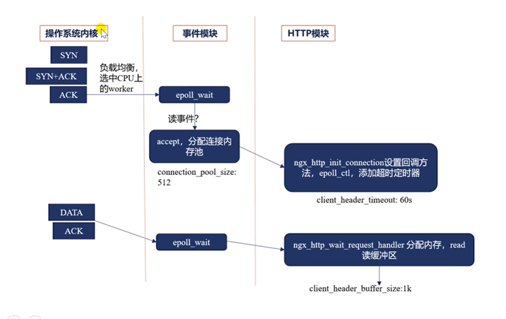

分三次层次讲述这个过程

- 首先是操作系统内核，比如三次握手，用户发送一个`syn`包，内核会返回一个`syn+ack`表示确认，然后用户端再次发送`ack`的时候，内核收到这个`ack`包，会认为这次连接建立成功
- 我们有很多worker进程，每个worker进程可能都监听了80/443端口，操作系统会根据它的负载均衡算法（后续会详讲）会选中CPU上的某个worker进程，这个worker进程会通过epoll中的epoll_wait()方法，会返回到刚刚建立好的连接的句柄(到事件数组中)，nginx在拿到这个建立好连接的句柄后（这其实是一个读事件，因为读到了要给ack报文），我们找到了这个句柄是我们监听的80/443端口，我们就会调用accept()这个方法，在调用accept()的时候，我需要分配连接内存池`connect_pool_size: 512`，（在nginx中分为连接内存池和请求内存池，这里是连接内存池），到这一步，nginx会为这个连接分配512字节的内存池
- 分配完内存池，建立好连接后我们的所有http模块开始从事件模块的手中接入请求的处理过程了，http模块在启动的时候会定义一个方法，叫做`ngx_http_init_connection`设置回调方法，也就是会说当accept()建立一个新连接的时候，这个方法就会被回调执行，这个时候需要把新建立的连接的读事件添加到epoll中，通过epoll_ctl这个函数，然后还要添加一个定时器，表示如果60秒内我还没有接收到请求，就超时，就是`client_header_timeout: 60s`。这个模块处理完之后，可能nginx的事件模块就切到其他的去处理了
- 当客户端返回的是一个带有数据DATA的GET或者POST请求，事件模块的epoll_wait再次拿到这个请求，这个请求的回调方法就是ngx_http_wait_request_handler分配内存，这一步中需要把内核收到的data读到nginx的用户态中，要读到用户态中，就需要分配内存，这个内存需要分配多大？从哪里分？首先，我们从连接内存池中进行分配，这个连接内存池初始分配了512字节，这个时候我们需要从内存池中再分配1k，因为内存池是可以扩展的嘛，它只是初始分配了512字节，这个1k是可以改的，就是`client_header_buffer_size:1k`，这个大小的更改并不是越大越好，这里可以看到，哪怕用户只发送1字节的数据，nginx就要分配1k的内存出来，所以放的很大并不合适
（这里无论用户发送多大的数据，nginx都会分配指定比如1k的内存出来，所以放的很大并不合适）


当接收的请求（url或者header非常大）超过1k时

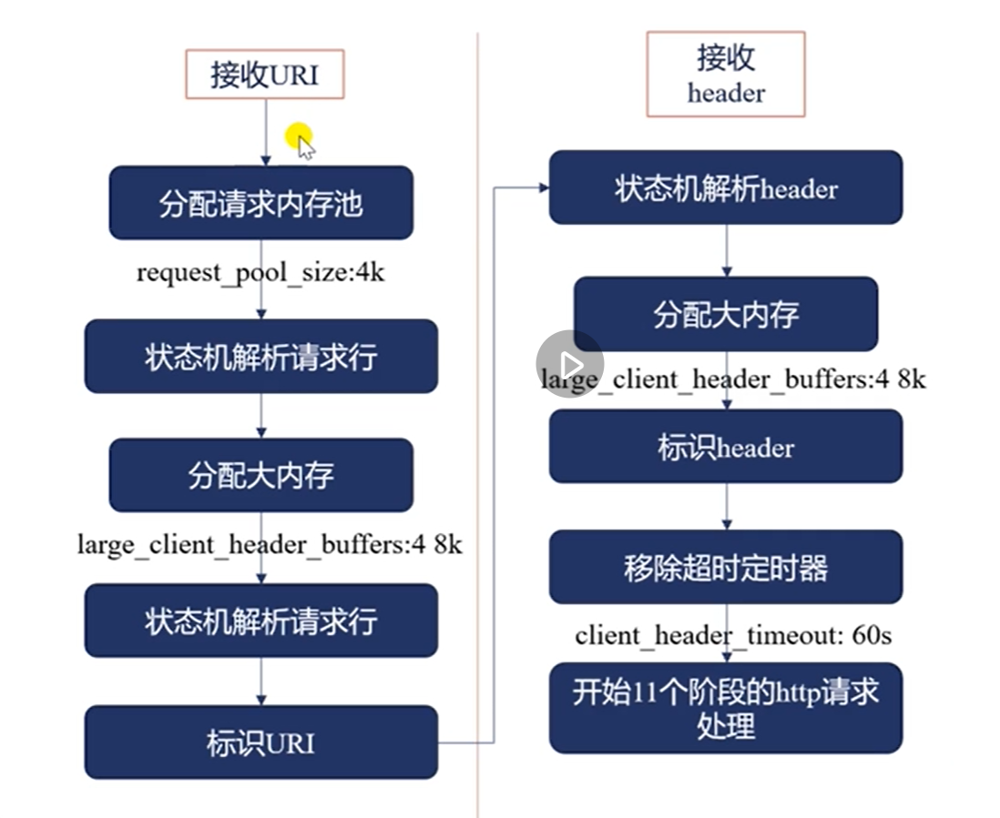

刚刚分配完1k的内存空间以后，这个时候我已经收到了小于等于1k的请求内容

这里处理请求和处理连接是不一样的，处理连接的话，可能我只需要把连接收到我的nginx内存中就ok，但处理请求可能需要进行大量的上下文分析，去分析http协议，分析每一个header，所以此时要分配一个请求内存池，请求内存池默认分配4k（`request_pool_size:4k`），因为请求的上下文通常涉及业务，因此分配的会大一点，4k通常是比较合适的数值，如果分配的很小的话，可能就会需要请求内存池不断的扩充，当我们分配内存的次数变多的时候，性能肯定会下降的，所以connection_pool_size要不要改需要根据业务来的，我们可以根据实际业务情况来绝对是否需要修改内存池

分配完内存池后，nginx会使用状态机解析请求行（start_line），解析请求行的时候可能会发现有的url特别大，已经超过了刚刚分配的1k的内存，此时就要分配一个更大的内存`large_client_header_buffers:4 8k`（这里并不是直接分配32k，而是先分配1个8k，然后将1k的内容拷贝到这里，此时还剩7k，我们用剩余的7k内存再去接收httpurl，看url是不是解析完了，如果8k的url实在是太长了，8k还没有接收完，就会再分配第二个8k，最多分配32k）

当我完整的解析完请求行，通过解析到\R\N，我就可以标识url（表示url就是nginx有很多变量，这些变量并不是复制一份，而仅仅是有一个指针指向我们接收到的请求行，也因此nginx性能才会如此强大），那么标识完url，nginx会继续解析http的各首部字段header

http的header可能非常长，因为里面可能有cookie，还有很多的hosts等字段，heade是非常有可能超过1k的，因此我们还是需要分配大内存，而这个大内存和之前的哪个解析请求头是的大内存是共用的，如果url用掉了2个8K，那么在接收header时就只剩下2个8K，所以`large_client_header_buffers:4 8k`，是针对所有的，

状态机解析header各字段，然后如果当前分配的内存不足以放header的各字段，就还会分配内存，这里接受请求行的内存和接收header各字段的共用一个内存，共用4*8k的内存

接收完完整的header后，标识header，标识header的过程中，但是收到hosts的字段时会确定哪个server块来处理这个请求，当我标识完所有的header后，会移除超时定时器，`client_header_timeout: 60s`，这里就可以看出，什么时候需要修改这个60s，也就是说当我们收完完整的header，到底可能最长两次接收之间，需要多长事件，也就是我们这个60s应该是怎样的。

当接收完所有header后，就会开始核心的过程：（**上述流程都是nginx的框架执行的**）

**开始11个阶段的http请求处理**，上述所有的过程都nginx的框架处理的，后续的内容才是http模块来处理


### nginx从建立连接到接收请求的过程


#### Listen_fd是什么？

**发起端口监听时，内核会动态创建一个 `listen_fd`（监听套接字）**，并为该套接字分配必要的内核资源来管理连接。这是由以下步骤实现的：


#### `listen_fd` 的创建过程

**创建套接字：`socket()`**

- 用户调用 `socket()` 系统调用，内核动态创建一个套接字并返回一个文件描述符（`listen_fd`）。
- 这个文件描述符是一个整数标识符，用于在用户空间引用内核中的套接字。

```C
int listen_fd = socket(AF_INET, SOCK_STREAM, 0);
```

- 内核同时分配与该文件描述符关联的资源：
  - 一个 `file` 结构（文件对象）。
    - 这个file是全局文件打开表的一个条目
  - 一个 `socket` 结构（套接字对象）。
  - 一个协议控制块（如 TCP 的 `tcp_sock` 结构）。

**绑定地址和端口：`bind()`**

- 用户通过 `bind()` 将套接字绑定到一个特定的 IP 地址和端口。
- 内核会在套接字中记录绑定的地址和端口信息。

```C
cCopy codestruct sockaddr_in addr;
addr.sin_family = AF_INET;
addr.sin_addr.s_addr = htonl(INADDR_ANY);
addr.sin_port = htons(8080);
bind(listen_fd, (struct sockaddr*)&addr, sizeof(addr));
```

**开启监听：`listen()`**

- 用户调用 `listen()`，将套接字设置为监听状态。

- 内核在 

  ```
  tcp_sock
  ```

   中初始化两个队列：

  - **SYN 队列**：用于存储半连接。
  - **accept 队列**：用于存储全连接。

```C
listen(listen_fd, 128);  // 128 是 backlog 参数，表示 accept 队列的最大长度
```

**监听套接字动态创建的资源：**

- ```
  listen_fd
  ```

   对应的 

  ```
  socket
  ```

   结构关联了：

  - **地址和端口信息**。
  - **队列状态（SYN 队列和 accept 队列）**。
  - **连接处理函数（协议栈实现）**。


#### `listen_fd`这个文件描述符由监听服务创建，以Nginx为例

**Nginx 主进程（`master`）**

- 主进程启动时调用 `socket()` 和 `listen()` 创建 `listen_fd`。
- 它负责初始化监听套接字，但不直接处理连接。

**Nginx 子进程（`worker`）**

- 主进程将 `listen_fd` 继承或传递给子进程（`worker`）。
- 子进程通过 `epoll_wait()` 监听 `listen_fd` 上的事件，当有新连接到达时，子进程调用 `accept()` 获取连接。


#### **文件描述符表中的 `listen_fd`**

- 每个进程的文件描述符表
  - 文件描述符表是每个进程独有的结构，用于管理该进程打开的文件、套接字等资源。
  - `listen_fd` 是该表中的一个条目，对应一个监听套接字。

#### **具体流程**

1. **创建 `listen_fd`**
   - 服务器程序通过 `socket()` 创建监听套接字。
   - 内核在该进程的文件描述符表中分配一个条目，指向内核的 `socket` 结构。
2. **监听新连接**
   - 服务器程序通过 `listen_fd` 调用 `listen()`，开启监听功能。
   - 随后，程序通过 `epoll_wait()` 或类似机制监听 `listen_fd` 的事件。
3. **获取新连接**
   - 当有新连接到达时，内核通知服务器进程。
   - 服务器进程调用 `accept()` 从 accept 队列中取出连接。


#### **多进程共享 `listen_fd`**

1. **多进程（如 Nginx 或 Apache）**
   - 在多进程服务器中，`listen_fd` 可以被多个进程共享。
   - 例如：
     - Nginx 主进程创建 `listen_fd` 后，将其传递给多个 worker 进程。
     - 所有 worker 进程通过 `epoll` 或 `kqueue` 监听同一个 `listen_fd` 上的事件。
2. **共享机制**
   - 共享 `listen_fd` 的进程会竞争新连接。
   - 内核通过负载均衡策略（如 SO_REUSEPORT）决定哪个进程处理新连接。


#### `tcp_sock` 是什么？它在哪里？

- `tcp_sock`

   是 Linux 内核中 TCP 协议的核心控制块，存储了与 TCP 连接相关的状态和资源。

  - 它是套接字（`socket`）中专门为 TCP 连接设计的数据结构。
  - 对于 `listen_fd`：
    - `tcp_sock` 中会存储监听套接字的状态和队列信息（SYN 队列、accept 队列）。

#### `tcp_sock` 结构中包含的重要字段：

```C
codestruct tcp_sock {
    struct request_sock_queue req;  // SYN 队列
    struct listen_sock_queue accept; // accept 队列
    ...
};
```

#### 如何关联：

- `file->f_inode` -> `inode->private_data` -> `tcp_sock`。

------

#### **整个链路的流程图**

以下是 `listen_fd` 的数据结构链路：

1. **用户态的 `listen_fd`**
   - 表示文件描述符表中的索引。
   - 指向内核中 `file` 结构。
2. **内核中的 `file`**
   - 位于全局文件打开表。
   - 指向 `inode`，同时包含文件的特定操作信息。
3. **内核中的 `inode`**
   - 套接字的 `inode` 特殊，记录网络协议栈的入口。
   - 指向 `tcp_sock`（通过 `inode->private_data`）。
4. **内核中的 `tcp_sock`**
   - 存储与监听套接字相关的核心信息，包括 SYN 队列和 accept 队列。

------

#### **具体代码例子**

以下简化的伪代码展示了从 `listen_fd` 到 `tcp_sock` 的链路：

```
cCopy codeint listen_fd = socket(AF_INET, SOCK_STREAM, 0); // 创建监听套接字
bind(listen_fd, ...);                            // 绑定地址和端口
listen(listen_fd, 128);                          // 开启监听

// 内核中对应的链路
file = fd_table[listen_fd];                     // 进程文件描述符表
inode = file->f_inode;                          // 全局文件打开表条目
tcp_sock = inode->private_data;                 // 指向协议控制块
```


### Nginx的工作流程

#### nginx启动时

**listen_fd**通过**epoll_ctl()**注册到**epoll**中。--- 这里epoll表现为一个文件描述符**epoll_fd**

``````bash
[root@magedu fd]$ ll -i
total 0
105394 dr-x------ 2 nginx nginx  9 Dec  7 23:01 ./
105304 dr-xr-xr-x 9 nginx nginx  0 Dec  7 22:58 ../
106345 lrwx------ 1 nginx nginx 64 Dec  7 23:01 0 -> /dev/null
106346 lrwx------ 1 nginx nginx 64 Dec  7 23:01 1 -> /dev/null
106347 l-wx------ 1 nginx nginx 64 Dec  7 23:01 2 -> /apps/nginx/logs/error.log
106349 l-wx------ 1 nginx nginx 64 Dec  7 23:01 4 -> /apps/nginx/logs/access.log
106350 l-wx------ 1 nginx nginx 64 Dec  7 23:01 5 -> /apps/nginx/logs/error.log
106351 lrwx------ 1 nginx nginx 64 Dec  7 23:01 6 -> 'socket:[105298]'=
106352 lrwx------ 1 nginx nginx 64 Dec  7 23:01 7 -> 'socket:[106174]'=

#刚启动的Nginx会生成两个指向socket文件的文件描述符，一个listen_fd，一个epoll_fd
``````

listen_fd是被epoll监听的对象


#### epoll如何监听listen_Fd


- 首先调用**epoll_create()**，创建**epoll实例** ----  此时生成一个**epoll_fd**，这个epoll_fd指向 **eventpoll 结构体**

``````C
int epoll_fd = epoll_create1(0);
``````


- 使用**epoll_ctl()**注册**listen_fd**，监听EPOLLIN（可读）事件

``````C
struct epoll_event event;
event.events = EPOLLIN;  // 监听 "可读" 事件
event.data.fd = listen_fd; // 数据中保存 listen_fd
epoll_ctl(epoll_fd, EPOLL_CTL_ADD, listen_fd, &event);
``````


#### epoll_ctl() 发生了什么？

- **内核创建一个 epitem 结构**，它表示 listen_fd 。

- **epitem 被放入 rbtree**（红黑树），rbtree 是 epoll 维护的一个数据结构，用于高效的增删改操作。

- **epitem 记录 listen_fd 和监听的事件 EPOLLIN**。

- rbtree 中的 epitem 的 `file` 字段指向**全局文件打开表 (struct file) 中的 file 结构**，file 结构的 `private_data` 字段指向**监听的 socket**。

``````C
// epitem结构
struct epitem {
    struct rb_node rbn;                   // 红黑树中的节点
    struct list_head rdllink;             // 等待链表的链接
    struct eventpoll *ep;                 // eventpoll 结构的指针
    struct file *file;                    // 被监听的文件对象 (listen_fd 或 client_fd)
    struct epoll_event event;             // 监听的事件（EPOLLIN、EPOLLOUT 等）
};
``````


#### 监听是如何实现的？（内核的详细机制）

**监听本质上是通过“内核数据结构的管理”和“文件描述符的事件通知”实现的。**


**epoll_fd 是如何关联 listen_fd 的？**

- 每个 epoll 实例（epoll_fd）都有一个 `eventpoll` 结构：

``````
struct eventpoll {
    struct rb_root rbr; // rbtree，存储 epitem
    struct list_head rdllist; // 就绪的 fd 列表
};
``````

- 当调用 `epoll_ctl(EPOLL_CTL_ADD, listen_fd)` 时：
  - 内核会创建一个**epitem 结构**，将 listen_fd 和监听的事件（EPOLLIN）存入 epitem 中。
  - **epitem 被插入 rbtree**，rbtree 是一个红黑树，用于存储**所有监听的文件描述符（fd）**。
  - epitem 中的**file 字段**指向**全局文件打开表的 file 结构**，file 结构的**private_data 指向 socket**。


**epoll 是如何检测 listen_fd 的可读事件的？**

- **epoll_wait()** 的本质是**监听 rbtree 中的监听对象（epitem）是否触发了事件**。

``````C
int n = epoll_wait(epoll_fd, events, maxevents, timeout);
``````


- 在内核中，epoll_wait() 调用了：

``````C
do_epoll_wait() {
    for (每个监听的 epitem) {
        // 检测是否有就绪的 fd
        if (fd 触发 EPOLLIN) {
            // 将 epitem 从 rbtree 移到 rdllist
            将 epitem 加入 rdllist;
        }
    }
    // 取出 rdllist 中的就绪事件，返回给用户
    return 已就绪的 fd;
}
``````


**如何检测 fd 的可读事件？**

- listen_fd 的背后是**socket 结构**。
- 当有新连接到来时，内核会将客户端的请求从**SYN 队列转移到 accept 队列**。
- **listen_fd 的可读状态变为 true**，并触发**EPOLLIN 事件**。
- epoll_wait() 就会将这个事件放入**rdllist**，并返回。


**listen_fd 一直在 rbtree 中，而在它就绪时，epitem 的指针会被引用到 rdllist（就绪链表）中，处理完事件后，epitem 的指针从 rdllist 中移除，但 epitem 本身始终保留在 rbtree 中。**


#### 新连接到来，监听到 listen_fd 可读

- 当有客户端请求到来时，内核会将请求从**SYN 队列**转移到**accept 队列**。
- Nginx 通过 **epoll_wait()** 检测到 listen_fd 可读：

``````C
// 本质是监听epitem
epoll_wait(epoll_fd, events, maxevents, timeout);
``````


- Nginx 使用 accept() 从 accept 队列中取出**新连接的 client_fd**：

``````C
client_fd = accept(listen_fd, ...);
``````


- epoll_ctl() 将 client_fd 注册到 epoll

``````C
epoll_ctl(epoll_fd, EPOLL_CTL_ADD, client_fd, &event);
``````


``````scss
rbtree (监听的文件描述符)
   +-------------------+
   | epitem (listen_fd) |  
   | epitem (client_fd) | 
   +-------------------+

rdllist (就绪的文件描述符)
   +--------------------+
   | epitem (listen_fd)  |  (epitem 从 rbtree 中 "引用" 过来)
   | epitem (client_fd)  |
   +--------------------+

epoll_wait()
    ↓ 提取 rdllist 中的 epitem 事件
    ↓ 读取 epitem.event 中的 fd 和事件类型
    +-----------------+
    | fd: 3, EPOLLIN  |  (监听的 listen_fd 事件)
    | fd: 5, EPOLLIN  |  (客户端的 client_fd 事件)
    +-----------------+

``````


### Nginx中的连接池

Nginx 维护的“连接池（连接数组）”是 Nginx 用来高效管理客户端连接的一个重要机制。

**每个新的 client_fd（客户端连接的文件描述符）会在 Nginx 中与一个 `ngx_connection_t` 结构体关联**，这个结构体用来管理和表示与这个客户端连接的**所有相关数据和上下文**。


#### 什么是连接池

**连接池的本质**

- 连接池本质上是一个**固定大小的内存数组**，这个数组中的每一项都是一个**ngx_connection_t** 结构体的实例。
- 每个 **ngx_connection_t** 都是一个**表示客户端连接的“逻辑抽象对象”**，专门用来存储 client_fd、缓冲区、读/写事件等。
- 连接池的核心思想是**复用连接资源**，不需要每次新建一个 `ngx_connection_t`，而是从**数组中“借出一个连接对象”**。


**连接池的关键属性**

- **大小固定**：在 Nginx 启动时，连接池的大小是通过 `worker_connections` 参数配置的。
- **预先分配**：在 Nginx 启动时，连接池中的 `ngx_connection_t` 结构体会一次性分配完成。
- **可复用**：当客户端断开连接时，**释放的连接对象会被放回池中，供下次请求复用**。
- **高效的管理**：不使用 `malloc/free` 动态分配，而是**固定的结构体数组**，管理效率高。


**连接池的核心结构**

- Nginx 在**每个 worker 进程中都会维护一个连接池**，这个连接池是一个数组。
- 这个数组的大小是 `worker_connections`，所以**每个 worker 进程最多可以管理的并发连接数是 worker_connections**。


**连接池的分配和回收**

- **新连接到来**时，从连接池中**取出一个可用的 ngx_connection_t**，并将 client_fd 赋值给它。
- **连接关闭**时，将这个 ngx_connection_t 重新**放回到空闲连接池**，以供复用。


#### 连接数组是什么？

**连接数组的本质是一个静态分配的 `ngx_connection_t` 结构体的数组**。

每个 `ngx_connection_t` 代表一个客户端的 TCP 连接。
这些数组会在**Nginx worker 进程启动时提前分配好**，不在请求的过程中动态分配。


**连接数组的定义**

Nginx 在 `ngx_connection_t` 的管理中，定义了一个数组，用来存储所有的连接。

``````C
ngx_connection_t *connections;   // 连接池的起始地址
ngx_connection_t *free_connections; // 空闲连接的链表头
ngx_uint_t        free_connection_n; // 当前空闲的连接数
``````

- **connections**：这是一个**数组**，大小为 `worker_connections`，表示 Nginx 所有的可用连接。

- **free_connections**：这是一个**链表头**，表示当前未使用的连接链表。

- **free_connection_n**：记录了当前**空闲的连接数量**，用于高效的连接调度。


#### Nginx 连接池的关键数据结构

**连接数组的实现**

- 在 Nginx 的worker 进程启动时，会创建一个大小为 `worker_connections` 的数组：

  ```C
  connections = (ngx_connection_t *) malloc(worker_connections * sizeof(ngx_connection_t));
  ```

- 这个数组中的每一项，都是一个**ngx_connection_t 结构体**。

- **注意：数组中的每一项在开始时都没有分配具体的连接数据（如请求头、HTTP 上下文等）**，这些数据会在连接到来时分配。


**如何获取一个可用的连接？**

- Nginx 使用一个**空闲链表 (free_connections)** 来维护当前**未使用的连接对象**。
- 当新的**client_fd 到来**时，Nginx 会从**free_connections 链表头中获取一个 ngx_connection_t**。
- 当连接关闭时，**将 ngx_connection_t 放回到 free_connections 链表头**，实现**复用连接对象的目的**。


#### 连接的分配和释放的过程


**连接分配过程**

1. **客户端连接到来**，Nginx 在 listen_fd 上监听到一个新连接。
2. Nginx 调用 **accept()**，返回一个 **client_fd**。
3. 从 **free_connections 链表头** 中取出一个**ngx_connection_t**，如果链表为空，Nginx 将返回**连接已满**。
4. 将 **client_fd** 存入 **ngx_connection_t->fd**，并将与 client 相关的**缓冲区、请求头等数据分配在内存池中**。


**连接关闭过程**

1. **连接关闭**（例如，客户端发出 FIN 包）。
2. Nginx 调用 **ngx_close_connection()**，销毁这个连接。
3. 连接的**内存池被销毁**，这会回收内存池中所有的内存。
4. **将 ngx_connection_t 放回到 free_connections 链表**，供下次新连接复用。


#### `worker_connections` 数组和 `free_connections` 链表

**关键数据结构**

**worker_connections (连接数组)**

- **本质**：这是一个 Nginx 中的**ngx_connection_t 结构体的数组**。
- **数量**：这个数组的大小是 Nginx 配置文件中 `worker_connections` 参数的值。
- **作用**：存储 Nginx 进程中**所有的活动连接和空闲连接**。
- **数据类型**：`ngx_connection_t` 数组，**每个 ngx_connection_t 表示一个 TCP 连接**。
- **生命周期**：在**worker 进程启动时创建，并在进程退出时销毁**。

``````C
ngx_connection_t *connections;  // 这是一个数组
connections = (ngx_connection_t *) malloc(worker_connections * sizeof(ngx_connection_t));
``````

图示：

``````diff
worker_connections (连接数组)
+-------------+-------------+-------------+-------------+
| connection1 | connection2 | connection3 | connection4 | ... (N) 
+-------------+-------------+-------------+-------------+
``````


**free_connections (空闲链表)**

- **本质**：这是一个**链表**，表示当前 Nginx 进程中可用的连接对象。

- **数据类型**：链表的每个节点是一个**指向 worker_connections 数组中 ngx_connection_t 的指针**。

- **作用**：当有新连接到来时，Nginx 从链表中**取出一个 ngx_connection_t**。

- **关键字段**：

  - `free_connections`：这是链表的**头指针**。

  - `free_connection_n`：表示链表中**空闲连接的数量**。

图示：

``````rust
free_connections (空闲链表)
head -> connection2 -> connection4 -> connection1 -> NULL
``````


**关键的 C 语言实现**

``````C
// 连接数组的起始地址
ngx_connection_t *connections;  

// 空闲链表的头指针
ngx_connection_t *free_connections; 

// 空闲链表中的可用连接数量
ngx_uint_t free_connection_n;
``````

初始化

- 在 worker 进程启动时，Nginx 通过 `malloc()` 分配一块内存，**将连接数组分配好**。

- 然后，Nginx **将数组中的每一个 ngx_connection_t 连接放入 free_connections 链表中**。

- `free_connections` 中的每个指针，指向 `connections` 数组中的每一个 **ngx_connection_t** 结构体。

代码实现

``````C
// 分配一个大小为 worker_connections 的连接数组
connections = (ngx_connection_t *) malloc(worker_connections * sizeof(ngx_connection_t));

// 将 connections 数组中的每一个 ngx_connection_t 加入到 free_connections 链表中
for (i = 0; i < worker_connections; i++) {
    connections[i].data = free_connections;  // 链表的 next 指针
    free_connections = &connections[i];      // 将当前连接加入到 free_connections 链表中
}
``````


### 连接池的工作流程

#### 1. **连接分配的过程**

当有一个**新的客户端请求到来**时，Nginx 需要分配一个 `ngx_connection_t`，这个过程如下：

1. **从 free_connections 中取出一个 ngx_connection_t**：
   - Nginx 检查 `free_connections` 是否为空。
   - 如果**空闲链表不为空**，则将 free_connections 链表的第一个节点**从链表中移除**，并将其作为新连接的 ngx_connection_t。
   - **更新 free_connection_n，减少 1**。
2. **初始化 ngx_connection_t**：
   - **设置 client_fd**：将 `accept()` 返回的 client_fd 存入 `ngx_connection_t->fd`。
   - **分配内存池**：为这个连接分配一个**512 字节的内存池 ngx_pool_t**。
   - **监听事件**：将 client_fd 注册到 epoll 中。

> **流程示意：**

```
free_connections:  connection1 -> connection2 -> connection3 -> connection4 -> NULL

新连接到来时：
- 从链表中移除 connection1
- 将 connection1 关联到 client_fd
- 更新 free_connections: connection2 -> connection3 -> connection4 -> NULL
- 更新 free_connection_n
```

------

#### **2. 连接释放的过程**

当客户端**关闭连接**时，Nginx 需要**释放这个连接**，这个过程如下：

1. **释放内存池**：Nginx 销毁这个连接的 **内存池 (ngx_pool_t)**。

2. 将 ngx_connection_t 重新放回 free_connections

   ：

   - 将这个 ngx_connection_t 连接**重新加入到 free_connections 链表头**。
   - **更新 free_connection_n，增加 1**。

> **流程示意：**

```
free_connections: connection2 -> connection3 -> connection4 -> NULL

关闭连接：
- 将 connection1 归还到 free_connections
- free_connections: connection1 -> connection2 -> connection3 -> connection4 -> NULL
- 更新 free_connection_n
```


#### **3. 关键数据结构**

**ngx_connection_t 结构体**

- 每一个 `ngx_connection_t` 结构体表示**一个客户端的 TCP 连接**。
- 当客户端连接时，Nginx 会**从 free_connections 链表中取出一个 ngx_connection_t**。
- 连接关闭后，**将 ngx_connection_t 放回 free_connections 链表头**。

**结构体定义（简化）：**

```C
cCopy codetypedef struct ngx_connection_s {
    int                  fd;           // **client_fd 文件描述符**
    ngx_event_t         *read;         // 读事件
    ngx_event_t         *write;        // 写事件
    ngx_pool_t          *pool;         // 连接的内存池
    void                *data;         // 链表的 next 指针
    ngx_buf_t           *buffer;       // 读/写缓冲区
} ngx_connection_t;
```


#### **4. 关系图解**

``````scss
worker_connections 数组 (大小 = 4)
+-------------------+-------------------+-------------------+-------------------+
| connections[0]    | connections[1]    | connections[2]    | connections[3]    |
+-------------------+-------------------+-------------------+-------------------+

free_connections 链表 (链表指针)
  head -> connections[3] -> connections[2] -> connections[1] -> connections[0] -> NULL
``````


在 Nginx 启动时，除了**worker_connections 数组**外，Nginx 还会**创建两个同样长度的读事件和写事件的数组**。这两个数组分别用于管理**读事件和写事件**，这也是 Nginx 的**事件驱动模型的核心**。


### 读事件和写事件组


#### **1. 为什么要有读事件和写事件数组？**

当 Nginx 监听到有新的 TCP 连接到来时，**accept() 返回一个 client_fd**，此时，Nginx 需要管理这个**客户端连接的读和写数据**。

- **读事件数组**：用于管理客户端连接的**读事件**（如接收客户端请求、接收 HTTP 请求头等）。
- **写事件数组**：用于管理客户端连接的**写事件**（如将 HTTP 响应返回给客户端）。

> 每个 client_fd 都有一个对应的**读事件和写事件**，这些事件被分别存储在**读事件数组和写事件数组中**。
> Nginx 通过**epoll** 监听这些事件，并在这些事件触发后**从就绪链表中取出事件**，交由 Nginx 的事件处理器来处理。


#### **2. 关键数据结构**

Nginx 维护以下三个核心数组：

| **名称**               | **数据类型**       | **长度**           | **作用**                                            |
| ---------------------- | ------------------ | ------------------ | --------------------------------------------------- |
| **worker_connections** | ngx_connection_t[] | worker_connections | 管理连接对象，每个 TCP 连接一个 ngx_connection_t    |
| **read_events**        | ngx_event_t[]      | worker_connections | 管理**读事件**，每个 client_fd 对应一个 ngx_event_t |
| **write_events**       | ngx_event_t[]      | worker_connections | 管理**写事件**，每个 client_fd 对应一个 ngx_event_t |


##### 2.1. ngx_connection_t 结构体

每个**连接对象**由 `ngx_connection_t` 结构体表示，**它在 worker_connections 数组中存储**。

``````C
typedef struct ngx_connection_s {
    int                  fd;         // client_fd 文件描述符
    ngx_event_t         *read;       // 读事件，指向 read_events 数组中的某个元素
    ngx_event_t         *write;      // 写事件，指向 write_events 数组中的某个元素
    ngx_pool_t          *pool;       // 连接的内存池
    void                *data;       // 链表的 next 指针
} ngx_connection_t;
``````

**关键字段解释：**

- **fd**：文件描述符，表示客户端的 TCP 连接。
- **read**：**指向 read_events 数组中的一个 ngx_event_t 结构体**。
- **write**：**指向 write_events 数组中的一个 ngx_event_t 结构体**


##### 2.2. ngx_event_t 结构体

**读事件和写事件的管理对象**是 `ngx_event_t` 结构体。
每一个 client_fd 都有一个读事件和一个写事件，Nginx 在启动时会为每个**worker_connections** 预分配两个**事件数组**。

**关键字段**

``````C
typedef struct ngx_event_s {
    void                *data;       // 指向与事件关联的 ngx_connection_t 对象
    unsigned             active:1;   // 事件是否被 epoll 监听
    unsigned             ready:1;    // 事件是否准备就绪
    unsigned             eof:1;      // 是否读取到 EOF
    unsigned             error:1;    // 是否有错误
    unsigned             timedout:1; // 事件是否超时
    unsigned             pending_eof:1; // 是否有未处理的 EOF
    unsigned             accept:1;   // 是否是 accept 事件
    ngx_event_handler_pt handler;    // 事件处理函数, 重点
} ngx_event_t;
``````

**关键字段解释：**

- **data**：指向**与事件关联的 ngx_connection_t 对象**，用于在事件和连接之间关联。
- **handler**：处理事件的回调函数，比如**读事件、写事件的回调函数**。
- **active**：表示事件是否**已注册到 epoll**。
- **ready**：表示事件是否**就绪**（即，是否有数据可读/可写）。


##### 2.3. 关系图解

``````css
worker_connections 数组
+-------------------+-------------------+-------------------+-------------------+
| connections[0]    | connections[1]    | connections[2]    | connections[3]    |
+-------------------+-------------------+-------------------+-------------------+

read_events 数组
+-------------------+-------------------+-------------------+-------------------+
| read_events[0]    | read_events[1]    | read_events[2]    | read_events[3]    |
+-------------------+-------------------+-------------------+-------------------+

write_events 数组
+-------------------+-------------------+-------------------+-------------------+
| write_events[0]   | write_events[1]   | write_events[2]   | write_events[3]   |
+-------------------+-------------------+-------------------+-------------------+
``````


#### 关键的 C 语言实现


##### Nginx 启动时的内存分配

``````C
connections = malloc(worker_connections * sizeof(ngx_connection_t));
read_events = malloc(worker_connections * sizeof(ngx_event_t));
write_events = malloc(worker_connections * sizeof(ngx_event_t));
``````


##### 关联三大数组的关系

**为每个 ngx_connection_t 关联一个 read 和 write 事件**：

``````
for (i = 0; i < worker_connections; i++) {
    connections[i].read = &read_events[i];
    connections[i].write = &write_events[i];
    read_events[i].data = &connections[i];
    write_events[i].data = &connections[i];
}
``````


#####  Nginx 中的事件流转过程

- 当有新的 TCP 连接时，Nginx 会**从 free_connections 中取出一个 ngx_connection_t**。

- Nginx **将 client_fd 关联到 connections[i].fd**。

- Nginx 将**client_fd 注册到 epoll**，监听读事件。

- 当客户端有数据发送，epoll 会触发**读事件**。

- Nginx 在 read_events 数组中找到该事件，通过回调函数**处理读数据**。

- 当 Nginx 需要返回数据时，会在**write_events** 中挂起写事件，并由 epoll 监听。

- 当写事件触发，Nginx 发送数据


#### **每个 client_fd 被分配的读写事件是预定义好的！**

**图解**

``````css
connections 数组
+-------------------+-------------------+-------------------+-------------------+
| connections[0]    | connections[1]    | connections[2]    | connections[3]    |
+-------------------+-------------------+-------------------+-------------------+

read_events 数组
+-------------------+-------------------+-------------------+-------------------+
| read_events[0]    | read_events[1]    | read_events[2]    | read_events[3]    |
+-------------------+-------------------+-------------------+-------------------+

write_events 数组
+-------------------+-------------------+-------------------+-------------------+
| write_events[0]   | write_events[1]   | write_events[2]   | write_events[3]   |
+-------------------+-------------------+-------------------+-------------------+
``````


**Nginx 是通过将所有的网络事件统一抽象为“读写事件”，从而实现了高效的事件驱动模型。**

Nginx 通过对 **TCP 连接的监听、HTTP 请求的解析、客户端数据的接收和响应的发送**，都使用了**统一的事件抽象模型**。
这些事件在 Nginx 中被抽象为**读事件和写事件**，并通过 **epoll + 事件回调机制** 来处理。


### Nginx 中的事件流转过程

**Nginx 的事件处理流程可以总结为以下 5 个步骤：**

#### **1. 监听 TCP 连接的读写事件**

1. Nginx 在启动时，调用 **epoll_create()**，生成一个 **epoll_fd**。
2. Nginx 监听**listen_fd**，并将其注册到 epoll。
3. 当客户端发起**TCP 连接请求**，会触发监听的**accept 事件**。

------

#### **2. 接受连接，监听 client_fd 的读写事件**

1. Nginx 通过 **accept()** 获取到一个**新的 client_fd**。
2. Nginx 从连接池中**取出一个 ngx_connection_t** 并与 **client_fd 关联**。
3. 将**client_fd 的读事件监听到 epoll**。

------

#### **3. 监听读事件（读取客户端请求数据）**

1. 当客户端发送 HTTP 请求数据，**读事件触发**。
2. Nginx 的 **epoll_wait()** 检测到 **client_fd 读事件就绪**。
3. Nginx 调用 **ngx_event_t->handler** 处理读事件。

------

#### **4. 监听写事件（返回响应数据）**

1. Nginx 生成 HTTP 响应数据。
2. Nginx 将**client_fd 的写事件监听到 epoll**。
3. 当 Nginx 需要向客户端发送数据时，**触发写事件**。

------

#### **5. 关闭连接**

1. 当客户端断开 TCP 连接，Nginx 监听到 **读事件的 EOF**。
2. Nginx 将 **client_fd 从 epoll 中删除**。
3. Nginx 释放**与 client_fd 关联的 ngx_connection_t 对象**。


###  Nginx 事件监听的详细过程

当有**新连接到来**时，Nginx 使用 **accept()** 获取到一个**client_fd**，并为其**分配一个 ngx_connection_t 对象**，关联**读事件和写事件**，然后**将 client_fd 的读事件注册到 epoll** 中。


#### ngx_event_t.handler 的关联过程

**(1) 什么是 ngx_event_t.handler？**

- **handler 是一个回调函数指针**，当**client_fd 有事件可读或可写时，会调用这个 handler** 来处理数据。

- handler 的原型如下：

  ```C
  typedef void (*ngx_event_handler_pt)(ngx_event_t *ev);
  ```

------

**(2) 如何设置 handler？**

当 Nginx 创建一个新连接（通过 accept 获取 client_fd）时，Nginx 会**为读事件设置 handler**，
这个 handler 在**epoll_wait() 检测到 client_fd 的可读事件时会被调用**。

```C
c->read->handler = ngx_http_process_request_line;
```

**解释：**

- **c->read** 是 client_fd 关联的 **读事件 ngx_event_t**。
- **handler** 被设置为 **ngx_http_process_request_line**，该函数会**读取并解析 HTTP 请求行**。

------

**(3) ngx_event_t.handler 是如何被调用的？**

当 **epoll_wait()** 监听到**读事件可读**，Nginx 会做以下操作：

1. **epoll_wait() 监听的就绪链表（rdllist）不为空**。

2. Nginx 遍历链表，获取就绪的 **ngx_event_t**。

3. Nginx 通过以下代码调用

   事件的 handler：

   ```C
   ev->handler(ev);  // 执行回调函数
   ```


在 Nginx 中，handler 的设置依赖于事件的“**当前状态**”和“**目标操作**”，这在 Nginx 的事件驱动模型中尤为重要。

每个网络事件在 Nginx 中被抽象为**读事件和写事件**，Nginx 会根据**当前事件的状态**，动态地为其分配一个**handler 回调函数**。


#### **1. 什么是 Nginx 事件的 handler？**

在 Nginx 中，**handler 是 ngx_event_t 结构体中的回调函数**，
每当有**事件触发时（如网络连接的到来、客户端请求的数据到达）**，Nginx 都会调用这个**handler** 以处理对应的事件。

```C
typedef void (*ngx_event_handler_pt)(ngx_event_t *ev);
```

这个 `handler` 是一个函数指针，指向**一个与事件关联的函数**，这个函数的核心逻辑就是**事件的处理器**。
不同的事件（TCP 连接、HTTP 请求、文件 I/O）会**动态切换**其对应的 handler 函数。

------


#### **2. 如何确定每个事件的 handler？**

在 Nginx 中，**事件类型的不同、连接的状态不同、数据的处理流程不同，都会影响 handler 的设置**。

##### **(1) 核心逻辑**

1. **TCP 连接事件**
   - 当 listen_fd 上的**新连接事件**被触发时，handler 会被设置为**accept 处理函数**（如 `ngx_event_accept()`）。
   - 在 handler 中，Nginx 会**accept 一个 client_fd**，并为其**动态分配一个 read 事件**。
2. **HTTP 请求读事件**
   - Nginx 使用**ngx_http_process_request_line()** 来处理 HTTP 请求的请求行（如 `GET /index.html HTTP/1.1`）。
   - 当请求行解析完成后，Nginx 会将**handler 切换为 ngx_http_process_request_headers()**，以处理**请求头**。
3. **HTTP 请求体的读事件**
   - 在处理完**请求行和请求头**后，Nginx 需要处理**请求体**。
   - 在这个状态下，Nginx 将**handler 切换为 ngx_http_read_client_request_body()**，从网络中**读取 POST 请求的请求体**。
4. **HTTP 响应的写事件**
   - 发送 HTTP 响应时，Nginx 的**写事件的 handler** 会被设置为**ngx_http_writer()**，该函数会将响应数据写入到**client_fd** 中。
   - 当数据写入完成后，Nginx 会将 handler 切换为**空闲连接的回调函数**，以便重用连接。

------


#### **3. 不同阶段的事件及其 handler**

| **阶段**         | **触发的事件类型**     | **对应的事件类型** | **Nginx 的 handler 函数**                            |
| ---------------- | ---------------------- | ------------------ | ---------------------------------------------------- |
| **TCP 监听**     | accept 事件（监听）    | 读事件             | **ngx_event_accept()**（处理 accept 事件）           |
| **TCP 连接**     | 连接成功后，开始读请求 | 读事件             | **ngx_http_process_request_line()**（请求行解析）    |
| **请求头解析**   | 请求行读取完成         | 读事件             | **ngx_http_process_request_headers()**（请求头解析） |
| **请求体读取**   | 解析到请求体           | 读事件             | **ngx_http_read_client_request_body()**              |
| **响应数据写入** | 发送 HTTP 响应         | 写事件             | **ngx_http_writer()**                                |
| **空闲连接**     | 连接空闲，准备复用     | 读/写事件          | **ngx_http_idle_handler()**                          |


#### **4. 关键流程详解**

##### **(1) Nginx 启动监听 listen_fd**

1. Nginx 在启动时，会通过以下代码将 listen_fd 的 accept 事件注册到 epoll：

   ```C
   ee.events = EPOLLIN | EPOLLET; // 监听 "可读" 事件
   ee.data.ptr = (void *) event;  // 事件结构
   epoll_ctl(epoll_fd, EPOLL_CTL_ADD, listen_fd, &ee);
   ```

2. 当 epoll_wait() 返回时，Nginx 知道**listen_fd 变为可读**，表示有客户端请求到来。

3. Nginx 的**读事件的 handler 被设置为 ngx_event_accept()**。

------

##### **(2) Nginx 监听 client_fd，注册请求行读事件**

1. Nginx 通过 accept() 获取 client_fd。

2. 在 ngx_event_accept() 中，Nginx 会从连接池中分配 ngx_connection_t，并将client_fd 注册到 epoll，监听读事件：

   ```C
   c->read->handler = ngx_http_process_request_line;
   ```

------

##### **(3) 读取并解析请求行**

1. 当 client_fd 有数据可读，epoll_wait() 返回。

2. 通过**rdllist 链表**，找到该连接的 ngx_event_t。

3. 通过以下代码调用其**handler**：

   ```C
   ev->handler(ev);
   ```

4. Nginx 执行 **ngx_http_process_request_line()**，在这里，Nginx 读取并解析请求行。

------

##### **(4) 读取并解析请求头**

1. 请求行读取完成后，Nginx 会将**handler 修改为 ngx_http_process_request_headers()**。
2. 监听到 client_fd 可读，Nginx 会调用 **ngx_http_process_request_headers()**，
   读取请求头（如 `Host: www.example.com`）。

------

##### **(5) 读取请求体**

1. 处理完请求头后，Nginx 如果检测到请求体，则**设置新的读事件 handler：ngx_http_read_client_request_body()**。
2. 当 Nginx 监听到请求体可读时，调用 **ngx_http_read_client_request_body()**。

------

##### **(6) 响应数据写入**

1. Nginx 生成 HTTP 响应数据。

2. Nginx 将**写事件 handler 设置为 ngx_http_writer()**，监听写事件。

3. 当 epoll_wait() 监听到可写事件，调用 handler：

   ```C
   ev->handler(ev);
   ```

------


#### **5. 核心 C 代码示例**

```C
// 当监听到 TCP 连接 accept 事件时，handler 被设置为 ngx_event_accept
c->read->handler = ngx_event_accept;

// 监听到客户端发送数据时，读事件的 handler 被设置为 ngx_http_process_request_line
c->read->handler = ngx_http_process_request_line;

// 读取到请求行后，将 handler 切换为解析请求头的回调函数
c->read->handler = ngx_http_process_request_headers;

// 处理请求头后，如果有请求体，则将 handler 设置为 读取请求体的回调函数
c->read->handler = ngx_http_read_client_request_body;

// 当请求体读取完成，Nginx 需要将响应发送到客户端，将 handler 设置为写回数据的回调函数
c->write->handler = ngx_http_writer;
```

------


#### **6. 总结**

1. **handler 是根据事件的状态动态调整的**：

   - 监听新连接，handler 设置为 **ngx_event_accept**。
   - 监听请求行，handler 设置为 **ngx_http_process_request_line**。
   - 监听请求头，handler 设置为 **ngx_http_process_request_headers**。
   - 监听请求体，handler 设置为 **ngx_http_read_client_request_body**。
   - 发送响应，handler 设置为 **ngx_http_writer**。

2. **如何动态切换 handler？**

   - Nginx 中，

     每个状态切换时，handler 也会变

     ，这通常是通过：

     ```
     c
     
     
     Copy code
     c->read->handler = ngx_http_process_request_line;
     ```

3. **关键的控制逻辑**

   - 通过修改 **ngx_event_t.handler** 指向不同的函数，Nginx 在**同一个网络事件的不同状态中切换了 handler**。
   - 每个 handler 是**状态的体现**，代表在不同的状态下，应该如何处理数据。


**Nginx 中的事件状态切换本质上就是一个“HTTP 状态机”！**

Nginx 在处理**HTTP 请求的各个阶段**（如请求行解析、请求头解析、请求体解析、响应数据的发送等）时，会根据**当前的状态**和**输入的事件**来**切换 handler**。
这种行为的实现，实际上是一个**有限状态机（Finite State Machine, FSM）**的典型设计。


### 关于Nginx中http状态机的解读

#### **1. Nginx 状态机与 HTTP 模块的关系**

1. **Nginx 的 HTTP 请求处理是一个状态机**。
   - 从 TCP 连接建立，到**请求行解析、请求头解析、请求体读取、响应生成和写入**，Nginx 将其拆分成多个**状态**。
   - 在每个**状态中调用一个特定的 handler 函数**。
2. **Nginx 使用 HTTP 模块来控制状态机的行为**。
   - 每个**HTTP 模块**会在 Nginx 处理请求的不同阶段**注册钩子函数**。
   - 这些钩子函数会在**请求的特定状态**下被 Nginx 调用，来处理特定的逻辑。
3. **handler 的设置基于当前状态**。
   - 不同的 HTTP 状态（如请求行解析、请求头解析）会调用**不同的 handler**。
   - 在请求的不同阶段，Nginx 通过**修改 handler 来切换状态**。

------


#### **2. Nginx HTTP 模块的处理流程**

Nginx 允许**自定义 HTTP 模块**，这些模块会在请求的**不同状态中**运行。

每个 HTTP 模块通常在以下几个**生命周期钩子（Hooks）\**中注册自己的\**函数回调**：

| **状态机阶段** | **生命周期阶段**   | **模块中的回调函数（钩子函数）**       | **Nginx 调用的 handler 函数**          |
| -------------- | ------------------ | -------------------------------------- | -------------------------------------- |
| **请求开始**   | Nginx 收到新请求   | `ngx_http_post_read_phase`（读取请求） | **ngx_http_process_request_line()**    |
| **请求行解析** | 解析请求的第一行   | **http_access_phase**（访问控制）      | **ngx_http_process_request_headers()** |
| **请求头解析** | 解析 HTTP 请求头   | `ngx_http_access_phase`                | **ngx_http_process_request_headers()** |
| **内容生成**   | 生成内容并返回数据 | **http_content_phase**（响应内容生成） | **ngx_http_send_response()**           |
| **写响应**     | 将数据写入到客户端 | **http_log_phase**（日志记录）         | **ngx_http_writer()**                  |
| **请求结束**   | 请求处理完成       | 清理内存、关闭连接                     | **ngx_http_close_request()**           |

------


#### **3. Nginx 状态机如何关联到 HTTP 模块的函数？**

**在 Nginx 的 HTTP 状态机中，每个状态都与“模块的操作函数”关联在一起**。
每一个**HTTP 模块都可以在状态机的特定阶段挂载钩子函数**，通过这些钩子函数来参与状态的控制和请求的处理。

##### **(1) 关键数据结构 ngx_http_phase_engine_t**

在 Nginx 中，**HTTP 请求的处理阶段**会存储在一个数组中，
这个数据结构叫做**ngx_http_phase_engine_t**，它定义了所有的**请求生命周期的处理阶段**，例如**请求行解析阶段、请求头阶段、内容生成阶段**等。


##### **(2) HTTP 模块的回调函数是如何与状态机的 handler 绑定的？**

**Nginx 通过 7 大阶段来管理状态切换，所有的 HTTP 模块的回调函数都会被注册到这 7 个阶段中。**

| **阶段名**                        | **阶段的作用** | **示例模块/函数**                    |
| --------------------------------- | -------------- | ------------------------------------ |
| **NGX_HTTP_POST_READ_PHASE**      | 处理请求行     | 例如 `ngx_http_process_request_line` |
| **NGX_HTTP_SERVER_REWRITE_PHASE** | URL 重写规则   | 例如 `ngx_http_rewrite_module`       |
| **NGX_HTTP_FIND_CONFIG_PHASE**    | 选择 location  | 例如 `ngx_http_core_find_location`   |
| **NGX_HTTP_ACCESS_PHASE**         | 访问权限控制   | 例如 `ngx_http_access_module`        |
| **NGX_HTTP_CONTENT_PHASE**        | 生成响应内容   | 例如 `ngx_http_static_module`        |
| **NGX_HTTP_LOG_PHASE**            | 日志记录       | 例如 `ngx_http_log_module`           |

**状态切换的原理**：

1. 在每个阶段的**入口函数中调用当前阶段的 handler**。
2. handler 会根据请求的**当前状态**，**切换到下一个阶段**。
3. 每个状态的函数会执行相应的操作，例如**检查访问控制、生成响应内容**。
4. 这个过程类似于一个**HTTP 状态机的状态转移**。

------


#### **4. 关键示例：自定义 HTTP 模块控制状态机**

假设我们编写一个自定义的 HTTP 模块，**在访问控制阶段做 IP 白名单控制**。

1. **在 NGX_HTTP_ACCESS_PHASE 阶段注册自定义的模块函数**。

```C
static ngx_int_t my_module_access_handler(ngx_http_request_t *r) {
    // 检查请求的IP地址
    ngx_str_t  client_ip = r->connection->addr_text;
    if (ngx_strncmp(client_ip.data, "192.168.", 8) == 0) {
        return NGX_DECLINED; // 允许访问，继续下一个阶段
    }
    return NGX_HTTP_FORBIDDEN; // 禁止访问
}

static ngx_http_module_t  my_module_ctx = {
    NULL,                            /* preconfiguration */
    NULL,                            /* postconfiguration */
    NULL,                            /* create main configuration */
    NULL,                            /* init main configuration */
    NULL,                            /* create server configuration */
    NULL,                            /* merge server configuration */
    NULL,                            /* create location configuration */
    NULL                             /* merge location configuration */
};

static ngx_command_t  my_module_commands[] = {
    ngx_null_command
};

ngx_module_t  my_module = {
    NGX_MODULE_V1,
    &my_module_ctx,                  /* module context */
    my_module_commands,              /* module directives */
    NGX_HTTP_MODULE,                 /* module type */
    NULL,                            /* init master */
    NULL,                            /* init module */
    NULL,                            /* init process */
    NULL,                            /* init thread */
    NULL,                            /* exit thread */
    NULL,                            /* exit process */
    NULL,                            /* exit master */
    NGX_MODULE_V1_PADDING
};
```

1. **在 Nginx 配置文件中，启用自定义的 HTTP 模块**。

```
nginxCopy codeserver {
    listen 80;
    location / {
        allow 192.168.0.0/16;
        deny all;
    }
}
```

1. 请求访问状态机的流程如下：
   - **NGX_HTTP_ACCESS_PHASE**：如果 IP 不在白名单中，拒绝访问，返回 403。
   - 如果请求通过了**NGX_HTTP_ACCESS_PHASE**，则转入**NGX_HTTP_CONTENT_PHASE**。
   - **NGX_HTTP_CONTENT_PHASE** 生成响应数据。


### Nginx 的钩子函数实现和调用机制


#### **1. Nginx 中的钩子函数**

Nginx 的钩子函数主要体现在**请求的处理阶段**，它将请求的生命周期分为多个阶段，
每个阶段都可以**挂载钩子函数来执行自定义逻辑**。

> 在 Nginx 中，**钩子函数的核心思想就是在 Nginx 的某个请求阶段插入自定义的回调函数**。

##### **Nginx 请求生命周期中的 11 个阶段**

Nginx 在处理一个 HTTP 请求的过程中，会经过 11 个阶段：

| **阶段名称**                      | **作用**                          | **能否挂载钩子** |
| --------------------------------- | --------------------------------- | ---------------- |
| **NGX_HTTP_POST_READ_PHASE**      | 读取客户端请求数据后的处理        | ✅ 可以挂钩子     |
| **NGX_HTTP_SERVER_REWRITE_PHASE** | 服务器级别的 URL 重写             | ✅ 可以挂钩子     |
| **NGX_HTTP_FIND_CONFIG_PHASE**    | 查找 location 配置                | ❌ 不可挂钩子     |
| **NGX_HTTP_REWRITE_PHASE**        | location 级别的 URL 重写          | ✅ 可以挂钩子     |
| **NGX_HTTP_POST_REWRITE_PHASE**   | URL 重写结束后的阶段              | ✅ 可以挂钩子     |
| **NGX_HTTP_PREACCESS_PHASE**      | 权限控制阶段，做白名单/黑名单判断 | ✅ 可以挂钩子     |
| **NGX_HTTP_ACCESS_PHASE**         | 权限验证阶段                      | ✅ 可以挂钩子     |
| **NGX_HTTP_POST_ACCESS_PHASE**    | 访问控制后调用                    | ✅ 可以挂钩子     |
| **NGX_HTTP_TRY_FILES_PHASE**      | 处理 try_files 指令               | ❌ 不可挂钩子     |
| **NGX_HTTP_CONTENT_PHASE**        | 内容生成阶段                      | ✅ 可以挂钩子     |
| **NGX_HTTP_LOG_PHASE**            | 请求结束后记录日志                | ✅ 可以挂钩子     |

在这些阶段，**每一个阶段都可以调用多个钩子函数**，
例如：

- **NGX_HTTP_ACCESS_PHASE** 中可以调用**IP 访问控制模块、JWT 鉴权模块的钩子函数**。
- **NGX_HTTP_CONTENT_PHASE** 中可以调用**静态文件模块、反向代理模块、FastCGI 模块的钩子函数**。

------


#### **2. Nginx 中的钩子函数实现原理**

1. **钩子函数注册**：
   - 通过 Nginx 的 `ngx_http_module_t` 结构体，将自定义的钩子函数注册到特定的阶段中。
   - 例如，我们可以在**NGX_HTTP_ACCESS_PHASE（访问控制阶段）\**中注册一个\**IP 白名单的钩子函数**。
2. **钩子函数的调用**：
   - 当 HTTP 请求进入**NGX_HTTP_ACCESS_PHASE**阶段时，
     Nginx 会遍历当前阶段的所有**钩子函数**，并依次调用这些钩子函数。
3. **挂载钩子机制**：
   - 每个阶段都有一个对应的钩子链表。
   - Nginx 在处理请求的每个阶段时，依次调用**该阶段的钩子函数链表**中的函数。


#### **3. 钩子函数的实现示例**

假设我们想在 **NGX_HTTP_ACCESS_PHASE** 阶段实现一个**IP 黑名单控制逻辑**。
如果客户端的 IP 是**192.168.1.100**，则返回**403 Forbidden**。

##### **1. 实现思路**

1. 在 `NGX_HTTP_ACCESS_PHASE` 阶段，挂载一个自定义的**钩子函数 ngx_http_access_ip_deny_handler**。
2. 每当 Nginx 进入**访问控制阶段**时，调用这个钩子函数，判断客户端 IP 是否在黑名单中。

------

##### **2. 代码实现**

**文件名：`ngx_http_ip_deny_module.c`**

```C
#include <ngx_config.h>
#include <ngx_core.h>
#include <ngx_http.h>

// 1. 钩子函数的实现
static ngx_int_t ngx_http_access_ip_deny_handler(ngx_http_request_t *r) {
    ngx_str_t  client_ip = r->connection->addr_text;
    if (ngx_strncmp(client_ip.data, "192.168.1.100", 13) == 0) {
        return NGX_HTTP_FORBIDDEN; // 返回403
    }
    return NGX_DECLINED; // 继续调用后续的钩子函数
}

// 2. 注册到 Nginx 的访问控制阶段
static ngx_int_t ngx_http_ip_deny_init(ngx_conf_t *cf) {
    ngx_http_handler_pt        *h;
    ngx_http_core_main_conf_t  *cmcf;

    // 获取 Nginx 核心的 main 配置
    cmcf = ngx_http_conf_get_module_main_conf(cf, ngx_http_core_module);

    // 将钩子函数挂载到 NGX_HTTP_ACCESS_PHASE
    h = ngx_array_push(&cmcf->phases[NGX_HTTP_ACCESS_PHASE].handlers);
    if (h == NULL) {
        return NGX_ERROR;
    }
    *h = ngx_http_access_ip_deny_handler; // 将钩子函数加入“访问控制阶段”的函数链表
    return NGX_OK;
}

// 3. 定义模块上下文
static ngx_http_module_t ngx_http_ip_deny_module_ctx = {
    NULL,                         // preconfiguration
    ngx_http_ip_deny_init,        // postconfiguration (在这里挂载钩子函数)
    NULL,                         // create main configuration
    NULL,                         // init main configuration
    NULL,                         // create server configuration
    NULL,                         // merge server configuration
    NULL,                         // create location configuration
    NULL                          // merge location configuration
};

// 4. 模块的定义
ngx_module_t ngx_http_ip_deny_module = {
    NGX_MODULE_V1,
    &ngx_http_ip_deny_module_ctx, // 模块上下文
    NULL,                         // 模块指令
    NGX_HTTP_MODULE,              // 模块类型
    NULL,                         // 初始化主模块
    NULL,                         // 初始化模块
    NULL,                         // 初始化进程
    NULL,                         // 初始化工作进程
    NULL,                         // 退出工作进程
    NULL,                         // 退出模块
    NULL,                         // 退出主模块
    NGX_MODULE_V1_PADDING
};
```

------

##### **3. 解释关键代码**

1. **钩子函数：ngx_http_access_ip_deny_handler**

```C
static ngx_int_t ngx_http_access_ip_deny_handler(ngx_http_request_t *r) {
    ngx_str_t  client_ip = r->connection->addr_text;
    if (ngx_strncmp(client_ip.data, "192.168.1.100", 13) == 0) {
        return NGX_HTTP_FORBIDDEN; // 禁止访问
    }
    return NGX_DECLINED; // 继续后续的钩子函数
}
```

- 这是一个钩子函数，当客户端的 IP 地址是**192.168.1.100**时，返回**403 Forbidden**。
- 否则，返回 **NGX_DECLINED**，表示“继续调用后续的钩子函数”。

------

2. **钩子注册：ngx_http_ip_deny_init**

```
cCopy codengx_http_handler_pt        *h;
cmcf = ngx_http_conf_get_module_main_conf(cf, ngx_http_core_module);
h = ngx_array_push(&cmcf->phases[NGX_HTTP_ACCESS_PHASE].handlers);
*h = ngx_http_access_ip_deny_handler;
```

- **挂载钩子函数的代码**，将钩子函数放到 Nginx 的**NGX_HTTP_ACCESS_PHASE**的**钩子链表中**。
- 当**NGX_HTTP_ACCESS_PHASE**阶段开始时，Nginx 会依次调用**钩子链表中的函数**。

------


#### **4. 执行过程**

1. 请求到达：
   - Nginx 收到请求，进入**NGX_HTTP_ACCESS_PHASE**阶段。
2. 钩子链表的执行：
   - Nginx 遍历**NGX_HTTP_ACCESS_PHASE**的**钩子函数链表**，调用每一个**钩子函数**。
3. 执行钩子函数：
   - 调用 `ngx_http_access_ip_deny_handler`。
   - 如果客户端 IP 是 192.168.1.100，则返回**403 Forbidden**。


### ngx_http_phase_engine_t详解


#### **1. 关键概念**

- **`ngx_http_phase_engine_t`** 是一个数组，表示 Nginx 的**HTTP 请求处理阶段的状态机**。
- **HTTP 请求的 11 个阶段**（如 `NGX_HTTP_SERVER_REWRITE_PHASE`, `NGX_HTTP_ACCESS_PHASE` 等）都在这个状态机中被表示出来。
- Nginx 使用一个简单的“状态机模型”来处理 HTTP 请求。
- 每一个 HTTP 请求的状态，都会根据**请求的当前状态**和**触发的条件**在这些阶段之间进行跳转。

------


#### **2. 数据结构**

```
cCopy codetypedef struct {
    ngx_http_phase_handler_t  *handlers;
    ngx_int_t                  server_rewrite_index;
    ngx_int_t                  location_rewrite_index;
} ngx_http_phase_engine_t;
```

### **解释 `ngx_http_phase_engine_t`**

| 字段                         | 作用                                                         |
| ---------------------------- | ------------------------------------------------------------ |
| **`handlers`**               | 一个数组，**包含每个阶段的处理函数（回调函数）**             |
| **`server_rewrite_index`**   | 在 `NGX_HTTP_SERVER_REWRITE_PHASE` 阶段中，handler 数组的索引 |
| **`location_rewrite_index`** | 在 `NGX_HTTP_REWRITE_PHASE` 阶段中，handler 数组的索引       |

------


#### **3. 详细解释 11 个阶段**

Nginx 的 11 个 HTTP 处理阶段，其阶段名称和索引位置可以在 `ngx_http_core_module` 模块中看到。
Nginx 使用一个**全局的阶段处理器**，称为**状态机（state machine）**，来驱动请求的处理。

| **阶段名称**                      | **索引位置** | **状态机执行的操作**                        |
| --------------------------------- | ------------ | ------------------------------------------- |
| **NGX_HTTP_POST_READ_PHASE**      | 0            | 读取请求体，调用相关的请求体过滤器          |
| **NGX_HTTP_SERVER_REWRITE_PHASE** | 1            | 服务器级别的 URL 重写，执行 `rewrite` 指令  |
| **NGX_HTTP_FIND_CONFIG_PHASE**    | 2            | 查找 `location {}` 的匹配规则               |
| **NGX_HTTP_REWRITE_PHASE**        | 3            | location 级别的 URL 重写阶段                |
| **NGX_HTTP_POST_REWRITE_PHASE**   | 4            | URL 重写结束后的阶段                        |
| **NGX_HTTP_PREACCESS_PHASE**      | 5            | 权限检查前的阶段                            |
| **NGX_HTTP_ACCESS_PHASE**         | 6            | 访问控制阶段，控制 IP 地址、白名单          |
| **NGX_HTTP_POST_ACCESS_PHASE**    | 7            | 访问控制后的阶段                            |
| **NGX_HTTP_TRY_FILES_PHASE**      | 8            | 执行 try_files 指令                         |
| **NGX_HTTP_CONTENT_PHASE**        | 9            | 生成响应的阶段（调用模块的 `content` 指令） |
| **NGX_HTTP_LOG_PHASE**            | 10           | 记录日志阶段，`access.log` 记录请求日志     |

------


#### **4. 状态机的实现**

在 Nginx 代码中，**`ngx_http_core_module` 定义了这个状态机**，它的关键逻辑如下：

- **`ngx_http_phase_handler_t`**：这是表示每个阶段的**处理器结构体**。
- **`ngx_http_phase_engine_t`**：这是一个数组，存储了所有的处理器（函数回调）。

##### **1. 关键数据结构 ngx_http_phase_handler_t**

```
cCopy codetypedef struct {
    ngx_http_handler_pt  checker;    // 负责“状态转换”的回调函数
    ngx_http_handler_pt  handler;    // 具体的“处理逻辑”的回调函数
    ngx_int_t            next;       // 处理完该阶段后，转到哪个阶段的索引
} ngx_http_phase_handler_t;
```

| 字段          | 说明                                             |
| ------------- | ------------------------------------------------ |
| **`checker`** | 负责调用 `handler`，并**跳转到下一个状态**。     |
| **`handler`** | 处理具体的请求逻辑。                             |
| **`next`**    | 当前阶段处理结束后，**要跳转到哪个阶段的索引**。 |

------

##### **2. 关键数据结构 ngx_http_phase_engine_t**

```
cCopy codestruct ngx_http_phase_engine_t {
    ngx_http_phase_handler_t  *handlers;       // 每个阶段的处理器（回调函数数组）
    ngx_int_t                  server_rewrite_index; // server 级别的重写阶段索引
    ngx_int_t                  location_rewrite_index; // location 级别的重写阶段索引
};
```

------


#### **5. 执行流程**

1. **nginx.conf** 中定义了多个 `rewrite`, `access`, `try_files`, `content`，Nginx 会**自动将这些命令的回调函数绑定到状态机的某个阶段中**。
2. 每个阶段由**一系列的 handler 组成**，这些 handler 在 Nginx 启动时就已经被加载到了 `ngx_http_phase_engine_t` 中。
3. 当 Nginx 处理 HTTP 请求时：
   - 按照 `ngx_http_phase_engine_t` 中的 **handlers 数组**，从第 0 阶段开始执行。
   - **每个阶段会遍历 handler 链表**，调用所有的 handler 函数。
   - 每个 handler 都可以通过 `checker` 函数跳转到下一个阶段。

------


#### **6. 示例：状态机的执行逻辑**

假设 Nginx 请求的执行如下：

1. 在 **NGX_HTTP_ACCESS_PHASE** 阶段，Nginx 检查客户端 IP 地址，如果是 `192.168.1.100`，则返回 403。
2. 在 **NGX_HTTP_CONTENT_PHASE** 阶段，Nginx 执行静态文件的输出。

```C
// 访问控制阶段的 checker 函数
ngx_int_t ngx_http_access_phase(ngx_http_request_t *r, ngx_http_phase_handler_t *ph) {
    // 遍历所有的 handler 函数
    while (ph->checker) {
        ngx_int_t rc = ph->checker(r, ph);
        if (rc == NGX_OK) {
            // 成功则继续处理
            ph++;
        } else if (rc == NGX_DECLINED) {
            // 继续调用下一个
            ph++;
        } else {
            return rc;
        }
    }
    return NGX_DECLINED;
}
```

------


#### **7. 动图解释 Nginx HTTP 状态机**

```
[NGX_HTTP_POST_READ_PHASE] → [NGX_HTTP_SERVER_REWRITE_PHASE] → [NGX_HTTP_FIND_CONFIG_PHASE] 
    ↓
[NGX_HTTP_REWRITE_PHASE] → [NGX_HTTP_POST_REWRITE_PHASE] 
    ↓
[NGX_HTTP_PREACCESS_PHASE] → [NGX_HTTP_ACCESS_PHASE] → [NGX_HTTP_POST_ACCESS_PHASE]
    ↓
[NGX_HTTP_TRY_FILES_PHASE] → [NGX_HTTP_CONTENT_PHASE] 
    ↓
[NGX_HTTP_LOG_PHASE] 
```

------


#### **8. 总结**

1. **状态机控制流程**
   Nginx 的每个 HTTP 请求都会从**NGX_HTTP_POST_READ_PHASE**开始，
   依次遍历状态机中的所有阶段，调用所有的 handler。
   当一个 handler 处理成功后，Nginx 继续跳到下一个 handler，直到到达**NGX_HTTP_LOG_PHASE**，记录日志并结束请求。
2. **每个状态的控制**
   每个阶段的跳转都是由**`ngx_http_phase_handler_t`** 结构体控制的，
   这个结构体的 `checker` 字段控制状态机的跳转，`handler` 字段控制具体的操作逻辑。
3. **状态机和钩子函数**
   Nginx 中的状态机，每个阶段中的**handler 就是钩子函数**。
   每个 handler 是一个回调函数，
   而 `checker` 是一个**状态机控制函数**，用于跳转到下一个阶段。


Http是非常多样化的，我们必须有一个流程，按照一条主线把它们串起来，这样也方便我们理解和记忆，下面我们开始介绍Nginx有哪些阶段，以及这些模块在这些阶段中，又是怎样处理请求的


当我们在Nginx中确认哪个域名处理nginx请求的时候，或者用location中匹配哪个URL的时候，或者我们重写一个url的时候，往往我们都需要使用正则表达式，因为正则表达式可以让我们匹配的功能更加强大


### server_name
`server_name`可以保证我们在处理11个阶段的http模块处理之前，先决定哪个server块指令被使用

server_name支持三种表示方法
#### 指令后可以跟多个域名，第一个是主域名
``````http
Syntax  server_name_in_redirect on | off(默认off)

Default server_name_in_redirect off;

Context http, server, location
``````


主域名用法
```shell
# 主域名本质上就是返回响应的域名，如果不指明主域名，则默认与请求的uri相同
server {
    server_name private.feng.tech second.feng.tech;
    server_name_in_redirect off; 
    
    return 302 /redirect;
}

# 执行curl second.feng.tech -v
[root@ubuntu2204 ~]#curl second.feng.tech -I
HTTP/1.1 302 Moved Temporarily
Server: nginx/1.26.2
Date: Thu, 12 Sep 2024 09:26:51 GMT
Content-Type: text/html
Content-Length: 145
Location: http://second.feng.tech/redirect
Connection: keep-alive

server {
    server_name private.feng.tech second.feng.tech;
    server_name_in_redirect on;
    
    return 302 /redirect;
}

[root@ubuntu2204 ~]#curl second.feng.tech -I
HTTP/1.1 302 Moved Temporarily
Server: nginx/1.26.2
Date: Thu, 12 Sep 2024 11:10:58 GMT
Content-Type: text/html
Content-Length: 145
Location: http://private.feng.tech/redirect
Connection: keep-alive
```

#### *泛域名：仅支持在最前或者最后
例如：server_name *.taohui.tech

#### 正则表达式：加~前缀
server_name www.taohui.tech ~^www\d+\.taohui\.tech$;

#### 用正则表达式创建变量: 用小括号()
```shell
# 示例1
server {
    server_name ~^(www\.)?(.+)$;
    location / {
        root /sites/$2;
    }
}

# 示例2
server {
    server_name ~^(www\.)?(?<domain>.+)$;
    location / {root /sites/$domain; }
}
```

#### 其他
- `.feng.tech`可以匹配`feng.tech` `*.feng.tech`
- `_`匹配所有
- `""`匹配没有传递Host头部

#### Server匹配顺序
1. 精确匹配
2. *在前的泛域名
3. *在后的泛域名
4. 按文件中的顺序匹配正则表达式域名
5. default server
   1. 第1个
   2. listen指定default


除http过滤模块和只提供变量的nginx模块之外，所有的http模块必须从nginx定义好的11个阶段进行请求的处理，所以每个http模块，何时生效，它有没有机会生效，都要看一个请求究竟处理到哪个阶段。


## 详解HTTP请求的11个阶段
- 阶段1：POST_READ: realip模块处理
  - 刚读完http头部，没有做任何再加工之前，想获得一些原始的值，再该阶段实现
- 阶段2：SERVER_REWRITE: rewrite模块处理
- 阶段3：FIND_CONFIG：只有nginx框架处理
  - 主要做location的匹配
- 阶段4：REWRITE：rewrite模块处理
- 阶段5：POST_REWRITE
  - 阶段5之后是access相关的三个模块，确定访问权限的
  - access模块核心解决的是能不能访问；
- 阶段6：PREACCESS
  - limit_conn
  - limit_req
- 阶段7：ACCESS
  - auth_basic（根据用户名，密码）
  - access（用户访问的ip）
  - auth_request（根据第三方服务给我们返回是否去访问）
- 阶段8：POST_ACCESS
  - 当前学习的模块没有涉及到这部分的

- 阶段9：PRECONTENT
  - try_files
- 阶段10：CONTENT
  - index
  - autoindex
  - concat
  - 反向代理
- 阶段11：LOG
  - access_Log

所有请求必须是一个阶段一个阶段依次向下进行

当Nginx接收完用户请求的header的时候，就会按照这11个阶段的顺序依次的调用每个阶段中的http模块处理这个请求，当然，每个阶段中可能会有多个http模块，他们之间的处理顺序也很重要，后续会了解到，每个阶段中的http模块中的顺序是怎样对请求产生影响的


当一个http请求进入Nginx这11个阶段的时候，由于每个阶段都可能有0个或多个http模块，如果某个模块不再把请求向下传递，那么后面的模块是得不到执行的，那么同一个阶段中的多个模块，也并不一定每个模块都有机会执行到，可能会有前面的模块把请求传递给下一个阶段中的模块去处理，下面看下这些http模块中的顺序和处理流程究竟是怎样的

### 11个阶段的顺序处理
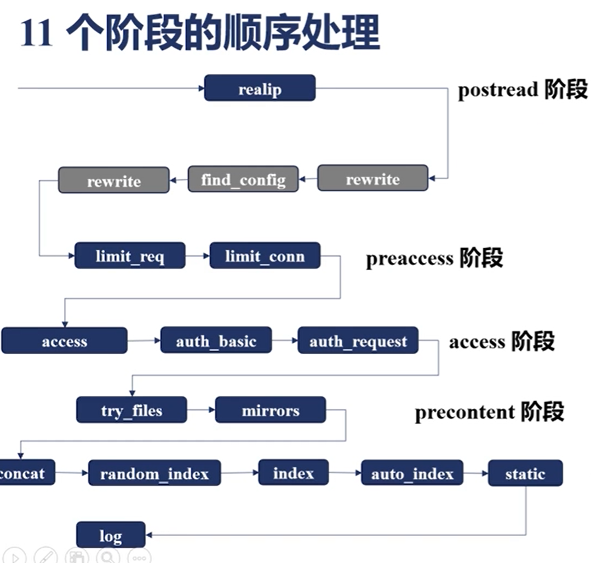

顺序处理的依据是nginx源码中的数组
```C
char *ngx_module_name [] = {
    ... ...
    "ngx_http_static_module",
    "ngx_http_autoindex_module",
    "ngx_http_index_module",
    "ngx_http_random_index_module",
    ...
}
```


### POSTREAD阶段

Postread这个阶段的一个模块：realip模块，它可以帮助我们发现用户的真实IP地址，这为我们后续的一些模块实现例如：限速，限流等功能提供了可能性


#### 问题：                                                                                                                                                                                                                                                                                                                                                                                                                                                                                                                                                                                                                                                                                                                                                                                                                                                                                                                                                                                                                                                                                                                                                                                                                                                                                                                                                                                                                                                                                                                                                                                                                                                                                                                                                                                                                                                                                                                                                                                                                                                                                                                                                                                                                                                                                                                                                                                                                                                                                                                                                                                                                                                                                                                                                                                                                                                                                                                                                                                                                                                                                                                                                                                                                                                                                                                                                                                                                                                                                                                                                                                                                                                                                                                                                                                                                                                                                                                                                                                                                                                                                                                                                                                                                                                                                                                                                                                                                                                                                                                                                                                                                                                                                                                                                                                                                                                                                                                                                                                                                                                                                                                                                                                                                                                                                      如何拿到真实的用户ip地址
- TPC连接四元组(src ip, src port, dst ip, dst port)
- HTTP头部**X-Forwarded-For**用于传递IP
- HTTP头部**X-Real-IP**用于传递用户IP
- 网络中存在许多反向代理

####  realip模块
- 功能：修改客户端地址

- 默认不会编译进Nginx
  - 通过--with-http_realip_module启用功能

- 指定
  - set_real_ip_from
  - real_ip_header
  - real_ip_recursive

- 变量
  - realip_remote_addr
  - realip_remote_port
  

#### 拿到真实用户IP后如何使用?

realip模块要求我们必须基于变量来使用，根据我们在realip中配置的指令，realip模块会把从x-forwarded-for或x-real-ip这个头部里的值给他覆盖binary_remote_addr和remote_addr这两个变量的值


这两个变量原先是指向直接和nginx产生连接的客户端的地址，但是经过了realip模块之后，我们会把这个变量的值改成x-forwarded-for等等里面的头部的值，这样我们后续的模块做连接的限制或者限速才有意义


所以这时候我们就可以理解，为什么说limit_conn模块，它的顺序一定要在preaccess阶段，它不能在postread阶段，它的道理就是这个。realip模块默认不会编译进nginx，我们必须通过./config后面加上--with-http_realip_module来启用功能，所以我们通常应该下载nginx源代码，才能做这样的事情，它的功能是去修改客户端地址，它还会新生成两个变量，因为它修改了原来的`remote_addr`和`remote_port`变量，所以，他提供了两个变量去氛维护原来的变量，就如果我们还想用原先的`remote_addrde`的话，应该加上realip_remote_addr,此时就可以拿到TCP连接中的`src ip`


基于变量
如：binary_remote_addr、remote_addr这样的变量，其值就是为真实的IP！这样做连接限制（limit_conn模块）才有意义

realip模块指令
```shell
# 定义对于什么样的tcp src_ip,我才做替换remote_addr变量这样的事
set_real_ip_from address|CIDR|unix;

# 从哪里取ip，默认从X-Real-IP去取ip，如果是X-Forwarded-For会从最后的IP去取
real_ip_header <field> | X-Real-IP | X-Forwarded-For | proxy_protocol;

# 环回地址，默认关闭，如果打开的话，如果最后一个地址和客户端地址相同，则会取前一个地址，将其放入remote_addr中
real_ip_recursive on | off
```

示例
```shell
server {
    server_name realip.mystical.tech;

    error_log logs/myerror.log debug;
    set_real_ip_from 116.62.160.193;   # 信任本机是src ip的
    # real_ip_header X-Real-IP;， 默认用这个X-Real-IP
    real_ip_recursive off;
    # real_ip_recursive on;
    real_ip_header    X-Forwarded-For;

    location / {
        return 200 "Client real ip: $remote_addr\n"
    }
}

curl -H 'X-Forwarded-For: 1.1.1.1,116.62.160.193' realip mystical.tech
>> Client real ip:116.62.160.193


# 开启还回地址real_ip_recursive on;
>> Client real ip:1.1.1.1
```

### Rewrite阶段
#### return指令


语法
```shell
return code [text];
return code URL;
return URL;
```

返回状态码
Nginx自定义
- 444：关闭连接
HTTP1.0标准
- 301：http1.0永久重定向
- 302：临时重定向，禁止被缓存
HTTP1.1标准
- 303：临时重定向，允许改变方法，禁止被缓存
- 307：临时重定向，不允许改变方法，禁止被缓存
- 308：永久重定向，不允许改变方法

#### return指令与error_page
语法
```shell
error_page code... [=[response]]uri;
```

示例
```shell
error_page 404 /404.html;
error_page 500 502 503 504 /50x.html;
error_page 404 =200 /empty.gif;
error_page 404 = /404.php;

location / {
    error_page 404 = @fallback;
}
location @fallback {
    proxy_pass http://backend;
}
error_page 403 http://example.com/forbidden.html;
error_page 404 = 301 http://example.com/notfound.html;
```

测试1
```shell
server {
    server_name return.taohui.tech;
    listen 8080;

    root html/;
    error_page 404 /403.html;

    location / {
        return 404 "find noting!\n";
    }
}
# 同时存在error_page和return，一定是return先执行，参考11个阶段的顺序
```

测试2
```shell
server {
    server_name return.taohui.tech;
    listen 8080;

    root html/;
    error_page 404 /403.html;
    return 405;
    location / {
        return 404 "find noting!\n";
    }
}
# 优先执行405
```

#### Rewrite阶段的rewrite模块
用于修改用户传入nginx的URL

- 语法
```shell
Syntax: rewrite regex replacement [flag];
Default: ——
Context: server, location, if
```

- 功能
  - 将regex指定的url替换成replacement这个新的url
    - 可以使用正则表达式及变量提取
  - 当replacement以http://或者https://或者$schema开头，则直接返回302重定向
  - 替换后的url根据flag指定的方式进行处理
    - `last`：用replacement这个URL进行新的location匹配
    - `break`：break指令停止当前脚本指令的执行，等价于独立的break指令
    - `redirect`：返回302重定向，客户端重定向
    - `permanent`：返回301重定向，客户端重定向

- 示例
```shell
# 目录结构
html/first/
|___1.txt
html/second/
|___2.txt
html/third/
|___3.txt
```

```shell
# 配置指令
root html/;
    location /first {
        rewrite /first(.*) /second$1 last;
        return 200 'first!';
    }

    location /second {
        rewrite /second(.*) /third$1 break;
        return 200 'second!';
    }

    location /third {
        return 200 'third!';
    }
```

- 基于上述示例提问
  - return指令与rewrite指令的顺序关系？
  - 访问/first/3.txt, /second/3.txt, /third/3.txt分别返回什么
  - 如果不携带flag会怎样


- rewrite指令示例1
```shell
# 配置1：
server {
    server_name www.fengrewrite.com;
    root /data/html;
    location /first {
        rewrite /first(.*) /second$1 last;
        return 200 'first!';
    }

    location /second {
        #rewrite /second(.*) /third$1 break;
        rewrite /second(.*) /third$1 ;
        return 200 'second!';
    }

    location /third {
        return 200 'third!';
    }
    
}
# 执行如下指令
curl www.fengrewrite.com/second

# 直接结果为second!
# 结果表明没有flag，会继续执行后续的脚本指令，返回return的second!

# 配置2：加上break
server {
    server_name www.fengrewrite.com;
    root /data/html;
    location /first {
        rewrite /first(.*) /second$1 last;
        return 200 'first!';
    }

    location /second {
        rewrite /second(.*) /third$1 break;
        #rewrite /second(.*) /third$1 ;
        return 200 'second!';
    }

    location /third {
        return 200 'third!';
    }
    
# 执行如下指令
curl www.fengrewrite.com/second/3.html

# 直接返回3333!即3.html中的内容
# 结果表明：break后，直接匹配/third/3.html，而不会跳转到/third
```

rewrite指令示例2
```shell
# 配置1
location /redirect1 {
    rewrite /redirect1(.*)$1 permanent; # 301
}

location /redirect2 {
    rewrite /redirect2(.*)$1 redirect; # 302
}

location /redirect3 {
    rewrite /redirect3(.*) http://rewrite.feng.tech$1; # 302
}

location /redirect4 {
    rewrite /redirect4(.*) http://rewrite.feng.tech$1 permanent # 301
}
```

基于上述配置提问
- 访问/redirect1/index.html，返回的是什么
- 以及2,3,4分别是什么

#### rewrite阶段的rewrite模块：条件判断
- if指令语法
```shell
Syntax: if (condition) {...}
Default: ——
Context: server, location
```

- 示例
```shell
if ($http_user_agent ~ MSIE) {
    rewrite ^(.*)$/msie/$1 break;
}

if ($http_cookie ~* "id=([^;]+)(?:;|$)") {
    set $id $1;
}

if ($request_method = POST) {
    return 405;
}
}
if ($slow) {
    limit_rate 10k;
}

if ($invalid_referer) {
    return 403;
}
```


### find_config阶段：找到处理请求的location

当我们在server块下的rewrite指令执行完毕之后，我们开始根据用户请求中的URL去Location后面相对应的URL前缀，或者正则表达式进行匹配，这一步匹配之后，我们就确定了有哪一个location对这个请求进行处理

``````nginx
Syntax: location [=|~|~*|^~]uri{...}
        location @name {...} # 表示是面向内部跳转的
Default: _
Context: server, location

# merge_slashes可以去合并URL中的/，当merge_slashes打开的时候，比如两个//可以合并成1个/，通常只有在url中直接使用了base64编码等等的情况下才需要关闭，通常都是打开的
Syntax: merge_slashes on | off;
Default: merge_slashes on;
Context: http, server
``````


#### location匹配顺序


### preaccess阶段：对请求做限制的limit_req模块


#### 模块介绍

**生效阶段：** NGX_HTTP_PREACCESS_PHASE 阶段

**模块：** http_limit_req_module

```bat
默认编译进nginx，通过 --without-http_limit_req_module 禁用功能
```

 **生效算法：**leaky bucket算法

**生效范围：**

- 全部 worker 进程（基于共享内存）
- 进入 preaccess 阶段前不生效


#### leaky bucket 算法

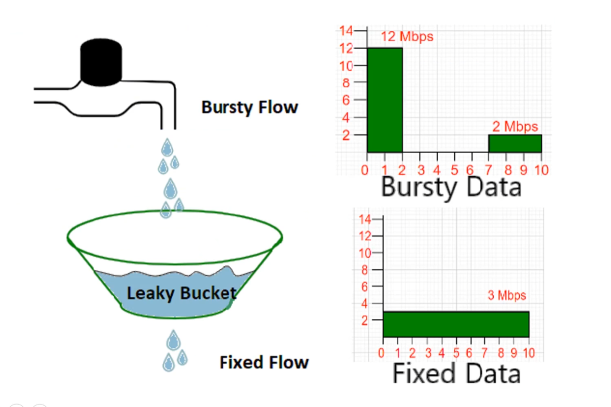


```bat
对于突发流量，使用 Leaky Bucket 可以把它限制为每秒处理3M流量
limit_requset 可以把突发流量限制为每秒处理多少个请求
```


#### limit_req 指令

**定义共享内存（包括大小），以及 key 关键字和限制速率**

```nginx
Syntax:  limit_req_zone key zone=name:size rate=rate;  # rate单位为 r/s 或者 r/m
Default: ——
Context: http
```


**限制并发连接数**

```bash
# burst 默认为0
# nodelay，对burst中的请求不再采用延时处理的做法，而是立刻处理
Syntax:  limit_req zone=name [burst=number] [nodelay]; 
Default: ——
Context: http,server,location
```


**限制发生时的日志级别**

```nginx
Syntax:  limit_req_log_level info | notice | warn | error;
Default: limit_req_log_level error;
Context: http,server,location
```


**限制发生时向客户端返回的错误码**

```nginx
Syntax:  limit_red_status code;
Default: limit_red_status 503;
Context: http,server,location
```


总结：

```bat
limit_req 就是“漏桶（leaky bucket）”限流：按固定速率漏水处理请求，超出的先排队（burst），排不下的拒绝；加上 nodelay 就是不排队，能放的立刻放行，其余直接拒。
```


#### 实验示例

```nginx
http {
  limit_req_zone $binary_remote_addr zone=api:10m rate=5r/s;  # 每 IP 平均 5 r/s
}
server {
  location /api/ {
    limit_req zone=api burst=10;        # 或者：burst=10 nodelay
    limit_req_status 429;               # 超限返回 429（默认 503）
  }
}
```

场景：**同一瞬间**有 **15** 个请求打到 `/api/`。

**没有 `nodelay`**（默认 *排队*）：

- 允许 **1 个**马上处理，**10 个**进入“漏桶队列”（`burst`），**4 个**超出队列被拒。
- 之后队列里的 10 个按 **5 r/s**“漏出”，大约 **2 秒**全部处理完。

**加了 `nodelay`**（*不排队*）：

- 允许 **11 个**立即放行（相当于“瞬时突发”），**4 个**直接拒；
- <span style="color:tomato">**之后在“债”还清前（约 2 秒内），再来的新请求多数会被拒，直到平均速率回到 5 r/s**</span>


### access阶段：对IP做限制的access模块

这个模块可以控制哪些IP可以访问某些URL，或者不可以访问某些URL


#### 模块介绍

**生效阶段：**NGX_HTTP_ACCESS_PHASE阶段

**模块：**http_access_module

```bat
默认编译进nginx，通过--without-http_access_module禁用功能
```

**生效范围：**进入access阶段前不生效。


#### access 相关指令

```nginx
Syntax:   allow address | CIDR | unix: | all;
Default:  —
Context:  http,server,location,limit_except
```

```nginx
Syntax:   deny address | CIDR | unix: | all;
Default:  —
Context:  http,server,location,limit_except
```


#### **示例**

```nginx
location / {
    deny 192.168.1.1;
    allow 192.168.1.0/24;
    allow 10.1.1.0/16;
    deny all;
}
```

```bat
注意access模块是顺序执行，当满足一条规则后，不会继续向下执行。
```


### access阶段：对用户名密码做限制的auth_basic模块

#### 功能

基于HTTP Basic Authutication 协议进行用户名密码的认证

```bat
默认编译进Nginx：
    通过--without-http_auth_basic_module禁用功能
```


```nginx
Syntax:   auth_basic string | off;
Default:  auth_basic off;
Context:  http,server,location,limit_except
```

```nginx
Syntax:   auth_basic_user_file file;
Default:  —
Context:  http,server,location,limit_except
```


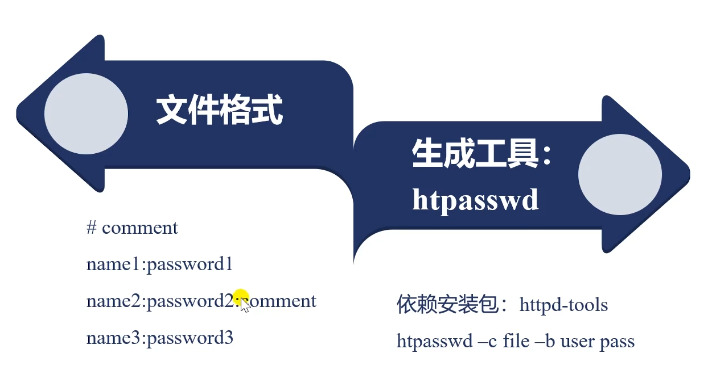

```bash
#Ubuntu下载
[root@NAT ~]#apt install -y apache2-utils
```


#### 示例配置

```nginx
[root@ubuntu2204 nginx]#cat conf.d/access.mystical.tech.conf 
server {
    server_name access.mystical.tech;
    error_log logs/error.log debug; 
    default_type text/plain;
    root /apps/nginx/html/;
    location / {
        satisfy any;
        auth_basic "test_auth_basic";
        auth_basic_user_file /apps/nginx/example/auth.pass;
    }
}
```


### access阶段: 使用第三方做权限控制的auth_request模块

统一的用户权限验证系统

#### 功能

向上游的服务转发请求，若上游服务返回的响应码是2XX，则继续执行，若上游服务返回的是401或403，则将响应返回给客户端


#### 原理

收到请求后，生成子请求，通过反向代理技术把请求传递给上游服务


#### 默认未编译进Nginx

```bash
--with-http_auth_request_module
```


#### 指令

```nginx
# 根据url生成子请求，根据子请求的响应码决定是继续执行，还是返回响应
Syntax: auth_request uri|off
Default: auth_request off;
Context: http,server,location
```

```nginx
Syntax: auth_request_set $variable value;
Default: —;
Context: http,server,location
```


#### 示例

```nginx
server {
    server_name access.mystical.tech;
    error_log logs/error.log debug;
    #root html/;
    default_type text/plain;
    location /auth_basic {
        satisfy any;
        auth_basic "test auth_basic";
        auth_basic_user_file example/auth.pass;
        deny all;
    }
    
    location / {
        auth_request /test_auth;
    }
    
    location = /test_auth {
        proxy_pass http://127.0.0.1:8090/auth_upstream;
        proxy_pass_request_body off;
        proxy_set_header Content-Length "";
        proxy_set_header X-Original-URI $request_uri;
    }
}

server {
    listen 8090;
    location /auth_upstream {
        return 200 'auth success!';
    }
}
```


### access阶段的satisfy指令

限制所有access阶段模块的satisfy指令


#### 指令

```nginx
Syntax: satisfy all|any;
Default: satisfy all;
Context: http, server, location

# 如果是satisfy all，表示必须access模块，auth_basic模块，auth_request模块三个都放行，才能允许放行
# 如果是satisfy any，表示只要access模块，auth_basic模块，auth_request模块三个模块有一个放行，就允许放行
```


### precontent阶段：按序访问资源的try_files模块


#### 指令

```nginx
Syntax: try_files file ... [uri] [=code];
Default: —;
Context: server, location
```


#### 功能

依次试图访问多个url对应的文件（由root或者alias指令指定），当文件存在时直接返回文件内容，如果所有文件都不存在，则按最后一个URL结果或者code返回


#### 示例

```nginx
server {
    server_name tryfiles.mystical.tech;
    error_log logs/myerror.log info;
    root html/;
    default_type text/plain;
    
    location /first {
        try_files /system/maintenance.html $uri $uri/index.html $uri.html @lasturl;
    }
    
    location @lasturl {
        return 200 'lasturl!\n';
    }
    
    location /second {
        try_files $uri $uri/index.html $uri.html =404;
    }
}
```


### precontent阶段：实时拷贝流量的mirror模块

mirror模块可以帮助我们创建一个镜像流量，比如生产环境下，我们处理一些请求，这些请求可能需要把他们同步的copy一份到测试环境，或者开发环境。

默认编译进Nginx


#### 指令

处理请求时，生成子请求访问其他服务，对子请求的返回值不做处理

```nginx
Syntax: mirror uri | off;
Default: mirror off;
Context: http, server, location
```

```nginx
Syntax: mirror_request_body on | off;
Default: mirror_request_body on;
Context: http, server, location
```


#### 示例

```bash
# 创建一个上游服务
server {
    listen 10020;
    location / {
        return 200 'mirror response!';
    }
}

# 主配置文件
server {
    listen 8001;
    error_log logs/error.log debug;
    
    location / {
        mirror /mirror;
        mirror_request_body off;
    }
    
    location = /mirror {
        internal;
        proxy_pass http://127.0.0.1:10020$request_uri;
        proxy_pass_request_body off;
        proxy_set_header Content-Length "";
        proxy_set_header X-Original-URI $request_uri;
    }
}
```


mirror模块可以做简单的流量拷贝，对于我们在多个环境下需要对用户流量进行处理非常有帮助。

```bat
mirror 的价值是“真实请求混合下的对比与放大”，用来实测找到拐点和第一个瓶颈；不是简单“按镜像比例线性推算”。正确姿势是小比例镜像 → 观测 → 阶梯放大/倍增 → 找拐点 → 优化复测。
```

#### （简版流程）

1. **镜像 5%–10% 只读接口**到 perf（`mirror` + `mirror_request_body off`），打上 `X-Request-ID` 便于比对。
2. **观测**：在 perf 上抓 p95/p99、错误率、CPU、GC、连接池等待、DB 慢查询、Redis RTT、队列长度。
3. **放大/抽样调参**：
   - 方式 A：把镜像比例从 5%→10%→15%…**阶梯拉升**；
   - 方式 B：用 replay/压测（GoReplay/vegeta/wrk）在 perf **倍增**镜像流量（1×→2×→3×）。
4. **判定容量**：当满足 SLO（例如 p95<200ms、错误率<1%）的**最高稳定 RPS**就是“容量”；再看在哪个资源先到 70–80%（第一个瓶颈）。
5. **修复&复测**：针对热点 SQL、索引、N+1、线程/连接池、缓存策略等逐项优化，重复 3–4 步。


#### 真实场景与Nginx配置

##### 真实场景

我们准备把 `/api/search` 的后端从 **v1** 切到 **v2**（K8s 集群里），又想顺手给 **压测环境**喂同样的真实流量做容量评估。要求：

- 只镜像**只读**接口（GET/HEAD），写操作一律不镜像；
- 只抽取 10% 用户做镜像（按 IP+UA 一致性哈希，避免抖动）；
- 镜像到 **两个环境**：`v2-canary` 和 `perf-staging`；
- 镜像的响应**不影响**线上用户；镜像请求的**鉴权头**要脱敏。

##### Nginx 配置示例

```nginx
http {
  # 上游池
  upstream api_v1     { server 10.0.0.10:8080; }
  upstream api_v2_canary { server 10.0.0.20:8080; }
  upstream api_perf      { server 10.0.0.30:8080; }

  # 1) 一致性抽样：10% 进镜像
  split_clients "${remote_addr}${http_user_agent}" $mirror_bucket {
    10%   1;
    *     0;
  }

  # 2) 只在 GET 且命中特定路径时镜像
  map "$mirror_bucket:$request_method:$uri" $do_mirror {
    default                               0;
    "~^1:GET:/api/(search|suggest|items)" 1;
  }

  server {
    listen 80;
    server_name api.example.com;

    # 主请求：永远走 v1
    location /api/ {
      # 只读接口镜像，不需要 body
      mirror_request_body off;                  # <== 关键
      # 同时镜像到两个“内部”位置（可写多条 mirror）
      if ($do_mirror) {
        mirror /_shadow_canary;
        mirror /_shadow_perf;
      }

      proxy_set_header X-Request-ID $request_id;
      proxy_pass http://api_v1;
    }

    # 镜像 → v2 灰度
    location = /_shadow_canary {
      internal;                                 # 只能由 mirror 子请求进入
      proxy_set_header Authorization "";        # 脱敏（按需保留）
      proxy_set_header X-Mirror         "1";
      proxy_set_header X-Mirror-Target  "v2-canary";
      proxy_set_header X-Orig-Host      $host;
      proxy_set_header X-Request-ID     $request_id;

      proxy_connect_timeout 200ms;              # 镜像后端慢也不拖主链路
      proxy_read_timeout    800ms;
      proxy_pass_request_body off;              # 双保险（与 mirror_request_body off 协同）
      proxy_pass http://api_v2_canary$request_uri;
    }

    # 镜像 → 压测环境
    location = /_shadow_perf {
      internal;
      proxy_set_header Authorization "";
      proxy_set_header X-Mirror         "1";
      proxy_set_header X-Mirror-Target  "perf";
      proxy_set_header X-Orig-Host      $host;
      proxy_set_header X-Request-ID     $request_id;

      proxy_connect_timeout 200ms;
      proxy_read_timeout    800ms;
      proxy_pass_request_body off;
      proxy_pass http://api_perf$request_uri;
    }
  }
}
```

##### 工作机制（一句话）

- 用户请求打到 `/api/…` 时，**主链路**仍走 `api_v1` 返回结果；
- 若满足条件（GET + 路径 + 10% 抽样），Nginx **并行**触发 2 个子请求，分别丢给 `v2-canary` 和 `perf`；
- 子请求的响应会被**丢弃**，只用于日志/监控比对，**不会影响**用户响应


### content阶段：详解root和alias指令 (static模块)


#### 指令

```nginx
Syntax: alias path;
Default: —
Context: location
```

```nginx
Syntax: root path;
Default: root html;
Context: http,server,location,if in location
```


#### 功能

```bat
将url映射为文件路径，以返回静态文件内容
```


#### 示例

```nginx
server {
    server_name static.mystical.tech;
    error_log logs/myerror.log info;
    
    location /root {
        root html;      # 访问 html/root/index.html
    }
    
    location /alias {     # 访问static.mystical.tech/alias，实际访问路径：html/index.html
        alias html;
    }
    
    location ~ /root/(\w+\.txt) {
        root html/first/$1;      # 访问static.mystical.tech/root/1.txt，实际访问路径：html/first/1.txt/root/1.txt
    }
    
    location ~ /alias/(\w+\.txt) {
        alias html/first/$1;     # 访问static.mystical.tech/alias/1.txt，实际访问路径：html/first/1.txt
    }
    
    location /RealPath/ {
        alias html/realpath/;
        return 200 '$request_filename:$document_root:$realpath_root\n';
    }
}
```


### static模块详解

生成待访问文件的三个相关变量

```bash
# 问题：访问/RealPath/1.txt时，这三个变量的值各为多少
location /RealPath/ {
    alias html/realpath/;
}

# 相关变量
request_filename                # 待访问文件的完整路径
document_root                   # 由URI和root/alias规则生成的文件夹路径
realpath_root                   # 将document_root中的软链接等换成真实路径
```


#### 静态文件返回时的content-type

```nginx
Syntax: types {...}
Default: types {text/html html; image/gif gif; image/jpeg jpg;}
Context: http,server,location

Syntax: default_type mime-type;
Default: default_type text/plain;
Context: http,server,location

Syntax: types_hash_bucket_size size;
Default: type_hash_bucket_size 64;
Context: http,server,location

Syntax: types_hash_max_size size;
Default: types_hash_max_size 1024;
Context: http,server,location
```


### static模块对URL不以斜杠结尾却访问目录的做法

```bat
如果URL不以斜杠结尾，则会触发301重定向
```


#### 示例

```bash
[root@ubuntu2204 conf.d]#cat dir.mystical.tech.conf 
server {
    server_name dir.mystical.tech;
    server_name_in_redirect on;
    listen 8088;
    port_in_redirect off;
    #absolute_redirect off;

    root html/;
}

# 结果
[root@ubuntu2204 conf.d]#curl 127.1:8088/first -I
HTTP/1.1 301 Moved Permanently
Server: nginx/1.26.2
Date: Mon, 15 Sep 2025 06:37:57 GMT
Content-Type: text/html
Content-Length: 169
Location: http://dir.mystical.tech/first/                
Connection: keep-alive

# 三个变量都是用于控制location后的值
# server_name_in_redirect on，用来判断是否在location显示server_name
# port_in_redirect off        用来显示是否在location记录端口
# absolute_redirect off       是否只记录路径，不记录前面的host
```


### 使用content模块提升多个小文件性能

#### 功能

当页面需要访问多个小文件时，把它们的内容合并到一次http响应中返回，提升性能


#### 模块

```nginx
ngx_http_concat_module
# 模块开发者（Tengine https://github.com/alibaba/nginx-http-concat）
--add-module=../nginx-http-concat/
```


#### 使用

```bash
# 在URI后加上??,后通过多个，逗号分隔文件
# 如果还有参数，则在最后通过?添加参数
# 示例
https://g.alicdn.com/??kissy/k/6.2.4/seed-min.js,kg/global-util/1.0.7/index-min.js,tb/tracker/4.3.5/index.js,kg/tb-nav/2.5.3/index-min.js,secdev/sufei_data/3.3.5/index.js
```


#### 指令

```nginx
Syntax: concat on|off
Default: concat off
Context: http,server,location

Syntax: concat_types MIME types;
Default: concat_types: text/css application/x-javascript;
Context: http,server,location

Syntax: concat_unique on|off;
Default: concat_unique on;
Context: http,server,location

Syntax: concat_max_files numberp;
Default: concat_max_files 10;
Context: http,server,location

Syntax: concat_delimiter string;
Default: NONE;
Context: http,server,location

Syntax: concat_ignore_files_error on|off;
Default: off;
Context: http,server,location
```


#### 示例

```nginx
server {
    server_name concat.mystical.tech;
    error_log logs/myerror.log debug;
    concat on;
    root html;
    
    location /concat {
        concat_max_files 20;
        concat_types text/plain;
        concat_unique on;
        concat_delimiter ':::';
        concat_ignore_file_error on;
    }
}
```


### http过滤模块的调用过程

http11个阶段中，在content阶段，会生成返回给客户的响应内容。对用户的响应内容还需要做再加工处理。而http过滤模块正是对响应内容做处理的。因此它实际上是在log之前，content之后，去介入请求的处理的。


#### 过滤模块的位置

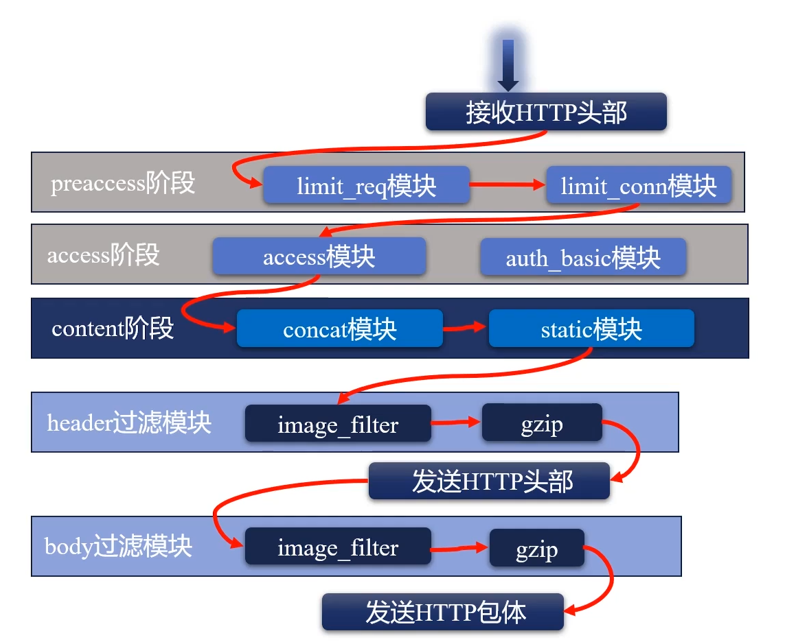


#### 返回响应-加工响应内容

**HTTP 过滤模块**

- **copy_filter：**复制包体内容
- **postpone_filter：**处理子请求
- **header_filter：**构造响应头部
- **write_filter：**发送响应

```bash
# 模块优先级从下往上
&ngx_http_write_filter_module,
&ngx_http_header_filter_module,
&ngx_http_postpone_filter_module,
&ngx_http_copy_filter_module,
```


### 用过滤模块更改响应中的字符串：sub模块

#### 功能

将响应中指定的字符串，替换成新的字符串


#### 模块

```bat
ngx_http_sub_filter_module模块，默认未编译进Nginx，通过--with-http_sub_module启用
```


#### 指令

```nginx
# 替换响应中的字符串
Syntax: sub_filter string replacement;
Default: —
Context: http,server,location
```

```nginx
# 是否返回原先的last_modified
Syntax: sub_filter_last_modified on| off;
Default: sub_filter_last_modified off;
Context: http,server,location
```

```nginx
# 只修改一次，还是全部修改
Syntax: sub_filter_once on|off;
Default: sub_filter_once on;
Context: http,server,location
```

```nginx
# 只针对什么样类型的响应进行替换
Syntax: sub_filter_types mime-type...;
Default: sub_filter_types text/html;
Context: http,server,location
```


#### 示例

```bash
server {
    server_name sub.mystical.tech;
    error_log logs/myerror.log info;
    
    location / {
        #sub_filter 'Nginx.org' '$host/nginx';
        #sub_filter 'Nginx.com' '$host/nginx';
        #sub_filter_once on;
        #sub_filter_once off;
        #sub_filter_last_modified off;
        #sub_filter_last_modified on;
    }
}
```


### 用过滤模块在http响应的前后添加内容：addition模块

#### 功能

在响应前或者响应后增加内容，而增加内容的方式是通过新增子请求的响应完成


#### 模块

```bat
ngx_http_addition_filter_module
默认未编译进Nginx
通过--with-http_addition_module启用
```


#### 指令

```nginx
# 响应前添加内容（后面反向代理uri的内容）
Syntax: add_before_body uri;
Default: —
Context: http,server,location
```

```nginx
# 响应后添加内容（后面反向代理uri的内容）
Syntax: add_after_body uri;
Default: —
Context: http,server,location
```

```nginx
# 只针对什么样类型的响应添加内容
Syntax: addition_types mime-type ...;
Default: addition_types text/html;
Context: http,server,location
```


#### 示例

```nginx
server {
    server_name addition.mystical.tech;
    error_log logs/myerror.log info
       
    location / {
        add_before_body /before_action;
        add_after_body /after_action;
        addition_types *;
    }
    location /before_action {
        return 200 'new content before\n';
    }
     location /after_action {
        return 200 'new content after\n';
    }
    location /testhost {
        uninitialized_variable_warn on;
        set $foo 'testhost';
        return 200 '$gzip_ratio\n';
    }
}

# 访问addition.mystical.tech，返回
[root@ubuntu2204 conf.d]#curl addition.mystical.tech/a.txt
new content before
a
new content after
```


### 变量的运行原理


每一个变量通常分为提供变量的模块和使用变量的模块，图的左边就是提供变量的模块，右边是使用变量的模块

提供变量的模块是如何提供变量的：
首先，启动nginx，启动nginx之后，nginx发现这是一个http模块，在http模块中有一个回调方法`preconfiguration`，这个名字提供了两个信息
- configuration：http这个模块开始读取配置文件，
- pre-就是表示在开始读取配置文件之前，这个模块在还没有读nginx.conf之前，它开始添加它提供的新变量，比如referer添加了`availbale referer变量`，又比如realip模块，也添加了remote_real_ip变量等，各个模块在这个阶段定义了自己的变量，这里定义变量的过程如下

在这个过程中，各模块定义了变量名，以及解析出这个变量的方法（这里指我给定输入，比如输入就是请求的http header，输出就是我这个变量名的值，比如一个变量名叫host，该模块通过在给定的请求的header中，找出某一个以大写的H小写的opt打头的值，作为host变量的输出给我，就ok，这里实际就是根据指定header，提出具体值的规则，就是当我们需要这个变量名的值的时候，请使用这个方法根据用户请求的内容，把我们变量名的值找出来）

使用变量的模块，通过这个变量名完成解耦，因为提供变量的模块和使用变量的模块的各自关注点是不同的，比如real_ip模块，专注于修改客户端的ip，提供一些新变量，或者referer模块只是专注于提供一个available referer的变量，用于判断用户是否盗链了，至于盗链后续怎么处理，referer模块是完全不关心的，这样的话，每个模块专注于提供自己的东西，这是一个非常好的架构设计


到了使用变量的模块，对于referer，这里通常是if指令，我的if指令针对于available_referer的不同值进行处理

在上述的变量和提供与使用的过程中，有两个核心的特点
- 惰性求值
  - 使用变量的模块，只有在请求已经接收到的时候，并且到了11个http阶段的过滤阶段，开始去读取这个变量值的时候，我们才回去求值，否则这个变量不会对我们的性能产生任何影响，因为它没有机会执行

- 我们的变量值在一个请求的持续处理中，是可能持续变化的，有一些是不会变化的，比如http头部，方法名，有一些是持续变化的，比如limit_rate限流限速，因此我们在读取这类值的那一刻，它的值并不代表请求处理之前的值，有一些时刻变化的变量值，它只反应我们在使用的那一刻的数值


#### 存放变量的哈希表

```nginx
# 这里关注nginx变量的长度
Syntax: variables_hash_bucket_size size;
Default: variables_hash_bucket_size 64;
Context: http
```

```nginx
# 这里关注nginx变量数量
Syntax: variables_hash_max_size size;
Default: variables_hash_max_size 1024;
Context: http
```


#### http框架提供的请求相关变量
框架提供的变量不需要我们引入新的http模块，而且框架提供的变量往往反应了用户发来的请求，被nginx处理的过程细节

```shell
server {
    server_name var.feng.tech localhost;
    #error_log logs/myerror.log debug;
    access_log logs/vartest.log vartest;
    listen 9090;

    location / {
        set $limit_rate 10k;
        return 200'
arg_a: $arg_a, arg_b: $arg_b, args: $args
connection: $connection, connection_requests: $connection_requests
cookie_a: $cookie_a
uri: $uri, document_uri: $document_uri, request_uri: $request_uri
request: $request
request_id: $request_id
server: $server_addr, $server_name, $server_port, $server_protocol
tcpinfo: $tcpinfo_rtt, $tcpinfo_rttvar, $tcpinfo_snd_cwnd, $tcpinfo_rcv_space
host: $host, server_name: $server_name, http_host: $http_host
limit_rate: $limit_rate
hostname: $hostname
content_length: $content_length
status: $status';
body_bytes_sent: $body_bytes_sent,bytes_sent: $bytes_sent
time: $request_time,$msec,$time_iso8601,$time_local';
    }
}

# 执行结果
curl -H 'Content-Length: 0' -H 'Cookie: a=c1' 'localhost:9090?a=1&b=22'

arg_a: 1, arg_b: 22, args: a=1&b=22
connection: 15, connection_requests: 1
cookie_a: c1
uri: /, document_uri: /, request_uri: /?a=1&b=22
request: GET /?a=1&b=22 HTTP/1.1
request_id: 40934a5aa63795f05cb76d8b4c277f07
server: 127.0.0.1, vars.feng.tech, 9090, HTTP/1.1
tcpinfo: 10, 5, 10, 65483
host: localhost, server_name: vars.feng.tech, http_host: localhost:9090
limit_rate: 10240
hostname: ubuntu2204.wang.org
content_length: 0
status: 200
```

#### http框架提供的变量分类
- **http请求相关变量**
  - **arg_参数名**：url中某个具体参数的值
  - **query_string**: 与args变量完全相同
  - **args:** 全部URL参数
  - **is_args**：如果请求URL中有参数则返回?，否则返回空
  - **content_length**：HTTP请求中标识包体长度的Content-Length头部的值
  - **content_type**：标识请求包体类型的Content-Type头部的值
  - **uri: **请求的URI（不同于URL，不包括?后的参数）
  - **document_uri：**与uri完全相同
  - **request_uri：**请求的URI（包括URI以及完整的参数）
  - **scheme：**协议名，例如HTTP或者HTTPS
  - **request_method：**请求方法，例如GET或者POST
  - **request_length：**所有请求内容的大小，包括请求行，头部，包体等
  - **remote_user：**由HTTP Basic Authentication 协议传入的用户名
  - **request_body_file：**临时存放请求包体的文件
    - 如果包体非常小，则不会存文件
    - client_body_in_file_only 强制所有包体存入文件，且可决定是否删除
  - **request_body：**请求中的包体，这个变量当且仅当使用反向代理，且设定用内存暂存包体是才有效
  - **request：**原始的url请求，含有方法与协议版本，例如GET/?a=1&b=22 HTTP/1.1
  - **host：**
    - 先从请求行中获取
    - 如果含有Host头部，则用其值替换掉请求行中的主机名
    - 如果前两者都取不到，则使用匹配上的server_name
  - **http_头部名字**：返回一个具体请求头部的值
    - **特殊**：(值可能需要处理)
      - http_host
      - http_user_agent
      - http_referer
      - http_via
      - http_x_forwarded_for
      - http_cookie
    - **通用**：（值可以直接使用）
- **TCP连接相关变量**
  - **binary_remote_addr：**客户端地址的整型格式，对于IPV4是4字节，对于IPv6是16字节
  - **connection：**递增的连接序号
  - **connection_requests：**当前连接上执行过的请求数，对keepalive连接有意义
  - **remote_addr：**客户端地址
  - **remote_port：**客户端端口
  - **proxy_protocol_addr：**若使用了proxy_protocol协议则返回协议中的地址，否则返回空
  - **proxy_protocol_port：**若使用了proxy_protocol协议则返回协议中的端口，否则返回空
  - **server_addr：**服务器地址
  - **server_port：**服务器端口
  - **TCP_INFO：**tcp内核层参数，包括`$tcpinfo_rtt`, `$tcpinfo_rttvar`, `$tcpinfo_snd_cwnd`, `$tcpinfo_rcv_space`
  - **server_protocol：**服务器协议，例如HTTP/1.1
- **Nginx处理请求过程中产生的变量**
  - **request_time：**请求处理到现在的耗时，单位为秒，精确到毫秒
  - **server_name：**匹配上请求的server_name值
  - **https：**如果开启 TLS/SSL，则返回on，否则返回空
  - **request_completion：**若请求处理完则返回ok，否则返回空
  - **request_id：**以16禁止输出的请求标识id，该id共含16个字节，是随机生成的
  - **request_filename：**待访问文件的完整路径
  - **document_root：**由URI和root/alias规则生成的文件夹路径
  - **realpath_root：**将document_root中的软链接等换成真实路径
  - **limit_rate：**返回客户端响应时的速度上限，单位为每秒字节数。可以通过set指令修改对请求产生效果
- **发送HTTP响应时相关的变量**
  - **body_bytes_sent：**响应中body包体的长度
  - **bytes_sent：**全部http响应长度
  - **status：**http响应中的返回码
  - **sent_trailer_名字：**把响应结尾内容里值返回
  - **sent_http_头部名字：**响应中某个具体头部的值
    - **sent_http_content_type**
    - **sent_http_content_length**
    - **sent_http_location**
    - **sent_http_last_modified**
    - **sent_http_connection**
    - **sent_http_keep_alive**
    - **sent_http_transfer_encoding**
    - **sent_http_cache_control**
    - **sent_http_link**
- **Nginx系统变量**
  - **time_local：**以本地时间标准输出的当前时间，例如`14/Nov/2018:15:55:37 +0800`
  - **time_iso8601：**使用ISO 8601标准输出的当前时，例如`2018-11-14T15:55:37 +08:00`
  - **nginx_version**：Nginx版本号
  - **pid：**所属worker进程的进程id
  - **pipe：**使用了管道则返回p，否则返回.
  - **hostname：**所在服务器的主机名，与hostname命令输出一致
  - **msec：**1970年1月1日到现在的时间，单位为秒，小数点后精确到毫秒


### 使用变量防盗链的referer模块

#### 使用场景

某网站通过URL引用了你的页面，当用户在浏览器上点击url时，http请求的头部中会通过referer头部，将该网站当前页面的URL带上，告诉服务器本次请求是由这个页面发起的


#### 目的

拒绝非正常的网站访问我们站点的资源


#### 思路

通过referer模块，用invalid_referer变量根据配置判断referer头部是否合法


#### referer模块

默认编译进Nginx，通过`--without-http_referer_module`禁用


#### referer模块的指令

```nginx
Syntax: valid_referers none|blocked|server_names|string ...;
Default: —
Context: server,location

# valid_referers指令，可以同时携带多个参数，表示多个referer头部都生效
# 参数值
none           # 允许缺失referer头部的请求访问
block          # 允许referer头部没有对应的值的请求访问
server_name    # 若referer中站点域名和server_name中的本机域名某个匹配，则允许该请求访问
表示域名及URL的字符串，对域名可在前缀或者后缀中含有*通配符         # 若referer头部的值匹配字符串后，则允许访问
正则表达式                                                  # 若referer头部的值匹配正则表达式后，则允许访问 

# invalid_referer变量
- 允许访问时变量值为空
- 不允许访问时变量值为1
```

```nginx
Syntax: referer_hash_bucket_size size;
Default: referer_hash_bucket_size 64;
Context: server,location
```

```nginx
Syntax: referer_hash_max_size size;
Default: referer_hash_max_size 2048;
Context: server,location
```


#### 示例

```nginx
server {
    server_name referer.mystical.tech;
    
    error_log logs/myerror.log debug;
    root html;
    location / {
        valid_referers none blocked server_names *.mystical.pub ;
        if ($invalid_referer) {
            return 403;
        }
        
        return 200 'valid\n';
    }
}
```


因为对于攻击者来说，在报文中伪造referer头部的成本很低，所以referer模块的防盗链功能很容易基本失效


### 更强的防盗链解决方案：secure_link模块

#### 使用secure_link功能防盗链的过程

- 由某服务器（也可以是Nginx）生成加密后的安全链接URL，返回给客户端
- 客户端使用安全URL访问Nginx，由Nginx的`secure_link`变量判断是否验证通过

```bat
- A 生成带签名的临时 URL（含 md5/expires 等），把链接返给浏览器。

- B(Nginx) 用 secure_link 校验：签名不对 → 403；过期 → 410；通过 → 放行资源。

- 这样一来，URL 只在有效期内可用，过期即失效，能有效阻止“长期盗用/长期外链”。
```


#### 原理

- 哈希算法是不可逆的
- 客户端只能拿到执行过哈希算法的URL
- 仅生成URL的服务器，验证URL是否安全的Nginx这两者，才保存执行哈希算法前的原始字符串
- 原始字符串通常由以下部分有序组成
  - 资源位置，例如HTTP中指定资源的URL，防止攻击者拿到一个安全URL后可以访问任意资源
  - 用户信息，例如用户IP地址，限制其他用户盗用安全URL
  - 时间戳，使安全URL及时过期
  - 密钥，仅服务器端拥有，增加攻击者猜测出原始字符串的难度


#### 模块

```nginx
使用 ngx_http_secure_link_module 模块
默认未编译进 nginx，
需要通过 --with-http_secure_link_module 添加
```


#### secure_link模块指令

```nginx
Syntax: secure_link expression;
Default: —
Context: http,server,location
```

```nginx
Syntax: secure_link_md5 expression;
Default: —
Context: http,server,location
```

```nginx
Syntax: secure_link_secret word;
Default: —
Context: location
```


#### 变量值及带过期时间的配置示例

**命令行生成安全链接**

```bash
# 原请求
/test1.txt?md5=md5生成值&expires=时间戳（如2147483647）

# 生成md5
echo -n '时间戳URL客户端IP密钥' | openssl md5 -binary | openssl base64 | tr +/ -_ |tr -d =
```


**nginx配置**

```bash
secure_link $arg_md5,$arg_expires;
secure_link_md5 "$secure_link_expires$uri$remote_addr secret";
```


#### 示例配置

```nginx
server {
    server_name securelink.mystical.tech;
    error_log logs/myerror.log info;
    default_type text/plain;
    location / {
        secure_link $arg_md5,$arg_expires;
        secure_link_md5 "$secure_link_expires$uri$remote_addr secret";
        
        if ($secure_link = "") {
            return 403;
        }
        
        if ($secure_link = "0") {
            return 410;
        }
        
        return 200 '$secure_link: $secure_link_expires\n';
    }
    
    location /p/ {
        secure_link_secret mysecret2;
        
        if ($secure_link = "") {
            return 403;
        }
    }
}
```

```bash
# 测试
echo -n '2147483647/test1.txt116.62.160.193 secret'| openssl md5 binary|openssl base64|tr +/ -_ | tr -d =
生成MD5值XXXXXXXXXXX

curl 'securelink.mystical.tech/test1.txt?md5=xxxxxxxxxxx&expires=2147483647'
返回1:2147483647
```


#### 仅对URI进行哈希的简单办法

- 将请求URL分为3个部分

  ```http
  /prefix/hash/link
  ```

- Hash生成方式

  - 对"link密钥"做md5哈希求值

- 用secure_link_secret secret; 配置密钥


#### 示例

```bash
......
location /p/ {
        secure_link_secret mysecret2;
        
        if ($secure_link = "") {
            return 403;
        }
        
        rewrite ^ /secure/$secure_link;
    }
    
location /secure/ {
       alias html/;
       internal;
}
    
# 生成md5
echo -n 'test1.txtmysecret2' | openssl md5 -hex
(stdin)=c3f9b32bf901b04c052ea9511e29a918

# 测试
curl 'securelink.mystical.tech/p/c3f9b32bf901b04c052ea9511e29a918/test1.txt'
test1
```


# 反向代理与负载均衡

## 反向代理
## 负载均衡
负载均衡是解决服务可用性的一个重要手段
那么可扩展性是如何通过负载均衡保证的

### Nginx在AKF扩展立方体上的应用


我们把我们的服务进行扩展的时候，最简单的一个方法就是X轴扩展
x轴扩展就是我们的服务是无状态的，也就是无论我们起多少个服务，它们都是同等的为用户提供服务，这种扩容的成本是最低的，也就是我们通常称的水平扩展，也因此我们肯定是希望尽可能的使用水平扩展来解决问题
nginx上的Round-Robin和least-connected是标准的基于水平扩展的负载均衡算法

但是水平扩展并不能解决所有问题，特别是不能解决数据量的问题，当单台应用上的数据已经非常大的时候，无论我扩展多少台服务，那么每一台服务的数据仍然非常大，此时就应该使用另外两种解决方案去解决


y轴是从功能上进行拆分，拆分后，就是原先由一台应用服务处理的功能，我们分为两台应用服务，这两台应用服务分别处理不同的api，也就是不同的url，这个时候，我们就可以在nginx通过location进行配置，也就是有些location我们用proxy pass代理到一些上游服务器，另外一些url，我们代理到另一个集群的url服务中，此时就实现了y轴的扩展，而y轴的扩展往往需要修改代码，做大量重构，它的成本是比较高的，但是它能够解决数据的上升问题，数据量上升随着我拆分，数据量是会下降的
```shell
在一个单体应用中，所有功能模块（如用户管理、订单处理、商品管理、支付处理等）通常使用同一个数据库。随着应用规模和数据量的增长，这个单一数据库的压力会不断增大，逐渐成为整个系统的瓶颈。例如：

查询性能变慢。
数据写入和更新时会产生大量锁定，导致并发处理能力下降。
数据库的扩展性受限，即使水平扩展了应用服务器，数据库的单点瓶颈依然存在。
通过拆分子系统解决数据库瓶颈
通过功能拆分（Y轴扩展），可以将系统中的不同功能模块拆分成独立的子系统，每个子系统拥有自己的独立数据库，从而分散数据库的负载，解决单一数据库性能瓶颈的问题。

举例：
假设你管理一个电商平台，原本所有功能都使用同一个数据库：

用户信息表、订单信息表、商品信息表、支付记录表等全部在同一个数据库中。
随着用户和数据的增长，这个单一数据库的负担越来越重，导致系统性能下降。
通过 Y轴扩展，你可以将功能拆分为独立的子系统，并且每个子系统使用独立的数据库：

用户管理服务（UserService）：

管理所有用户相关的数据，如注册、登录、个人信息等。
独立数据库：user_db 只存储用户相关的数据表，如 users、profiles。
订单处理服务（OrderService）：

管理所有订单相关的操作，如创建订单、更新订单状态、查询订单等。
独立数据库：order_db 只存储订单相关的数据表，如 orders、order_items。
商品管理服务（ProductService）：

管理商品的创建、更新、库存管理、商品查询等。
独立数据库：product_db 只存储商品相关的数据表，如 products、categories。
支付处理服务（PaymentService）：

处理支付相关的操作，如支付记录、退款等。
独立数据库：payment_db 只存储支付相关的数据表，如 payments、transactions。
解决数据库瓶颈的机制：
数据库负载分散：

通过功能拆分，每个子系统只处理与自己相关的数据。例如，UserService 只需要查询和更新用户数据，而不需要处理订单和支付数据。
数据被分散到多个数据库中，数据库的负载自然也被分散，查询和写入操作不会相互干扰。
性能优化：

由于每个数据库只负责一部分数据，表的大小和查询复杂度大大降低。比如，user_db 只需要处理用户信息，order_db 只需处理订单数据，这使得查询性能得以提升。
通过为每个子系统设计针对性的数据库优化策略（如索引、分表、分区等），可以进一步提高性能。
减少锁竞争和资源冲突：

在一个单一数据库中，不同的业务操作（如订单更新、商品库存修改等）可能会产生锁竞争，影响并发处理能力。
拆分后的独立数据库降低了锁竞争的可能性，因为不同子系统之间的操作不再使用同一个数据库。
扩展性增强：

每个子系统及其数据库可以根据自身的负载需求进行独立扩展。例如，如果订单数据增长迅速，可以专门扩展 OrderService 和 order_db，而不需要对整个系统进行扩展。
```
nginx配置示例
```shell
server {
    listen 80;
    server_name www.myecommerce.com;
    
    # 用户管理请求的代理配置
    location /user/ {
        proxy_pass http://user-service-cluster;
    }

    # 订单处理请求的代理配置
    location /order/ {
        proxy_pass http://order-service-cluster;
    }

    # 商品管理请求的代理配置
    location /product/ {
        proxy_pass http://product-service-cluster;
    }

    # 支付相关请求的代理配置
    location /payment/ {
        proxy_pass http://payment-service-cluster;
    }
}
```
那么有没有比y轴的成本稍低，效果像x轴那样轻松容易扩充的呢
此时可以考虑z轴，使用z轴进行扩展，z轴就是基于用户的信息进行扩展，比如基于用户的IP地址，就是CDN，比如有些ip地址比较靠近某个CDN中心，我们就可以这样的请求引流的CND上，
为了分离减少数据容量，我们可以使用用户名，将某些固定的用户，把它引流到指定集群

在基于z轴进行负载均衡时，nginx提供了很多hash算法，它们都可以应用在基于z轴扩展的过程，当然实际上x,y,z可以组合起来使用，并不选定只能使用一种方法


### upstream用法
#### 指定上游服务地址的upstream与server指令
- 语法
```shell
Syntax: upstream name {...}
Default: ——
Context: http

Syntax: server address [parameters];
Default: ——
Context: upstream

# upstream指令只能出现在http这个上下文中，他会定义一个名字，这个名字会交由后面的反向代理模块去使用，而它的大括号中的内容，就是我们去配置server，相关的内容，指定我这个name是一个应用服务集群，这些应用服务集群中，包含很多个server，每个server就是一台服务器，每台服务器中，我们可以跟一些parameters，去控制负载均衡的行为
```

- 功能
指定一组上游服务器地址，其中，地址可以是域名、IP地址或者unix socket地址。可以在域名或者IP地址后加端口，如果不加端口，那么默认使用80端口

- 通用参数
  - backup：指定当前server为备份服务，仅当非备份server不可用时，请求会转发到该server
  - down：表示某台服务已经下线，不在服务，相当于一个注释，方便我们管理维护


### 负载均衡策略：加权round-robin
功能：在加权轮询的方式访问server指令指定的上游服务器。集成在nginx的upstream框架中

该算法是所有算法的基础，比如hash算法，或者一致性hash算法，在某种情况下，都会退化成加权round-robin算法


#### 什么是round-robin?

就是它依次轮询挨个进行的方式，我们就叫做round-robin


#### 什么叫加权

有的服务器我们用的是4核8G，有的服务器我们可能用了8核16G，那么8核16G这样的服务器，它能够处理的请求数，或者QPS就会更强一点，那么我们通过一个权重，来标识这台服务不同于其他服务，权重更大，那么我们的round-robin算法就应该按照我们的权重值将更多的请求发给这样的服务


它是默认集成在Nginx的upstream框架中的，我们没有办法添加或者移除这个办法


指令：
- weight
  - 服务访问的权限，默认是1
- max_conns
  - server的最大并发连接数，进作用于单worker进程，默认是0，表示没有限制
- max_fails
  - 在fail_timeout时间段内，最大的失败次数，当达到最大失败时，会在fail_timeout秒内这条server不允许再次被选择
- fail_timeout
  - 单位为秒，默认值为10秒，具有2个功能：
  - 指定一段时间内，最大的失败次数max_fails
  - 到达max_fails后，该server不能访问的时间

``````
max_fails参数和fail_timeout这两个参数是相互配合使用的

fail_timeout参数的单位是秒，它有两层用法，
第一层用法：比如：在timeout，10s内，当这台server的失败次数超过max_fails指定的次数后，会在第二层含义
第二层含义：会在timeout,这么长时间内这台server不会被负载均衡算法再次选择到
``````


#### 对上游服务使用keepalive长连接
- 功能：通过复用连接，降低nginx与上游服务建立，关闭连接的消耗，提升吞吐量的同时降低时延

- 模块：
  - ngx_http_upstream_keepalive_module
    - 默认编译进nginx，通过--without-http_upstream_keepalive_module移除

- 对上游连接的http头部设定
```shell
proxy_http_version 1.1; # http1.0不支持长连接
proxy_set_header Connection ""; # 为了防止头部Connection传递的是closed而不是keepalive，我们主动设置我们向上游发的connection
```

upstream_keepalive的指令
```shell
# 最多保持多少个空闲的tcp连接用于keepalive请求
Syntax: keepalive connections;
Default: ——
Context: upstream

Syntax: keepalive_request number;
Default: keepalive_requests 100;
Context: upstream

Syntax: keepalive_timeout timeout;
Default: keepalive_timeout 60s;
Context: upstream
```

- 指定上游服务域名解析的resolver指令
```shell
Syntax: resolver address ... [valid=time][ipv6=on|off];
Default: ——
Context: http, server, location

Syntax: resolver_timeout time;
Default: resolver_timeout 30s
Context: http, server, location
```

示例：
```shell
upstream rrups {
    server 127.0.0.1:8011 weight=2 max_conns=2 max_fails=2 fail_timeout=5;
    server 127.0.0.1:8012;
    keepalive 32;
}

server {
    server_name rrups.feng.tech;
    error_log myerror.log info;

    location / {
        proxy_pass http://rrups;
        proxy_http_version 1.1;
        proxy_set_header Connection "";
    }
}
```

### 负载均衡算法：ip_hash与hash模块

round-robin它无法保证某一类请求只能由某一台服务器去处理，他只能做水平扩展，如果需要做基于Z轴的扩展，就可以选择基于hash算法来保证某一个请求只会由某一台服务去处理


#### 基于客户端ip地址的Hash算法实现负载均衡：upstream_ip_hash模块

ip_hash其实就是使用**$remote_addr**变量的值作为关键字，然后使用hash算法将其映射到特定的上游服务器中

功能：以客户端的ip地址作为hash算法的关键字，映射到特定的上游服务器中
- 对ipv4地址使用前3个字节作为关键字，对ipv6则使用完整地址
- 因为使用了$remote_addr作为关键字做hash运算，因此可以基于realip模块修改用于执行算法的IP地址

- 模块：ngx_http_upstream_ip_hash_module，通过--without-http_upstream_ip_hash_module禁用模块

```shell
Syntax: ip_hash;
Default: ——
Context: upstream
```

#### 基于任意关键字实现Hash算法的负载均衡：upstream_hash模块
- 功能：通过指定关键字作为hash key，基于hash算法映射到特定的上游服务器中
  - 关键字可以含有变量、字符串

- 模块：ngx_http_upstream_hash_module，通过--without-http_upstream_ip_hash_module禁用模块
```shell
Syntax: hash key [consistent];
Default: ——
Context: upstream
```

示例
```shell
upstream iphashups {
    ip_hash;
    # hash user_$arg_usename;
    # 由于我们使用了ip_hash因此此处的weight权重不会生效
    server 127.0.0.1:8011 weight=2 max_conns=2 max_fails=2 fail_timeout=5;
    server 127.0.0.1:8012 weight=1;
}

server {
    set real_ip_from 116.62.160.193;
    real_ip_recursive on;
    real_ip_header X-forwarded-For;
    server_name iphash-feng.tech;
    error_log myerror.log info;
    access_log logs/upstream_access.log varups;

    location / {
        proxy_pass http://iphashups;
        proxy_http_version 1.1;
        proxy_set_header Connection "";
    }
}

# 测试执行：
curl -H 'X-Forwarded-For: 100.200.20.200' iphash.feng.tech
> 8012 server response

curl -H 'X-Forwarded-For: 1.100.20.2' iphash.feng.tech
> 8011 server reponse

upstream iphashups {
    #ip_hash;
    hash user_$arg_usename;
    server 127.0.0.1:8011 weight=2 max_conns=2 max_fails=2 fail_timeout=5;
    server 127.0.0.1:8012 weight=1;
}

server {
    set real_ip_from 116.62.160.193;
    real_ip_recursive on;
    real_ip_header X-forwarded-For;
    server_name iphash-feng.tech;
    error_log myerror.log info;
    access_log logs/upstream_access.log varups;

    location / {
        proxy_pass http://iphashups;
        proxy_http_version 1.1;
        proxy_set_header Connection "";
    }
}

# 执行测试
curl -H 'X-Forwarded-For: 100.200.20.200' iphash.feng.tech?username=ksafjaskjfasjf
> 8011 serve response

curl -H 'X-Forwarded-For: 100.200.20.200' iphash.feng.tech?username=bbbb
> 8012 serve response
```

该算法弊病：使用hash算法可以确保某一类请求只会路由到某一台上游服务中，无论这台上游服务后续是否正常在线，当一台上游服务下线了，机器损坏了，我们不能直接从upstream中把这台sever从配置中移除，因为移除之后，会导致它的hash算法发生变化，他就会同时影响原本路由到其他server的请求也发生变化，从而造成严重后果

一致性hash算法可以缓解这个问题 


### 一致性hash算法
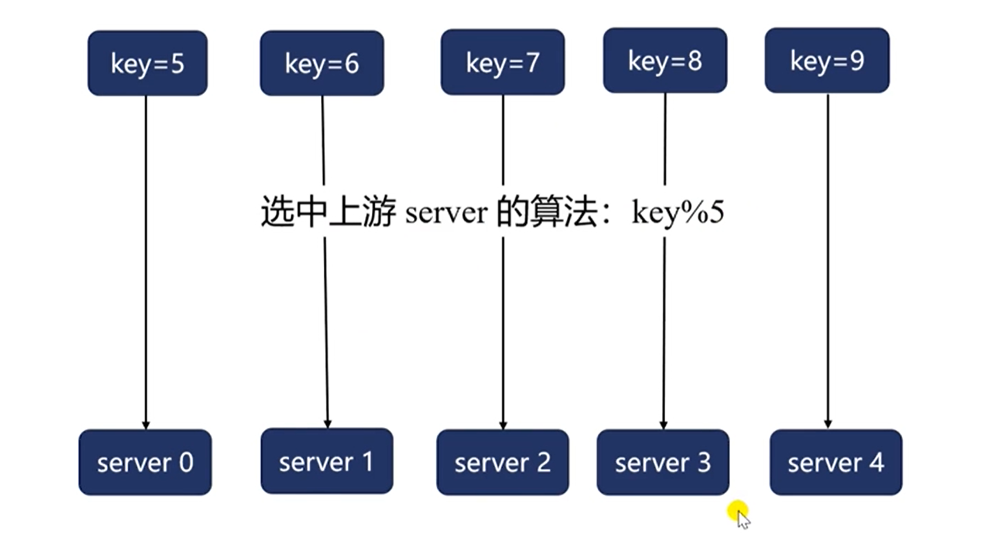

发生宕机或者扩容时，hash算法引发大量路由变更，可能导致缓存大范围失效

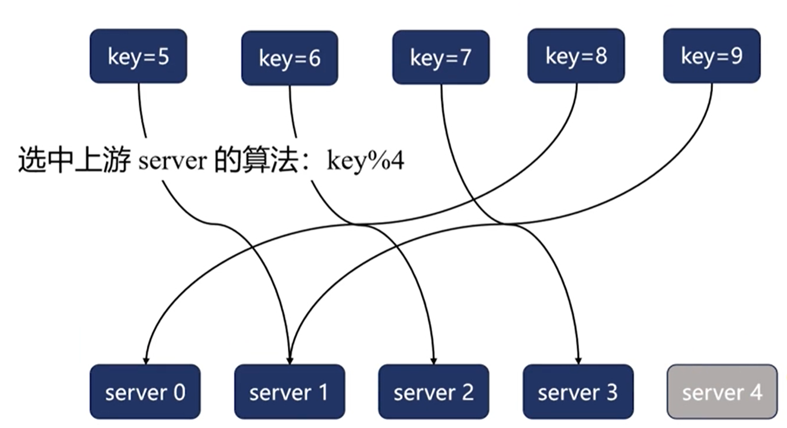

#### 一致性hash算法：扩容前
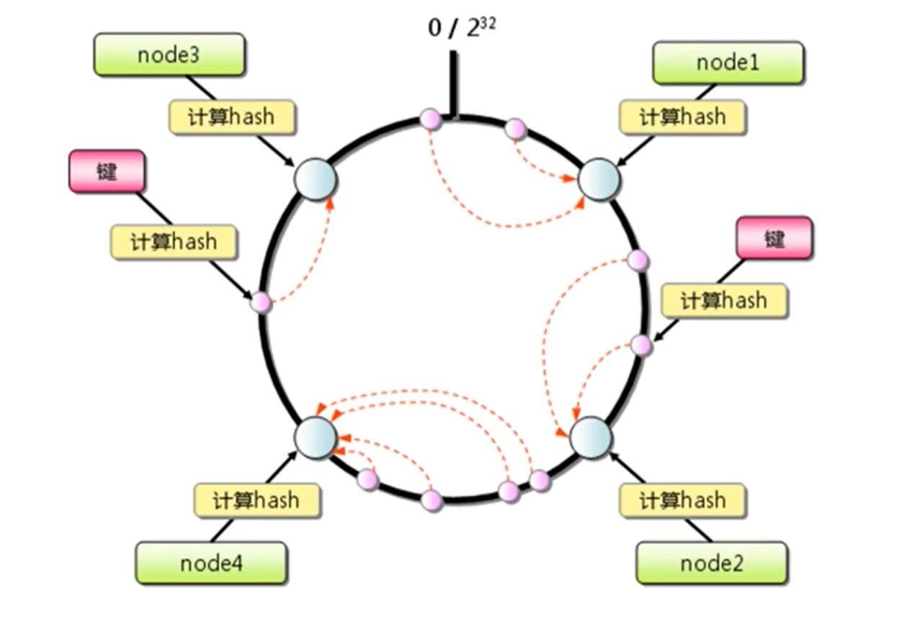

#### 一致性hash算法：扩容后
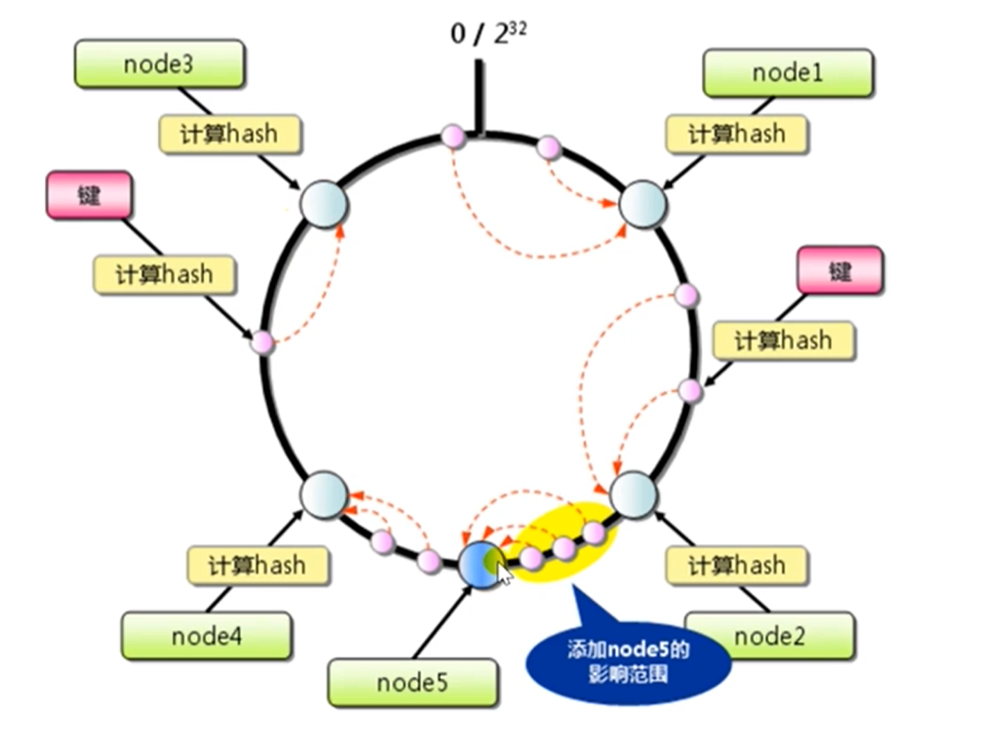

增加了node5后，node5的影响范围是比较有限的，从而缓解扩容或者宕机时，我们的路由不要发生大规模变化，但是解决不了所有的节点上面的路由不发生变化，当然对于宕机的设备来说，也没有必要去解决

#### 使用一致性Hash算法
```shell
Syntax: hash key [consistent];
Default: ——
Context: upstream
```


### 最少连接算法以及如何跨worker进程生效

之前所有的负载均衡算法都默认只在一个worker进程生效

#### 优先选择连接最少的上游服务器`upstream_least_conn`模块
- 功能：从所有上游服务器中，找出当前并发连接数最少的一个，将请求转发到它
  - 如果出现多个最少连接服务器的连接数都是一样的，使用round-robin算法

- 模块：ngx_http_upstream_least_conn_module，通过--without-http_upstream_ip_hash_module禁用模块
```shell
Syntax: least_conn;
Default: ——
Context: upstream
```


之前所有的都是在内存中的配置，包括服务server的状态信息，那么我们为了能够让它跨worker进程生效，所以我们必须使用共享内存

#### 使用共享内存使负载均衡策略对所有worker进程生效:`upstream_zone`模块

- upstream_zone这个模块是默认编译在内存中的

- 功能：分配处共享内存，将其他upstream模块定义的负载均衡策略数据、运行时每个上游服务的状态数据存放在共享内存上，以对所有nginx worker进程生效

- 模块：ngx_http_upstream_zone_module，通过--without-http_upstream_zone_module禁用
```shell
Syntax：zone name [size];
Default: ——
Context: upstream
```

#### upstream模块间的顺序：功能的正常运行
```shell
ngx_module_t *ngx_modules[] = {
    ... ...
    &ngx_http_upstream_hash_module,
    &ngx_http_upstream_ip_hash_module,
    &ngx_http_upstream_least_conn_module,
    &ngx_http_upstream_random_module,
    &ngx_http_upstream_keepalive_module,
    &ngx_http_upstream_zone_module,
    ... ...
}
```
这个数组决定了http模块11个阶段的执行顺序，包括过滤模块间的顺序，对于upstream模块也同样有效
它的顺序是从上到下的，我们启动的时候，会优先看hash、ip_hash、least_conn、random、keepalive、zone，这个模块间的顺序也是非常有用的，比如说我们先试用了rr算法，再使用least_conn算法，least_conn才能退化为rr算法，如果我们还使用了keepalive，而keepalive会保存下hash算法以后，会把它的路由算法放下来，因为它的路由算法是如果我缓存了，我就直接使用我缓存的，zone放在最后一个，就是不管你们前面定义了多少东西，到我了，我就开始分配一块共享内存，把你们之前所分配的信息全部用共享内存替代原先的内存存储，我就解决了多个worker进程间共享配置，共享负载均衡算法的能力


### upstream模块提供的变量（不含cache）

nginx框架中为上述的upstream模块提供了相应的变量，upstream框架提供的变量中，含有缓存的部分，将在后面讲到缓存的时候讲，先看下不含有缓存的upstream变量有哪些

``````
upstream_addr            # 上游服务器的IP地址，格式为可读的字符串，比如127.0.0.1:8012
upstram_connection_time  # 与上游服务器建立连接消耗的时间，单位为秒，精确到毫秒
upstream_header_time     # 接收上游服务器回响应头部所消耗的时间，单位为秒，精确到毫秒
upstream_response_time   # 接收完整的上游响应所消耗的时间，单位为秒，精确到毫秒
upstream_http_名称        # 从上游服务器返回的响应头部的值
upstream_bytes_received   # 从上游服务接收到的响应长度，单位为字节
upstream_response_length  # 从上游服务返回的响应包体长度，单位为字节
upstream_status           # 上游服务返回的HTTP响应中的状态码。如果未连接上，该变量值为502
upstream_cookie_名称       # 从上游服务发回的响应头set-Cookie中取出的Cookie值
upstream_trailer_名称      # 从上游服务的响应尾部取到的值
``````

示例

```nginx
log_format varups '$upstream_addr $upstream_connect_time $upstream_header_time $upstream_response_time --- $upstream_response_length $upstream_bytes_received $upstream_status $upstream_http_server $upstream_cache_status';

upstream iphashups {
    hash user_$arg_username;
    server 10.0.0.108:8011 weight=2 max_conns=2 max_fails=2 fail_timeout=5;
    server 10.0.0.108:8012 weight=1;
}

server {
    server_name www.magedu.org;
    access_log /apps/nginx/logs/upstream_access.log varups;

    location / {
        proxy_pass http://iphashups;
        proxy_http_version 1.1;
    }
}
```

#### 补充

✅ **请求头和请求体是分开发送的，但通常是连续的**。
✅ **默认情况下**（`**proxy_request_buffering on**`），Nginx **先完整接收** 请求体，然后 **一次性转发** 给上游。
✅ **如果 `proxy_request_buffering off`**，Nginx **会先发送请求头，再逐块发送请求体**（chunked）。
✅ **大文件上传、WebSocket 适合 `proxy_request_buffering off` + HTTP/1.1**。

**🚀 选择正确的 `proxy_request_buffering` 方式，才能提升 Nginx 代理性能！**


### proxy模块处理请求的流程

- 在content阶段进行处理：proxy_pass指令
- 如果cache命中，则直接向客户端发送响应头部
- 如果cache未命中或未开启cache，根据指令生成发往上游的http头部及包体
  - 如果设置为**proxy_request_buffering on**（默认），读取请求完整包体，即Nginx **先完整接收** 请求体，然后 **一次性转发** 给上游
  - 如果设置为**proxy_request_buffering off**，Nginx **会先发送请求头，再逐块发送请求体**（chunked）。
- 上游服务器收到响应头部后，对响应头部进行处理
  - 如果设置为**proxy_buffering on**，则接收完整的响应包体，然后发送给nginx响应头部
  - 如果设置为**proxy_buffering off**，发送响应包体，边读包体边发
- 如果打开cache，则包体会加入缓存，然后发给nginx向客户端发送响应，关闭或复用连接。


### proxy模块用法

**功能**：对上游服务使用http/https协议进行反向代理

```
nginx_http_proxy_module，默认编译进nginx
通过--without-http_proxy_module在编译时禁用该模块
```

```nginx
syntax: proxy_pass URL;
Default: -
Context: location, if in location, limit_except
```


#### **URL参数规则**

- URL必须以http://或者https://开头，接下来是域名，IP，unix socket地址或者upstream的名字，前两者可以在域名或者IP后加端口。最后是可选的URI
- 当URL参数中携带URI与否，会导致发向上游请求的URL不同：
  - 不携带URL，则将客户端请求中的URL直接转发给上游
    - location后使用正则表达式，@名字时，应采用这种方式
  - 携带URL，则对用户请求中的URL作如下操作
    - 将location参数中匹配上的一段替换为该URL

示例1

```nginx
# nginx服务
server {
    server_name proxy.mystical.tech;
    error_log myerror.log info;
    access_log logs/upstream_access.log varups;
    
    location /a {
        proxy_pass http://proxyups;
        proxy_set_body 'hello world';
    }
}

# curl proxy.mystical.tech/a/b/c
# 因为proxy_pass后面跟的URL没有跟url，所以上游服务器接收到的uri是/a/b/c

# nginx服务
server {
    server_name proxy.mystical.tech;
    error_log myerror.log info;
    access_log logs/upstream_access.log varups;
    
    location /a {
        proxy_pass http://proxyups/www;
        proxy_set_body 'hello world';
    }
}

# curl proxy.mystical.tech/a/b/c
# 因为proxy_pass后面跟的URL接了/www，所以上游服务器接收到的uri是/www/b/c
```


- 该URI参数中可以携带变量
- 更复杂的URL替换，可以在location内的配置添加rewrite break语句


#### 根据指令生成发往上游的请求行

```nginx
Syntax: proxy_method method;
Default: -
Context: http, server, location

Syntax: proxy_http_version 1.0|1.1; # 如果后端连接需要使用keepalived的时候，需要使用1.1,因为1.0不支持
Default: proxy_http_version 1.0;
Context: http, server, location
```


#### 生成发往上游的请求头部

```nginx
Syntax: proxy_set_header field value;
Default: proxy_set_header Host $proxy_host;
         proxy_set header Connection close;
Context: http, server, location
# 注意：若value的值为空字符串，则整个header都不会向上游发送

Syntax: proxy_pass_request_headers on|off;
Default: proxy_pass_request_headers on; 
Context: http, server, location
```


#### 生成发往上游的包体

```nginx
Syntax: proxy_pass_request_body on|off;  # 如果设置为off，则不会向后端发送包体
Default: proxy_pass_request_body on;
Context: http, server, location

Syntax: proxy_set_body value;           # 自己构造发往后端的包体
Default: -
Context: http, server, location
```


#### 接收用户请求包体的方式

```nginx
Syntax: proxy_request_buffering on|off; # 这里绝对是先收完包再转发，还是边收边转发
Default: proxy_request_buffering on;    # 这里默认开启，主要是为了减轻后端压力，但是如果是大文件，会造成磁盘IO开销
Context: http, server, location
```

- on: 
  - 适用于客户端网速较慢
  - 上游服务并发处理能力低
  - 适应高吞吐量场景
- off:
  - 更及时的响应
  - 降低nginx读写磁盘的消耗

```nginx
Syntax: client_body_buffer_size size;
Default: client_body_buffer_size 8k|16k;
Context: http, server,location

# 存在包体时，接收包体所分配的内存
# 若接收头部时，已经接收完全部包体，则不分配
# content_length中明确表示有部分包体内容没有接收到
# 如果剩余待接收包体的长度，小于client_body_buffer_size，则仅分配所需大小
# 如果超过client_body_buffer_size，则根据proxy_request_buffering的值判断
# 如果是，on则该段大小内存写完时，写入临时文件，释放内存，如果是off，则发给上游
```

##### 最大包体的长度限制

```nginx
Syntax: client_max_body_size size;
Default: client_max_body_size 1m;   # 建议放大，否则很容易出现413,比如wordpress上传插件
Context: http, server, location
# 仅对请求头部含有Content_length有效超出最大长度后，返回413错误
```

##### 临时文件路径格式

```nginx
Syntax: client_body_temp_path path [level1][level2][level3]
Default: client_body_temp_path client_body_temp;
Context: http, server, location;

Syntax: client_body_in_file_only on|clean|off; # 主要用于定位问题，on的话将所有包体存到文件中
                                               # clean,用户上传body，写入文件，但是请求处理完成后，再删掉
                                               # off 是当我的包体很小，小于client_body_buffer_size，则不写磁盘
Default: client_body_in_file_only off;
Context: http, server, location;
```

##### 读取包体时的超时

```nginx
Syntax: client_body_timeout time;
Default: client_body_timeout 60s;
Context: http, server, location;
# 读取包体超时，则返回408错误
```

nginx如何处理请求的包体，处理请求包体关系到我们怎样看待下游的网速和上游的网速以及上游的服务器的处理性能，它是我们优化提高nginx吞吐量的重要手段


##### **实际案例分析**

**🚀 案例 1：优化小 API 请求**

**🔹 场景**

- API 服务器需要处理 **小 JSON 请求**（每个请求体 < 10KB）。
- 上游 API **需要完整请求体** 处理（不能逐步解析）。
- **客户端网速快，但后端 API 负载较高**。

**🔹 方案**

```nginx
location /api {
    proxy_pass http://backend;
    proxy_request_buffering on;
    client_body_buffer_size 32k;
}
```

✅ **Nginx 先缓存请求体**，减少后端负担。
✅ **上游服务器压力低**，能高效处理 API 请求。


**🚀 案例 2：优化大文件上传**

**🔹 场景**

- 用户上传 **500MB 视频文件**。
- 后端服务器 **实时处理上传内容**（如云存储）。
- **客户端网速慢，避免 Nginx 阻塞其他请求**。

**🔹 方案**

```nginx
location /upload {
    proxy_pass http://backend;
    proxy_request_buffering off;
}
```

✅ **Nginx 直接流式传输数据**，不会缓存大文件。
✅ **客户端网速慢不会影响 Nginx 并发能力**。
✅ **减少 Nginx 磁盘 IO**，提升吞吐量。


#### 反向代理中的常用透传

##### 域名透传

```nginx
location /api/ {
    proxy_pass http://backend;
    proxy_set_header Host $host;
}
```

##### 透传 `Authorization` 头（身份认证）

某些 API 需要认证，默认 Nginx **不会转发 `Authorization` 头**，需要手动配置

```nginx
location /api {
    proxy_pass http://backend;
    proxy_pass_request_headers on;
    proxy_set_header Authorization $http_authorization;
}
```

##### 透传 HTTP/2

如果上游支持 HTTP/2，可以启用

```nginx
location /api {
    proxy_pass http://backend;
    proxy_http_version 2;
}
```

##### 透传所有 Headers（完全代理模式）

如果你想**透传所有请求头**，可以这样

```nginx
location /api {
    proxy_pass http://backend;
    proxy_pass_request_headers on;
}
# 适用于全透明代理场景
```


#### 向上游服务建立连接

```nginx
Syntax: proxy_connect_timeout time;
Default: proxy_connect_timeout 60s;
Context: http, server, location;
# 超时后，会向客户端生成http响应，响应码502，通常502就是因为nginx没有和上游服务器建立成功连接
```

```nginx
Syntax: proxy_next_upstream http_502... # 后面可以跟多个状态码
Default: proxy_next_upstream error timeout;  # 如果出现问题，则换一台上游服务器
Context: http, server,location;
```


## 缓存

### 用好浏览器的缓存

浏览器中的缓存是否生效，可以通过使用nginx中的指令进行控制，而浏览器中的缓存对用户的体验是最大的


#### 浏览器缓存与Nginx缓存对比

**浏览器缓存**

- **优点**
  - 使用有效缓存时，没有网络消耗，速度最快
  - 即使有网络消耗，但对失效缓存使用**304**响应做到网络流量消耗最小化
- **缺点**
  - 仅提升一个用户的体验


**Nginx缓存**

- **优点**
  - 提升所有用户的体验
  - 相比浏览器缓存，有效降低上游服务的负载
  - 通过304响应减少Nginx与上游服务间的流量消耗
- **缺点**
  - 用户仍然保持网络消耗


```bat
实际生产中，通常同时使用浏览器和Nginx缓存
```


#### 浏览器缓存

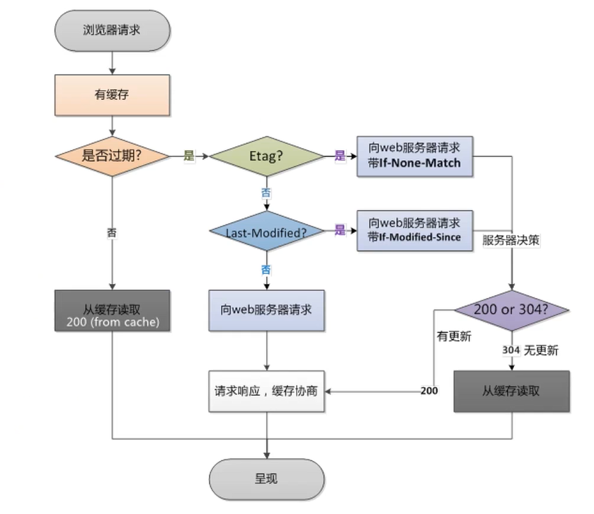


##### Etag头部详解

**ETagHTTP **响应头是资源的特定版本的标识符。这可以让缓存更高效，并节省带宽，因为如果内容没有改变，web服务器不需要发送完整的响应。而如果内容发生了变化，使用ETag有助于防止资源的同时更新相互覆盖（“空中碰撞”）


如果给定URL中的资源更改，则一定要生成新的Etag值。因此Etags类似于指纹，也可能被某些服务器用于跟踪。比较etags能快速确定此资源是否变化，但也可能被跟踪服务器永久留存


**etag指令**

```nginx
Syntax: etag on |off;
Default: etag on;
Context: http,server,location
```

**生成规则**

```C
ngx_sprintf(etag->value.data, "\"%xT-%xO\"",
                    r->header_out.last_modified_time,
                    r->headers_out.content_length_n)
```


**If-None-Match详解**

**If-None-Match** 是一个条件式请求首部。对于 GET 和 HEAD 请求方法来说，当且仅当服务器上没有任何资源的Etag属性值与这个首部中列出的相匹配的时候，服务器端才会返回请求的资源，响应码为200。对于其他方法来说，当且仅当最终确认没有已存在的资源的ETag属性值与这个首部中所列出的相匹配的时候，才会对请求进行相应的处理。


对于 GET 和 HEAD 方法来说，当验证失败的时候，服务器端必须返回响应码304（Not Modified，未改变）。对于能够引发服务器状态改变的方法，则返回412（Precondition Failed，前置条件失败）。需要注意的是，服务器端在生成状态码为304的响应的时候，必须同时生成以下会存在对应的200响应中的首部：Cache-Control、Content-Location、Date、ETag、Expires和Vary。


当与 `If-Modified-Since` 一同使用的时候，`If-None-Match`优先级更高（假如服务器支持的话） 


以下是两个常见的应用场景：

- 采用 GET 或 HEAD 方法，来更新拥有特定的Etag属性的缓存。
- 采用其他方法，尤其是PUT，将`If-None-Match used`的值设置为 *，用来生成事先并不知道是否存在的文件，可以确保先前并没有进行过类似的上传操作，防止之前操作数据的丢失。这个问题属于 **更新丢失问题** 的一种


**If-Modified-Since头部详解**

**If-Modified-Since** 是一个条件式请求首部，服务器只在所请求的资源在给定的日期时间之后对内容进行过修改的情况下才会将资源返回，状态码为200。如果请求的资源从那时起未经修改，那么返回一个不带有消息主体的304响应，而在`Last-Modified`首部中会带有上次修改时间。不同于`If-Unmodified-Since`，`If-Modified-Since` 只可以在 GET 或 HEAD 请求中。

当与`if-None-Match` 一同出现时，它（If-Modified-Since）会被忽略掉，除非服务器不支持 `If-None-Match`。


### Nginx决策浏览器过期缓存是否生效

#### expires 指令

用来告诉浏览器缓存的过期时间的

```nginx
Syntax: expires [modified] time;
        expires epoch|max|off;
Default: expires off
Context: http,server,location,if in location
```

- **max：**
  - Expires: Thu,31 Dec 2037 23:55:55 GMT
  - Cache-Control：max-age=315360000（10年）
- **off: **不添加或者修改Expires和Cache-Control字段
- **epoch：**
  - Expires: Thu, 01 Jan 1970 00:00:01 GMT
  - Cache-Control: no-cache
- **time: **设定具体时间，可以携带单位
  - 一天内的具体时刻可以加@，比如下午六点半：@18h30m
    - 设定好Expires，自动计算Cache-Control
    - 如果当前时间未超过当天的time时间，则Expires到当天time，否则是第二天的time时刻
  - **正数**
    - 设定Cache-Control时间，计算出Expires
  - **负数**
    - Cache-Control：no-cache，计算出 Expires


#### 示例

```nginx
proxy_cache_path /data/nginx/tmpcache levels=2:2 keys_zone=two:10m loader_threshold=300 load_files=200 max_size=200m inactive=1m;

server {
    server_name cache.mystical.tech;
    
    root html/;
    error_log logs/cacherr.log debug;
    location /{
        expires 1h;
        #expires -1h;
        #expires @20h30m;
        #if_modified_since off;
        #proxy_cache two;
        #proxy_cache_valid 200 10m;
        #add_header X-Cache-Status $upstream_cache_status;
        #proxy_cache_use_stale error timeout updating;
        #proxy_cache_revalidate on;
        #proxy_hide_header Set-Cookie;
        #proxy_ignore_header Set-Cookie;
        
        #proxy_force_ranges on;
        #proxy_pass http:///localhost:8012;
    }
}
```


#### not_modified过滤模块

**功能**

客户端拥有缓存，但不确认缓存是否过期，于是在请求中传入`If-Modified-Since` 或者 `If-None-Match`头部，该模块通过将其值与响应中的Last-Modified值相比较，决定是通过200返回全部内容，还是返回304 Not Modified头部，表示浏览器仍使用之前的缓存。


**使用前提**

原返回响应码为200


### 缓存的基本用法

