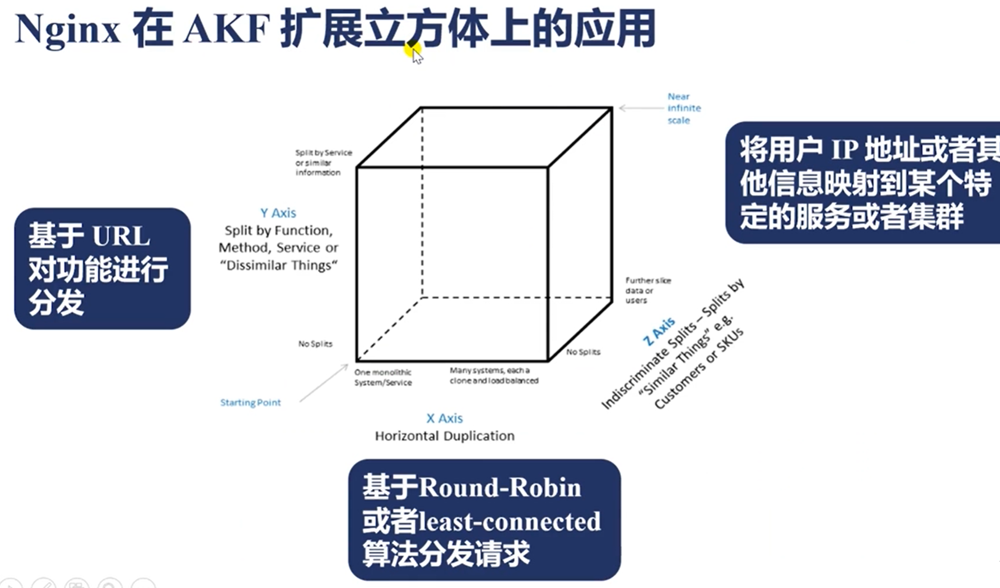

# 初始Nginx
## Nginx的三个主要应用场景
- 静态资源服务
    - 通过本地文件系统提供服务
- 反向代理服务
    -  Nginx的强大性能
    - 缓存
    - 负载均衡
- API服务
    - OpenResty


- 往往一个Web请求会先经过Nginx，再到应用服务，比如（Tomcat，Django），然后去访问redis或数据库提供基本的数据功能，那么这里存在一个问题
- 我们的一个应用服务，因为开发效率要求很高，所以运行效率会很低，他的QPS，TPS或者并发都是受限的，所以需要把很多这样的应用服务，组成一个集群，向用户提供高可用性，而一旦很多服务做成集群，这时就要求Nginx具有反向代理功能，可以把动态请求传导给应用服务
- 而很多应用服务构成集群，它一定会带来两个需求
     - 第一个需求就是：需要动态的扩容
     - 第二个需求是：有些服务出问题的时候，我们需要做容灾，这样的话，反向代理就必须具备负载均衡功能
    
- 其次，在这样的链路中，Nginx是处在企业内网的边缘节点，随着网路链路的增长，用户体验到的时延会增加
    - 其中一个解决方案就是，将用户在一段时间内 看起来不变的内容，缓存在Nginx部分，由Nginx直接向用户提供访问，那么这样的话，用户时延就会减少很多
    - 因此反向代理衍生出的另外一个功能就是缓存，它能够加速用户的访问，在很多时候，我们在访问一些（css,js,pic等）静态资源时没有必要向应用服务来访问的
    - 它只需要通过本地文件，系统上放置的静态资源，直接由Nginx提供访问就可以了，这是Nginx的静态资源功能

- 应用场景三：
    - 因为很多的应用服务，在性能上有很多的问题，但是数据库服务要比应用服务好得多，因为它的业务场景比较简单，它的并发性能和TPS都要远高于应用服务，所以这里就衍生出第三个应用场景，由Nginx直接去访问数据库或者redis，或者类似的应用服务，利用Nginx强大的并发性能，实现如Web防火墙，这样复杂的业务功能，来提供给用户
    - 这样就要求Nginx的API服务有很强大的业务处理功能，所以像openresty或者像Nginx集成的javascript，利用js，lua这样的语言功能，和这些语言先天自带的工具库，来提供完整的API服务


## Nginx的背景与优点
- Nginx出现的三个主要原因
    - 互联网用户的快速增长，（全球化和物联网的发展，导致使用互联网的人和物的数量都在快速上升），数据的爆炸对硬件的性能提出了很高的要求
    - apache的低效：它的架构模型里，一个进程同一时间，只会处理一个连接，一个请求，只有在这个请求处理完以后，才会去处理下一个请求
        - 这里的潜台词就是，它实际上使用的是操作系统的进程间切换特性，因为操作系统微观上只有有限的CPU，但是操作系统被设计为同时服务于数百甚至上千的进程，而Apache一个进程只能服务一个连接，这样的模式会导致i，当apache需要面对几十万，几百万连接的时候，它没有办法去开几百万的进程，而进程间切换代价和成本又太高了，当我们并发的连接数越多，这种无谓的进程间切换引发的性能消耗也就越大，而nginx是专门为这样的应用场景而生的，nginx可以处理数百万，甚至是上千万的连接

- Nginx的使用优点
    - 高并发，高性能
        - 大部分的程序或者web服务器，随着并发连接数的上升，它的RPS会下降
        - nginx同时具备高并发，和并性能，往往高并发只要每个连接所使用的内存尽可能少就能达到，而具有高并发的同时具有高性能，需要一个非常好的设计
        - nginx可以达到的标准：比如一些主流服务器，32核64G内存，可以达到千万级别的并发连接，如果处理一些简单的静态资源请求，可以达到一百万级别的RPS
    - 可扩展性好
        - 模块化设计，生态圈丰富
    - 高可靠性
        - nginx可以在服务器上不间断运行数年
    - 热部署（在不停止服务的情况下，升级Nginx）
    - BSD许可证（开源免费，并且在有特定需求的场景下，可以修改Nginx的源代码，然后运行在商业场景下）


## Nginx的组成
- Nginx二进制可执行文件
    - 由各模块源码编译出的一个文件

- Nginx.conf配置文件
    - 控制Nginx的行为

- （Nginx二进制可执行文件和Ngix.conf定义了Nginx处理请求的方式）

- access访问日志
    - 记录每一条http请求信息

- error.log错误日志
    - 定位问题


- （对Web服务做一些运营或运维的分析，需要对access.log做进一步分析，如果出现任何未知的错误，和预期的行为不一致的时候，可以通过error.log去定位根本性的问题）


## Nginx安装
- 直接使用apt或者yum来安装Nginx会出现的问题
    - Nginx的二进制文件，会把模块直接编译进来，Nginx的官方模块并不是默认都会开启的，如果你想添加第三方的Nginx模块，你必须通过编译Nginx的方式，才能把第三方生态圈的强大的一些功能，添加到Nginx中

### 编译Nginx
- 编译Nginx主要分为6个部分

#### 下载Nginx
```shell
# 下载网站
nginx.org

# 点击右下角的download

# 进入download页面，会发现Nginx有两类版本：mainline version 和 stable verison

# 选择stable version中最新版本，然后右键复制链接地址

# 进入Linux中，wget + 复制的链接地址

# 解压
tar -xzf nginx-1.14.0.tar.gz

# 进入解压后的源码版本

# 解压后，源码目录的简单介绍
auto目录

# auto目录中目录结构
cd auto
CHANGES文件，就是nginx每个版本中，提供了哪些特性，和bugfix，里面每个版本包括CHANGE, BUGFIX, FEATURE
CHANGES.ru，是因为作者是俄罗斯人，因此提供了俄语版
conf目录：示例文件，我们把nginx安装好后，为了方便运维去配置，会把conf中的示例文件拷贝到安装目录
configure脚本：用来生成中间文件，执行编译前的必备动作
contrib： 提供了两个perl脚本和Vim工具，比如我们在没有使用vim工具时，用vim打开nignx的配置文件，会发现它的色彩没有变化（无法体现nginx语法），这个时候，需要把contrib下vim目录下的所有文件，拷贝到自己的目录中
执行：cp -r contrib/vim/* ~/.vim/
拷贝完之后，再用vim打开nginx的配置文件，就会显示nginx的语法高亮
html目录：提哦功能了两个标准的html文件，分别是50x.html(发生500错误时，可以重定向到这个文件)和index.html
man目录：linux对nginx的一个帮助文件

# auto里面有4个子目录
# 这里面所有的文件都是为了辅助configure脚本执行的时候，去判定nginx支持哪些模块，当前的操作系统有什么特性可以供给nginx使用
cc（用于编译） lib（库） os（对所有操作系统的判断） types

# nginx的源代码在src目录
src目录：core目录, event, http, mail, misc, os, stream
--------------------------------------------------------------------------------------------------
进行编译：
编译前，可以看下configure可以执行哪些参数
./configure --help | more

这里主要分为几个大块，
第一大块：确定nginx执行中，他会找哪些目录下文件，作为它的辅助的文件，如果没有什么变动，只需要确定--prefix=PATH，其他的都会在prefix下，创建相应的文件夹，
第二类参数： 确定使用哪些模块和不使用哪些模块，它的前缀通常是with和without；通常需要我们主动加with模块的时候，意味着该模块默认不会编译进nginx，与之相反，显示without的模块，意味着默认会编译进nginx模块中

第三类参数：指定了nginx编译中需要的一些特殊的参数，比如用gcc编译的时候，需要加哪些优化参数，或者需要打印debug级别的日志，以及需要加一些第三方模块等等

----------------------------------------------------------------------------------------------------

实际编译nginx
首先用它的默认参数
./configure --prefix=/home/nginx  # 这里指定了nginx的安装目录是在home/nginx
如果没有任何报错，则nginx编译成功

--------------------------------------------------------------------------
configure执行完毕后，会生成一些中间文件，中间文件放在objs文件夹下
这里最重要的是：ngx_modules.c这个文件决定了在编译的时候，会有哪些模块被编译进Nginx

# 确定好需要的模块后，cd..,执行make编译

# 编译完成后，如果没有任何错误，就会生成大量的中间文件（C语言编译时生成的所有的中间文件都会放在src目录下）和二进制nginx可执行文件，可以在0bjs的目录下看到
知道nginx可执行文件位置的原因：如果要进行升级，不能使用make install，而需要从这里把目标文件nginx拷贝到安装目录中，

C语言编译时生成的中间文件，都被放在src目录中

如果我们使用了动态模块，动态模块编译会生成so动态文件，也会放在objs目录下

首次安装可以使用make install进行安装

然后完成后，我们去到proxy指定的安装目录中，可以看到以下目录，这里最终要的nginx可执行文件，就在sbin目录下，决定nginx配置功能的配置文件在conf目录下

access.log和error.log 在logs目录下
```

### nginx配置语法
- 配置文件由指令与指令块构成
- 每条指令以；分号结尾，指令和参数以（一个或多个）空格符号分隔
- 指令块以{}大括号将多条指令组织在一起
- include语句允许组合多个配置文件，以提升可维护性
- 使用#符号添加注释，提高可读性
- 使用$符号，使用变量
- 部分指令的参数支持正则表达式

#### 配置参数：时间单位
- ms,s,m,h,d,w,M,y

#### 空间单位
- bytes（什么单位都不加，默认byte）， k/K， m/M，g/G

#### http配置的指令块
- http
- server：对应一个或一组域名
- location：一个url表达式
- upstream：表示上游服务，当nginx需要与tomcat，django等等，企业内网的其他服务交互的时候，可以定义一个upstream

## Nginx命令行
- 格式：`nginx -s reload`
- 帮助：`-?` `-h`
- 使用指定的配置文件：`-c`
- 指定配置命令：`-g`
- 指定运行目录：`-p`
- 发送信号`-s`
  - 立刻停止服务：`stop`
  - 优雅的停止服务：`quit`
  - 重载配置文件：`reload`
  - 重新开始记录日志文件：`reopen`
- 测试配置文件是否有语法错误：`-t` `-T`
- 打印nginx的版本信息，编译信息等：`-v`,`-V`

### 重载配置文件
```shell
nginx -s reload    # 在不停止对用户的服务的情况下，重新加载配置
```

### 平滑升级流程（热部署）
- 平滑升级4个阶段
    - 只有旧版nginx的master和worker进程
    - 旧版和新版nginx的master和worker进程并存，由旧版nginx接收处理用户的新请求
    - 旧版和新版nginx的master和worker进程并存，由新版ngnix接收处理用户的新请求
    - 只有新版nginx的master和worker进程

- 不停机更新Nginx二进制文件
```shell
# 服务端创建一个大文件
dd if=/dev/zero of=/apps/nginx/html/test.img bs=1M count=10

# 客户端下载该文件，保证有进程在工作
wget --limit-rate=1k http://10.0.0.200/test.img

# 编译新版本，得到新版本的二进制文件
wget http://nginx.org/download/nginx.1.24.0.tar.gz
tar xf nginx.1.24.0.tar.gz
cd nginx-1.24.0/

# 参考老版本的编译选项，去编译新版本
# 查看老版本
nginx -V
./configure --prefix=/apps/nginx --user=nginx --group=nginx ...
make # 只执行make，不执行make install
# 在objs/nginx -v

# 把之前的nginx命令备份
cp /apps/nginx/sbin/nginx opt/nginx.old

#  把新版的nginx复制过去，覆盖旧版的文件，需要-f选项，强制覆盖，否则会提示Text file busy

# 此时master的pid仍是4659，也就是依然是老版本的nginx进程在处理请求
# worker的pid是132676,他的PPID是4659
[root@ubuntu2204 ~]#ps -ef |grep nginx
root        4659       1  0 14:02 ?        00:00:00 nginx: master process /apps/nginx/sbin/nginx
nginx     132676    4659  0 14:37 ?        00:00:00 nginx: worker process
root      143839  143289  0 14:52 pts/3    00:00:00 grep --color=auto nginx

# 启动新版本,给旧版本的master进程发送一个信号，表示我们要开始热部署了
# 注意：新版本nginx编译的时候-prefix指定的路径必须和老版本一致
kill -USR2 `cat /apps/nginx/logs/nginx.pid`   #-USER2,并来实现USR2

# 此时可以观察到新老master，worker进程都在进程，而且新master进程是老master进程fork出来的
# 而且此时老的worker进程已经不再监听80/443端口了，所以新的连接只会进入新的nginx进程中，可以使用lsof -i :port查看，即可查看到当前监听80的端口的进程变成了新的worker进程
[root@ubuntu2204 objs]#ps -ef |grep nginx
root        4659       1  0 14:02 ?        00:00:00 nginx: master process /apps/nginx/sbin/nginx
nginx     132676    4659  0 14:37 ?        00:00:00 nginx: worker process
root      147105    4659  0 15:10 ?        00:00:00 nginx: master process /apps/nginx/sbin/nginx
nginx     147106  147105  0 15:10 ?        00:00:00 nginx: worker process
root      147108    1017  0 15:10 pts/0    00:00:00 grep --color=auto nginx

# 此时如果旧版worker进程有用户的旧的请求，会一直等待处理完后才会关闭，即平滑关闭
kill -WINCH `cat /apps/nginx/logs/nginx.pid.oldbin`  # -WINCH这个信号意思是告诉老的master进程，请优雅的关闭worker进程

[root@ubuntu2204 objs]#ps -ef | grep nginx
root        4659       1  0 14:02 ?        00:00:00 nginx: master process /apps/nginx/sbin/nginx
nginx     132676    4659  0 14:37 ?        00:00:00 nginx: worker process is shutting down  # 正在关闭，说明此时有用户在连接老的进程，当旧的连接都处理结束了，老的worker进程会直接关闭销毁
root      147105    4659  0 15:10 ?        00:00:00 nginx: master process /apps/nginx/sbin/nginx
nginx     147106  147105  0 15:10 ?        00:00:00 nginx: worker process
root      147126    1017  0 15:29 pts/0    00:00:00 grep --color=auto nginx

# 如果有新请求，则由新版本提供服务

# 经过一段时间测试，如果新版本没问题，最后发送QUIT信号，退出老的master，完成全部升级过程
# 老的master是不会自动退出了，会一致挂在那里，允许我们做版本回退
kill -QUIT `cat /apps/nginx/logs/nginx.pid.oldbin`

############### 回滚 ####################
#如果升级的新版本发现问题，需要回滚，可以发送HUP信号，重新拉起旧版本的worker
kill -HUP `cat /apps/nginx/logs/nginx.pid.oldbin`

# 最后关闭新版的master和worker，如果不执行上面的HUP信号，此步QUIT信号也可以重新拉起旧版本的woker进程
kill -QUIT `cat /apps/nginx/logs/nginx/pid`
# 恢复旧的文件
mv /opt/nginx.old   /apps/nginx/sbin
```

### 日志切割
```shell
# 不使用logrotate日志转储的方式
备份当前的日志文件
mv access.log bak.log
nginx -s reopen  # nginx会重新生成一个access.log
```
- 将上述过程写成一个脚本
```shell
#!/bin/bash
LOGS_PATH=/usr/local/openresty/nginx/logs/history
CUR_LOGS_PATH=/usr/local/openresty/nginx/logs
YESTERDAY=$(date -d "yesterday" +%Y-%m-%d)
mv ${CUR_LOGS_PATH}/access.log ${LOGS_PATH}/access_${YESTERDAY}.log
mv ${CUR_LOGS_PATH}/error.log ${LOGS_PATH}/error_${YESTERDAY}.log
## 向Nginx主进程发送USR1信号。USR1信号是重新打开日志文件
# kill -USR1 等同于 nginx -s reopen
kill -USR1 $(cat /usr/local/openresty/nginx/logs/nginx.pid)
```

### 传输文件时压缩gzip（优化手段之一）
```shell
gzip on;   # 开启gzip
gzip_min_length 1;  # 表示小于1字节的文件不压缩，节省资源 
gzip_comp_level 2;  # 压缩级别
# gzip_types表示哪些类型的文件才进行压缩
gzip_types text/plain application/x-javascript text/css application/xml text/javascript application/x-httpd-php image/jpeg image/gif image/pnp
```


### ngx_http_autoindex_module模块
提供当我们访问以"/"为结尾的url时，把我们对应到一个目录中，显示这个目录的结构
```shell
location / {
    autoindex on;
}
```

### 限速(core模块)
```shell
set $limit_rate 1k;   # 限制nginx发送响应的速度
```


### access_log日志
```shell
# 自定义access_log格式
log_format main '$remote_addr - Rremote_user [$time_local] "$request"' '$status $body_bytes_sent "$http_referer"'
'"$http_user_agent" "$http_x_forwarded_for"';

# 指定日志文件
access_log logs/access.log main;
```

### proxy_cache
当nginx作为反向代理时，通常只有动态的请求，也就是不同的用户访问同一个url，看到的内容是不同的，这个时候才会交给上游服务器处理，但是有些内容可能是一段时间不会发生变化的，这个时候，为了减轻上游服务器的压力，我们会让nginx把上游服务器返回的内容，缓存一段时间，比如缓存一天，在一天之内，即使上游服务器的内容响应发生变化，我们也不管，我们只会去拿缓存住的内容向浏览器发出响应，因为nginx的性能通常远远领先上游服务器的性能，所以使用这个特性，对一些小的站点，会有非常大的性能提升

#### 缓存服务器实现
```shell
proxy_cache_path /tmp/nginxcache levels=1:2 keys_zone=my_cache:10m max_size=10g inactive=60m use_temp_path=off;
# /tmp/nginxcache   指明放缓存数据的路经
# 以及这些文件的命名方式
# keys_zone=my_cache：10m   这些文件的关键字放在共享内存中
# 这里开辟了一个10m的共享内存，命名为my_cache

在需要做缓存的路径下添加proxy_cache

server {
    server_name mystical.feng.com;
    listen 80;

    location / {
        proxy_cache my_cache;  # 这里添刚刚开辟的共享内存

        proxy_cache_key $host$uri$is_args$args;
        proxy_cache_valid 200 304 302 1d;
        proxy_pass http://local;
    }
}
```

# Nginx的架构基础


为什么讨论Nginx架构基础：

nginx运行在企业内网的最外层，也就是边缘节点，因此它处理的流量是其他应用服务器处理流量的数倍，甚至是几个数量级，

任何一种问题，在不同的数量级下，它的解决方案是完全不同的，所以在nignx所处理的应用场景中，所有的问题就会被放大，

所以我们必须理解为什么nginx采用master，worker这样一种架构模型，为什么woker进程的数量要和CPU的核数相匹配，当我们需要在多个worker进程间共享数据的时候，为什么在tls或者说在一些限流限速的场景下，他们的共享方式是有所不同过的，这些需要对nginx架构有一个清晰的了解


## Nginx的请求流程


- 初始一般有三种流量Web，TCP，Email
- 进入Nginx后，nginx中有三个大的状态机
    - 一个是处理TCP，UDP的传输层状态机
    - 一个处理应用程的HTTP状态机
    - 以及处理邮件的MAIL状态机
- nginx中，核心的深绿色的框，它使用非阻塞的事件驱动处理引擎，也就是EPOLL
- 一旦我们使用这样的异步处理引擎以后，通常都是需要状态机来把请求正确的识别和处理的

- 基于这样的状态处理机
    - 我们在解析出请求需要访问静态资源的时候, 解析出静态资源
    - 当我们去做反向代理的时候，对反向代理的内容可以做磁盘缓存，缓存到磁盘上
    - 当整个内存已经不足以缓存住所有的文件缓存信息时
        - 会退化成阻塞的磁盘调用，通常使用线程池处理磁盘阻塞调用

- 对于每一个处理完成的请求
    - 记录access日志和error日志，这两个日志也是记录磁盘中的，可以通过rsyslog，把它记录到远程主机上
    - 更多的时候，nginx作为负载均衡和反向代理使用
    - 这个时候可以把请求协议级传输到后面的服务器
    - 也可以通过例如：应用层的一些协议，fasetcgi、uWSGL(Python)，SCGL等代理到相应的应用服务器


## 状态机的详细讲解与示例

状态机（State Machine）可以用来描述复杂系统中状态之间的转换和行为。以下是一个详细的讲解和实际的例子，帮助你更清晰地理解状态机的概念及其应用。

------

### **1. 什么是状态机**

状态机由以下几个部分组成：

1. 状态（State）
   - 系统可能处于的某种情况。
2. 事件（Event）
   - 导致状态发生改变的触发条件。
3. 动作（Action）
   - 状态转换时的操作。
4. 转换（Transition）
   - 从一个状态到另一个状态的变化过程。

------

### **2. 示例背景：HTTP 状态机**

以一个 **HTTP 请求处理过程** 为例，Nginx 的 HTTP 状态机可以被描述为：

1. 接收 HTTP 请求。
2. 解析请求行和请求头。
3. 检查请求体是否完整。
4. 生成并发送响应。
5. 完成请求处理，关闭连接。

------

### **3. 状态机的状态与事件**

#### **状态定义**

在 HTTP 请求处理中，我们可以定义以下状态：

1. **WAIT_REQUEST**：等待接收 HTTP 请求。
2. **PARSE_HEADERS**：解析请求行和请求头。
3. **PROCESS_BODY**：处理请求体。
4. **SEND_RESPONSE**：生成并发送响应。
5. **DONE**：完成请求处理。

#### **事件定义**

- **RequestReceived**：接收到 HTTP 请求行。
- **HeadersParsed**：解析请求头完成。
- **BodyProcessed**：请求体处理完成。
- **ResponseSent**：响应发送完成。

------

### **4. 状态转移表**

我们可以用一张表描述状态机的行为：

| **当前状态**    | **事件**          | **动作**             | **下一个状态**  |
| --------------- | ----------------- | -------------------- | --------------- |
| `WAIT_REQUEST`  | `RequestReceived` | 接收请求行并保存     | `PARSE_HEADERS` |
| `PARSE_HEADERS` | `HeadersParsed`   | 验证并解析请求头     | `PROCESS_BODY`  |
| `PROCESS_BODY`  | `BodyProcessed`   | 处理请求体并准备响应 | `SEND_RESPONSE` |
| `SEND_RESPONSE` | `ResponseSent`    | 发送响应             | `DONE`          |
| `DONE`          | -                 | 释放资源             | -               |

------

### **5. 图示化状态机**

```
plaintextCopy codeWAIT_REQUEST  --(RequestReceived)--> PARSE_HEADERS
PARSE_HEADERS --(HeadersParsed)--> PROCESS_BODY
PROCESS_BODY  --(BodyProcessed)--> SEND_RESPONSE
SEND_RESPONSE --(ResponseSent)--> DONE
```

------

### **6. 示例代码**

以下是一个用伪代码实现的状态机示例：

```
pythonCopy codeclass HTTPStateMachine:
    def __init__(self):
        self.state = "WAIT_REQUEST"

    def handle_event(self, event):
        if self.state == "WAIT_REQUEST":
            if event == "RequestReceived":
                print("Request received, transitioning to PARSE_HEADERS")
                self.state = "PARSE_HEADERS"
        elif self.state == "PARSE_HEADERS":
            if event == "HeadersParsed":
                print("Headers parsed, transitioning to PROCESS_BODY")
                self.state = "PROCESS_BODY"
        elif self.state == "PROCESS_BODY":
            if event == "BodyProcessed":
                print("Body processed, transitioning to SEND_RESPONSE")
                self.state = "SEND_RESPONSE"
        elif self.state == "SEND_RESPONSE":
            if event == "ResponseSent":
                print("Response sent, transitioning to DONE")
                self.state = "DONE"
        elif self.state == "DONE":
            print("Request handling completed.")
        else:
            print(f"Unknown state: {self.state}")

# 示例流程
fsm = HTTPStateMachine()

# 模拟事件触发
fsm.handle_event("RequestReceived")  # WAIT_REQUEST -> PARSE_HEADERS
fsm.handle_event("HeadersParsed")    # PARSE_HEADERS -> PROCESS_BODY
fsm.handle_event("BodyProcessed")    # PROCESS_BODY -> SEND_RESPONSE
fsm.handle_event("ResponseSent")     # SEND_RESPONSE -> DONE
```

------

### **7. 实际应用中，状态机的好处**

1. **简化复杂逻辑**：
   - 将复杂的请求处理分解成多个独立状态。
   - 每个状态的逻辑清晰、易于维护。
2. **事件驱动**：
   - 通过事件触发状态转换，避免阻塞等待。
3. **扩展性强**：
   - 可以轻松添加新的状态或事件，而不影响已有逻辑。

------

### **8. 扩展示例：TCP 状态机**

除了 HTTP，TCP 协议本身也是一个典型的状态机。例如：

- **状态**：
  - `LISTEN`：等待客户端连接。
  - `SYN_RCVD`：收到 SYN 请求。
  - `ESTABLISHED`：连接已建立。
  - `FIN_WAIT`：等待连接关闭。
- **状态转移**：
  1. `LISTEN` --(收到 SYN)--> `SYN_RCVD`
  2. `SYN_RCVD` --(收到 ACK)--> `ESTABLISHED`
  3. `ESTABLISHED` --(收到 FIN)--> `FIN_WAIT`

------

### **9. 状态机的总结**

- 状态机是描述系统中状态及其转换的一种有效方式。
- 在 Nginx 中，状态机用于管理异步请求的处理过程，将复杂的逻辑拆解为简单的状态和事件。
- 通过状态机，Nginx 实现了高效的请求管理，支持 HTTP、TCP、UDP 等多种协议的异步处理。

这种设计不仅提高了代码的可维护性和扩展性，也显著提升了系统的并发处理能力。


##  Nginx的进程结构

nginx有两种进程结构：单进程结构和多进程结构， 默认配置是多进程nginx

### 单进程结构
不适合生产环境，只适合我们做开发，调试用的

### 多进程结构(默认)
默认的配置中都是打开多进程的nginx

MASTER PROCESS 下面分为两类子进程，一类是worker 进程，一类是cache相关的进程

#### Nginx采用多进程结构，而不是多线程结构的原因
Nginx要保证它的高可用性和高可靠性

Nginx在使用多线程的时候，因为线程之间是共享同一个地址空间的，当有一个第三方模块引发了一个地址空间引发的段错误时，在地址越界出现时会导致nginx进程全部挂掉，而多进程的模型往往不会出现这种问题

```shell
Master 进程 --> Worker进程 --> Cache manager --> Cache loader
# nginx的父子进程间的通信是通过信号进行管理的
# cache manager 和 cache loader 不会默认启动，只有在配置了缓存功能时才会启动。
```

Nginx在做进程设计时，同样遵循了实现高可用，高可靠的目的，比如：在Master进程中，通常第三方模块是不会在这里加入自己的功能代码的，虽然在Nginx在设计时，允许第三方模块在master进程中，添加自己独有的自定义的方法，但是通常没有第三方模块会这么做。master进程被设计的目的是用来做worker进程的管理的，也就是说，所有的worker进程，使用来处理真正的请求的，而master进程负责监控每个worker进程是不是在正常的工作，需不需要做重新载入配置文件，需不需要做部署。


Cache缓存，实际上是在多个worker进程间共享的，而且缓存不仅要在worker进程间使用，还要被CacheManger和Cache Loader进程使用，CacheManager和Cache Loader也是为反向代理时后端发来的动态请求做缓存所使用的，Cache Loader只是用来做缓存的载入，Cache Manager是用来做缓存的管理，实际上每一个请求处理时使用的缓存还是由worker进程来进行的，这些进程间的通信，都是使用共享内存来解决的，在这个结构里，worker进程有很多，而Cache Manager和Cache Loader只有一个，而Master进程因为是父进程，肯定只有一个，worker进程有很多的原因：nginx采用事件驱动的模型后，它希望每个worker进程，从头到尾占有一个CPU，所以往往我们除了把woker进程的数量和我们的CPU核数设置一致以外，还需要把每一个worker进程和某个CPU核绑定在一起，这样可以更好的使用每个CPU核上面的CPU缓存，还减少缓存失效的命中率


### Nginx父子进程间是通过信号进行管理

命令中的很多子命令都是发送信号给进程

``````bash
[root@ubuntu2204 /apps/nginx/conf]$ pstree -p|grep nginx
           |-nginx(6376)-+-nginx(6484)
           |             `-nginx(6485)
[root@ubuntu2204 /apps/nginx/conf]$ pstree -p|grep nginx
           |-nginx(6376)-+-nginx(6484)
           |             `-nginx(6485)
           
# 旧的worker进程和cache进程退出，新的worker进程和cache生成
# 等价于 kill -SIGHUP <父进程>
[root@ubuntu2204 /apps/nginx/conf]$ nginx -s reload
[root@ubuntu2204 /apps/nginx/conf]$ pstree -p|grep nginx
           |-nginx(6376)-+-nginx(6504)
           |             `-nginx(6505)
           
           
# 发送一个SIGTERM信号该指定worker进程，会使其退出，
# 但是master进程检测worker进程退出后，会自动创建一个新worker进程，维持总共2个worker进程的架构
[root@ubuntu2204 /apps/nginx/conf]$ pstree -p|grep nginx
           |-nginx(6376)-+-nginx(6504)
           |             `-nginx(6505)
[root@ubuntu2204 /apps/nginx/conf]$ kill -SIGTERM 6504
[root@ubuntu2204 /apps/nginx/conf]$ pstree -p|grep nginx
           |-nginx(6376)-+-nginx(6505)
           |             `-nginx(6515)

``````


## Nginx进程管理：信号

```shell
# Master进程
监控worker进程
- CHLD ----- 当子进程终止的时候，回向父进程发送CHLD信号，如果Worker进程由于一些模块，出现bug，导致意外终止，Master进程可以立刻通过CHLD发现这个事件，然后重新把Worker进程拉起

Master进程还可以接受一些信号管理Worker进程
TERM,INT ----- 立即停止nginx进程
QUIT     ----- 优雅的停止nginx进程
HUP      ----- 重载配置文件
USR1     ----- 重新打开日志文件，做日志文件的切割

管理worker进程

接收信号
- TERM, INT
- QUIT
- HUP
- USR1
- USR2       ------- 针对热部署时使用 
- WINCH      ------- 针对热部署时使用 

# Worker进程
接收信号   ----------- 通常不会向worker进程发送信号，因为我们希望让Master进程来管理Worker进程，实际上直接向worker进程发送信号是一样的，但是我们通常是将信号发送给Master进程，然后Master进程会给Worker进程发送信号
- TERM, INT
- QUIT
- USR1
- WINCH

# nginx命令行
# 当我们启动了nginx之后，nginx会把它的PID寄到一个文件中，通常默认是Nginx安装目录的logs文件下的nginx.pid文件中，这里会记录master进程的pid
[root@ubuntu2204 /apps/nginx/logs]$ pwd
/apps/nginx/logs
[root@ubuntu2204 /apps/nginx/logs]$ cat nginx.pid 
6376

# 当我们再次执行nginx -s，nginx这个工具命令行会读取pid文件中的master文件中的pid，然后想这个pid中发送下面各种信号
reload: HUP
reopen: USR1
stop: TERM
quit: QUIT
```


## reload流程

- 向master进程发送HUP信号(reload命令)
- master进程校验配置语法是否正确
- master进程打开新的监听端口，而worker进程会继承父进程打开的端口，这个是linux操作系统中定义的
- master进程用新配置启动新的worker子进程
- master进程向老worker子进程发送QUIT信号，这里QUIT是优雅退出，这里要注意顺序，一定是先启新的worker子进程，再发送QUIT信号，保证平滑
- 老的worker进程收到信号后，老worker进程关闭监听句柄（此时新的连接只会到新的worker子进程），处理完当前连接后结束进程
- 在新版本中，会有个参数`worker_shutdown_timeout`这个是如果在启新的子进程时，老的子进程上会有一个定时器，超时会强制关闭


## 热升级的完整流程

##  

- 将旧nginx文件换成新nginx文件（binary文件）--- （注意备份）
  - 新编译的nginx文件所指定的响应的配置选项，比如配置文件的目录在哪里，log的所在目录等等必须和老的nginx保持一致，否则无法复用nginx.conf文件
  - 新版本linux中，会要求使用`cp -f`才能替换正在运行的binary文件
- 向master进程发送USR2信号
- master收到信号后，会做如下几件事
  - master进程修改pid文件，加后缀`.oldbin` ---- 给新的master进程让路，让新的master使用pid.bin这个文件名
  - master进程使用新的nginx文件启动新master进程 --- 此时会出现两个master进程和老的worker进程
- 向老的master进程发送QUIT信号  --->  关闭老master进程，老master进程会优雅关闭老worker进程，老master进程会一直保持下来，等待后续可能得回滚操作
- 回滚：向老master进程发送HUP，向新master发送QUIT


## Worker进程：优雅关闭

优雅关闭只对worker进程而言，因为只有worker进程会去处理请求，如果我们在处理一个连接的时候，不管连接对于请求是一个怎样的作用，我们直接关闭这个链接，会导致用户收到错误，所以优雅的关闭就是指nginx的worker进程可以**识别出当前的链接没有正在处理的请求**，这个时候我们再把连接关闭


对于有些请求，nginx是做不到优雅关闭的，比如nginx代理websocket协议的时候，在websocket进行通信的frame帧里面，nginx是不解析这个帧的，所以这个时候是没有办法识别当前连接是否有正在处理的请求，nginx在做tcp或UDP层反向代理的时候，也没有办法识别一个请求需要经历多少报文，才算结束，但是对于HTTP请求，nginx是可以做到的，**所以优雅的关闭主要针对http请求**


### 优雅关闭的流程


- 设置一个定时器，在nginx.conf中配置一个`worker_shutdown_timeout`，设置完定时器后，会加一个标志位，表示现在进入优雅关闭的这个流程
- 然后关闭监听句柄，也就是保证当前所在的worker进程不会再去处理新的连接请求
- 然后会去看连接池，因为nignx实际上为了保证自己对资源的利用是最大化的，经常会保存一些空闲的连接，但是没有断开，这是会关闭所有的空闲连接
- （第四步可能是时间非常长的一步）因为nginx不是主动的立即关闭，所以通过第一步增加一个标志位，在循环中每当发现一个请求处理完毕，就会把这个请求使用的连接关掉，在循环中等待全部连接关闭的时间可能会超过第一步中的`worker_shutdown_timeout`的时间，当我们设置了这个参数，那么即使请求还没有处理完，这些连接都会被强制关闭，也就是说优雅关闭只完成一半。
  - 也就是说，两个条件---> 所有连接都关闭或者达到`worker_shutdown_timeout`的时间
- 然后worker进程关闭退出


很多时候我们都会使用到这个特性（优雅关闭退出），当这个特性失效的时候，我们需要考虑nginx有没有能力去判定一个连接此时应当被正确关掉，或者如果出现错误，有些模块或客户端不能正常处理请求时，nginx需要有一些例外的措施，比如：`worker_shutdown_timeout`l来保证nginx老的进程能够正常的退出掉


## 网络收发与Nginx事件间的对应关系

Nginx是一个事件驱动的框架，所谓事件指的是网络事件，Nginx每一个连接会自然对应两个网络事件，一个读事件，一个写事件。
所以，我们在深入了解Nginx的各种原理，及它在极端场景下的一些错误场景的处理时，我们必须首先理解什么是网络事件


比如当主机A向服务端主机B发送一个GET请求时，这个过程中经历了哪些网络事件

- 应用层里发送了一个HTTP请求
- 传输层：我们浏览器打开了一个端口（可以从Windows的任务管理器上看到这一点），然后它会把这个端口记下来，以及将nignx打开的端口比如80或443也记到传输层
- 网络层会记录我们主机所在IP，和目标主机，也就是nginx所在服务器的公网IP
- 在链路层，经过以太网到达家里的路由器 ---> 路由器里会记录运行商的下一段的IP，经过广域网最终跳转到主机B所在的机器中，这个时候，报文会通过链路层，网络层，传输层，最终到传输层后，操作系统就知道是将报文给到打开80或443端口的进程，也就是nginx服务，nginx在它的http状态处理机里面就会处理这个请求


在上述过程中，网络报文扮演了一个怎样的角色？

了解TCP报文
在数据链路层，它会在数据的前面header部分和最尾的footer部分添加上mac地址，包括源mac地址，目标mac地址
到网络层，数据的header部分会有一个ip头部，上面则是nginx的公网地址和浏览器的公网地址
到TCP层，指定了nginx打开的端口和浏览器打开的端口
到应用层，则是HTTP协议

上述就是一个报文层层封装和解封装的过程

### 什么是网络事件
我们发送的http协议会被切割成很多小的报文，在网络层会切割成小的mtu，在以太网，mtu是1500字节，TCP层它会考虑中间每个环节中，最大的一个mtu值，这个时候往往每个报文只有几百字节，这个报文大小我们称为mss，所以每收到一个小于mss大小的报文时，就是一个网络事件 - 上述描述详解
```shell
这句话解释了HTTP协议的报文在网络传输过程中是如何被切分的，特别是在TCP和以太网的不同层次之间。我们可以分解这句话逐步进行解释：

HTTP协议报文被切割成多个小报文：HTTP协议是应用层协议，当发送一个较大的HTTP请求或响应时，传输过程中并不是一次性发送整个报文。相反，数据会被分割成更小的部分。

网络层切割成MTU大小的报文：MTU（最大传输单元）是指在网络层（特别是IP层）每个数据包的最大大小。例如，在以太网中，MTU通常为1500字节。因此，超过MTU的数据包需要被分割成更小的片段，以适应这个限制。

TCP层考虑最大MTU值：在传输层（TCP层），为了确保数据能够顺利传输，TCP会根据网络中所有路径上的MTU大小来决定一个安全的传输数据大小。TCP通过一种叫“路径MTU发现”（PMTU）的机制，找到路径中各个环节的最大MTU值。这个过程帮助TCP知道该如何将数据切分，以避免在中间某一环节因为MTU过大导致的丢包和重新传输。

MSS（最大报文段长度）：MSS是TCP层特有的概念，它表示在不发生IP层分片的情况下，TCP报文段中数据部分的最大长度。通常，MSS是MTU减去TCP/IP报头后的值。因为MTU包含了以太网帧、IP头和TCP头，所以MSS会比MTU小。一般情况下，在以太网中，MSS的典型值是1460字节（1500字节的MTU减去20字节的IP头和20字节的TCP头）。

每个报文只有几百字节：在某些网络路径上，MTU可能比以太网的标准1500字节更小，因此，实际传输的数据段往往小于这个MSS值，导致TCP报文只有几百字节大小。
```

### TCP协议中网络事件是怎样和日常调用的接口关联在一起的
- 日常调用接口
  - Accept()
  - Read()
  - Write()
  - close()


### 读事件

#### 请求建立TCP连接事件 ---> accept建立连接事件
比如：请求建立TCP连接事件，实际上是发送了一个TCP的报文，通过上述流程到达Nginx，这个网络事件其实对应的是一个读事件，对nginx来说我读取到了一个报文，也就是accept建立连接的事件

#### TCP连接可读事件 
我们发送一个消息，对nginx来说也是一个读事件，即Read读消息

#### TCP连接关闭事件
对于nginx来说，依然是读事件，因为对于nginx来说，它只是读取一个报文

### 写事件
当我们的nginx需要向浏览器发送一个响应报文时，我们需要把消息写到操作系统中，要由操作系统发送到网络中，这就是一个Write写事件


网络中的读写事件，在nginx中，或者在任何一个异步事件的处理框架中，它一定会有一个事件收集分发器，

### 事件收集分发器

我们会定义每一类事件，他处理的消费者，也就事件它本身是一个生产者，是网络中自动生产到nginx中的，我们对每种事件要建立一个消费者
- 比如连接建立的事件消费者，就是我们对accept()的调用，那么http模块就会去建立一个新的连接
- 还有很多读消息或者写消息，那么在http的状态机中，不同的时间段，我们会调用不同的方法，也就是每一个消费者去处理。

上述网络事件和对应消费者的概念，对我们理解nginx的异步处理框架是非常有帮助的，包括我们后面谈到openResty，他也是常依赖于我们的网络事件以及事件分发的，包括lua的同步代码


### 通过三次握手感受Nginx网络事件处理
三次握手的过程：

当浏览器向Nginx服务器发起请求时，会经历经典的TCP三次握手：
第一次握手：浏览器向服务器发送SYN包，表示请求建立连接。
第二次握手：服务器收到SYN包后，返回SYN+ACK包，表示同意建立连接。
第三次握手：浏览器收到SYN+ACK包后，再发送一个ACK包，表示确认连接已经建立。
浏览器和操作系统的通信：

在三次握手的过程中，浏览器发出的数据包（SYN和ACK等）通过操作系统的TCP/IP栈处理，网络层负责实际的数据包传输。
这期间，Nginx服务器并不会立即被通知到，操作系统的内核会负责处理这个TCP连接的建立。
操作系统通知Nginx进程：

只有在三次握手成功完成后，操作系统才会将这个新的连接通知给Nginx。这是因为，在握手过程中，连接还没有正式建立，操作系统只是在处理网络数据包。
当操作系统收到浏览器发送的最后一个ACK包（三次握手的第三步），连接才被认为成功建立。这时，操作系统会通知Nginx服务器进程，告诉它有一个新的连接已经建立，并触发Nginx的读事件。

Nginx的读事件：
Nginx作为一个事件驱动的服务器，会等待内核的通知，通常通过epoll（或kqueue在BSD系统上）监听新连接的到来。内核收到ACK包后，Nginx的事件循环就会被唤醒，并触发相应的读事件（也就是开始处理来自浏览器的HTTP请求）。这个读事件对应的是一个建立新连接，所以nginx此时应该调用accept()这个方法，去建立一个新的连接


## Nginx的事件驱动模型
### Nginx事件循环


当nginx刚刚启动的时候，我们在`WAIT FOR EVENTS ON CONECTIONS`，也就是我们打开了80或者443端口，这个时候，我们在等待新的事件进来（比如：新的客户端连上了我们的nginx，它向我们发起了连接，我们在等待这样的事件）

这个步骤往往对应着我们epoll中的`epollwait`这样一个方法（此时Nginx处于sleep进程状态的）

epoll_wait 是 Linux 中 epoll 机制的一部分，用来高效地处理大量的并发连接。它是一个阻塞调用，等待内核监听的文件描述符（例如，socket、文件等）上发生事件。当事件发生时，epoll_wait 会返回这些事件，通知应用程序去处理。

当操作系统收到了一个建立tcp连接的报文，并处理完握手流程后，操作系统就会通知epoll_wait(),唤醒阻塞中的epoll_wait，同时也唤醒nginx的worker进程，我们往下走，就会找操作系统去要事件，这里的kernel就是操作系统内核，操作系统会把他准备好的事件放到事件队列中，从这个事件队列中就可以获取到我们要处理的事件，比如建立连接，比如收到tcp的请求报文

取出事件后，我们就可以去处理它，即`PROCESS THE EVENT QUEUE IN CYTCLE`

这里看图片，处理事件就是一个循环，当队列不为空，我们就把事件取出来，开始处理，在处理事件的过程中，可能会生成一些新的事件，比如：我发现一个连接被新建立了，我可能会添加一个超时时间，比如60s，也就是说60s之内，如果浏览器不向我发送请求的话，我就会把这个连接关闭掉

又比如说，我收完了完整的http请求后，我已经可以生成响应了，那么这个新生成的响应是需要我可以向操作系统的写缓存区里面去把响应写进去，要求操作系统尽快的把这样的一个响应内容发给浏览器

如果所有的事件都处理完，我们就会返回到`WAIT FOR EVENTS ON CONNECTIONS`

#### 知道Nginx事件循环的好处
这个时候我们再去理解，有时候我们使用一些第三方模块，这个第三方模块可能会去做大量的CPU计算，这样的计算任务会导致我处理一个事件的事件非常的长，在我们刚刚所说的流程图里，就可以看到，它会导致后续的队列中的大量事件长时间得不到处理，从而引发恶性循环，也就是它们的超时时间可能到了，我们大量的CPU都用来处理连接不正常的断开，所以往往nginx不能容忍有些第三方模块长时间消耗大量的CPU进行计算任务，就是这个原因

比如gzip这种模块，它们都不会一次性使用大量CPU，都是分段使用都与这是有关系的


在上述循环流程中，最关键的就是Nginx怎样能够快速的从操作系统的Kernel中获取到等待处理的事件，这么一个简单的步骤，其实经历了很长时间的解决，比如：到现在Nginx主要在使用Epoll这样一个网络事件收集器的模型


## epoll的基本概念
epoll 是 Linux 提供的一种高效的 I/O 事件通知机制，尤其适用于需要处理大量并发连接的场景，比如 Web 服务器、代理服务器等。相比于传统的 select 和 poll，epoll 可以处理大规模并发连接，而不会随着监听的文件描述符数量增加而线性增长

- 事件驱动：Nginx 是事件驱动的服务器，它通过 epoll 等机制来处理 I/O 事件，如新连接、可读/可写事件等。
- epoll 文件描述符：Nginx 启动时，会向内核注册一些文件描述符（FD），包括监听的端口（如80、443）。这些描述符会被加入到 epoll 中，由 epoll 来监控它们上是否有事件发生。

#### epoll_wait 的作用
当 Nginx 启动后，它会在 epoll 中注册它的监听 socket，并等待事件。此时，epoll_wait 被调用，它会：
- 进入阻塞状态：epoll_wait 进入阻塞状态，等待内核通知它有事件发生。例如，当有客户端试图连接 Nginx 的监听端口时，epoll_wait 就会被唤醒。

- 监听并处理事件：当有客户端连接进来，或者之前的连接有了新的数据，epoll_wait 会返回发生事件的文件描述符列表（FDs），这样 Nginx 可以知道该处理哪些连接。

- 返回事件列表：epoll_wait 返回一个包含已经发生的事件的文件描述符的数组，Nginx 再根据这些事件决定下一步的处理，比如接受新的连接或处理现有连接的读写操作。

#### epoll_wait 的参数
```C
int epoll_wait(int epfd, struct epoll_event *events, int maxevents, int timeout);

//epfd：epoll 实例的文件描述符，它是通过 epoll_create() 或 epoll_create1() 创建的。
//events：这是一个数组，用来保存发生事件的文件描述符的集合。epoll_wait 会将检测到的事件填充到这个数组中。
//maxevents：最多返回的事件数量。这个参数限制了 events 数组的大小，告诉 epoll_wait 最多返回多少个事件。
//timeout：等待事件发生的超时时间（毫秒）。如果设置为 -1，则表示无限期等待事件；如果设置为 0，则表示立即返回，不等待。
```

#### Nginx 中的 epoll_wait 使用
- 初始化阶段：Nginx 启动后，会初始化 epoll 事件循环，打开监听端口（如80或443），并将这些监听 socket 的文件描述符注册到 epoll 中。

- 等待事件：在 Nginx 的事件循环中，epoll_wait 被反复调用。每次 epoll_wait 会阻塞，直到有客户端连接或数据可用，事件触发时它会返回，并将触发的事件传递给 Nginx。

- 处理事件：Nginx 根据事件类型（如可读事件、新连接事件）来做相应的处理，可能是接受新的连接，也可能是读取现有连接的数据。


#### 举例：客户端连接时的流程
- Nginx 在启动后，监听 80 或 443 端口，并通过 epoll 机制注册这些端口的文件描述符。
- 调用 epoll_wait 等待事件。
- 当有客户端发起连接时，epoll_wait 被唤醒，返回监听 socket 上的可读事件。
- Nginx 得到这个事件后，调用 accept 接受新的连接。
- e接下来，这个新连接的文件描述符也会被加入到 epoll 的监控列表中，用来处理后续的读写操作。


### epoll的优劣及原理
在上述的循环流程中，最关键的就是nginx怎样能够快速的从操作系统的kernel中获取到等待处理的事件，这么一个简单的步骤其实经历了很长时间的解决

比如：到现在nginx主要在使用epoll这样一个网络事件收集器的模型，那么下面我们来简单的回顾下epoll的特点


从图中可以看出，随着并发连接数（即句柄数）的增加，Poll和Select所消耗的事件是急剧上升的，而Epoll基本与句柄数是无关的，所以它非常适合做大并发连接处理，那么为什么会这样呢，我们看一下它的场景

#### epoll原理
比如我们nginx要处理100w个连接，那么从我们之前所谈到的事件分发图中可以看到，我们每两次等待新的连接中，时间可能会非常的短，在短短的几百ms这样一个连接的时间中，所能收到的报文数量是有限的，而这些有限的事件对应的连接也是有限的，也就是说每次我处理事件时，虽然我总共会有100w个并发连接，但我可能只接收到几百个活跃的连接，我只需要处理几百个活跃的请求，而select或者poll，它们的实现是有问题的，因为每一次我去取操作系统的事件的时候，我都需要把这100w个连接统统的扔给操作系统，让它去依次判断哪些连接上面有事件进来了，所以可以看到这里操作系统做了大量的无用功，它扫描了大量不活跃的连接

而epoll使用了一种特性，因为高并发连接中，每次处理的活跃连接数量占比很小

#### epoll的实现


epoll维护了一个数据结构，叫eventpoll，然后他通过两个数据结构将这两件事分开了，也就是说nginx每次取活跃连接的时候，我们只需要去遍历一个链表，这个链表里仅仅只有活跃的连接，这样我们的效率就很高

然后我们还会经常做，比如说nginx收到80端口建立连接的请求，那么收到80连接的端口建立连接后，我要添加一个读事件，这个读事件是用来读取http消息的，这个时候我可能会添加一个新的事件，比如写事件添加进来，将其放入一个红黑树中，这个二叉平衡树可以保证我的查找效率是2logn，如果我现在不想处理读写事件，我只需要从这个红黑树中移除一个节点即可，所以它的效率非常高

红黑树中的每个节点都是基于epitem结构中的rdllink成员


### Nginx中链表和红黑树的关系


### **1. 红黑树的作用**

红黑树在 Nginx 中的主要作用是用来**管理所有已建立的连接**，无论这些连接是否活跃。它是一个快速查找结构，能够高效地进行插入、删除和查找操作。

#### **特点**

1. **存储所有连接**：
   - 每当有一个新的连接建立时，Nginx 会将该连接插入到红黑树中。
   - 无论连接是活跃的还是非活跃的，都需要先存储到红黑树中。
2. **快速查找**：
   - 红黑树是一个自平衡二叉搜索树，查找操作的时间复杂度是 **O(log n)**。
   - Nginx 需要频繁地对连接进行操作（如超时检查、删除等），红黑树提供了高效的查找性能。
3. **连接管理**：
   - 红黑树用于存储所有的连接，因此是 Nginx 连接管理的基础。

------

### **2. 链表的作用**

链表在 Nginx 的 `epoll` 实现中主要用于管理**当前活跃的连接**，即那些在某个事件循环周期中有 I/O 事件的连接。

#### **特点**

1. **只存储活跃连接**：
   - 当一个连接上有可读或可写事件时，`epoll` 会将其标记为活跃，并添加到链表中。
2. **快速遍历**：
   - 链表的结构适合顺序遍历。在每个事件循环周期中，Nginx 通过遍历链表处理所有的活跃连接。
3. **短期存储**：
   - 链表中的连接只在当前事件循环周期内存在，当该周期结束时，链表会被清空。

------

### **3. 红黑树和链表的关系**

红黑树和链表在 Nginx 的 `epoll` 实现中是密切相关的，分别管理不同范围的连接：

1. **红黑树存储全局连接**：
   - 所有的连接（活跃或非活跃）都存储在红黑树中，用于管理生命周期。
2. **链表存储活跃连接**：
   - 链表中只存储当前有事件发生的连接。
   - 这些连接也是红黑树中的节点，但链表中存储的只是这些节点的引用。
3. **红黑树是静态集合，链表是动态集合**：
   - 红黑树是所有连接的全局集合，不会因为事件循环的结束而清空。
   - 链表是动态集合，每个事件循环周期都会被重新构建。
4. **连接的生命周期**：
   - 一个新连接建立后，会插入到红黑树中。
   - 当该连接有 I/O 活动时，`epoll` 会将其标记为活跃，并引用到链表中。
   - 事件处理完成后，连接仍然留在红黑树中，等待下次事件。

------

### **4. 示例流程**

以下是连接在红黑树和链表之间的流转过程：

1. **新连接到来**：
   - 新的连接通过 `accept` 接收。
   - 插入红黑树中，表示它是一个被 Nginx 管理的连接。
2. **I/O 事件触发**：
   - 当连接上有 I/O 活动（如可读或可写事件）时，`epoll` 检测到这些事件。
   - 连接被添加到链表中，等待在本次事件循环中处理。
3. **事件处理**：
   - Nginx 遍历链表，逐一处理活跃连接上的事件。
   - 事件处理完成后，连接从链表中移除，但仍然存在于红黑树中。
4. **连接关闭**：
   - 当连接被关闭（如超时或客户端断开），它会从红黑树中删除，完全退出 Nginx 的管理。

------

### **5. 结构总结**

| 数据结构   | 存储内容                | 特点                 | 用途                             |
| ---------- | ----------------------- | -------------------- | -------------------------------- |
| **红黑树** | 所有连接（活跃+非活跃） | 高效查找（O(log n)） | 全局管理连接，支持快速查找       |
| **链表**   | 当前活跃连接            | 高效顺序遍历         | 在事件循环中处理活跃连接上的事件 |

------

### **6. 为什么需要两种结构**

1. **红黑树的作用是全局管理**：
   - 红黑树的作用是存储所有的连接，提供高效的查找、插入和删除操作。
   - 这是连接生命周期管理的核心。
2. **链表的作用是高效处理活跃连接**：
   - 在事件循环中，链表的顺序遍历性能高，可以快速处理当前活跃的连接。
   - 链表不适合管理全局连接，因为随机访问性能低。

------

### **7. 总结**

- **红黑树** 用于存储和管理所有连接，支持快速查找、插入和删除。
- **链表** 用于管理当前活跃的连接，支持事件循环中的高效遍历。
- 红黑树是全局静态集合，链表是动态的临时集合，两者通过引用关联，协同工作以实现高效的事件处理和连接管理。


上面讲到了Nginx如何使用epoll，运行自己的事件驱动框架的，那么这样的事件驱动框架到底能给我们带来怎样的好处，下面我们来看请求切换的场景下，这种事件驱动框架给我们带来的真意  ·


## Nginx的请求切换


在上图中，实际上有三个请求，蓝色的，绿色的，还有橘黄色的，每一个请求如果是一个http请求的话，我们把它简化为三部分，比如说第一部分，我们收到http请求的header，如果收完header以后，大致就可以知道我应该交给上游的哪一台服务器去处理，利用一些负载均衡算法，那么接下来我可能会向上游服务器建立连接，或者说我本地处理的时候我接下来去判断这个header中有没有content_length指明它还有body，如果它有body的话，我接下来会去读下一个读事件，去处理完它所有的httpbody，处理完httpbody后，我可能还会向它发送一个http响应，那么在这样的一个过程中，它实际上可能表现为三个事件，那么传统的服务，比如apache或者tomcat，它们在处理的时候是每一个进程process同一时间只处理一个请求，比如说process1在处理request1的时候，当request1目前网络事件不满足的情况下，就会切换到process2，去处理process2上面的request2，而request2可能很快就又不满足了，比如想写一个响应的时候，发现写缓存区已经满了，也就是说网络中已经比较拥塞了，所以我们的滑动窗口没有向前滑动，以至于我们调用write方法，我们没有办法写入我们需要写入的字节，当write方法是非阻塞的时候；

这个时候阻塞类的写方法一定会导致我们所在的进程又发生了一次切换，现在切换到process3，操作系统选择了process3，因为process3上的request3处于满足状态，我们可以继续往下执行，执行到一定的过程中，process3可能用完了它的时间片，此时process3又被操作系统进行切换，此时又切换到process1，那么如此往复下去，这里就会有一个很大的问题

就是每做一次切换，就是上图绿色箭头，在我们当前的CPU频率下，它所消耗的时间大约是5微秒，这个5微秒虽然很小，但是如果我们的并发连接开始增加的时候，它不是一个线性增加，而是一个指数增加，所以当我们的并发连接非常多的时候，这个进程间的消耗会非常可观，以至于消耗我们绝大部分计算资源，所以这种传统的web服务，它在依赖操作系统的进程调度的方法去实现它的并发连接数，而操作系统的进程调度仅仅适用于很少量的数百，上千的进程间切换，那么相对来说，进程间切换消耗的时间成本还能够接受，但是到了几万几十万的情况下，就不可接受了。

那么nginx是如何处理的呢

当蓝色的请求处理事件不满足的情况下，它在用户态直接就切到了绿色的请求，这样的话，我们就没有了中间这个进程间切换的成本，因为网络事件不满足，除非是nginx worker所使用的时间片到了，而时间片的长度一般是5ms到800ms，
所以我们在nginx worker的配置上往往会把它的优先级加到最高，比如通常会加到-19,这样我们的优先级调的比较高的时候，往往操作系统给我们分配的时间片就比较大，这样我们的nginx才能比较好的在用户态完成请求的切换使得CPU少做无用功

## 阻塞与非阻塞，同步与异步
阻塞和非阻塞主要是指操作系统底层的C库提供的方法或者是一个系统调用，也就是说我们调用这个方法的时候，这个方法可能会导致我们进程进入sleep状态，为什么会进入sleep状态呢，就是当前的条件不满足的情况下，操作系统主动把我的进程切换为另外一个进程在使用当前的CPU了，那么这样就是一个阻塞方法

而非阻塞方法就是我们调用该方法永远不会因为当我们时间片未用完时，把我们的进程主动切换掉

同步和异步则是从我们调用的方式而言，就是我们的编码中写我们的业务逻辑这样的角度

### 阻塞调用
在阻塞调用中，我们以accept为例，因为绝大部分程序在调用accept的时候，他都是在使用阻塞socket的，使用阻塞socket的时候，当我们调用accept方法的时候，如果说我们监听的端口所对应的accept队列，就是操作系统已经为我们做好了三次握手建立成功的socket，那么阻塞方法可能立刻得到返回，而不会被阻塞，但是如果accept队列是空的，那么操作系统就会去等待新的三次握手的连接到达内核中，我们才会去唤醒这个accept调用，这个时间往往是可控的，我们可以去设置阻塞socket最长的超时时间，如果没有达到的话，也可以唤醒我们这个调用

问题在于在上述过程中会产生进程间的主动切换，而之前说过nginx是不能容忍这种进程间切换的，因为它是高并发场景

#### 扩展：阻塞socket
阻塞 socket 是一种默认的 socket 工作模式。当一个程序使用阻塞模式的 socket 进行 I/O 操作（如 accept()、read() 或 write()）时，如果没有数据或事件可用，该操作会挂起（阻塞），直到有事件发生。例如，调用 accept() 时，如果没有新的连接到达，程序将一直等待，直到有新的客户端连接请求才会继续执行。

在这种阻塞模式下，操作系统会暂停程序的执行，直到对应的事件（如客户端的连接请求、数据可读/写等）发生。该模式简单，但会导致程序在等待事件期间无法做其他事情，效率较低。

#### 扩展：为什么阻塞socket会产生进程间主动切换
阻塞 socket 会导致进程间的主动切换，是因为当一个进程或线程发起阻塞调用（如 accept()、read()、write() 等）时，操作系统会将该进程挂起并调度其他进程执行。具体来说：

阻塞操作的触发：当程序调用阻塞的 accept() 函数时，如果监听端口的 accept 队列中没有可用的已完成三次握手的连接，系统无法立即返回给程序。此时，操作系统会将该进程或线程置为 睡眠状态，表示它在等待某个事件发生（如新连接的到达）。

进程切换：由于当前进程（例如 Nginx 进程）在等待事件而无法继续执行，操作系统的调度器会将 CPU 资源分配给其他可以继续执行的进程或线程。这样，当前进程会被挂起，等待事件的发生。

事件发生时唤醒进程：一旦有新的客户端连接请求到达（即三次握手完成并加入到 accept 队列中），内核会唤醒阻塞在 accept() 调用上的进程，程序可以继续执行并处理新的连接。这个唤醒过程就是由内核负责的。

进程切换的原因：当某个进程进入阻塞状态时，无法继续使用 CPU，操作系统就会主动将 CPU 分配给其他可以继续运行的进程。这就是所谓的 进程间主动切换，即从一个被阻塞的进程切换到另一个可运行的进程。切换的目的是为了最大化 CPU 利用率，不让资源空闲。

### 非阻塞调用
如果使用非阻塞socket去执行accept的时候，如果accept的队列为空，它是不等待立刻返回的，它会返回一个EAGAIN（一个错误码），此时代码会收到一个错误码，该错误码是一个特殊的错误码，需要我们的代码去处理它，如果我们再次调用accept是非阻塞的，那么如果accept不为空，则把成功的socket建立好的套接字返回给我们的代码，所以这里有一个很大的问题，就是由我们的代码决定当accept收到换一个EAGAIN这样的错误码时，我们究竟是应该等一会继续处理这个连接（比如sleep一下）还是先切换到其他的任务再处理

#### 非阻塞调用下的同步与异步代码
- 同步代码
```lua
local client=redis:new()
client:set_timeout(30000)
local ok,err=client:connect(ip,port)
if not ok then
    ngx.say("failed:",err)
    return
end
```

- 异步代码调用
```lua
rc=ngx_http_read_request_body(r,ngx_http_upstream_init);
if(rc>=NGX_HTTP_SPECIAL_RESPONSE) {
    return rc;
}
```

- 这个方法执行完调用post_handler异步方法
```lua
ngx_int_t
ngx_http_read_client_request_body(ngx_http_request_t *r.ngx_http_client_body_hander_pt post_handler)
```

- 最终读完body后调用`ngx_http_upstream_init`方法
```lua
void
ngx_http_upstream_init(ngx_http_request_t *r) {}
```

## Nginx模块
```shell
# 查询模块的文档
nginx.org/en/docs/
```

### 如何查看第三方模块的实现（通过编译和源码查看配置项）
```shell
./configure --prefix=... --with... --without...
# 执行之后，去objs目录下去查看模块是否被编译进nginx
cd objs/
# 在objs目录下，会生成一个文件ngx_modules.c
# 在ngx_modules.c的文件中，有一个数组：ngx_module_t *nginx_modules[]
# 这个数组中包含了所有编译进nginx的模块
# 查看该数组下，指定模块究竟提供了哪些指令，以gzip为例
&ngx_http_gzip_filiter_module

# 查看nginx源代码
cd src/http/modules/
vim ngx_http_gzip_filter_module.c  # 如果是第三份模块，都会有这样一个~.c的源文件

# 在该源文件下，一定有一个这样的结构体，他一定的是唯一的
static ngx_command_t ...  # 这是每一个模块必须具备的结构体，这个结构体是一个数组，数组中的每一个成员是他所支持的指令名，再后面就是它的参数和类型

# ngx_module_t是通用的模块，每个模块下还有子模块，每种模块将具体化ctx上下文

# ngx_module_t的ctx_index提供了模块的顺序
```
```C
ngx_module_t

+ctx_index
+index
+spare0-3
+version
+ctx
+commands : ngx_command_t
+type
+spare_hook0-7
+init_master
+init_module
+init_process
+init_thread
+exit_thread
+exit_process
+exit_master
```


### nginx模块的分类
`ngx_module_t`是每个模块必须具备的数据结构，其中它有个成员type，它定义了这个模块是属于哪个类型的模块

#### 模块类型
- `NGX_CORE_MODULE（核心模块）`
  - 核心模块中会有一类核心模块,它们本身可以定义出新的子类型模块
    - events
      - NGX_EVENT_MODULE
        - 该类型模块中的通用模块统一命名为~_core,比如：event_core
        - 每个core类型模块的顺序通常都是该模块的第一位
    - http
      - NGX_HTTP_MODULE
        - ngx_http_core_module
          - 请求处理模块（为请求生成响应）
          - 响应过滤模块（专注于把响应做二次处理）
          - upstream相关模块（专注于在一个请求内部去访问上游服务）
    - mail
      - NGX_MAIL_MODULE
        - ngx_mail_core_module
    - stream
      - NGX_STREAM_MODULE
        - ngx_stream_core_module
- `NGX_CONF_MODULE`该类型模块只有一个模块，就是`ngx_conf_module`
  - 该模块仅负责解析nginx.conf文件

#### 通过编译nginx所看到的源码文件分析目录与子类型模块的对应关系
```shell
# 进入安装目录
[root@ubuntu2204 nginx-1.26.2]#ls
auto  CHANGES  CHANGES.ru  conf  configure  contrib  html  LICENSE  Makefile  man  objs  README  src

# 有个src目录
[root@ubuntu2204 src]#ll
总计 36
drwxr-xr-x 9 root root 4096  9月 10 13:48 ./
drwxr-xr-x 3 root root 4096  9月 10 13:48 ../
drwxr-xr-x 2 root root 4096  9月 10 13:48 core/
drwxr-xr-x 4 root root 4096  9月 10 13:48 event/
drwxr-xr-x 5 root root 4096  9月 10 13:48 http/
drwxr-xr-x 2 root root 4096  9月 10 13:48 mail/
drwxr-xr-x 2 root root 4096  9月 10 13:48 misc/
drwxr-xr-x 4 root root 4096  9月 10 13:48 os/
drwxr-xr-x 2 root root 4096  9月 10 13:48 stream/

# 这里core指的是nginx核心框架代码，而不是core module的意思
# 所有子类型模块都在event,http,mail,stream
# 以最复杂的http为例

[root@ubuntu2204 http]#ls
modules                        ngx_http_core_module.h           ngx_http_parse.c                   ngx_http_script.h                ngx_http_variables.c
ngx_http.c                     ngx_http_file_cache.c            ngx_http_postpone_filter_module.c  ngx_http_special_response.c      ngx_http_variables.h
ngx_http_cache.h               ngx_http.h                       ngx_http_request_body.c            ngx_http_upstream.c              ngx_http_write_filter_module.c
ngx_http_config.h              ngx_http_header_filter_module.c  ngx_http_request.c                 ngx_http_upstream.h              v2
ngx_http_copy_filter_module.c  ngx_http_huff_decode.c           ngx_http_request.h                 ngx_http_upstream_round_robin.c  v3
ngx_http_core_module.c         ngx_http_huff_encode.c           ngx_http_script.c                  ngx_http_upstream_round_robin.h

# 这里有部分代码是核心框架代码，这部分不算模块，不用care
# 每个子模块都有个核心模块，它定义了该模块的工作方式，这里http的核心模块就是ngx_http.c

ngx_module_t  ngx_http_module = {
    NGX_MODULE_V1,
    &ngx_http_module_ctx,                  /* module context */
    ngx_http_commands,                     /* module directives */
    NGX_CORE_MODULE,                       /* module type */
    NULL,                                  /* init master */
    NULL,                                  /* init module */
    NULL,                                  /* init process */
    NULL,                                  /* init thread */
    NULL,                                  /* exit thread */
    NULL,                                  /* exit process */
    NULL,                                  /* exit master */
    NGX_MODULE_V1_PADDING
};

# 官方提供的非核心的可有可无的模块放在了modules目录下
# 这里分为三类，处理请求，响应过滤（filter），上游交互(upstream)
```

## Nginx如何通过连接池处理网路请求
nginx使用连接池来增加它对资源的利用率

每一个worker进程，里面都有一个独立的ngx_cycle_t
这里有三个主要的数组
- +connections
  - 这是一个数组，就是所谓的连接池，它的大小默认512，这里每个数组的元素就相当于一个连接，而每个连接自动对应一个读事件和一个写事件，因此也有一个read_events和write_events数组的大小，它们大小和connection是一模一样的，而connections数组上的连接和read_events和write_events是根据序号，也就是数组下标对应的，所以我们在考虑nginx能够释放多大性能的时候，首选需要把work_connectinos保证足够使用
  ```shell
  https://nginx.org/en/docs/ngx_core_module.html#worker_connections
  
  Syntax:	worker_connections number;
  Default:  worker_connections 512;  
  Context:	events
  ```
  - connections这个数组也影响nginx打开的内存大小，当我们配置更大的worker_connections也就意味着nginx使用了更大的内存，所以每个connecitonslian连接占用多大的内存？在64位操作系统，占用内存大约是232字节，具体nginx版本不同，可能会有微小差异，每一个nginx_connection对应两个事件，一个读事件，一个写事件，在nginx中每个事件对应的结构体是`ngx_event_s{}`,每个事件结构体所占用的内存大约是96字节，因此，一个连接所占用的内存就是232+96*2，我们worker_connections所设置的越大，预分配的内存就越多
  - `ngx_events_s{}`结构体中的重要成员
    - `handler`这是一个回调方法，也就是很多第三方模块会把handler作为自己的实现
    - 我们在对读写时间记性超时设置时，其实是在设置读写事件结构体中的`timer`，这个timer就是nginx实现超时定时器也就是基于rbtree去实现的结构体，红黑树中每个成员叫做它的node，`timer`就是这个rbtree的node，用来指向读写事件是否超时
    - 定时器的配置
    ```shell
    https://nginx.org/en/docs/http/ngx_http_core_module.html#client_header_timeout
    
    Syntax:	client_header_timeout time;
    Default: client_header_timeout 60s;
    Context:	http, server
    ```
    - 当多个事件形成一个队列的时候，可以使用ngx_queue形成一个队列
- +read_events
- +write_events

## 内存池对性能的影响


# 详解HTTP模块

## 处理HTTP请求头部的流程
### 接收请求事件模块


分三次层次讲述这个过程

- 首先是操作系统内核，比如三次握手，用户发送一个`syn`包，内核会返回一个`syn+ack`表示确认，然后用户端再次发送`ack`的时候，内核收到这个`ack`包，会认为这次连接建立成功

- 我们有很多worker进程，每个worker进程可能都监听了80/443端口，操作系统会根据它的负载均衡算法（后续会详讲）会选中CPU上的某个worker进程，这个worker进程会通过epoll中的epoll_wait()方法，会返回到刚刚建立好的连接的句柄，nginx在拿到这个建立好连接的句柄后（这其实是一个读事件），我们找到了这个句柄是我们监听的80/443端口，我们就会调用accept()这个方法，在调用accept()的时候，我需要分配连接内存池`connect_pool_size: 512`，（在nginx中分为连接内存池和请求内存池，这里是连接内存池），到这一步，nginx会为这个连接分配512字节的内存池

- 分配完内存池，建立好连接后我们的所有http模块开始从事件模块的手中接入请求的处理过程了，http模块在启动的时候会定义一个方法，叫做`ngx_http_init_connection`设置回调方法，也就是会说当建立一个新连接的时候，这个方法就会被回调执行，这个时候需要把新建立的连接的读事件天啊及到epoll中，通过epoll_ctl这个函数，然后还要添加一个定时器，表示如果60秒内我还没有接收到请求，就超时，就是`client_header_timeout: 60s`.

- 当客户端返回的是一个带有数据DATA的GET或者POST请求，事件模块的epoll_wait再次拿到这个请求，这个请求的回调方法就是ngx_http_wait_request_handler分配内存，这一步中需要把内核收到的data读到用户态中，我们要把数据读到用户态中就要分配内存，这一段内存我们从连接内存池中进行分配，分配1k大小的内存`client_header_buffer_size:1k`，这个大小可以更改
（这里无论用户发送多大的数据，nginx都会分配指定比如1k的内存出来，所以放的很大并不合适）


这里处理请求和处理连接是不一样的，处理连接的话，可能我只需要把连接收到我的nginx内存中就ok，但处理请求可能需要进行大量的上下文分析，去分析http协议，分析每一个header，所以此时要分配一个请求内存池，请求内存池默认分配4k，因为请求的上下文通常涉及业务，因此分配的会大一点，4k通常是比较合适的数值

分配完内存池后，nginx会使用状态机解析请求行，解析请求行的时候可能会发现有的url特别大，已经超过了刚刚分配的1k的内存，此时就要分配一个更大的内存`large_client_header_buffers:4 8k`（这里并不是直接分配32k，而是先分配1个8k，然后将1k的内容拷贝到这里，此时还剩7k，我们用剩余的7k内存再去接收httpurl，看url是不是解析完了，如果8k的url实在是太长了，8k还没有接收完，就会再分配第二个8k，最多分配32k）

当我完整的解析完请求行，通过解析到\R\N，我就可以标识url（表示url就是nginx有很多变量，这些变量并不是复制一份，而仅仅是有一个指针指向我们接收到的请求行，也因此url变得如此强大），那么标识完url，nginx会继续解析http的各首部字段header

状态机解析header各字段，然后如果当前分配的内存不足以放header的各字段，就还会分配内存，这里接受请求行的内存和接收header各字段的共用一个内存，共用4*8k的内存

接收完完整的header后，标识header，标识header的过程中，但是收到hosts的字段时会确定哪个server块来处理这个请求，当我标识完所有的header后，会移除超时定时器，`client_header_timeout: 60s`

开始11个阶段的http请求处理，上述所有的过程都nginx的框架处理的，后续的内容才是nginx模块来处理


### server_name
`server_name`可以保证我们在处理11个阶段的http模块处理之前，先决定哪个server块指定被使用

server_name支持三种表示方法
#### 指令后可以跟多个域名，第一个是主域名
Syntax  server_name_in_redirect on | off(默认off)

Default server_name_in_redirect off;

Context http, server, location

主域名用法
```shell
# 主域名本质上就是返回响应的域名，如果不指明主域名，则默认与请求的uri相同
server {
    server_name private.feng.tech second.feng.tech;
    server_name_in_redirect off;
    
    return 302 /redirect;
}

# 执行curl second.feng.tech -v
[root@ubuntu2204 ~]#curl second.feng.tech -I
HTTP/1.1 302 Moved Temporarily
Server: nginx/1.26.2
Date: Thu, 12 Sep 2024 09:26:51 GMT
Content-Type: text/html
Content-Length: 145
Location: http://second.feng.tech/redirect
Connection: keep-alive

server {
    server_name private.feng.tech second.feng.tech;
    server_name_in_redirect on;
    
    return 302 /redirect;
}

[root@ubuntu2204 ~]#curl second.feng.tech -I
HTTP/1.1 302 Moved Temporarily
Server: nginx/1.26.2
Date: Thu, 12 Sep 2024 11:10:58 GMT
Content-Type: text/html
Content-Length: 145
Location: http://private.feng.tech/redirect
Connection: keep-alive
```

#### *泛域名：仅支持在最前或者最后
例如：server_name *.taohui.tech

#### 正则表达式：加~前缀
server_name www.taohui.tech ~^www\d+\.taohui\.tech$;

#### 用正则表达式创建变量: 用小括号()
```shell
# 示例1
server {
    server_name ~^(www\.)?(.+)$;
    location / {
        root /sites/$2;
    }
}

# 示例2
server {
    server_name ~^(www\.)?(?<domain>.+)$;
    location / {root /sites/$domain; }
}
```

#### 其他
- `.feng.tech`可以匹配`feng.tech` `*.feng.tech`
- _匹配所有
- ""匹配没有传递Host头部

#### Server匹配顺序
1. 精确匹配
2. *在前的泛域名
3. *在后的泛域名
4. 按文件中的顺序匹配正则表达式域名
5. default server
   1. 第1个
   2. listen指定default

## 详解HTTP请求的11个阶段
- 阶段1：POST_READ: realip模块处理
  - 刚读完http头部，没有做任何再加工之前，想获得一些原始的值，再该阶段实现
- 阶段2：SERVER_REWRITE: rewrite模块处理
- 阶段3：FIND_CONFIG：只有nginx框架处理
  - 主要做location的匹配
- 阶段4：REWRITE：rewrite模块处理
- 阶段5：POST_REWRITE
  - 阶段5之后是access相关的三个权限，确定访问权限的
- 阶段6：PREACCESS
  - limit_conn
  - limit_req
- 阶段7：ACCESS
  - auth_basic
  - access
  - auth_request
- 阶段8：POST_ACCESS
- 阶段9：PRECONTENT
  - try_files
- 阶段10：CONTENT
  - index
  - autoindex
  - concat
- 阶段11：LOG
  - access_Log

所有请求必须是一个阶段一个阶段依次向下进行

### 11个阶段的顺序处理


顺序处理的依据是nginx源码中的数组
```C
char *ngx_module_name [] = {
    ... ...
    "ngx_http_static_module",
    "ngx_http_autoindex_module",
    "ngx_http_index_module",
    "ngx_http_random_index_module",
    ...
}
```
### POSTREAD阶段
用于获取客户端地址的realip

#### 如何拿到真实的用户ip地址
- TPC连接四元组(src ip, src port, dst ip, dst port)
- HTTP头部X-Forwarded-For用于传递IP
- HTTP头部X-Real-IP用于传递用户IP
- 网络中存在许多反向代理

####  realip模块
- 功能：修改客户端地址

- 默认不会编译进Nginx
  - 通过--with-http_realip_module启用功能

- 指定
  - set_real_ip_from
  - real_ip_header
  - real_ip_recursive

- 变量
  - realip_remote_addr
  - realip_remote_port
  

拿到真实用户IP后如何使用?
基于变量
如：binary_remote_addr、remote_addr这样的变量，其值就是为真实的IP！这样做连接限制（limit_conn模块）才有意义

realip模块指令
```shell
# 定义对于什么样的tcp src_ip,我才做替换remote_addr变量这样的事
set_real_ip_from address|CIDR|unix;

# 从哪里取ip，默认从X-Real-IP去取ip，如果是X-Forwarded-For会从最后的IP去取
real_ip_header <field> | X-Real-IP | X-Forwarded-For | proxy_protocol;

# 环回地址，默认关闭，如果打开的话，如果最后一个地址和客户端地址相同，则会取前一个地址，将其放入remote_addr中
real_ip_recursive on | off
```

示例
```shell
server {
    server_name realip.taohui.tech;

    error_log logs/myerror.log debug;
    set_real_ip_from 116.62.160.193;
    # real_ip_header X-Real-IP;
    real_ip_recursive off;
    # real_ip_recursive on;
    real_ip_header    X-Forwarded-For;

    location / {
        return 200 "Client real ip: $remote_addr\n"
    }
}
```

### Rewrite阶段
#### return指令
语法
```shell
return code [text];
return code URL;
return URL;
```

返回状态码
Nginx自定义
- 444：关闭连接
HTTP1.0标准
- 301：http1.0永久重定向
- 302：临时重定向，禁止被缓存
HTTP1.1标准
- 303：临时重定向，允许改变方法，禁止被缓存
- 307：临时重定向，不允许改变方法，禁止被缓存
- 308：永久重定向，不允许改变方法

#### return指令与error_page
语法
```shell
error_page code... [=[response]]uri;
```

示例
```shell
error_page 404 /404.html;
error_page 500 502 503 504 /50x.html;
error_page 404 =200 /empty.gif;
error_page 404 = /404.php;

location / {
    error_page 404 = @fallback;
}
location @fallback {
    proxy_pass http://backend;
}
error_page 403 http://example.com/forbidden.html;
error_page 404 = 301 http://example.com/notfound.html;
```

测试1
```shell
server {
    server_name return.taohui.tech;
    listen 8080;

    root html/;
    error_page 404 /403.html;

    location / {
        return 404 "find noting!\n";
    }
}
# 同时存在error_page和return，一定是return先执行，参考11个阶段的顺序
```

测试2
```shell
server {
    server_name return.taohui.tech;
    listen 8080;

    root html/;
    error_page 404 /403.html;
    return 405;
    location / {
        return 404 "find noting!\n";
    }
}
# 优先执行405
```

#### Rewrite阶段的rewrite模块
用于修改用户传入nginx的URL

- 语法
```shell
Syntax: rewrite regex replacement [flag];
Default: ——
Context: server, location, if
```

- 功能
  - 将regex指定的url替换成replacement这个新的url
    - 可以使用正则表达式及变量提取
  - 当replacement以http://或者https://或者$schema开头，则直接返回302重定向
  - 替换后的url根据flag指定的方式进行处理
    - `last`：用replacement这个URL进行新的location匹配
    - `break`：break指令停止当前脚本指令的执行，等价于独立的break指令
    - `redirect`：返回302重定向，客户端重定向
    - `permanent`：返回301重定向，客户端重定向

- 示例
```shell
# 目录结构
html/first/
|___1.txt
html/second/
|___2.txt
html/third/
|___3.txt
```

```shell
# 配置指令
root html/;
    location /first {
        rewrite /first(.*) /second$1 last;
        return 200 'first!';
    }

    location /second {
        rewrite /second(.*) /third$1 break;
        return 200 'second!';
    }

    location /third {
        return 200 'third!';
    }
```

- 基于上述示例提问
  - return指令与rewrite指令的顺序关系？
  - 访问/first/3.txt, /second/3.txt, /third/3.txt分别返回什么
  - 如果不携带flag会怎样


- rewrite指令示例1
```shell
# 配置1：
server {
    server_name www.fengrewrite.com;
    root /data/html;
    location /first {
        rewrite /first(.*) /second$1 last;
        return 200 'first!';
    }

    location /second {
        #rewrite /second(.*) /third$1 break;
        rewrite /second(.*) /third$1 ;
        return 200 'second!';
    }

    location /third {
        return 200 'third!';
    }
    
}
# 执行如下指令
curl www.fengrewrite.com/second

# 直接结果为second!
# 结果表明没有flag，会继续执行后续的脚本指令，返回return的second!

# 配置2：加上break
server {
    server_name www.fengrewrite.com;
    root /data/html;
    location /first {
        rewrite /first(.*) /second$1 last;
        return 200 'first!';
    }

    location /second {
        rewrite /second(.*) /third$1 break;
        #rewrite /second(.*) /third$1 ;
        return 200 'second!';
    }

    location /third {
        return 200 'third!';
    }
    
# 执行如下指令
curl www.fengrewrite.com/second/3.html

# 直接返回3333!即3.html中的内容
# 结果表明：break后，直接匹配/third/3.html，而不会跳转到/third
```

rewrite指令示例2
```shell
# 配置1
location /redirect1 {
    rewrite /redirect1(.*)$1 permanent; # 301
}

location /redirect2 {
    rewrite /redirect2(.*)$1 redirect; # 302
}

location /redirect3 {
    rewrite /redirect3(.*) http://rewrite.feng.tech$1; # 302
}

location /redirect4 {
    rewrite /redirect4(.*) http://rewrite.feng.tech$1 permanent # 301
}
```

基于上述配置提问
- 访问/redirect1/index.html，返回的是什么
- 以及2,3,4分别是什么

#### rewrite阶段的rewrite模块：条件判断
- if指令语法
```shell
Syntax: if (condition) {...}
Default: ——
Context: server, location
```

- 示例
```shell
if ($http_user_agent ~ MSIE) {
    rewrite ^(.*)$/msie/$1 break;
}

if ($http_cookie ~* "id=([^;]+)(?:;|$)") {
    set $id $1;
}

if ($request_method = POST) {
    return 405;
}
}
if ($slow) {
    limit_rate 10k;
}

if ($invalid_referer) {
    return 403;
}
```

### 变量的运行原理


每一个变量通常分为提供变量的模块和使用变量的模块，图的左边就是提供变量的模块，右边是使用变量的模块

提供变量的模块是如何提供变量的：
首先，启动nginx，启动nginx之后，nginx发现这是一个http模块，在http模块中有一个回调方法`preconfiguration`，这个名字提供了两个信息
- configuration：http这个模块开始读取配置文件，
- pre-就是表示在开始读取配置文件之前，这个模块在还没有读nginx.conf之前，它开始添加它提供的新变量，比如referer添加了`availbale referer变量`，又比如realip模块，也添加了remote_real_ip变量等，各个模块在这个阶段定义了自己的变量，这里定义变量的过程如下

在这个过程中，各模块定义了变量名，以及解析出这个变量的方法（这里指我给定输入，比如输入就是请求的http header，输出就是我这个变量名的值，比如一个变量名叫host，该模块通过在给定的请求的header中，找出某一个以大写的H小写的opt打头的值，作为host变量的输出给我，就ok，这里实际就是根据指定header，提出具体值的规则，就是当我们需要这个变量名的值的时候，请使用这个方法根据用户请求的内容，把我们变量名的值找出来）

使用变量的模块，通过这个变量名完成解耦，因为提供变量的模块和使用变量的模块的各自关注点是不同的，比如real_ip模块，专注于修改客户端的ip，提供一些新变量，或者referer模块只是专注于提供一个available referer的变量，用于判断用户是否盗链了，至于盗链后续怎么处理，referer模块是完全不关心的，这样的话，每个模块专注于提供自己的东西，这是一个非常好的架构设计


到了使用变量的模块，对于referer，这里通常是if指令，我的if指令针对于available_referer的不同值进行处理

在上述的变量和提供与使用的过程中，有两个核心的特点
- 惰性求值
  - 使用变量的模块，只有在请求已经接收到的时候，并且到了11个http阶段的过滤阶段，开始去读取这个变量值的时候，我们才回去求值，否则这个变量不会对我们的性能产生任何影响，因为它没有机会执行

- 我们的变量值在一个请求的持续处理中，是可能持续变化的，有一些是不会变化的，比如http头部，方法名，有一些是持续变化的，比如limit_rate限流限速，因此我们在读取这类值的那一刻，它的值并不代表请求处理之前的值，有一些时刻变化的变量值，它只反应我们在使用的那一刻的数值

#### http框架提供的请求相关变量
框架提供的变量不需要我们引入新的http模块，而且框架提供的变量往往反应了用户发来的请求，被nginx处理的过程细节

```shell
server {
    server_name var.feng.tech localhost;
    #error_log logs/myerror.log debug;
    access_log logs/vartest.log vartest;
    listen 9090;

    location / {
        set $limit_rate 10k;
        return 200'
arg_a: $arg_a, arg_b: $arg_b, args: $args
connection: $connection, connection_requests: $connection_requests
cookie_a: $cookie_a
uri: $uri, document_uri: $document_uri, request_uri: $request_uri
request: $request
request_id: $request_id
server: $server_addr, $server_name, $server_port, $server_protocol
tcpinfo: $tcpinfo_rtt, $tcpinfo_rttvar, $tcpinfo_snd_cwnd, $tcpinfo_rcv_space
host: $host, server_name: $server_name, http_host: $http_host
limit_rate: $limit_rate
hostname: $hostname
content_length: $content_length
status: $status';
    }
}

# 执行结果
curl -H 'Content-Length: 0' -H 'Cookie: a=c1' 'localhost:9090?a=1&b=22'

arg_a: 1, arg_b: 22, args: a=1&b=22
connection: 15, connection_requests: 1
cookie_a: c1
uri: /, document_uri: /, request_uri: /?a=1&b=22
request: GET /?a=1&b=22 HTTP/1.1
request_id: 40934a5aa63795f05cb76d8b4c277f07
server: 127.0.0.1, vars.feng.tech, 9090, HTTP/1.1
tcpinfo: 10, 5, 10, 65483
host: localhost, server_name: vars.feng.tech, http_host: localhost:9090
limit_rate: 10240
hostname: ubuntu2204.wang.org
content_length: 0
status: 200
```

#### http框架提供的变量分类
- httpq请求相关变量
  - arg_参数名：url中某个具体参数的值
  - query_string: 与args变量完全相同
  - args: 全部URL参数
- TCP连接相关变量
- Nginx处理请求过程中产生的变量
- 发送HTTP响应时相关的变量
- Nginx系统变量

# 反向代理与负载均衡

## 反向代理
## 负载均衡
负载均衡是解决服务可用性的一个重要手段
那么可扩展性是如何通过负载均衡保证的

### Nginx在AKF扩展立方体上的应用


我们把我们的服务进行扩展的时候，最简单的一个方法就是X轴扩展
x轴扩展就是我们的服务是无状态的，也就是无论我们起多少个服务，它们都是同等的为用户提供服务，这种扩容的成本是最低的，也就是我们通常称的水平扩展，也因此我们肯定是希望尽可能的使用水平扩展来解决问题
nginx上的Round-Robin和least-connected是标准的基于水平扩展的负载均衡算法

但是水平扩展并不能解决所有问题，特别是不能解决数据量的问题，当单台应用上的数据已经非常大的时候，无论我扩展多少台服务，那么每一台服务的数据仍然非常大，此时就应该使用另外两种解决方案去解决


y轴是从功能上进行拆分，拆分后，就是原先由一台应用服务处理的功能，我们分为两台应用服务，这两台应用服务分别处理不同的api，也就是不同的url，这个时候，我们就可以在nginx通过location进行配置，也就是有些location我们用proxy pass代理到一些上游服务器，另外一些url，我们代理到另一个集群的url服务中，此时就实现了y轴的扩展，而y轴的扩展往往需要修改代码，做大量重构，它的成本是比较高的，但是它能够解决数据的上升问题，数据量上升随着我拆分，数据量是会下降的
```shell
在一个单体应用中，所有功能模块（如用户管理、订单处理、商品管理、支付处理等）通常使用同一个数据库。随着应用规模和数据量的增长，这个单一数据库的压力会不断增大，逐渐成为整个系统的瓶颈。例如：

查询性能变慢。
数据写入和更新时会产生大量锁定，导致并发处理能力下降。
数据库的扩展性受限，即使水平扩展了应用服务器，数据库的单点瓶颈依然存在。
通过拆分子系统解决数据库瓶颈
通过功能拆分（Y轴扩展），可以将系统中的不同功能模块拆分成独立的子系统，每个子系统拥有自己的独立数据库，从而分散数据库的负载，解决单一数据库性能瓶颈的问题。

举例：
假设你管理一个电商平台，原本所有功能都使用同一个数据库：

用户信息表、订单信息表、商品信息表、支付记录表等全部在同一个数据库中。
随着用户和数据的增长，这个单一数据库的负担越来越重，导致系统性能下降。
通过 Y轴扩展，你可以将功能拆分为独立的子系统，并且每个子系统使用独立的数据库：

用户管理服务（UserService）：

管理所有用户相关的数据，如注册、登录、个人信息等。
独立数据库：user_db 只存储用户相关的数据表，如 users、profiles。
订单处理服务（OrderService）：

管理所有订单相关的操作，如创建订单、更新订单状态、查询订单等。
独立数据库：order_db 只存储订单相关的数据表，如 orders、order_items。
商品管理服务（ProductService）：

管理商品的创建、更新、库存管理、商品查询等。
独立数据库：product_db 只存储商品相关的数据表，如 products、categories。
支付处理服务（PaymentService）：

处理支付相关的操作，如支付记录、退款等。
独立数据库：payment_db 只存储支付相关的数据表，如 payments、transactions。
解决数据库瓶颈的机制：
数据库负载分散：

通过功能拆分，每个子系统只处理与自己相关的数据。例如，UserService 只需要查询和更新用户数据，而不需要处理订单和支付数据。
数据被分散到多个数据库中，数据库的负载自然也被分散，查询和写入操作不会相互干扰。
性能优化：

由于每个数据库只负责一部分数据，表的大小和查询复杂度大大降低。比如，user_db 只需要处理用户信息，order_db 只需处理订单数据，这使得查询性能得以提升。
通过为每个子系统设计针对性的数据库优化策略（如索引、分表、分区等），可以进一步提高性能。
减少锁竞争和资源冲突：

在一个单一数据库中，不同的业务操作（如订单更新、商品库存修改等）可能会产生锁竞争，影响并发处理能力。
拆分后的独立数据库降低了锁竞争的可能性，因为不同子系统之间的操作不再使用同一个数据库。
扩展性增强：

每个子系统及其数据库可以根据自身的负载需求进行独立扩展。例如，如果订单数据增长迅速，可以专门扩展 OrderService 和 order_db，而不需要对整个系统进行扩展。
```
nginx配置示例
```shell
server {
    listen 80;
    server_name www.myecommerce.com;
    
    # 用户管理请求的代理配置
    location /user/ {
        proxy_pass http://user-service-cluster;
    }

    # 订单处理请求的代理配置
    location /order/ {
        proxy_pass http://order-service-cluster;
    }

    # 商品管理请求的代理配置
    location /product/ {
        proxy_pass http://product-service-cluster;
    }

    # 支付相关请求的代理配置
    location /payment/ {
        proxy_pass http://payment-service-cluster;
    }
}
```
那么有没有比y轴的成本稍低，效果像x轴那样轻松容易扩充的呢
此时可以考虑z轴，使用z轴进行扩展，z轴就是基于用户的信息进行扩展，比如基于用户的IP地址，就是CDN，比如有些ip地址比较靠近某个CDN中心，我们就可以这样的请求引流的CND上，
为了分离减少数据容量，我们可以使用用户名，将某些固定的用户，把它引流到指定集群

在基于z轴进行负载均衡时，nginx提供了很多hash算法，它们都可以应用在基于z轴扩展的过程，当然实际上x,y,z可以组合起来使用，并不选定只能使用一种方法


### upstream用法
#### 指定上游服务地址的upstream与server指令
- 语法
```shell
Syntax: upstream name {...}
Default: ——
Context: http

Syntax: server address [parameters];
Default: ——
Context: upstream
```

- 功能
指定一组上游服务器地址，其中，地址可以是域名、IP地址或者unix socket地址。可以在域名或者IP地址后加端口，如果不加端口，那么默认使用80端口

- 通用参数
  - backup：指定当前server为备份服务，仅当非备份server不可用时，请求会转发到该server
  - down：表示某台服务已经下线，不在服务


### 负载均衡策略：加权round-robin
功能：在加权轮询的方式访问server指令指定的上游服务器。集成在nginx的upstream框架中

该算法是所有算法的基础，比如hash算法，或者一致性hash算法，在某种情况下，都会退化成加权round-robin算法

指令：
- weight
  - 服务访问的权限，默认是1
- max_conns
  - server的最大并发连接数，进作用于单worker进程，默认是0，表示没有限制
- max_fails
  - 在fail_timeout时间段内，最大的失败次数，当达到最大失败时，会在fail_timeout秒内这条server不允许再次被选择
- fail_timeout
  - 单位为秒，默认值为10秒，具有2个功能：
  - 指定一段时间内，最大的失败次数max_fails
  - 到达max_fails后，该server不能访问的时间


#### 对上游服务使用keepalive长连接
- 功能：通过复用连接，降低nginx与上游服务建立，关闭连接的消耗，提升吞吐量的同时降低时延

- 模块：
  - ngx_http_upstream_keepalive_module
    - 默认编译进nginx，通过--without-http_upstream_keepalive_module移除

- 对上游连接的http头部设定
```shell
proxy_http_version 1.1; # http1.0不支持长连接
proxy_set_header Connection ""; # 为了防止头部Connection传递的是closed而不是keepalive，我们主动设置我们向上游发的connection
```

upstream_keepalive的指令
```shell
# 最多保持多少个空闲的tcp连接用于keepalive请求
Syntax: keepalive connections;
Default: ——
Context: upstream

Syntax: keepalive_request number;
Default: keepalive_requests 100;
Context: upstream

Syntax: keepalive_timeout timeout;
Default: keepalive_timeout 60s;
Context: upstream
```

- 指定上游服务域名解析的resolver指令
```shell
Syntax: resolver address ... [valid=time][ipv6=on|off];
Default: ——
Context: http, server, location

Syntax: resolver_timeout time;
Default: resolver_timeout 30s
Context: http, server, location
```

示例：
```shell
upstream rrups {
    server 127.0.0.1:8011 weight=2 max_conns=2 max_fails=2 fail_timeout=5;
    server 127.0.0.1:8012;
    keepalive 32;
}

server {
    server_name rrups.feng.tech;
    error_log myerror.log info;

    location / {
        proxy_pass http://rrups;
        proxy_http_version 1.1;
        proxy_set_header Connection "";
    }
}
```

### 负载均衡算法：ip_hash与hash模块
#### 基于客户端ip地址的Hash算法实现负载均衡：upstream_ip_hash模块
功能：以客户端的ip地址作为hash算法的关键字，映射到特定的上游服务器中
- 对ipv4地址使用前3个字节作为关键字，对ipv6则使用完整地址
- 可以基于realip模块修改用于执行算法的IP地址

- 模块：ngx_http_upstream_ip_hash_module，通过--without-http_upstream_ip_hash_module禁用模块

```shell
Syntax: ip_hash;
Default: ——
Context: upstream
```

#### 基于任意关键字实现Hash算法的负载均衡：upstream_hash模块
- 功能：通过指定关键字作为hash key，基于hash算法映射到特定的上游服务器中
  - 关键字可以含有变量、字符串

- 模块：ngx_http_upstream_hash_module，通过--without-http_upstream_ip_hash_module禁用模块
```shell
Syntax: hash key [consistent];
Default: ——
Context: upstream
```

示例
```shell
upstream iphashups {
    ip_hash;
    # hash user_$arg_usename;
    # 由于我们使用了ip_hash因此此处的weight权重不会生效
    server 127.0.0.1:8011 weight=2 max_conns=2 max_fails=2 fail_timeout=5;
    server 127.0.0.1:8012 weight=1;
}

server {
    set real_ip_from 116.62.160.193;
    real_ip_recursive on;
    real_ip_header X-forwarded-For;
    server_name iphash-feng.tech;
    error_log myerror.log info;
    access_log logs/upstream_access.log varups;

    location / {
        proxy_pass http://iphashups;
        proxy_http_version 1.1;
        proxy_set_header Connection "";
    }
}

# 测试执行：
curl -H 'X-Forwarded-For: 100.200.20.200' iphash.feng.tech
> 8012 server response

curl -H 'X-Forwarded-For: 1.100.20.2' iphash.feng.tech
> 8011 server reponse

upstream iphashups {
    #ip_hash;
    hash user_$arg_usename;
    server 127.0.0.1:8011 weight=2 max_conns=2 max_fails=2 fail_timeout=5;
    server 127.0.0.1:8012 weight=1;
}

server {
    set real_ip_from 116.62.160.193;
    real_ip_recursive on;
    real_ip_header X-forwarded-For;
    server_name iphash-feng.tech;
    error_log myerror.log info;
    access_log logs/upstream_access.log varups;

    location / {
        proxy_pass http://iphashups;
        proxy_http_version 1.1;
        proxy_set_header Connection "";
    }
}

# 执行测试
curl -H 'X-Forwarded-For: 100.200.20.200' iphash.feng.tech?username=ksafjaskjfasjf
> 8011 serve response

curl -H 'X-Forwarded-For: 100.200.20.200' iphash.feng.tech?username=bbbb
> 8012 serve response
```

该算法弊病：使用hash算法可以确保某一类请求只会路由到某一台上游服务中，无论这台上游服务后续是否正常在线，当一台上游服务下线了，机器损坏了，我们不能直接从upstream中把这台sever从配置中移除，因为移除之后，会导致它的hash算法发生变化，他就会同时影响原本路由到其他server的请求也发生变化，从而造成严重后果

一致性hash算法可以缓解这个问题


### 一致性hash算法


发生宕机或者扩容时，hash算法引发大量路由变更，可能导致缓存大范围失效


#### 一致性hash算法：扩容前


#### 一致性hash算法：扩容后


增加了node5后，node5的影响范围是比较有限的，从而缓解扩容或者宕机时，我们的路由不要发生大规模变化，但是解决不了所有的节点上面的路由不发生变化，当然对于宕机的设备来说，也没有必要去解决

#### 使用一致性Hash算法
```shell
Syntax: hash key [consistent];
Default: ——
Context: upstream
```


### 最少连接算法以及如何跨worker进程生效

之前所有的负载均衡算法都默认只在一个worker进程生效

#### 优先选择连接最少的上游服务器`upstream_least_conn`模块
- 功能：从所有上游服务器中，找出当前并发连接数最少的一个，将请求转发到它
  - 如果出现多个最少连接服务器的连接数都是一样的，使用round-robin算法

- 模块：ngx_http_upstream_least_conn_module，通过--without-http_upstream_ip_hash_module禁用模块
```shell
Syntax: least_conn;
Default: ——
Context: upstream
```

#### 使用共享内存使负载均衡策略对所有worker进程生效:`upstream_zone`模块

- 功能：分配处共享内存，将其他upstream模块定义的负载均衡策略数据、运行时每个上游服务的状态数据存放在共享内存上，以对所有nginx worker进程生效

- 模块：ngx_http_upstream_zone_module，通过--without-http_upstream_zone_module禁用
```shell
Syntax：zone name [size];
Default: ——
Context: upstream
```

#### upstream模块间的顺序：功能的正常运行
```shell
ngx_module_t *ngx_modules[] = {
    ... ...
    &ngx_http_upstream_hash_module,
    &ngx_http_upstream_ip_hash_module,
    &ngx_http_upstream_least_conn_module,
    &ngx_http_upstream_random_module,
    &ngx_http_upstream_keepalive_module,
    &ngx_http_upstream_zone_module,
    ... ...
}
```
这个数组决定了http模块11个阶段的执行顺序，包括过滤模块间的顺序，对于upstream模块也同样有效
它的顺序是从上到下的，我们启动的时候，会优先看hash、ip_hash、least_conn、random、keepalive、zone，这个模块间的顺序也是非常有用的，比如说我们先试用了rr算法，再使用least_conn算法，least_conn才能退化为rr算法，如果我们还使用了keepalive，而keepalive会保存下hash算法以后，会把它的路由算法放下来，因为它的路由算法是如果我缓存了，我就直接使用我缓存的，zone放在最后一个，就是不管你们前面定义了多少东西，到我了，我就开始分配一块共享内存，把你们之前所分配的信息全部用共享内存替代原先的内存存储，我就解决了多个worker进程间共享配置，共享负载均衡算法的能力

### upstream模块提供的变量
