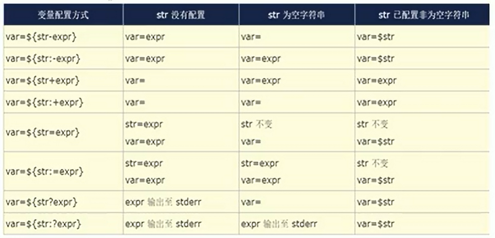

# Bash Shell 脚本编程
## Shell脚本基本结构
- 格式要求: 首行shebang机制
```shell
#!/bin/bash 
#!/usr/bin/python
#!/usr/bin/perl 
#!/usr/bin/ruby
#!/usr/bin/lua
```

- shell脚本创建过程
    - 用编辑器创建新文件，首行必须是 shell 声明（shebang），编辑完成后保存退出
    - 添加可执行权限
    - 运行脚本

- 示例：
```shell
#!/bin/bash
echo hello
```

- 脚本调试
```shell
bash -n script          # 检查shell脚本是否有语法问题
bash -x script          # 逐行执行shell脚本
```

- shell脚本的三种错误
    - 语法错误：出错地方的后续代码不再执行
    - 命令错误：仅错误命令不执行，后续代码继续执行
    - 逻辑错误：结果非预期

## 变量

- 变量类型
    - 内置变量：`$$`, `$?`, `$PS1`, `$PATH`, `$HISTSIZE`, `$SHLVL`(shell的嵌套层数)...
    - tip: `$_`表示上一条命令的最后一个参数
    - 用户自定义变量
</br>
- Shell中变量命名规则
    - 不能使用保留字
    - 变量名大写
    - 局部变量小写
    - 函数名小写
</br>

### 变量分类即环境变量

- 变量的定义和引用
    - 变量的生效范围划分变量类型
        - 普通变量：生效范围仅在当前shell进程
        - 环境变量：生效范围在当前shell进程及子进程
        ```shell
        export name=VALUE
        declare -x name=VALUE

        # 或分两步实现
        name=VALUE
        export name
        ```
        ```shell
        # 列出所有的环境变量
        export
        env
        # 一般只在系统配置文件中使用，脚本中很少使用 
        ```
        - 本地变量：生效范围在当前shell进程中某代码片段，通常指函数

- 变量赋值
```shell
name='value'

# value的多种形式
直接字符串：name='root'
变量引用：name="$USER"
命令引用：name=`hostname` 或者 name=$(COMMAND)
```

- 变量引用
```shell
$name
${name}

# 特殊情况
NAME=`seq 10`
echo $NAME      # 1 2 3 4 5 6 7 8 9 10
eho "$NAME"
# 引号括起来后，正常为回车符分割数字
```

- 显示已定义的所有变量
```shell
set
```

- 删除变量
```shell
unset name 
```

- 注意：变量赋值是临时生效，当退出终端后，变量会自动删除，无法持久保存，脚本的变量会随着脚本的结束，也会自动删除。

### 只读变量
- 作用：只能声明定义，但后续不能修改和删除
```shell
readonly name
declare -r name

# 查看只读变量
readonly [-p]
declare -r
```

### 位置变量
- 在bash shell中的内置变量，在脚本代码中调用命令行传递给脚本的参数
```shell
$1, $2, ... 对应第1个，第2个等参数。
$0          命令本身，包括路径
$*          传递个脚本的所有参数，全部参数合为一个字符串
$@          传递给脚本的所有参数，每个参数为独立的字符串
$#          传递个脚本的参数个数
注意：$*和$@只有被双引号包起来的时候才有差异
```

- 清除所有位置变量
```shell
set --
```

- 远程执行脚本是添加参数
```shell
curl 域名/脚本 |bash -s -- 参数
```

### 退出状态码变量

- 进程执行后，将使用变量 `$?` 保存状态码的相关数字，不同的值反应成功或失败，$?取值范例 0-255
```shell
$?

# 范例
ping -c1 -W1 hostdown &> /dev/null
$?
```

- 用户可以在脚本中使用以下命令自定义退出状态码
```shell
exit [n]

# 注意：
# 脚本中一旦遇到exit命令，脚本会立即终止，终止退出状态取决于exit后面的数字
# 如果脚本内未定义退出状态码，整个脚本的退出状态码取决于最后一条指令的状态码
```

### 展开命令行
- 展开命令执行顺序
```shell
1. 把命令行分成单个单词
2. 展开别名
3. 展开大括号{}的声明
4. 展开~声浪符声明
5. 命令替换$() 和``
6. 再次把命令行分为命令词
7. 展开文件通配符*, ?, [abc]等等
8. 准备I\O重定向
9. 运行命令
```

- 防止扩展
    - 反斜杠`\`会使随后字符按原意解释


### 脚本安全和set
- set命令：可以用来定制shell环境

- $-变量
```shell
h: hashall, 打开选项后，Shell会将命令所在路径hash下来，避免每次都要查询；
   通过set +h 可以将h选项关闭，通过set -h可以将选项开启；

i: interative-comments, 包含这个选项说明当前的shell是一个交互式的shell；
   所谓的交互式的shell，在脚本中，i选项是关闭的

m: 开启监控模式，可以通过job control来控制进程的停止，继续，后台或者前台执行等

B: 是否支持大括号扩展

H: 是否可以用！快速展开history命令
```

- set实现脚本安全
```
u: 开启此项，在使用一个没有声明的变量时，会报错，并且终止程序，同set -o nounset

e: 开启此项，命令返回非0就退出，不在继续执行后面的代码，同set -o errexit

o: 显示选项 set -o
   打开选项 set -o 选项
   关闭选项 set +o 选项

x: 执行命令时，打印命令及其参数，类似bash -x    
```
## 运算
 ### 算数运算
- shell支持算数运算，但是只支持整数运算，不支持小数

- bash中的算数运算
```shell
+
-
*       # 乘号在某些场景中需要转义
/
%       # 取模，即余数
**      # 乘方
```

- 实现算术运算
```shell
let var=算术运算
var=$[算数运算]
var=$((算数运算))
var=$(expr arg1 arg2 arg3)
declare -i var=数值         # -i表示生成后面的值为整数
echo '算术表达式' | bc
# 计算小数：echo "scale=3;3/2"|bc （scale=3，结果保留3位小数）
# 结果：1.500
```

### 逻辑运算
- 与`&`， 或`|`， 非`!`， 异或`^`

### 短路运算
- 短路与`&&`, 短路或`||`


## 条件测试命令
```shell
test EXPRESSION
[EXPRESSION]
[[EXPRESSION]]
```

### 变量测试
```shell
test -v VAR     # 变量是否设置
# 等价于 [ -v VAR ]
test -R VAR     # 变量是否设置并引用
# 等价于 [ -R VAR ]
```

### 数值测试
```shell
-eq          # 等于
-nq          # 不等于
-lt          # 小于
-le          # 小于等于
-gt          # 大于
-ge          # 大于等于

# 示例
[ 10 -le 20 ]
echo $?      # 0
```

### 字符串测试
```shell
-z "STRING"         # 字符串是否为空，空为真，不空为假
# 如果变量中的字符为特殊字符，如空格，在判断非空时建议加双引号
# 示例
# test1=" "
# [ -z "$test1"]
# echo $? 0

-n "STRING"         # 字符串是否非空，非空为真，空位假
                    # 可以简写为 [ STRING ]
=                   # 是否等于, 注意等号两边加空格
!=                  # 是否不等于

[[ STRING == PATTERN]]
# 判断字符串是否匹配通配符
# 示例
[[ "$test1" == *.log ]]

[[ STRING =~ REGEX]] # 正则表达式不用双引号括起来
# 判断字符串是否匹配正则表达式
```

### 文件测试
```shell
-e | -a                     # -e和-a 判断文件是否存在
# 示例
[ -e  /etc/nologin ]
echo $?
# 1

[ -e /etc/passwd ]
echo $?
# 0

-b                          # 判断文件是否为块设备文件
-c                          # 判断文件是否为字符设备文件
-d                          # 判断文件是否为目录
-f                          # 判断是否是常规文件
-L                          # 判断文件是否为链接文件
-p                          # 判断文件是否为命名管道文件
-s                          # 判断文件是否存在且不为空
-S                          # 判断是否为套接字文件
-N                          # 判断文件在上次读取时，是否被修改过
# 本质是判断atime和mtime的关系，只有在atime<mtime的时候，状态为0
-t FS                       # 判断文件描述符是否指向终端
```
- 权限测试
```shell
# 注意：最终结果由用户对文件的实际权限决定，而非文件属性决定
-r                          # 如果当前用户对文件有可读权限，则为真
-w                          # 如果当前用户对文件有可写权限，则为真
-x                          # 如果当前用户对文件有可执行权限，则为真
-u                          # 如果文件设置了SUID特殊权限，则为真
-k                          # 如果文件的sticky位设置，即为真
-O                          # 如果当前用户是文件属主，即为真
-G                          # 如果当前用户是文件属组，即为真

FILE1 -nt FILE2             # 如果 file1 文件新于 file2 文件 则为真(根据修改日期）
FILE1 -ot FILE2             # 如果 file1 文件旧于 file2 文件，则为真
FILE1 -ef FILE2             # 如果file1是file2的硬链接，则为真
```

### （）和 {} 的区别
- （）会开启一个子进程
- 示例
```shell
name=mage;(echo $name; name=wang; echo $name);echo $name
mage
wang
mage
# 小括号中的变量，可以继承父进程的数据
# 子进程的变量的值的修改，不会影响父进程
```

- {}不会开启子进程，在当前shell中运行，会影响当前shell环境
- 示例
```shell
name=mage; { echo $name; name=wang; echo $name; }; echo $name
mage
wang
wang
# 花括号中的指令开头和结尾要有空格
# 花括号中的指令集的最有一个指令必须分号;结尾
```
- {}&
- 示例
```shell
# 多个命令并行执行 
{ sleep 2; echo "Task 1 completed"; } &
{ sleep 5; echo "Task 2 completed"; } &
{ sleep 3; echo "Task 3 completed"; } &
wait
echo "All tasks completed"

# 重点1：结尾必须加分号
# 重点2：括号内首尾加空格
# 重点3：确保使用 wait 命令以避免脚本在后台进程完成前就结束，特别是当后续操作依赖于这些并发任务的结果时。
```

### 组合条件测试
- 第一种方式
```shell
[ EXPRESSION -a EXPRESSION ]        # 并且
[ EXPRESSION -o EXPRESSION ]        # 或者
[ !EXPRESSION ]                     # 取反

# [[]] 不支持 -a，-o
```

- 第二种方式
```shell
短路运算
```

### 使用read命令接受输入
- 示例
```shell
read -p "are you rich?" ANSWER
# -p 是给read添加信息，并且直接在后面不换行接受参数
```

```shell
read x y < file.txt     # file.txt中存放a b
# echo x=a y=b

echo abc bcd | read x y; echo x=$x y=$y
#$x= , $y=, 无法成功赋值，涉及管道核心概念
# 管道两边的指令是在子进程中，而分号后面的指令是父进程中，父进程无法读取子进程的变量，

# 解决办法
echo abc bcd | (read x y; echo x=$x y=$y)

read -s         # 静默模式，看不到输入，一般用于密码
read -n         # 指定字符输入长度
read -d '字符'  # 输入指定结束符结束
-t N            # timeout为N秒
```

## bash的配置文件
### 按生效范围划分
- 全局配置
```shell
/etc/profile
/etc/profile.d/*.sh
/etc/bashrc
```

- 个人配置
```shell
~/.bashrc
~/.bash_profile
```

- 配置文件执行顺序
```shell
/etc/profile --> /etc/profile.d/*.sh--> ~/.bash_profile --> ~/.bashrc --> /etc/bashrc

# 通常意义上讲，后面的优先级高，但是要注意一种情况是，配置文件中存在调用其他配置文件的情况，这个是时候，要看脚本调用和配置文件本身命令之间的先后顺序
```

- source和bash的区别
```shell
source          # 不会开启子进程，程序直接在当前进程运行
                # 由于是在当前进程执行程序，因此，如果出现同名变量会更改当前shell环境的变量值，所以执行脚本建议使用bash，在子进程中运行，不会出现变量污染
                # 由于使用source会更改当前shell环境，因此，一般配置文件的执行都是使用source
                
bash            # 会新开启一个子进程，程序在子进程中进行
                # 给脚本加执行权限后运行，也会增加子进程
```

#### 总结：当前可以开启子进程的操作
```shell
()          # 会开启一个子进程
{}          # 不会开启一个子进程，注意：指令前后加空格，且末尾加；
bash        # 会开启一个子进程, 多用于脚本执行
source      # 不会开启子进程，在当前环境运行，所以多用于配置文件执行
|           # 管道右边会开启一个子进程
```

#### 非交互式登录

- su USERNAME（即不完全切换）
- 图像界面下打开的终端
- 执行脚本
- 任何其他的bash实例
<br>
- 执行顺序
```shell
/etc/profile.d/*.sh --> /etc/bashrc --> ~/.bashrc
# 非交互式登录不会执行profile文件
```


### 按功能划分分类
- profile
    - 功用：
        - 用于定义环境变量
        - 运行命令或脚本

- 定义命令别名和函数
- 定义本地变量


### 退出执行脚本
- .bash_logout
- 功能：
    - 当退出终端后自动执行的脚本


### 流程控制
#### if语句
```shell
if COMMANDS; then COMMANDS; [elif COMMAND; then COMMANDS;]... fi

#-------------------------------------------------------------#
if COMMAND
then COMMAND
elif COMMAND
then COMMAND
elif COMMAND
then COMMAND
else COMMAND
fi
# if后面可以直接接命令，判断命令的结果

# exit 类似于 return
```
- 对比C语言
```C
if command {
    // TODO #then
}elif {
    // TODO #then
} // fi
```

- tip: 别名在脚本中无效

#### case语句
```shell
case WORD in [PATTERN [| PATTERN]...) COMMANDS ;;]... esac
```
```shell
case 变量引用 in
PAT1) # 这里PAT表示通配符，不是正则
    分支1
    ;;
PAT1)
    分支2
    ;;
...
*)
    默认分支
    ;;
esac
```
- case支持glob模式的通配符
```shell
*       # 任意长度任意字符
?       # 任意单个字符
[]      # 指定范围内的任意单个字符
|       # 或
```
- 对比python
```python
match http_response_status:
    case 400|403|404: #可以使用“|”在一个模式中组合多个字面值
      print("4XX error")
    case 500|501|503:
      print("5XX error")
    case _:
      print("strange wrong")
```


### for循环
```shell
# 格式1
for 变量名 in 列表； do
    循环体
done

# 格式2
for 变量名 in 列表; do 循环体; done
```
- 类比python
```python
for i in range(10):
    #TODO
```

- for循环列表生成方式
```shell
{start..end..步长}

$(seq start step_size end)或`seq start step_size end`
```

- for循环格式2
```shell
for (( 控制变量初始化; 条件判断表达式; 控制变量的修正表达 ))
do
    循环体
done
```
- 示例
```shell
for (( i=0; $i<10; $[ i++ ] ))
do
    echo "hello,$i"
done
```

### while循环
- 格式1
```shell
while COMMANDS; do COMMANDS; done

#----------------------------
while COMMANDS # 冒号: 等价于true(永远为真）
do
    COMMANDS
done
```

### until循环
- 格式
```shell
until COMMANDS
do
    COMMANDS
done

# until与while相反，当表达式为假，执行循环，为真停止循环
```

### 循环控制语句
#### continue [n]
#### break [n]

#### shift指令
- 功能：重命名位置参数 
- 格式
```shell
shift [n]
# rename the positional parameters $N+1, $N+2... to $1, $2...
# if N is not given, it is assumed to be 1
```

- 示例
```shell
while [ $1 ]
do
    echo -e "\e[1;$1mhello\e[0m"
    shift
done
```

### while read特殊用法
- 功能：可以逐行处理循环
- 示例
```shell
while read -p "姓名： " name; do echo "$name"; done < name.txt
#name.txt内容如下
wang
li
zhang
#命令执行后输入
wang
li
zhang
```

### select循环与菜单
- 格式
```shell
select variable in list; do
    COMMANDS
done
# PS3变量表示菜单提示
# $REPLY对应表单元素对应的数字
```

- 示例
```shell
PS3="输入你想玩的游戏： "
select MENU in 九宫格 俄罗斯方块 贪吃蛇 五子棋 猜数字 退出;do
case $REPLY in
1)
    echo "加载九宫格"
    ;;
2)
    echo "加载俄罗斯方块"
    ;;
3)
    echo "加载贪吃蛇"
    ;;
4)
    echo "加载五子棋"
    ;;
5)
    echo "加载猜数字"
    ;;
6)
    echo "退出"
    break
    ;;
*)
    echo "输入错误，重新输入"
esac
done
```

## 函数
### 定义函数
- 格式
```shell
# 语法1：
func_name () {
    ...函数体...
} # shell函数中小括号不能带参数

# 语法2：
function func_name {
    ...函数体...
}

# 语法3：
function func_name () {
    ...函数体...
}
```

### 查看函数
```shell
# 查看当前已定义的函数名
declare -F

# 查看当前已定义的函数定义
declare -f
```

### 函数定义和函数调用相分离
```shell
# 调用函数
. fouctions
# fouctions是一个写了函数定义的文件
# . 或者source 可以加载fouctions
函数名 # 用来调用函数
```
- shell函数中变量的作用范围
    - 如果不特殊指代，默认作用于当前进程，会影响当前进程的变量值
    - 如果不想影响当前进程的变量值，变量仅在函数范围内有效，使用<scan style="color:tomato; font-weight:700;">local关键字</scan>
    - 示例
    ```shell
    test () {
        local NAME=mage
        echo NAME=$NAME
    }
    ```

- 系统通用函数文件
```shell
# CentOS
/etc/init.d/functions

# Ubuntu
/lib/lsb/init_functions
```

- 函数返回值
```shell
exit [n] 退出脚本，返回状态码
return [n] 退出函数本身，返回状态码，后续继续执行后续脚本
```

- 函数注意事项
```shell
# 函数中的嵌套的脚本不能调用父进程的函数
# 如果需要调用，将函数声明为环境函数
declare -xf func_name
export -f func_name
```

### 其他脚本相关工具
#### 信号捕捉trap
- trap作用
    - 通常配合kill使用，kill用来发信号，trap用来捕捉信号
    - 信号的作用是通知进程采取某种行为，实现进程间通讯

- 用法
```shell
trap '触发指令' 信号
# 进程收到系统发出的指定信号后，执行自定义指令，而不会执行原操作

trap '' 信号
# 忽略信号

trap '-' 信号
# 恢复原信号操作

trap -p
# 列出自定义信号操作

trap finish EXIT
# 当脚本退出时，执行finish函数
# 这里finish函数名可变，只要函数名与trap后面的匹配即可
```

- 示例
```shell
trap 'echo "Press ctrl+c"' int quit
trap -p
for ((i=1;i<=10;i++))
do
    sleep 1
    echo $i
done

trap '' int
trap -p

for ((i=11;i<=20;i++))
do
    sleep 1
    echo $i
done

trap '-' int
trap -p

for ((i=21;i<=30;i++))
do
    sleep 1
    echo $i
done
```

#### 创建临时文件 mktemp
- mktemp命令用于创建并显示临时文件，可避免冲突
- 格式
```shell
mktemp [option]... [TEMPLATE]
# TEMPLATE:filenameXXX,X至少出现3个

# 常见选项
-d                             # 创建临时目录
-p DIR或--tmpdir=DIR           # 指明临时文件存放的目录位置 
```
- 示例
```shell
mktemp /temp/testXXX
tmpdir=`mktemp -d /tmp/testdirXXX`
mktemp --tmpdir=/testdir testXXXX

# mktemp什么都不加，默认放在/tmp目录下
```

#### 安装复制文件install
- install:功能相当于cp, chmod, chown, chgrp等相关工具的集合
- 格式
```shell
install [option] [-T] source dest 单个文件
install [option]... SOURCE... DIRECTORY
install [option]... -t DIRECTORY SOURCE...
install [option]... -d DIRECTORY ...创建空目录
```

- 选项option
```shell
-m MODE         # 默认755， 因此更适用于可执行文件
-o              # 指定属主
-g              # 指定属组
-d DIR          # 创建空目录
```
- 示例
```shell
# 复制文件，并更改权限
install -m 640 -o wang -g bin anaconda-ks.cfg /data/a.cfg 

# 创建目录
install -m 700 -o mage -g deamon -d /date/testdir
```

#### 交互式转化批处理工具expect
- 功能:
    - 主要应用于自动化交互式操作的应用场景，借助expect处理交互的命令，可以将交互过程如：ssh登录，ftp登录等写在一个脚本上，使之自动化完成。
    - 尤其适用于需要对多台服务器执行相同操作的环境中，可以大大提高系统管理人员的工作效率

- 格式语法：
```shell
expect [选项] [-c cmds] [ [ -[f|b] ] cmdfile ] [ args ]

# 常见选项
-c: 从命令行执行expect脚本，默认expect是交互式执行的
-d：可以输入输出调试信息

# 相关命令
spawn           # 启动新的进程
expect          # 从进程接收字符串
send            # 用于向进程发送字符串
interact        # 允许用户交互
exp_continue    # 匹配多个字符串在执行动作后加此命令
```

- 单一分支模式语法
```shell
# 一次性任务，捕获成功后结束
mystical@ubuntu2204:~/Shell$ expect
expect1.1> expect "hi" {send "hello world"} "bye" {send "get out"} "ok" {send "you are right"}
jkda
sfdok
you are right

# 简化后
expect {
    "hi" { send "hello world\n"}
    "bye" { send "go out\n" }
    "ok" { send "you are right\n" }
}
```
- 范例1
```shell
#!/user/bin/expect
spawn scp /etc/fstab 10.0.0.150:/data
expect {
    "yes/no" { send "yes\n"; expect_continue }
    "password" { send "123456\n" }
}
expect eof
```
- 范例2
```shell
#!/user/bin/expect
spawn ssh 10.0.0.150
expect {
    "yes/no" { send "yes\n"; expect_continue }
    "password" { send "123456\n" }
}
interact
# 使用interact后，在expect结束后，仍然可以实现与用户交互
```
- expect设置变量
```shell
#!/usr/bin/expect
set ip 10.0.0.7     # 相当于shell中的ip=10.0.0.7变量赋值
set user root
set password 123456
set timeout 10  # 当执行时间超过10s超时，强行结束，可以自定义超时时间

spawn ssh $user@$ip
expect {
    "yes/no" { send "yes\n"; expect_continue }
    "password" { send "123456\n" }
}
interact
```
- expect位置参数
```shell
#!/usr/bin/expect
set ip [lindex $argv 0]     # 相当于shell中的ip=$1
set user [lindex $argv 1]
set password [lindex $argv 2]
spawn ssh $user@$ip
expect {
    "yes/no" { send "yes\n"; expect_continue }
    "password" { send "123456\n" }
}
interact
```

- expect执行多个命令
```shell
#!/usr/bin/expect
set ip [lindex $argv 0]
set user [lindex $argv 1]
set password [lindex $argv 2]
spawn ssh $user@$ip
expect {
    "yes/no" { send "yes\n"; expect_continue }
    "password" { send "123456\n" }
}
expect "]#" { send "useradd haha\n" }
expect "]#" { send "echo 123456 | passwd --stdin haha\n" }
send "exit\n"
expect eof
```

- shell脚本调用expect
```shell
#!/bin/bash
ip=$1
user=$2
password=$3
expect <<EOF
set time 20
spawn ssh $user@$ip
expect {
    "yes/no" { send "yes\n"; expect_continue}
    "password" { send "123456\n"}
}
expect "]#" { send "useradd haha\n" }
expect "]#" { send "echo 123456 | passwd --stdin haha\n"}
expect "]#" { send "exit\n" }
expect eof
EOF
```

- 多台机器批量执行命令
```shell
#!/bin/bash
NET=10.0.0
user=$2
password=$3

for ID in 6 7 11; do
IP=$NET.$ID

expect <<EOF
set timeout 20
spawn ssh $user@$IP
expect {
    "yes/no" { send "yes\n"; expect_continue }
    "password" { send "123456\n" }
}
expect "]#" { send "useradd haha\n" }
expect "]#" { send "echo 123456 | passwd --stdin haha\n" }
expect "]#" { send "exit\n" }
expect eof
EOF 
done
```

## 数组
### 声明数组
```shell
# 普通数组可以不事先声明，直接使用
declare -a ARRAY_NAME
# 关联数组必须先声明，再使用
declare -A ARRAY_NAME
```

### 数组赋值
- 一次只赋值一个元素
```shell
# ARRAY_NAME[INDEX]=VALUE
weekdays[0]="Sunday"
weekdays[4]="Thursday"
```

- 一次性赋值全部元素
```shell
#ARRAY_NAME=("VAL1" "VAL2" "VAL3" ...)
title=("ceo" "coo" "cto")
num=({1..10})
alph=({a..z})
file=( *.sh )   # 匹配当前目录下所有.sh结尾的文件
```

- 只赋值特定元素
```shell
ARRAY_NAME=([0]="VAL1" [3]="VAL2" ...)
```

- 交互式数组赋值
```shell
read -a ARRAY
```

### 引用数组
- 引用数组元素
```shell
${ARRAY_NAME[INDEX]}
# 如果忽略[INDEX]，则默认引用下标为0的元素
```

- 引用数组所有元素
```shell
${ARRAY_NAME[@]}
${ARRAY_NAME[*]}
```

- 删除整个数组
```shell
unset ARRAY
```

### 数组数据处理
- 数组切片
```shell
${ARRAY[0]:offset:number}
#offset     # 要跳过的元素个数
#number     # 要取出的元素个数

# 取偏移量之后的所有元素
{ARRAY[0:offset]}
```

- 显示数组长度
```shell
${#ARRAY_NAME[*]}
```

- 数组追加
```shell
num[${#num[*]}]=value
```

### 字符串处理
- 字符串切片
```shell
# 返回字符串长度
${#var}

# 切片和数组相同
${var:offset:number}

# 从后往前切
${var: -number} # 空格必须写

# 从前跳过前offset个，从后跳过number个
${var:offset:-number}

# 从后往前offset到从后往前number之间的字符
${var: -offset:-number}
```

- 基于模式取子串
```shell
# 排除从开始到word（包含word）的所有字符，保留剩下的字符
${var#*word}

# 同上，但是word是贪婪模式
${var##*word}

# 从后往前，到word(包含word)的所有字符，全部删除
${var%word*}

# 同时，贪婪模式
${var%%word*}
```

- 搜索替代
```shell
# 匹配第一个字符串，然后替代
${var/pattern/substr}

# 替代文本中，所有匹配的字符串
${var//pattern/substr}

# 替代文本中，首行匹配的字符串
${var/#pattern/substr}

# 替代文本中，行尾匹配的字符串
${var/%pattern/substr}
```

- 查找并删除
```shell
# 思维同上
${var/pattern}

${var//pattern}

${var/#pattern}

${var/%pattern}
```

- 字符串大小写转换
```shell
#把var中所有小写转换为大写
${var^^}

#把var中所有大写转换为小写
${var,,}
```

## 高级变量
### 高级用法1


### 有类型变量
```shell
declare [选项] 变量名

# 选项
-r      # 声明或显示只读变量
-i      # 将变量定义为整数类型
-a      # 将变量定义为数组
-A      # 将变量定义为关联数组
-f      # 显示已定义的所有函数名及内容
-F      # 仅显示已定义的函数名
-x      # 声明或显示环境变量或函数 ，相当于export
-l      # 声明变量为小写字母 declare -l var=UPPER; echo $var 结果：upper
-u      # 声明变量为大写字母 declare -u var=lower; echo $var 结果：LOWER
-n      # 声明/变量引用
```

### 变量间接引用
#### eval命令
- 作用：eval命令首先扫描命令进行所有的置换，然后执行该命令，该命令使用那些一次扫描无法实现功能的命令，该命令对变量进行两次扫描
```shell
VALUE=hostname
$VALUE # 直接执行hostname

eval $VALUE

# 示例
n=10;for i in `eval echo {1..$n}` ; do echo i=$i;done

# 注意：因为eval的本质是先置换后执行，所以eval的后面必须接o命令
```

- 间接变量引用的两种方式
```shell
# CEO=NAME
# NAME=mage
# 实现通过CEO间接引用mage

# 方式1：
eval echo \$$CEO

# 方式2
echo ${!CEO}
```

- 变量引用reference
```shell
ceo=mage
title=ceo
declare -n ref=$title
[ -R ref ] && echo reference
echo $ref
ceo=wang
echo $ref

# 结果：
reference
mage
wang
```


### 扩展:dd指令
- 指令格式
```shell
dd if=输入文件 of=输出文件 [选项]

# if=文件名：指定输入文件（input file），可以是设备文件（如磁盘分区 /dev/sda）或普通文件。
# of=文件名：指定输出文件（output file），同样可以是设备文件或普通文件。
# [选项]：dd 命令提供了多种选项，用于控制数据的读取、写入和转换过程。
```

- 常用选项
    - bs=大小：设置块大小，例如 bs=512 表示每次读写512字节。bs 对性能有很大影响。
    - count=数量：复制指定的块数量，与 bs 一起使用可以控制复制的总数据量。
    - skip=数量：跳过输入文件开头的指定块数量。
    - seek=数量：跳过输出文件开头的指定块数量，用于在指定位置开始写入。
    - conv=转换选项：指定数据转换选项，如 conv=notrunc 避免截断输出文件，conv=noerror 在读取错误时继续处理。
    - status=进度选项：控制进度报告的输出，status=progress 显示处理过程中的进度信息。

- 示例
```shell
# 创建一个固定大小的文件
dd if=/dev/zero of=文件名 bs=1G count=1

# 备份和恢复硬盘分区
dd if=/dev/sda1 of=/path/to/backup.img

# 将备份文件恢复到分区
dd if=/path/to/backup.img of=/dev/sda1

# 复制光盘到ISO文件
dd if=/dev/cdrom of=/path/to/cdimage.iso
```


## 日常案例收集
- 关于${1:-}的使用
```shell
# 源自/lib/lsb/init-functions

log_daemon_msg () {
    if [ -z "${1:-}" ]; then
        return 1
    fi
    log_daemon_msg_pre "$@"

    if [ -z "${2:-}" ]; then
        echo -n "$1:" || true
        return
    fi

    echo -n "$1: $2" || true
    log_daemon_msg_post "$@"
}

# ${1:-}的含义：
# 用于提供位置参数的默认值或替代值
test () {
    echo ${1:-"hello"}
}
test "world"

# 如果$1有值，则$1为原本的值
# 如果$1为空，则$1为后面的默认值"hello"
```


- 关于{ :; }的使用
```shell
# 源自/lib/lsb/init-functions
log_daemon_msg_pre () { :; }
```

- `:` 是一个内置命令，通常被称为空命令或no-op（无操作）。其功能类似于 Shell 的内置命令 true，因为它不执行任何操作，但总是返回退出状态 0，表示成功。这个命令经常在脚本中被用来作为占位符或者确保命令序列不为空。


- 应用场景
  - <span style="color:green;font-weight:700">占位符：</span>在某些情况下，如果语法要求必须有一个命令，但实际上又不需要执行任何操作时，可以使用 : 作为占位符。例如，在if语句中可能只需要在条件成立时不执行任何操作，但又需要语法上的完整。
  - <span style="color:green;font-weight:700">函数桩：</span>在开发中，: 可用作函数体的临时占位符，这样的函数也被称为“桩”。这允许开发者在整体应用架构搭建期间先行定义函数接口，具体实现可以随后添加。
  - <span style="color:green;font-weight:700">保持接口一致性：</span>在脚本或程序中，如果某些情况下不需要执行任何操作，但为了保持接口的一致性或代码的可读性，可能会使用 :。


