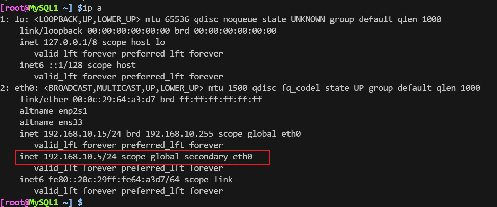
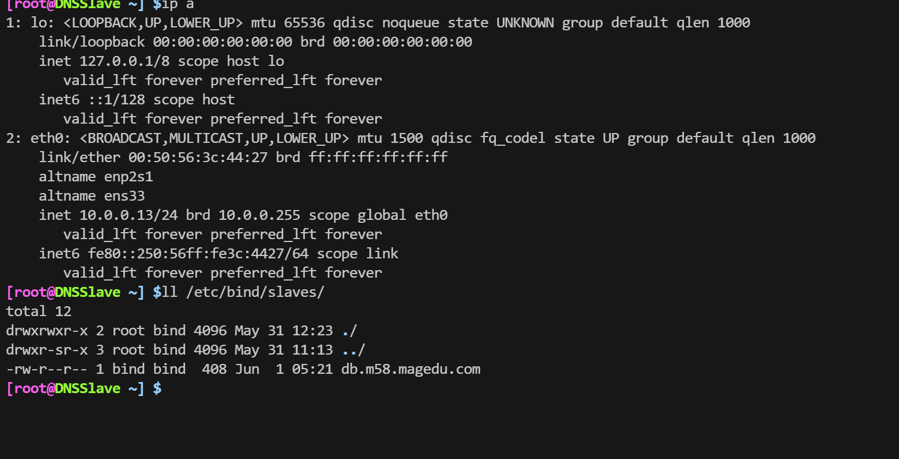

# DevOps主机
- NAT网卡: 10.0.0.4
- 仅主机网卡：192.168.10.14

安装ansible
```shell
apt update; apt install ansible-core

# 创建目录
mkdir -pv /etc/ansible/roles

# 创建主机清单配置文件
touch /etc/ansible/hosts

# 生成配置文件
ansible-config init -t all -disabled > /etc/ansible/ansible.cfg

# 下载sshpass
apt install -y sshpass

# 更改ansible.cfg，添加2行
[ssh_connection]
host_key_checking=False
host_ssh_checking=False

# 删除rm -rf ~/.ansible
```

- 整体roles和hosts脚本文件如下
```shell
.
├── ansible.cfg
├── hosts
├── jpress.yaml
├── mysql.yaml
├── roles
│   ├── discuz
│   │   ├── tasks
│   │   │   ├── discuz_get_code.yaml
│   │   │   ├── discuz_set_domain.yaml
│   │   │   ├── discuz_unarchive.yaml
│   │   │   ├── get_unzip.yaml
│   │   │   └── main.yaml
│   │   └── templates
│   │       └── domain.conf.j2
│   ├── dnsmaster
│   │   ├── tasks
│   │   │   ├── configfile.yaml
│   │   │   ├── createdb.yaml
│   │   │   ├── install.yaml
│   │   │   ├── main.yaml
│   │   │   └── reload_named.yaml
│   │   └── templates
│   │       └── db.dns.conf.j2
│   ├── dnsslave
│   │   └── tasks
│   │       ├── Authorization.yaml
│   │       ├── configfile.yaml
│   │       ├── install.yaml
│   │       ├── main.yaml
│   │       ├── mkdir.yaml
│   │       ├── reload_apparomor.yaml
│   │       └── reload_named.yaml
│   ├── jpress
│   │   └── tasks
│   │       ├── createdir.yaml
│   │       ├── get_jpress.yaml
│   │       ├── main.yaml
│   │       ├── reload_tomcat.yaml
│   │       └── set_domain.yaml
│   ├── mysql
│   │   ├── files
│   │   │   └── grant.sql
│   │   └── tasks
│   │       ├── copy_file.yaml
│   │       ├── fix_config.yaml
│   │       ├── grant.yaml
│   │       ├── group.yaml
│   │       ├── install.yaml
│   │       ├── main.yaml
│   │       ├── restart.yaml
│   │       └── user.yaml
│   ├── nginx
│   │   ├── tasks
│   │   │   ├── group.yaml
│   │   │   ├── install.yaml
│   │   │   ├── main.yaml
│   │   │   └── user.yaml
│   │   └── templates
│   ├── php
│   │   └── tasks
│   │       ├── group.yaml
│   │       ├── install.yaml
│   │       ├── main.yaml
│   │       └── user.yaml
│   ├── service
│   │   └── tasks
│   │       ├── main.yaml
│   │       └── service.yaml
│   └── tomcat
│       ├── files
│       │   └── tomcat.service
│       └── tasks
│           ├── adduser.yaml
│           ├── copy_file.yaml
│           ├── envconfig.yaml
│           ├── install_java.yaml
│           ├── install_tomcat.yaml
│           ├── load_start.yaml
│           ├── main.yaml
│           └── unarchive_tomcat.yaml
├── DNS.yaml
├── tomcat.yaml
└── web.yaml

24 directories, 59 files
```

- hosts
```shell
[DnsMaster]
10.0.0.3

[DnsSlave]
10.0.0.13

[Web]
10.0.0.21
10.0.0.22

[MySQL]
10.0.0.31
10.0.0.32

[group1:children]
DnsMaster
DnsSlave
Web
MySQL

[group1:vars]
ansible_ssh_password=646130
```

## /roles/dnsmaster/tasks

### configfile.yaml
```yaml
- name: fix config file
  blockinfile:
    path: /etc/bind/named.conf.default-zones
    block: |
      zone "{{ DB_NAME }}" IN {
              type master;
              file "/etc/bind/db.{{ DB_NAME }}";
      };
    marker: ""
```

### createdb.yanml
```yaml
- name: set-dns-db
  template: src=db.dns.conf.j2 dest=/etc/bind/db.{{ DB_NAME }}
```

### install.yaml
```yaml
- name: install bind9-Ubuntu
  apt: update_cache=yes name=bind9 state=present
```

### reload_named.yaml
```yaml
- name: reload named
  shell: systemctl restart named
```

### main.yaml
```shell
- include_tasks: install.yaml
- include_tasks: configfile.yaml
- include_tasks: createdb.yaml
- include_tasks: reload_named.yaml
```

## /roles/dnsmaster/templates
### db.dns.conf.j2
```jinja
$TTL {{ TTL_TIME }}

@  IN  SOA  ns1 admin.m58-magedu.com ( {{ DNS_VERSION }} 1h 10m 1D 12h)

   NS dns1
   NS dns2

dns1 A {{ DNS_MASTER_IP }}
dns2 A {{ DNS_SLAVE_IP }} 
java A {{ WEB1_IP }} 
php A {{ WEB2_IP }} 
```

## /roles/dnsslave/tasks
### Authorization.yaml
```yaml
- name: Insert  apparmor
  shell: |
    sed -i.bak '19a\
      /etc/bind/slaves/** rw,\
      /etc/bind/slaves/ rw,' /etc/apparmor.d/usr.sbin.named
```

### configfile.yaml
```yaml
- name: fix config file
  ansible.builtin.blockinfile:
    path: /etc/bind/named.conf.default-zones
    block: |
      zone "{{ DB_NAME }}" IN {
              type slave;
              masters { {{ DNS_MASTER_IP }}; };
              file "/etc/bind/slaves/db.{{ DB_NAME }}";
      };
    marker: ""
```

### install.yaml
```yaml
- name: install bind9-Ubuntu
  apt: update_cache=yes name=bind9 state=present
```

### mkdir.yaml
```yaml
- name: mkdir a slaves
  file:
    path: /etc/bind/slaves
    state: directory
    mode: '0775'
```

### reload_apparomor.yaml
```yaml
- name: reload apparamor
  shell: apparmor_parser -r /etc/apparmor.d/usr.sbin.named
```

### reload_named.yaml
```yaml
- name: reload named
  shell: systemctl restart named
```

### main.yaml
```yaml
- include_tasks: install.yaml
- include_tasks: configfile.yaml
- include_tasks: mkdir.yaml
- include_tasks: Authorization.yaml
- include_tasks: reload_apparomor.yaml
- include_tasks: reload_named.yaml
```

## /roles/nginx/tasks
### group.yaml
```yaml
- name: add-nginx-group
  group: name=nginx gid=800 system=yes
```

### install.yaml
```yaml
- name: install-nginx
  apt: name=nginx state=present
```

### user.yaml
```yaml
- name: add-nginx-userd
  user: name=nginx group=800 system=yes uid=800 create_home=no
```

### main.yaml
```yaml
- include_tasks: group.yaml
- include_tasks: user.yaml
- include_tasks: install.yaml
```

## /roles/php/tasks
### group.yaml
```yaml
- name: add-php-group
  group: name=www-data gid=33 system=yes
```

### install.yaml
```yaml
- name: install-php
  apt: name=php-fpm,php-mysqlnd,php-json,php-gd,php-xml,php-mbstring,php-zip state=present
```

### user.yaml
```yaml
- name: add-php-user
  user: name=www-data group=33 system=yes uid=33 create_home=yes home=/var/www shell=/usr/sbin/nologin
```

### main.yaml
```shell
- include_tasks: group.yaml
- include_tasks: user.yaml
- include_tasks: install.yaml
```

## /roles/discuz/tasks
### discuz_get_code.yaml
```yaml
- name: wget-discuz
  get_url: url=https://gitee.com/Discuz/DiscuzX/attach_files/1773967/download dest=/var/www/html/discuz.zip
```

### discuz_set_domain.yaml
```yaml
- name: set-discuz-domain
  template: src=domain.conf.j2 dest=/etc/nginx/sites-enabled/{{ DIS_DOMAIN }}.conf
```

### discuz_unarchive.yaml
```yaml
- name: discuz-unarchive
  unarchive: src=/var/www/html/discuz.zip dest=/var/www/html/ owner=www-data group=www-data remote_src=yes
```

### get_unzip.yaml
```yaml
- name: download-unzip
  apt: name=unzip state=present
```
### main.yaml

```yaml
- include_tasks: get_unzip.yaml
- include_tasks: discuz_get_code.yaml
- include_tasks: discuz_unarchive.yaml
- include_tasks: discuz_set_domain.yaml
```


## /roles/discuz/templates

### domain.conf.j2
```jinja
server {
        listen {{ DIS_PORT }};
        server_name {{ DIS_DOMAIN }};
        include /etc/nginx/default.d/*.conf;
        root {{ DIS_PATH }};
        index index.php index.html;
        location / {

        }
        location ~ \.php$ {
                include snippets/fastcgi-php.conf;
                fastcgi_pass unix:/run/php/php8.1-fpm.sock;
        }
}
```

## /roles/service/tasks
### service.yaml
```yaml
- name: service
  service: name={{ item.name }} state={{ item.state }} enabled={{ item.enabled }}
  loop: "{{ SERVICE_LIST }}"
```

### main.yaml
```yaml
- include_tasks: service.yaml
```

## /roles/tomcat/tasks
### adduser.yaml
```yaml
- name: add-tomcat-user
  user: name=tomcat system=yes shell=/sbin/nologin

- name: changing group permissions
  shell: chown -R tomcat.tomcat /usr/local/tomcat/
```
### envconfig.yaml
```yaml
- name: create softlink
  shell: ln -sv /usr/local/apache-tomcat-9.0.89/ /usr/local/tomcat

- name: add env var
  shell: ln -sv /usr/local/tomcat/bin/* /usr/local/bin/
```
### install_tomcat.yaml
```yaml
- name: wget-tomcat
  get_url: url=https://www.mysticalrecluse.com/script/tools/apache-tomcat-9.0.89.tar.gz dest=/root/tomcat.tar.gz
```

### copy_file.yaml
```yaml
- name: copy-tomcat.service
  copy: src=files/tomcat.service dest=/lib/systemd/system/tomcat.service
```

### install_java.yaml
```yaml
- name: install java
  apt: name=openjdk-11-jdk state=present
```
### load_start.yaml
```yaml
- name: load daemon
  shell: systemctl daemon-reload

- name: start tomcat
  shell: systemctl start tomcat
```

### unarchive_tomcat.yaml
```yaml
- name: unarchive tomcat.tar.gz
  shell: tar xf tomcat.tar.gz -C /usr/local/
```
### main.yaml
```yaml
- include_tasks: install_java.yaml
- include_tasks: install_tomcat.yaml
- include_tasks: unarchive_tomcat.yaml
- include_tasks: envconfig.yaml
- include_tasks: adduser.yaml
- include_tasks: copy_file.yaml
- include_tasks: load_start.yaml
```

## /roles/tomcat/files
```shell
[Unit]
Description=Tomcat
After=syslog.target.network.target

[Service]
Type=forking
Environment=Java_HOME=/usr/lib/jvm/java-11-openjdk-amd64/
ExecStart=/usr/local/tomcat/bin/startup.sh
ExecStop=/usr/local/tomcat/bin/shutdown.sh
PrivateTmp=true
User=tomcat
Group=tomcat

[Install]
WantedBy=multi-user.target
```

## /roles/jpress/tasks
### createdir.yaml
```yaml
- name: create-jpress-dir
  shell: mkdir -p /var/www/jpress

- name: authorization directory
  shell: chown -R tomcat.tomcat /var/www/jpress
```

### get_jpress.yaml
```yaml
- name: wget-jpress
  get_url: 
    url: https://www.mysticalrecluse.com/script/tools/jpress-v5.1.0.war
    dest: /var/www/jpress/ROOT.war 
```

### reload_tomcat.yaml
```yaml
- name: reload-tomcat-server
  shell: systemctl restart tomcat
```

### set_domain.yaml
```yaml
- name: set-java.m58-magedu.com-domain
  lineinfile: 
    path: /usr/local/tomcat/conf/server.xml
    insertafter: '</Host>'
    line: '<Host name="java.m58-magedu.com"  appBase="/var/www/jpress" unpackWARs="true" autoDeploy="true"></Host>'
```

### main.yaml
```yaml
- include_tasks: createdir.yaml 
- include_tasks: set_domain.yaml 
- include_tasks: get_jpress.yaml 
- include_tasks: reload_tomcat.yaml 
```

## /roles/mysql/tasks

### copy_file.yaml
```yaml
- name: copy_mysql_file
  copy: src=files/grant.sql dest=/tmp/grant.sql
```

### fix_config.yaml
```yaml
- name: Fix configfile
  lineinfile:
    path: /etc/mysql/mysql.conf.d/mysqld.cnf
    regexp: '^bind-address\s*=\s*127.0.0.1'
    line: '#bind-address = 127.0.0.1'

- name: Fix configfile second line
  lineinfile:
    path: /etc/mysql/mysql.conf.d/mysqld.cnf
    regexp: '^mysqlx-bind-address\s*=\s*127.0.0.1'
    line: '#mysqlx-bind-address = 127.0.0.1'
```

### grant.yaml
```yaml
- name: mysql-client-init
  shell: mysql < /tmp/grant.sql
```

### group.yaml
```yaml
- name: add-mysql-group
  group: name=mysql gid=306 system=yes
```

### install.yaml
```yaml
- name: apt-install-mysql-server
  apt: name=mysql-server state=present 
```

### restart.yaml
```yaml
- name: restart-mysql-service
  service: name=mysql enabled=yes state=restarted
```

### user.yaml
```yaml
- name: add-mysql-user
  user: name=mysql group=306 system=yes uid=306 create_home=no
```

### main.yaml
```yaml
- include_tasks: group.yaml
- include_tasks: user.yaml
- include_tasks: install.yaml
- include_tasks: fix_config.yaml
- include_tasks: restart.yaml
- include_tasks: copy_file.yaml
- include_tasks: grant.yaml
```

## /roles/mysql/files
### grant.sql
```sql
create database if not exists discuz;
create user 'discuzer'@'192.168.10.%' identified by '123456';
grant all on discuz.* to 'discuzer'@'192.168.10.%';

flush privileges;

create database if not exists jpress;
create user 'jpresser'@'192.168.10.%' identified by '123456';
grant all on jpress.* to 'jpresser'@'192.168.10.%';

flush privileges;
```

## DNS.yaml
```yaml
- hosts: DnsMaster
  gather_facts: no
  remote_user: root
  vars: 
    TTL_TIME: 86400
    DNS_VERSION: 18
    DNS_MASTER_IP: 10.0.0.3
    DNS_SLAVE_IP: 10.0.0.13
    WEB1_IP: 10.0.0.6
    WEB2_IP: 10.0.0.16
    DB_NAME: m58-magedu.com 
  roles: 
    - dnsmaster 

- hosts: DnsSlave
  gather_facts: no
  remote_user: root
  vars:
    DNS_MASTER_IP: 10.0.0.3
    DB_NAME: m58-magedu.com 
  roles:
    - dnsslave
```

## web.yaml
```yaml
- hosts: Web
  gather_facts: no
  remote_user: root
  vars: 
    DIS_PORT: 80
    DIS_DOMAIN: php.m58-magedu.com
    DIS_PATH: /var/www/html/upload
    SERVICE_LIST: [ {name: nginx, state: restarted, enabled: yes}, {name: php8.1-fpm, state: started, enabled: yes} ]
  roles:
    - nginx
    - php
    - discuz
    - service
```

## tomcat.yaml
```yaml
- hosts: Web
  gather_facts: no
  remote_user: root
  roles:
    - tomcat
```

## jpress.yaml
```yaml
- hosts: Web
  gather_facts: no
  remote_user: root
  roles:
    - jpress
```

## mysql.yaml
```yaml
- hosts: MySQL
  gather_facts: no
  remote_user: root
  roles:
    - mysql
```

## 执行ansible-playbook
```shell
ansible-playbook DNS.yaml
ansible-playbook web.yaml
ansible-playbook tomcat.yaml
ansible-playbook jpress.yaml
ansible-playbook mysql.yaml
```

- 所有脚本执行完后
  - DNS主从自动配好
  - 两台web服务自动配好
  - 两台mysql自动配好


# LVS负载均衡配置

- lvs的网卡配置
```shell
[root@LVS /proc/sys/net/ipv4] $ip a
1: lo: <LOOPBACK,UP,LOWER_UP> mtu 65536 qdisc noqueue state UNKNOWN group default qlen 1000
    link/loopback 00:00:00:00:00:00 brd 00:00:00:00:00:00
    inet 127.0.0.1/8 scope host lo
       valid_lft forever preferred_lft forever
    inet6 ::1/128 scope host 
       valid_lft forever preferred_lft forever
2: eth0: <BROADCAST,MULTICAST,UP,LOWER_UP> mtu 1500 qdisc fq_codel state UP group default qlen 1000
    link/ether 00:0c:29:5c:04:27 brd ff:ff:ff:ff:ff:ff
    altname enp2s1
    altname ens33
    inet 10.0.0.6/24 brd 10.0.0.255 scope global eth0
       valid_lft forever preferred_lft forever
    inet 10.0.0.16/24 brd 10.0.0.255 scope global secondary eth0
       valid_lft forever preferred_lft forever
    inet6 fe80::20c:29ff:fe5c:427/64 scope link 
       valid_lft forever preferred_lft forever
3: eth1: <BROADCAST,MULTICAST,UP,LOWER_UP> mtu 1500 qdisc fq_codel state UP group default qlen 1000
    link/ether 00:0c:29:5c:04:31 brd ff:ff:ff:ff:ff:ff
    altname enp2s5
    altname ens37
    inet 192.168.10.66/24 brd 192.168.10.255 scope global eth1
       valid_lft forever preferred_lft forever
    inet6 fe80::20c:29ff:fe5c:431/64 scope link 
       valid_lft forever preferred_lft forever
```

```shell
# 下载ipvsadm
apt install ipvsadm

# 配置
[root@LVS ~] $ipvsadm -A -t 10.0.0.6:80 -s rr
[root@LVS ~] $ipvsadm -a -t 10.0.0.6:80 -r 192.168.10.8:8080 -m
[root@LVS ~] $ipvsadm -a -t 10.0.0.6:80 -r 192.168.10.18:8080 -m
[root@LVS ~] $ipvsadm -A -t 10.0.0.16:80 -s rr
[root@LVS ~] $ipvsadm -a -t 10.0.0.16:80 -r 192.168.10.8:80 -m
[root@LVS ~] $ipvsadm -a -t 10.0.0.16:80 -r 192.168.10.18:80 -m
[root@LVS ~] $ipvsadm -Ln
IP Virtual Server version 1.2.1 (size=4096)
Prot LocalAddress:Port Scheduler Flags
  -> RemoteAddress:Port           Forward Weight ActiveConn InActConn
TCP  10.0.0.6:80 rr
  -> 192.168.10.8:8080            Masq    1      0          0         
  -> 192.168.10.18:8080           Masq    1      0          0         
TCP  10.0.0.16:80 rr
  -> 192.168.10.8:80              Masq    1      0          0         
  -> 192.168.10.18:80             Masq    1      0          0         
[root@LVS ~] $systemctl stop ufw

# 开启ip_forward
[root@LVS /proc/sys/net/ipv4] $echo 1 > ip_forward
```

# 两台Web服务器将网关指向lvs


```shell
[root@WEB1 ~] $route -n
Kernel IP routing table
Destination     Gateway         Genmask         Flags Metric Ref    Use Iface
0.0.0.0         192.168.10.66   0.0.0.0         UG    0      0        0 eth0
192.168.10.0    0.0.0.0         255.255.255.0   U     0      0        0 eth0

[root@WEB2 ~] $route -n
Kernel IP routing table
Destination     Gateway         Genmask         Flags Metric Ref    Use Iface
0.0.0.0         192.168.10.66   0.0.0.0         UG    0      0        0 eth0
192.168.10.0    0.0.0.0         255.255.255.0   U     0      0        0 eth0
```

# Mysql
## 主机网卡配置
### MySQL1
```shell
[root@MySQL1 ~] $ip a
1: lo: <LOOPBACK,UP,LOWER_UP> mtu 65536 qdisc noqueue state UNKNOWN group default qlen 1000
    link/loopback 00:00:00:00:00:00 brd 00:00:00:00:00:00
    inet 127.0.0.1/8 scope host lo
       valid_lft forever preferred_lft forever
    inet6 ::1/128 scope host 
       valid_lft forever preferred_lft forever
2: eth0: <BROADCAST,MULTICAST,UP,LOWER_UP> mtu 1500 qdisc fq_codel state UP group default qlen 1000
    link/ether 00:0c:29:64:a3:d7 brd ff:ff:ff:ff:ff:ff
    altname enp2s1
    altname ens33
    inet 192.168.10.15/24 brd 192.168.10.255 scope global eth0
       valid_lft forever preferred_lft forever
       # 192.168.10.5是VIP，keepalived生成
    inet 192.168.10.5/24 scope global secondary eth0
       valid_lft forever preferred_lft forever
    inet6 fe80::20c:29ff:fe64:a3d7/64 scope link 
       valid_lft forever preferred_lft forever
```
### MySQL2
```shell
1: lo: <LOOPBACK,UP,LOWER_UP> mtu 65536 qdisc noqueue state UNKNOWN group default qlen 1000
    link/loopback 00:00:00:00:00:00 brd 00:00:00:00:00:00
    inet 127.0.0.1/8 scope host lo
       valid_lft forever preferred_lft forever
    inet6 ::1/128 scope host 
       valid_lft forever preferred_lft forever
2: eth0: <BROADCAST,MULTICAST,UP,LOWER_UP> mtu 1500 qdisc fq_codel state UP group default qlen 1000
    link/ether 00:0c:29:e3:b5:0c brd ff:ff:ff:ff:ff:ff
    altname enp2s1
    altname ens33
    inet 192.168.10.25/24 brd 192.168.10.255 scope global eth0
       valid_lft forever preferred_lft forever
    inet 192.168.200.16/32 scope global eth0
       valid_lft forever preferred_lft forever
    inet 192.168.200.17/32 scope global eth0
       valid_lft forever preferred_lft forever
    inet 192.168.200.18/32 scope global eth0
       valid_lft forever preferred_lft forever
    inet6 fe80::20c:29ff:fee3:b50c/64 scope link 
       valid_lft forever preferred_lft forever
```
## 两台Mysql初始配置
```shell
# 更改配置文件
vim /etc/mysql/mysql.conf.d/mysqld.conf

# 添加
log_bin=/mysql/log/ubuntu

# 新建目录
mkdir -pv /mysql/log

# 加权限
chown mysql.mysql /mysql/log

# 更改apparmor使其mysql能够有读取指定路径的权限
vim /etc/apparmor.d/usr.bin.mysqld

# 在里面插入需要权限的目录
/mysql/log/** rw
/mysql/log/ rw

# 重新加载apparmor
apparmor_parser -r /etc/apparmor.d/usr.sbin.mysqld

# 重启mysql服务
systemctl restart mysql
```

## 主从配置
```shell
# MySQL1
# /etc/mysql/mysql.conf.d/mysqld.conf添加如下配置
log_bin=/mysql/log/ubuntu
server-id=31
skip-name-resolve
default_authentication_plugin=mysql_native_password

# MySQL2
# /etc/mysql/mysql.conf.d/mysqld.conf添加如下配置
log_bin=/mysql/log/ubuntu
server-id=32
skip-name-resolve
default_authentication_plugin=mysql_native_password

# 重启下mysql
systemctl restart mysql
systemctl restart mysql

# 进入MySQL1中如下操作
mysql> create user 'repluser'@'192.168.10.%' identified by '123456';
 mysql> grant replication slave on *.* to 'repluser'@'192.168.10.%';

# 配置主从同步
# MySQL1 
mysql> CHANGE MASTER TO MASTER_HOST='192.168.10.25', MASTER_USER='repluser', 
MASTER_PASSWORD='123456', MASTER_PORT=3306,MASTER_LOG_FILE='ubuntu.000001', 
MASTER_LOG_POS=157;

# MySQL2
mysql> CHANGE MASTER TO MASTER_HOST='192.168.10.15', MASTER_USER='repluser', 
MASTER_PASSWORD='123456', MASTER_PORT=3306,MASTER_LOG_FILE='ubuntu.000001', 
MASTER_LOG_POS=157;

# MySQL1和MySQL2
start slave

# MySQL1
mysql> show slave status\G
*************************** 1. row ***************************
               Slave_IO_State: Waiting for source to send event
                  Master_Host: 192.168.10.25
                  Master_User: repluser
                  Master_Port: 3306
                Connect_Retry: 60
              Master_Log_File: ubuntu.000004
          Read_Master_Log_Pos: 2613120
               Relay_Log_File: MySQL1-relay-bin.000029
                Relay_Log_Pos: 323
        Relay_Master_Log_File: ubuntu.000004
             Slave_IO_Running: Yes
            Slave_SQL_Running: Yes
              Replicate_Do_DB: 
          Replicate_Ignore_DB: 
           Replicate_Do_Table: 
       Replicate_Ignore_Table: 
      Replicate_Wild_Do_Table: 
  Replicate_Wild_Ignore_Table: 
                   Last_Errno: 0
                   Last_Error: 
                 Skip_Counter: 0
          Exec_Master_Log_Pos: 2613120
              Relay_Log_Space: 880
              Until_Condition: None
               Until_Log_File: 
                Until_Log_Pos: 0
           Master_SSL_Allowed: No
           Master_SSL_CA_File: 
           Master_SSL_CA_Path: 
              Master_SSL_Cert: 
            Master_SSL_Cipher: 
               Master_SSL_Key: 
        Seconds_Behind_Master: 0
Master_SSL_Verify_Server_Cert: No
                Last_IO_Errno: 0
                Last_IO_Error: 
               Last_SQL_Errno: 0
               Last_SQL_Error: 
  Replicate_Ignore_Server_Ids: 
             Master_Server_Id: 32
                  Master_UUID: 6d0633e4-1f37-11ef-951e-000c29e3b50c
             Master_Info_File: mysql.slave_master_info
                    SQL_Delay: 0
          SQL_Remaining_Delay: NULL
      Slave_SQL_Running_State: Replica has read all relay log; waiting for more updates
           Master_Retry_Count: 86400
                  Master_Bind: 
      Last_IO_Error_Timestamp: 
     Last_SQL_Error_Timestamp: 
               Master_SSL_Crl: 
           Master_SSL_Crlpath: 
           Retrieved_Gtid_Set: 
            Executed_Gtid_Set: 
                Auto_Position: 0
         Replicate_Rewrite_DB: 
                 Channel_Name: 
           Master_TLS_Version: 
       Master_public_key_path: 
        Get_master_public_key: 0
            Network_Namespace: 
1 row in set, 1 warning (0.00 sec)

# MySQL2
mysql> show slave status\G
*************************** 1. row ***************************
               Slave_IO_State: Waiting for source to send event
                  Master_Host: 192.168.10.15
                  Master_User: repluser
                  Master_Port: 3306
                Connect_Retry: 60
              Master_Log_File: ubuntu.000011
          Read_Master_Log_Pos: 2604723
               Relay_Log_File: MySQL2-relay-bin.000026
                Relay_Log_Pos: 2604933
        Relay_Master_Log_File: ubuntu.000011
             Slave_IO_Running: Yes
            Slave_SQL_Running: Yes
              Replicate_Do_DB: 
          Replicate_Ignore_DB: 
           Replicate_Do_Table: 
       Replicate_Ignore_Table: 
      Replicate_Wild_Do_Table: 
  Replicate_Wild_Ignore_Table: 
                   Last_Errno: 0
                   Last_Error: 
                 Skip_Counter: 0
          Exec_Master_Log_Pos: 2604723
              Relay_Log_Space: 2605310
              Until_Condition: None
               Until_Log_File: 
                Until_Log_Pos: 0
           Master_SSL_Allowed: No
           Master_SSL_CA_File: 
           Master_SSL_CA_Path: 
              Master_SSL_Cert: 
            Master_SSL_Cipher: 
               Master_SSL_Key: 
        Seconds_Behind_Master: 0
Master_SSL_Verify_Server_Cert: No
                Last_IO_Errno: 0
                Last_IO_Error: 
               Last_SQL_Errno: 0
               Last_SQL_Error: 
  Replicate_Ignore_Server_Ids: 
             Master_Server_Id: 31
                  Master_UUID: 702d0842-1f37-11ef-b8f8-00505633dac3
             Master_Info_File: mysql.slave_master_info
                    SQL_Delay: 0
          SQL_Remaining_Delay: NULL
      Slave_SQL_Running_State: Replica has read all relay log; waiting for more updates
           Master_Retry_Count: 86400
                  Master_Bind: 
      Last_IO_Error_Timestamp: 
     Last_SQL_Error_Timestamp: 
               Master_SSL_Crl: 
           Master_SSL_Crlpath: 
           Retrieved_Gtid_Set: 
            Executed_Gtid_Set: 
                Auto_Position: 0
         Replicate_Rewrite_DB: 
                 Channel_Name: 
           Master_TLS_Version: 
       Master_public_key_path: 
        Get_master_public_key: 0
            Network_Namespace: 
1 row in set, 1 warning (0.00 sec)
```

- 主从同步成功

## 使用Keepalived实现高可用
### 安装keeplived
```shell
#更新仓库索引，安装编译工具，依赖库等
apt update && apt -y install make gcc ipvsadm build-essential pkg-config automake autoconf libipset-dev libnl-3-dev libnl-genl-3-dev libssl-dev libxtables-dev libip4tc-dev libip6tc-dev bmagic-dev libsnmp-dev libglib2.0-dev ibpcre2-dev libnftnl-dev libmnl-dev libsystemd-dev

# 下载源码，并编译安装
wget https://keepalived.org/software/keepalived-2.2.8.tar.gz

tar xf keepalived-2.2.8.tar.gz -C /usr/local/src/

cd /usr/local/src/keepalived-2.2.8

./configure --prefix=/usr/local/keepalived

make && make install

cp keepalived/keepalived.service /lib/systemd/system

#导入配置文件
mkdir /etc/keepalived
cp /usr/local/keepalived/etc/keepalived/keepalived.conf.sample /etc/keepalived/keepalived.conf

# 重启keepalived
systemctl start keepalived.service

# 修改/etc/keepalived/keepalived.conf
将vrrp_stric6注释掉
添加include /etc/keepalived/conf.d/*.conf

mkdir /etc/keepalived/conf.d

# 在/root下创建心跳检测脚本 chk_mysql.sh
#!/bin/bash
mysqladmin ping &>/dev/null

# 加执行权限
chmod +x chk_mysql.sh 

# MySQL1中创建配置文件
vim /etc/keepalived/conf.d/mysql.conf
vrrp_script chk_mysql{
    script "/root/chk_mysql.sh"
    interval 2
    weight -30
    fall 2
    rise 2
}
vrrp_instance mysql {
    state MASTER
    interface eth0
    virtual_router_id 66
    priority 100
    advert_int 1
    garp_master_delay 10
    unicast_src_ip 192.168.10.15
    unicast_peer {
     192.168.10.25
    }
    authentication {
        auth_type PASS
        auth_pass 123456
    }
    virtual_ipaddress {
        192.168.10.5/24 dev eth0
    }
    track_script {
        chk_mysql
    }
}

# MySQL2中创建配置文件
vim /etc/keepalived/conf.d/mysql.conf
vrrp_instance mysql {
    state BACKUP
    interface eth0
    virtual_router_id 66
    priority 80
    advert_int 1
    garp_master_delay 10
    unicast_src_ip 192.168.10.25
    unicast_peer {
        192.168.10.15
    }
    authentication {
        auth_type PASS
        auth_pass 123456
    }
    virtual_ipaddress {
        192.168.10.5/24 dev eth0
    }
}

# 重启keepalived
systemctl restart keepalived
systemctl restart keepalived
```

## 备份
### 在两台mysql服务器上，建立与devops服务器的免密登录
```shell
[root@MySQL1 ~] $ls .ssh
authorized_keys  known_hosts  known_hosts.old
[root@MySQL1 ~] $cd .ssh
[root@MySQL1 ~/.ssh] $ls
authorized_keys  known_hosts  known_hosts.old
[root@MySQL1 ~/.ssh] $ssh-keygen
Generating public/private rsa key pair.
Enter file in which to save the key (/root/.ssh/id_rsa): 
Enter passphrase (empty for no passphrase): 
Enter same passphrase again: 
Your identification has been saved in /root/.ssh/id_rsa
Your public key has been saved in /root/.ssh/id_rsa.pub
The key fingerprint is:
SHA256:QPB+ncD9kBwZPdkGVqzuEi6g/VRGsBg+zpy/XDbBs1g root@MySQL1
The key's randomart image is:
+---[RSA 3072]----+
|    ..o . o+o*.  |
|     + + =.++ +  |
|      * + *  +   |
|     = + = +.    |
|      * S E..    |
|      .o =.+.    |
|     o .+.=o     |
|    . .o.+o..    |
|       .+. .     |
+----[SHA256]-----+
[root@MySQL1 ~/.ssh] $ls
authorized_keys  id_rsa  id_rsa.pub  known_hosts  known_hosts.old
[root@MySQL1 ~/.ssh] $ssh-copy-id root@192.168.10.14
/usr/bin/ssh-copy-id: INFO: Source of key(s) to be installed: "/root/.ssh/id_rsa.pub"
/usr/bin/ssh-copy-id: INFO: attempting to log in with the new key(s), to filter out any that are already installed
/usr/bin/ssh-copy-id: INFO: 1 key(s) remain to be installed -- if you are prompted now it is to install the new keys
root@192.168.10.14's password: 

Number of key(s) added: 1

Now try logging into the machine, with:   "ssh 'root@192.168.10.14'"
and check to make sure that only the key(s) you wanted were added.
```

### 在/root创建备份脚本
- 在devops设备上创建目录
```shell
mkdir -pv /data/{10.0.0.15,10.0.0.16}
```
- MySQL1备份脚本mysqlbackup.sh
```shell
#!/bin/bash

DATE=$(date +%Y_%m_%d)

BACKUP_DIR=/root/backups
mkdir -p ${BACKUP_DIR}

MYSQL_USER="root"
MYSQL_PASS="123456"

mysqldump -u ${MYSQL_USER} -p${MYSQL_PASS} jpress | gzip > ${BACKUP_DIR}/${DATE}_jpress.sql.gz

mysqldump -u ${MYSQL_USER} -p${MYSQL_PASS} discuz | gzip > ${BACKUP_DIR}/${DATE}_discuz.sql.gz

DEVOPS_SERVER1="root@192.168.10.14"

scp ${BACKUP_DIR}/${DATE}_jpress.sql.gz ${DEVOPS_SERVER1}:/data/10.0.0.15/
scp ${BACKUP_DIR}/${DATE}_discuz.sql.gz ${DEVOPS_SERVER1}:/data/10.0.0.15/
```

- MySQL2备份脚本mysqlbackup.sh
```shell
#!/bin/bash

DATE=$(date +%Y_%m_%d)

BACKUP_DIR=/root/backups
mkdir -p ${BACKUP_DIR}

MYSQL_USER="root"
MYSQL_PASS="123456"

mysqldump -u ${MYSQL_USER} -p${MYSQL_PASS} jpress | gzip > ${BACKUP_DIR}/${DATE}_jpress.sql.gz

mysqldump -u ${MYSQL_USER} -p${MYSQL_PASS} discuz | gzip > ${BACKUP_DIR}/${DATE}_discuz.sql.gz

DEVOPS_SERVER1="root@192.168.10.14"

scp ${BACKUP_DIR}/${DATE}_jpress.sql.gz ${DEVOPS_SERVER1}:/data/10.0.0.25/
scp ${BACKUP_DIR}/${DATE}_discuz.sql.gz ${DEVOPS_SERVER1}:/data/10.0.0.25/
```

- MySQL1和MySQL2创建定时任务
```shell
crontab -e
# 输入
5 0 * * * /root/mysqlbackup.sh

# 查看
crontab -l
# Edit this file to introduce tasks to be run by cron.
# 
# Each task to run has to be defined through a single line
# indicating with different fields when the task will be run
# and what command to run for the task
# 
# To define the time you can provide concrete values for
# minute (m), hour (h), day of month (dom), month (mon),
# and day of week (dow) or use '*' in these fields (for 'any').
# 
# Notice that tasks will be started based on the cron's system
# daemon's notion of time and timezones.
# 
# Output of the crontab jobs (including errors) is sent through
# email to the user the crontab file belongs to (unless redirected).
# 
# For example, you can run a backup of all your user accounts
# at 5 a.m every week with:
# 0 5 * * 1 tar -zcf /var/backups/home.tgz /home/
# 
# For more information see the manual pages of crontab(5) and cron(8)
# 
# m h  dom mon dow   command

5 0 * * * /root/mysqlbackup.sh
```


# 所有服务器网卡配置一览

## DevOps
```shell

1: lo: <LOOPBACK,UP,LOWER_UP> mtu 65536 qdisc noqueue state UNKNOWN group default qlen 1000
    link/loopback 00:00:00:00:00:00 brd 00:00:00:00:00:00
    inet 127.0.0.1/8 scope host lo
       valid_lft forever preferred_lft forever
    inet6 ::1/128 scope host 
       valid_lft forever preferred_lft forever
2: eth0: <BROADCAST,MULTICAST,UP,LOWER_UP> mtu 1500 qdisc fq_codel state UP group default qlen 1000
    link/ether 00:50:56:37:0e:b8 brd ff:ff:ff:ff:ff:ff
    altname enp2s1
    altname ens33
    inet 10.0.0.4/24 brd 10.0.0.255 scope global eth0
       valid_lft forever preferred_lft forever
    inet6 fe80::250:56ff:fe37:eb8/64 scope link 
       valid_lft forever preferred_lft forever
3: eth1: <BROADCAST,MULTICAST,UP,LOWER_UP> mtu 1500 qdisc fq_codel state UP group default qlen 1000
    link/ether 00:0c:29:ef:23:a4 brd ff:ff:ff:ff:ff:ff
    altname enp2s5
    altname ens37
    inet 192.168.10.14/24 brd 192.168.10.255 scope global eth1
       valid_lft forever preferred_lft forever
    inet6 fe80::20c:29ff:feef:23a4/64 scope link 
       valid_lft forever preferred_lft forever
```

## DNSMaster
```shell
1: lo: <LOOPBACK,UP,LOWER_UP> mtu 65536 qdisc noqueue state UNKNOWN group default qlen 1000
    link/loopback 00:00:00:00:00:00 brd 00:00:00:00:00:00
    inet 127.0.0.1/8 scope host lo
       valid_lft forever preferred_lft forever
    inet6 ::1/128 scope host 
       valid_lft forever preferred_lft forever
2: eth0: <BROADCAST,MULTICAST,UP,LOWER_UP> mtu 1500 qdisc fq_codel state UP group default qlen 1000
    link/ether 00:50:56:3d:e9:9c brd ff:ff:ff:ff:ff:ff
    altname enp2s1
    altname ens33
    inet 10.0.0.3/24 brd 10.0.0.255 scope global eth0
       valid_lft forever preferred_lft forever
    inet6 fe80::250:56ff:fe3d:e99c/64 scope link 
       valid_lft forever preferred_lft forever
```

## DNSSlave
```shell
1: lo: <LOOPBACK,UP,LOWER_UP> mtu 65536 qdisc noqueue state UNKNOWN group default qlen 1000
    link/loopback 00:00:00:00:00:00 brd 00:00:00:00:00:00
    inet 127.0.0.1/8 scope host lo
       valid_lft forever preferred_lft forever
    inet6 ::1/128 scope host 
       valid_lft forever preferred_lft forever
2: eth0: <BROADCAST,MULTICAST,UP,LOWER_UP> mtu 1500 qdisc fq_codel state UP group default qlen 1000
    link/ether 00:50:56:3c:44:27 brd ff:ff:ff:ff:ff:ff
    altname enp2s1
    altname ens33
    inet 10.0.0.13/24 brd 10.0.0.255 scope global eth0
       valid_lft forever preferred_lft forever
    inet6 fe80::250:56ff:fe3c:4427/64 scope link 
       valid_lft forever preferred_lft forever
```

## Web1
```shell
[root@WEB1 ~] $route -n
Kernel IP routing table
Destination     Gateway         Genmask         Flags Metric Ref    Use Iface
0.0.0.0         192.168.10.66   0.0.0.0         UG    0      0        0 eth0
192.168.10.0    0.0.0.0         255.255.255.0   U     0      0        0 eth0
[root@WEB1 ~] $ip a
1: lo: <LOOPBACK,UP,LOWER_UP> mtu 65536 qdisc noqueue state UNKNOWN group default qlen 1000
    link/loopback 00:00:00:00:00:00 brd 00:00:00:00:00:00
    inet 127.0.0.1/8 scope host lo
       valid_lft forever preferred_lft forever
    inet6 ::1/128 scope host 
       valid_lft forever preferred_lft forever
2: eth0: <BROADCAST,MULTICAST,UP,LOWER_UP> mtu 1500 qdisc fq_codel state UP group default qlen 1000
    link/ether 00:50:56:37:75:ef brd ff:ff:ff:ff:ff:ff
    altname enp2s5
    altname ens37
    inet 192.168.10.8/24 brd 192.168.10.255 scope global eth0
       valid_lft forever preferred_lft forever
    inet6 fe80::250:56ff:fe37:75ef/64 scope link 
       valid_lft forever preferred_lft forever
```

## WEB2
```shell
1: lo: <LOOPBACK,UP,LOWER_UP> mtu 65536 qdisc noqueue state UNKNOWN group default qlen 1000
    link/loopback 00:00:00:00:00:00 brd 00:00:00:00:00:00
    inet 127.0.0.1/8 scope host lo
       valid_lft forever preferred_lft forever
    inet6 ::1/128 scope host 
       valid_lft forever preferred_lft forever
2: eth0: <BROADCAST,MULTICAST,UP,LOWER_UP> mtu 1500 qdisc fq_codel state UP group default qlen 1000
    link/ether 00:0c:29:e7:52:66 brd ff:ff:ff:ff:ff:ff
    altname enp2s5
    altname ens37
    inet 192.168.10.18/24 brd 192.168.10.255 scope global eth0
       valid_lft forever preferred_lft forever
    inet6 fe80::20c:29ff:fee7:5266/64 scope link 
       valid_lft forever preferred_lft forever
```

## LVS
```shell
1: lo: <LOOPBACK,UP,LOWER_UP> mtu 65536 qdisc noqueue state UNKNOWN group default qlen 1000
    link/loopback 00:00:00:00:00:00 brd 00:00:00:00:00:00
    inet 127.0.0.1/8 scope host lo
       valid_lft forever preferred_lft forever
    inet6 ::1/128 scope host 
       valid_lft forever preferred_lft forever
2: eth0: <BROADCAST,MULTICAST,UP,LOWER_UP> mtu 1500 qdisc fq_codel state UP group default qlen 1000
    link/ether 00:0c:29:5c:04:27 brd ff:ff:ff:ff:ff:ff
    altname enp2s1
    altname ens33
    inet 10.0.0.6/24 brd 10.0.0.255 scope global eth0
       valid_lft forever preferred_lft forever
    inet 10.0.0.16/24 brd 10.0.0.255 scope global secondary eth0
       valid_lft forever preferred_lft forever
    inet6 fe80::20c:29ff:fe5c:427/64 scope link 
       valid_lft forever preferred_lft forever
3: eth1: <BROADCAST,MULTICAST,UP,LOWER_UP> mtu 1500 qdisc fq_codel state UP group default qlen 1000
    link/ether 00:0c:29:5c:04:31 brd ff:ff:ff:ff:ff:ff
    altname enp2s5
    altname ens37
    inet 192.168.10.66/24 brd 192.168.10.255 scope global eth1
       valid_lft forever preferred_lft forever
    inet6 fe80::20c:29ff:fe5c:431/64 scope link 
       valid_lft forever preferred_lft forever
```

## MySQL1
```shell
1: lo: <LOOPBACK,UP,LOWER_UP> mtu 65536 qdisc noqueue state UNKNOWN group default qlen 1000
    link/loopback 00:00:00:00:00:00 brd 00:00:00:00:00:00
    inet 127.0.0.1/8 scope host lo
       valid_lft forever preferred_lft forever
    inet6 ::1/128 scope host 
       valid_lft forever preferred_lft forever
2: eth0: <BROADCAST,MULTICAST,UP,LOWER_UP> mtu 1500 qdisc fq_codel state UP group default qlen 1000
    link/ether 00:0c:29:64:a3:d7 brd ff:ff:ff:ff:ff:ff
    altname enp2s1
    altname ens33
    inet 192.168.10.15/24 brd 192.168.10.255 scope global eth0
       valid_lft forever preferred_lft forever
    inet 192.168.10.5/24 scope global secondary eth0
       valid_lft forever preferred_lft forever
    inet6 fe80::20c:29ff:fe64:a3d7/64 scope link 
       valid_lft forever preferred_lft forever
```

## MySQL2
```shell
1: lo: <LOOPBACK,UP,LOWER_UP> mtu 65536 qdisc noqueue state UNKNOWN group default qlen 1000
    link/loopback 00:00:00:00:00:00 brd 00:00:00:00:00:00
    inet 127.0.0.1/8 scope host lo
       valid_lft forever preferred_lft forever
    inet6 ::1/128 scope host 
       valid_lft forever preferred_lft forever
2: eth0: <BROADCAST,MULTICAST,UP,LOWER_UP> mtu 1500 qdisc fq_codel state UP group default qlen 1000
    link/ether 00:0c:29:e3:b5:0c brd ff:ff:ff:ff:ff:ff
    altname enp2s1
    altname ens33
    inet 192.168.10.25/24 brd 192.168.10.255 scope global eth0
       valid_lft forever preferred_lft forever
    inet 192.168.200.16/32 scope global eth0
       valid_lft forever preferred_lft forever
    inet 192.168.200.17/32 scope global eth0
       valid_lft forever preferred_lft forever
    inet 192.168.200.18/32 scope global eth0
       valid_lft forever preferred_lft forever
    inet6 fe80::20c:29ff:fee3:b50c/64 scope link 
       valid_lft forever preferred_lft forever
```

# 实验注意事项
- 所有服务器关闭防火墙
- 更改apt源，否则执行ansible-playbook会很慢

# 效果演示


## 当前vip192.168.10.5在MySQL1服务器上


关闭MySQL1
vip飘到MySQL2上


前端服务器无异常

开启MySQL1后，vip又漂回来了


## 备份脚本执行检测
```shell
# Mysql1
./mysqlbackup.sh 

# Mysql2
./mysqlbackup.sh 
```


## DNS主从效果截图
