## Zabbinx部署

## Zabbix核心功能
### 监控主机

### 监控服务

### 自定义监控项

客户端可以自定义监控项，在Zabbix Agent配置文件添加内容，格式如下
```shell
# cat /etc/zabbix/zabbix_agentd.conf
# cat /etc/zabbix/zabbix_agent2.conf
UserParameter=<key>,<shell command>
Include=/etc/zabbix/zabbix_agent.d/*.conf

# 或者创建独立的自定义文件
# cat /etc/zabbix/zabbix_agentd.d/*.conf
# cat /etc/zabbix/zabbix_agent2.d/*.conf

# 格式1：一般形式的自定义监控项
UserParamter=<key>,<shell command>
# 格式2：参数形式的自定义监控项
UserParamter=<key>[*],<shell command> $1 $2... 
```

示例
```shell
# vim /etc/zabbix/zabbix_agent.d/tcp.conf
UserParameter=tcp_listen,netstat -lant|grep -ci listen
UserParameter=tcp_time_wait,netstat -lant|grep -ci time_wait
UserParameter=establish,netstat -lant|grep -ci establish
```


测试监控项是否生效
```shell
zabbix_agentd -t tcp_listen
tcp_listen                 [t|7]
```

使用zabbix-get在监测端测试
```shell
zabbix_get -s 10.0.0.151 -k tcp_listen
```

zabbix-agentd后端配置好后

#### 使用脚本作为自定义监控项
如果shell命令复杂可以写成脚本，然后在*.conf文件中运行脚本
示例
```shell
vim /root/shell/file_num.sh

#!/bin/bash
ls -l $1 |awk 'NR>3{print}'|wc -l

vim /etc/zabbix/zabbix_agent.d/my.conf
UserParameter=file_num[*],sudo /root/shell/file_num.sh $1
```
后台配置好后，在前台添加
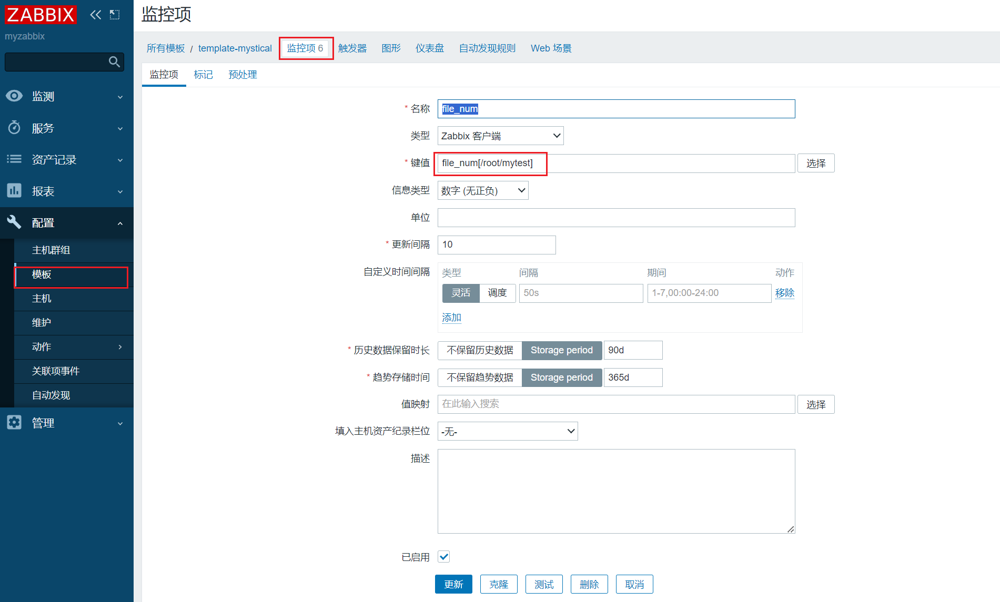

前端流程：
```shell
1. 创建模板
2. 给模板添加监控项
3. 在被监控主机上添加该模板
```

### 自定义监控项的模版导出
 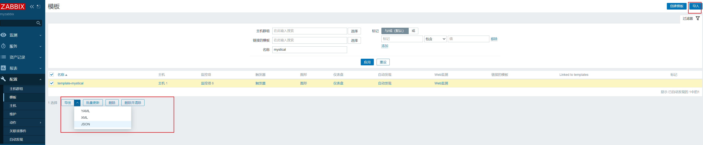

注意：导入自定义监控项的时候，要在后端将自己写的自定义配置文件和脚本一同复制到新的被监控设备上，新的被监控设备上的模版的自定义监控项才能生效

### 自定义模版的升级

场景：假设当前的zabbix是4.0版本，将4.0上的模版导入5.0使用的方法
- 找一台新机器，上面安装zabbix4.0
- 将生成环境的4.0版本的模版导出，并导入自己安装的zabbix4.0中
- 升级自己安装的zabbix4.0到5.0，使其模版自动更新升级
- 升级到5.0后，将模版导出
- 再将升级后的模版导入zabbix5.0即可

### 值映射

用更人性化的表示方法，显示监控结果

值映射实现过程
- 在末班中添加值映射

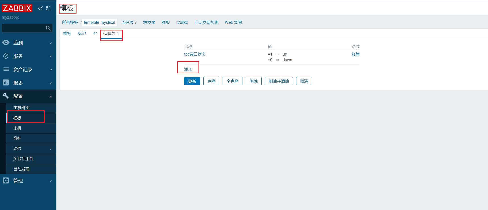

- 在监控项中关联该值映射

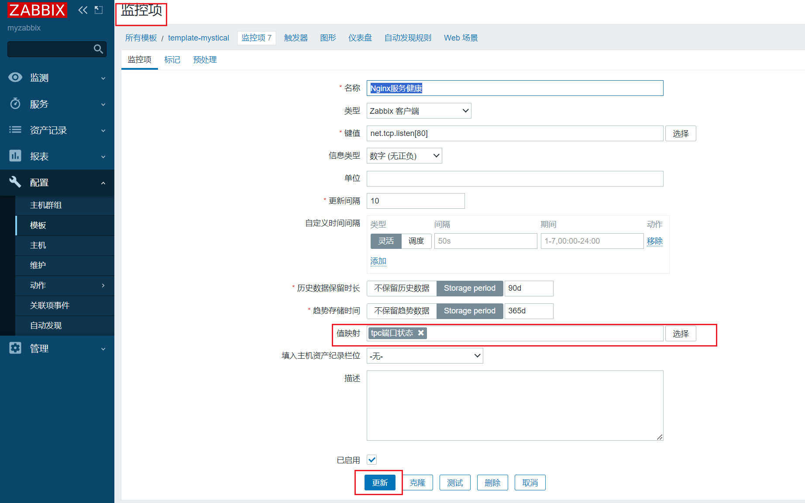

### 触发器

告警实现的前提，本质上是一个条件定义

在配置--->模版--->触发器上创建

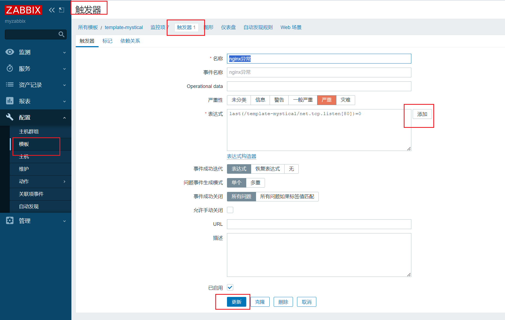

#### 触发器出发之后的报警

user seting---> profile----> 正在发送消息---->前端消息

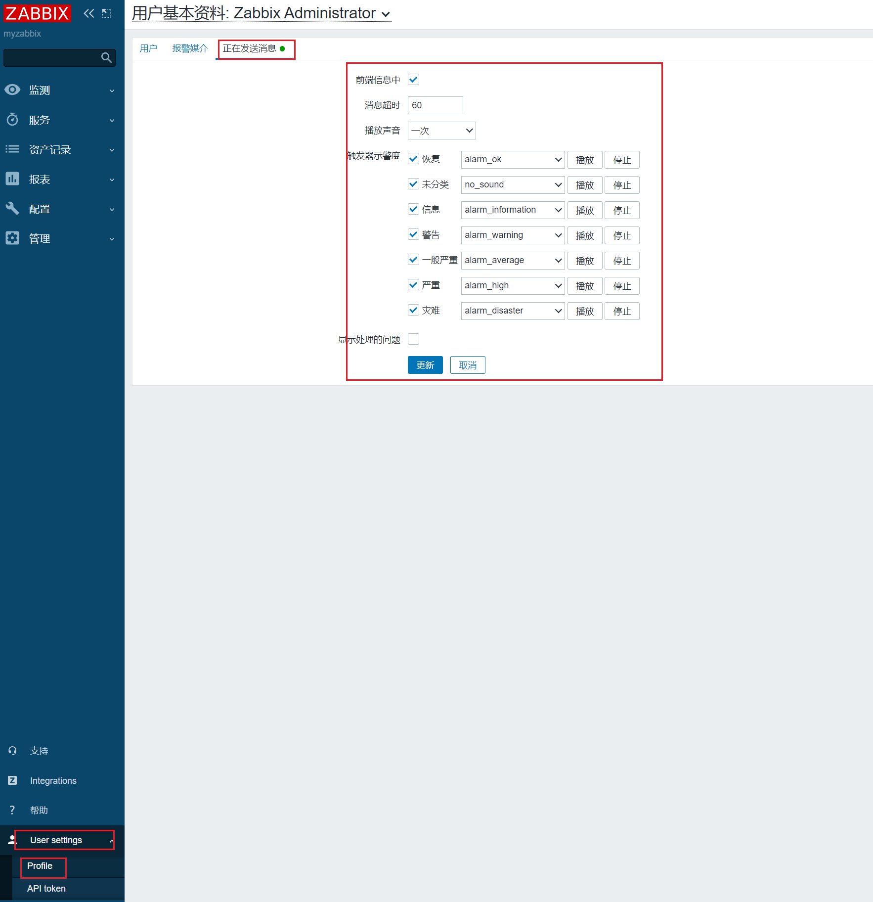


#### 滞后（恢复表达式）

有时我们需要一个OK和问题状态之间的区间值，而不是一个简单的阈值

防止数据波动，产生大量的无效通知

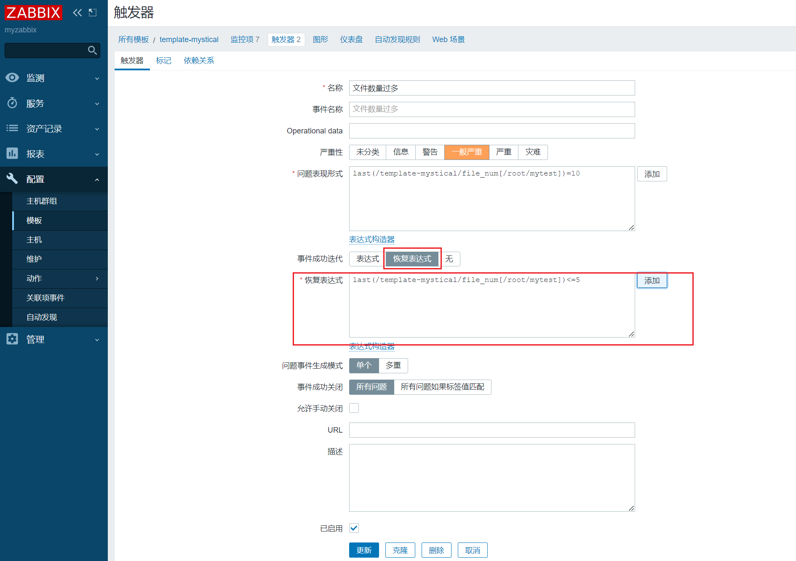

#### 触发器的依赖关系

什么是触发器依赖 

有时候一台主机的可用性依赖于另一台主机。如果一台路由器宕机，则路由器后端的服务器将变得不可
用。
如果这两者都设置了触发器，你可能会收到关于两个主机宕机的通知，然而只有路由器是真正故障的。
这就是主机之间某些依赖关系可能有用的地方，设置依赖关系的通知会被抑制，而只发送根本问题的通
知。

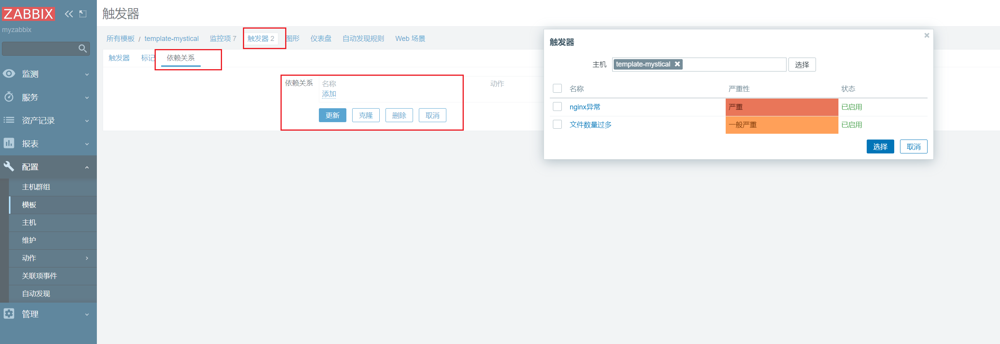


### 图形

### 仪表盘


## 用户管理


## 告警
### 邮件告警

#### 定义发件人信息
- 管理---->报警媒介类型

- 创建报警媒介，填写信息
  - smtp：smtp.qq.com
  - halo：qq.com
  - 真实邮箱：XXXXXX
  - 授权码：XXXX
  - 内容模版

注意
```shell
qq邮箱可能有权限问题
建议用163邮箱
```

#### 定义收件人信息

用户---->报警媒介

#### 定义动作（什么时候报警）

配置--->动作---->Trigger actions(定义动作和操作)

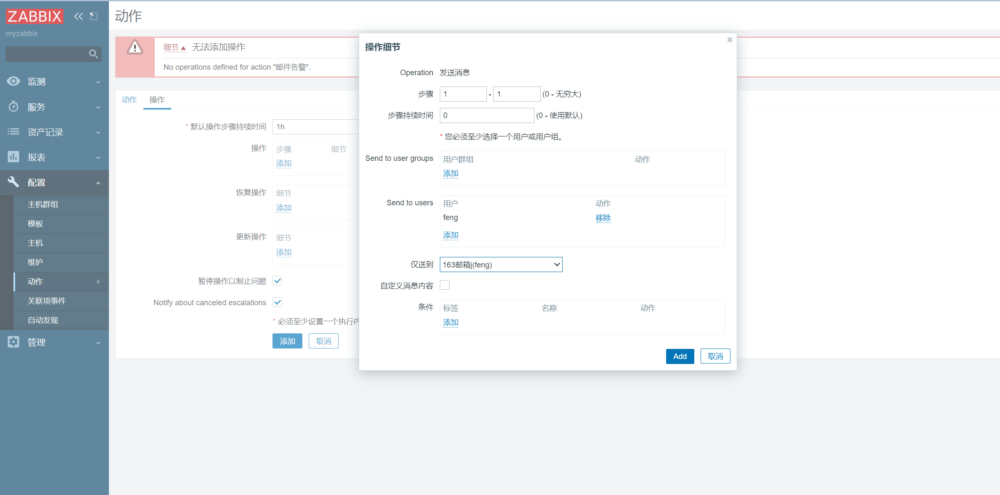


#### 分级告警

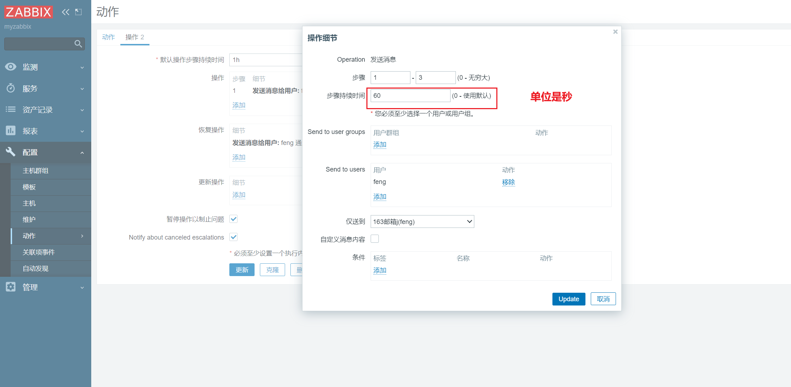

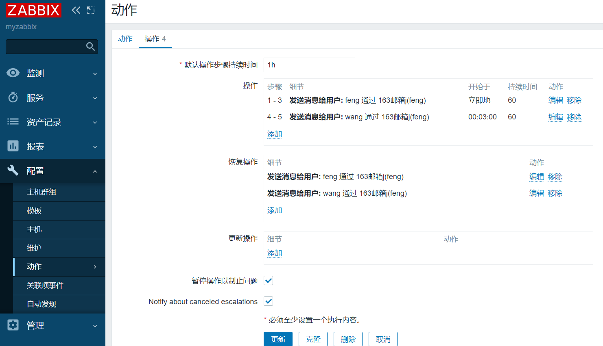

### 脚本告警

脚本要求支持三个参数
- 收件人
- 标题
- 正文

#### 邮箱脚本告警
```shell
#!/bin/bash
#
#********************************************************************
#Author:            wangxiaochun
#QQ:                29308620
#Date:              2020-02-31
#FileName:          send_email.sh
#URL:               http://www.wangxiaochun.com
#Description:       The test script
#Copyright (C):     2020 All rights reserved
#********************************************************************

email_send='lbtooth@163.com'
email_passwd='aaaaaaa'
email_smtp_server='smtp.163.com'

. /etc/os-release

msg_error() {
  echo -e "\033[1;31m$1\033[0m"
}

msg_info() {
  echo -e "\033[1;32m$1\033[0m"
}

msg_warn() {
  echo -e "\033[1;33m$1\033[0m"
}


color () {
    RES_COL=60
    MOVE_TO_COL="echo -en \\033[${RES_COL}G"
    SETCOLOR_SUCCESS="echo -en \\033[1;32m"
    SETCOLOR_FAILURE="echo -en \\033[1;31m"
    SETCOLOR_WARNING="echo -en \\033[1;33m"
    SETCOLOR_NORMAL="echo -en \E[0m"
    echo -n "$1" && $MOVE_TO_COL
    echo -n "["
    if [ $2 = "success" -o $2 = "0" ] ;then
        ${SETCOLOR_SUCCESS}
        echo -n $"  OK  "    
    elif [ $2 = "failure" -o $2 = "1"  ] ;then 
        ${SETCOLOR_FAILURE}
        echo -n $"FAILED"
    else
        ${SETCOLOR_WARNING}
        echo -n $"WARNING"
    fi
    ${SETCOLOR_NORMAL}
    echo -n "]"
    echo 
}


install_sendemail () {
    if [[ $ID =~ rhel|centos|rocky ]];then
        rpm -q sendemail &> /dev/null ||  yum install -y sendemail
    elif [ $ID = 'ubuntu' ];then
        dpkg -l |grep -q sendemail  || { apt update && apt install -y libio-socket-ssl-perl libnet-ssleay-perl sendemail ; } 
    else
        color "不支持此操作系统，退出!" 1
        exit
    fi
}

send_email () {
    local email_receive="$1"
    local email_subject="$2"
    local email_message="$3"
    sendemail -f $email_send -t $email_receive -u $email_subject -m $email_message -s $email_smtp_server -o message-charset=utf-8 -o tls=yes -xu $email_send -xp $email_passwd -o message-content-type=html
    #sendemail -f $email_send -t $email_receive -u $email_subject -m $email_message -s $email_smtp_server -o message-charset=utf-8 -o tls=yes -xu $email_send -xp $email_passwd
    [ $? -eq 0 ] && color "邮件发送成功!" 0 || color "邮件发送失败!" 1 
}

if [ $# -ne 3 ];then 
    color "脚本参数不正确!" 1
    msg_info "Usage: `basename $0` <mail_address> <subject> <message>"
    exit 1
fi

install_sendemail 

send_email "$1" "$2" "$3"
```

将脚本放入chmod +x /usr/lib/zabbix/alertscripts/send_email.sh

将脚本在前端部署

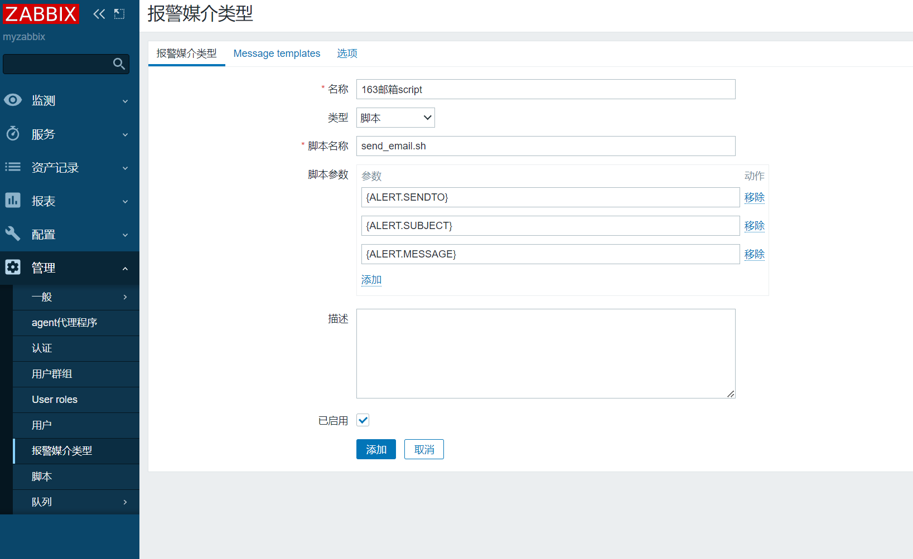


#### 微信脚本
```shell
#!/bin/bash
#
#********************************************************************
#Author:            wangxiaochun
#QQ:                29308620
#FileName:          wechat.sh
#URL:               http://www.wangxiaochun.com
#Description:       Send message from wechat for zabbix monitor
#Copyright (C):     2020 All rights reserved
#********************************************************************

CorpID="ww644a0d95807e476b"                             #我的企业下面的CorpID
Secret="cGp4gHUpHLL1KQZY5abM3panGp-uCrEZyrgDvOT0OZA"    #创建的应用那里的Secret
agentid=1000003                                         #改为 AgentId 在创建的应用可以查看
#PartyID=1                                                    #通讯录中的部门ID,可选项
GURL="https://qyapi.weixin.qq.com/cgi-bin/gettoken?corpid=$CorpID&corpsecret=$Secret"
Token=$(/usr/bin/curl -s -G $GURL |awk -F\": '{print $4}'|awk -F\" '{print $2}')
#echo $Token
PURL="https://qyapi.weixin.qq.com/cgi-bin/message/send?access_token=$Token"
 
function body(){
    local userid=$1                                 #脚本的第1个参数为接收微信的企业用户帐号,在通讯录中可以查看
    #local partyid=$PartyID          
    local subject=$2                                #脚本的第2个参数,表示消息主题
    local msg=$(echo "$@" | cut -d" " -f3-)         #脚本的第3个参数,表示消息正文
    printf '{\n'
    printf '\t"touser": "'"$userid"\"",\n"
    #printf '\t"toparty": "'"$PartyID"\"",\n"
    printf '\t"msgtype": "text",\n'
    printf '\t"agentid": "'"$agentid"\"",\n"
    printf '\t"text": {\n'
    printf '\t\t"content": "'"$subject\n\n$msg"\""\n"
    printf '\t},\n'
    printf '\t"safe":"0"\n'
    printf '}\n'
}

/usr/bin/curl --data-ascii "$(body $*)" $PURL
```

#### 钉钉脚本

### 实现故障自愈

zabbix-agentd是由zabbix用户运行的，而如果想要实现故障自愈，zabbix-agentd使用zabbix的身份去重启服务

因此需要给zabbix设置权限
```shell
visudo

zabbix ALL=(ALL:ALL)  NOPASSWD: ALL
```