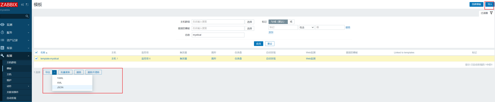
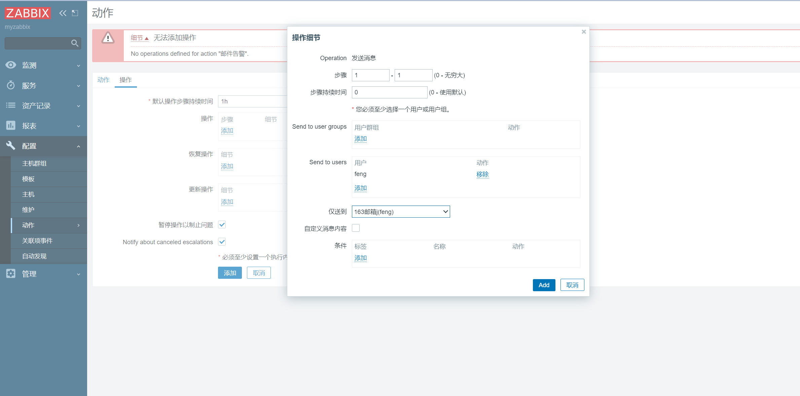

## Zabbinx部署

## Zabbix核心功能
### 监控主机

### 监控服务

### 自定义监控项

客户端可以自定义监控项，在Zabbix Agent配置文件添加内容，格式如下
```shell
# cat /etc/zabbix/zabbix_agentd.conf
# cat /etc/zabbix/zabbix_agent2.conf
UserParameter=<key>,<shell command>
Include=/etc/zabbix/zabbix_agent.d/*.conf

# 或者创建独立的自定义文件
# cat /etc/zabbix/zabbix_agentd.d/*.conf
# cat /etc/zabbix/zabbix_agent2.d/*.conf

# 格式1：一般形式的自定义监控项
UserParamter=<key>,<shell command>
# 格式2：参数形式的自定义监控项
UserParamter=<key>[*],<shell command> $1 $2... 
```

示例
```shell
# vim /etc/zabbix/zabbix_agent.d/tcp.conf
UserParameter=tcp_listen,netstat -lant|grep -ci listen
UserParameter=tcp_time_wait,netstat -lant|grep -ci time_wait
UserParameter=establish,netstat -lant|grep -ci establish
```


测试监控项是否生效
```shell
zabbix_agentd -t tcp_listen
tcp_listen                 [t|7]
```

使用zabbix-get在监测端测试
```shell
zabbix_get -s 10.0.0.151 -k tcp_listen
```

zabbix-agentd后端配置好后

#### 使用脚本作为自定义监控项
如果shell命令复杂可以写成脚本，然后在*.conf文件中运行脚本
示例
```shell
vim /root/shell/file_num.sh

#!/bin/bash
ls -l $1 |awk 'NR>3{print}'|wc -l

vim /etc/zabbix/zabbix_agent.d/my.conf
UserParameter=file_num[*],sudo /root/shell/file_num.sh $1
```
后台配置好后，在前台添加


前端流程：
```shell
1. 创建模板
2. 给模板添加监控项
3. 在被监控主机上添加该模板
```

### 自定义监控项的模版导出
 

注意：导入自定义监控项的时候，要在后端将自己写的自定义配置文件和脚本一同复制到新的被监控设备上，新的被监控设备上的模版的自定义监控项才能生效

### 自定义模版的升级

场景：假设当前的zabbix是4.0版本，将4.0上的模版导入5.0使用的方法
- 找一台新机器，上面安装zabbix4.0
- 将生成环境的4.0版本的模版导出，并导入自己安装的zabbix4.0中
- 升级自己安装的zabbix4.0到5.0，使其模版自动更新升级
- 升级到5.0后，将模版导出
- 再将升级后的模版导入zabbix5.0即可

### 值映射

用更人性化的表示方法，显示监控结果

值映射实现过程
- 在末班中添加值映射


- 在监控项中关联该值映射


### 触发器

告警实现的前提，本质上是一个条件定义

在配置--->模版--->触发器上创建


#### 触发器出发之后的报警

user seting---> profile----> 正在发送消息---->前端消息


#### 滞后（恢复表达式）

有时我们需要一个OK和问题状态之间的区间值，而不是一个简单的阈值

防止数据波动，产生大量的无效通知


#### 触发器的依赖关系

什么是触发器依赖 

有时候一台主机的可用性依赖于另一台主机。如果一台路由器宕机，则路由器后端的服务器将变得不可
用。
如果这两者都设置了触发器，你可能会收到关于两个主机宕机的通知，然而只有路由器是真正故障的。
这就是主机之间某些依赖关系可能有用的地方，设置依赖关系的通知会被抑制，而只发送根本问题的通
知。


### 图形

### 仪表盘


## 用户管理


## 告警
### 邮件告警

#### 定义发件人信息
- 管理---->报警媒介类型

- 创建报警媒介，填写信息
  - smtp：smtp.qq.com
  - halo：qq.com
  - 真实邮箱：XXXXXX
  - 授权码：XXXX
  - 内容模版

注意
```shell
qq邮箱可能有权限问题
建议用163邮箱
```

#### 定义收件人信息

用户---->报警媒介

#### 定义动作（什么时候报警）

配置--->动作---->Trigger actions(定义动作和操作)




#### 分级告警


### 脚本告警

脚本要求支持三个参数
- 收件人
- 标题
- 正文

#### 邮箱脚本告警
```shell
#!/bin/bash
#
#********************************************************************
#Author:            wangxiaochun
#QQ:                29308620
#Date:              2020-02-31
#FileName:          send_email.sh
#URL:               http://www.wangxiaochun.com
#Description:       The test script
#Copyright (C):     2020 All rights reserved
#********************************************************************

email_send='lbtooth@163.com'
email_passwd='aaaaaaa'
email_smtp_server='smtp.163.com'

. /etc/os-release

msg_error() {
  echo -e "\033[1;31m$1\033[0m"
}

msg_info() {
  echo -e "\033[1;32m$1\033[0m"
}

msg_warn() {
  echo -e "\033[1;33m$1\033[0m"
}


color () {
    RES_COL=60
    MOVE_TO_COL="echo -en \\033[${RES_COL}G"
    SETCOLOR_SUCCESS="echo -en \\033[1;32m"
    SETCOLOR_FAILURE="echo -en \\033[1;31m"
    SETCOLOR_WARNING="echo -en \\033[1;33m"
    SETCOLOR_NORMAL="echo -en \E[0m"
    echo -n "$1" && $MOVE_TO_COL
    echo -n "["
    if [ $2 = "success" -o $2 = "0" ] ;then
        ${SETCOLOR_SUCCESS}
        echo -n $"  OK  "    
    elif [ $2 = "failure" -o $2 = "1"  ] ;then 
        ${SETCOLOR_FAILURE}
        echo -n $"FAILED"
    else
        ${SETCOLOR_WARNING}
        echo -n $"WARNING"
    fi
    ${SETCOLOR_NORMAL}
    echo -n "]"
    echo 
}


install_sendemail () {
    if [[ $ID =~ rhel|centos|rocky ]];then
        rpm -q sendemail &> /dev/null ||  yum install -y sendemail
    elif [ $ID = 'ubuntu' ];then
        dpkg -l |grep -q sendemail  || { apt update && apt install -y libio-socket-ssl-perl libnet-ssleay-perl sendemail ; } 
    else
        color "不支持此操作系统，退出!" 1
        exit
    fi
}

send_email () {
    local email_receive="$1"
    local email_subject="$2"
    local email_message="$3"
    sendemail -f $email_send -t $email_receive -u $email_subject -m $email_message -s $email_smtp_server -o message-charset=utf-8 -o tls=yes -xu $email_send -xp $email_passwd -o message-content-type=html
    #sendemail -f $email_send -t $email_receive -u $email_subject -m $email_message -s $email_smtp_server -o message-charset=utf-8 -o tls=yes -xu $email_send -xp $email_passwd
    [ $? -eq 0 ] && color "邮件发送成功!" 0 || color "邮件发送失败!" 1 
}

if [ $# -ne 3 ];then 
    color "脚本参数不正确!" 1
    msg_info "Usage: `basename $0` <mail_address> <subject> <message>"
    exit 1
fi

install_sendemail 

send_email "$1" "$2" "$3"
```

将脚本放入chmod +x /usr/lib/zabbix/alertscripts/send_email.sh

将脚本在前端部署


#### 微信脚本
```shell
#!/bin/bash
#
#********************************************************************
#Author:            wangxiaochun
#QQ:                29308620
#FileName:          wechat.sh
#URL:               http://www.wangxiaochun.com
#Description:       Send message from wechat for zabbix monitor
#Copyright (C):     2020 All rights reserved
#********************************************************************

CorpID="ww644a0d95807e476b"                             #我的企业下面的CorpID
Secret="cGp4gHUpHLL1KQZY5abM3panGp-uCrEZyrgDvOT0OZA"    #创建的应用那里的Secret
agentid=1000003                                         #改为 AgentId 在创建的应用可以查看
#PartyID=1                                                    #通讯录中的部门ID,可选项
GURL="https://qyapi.weixin.qq.com/cgi-bin/gettoken?corpid=$CorpID&corpsecret=$Secret"
Token=$(/usr/bin/curl -s -G $GURL |awk -F\": '{print $4}'|awk -F\" '{print $2}')
#echo $Token
PURL="https://qyapi.weixin.qq.com/cgi-bin/message/send?access_token=$Token"
 
function body(){
    local userid=$1                                 #脚本的第1个参数为接收微信的企业用户帐号,在通讯录中可以查看
    #local partyid=$PartyID          
    local subject=$2                                #脚本的第2个参数,表示消息主题
    local msg=$(echo "$@" | cut -d" " -f3-)         #脚本的第3个参数,表示消息正文
    printf '{\n'
    printf '\t"touser": "'"$userid"\"",\n"
    #printf '\t"toparty": "'"$PartyID"\"",\n"
    printf '\t"msgtype": "text",\n'
    printf '\t"agentid": "'"$agentid"\"",\n"
    printf '\t"text": {\n'
    printf '\t\t"content": "'"$subject\n\n$msg"\""\n"
    printf '\t},\n'
    printf '\t"safe":"0"\n'
    printf '}\n'
}

/usr/bin/curl --data-ascii "$(body $*)" $PURL
```

#### 钉钉脚本

### 实现故障自愈

zabbix-agentd是由zabbix用户运行的，而如果想要实现故障自愈，zabbix-agentd使用zabbix的身份去重启服务

#### 给zabbix赋予权限
因此需要给zabbix设置权限
```shell
# 给zabbix授权，使其可以使用sudo重启服务
visudo

zabbix ALL=(ALL:ALL)  NOPASSWD: ALL
```

#### 修改配置，开启远程命令功能

```shell
# 在Zabbix agent和Zabbix proxy上，远程命令默认是不开启的，它可以使用以下方法开启

在agent配置中添加
# 在agent2版本需要手动添加该参数
AllowKey=system.run[*] # 开启远程执行功能
UnsafeUserparameters=1 # 允许远程执行命令时使用不安全的参数（特殊符号）

在proxy配置中，将enableremotecommands参数设为1

重启
systemctl restart zabbix-agent.service
```


#### 在前端页面添加脚本

管理---->脚本---->创建脚本


#### 添加动作

配置---->动作---->Trigger actions---->操作

## Zabbix的主动与被动模式

默认是被动模式，zabbix-agentd不支持主动模式，需要修改配置

默认只支持zabbix-server连agent,agent默认不支持远程连zabbix-server

修改/etc/zabbix/zabbix_agentd.conf
```shell
ServerActive=10.0.0.200 # 主动模式，连接服务端
Hostname=10.0.0.151Rokcy # Hostname名称必须和前端的主机名一致
```


ServerActive(主动模式)表示主动向10.0.0.200汇报目标，此时agent是客户端，server是服务端

Server(被动模式)表示允许10.0.0.200连接我，此时agent是被连接对象，zabbix-server主动连接agent


主动模式是agent主动连接server的10051端口，被动模式是server主动连接agent的10050端口

重点：主动模式，被动模式是`站在agent的角度说的`


## Zabbix Java Gateway

Zabbix不支持直接监控Java应用

如果要监控Java程序，比如Tomcat等，需要使用Java gateway作为代理，才能从Java应用中获取数据

注意：JAVA应用要求开启JMX(java Managerment Extensions,即java管理扩展)功能才能被监控

### Zabbix监控JVM流程

- Zabbix-server通知zabbix-java-Gateway需要获取监控主机的哪些监控项
- Zabbix-Java-Gateway通过JMX协议请求采集JAVA进程数据
- Java程序通过JMX协议返回数据给zabbix-Java-Gateway
- Zabbix-Java-Gateway最终返回数据给zabbix-server
- zabbix-server将采集的Java数据存储至数据库，然后进行Web展示

### JMX协议

默认状态下，java程序不支持JMX协议，如果支持JMX协议，则会打开一个12345的端口

以tomcat为例，如果zabbix监控tomcat，则需要tomcat开启JMX协议，通过修改catalina配置文件实现
```shell
vim /usr/share/tomcat9/bin/catalina.sh

# 添加下列选项以开启JMX
 CATALINA_OPTS="$CATALINA__OPTS -Dcom.sun.management.jmxremote -Dcom.sun.management.jmxremote.port=12345 -Dcom.sun.management.jmxremote.authenticate=false -Dcom.sun.management.jmxremote.ssl=false -Djava.rmi.server.hostname=10.0.0.202"
```

### 配置Zabbix-Server使其能够找到Java-gateway
```shell
# 让server识别java-gateway
cd /etc/zabbix/
vim zabbix_server.conf

### Option: JavaGateway
#       IP address (or hostname) of Zabbix Java gateway.
#       Only required if Java pollers are started.
#
# Mandatory: no
# Default:
JavaGateway=127.0.0.1

# 指定端口号，默认值10052，可不修改
JavaGatewayPort=10052

# 指定开启的进程数，默认为0，即不开启，所以必须修改此行
StartJavaPollers=10
```

### 监控JavaGateway自身
```shell
# 因为JavaGateway本身也是一个java程序，因此监控JavaGateway方法和其他Java程序一样，要开启JXM
```


## 监控网路设备

大部分交换机或路由器天生支持SNMP协议，可以通过SNMP协议实现网络设备的监控

### SNMP

SNMP(Simple Network Management Protocol)简单网络管理协议，属于TCP/IP五层协议中的应用层协议，用于网络管理的协议，SNMP主要用于网络设备的管理

### SNMP工作原理

SNMP网络设备分为NMS和Agent两种
- NMS(Network Management Station,网络管理站)是SNMP网络的管理者，NMS是运行SNMP客户端管理程序的工作站，能够提供友好的人机交互界面，方便网络管理员完成绝大多数的网络管理工作

- Agent是SNMP网络的管理者。Agent是驻留在设备的一个进程上，负责接受、处理来自NMS的请求报文。在一些紧急情况下，如接口状态发生改变等，Agent也会主动通知NMS

- NMS和Agent之间通过SNMP协议来交互管理信息 


### SNMP协议使用的端口

- 管理端用的是UDP端口162
- 交换机，路由器上是UDP端口161

### SNMP组成

基于TCP/IP的SNMP网络管理包含以下组成部分
- 管理信息库MIB(Management Information Base):
  - 管理信息库包含所有代理进程的所有可被查询和修改的参数。RFC1213定义了第二版的MIB，叫做MIB-ll
  - OID(object identifiers)：是与对象相关联的用来无歧义地标识对象的全局唯一的值，一个OID是一个唯一的键值对，用于标识具体某一个设备的某个具体信息(对象标识),如：端口信息，设备名称等。即一个OID就是网路通信中对象的身份证
- 管理信息结构SMI(Structure of Manangement Information)：
  - 关于MIB的一套公用的结构和表示符号。
  - SMI是一种语言，是为了确保网路管理数据的语法和语义明确和无二义性而定义的语言。他是定义被网络管理实体中特定数据的语言
  - 它定义了数据类型，对象模型，以及写入和修改管理信息的规则，比如支持INTEGER，OCTER STRING，DisplayString IPAddress等数据类型
- SNMP(Simple Network Management Potocol)
  - 管理进程和代理进程之间的通信协议，叫做简单网络管理协议。

### SNMP、MIB和SMI的关系

这三部分相互独立，每部分都定义了单独标准。

- SNMP定义通信的方式和格式，但不指名具体设备上的具体数据
- 每种设备上的数据在MIB中定义，这样做达到了“控制”和“数据”相分离的目的
- SMI又为保持MIB的简单性和可扩展性提供了良好的支持

### MIB和OID

管理信息库MIB可以分为公有MIB和私有MIB两种

- 公有MIB：一般由RFC定义，主要用来对各种公有协议进行结构化设计和接口标准化处理。
  - 例如：OSPF-MIB（RFC1850）/BGP4-MIB（RFC1657）都是典型的公有MIB。大多数的设备制造商都需要按照RFC的定义来提供SNMP接口

- 私有MIB：是公有MIB的必要补充，当公司自行开发私有协议或者特有功能时，可以利用私有MIB来完善SNMP接口的管理功能，同时对第三方网管软件管理存在私有协议或特有功能的设备提供支持

MIB中存放了对每个对象都指定唯 一的对象标识OID, OID是一种数据类型，它指明一种“授权”命名的对象。“授权”的意思就是这些标识不是随便分配的，它是由一些权威机构进行管理和分配的。对象标识是一个整数序列，以点（“.”）分隔。这些整数构成一个树型结构，类似于DNS或Unix的文件系统。

 
### 常见OID
oid-info是一个内容丰富的网站，包含了大量公有或私有的MIB信息，在知道部分OID的情况，可以方便的进行节点具体信息的查看。但是树太过庞大，仅仅从网站上查看效率十分低下，直接从设备商处获取mib库是最方便的做法

常用系统信息
```shell
sysDescr .1.3.6.1.2.1.1.1
sysobjectID .1.3.6.1.2.1.1.2
sysUpTime .1.3.6.1.2.1.1.3
syscontact .1.3.6.1.2.1.1.4
sysName .1.3.6.1.2.1.1.5
```

CPU负载
```shell
1 minute Load: .1.3.6.1.4.1.2021.10.1.3.1
5 minute Load: .1.3.6.1.4.1.2021.10.1.3.2
15minute Load: .1.3.6.1.4.1.2021.10.1.3.3
```

CPU信息
```shell
percentage of user Cpu time: .1.3.6.1.4.1.2021.11.9.0
raw user cpu time: .1.3.6.1.4.1.2021.11.50.0
percentages of system Cpu time: .1.3.6.1.4.1.2021.11.10.0
raw system cpu time: .1.3.6.1.4.1.2021.11.52.0
percentages of idle Cpu time:.1.3.6.1.4.1.2021.11.11.0
raw idle cpu time:.1.3.6.1.4.1.2021.11.53.0
raw nice cpu time: .1.3.6.1.4.1.2021.11.51.0
```

内存使用
```shell
Total swap size:.1.3.6.1.4.1.2021.4.3.0
Available swap Space: .1.3.6.1.4.1.2021.4.4.0
Total RAM in machine: .1.3.6.1.4.1.2021.4.5.0
Total RAM used: .1.3.6.1.4.1.2021.4.6.0
Total RAMFree: .1.3.6.1.4.1.2021.4.11.0
Total RAM Shared: .1.3.6.1.4.1.2021.4.13.0
Tota7 RAM Buffered: .1.3.6.1.4.1.2021.4.14.0
Total cached Memory: .1.3.6.1.4.1.2021.4.15.0
```

硬盘使用
```shell
Path where the disk is mounted: .1.3.6.1.4.1.2021.9.1.2.1
Path of the device for the partition: .1.3.6.1.4.1.2021.9.1.3.1
Total size of the disk/partion (kBytes): .1.3.6.1.4.1.2021.9.1.6.1
Available space on the disk: .1.3.6.1.4.1.2021.9.1.7.1
Used space on the disk: .1.3.6.1.4.1.2021.9.1.8.1
Percentage of space used on disk: .1.3.6.1.4.1.2021.9.1.9.1
Percentage of inodes used on disk: .1.3.6.1.4.1.2021.9.1.10.1
```


## Zabbix分布式实现Proxy

### Zabbix Server和Zabbix Proxy的区别

Zabbix Proxy只执行数据收集，不运行触发器，无处理事件，也不发送警告，无Web管理界面，所以最终导致告警延时可能会比较长

### Zabbix Proxy安装和配置

注意：所有的主机名要唯一，防止被动模式采集数据出现问题

#### zabbix proxy安装
```shell
# 安装源，可以替换为国内的清华源
wget https://repo.zabbix.com/zabbix/6.0/ubuntu/pool/main/z/zabbix-release/zabbix-release_6.0-4+ubuntu22.04_all.deb
dpkg -i zabbix-release_6.0-4+ubuntu22.04_all.deb
apt update

# 安装zabbix-proxy
apt install zabbix-proxy-mysql zabbix-sql-scripts

# 安装数据库mysql
apt install -y mysql-server

# 初始化mysql数据库
mysql> create database zabbix_proxy character set utf8mb4 collate utf8mb4_bin;
# 创建账号，并授权
mysql> create user zabbix@localhost identified by 'password';
mysql> grant all privileges on zabbix_proxy.* to zabbix@localhost;
# 授权执行外部函数
set global log_bin_trust_function_creators = 1;

# 退出mysql，将初始架构数据导入mysql
cat /usr/share/zabbix-sql-scripts/mysql/proxy.sql | mysql --default-character-set=utf8mb4 -uzabbix -p zabbix_proxy
```

#### 修改proxy的配置文件
```shell
### Option: ProxyMode
#   Proxy operating mode.
#   0 - proxy in the active mode
#   1 - proxy in the passive mode
#
# Mandatory: no
# Default:
# ProxyMode=0
ProxyMode=1  # 默认是0主动模式，如果用被动模式需要手动改为1

### Option: Server
#   If ProxyMode is set to active mode:
#       IP address or DNS name (address:port) or cluster (address:port;address2:port) of Zabbix server to get configuration data from and send data to.
#       If port is not specified, default port is used.
#       Cluster nodes need to be separated by semicolon.
#   If ProxyMode is set to passive mode:
#       List of comma delimited IP addresses, optionally in CIDR notation, or DNS names of Zabbix server.
#       Incoming connections will be accepted only from the addresses listed here.
#       If IPv6 support is enabled then '127.0.0.1', '::127.0.0.1', '::ffff:127.0.0.1' are treated equally
#       and '::/0' will allow any IPv4 or IPv6 address.
#       '0.0.0.0/0' can be used to allow any IPv4 address.
#       Example: Server=127.0.0.1,192.168.1.0/24,::1,2001:db8::/32,zabbix.example.com
#
# Mandatory: yes
# Default:
# Server=

Server=10.0.0.32 # 被动模式，授权允许那台机器到proxy采集数据，这里写server的ip地址

Hostname=zabbix_proxy  # 代理服务器名，被动模式不要求，主动模式必须和web管理页上的代理程序名称一致

# 修改数据库信息
DBHost=localhost   

DBName=zabbix_proxy   # 填写数据库的名称

DBuser=proxy         # 填写用户名

DBPassword=123456            # 填写数据库密码
```

#### 将agent的server指向proxy
```shell
vim /etc/zabbix/zabbix_agentd.conf

Server=10.0.0.203  # agent授权proxy可以从它这里采集数据
```

#### 在Web端配置代理


#### 主动模式，修改proxy文件
```shell
# 主动模式下，Hostname的名称必须和之后在Web端配置proxy代理的名称一致

# 后面很上面一样，添加mysql的账号，用户，密码
```


## Zabbix自动化运维

### Zabbix 网络发现（不推荐，会影响性能）

### Zabbix 自动注册

### API


## Zabbix的性能优化

原则：当需要优化的时候再优化，平时无异常，谨慎不要盲目优化

### Zabbix需要调优的表现
Zabbix需要优化的表现
- Web管理页面操作卡顿，经常出现502错误
- 监控图形中图层断裂，不能正常显示
- 监控告警延迟很长，不及时

### Zabbix调优的方向

#### 优化数据库

- 数据库：写多读少，数据采集比较频繁，可以考虑PostgreSQL
- 使用主动模式，减轻Zabbix-server压力
- 如果需要监控远程主机，使用Zabbix-Proxy
- 删除无用的监控项，建议使用自定义模版和监控项
- 适当增加监控项的取值间隔，减少历史数据保存周期
- 对Zabbix Server进程调优，发现性能瓶颈的进程，加大它的进程数量
- 对Zabbix Server缓存进行调优，发现哪种缓存的剩余内存小，就加大它的缓存

Zabbix-Server上的进程和缓存等数据通过Zabbix上对自己的监控的数据即可看出

当出现由于缓存过小，而进程数过多导致程序停止的情况，可以在`/etc/zabbix/zabbix-server.conf`增加缓存（缓存大小，进程数量都可以在zabbix-server.conf进行设置）

缓存生产中建议512M左右，根据机器的实际内存决定

如果出现Mysql连接数too many可以适当增加mysql连接数
```shell
# 在mysqld.conf的配置文件中，增加最大连接数
max_connections=1000
```

如果是打开文件过多，可以设置ulimit，增加内核中的打开文件数量的限制


## Zabbix的高可用集群

### Zabbix6.0以上版本的官方高可用方法
