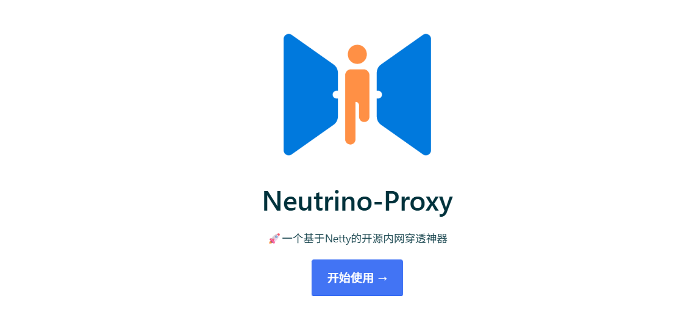
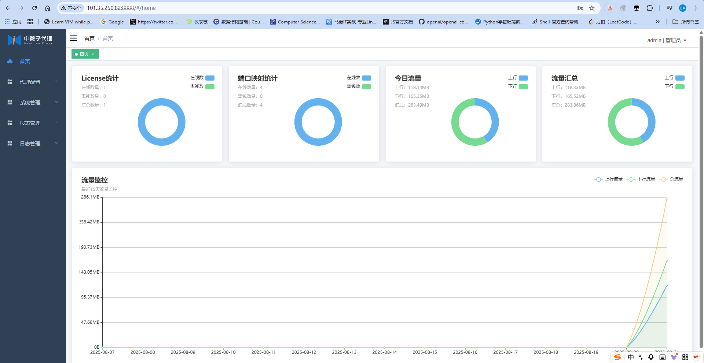
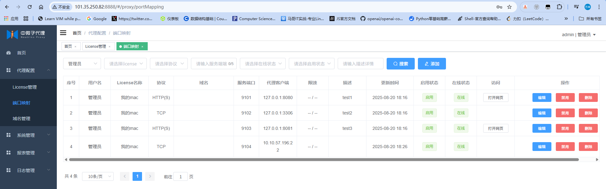

# 内网穿透教程


## SSH内网穿透

### 整个数据包通信过程（分阶段详细讲解）

#### 阶段一：隧道建立

**主动端：内网客户端 `10.0.0.201`**

1. 你在内网主机上执行 `ssh -fN -R 11223:localhost:22 root@101.35.250.82`
2. 该命令：
   - 发起 SSH TCP 连接：**`10.0.0.201:22 → 101.35.250.82:11223`**
   - SSH 连接建立成功后，在远程主机上绑定监听：`0.0.0.0:11223`
   - SSH 守护进程开始监听外部对 `11223` 的连接请求，并准备将这些流量通过隧道转发回来

👉 结果：**公网服务器 `101.35.250.82` 开始监听 11223**，作为进入内网的入口


#### 阶段二：外部客户端访问公网服务器

**外部任意一台公网主机：比如 `222.222.222.222`**

1. 用户执行命令：

   ```bash
   ssh -p 11223 user@101.35.250.82
   ```

2. 建立 TCP 连接：

   ```makefile
   222.222.222.222:yyyyy → 101.35.250.82:11223
   ```

3. 公网服务器接收到连接后，将其认为是连接本地的 `11223`，于是将其：

   - **打包成 SSH 隧道 payload**
   - 从 `101.35.250.82` 的现有 SSH 连接**封装发送给 10.0.0.201（你的内网）**


#### 阶段三：SSH 服务器反向转发数据到内网目标

**反向流动的 TCP payload 到达内网**

1. 公网服务器将收到的数据打包，放入已建立的 SSH 隧道连接

2. 在隧道另一端（`10.0.0.201`）：

   - `ssh` 客户端解析 payload，发现是对 `localhost:22` 的访问请求

   - 本地开启一个 TCP 连接：

     ```makefile
     localhost:zzzzz → localhost:22
     ```

3. 将 payload 转发给本地 SSH 服务（相当于外部用户连接了 `10.0.0.201:22`）


#### 阶段四：内网返回数据回传

1. 内网机器 `10.0.0.201` 的 `sshd` 响应数据，写回 TCP socket
2. 数据被 `ssh` 客户端封装，通过隧道反向发送到 `101.35.250.82`
3. 公网服务器将解封的数据写回到原始客户端 TCP 连接 `11223`

最终：

```css
[公网客户端] ←→ 101.35.250.82:11223 ←→ SSH 隧道 ←→ 10.0.0.201:22
```


#### 图示总结（数据包方向）

```css
     ⬇️ TCP: 222.222.222.222:YYYY → 101.35.250.82:11223
公网客户端 ───────────────────────────────▶ 公网跳板机
                                                  │
             SSH隧道                              ▼
公网跳板机 ◀───────── TCP Payload over SSH ──────── 内网机器
       ⬅️ 回应数据：10.0.0.201:22 → 101.35.250.82 → 222.222.222.222
```


#### 补充说明：为什么能穿透 NAT？

因为：

- 内网机器是主动发起 SSH 连接（允许出站 NAT）
- SSH 隧道建立后，所有流量都通过这个反向连接回流
- 无需公网 IP，NAT 不阻止 TCP 回程


## 中微子代理内网穿透




### 原理解读

- **三角色**：公网的 **NPS 服务端（nps）**、内网的 **NPS 客户端（npc）**、以及真正访问你的“外部用户/浏览器/SSH 客户端”等。
- **长连接控制通道**：内网 `npc` 主动向公网 `nps` 发起 **外连**（默认 TCP，亦可 TLS/WS/KCP 等），穿过 NAT/防火墙并长期保持心跳。
- **数据转发**：当外部用户访问 `nps` 上的某个“映射”（端口/域名）时，`nps` 在已有的控制通道上向 `npc` 下发指令，建立/复用 **数据通道**，把公网来的流量转到 `npc`，再由 `npc` 连接 **内网目标服务**（如 `127.0.0.1:22` / `10.0.0.5:8080`），做**双向字节转发**。
- **复用**：同一条控制连接上可同时承载多个外部会话（多路复用/多路并发），减少握手开销。
- **HTTP/HTTPS 按域名分发**：`nps` 可直接监听 80/443，按 Host/SNI 把不同域名分发到不同 `npc` 的不同后端；支持自动加 `X-Forwarded-For` 等保留真实来源。
- **权限与限流**：用 vkey/账号管理、端口白名单、带宽/并发限制等，避免“野映射”。

> 注意：这类“内网穿透”是**反向代理型**穿透——不是打洞做 P2P；外部连接始终先到达公网 `nps` 再转发到 `npc`。


### 典型部署拓扑

```bat
[外部用户] ⇄ 互联网 ⇄ [NPS 服务端：公网IP]
                                  │
                 控制/数据通道 ⇄  │  (如 TCP 8024/TLS/WSS)
                                  │
                           [内网 npc 客户端] ──► 目标服务
                                 (10.0.0.x:22 / 127.0.0.1:8080 ...)
```


### 使用docker容器化部署

#### 部署服务端

- dockerHub镜像地址：`aoshiguchen/neutrino-proxy-server:latest`
- 阿里云镜像地址：`registry.cn-hangzhou.aliyuncs.com/asgc/neutrino-proxy:latest`


#### 使用默认h2数据库一键部署

```bash
docker run -it -p 9000-9200:9000-9200/tcp -p 8888:8888 \
-d --restart=always --name neutrino-proxy \
-v /root/neutrino-proxy-server/config:/root/neutrino-proxy/config \
-v /root/neutrino-proxy-server/data:/root/neutrino-proxy/data \
-v /root/neutrino-proxy-server/logs:/root/neutrino-proxy/logs \
aoshiguchen/neutrino-proxy-server:latest
```


#### 指定自己的mysql数据库

- 在服务器上创建目录：`/root/neutrino-proxy/config`
- 在该目录下创建`app.yml`文本文件，并配置如下内容：

```mysql
# 创建名为neutrino-proxy的数据库
create database `neutrino-proxy`

# 创建用户
CREATE USER 'neutrino'@'localhost' IDENTIFIED BY 'StrongPwd!123';
GRANT ALL PRIVILEGES ON `neutrino-proxy`.* TO 'neutrino'@'localhost';
FLUSH PRIVILEGES;
```


```yaml
neutrino:
  data:
    db:
      type: mysql
      # 自己的数据库实例，创建一个空的名为'neutrino-proxy'的数据库即可，首次启动服务端会自动初始化
      url: jdbc:mysql://xxxx:3306/neutrino-proxy?useUnicode=true&characterEncoding=UTF-8&allowMultiQueries=true&useAffectedRows=true&useSSL=false
      driver-class: com.mysql.jdbc.Driver
      # 数据库帐号
      username: neutrino
      # 数据库密码
      password: localhost
```

> 然后再执行上面的docker一键部署命令即可


#### 部署客户端

- dockerHub镜像地址：aoshiguchen/neutrino-proxy-client:latest
- 阿里云镜像地址：registry.cn-hangzhou.aliyuncs.com/asgc/neutrino-proxy-client:latest
- 命令中的服务端ip、license请自行补充
- 若是首次使用，请仔细阅读快速上手，以确定license从哪里取得

```shell
docker run -it -d --restart=always --name npclient -e SERVER_IP=xxxx -e LICENSE_KEY=xxxx \
aoshiguchen/neutrino-proxy-client:latest
```


#### 浏览器查看

- **默认用户密码**：`admin/123456`




查看 `License Key` 在部署客户端的时候使用

```bash
b0a907332b474b25897c4dcb31fc7eb6
```


### 配置端口映射




```bat
注意：公有云的安全组要开放端口，其中 9000 和 9002 以及对应的服务端口要开放
```


