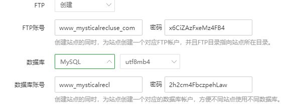

## FTP
- 文件传输协议
    - ftp服务器，端口号：21
    - 向远程主机上传输文件或从远程主机接收文件
    - C/S模式
        - Client：发起传输的一方
        - 服务器：  远程主机

- 控制连接与数据连接分开
    - FTP客户端与FTP服务器通过端口21联系，并使用TCP为传输协议
    - 客户端通过控制连接获得身份确认
    - 收到一个文件传输命令时，服务器打开一个客户端的数据连接（服务器<span style="color:red">主动和客户端的20号端口建立TCP数据连接</span>）
        - 数据的连接通过另外一个TCP传输完成
        - 这里客户端向服务器发送的控制信息的连接，即控制连接和服务器向客户端传输数据的数据连接是两个连接
        - 对比http协议，http客户端和服务端之间控制信息和数据传输是在一个TCP连接下完成的 
        - ftp的服务器和客户端之间的连接是有状态连接，服务器需要维护建立的连接
    - 一个文件传输完成后，服务器关闭连接

## EMAIL（电子邮件）
- 3个主要组成部分
    - 用户代理
    - 邮件服务器
    - 简单邮件传输协议：SMTP
        - 发送的协议：SMTP
        - 拉取的协议：POP3，MIP，HTTP

### 用户代理（User Agent）
- 又名“邮件阅读器”
- 撰写，编辑和阅读文件的后端软件
- 解读代理：
    - 撰写，编辑阅读文件的后端软件是电子邮件的用户代理
    - 浏览器是WEB应用的用户代理
    - FTP应用的用户代理是FTP的客户端软件
    - <span style="color:red">是用户通过客户端软件跟FTP或其他应用服务打交道，而不是用户直接和应用服务打交道</span>
- 如：outlook，Foxmail
- 输出和输入邮件保存在服务器上

### 邮件服务器
- 守候在25号端口
- 邮箱中管理和维护发送给用户的邮件
- 输出报文队列保持待发送邮件报文
- 邮件服务器之间的SMTP协议：发送email报文
    - 客户：发送方邮件服务器
    - 服务器：接收端邮件服务器

- 过程
    - 用户代理配置好邮件服务器的IP地址，端口号；通过邮件服务器发邮件
    - 邮件服务器收到邮件后，放到队列中，将其发给相应的邮件服务器
    - 邮件服务器收到邮件后，将其收到用户的邮箱中
    - 客户端的用户代理，再将邮件服务器，用户自己的邮箱当中的邮件拉取过来（使用拉取协议）
    - 整个过程中的协议
        - 用户代理发送邮件到邮件服务器：SMTP协议
        - 邮件服务器发送到相应的邮件服务器：SMTP协议
        - 对方用户代理将邮件从邮件服务器拉取（拉取协议）：POP3，MIP，HTTP...

- SMTP协议原理
    - 使用TCP在客户端和服务端之间传送报文，服务器守候在25号端口
    - 直接传输：从发送端服务器到接收方服务器
    - 传输的3个阶段
        - 握手
        - 传输报文
        - 关闭
    - 命令/响应交互
        - 命令：ASCII文本
        - 响应：状态码和状态信息
    - 报文必须是7位ASCII码

- SMTP交互示例：
```
S: 220 hamburger.edu
C: HELO crepes.fr
S: 250 Hello crepes.fr,pleased to meet you
C: MEET FROM: <alice@crepes.fr>
S: 250 alice@crepes.fr ... Sender ok
C: RCPT TO: <bob@hamburger.edu>
S: 250 bob@hamburger.edu ... Recipient ok
C: DATA
S: 354 Enter mail, end with "." on a line by itself
C: Do you like ketchup?
S: How about pickles?
C: .
S: 250 Message accepted for delivery
C: QUIT
S: 221 hamburger.edu closing connection
```
         




x6CiZAzFxeMz4FB4

2h2cm4FbczpehLaw

------------------------------------------
FTP账号资料

用户：www_mysticalrecluse_com

密码：x6CiZAzFxeMz4FB4

数据库账号资料

数据库名：www_mysticalrecl

用户：www_mysticalrecl

密码：2h2cm4FbczpehLaw