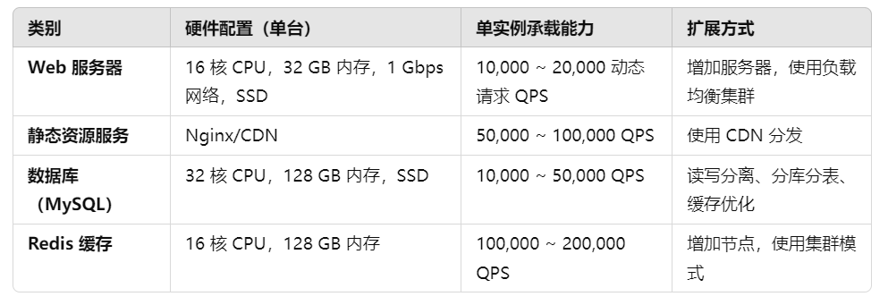

# 网络基础
## TCP3次握手及其中间涉及的过程

【第一次握手】客户端向服务端发送请求，请求初始连接并初始化序列号seq=x，该数据包SYN=1 ACK=0,此时客户端的状态从LISTEN转变为SYN-SENT
【第二次握手】服务端收到客户端的请求包，服务端状态状态从LISTEN转换为SYN-REVD,并响应一个SYN-ACK包，表示自己确认已接收客户端的请求包，该请求包里包含了服务端的初始序列号seq=y,和确认号ack=x+1
【存储状态】并将SYN状态存储到半连接队列中
【半连接状态的意义】服务器需要在某个地方记录已接收的 SYN 包和已发送的 SYN-ACK 包，以便等待客户端的最终 ACK 包。这种记录帮助服务器在握手期间维护连接状态
 半连接队列中的记录允许服务器可靠地检测和应对传输中的包丢失或延迟，确保连接的稳健性。
 过程：如果客户端没有在合理时间内返回最终的 ACK 包，服务器可以根据队列中的信息重新发送 SYN-ACK，或最终丢弃该半连接。以保证可靠的连接建立

【第三次握手】客户端收到服务端的请求包后，客户端状态从SYN-SENT转换为ESTABLISH, 并向服务端发送一个ACK确认包，表示已确认收到服务端的响应，并确认服务端序列号ack=y+1,seq=x+1
【结束】服务端接受到客户端的请求包，将状态从SYN-REVD转变成ESTABLISH，并将半连接队列中的状态信息释放掉，并将通信成功的状态存入全连接队列中
【全连接队列的意义】
全连接队列记录了所有已完成握手的连接，处理所有后续的数据包传输，确保 TCP 协议的功能（如序列号、重传控制、流控制）得到正确实现。
【全连接队列的条目释放】在短连接四次挥手结束后释放，而对于长连接，则在显示连接结束后才释放。在这期间起到维持长连接和流量控制管理等一系列的作用


## TCP4次挥手

【第一次挥手】客户端主动申请关闭，会先向服务端发送一个FIN包，FIN=1,，此时客户端状态从ESTABLISH转变为FIN-WAIT-1
【第二次挥手】服务端接收到客户端的关闭请求后，会向客户端发送一个ACK确认报文，ACK=1，以告知客户端已收到关闭请求，此时服务端的状态从ESTABLISH转变为CLOSE-WAIT，此时服务端可能继续发送剩余数据给服务端，如果没有剩余数据则该过程可能不存在，客户端收到这个ACK确认包后状态从FIN-WAIT-1变为FIN-WAIT-2，
【第三次挥手】当服务端将所有数据都发给客户端结束后，服务端会发给客户端一个FIN-ACK包，告知客户端，确认数据传输完毕，可以结束了，此时数据包FIN=1,ACK=1,服务端状态从CLOSE-WAIT变为LAST-ACK
【第四次挥手】客户端收到服务端的FIN-ACK包后，会发送给服务端一个ACK确认包，确认以收到服务端的响应，并结束连接，此时客户端在发完ACK包后，会等待2MSL的时间，确认数据都释放掉防止就得FIN包影响新的连接，然后状态从FIN-WAIT-2变为CLOSE
服务端收到客户端发来的ACK包后，直接将状态从LAST-ACK变为CLOSE，至此，连接结束，全连接队列中的数据释放掉

## 浏览器发起http请求的典型场景和详细过程
1. 服务器打开并监听80或443端口
2. 浏览器从url中解析出域名
   1. 在这个过程中，url可能由于历史原因，从而被存储到浏览器的数据存储中，导致url会在未被完全输入完毕之前就被浏览器根据历史记录，提前猜测出完整的URL地址 
3. 解析出域名后，浏览器根据域名查询DNS，获取域名对应的IP地址
   1. DNS查询的过程分类递归查询和迭代查询
   2. 整个DNS查询过程如下
      1. 查看本地的hosts文件，看是否记录，如果没有
      2. 查看本地的DNS缓存
      3. 如果还没有，则访问DNS服务器地址，查询上面是否有域名解析记录
      4. 如果还没有，则由DNS服务器去查询根DNS服务器，根服务器将顶级域名器地址返回给DNS服务器，进行递归查询，最终由DNS服务器将结果返回给浏览器，对于大多数的客户端来说，都是进行递归查询，因为整个解析完全交给DNS服务器去进行
      5. 也可能是由DNS服务器告诉浏览器下一个DNS服务器的地址，由浏览器即客户端直接向下一个DNS服务器请求解析，迭代查询，这样可以减轻DNS服务器的负担，但是需要客户端具有足够的处理的能力
4. 查询到IP地址后，浏览器根据IP地址，建立TCP三次握手连接，如果是HTTPS还会额外完成一次SSL/TLS的握手
5. 完成握手建立通讯连接后，浏览器构造http请求，在构造http请求的过程中，填写http请求的头部，包括上下文需要的信息
6. 然后通过链接发起http请求
7. 服务器收到http请求后，将请求发往web服务，交由web服务解析，表述后，将客户端请求的文件如html页面等作为包体返回给浏览器
8. 浏览器在渲染引擎中解析响应，根据这个响应的内容中的其他连接，继续构造http请求，直至所有连接解析完毕，将页面在浏览器渲染出来

## HTTP协议格式
```shell
HTTP-message = start-line*(header-field CRLF)CRLF[message-body]
start-line=request-line/reponse-line
```

# iptables

## iptables是什么

iptables是Netfilter的用户空间工具

```shell
┌──────────────────┐
│    User Space    │
│                  │
│    iptables      │
│    (管理工具)     │
└───────▲──────────┘
        │
        │
┌───────┴──────────┐
│    Kernel Space  │
│                  │
│     Netfilter    │
│   (数据包处理框架)│
└──────────────────┘
```
用户不能直接控制内核空间，因此需要有一个在用户空间的工具通过提供的API接口，对内核空间进行控制
这里这个工具就是iptables，Netfilter是内核空间的数据包处理框架，它提供一系列API接口，
在iptables上配置规则，iptables通过API接口将规则传递给内核空间的Netfilter（数据包处理框架），从而让用户在用户空间实现对内核空间网路数据包的控制


## Netfilter是什么

Netfilter是一个内核的数据包处理框架，他通过5个hook函数来对数据包进行处理，这些hook函数在网络栈的不同阶段被触发，通过对这些hook函数设置规则，来实现在不同阶段对数据包进行指定的操作

而这些规则由用户空间的iptables传递给Netfilter


## 关于Netfilter和iptables的概念和关系

Netfilter是内核的数据包处理框架，他通过5个hook点在数据包的不同处理阶段对其进行操作。

这5个hook点分别是
- PREROUTING
- INPUT
- FORWARD
- OUTPUT
- POSTROUTING


分别在数据包到达，输入，转发，输出和发送的阶段触发，
用户可以通过iptables在用户空间配置规则，这些规则定义了如何在各个钩子点处理这些数据包。这些规则通过iptables工具传递给Netfilter，并由Netfilter在适当的钩子点上应用


## 四表五链中，表是什么，作用是什么，链是什么，作用是什么

表是iptables中的逻辑结构，用于组织规则。
表（tables） 是逻辑上的分组，用于组织不同类型的规则

### 表与钩子的关系
每个钩子点可以引用多个表中的规则链，从而实现对数据包的多方面处理。例如：

- PREROUTING 钩子 
        - 可以引用 nat 表中的 PREROUTING 链来进行 DNAT 操作，
        - 也可以引用 mangle 表中的 PREROUTING 链来修改数据包属性。
- INPUT 钩子 
        - 可以引用 filter 表中的 INPUT 链来实现防火墙过滤，
        - 也可以引用 mangle 表中的 INPUT 链来修改包的某些属性。
- OUTPUT 钩子 
        - 可以引用 nat 表中的 OUTPUT 链来进行地址转换，
        - 也可以引用 filter 表中的 OUTPUT 链来实现流量控制。

### 为什么需要这些表？
- 灵活性：不同的表有不同的用途，组织不同类型的规则，使得规则的管理和查找更为高效。
- 功能区分：每个表专注于特定类型的数据包操作，比如 filter 表专注于允许或拒绝数据包，nat 表专注于地址转换。
- 优化：通过将规则分配到不同的表，可以减少规则匹配的复杂性，提高数据包处理的效率。


### 常用的表

- filter: 负责对数据包进行过滤
- nat： 主要负责数据包的网路地址转换，主要包括：SNAT，DNAT
- mangle：主要用于修改数据包的内容
- security: hatred-selinux 略


# LVS + Keepalived

## 一句话阐述LVS的工作原理

LVS是集成在内核中的功能，VS根据请求报文的目标和目标协议及端口，根据调度算法来挑选后端RS，并将其转发至某RS，主要工作在INPUT链上，将发往INPUT的流量进行“处理”

## LVS的三种主要模式

### net模式中数据包的传输过程

1. 客户端发送请求到LVS（也叫Director），并进入PREROUTING链
2. 在PREROUTING链上，使用DNAT规则，将数据包的目标地址根据调度算饭改为某个后端真实服务器RS的IP地址，此时数据包的目标地址是后端RS的IP，源地址依然是CIP
3. 数据包经过PREROUTING处理后，进入forward链（因为lvs上并没有处理数据的进程）向外转发
4. 经过POSTROUTING，发往RS服务器
5. RS接收到数据后，看到目标地址是自身地址，因此接收并处理
6. RS处理完后，生成响应包，响应数据包的源地址是RS的IP，目标地址是CIP
7. RS返回响应数据包到LVS，（LVS作为RS的网关），响应包进入PREROUTING链，此时源地址是RS的IP，目标地址是CIP
8. 在数据包从POSTROUTING发出时，在POSTROUTING使用SNAT规则，数据包的源地址从RS的IP，修改为LVS的IP，从而实现客户端请求包目标地址与响应包源地址的一致，发往客户端
9. 客户端接收到响应包后，因为源地址是LVS的IP，因此认为是LVS发出的，从而完成一次请求响应周期

### dr模式

LVS默认模式

1. 客户端发送请求到LVS，进入PREROUTING链
2. 在PREROUTING链中，LVS通过匹配VIP和服务端口，识别到这个数据包是要被负载均衡的流量
3. 在数据包的IP报文的前面添加（根据调度算法，将要调度到的）后端RS的mac地址
4. 然后直接要数据通过ARP协议，实现链路层的数据传输，将数据包根据mac地址直接传递给指定后端RS
5. 通常后端RS的本地回环网卡上配置了VIP并，配置为不对外ARP宣告，即不收不发
6. 又因为数据包的目标IP地址是后端RS回环网卡上的VIP地址，因此RS可以对数据包进行正常处理
7. 处理后，RS生成响应包，源地址是VIP，目标地址是CIP，直接经由网关发给客户端，而不用经过LVS，从而减轻了LVS服务器的负载
8. 客户端收到响应包，实现一次基于DR模式的请求响应周期


### tun模式

1. 客户端发送请求到lvs，进入PREROUTING链
2. 在PREROUTING链，通过识别数据包的目标地址是VIP，根据调度算法，对其ip数据包使用IPIP协议进行封装
3. 封装后，数据包的源iP地址为lvs的VIP，目标地址为后端指定RS的IP地址
4. LVS将封装后的数据包发给RS
5. RS在收到封装的数据包后（需提前在RS服务器开启IPIP协议进行解封装），解封IP隧道，提取原始数据包
6. RS根据原始数据包中的目标地址是VIP，知道该数据包是为它服务的，并将其视为是发给它的数据包进行处理
7. 后端RS服务器通常配置tunl0网卡，上面的iP配置为VIP，同时在配置ARP行为，防止客户端不经过LVS，而直接访问RS，破坏负载均衡并造成不可预期的行为
8. RS生成处理完请求包后，根据请求生成响应数据包，该响应包的原地址是VIP，目标地址是CIP，经由网关直接放给客户端，而不用经过lvs，减轻LVS的负载
9. 客户端收到响应包，至此完成数据包一次完整的请求响应周期

## LVS调度算法

### 四种静态调度算法


### 六种动态调度算法


# Docker
## 什么是容器
容器就是Namespace+Cgroups

Namespace帮助容器实现各种计算资源的隔离
Cgroups主要对容器使用某种资源量的多少做一个限制
## NameSpace
主要作用：资源隔离
## Cgroups

主要作用：资源限制

### Cgroups的原理
详情见Container.md

## Docker file制作
### 制作镜像的常用指令
#### FROM：引用父镜像 
制作一个进行必须要有一个父镜像，使用FROM指定
即使是第一个镜像，也必须使用FROM指定它的父镜像，此时它的镜像是`scratch`(空镜像)


#### LABEL: 指定镜像元数据
```dockerfile
LABEL <key>=<value> <key>=<value> <key>=<value>

# 示例
LABEL "version"="1.0"
LABEL "description"="XXXXXX"
```

#### RUN
RUN命令用于在制作镜像时，执行FROM指定镜像所支持的SHELL命令
重点：只能执行`父镜像`有的命令

注意：
- RUN可以写多个，每个RUN指令都会建立一个镜像层，所以尽可能合并成一条指令，比如将多个Shell命令通过&&连接成一条指令
- 每个RUN都独立运行，和前一个RUN无关
```dockerfile
# shel格式: 相当于 /bin/sh -c <命令>
RUN <命令>

# 如果使用其他SHELL，可以用SHELL指令指定不同shell 
SHELL ["/bin/bash", "-c"]
RUN <命令>

# exec格式，不支持环境变量
RUN ["executable", "param1", "param2"...]

# exec格式指定其他shell
RUN ["/bin/bash", "-c", "<executable>", "<paraml>"]
RUN ["/bin/bash", "-c", "echo hello"]
```

SHELL格式和exec格式
- shell形式依赖于shell解释，可能会受到shell注入攻击或者其他shell相关问题，但支持重定向，管道等shell特性
- exec形式更安全，不经过shell，所以没有shell特性支持

#### 简单案例
```dockerfile
FROM alpine:3.11
LABEL maintainer="mystical<mysticalrecluse@gmail.com>"
RUN apk add bash
RUN echo {1..10} > a.txt
RUN ["bash","-c","echo {1..10} > b.txt"]
```
```dockerfile
RUN echo '<h1>Hello,Docker!</h1>' > /usr/share/nginx/html/index.html
RUN ["/bin/bash", "-c", "echo hello world"]
RUN yum -y install epel-release \
  && yum -y install nginx \
  && rm -rf /usr/share/nginx/html/* \
  && echo "<h1>docker test nginx</h1>" > /usr/share/nginx/html/index.html
```
#### 制作镜像
```shell
# docker build -t <镜像名:tag> <Dockerfile所在路径>
docker build -t alpine-test:v1.0 .
```

#### 重点
docker镜像制作的时候，每一层只能增加不能减少，所以对于删除之类的操作，建议和被删除文件放在一行
```shell
FROM alpine:3.20.0
LABEL maintainer="mystical<mysticalrecluse@gmail.com>"
RUN dd if=/dev/zero of=/bigfile bs=1M count=100
RUN rm -f /bigfile

# 由于镜像分层，每一次相互独立，因此在最后一行执行rm指令，并不能减少镜像空间大小
```

#### 镜像调整时区
```dockerfile
FROM alpine: 3.19.1
LABEL author=mystical class=m58
# 使用alpine下载记得换源，很重要
RUN sed -i 's/dl-cdn.alpinelinux.org/mirrors.tuna.tsinghua.edu.cn/' /etc/apk/repositories \ 
    apk update && apk --no-cache add curl bash tzdata && ln -s /usr/share/zoneinfo/Asia/Shanghai /etc/locatime 
```

#### ENV: 定义环境变量
```dockerfile
FROM alpine:3.20.0
LABEL maintainer="mystical<mysticalrecluse@gmail.com>"
ENV VERSION=1.0.0
RUN echo $VERSION > /$VERSION.txt

# dockerfile -> image -> container是两个阶段
# RUN只在dockerfile->image这个阶段生效
# CMD才能在image -> container阶段生效 
```

#### ARGS: 和ENV类似
ENV定义的变量在两个阶段都有效，但是ARGS只在build构建阶段有效
ARG的应用场景:使用一个Dockerfile，通过更改ARG参数，实现灵活打镜像
ARG是唯一一个允许写在FROM之前的指令
```dockerfile
ARG VERSION=3.20.0
FROM alpine:$VERSION
LABEL maintainer="mystical"
RUN echo 'hellowrold' > 1.txt
```

注意：在写dockerfile的时候，频繁变化的层向后放，因为docker具有缓存功能，在生成镜像的时候，遇到变化的地方会重新执行

#### COPY:将宿主机的文件拷贝到镜像中

注意：拷贝的源地址必须是相对路径，相对于`Dockerfile`所在位置的`相对路径`
```dockerfile
COPY hosts /opt/
# hosts和Dockerfile在同一级目录， /opt/是镜像内的绝对路径
COPY files /opt/
# files是目录
# 可以直接拷贝文件夹(目录),但是拷贝到镜像中的是源目录下的所有文件，不包括目录本身
COPY files /a/b/c/
# COPY指令在拷贝时,可以自动在镜像内创建目录
# COPY命令不能自动解压缩文件
```

#### ADD:复制和解包文件
COPY指令的加强版，不仅可以拷贝文件，还可以在拷贝的过程中解压压缩文件


#### CMD: 在容器启动的瞬间，作为启动的默认指令
```shell
# 具体使用方法和RUN相同
#exec格式
CMD ["executable","param1","param2"]

# shell形式
SHELL ["/bin/bash","-c"]
CMD <cmd>
# dockerfile -> image -> container是两个阶段
# RUN只在dockerfile->image这个阶段生效
# CMD才能在image -> container阶段生效 
```

#### nginx镜像制作
```dockerfile
FROM apline:3.20.0
ENV VERSION=1.26.1
ADD nginx-${VERSION}.tar.gz /usr/local/src
RUN apk update && apk --no-cache add gcc make zip unzip net-tools pstree wget libgcc libc-dev libcurl \
    libc-utils pcre-dev zlib-dev libnfs pcre pcre2 libevent libevent-dev iproute2 && \
    addgroup -g 888 -S nginx && adduser -s /sbin/nologin -S -D -u 888 -G nginx nginx && \
    cd /usr/local/src/nginx-${VERSION} && ./configure --prefix=/usr/local/nginx && make && make install && \
    ln -s /usr/local/nginx/sbin/nginx /usr/local/bin/nginx && \
    chown -R nginx.nginx /usr/local/nginx/ && rm -rf /usr/local/src/nginx*
CMD nginx -g "daemon off;"
# 必须是前台执行的指令
```

#### 使用CMD构建可传参脚本
```dockerfile
FROM nginx:1.26.1-alpine-3.20.0-2024-06-14
ENV SERVER=m58.wang,org
RUN mkdir /data/html -p
COPY start.sh /usr/local/bin/
CMD ["start.sh"]
```
- vim start.sh
```shell
#!/bin/bash

mkdir -p /usr/local/nginx/conf/conf.d/
cat > /usr/local/nginx/conf/conf.d/wang.org.conf
server {
   listen 80;
   server_name ${SERVER};
   location / {
      root /data/html;
   }
}
EOF
echo $SERVER > /data/html/index.html
nginx -g "daemon off;"
```
- 启动容器
```shell
docker run -p 80:80 -e SERVER=59 --rm --name nginx01 nginx-mx:1.27
```

#### ENTRYPOINT: 类似于CMD
ENTRYPOINT和CMD的区别
- ENTRYPOINT后面的指令会追加，作为前面指令的参数
- CMD后面如果有后续输入，则会替换之前设置的指令
- 如果ENTRYPOINT和CMD共存，则CMD的值看作是ENTRYPOINT的参数

#### ENTRYPOINT和CMD之间配合使用
- ENTRYPOINT负责执行环境初始化
- CMD作为容器启动的默认进程
```dockerfile
CMD ["nginx","-g","daemon off;"]
ENTRYPOINT ["start.sh"]
```
- vim start.sh
```shell
# 环境初始化后面追加CMD指令
# exec的功能是使用指令命令，替换当前进程
...
exec "$@"
```

#### 面试回答：ENTRYPOINT和CMD的区别
- 在只有ENTRYPOINT的时候，ENTRYPOINT后面的指令作为容器的启动指令，但是后面的docker命令后面追加的值会作为该指令的参数
- 在只有CMD的时候，CMD后面的指令作为容器的启动指令，但是后面的docker命令后面追加的值会替换该指令
- 当ENTRYPOINT和CMD并存时，CMD作为ENTRYPOINT的参数，但是实际应用中，ENTRYPOINT通常负责执行环境初始化，CMD作为容器启动的指令，这里通过在ENTRYPOINT脚本的最后写`exec "@"`实现


#### VOLUME: 做数据持久化(匿名卷)
```dockerfile
# 生成随机字符串目录，映射到容器内的/data/html
# 路径通常在/data/docker/volumes/
VOLUME /data/html
```
清理所有的匿名卷
```shell
docker volume prune
```
在制作docker镜像时，volume指令的作用更多的是告诉使用者，该目录应该持久化，使用者在后续启动容器的时候，使用命名卷对此目录进行持久化

#### EXPOSE: 暴露端口
```dockerfile
EXPOSE 80 443
```

#### WORKDIR: 指定工作目录
为后续的RUN，CMD，ENTRYPOINT指令配置工作目录，当容器运行后，进入容器内WORKDIR指定的默认目录
WORKDIR：指定工作目录（当前目录），以后各层的当前目录就被改为指定目录，如果目录不存在，WORKDIR会自行创建
```dockerfile
WORKDIR /path/to/workdir
```
可以使用多个WORKDIR指令，后续命令如果参数是相对路径，则会基于之前命令指令到的路径
```dockerfile
WORKDIR /a

WORKDIR b
WORKDIR c
RUN pwd

# 最终路径：/a/b/c
```

#### ONBUILD: 子镜像引用父镜像的指令
可以用来配置当构建当前镜像的子镜像时，会自动触发执行的指令，但在当前镜像构建时，并不会执行，即延迟到子镜像构建时才执行
```dockerfile
ONBUILD cmd
# 该指令不在当前镜像执行，而是谁用这个镜像作为父镜像，则该命令在其子镜像中执行
```

#### USER：指定当前用户
- 指定运行容器的用户名或UID，在后续dockerfile中的RUN,CMD和ENTRYPOINT指令时使用此用户
- 当服务不需要管理员权限时，可以通过命令指定运行用户
- 这个用户必须是事先建立好的，否则无法切换
- 如果没有指定USER，默认是root身份执行
```dockerfile
USER <user>[:<group>]

# 示例
RUN groupadd -r mysql && useradd -r -g mysql mysql
USER mysql
```

#### HEALTHCHECK: 健康检查
```dockerfile
HEALTHCHECK [选项] CMD # 设置检查容器健康状况的命令，如果命令执行失败，则返回1，即unhealthy
HEALTHCHECK NONE   # 如果基础镜像有健康检查指令，使用这行可以屏蔽掉健康检查指令

# HEALTHCHECK支持下列选项：
--interval=<间隔>   # 两次健康检查的间隔，默认30s
--timeout=<时长>    # 健康检查命令运行超时，如果超过这个时间，本次健康检查被视为失败，默认30s
--retries=<次数>    # 当连续失败指定次数后，则将容器状态视为unhealthy，默认3次
--start-period=<FDURATION> # 容器重启多久进行健康性检查，default:0s
# 示例
HEALTHCHECK --interval=5s --timeout=3s CMD curl -fs http://localhost/
```

#### .dockerignore
忽略指定文件

### dockerfile优化总结
- 将多个指令尽可能合并，可能会减少大小, 因为dockerfile的每一层是叠加的，只会增加不会减少
- 频繁变化的层往后放, 能有效提高镜像制作的速度，哪个指令变化了，制作镜像是就会从此指令往后执行，前面的有缓存不需要再执行


### 多阶段构建
- 实战案例：编译一个Go语言的镜像
#### 创建一个GO语言程序
```shell
# cat hello.go
package main

import (
   "fmt"
   "time"
)

func main() {
   for {
      fmt.Println("hello,world")
      time.Sleep(time.Second)
   }
}
```

#### 基于传统方式构建Golang应用
```Dockerfile
# cat Dockerfile
FROM golang:1.18-alpine
COPY hello.go /
# WORKDIR /
RUN cd / && go build hello.go
CMD ["/hello"]
```

#### 多阶段构建1:GO语言程序
```dockerfile
# 第一次构建
cat Dockerfile
FROM golang:1.18-alpine
COPY hello.go /opt
WORKDIR /opt
RUN go build hello.go
CMD "./hello"
```
```shell
docker build -t go-hello:v1.0 .
docker run --name hello go-hello:v1.0
```

```dockerfile
# 第二次优化
# cp Dockerfile Dockerfile-v1.0
# vim Dockerfile
FROM golang:1.18-alpine as builder
COPY hello.go /opt
WORKDIR /opt
RUN go build hello.go

FROM alpine:3.15.0
#FROM scratch
COPY --from=builder /opt/hello /hello
#COPY --from=0 /opt/hello /hello
CMD ["/hello"]
```

#### 多阶段构建2：C语言程序
```dockerfile
ARG VERSION=3.20.0
FROM alpine:$VERSION
LABEL maintainer="mystical<mysticalrecluse@gmail.com>"

ENV NGINX_VERSION=1.26.1
ENV NGINX_DIR=/apps/nginx

ADD nginx-$NGINX_VERSION.tar.gz /usr/local/src

RUN sed -i 's/dl-cdn.alpinelinux.org/mirrors.ustc.edu.cn/' /etc/apk/repositories && \
    apk update && apk --no-cache add gcc make libgcc libc-dev libcurl lib-utils pcre-dev zlib-dev libnfs pcre pcre2 net-tools curl pstree wget libevent libevent-dev iproute2 openssl-dev && \
    cd /usr/local/src/nginx-$NGINX_VERSION && \
    ./configure --prefix=${NGINX_VERSION} --user=nginx --group=nginx --with-http_ssl_module --with-http_v2_module --with-http_realip_module --with-http_stub_status_module --with-http_gzip_static_module --with-pcre --with-stream --with-stream_ssl_module --with-stream_realip_module && \
    make && make install && \
    rm -rf /usr/local/src/nginx-$NGINX_VERSION

COPY nginx.conf ${NGINX_DIR}/conf/nginx.conf

FROM alpine:$VERSION
ENV NGINX_DIR=/apps/nginx
COPY --from=0 ${NGINX_DIR}/ ${NGINX_DIR}/
RUN sed -i 's/dl-cdn.alpinelinux.org/mirrors.ustc/edu.cn/' /etc/apk/repositories \
    && apk update && apk --no-cache add tzdate pcre pcre2 \
    && ln -s /usr/share/zoneinfo/Asia/Shanghai /etc/localtime \
    && addgroup -g 888 -S nginx \
    && adduser -u 888 -G nginx -D -S -s /sbin/nologin nginx \
    && chown -R nginx.nginx ${NGINX_DIR}/ \
    # 在容器化环境中，推荐的做法是将应用程序的日志输出到标准输出和标准错误。容器运行时（如 Docker）会捕获这些日志并将它们存储在宿主机上。这样，日志就可以被宿主机上的日志收集和处理系统统一管理。
    && ln -sf /dev/stdout ${NGINX_DIR}/logs/access.log \
    && ln -sr /dev/stderr ${NGINX_DIR}/logs/error.log
EXPOSE 80 443
CMD ["nginx","-g","daemon off;"]
```

## 数据持久化
容器启动后，数据分为两部分
- 当我们创建容器的时候，实际上是从镜像将数据复制过来，继承的是镜像的数据（镜像层的数据）
   - 镜像层，只读（RO）
- 容器启动后会生成自己的数据，比如日志，或者用户自己写入的数据（容器自身的数据）
   - 容器自身的数据，可读可写（RW）

容器生成的数据，实际上是放在一个容器相关的专门的目录中，这个目录随着容器的删除，也就清理掉了
- 一般情况下，容器一删除，无论是镜像层还是容器后期产生的数据，都会被清理

此时产生了数据持久化问题，即需要数据持久化，如何实现

### 联合文件系统
- LowerDir
   - 镜像层，镜像的文件,镜像本身（只读）
- MergedDir
   - 容器的文件系统，等于LowerDIr+UpperDir合并，完成后给容器使用
- UpperDir
   - 容器的上层可读写，容器变化的数据存放在此处
   - 如果进入容器创建新文件，则一定在UpperDir所在目录
- WorkDir
   - 容器在宿主机的工作目录，挂载后内容会被清空，且在使用过程中其内容用户不可见

上述目录，会随着容器的删除，而跟着删除

```shell
# 可以查看容器的分层目录，即上述四个层级的目录
docker inspect <container_id|name>
```
容器数据存储路径可以通过service配置文件进行设置
```shell
# 通过--data-root=这个参数进行设置
...
ExecStart=/usr/bin/dockerd -H fd:// --containerd=/run/containerd/containerd.sock --data-root=/data/docker -H tcp://0.0.0.0:2375 ...
```


### 卷
就是/var/lib/docekr/volumes下的某个目录挂载到容器目录，就是卷挂载
#### 匿名卷
```shell
-v <容器目录>

# 示例
docker run --name nginx -v /etc/nginx nginx
# 当执行docker rm -v 或者docker run --rm ...，都会删除匿名卷
```
当新启一个容器时，匿名卷会新建，无法复用老容器的资源，除非找到之前匿名件的位置，将里面的数据拷贝到新的容器的匿名卷中
#### 命名卷
```shell
# 单独创建命名卷
docker volume create mydata
# 启动容器的时候生成命名卷
docker run -it --name web01 -p 80:80 -v mynginx:/usr/share/nginx/html nginx:1.22
# 查看所有卷信息
docker volume ls
```

#### 数据卷容器
应用场景：当多个容器需要挂载同一个目录时
```shell
docker run -v /data/nginx:/usr/share/nginx/html -v ./nginx.conf:/etc/nginx/nginx.conf --name web01
docker run -v /data/nginx:/usr/share/nginx/html -v ./nginx.conf:/etc/nginx/nginx.conf --name web02
docker run -v /data/nginx:/usr/share/nginx/html -v ./nginx.conf:/etc/nginx/nginx.conf --name web03
```
创建一个专门提供卷挂载的容器，volume-server
其他的容器使用volume-server提供的挂载关系
```shell
docker run --name volume-server -v /data/nginx:/usr/share/nginx/html -v ./nginx.conf:/etc/nginx.conf alpine:latest

docker run --volumes-from volume-server -name web01 nginx
```
数据卷容器仅为提供挂载关系而存在，因此，具体是什么容器，是否处于启动状态都不重要，只要存在即可

### 绑定挂载
```shell
-v <宿主机绝对路径的目录或文件>:<容器目录或文件>[:ro]  # 将宿主机目录挂载容器目录，两个目录都可以自动创建
# 注意：如果初始容器中有旧目录，将被宿主机目录覆盖
# 注意：如果挂载文件，必须指定文件的绝对路径，否则会将文件名当做命名卷
# 如果一定要加相对路径，要加.,即./...
```

### tmpfs挂载（非持久化方案）
tmpfs挂载不与宿主机上的任何文件或目录关联，而是将一个临时文件系统挂载到容器的某个目录下。这种方式的主要优点是它提供了一个高速且安全的挂载方式，因为tmpfs挂载通常驻留在宿主机内存中，且在容器停止后会被自动删除

tmpfs挂载是临时的，只存留在容器宿主机的内存中，当容器停止时，tmpfs挂载文件路径将被删除，在那里写入的文件不会被持久化
#### tmpfs实现
```shell
docker run -d --tmpfs /data --name test <images>
# tmpfs里的数据，不论是删除容器，还是停止容器，容器内的数据都会被清理掉
```

## docker网络
```shell
3: docker0: <BROADCAST,MULTICAST,UP,LOWER_UP> mtu 1500 qdisc noqueue state UP group default 
    link/ether 02:42:50:eb:c4:d1 brd ff:ff:ff:ff:ff:ff
    inet 172.17.0.1/16 brd 172.17.255.255 scope global docker0
       valid_lft forever preferred_lft forever
    inet6 fe80::42:50ff:feeb:c4d1/64 scope link 
       valid_lft forever preferred_lft forever
# if6: 容器网卡接口
7: vethaff3922@if6: <BROADCAST,MULTICAST,UP,LOWER_UP> mtu 1500 qdisc noqueue master docker0 state UP group default 
    link/ether d2:79:57:d9:7e:7c brd ff:ff:ff:ff:ff:ff link-netnsid 0
    inet6 fe80::d079:57ff:fed9:7e7c/64 scope link 
       valid_lft forever preferred_lft forever
```
进入容器内部查看
```shell
[root@devops system.slice]#docker exec myhttpd1 ip a
1: lo: <LOOPBACK,UP,LOWER_UP> mtu 65536 qdisc noqueue state UNKNOWN group default qlen 1000
    link/loopback 00:00:00:00:00:00 brd 00:00:00:00:00:00
    inet 127.0.0.1/8 scope host lo
       valid_lft forever preferred_lft forever
    inet6 ::1/128 scope host 
       valid_lft forever preferred_lft forever
6: eth0@if7: <BROADCAST,MULTICAST,UP,LOWER_UP> mtu 1500 qdisc noqueue state UP group default 
    link/ether 02:42:ac:11:00:02 brd ff:ff:ff:ff:ff:ff link-netnsid 0
    inet 172.17.0.2/16 brd 172.17.255.255 scope global eth0
       valid_lft forever preferred_lft forever
```

### 容器间的通信
默认情况下，同一个宿主机的不同容器可以相互通信
```shell
dockerd --icc Enable inter-container communication (default true)
--icc=false  # 此配置可以禁止同一个宿主机的容器之间通信
# 添加--icc选项，本质上就是修改iptables规则
-A FORWARD -i docker0 -o docker0 -j ACCEPT修改为DROP
```

#### 修改默认docker0网桥的网络配置
默认docker会自动生成一个docker0的网桥，使用的IP是172.17.0.1/16，可能和宿主机的网段发生冲突，可以将其修改成其他网段地址，避免冲突
```shell
# 方法1：
vim /etc/docker/daemon.json
{
   "bip": "192.169.100.1/24"
}
# 重启docker
systemctl restart docker.service

# 方法2：
vim /lib/systemd/system/docker.service
ExecStart=/usr/bin/dockerd -H fd:// --containerd=/run/containerd/containerd.sock --bip=192.168.100.1/24

# 重置并重启
systemctl daemon-reload && systemctl restart docker.service
```
#### 修改默认网桥设置使用自定义网桥
详情见Docker-magedu.md

# Redis
## Redis是做什么的，即在哪些场景下使用
Redis常用的使用场景
- 缓存RDBMS（Relational Datebase Management System）中数据
- SESSION共享，实现Web集群中多服务器间的SESSION共享
- 计数器：商品访问排行榜，浏览数，粉丝数，关注，点赞，评论
- 社交：朋友圈，共同好友，可能认识他们
- 地理位置：摇一摇，附近的人，外卖
- 消息队列：ELK等日志系统缓存，业务的订阅、发布系统

## Redis客户端timeout报错突然增加，排查思路是怎样的

1. 检查Redis服务器状态
   - 检查服务器资源使用率，确保Redis服务器没有因资源不足导致响应缓慢
   ```shell
   1. top查看CPU和内存使用情况
   2. Redis内存使用情况是否超过maxmemory设置
   3. 查看maxmemory-policy策略，并确定是否发生了内存淘汰
   redis-cli INFO memory
   4.看是否有耗时过程的命令造成排队
        redis-cli INFO commandstats
        查看慢日志：redis-cli SLOWLOG get 10
   5. 查看Redis日志，看是否有异常错误或告警信息
   ```

2. 网络检查
   - 查看网络延迟
   ```shell
   使用ping或mtr命令检查客户端与Redis服务器之间的网络延迟
   ```

3. 客户端检查
   - 检查客户端的超时事件设置是否合理，确认不要过短
   ```python
   # Example for Python
   redis.Redis(host='localhost', port=6379,socket_timeout=5)
   ```

4. Redis配置检查
   - 检查Redis配置是否合理
     - 连接数限制`maxclients`是否过小，达到上限
     - 连接数过大，需要采取优化手段对其进行优化
       - 连接池的链接复用
       - Redis多实例负载
       - 适当增大maxclients
       - 优化应用程序，比如timeout时间减少
     - 客户端输出缓冲区`client-output-buffer-limit`，确保没有因缓冲区过大导致连接超时
  
5. 集群或Cluster模式下检查
   - 是否有节点失联或者出问题，由于故障转移导致的临时不稳定

总结：面试回答
timeout突然增加，从两方面看，一方面是外部因素，比如：用户激增导致客户端连接过多，此时需要对此进行针对性优化，（比如：使用连接池技术，复用连接，增大maxclients数值，增加redis实例进行负载均衡）另一方面可能是内部因素，比如：redis服务器的资源是否不足，可以通过top查看CPU和内存的资源情况，网络是否稳定，通过慢日志或者info commandstats查看是否有特别耗时的指令，如果有则对其进行优化。如果使用哨兵+主从模式或者Cluster模式，看是不是节点故障，由于故障转移导致的临时波动

## 为什么pipeline功能会提升redis性能

Redis Pipeline 是一种在网络上批量发送多个命令的方法，它允许客户端将一系列命令打包成一个请求，然后一次性发送到服务器。这有效减少了`网络往返的次数`，从而提高了性能。

## Redis的持久化方案
### RDB的优点与缺点
- 优点：
  - 操作简单
  - 在大数据集时恢复的速度比AOF快

- 缺点：
  - 不能实时保存
  - 数据集较大的时候，会导致CPU时间紧张，可能会造成阻塞影响业务

### AOF的优点与缺点


### AOF重写机制的详细过程
1. 主进程fork出一个子进程，初始阶段，主进程和子进程共享内存空间，（对于子进程来说改内存空间的数据只读），子进程将源内存中的AOF记录的数据重写到新的文件中
2. 当有数据写入主进程，且该数据是源内存已有数据的时候，由于写时复制机制，会被写的数据所在的内存页复制出来，复制出来后在进行修改，至此，子进程和主进程对于这部分相当于使用不同的内存页
3. 当有新的数据被写入时，主进程会将这部分数据放入AOF_buf缓存中，同时将相同数据放入AOF_rewrite_buf中，相当于将同样的新增数据同时放入两个缓冲区中
4. aof_buf中的新增数据， 会在后续追加到旧的AOF文件中，而aof_rewrite_buf中的数据也会在子进程重写完毕后，追加到新生成的aof文件中
5. 重写完毕后，子进程会发送一个信号，告诉主进程重写完毕，此时主进程将就aof替换为新的aof，至此，AOF重写过程结束

### AOF重写时可能造成阻塞的原因
- 在写时复制（Copy-on-Write，CoW）机制中，当主进程有新的写入操作时，涉及到被写入数据所在的内存页会被复制出来。如果这些内存页非常大，确实可能会引起短暂的阻塞，尤其是在内存密集型应用场景中。因此，减少内存页的大小或者优化写操作的频率和大小，有助于降低阻塞风险。

重写期间的阻塞更严重
- 高I/O负载：AOF重写期间，子进程会大量读取和写入磁盘，正常情况下，写入操作也会持续进行，两者叠加会导致磁盘I/O负载显著增加
- 内存消耗增加：由于写时复制机制，新写入数据会导致内存页复制，从而加大内存消耗

## AOF的三种持久化策略


## Redis优化

### redis配置文件优化
- `maxmemory <bytes>` reids使用的最大内存

### 禁用危险命令


### Redis的几种工作模式
1. 单机模式：
   1. 成本低
   2. 但是即有单点问题，也有性能瓶颈问题
2. 主从复制
   1. 粗略解决了数据的可靠性，防止数据丢失
   2. 但是依然存在主节点的单点问题，且性能瓶颈依然存在
3. 哨兵集群+主从架构
   1. 有效解决了高可用问题
   2. 但是在主节点上的性能瓶颈依然没有解决，仅仅时读操作可以被从节点负载，但是所有写操作都集中在主节点
4. Cluster集群模式
   1. 通过CRC16算法/n对数据进行分组，将数据分别保存在多个redis服务器中，实现了负载均衡
   2. 同时每个主节点下有1个或多个从节点，实现了高可用，任何一个主节点宕机，都会将下面的从节点提升为新的主节点
   3. 缺点是：不能切库，不能实现多个数据同时写入,比如mset,mget等命令都不支持


### Redis的Cluster模式至少需要几个实例

理论上3个就行，但是这样的话，3个主节点就不能配从节点，失去了高可用的能力
所以理论上3个就能搭，但通常实际上至少需要6个，即每个3个主节点，每个主节点配一个从节点

主节点最好是奇数且3个以上，3个以下，比如两个，选举时会出现问题，因为选举要求半数以上，2台实例，最少就需要2/2+1，也就是2票才能完成选举，但是如果2台实例，一个出问题，则根本凑不出2票，结果会发生选举失败


# Kubernetes
## 资源清单
```shell
apiVersion
kind
metadata (name)
spec
stawtus
# 建议使用kubectl apply -f *.yaml，apply指令具有幂等性
```

## 资源对象NameSpace

### Kubernetes的名称空间和Docker名称空间的区别
- Kubernetes的名称空间是用来隔离名称空间级别的资源对象的,管理员可以自定义创建
- Docker的名称空间是内核内置的，个人无法更改

## 资源对象Pod
### Pod创建流程（面试重点）
- 用户通过`kubectl`命令或API请求将Pod定义提交到API Server
  - 用户 -------- 提交Pod定义 --------> API Server
  - Pod定义包含Pod的配置，包括容器镜像，资源请求，标签等

- API Server接收用户提交的Pod定义，并将其存储在etcd中
  - API Server ------- Pod定义 -------> etcd存储系统
  - 此时Pod处于Pending状态，因为还没被调度到具体的Node上
  - 待写入完成，API Server即会返回确认信息至客户端

- Scheduler使用K8s提供的watch机制监视API Server中的Pod对象
  - API Server ------- 通知 --------> Scheduler
  - Watch机制是一种高效的资源变更通知机制，允许客户端（如Scheduler和Kunbelet）在特定资源发生变化时接收通知，而不用通过轮询不断查询API Server
  - 当有新的Pod对象被创建或现有Pod对象发生变化时，API Server会通知Scheduler

- Scheduler检查新创建的Pod，查看其资源需求和调度约束，通过计算哪些Node满足这些需求和约束，从而选择最合适的Node进行调度
  - Scheduler ------- 通过计算 -------> 得到应该调度到哪个Node的结果

- Scheduler将调度决策写回API Server
  - Scheduler ------- 将调度结果通知 -------> API Server
  - Pod状态从Pending变为Scheduled

- 调度信息由API Server 更新至 etcd存储系统，并同步给Scheduler
  - API -------- 将调度结果写入 --------> etcd存储系统

- API Server在相关节点Pod对象发生变化时发送事件通知至相应的节点的kubelet
  - API Server ------- 通知Pod变化 --------> Kubelet

- Kubelet接收到新的Pod对象或已有的Pod对象的变化后会进行相应处理
  - 为新的POd准备运行环境，包括下载容器镜像，配置网络，挂载存储卷等

- Kubelet启动容器，管理容器的生命周期，并定期向API Server报告Pod的状态
  - Kubelet ------- 启动容器并报告状态 --------> API Server

- 最终由API Server更新信息到etcd存储系统
  - API Server ------ 存储更新信息 --------> etcd存储系统

```
补充知识：详细解释Kubelet监视Pod对象的过程
kubelet 启动并连接到 API Server：

每个 Node 上的 kubelet 启动时，会连接到 Kubernetes API Server。
kubelet 注册自己，并报告其节点的状态和资源情况。
kubelet 发起 watch 请求：

kubelet 向 API Server 发起 watch 请求，监视与其节点相关的 Pod 对象。
这个请求通常包括节点名称作为选择器条件，以确保 kubelet 只接收分配到该节点的 Pod 对象。

API Server 发送初始状态和事件流：

API Server 返回当前分配到该节点的所有 Pod 对象的初始状态。
之后，API Server 保持连接打开，并在相关 Pod 对象发生变化时发送事件通知。

kubelet 处理 Pod 对象的变化：

当 kubelet 接收到新的 Pod 对象（即调度到该节点的新 Pod）或已有 Pod 对象的变化（如状态更新、配置变更等）时，会进行相应的处理。
kubelet 为新 Pod 准备运行环境，包括下载容器镜像、配置网络、挂载存储卷等。

kubelet 创建并运行 Pod：

kubelet 启动容器，管理容器的生命周期，并定期向 API Server 报告 Pod 的状态。
这些状态信息包括容器的运行状态、资源使用情况、日志等。
```
### Pod的终止过程

- 用户shiyong kubectl指令或通过API请求删除Pod对象。
- API Server接收到删除请求后，将Pod对象的状态标记为`Terminating`，并记录宽限期的起始时间，并将该状态记录到etcd存储系统
- API更新Pod状态后，会通知相关的控制器和相应Pod的Node上的Kubelet
- 端点控制器监控到Pod对象的关闭行为时，将从其所有匹配到此端点的Service资源的端点列表中移除
- 对应Pod所在的Node上的kubelet通过watch机制监视到Pod状态变为`terminating`
- kubelet立即向Pod中的所有容器发送SIGTERM信号，发送SIGTERM信号的时刻标志着宽限期的开始
- kubelet开始宽限期倒计时（默认30s），在这段时间内，容器应进行优雅关闭，例如完成正在处理的请求，保存状态等
- 如果容器定义了preStop钩子，kubelet会在发送`SIGTERM`信号前执行该钩子
- kubelet等待容器在宽限期内自行退出，如果容器在宽限期内成功退出，kublet将报告Pod已终止，并完成Pod删除过程
- 如果宽限期结束，容器仍未退出，kubelet会分配额外的2秒小宽限期，以尝试让`preStop`钩子完成
- 如果在这2秒内`preStop`钩子完成，容器将继续优雅关闭
- 如果额外的2秒小宽限期内容器仍未退出，kubelet会发送`SIGKILL`信号，强制终止容器。确保Pod在合理时间内被删除
- 当所有容器被终止后，`kubelet`向API Server报告Pod已终止，API Server随后从etcd中删除Pod对象，完成整个删除过程。


#### Pod的组成
- Pause容器(基础容器)，每个Pod包含一个Pause容器，作为init Pod存在，其他pod都会从pause容器中fork出来，即Pause容器是Pod的父容器，主要负责僵尸进程的回收管理，通过Pause容器可以使同一个Pod里面的多个容器共享存储、网络、PID、IPC等
- 业务容器是基于Pause容器准备的基础环境来运行

#### Pod的通信机制
- Pod内多容器通信
  - 借助于Pause容器
- 单节点内多Pod通信
  - 主机间容器通信（host模型），利用kube-proxy实现
- 多节点内多Pod通信，利用CNI标准的网络插件实现

#### Pod分类
- 自主式Pod
```shell
kubectl run <Pod名称> --image=容器
```
- controller
- 静态Pod
  - `/etc/kubenetes/manifests/*.yaml`


### Pod生命周期

### Pod重启策略
同一个Pod内所有容器只能使用统一的重启策略
- Always
  - 无论退出码exit code是否为0，都要重启，只要退出就重启，并且重启次数没有限制，此为默认值

- OnFailure
  - 容器终止运行退出码exit Code不为0时才重启，重启次数并没有限制
  
- Never
  - 无论何种退出码exit code，Pod都不重启，主要针对job，Cronjob

### Pod镜像拉取状态
- Always
  - 总是拉取新镜像
  - 注意：如果镜像的Tag为latest，拉取策略为always和ifNotPresent都会重新拉取镜像

- ifNotPresent
  - 此为默认值，如果本地不存在的话，再拉取镜像

- Never
  - 只使用本地镜像，从不获取新镜像

### Pod状态总汇

### Pod资源限制
- requests资源下限
  - 如果运行调度到node后，node上的资源无法满足下限，则容器始终处于pending状态

- limits资源上限
  - 如果后续使用，pod使用资源超过limits，会导致容器重启或删除

- 提示：为保证性能，生产推荐Requests和Limits设置为相同的值

- 如果在创建Pod的时候，设置的requests值过大，导致所有节点都满足不了，则调度器无法实现调度，会卡在pending状态

- 如果创建Pod的时候，limit设置的过小，无法满足Pod本身的最小需求，则会触发OOMKILLED，然后重启容器，并反复在两种状态间循环


### Pod中的健康检查流程
- 初始启动容器的时候，有一个初始化时间（InitialDelaySeconds，可自定义，如5s）
- 5s后启动第一个探针，`Startup Probe`，初始化时间是为了确保程序已经运行，因为有些程序启动可能较慢，`Startup Probe`一般在服务启动后探测
- Startup Probe如果探测失败，容器将立即重启
- Startup Probe探测成功后，进入下一阶段，此时Startup Probe将不会再执行
- 在该阶段初始也会有一个`InitalDelaySceonds for Livness Probe`和`InitalDelaySceonds for Readiness Probe`即启动后续探针的等待时间
- 后续有两个探针：Livness Probe和Readiness Probe
- 如果Livness检测失败，则重启Pod
- 如果Readiness检查失败，Pod不会重启，而是会将其从SerVice资源的端点控制器中的调度列表移除，待后续检查成功，在将其从调度列表恢复

# 中等公司的QPS规模
对于一个中等规模的互联网公司来说，Web 服务器和数据库的配置与承载能力是运维架构设计的核心部分。这需要结合具体业务场景（如访问量、并发、读写比例）来估算。以下提供一个基于典型场景的分析和参考建议：

1. Web 服务器规模与承载能力
典型场景假设
业务类型：电商、社交、内容分发等。
并发需求：QPS 在 1,000 ~ 10,000 左右（中等流量网站）。
硬件配置
CPU：8 核 ~ 16 核
内存：16 GB ~ 64 GB
网络带宽：1 Gbps（或更高，具体取决于流量）
磁盘：SSD（用于日志和缓存存储）
Web 服务架构
使用 Nginx 或 Apache 作为反向代理和 Web 服务器。
静态资源：通过 CDN 分发，减少 Web 服务器压力。
动态请求：通过应用服务器（如 Java、Node.js、Python）处理。
Web 服务器的 QPS 承载能力
单台 Nginx 服务器：

优化后支持 50,000 ~ 100,000 QPS 静态资源请求。
动态请求性能受后端处理时间限制，通常支持 10,000 ~ 20,000 QPS。
集群规模：

根据业务需求，通常使用 5 ~ 20 台 Web 服务器，结合负载均衡（如 LVS、HAProxy）分发流量。
集群总承载能力：100,000 QPS ~ 1,000,000 QPS（静态资源场景）。
扩展建议
CDN 优化：将 80% 以上的静态资源请求交由 CDN 处理，减少服务器负载。
分布式架构：对于动态请求，后端服务分片或增加缓存层（如 Redis），提升整体承载能力。
2. 数据库规模与承载能力
典型场景假设
数据量：100 GB ~ 数 TB。
请求类型：80% 读请求（SELECT），20% 写请求（INSERT/UPDATE）。
QPS 需求：2,000 ~ 10,000 QPS。
硬件配置
主数据库：

CPU：16 核 ~ 32 核。
内存：64 GB ~ 128 GB。
磁盘：企业级 SSD（1 ~ 2 TB），保证高 IOPS。
网络带宽：10 Gbps（避免网络 IO 成为瓶颈）。
从库（读写分离架构）：

配置类似主库，数量根据读写比确定（如 3 ~ 5 台）。
使用分片架构时，每个分片配置可以较小，但总数需要满足总请求量。
数据库的 QPS 承载能力
MySQL（单实例）：
默认配置下，单实例支持 2,000 ~ 5,000 QPS（读写混合）。
优化后（索引设计、连接池、缓存）：单实例可支持 10,000 ~ 50,000 QPS。
集群架构：
主从复制（读写分离）：通过添加只读从库，将读请求分散。
分库分表（如 Sharding）：单实例分担部分请求，集群总 QPS 可达 100,000 甚至更多。
扩展建议
缓存优化：
使用 Redis 或 Memcached 缓存热点数据，降低数据库压力。
缓存命中率可达 80% ~ 90%，减少直接查询次数。
分库分表：
按业务逻辑或 ID 范围划分数据。
分布式数据库：
使用 TiDB、Vitess 等分布式数据库，支持高并发和大规模数据量。
监控与扩展：
实时监控 QPS 和资源使用率，根据流量增长调整硬件配置。
3. 具体配置与承载能力对比表


4. 总结建议
Web 服务器
使用 Nginx 或 Node.js 为主 Web 服务器，结合 CDN 承载 80% 静态资源流量。
动态请求通过应用服务器和后端 API 实现，支持高并发。
数据库
对于高读写比应用，使用缓存（如 Redis）缓解数据库压力。
数据库主从架构、分库分表和分布式数据库是高 QPS 场景的核心扩展策略。
通过合理的硬件配置、架构设计和负载分担，能够满足中等规模互联网公司的 QPS 需求，同时支持未来业务增长。


192.11.123.12/23

网段地址
网络范围