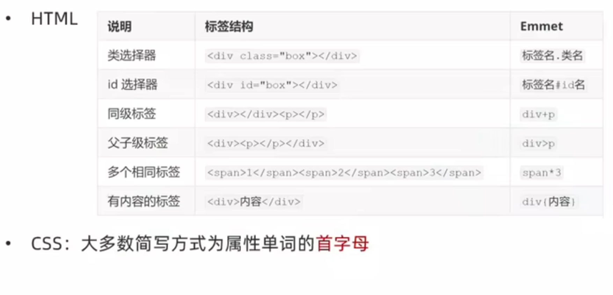

# CSS
- CSS定义：层叠样式表（Cascading Style Sheets，缩写为CSS），是一种样式表语言，用来描述HTML文档的呈现（美化内容）。
## CSS引入方式
- 内部样式表：title标签下方添加style双标签，style标签里面书写css代码（学习使用）
    ```html
    <title>CSS初体验</title>
    <style>
    /*选择器{}*/
    p {
        /*CSS属性*/
        color: red;
    }

    </style>
    ```

    示例

    ```html
    <style>
    /* 属性名和属性值成对出现 -> 键值对 */
    p {
        /* 文字颜色 */
        color: red;
        /* 字号 */
        font-size: 20px;
    } 
    </style>         
    ```

- 外部样式表（开发使用）：
  - 步骤1：CSS代码写在单独的CSS文件中（.css）
  - 步骤2：在HTML使用link标签引入
  <p></p>

  ```html
  <!-- 写在title下面 -->
  <link rel="stylesheet" href="./my.css">
  ```
- 行内样式表（配合JavaScript使用）
  - CSS 写在标签的style属性值里
  <p></p>

  ```html
  <div style="color:red; font-size: 20px;">这是div标签</div>
  ```
## 选择器
- 作用：查找标签，设置样式
- 分类：
  - 标签选择器
  - 类选择器
  - id 选择器
  - 通配符选择器
  
### 标签选择器
- 定义：使用标签名作为选择器 -> 选中同名标签设置相同的样式。
- 例如：p, h1, div, a, img......
```html
<style>
    /* 特点：选中同名标签设置相同样式，无法差异化同名标签样式 */
    p {
        /* 文字颜色 */
        color: red;
        /* 字号 */
        font-size: 20px;
    } 
</style>         
```

### 类选择器
- 作用：查找标签，差异化设置标签的显示效果
- 步骤：
  1. 定义类选择器 -> . 类名
  2. 使用类选择器 -> 标签添加 class="类名"
   ```html
   <style>
        /* 定义类选择器 */
        /* 一个类选择器可以多个标签使用 */
        .red {
            color: red;
        }
        .size{
            font-size: 50px;
        }
   </style>

   <!-- 使用类选择器 -->
   <div class="red">这是div标签</div>
   <!-- 一个标签使用多个类选择器，中间用空格隔开 -->
   <div class="red size">这是div2标签</div>
   ```
- 开发习惯：类名见名知意，多个单词可以用-连接，例如：news-hd

### id选择器
- 作用：查找标签，差异化设置标签的显示效果
- 场景：id选择器一般配合JavaScript使用，很少用来设置CSS样式
- 步骤：
  1. 定义id选择器 -> #id名
  2. 使用id选择器 -> 标签添加 id="id名"
   ```html
   <style>
        /* 定义id选择器 */
        #red {
            color: red;
        }
   </style>

   <!-- 使用id选择器 -->
   <div id="red">这是div标签</div>
   ```
- 规则：
  - 同一个id选择器在一个页面只能使用一次

### 通配符选择器
- 作用：查找页面所有标签，设置相同样式。
- 通配符选择器：*，不需要调用，浏览器自动查找页面所有标签，设置相同的样式。
```html
<style>
    * {
        color: red;
    }
</style>
```
- 使用场景：开发项目初期，清除标签默认样式时使用。

### 复合选择器
- 定义：由两个或多个基础选择器，通过不同的方式组合而成
- 作用：更准确、更高效的选择目标元素（标签）
  
#### 后代选择器(空格)
- 作用：选中某元素的后代元素
- 选择器写法：父选择器 子选择器 {CSS属性值}，父子选择器之间用空格隔开。
- 示例：
  ```html
  <style>
    div span {
        color: red;
    }
  </style>

  <span> span 标签 </span>
  <div>
    <span>这是 div 的儿子 span</span>
  </div>
  ```

#### 子代选择器(>)
- 作用：选中某元素的子代元素（最近的子级）
- 选择器写法：父选择器 > 子选择器 {CSS属性}，父子选择器之间用>隔开
- 示例
  ```html
  <style>
    div > span {
        color: red;
    }
  </style>
  ```

#### 并集选择器(,)
- 作用：选中多组标签设置相同的样式
- 选择器写法：选择器1，选择器2...选择器N {CSS属性}，选择器之间用，隔开
- 示例
  ```html
  <style>
    div,
    p,
    span {
        color: red;
    }
  </style>

  <div> div 标签</div>
  <p>p 标签</p>
  <span>span 标签</span>
  ```

#### 交集选择器(不加任何符号)
- 作用：选中同时满足多个条件的元素
- 选择器写法：选择器1选择器2 {CSS属性}，选择器之间连写，没有任何符号
- 示例
  ```html
  <style>
    p.box {
        color: red;
    }
  </style>

  <p class="box">p标签，使用了类选择器 box</p>
  <p>p 标签</p>
  <div class="box">div 标签，使用了类选择器 box</div>
  ```

### 伪类选择器(:)
- 作用：伪类表示元素<font color=tomato>状态</font>，选中元素的某个状态设置样式。
- 鼠标悬停状态：选择器:hover {CSS属性}
#### 伪类-超链接
- 超链接共有4种状态
<table>
    <thead>
        <th>选择器</th>
        <th>作用</th>
    </thead>
    <tbody>
        <tr>
            <td>:link</td>
            <td>访问前（默认蓝色）</td>
        </tr>
        <tr>
            <td>:visited</td>
            <td>访问后（默认紫色）</td>
        </tr>
        <tr>
            <td>:hover</td>
            <td>鼠标悬停</td>
        </tr>
        <tr>
            <td>:active</td>
            <td>点击时（激活）</td>
        </tr>
    </tbody>
</table>

- 提示：如果要给超链接设置以上四个状态，要按<font color=tomato>LVHA</font>的顺序书写

## 练习一：画盒子
- 目标：使用合适的选择器画盒子
- 新属性
<table>
    <thead>
        <th>属性名</th>
        <th>作用</th>
    </thead>
    <tbody>
        <tr>
            <td>width</td>
            <td>宽度</td>
        </tr>
        <tr>
            <td>height</td>
            <td>高度</td>
        </tr>
        <tr>
            <td>background-color</td>
            <td>背景色</td>
        </tr>
    </tbody>
</table>
  
- 代码示例
```html
<!DOCTYPE html>
<html lang="en">
<head>
    <meta charset="UTF-8">
    <meta name="viewport" content="width=device-width, initial-scale=1.0">
    <title>Document</title>
    <style>
        .div1{
            background-color: maroon;
            font-size: 20px;
            width: 100px;
            height: 100px;
        }
        .div2{
            background-color: blue;
            font-size: 20px;
            width: 200px;
            height: 200px;
        }  
    </style>
</head>
<body>
    <div class="div1">div1</div>
    <div class="div2">div2</div>
</body>
</html>
```

## 文字控制属性
<table>
    <thead>
        <th style="background-color: darkred; color: white;">描述</th>
        <th style="background-color: darkred; color: white;">属性</th>
    </thead>
    <tbody>
        <tr>
            <td>字体大小</td>
            <td>font-size</td>
        </tr>
        <tr>
            <td>字体粗细</td>
            <td>font-weight</td>
        </tr>
        <tr>
            <td>字体倾斜</td>
            <td>font-style</td>
        </tr>
        <tr>
            <td>行高</td>
            <td>line-height</td>
        </tr>
        <tr>
            <td>字体样式</td>
            <td>font-family</td>
        </tr>
        <tr>
            <td>字体复合属性</td>
            <td>font</td>
        </tr>
        <tr>
            <td>文本缩进</td>
            <td>text-indent</td>
        </tr>
        <tr>
            <td>文本对齐</td>
            <td>text-align</td>
        </tr>
        <tr>
            <td>修饰线</td>
            <td>text-decoration</td>
        </tr>
        <tr>
            <td>颜色</td>
            <td>color</td>
        </tr>
    </tbody>
</table>

- 提示
  - font-size: 谷歌浏览器中，文字默认大小 16px
  - font-weight: 文字粗细，正常 400 ； 加粗 700
  - font-style：正常（不倾斜）：normal ; 倾斜 ：italic
  - line-hight：数字 + 像素 ； 数字（当前标签font-size属性值倍数）
    - 行高的原理：上间距 + 文本高度 + 下间距
    - 行高-垂直居中：行高值 = 盒子高度属性值
  - font-family：属性值为字体名
    - 示例：
    ```css
    font-family: Microsoft YaHei, Heiti SC, tahoma, arial, Hiragino Sans GB, "\5B8B\4F53", sans-serif;
    <!-- 拓展：font-family属性值可以书写多个字体名，各个字体名用逗号隔开，执行顺序是从左到右依次查找 -->
    ```
    - font-family属性最后设置一个字体族名，网页开发建议使用无衬线字体(sans-serif)
  - font：设置网页文字公共样式时使用
    - 示例：
    ```html
    <style>
            div {
                <!-- font: 是否倾斜 是否加粗 字号/行高 字体； -->
                font: italic 700 30px/2 楷体；
            }
    </style>
    ```
    - 注意：字号和字体值必须书写，否则font属性不生效
  - text-indent：
    - 属性值：数字 + px 或 数字 + em（推荐：1em = 当前标签的字号大小）
  - text-align：
    - 作用：控制内容水平对齐方式
    - 属性名：text-align
    - 属性值：left(默认)；center(居中)；right(右对齐)
    - 原理：text-align的作用对象是控制内容，标签对象不动
    - 除了文字生效外，对图片也能生效
  - text-decoration：文本修饰线
    - 属性值：none，无；underline，下划线；line-through，删除线；overline，上划线
  - 颜色color
    - 颜色取值表示法
      - 颜色关键字：red, green, blue...
      - rgb表示法：r,g,b表示红绿蓝三原色，取值：0-255,eg：rgb(0,255,255)
      - rgba表示法：a表示透明度，取值：0-1,eg：rgba(0,255,255,0.3)
      - 十六进制表示法：#000000，#ffccoo，简写：#000，#fco

## CSS特性
- 继承性
  - 定义：子级默认继承父级的<font color=tomato>文字控制属性</font>
- 层叠行
  - 特点1：相同的属性会覆盖：后面的CSS属性覆盖前面的CSS属性
  - 特定2：不同的属性会叠加：不同的CSS属性都生效
- 优先级
  - 定义：也叫权重，当一个标签使用了多种选择器时，基于不同种类的选择器的匹配规则。
  - 规则：选择器选中标签的范围越大，优先级越低
  - ！important：提权功能，将优先级提到最高，慎用
  - 示例
  ```html
  <style>
  <!-- !important 提权功能，提高权重优先级到最高 -->
  * {
    color: red !important;
  }
  </style>
  ```

- 优先级-叠加计算规则
  - 从左到右依次比较选个数，同一级个数多的优先级高，如果个数相同，则向后比较<font color=tomato>（行内样式，id选择器个数，类选择器个数，标签选择器个数）</font>
  - ！important 权重最高
  - 继承权重最低
  - 如果同时触发！improtant和继承，按最低处理
  
## Emmet写法


## 背景
- 属性
<table>
    <thead>
        <th style="background-color: darkred; color: white;">描述</th>
        <th style="background-color: darkred; color: white;">属性</th>
    </thead>
    <tbody>
        <tr>
            <td>背景色</td>
            <td>background-color</td>
        </tr>
        <tr>
            <td>背景图</td>
            <td>background-image</td>
        </tr>
        <tr>
            <td>背景图平铺方式</td>
            <td>background-repeat</td>
        </tr>
        <tr>
            <td>背景图位置</td>
            <td>background-position</td>
        </tr>
        <tr>
            <td>背景图缩放</td>
            <td>background-size</td>
        </tr>
        <tr>
            <td>背景图固定</td>
            <td>background-attachment</td>
        </tr>
        <tr>
            <td>背景复合属性</td>
            <td>background</td>
        </tr>
    </tbody>
</table>

- 背景图background-image
  - 作用：使用背景图实现装饰性的图片效果
  - 属性名：background-image（bgi）
  - 属性值：url（背景图URL）
  - 注意：背景图默认平铺效果

- 背景图平铺方式background-repeat
  - 属性名：background-repeat
  - 属性值
  
    <table>
        <thead>
            <th style="background-color: darkred; color: white;">属性值</th>
            <th style="background-color: darkred; color: white;">效果</th>
        </thead>
        <tbody>
            <tr>
                <td>no-repeat</td>
                <td>不平铺</td>
            </tr>
            <tr>
                <td>repeat</td>
                <td>平铺（默认效果）</td>
            </tr>
            <tr>
                <td>repeat-x</td>
                <td>水平方向平铺</td>
            </tr>
            <tr>
                <td>repeat-y</td>
                <td>垂直方向平铺</td>
            </tr>
        </tbody>
    </table>

- 背景图位置
  - 属性名：background-position (gbp)
  - 属性值：水平方向位置 垂直方向位置
    - 关键字
        <table>
                <thead>
                    <th style="background-color: darkred; color: white;">关键字</th>
                    <th style="background-color: darkred; color: white;">位置</th>
                </thead>
                <tbody>
                    <tr>
                        <td>left</td>
                        <td>左侧</td>
                    </tr>
                    <tr>
                        <td>right</td>
                        <td>右侧</td>
                    </tr>
                    <tr>
                        <td>center</td>
                        <td>居中</td>
                    </tr>
                    <tr>
                        <td>top</td>
                        <td>顶部</td>
                    </tr>
                    <tr>
                        <td>bottom</td>
                        <td>底部</td>
                    </tr>
                </tbody>
            </table>
    - 坐标（数字 + px，正负都可以）
  - 注意
    - 关键字取值方式写法，可以颠倒取值顺序
    - 可以只写一个关键字，另一个方向默认为居中；数字只写一个值表示水平方向，垂直方向为居中

- 背景图缩放
  - 作用：设置背景图大小
  - 属性名：background-size
  - 常用属性值：
    - 关键字：
      - cover：等比缩放背景图片以完全覆盖背景区，可能背景图片部分看不见
      - contain：等比缩放背景图片以完全装入背景区，可能背景区部分空白
    - 百分比：根据盒子尺寸计算图片大小
    - 数字 + 单位（比如：px）

- 背景图固定
  - 作用：背景不会随着元素的内容滚动
  - 属性名：background-attachment（bga）
  - 属性值：fixed

- 背景复合属性
  - 属性名：background (bg)
  - 属性值：背景色 背景图 背景图平铺方式 背景图位置/背景图缩放 背景图固定（<font color=tomato>空格</font>隔开各个属性值，<font color=tomato>不区分顺序</font>）


## 显示模式
- 块级元素
  - 独占一行
  - 宽度默认是父级的100%
  - 添加宽高属性生效
- 行内元素
  - 一行可以有多个
  - 宽高由内容决定
  - 添加宽高属性不生效
- 行内块元素
  - 比如：&lt;img&gt;
  - 一行共存多个
  - 宽高由内容决定
  - 添加宽高属性生效
- 转换显示模式
  - 属性名：display
  - 属性值：
  <table>
    <thead>
        <th style="background-color: darkred; color: white;">属性值</th>
        <th style="background-color: darkred; color: white;">效果</th>
    </thead>
    <tbody>
        <tr>
            <td>block</td>
            <td>块级</td>
        </tr>
        <tr>
            <td>inline-block</td>
            <td>行内块</td>
        </tr>
        <tr>
            <td>inline</td>
            <td>行内（一般不用）</td>
        </tr>
    </tbody>
   </table>