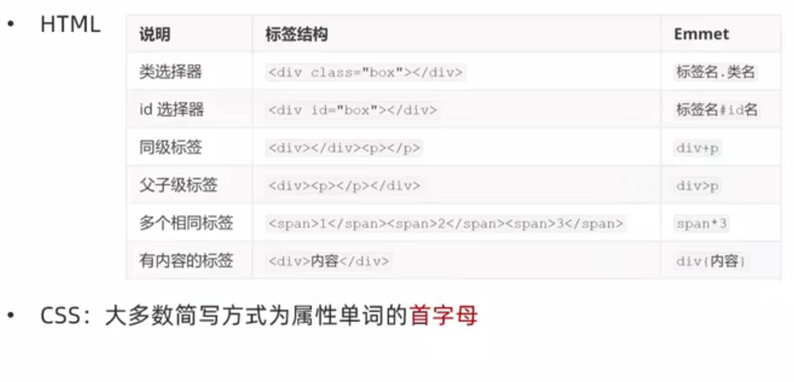

# CSS
- CSS定义：层叠样式表（Cascading Style Sheets，缩写为CSS），是一种样式表语言，用来描述HTML文档的呈现（美化内容）。
## CSS引入方式
- 内部样式表：title标签下方添加style双标签，style标签里面书写css代码（学习使用）
    ```html
    <title>CSS初体验</title>
    <style>
    /*选择器{}*/
    p {
        /*CSS属性*/
        color: red;
    }

    </style>
    ```

    示例

    ```html
    <style>
    /* 属性名和属性值成对出现 -> 键值对 */
    p {
        /* 文字颜色 */
        color: red;
        /* 字号 */
        font-size: 20px;
    } 
    </style>         
    ```

- 外部样式表（开发使用）：
  - 步骤1：CSS代码写在单独的CSS文件中（.css）
  - 步骤2：在HTML使用link标签引入
  <p></p>

  ```html
  <!-- 写在title下面 -->
  <link rel="stylesheet" href="./my.css">
  ```
- 行内样式表（配合JavaScript使用）
  - CSS 写在标签的style属性值里
  <p></p>

  ```html
  <div style="color:red; font-size: 20px;">这是div标签</div>
  ```
## 选择器
- 作用：查找标签，设置样式
- 分类：
  - 标签选择器
  - 类选择器
  - id 选择器
  - 通配符选择器
  
### 标签选择器
- 定义：使用标签名作为选择器 -> 选中同名标签设置相同的样式。
- 例如：p, h1, div, a, img......
```html
<style>
    /* 特点：选中同名标签设置相同样式，无法差异化同名标签样式 */
    p {
        /* 文字颜色 */
        color: red;
        /* 字号 */
        font-size: 20px;
    } 
</style>         
```

### 类选择器
- 作用：查找标签，差异化设置标签的显示效果
- 步骤：
  1. 定义类选择器 -> . 类名
  2. 使用类选择器 -> 标签添加 class="类名"
   ```html
   <style>
        /* 定义类选择器 */
        /* 一个类选择器可以多个标签使用 */
        .red {
            color: red;
        }
        .size{
            font-size: 50px;
        }
   </style>

   <!-- 使用类选择器 -->
   <div class="red">这是div标签</div>
   <!-- 一个标签使用多个类选择器，中间用空格隔开 -->
   <div class="red size">这是div2标签</div>
   ```
- 开发习惯：类名见名知意，多个单词可以用-连接，例如：news-hd

### id选择器
- 作用：查找标签，差异化设置标签的显示效果
- 场景：id选择器一般配合JavaScript使用，很少用来设置CSS样式
- 步骤：
  1. 定义id选择器 -> #id名
  2. 使用id选择器 -> 标签添加 id="id名"
   ```html
   <style>
        /* 定义id选择器 */
        #red {
            color: red;
        }
   </style>

   <!-- 使用id选择器 -->
   <div id="red">这是div标签</div>
   ```
- 规则：
  - 同一个id选择器在一个页面只能使用一次

### 通配符选择器
- 作用：查找页面所有标签，设置相同样式。
- 通配符选择器：*，不需要调用，浏览器自动查找页面所有标签，设置相同的样式。
```html
<style>
    * {
        color: red;
    }
</style>
```
- 使用场景：开发项目初期，清除标签默认样式时使用。

### 复合选择器
- 定义：由两个或多个基础选择器，通过不同的方式组合而成
- 作用：更准确、更高效的选择目标元素（标签）
  
#### 后代选择器(空格)
- 作用：选中某元素的后代元素
- 选择器写法：父选择器 子选择器 {CSS属性值}，父子选择器之间用空格隔开。
- 示例：
  ```html
  <style>
    div span {
        color: red;
    }
  </style>

  <span> span 标签 </span>
  <div>
    <span>这是 div 的儿子 span</span>
  </div>
  ```

#### 子代选择器(>)
- 作用：选中某元素的子代元素（最近的子级）
- 选择器写法：父选择器 > 子选择器 {CSS属性}，父子选择器之间用>隔开
- 示例
  ```html
  <style>
    div > span {
        color: red;
    }
  </style>
  ```

#### 相邻选择器(+)
- 作用：选中某元素的同级相邻的元素(最近的一个)
- 选择器写法：选择器 + 兄弟选择器{CSS属性}
```html
<style>
    h1 + p {    /*相邻兄弟选择器*/
        color:pink;
    }
</style>
```

#### 通用兄弟选择器(~)
- 作用：选中某元素同级的全部元素
- 选择器写法：选择器 ~ 兄弟选择器{CSS属性}
```html
<style>
    h1 ~ p {    /*通用兄弟选择器*/
        color:pink;
    }
</style>
```
#### 属性选择器
- 作用；一般是给标签设置专用属性，再通过这些属性单词和值来进行对应的标签样式设置
- 选择器写法：标签单词[属性名='值']{CSS样式}
- 场景：一般是用在表单的input标签上

#### 并集选择器(,)
- 作用：选中多组标签设置相同的样式
- 选择器写法：选择器1，选择器2...选择器N {CSS属性}，选择器之间用，隔开
- 示例
  ```html
  <style>
    div,
    p,
    span {
        color: red;
    }
  </style>

  <div> div 标签</div>
  <p>p 标签</p>
  <span>span 标签</span>
  ```

#### 交集选择器(不加任何符号)
- 作用：选中同时满足多个条件的元素
- 选择器写法：选择器1选择器2 {CSS属性}，选择器之间连写，没有任何符号
- 示例
  ```html
  <style>
    p.box {
        color: red;
    }
  </style>

  <p class="box">p标签，使用了类选择器 box</p>
  <p>p 标签</p>
  <div class="box">div 标签，使用了类选择器 box</div>
  ```

### 伪类选择器(:)
- 作用：伪类表示元素<font color=tomato>状态</font>，选中元素的某个状态设置样式。
- 鼠标悬停状态：选择器:hover {CSS属性}
#### 伪类-表单
<table>
    <thead>
        <th>选择器</th>
        <th>作用</th>
    </thead>
    <tbody>
        <tr>
            <td>:checked</td>
            <td>被勾选的选框</td>
        </tr>
        <tr>
            <td>待添加</td>
            <td>待添加</td>
        </tr>
        <tr>
            <td>待添加</td>
            <td>待添加</td>
        </tr>
        <tr>
            <td>待添加</td>
            <td>待添加</td>
        </tr>
        <tr>
            <td>待添加</td>
            <td>待添加</td>
        </tr>
    </tbody>
</table>
#### 伪类-超链接
- 超链接共有4种状态
<table>
    <thead>
        <th>选择器</th>
        <th>作用</th>
    </thead>
    <tbody>
        <tr>
            <td>:link</td>
            <td>访问前（默认蓝色）</td>
        </tr>
        <tr>
            <td>:visited</td>
            <td>访问后（默认紫色）</td>
        </tr>
        <tr>
            <td>:hover</td>
            <td>鼠标悬停</td>
        </tr>
        <tr>
            <td>:active</td>
            <td>点击时（激活）</td>
        </tr>
        <tr>
            <td>:focus</td>
            <td>聚焦时（激活）</td>
        </tr>
    </tbody>
</table>

- 提示：如果要给超链接设置以上四个状态，要按<font color=tomato>LVHA</font>的顺序书写

#### 结构伪类选择器

- 作用：根据元素的<font color=tomato>结构关系</font>查找元素

<table>
    <thead>
        <th>选择器</th>
        <th>说明</th>
    </thead>
    <tbody>
        <tr>
            <td>E:first-child</td>
            <td>查找第一个E元素</td>
        </tr>
        <tr>
            <td>E:last-child</td>
            <td>查找最后一个E元素</td>
        </tr>
        <tr>
            <td>E:nth-child(N)</td>
            <td>查找第N个E元素(第一个元素N为1)</td>
        </tr>
        <tr>
            <td>E:nth-child(公式)</td>
            <td>根据元素的结构关系查找多个元素</td>
        </tr>
    </tbody>
</table>

- 示例
```html
<style>
    li:first-child {
        background-color: green;
    }
</style>

<!-- ：nth-child(公式) -->
公式详解：
偶数标签：              2n
奇数标签：              2n+1;2n-1
找到5的倍数的标签：      5n
找到第5个以后的标签：    n+5
找到第5个以前的标签：    -n+5

<style>
    li:nth-child(2n) {
        background-color: green;
    }
</style>
```

#### 伪元素选择器
- 作用：创建虚拟元素（伪元素），用来摆放装饰性内容

<table>
    <thead>
        <th>选择器</th>
        <th>说明</th>
    </thead>
    <tbody>
        <tr>
            <td>E::before</td>
            <td>在E元素里面最前面添加一个伪元素</td>
        </tr>
        <tr>
            <td>E::after</td>
            <td>在E元素里面最后面添加一个伪元素</td>
        </tr>
    </tbody>
</table>

示例；
```html
<style> 
    div::before {
        conntent: "老鼠";

        width: 100px;
        height: 100px;
        background-color: brown;
        display: block;
    }

    div::after {
        conntent: "大米";

        width: 100px;
        height: 100px;
        background-color: brown;
        display: block;
    }
</style>

# 伪元素默认行内元素
# 必须有content属性
```

## 练习一：画盒子
- 目标：使用合适的选择器画盒子
- 新属性
<table>
    <thead>
        <th>属性名</th>
        <th>作用</th>
    </thead>
    <tbody>
        <tr>
            <td>width</td>
            <td>宽度</td>
        </tr>
        <tr>
            <td>height</td>
            <td>高度</td>
        </tr>
        <tr>
            <td>background-color</td>
            <td>背景色</td>
        </tr>
    </tbody>
</table>
  
- 代码示例
```html
<!DOCTYPE html>
<html lang="en">
<head>
    <meta charset="UTF-8">
    <meta name="viewport" content="width=device-width, initial-scale=1.0">
    <title>Document</title>
    <style>
        .div1{
            background-color: maroon;
            font-size: 20px;
            width: 100px;
            height: 100px;
        }
        .div2{
            background-color: blue;
            font-size: 20px;
            width: 200px;
            height: 200px;
        }  
    </style>
</head>
<body>
    <div class="div1">div1</div>
    <div class="div2">div2</div>
</body>
</html>
```

## 文字控制属性
<table>
    <thead>
        <th style="background-color: darkred; color: white;">描述</th>
        <th style="background-color: darkred; color: white;">属性</th>
    </thead>
    <tbody>
        <tr>
            <td>字体大小</td>
            <td>font-size</td>
        </tr>
        <tr>
            <td>字体粗细</td>
            <td>font-weight</td>
        </tr>
        <tr>
            <td>字体倾斜</td>
            <td>font-style</td>
        </tr>
        <tr>
            <td>行高</td>
            <td>line-height</td>
        </tr>
        <tr>
            <td>字体样式</td>
            <td>font-family</td>
        </tr>
        <tr>
            <td>字体复合属性</td>
            <td>font</td>
        </tr>
        <tr>
            <td>文本缩进</td>
            <td>text-indent</td>
        </tr>
        <tr>
            <td>文本对齐</td>
            <td>text-align</td>
        </tr>
        <tr>
            <td>修饰线</td>
            <td>text-decoration</td>
        </tr>
        <tr>
            <td>颜色</td>
            <td>color</td>
        </tr>
    </tbody>
</table>

- 提示
  - font-size: 谷歌浏览器中，文字默认大小 16px
  - font-weight: 文字粗细，正常 400 ； 加粗 700
  - font-style：正常（不倾斜）：normal ; 倾斜 ：italic
  - line-hight：数字 + 像素 ； 数字（当前标签font-size属性值倍数）
    - 行高的原理：上间距 + 文本高度 + 下间距
    - 行高-垂直居中：行高值 = 盒子高度属性值
  - font-family：属性值为字体名
    - 示例：
    ```css
    font-family: Microsoft YaHei, Heiti SC, tahoma, arial, Hiragino Sans GB, "\5B8B\4F53", sans-serif;
    <!-- 拓展：font-family属性值可以书写多个字体名，各个字体名用逗号隔开，执行顺序是从左到右依次查找 -->
    ```
    - font-family属性最后设置一个字体族名，网页开发建议使用无衬线字体(sans-serif)
  - font：设置网页文字公共样式时使用
    - 示例：
    ```html
    <style>
            div {
                <!-- font: 是否倾斜 是否加粗 字号/行高 字体； -->
                font: italic 700 30px/2 楷体；
            }
    </style>
    ```
    - 注意：字号和字体值必须书写，否则font属性不生效
  - text-indent：
    - 属性值：数字 + px 或 数字 + em（推荐：1em = 当前标签的字号大小）
  - text-align：
    - 作用：控制内容水平对齐方式
    - 属性名：text-align
    - 属性值：left(默认)；center(居中)；right(右对齐)
    - 原理：text-align的作用对象是控制内容，标签对象不动
    - 除了文字生效外，对图片也能生效
  - text-decoration：文本修饰线
    - 属性值：none，无；underline，下划线；line-through，删除线；overline，上划线
  - 颜色color
    - 颜色取值表示法
      - 颜色关键字：red, green, blue...
      - rgb表示法：r,g,b表示红绿蓝三原色，取值：0-255,eg：rgb(0,255,255)
      - rgba表示法：a表示透明度，取值：0-1,eg：rgba(0,255,255,0.3)
      - 十六进制表示法：#000000，#ffccoo，简写：#000，#fco

## CSS特性
- 继承性
  - 定义：子级默认继承父级的<font color=tomato>文字控制属性</font>
- 层叠行
  - 特点1：相同的属性会覆盖：后面的CSS属性覆盖前面的CSS属性
  - 特定2：不同的属性会叠加：不同的CSS属性都生效
- 优先级
  - 定义：也叫权重，当一个标签使用了多种选择器时，基于不同种类的选择器的匹配规则。
  - 规则：选择器选中标签的范围越大，优先级越低
  - ！important：提权功能，将优先级提到最高，慎用
  - 示例
  ```html
  <style>
  <!-- !important 提权功能，提高权重优先级到最高 -->
  * {
    color: red !important;
  }
  </style>
  ```

- 优先级-叠加计算规则
  - 从左到右依次比较选个数，同一级个数多的优先级高，如果个数相同，则向后比较<font color=tomato>（行内样式，id选择器个数，类选择器个数，标签选择器个数）</font>
  - ！important 权重最高
  - 继承权重最低
  - 如果同时触发！improtant和继承，按最低处理
  
## Emmet写法


## 背景
- 属性
<table>
    <thead>
        <th style="background-color: darkred; color: white;">描述</th>
        <th style="background-color: darkred; color: white;">属性</th>
    </thead>
    <tbody>
        <tr>
            <td>背景色</td>
            <td>background-color</td>
        </tr>
        <tr>
            <td>背景图</td>
            <td>background-image</td>
        </tr>
        <tr>
            <td>背景图平铺方式</td>
            <td>background-repeat</td>
        </tr>
        <tr>
            <td>背景图位置</td>
            <td>background-position</td>
        </tr>
        <tr>
            <td>背景图缩放</td>
            <td>background-size</td>
        </tr>
        <tr>
            <td>背景图固定</td>
            <td>background-attachment</td>
        </tr>
        <tr>
            <td>背景复合属性</td>
            <td>background</td>
        </tr>
    </tbody>
</table>

- 背景图background-image
  - 作用：使用背景图实现装饰性的图片效果
  - 属性名：background-image（bgi）
  - 属性值：url（背景图URL）
  - 注意：背景图默认平铺效果

- 背景图平铺方式background-repeat
  - 属性名：background-repeat
  - 属性值
  
    <table>
        <thead>
            <th style="background-color: darkred; color: white;">属性值</th>
            <th style="background-color: darkred; color: white;">效果</th>
        </thead>
        <tbody>
            <tr>
                <td>no-repeat</td>
                <td>不平铺</td>
            </tr>
            <tr>
                <td>repeat</td>
                <td>平铺（默认效果）</td>
            </tr>
            <tr>
                <td>repeat-x</td>
                <td>水平方向平铺</td>
            </tr>
            <tr>
                <td>repeat-y</td>
                <td>垂直方向平铺</td>
            </tr>
        </tbody>
    </table>

- 背景图位置
  - 属性名：background-position (gbp)
  - 属性值：水平方向位置 垂直方向位置
    - 关键字
        <table>
                <thead>
                    <th style="background-color: darkred; color: white;">关键字</th>
                    <th style="background-color: darkred; color: white;">位置</th>
                </thead>
                <tbody>
                    <tr>
                        <td>left</td>
                        <td>左侧</td>
                    </tr>
                    <tr>
                        <td>right</td>
                        <td>右侧</td>
                    </tr>
                    <tr>
                        <td>center</td>
                        <td>居中</td>
                    </tr>
                    <tr>
                        <td>top</td>
                        <td>顶部</td>
                    </tr>
                    <tr>
                        <td>bottom</td>
                        <td>底部</td>
                    </tr>
                </tbody>
            </table>
    - 坐标（数字 + px，正负都可以）
  - 注意
    - 关键字取值方式写法，可以颠倒取值顺序
    - 可以只写一个关键字，另一个方向默认为居中；数字只写一个值表示水平方向，垂直方向为居中

- 背景图缩放
  - 作用：设置背景图大小
  - 属性名：background-size
  - 常用属性值：
    - 关键字：
      - cover：等比缩放背景图片以完全覆盖背景区，可能背景图片部分看不见
      - contain：等比缩放背景图片以完全装入背景区，可能背景区部分空白
    - 百分比：根据盒子尺寸计算图片大小
    - 数字 + 单位（比如：px）

- 背景图固定
  - 作用：背景不会随着元素的内容滚动
  - 属性名：background-attachment（bga）
  - 属性值：fixed

- 背景复合属性
  - 属性名：background (bg)
  - 属性值：背景色 背景图 背景图平铺方式 背景图位置/背景图缩放 背景图固定（<font color=tomato>空格</font>隔开各个属性值，<font color=tomato>不区分顺序</font>）


## 显示模式
- 块级元素
  - 独占一行
  - 宽度默认是父级的100%
  - 添加宽高属性生效
- 行内元素
  - 一行可以有多个
  - 宽高由内容决定
  - 添加宽高属性不生效
- 行内块元素
  - 比如：&lt;img&gt;
  - 一行共存多个
  - 宽高由内容决定
  - 添加宽高属性生效
- 转换显示模式
  - 属性名：display
  - 属性值：
  <table>
    <thead>
        <th style="background-color: darkred; color: white;">属性值</th>
        <th style="background-color: darkred; color: white;">效果</th>
    </thead>
    <tbody>
        <tr>
            <td>block</td>
            <td>块级</td>
        </tr>
        <tr>
            <td>inline-block</td>
            <td>行内块</td>
        </tr>
        <tr>
            <td>inline</td>
            <td>行内（一般不用）</td>
        </tr>
    </tbody>
   </table>

## 盒子模型
- 作用：布局网页，摆放盒子和内容
- 组成：
  - 内容区域：width & height
  - 内边距：padding（出现在内容于盒子边缘之间）
  - 边框线：border
  - 外边距：margin（出现在盒子外面）
- 图例

    

### 盒子模型-边框线
- 属性名：border(bd)
- 属性值：边框线粗细、线条样式、颜色（不区分顺序）
- 常用线条样式：
  
    <table>
        <thead>
            <th style="background-color: darkred; color: white;">属性值</th>
            <th style="background-color: darkred; color: white;">线条样式</th>
        </thead>
        <tbody>
            <tr>
                <td>solid</td>
                <td>实线</td>
            </tr>
            <tr>
                <td>dashed</td>
                <td>虚线</td>
            </tr>
            <tr>
                <td>dotted</td>
                <td>点线</td>
            </tr>
        </tbody>
    </table>

- 设置单方向边框线
  - 属性名：border-方位名词
  - 属性值：边框线粗细，样式，颜色
  - 代码示例
  
  ```html
  <style>
    div {
        border-top: 2px solid red;
        border-right: 3px dashed green;
        border-bottom: 4px dotted blue;
        border-left: 5px solid orange;

        width: 200px;
        height: 200px;
        background-color: pink;
    }
  </style>
  ```

### 盒子模型-内边距
- 作用：设置内容与盒子边缘之间的距离
- 属性名：padding/padding-方位名词
- 代码示例
```html
<style>
    div {
        /* 四个方向 内边距相同 */
        padding： 30px;

        /* 单独设置一个方向内边距 */
        padding-top: 10px;
        padding-right: 20px;
        padding-bottom: 40px;
        padding-left: 80px;

        width: 200px;
        height: 200px;
        background-color: pink;
    }
</style>

<!-- padding 简化代码-多值写法 -->

<style>
    div {
        width: 200px;
        height: 200px;
        background-color: pink;

        /* 四值：上 右 下 左 */
        padding: 10px 20px 40px 80px;

        /* 三值：上 左右 下 */
        padding: 10px 40px 80px;

        /* 两值：上下 左右 */
        padding: 10px 80px;
        /* 一个值表示四周数值一样 */

        /* 记忆方法：从上开始顺时针转一圈，如果当前方向没有数值，取值跟对面一样。*/
    }
</style>
```

### 盒子模型-尺寸计算
- 默认情况
  - 盒子尺寸 = 内容尺寸 + border尺寸 + 内边距尺寸

```html
<style>

    /* 启动內减模式 */
    div {
        width: 200px;
        height: 200px;
        background-color: pink;

        /* 內减模式：不需要手动减法，浏览器自动计算 */
        box-sizing: border-box;
    }
</style>
```

### 盒子模型-外边距
- 作用：拉开两个盒子之间的距离
- 属性名：margin
- 提示：与padding属性值写法、含义相同
- 版心居中效果：
  - 上下数值随意，左右数值：auto，浏览器自适应计算

- 合并现象
  - 场景：垂直排列的兄弟元素，上下margin会合并
  - 现象；取两个margin中的较大值生效

- 塌陷问题
  - 场景：父子级的标签，子级的添加，上边距会产生塌陷问题
  - 现象：导致父级一起向下移动
  - 解决方案：
    - 取消子级margin，父级设置padding
    - 父级设置overflow:hidden;
    - 父级设置：border-top

### 盒子模型-元素溢出
- 作用：控制溢出元素的内容的显示方式
- 属性名；overflow
- 属性值：
  
    <table>
            <thead>
                <th style="background-color: darkred; color: white;">属性值</th>
                <th style="background-color: darkred; color: white;">效果</th>
            </thead>
            <tbody>
                <tr>
                    <td>hidden</td>
                    <td>溢出隐藏</td>
                </tr>
                <tr>
                    <td>scroll</td>
                    <td>溢出滚动(无论是否溢出，都显示滚动条位置)</td>
                </tr>
                <tr>
                    <td>auto</td>
                    <td>溢出滚动(溢出才显示滚动条位置)</td>
                </tr>
            </tbody>
        </table>
### 盒子模型-圆角
- 作用：设置元素的外边框为圆角
- 属性名：border-radius
- 属性值：数字+px / 百分比 （半径）
```html
<style>
    div {
        margin: 50px auto;
        width: 200px;
        height: 200px;
        background-color: orange;

        /* border-redius: 20px; */
        /* 记忆：从左上角顺时针赋值，没有取值的角与对角取值相同 */

        border-radius: 10px 20px 40px 80px;
    }
</style>
```
- 常见应用-正圆形状
  - 给正方形盒子设置圆角属性值为宽高的一半/50%
- 常见应用-胶囊形状
  - 给长方形盒子设置圆角属性值为盒子高度的一半

### 盒子模型-阴影
- 作用：给元素设置阴影效果
- 属性名：box-shadow
- 属性值：x轴偏移量 y轴偏移量 模糊半径 扩散半径 颜色 内外阴影
- 注意：
  - x轴偏移量和y轴偏移量必须书写
  - 默认是外阴影，内阴影需要添加inset


## 行内元素-内外边距问题
- 场景：行内元素添加margin和padding，无法改变元素垂直位置
- 解决方法：给行内元素添加line-height可以改变垂直位置
```html
<style>
    span {
        /* margin 和 padding 属性，无法改变垂直位置 */
        margin: 50px;
        padding: 20px;

        /* 行高可以改变垂直位置 */
        line-height: 100px;
    }
</style>
```
## 清除默认样式
- 清除标签默认样式，比如：默认的内外边距 
- 京东代码示例：
```html
<style>
    /* 取消边距样式*/
    * {
        padding: 0px;
        margin: 0px;
        /*可以直接统一內减模式*/
        box-sizing: border-box;
    }

    /* 取消列表样式*/
    li {
        list-style: none;
    }
</style>
```
## 标准流
- 定义：标准流也叫文档流，指的是标签在页面中默认的排布规则 例如:块元素独占一行，行内元素可以一行显示多个。

 ## 浮动
- 作用：让块级元素水平排列
- 属性名：float
- 属性值：left 左对齐；right 右对齐；
```html
<head>
    <style>
    /* 浮动特点：顶对齐；具备行内块显示模式
    浮动的盒子会脱标 */
        .one {
            width: 100px;
            height: 100px;
            background-color: brown;

            float: left;
        }

        .two {
            width: 200px;
            height: 200px;
            background-color: orange;

            /* float: left; */
            float: right;
        }
    </style>
</head>
<body>
    <div class="one">one</div>
    <div class="two">two</div>
</body>
```
### 清除浮动
- 场景：浮动元素会脱标，如果父级没有高度，子级无法撑开父级高度（可能导致页面布局错乱）
- 解决方法：清除浮动（清除浮动带来的影响）
  - 方法1：额外标签法
  <br>在父元素内容的最后添加一个块级元素，设置CSS属性clear: both
  - 方法2：单伪元素法
  ```css
  .clearfix :after {
    content: "";
    display: block;
    clear: both;
  }
  ```
  - 方法3：双伪元素法（推荐）
  ```css
  /* before 解决外边距塌陷问题 */
  /* after 清除浮动 */
  .clearfix :: before,
  .clearfix :: after {
    content: "";
    display: table;
  }

  .clearfix :: after {
    clear: both;
  }
  ```
  - 方法4：overflow
  <br> 父级元素添加CSS属性 overflow: hidden
  <br> 解决原理：利用overflow：hidden这个属性，使浏览器检查元素的高，大小，从而避免一开始的，有无浏览器没见检测外层块元素的高度，导致的子级无法撑开父级，从而布局混乱。

- 拓展：浮动本质作用是实现图文混排效果

## Flex布局
### Flex-认识
- 概述：Flex 布局也叫弹性布局，是浏览器提倡的布局模型，非常适合结构化布局，提供了强大的空间分布和对齐能力。 Flex模型不会产生浮动布局中的脱标现象，布局网页更简单，更灵活。

### Flex-组成
- 设置方式：给父级元素设置 <font color=tomato>display: flex</font>，子元素可以<font color=tomato>自动挤压或拉伸</font>
- 组成部分：
  - 弹性容器(父级元素)
  - 弹性盒子（弹性盒子沿着主轴方向排列）—— (子级元素)
  - 主轴：默认在水平方向
  - 侧轴/交叉轴：默认在垂直方向

### Flex-布局
```css
/* 创建flex容器 */
display: flex;

/* 主轴对齐方式 */
justify-content

/* 侧轴对齐方式 */
align-items

/* 某个弹性盒子侧轴对齐方式 */
align-self

/* 改变主轴方向 */
flex-direction

/* 弹性伸缩比*/
flex

/* 弹性盒子换行 */
flex-wrap

/* 行对齐方式 */
align-content
```

- 主轴对齐方式（justify-content）
<table>
    <thead>
        <th style="background-color: darkred; color: white;">属性值</th>
        <th style="background-color: darkred; color: white;">效果</th>
    </thead>
    <tbody>
        <tr>
            <td>flex-start</td>
            <td>默认值，弹性盒子从起点开始依次排列</td>
        </tr>
        <tr>
            <td>flex-end</td>
            <td>弹性盒子从终点开始依次排列</td>
        </tr>
        <tr>
            <td><strong>center</strong></td>
            <td>弹性盒子沿主轴居中排列</td>
        </tr>
        <tr>
            <td><strong>space-between</strong></td>
            <td>弹性盒子沿主轴均匀排列，空白间距均分在弹性盒子之间</td>
        </tr>
        <tr>
            <td><strong>space-around</strong></td>
            <td>弹性盒子沿主轴均匀排列，空白间距均分在弹性盒子两侧</td>
        </tr>
        <tr>
            <td><strong>space-evenly</strong></td>
            <td>弹性盒子沿主轴均匀排列，弹性盒子与容器之间间距相等</td>
        </tr>
    </tbody>
</table>

- 侧轴对齐方式
  - 属性名：
    - align-items: 当前弹性容器内所有弹性盒子的侧轴对齐方式（给弹性容器设置）
    - align-self: 单独控制某个弹性盒子的侧轴对齐方式（给弹性盒子设置）
    <p></p>
    <table>
        <thead>
            <th style="background-color: darkred; color: white;">属性值</th>
            <th style="background-color: darkred; color: white;">效果</th>
        </thead>
        <tbody>
            <tr>
                <td>stretch</td>
                <td>弹性盒子沿着侧轴线被拉甚至铺满容器（弹性盒子没有设置侧轴方向尺寸则默认拉伸）</td>
            </tr>
            <tr>
                <td>center</td>
                <td>弹性盒子沿侧轴居中排列</td>
            </tr>
            <tr>
                <td>flex-start</td>
                <td>弹性盒子从起点开始依次排列</td>
            </tr>
            <tr>
                <td>flex-end</td>
                <td>弹性盒子从终点开始依次排列</td>
            </tr>
        </tbody>
    </table>

- 修改主轴方向
  - 主轴默认水平方向，侧轴默认垂直方向
  - 属性名：flex-direction
  - 常用属性值：column 垂直方向，从上向下

- 弹性伸缩比
  - 作用：控制弹性盒子的主轴方向的尺寸
  - 属性名：flex
  - 默认情况下，主轴方向的尺寸靠内容撑开，侧轴的尺寸默认拉伸
  - 属性值：整数数字，表示占用父级剩余尺寸的份数

- 弹性盒子换行
  - 作用：弹性盒子可以自动挤压或拉伸，默认情况下，所有盒子都在一行显示
  - 属性名：flex-wrap
  - 属性值
    - wrap：换行
    - nowarp：不换行（默认）

- 行对其方式
- 属性名：align-content
- 属性值：与主轴对齐方式相同
- 总结：相当于侧轴版的主轴对齐

## 定位
- 作用：灵活的改变盒子在网页中的位置

- 实现过程：
  - 定位模式：position
  - 边偏移：设置盒子的位置
    - 水平方向的位置: left、right
    - 垂直方向的位置：top、bottom

- 相对定位：position - relation
  - 特点：
    - 改变位置的参照物是 自己原来的位置
    - 不脱标，占位
    - 标签模式特点不变，原来是block，之后还是

- 绝对定位：position - absolute
  - 让一个块级元素，始终在父级元素的相对位置的方法
    - 子级绝对定位，父级相对定位
  - 特点：
    - 脱标，不占位
    - 参照物：先找最近的已经定位的祖先元素，如果所有祖先元素都没有定位，参照浏览器可视区改位置
    - 标签模式自动具备行内块特点

- 定位居中
  - 实现步骤：
    - 绝对定位
    - 水平、垂直边偏移为50%
    - 子级向左，上移动自身尺寸的一半
      - 方法1：左、上外边距margin-尺寸的一半
      - 方法2：transform: translate(-50%,-50%)

- 固定定位：position-fixed
  - 场景：元素的位置在网页滚动时不会改变
  - 特点：
    - 脱标，不占位
    - 改变位置的参照物：浏览器窗口
    - 加宽度生效，固定定位后，元素的显示模式变为行内块特点

- 堆叠层级 z-index
  - 默认效果：按照标签书写的顺序，后来者居上
  - 作用：设置定位元素的层级顺序，改变定位元素的显示顺序
  - z-index：取值参数是整数，默认为0，取值越大，显示顺序越靠上


## CSS精灵
- 原理：
  - 将众多小图集成在一张图片上，通过调整盒子大小和位置，来显示对应的小图

- 步骤：
  - 创建盒子，盒子尺寸与小图尺寸相同
  - 设置盒子背景图为精灵图
    - background-image: url()
  - 添加background-position属性，改变背景图位置
    - 取负数坐标为background-position属性值（向左上移动图片位置）

- 好处
  - 减少和服务器的交互次数，提升效率

## 字体图标
- 概念：
  - 字体图片：展示的是图片，本质是字体，可以用字体的属性对其进行设置

- 作用：在网页中添加简单的、颜色单一的小图标（仅使用纯色简单图标）

- 字体图片-下载字体
  - iconfont图标库：https://www.iconfont.cn/
  - 下载字体
    - 登录 -> 素材库 ->官方图标库 -> 进入图标库 ->选图标，加入购物车 -> 购物车，添加至项目，确定 -> 下载至本地使用

- 字体图标 - 使用字体
  - 引入字体样式表(iconfont.css)
  ```html
  <link rel="stylesheet" href="./iconfont/iconfont.css">
  ```
  - 标签使用字体图标类名
    - iconfont: 字体图标基本样式(字体名，字体大小等等)
    - icon-xxx: 图标对应的类名
    - `<span class="iconfont icon-xxx"></span>`
    ```html
    <style>
        .iconfont {
            font-size: 200px;
            color: orange;
        }
    </style>
    ```

- 字体图标 - 上传矢量图
  - 作用：项目特有的图标(.svg文件)上传到iconfont图标库，生成字体

## CSS修饰属性
- 垂直对齐方式 
  - 属性名：vertical-align
  - 属性值：
    - baseline：基线对齐（默认）
    - top：顶部对齐
    - middle：居中对齐
    - bottom：底部对齐
  - 注意：
    - vertical-align的属性填写在最高内容的标签中
    - 浏览器把行内块、行内标签当作文字处理，默认按基线对齐

- 过渡 transtion
  - 作用：可以为一个元素在不同状态之间切换的时候添加过渡效果
  - 属性名：transtion
  - 属性值：过渡的属性 花费时间(s)
  - 提示：
    - 过渡的属性可以是具体的CSS属性
    - 也可以为all（两个状态属性值不同的所有属性，都产生过渡效果）
    - transtion设置给元素本身

- 透明度 opacity
  - 作用：设置整个元素的透明度(包含背景和内容)
  - 属性名：opacity
  - 属性值：0-1
    - 0：完全透明（元素不可见）
    - 1：不透明
    - 0-1之间小数：半透明

- 鼠标类型 cursor
  - 作用：鼠标悬停在元素上时指针显示样式
  - 属性名：cursor
  - 属性值：
    - default：默认值，通常是箭头
    - pointer：小手效果，提示用户可以点击
    - text：工字形，提示用户可以选择文字
    - move：十字光标，提示用户可以移动

## 平面转换
- 属性名：transform
- 作用：为元素添加动态效果，一般与过渡配合使用
- 概念：改变盒子在平面内的形态（位移、旋转、缩放、倾斜）

### 平面转换-平移
- 属性：
  - `transform: translate(x轴移动距离, y轴移动距离);`

- 取值：
  - 像素单位数值
  - 百分比（参照盒子自身尺寸计算结果）
  - 正负均可

- 代码示例
```html
<style>
    .father {
        width: 500px;
        height: 300px;
        margin: 100px auto;
        border: 1px solid #000;
    }

    .son {
        width: 200px;
        height: 100px;
        background-color: pink;
        transition: all 0.5s;
    }

    /* 鼠标移动到父盒子，son改变位置 */
    .father:hover .son {
        transform: translate(200px, 100px);
    }
</style>
```

- 技巧：
  - translate()只写一个值，表示沿着X轴移动
  - 单独设置X或Y轴移动距离：translateX()或translateY()

### 平面转换-旋转
- 属性：
  - `transform: rotate(旋转角度);`
  - 角度单位是deg

- 技巧
  - 取值正负均可
  - 取值为正，顺时针旋转
  - 取值为负，逆时针旋转

### 平面转换-改变转换原点
- 默认情况下，转换原点是盒子中心点
- 属性：
  - `transform-origin: 水平原点位置 垂直原点位置;`

- 取值：
  - 方位名词（left、top、right、bottom、center）常用
  - 像素单位取值
  - 百分比

### 平面转换-多重转换
- 多重转换技巧
  - 先平移再旋转
  - 代码：`transform: translate() rotate();`

- 注意：
  - 旋转会改变坐标轴向
  - 多重转换，以第一种转换形态的坐标轴为准

### 平面转换-缩放
- 代码示例
```css
transform: scale(缩放倍数);
transform: scale(X轴缩放倍数, Y轴缩放倍数)
```

### 平面转换-倾斜
- 属性：
  - `transform:skew();`
  
- 取值：
  - 角度度数deg

### 渐变
- 概念：
  - 渐变是多个颜色逐渐变化的效果，一般用于设置盒子背景

- 分类：
  - 线性渐变
  - 径向渐变

- 线性渐变
  - 属性：
    ```css
    background-image： linear-gradient(
      渐变方向，
      /* transparent 透明颜色 */
      颜色1 终点位置， /* 位置可以省略 */
      颜色2 终点位置，
      ...
    )
    ```

  - 取值：
    - 渐变方向：可选
      - to 方位名词
      - 角度度数
    - 终点位置：可选
      - 百分比

- 径向渐变
  - 作用：给按钮添加高光效果
  - 代码示例：
  ```css
  background-image： radial-gradient (
    半径 at 圆心位置
    颜色1 终点位置， /* 位置可以省略 */
    颜色2 终点位置，
    ...
  )
  ```

- 取值：
  - 半径可以是2条，则为椭圆
  - 圆心位置取值：像素单位数值/ 百分比/ 方位名词


## 空间转换
- 空间概念：
  - 是从坐标轴角度定义的X、Y和Z，三条坐标轴构成了一个立体空间，Z轴位置与视线方向相同

- 属性：transform，和平面转换相同

### 空间平移
- 代码示例：
```css
transform: traslate3d(x, y, z);
transform: translateX();
transform: translateY();
transform: translateZ();
```
- 取值（正负均可）
  - 像素单位数值
  - 百分比（参照盒子自身尺寸计算结果）

- 实际代码演示
```css
.box {
    width: 200px;
    height: 200px;
    margin: 100px auto;
    background-color: pink;
    transition: all 0.5s;
}

.box:hover {
    /* 电脑是平面，默认无法观察Z轴平移效果 */
    transform：translate3d(100px,200px,300px);
}
```
### 视距perspective
- 作用：
  - 指定了观察者与z=0平面的距离，为元素添加透视效果
- 透视效果
  - 近大远小，近实远虚 

- 属性：
  - 添加给父级，取值范围：800~1200
  ```css
  perspective: 视距;
  ```

### 空间旋转
- 代码示例：
```css
/* 配合perspective使用 */
/* Z轴旋转默认和平面旋转相同*/
transform: rotateZ()

/* 正数向后倒，负数向前倒 */
transform: rotateX()

transform: rotateY()
```
- 拓展
  - rotate3d(x,y,z,角度度数)：用来设置自定义旋转轴的位置及旋转角度
  - x,y,z取值为0-1之间的数字


### 立体呈现
- 作用：
  - 设置元素的子元素是位于3D空间中还是平面中

- 属性：
  - transform-style

- 属性值
  - flat：子级处于平面中
  - preserve-3d：子级处于3d空间

- 呈现立体图形步骤
  - 父元素添加transform-style: preserve-3d;
  - 子级定位
  - 调整盒子的位置（位移或旋转）

### 动画
- 实现步骤：
  - 定义动画
  - 代码示例：
  ```css
  @keyframes 动画名称 {
    from {}
    to {}
  }

  /* 方式2 */
  @keyframe 动画名称 {
    0% {}
    10% {}
    ...
    100% {}
  }
  ```
  - 使用动画
  - 代码示例：
  ```css
  animation: 动画名词 动画花费时长;
  ```

- 属性：
  - 动画名词和时长必须赋值
  - 取值不分先后顺序
  - 如果有两个时间值，第一个时间表示动画时长，第二个时间表示延迟时间
  - 代码示例：
  ```css
  animation: 动画名称 动画时长 速度曲线 延迟时间 重复次数 动画方向 执行完毕时状态
  ```
  - 速度曲线：
    - linear: 匀速运动
    - steps(num)：分布动画，num表示分布的数量
      - 使用场景：配合精灵图，实现精灵动画
  - 重复次数
    - 直接写数字，表示播放次数
    - infinite：表示一直播放
  - 动画方向：
    - 默认正向
    - alternate：反向播放
  - 执行完毕时状态
    - forwards：播放完毕后，停留在结束状态
    - backwards: 播放完毕后，停留在开始状态（默认）

- 动画animation拆分属性
  - animation-name
    - 作用：动画名称
  - animation-duration
    - 作用：动画时长
  - animation-delay
    - 作用：延迟时间
  - animation-fill-mode
    - 作用：动画执行完毕时状态
    - 值：
      - forwards: 播放完毕后，停留在结束状态
      - backwards: 播放完毕后，停留在开始状态（默认）
  - animation-timing-function
    - 作用：速度曲线
    - 取值：
      - steps(数字)：逐帧动画
  - animation-iteration-count
    - 作用：重复次数
    - 取值：
      - 数字：重复次数
      - infinite：无限循环
  - animation-direction
    - 作用：动画执行方向
    - 取值：
      - alternate：反方向
  - animation-play-state
    - 作用：暂停动画
    - 取值：
      - paused：暂停动画
    - 应用场景：
      - 配合:hover使用，实现鼠标经过时暂停动画的作用


## 移动端自适应
### 视口
- 作用：显示HMTL网页的区域，用来约束HTML尺寸
- 代码演示：
```html
<!DOCTYPE html>
<html>
    <head>
        <meta charset="UTF-8">
        <meta http-equiv="X-UA-Compatible" content="IE=edge">

        <!-- 视口标签 -->
        <meta name="viewport" content="width=device-width, initial-scale=1.0">

        <title>Document</title>
    </head>
    <body>
    </body>
</html>
```
- width=device-width：视口宽度=设备宽度
- initial-scale=1.0：缩放1倍（不缩放）

### 二倍图
- 概念：设计稿中每个元素尺寸的倍数
- 作用：防止图片在高分辨率屏幕下模糊失真


### 适配方案
- 宽度适配：宽度自适应（PC）
  - 百分比布局
  - flex布局

- 等比适配：宽高等比缩放（移动）
  - rem
  - vw

### rem 适配方案
- 简介：
  - rem单位，是相对单位
  - rem单位是相对于HTML标签的字号计算结果
  - 1rem = 1HTML字号大小

- 代码演示
```html
<head>
    <style>
        * {
            margin: 0;
            padding: 0;
        }

        /* 给HTML标签添加字号 */

        html {
            font-size: 30px;
        }

        .box {
            width: 5rem;
            height: 3rem;
            background-color: pink;
        } /* 尺寸：150*90 */
    </style>
</head>
<body>
    <div class="box"></div>
</body>
```

- 媒体查询：
  - 作用：能够检测视口的宽度，然后编写差异化的CSS样式
  - 当某个条件成立，立即执行对应的CSS样式
  - 语法
  ```css
  @media (媒体特性) {
    选择器 {
        CSS属性
    }
  }
  ```
  - 目前rem布局方案中，将网页分成10份，HTML标签的字号为视口宽度的1/10
  - 代码示例：
  ```html
  <head>
    <style>
        * {
            margin: 0;
            padding: 0;
        }

        /* 使用媒体查询，给不同视口的屏幕设置不同的HTML字号 */
        @media (width: 320px) {
            html {
                font-size: 32px
            }
        }

        @media (width: 375px) {
            html {
                font-size: 37.5px
            }
        }

        @media (width: 414px) {
            html {
                font-size: 41.4px
            }
        }

        /* 使用rem单位书写尺寸 */
        .box {
            width: 5rem;
            height: 3rem;
            background-color: pink;
        } 
    </style>
</head>
<body>
    <div class="box"></div>
</body>
  ```

- rem 配合flexible布局
  - flexible.js是手淘开发出的一个用来适配移动端的js库
  - 核心原理：根据不同视口宽度给网页中html根节点设置不同的font-size
  - 引用方式
  ```html
  <body>
    ......
    <script src="./js/flexible.js"></script>
  </body>
  ```

### less
- less简介
  - Less是一个CSS预处理器，Less文件后缀是.less。扩充了CSS语言，使CSS具有一定的逻辑能力，计算能力
  - 注意：浏览器不识别Less代码，目前阶段，网页要引入对应的CSS文件
  - VS Code插件：Easy LESS，保存less文件后自动生成对应的CSS文件

- less注释
  - 单行注释
    - 语法：// 注释内容
    - 快捷键：ctrl + /
  - 块注释
    - 语法：/* 注释内容 */
    - 快捷键：Shift + Alt + A
  - 注意：在生成的CSS文件中，只显示less的块注释，不显示单行注释

- less运算
  - 加、减、乘直接书写计算表达式
  - 除法需要添加小括号或点（.）
  - 代码演示
  ```less
  .box {
    width: 100 + 50px;
    height: 5 * 32px;

    width: (100 / 4px); //  推荐
    height: 100 ./ 4px;
  }
  ```

- less 嵌套
  - 作用：快速生成后代选择器
  - 语法：
  ```less
  .父级选择器 {
    // 父级样式
    .子级选择器 {
        // 子级样式
    }
  }
  ```
  - 代码示例：
  ```less
  .father {
    color: red;
    .son {
        width: 100px;
        a {
            color: green;
            // & 表示的使当前选择器，代码写到谁的大括号里面就表示谁，不会生成后台选择器
            //应用：配合hover伪类或nth-child结构伪类使用
            &:hover {
                color: blue;
            }
        }
    }
  }
  ```

- less 变量
  - 概念：容器，存储数据
  - 作用：存储数据，方便使用和修改
  - 语法：
    - 定义变量：@变量名: 数据;
    - 使用变量：CSS属性: @变量名;
  - 代码示例：
  ```less
  // 定义变量
  @myColor: pink;

  // 使用变量
  .box {
    color: @myColor;
  }

  a {
    color: @myColor;
  }
  ```

- less 导入
  - 作用：导入less公共样式文件
  - 语法：导入：@import "文件路径";
  - 提示：如果是less文件可以省略后缀
  - 代码示例：
  ```less
  @import './base.less';
  @import './common'; // less文件可以省略后缀
  ```

- less 导出
  - 作用：控制生成的css文件名和路径
  - 写法：在less文件的第一行添加 // out: 存储URL
  - 提示：文件夹名称后面添加/
  - 代码演示：
  ```less
  // out: ./index.css
  // out: ./css/
  ```

- less 禁止导出
  - 写法：在less文件第一行，添加：// out: false