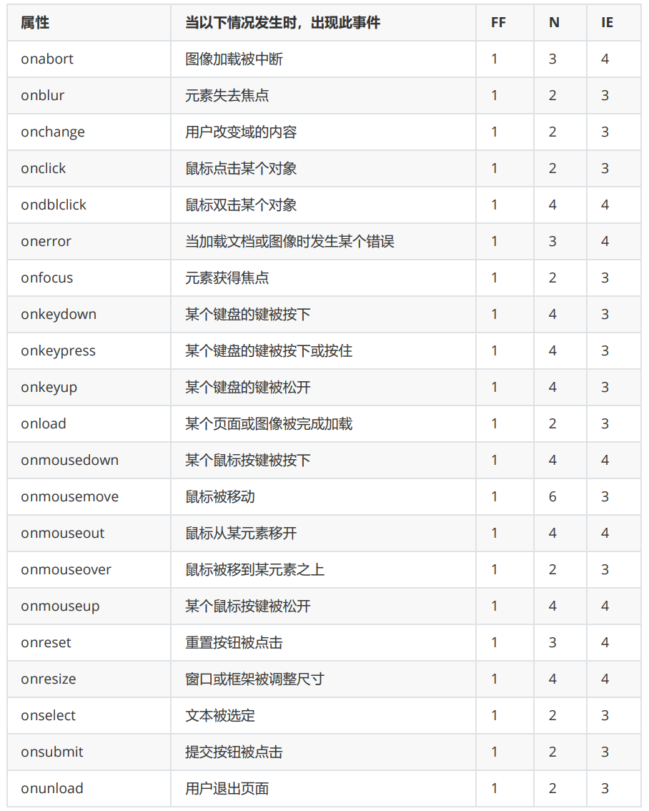

# JavaScript基础语法
## JS的组成
- ECMAScript（JavaScript语言基础）
- Web APIs
  - DOM 页面文档对象模型
  - BOM 浏览器对象模型

## JS的书写位置（同CSS）
- 行内 Javascript
  - 后面vue框架会用这种模式
- 内部Javascript
  - 规范：script标签写在&lt;/body&gt;上面
  - 扩展：alter('你好，js')页面弹出警告对话框
- 外部JavaScript
  - &lt;script src='./js/my.js'&gt;&lt;/script&gt;
  
## JS的注释
- /* */ 多行注释
- // 单行注释

## 严格模式
- 定义：严格模式是一种不同的javascript解析和执行模型
- 作用：ECMAScript的一些不规范写法会被处理，对于不安全活动将抛出错误
- 启动方法：
  - 在脚本开头加上："use strict";
  - 也可以指定一个函数在严格模式下执行，只要把预处理指令放到函数体开头即可
  ```js
  function doSometing() {
    "use strict";
    // 函数体
  }
  ```
- 严格模式会影响JavaScript执行的很多方面，后续用到会一一指出
  

## 输入输出语法
```javascript
/*输出语法*/
document.write('要出的内容')
document.write('<h1>一级标题</h1>') //允许打印标签
// document.write无自动换行功能
alert('要出的内容') // 弹出窗口，只有确定
confirm('要出得内容') // 弹出对话框，和alert对比多了个取消得选择
console.log('控制台打印') // 程序员调试使用，页面不显示，只显示在控制台

/*输入语法*/
prompt('请输入你的年龄')
```

## 变量
- 变量的声明
  - var
  ```js
  1. var 声明作用域

  // 使用var操作符定义的变量会成为它的函数的局部变量。比如使用var在函数内部定义一个变量，就意味着该变量将在函数退出时被销毁。
  function test() {
    var message = "hi"; // 局部变量
  }
  test();
  console.log(message); //出错

  // 去掉var操作符，message会变成全局变量，只要调用一次函数test()，就会定义这个变量，并可以在函数外部被访问
  function test() {
    message = "hi"; // 全局变量
  }
  test();
  console.log(message); // "hi"
  // 不推荐这么做，在严格模式下，这么做会报错

  2. var 声明提升

  // 使用var时，下面的代码不会报错。因为var声明的变量会自动提升到函数作用域顶部，(只提升声明，不带赋值)
  function foo() {
    console.log(age);
    var age = 26;
  }
  foo (); // undefined

  // 上述代码等价于
  function foo() {
    var age;
    console.log(age);
    age = 26;
  }
  foo (); // undefined

  // 所谓“提升”(hoist)，就是把所有声明都拉到函数作用域顶部。此外，反复多次使用var声明同一个变量是没问题的。
  function foo() {
    var age = 16;
    var age = 26;
    var age = 36;
    console.log(age);
  }
  foo(); // 36

  ```
  - let
  ```js
  let跟var作用类似，主要区别有；

  1. let声明范围是块作用域，var声明范围是函数作用域

  if (true) {
    var name = 'Matt';
    console.log(name); // Matt
  }
  console.log(name); // Matt

  if (true) {
    let age = 26;
    console.log(age); //26
  }
  console.log(age); // 报错：ReferenceError: age没有定义

  2. 声明冗余

  var name;
  var name; // 不会报错

  let age;
  let age; // 报错，同一个作用域内，相同变量，let只能声明一次

  3. let声明的变量不会在作用域中被提升

  console.log(age); // 报错：ReferenceError: age没有定义
  let age = 26;

  4. 全局声明，使用let在全局作用域中声明的变量不会成为window对象的属性(var声明的变量则会)
  
  var name = 'Matt';
  console.log(window.name); // 'Matt'

  let age = 26;
  console.log(window.age); // undefined

  ```
  - const :详情：<a href='#常量'>常量</a>

  - 总结：不要使用var,let和const中，优先使用const，只在提前知道未来会有修改时，再使用let。这样可以让开发者更有信心地推断某些变量的值永远不会变，同时也能迅速发现因意外赋值导致的非预期行为。

- 变量的类型（详解）
  - 原始值与引用值
    - 定义:原始值就是最简单的数据，引用值则是由多个值构成的对象
    - 引用值详解：引用值是保存在内存中的对象。JavaScript不允许直接访问内存位置，因此也就不能直接操作对象所在的内存空间。在操作对象时，实际上操作的是对该对象的引用而非实际的对象本身。为此，保存引用值得变量是按引用访问的
    - 动态属性：
    ```js
    let person = new object();  // 创建一个对象，并把它保存在person中
    person.name = "Nicholas";   //给这个对象添加一个名为name的属性，并赋值
    // 在此之后，就可以访问这个新属性，直到对象被销毁或属性被显式的删除
    console.log(person.name); // "Nicholas"
    ```
  - 复制值
    - 原始值：通过变量把一个原始值赋值到另一个变量时，原始值会被复制到新变量的位置
    ```js
    let num1 = 5;
    let num2 = num1;
    // 此时num1和num2的值都是5，但是在两个不同的内存空间，二者独立，互不干扰。
    ```
    - 关于这段代码的底层解释
    ```
    按值赋值：

    在JavaScript和C中，基本数据类型（如整数、浮点数、字符等）的赋值都是按值进行的。这意味着当一个变量赋值给另一个变量时，实际上是将值复制到新变量的内存位置。

    独立的内存空间：

    每个基本类型的变量都拥有自己独立的内存空间。例如，如果你在JavaScript或C中有 int n1 = 1; int n2 = n1;，n1 和 n2 会分别占据不同的内存位置，即使它们的值相同。
    ```
    - 引用值：引用值在复制的时候，实际上复制的是指针，指向存储在堆内存中的对象。操作完成后，两个变量实际指向同一个对象，即同一个内存空间，因此一个对象上面的变化会在另一个对象上反映出来。
    ```js
    let obj1 = new Object();
    let obj2 = obj1;
    obj1.name = "Nicholes";
    console.log(obj2.name); // "Nicholes"
    ```
  
- 变量的赋值
  - 变量 = 值
```javascript
let age // 声明一个变量
age = 18 //赋值
alert(age)

let age = 18 // 声明的同时直接赋值
let age = 18,uname = 'pink' //一次声明多个变量，用逗号隔开，但是不建议
```
- 标识符的写法：
  - 建议驼峰写法：即一个单词首字母小写，后面的单词首字母大写
  - firstSecond
  - myCar
  - doSomethingImportang
  - 这种写法不是强制性的，但因为这种形式跟ECMAScript内置函数和对象的命名方式一致，因此是最佳实践
- 变量的引用：
  - 模板字符串
  - 使 用：&#96;${ 所引用变量 }&#96;
  - 模式
```js
var name = 'GeekTime';
var age = '26';

console.log('name:'+ name + ',age:' + age); //传统写法
console.log(`我是${name},age:${age}.`); //ES6写法
```
## 数组（Array）
```javascript
let arr = [1,2,3,4,5]
console.log(arr[0])
console.log(arr.length) //返回数组的长度
```
### forEach
- 概述：
  - forEach 是数组的一个方法，它用于遍历数组的每个元素并执行指定的函数。这个函数对数组中的每一项都会执行一次。

- 基本语法：
```js
array.forEach(function(currentValue, index, arr), thisValue)
```

- 参数：
  - function(currentValue, index, arr) 必需
    - currentValue（当前值）：数组中正在处理的当前元素。
    - index（索引，可选）：数组中正在处理的当前元素的索引。
    - arr（数组，可选）：forEach 方法正在操作的数组。
  - thisValue（可选）：当执行函数时，用作 this 的值（参考对象）。

- 代码示例：
```js
const fruits = ["apple", "orange", "banana"];

// 只有必选值，遍历数组
fruits.forEach(function(fruit) {
  console.log(fruit);
});
// 输出:
// apple
// orange
// banana

// 使用index和arr
fruits.forEach(function(fruit, index, arr) {
  console.log(`fruit at index ${index} is ${fruit} in array ${arr}`);
});
// 输出:
// fruit at index 0 is apple in array apple,orange,banana
// fruit at index 1 is orange in array apple,orange,banana
// fruit at index 2 is banana in array apple,orange,banana

// 使用 thisValue 参数
const object = {
  printFruit(fruit) {
    console.log(`${this.prefix} ${fruit}`);
  }
};

fruits.forEach(object.printFruit, {prefix: "I love"});
// 输出:
// I love apple
// I love orange
// I love banana

```
- 注意：forEach()无返回值
  
### map()和join()
- 常用作用：可以使用map()和join()数组方法实现字符串拼接

- map()迭代数组
  - 使用场景：可以遍历数组处理数据，并且返回新的数组
  - map也称为映射
  - map的重点在于返回值，forEach没有返回值

- 代码示例：
```js
const arr = ['red','blue','green']
const newArr = arr.map(function(ele,index){
  console.log(ele) // 数组元素
  console.log(index) // 数组索引
  return ele + '颜色'
})

console.log(newArr) // ['red颜色','blue颜色','green颜色']
```

- join()
  - 作用：用于把数组中的所有元素转换为一个字符串

- 代码示例：
```js
const arr = ['red颜色','blue颜色','green颜色']
console.log(arr.join('')) // red颜色blue颜色green颜色
```
- 参数：
  - 数组元素是通过参数里面指定的分隔符进行分隔，空字符串''，则所有元素之间都没有任何字符
  - 默认用逗号,分隔

## 常量
- 概念：使用const声明的变量称为：“常量”
- 注意：常量不允许重新赋值，声明的时候必须赋值（初始化）
```javascript
// 声明一个常量
const G = 9.8
console.log(G)

const arr = ['red','pink']
arr.push('blue')
console.log(arr)
// 不报错，即使const声明arr，arr的值依然可以改变

const arr = ['red','pink']
arr = [1,2,3]
// 报错，因为这里相当于在堆中，重新分配了一个地址给新数组，然后将新地址赋值给arr
// 这里栈中的arr记录的地址变了
```
- 注意2：这里虽然arr的值改变了，但是实际上，变量arr在栈中存放的是数组在堆中的地址，栈中地址是不变的，变得是堆里的值，所以对于引用数据类型，是可以用const声明之后，改变里面的属性或方法的值的

## 数据类型
- 分类：基本数据类型；引用（复杂）数据类型
- 基本数据类型和引用数据类型的区别
  - 基本数据类型：参数赋值的时候，传数值。
  - 引用数据类型；参数赋值的时候，传地址（修改的同一片内存空间）
- 基本数据类型（值类型）
  - number 数字型
    - 算术运算符：+ - * / %
    - 数值范围：由于内存限制，ECMAScript并不能保存世界上所有的数值。
      - 最大值：Number.MAX_VALUE，这个值为：1.7976931348623157e+308
      - 最小值：Number.MIN_VALUE，这个值为：5e-324
    - 如果使用Number表示的变量超过了最大值，则会返回Infinity。
      - 无穷大（正无穷）：Infinity
      - 无穷小（负无穷）：-Infinity
    - 注意：typeof Infinity的返回结果是number
    - NaN
      ```js
      0、+0、-0相除会返回NaN

      console.log(0/0);  // NaN
      console.log(-0/+0);   //NaN

      如果分子是非0值，分母是有符号或无符号的0，则返回Infinity或-Infinity

      console.log(5/0);   // Infinity
      console.log(5/-0);    // -Infinity

      isNaN()
      该函数接收一个（可以是任意数值类型）的参数，判断这个参数是否“不是数值”。

      console.log(isNaN(NaN)) // true
      console.log(isNaN(10))  //false
      console.log(isNaN("10"))   // false
      console.log(isNaN("blue"))  //true
      
      ```
    - 任何涉及NaN的操作始终返回NaN
    - NaN不等于包含NaN在内的任何值

  - string字符串型
    - 模板拼接：反引号在最外围括住，变量则使用${}
    -   ```js 
        let age = 30
        document.write(`我今年他妈的${age}岁了`)

        let name = prompt('input your name:')
        let age = prompt('input your age:')
        document.write(`大噶好，我叫${name}，今年${age}岁了`)
        ```
    - 模板字符串支持嵌套使用
        ```js
        const nameList = ['极客时间','渗透测试','网络安全']；

        function myTemplate(){
          //join('')的意思是，把数组里的内容合并成一个字符串
          return `<ul>
          ${nameList
            .map((item) => `<li>${item}</li>`)
            .join('')}
          </ul>`;
        }
        document.body.innerHTML = myTemplate();
        ```
    - 模板字面量
      ```js
      // 这个模板字面量在换行之后有25个空格符
      let myTemplateLiteral = `first line
                               second line`;
      console.log(myTemplateLiteral.length);  // 47

      // 这个模板字面量以一个换行符开头
      let secondTemplateLiteral = `
      first line
      second line`;
      console.log(secondTemplateLiteral[0] === '\n'); // true

      // 这个模板字面量没有意料之外的字符
      let thirdTemplateLiteral = `first line
      second line`;
      console.log(thirdTemplateLiteral);
      // first line
      // second line
      ```
    - 字符串长度可以通过length属性获取
      - console.log(text.length); // text字符串长度
    - 转换为字符串
      - toString()
        - 返回当前值的字符串等价物
          ```js
          let age = 11;
          let ageAsString = age.toString();   // 字符串"11"
          let found = true;
          let foundAsString = found.toSting();  // 字符串"true"
          ```
      - 加号操作符给一个值 + ""空字符串
    - 模板字面量-标签函数
      - 定义：标签函数（Tagged Template Literals）是一个高级用法，允许你通过一个函数来解析模板字符串。这个特性可以用于创建自定义的字符串操作函数，用于处理内嵌表达式和字符串文字等。
      - 用法
      ```js
      function myTag(strings, ...values) {
        // ...
      }

      const variable = 'world';
      const result = myTag`Hello ${variable}!`;
      // myTag 是一个标签函数。当一个模板字符串 Hello ${variable}! 被该标签函数标记时，该模板字符串的文字和表达式会分别被传递给 myTag 函数的 strings 和 values 参数。

      参数详解：
      1. strings：这是一个包含所有字符串文字的数组。例如，对于模板字符串 Hello ${variable}!，strings 数组会是 ['Hello ', '!']。
      2. ...values：这是一个包含所有内嵌表达式求值结果的数组。对于上面的模板字符串，values 数组会是 [ 'world' ]。

      示例：
      function myTag(strings, ...values) { // ...表示不定长参数，不能省略
        let str = '';
        for(let i = 0; i < strings.length; i++) {
          str += strings[i];
          if(i < values.length) {
            str += values[i];
          }
        }
        return str.toUpperCase();
      }

      const name = 'John';
      const result = myTag`Hello ${name}`;
      console.log(result);  // 输出 "HELLO JOHN"

      // 标签函数，就是将字符串中的字符和变量分别以数组的形式存入参数，再在函数内部，进行操作。

      ```
    - 原始字符串（String.raw标签函数）
      - 示例
      ```js
      // Unicode 示例
      // \u00A9 是版权符号
      console.log(`\u00A9`);    // ©
      console.log(String.raw`\u00A9`)   // \u00A9

      // 换行符示例
      console.log(`first line\nsecond line`);
      // first line
      // second line
      console.log(String.raw`first line\nsecond line`)
      // first line\nsecond line

      // 对实际的换行是不行的
      // 它们不会被转换成转义序列的形式
      console.log(`first line
      second line`)
      // first line
      // second line
      console.log(String.raw`first line
      second line`)
      // first line
      // second line

      // 另外，也可以通过标签函数的第一个参数，即字符串数组的.raw属性取得每个字符串的原始内容
      function printRaw(strings) {
        console.log('Actual characters:');
        for (const string of strings) {
          console.log(string);
        }

        console.log('Escaped characters:');
        for (const rawString of strings.raw) {
          console.log(rawString);
        }
      }

      printRaw`\u00A9${'and'}\n`;
      // Actual characters:
      // ©
      // (换行符)
      // Escaped characters:
      // \u00A9
      // \n
      ```  

  - boolean 布尔型
    - true | false
    - 不同类型与布尔值之间的转换规则
    <table>
      <thead>
            <th style="background-color: darkred; color: white;">数据类型</th>
            <th style="background-color: darkred; color: white;">转换为true的值</th>
            <th style="background-color: darkred; color: white;">转换为false的值</th>
      </thead>
      <tbody>
        <tr>
            <td>Boolan</td>
            <td>true</td>
            <td>false</td>
        </tr>
         <tr>
            <td>String</td>
            <td>非空字符串</td>
            <td>""空字符串</td>
        </tr>
         <tr>
            <td>Number</td>
            <td>非零数值</td>
            <td>0、NaN</td>
        </tr>
         <tr>
            <td>object</td>
            <td>任意对象</td>
            <td>null</td>
        </tr>
         <tr>
            <td>Undefined</td>
            <td>N/A(不存在)</td>
            <td>undefined</td>
        </tr>
      </tbody>
    </table>
  - Symbol类型
    - 作用：Symbol（符号）是ECMAScript6新增的数据类型。符号是原始值，且符号实例是唯一、不可变的。符号的用途是确保对象属性使用唯一标识符，不会发生属性冲突的危险；符号就是用来创建唯一记号，进而用作非字符串形式的对象属性
    - 符号的基本用法
    ```js
    符号需要使用Sysmbol()函数初始化。因为符号本身是原始类型，所以typeof操作符对符号返回symbol。
    let sym = Symbol();
    console.log(typeof sym); //symbol

    调用Symbol()函数时，也可以传入一个字符串参数作为对符号的描述(description),将来可以通过这个字符串来调试代码
    但是，这个字符串参数与符号定义或标识完全无关，仅仅至少描述。
    let genericSymbol = Symbol();
    let otherGenericSymbol = Symbol();

    let fooSymbol = Symbol('foo');
    let otherFooSymbol = Symbol('foo');

    console.log(genericSymbol == otherGenericSymbol);   // false
    console.log(fooSymbol == otherFooSymbol);   // false
    // 再次强调，符号实例：唯一，不可变

    最重要的是：Symbol()函数不能与new关键字一起作为构造函*数使用。这样做是为了避免创建符号包装对象，像使用Boolean、String或Number那样，它们都支持构造函数且可用于初始化包含原始值的包装对象
    let myBoolean = new Boolean();
    console.log(typeof myBoolean); // "object"

    let myString = new String();
    console.log(typeof myString); // "object"

    let myNumber = new Number();
    console.log(typeof myNumber); // "object"

    let mySombal = new Sombal(); // TypeError: Symbol is not a constructor
    ```
    - 上述知识点-关于构造函数的解释
      - 定义：在 JavaScript 中，构造函数是用于创建和初始化一个对象的特殊方法。构造函数其实就是一个普通的 JavaScript 函数，但是它是通过使用 new 关键字来调用的。
      - 基础语法
      ```js
      function Person(name, age) {
        this.name = name;
        this.age = age;
        this.describe = function() {
          return `${this.name} is ${this.age} years old.`;
        };
      }

      const john = new Person('John', 30);
      const jane = new Person('Jane', 25);
      /* 在这个例子中，Person 是一个构造函数，用于创建一个包含 name、age 和 describe 方法的对象。
      我们使用 new 关键字创建了两个新的 Person 对象：john 和 jane。*/

      ```
      - 使用new关键字（当一个函数与new关键字一起被调用时）
        - JavaScript会创建一个新的空对象
        - 这个新对象会被设置为函数（构造函数）的this上下文
        - 函数的this上下文会被填充属性和方法
        - 除非构造函数显式返回一个对象，否则新创建的对象会作为new表达式的结果返回
      - 关于上述调用new函数的过程详解中“上下文的含义”
        - 当我们说一个新的空对象会被设置为函数（构造函数）的“this上下文时”，我们是在说这个新的空对象将成为函数内部this关键字的值
        - 换句话说，在构造函数中，this关键字会指向一个新创建的对象。这个对象就是这个特定函数调用（与new关键字一起）的“上下文”
        - 示例：
        ```js
        function Person(name, age) {
          this.name = name;
          this.age = age;
        }
        ```
        - 当你使用new Person('John',30)创建一个新对象时
          - JavaScript会创建一个新的空对象，比如{}
          - 这个新对象会成为Person函数内部this的值，或者说，新对象会被设置为Person函数的this上下文
          - 函数体内的this.name=name;和this.age=age;语句会在这个新对象上设置name和age属性
          - 由于Person构造函数没有显示返回一个对象，因此这个新对象会作为整个new Person('John',30)表达式的结果被返回
        - 总结：this提供了一个在函数体内部与特定对象的交互方式，而这个特定对象就是函数的上下文。这里的上下文就是this指向的那个对象
        - 后续关于构造函数更深入的内容，详情见函数章节
  - undefined 未定义类型
    - 只有一个值：undefined
    - undefined是一个假值
    - 只声明变量，不赋值的情况下，默认变量为undefined
    - 工作场景：
      - 开发过程中，经常声明一个变量，等待传送过来的数据。<br>如果我们不知道这个数据是否传递过来，此时我们可以通过检测这个变量是不是undefined，就判断用户是否有数据传递过来。
  - null 空类型
    -  null和undefined的区别
       -  undefined 表示没有赋值
       -  null 表示赋值了，但是内容为空
       -  undeined == null 这个值是true
       -  undeined === null 这个值是false
       -  永远不必显式地将变量值设置为undefined。但null不是这样。任何时候，只要变量要保存对象，而当时又没有那个对象可保存，就要用null来填充该变量。
    - null 开发中的使用场景
      - 官方解释：把null作为尚未创建的对象
      - 人话：将来有个变量里面存放的是一个<em>对象</em>,但是对象还没创建好，可以先给个null。
- 检测数据类型
  - 作为运算符：typeof X (常用写法)
  - 函数形式：typeof(x)
- 引用数据类型（引用类型）
  - object 对象类型：内置对象Function，Array，Date，RegExp，Error等都是属于Object类型。也就是说，除了那物种基本数据类型之外，其他的，都称之为Object类型。
    - Dirct类型（相当于字典）由键值对组成得无需集合
      - {键名1:值1,键名2:值2,...}
      - 注意：在js中，键一般是字符串，值可以是任意数据类型
      - 取值方式
      ```js
      let a = {'name':'lucy','age':19}
      document.write('g变量中name得值：',g.name,'<br>')
      document.write('g变量中age得值：',g.['age'],'<br>')
      // 对象类型得两种取值方式
      ```

### 扩展：栈和堆
- 栈堆空间分配的区别：
  - 栈（操作系统）：由操作系统自动分配释放存放函数的参数值、局部变量的值等。其操作方式类似于数据结构中的栈。
  - 堆（操作系统）：存储复杂类型（对象），一般由程序员分配释放，若程序员不释放，由垃圾回收机制回收。
  
## 类型转换
- 隐式转换
  - <span id="sum">加号两边，只要有一侧是字符串，默认都是字符串</span>
  - 2 - '2' 减法自动转换为数字型 = 0，（减，乘，除，都一样）
  - + '123' 单用加号，将数字类得字符串，转换为数字型
- 显式转换
  - 转换为数字型
    - Number(数据)
      - 如果字符串内容里有非数字，转换失败时结果为NaN，即不是一个数字
      - NaN也是number类型的数据，代表非数字
    - +变量
        ```javascript
        let str = '123'
        typeof +str
        // 输出类型为number
        ```
    
    - parseInt（数据）   
        ```javascript
        //只保留整数部分
        console.log(parseInt('12px')) //输出结果为12
        console.log(parseInt('12.94px')) //输出结果为12

        // parseInt()转换规则：
        /* 字符串最前面的空格会被忽略，从第一个非空格字符开始转换
          如果第一个字符不是数值字符、加号或减号，parentInt()立即返回NaN，这意味着空字符串也返回NaN，这里和Number()不一样，Number()返回0
          如果是数值、加号或减号，则继续依次检查每个字符直到末尾，或碰到非数值字符。比如"1234px"，返回1234

          由于数值有多种格式，如：八进制，十六进制等，因此parentInt()有第二个参数，用于指定进制数*/
        
        let num = parseInt("AF",16) //175
        let num = parseInt("10",2)  // 2

        ```
    - parseFloat（数据）
        ```javascript
        //可以保留小数
        console.log(parseFloat('12px')) //输出结果为12
        console.log(parseFloat('12.94px')) //输出结果为12.94

        // parseFloat()只能解析十进制数值
        ```
### <a href='prac/数据转换类型.html'>练习1：计算两数之和</a>
## 运算符
- 算数运算符
- 自增/自减运算符
- 一元运算符
- 逻辑运算符
- 赋值运算符
- 比较运算符
- 三元运算符
  
### 算术运算符
<table>
  <thead>
    <th>
        运算符
    </th>
    <th>
        描述
    </th>
  </thead>
  <tbody>
    <tr>
      <td>
        +
      </td>
      <td>
        加，字符串连接
      </td>
    </tr>
    <tr>
      <td>
        -
      </td>
      <td>
        减
      </td>
    </tr>
    <tr>
      <td>
        *
      </td>
      <td>
        乘
      </td>
    </tr>
    <tr>
      <td>
        /
      </td>
      <td>
        除
      </td>
    </tr>
    <tr>
      <td>
        %
      </td>
      <td>
        获取余数（取余，取模）
      </td>
    </tr>
  </tbody>
</table>
- 注意事项：浮点数运算的精度问题

  - 在JS中，整数中的运算基本可以保证精确，但是小数的运算，可能会得到一个不精确的结果。所以，千万不要使用JS进行对精确度要求比较高的运算。
  
  - 处理方法
  
    - 如果只是一些简单的精度问题，可以使用toFix()方法进行小数的截取。
  
      ```javascript
      number.toFixed([digits])
      ```
      - digits 是一个可选参数，它指定要保留的小数位数。它应该是0到20之间的整数（包含0和20）
      - 遵循四舍五入，而不是单纯的截取
      - 不指定digits时，默认为0，即四舍五入到最近的整数
  
    - 在实际开发中，关于浮点数计算的精度问题，往往比较复杂。市面上有很对针对数学运算的开源库，比如decimal.js、Math.js。这些开源库都比较成熟，我们可以直接拿来用。
      - Math.js：属于很全面的运算库，文本很大，压缩后的文件就有500kb。如果你的项目涉及到大型的复杂运算，可以使用Math.js
      - decimal.js：属于轻量级的运算库，压缩后的文件只有32kb，大多数项目的数月运算，使用decimal.js足够了。
    - 在使用这几个开源库时，既可以用cdn的方式引入，也可以用npm包的方式引入。
    ```html
    <script src="https://cdn.bootcdn.net/ajax/libs/decimal.js/10.2.0/decimal.min.js"></script>
    <script>
      console.log('加法：');
      var a = 0.1;
      var b = 0.2;
      console.log(a + b)
      console.log(new Decimal(a).add(new Decimal(b)).toNumber());

      console.log('减法：');
      var a = 0.1;
      var b = 0.2;
      console.log(a - b)
      console.log(new Decimal(a).sub(new Decimal(b)).toNumber());

      console.log('乘法：');
      var a = 0.1;
      var b = 0.2;
      console.log(a * b)
      console.log(new Decimal(a).mul(new Decimal(b)).toNumber());

      console.log('除法：');
      var a = 0.1;
      var b = 0.2;
      console.log(a / b)
      console.log(new Decimal(a).div(new Decimal(b)).toNumber());

    </script>
    ```

    - 在正常的开发过程中，一般复杂的计算不会在前端进行，而是在后端计算好后，将值传给前端。 
  
### 自增/自减运算符
- 自增分为两种：`a++` 和 `++a`
- 二者区别：
  - `a++`：先用再加
  - `++a`：先加再用
- 自减：`a--` 和 `--a`
- 二者区别：与自增相同

### 一元运算符
- typeof
- <a href="#sum">`+`：详情见隐式转换，点击查看</a>
- `-`：对数字取反

### 逻辑运算符
- 逻辑运算符有3个
  - && 与
  - || 或
  - ! 非

- 非布尔值的与或运算【重要】
  - 之所以重要，是因为在实际开发中，我们经常用这种代码做容错处理或兜底处理（SQL注入中常用）
  - 非布尔值进行与或运算时，会先将其转换为布尔值，然后再运算，但返回结果是原值。比如说：
  ```js
  var result = 5 && 6; // 运算过程：true && true;
  console.log('result：' + result); // 打印结果：6（也就是说最后面的那个值。）
  ```
  - 与运算的返回结果：（以多个非布尔值的运算为例）
    - 如果第一个值为false，则执行第一条语句，并直接返回第一个值；不会再往后执行。
    - 如果第一个值为true，则继续执行第二条语句，并返回第二个值（如果所有的值都为true，则返回的是最后一个值）。
  - 或运算的返回结果：（以多个非布尔值的运算为例）
    - 如果第一个值为true，则执行第一条语句，并直接返回第一个值；不会再往后执行。
    - 如果第一个值为false，则继续执行第二条语句，并返回第二个值（如果所有的值都为false，则返回的是最后一个值）。
  
### 赋值运算
- 可以将符号右侧的值赋值给符号左侧的变量。
  - `=`直接赋值。比如 var a = 5
  - `+=` 。a += 5 等价于 a = a + 5
  - `-=` 。a -= 5 等价于 a = a - 5
  - `*=` 。a *= 5 等价于 a = a * 5
  - `/=` 。a /= 5 等价于 a = a / 5
  - `%=` 。a %= 5 等价于 a = a % 5

- `==` 和 `===`
  - `==`：只判断值，不判断数据类型
  - null == undefined 这个值是true
  - `===`：既判断值，也判断数据类型
  
### <a href="#sanyuan">三元运算符</a>
- 详情点击标题，跳转至分支语句

## 扩展内容1
- Unicode编码的使用
  - 在字符串中可以使用转义字符输入Unicode编码。格式如下：
  - `\u四位编码`
  - 可以在一定程度上，规避网站对特殊符号的限制

- 事件句柄
  - HTML 4.0 的新特性之一是有能力使 HTML 事件触发浏览器中的动作action），比如当用户点击某个HTML 元素时启动一段 JavaScript。下面是一个属性列表，这些属性可插入 HTML 标签来定义事件动作，相当于是在 HTML 标签中插入了事件句柄，可以接收JS代码并执行。
  - 

## 语句
### 分支语句
- 分支语句包含
  - if分支语句
  - 三元运算符
  - switch语句

- if语句
  - 语法
  ```js
  if (条件){
      满足条件要执行的代码
  }
  else {
      不满足条件执行的代码
  }
  ```
  - 0和空字符串""都是false
  - 多分枝if语法
  ```js
  if (条件1) {
      代码1
  }else if (条件2) {
      代码2
  }else if (条件3) {
      代码3
  }else{
      代码n
  }
  ```
- <span id="sanyuan">三元运算符</span>
  - 使用场景：是比if双分支更简单的写法，可以使用三元表达式
  - 语法
  ```js
  条件 ? 满足条件执行的代码 : 不满足条件执行的代码
  ```
  - 一般用来取值

- switch语句
  - 作用：利用switch执行满足条件的语句
  - 语法
  ```js
  switch (数据) {
    case 值1:
        代码1
        break
    case 值1:
        代码1
        break
    default:
        代码n
        break
  }
  ```
  - 注意：
    - switch一定要注意，必须是===全等，一定注意数据类型，同时注意break，否则会有穿透效果。
    - switch case语句一般用于等值判断，不适合于区间判断
    - switch case一般需要配合break关键字使用 没有break会造成case穿透
  - 总结switch和if...else...的区别
    - 当分支比较少时，if...else语句执行效率高
    - 当分支比较多时，switch语句执行效率高，而且结构更清晰。

### 循环语句
- do-while
  - do-while语句是一种后测试循环语句，即循环体中的代码执行后才会对退出条件进行求值。换句话说，<font color=tomato>循环体内的代码至少执行一次。</font>
  - 语法：
  ```js
  do {
    statment
  } while (expression);

  示例：

  let i = 0;
  do {
    i += 2;
  } while (i < 10);
  ```
- while循环
  - 基本语法
  ```js
  while (循环条件) {
      要重复执行的代码(循环体)
  }
  ```
  - while循环三要素：
    - 循环的本质就是以某个变量为起始值，然后不断产生变化量，慢慢靠近终止条件的过程。
  - 示例
  ```js
  let i = 1
  while (i <= 3) {
      document.write('我会循环3次<br>')
      i++
  }
  ```
  - 循环的退出
    - break：退出循环
    - continue：结束本次循环，继续下次循环

- for循环
  - 基本语法
  ```js
  for (变量起始值；终止条件；变量变化量) {
      //循环体
  }
  ```
  - 示例
  ```js
  // 利用for循环输出三句话 月薪过万
  for (let i = 1; i <= 3; i++) {
      document.write('月薪过万')
  }
  ```
  - 遍历数组
  ```js
  let arr = [1,2,3,4,5,6]
  for (let i = 0; i < arr.length; i++) {
      document.write(arr[i]+"<br>")
  }
  ```
  - 退出循环
    - continue 退出本次循环，一般用于排除或者跳过某一个选项的时候，可以使用continue
    - break 退出整个for循环，一般用于结果已经得到，后续的循环不需要的时候可以使用

  - 循环嵌套
  ```js
  for (外部声明记录循环次数的变量； 循环条件；变化量) {
      for (内部声明记录循环次数的变量；循环条件； 变化量) {
          //循环体
      }
  }
  ```
### <a href='prac/九九乘法表.html'>练习2：九九乘法表</a>

## Array详解
- 数组的基本使用
  
  - 声明数组
  ```js
  // 字面量声明数组
  let 数组名 = [数据1, 数组2, ..., 数组n]

  // 使用 new Array 构造函数声明
  let arr = new Array(数据1, 数组2, ..., 数组n)
  ```
- 操作数组
  - 修改数组的值
  ```js
  // 修改
  let arr = ['curry','james','kobi']
  console.log(arr)
  for (let i )

  // 进阶：遍历修改
  let arr = ['curry','james','kobi']
  console.log(arr)
  for (let i = 0; i < arr.length; i++) {
      arr[i] = arr[i] + 'teacher'
  }
  console.log(arr)
  ```

  - 数组中添加新数据
  ```js
  //数组.push()：将一个或多个元素添加到数组的末尾，并返回该数组的新长度（重点）
  arr.push(元素1,元素2,...,元素n)

  // 示例：
  let arr = ['red','green']
  let length = arr.push('pink')
  console.log(arr) //  ['red','green','pink']
  console.log(length) // 返回值：3（新数组长度）

  //数组.unshift(新增内容)
  // 将一个或多个元素添加到数组开头，并返回数组长度
  // 示例：
  let arr = ['red','green']
  let length = arr.unshift('pink')
  console.log(arr) //  ['pink','red','green']
  console.log(length) // 返回值：3（新数组长度）
  ```

- 删除数组中数据
```js
// 数组.pop()
//从数组中删除最后一个元素，并返回该元素的值

//示例：
let arr = ['red','green','blue']
val = arr.pop()
console.log(arr) //['red', 'green']
console.log(val) // blue

//数组.shift()
// 删除第一个元素，并返回该元素的值

//示例：
let arr = ['red','green','blue']
val = arr.shift()
console.log(arr) //['green', 'blue']
console.log(val) // red

// 数组.splice(start, deleteCount)
// deleteCount可选；默认删除到最后
// 删除指定元素

//示例：
let arr = ['red','green','blue']
arr.splice(1,1)
console.log(arr) //['red', 'blue']

```

- 查询数组中的数据
```js
// 数组.indexOf('value')
//查询数组中的指定元素的索引

//示例：
let arr = ['red','green','blue']
num = arr.indexOf('green')
console.log(num) // 1

```

## 综合练习
- <a href='prac/数据可视化案例.html'>综合练习1：数据可视化案例</a>

## 函数
### 函数简介
- 基本语法
```js
function functionName(arg0, arg1, ..., argN) {
  statment
}

示例：
function sayHi(name,message) {
  console.log("Hello " + name + ", " + message);
}

ECMAScript中的函数不需要指定是否返回值。任何函数在任何时间都可以使用return语句来返回函数值，用法是后跟要返回的值

function sum(num1, num2) {
  return num1 + num2;
}
const result = sum(5, 10);
// 只要碰到return语句，函数就会立即停止执行并退出。因此，return语句后面的代码不会执行。
```
### 函数传参
- 声明语法
```js
function 函数名(参数列表) {
  函数体
}

// 实参与形参

function getSum(num1,num2) {
  // 这里num1和num2是形参，默认值为undefined
  // 建议初始化形参，num1=0,num2=0
  document.write(num1 + num2)
}

function getSum(num1=0,num2=0) {
  // 这里num1和num2是形参，默认值为undefined
  // 建议初始化形参，num1=0,num2=0
  document.write(num1 + num2)
}

getSum() // 输出结果为0
getSum(10,20) // 10和20是实参
```
- 参数
  - 形参；声明函数时写在函数名右边小括号里的叫形参
  - 实参：调用函数时写在函数名右边小括号里的叫实参

### 函数返回值
- 使用关键字return：`return 数据`
- 注意：
  - 在函数体中使用return关键字能将内部的执行结果交给函数外部使用
  - return后面代码不会再被执行，会立即结束当前函数，所以return后面的数据不要换行写
  - return函数可以没有return，这种情况函数默认返回值为undefined

### 函数作用域
### 匿名函数
- 函数表达式
```js
let fn = function(){
  console.log('我是函数表达式')
}

fn() // 调用函数表达式

let fn1 = function(x,y) {
  console.log(x + y)
}

fn1(1,2)

// 使用场景：后续webAPI会用到函数表达式
```

- 立即执行函数
```js
// 使用场景：避免全局变量之间的污染

// 方式1
(function () { console.log(11) })();

// 方式2
(function () { console.log(11) }());

// 不需要调用，立即执行
// 分号必须加,多个立即执行函数之间用分号隔开

// 加入参数
(function(x,y) {
  console.log(x+y)
})(1,2);
```

### 逻辑中断
```js
// 逻辑中断的表现形式
function fn(x,y) {
  x = x || 0
  y = y || 0
  console.log(x + y)
}
fn(1,2)
fn()
```

## 对象
### 对象概述
- 对象（object）：JavaScript里的一种数据类型
- 可以理解为一种无序的数据集合
```js
let obj = {
  uname:'mystical'，
  age: 18,
  gender: 'male'
}

// 类似于python中的字典
```
- 对象声明语法
```js
// 方法1
let 对象名 = {}

// 方法2
let 对象名 = new Object() // 构造函数
```

- 对象的组成
  - 属性
  - 方法

```js
// 对象的组成
let 对象名 = {
  属性名: 属性值,
  方法名: 函数
}
```

### 对象使用
- 对象的本质是无序的数据集合，操作数据无非是增删改查
  - 查询对象
    - 语法：对象名.属性名
    - 语法2：对象名['属性名']
      - 使用场景：遍历属性名时会经常使用
  - 更改对象属性
    - 语法：对象名.属性名 = 新值
  - 增加对象属性
    - 语法：对象名.新属性名 = 新值
  - 删除对象属性
    - 语法：delete 对象名.属性名

### 遍历对象
```js
// 数组遍历2
let arr = ['pink','red','blue']
for (let k in arr) {
  console.log(k) // 数组的小标，索引号
  console.log(type(k)) // k是字符串类型
}

// for in 不推荐遍历数组，推荐遍历对象
let obj = {
  uname: 'mystical',
  age: 18,
  gender: 'male' 
}

for (let k in obj) {
  console.log(k) // 属性名 'uname','age','gender'
  console.log(obj[k])
}
```

### 内置对象
- 概述：JavaScript内部提供的对象，包含各种属性和方法给开发者调用
- 内置对象 - Math
  - 介绍: Math对象是JavaScript提供的一个“数学”对象
  - 作用: 提供了一系列做数学运算的方法
  - Math对象包含的方法
    - random：生成0-1之间的随机数（包含0不包括1）
    - ceil：向上取整
    - floor：向下取整
    - max：找最大数
    - min：找最小数
    - pow：幂运算
    - ads：绝对值
  ```js
  // 属性
  console.log(Math.PI)

  // 方法
  // ceil() 向上取整
  console.log(Math.ceil(1.5)) // 2

  // floor() 向下取整
  console.log(Math.floor(1.9)) // 1

  // round() 四舍五入
  console.log(Math.round(1.2)) // 1
  console.log(Math.round(1.5)) // 2

  // random() 生成任意范围随机数
  // 默认返回一个0-1的数，区间[0,1)
  console.log(Math.random())
  // 0-10之间的整数
  console.log(Math.floor(Math.random() * 11))
  
  ```

# Web APIs
## Web API基本认知
- 作用和分类
  - 作用：就是使用js去操作html和浏览器
  - 分类：DOM(文档对象模型)、BOM(浏览器对象模型)

## DOM
### DOM概述
- 定义：什么是DOM
  - DOM(Domcument Object Model——文档对象模型)是用来呈现以及与任意HTML或XML文档交互的API
  - 人话：DOM是浏览器提供的一套专门用来操作网页内容的功能
  - 作用：
    - 开发网页内容特效和实现用户交互

- DOM树
  - 定义：将HTML文档以树状结构直观的表现出来，我们称之为文档树或DOM树
  - 作用：文档树直观的体现了标签与标签之间的关系

- DOM对象（重要）
  - 定义：浏览器根据html标签生成的JS对象
    - 所有的标签属性都可以在这个对象上面找到
    - 修改这个对象的属性会自动映射到标签身上
  - 示例：
  ```js
  const div = document.querySelector('div')
  // 打印对象
  console.dir(div) //dom对象
  ```

  - 核心思想
    - 把网页内容当作<font color=tomato>对象</font>来处理

  - document对象
    - 是DOM里提供的一个对象
    - document是一个网页最大的对象，网页的所有内容都在document里面
    - 所以它提供的属性和方法都是用来访问和操作网页内容的
      - 例：document.write()
    - 网页所有内容都在document里面
  
 ### 获取DOM对象
- 获取DOM元素的方式
  - 根据CSS选择器来获取DOM元素（重点）
  - 其他获取DOM元素的方法（了解 ）

- 根据CSS选择器来获取DOM元素（重点）
  - 选择匹配单个元素
    - 语法：`document.querySelector('CSS选择器')`
    - 可以直接修改对象的值
  - 选择匹配多个元素
    - 语法：`document.querySelectorAll('CSS选择器')`
    - 参数：包含一个或多个有效的CSS选择器字符串
    - 返回值：CSS选择器匹配的NodeList对象集合
      - 得到一个伪数组
        - 有长度有索引号的数组
        - 但是没有pop()、push()等数组方法，无法增删改查
    - 不能直接修改对象里的属性，需要遍历(for)后修改
```html
<!DOCTYPE html>
<html lang="en">
<head>
    <meta charset="UTF-8">
    <meta name="viewport" content="width=device-width, initial-scale=1.0">
    <title>Document</title>
    <style>
      .box {
        width: 200px;
        height: 200px;
      }
    </style>
</head>
<body>
  <div class="box">123</div>
  <div class="box">abc</div>
  <p id="nav">导航栏</p>
  <ul>
    <li>测试1</li>
    <li>测试2</li>
    <li>测试3</li>
  </ul>
  <script>
    // 1. 获取匹配的第一个元素
    const box = document.querySelector('div')
  // 等同于 const box = document.querySelector('.box')
    console.log(box)

    const nav = document.querySelector('#nav')
    console.log(nav)
    const first_li = document.querySelector('ul li:first-child')
    cnosole.log(li)


    // 选择匹配多个元素
    const lists = document.querySelectorAll('ul li')
    console.log(lists)
  </script>
</body>
</html>
```
- 其他获取DOM元素方法（了解）
```js
// 根据id获取一个元素
document.getElementById('nav')
// 根据标签获取一类元素，例如：获取页面所有div,返回伪数组
document.getElementsByTagName('div')
// 根据 类名获取元素 获取页面所有类名为w的，返回伪数组
document.getElementsByClassName('w')
```

### 操作元素内容
- 原理：
  - Dom对象都是根据标签生成的，所以操作标签，本质上就是操作DOM对象
  - 就是操作对象使用的点语法
  - 如果想要修改标签元素里面的内容，可以使用如下方式：
    - 对象.innerText 属性
    - 对象.innerHTML 属性

- 对象.innerText 属性
  - 元素innerText属性
    - 将文本内容添加/更新到任意标签位置
    - 显示纯文本，不解析标签
```html
<!DOCTYPE html>
<html lang="en">
<head>
    <meta charset="UTF-8">
    <meta name="viewport" content="width=device-width, initial-scale=1.0">
    <title>Document</title>
</head>
<body>
  <div class="box">我是文字内容</div>
  <script>
    // 1. 获取元素
    const box = document.querySelector('.box')
    // 2. 修改文字内容 对象.innerText = '文字内容'
    console.log(box.innerText) // 获取元素的文字内容
    box.innerText = '我是修改后的文字内容,hahah'

    box.innerText = '<strong>我是盒子</strong>' // 不解析标签
    // 页面显示<strong>我是盒子</strong>

  </script>
</body>
</html>
```

- 对象.innerHTML 属性
  - 将文本内容添加/更新到任意标签位置
  - 会解析标签，多标签建议使用模板字符
```html
<!DOCTYPE html>
<html lang="en">
<head>
    <meta charset="UTF-8">
    <meta name="viewport" content="width=device-width, initial-scale=1.0">
    <title>Document</title>
</head>
<body>
  <div class="box">我是文字内容</div>
  <script>
    const box = document.querySelector('.box')
    // innerHTML 解析标签
    console.log(box.innerHTML)
    // box.innerHTML = '我要更换'
    box.innerHTML = '<strong>我要更换</strong>'

  </script>
</body>
</html>
```

### 操作元素属性
- 操作元素常用属性
  - 可以通过JS设置/修改标签元素属性，比如通过src更换图片
  - 语法：`对象.属性 = 值`
  ```js
  // 获取元素
  const pic = document.querySelector('img')
  // 操作元素
  pic.src = './images/...'
  pic.title = 'XXXX'
  ```
- 操作元素样式属性
  - 可以通过js设置/修改标签元素的样式属性
  - 生成的是行内样式表，权重比价高
  - 学习路径：
    - 通过style属性操作CSS
      - 语法：`对象.sytle.样式属性 = 值`
  ```html
  <!DOCTYPE html>
  <html lang="en">
  <head>
      <meta charset="UTF-8">
      <meta name="viewport" content="width=device-width, initial-scale=1.0">
      <title>Document</title>
      <style>
        .box {
          width:200px;
          height:200px;
          background-color:red;
        }
      </style>
  </head>
  <body>
    <div class="box">我是文字内容</div>
    <script>
      const box = document.querySelector('.box')
      box.style.width = '300px'
      box.sytle.backgroundColor = 'darkred'
      // 如果样式属性有多个单词构成，采用小驼峰命名提到"-"
    </script>
  </body>
  </html>
  ```
- 操作类名(className)操作CSS
  - 如果修改的样式比较多，直接通过style属性修改比较繁琐，我们可以借助于CSS类名的形式
  - 语法：`元素.className = 'active'`
  ```html
  <!DOCTYPE html>
  <html lang="en">
  <head>
      <meta charset="UTF-8">
      <meta name="viewport" content="width=device-width, initial-scale=1.0">
      <title>Document</title>
      <style>
        div {
          width:200px;
          height:200px;
          background-color:red;
        }
        .box {
          width:300px;
          height:300px;
          background-color:blue;
          border: 1px soild black;
        }
        .nav {

        }
      </style>
  </head>
  <body>
    <div class="box">我是文字内容</div>
    <script>
      // 获取元素
      const div = document.querySelector('div')
      div.className = 'box'
      // 更改切换样式
      div.className = 'nav box'
      // 同时引用多个CSS标签，中间用空格隔开
    </script>
  </body>
  </html>
  ```
- 通过classList操作类控制CSS
  - 通过className容易覆盖以前的类名，我们可以通过classList方式追加和删除类名
  - 语法
  ```js
  // 追加一个类
  元素.classList.add('类名')
  // 删除一个类
  元素.classList.remove('类名')
  // 切换一个类
  元素.classList.toggle('类名')
  ```
  - 示例：
    ```html
    <!DOCTYPE html>
    <html lang="en">
    <head>
        <meta charset="UTF-8">
        <meta name="viewport" content="width=device-width, initial-scale=1.0">
        <title>Document</title>
        <style>
          .box {
            width:300px;
            height:300px;
            background-color:blue;
            border: 1px soild black;
          }
          .active {
            color:red;
            background-color:pink;
          }
        </style>
    </head>
    <body>
      <div class="box">我是文字内容</div>
      <script>
        // 获取元素
        const box = document.querySelector('.box')
        // 追加类 add() 类名不加点，并且是字符串
        box.classList.add('active')

        // 删除一个类 remove()
        box.classList.remove('box')

        // 切换类 toggle()
        box.classList.toggle('box')

      </script>
    </body>
    </html>
    ```
  
- 操作表单元素属性
  - 示例
  ```html
  <!DOCTYPE html>
  <html lang="en">
  <head>
      <meta charset="UTF-8">
      <meta name="viewport" content="width=device-width, initial-scale=1.0">
      <title>Document</title>
  </head>
  <body>
    <input type="text" value="电脑">
    <!-- checked，不写默认值为false，写上默认值为true -->
    <input type="checkbox" name="" id="" >
    <script>
      // 获取元素
      const uname = document.querySelector('input')
      // 获取值  获取表单里面的值，用的 表单.value
      // console.log(uname.value) // 电脑
      uname.value = '改变值 '     
      uname.type = 'password'
      const ipt = document.querySelector('input:nth-child(2)')
      ipt.checked = true
    </script>
    </body>
  </html>
  ```
  - 表单属性中添加就有效果，移除就没有效果，一律使用布尔值表示，如果为true代表添加了该属性，如果是false代表移除了该属性
  - 比如：disabled、checked、selected
- 自定义属性
  - 在html5中推出来了专门的data-自定义属性
  - 在标签上一律以data-开头
  - 在DOM对象上一律以dataset对象方式获取
  ```html
  <!DOCTYPE html>
  <html lang="en">
  <head>
      <meta charset="UTF-8">
      <meta name="viewport" content="width=device-width, initial-scale=1.0">
      <title>Document</title>
  </head>
  <body>
    <div data-id="1" data-spm="unknow">1</div>
    <div data-id="2">2</div>
    <div data-id="3">3</div>
    <div data-id="4">4</div>
    <div data-id="5">5</div>
    <script>
      const one = document.querySelector('div')
      console.log(one.dataset.id) // 1
      console.log(one.dataset.spm) // unknow
      one.dataset
    </script>
    </body>
  </html>
  ```

### 定时器-间歇函数
- 使用场景：网页中经常会需要一种功能：每隔一段时间需要自动执行一段代码，不需要我们手动去触发
  - 例如：网页中的倒计时
  - 要实现这种需求，需要定时器函数

- 开启定时器：`setInterval(函数, 间隔时间)`
  - 作用：每隔一段时间调用这个函数
  - 间隔时间单位是毫秒 (1s = 1000ms)
  ```html
  <!DOCTYPE html>
  <html lang="en">
  <head>
      <meta charset="UTF-8">
      <meta name="viewport" content="width=device-width, initial-scale=1.0">
      <title>Document</title>
  </head>
  <body>
    <script>
      // setInterval(函数, 间隔时间)
      let n = setInterval(function(){
        document.write('一秒执行一次')
      },1000)
      // 每个定时器都会返回一个id编号,可以选择一个变量接收
    </script>
    </body>
  </html>
  ```

- `setTimeout`
  - 概述：
    - setTimeout 是 JavaScript 中的一个非常有用的函数，它用于设置一个定时器，该定时器在指定的毫秒数后执行指定的函数或代码。这个函数是异步执行的，意味着它不会阻止后续代码的执行。setTimeout 是 Web API 的一部分，在浏览器环境中可用。
  - 基础语法
  ```JS
  setTimeout(function, delay, [arg1, arg2, ...]);
  // function：要执行的函数。
  // delay：延迟的时间，以毫秒为单位。
  // [arg1, arg2, ...]：（可选）传递给函数的额外参数。
  ```
  - 代码示例
  ```JS
  setTimeout(() => {
    console.log("Hello after 3 seconds");
  }, 3000);
  ```

- 关闭定时器
  - 代码示例：
  ```js
  let 变量名 = setInterval(函数, 间隔时间)
  clearInterval(变量名)
  ```

### 事件监听（绑定）
- 事件概述：
  - 什么是事件：
    - 事件是在编程时，系统内发生的动作或发生的事情
    - 比如；用户在网页点击一个按钮
  - 什么是事件监听：
    - 就是让程序检查是否有事件产生，一旦有事件触发，就立即调用一个函数做出响应，也称为绑定事件或者注册事件

- 语法：
```js
元素对象.addEventListener('事件类型', 要执行的函数)
```
- 事件监听三要素：
  - 事件源：那个DOM元素被事件触发了，要获取DOM元素
  - 事件类型：用什么方式触发，比如：点击，经过等
  - 事件调用函数：要做什么事

- 扩展（事件监听版本）
  - DOM LEVEL0
    - `事件源.on事件 = function(){}`
  - DOM LEVEL2
    - `事件源.addEventListener(事件, 事件处理函数)`
  - 区别：
    - on方式会被覆盖，addEventListener方式可绑定多次，拥有事件更多特性，推荐使用

### 事件类型
- 鼠标事件（鼠标触发）
  - click 鼠标点击
  - mouseenter 鼠标经过
  - mouseleave 鼠标离开
- 焦点事件（表单获得光标）
  - focus 获得焦点
  - blur 失去焦点
- 键盘事件（键盘触发）
  - Keydown 键盘按下触发
  - Keyup 键盘抬起触发
- 文本事件（表单输入触发）
  - input 用户输入事件

### 事件对象
- 概述
  - 什么是事件对象
    - 也是个对象，这个对象里有事件触发时的相关信息
    - 例如：鼠标点击事件中，事件对象就存了鼠标点在哪个位置等信息
  - 使用场景：
    - 可以判断用户按下哪个键，比如按下回车键可以发布新闻
    - 可以判断鼠标点击了哪个元素，从而做相应的操作
- 获取事件对象
  - 语法：
    - 在事件绑定的回调函数的第一个参数就是事件对象
    - 一般命名为event,ev，e
    ```js
    元素.addEventListener('click', function(e) { // 这里e就是事件对象
      // 函数体
    })
    ```
- 事件对象常用属性
  - type
    - 获取当前的事件类型
  - clientX/clientY
    - 获取光标相对于浏览器可见窗口左上角的位置
  - offsetX/offsetY
    - 获取光标相对于当前DOM元素左上角的位置
  - key
    - 用户按下的键盘键的值
    - 现在不提倡使用keyCode
    ```js
    const input = document.querySelector('input')
    input.addEventListener('keyup', function(e) {
      // console.log(e.key)
      if (e.key === 'Enter') {
        console.log('我按下了回车键')
      }
    })
    ```

### 环境对象（重点）
- 概述：
  - 环境对象指的是函数内部特殊的变量this，它代表着当前函数运行时所处的环境
  - <font color=tomato>注意：每个函数里面都有this环境对象</font>
  - 普通函数中，this对象指向的是浏览器window对象
  - 在事件监听的函数中，this指向监听对象
  ```html
  <button>点击</button>
  <script>
    // 每个函数里面都有this对象，普通函数里面this指向的是window
    /* function fn() {
      console.log(this)
    } */
    // 相当于window.fn()
    const btn = document.querySelector('button')
    btn.addEventListener('click', function() {
      console.log(this) 
      // 这里 this指向button对象
    })
  </script>
  ```

- 作用：
  - 弄清除this的方向，可以让我们代码更简洁
  - 函数的调用方式不同，this指代的对象也不同

### 回调函数
- 概述：如果将函数A做为参数传递给函数B时，我们称函数A为回调函数
- 通常，使用匿名函数作为回调函数比较常见
- 详细的回调函数知识后续补充

### 事件流
- 事件流
  - 概述：事件流指的是事件完整执行过程中的流动路径
  ```
  # 捕获阶段：
  Document -> Element html -> Element body -> Element div

  # 冒泡阶段
  Element div -> Element body -> Element html -> Document
  ```
  - 总结：捕获阶段就是从父到子；冒泡阶段就是从子到父
  - 实际工作一般使用事件冒泡为主
  
- 事件捕获
  - 概念：从DOM的根元素开始去执行对应的事件 (从外到里)
  - 事件捕获需要写对应代码才能看到效果
  ```js
  DOM.addEventListener(事件类型，事件处理函数，是否使用捕获机制)

  // addEventListener第三个参数传入true代表捕获阶段触发（很少使用）
  // 如果第三个参数传入false代表冒泡阶段，默认就是false
  // 如果使用L0是事件监听，则只有冒泡阶段，没有捕获
  ```
  - <a href="./prac/捕获事件流.html">捕获事件流代码示例</a>

- 事件冒泡
  - 概念：当一个元素的事件被触发时，同样的事件将会在该元素的所有祖先元素中依次被触发。这一过程被称为事件冒泡
  - 理解：当一个元素触发事件后，会依次向上调用所有父级元素的同名事件
  - 事件冒泡是默认存在

- 阻止冒泡
  - 问题：因为默认就有冒泡模式的存在，所以容易导致事件影响到父元素
  - 需求：若想把事件就限制在当前元素内，就需要阻止事件冒泡
  - 前提：阻止事件冒泡需要拿到事件对象
  - 语法：`事件对象.stopPropagation()`
  - 注意：此方法可以阻断事件流动传播，不光在冒泡阶段有效，捕获阶段也有效
  - 代码示例：
  ```js
  const father = document.querySelector('.father')
        const son = document.querySelector('.son')

        document.addEventListener('click', function() {
            alert(`i'm grandfather`)
        }, true)
        father.addEventListener('click', function() {
            alert(`i'm father`)
        }, true)
        son.addEventListener('click', function(e) {
            alert(`i'm son`)
            e.stopPropagation() 
            // 阻止冒泡，事件对象.stopPropagation()
        }, true)
  ```

- 阻止默认行为
  - 应用场景：我们某些情况下需要阻止默认行为的发生，比如阻止链接的跳转，表单域跳转
  - 语法：`e.preventDefault()`
  - 代码演示
  ```html
  <form action="http://www.baidu.com">
    <input type="submit" value="提交">
  </form>
  <script>
    const form = document.querySelector('form')
    form.addEventListener('click',function(e) {
      // 阻止表单默认提交行为
      e.preventDefault()
    })
  </script>
  ```

- 解绑事件
  - on事件方式，直接使用null覆盖就可以实现事件的解绑
  ```js
  // 绑定事件
  btn.onclick = function() {
    alert('点击了')
  }

  // 解绑事件
  btn.onclick = null
  ```
  - 使用addEventListener方式：
  ```js
  // 必须使用removeEventListener(事件类型,事件处理函数,[获取捕获或者冒泡阶段])
  function fn() {
    alert('点击了')
  }
  // 绑定事件
  btn.addEventListener('click',fn)
  // 解绑事件
  btn.removeEventListener('click',fn)
  ```
  - 注意：<font color=tomato>匿名函数无法解绑addEventListener()的事件</font>

- 鼠标经过事件的区别
  - mouseover(鼠标经过) 和 mouseout(鼠标离开) 会有冒泡效果
  - mouseenter(鼠标经过) 和 mouseleave(鼠标离开) 没有冒泡效果(推荐)

### 事件委托
- 概述：
  - 事件委托是利用事件流的特征解决一些开发需求的知识技巧
- 优点：
  - 减少注册次数，可以提供程序性能
- 原理：
  - 事件委托其实是利用事件冒泡的特点。
  - 给父元素注册事件，当我们触发子元素的时候，会冒泡到父元素身上，从而触发父元素的事件

- 代码演示
```js
const ul = document.querySelector('ul')
ul.addEventListener('click',function(e){
  // console.log(e.target) // 就是点击的对象
  //e.target.style.color = 'red'

  // 需求：只点击需要的元素，比如li才会有效果
  if (e.target.tagName === 'LI') {
    e.target.sytle.color = 'red'
  }

})
```

### 其他事件
#### 页面加载事件1-load
- 概述
  - 加载外部资源（如图片、外联CSS和JavaScript等）加载完毕时触发的事件

- 应用场景
  - 有时候需要等页面资源全部处理完了做一些事情
  - 老代码喜欢把script写在head中，这时候直接找dom元素，找不到 
  
- 事件名：load 
- 监听页面所有资源加载完毕：
  - 在window添加load事件
  - 代码演示
  ```js
  // 页面加载事件
  // 等待页面所有资源加载完毕，就会执行回调函数
  window.addEventListener('load', function () {
    // 执行操作
  })
  ```
  - 注意：不光可以监听整个页面资源加载完毕，也可以针对某个资源绑定load事件
  - 案例：
  ```js
  img.addEventListener('load',function() {
    // 等待图片加载完毕，再去执行里面的代码
  })
  ```

#### 页面加载事件2-DOMContentLoaded
- 概述
  - 当初始的HTML文档被完全加载和解析完成之后，DOMContentLoaded事件被触发，无需等待样式表，图形等完全加载
  
- 事件名：DOMContentLoaded

- 监听页面DOM加载完毕
  - 给document添加DOMContentLoaded事件
  - 代码演示
  ```js
  ducument.addEventListener('DOMContentLoaded', function() {
    // 执行操作
  })
  ```

#### 元素滚动事件
- 概述：
  - 滚动条在滚动的时候持续触发的事件

- 应用场景
  - 很多网页需要检测用户把页面滚动到某个区域后做一些处理，比如固定导航栏，比如返回顶部

- 事件名：scroll

- 监听整个页面的滚动
  - 代码示例
  ```js
  // 页面滚动事件
  window.addEventListener('scroll', function() {
    // 执行操作
    // console.log('我滚了')
  })

  // 获取html元素的写法
  document.documentElement

  // 获取整个页面的滚动像素
  window.addEventListener('scroll', function() {
    console.log(document.documentElement.scrollTop)
  })
  ```

- 页面滚动事件-获取位置
  - scrollLeft和scrollTop（属性）
    - 获取被卷去的大小
    - 获取元素内容往左，往上滚出去看不到的距离
    - 这两个值是可读写的 
  - scrollTop详解
    - scrollTop: 如果页面滚动条往下拉，实质上页面内容是往上移动，scrollTop就是往上移动的距离
  - 代码演示：
  ```js
  // 获取scrollTop的值
  const div = document.querySelector('div')
  div.addEventListener('scroll',function() {
    console.log(div.scrollTop);
  })
  ```
  - 应用演示
  ```js
  // 添加滚动事件
  window.addEventListener('scroll', function() {
      const n = document.documentElement.scrollTop;
      // n得到的数据，为数字型，不带单位
      if(n > 100) {
          document.querySelector('.tab').style.display = 'block';
      } else {
          document.querySelector('.tab').style.display = 'none';
      }
  })
  ```

- 页面滚动事件-滚动到指定的坐标
  - scrollTo()方法可以把内容滚动到指定的坐标
  - 语法
    - 元素.scrollTo(x,y)
  - 代码演示
  ```js
  // 让页面滚动到y轴1000像素的位置
  window.scrollTo(0,1000)
  ```

 - 点击返回页面顶部，代码演示
  ```js
  const backTop = document.querySelector('#backTop')
  backTop.addEventListener('click', function() {
    // 可读写
    // 方法1：
    // document.documentElement.scrollTop = 0
    // window.scrollTo(x,y)
    // 方法2：
    window.scrollTo(0,0)
  })
  ```

#### 页面尺寸事件
- 会在窗口尺寸改变的时候触发
  - 关键字：resize
  - 演示代码
  ```js
  // resize 浏览器窗口大小发生变化的时候，触发的事件
  window.addEventListener('resize',function() {
    // 执行的代码
  })
  ```

- 检测屏幕宽度
  - 属性：clientWidth
  - 演示代码
  ```js
  window.addEventListener('resize', function() {
    let w = document.documentElement.clientWidth
    console.log(w)
  })
  ```

- 页面尺寸事件-获取元素宽高
  - 获取宽高
    - 获取元素的可见部分宽高（不包含边框，margin，滚动条等）
    - clientWidth 和 clientHeight
  - 代码演示
  ```js
  // set 1rem - viewWidth / 10
  function setRemUnit() {
    let rem = document.documentElement.clientWidth / 10
    document.documentElement.fontSize = rem + 'px'
  }

  setRemUnit()
  
  // reset rem unit on page resize
  window.addEventListener('resize',setRemUnit)
  ```


### 元素的尺寸和位置
- 使用场景
  - 前面的案例滚动多少距离，都是自己计算的，实际上，最好是页面滚动到某个元素，就可以做某事
  - 简单说，就是通过js的方式，得到元素在页面上的位置
  - 这样，就可以在页面滚动到这个位置，就可以做某些操作，省去计算了

- 元素尺寸和位置-尺寸
  - 获取宽高
    - 获取元素的自身宽高，包含元素自身设置的宽高、padding、border
    - offsetWidth和offsetHeight
    - 获取出来的是数值，方便计算
    - 注意：获取的是可视宽高，如果盒子隐藏，则获取结果为0
  - 获取位置
    - 获取元素距离自己定位父元素的左、上距离
      - 如果父级元素没有定位，则以浏览器边框为准
      - 如果父级元素有定位（eg:position:relation），则以父级元素为准
    - offsetLeft和offsetTop 注意是只读属性 
    - element.getBoundingClientRect()
      - 方法：返回元素的大小及其<font color=tomato>相对于视口的位置</font>
    ```js
    const div = document.querySelector('div')
    console.log(div.getBoundingClientRect())
    // 结果得到一个对象
    ```

### 日期对象
- 概述：用来表示时间的对象

- 作用：可以得到当前系统时间

- 实例化
  - 在代码中发现了new关键字时，一般将这个操作称为实例化
  - 创建一个时间对象并获取时间
    - 获取当前时间
    - `const date = new Date()`
  - 代码示例：
  ```js
  // 实例化 new
  // 1. 得到当前时间
  const date = new Date()
  console.log(date)

  // 2. 得到指定时间
  const date1 = new Date('2022-5-1 08:30:00')
  console.log(date1)
  ```

- 日期对象方法
  - 使用场景：因为日期对象返回的数据，我们不能直接使用，所以需要转换为实际开发中使用的格式
  - 
  <table>
    <thead>
      <th style="background-color:darkred; color:white;"> 方法</th>
      <th style="background-color:darkred; color:white;"> 作用</th>
      <th style="background-color:darkred; color:white;"> 说明</th>
    </thead>
    <tbody>
      <tr>
        <td>getFullYear()</td>
        <td>获得年份</td>
        <td>获取四位年份</td>
      </tr>
      <tr>
        <td>getMonth()</td>
        <td>获得月份</td>
        <td>取值为0~11</td>
      </tr>
      <tr>
        <td>getDate()</td>
        <td>获取月份中的每一天</td>
        <td>不同各月份取值不同</td>
      </tr>
      <tr>
        <td>getDay()</td>
        <td>获取星期</td>
        <td>取值为0~6(0 Sunday)</td>
      </tr>
      <tr>
        <td>getHours()</td>
        <td>获取小时</td>
        <td>取值为0~23</td>
      </tr>
      <tr>
        <td>getMinutes</td>
        <td>获取分钟</td>
        <td>取值为0~59</td>
      </tr>
      <tr>
        <td>getSeconds</td>
        <td>获取秒</td>
        <td>取值为0~59</td>
      </tr>
    </tbody>
  </table>

- 代码演示
```js
const div = document.querySelector('div')
const date = new Date()
// div.innerHTML = date.tolocaleString()   当前时间+日期
// div.innerHTML = date.tolocaleDateString()  当前日期
// div.innerHTML = date.tolocaleTimeString()  当前时间
setInterval(function(){
  div.innerHTML = data.tolocaleString()
},1000)
```

- 时间戳
  - 概念
    - 是指1970年01月01日00时00分00秒起至现在的毫秒数，它是一种特殊的计量时间的方式
  - 使用场景
    - 如果计算倒计时效果，前面方法无法直接计算，需要借助于时间戳完成
  - 算法：
    - 将来的时间戳 - 现在时间戳 = 剩余时间戳
    - 剩余时间毫秒数 转换为 剩余时间的 年月日时分秒 就是 倒计时时间

  - 三种方式获取时间戳
    - 使用getTime() 方法 (可以返回指定时间的时间戳)
    ```js
    const date = new Date()
    console.log(date.getTime())
    ```
    - 简写 +new Date() (可以返回指定时间的时间戳)
    ```js
    // 获得指定时间的时间戳
    console.log(+new Date('2023-10-05 17:00:00'))
    ```
    - 使用 Date.now() (只能返回当前时间的时间戳)

### DOM节点操作
- DOM节点：
  - 概述：DOM树里每一个内容都称之为节点

- 节点类型：
  - 元素节点：
    - 所有的标签，比如：body、div
    - html是根节点
  - 属性节点：
    - 所有的属性，比如：href
  - 文本节点：
    - 所有的文本
  - 其他

- 查找节点：
  - 针对节点关系，进行节点的查找
    - 父节点
    - 子节点
    - 兄弟节点

- 父节点查找
  - 属性：parentNode
  - 返回最近一级的父节点，找不到返回为null
  - `子元素.parentNode`
  - 代码演示
  ```html
  <div class="dad">
    <div class="baby"></div>
  </div>
  <script>
    const.baby = document.querySelector('.baby')
    console.log(baby) // 返回dom对象
    console.log(baby.parentNode) // 返回dom对象（父级div）
  </script>
  ```

- 子节点查找：
  - childNodes
    - 获得所有子节点（空格、换行）、注释节点等，一般不用
  - <font color=tomato>children属性（重点）</font>
    - 仅获得所有元素节点
    - 返回的还是一个伪数组
    - `父元素.children`

- 兄弟关系查找
  - 下一个兄弟节点
    - nextElementSibling 属性
  - 上一个兄弟节点
    - previousElementSibling 属性


- 增加节点
  - 场景：很多情况下，需要在页面中增加元素
    - 比如：点击发布按钮，可以新增一条信息 
  - 一般步骤
    - 创建一个新的节点
    - 把创建的节点放入到指定元素内部
  - 创建节点：
    - 即创建一个新的网页元素，在添加到网页内，一般先创建节点，然后插入节点
    - 创建元素节点方法：
    ```js
    // 创建一个新的元素节点
    document.createElement('标签名')
    ```
    - 追加节点（将新建的节点放到指定位置）
      - 要想在界面看到，还得插入到某个父元素中
      - 插入到父元素的最后一个子元素：
      ```js
      // 插入到这个父元素的最后
      父元素.appendChild(要插入的元素)
      ```
      - 代码示例：
      ```html
      <body>
        <ul><ul>
        <script>
          const ul = document.querySelector('ul')
          const li = document.createElement('li')
          li.innerHTML = '我是li'
          ul.appendChild(li)
        </script>
      </body>
      ```
      - 插入到父元素的某个子元素的前面
      ```js
      // 插入到某个子元素的前面
      父元素.insertBefore(要插入的元素, 在哪个元素前面)
      ```
  - 克隆节点
    - 特殊情况下，按下列步骤复制节点
      - 复制一个原有节点
      - 把复制的节点放入到指定的元素内部
    - 克隆节点
    ```js
    // 克隆一个已有的元素节点
    元素.cloneNode(布尔值)
    ```
    - cloneNode会克隆出一个跟原标签一样的元素，括号内传入布尔值
      - 若为true，则代表克隆时会包含后代节点一起克隆
      - 若为false，则代表克隆时不包含后代节点
      - 默认false
    - 代码示例
    ```html
    <body>
      <ul>
        <li>1</li>
        <li>2</li>
        <li>3</li>
      </ul>
      <script>
        const ul = document.querySeletor('ul')
        const li1 = ul.children[0].cloneNode(true)
        ul.appendChild(li)
      </script>
    </body>
    ```
  - 删除节点
    - 若一个节点在页面中已不需要时，可以删除它
    - 在javascript原生DOM操作中，要删除元素必须通过父元素删除
    - 语法
    ```js
    父元素.removeChild(要删除的元素)
    ```
    - 注意：
      - 如果不存在父子关系则删除不成功
      - 删除节点和隐藏节点（dispaly:none）有区别的：隐藏节点还是存在的，但是删除，则是从html中删除节点


### M端事件
- 移动端也有自己独特的事件，比如触屏事件touch（也称触摸事件），Android和IOS都有

- 常见触屏事件
  - touchstart：手指触摸到一个DOM元素时触发
  - touchmove：手指在一个DOM元素上滑动时触发
  - touchend：手指从一个DOM元素上移开时触发

### JS插件
- 概述：就是别人写好的一些代码，只需要复制对应代码，就能实现对应的效果
- 学习插件的基本过程
  - 熟悉官网，了解这个插件可以完成什么要求
    - https://www.swiper.com.cn
  - 看在线演示，找到符合自己需求的demo
    - https://www.swiper.com.cn/demo/index.html
  - 查看基本使用流程
    - https://www.swiper.com.cn/usage/index.html
  - 查看APi文档，去配置自己的插件
    - https://www.swiper.com.cn/api/index.html
  - 注意：多个swiper同时使用的时候，类名需要注意区分


## BOM
- 概述
  - BOM(Brower Object Model) 是浏览器对象模型
  - window对象(BOM)
    - navigator对象
    - location对象
    - document对象(DOM)
    - history对象
    - screen对象
  - window对象是一个全局对象，也可以说是JavaScript中的顶级对象
  - 像document、alert()、console.log()这些都是window的属性，基本BOM的属性和方法都是window的。
  - 所有通过var定义的全局作用域的变量，函数都会变成window对象的属性和方法
  - window对象下的属性和方法调用的时候可以省略window

### 定时器-延时函数
- JavaScript内置的一个用来让代码延迟执行的函数，叫setTimeout
- 语法：
```js
setTimeout(回调函数, 等待的毫秒数)
```
- 作用：
  - setTimeout仅仅只执行一次，所以可以理解为就是把一段代码延迟执行，平时省略window

- 代码示例
```js
setTimeout(function() {
  console.log('时间到了') // 2s后执行，且只执行一次
},2000)
```
- 清除延时函数
```js
let timer = setTimeout(回调函数, 等待的毫秒数)
clearTimeout(timer)
```
- 注意：
  - 延时器需要等待，所以后面的代码先执行
  - 每一次调用延时器都会产生一个新的延时器

### JS执行机制
- 概述
  - JavaScript语言的一大特点是单线程，即同一时间只能做一件事
  - 单线程意味着，所有任务需要排队，前一个任务结束，才会执行后一个任务，这就会导致：如果JS执行时间过长，会造成页面的渲染不连贯，导致页面渲染加载阻塞
  
- 解决JS单线程导致阻塞的解决方法：
  - HTML5提出了Web Worker标准，允许JavaScript脚本创建多个线程。于是JS中出现了同步和异步 
    - 同步：
      - 前一个任务结束后再执行后一个任务，程序的执行顺序和任务的排列顺序是一致、同步的。
    - 异步：
      - 异步操作允许任务在主执行线程之外的一个单独的线程运行，所以它不会阻止其他任务。当异步任务完成时，它会返回结果，但是主线程可以继续执行其他任务。

- 同步任务
  - 同步任务都是在主线程中执行，形成一个执行栈

- 异步任务
  - JS得异步是通过回调函数和事件循环实现的
  - 一般而言，异步任务有以下三种类型
    - 普通时间：如：click、resize等
    - 资源加载：如：load、error等
    - 定时器，包括setInterval、setTimeout等
  - 异步任务相关添加到任务队列中（任务队列也称为消息队列）

- JS执行机制：
  - 先执行执行栈中的同步任务
  - 异步任务放入任务队列中
  - 一旦执行栈中的所有同步任务执行完毕，系统就会按次序读取任务队列中的异步任务，于是被读取的异步任务结束等待状态，进入执行栈，开始执行
  - 事件循环(event loop)
    - JS的执行顺序：堆栈空间的同步代码 -> 微任务队列中的微任务(eg:Promise) -> 任务队列中的任务(eg:对调函数，计时器等)
    - 详解：
      - js解析器在主线程即堆栈中优先执行同步代码，
      - 然后将异步代码提交给WebAPI中的异步API即浏览器进行处理，
      - 异步任务执行完后，会将结果推入任务队列中，
      - 当主线程的同步代码执行完后，查询任务队列，取出一个任务结果推入主线程处理
      - 重复上述过程，即事件循环


### location对象
- 概述
  - location的数据类型是对象，它拆分并保存了URL地址中的各个组成部分

- 常见属性和方法
  - href属性：
    - 获取完整的URL地址，对其赋值时用于地址的跳转
    - 代码演示
    ```html
    <a href="https://www.baidu.com">
      支付成功<span>5</span>秒钟之后跳转到首页
    </a>
    <script>
      // 获取元素
      const a = document.querySelector('a')
      // 开启定时器
      // 声明倒计时变量
      let num = 5
      let timerId = setInterval(function() {
        num --
        // 如果num === 0 则停止定时器，并完成跳转功能
        if (num === 0) {
          clearInterval(timerId)
          location.href = 'https://www.baidu.com'
        }
      },1000)
    </script>
    ```
  - search属性：
    - 获取地址中携带的参数，符号?后面部分(包含?的字符串)
  - hash属性：
    - 获取地址中的哈希值，符号#后面部分
    - 使用场景：后续的vue路由的时候，可以用到，在不切换页面地址的情况下，进行组件切换，实现局部页面切换
  - reload方法：
    - 用来刷新当前页面，传入参数true时，表示强制刷新
    - 代码演示
    ```html
    <button>点击刷新</button>
    <script>
      let btn = document.querySeletor('button')
      btn.addEventListener('click', function() {
        location.reload()       
        // f5 刷新页面
      
        location.reload(true)
        // 强制刷新 类似ctrl + f5
      })
    </script>
    ```

### navigator对象
- 概述：
  - navigator的数据类型是对象，该对象下记录了浏览器自身的相关信息

- 常用属性和方法：
  - 属性：userAgent检测浏览器的版本及平台
  - 代码演示
  ```js
  // 检测userAgent(浏览器信息)
  !(function() {
    const userAgent = navigator.userAgent
    // 验证是否为Android或iPhone
    const android = userAgent.match(/(Android);?[\s\/]+([\d.]+)?/)
    const iphone = userAgent.match(/(iPhone\sOS)\s([\d_]+)/)

    // 如果是Android或iPhone，则跳转至移动站点
    if(android || iphone) {
      location.href = 'http://m.itcast.cn'
    }
  })()

  // 立即执行函数：
  格式1：(function(){})()
  格式2：[!,+,~]function(){}()
  格式3：[!,+,~](function(){}())
  格式4：(function(){}())
  ```

### history对象
- 概述
  - history的数据类型是对象，主要管理历史记录，该对象与浏览器地址栏的操作相对应，如前进，后退，历史记录等

- 常用属性和方法：
  - back(): 后退
  - forward()：前进功能
  - go(参数)：前进后退功能，参数如果是1，前进1个页面，如果是-1，后退一个页面


### 本地存储
- 特点：
  - 数据存储在用户浏览器中
  - 设置、读取方便、甚至页面刷新不丢失数据
  - 容量较大，sessionStorage和localStorage约5M左右
  - 常见的使用场景
    - https://todomvc.com/examples/vanilla-es6/ 页面刷新数据不丢失

- localStorage
  - 作用：可以将数据永久存储在本地（用户的电脑），除非手动删除，否则关闭页面也会存在
  - 特性：
    - 可以多窗口(页面)共享(同一浏览器可以共享)
    - 以键值对的形式存储使用
    - 本地存储只能存储字符串数据类型
    - 即使关闭浏览器，数据依然存在
  - 语法：
  ```js
  // 存储数据
  localStorage.setItem(key,value)
  // f12,Application中的LocalStorage中可以查看存入的数据，刷新不丢失

  // 读取数据,获取值
  localStorage.getItem(key)

  // 删除本地存储
  localStorage.removeItem(key)
  ```

- sessionStorage
  - 特性：
    - 生命周期为关闭浏览器窗口
    - 在同一窗口(页面)下，数据可以共享
    - 以键值对的形式存储使用
    - 用法跟localStorage基本相同

- 存储复杂数据类型
  - 本地存储只能存储字符串，无法直接存储复杂数据类型，因此需要转换
  - 解决方法：需要将复杂数据类型转换为JSON字符串，在存储到本地
  - 语法：
  ```js
  // 存储使用JSON字符串
  // JSON.stringify(复杂数据类型)
  const obj = {
    uname: 'pink'
    age: 18
    gender: 'female'
  }

  localStorage.setItem('obj',JSON.stringify(obj))

  // 获取之后，将JSON字符串转换为对象
  // JSON.parse()
  console.log(JSON.parse(localStorage.getItem('obj')))

  ```

## 正则表达式
- JavaScript中定义正则表达式的语法
  - 方法1
  ```js
  const 变量名 = /表达式/
  ```

- 判断是否有符合规则的字符串：
  - 语法：test()方法
  - 作用：用来查看正则表达式与指定的字符串是否匹配
  - 代码演示
  ```js
  regObj.test(被检测的字符串)
  ```
  - 应用代码演示
  ```js
  const str = "IT培训，前端开发培训，Java培训，人工智能"
  // 定义正则表达式，检测规则
  const reg = /前端/
  // 检测方法
  console.log(reg.test(str)) // 返回true
  // 如果不匹配，返回false
  ```

- 检索（查找）符合规则的字符串
  - 语法：exec()
  - 作用：在一个指定字符串中执行一个搜索匹配
  - 代码演示
  ```js
  regObj.exec(被检测字符串)
  ```
  - 如果匹配成功返回一个数组，否则返回null

# JavaScript进阶
## 作用域
- 概述：
  - 作用域规定了变量能够被访问的“范围”

- 分类：
  - 局部作用域
    - 函数作用域
    - 块作用域
      - let 和 const有块级作用域
      - var没有块级作用域，只有函数作用域
  - 全局作用域
    - 为window对象动态添加的属性默认是全局，不推荐
    - 函数中未使用任何关键字声明的变量为全局变量，不推荐
    - 尽可能少的声明全局变量，防止全局变量被污染

- 作用域链：
  - 本质：作用域链本质上是底层的变量查找机制
    - 在函数被执行时，会优先查找当前函数作用域中查找变量
    - 如果当前作用域查找不到则会一次逐级查找父级作用域直到全局作用域

## 垃圾回收机制
- 垃圾回收机制（Garbage Collection）简称GC
  - JS中内存的分配和回收都是自动完成的，内存在不使用的时候会被垃圾回收机制自动回收

- 内存的生命周期 
  - JS环境中分配的内存，一般有如下生命周期
    - 内存分配：当我们声明变量、函数、对象的时候，系统会自动为它们分配内存
    - 内存使用：即读写内存，也就是使用变量，函数等
    - 内存回收：使用完毕，由垃圾回收器自动回收，不再使用的内存

- 说明：
  - 全局变量一般不会回收（关闭页面回收）
  - 一般情况下局部变量的值，不用了，会被自动回收掉

- 内存泄露
  - 程序分配的内存由于某种原因程序未释放或无法释放叫做内存泄漏

- 算法说明
  - 引用计数法
  - 标记清除法
    - 核心思路：
      - 从根部扫描对象，能查找到的就使用，查找不到的就要回收

## 闭包
- 概念：一个函数对周围状态的引用捆绑在一起，内层函数中访问到其外层函数的作用域

- 简单理解：闭包 = 内存函数 + 外层函数的变量
  
- 代码示例：
```js
function outer() {
  let a = 1;
  function f() {
    console.log(a)
  }
  f()
}
outer()
```
## 自我理解：
- 函数在多次调用的时候，会开辟多个内存空间，内部变量，参数的调用，都是不同的，不会出现同一个参数在多个函数中使用相同的内存空间的情况

- 演示代码1
```js
function hd() {
  let n = 1;
  function sum() {
    console.log(++n);
  };
  sum();
}
hd() // 2
hd() // 2
hd() // 2
```

- 演示代码1解析：
  - 此时，无论hd()执行多少次，控制台输出的数值都是2
  - 因为每次调用的都是新函数，所以会开辟一块新的内存空间，之前的空间的数据都不会在用到，因此会被垃圾回收机制释放掉
  - 每次调用函数，n都是重新赋值为1，然后进行计算
  - 而且，每个函数中的变量n，都是不同的内存空间

- 演示代码2
```js
function hd() {
  let n = 1;
  return function sum() {
    console.log(++n);
  };
}
let a = hd();
a() // 2
a() // 3
let b = hd() // 相当于重新分配了一块空间
b() // 2
b() // 3
```

- 演示代码2解析：
  - 如果想要让函数中的数据不被释 放掉，就需要想办法，让里面的数据始终被使用
  - 这样系统就不会开辟新的空间来创建新的函数
  - 上述函数返回一个sum()的子函数，然后赋值给a
  - 因此,每次调用a，都会使用这个函数，这个函数的内存地址，被变量a记录
  - 因此，由于子函数位于hd()中，因此，整个函数空间都会保留，不会被释放
  - 这个时候，每次调用的都会是同一个空间地址的数据，数据被累加


## 箭头函数
- 好处：引入箭头函数的目的是更简短的函数写法并且不绑定this，箭头函数的语法比函数表达式更简洁
- 使用场景：箭头函数更适用于那些本来需要匿名函数的地方
- 基本语法：
```js
// 基本函数
function fn() {
  console.log(123)
}

// 函数表达式
const fn = function () {
  console.log(123)
}

// 箭头函数
const fn = () => {
  console.log(123)
} // 替代匿名函数
```

