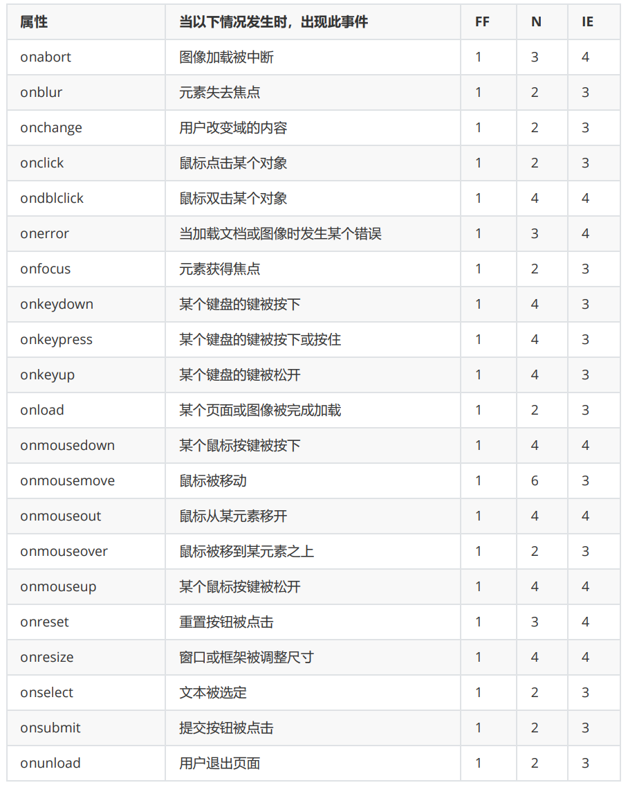

# JavaScript基础语法
## JS的组成
- ECMAScript（JavaScript语言基础）
- Web APIs
  - DOM 页面文档对象模型
  - BOM 浏览器对象模型

## JS的书写位置（同CSS）
- 行内 Javascript
  - 后面vue框架会用这种模式
- 内部Javascript
  - 规范：script标签写在&lt;/body&gt;上面
  - 扩展：alter('你好，js')页面弹出警告对话框
- 外部JavaScript
  - &lt;script src='./js/my.js'&gt;&lt;/script&gt;
  
## JS的注释
- /* */ 多行注释
- // 单行注释

## 严格模式
- 定义：严格模式是一种不同的javascript解析和执行模型
- 作用：ECMAScript的一些不规范写法会被处理，对于不安全活动将抛出错误
- 启动方法：
  - 在脚本开头加上："use strict";
  - 也可以指定一个函数在严格模式下执行，只要把预处理指令放到函数体开头即可
  ```js
  function doSometing() {
    "use strict";
    // 函数体
  }
  ```
- 严格模式会影响JavaScript执行的很多方面，后续用到会一一指出
  

## 输入输出语法
```javascript
/*输出语法*/
document.write('要出的内容')
document.write('<h1>一级标题</h1>') //允许打印标签
// document.write无自动换行功能
alert('要出的内容') // 弹出窗口，只有确定
confirm('要出得内容') // 弹出对话框，和alert对比多了个取消得选择
console.log('控制台打印') // 程序员调试使用，页面不显示，只显示在控制台

/*输入语法*/
prompt('请输入你的年龄')
```

## 变量
- 变量的声明
  - var
  ```js
  1. var 声明作用域

  // 使用var操作符定义的变量会成为它的函数的局部变量。比如使用var在函数内部定义一个变量，就意味着该变量将在函数退出时被销毁。
  function test() {
    var message = "hi"; // 局部变量
  }
  test();
  console.log(message); //出错

  // 去掉var操作符，message会变成全局变量，只要调用一次函数test()，就会定义这个变量，并可以在函数外部被访问
  function test() {
    message = "hi"; // 全局变量
  }
  test();
  console.log(message); // "hi"
  // 不推荐这么做，在严格模式下，这么做会报错

  2. var 声明提升

  // 使用var时，下面的代码不会报错。因为var声明的变量会自动提升到函数作用域顶部，(只提升声明，不带赋值)
  function foo() {
    console.log(age);
    var age = 26;
  }
  foo (); // undefined

  // 上述代码等价于
  function foo() {
    var age;
    console.log(age);
    age = 26;
  }
  foo (); // undefined

  // 所谓“提升”(hoist)，就是把所有声明都拉到函数作用域顶部。此外，反复多次使用var声明同一个变量是没问题的。
  function foo() {
    var age = 16;
    var age = 26;
    var age = 36;
    console.log(age);
  }
  foo(); // 36

  ```
  - let
  ```js
  let跟var作用类似，主要区别有；

  1. let声明范围是块作用域，var声明范围是函数作用域

  if (true) {
    var name = 'Matt';
    console.log(name); // Matt
  }
  console.log(name); // Matt

  if (true) {
    let age = 26;
    console.log(age); //26
  }
  console.log(age); // 报错：ReferenceError: age没有定义

  2. 声明冗余

  var name;
  var name; // 不会报错

  let age;
  let age; // 报错，同一个作用域内，相同变量，let只能声明一次

  3. let声明的变量不会在作用域中被提升

  console.log(age); // 报错：ReferenceError: age没有定义
  let age = 26;

  4. 全局声明，使用let在全局作用域中声明的变量不会成为window对象的属性(var声明的变量则会)
  
  var name = 'Matt';
  console.log(window.name); // 'Matt'

  let age = 26;
  console.log(window.age); // undefined

  ```
  - const :详情：<a href='#常量'>常量</a>

  - 总结：不要使用var,let和const中，优先使用const，只在提前知道未来会有修改时，再使用let。这样可以让开发者更有信心地推断某些变量的值永远不会变，同时也能迅速发现因意外赋值导致的非预期行为。

- 变量的类型（详解）
  - 原始值与引用值
    - 定义:原始值就是最简单的数据，引用值则是由多个值构成的对象
    - 引用值详解：引用值是保存在内存中的对象。JavaScript不允许直接访问内存位置，因此也就不能直接操作对象所在的内存空间。在操作对象时，实际上操作的是对该对象的引用而非实际的对象本身。为此，保存引用值得变量是按引用访问的
    - 动态属性：
    ```js
    let person = new object();  // 创建一个对象，并把它保存在person中
    person.name = "Nicholas";   //给这个对象添加一个名为name的属性，并赋值
    // 在此之后，就可以访问这个新属性，直到对象被销毁或属性被显式的删除
    console.log(person.name); // "Nicholas"
    ```
  - 复制值
    - 原始值：通过变量把一个原始值赋值到另一个变量时，原始值会被复制到新变量的位置
    ```js
    let num1 = 5;
    let num2 = num1;
    // 此时num1和num2的值都是5，但是在两个不同的内存空间，二者独立，互不干扰。
    ```
    - 引用值：引用值在复制的时候，实际上复制的是指针，指向存储在堆内存中的对象。操作完成后，两个变量实际指向同一个对象，即同一个内存空间，因此一个对象上面的变化会在另一个对象上反映出来。
    ```js
    let obj1 = new Object();
    let obj2 = obj1;
    obj1.name = "Nicholes";
    console.log(obj2.name); // "Nicholes"
    ```
  
- 变量的赋值
  - 变量 = 值
```javascript
let age // 声明一个变量
age = 18 //赋值
alert(age)

let age = 18 // 声明的同时直接赋值
let age = 18,uname = 'pink' //一次声明多个变量，用逗号隔开，但是不建议
```
- 标识符的写法：
  - 建议驼峰写法：即一个单词首字母小写，后面的单词首字母大写
  - firstSecond
  - myCar
  - doSomethingImportang
  - 这种写法不是强制性的，但因为这种形式跟ECMAScript内置函数和对象的命名方式一致，因此是最佳实践
- 变量的引用：
  - 模板字符串
  - 使 用：&#96;${ 所引用变量 }&#96;
  - 模式
```js
var name = 'GeekTime';
var age = '26';

console.log('name:'+ name + ',age:' + age); //传统写法
console.log(`我是${name},age:${age}.`); //ES6写法
```
## 数组（Array）
```javascript
let arr = [1,2,3,4,5]
console.log(arr[0])
console.log(arr.length) //返回数组的长度
```

## 常量
  - 概念：使用const声明的变量称为：“常量”
  - 注意：常量不允许重新赋值，声明的时候必须赋值（初始化）
```javascript
// 声明一个常量
const G = 9.8
console.log(G)
```

## 数据类型
- 分类：基本数据类型；引用（复杂）数据类型
- 基本数据类型和引用数据类型的区别
  - 基本数据类型：参数赋值的时候，传数值。
  - 引用数据类型；参数赋值的时候，传地址（修改的同一片内存空间）
- 基本数据类型（值类型）
  - number 数字型
    - 算术运算符：+ - * / %
    - 数值范围：由于内存限制，ECMAScript并不能保存世界上所有的数值。
      - 最大值：Number.MAX_VALUE，这个值为：1.7976931348623157e+308
      - 最小值：Number.MIN_VALUE，这个值为：5e-324
    - 如果使用Number表示的变量超过了最大值，则会返回Infinity。
      - 无穷大（正无穷）：Infinity
      - 无穷小（负无穷）：-Infinity
    - 注意：typeof Infinity的返回结果是number
    - NaN
      ```js
      0、+0、-0相除会返回NaN

      console.log(0/0);  // NaN
      console.log(-0/+0);   //NaN

      如果分子是非0值，分母是有符号或无符号的0，则返回Infinity或-Infinity

      console.log(5/0);   // Infinity
      console.log(5/-0);    // -Infinity

      isNaN()
      该函数接收一个（可以是任意数值类型）的参数，判断这个参数是否“不是数值”。

      console.log(isNaN(NaN)) // true
      console.log(isNaN(10))  //false
      console.log(isNaN("10"))   // false
      console.log(isNaN("blue"))  //true
      
      ```
    - 任何涉及NaN的操作始终返回NaN
    - NaN不等于包含NaN在内的任何值

  - string字符串型
    - 模板拼接：反引号在最外围括住，变量则使用${}
    -   ```js 
        let age = 30
        document.write(`我今年他妈的${age}岁了`)

        let name = prompt('input your name:')
        let age = prompt('input your age:')
        document.write(`大噶好，我叫${name}，今年${age}岁了`)
        ```
    - 模板字符串支持嵌套使用
        ```js
        const nameList = ['极客时间','渗透测试','网络安全']；

        function myTemplate(){
          //join('')的意思是，把数组里的内容合并成一个字符串
          return `<ul>
          ${nameList
            .map((item) => `<li>${item}</li>`)
            .join('')}
          </ul>`;
        }
        document.body.innerHTML = myTemplate();
        ```
    - 模板字面量
      ```js
      // 这个模板字面量在换行之后有25个空格符
      let myTemplateLiteral = `first line
                               second line`;
      console.log(myTemplateLiteral.length);  // 47

      // 这个模板字面量以一个换行符开头
      let secondTemplateLiteral = `
      first line
      second line`;
      console.log(secondTemplateLiteral[0] === '\n'); // true

      // 这个模板字面量没有意料之外的字符
      let thirdTemplateLiteral = `first line
      second line`;
      console.log(thirdTemplateLiteral);
      // first line
      // second line
      ```
    - 字符串长度可以通过length属性获取
      - console.log(text.length); // text字符串长度
    - 转换为字符串
      - toString()
        - 返回当前值的字符串等价物
          ```js
          let age = 11;
          let ageAsString = age.toString();   // 字符串"11"
          let found = true;
          let foundAsString = found.toSting();  // 字符串"true"
          ```
      - 加号操作符给一个值 + ""空字符串
    - 模板字面量-标签函数
      - 定义：标签函数（Tagged Template Literals）是一个高级用法，允许你通过一个函数来解析模板字符串。这个特性可以用于创建自定义的字符串操作函数，用于处理内嵌表达式和字符串文字等。
      - 用法
      ```js
      function myTag(strings, ...values) {
        // ...
      }

      const variable = 'world';
      const result = myTag`Hello ${variable}!`;
      // myTag 是一个标签函数。当一个模板字符串 Hello ${variable}! 被该标签函数标记时，该模板字符串的文字和表达式会分别被传递给 myTag 函数的 strings 和 values 参数。

      参数详解：
      1. strings：这是一个包含所有字符串文字的数组。例如，对于模板字符串 Hello ${variable}!，strings 数组会是 ['Hello ', '!']。
      2. ...values：这是一个包含所有内嵌表达式求值结果的数组。对于上面的模板字符串，values 数组会是 [ 'world' ]。

      示例：
      function myTag(strings, ...values) {
        let str = '';
        for(let i = 0; i < strings.length; i++) {
          str += strings[i];
          if(i < values.length) {
            str += values[i];
          }
        }
        return str.toUpperCase();
      }

      const name = 'John';
      const result = myTag`Hello ${name}`;
      console.log(result);  // 输出 "HELLO JOHN"

      // 标签函数，就是将字符串中的字符和变量分别以数组的形式存入参数，再在函数内部，进行操作。

      ```
    - 原始字符串（String.raw标签函数）
      - 示例
      ```js
      // Unicode 示例
      // \u00A9 是版权符号
      console.log(`\u00A9`);    // ©
      console.log(String.raw`\u00A9`)   // \u00A9

      // 换行符示例
      console.log(`first line\nsecond line`);
      // first line
      // second line
      console.log(String.raw`first line\nsecond line`)
      // first line\nsecond line

      // 对实际的换行是不行的
      // 它们不会被转换成转义序列的形式
      console.log(`first line
      second line`)
      // first line
      // second line
      console.log(String.raw`first line
      second line`)
      // first line
      // second line

      // 另外，也可以通过标签函数的第一个参数，即字符串数组的.raw属性取得每个字符串的原始内容
      function printRaw(strings) {
        console.log('Actual characters:');
        for (const string of strings) {
          console.log(string);
        }

        console.log('Escaped characters:');
        for (const rawString of strings.raw) {
          console.log(rawString);
        }
      }

      printRaw`\u00A9${'and'}\n`;
      // Actual characters:
      // ©
      // (换行符)
      // Escaped characters:
      // \u00A9
      // \n
      ```  

  - boolean 布尔型
    - true | false
    - 不同类型与布尔值之间的转换规则
    <table>
      <thead>
            <th style="background-color: darkred; color: white;">数据类型</th>
            <th style="background-color: darkred; color: white;">转换为true的值</th>
            <th style="background-color: darkred; color: white;">转换为false的值</th>
      </thead>
      <tbody>
        <tr>
            <td>Boolan</td>
            <td>true</td>
            <td>false</td>
        </tr>
         <tr>
            <td>String</td>
            <td>非空字符串</td>
            <td>""空字符串</td>
        </tr>
         <tr>
            <td>Number</td>
            <td>非零数值</td>
            <td>0、NaN</td>
        </tr>
         <tr>
            <td>object</td>
            <td>任意对象</td>
            <td>null</td>
        </tr>
         <tr>
            <td>Undefined</td>
            <td>N/A(不存在)</td>
            <td>undefined</td>
        </tr>
      </tbody>
    </table>
  - Symbol类型
    - 作用：Symbol（符号）是ECMAScript6新增的数据类型。符号是原始值，且符号实例是唯一、不可变的。符号的用途是确保对象属性使用唯一标识符，不会发生属性冲突的危险；符号就是用来创建唯一记号，进而用作非字符串形式的对象属性
    - 符号的基本用法
    ```js
    符号需要使用Sysmbol()函数初始化。因为符号本身是原始类型，所以typeof操作符对符号返回symbol。
    let sym = Symbol();
    console.log(typeof sym); //symbol

    调用Symbol()函数时，也可以传入一个字符串参数作为对符号的描述(description),将来可以通过这个字符串来调试代码
    但是，这个字符串参数与符号定义或标识完全无关，仅仅至少描述。
    let genericSymbol = Symbol();
    let otherGenericSymbol = Symbol();

    let fooSymbol = Symbol('foo');
    let otherFooSymbol = Symbol('foo');

    console.log(genericSymbol == otherGenericSymbol);   // false
    console.log(fooSymbol == otherFooSymbol);   // false
    // 再次强调，符号实例：唯一，不可变

    最重要的是：Symbol()函数不能与new关键字一起作为构造函*数使用。这样做是为了避免创建符号包装对象，像使用Boolean、String或Number那样，它们都支持构造函数且可用于初始化包含原始值的包装对象
    let myBoolean = new Boolean();
    console.log(typeof myBoolean); // "object"

    let myString = new String();
    console.log(typeof myString); // "object"

    let myNumber = new Number();
    console.log(typeof myNumber); // "object"

    let mySombal = new Sombal(); // TypeError: Symbol is not a constructor
    ```
    - 上述知识点-关于构造函数的解释
      - 定义：在 JavaScript 中，构造函数是用于创建和初始化一个对象的特殊方法。构造函数其实就是一个普通的 JavaScript 函数，但是它是通过使用 new 关键字来调用的。
      - 基础语法
      ```js
      function Person(name, age) {
        this.name = name;
        this.age = age;
        this.describe = function() {
          return `${this.name} is ${this.age} years old.`;
        };
      }

      const john = new Person('John', 30);
      const jane = new Person('Jane', 25);
      /* 在这个例子中，Person 是一个构造函数，用于创建一个包含 name、age 和 describe 方法的对象。
      我们使用 new 关键字创建了两个新的 Person 对象：john 和 jane。*/

      ```
      - 使用new关键字（当一个函数与new关键字一起被调用时）
        - JavaScript会创建一个新的空对象
        - 这个新对象会被设置为函数（构造函数）的this上下文
        - 函数的this上下文会被填充属性和方法
        - 除非构造函数显式返回一个对象，否则新创建的对象会作为new表达式的结果返回
      - 关于上述调用new函数的过程详解中“上下文的含义”
        - 当我们说一个新的空对象会被设置为函数（构造函数）的“this上下文时”，我们是在说这个新的空对象将成为函数内部this关键字的值
        - 换句话说，在构造函数中，this关键字会指向一个新创建的对象。这个对象就是这个特定函数调用（与new关键字一起）的“上下文”
        - 示例：
        ```js
        function Person(name, age) {
          this.name = name;
          this.age = age;
        }
        ```
        - 当你使用new Person('John',30)创建一个新对象时
          - JavaScript会创建一个新的空对象，比如{}
          - 这个新对象会成为Person函数内部this的值，或者说，新对象会被设置为Person函数的this上下文
          - 函数体内的this.name=name;和this.age=age;语句会在这个新对象上设置name和age属性
          - 由于Person构造函数没有显示返回一个对象，因此这个新对象会作为整个new Person('John',30)表达式的结果被返回
        - 总结：this提供了一个在函数体内部与特定对象的交互方式，而这个特定对象就是函数的上下文。这里的上下文就是this指向的那个对象
        - 后续关于构造函数更深入的内容，详情见函数章节
  - undefined 未定义类型
    - 只有一个值：undefined
    - undefined是一个假值
    - 只声明变量，不赋值的情况下，默认变量为undefined
    - 工作场景：
      - 开发过程中，经常声明一个变量，等待传送过来的数据。<br>如果我们不知道这个数据是否传递过来，此时我们可以通过检测这个变量是不是undefined，就判断用户是否有数据传递过来。
  - null 空类型
    -  null和undefined的区别
       -  undefined 表示没有赋值
       -  null 表示赋值了，但是内容为空
       -  undeined == null 这个值是true
       -  undeined === null 这个值是false
       -  永远不必显式地将变量值设置为undefined。但null不是这样。任何时候，只要变量要保存对象，而当时又没有那个对象可保存，就要用null来填充该变量。
    - null 开发中的使用场景
      - 官方解释：把null作为尚未创建的对象
      - 人话：将来有个变量里面存放的是一个<em>对象</em>,但是对象还没创建好，可以先给个null。
- 检测数据类型
  - 作为运算符：typeof X (常用写法)
  - 函数形式：typeof(x)
- 引用数据类型（引用类型）
  - object 对象类型：内置对象Function，Array，Date，RegExp，Error等都是属于Object类型。也就是说，除了那物种基本数据类型之外，其他的，都称之为Object类型。
    - Dirct类型（相当于字典）由键值对组成得无需集合
      - {键名1:值1,键名2:值2,...}
      - 注意：在js中，键一般是字符串，值可以是任意数据类型
      - 取值方式
      ```js
      let a = {'name':'lucy','age':19}
      document.write('g变量中name得值：',g.name,'<br>')
      document.write('g变量中age得值：',g.['age'],'<br>')
      // 对象类型得两种取值方式
      ```
  
## 类型转换
- 隐式转换
  - <span id="sum">加号两边，只要有一侧是字符串，默认都是字符串</span>
  - 2 - '2' 减法自动转换为数字型 = 0，（减，乘，除，都一样）
  - + '123' 单用加号，将数字类得字符串，转换为数字型
- 显式转换
  - 转换为数字型
    - Number(数据)
      - 如果字符串内容里有非数字，转换失败时结果为NaN，即不是一个数字
      - NaN也是number类型的数据，代表非数字
    - +变量
        ```javascript
        let str = '123'
        typeof +str
        // 输出类型为number
        ```
    
    - parseInt（数据）   
        ```javascript
        //只保留整数部分
        console.log(parseInt('12px')) //输出结果为12
        console.log(parseInt('12.94px')) //输出结果为12

        // parseInt()转换规则：
        /* 字符串最前面的空格会被忽略，从第一个非空格字符开始转换
          如果第一个字符不是数值字符、加号或减号，parentInt()立即返回NaN，这意味着空字符串也返回NaN，这里和Number()不一样，Number()返回0
          如果是数值、加号或减号，则继续依次检查每个字符直到末尾，或碰到非数值字符。比如"1234px"，返回1234

          由于数值有多种格式，如：八进制，十六进制等，因此parentInt()有第二个参数，用于指定进制数*/
        
        let num = parseInt("AF",16) //175
        let num = parseInt("10",2)  // 2

        ```
    - parseFloat（数据）
        ```javascript
        //可以保留小数
        console.log(parseFloat('12px')) //输出结果为12
        console.log(parseFloat('12.94px')) //输出结果为12.94

        // parseFloat()只能解析十进制数值
        ```
### <a href='prac/数据转换类型.html'>练习1：计算两数之和</a>
## 运算符
- 算数运算符
- 自增/自减运算符
- 一元运算符
- 逻辑运算符
- 赋值运算符
- 比较运算符
- 三元运算符
  
### 算术运算符
<table>
  <thead>
    <th>
        运算符
    </th>
    <th>
        描述
    </th>
  </thead>
  <tbody>
    <tr>
      <td>
        +
      </td>
      <td>
        加，字符串连接
      </td>
    </tr>
    <tr>
      <td>
        -
      </td>
      <td>
        减
      </td>
    </tr>
    <tr>
      <td>
        *
      </td>
      <td>
        乘
      </td>
    </tr>
    <tr>
      <td>
        /
      </td>
      <td>
        除
      </td>
    </tr>
    <tr>
      <td>
        %
      </td>
      <td>
        获取余数（取余，取模）
      </td>
    </tr>
  </tbody>
</table>
- 注意事项：浮点数运算的精度问题

  - 在JS中，整数中的运算基本可以保证精确，但是小数的运算，可能会得到一个不精确的结果。所以，千万不要使用JS进行对精确度要求比较高的运算。
  
  - 处理方法
  
    - 如果只是一些简单的精度问题，可以使用toFix()方法进行小数的截取。
  
      ```javascript
      number.toFixed([digits])
      ```
      - digits 是一个可选参数，它指定要保留的小数位数。它应该是0到20之间的整数（包含0和20）
      - 遵循四舍五入，而不是单纯的截取
      - 不指定digits时，默认为0，即四舍五入到最近的整数
  
    - 在实际开发中，关于浮点数计算的精度问题，往往比较复杂。市面上有很对针对数学运算的开源库，比如decimal.js、Math.js。这些开源库都比较成熟，我们可以直接拿来用。
      - Math.js：属于很全面的运算库，文本很大，压缩后的文件就有500kb。如果你的项目涉及到大型的复杂运算，可以使用Math.js
      - decimal.js：属于轻量级的运算库，压缩后的文件只有32kb，大多数项目的数月运算，使用decimal.js足够了。
    - 在使用这几个开源库时，既可以用cdn的方式引入，也可以用npm包的方式引入。
    ```html
    <script src="https://cdn.bootcdn.net/ajax/libs/decimal.js/10.2.0/decimal.min.js"></script>
    <script>
      console.log('加法：');
      var a = 0.1;
      var b = 0.2;
      console.log(a + b)
      console.log(new Decimal(a).add(new Decimal(b)).toNumber());

      console.log('减法：');
      var a = 0.1;
      var b = 0.2;
      console.log(a - b)
      console.log(new Decimal(a).sub(new Decimal(b)).toNumber());

      console.log('乘法：');
      var a = 0.1;
      var b = 0.2;
      console.log(a * b)
      console.log(new Decimal(a).mul(new Decimal(b)).toNumber());

      console.log('除法：');
      var a = 0.1;
      var b = 0.2;
      console.log(a / b)
      console.log(new Decimal(a).div(new Decimal(b)).toNumber());

    </script>
    ```

    - 在正常的开发过程中，一般复杂的计算不会在前端进行，而是在后端计算好后，将值传给前端。 
  
### 自增/自减运算符
- 自增分为两种：`a++` 和 `++a`
- 二者区别：
  - `a++`：先用再加
  - `++a`：先加再用
- 自减：`a--` 和 `--a`
- 二者区别：与自增相同

### 一元运算符
- typeof
- <a href="#sum">`+`：详情见隐式转换，点击查看</a>
- `-`：对数字取反

### 逻辑运算符
- 逻辑运算符有3个
  - && 与
  - || 或
  - ! 非

- 非布尔值的与或运算【重要】
  - 之所以重要，是因为在实际开发中，我们经常用这种代码做容错处理或兜底处理（SQL注入中常用）
  - 非布尔值进行与或运算时，会先将其转换为布尔值，然后再运算，但返回结果是原值。比如说：
  ```js
  var result = 5 && 6; // 运算过程：true && true;
  console.log('result：' + result); // 打印结果：6（也就是说最后面的那个值。）
  ```
  - 与运算的返回结果：（以多个非布尔值的运算为例）
    - 如果第一个值为false，则执行第一条语句，并直接返回第一个值；不会再往后执行。
    - 如果第一个值为true，则继续执行第二条语句，并返回第二个值（如果所有的值都为true，则返回的是最后一个值）。
  - 或运算的返回结果：（以多个非布尔值的运算为例）
    - 如果第一个值为true，则执行第一条语句，并直接返回第一个值；不会再往后执行。
    - 如果第一个值为false，则继续执行第二条语句，并返回第二个值（如果所有的值都为false，则返回的是最后一个值）。
  
### 赋值运算
- 可以将符号右侧的值赋值给符号左侧的变量。
  - `=`直接赋值。比如 var a = 5
  - `+=` 。a += 5 等价于 a = a + 5
  - `-=` 。a -= 5 等价于 a = a - 5
  - `*=` 。a *= 5 等价于 a = a * 5
  - `/=` 。a /= 5 等价于 a = a / 5
  - `%=` 。a %= 5 等价于 a = a % 5

- `==` 和 `===`
  - `==`：只判断值，不判断数据类型
  - null == undefined 这个值是true
  - `===`：既判断值，也判断数据类型
  
### <a href="#sanyuan">三元运算符</a>
- 详情点击标题，跳转至分支语句

## 扩展内容1
- Unicode编码的使用
  - 在字符串中可以使用转义字符输入Unicode编码。格式如下：
  - `\u四位编码`
  - 可以在一定程度上，规避网站对特殊符号的限制

- 事件句柄
  - HTML 4.0 的新特性之一是有能力使 HTML 事件触发浏览器中的动作action），比如当用户点击某个HTML 元素时启动一段 JavaScript。下面是一个属性列表，这些属性可插入 HTML 标签来定义事件动作，相当于是在 HTML 标签中插入了事件句柄，可以接收JS代码并执行。
  - 

## 语句
### 分支语句
- 分支语句包含
  - if分支语句
  - 三元运算符
  - switch语句

- if语句
  - 语法
  ```js
  if (条件){
      满足条件要执行的代码
  }
  else {
      不满足条件执行的代码
  }
  ```
  - 0和空字符串""都是false
  - 多分枝if语法
  ```js
  if (条件1) {
      代码1
  }else if (条件2) {
      代码2
  }else if (条件3) {
      代码3
  }else{
      代码n
  }
  ```
- <span id="sanyuan">三元运算符</span>
  - 使用场景：是比if双分支更简单的写法，可以使用三元表达式
  - 语法
  ```js
  条件 ? 满足条件执行的代码 : 不满足条件执行的代码
  ```
  - 一般用来取值

- switch语句
  - 作用：利用switch执行满足条件的语句
  - 语法
  ```js
  switch (数据) {
    case 值1:
        代码1
        break
    case 值1:
        代码1
        break
    default:
        代码n
        break
  }
  ```
  - 注意：
    - switch一定要注意，必须是===全等，一定注意数据类型，同时注意break，否则会有穿透效果。
    - switch case语句一般用于等值判断，不适合于区间判断
    - switch case一般需要配合break关键字使用 没有break会造成case穿透
  - 总结switch和if...else...的区别
    - 当分支比较少时，if...else语句执行效率高
    - 当分支比较多时，switch语句执行效率高，而且结构更清晰。

### 循环语句
- do-while
  - do-while语句是一种后测试循环语句，即循环体中的代码执行后才会对退出条件进行求值。换句话说，<font color=tomato>循环体内的代码至少执行一次。</font>
  - 语法：
  ```js
  do {
    statment
  } while (expression);

  示例：

  let i = 0;
  do {
    i += 2;
  } while (i < 10);
  ```
- while循环
  - 基本语法
  ```js
  while (循环条件) {
      要重复执行的代码(循环体)
  }
  ```
  - while循环三要素：
    - 循环的本质就是以某个变量为起始值，然后不断产生变化量，慢慢靠近终止条件的过程。
  - 示例
  ```js
  let i = 1
  while (i <= 3) {
      document.write('我会循环3次<br>')
      i++
  }
  ```
  - 循环的退出
    - break：退出循环
    - continue：结束本次循环，继续下次循环

- for循环
  - 基本语法
  ```js
  for (变量起始值；终止条件；变量变化量) {
      //循环体
  }
  ```
  - 示例
  ```js
  // 利用for循环输出三句话 月薪过万
  for (let i = 1; i <= 3; i++) {
      document.write('月薪过万')
  }
  ```
  - 遍历数组
  ```js
  let arr = [1,2,3,4,5,6]
  for (let i = 0; i < arr.length; i++) {
      document.write(arr[i]+"<br>")
  }
  ```
  - 退出循环
    - continue 退出本次循环，一般用于排除或者跳过某一个选项的时候，可以使用continue
    - break 退出整个for循环，一般用于结果已经得到，后续的循环不需要的时候可以使用

  - 循环嵌套
  ```js
  for (外部声明记录循环次数的变量； 循环条件；变化量) {
      for (内部声明记录循环次数的变量；循环条件； 变化量) {
          //循环体
      }
  }
  ```
### <a href='prac/九九乘法表.html'>练习2：九九乘法表</a>

## Array详解
- 数组的基本使用
  
  - 声明数组
  ```js
  // 字面量声明数组
  let 数组名 = [数据1, 数组2, ..., 数组n]

  // 使用 new Array 构造函数声明
  let arr = new Array(数据1, 数组2, ..., 数组n)
  ```
- 操作数组
  - 修改数组的值
  ```js
  // 修改
  let arr = ['curry','james','kobi']
  console.log(arr)
  for (let i )

  // 进阶：遍历修改
  let arr = ['curry','james','kobi']
  console.log(arr)
  for (let i = 0; i < arr.length; i++) {
      arr[i] = arr[i] + 'teacher'
  }
  console.log(arr)
  ```

  - 数组中添加新数据
  ```js
  //数组.push()：将一个或多个元素添加到数组的末尾，并返回该数组的新长度（重点）
  arr.push(元素1,元素2,...,元素n)

  // 示例：
  let arr = ['red','green']
  let length = arr.push('pink')
  console.log(arr) //  ['red','green','pink']
  console.log(length) // 返回值：3（新数组长度）

  //数组.unshift(新增内容)
  // 将一个或多个元素添加到数组开头，并返回数组长度
  // 示例：
  let arr = ['red','green']
  let length = arr.unshift('pink')
  console.log(arr) //  ['pink','red','green']
  console.log(length) // 返回值：3（新数组长度）
  ```

- 删除数组中数据
```js
// 数组.pop()
//从数组中删除最后一个元素，并返回该元素的值

//示例：
let arr = ['red','green','blue']
val = arr.pop()
console.log(arr) //['red', 'green']
console.log(val) // blue

//数组.shift()
// 删除第一个元素，并返回该元素的值

//示例：
let arr = ['red','green','blue']
val = arr.shift()
console.log(arr) //['green', 'blue']
console.log(val) // red

// 数组.splice(start, deleteCount)
// deleteCount可选；默认删除到最后
// 删除指定元素

//示例：
let arr = ['red','green','blue']
arr.splice(1,1)
console.log(arr) //['red', 'blue']

```

- 查询数组中的数据
```js
// 数组.indexOf('value')
//查询数组中的指定元素的索引

//示例：
let arr = ['red','green','blue']
num = arr.indexOf('green')
console.log(num) // 1

```

## 综合练习
- <a href='prac/数据可视化案例.html'>综合练习1：数据可视化案例</a>

## 函数
- 基本语法
```js
function functionName(arg0, arg1, ..., argN) {
  statment
}

示例：
function sayHi(name,message) {
  console.log("Hello " + name + ", " + message);
}

ECMAScript中的函数不需要指定是否返回值。任何函数在任何时间都可以使用return语句来返回函数值，用法是后跟要返回的值

function sum(num1, num2) {
  return num1 + num2;
}
const result = sum(5, 10);
// 只要碰到return语句，函数就会立即停止执行并退出。因此，return语句后面的代码不会执行。
```