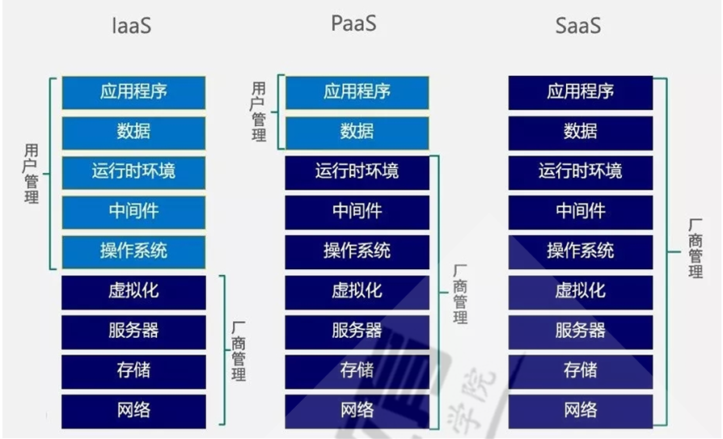

# 企业级云服务阿里云
## 阿里云服务介绍
云计算(Cloud Computing)的概念最早是由Google前首席执行官埃里克.施密特(EricSchmidt)在2006年8月9日的搜索引擎大会上首次提出的构想，而“云计算”就是这样构想的代名词，云计算以虚拟化为基础，以网络为中心，为用户提供安全，快速，便捷的数据存储和网络计算服务，包括所需要的硬件、平台、软件即服务等资源，而提供资源的网络就被称为“云”。

### 云计算分层


把计算机资源放在云端，如何提供给用户，又分为三种层次：
- 第一层次，是最底层的硬件资源，主要包括CPU（计算资源），硬盘（存储资源），还有网卡（网络资源）等，即为IAAS
  -  IaaS：Infrastructure as a service 基础设施即服务  自建基础服务(openstack)、阿里云ECS。 
- 第二层次，更高级些，用户不直接使用CPU、硬盘、网卡，而是希望把操作系统，数据库软件等安装好，用户再来使用，即为PAAS
  - PaaS：Platform-as-a-service 平台即服务， 如: 公有云的RDS云数据库（Relational Database Service）、docker、Redis、SLB(Server Load Balancer)等服务。 
- 第三层次，更进一步，用户期望不但要装好操作系统等服务，还要把具体的应用软件装好，例如:邮件、OA系统等，用户可以直接使用服务，即为SAAS   
  - SaaS：Software-as-a-service   软件即服务，如: 企业邮箱、OA系统、云盘、云音乐等

### 阿里云帮助
- 帮助文档：https://help.aliyun.com
- 工单系统：官方人工服务

### 阿里云账号
使用阿里云之前,需要先注册主帐号,并实名认证
当阿里云中需要进行资源的分别访问控制,可以创建不同的子帐号RAM

RAM (Resource Access Management) 是阿里云为客户提供的用户身份管理与访问控制服务。使用RAM，您可以创建、管理用户账号（比如员工、系统或应用程序），并可以控制这些用户账号对您名下资源具有的操作权限。当您的企业存在多用户协同操作资源时，使用RAM可以让您避免与其他用户共享云账号密钥，按需为用户分配最小权限，从而降低您的企业信息安全风险

#### 什么是RAM用户
RAM(Resource Access Management)用户是RAM的一种实体身份类型，有确定的身份ID和身份凭证，它通常与某个确定的人或应用程序一一对应。RAM用户具备以下特点：
- RAM用户由阿里云账号（主账号）或具有管理员权限的其他RAM用户、RAM角色创建，创建成功后，归属于该阿里云账号，它不是独立的阿里云账号
- RAM用户不拥有资源，不能独立计量计费，由所属的阿里云账号统一付费
- RAM用户必须在获得授权后，才能登录控制台或使用API访问阿里云账号下的资源
- RAM用户拥有独立的登录密码或者访问密钥
- 一个阿里云账号下可以创建多个RAM用户，对应企业的员工、系统或应用程序。

您可以创建RAM用户并为其授权，实现不同的RAM用户拥有不同资源访问权限的目的。当您的企业存在多用户协同访问资源的场景时，使用RAM可以按需为用户分配最小权限，避免多用户共享阿里云账号密码或访问密钥，从而降低企业的安全风险

同一账号下的不同资源组
- 分账账单：按子公司和业务线统计费用
- 授权分类：不同资源组分配不同权限

RAM管理控制台
```shell
https://ram.console.aliyun.com/overview
```

#### RAM访问控制
- 身份管理
- 权限管理

#### AccessKey管理


## 阿里云建站
### 建站过程：
域名注册 --> 计算存储 --> 备案 --> 构建应用 --> 发布网站

## 云数据库RDS
阿里云关系型数据库RDS（Relational Database Service）是一种稳定可靠、可弹性伸缩的在线数据库服务。基于阿里云分布式文件系统和SSD盘高性能存储，RDS支持MySQL、SQL Server、PostgreSQL和MariaDB TX引擎，并且提供了容灾、备份、恢复、监控、迁移等方面的全套解决方案，彻底解决数据库运维的烦恼。

申请RDS流程
创建实例 --> 设置白名单 --> 创建数据库 --> 创建账号 --> 连接数据库


## ESC快照
快照是某一时间点云盘数据状态的备份文件。云盘第一份快照是实际使用量的全量快照，不备份空数据块，后续创建的快照均是增量快照，只存储变化的数据块

## ESC镜像
ESC镜像提供了创建ECS实例所需的信息，创建ECS实例时，必须选择镜像。镜像文件相当于副本文件，该副本文件包含了一块或多块云盘中的所有数据，对于ECS实例而言，这些云盘可以是单块系统，也可以是系统盘加数据盘的组合

镜像是一种地域性资源，您不能跨地域使用镜像创建实例。


### 基于快照创建镜像

## 阿里云SLB
负载均衡SLB(Server Load Balancer)是一种对流量进行按需分发的服务，通过将流量分发到不同的后端服务来扩展应用系统的服务吞吐能力，并且可以消除系统中的单点故障，提升应用系统的可用性

阿里云负载均衡SLB分为两类：传统型负载均衡CLB和应用型负载均衡ALB
### ALB
专门面向七层，提供超强的业务处理性能，例如HTTPS卸载能力。单实例每秒查询数QPS（Query Per Second）可达100万次。同时ALB提供基于内容的高级路由特性，例如基于HTTP报头、Cookie和查询字符串进行转发、重定向和重写等，是阿里云官方云原生Ingress网关。更多信息，请参见什么是应用型负载均衡ALB。

### CLB
CLB：支持TCP、UDP、HTTP和HTTPS协议，具备强大的四层处理能力，以及基础的七层处理能力。

CLB通过设置虚拟服务地址，将添加的同一地域的多台ECS实例虚拟成一个高性能和高可用的后端服务池，并根据转发规则，将来自客户端的请求分发给后端服务器池中的ECS实例。
CLB默认检查云服务器池中的ECS实例的健康状态，自动隔离异常状态的ECS实例，消除了单台ECS实例的单点故障，提高了应用的整体服务能力。此外，CLB还具备抗DDoS攻击的能力，增强了应用服务的防护能力。

CLB由以下三个部分组成：
- 实例 （Instances）
  - 一个CLB实例是一个运行的负载均衡服务，用来接收流量并将其分配给后端服务器。要使用负载均衡服务，您必须创建一个CLB实例，并至少添加一个监听和两台ECS实例。
- 监听 （Listeners）
  - 监听用来检查客户端请求并将请求转发给后端服务器。监听也会对后端服务器进行健康检查。
- 后端服务器（Backend Servers）
  - 后端服务器是一组接收前端请求的ECS实例。您可以单独添加ECS实例到后端服务器池，也可以通过虚拟服务器组或主备服务器组来批量添加和管理。
