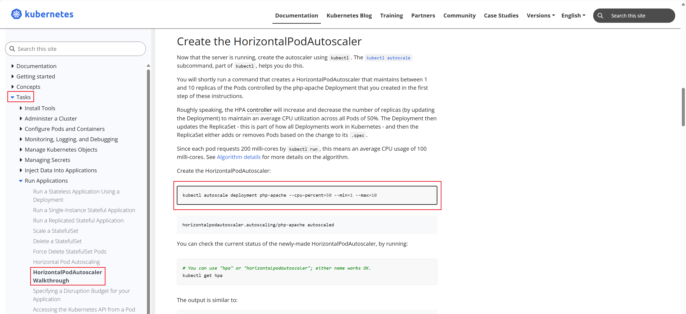
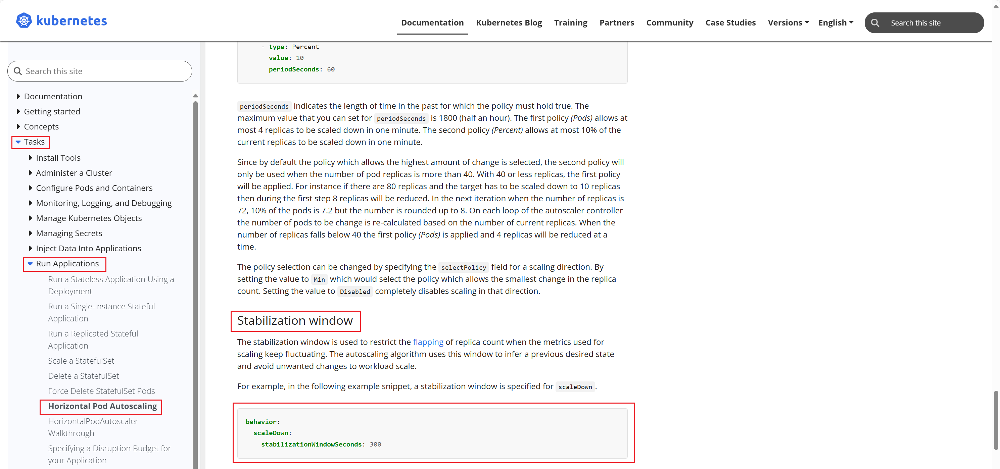
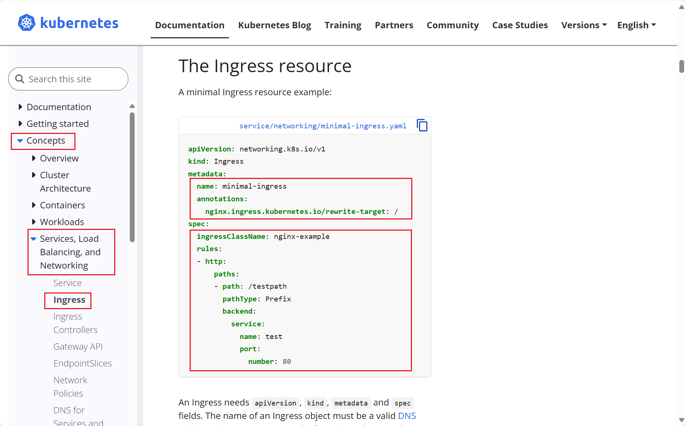
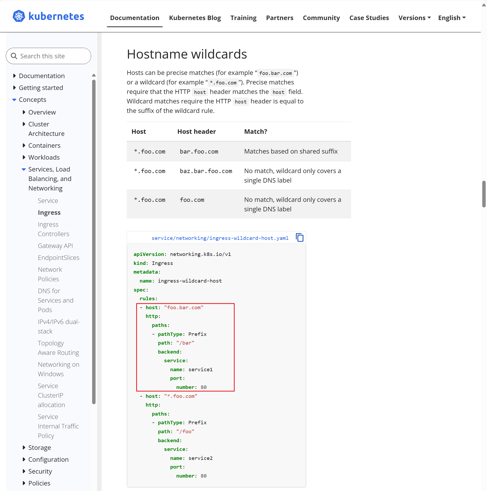
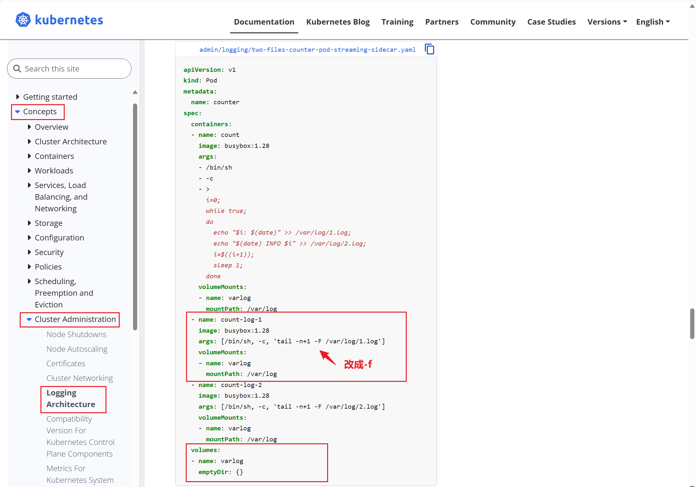
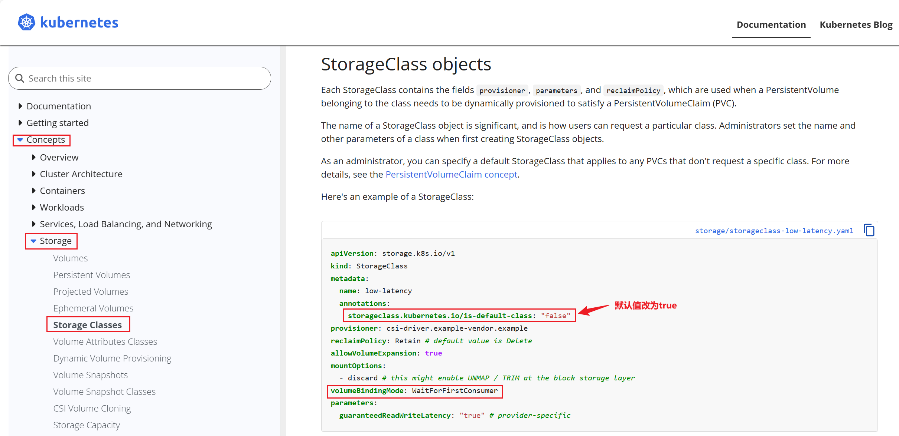
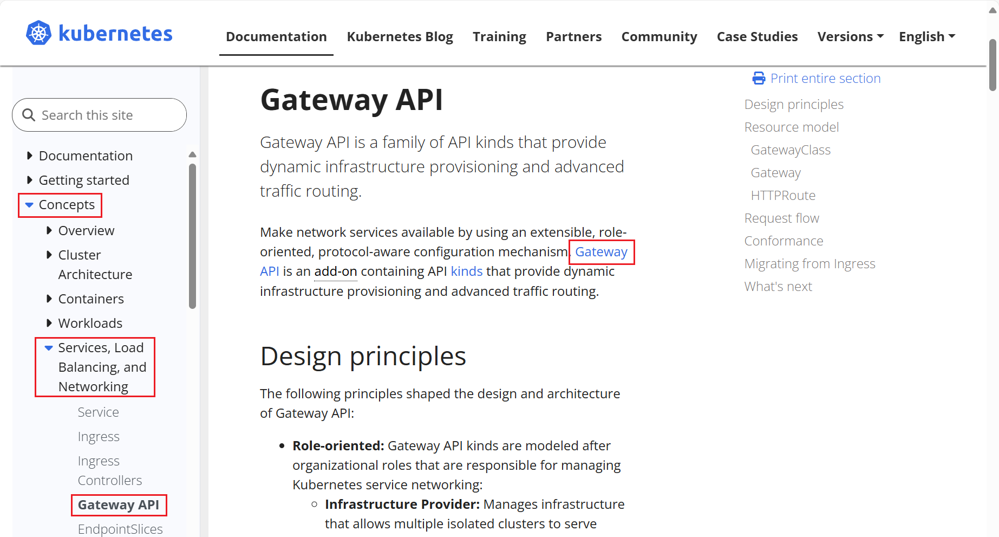
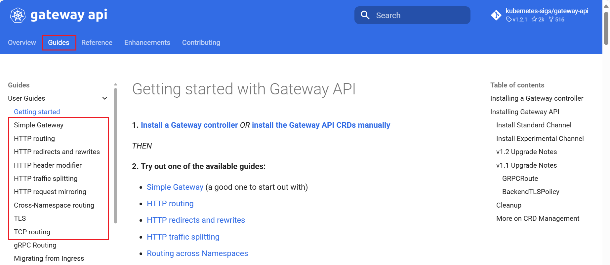
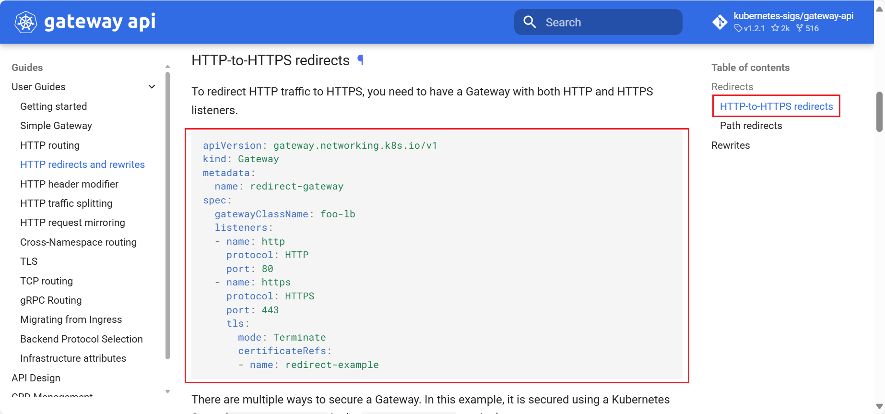

# CKA

- **HPA 自动扩缩容**
- **Ingress**
- **Sidecar**


## HPA 自动扩缩容

### 考题

```ABAP
在 autoscale namespace 中创建一个名为apache-server 的新HorizontalPodAutoscaler(HPA)。此HPA 必须定位到 autoscale namespace 中名为 apache-server 的现有Deployment 。 
将 HPA 设置为每个 Pod 的 CPU 使用率旨在 50% 。将其配置为至少有1个Pod，且不超过4个Pod 。此外，将缩小稳定窗口设置为 30 秒。 
```


### 参考链接

需要复制官网网页的内容  

尽量看英文网站，实在看不懂英文的，在K8S网站最右上角可以选择中文

```http
https://kubernetes.io/docs/tasks/run-application/horizontal-pod-autoscale-walkthrough/ 
```






### 解答

```bash
# 创建HorizontalPodAutoscaler 
kubectl autoscale -n autoscale deployment apache-server --cpu-percent=50 --min=1 --max=4

# 修改HorizontalPodAutoscaler 缩小稳定窗口为 30 秒 
kubectl -n autoscale edit horizontalpodautoscalers.autoscaling apache-server
...
spec:
  maxReplicas: 4
  behavior:
    scaleDown:
      stabilizationWindowSeconds: 30
...

# 检查HorizontalPodAutoscaler
kubectl -n autoscale describe horizontalpodautoscalers.autoscaling apache-server 
......
Metrics:                                               ( current / target )
  resource cpu on pods  (as a percentage of request):  <unknown> / 50%     # --cpu-percent=50
Min replicas:                                          1                   # --min=1
Max replicas:                                          4                   # --max=4
Behavior:
  Scale Up:
    Stabilization Window: 0 seconds
    Select Policy: Max
    Policies:
      - Type: Pods     Value: 4    Period: 15 seconds
      - Type: Percent  Value: 100  Period: 15 seconds
  Scale Down:
    Stabilization Window: 30 seconds                                      # stabilizationWindowSeconds: 30
    Select Policy: Max
    Policies:
      - Type: Percent  Value: 100  Period: 15 seconds
......
```

### 注意

```ABAP
别忘记，做完后，退回到base节点，这样下一道题才能继续切节点。 
exit
```


## Ingress

### 考题

```ABAP
您必须连接到正确的主机。不这样做可能导致零分。 
[candidate@base] $ ssh cka000024 

如下创建新的 Ingress 资源： 
名称： echo 
Namespace： sound-repeater 
使用 Service端口 8080 在 http://example.org/echo 上公开 echoserver-service Service。

可以使用以下命令检查echoserver-service Service的可用性，该命令应返回 Hello World ^_^： 
candidate@master01:~$ curl http://example.org/echo
```


### 参考链接

需要复制官网网页的内容  尽量看英文网站，实在看不懂英文的，在K8S网站最右上角可以选择中文 

```http
https://kubernetes.io/docs/concepts/services-networking/ingress/
```







### 解答

```bash
# 查看ingressClassName，发现名字为nginx
candidate@master01:~# kubectl get ingressclasses.networking.k8s.io
NAME    CONTROLLER             PARAMETERS   AGE
nginx   k8s.io/ingress-nginx   <none>       17d

# 创建ingress
candidate@master01:~# cat ingress.yml 
apiVersion: networking.k8s.io/v1
kind: Ingress
metadata:
  name: echo
  namespace: sound-repeater
  annotations:
    nginx.ingress.kubernetes.io/rewrite-target: /   # 这里必须写，用于URL重写，将example.org/echo,接收后，传递到后                                                     # 端的是example.org/，因为后端的pod并没有/echo/index.html这个                                                       资源
spec:
  ingressClassName: nginx                           # 查看ingressclasses.networking.k8s.io的名称，填在这里
  rules:
  - host: "example.org"                             # 写虚拟主机的域名
    http:
      paths:
      - pathType: Prefix
        path: "/echo"                               # 写url路径
        backend:
          service:
            name: echoserver-service                # Service名称
            port:
              number: 8080                          # Service暴露的端口
```


### 扩展解读

```bash
# 实际测试后端pod
candidate@master01:~# curl 10.244.14.101/echo
<html>
<head><title>404 Not Found</title></head>
<body bgcolor="white">
<center><h1>404 Not Found</h1></center>
<hr><center>nginx/1.12.2</center>
</body>
</html>

candidate@master01:~# curl 10.244.14.101
Hello World ^_^

# 上述可以看出，后端的pod并没有/echo下的资源，因此如果不做重定向，会报404
```

```bash
# 环境解读
candidate@master01:~# cat /etc/hosts
127.0.0.1 localhost
127.0.1.1 master01

# The following lines are desirable for IPv6 capable hosts
::1     ip6-localhost ip6-loopback
fe00::0 ip6-localnet
ff00::0 ip6-mcastprefix
ff02::1 ip6-allnodes
ff02::2 ip6-allrouters
11.0.1.111 master01
11.0.1.112 node01
11.0.1.113 node02

11.0.1.112 base
11.0.1.112 example.org
11.0.1.112 gateway.web.k8s.local
10.99.97.220 web.k8snginx.local

# 由此可知，当curl example.org的时候，ip会被解析为11.0.1.112，请求会打给11.0.1.112的宿主机

# 查看ingress-controller的配置，发现hostNetwork: true
candidate@master01:~# kubectl get pod -n ingress-nginx ingress-nginx-controller-244z6 -o yaml|grep -i network
  hostNetwork: true

# ingress的外部访问入口，使用的是宿主机网络，而Ingress默认暴露80端口，可以如下查看
candidate@master01:~# curl example.org/echo
Hello World ^_^

# 当然因为ingress同时也有一个svc，也可以通过svc将数据发给ingress-controll，使之进行处理
candidate@master01:~# kubectl get ingress -n sound-repeater 
NAME   CLASS   HOSTS         ADDRESS         PORTS   AGE
echo   nginx   example.org   10.99.167.108   80      61m


candidate@master01:~$ curl -H'host: example.org' 10.99.167.108/echo
Hello World ^_^

# 所以本质就是按照规则，将数据发给ingress-controller处理即可
```

**流量转发路径**

```ABAP
客户端 -> Ingress (80) -> Service (8080) -> Pod (80)
```


### 注意

```ABAP
别忘记，做完后，退回到base节点，这样下一道题才能继续切节点。
candidate@master01:~$ exit
```


## Sidecar


### 考题

```ABAP
Context 
您需要将一个传统应用程序集成到 Kubernetes 的日志架构(例如 kubectl logs)中。 
实现这个要求的通常方法是添加一个流式传输并置容器。 

Task 
更新现有的 synergy-leverager Deployment， 
将使用busybox:stable 镜像，且名为 sidecar 的并置容器，添加到现有的Pod 。 
新的并置容器必须运行以下命令： 
/bin/sh -c "tail -n+1 -f /var/log/synergy-leverager.log" 
 
使用挂载在 /var/log 的 Volume，使日志文件synergy-leverager.log 可供并置容器使用。 
 
除了添加所需的卷挂载之外，请勿修改现有容器的规范。
```


### 参考链接

需要复制官网网页的内容  

尽量看英文网站，实在看不懂英文的，在K8S网站最右上角可以选择中文 

```http
https://kubernetes.io/docs/concepts/cluster-administration/logging 
```




### 解答

```bash
# 按照题目要求，在base节点上执行，切换到题目要求节点 
candidate@master01:~# ssh master01

# 导出yaml
candidate@master01:~# kubectl get deployment synergy-leverager -o yaml > sidecar.yaml 

# 编辑yaml
candidate@master01:~# cat sidecar.yaml
......
spec:
  progressDeadlineSeconds: 600
  replicas: 1
  revisionHistoryLimit: 10
  selector:
    matchLabels:
      app: synergy-leverager
  strategy:
    rollingUpdate:
      maxSurge: 25%
      maxUnavailable: 25%
    type: RollingUpdate
  template:
    metadata:
      creationTimestamp: null
      labels:
        app: synergy-leverager
    spec:
      containers:
      - args:
        - /bin/sh
        - -c
        - |
          i=0; while true; do
            echo "$(date) INFO $i" >> /var/log/synergy-leverager.log;
            i=$((i+1));
            sleep 5;
          done
        image: busybox
        imagePullPolicy: IfNotPresent
        name: synergy-leverager
        resources: {}
        terminationMessagePath: /dev/termination-log
        terminationMessagePolicy: File
        # 添加 ------------
        volumeMounts:
        - name: varlog
          mountPath: /var/log
      - name: sidecar
        image: busybox:stable
        args: [/bin/sh,-c,'tail -n+1 -f /var/log/synergy-leverager.log']
        volumeMounts:
        - name: varlog
          mountPath: /var/log
      # 添加 ------------------
      dnsPolicy: ClusterFirst
      restartPolicy: Always
      schedulerName: default-scheduler
      securityContext: {}
      terminationGracePeriodSeconds: 30
      # 添加 ----------------
      volumes:
      - name: varlog
        emptyDir: {}
......

# 应用更新
candidate@master01:~# kubectl apply -f sidecar.yaml

# 检查Pod是否是Runing
candidate@master01:~# kubectl get pod
NAME                                READY   STATUS    RESTARTS        AGE
synergy-leverager-6fbc8b8b5-kmhv9   2/2     Running   0               33s
web-dep-7874f449fc-cwz92            1/1     Running   3 (8m33s ago)   17d

# 检查sidecar正常打印日志
candidate@master01:~# kubectl logs synergy-leverager-6fbc8b8b5-kmhv9 -c sidecar
Thu Mar 20 01:41:44 UTC 2025 INFO 0
Thu Mar 20 01:41:49 UTC 2025 INFO 1
Thu Mar 20 01:41:54 UTC 2025 INFO 2
Thu Mar 20 01:41:59 UTC 2025 INFO 3
Thu Mar 20 01:42:04 UTC 2025 INFO 4
Thu Mar 20 01:42:09 UTC 2025 INFO 5
Thu Mar 20 01:42:14 UTC 2025 INFO 6
Thu Mar 20 01:42:19 UTC 2025 INFO 7
Thu Mar 20 01:42:24 UTC 2025 INFO 8
Thu Mar 20 01:42:29 UTC 2025 INFO 9
Thu Mar 20 01:42:34 UTC 2025 INFO 10
Thu Mar 20 01:42:39 UTC 2025 INFO 11
Thu Mar 20 01:42:44 UTC 2025 INFO 12
Thu Mar 20 01:42:49 UTC 2025 INFO 13
Thu Mar 20 01:42:54 UTC 2025 INFO 14
Thu Mar 20 01:42:59 UTC 2025 INFO 15
Thu Mar 20 01:43:04 UTC 2025 INFO 16
Thu Mar 20 01:43:09 UTC 2025 INFO 17
Thu Mar 20 01:43:14 UTC 2025 INFO 18
......

# 别忘记，做完后，退回到base节点，这样下一道题才能继续切节点。
candidate@master01:~# exit
```


## StorageClass


### 考题

```ABAP
您必须连接到正确的主机。不这样做可能导致零分。 
[candidate@base] $ ssh cka000046 
 
Task 
首先，为名为 rancher.io/local-path 的现有制备器，创建一个名为 ran-local-path 的新 StorageClass 
将卷绑定模式设置为 WaitForFirstConsumer 
 
注意，没有设置卷绑定模式，或者将其设置为WaitForFirstConsumer之外的其他任何模式，都将导致分数降低。 
 
接下来，将 ran-local-path StorageClass 配置为默认的StorageClass 
 
请勿修改任何现有的Deployment和PersistentVolumeClaim，否则将导致分数降低。
```


### 参考链接

需要复制官网网页的内容  

尽量看英文网站，实在看不懂英文的，在K8S网站最右上角可以选择中文




### 解答

```bash
# 按照题目要求，在base节点上执行，切换到题目要求节点
candidate@base:~# ssh master01

# 创建 ran-local-path StorageClass
candidate@master01:~# vim sc.yaml
---
apiVersion: storage.k8s.io/v1
kind: StorageClass
metadata:
  name: ran-local-path
  annotations:
    storageclass.kubernetes.io/is-default-class: "true"
provisioner: rancher.io/local-pat
reclaimPolicy: Retain # default value is Delete
allowVolumeExpansion: true
mountOptions:
  - discard # this might enable UNMAP / TRIM at the block storage layer
volumeBindingMode: WaitForFirstConsumer
parameters:
  guaranteedReadWriteLatency: "true" # provider-specific


# 创建
candidate@master01:~# kubectl apply -f sc.yaml

# 验证 local-path 是否为默认的 StorageClass 
candidate@master01:~# kubectl get storageclasses.storage.k8s.io 
NAME                       PROVISIONER            RECLAIMPOLICY   VOLUMEBINDINGMODE      ALLOWVOLUMEEXPANSION   AGE
local-path                 nfs-client             Delete          Immediate              true                   17d
ran-local-path (default)   rancher.io/local-pat   Retain          WaitForFirstConsumer   true                   78s

# 别忘记，做完后，退回到base节点，这样下一道题才能继续切节点。 
candidate@master01:~# exit
```


## Service


### 考题

```ABAP
Task 
重新配置 spline-reticulator namespace 中现有的 front-end Deployment，以公开现有容器 nginx 的端口 80/tcp  
创建一个名为 front-end-svc 的新 Service ，以公开容器端口 80/tcp  
配置新的 Service ，以通过 NodePort 公开各个 Pod  
```


### 参考链接

无需参考


### 解答

```bash
# 按照题目要求，在base节点上执行，切换到题目要求节点
candidate@base:~# ssh master01

# 在线修改 front-end Deployment
candidate@master01:~# kubectl get deployments.apps -n spline-reticulator front-end -o yaml > front-end.yaml
candidate@master01:~# vim front-end.yaml 
......
      containers:
      - image: vicuu/nginx:hello
        imagePullPolicy: IfNotPresent
        name: nginx
        resources: {}
        terminationMessagePath: /dev/termination-log
        terminationMessagePolicy: File
        # 添加如下三行
        ports: 
        - containerPort: 80
          name: http
......

# configured表示修改成功
candidate@master01:~# kubectl apply -f front-end.yaml 
deployment.apps/front-end configured

# 使用NodePort类型，暴露80/tcp端口
candidate@master01:~# kubectl -n spline-reticulator expose deployment front-end --type=NodePort --port=80 --target-port=80 --name=front-end-svc
service/front-end-svc exposed

# #注意考试中需要创建的是NodePort，还是ClusterIP。如果是ClusterIP，则应改为 --type=ClusterIP 
#--port 是 service 的端口号，--target-port 是 deployment 里 pod 的容器的端口号， --name 是service 的名字

# 测试
candidate@master01:~# kubectl get svc -n spline-reticulator
NAME            TYPE       CLUSTER-IP      EXTERNAL-IP   PORT(S)        AGE
front-end-svc   NodePort   10.102.116.98   <none>        80:31549/TCP   34s

candidate@master01:~# curl 10.102.116.98
Hello World ^_^
candidate@master01:~# curl 11.0.1.112:31549
Hello World ^_^

# 别忘记，做完后，退回到base节点，这样下一道题才能继续切节点。 
candidate@master01:~# exit·
```


## Gateway


### 考题

```ABAP
您必须连接到正确的主机。不这样做可能导致零分。 
[candidate@base] $ ssh cka000057 
 
Task 
将现有 Web 应用程序从 Ingress 迁移到 Gateway API。您必须维护 HTTPS 访问权限。 
注意：集群中安装了一个名为 nginx 的 GatewayClass 。 
 
首先，创建一个名为 web-gateway 的 Gateway ，主机名为 gateway.web.k8s.local ，并保持现有名为 web 的Ingress 资源的现有 TLS 和侦听器配置。 
 
接下来，创建一个名为 web-route 的 HTTPRoute ，主机名为gateway.web.k8s.local ，并保持现有名为 web 的Ingress 资源的现有路由规则。 
 
您可以使用以下命令测试 Gateway API配置： 
[candidate@cka000057]$ curl -Lk https://gateway.web.k8s.local:31443 
 
最后，删除名为 web 的现有 Ingress 资源。
```


### 参考链接







### 解答

```bash
# 按照题目要求，在base节点上执行，切换到题目要求节点
candidate@base:~# ssh master01

# 检查现有Ingress，确定一些必要信息
# 查看Ingress的行为
# 查看tls的secretName
# 查看paths.path和service_name 和port_number
candidate@master01:~# kubectl get ingress web -o yaml >> web-ingress.yaml
candidate@master01:~# cat web-ingress.yaml 
apiVersion: networking.k8s.io/v1
kind: Ingress
metadata:
  annotations:
    kubectl.kubernetes.io/last-applied-configuration: |
      {"apiVersion":"networking.k8s.io/v1","kind":"Ingress","metadata":{"annotations":{"nginx.ingress.kubernetes.io/rewrite-target":"/","nginx.ingress.kubernetes.io/ssl-redirect":"true"},"name":"web","namespace":"default"},"spec":{"ingressClassName":"nginx","rules":[{"host":"ingress.web.k8s.local","http":{"paths":[{"backend":{"service":{"name":"web","port":{"number":80}}},"path":"/","pathType":"Prefix"}]}}],"tls":[{"hosts":["ingress.web.k8s.local"],"secretName":"web-cert"}]}}
    nginx.ingress.kubernetes.io/rewrite-target: /          # 将匹配到的path重写到/
    nginx.ingress.kubernetes.io/ssl-redirect: "true"       # 将http -> https
  creationTimestamp: "2025-03-02T06:10:13Z"
  generation: 3
  name: web
  namespace: default
  resourceVersion: "241698"
  uid: 09b1388f-12b1-4a89-8251-bf15f97a1b19
spec:
  ingressClassName: nginx
  rules:
  - host: ingress.web.k8s.local
    http:
      paths:
      - backend:
          service:
            name: web                                    # 后端的Service.name：web
            port:
              number: 80                                 # 端口是80
        path: /                                          # 匹配 /
        pathType: Prefix                                 # 类型是Prefix
  tls:
  - hosts:
    - ingress.web.k8s.local                              # hostname: ingress.web.k8s.local 改为gateway...
    secretName: web-cert                                 # SecretName: web-cert                             
status:
  loadBalancer:
    ingress:
    - ip: 10.99.167.108

# 因为题目中只能创建一个HTTPRoute，因此没办法实现http->https


# 创建 Gateway
apiVersion: gateway.networking.k8s.io/v1
kind: Gateway
metadata:
  name: web-gateway
spec:
  gatewayClassName: nginx
  listeners:
  - name: https
    protocol: HTTPS
    port: 443
    tls:
      mode: Terminate
      certificateRefs:
      - name: web-cert

# 创建 HTTPRoute
apiVersion: gateway.networking.k8s.io/v1
kind: HTTPRoute
metadata:
  name: web-route 
spec:
  parentRefs:
  - name: web-gateway
    sectionName: https
  hostnames:
  - gateway.web.k8s.local
  rules:
  # -----------------  这段可省略，不写默认和下方一致，pathType: PathPrefix，value: /是默认行为
  - matches:
    - path:
      type: PathPrefix
      value: /
 # -------------------
    backendRefs:
    - name: web
      port: 80  
      
# 查看nginx-gateway名称空间下的svc
# 默认情况下，NGF 会为每个 Gateway 自动创建 NodePort 类型的 Service，用于暴露 listener 端口；这是控制器根据 Gateway 动态创建的。
candidate@master01:~$ kubectl get svc -n nginx-gateway
NAME            TYPE       CLUSTER-IP     EXTERNAL-IP   PORT(S)                      AGE
nginx-gateway   NodePort   10.103.27.21   <none>        80:31880/TCP,443:31443/TCP   19d

# 因为是 NodePort 类型，访问任意节点的 31443 就会到达 Ingress Gateway
candidate@master01:~$ curl -kL https://gateway.web.k8s.local:31443
Hello World ^_^
```

