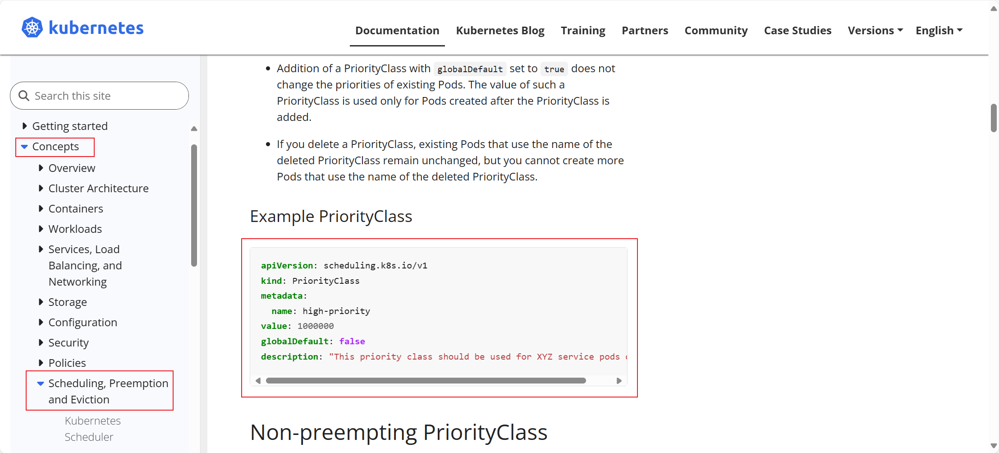

# CKA

- **HPA 自动扩缩容**
- **Ingress**
- **Sidecar**


## HPA 自动扩缩容

### 考题

```ABAP
在 autoscale namespace 中创建一个名为apache-server 的新HorizontalPodAutoscaler(HPA)。此HPA 必须定位到 autoscale namespace 中名为 apache-server 的现有Deployment 。 
将 HPA 设置为每个 Pod 的 CPU 使用率旨在 50% 。将其配置为至少有1个Pod，且不超过4个Pod 。此外，将缩小稳定窗口设置为 30 秒。 
```


### 参考链接

需要复制官网网页的内容  

尽量看英文网站，实在看不懂英文的，在K8S网站最右上角可以选择中文

```http
https://kubernetes.io/docs/tasks/run-application/horizontal-pod-autoscale-walkthrough/ 
```


### 解答

```bash
# 创建HorizontalPodAutoscaler 
kubectl autoscale -n autoscale deployment apache-server --cpu-percent=50 --min=1 --max=4

# 修改HorizontalPodAutoscaler 缩小稳定窗口为 30 秒 
kubectl -n autoscale edit horizontalpodautoscalers.autoscaling apache-server
...
spec:
  maxReplicas: 4
  behavior:
    scaleDown:
      stabilizationWindowSeconds: 30
...

# 检查HorizontalPodAutoscaler
kubectl -n autoscale describe horizontalpodautoscalers.autoscaling apache-server 
......
Metrics:                                               ( current / target )
  resource cpu on pods  (as a percentage of request):  <unknown> / 50%     # --cpu-percent=50
Min replicas:                                          1                   # --min=1
Max replicas:                                          4                   # --max=4
Behavior:
  Scale Up:
    Stabilization Window: 0 seconds
    Select Policy: Max
    Policies:
      - Type: Pods     Value: 4    Period: 15 seconds
      - Type: Percent  Value: 100  Period: 15 seconds
  Scale Down:
    Stabilization Window: 30 seconds                                      # stabilizationWindowSeconds: 30
    Select Policy: Max
    Policies:
      - Type: Percent  Value: 100  Period: 15 seconds
......
```

### 注意

```ABAP
别忘记，做完后，退回到base节点，这样下一道题才能继续切节点。 
exit
```


## Ingress

### 考题

```ABAP
您必须连接到正确的主机。不这样做可能导致零分。 
[candidate@base] $ ssh cka000024 

如下创建新的 Ingress 资源： 
名称： echo 
Namespace： sound-repeater 
使用 Service端口 8080 在 http://example.org/echo 上公开 echoserver-service Service。

可以使用以下命令检查echoserver-service Service的可用性，该命令应返回 Hello World ^_^： 
candidate@master01:~$ curl http://example.org/echo
```


### 参考链接

需要复制官网网页的内容  尽量看英文网站，实在看不懂英文的，在K8S网站最右上角可以选择中文 

```http
https://kubernetes.io/docs/concepts/services-networking/ingress/
```


### 解答

```bash
# 查看ingressClassName，发现名字为nginx
candidate@master01:~# kubectl get ingressclasses.networking.k8s.io
NAME    CONTROLLER             PARAMETERS   AGE
nginx   k8s.io/ingress-nginx   <none>       17d

# 创建ingress
candidate@master01:~# cat ingress.yml 
apiVersion: networking.k8s.io/v1
kind: Ingress
metadata:
  name: echo
  namespace: sound-repeater
  annotations:
    nginx.ingress.kubernetes.io/rewrite-target: /   # 这里必须写，用于URL重写，将example.org/echo,接收后，传递到后                                                     # 端的是example.org/，因为后端的pod并没有/echo/index.html这个                                                       资源
spec:
  ingressClassName: nginx                           # 查看ingressclasses.networking.k8s.io的名称，填在这里
  rules:
  - host: "example.org"                             # 写虚拟主机的域名
    http:
      paths:
      - pathType: Prefix
        path: "/echo"                               # 写url路径
        backend:
          service:
            name: echoserver-service                # Service名称
            port:
              number: 8080                          # Service暴露的端口
```


### 扩展解读

```bash
# 实际测试后端pod
candidate@master01:~# curl 10.244.14.101/echo
<html>
<head><title>404 Not Found</title></head>
<body bgcolor="white">
<center><h1>404 Not Found</h1></center>
<hr><center>nginx/1.12.2</center>
</body>
</html>

candidate@master01:~# curl 10.244.14.101
Hello World ^_^

# 上述可以看出，后端的pod并没有/echo下的资源，因此如果不做重定向，会报404
```

```bash
# 环境解读
candidate@master01:~# cat /etc/hosts
127.0.0.1 localhost
127.0.1.1 master01

# The following lines are desirable for IPv6 capable hosts
::1     ip6-localhost ip6-loopback
fe00::0 ip6-localnet
ff00::0 ip6-mcastprefix
ff02::1 ip6-allnodes
ff02::2 ip6-allrouters
11.0.1.111 master01
11.0.1.112 node01
11.0.1.113 node02

11.0.1.112 base
11.0.1.112 example.org
11.0.1.112 gateway.web.k8s.local
10.99.97.220 web.k8snginx.local

# 由此可知，当curl example.org的时候，ip会被解析为11.0.1.112，请求会打给11.0.1.112的宿主机

# 查看ingress-controller的配置，发现hostNetwork: true
candidate@master01:~# kubectl get pod -n ingress-nginx ingress-nginx-controller-244z6 -o yaml|grep -i network
  hostNetwork: true

# ingress的外部访问入口，使用的是宿主机网络，而Ingress默认暴露80端口，可以如下查看
candidate@master01:~# curl example.org/echo
Hello World ^_^

# 当然因为ingress同时也有一个svc，也可以通过svc将数据发给ingress-controll，使之进行处理
candidate@master01:~# kubectl get ingress -n sound-repeater 
NAME   CLASS   HOSTS         ADDRESS         PORTS   AGE
echo   nginx   example.org   10.99.167.108   80      61m


candidate@master01:~$ curl -H'host: example.org' 10.99.167.108/echo
Hello World ^_^

# 所以本质就是按照规则，将数据发给ingress-controller处理即可
```

**流量转发路径**

```ABAP
客户端 -> Ingress (80) -> Service (8080) -> Pod (80)
```


### 注意

```ABAP
别忘记，做完后，退回到base节点，这样下一道题才能继续切节点。
candidate@master01:~$ exit
```


## Sidecar


### 考题

```ABAP
Context 
您需要将一个传统应用程序集成到 Kubernetes 的日志架构(例如 kubectl logs)中。 
实现这个要求的通常方法是添加一个流式传输并置容器。 

Task 
更新现有的 synergy-leverager Deployment， 
将使用busybox:stable 镜像，且名为 sidecar 的并置容器，添加到现有的Pod 。 
新的并置容器必须运行以下命令： 
/bin/sh -c "tail -n+1 -f /var/log/synergy-leverager.log" 
 
使用挂载在 /var/log 的 Volume，使日志文件synergy-leverager.log 可供并置容器使用。 
 
除了添加所需的卷挂载之外，请勿修改现有容器的规范。
```


### 参考链接

需要复制官网网页的内容  

尽量看英文网站，实在看不懂英文的，在K8S网站最右上角可以选择中文 

```http
https://kubernetes.io/docs/concepts/cluster-administration/logging 
```


### 解答

```bash
# 按照题目要求，在base节点上执行，切换到题目要求节点 
candidate@master01:~# ssh master01

# 导出yaml
candidate@master01:~# kubectl get deployment synergy-leverager -o yaml > sidecar.yaml 

# 编辑yaml
candidate@master01:~# cat sidecar.yaml
......
spec:
  progressDeadlineSeconds: 600
  replicas: 1
  revisionHistoryLimit: 10
  selector:
    matchLabels:
      app: synergy-leverager
  strategy:
    rollingUpdate:
      maxSurge: 25%
      maxUnavailable: 25%
    type: RollingUpdate
  template:
    metadata:
      creationTimestamp: null
      labels:
        app: synergy-leverager
    spec:
      containers:
      - args:
        - /bin/sh
        - -c
        - |
          i=0; while true; do
            echo "$(date) INFO $i" >> /var/log/synergy-leverager.log;
            i=$((i+1));
            sleep 5;
          done
        image: busybox
        imagePullPolicy: IfNotPresent
        name: synergy-leverager
        resources: {}
        terminationMessagePath: /dev/termination-log
        terminationMessagePolicy: File
        # 添加 ------------
        volumeMounts:
        - name: varlog
          mountPath: /var/log
      - name: sidecar
        image: busybox:stable
        args: [/bin/sh,-c,'tail -n+1 -f /var/log/synergy-leverager.log']
        volumeMounts:
        - name: varlog
          mountPath: /var/log
      # 添加 ------------------
      dnsPolicy: ClusterFirst
      restartPolicy: Always
      schedulerName: default-scheduler
      securityContext: {}
      terminationGracePeriodSeconds: 30
      # 添加 ----------------
      volumes:
      - name: varlog
        emptyDir: {}
......

# 应用更新
candidate@master01:~# kubectl apply -f sidecar.yaml

# 检查Pod是否是Runing
candidate@master01:~# kubectl get pod
NAME                                READY   STATUS    RESTARTS        AGE
synergy-leverager-6fbc8b8b5-kmhv9   2/2     Running   0               33s
web-dep-7874f449fc-cwz92            1/1     Running   3 (8m33s ago)   17d

# 检查sidecar正常打印日志
candidate@master01:~# kubectl logs synergy-leverager-6fbc8b8b5-kmhv9 -c sidecar
Thu Mar 20 01:41:44 UTC 2025 INFO 0
Thu Mar 20 01:41:49 UTC 2025 INFO 1
Thu Mar 20 01:41:54 UTC 2025 INFO 2
Thu Mar 20 01:41:59 UTC 2025 INFO 3
Thu Mar 20 01:42:04 UTC 2025 INFO 4
Thu Mar 20 01:42:09 UTC 2025 INFO 5
Thu Mar 20 01:42:14 UTC 2025 INFO 6
Thu Mar 20 01:42:19 UTC 2025 INFO 7
Thu Mar 20 01:42:24 UTC 2025 INFO 8
Thu Mar 20 01:42:29 UTC 2025 INFO 9
Thu Mar 20 01:42:34 UTC 2025 INFO 10
Thu Mar 20 01:42:39 UTC 2025 INFO 11
Thu Mar 20 01:42:44 UTC 2025 INFO 12
Thu Mar 20 01:42:49 UTC 2025 INFO 13
Thu Mar 20 01:42:54 UTC 2025 INFO 14
Thu Mar 20 01:42:59 UTC 2025 INFO 15
Thu Mar 20 01:43:04 UTC 2025 INFO 16
Thu Mar 20 01:43:09 UTC 2025 INFO 17
Thu Mar 20 01:43:14 UTC 2025 INFO 18
......

# 别忘记，做完后，退回到base节点，这样下一道题才能继续切节点。
candidate@master01:~# exit
```


## StorageClass


### 考题

```ABAP
您必须连接到正确的主机。不这样做可能导致零分。 
[candidate@base] $ ssh cka000046 
 
Task 
首先，为名为 rancher.io/local-path 的现有制备器，创建一个名为 ran-local-path 的新 StorageClass 
将卷绑定模式设置为 WaitForFirstConsumer 
 
注意，没有设置卷绑定模式，或者将其设置为WaitForFirstConsumer之外的其他任何模式，都将导致分数降低。 
 
接下来，将 ran-local-path StorageClass 配置为默认的StorageClass 
 
请勿修改任何现有的Deployment和PersistentVolumeClaim，否则将导致分数降低。
```


### 参考链接

需要复制官网网页的内容  

尽量看英文网站，实在看不懂英文的，在K8S网站最右上角可以选择中文


### 解答

```bash
# 按照题目要求，在base节点上执行，切换到题目要求节点
candidate@base:~# ssh master01

# 创建 ran-local-path StorageClass
candidate@master01:~# vim sc.yaml
---
apiVersion: storage.k8s.io/v1
kind: StorageClass
metadata:
  name: ran-local-path
  annotations:
    storageclass.kubernetes.io/is-default-class: "true"
provisioner: rancher.io/local-pat
reclaimPolicy: Retain # default value is Delete
allowVolumeExpansion: true
mountOptions:
  - discard # this might enable UNMAP / TRIM at the block storage layer
volumeBindingMode: WaitForFirstConsumer
parameters:
  guaranteedReadWriteLatency: "true" # provider-specific


# 创建
candidate@master01:~# kubectl apply -f sc.yaml

# 验证 local-path 是否为默认的 StorageClass 
candidate@master01:~# kubectl get storageclasses.storage.k8s.io 
NAME                       PROVISIONER            RECLAIMPOLICY   VOLUMEBINDINGMODE      ALLOWVOLUMEEXPANSION   AGE
local-path                 nfs-client             Delete          Immediate              true                   17d
ran-local-path (default)   rancher.io/local-pat   Retain          WaitForFirstConsumer   true                   78s

# 别忘记，做完后，退回到base节点，这样下一道题才能继续切节点。 
candidate@master01:~# exit
```


## Service


### 考题

```ABAP
Task 
重新配置 spline-reticulator namespace 中现有的 front-end Deployment，以公开现有容器 nginx 的端口 80/tcp  
创建一个名为 front-end-svc 的新 Service ，以公开容器端口 80/tcp  
配置新的 Service ，以通过 NodePort 公开各个 Pod  
```


### 参考链接

无需参考


### 解答

```bash
# 按照题目要求，在base节点上执行，切换到题目要求节点
candidate@base:~# ssh master01

# 在线修改 front-end Deployment
candidate@master01:~# kubectl get deployments.apps -n spline-reticulator front-end -o yaml > front-end.yaml
candidate@master01:~# vim front-end.yaml 
......
      containers:
      - image: vicuu/nginx:hello
        imagePullPolicy: IfNotPresent
        name: nginx
        resources: {}
        terminationMessagePath: /dev/termination-log
        terminationMessagePolicy: File
        # 添加如下三行
        ports: 
        - containerPort: 80
          name: http
......

# configured表示修改成功
candidate@master01:~# kubectl apply -f front-end.yaml 
deployment.apps/front-end configured

# 使用NodePort类型，暴露80/tcp端口
candidate@master01:~# kubectl -n spline-reticulator expose deployment front-end --type=NodePort --port=80 --target-port=80 --name=front-end-svc
service/front-end-svc exposed

# #注意考试中需要创建的是NodePort，还是ClusterIP。如果是ClusterIP，则应改为 --type=ClusterIP 
#--port 是 service 的端口号，--target-port 是 deployment 里 pod 的容器的端口号， --name 是service 的名字

# 测试
candidate@master01:~# kubectl get svc -n spline-reticulator
NAME            TYPE       CLUSTER-IP      EXTERNAL-IP   PORT(S)        AGE
front-end-svc   NodePort   10.102.116.98   <none>        80:31549/TCP   34s

candidate@master01:~# curl 10.102.116.98
Hello World ^_^
candidate@master01:~# curl 11.0.1.112:31549
Hello World ^_^

# 别忘记，做完后，退回到base节点，这样下一道题才能继续切节点。 
candidate@master01:~# exit·
```


## Pod优先级 PriorityClass


### 考题

```ABAP
您必须连接到正确的主机。不这样做可能导致零分。 
[candidate@base] $ ssh cka000049 
 
Task 
请执行以下任务： 
为用户工作负载创建一个名为 high-priority 的新 PriorityClass ，其值比用户定义的现有最高优先级类值小一。 
修改在 priority namespace 中运行的现有 busybox-logger Deployment ，以使用 high-priority 优先级类。 
确保 busybox-logger Deployment 在设置了新优先级类后成功部署。 
 
请勿修改在 priority namespace 中运行的其他Deployment，否则可能导致分数降低。 
```


### 参考链接




### 解答

```bash
# 按照题目要求，在base节点上执行，切换到题目要求节点
candidate@base:~# ssh master01

# 查找现有的用户自定义PriorityClass
candidate@base:~# kubectl get priorityclasses.scheduling.k8s.io 
NAME                      VALUE        GLOBAL-DEFAULT   AGE   PREEMPTIONPOLICY
max-user-priority         1000000000   false            31d   PreemptLowerPriority
system-cluster-critical   2000000000   false            31d   PreemptLowerPriority
system-node-critical      2000001000   false            31d   PreemptLowerPriority

# 其中system-cluster-critical 和 system-node-critical 是集群默认带的，而最有一个 max-user-priority 是用户自定义的。
# 其值为1000000000（十位数），所以小一就是九个9（999999999）

# 创建新的PriorityClass
candidate@base:~# cat 06.yaml 
apiVersion: scheduling.k8s.io/v1
kind: PriorityClass
metadata:
  name: high-priority
value: 999999999
globalDefault: false 
description: "one less"

# 创建
candidate@base:~# kubectl apply -f 06.yaml 
priorityclass.scheduling.k8s.io/high-priority created

# 验证 PriorityClass 是否创建成功
candidate@base:~$ kubectl get priorityclasses.scheduling.k8s.io 
NAME                      VALUE        GLOBAL-DEFAULT   AGE   PREEMPTIONPOLICY
high-priority             999999999    false            39m   PreemptLowerPriority
max-user-priority         1000000000   false            31d   PreemptLowerPriority
system-cluster-critical   2000000000   false            31d   PreemptLowerPriority
system-node-critical      2000001000   false            31d   PreemptLowerPriority


# 修改 Deployment 的 priorityClassName 
candidate@base:~# kubectl get deployments.apps -n priority busybox-logger -o yaml> 06-deply.yaml
candidate@base:~# vim 06-deploy.yaml
......
spec:
  progressDeadlineSeconds: 600
  replicas: 1
  revisionHistoryLimit: 10
  selector:
    matchLabels:
      app: busybox-logger
  strategy:
    rollingUpdate:
      maxSurge: 25%
      maxUnavailable: 25%
    type: RollingUpdate
  template:
    metadata:
      creationTimestamp: null
      labels:
        app: busybox-logger
    spec:
      priorityClassName: high-priority         # 添加这行
      containers:
......

candidate@base:~# kubectl apply -f 06-deploy.yaml 
deployment.apps/busybox-logger configured

# 验证 Deployment 是否成功启动
candidate@base:~$ kubectl get deployments.apps -n priority busybox-logger 
NAME             READY   UP-TO-DATE   AVAILABLE   AGE
busybox-logger   1/1     1            1           31d

##考试时，这个 namespace 还有其他几个异常的 Pod，我们不需要关注，只关注busybox-logger这个。

# 别忘记，做完后，退回到base节点，这样下一道题才能继续切节点
candidate@base:~# exit
```


## Argo CD


### 考题

```ABAP
您必须连接到正确的主机。不这样做可能导致零分。 
[candidate@base] $ ssh cka000060 

Quick Reference 
文档 Argo Helm Charts: https://argoproj.github.io/argo-helm/

Task 
通过执行以下任务在集群中安装 Argo CD： 
添加名为 argo 的官方 Argo CD Helm 存储库。 
注意：Argo CD CRD 已在集群中预安装。 
为 argocd namespace 生成Argo CD Helm 图表版本 5.5.22 的模板，并将其保存到 ~/argo-helm.yaml ，将图表配置为不安装CRDs 。 
使用 Helm 安装 Argo CD ，并设置发布名称为 argocd ，使用与模板中相同的配置和版本（5.5.22） ， 
将其安装在 argocd namespace 中，并配置为不安装CRDs 。 
注意：您不需要配置对Argo CD服务器UI的访问权限。
```


### 参考链接

考试时可以打开题目里给你的Quick Reference文档的网址  https://argoproj.github.io/argo-helm/ 

可以使用下面命令创建添加名为 argo 的官方 Argo CD Helm 存储库


### 解答

```bash
# 所以添加名为 argo 的官方 Argo CD Helm 存储库，并更新存储库。
candidate@master01:~# helm repo add argo https://argoproj.github.io/argo-helm
"argo" has been added to your repositories
candidate@master01:~# helm repo update
Hang tight while we grab the latest from your chart repositories...
...Successfully got an update from the "argo" chart repository
Update Complete. ⎈Happy Helming!⎈

# 查看repo
candidate@master01:~# helm repo list
NAME	URL                                 
argo	https://argoproj.github.io/argo-helm

# 搜索argo-cd
candidate@master01:~$ helm search repo argo|grep argo-cd
argo/argo-cd            7.8.21       	v2.14.8      	A Helm chart for Argo CD, a declarative, GitOps...

# 生成 Argo CD Helm 模板 
# 具体version版本号，以题目里要求的为准。而不是上面查出来的版本号。上面查出来的，只是最后一个版本。
candidate@master01:~# helm template argocd argo/argo-cd --version 5.5.22 --namespace argocd --set crds.install=false > ~/argo-helm.yaml

# 使用 Helm 安装 Argo CD ，并设置发布名称为 argocd ，使用与模板中相同的配置和版本（5.5.22）
# 将其安装在 argocd namespace 中，并配置为不安装CRDs 
candidate@master01:~# helm install argocd argo/argo-cd --version 5.5.22 --namespace argocd --set crds.install=false --create-namespace
NAME: argocd
LAST DEPLOYED: Thu Apr  3 11:43:00 2025
NAMESPACE: argocd
STATUS: deployed
REVISION: 1
TEST SUITE: None
NOTES:
In order to access the server UI you have the following options:

1. kubectl port-forward service/argocd-server -n argocd 8080:443

    and then open the browser on http://localhost:8080 and accept the certificate

2. enable ingress in the values file `server.ingress.enabled` and either
      - Add the annotation for ssl passthrough: https://github.com/argoproj/argo-cd/blob/master/docs/operator-manual/ingress.md#option-1-ssl-passthrough
      - Add the `--insecure` flag to `server.extraArgs` in the values file and terminate SSL at your ingress: https://github.com/argoproj/argo-cd/blob/master/docs/operator-manual/ingress.md#option-2-multiple-ingress-objects-and-hosts


After reaching the UI the first time you can login with username: admin and the random password generated during the installation. You can find the password by running:

kubectl -n argocd get secret argocd-initial-admin-secret -o jsonpath="{.data.password}" | base64 -d

(You should delete the initial secret afterwards as suggested by the Getting Started Guide: https://github.com/argoproj/argo-cd/blob/master/docs/getting_started.md#4-login-using-the-cli)

# 验证 Argo CD 是否成功安装
# 有Pod存在即可，不需要关注他们状态是否Running。 
# 因为考试后续步骤，考试环境会自动完成，不需要你继续操作了。 
candidate@master01:~# kubectl get pod -n argocd 
NAME                                                READY   STATUS             RESTARTS      AGE
argocd-application-controller-0                     0/1     Running            3 (13s ago)   116s
argocd-applicationset-controller-69f65f94d4-zh9vl   1/1     Running            0             116s
argocd-dex-server-8496b55dcc-ng7gl                  1/1     Running            0             116s
argocd-notifications-controller-6f68d54df5-rnhcp    1/1     Running            0             115s
argocd-redis-5df9769596-8dw7g                       1/1     Running            0             116s
argocd-repo-server-5d5b6c4466-bjjmp                 1/1     Running            0             116s
argocd-server-98cd79c7c-pb9xm                       0/1     CrashLoopBackOff   4 (13s ago)   116s

# 别忘记，做完后，退回到base节点，这样下一道题才能继续切节点。
candidate@master01:~# exit
```


## PVC


### 考题

```ABAP
您必须连接到正确的主机。不这样做可能导致零分。 k
Task 
mariadb namespace 中的 MariaDB Deployment 被误删除。请恢复该 Deployment 并确保数据持久性。请按照以下步骤： 
如下规格在 mariadb namespace 中创建名为 mariadb 的PersistentVolumeClaim (PVC)： 
访问模式为ReadWriteOnce 
存储为250Mi 
集群中现有一个PersistentVolume。 
您必须使用现有的 PersistentVolume (PV)。 
编辑位于 ~/mariadb-deployment.yaml 的 MariaDB Deployment 文件，以使用上一步中创建的PVC。 
将更新的 Deployment 文件应用到集群。 
确保 MariaDB Deployment 正在运行且稳定。
```


### 参考链接


### 解答

```bash
# 按照题目要求，在base节点上执行，切换到题目要求节点
# 考试时务必先按照题目要求，ssh到对应节点做题。做完后，务必要exit退回到candidate@base初始节点。
candidate@master01:~# ssh master01

# 检查pv的StorageClass，下面创建pvc要用到 ，可以看到StorageClass为local-path
candidate@master01:~$ kubectl get pv
NAME                                       CAPACITY   ACCESS MODES   RECLAIM POLICY   STATUS   CLAIM             STORAGECLASS   VOLUMEATTRIBUTESCLASS   REASON   AGE
pvc-8ma68a57-t089-31f6-bab7-5656f638a98a   250Mi      RWO            Retain           Bound    mariadb/mariadb   local-path     <unset> 

# 创建PVC
candidate@master01:~$ cat pvc.yaml 
apiVersion: v1
kind: PersistentVolumeClaim
metadata:
  name: mariadb
  namespace: mariadb
spec:
  accessModes:
    - ReadWriteOnce
  resources:
    requests:
      storage: 250Mi
  storageClassName: local-path
  
# 创建
candidate@master01:~# kubectl apply -f pvc.yaml 
persistentvolumeclaim/mariadb created

# 修改并创建Pod
candidate@master01:~# vim mariadb-deployment.yaml 
......
        volumeMounts:
        - name: mariadb-data
          mountPath: /var/log
      volumes:
      - name: mariadb-data
        persistentVolumeClaim:
          claimName: mariadb              # 这里添加mariadb，即pvc的名称

# 创建
candidate@master01:~# kubectl apply -f mariadb-deployment.yaml 
deployment.apps/mariadb created

# 检查
candidate@master01:~# kubectl get pod -n mariadb 
NAME                       READY   STATUS    RESTARTS   AGE
mariadb-775d6bdc99-phgmm   1/1     Running   0          13m

# 别忘记，做完后，退回到base节点，这样下一道题才能继续切节点。 
candidate@master01:~# exit
```


## Gateway


### 考题

```ABAP
您必须连接到正确的主机。不这样做可能导致零分。 
[candidate@base] $ ssh cka000057 
 
Task 
将现有 Web 应用程序从 Ingress 迁移到 Gateway API。您必须维护 HTTPS 访问权限。 
注意：集群中安装了一个名为 nginx 的 GatewayClass 。 
 
首先，创建一个名为 web-gateway 的 Gateway ，主机名为 gateway.web.k8s.local ，并保持现有名为 web 的Ingress 资源的现有 TLS 和侦听器配置。 
 
接下来，创建一个名为 web-route 的 HTTPRoute ，主机名为gateway.web.k8s.local ，并保持现有名为 web 的Ingress 资源的现有路由规则。 
 
您可以使用以下命令测试 Gateway API配置： 
[candidate@cka000057]$ curl -Lk https://gateway.web.k8s.local:31443 
 
最后，删除名为 web 的现有 Ingress 资源。
```


### 参考链接


### 解答

```bash
# 按照题目要求，在base节点上执行，切换到题目要求节点
candidate@base:~# ssh master01

# 检查现有Ingress，确定一些必要信息
# 查看Ingress的行为
# 查看tls的secretName
# 查看paths.path和service_name 和port_number
candidate@master01:~# kubectl get ingress web -o yaml >> web-ingress.yaml
candidate@master01:~# cat web-ingress.yaml 
apiVersion: networking.k8s.io/v1
kind: Ingress
metadata:
  annotations:
    kubectl.kubernetes.io/last-applied-configuration: |
      {"apiVersion":"networking.k8s.io/v1","kind":"Ingress","metadata":{"annotations":{"nginx.ingress.kubernetes.io/rewrite-target":"/","nginx.ingress.kubernetes.io/ssl-redirect":"true"},"name":"web","namespace":"default"},"spec":{"ingressClassName":"nginx","rules":[{"host":"ingress.web.k8s.local","http":{"paths":[{"backend":{"service":{"name":"web","port":{"number":80}}},"path":"/","pathType":"Prefix"}]}}],"tls":[{"hosts":["ingress.web.k8s.local"],"secretName":"web-cert"}]}}
    nginx.ingress.kubernetes.io/rewrite-target: /          # 将匹配到的path重写到/
    nginx.ingress.kubernetes.io/ssl-redirect: "true"       # 将http -> https
  creationTimestamp: "2025-03-02T06:10:13Z"
  generation: 3
  name: web
  namespace: default
  resourceVersion: "241698"
  uid: 09b1388f-12b1-4a89-8251-bf15f97a1b19
spec:
  ingressClassName: nginx
  rules:
  - host: ingress.web.k8s.local
    http:
      paths:
      - backend:
          service:
            name: web                                    # 后端的Service.name：web
            port:
              number: 80                                 # 端口是80
        path: /                                          # 匹配 /
        pathType: Prefix                                 # 类型是Prefix
  tls:
  - hosts:
    - ingress.web.k8s.local                              # hostname: ingress.web.k8s.local 改为gateway...
    secretName: web-cert                                 # SecretName: web-cert                             
status:
  loadBalancer:
    ingress:
    - ip: 10.99.167.108

# 因为题目中只能创建一个HTTPRoute，因此没办法实现http->https


# 创建 Gateway
apiVersion: gateway.networking.k8s.io/v1
kind: Gateway
metadata:
  name: web-gateway
spec:
  gatewayClassName: nginx
  listeners:
  - name: https
    protocol: HTTPS
    port: 443
    tls:
      mode: Terminate
      certificateRefs:
      - name: web-cert

# 创建 HTTPRoute
apiVersion: gateway.networking.k8s.io/v1
kind: HTTPRoute
metadata:
  name: web-route 
spec:
  parentRefs:
  - name: web-gateway
    sectionName: https
  hostnames:
  - gateway.web.k8s.local
  rules:
  # -----------------  这段可省略，不写默认和下方一致，pathType: PathPrefix，value: /是默认行为
  - matches:
    - path:
      type: PathPrefix
      value: /
 # -------------------
    backendRefs:
    - name: web
      port: 80  
      
# 查看nginx-gateway名称空间下的svc
# 默认情况下，NGF 会为每个 Gateway 自动创建 NodePort 类型的 Service，用于暴露 listener 端口；这是控制器根据 Gateway 动态创建的。
candidate@master01:~$ kubectl get svc -n nginx-gateway
NAME            TYPE       CLUSTER-IP     EXTERNAL-IP   PORT(S)                      AGE
nginx-gateway   NodePort   10.103.27.21   <none>        80:31880/TCP,443:31443/TCP   19d

# 因为是 NodePort 类型，访问任意节点的 31443 就会到达 Ingress Gateway
candidate@master01:~$ curl -kL https://gateway.web.k8s.local:31443
Hello World ^_^

# 别忘记，做完后，退回到base节点，这样下一道题才能继续切节点。
candidate@master01:~# exit
```


## NetworkPolicy


### 考题

```ABAP
您必须连接到正确的主机。不这样做可能导致零分。 
[candidate@base] $ ssh cka000056 

Task 
从提供的 YAML样本中查看并应用适当的 NetworkPolicy。 
确保选择的 NetworkPolicy 不过于宽松，同时允许运行在 frontend 和 backend namespaces 中的 frontend 和backend Deployment 之间的通信。 

首先，分析 frontend 和 backend Deployment，以确定需要应用的 NetworkPolicy 的具体要求。 
接下来，检查位于 ~/netpol 文件夹中的 NetworkPolicy YAML示例。 
注意：请勿删除或修改提供的示例。仅应用其中一个。否则可能会导致分数降低。 

最后，应用启用 frontend 和 backend Deployment 之间的通信的 NetworkPolicy，但不要过于宽容。 
注意：请勿删除或修改现有的默认拒绝所有入站流量或出口流量NetworkPolicy。否则可能导致零分。
```


### 参考链接

无需参考


### 解答

```bash
# 按照题目要求，在base节点上执行，切换到题目要求节点
# 考试时务必先按照题目要求，ssh到对应节点做题。做完后，务必要exit退回到candidate@base初始节点。
candidate@base:~# ssh master01

# 先检查frontend 和 backend两个namespace的标签
candidate@master01:~# kubectl get ns frontend backend --show-labels 
NAME       STATUS   AGE   LABELS
frontend   Active   32d   kubernetes.io/metadata.name=frontend
backend    Active   32d   kubernetes.io/metadata.name=backend

# 再检查frontend 和 backend 两个namespace下的所有pod的标签
candidate@master01:~# kubectl get pod -n frontend --show-labels 
NAME                        READY   STATUS    RESTARTS        AGE   LABELS
frontend-5c4847b588-lxc97   1/1     Running   3 (5h28m ago)   32d   app=frontend,pod-template-hash=5c4847b588
candidate@master01:~# kubectl get pod -n backend --show-labels 
NAME                       READY   STATUS    RESTARTS        AGE   LABELS
backend-5d999bc4dd-772hp   1/1     Running   3 (5h29m ago)   32d   app=backend,pod-template-hash=5d999bc4dd

# 查看默认拒绝策略
candidate@master01:~# kubectl -n backend get networkpolicies.
NAME               POD-SELECTOR   AGE
default-deny-all   <none>         32d
candidate@master01:~# kubectl -n backend get networkpolicies -o yaml
apiVersion: v1
items:
- apiVersion: networking.k8s.io/v1
  kind: NetworkPolicy
  metadata:
    annotations:
      kubectl.kubernetes.io/last-applied-configuration: |
        {"apiVersion":"networking.k8s.io/v1","kind":"NetworkPolicy","metadata":{"annotations":{},"name":"default-deny-all","namespace":"backend"},"spec":{"podSelector":{},"policyTypes":["Ingress"]}}
    creationTimestamp: "2025-03-02T06:21:12Z"
    generation: 1
    name: default-deny-all
    namespace: backend
    resourceVersion: "20679"
    uid: 77a5189c-92ca-4fc2-8fbd-a4bb4a3d82ef
  spec:
    podSelector: {}
    policyTypes:
    - Ingress               # 拒绝所有流量进入
kind: List
metadata:
  resourceVersion: ""
  
# 查看题目给的NetworkPolicy的yaml，选择最合适的一个并创建
# 第一个策略允许 frontend  namespace下的所有Pod，访问 backend  namespace 下的所有Pod。
candidate@master01:~# cat netpol/netpol1.yaml 
apiVersion: networking.k8s.io/v1
kind: NetworkPolicy
metadata:
  name: netpol-1
  namespace: backend
spec:
  podSelector: {}
  policyTypes:
  - Ingress
  ingress:
  - from:
    - namespaceSelector:
        matchLabels:
          kubernetes.io/metadata.name: frontend
          
# 第二个策略：允许 frontend  namespace下有app=frontend标签的Pod，访问 backend  namespace 下有app=backend标签的Pod。
# 第二个显然比第一个策略更合适，第一个太宽松了。
candidate@master01:~# cat netpol/netpol2.yaml 
apiVersion: networking.k8s.io/v1
kind: NetworkPolicy
metadata:
  name: netpol-2
  namespace: backend
spec:
  podSelector:
    matchLabels:
      app: backend
  policyTypes:
  - Ingress
  ingress:
  - from:
    - namespaceSelector:
        matchLabels:
          kubernetes.io/metadata.name: frontend
      podSelector:
        matchLabels:
          app: frontend
          
# 第三个策略
# 看到backend  namespace 下有app=database标签的Pod，就不用看了。这个显然是错误的。
candidate@master01:~$ cat netpol/netpol3.yaml 
apiVersion: networking.k8s.io/v1
kind: NetworkPolicy
metadata:
  name: netpol-3
  namespace: backend
spec:
  podSelector:
    matchLabels:
      app: database
  policyTypes:
  - Ingress
  ingress:
  - from:
    - namespaceSelector:
        matchLabels:
          kubernetes.io/metadata.name: frontend
      podSelector:
        matchLabels:
          app: frontend
    - ipBlock:
        cidr: 10.0.0.0/24

# 所以，最终选择netpol2.yaml创建 
candidate@master01:~# kubectl apply -f netpol/netpol2.yaml 
networkpolicy.networking.k8s.io/netpol-2 created

# 检查NetworkPolicy
candidate@master01:~$ kubectl get networkpolicies -n backend 
NAME               POD-SELECTOR   AGE
default-deny-all   <none>         32d
netpol-2           app=backend    23s

# 别忘记，做完后，退回到base节点，这样下一道题才能继续切节点。 
candidate@master01:~$ exit
```


## 定制资源定义 CRD


### 考题

```ABAP
您必须连接到正确的主机。不这样做可能导致零分。 
[candidate@base] $ ssh cka000055 

Task 
验证已部署到集群的 cert-manager 应用程序

使用 kubectl ，将 cert-manager 所有定制资源定义（CRD）的列表，保存到 ~/resources.yaml 。 
注意：您必须使用 kubectl 的默认输出格式。请勿设置输出格式。否则将导致分数降低。

使用 kubectl ，提取定制资源 Certificate 的 subject 规范字段的文档，并将其保存到 ~/subject.yaml 。 
注意：您可以使用 kubectl支持的任何输出格式。如果不确定，请使用默认输出格式。
```


### 参考链接

无需参考


### 解答

```bash
# 按照题目要求，在base节点上执行，切换到题目要求节点
# 考试时务必先按照题目要求，ssh到对应节点做题。做完后，务必要exit退回到candidate@base初始节点。
candidate@master01:~# ssh master01

# 获取定制资源定义（CRD）的列表 
candidate@master01:~# kubectl get crd|grep cert-manager > resources.yaml
candidate@master01:~# cat resources.yaml 
certificaterequests.cert-manager.io                   2025-03-02T06:38:34Z
certificates.cert-manager.io                          2025-03-02T06:38:34Z
challenges.acme.cert-manager.io                       2025-03-02T06:38:34Z
clusterissuers.cert-manager.io                        2025-03-02T06:38:34Z
issuers.cert-manager.io                               2025-03-02T06:38:35Z
orders.acme.cert-manager.io                           2025-03-02T06:38:35Z

# 获取定制资源 Certificate 的 subject 规范字段 
candidate@master01:~$ kubectl explain certificate.spec.subject > subject.yaml
candidate@master01:~$ cat subject.yaml 
GROUP:      cert-manager.io
KIND:       Certificate
VERSION:    v1

FIELD: subject <Object>


DESCRIPTION:
    Requested set of X509 certificate subject attributes.
    More info: https://datatracker.ietf.org/doc/html/rfc5280#section-4.1.2.6
    
    The common name attribute is specified separately in the `commonName` field.
    Cannot be set if the `literalSubject` field is set.
    
FIELDS:
  countries	<[]string>
    Countries to be used on the Certificate.

  localities	<[]string>
    Cities to be used on the Certificate.

  organizationalUnits	<[]string>
    Organizational Units to be used on the Certificate.

  organizations	<[]string>
    Organizations to be used on the Certificate.

  postalCodes	<[]string>
    Postal codes to be used on the Certificate.

  provinces	<[]string>
    State/Provinces to be used on the Certificate.

  serialNumber	<string>
    Serial number to be used on the Certificate.

  streetAddresses	<[]string>
    Street addresses to be used on the Certificate.

#  别忘记，做完后，退回到base节点，这样下一道题才能继续切节点。
candidate@master01:~$ exit
```


## ConfigMap


### 考题

```ABAP
您必须连接到正确的主机。不这样做可能导致零分。
[candidate@base] $ ssh cka000048 

Task 
名为 nginx-static 的 NGINX Deployment 正在 nginx-static namespace 中运行。它通过名为 nginx-config 的 ConfigMap进行配置。 

更新 nginx-config ConfigMap 以仅允许 TLSv1.3 连接。 
注意：您可以根据需要重新创建、重新启动或扩展资源。 

您可以使用以下命令测试更改: 
candidate@cka000048$ curl -k --tls-max 1.2 https://web.k8snginx.local 
```


### 参考链接

无需参考


### 解答

```bash
# 按照题目要求，在base节点上执行，切换到题目要求节点 
# 考试时务必先按照题目要求，ssh到对应节点做题。做完后，务必要exit退回到candidate@base初始节点。 
candidate@master01:~# ssh master01

# 导出 nginx-config ConfigMap 
# 由于 ConfigMap 的 immutable 属性设置为 true，不能直接更新现有的 ConfigMap。 
# 需要先导出现有的ConfigMap，然后删除现有的 ConfigMap ，并重新创建一个新的 ConfigMap 
candidate@master01:~# kubectl get cm -n nginx-static nginx-config -o yaml > config.yaml
candidate@master01:~# kubectl delete cm -n nginx-static nginx-config
candidate@master01:~# vim config.yaml
......
data:
  nginx.conf: |
    server {
      listen 443 ssl;
      server_name web.k8snginx.local;

      ssl_certificate /etc/nginx/ssl/tls.crt;
      ssl_certificate_key /etc/nginx/ssl/tls.key;

      ssl_protocols TLSv1.3;  # 更改这里，删掉TLSv1.2
      ssl_ciphers 'ECDHE-RSA-AES128-GCM-SHA256:ECDHE-RSA-AES256-GCM-SHA384:DHE-RSA-AES128-GCM-SHA256';
......

candidate@master01:~# kubectl apply -f config.yaml 
configmap/nginx-config created

# 重启pod
candidate@master01:~# kubectl rollout restart -n nginx-static deployment nginx-static 
deployment.apps/nginx-static restarted

# 检查：确保新的pod是running的
candidate@master01:~$ kubectl get pod -n nginx-static 
NAME                            READY   STATUS    RESTARTS   AGE
nginx-static-7885fbc486-vjfls   1/1     Running   0          16m

# 测试
candidate@master01:~$ curl -k --tls-max 1.2 https://web.k8snginx.local 
Hello World ^_^ My Wechat is shadowooom

# 别忘记，做完后，退回到base节点，这样下一道题才能继续切节点。
candidate@master01:~# exit
```


## Calico


### 考题

```ABAP
您必须连接到正确的主机。不这样做可能导致零分。 
[candidate@base] $ ssh cka000054

文档地址 
Flannel Manifest 
https://github.com/flannel-io/flannel/releases/download/v0.26.1/kube-flannel.yml 
 
Calico Manifest 
https://raw.githubusercontent.com/projectcalico/calico/v3.27.0/manifests/tigera-operator.yaml

Context 
集群的 CNI未通过安全审核，已被移除。您必须安装一个可以实施网络策略的新CNI。

Task 
安装并设置满足以下要求的容器网络接口（CNI）：

选择并安装以下CNI选项之一： 
⚫ Flannel版本 0.26.1 
⚫ Calico 版本 3.28.2 

选择的CNI必须： 
⚫ 让 Pod 相互通信 
⚫ 支持 Network Policy 实施 
⚫ 从清单文件安装（请勿使用 Helm）
```


### 参考链接

无需参考


### 解答

```bash
```


## resources  cpu 和memory 


### 考题

```ABAP
您必须连接到正确的主机。不这样做可能导致零分。 
[candidate@base] $ ssh cka000058

Context 
您管理一个 WordPress 应用程序。由于资源请求过高，某些 Pod 无法启动。

Task 
relative-fawn namespace 中的 WordPress 应用程序包含： 
⚫ 具有3个副本的 WordPress Deployment

按如下方式调整所有 Pod 资源请求： 
⚫ 将节点资源平均分配给这3个Pod 
⚫ 为每个 Pod 分配公平的CPU和内存份额 
⚫ 添加足够的开销以保持节点稳定

请确保，对容器和初始化容器使用完全相同的请求。 
您无需更改任何资源限制。 
在更新资源请求时，暂时将 WordPress Deployment 缩放为0个副本可能会有所帮助

更新后，请确认： 
⚫ WordPress 保持3个副本 
⚫ 所有 Pod 都在运行并准备就绪 
```


### 参考链接 

无需参考


解答


