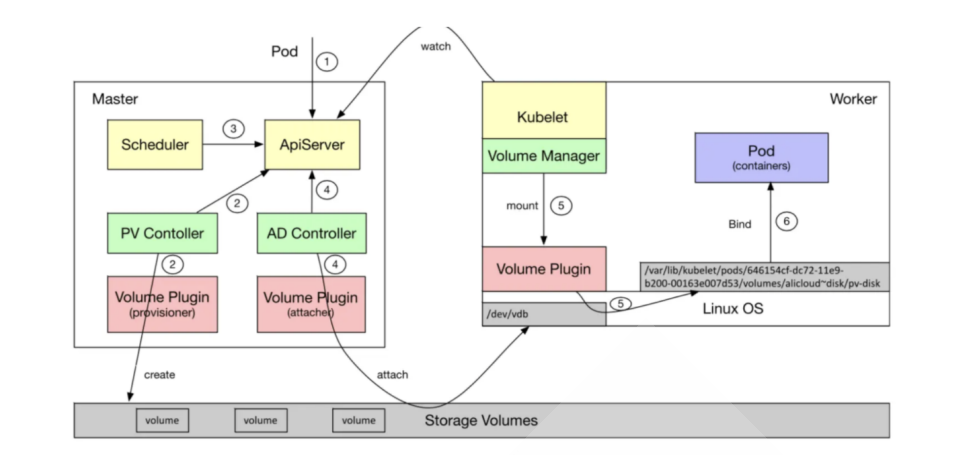
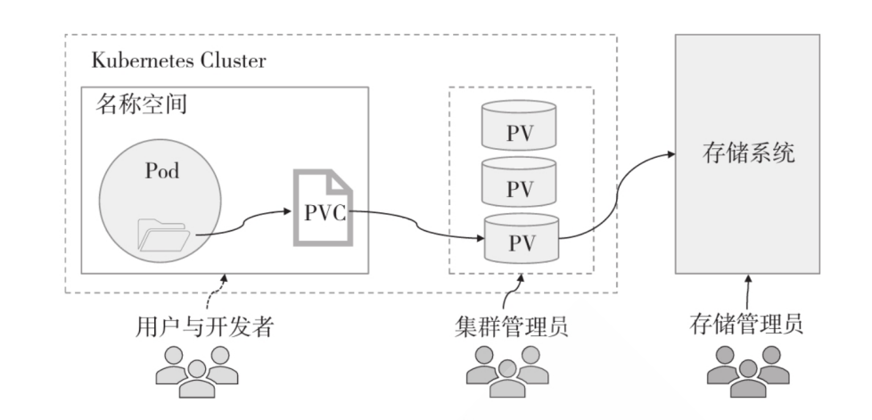

# CKA详解


## Kubernetes概述

### 传统运维痛点


- **虚拟机资源浪费**
- **运维管理复杂**
- **扩缩容低效**
- **服务隔离差**


在传统服务管理模式下，为了避免服务间环境相互干扰，通常采用**一台虚拟机只部署一个服务或一组强相关服务**的策略，借助虚拟机级别的隔离来保障服务稳定运行。
 然而，这种方式的**代价巨大**：

- **资源浪费**：每个虚拟机都需要单独分配内核和系统资源，造成大量冗余。
- **运维复杂**：服务的部署、扩容、访问控制、权限管理等操作高度依赖人工干预，效率低下且易出错。


Kubernetes 正是为了解决这些问题而设计的。 


### Kubernetes是什么？

面向应用生命周期管理的“云原生操作系统”。


### Kubernetes要解决的问题

运行在大规模集群中的各种任务之间，实际存在各种各样的关系。这些关系的处理，才是作业编排和管理系统最困难的地方

其实这种任务与任务之间的关系，在我们平常的各种技术场景中随处可见。比如：

- 一个web应用与数据库之间的访问关系
- 一个负载均衡器和它后端服务之间的代理关系
- 一个门户应用与授权组件之间的调用关系


Kubernetes被要求能够处理前面提到的所有类型的关系，甚至还要能够支持未来可能出现的更多种类的关系

Kubernetes项目最主要的设计思想是，从更宏观的角度，以统一的方式来定义任务之间的各种关系，并且为将来支持更多种类的关系留有余地

| 关系类型                  | 相关对象                                              |
| ------------------------- | ----------------------------------------------------- |
| **与配置的关系**          | ConfigMap、Secret                                     |
| **与存储的关系**          | PV、PVC、StorageClass                                 |
| **与访问路径的关系**      | Service、Ingress、NetworkPolicy                       |
| **与计算资源的关系**      | Deployment、HPA、Affinity、ResourceQuota              |
| **与身份权限的关系**      | ServiceAccount、RBAC（Role/RoleBinding）              |
| **与生命周期控制的关系**  | LivenessProbe、StartupProbe、Job、CronJob             |
| **与网络策略/安全的关系** | NetworkPolicy、PodSecurityPolicy（已废弃，替代为PSA） |
| **与外部集成/扩展的关系** | CRD、Webhook、Operator、Controller                    |


- Kubernetes 的**设计目的**可以概括为两大部分：

  1. **基于应用运行形态，提供对 Pod 生命周期的统一管理能力** —— 使应用具备声明式、可编排、可伸缩、可恢复的运行保障。
  2. **围绕 Pod 建模并管理其与外部环境的所有动态关系** —— 包括与配置、存储、网络、访问策略、安全权限、资源调度等各类基础设施能力的连接与治理，同时为未来更多关系预留统一扩展入口。

  

### Kubernetes架构


Kubernetes 是运行在操作系统之上的一个分布式系统内核，它将一组普通物理或虚拟机抽象为一个统一的资源池。相比传统操作系统，Kubernetes 实现了容器粒度的资源调度、服务治理、自愈恢复等能力，某种程度上，它是面向现代云应用的更高一级‘操作系统。

就像传统操作系统调度进程和线程一样，Kubernetes 调度的是 Pod；它不仅调度，还负责状态管理、服务发现、滚动升级等，是现代云原生应用运行的统一管理平台。


Kubernetes**集群分为两个角色**，分别是Master节点和Worker节点

在 Kubernetes 中，Master 节点负责管理整个集群，因此被称为控制平面（Control Plane）。它负责调度、集群状态维护、资源协调等核心任务。而集群中实际运行用户应用（如 Web 服务、数据库、后台任务等）的 Pod，通常调度部署在 Worker 节点上，也叫数据平面。

```ABAP
可以理解为：Master 是 Kubernetes 的‘大脑’，而 Worker 是‘手和脚’，控制平面做决策，数据平面去执行这些决策。
```


### Master节点介绍

#### **ApiServer**

**API Server 是 Kubernetes 的“前门”和“大脑”**

- 所有组件（controller-manager、scheduler、kubelet、kubectl）都**不能绕过 API Server**进行通信；
- 它是**唯一允许读写 etcd 的组件**；
- 它是整个集群的**状态总线**，维持着“**期望状态**”（用户提交）和“**实际状态**”（组件上报）的一致性。


**API Server 用于构建Kubernetes安全边界**

在 Kubernetes 中，API Server 是集群中所有通信的唯一入口，因此我们只需维护 API Server 的证书体系。组件通过 TLS 或 Token 方式与 API Server 建立通信，而 API Server 则统一负责所有请求的认证、授权和准入控制，从而构建起 Kubernetes 安全边界的核心框架


**提供 Watch 机制以实现实时变更推送**

- kube-apiserver 支持组件发起 `watch` 请求，它会将 etcd 中的变更以流式事件推送出去；
- 所有 controller、kubelet、operator 等组件都依赖这个机制进行状态监听。


#### Scheduler

**Kubernetes Scheduler** 是控制面组件之一，负责将尚未分配节点的 Pod 绑定到集群中最合适的节点上运行。

它的本质是一个 **决策器**：根据 Pod 的资源需求、调度策略和集群的当前状态，做出“**放哪儿运行最合适**”的决策。


#### Controller-Manager

**Kube-controller-manager** 是 Kubernetes 的自动化执行引擎。它通过一系列控制器，围绕集群中各种资源（Pod、Node、PVC、Deployment 等）持续执行状态对比和纠偏操作。只要用户声明了期望，控制器就会自动、持续地将实际状态向目标状态逼近，从而实现真正的自愈、自动扩缩、滚动更新等高级功能


#### etcd

`etcd` 是 Kubernetes 的唯一持久化存储后端，负责保存整个集群的所有状态数据（元数据）。


### Worker节点介绍

#### Kuber-proxy

`kube-proxy` 是 Kubernetes 中用于实现 `Service` 虚拟 IP（ClusterIP）访问能力的组件。它通过监听集群中的 `Service` 和 `Endpoints` 变化，生成网络转发规则（基于 `iptables` 或 `ipvs`），并将这些规则加载到 Linux 内核网络栈中，实现客户端访问 `Service IP` 时，能够自动负载均衡转发到后端 Pod。


 **工作机制：核心流程**

1. **Watch API Server**
   - 监听 `Service` 和 `Endpoints` 的变化
2. **生成规则**
   - 根据监听到的资源，构造转发规则（如 iptables 或 IPVS）
3. **下发到内核**
   - 利用 Linux 内核实现数据包转发（iptables 或 IPVS 模块）


 **kube-proxy 不是 Service 的创建者，而是转发规则的生成者**

- Service 和 Endpoints 由 kube-apiserver 管理；
- kube-proxy 只是**根据它们生成转发规则**；
- 它并不直接创建网络设备或虚拟接口。


#### kubelet

kubelet 是 Kubernetes 每个节点上的核心 agent，负责与 API Server 通信，并通过调用容器运行时（如 containerd、Docker）来管理该节点上所有 Pod 的生命周期。


### Kubernetes 典型工作流：从 Deployment 到应用对外访问

**创建 Deployment（描述期望状态）**

- 用户使用 YAML 定义 Deployment 资源，指定副本数、镜像、端口等。
- 使用**Kubectl**客户端工具将信息提交给 **Kubernetes API Server**。
- **API Server** 记录到 **etcd**。
- **Controller Manager** 监控到期望副本 3。


**调度到具体 Node**

- **Kube-Scheduler** 监听未调度的 Pod。
- 选择合适的 Node（基于资源、污点、亲和性等）。
- 将调度结果同步到**API Server**，然后更新到 **etcd**。


**Node 本地创建 Pod**

- **Kubelet** 监听到自己 Node 上分配的 Pod。

- 调用 **Container Runtime** 拉取镜像，创建容器。

- 设置 **cgroup、namespace** 实现资源隔离。


**加入容器网络（CNI）**

- **Kubelet** 调用 **CNI 插件**（如 Calico/Flannel）：
  - 分配 Pod IP。
  - 将 Pod 接入 Overlay 网络。
  - 生成路由规则，保障 Pod 到 Pod 通信。


**通过 Service 暴露访问入口**

- 创建 Service 资源，**kubectl**将service资源发送给**apiServer**，**在apiserver上生成资源对象**
- **Kube-Proxy** 监听 Service 变化，配置 iptables 或 IPVS 规则，实现 **负载均衡**。


**DNS 名称解析（CoreDNS）**

- CoreDNS 监听 Service 资源，自动生成解析记录：
  - 例如 `my-app-svc.default.svc.cluster.local` 解析为 ClusterIP。
- Pod 内解析时：
  - 查询 CoreDNS。
  - 返回 ClusterIP。


### Kubernetes扩展接口

Kubernetes提供了三个特定功能的接口,kubernetes通过调用这几个接口，来完成相应的功能。

- **容器运行时接口CRI**: Container Runtime Interface 

  - CRI 首次发布于2016年12月的Kubernetes 1.5 版本。 

  - 在此版本之前，Kubernetes 直接与 Docker 通信，没有标准化的接口。 

  - 从 Kubernetes 1.5 开始，CRI 成为 Kubernetes 与容器运行时交互的标准接口，使得 Kubernetes  可以与各种容器运行时进行通信，从而增加了灵活性和可移植性。

  - kubernetes 对于容器的解决方案，只是预留了容器接口，只要符合CRI标准的解决方案都可以使用

- **容器网络接口CN**I: Container Network Interface
  - kubernetes 对于网络的解决方案，只是预留了网络接口，只要符合CNI标准的解决方案都可以使用
- **容器存储接口CSI:** Container Storage Interface
  - kubernetes 对于存储的解决方案，只是预留了存储接口，只要符合CSI标准的解决方案都可以使用 此接口非必须


### Kubernetes中的通信

在 Kubernetes 中，Protobuf 和 JSON 是两种**序列化协议**，分别用于内部组件高效通信和外部用户交互。而这些序列化后的数据，通常通过 HTTP 或 HTTP/2 协议传输。

在 Kubernetes 中，kubectl 默认通过 HTTP/1.1 与 API Server 通信，而内部组件则通常通过支持 HTTP/2 的 client-go 与 API Server 通信。当它们使用 Watch 机制监听资源变化时，不论是 HTTP/1.1 还是 HTTP/2，都能建立流式响应，只不过 HTTP/2 在性能上更优

```ABAP
序列化：把程序中的数据结构或对象转换为可以存储或传输的格式（如字符串或二进制流）的过程。
```


**Kubernetes 的 API 通信最常使用的是：**

- **HTTP/1.1**（默认最广泛支持）
- **HTTP/2**（在使用 gRPC 或 Watch 时支持，提升多路复用性能）

例如：

- `kubelet` 与 `kube-apiserver` 使用 **HTTP/2 + Protobuf**
- `kubectl` 与 `kube-apiserver` 使用 **HTTP/1.1 + JSON**


#### 通信中的安全机制

**Kubernetes集群中有三套CA机制**

- **etcd-ca**        ETCD集群内部的TLS通信
- **kubernetes-ca**    Kubernetes集群内部节点间的双向TLS通信
- **front-proxy-ca**    Kubernetes集群与外部扩展服务简单双向TLS通信


### Kerbernetes的运维工作

- **业务的运行**：应用发布与部署
  - 主要包括：镜像构建，Pod编排（Deployment，StatefulSet等），CICD流程

- **外部用户的访问**：流量入口与服务治理
  - 主要包括：Ingress/Nginx，LoadBalancer，GatewayAPI，服务发现，恢复发布，限流熔断等
- **调度业务运行所需资源**：资源编排与调度
  - 主要包括：节点调度（Pod Scheduling）、亲和性（Affinity）、Taint/Toleration、资源限制、HPA/VPA
- **运维保障服务**：可观测性
  - 主要包括：日志，指标监控，链路跟踪


## 1. HPA

**HPA本质**：是 Kubernetes 的一个控制器，用于根据实时监控的指标（如 CPU 使用率、内存、自定义指标等）**自动增加或减少 Pod 副本数量**，从而实现弹性扩缩容。


#### HPA控制器简介

Horizontal Pod Authscaling（HPA）控制器，根据预定义的阈值及Pod当前的资源利用率，自动控制在K8S集群中运行的Pod数量（自动弹性水平自动伸缩）

```bash
--horizontal-pod-autoscaler-sync-period                # 默认每隔15s（可以通过 --horizontal-pod-autoscaler-sync-period修改）查询metrics的资源使用情况
--horizontal-pod-autoscaler-downscale-stabilization    # 缩容间隔周期，默认5分钟（防止流量抖动）
--horizontal-pod-autoscaler-sync-period                # HPA控制器同步pod副本数的间隔周期
--horizontal-pod-autoscaler-cpu-initalization-period   # 初始化延迟时间，在此时间内pod的CPU资源指标将不会生效，默认为5分钟
--horizontal-pod-autoscaler-initial-readiness-delay    # 用于设置pod准备时间，在此时间内的pod统统被认为未就绪及不采集数据，默认为30秒,举例解释：该参数是为了防止刚创建的 Pod 在还未就绪时就被纳入 HPA 的指标采集中（因为启动期资源占用可能非常低），从而误导缩容决策。
#比如：如果你新扩容了 3 个 Pod，它们刚启动时的资源使用率几乎为 0，如果不设置这个延迟，HPA 会马上认为整体使用率下降，从而错误触发缩容。
--horizontal-pod-autoscaler-tolerance   # HPA控制器能容忍的数据差异（浮点数，默认为0.1）即新的指标要与当前的阈值差异在0.1或以上，比如：target CPU utilization = 50%; tolerance = 0.1; 
# 当实际 CPU < 45%（= 50% × 0.9） → 触发 缩容
# 当实际 CPU > 55%（= 50% × 1.1） → 触发 扩容
# 当 CPU 在 45%～55% 区间内 → 不变，维持当前副本数

# 计算公式：TargetNumOfPods = ceil(sum(CurrentPodsCPUUtilization) / Target) #ceil是向上取整的目的pod整数

# 指标数据需要部署metrics-server，即HPA使用metrics-server作为数据源

[root@master-01 ~]# kube-controller-manager --help|grep horizontal 
......
      --concurrent-horizontal-pod-autoscaler-syncs int32               The number of horizontal pod autoscaler objects that are allowed to sync concurrently. Larger number = more responsive horizontal pod autoscaler objects processing, but more CPU (and network) load. (default 5)
      --horizontal-pod-autoscaler-cpu-initialization-period duration   The period after pod start when CPU samples might be skipped. (default 5m0s)
      --horizontal-pod-autoscaler-downscale-stabilization duration     The period for which autoscaler will look backwards and not scale down below any recommendation it made during that period. (default 5m0s)
      --horizontal-pod-autoscaler-initial-readiness-delay duration     The period after pod start during which readiness changes will be treated as initial readiness. (default 30s)
      --horizontal-pod-autoscaler-sync-period duration                 The period for syncing the number of pods in horizontal pod autoscaler. (default 15s)
      --horizontal-pod-autoscaler-tolerance float                      The minimum change (from 1.0) in the desired-to-actual metrics ratio for the horizontal pod autoscaler to consider scaling. (default 0.1)

```

使用 HPA 的前提条件：必须部署 `metrics-server` 和 该对象必须设置资源限制，即Request的值

```ABAP
HPA 默认依赖 metrics.k8s.io API 来获取 Pod 的资源使用情况（如 CPU、内存），而这个 API 是由 metrics-server 提供的。
metrics-server 向每个 kubelet 发请求（HTTPS），拉取数据。
然后将这些实时数据提供给 Kubernetes API Server 作为聚合 API

HPA通过 API Server 查询
/apis/metrics.k8s.io/v1beta1/pods
/apis/metrics.k8s.io/v1beta1/nodes
```

```ABAP
使用HPA，该对象必须设置资源限制，即Request的值，否则HPA取不到值，HPA是根据:当前使用的值 / Request = 使用率，从而和阈值进行比较来决定如何扩缩容的（这里注意，不是Limit值，而是Request的值）
```

```ABAP
一旦部署了 HPA，Pod 的副本数控制权就从 Deployment / StatefulSet 转移到了 HPA。
如果你同时设置了 Deployment 的 replicas: 3 和 HPA 的 minReplicas=5，最终副本数会是 ≥5。
如果你删除了 HPA 对象，Deployment 或 StatefulSet 会回退到自己 .spec.replicas 的值
```


## 2. Request与Limit


### Pod资源限制

kubernetes 可以支持在**容器级**及**namespace级**分别实现资源限制


Kubernetes 已经对Pod做了相应的资源配额设置，这些资源主要体现在：CPU和内存、存储，因为存储 在k8s中有专门的资源对象（PV,PVC）来进行管控，所以当前的pod资源限制，主要指的计算资源，即**CPU和内存。**


为了方便与k8s的其他单独的资源对象区分开来，一般将**CPU和内存**其称为**计算资源**。

如果运行的Pod使用的资源超过宿主机的最大可用资源,会导致**OOM**和**Pod驱逐**到其它宿主机


##### 可限制的资源单位

常见在容器级别的CPU和内存的限制


- **CPU**
  - 特点：是一种可压缩资源，cpu资源是支持抢占的
  - 单位：CPU的资源单位是CPU(Core)的数量,是一个绝对
  - 大小：在Kubernetes中通常以千分之一的CPU(Core)为最小单位，用毫 m 表示,即**一个CPU核心表示为1000m**
  - 经验：**一个资源占用不多的容器占用的CPU**通常在100~300m，即**0.1-0.3个CPU**
  - 注意：mi 代表是1024进制的


- **内存**
  - 特点：是不可压缩资源，当pod资源扩展的时候，如果node上资源不够，那么就会发生资源抢占， 或者OOM问题
  - 单位：内存的资源以字节数为单位，是一个绝对值
  - 大小：内存配额对于绝大多数容器来说很重要，在Kubernetes中通常以Mi,Gi为单位来分配。通常 分配置1G,2G,最多16G或32G
  - 注意：如果内存分配不足,可能会出现OOM现象（Java程序常见）


- **注意**
  - CPU属于可压缩（compressible）型资源，即资源额度可按需收缩
  - 内存（当前）则是不可压缩型资源，对其执行收缩操作可能会导致某种程度的问题，例如进程崩溃 等。


- **Extended Resources 扩展资源限制（常见：GPU资源）**
  - 所有不属于kubernetes.io域的资源,为扩展资源,如:"**nvidia.com/gpu**"
  - kubernetes 也支持针到扩展资源限制


##### 配额限制参数

Kubernetes中，对于每种资源的配额限定都需要两个参数：**Requests和Limits**


- **资源需求Requests**
  - 业务运行时资源预留的最小使用量，即所需资源的**最低下限**，**该参数的值必须满足，若不满足，业务无法运行**。
  - 容器运行时可能用不到这些额度的资源，但用到时必须确保有相应数量的资源可用
  - 资源需求的定义会影响调度器的决策,只会将Pod调度至满足所有容器总的资源需求的节点
  - 当资源不足时，**实际使用的资源超出 Requests 的部分，可能会被回收**
  - **不能超过对应的limits值**
  - **不能超过物理节点可用分配的资源值**


- **资源限制 Limits**
  - 运行时资源允许使用最大可用量，即所需资源的最高上限，该参数的值不能被突破，超出该额度的资源使用请求通常会被拒绝
  - **该限制需要大于等于requests的值**，但系统在其某项资源紧张时，会从容器那里回收其使用的超出 其requests值的那部分
  - 针对内存而言,为防止上面回收情况的发生,一般**建议将内存的 Requests 和 Limits 设为相同**
  - 资源限制**Limit**的定义**不影响调度器的决策**
  - 不能低于对应的limits值
  - 可以超过物理节点可用分配的资源值
  - **提示:为保证性能,生产推荐Requests和Limits设置为相同的值**


##### k8s资源查看

要实现资源限制,需要先**安装metrics-server**

```bash
[root@master1 ~]# curl -LO https://github.com/kubernetes-sigs/metrics-server/releases/latest/download/components.yaml

#默认文件需要修改才能工作,因为默认需要内部证书验证和镜像地址k8s.gcr.io所以修改
# vim components.yaml
spec:
      containers:
      - args:
        - --cert-dir=/tmp
        - --secure-port=10250
        - --kubelet-preferred-address-types=InternalIP,ExternalIP,Hostname
        - --kubelet-use-node-status-port
        - --metric-resolution=15s
        - --kubelet-insecure-tls
        #image: registry.cn-hangzhou.aliyuncs.com/google_containers/metricsserver:v0.7.1 # 可以添加国内源
        image: registry.k8s.io/metrics-server/metrics-server:v0.7.2
        imagePullPolicy: IfNotPresent
        livenessProbe:
          failureThreshold: 3
          httpGet:
            path: /livez
            port: https
            scheme: HTTPS
          periodSeconds: 10
        name: metrics-server
        ports:
        - containerPort: 10250
          name: https
          protocol: TCP
          
[root@master1 yaml]# kubectl apply -f components.yaml 
serviceaccount/metrics-server created
clusterrole.rbac.authorization.k8s.io/system:aggregated-metrics-reader created
clusterrole.rbac.authorization.k8s.io/system:metrics-server created
rolebinding.rbac.authorization.k8s.io/metrics-server-auth-reader created
clusterrolebinding.rbac.authorization.k8s.io/metrics-server:system:auth-delegator created
clusterrolebinding.rbac.authorization.k8s.io/system:metrics-server created
service/metrics-server created
deployment.apps/metrics-server created
apiservice.apiregistration.k8s.io/v1beta1.metrics.k8s.io created


root@master1 yaml]#kubectl get pod -n kube-system metrics-server-b79d5c976-hqrct 
NAME                             READY   STATUS    RESTARTS   AGE
metrics-server-b79d5c976-hqrct   1/1     Running   0          60s
[root@master1 yaml]#kubectl top node
NAME      CPU(cores)   CPU%   MEMORY(bytes)   MEMORY%   
master1   62m          3%     910Mi           49%       
node1     30m          1%     669Mi           36%       
node2     20m          1%     927Mi           50%       
node3     27m          1%     715Mi           39% 
```


### metrics-server解读

**metrics-server采集指标的全过程，和这个过程中的重点资源**

-  `APIService` 对象
- `deployment`对象

metrics-server 的 API 是通过创建 `APIService` 对象，注册到 kube-apiserver 的聚合层（kube-aggregator）中。

**具体行为是：**

- kube-apiserver **WATCH 监听** `apiservice` 资源对象。

  聚合层（Aggregation Layer）本质上是 **kube-apiserver 内置的一个 HTTP 反向代理功能模块**。

- 解析 `apiservice.spec.service.name` 和 `service.namespace`，
   **通过 Kubernetes Service 反向代理到对应扩展 API Server（如 metrics-server）**。

- **HTTP/HTTPS 代理请求到扩展 API Server**，从而把它提供的 API 合并到自己的 `/apis/...` 路径空间里。

**总结：**

kube-apiserver 内置的聚合层是一个 **"反向代理和路由机制"**， 它通过 **监听 APIService 资源对象**， **解析出目标扩展 API Server 的 Service 地址**， 然后把外部请求 **代理到真正提供该 API 的服务上**（如 metrics-server）， 这样客户端访问时就像访问 kube-apiserver 自己提供的 API 一样无感知。

```bash
# apiservice.apiregistration.k8s.io/v1beta1.metrics.k8s.io
# 查看metrics-server的apiserver对象
[root@master1 ~]# kubectl get apiservices.apiregistration.k8s.io -n kube-system v1beta1.metrics.k8s.io 
NAME                     SERVICE                      AVAILABLE   AGE
v1beta1.metrics.k8s.io   kube-system/metrics-server   True        6d1h

# 查看资源清单
[root@master1 ~]# kubectl get apiservices.apiregistration.k8s.io -n kube-system v1beta1.metrics.k8s.io -o yaml
apiVersion: apiregistration.k8s.io/v1
kind: APIService
metadata:
  annotations:
    kubectl.kubernetes.io/last-applied-configuration: |
      {"apiVersion":"apiregistration.k8s.io/v1","kind":"APIService","metadata":{"annotations":{},"labels":{"k8s-app":"metrics-server"},"name":"v1beta1.metrics.k8s.io"},"spec":{"group":"metrics.k8s.io","groupPriorityMinimum":100,"insecureSkipTLSVerify":true,"service":{"name":"metrics-server","namespace":"kube-system"},"version":"v1beta1","versionPriority":100}}
  creationTimestamp: "2025-05-02T06:13:47Z"
  labels:
    k8s-app: metrics-server
  name: v1beta1.metrics.k8s.io
  resourceVersion: "348056"
  uid: d7c94e84-00a7-47e1-a16a-dbc3c41017b4
spec:
  group: metrics.k8s.io
  groupPriorityMinimum: 100
  insecureSkipTLSVerify: true     # 跳过了front-proxy-ca的验证，测试环境使用，生产环境不安全
  # insecureSkipTLSVerify: false
  # caBundle: <base64-encoded front-proxy-ca.crt>
  service:
    name: metrics-server
    namespace: kube-system
    port: 443
  version: v1beta1
  versionPriority: 100
```

metrics-server 通过HTTPS会向每个节点的 kubelet 的10250端口发出请求，访问 `/stats/summary` 接口（这些API由kubelet通过cAdvisor提供数据），这是采集 **Pod 和 Node 的 CPU/内存等资源使用情况** 的关键数据源。

#### metrics-server的数据采集过程

**CPU 和 Memory 的数据来源**

- **数据源**是 **Kubelet 的 `/metrics/resource` 或 `/stats/summary` 接口**。
- Kubelet 本身会从 **cAdvisor**（内置在 Kubelet 里） 获取节点上 **Pod 和容器的资源指标**。

```css
Linux Kernel (cgroups, /proc)
     ↓
cAdvisor（Kubelet内置）
     ↓
Kubelet /stats/summary 或 /metrics/resource
     ↓
metrics-server 访问这些接口
```

**详细指标采集链路**

| 采集阶段                        | 说明                                                         |
| ------------------------------- | ------------------------------------------------------------ |
| **Kubelet 采集**                | Kubelet 从 cAdvisor 读取本机节点上所有 Pod 和容器的资源使用情况（CPU、内存） |
| **metrics-server 访问 Kubelet** | metrics-server 调用每个 Node 的 Kubelet `/stats/summary` 接口 |
| **上报到 kube-apiserver**       | metrics-server 聚合数据后通过 Aggregation Layer 提供 `/apis/metrics.k8s.io/v1beta1` 接口 |
| **kubectl top 查询**            | kubectl top 通过调用 kube-apiserver 这个聚合接口返回实时指标 |

```bash
# metrics-server的pod，与kubelet通信，需要Kubernetes-ca证书验证kubelet的客户端证书
# 查看metrics-server的pod
[root@master1 ~]# kubectl get pod -n kube-system metrics-server-6b66984b5c-76n6k 
NAME                              READY   STATUS    RESTARTS   AGE
metrics-server-6b66984b5c-76n6k   1/1     Running   0          4d

# 查看资源清单
[root@master1 ~]# kubectl get pod -n kube-system metrics-server-6b66984b5c-76n6k -o yaml
apiVersion: v1
kind: Pod
metadata:
  annotations:
    cni.projectcalico.org/containerID: 6b5f240b002dce5021d1b18c5e1ccfee524869a947a3ef8
117a7d99f302f969f
    cni.projectcalico.org/podIP: 10.200.200.1/32
    cni.projectcalico.org/podIPs: 10.200.200.1/32
  creationTimestamp: "2025-05-04T07:31:19Z"
  generateName: metrics-server-6b66984b5c-
  labels:
    k8s-app: metrics-server
    pod-template-hash: 6b66984b5c
  name: metrics-server-6b66984b5c-76n6k
  namespace: kube-system
  ownerReferences:
  - apiVersion: apps/v1
    blockOwnerDeletion: true
    controller: true
    kind: ReplicaSet
    name: metrics-server-6b66984b5c
    uid: b9dc4666-3d11-47ef-8253-8941829d4767
  resourceVersion: "348040"
  uid: 2ae17462-194f-47d0-b21c-f541ab005445
spec:
  containers:
  - args:
    - --cert-dir=/tmp
    - --secure-port=10250
    - --kubelet-preferred-address-types=InternalIP,ExternalIP,Hostname
    - --kubelet-use-node-status-port
    - --metric-resolution=15s
    - --kubelet-insecure-tls    # 这里不安全，生产环境不建议
    # - --kubelet-certificate-authority=/etc/kubernetes/pki/ca.crt
    image: harbor.magedu.mysticalrecluse.com/k8simage/metrics-server:v0.7.2
    imagePullPolicy: IfNotPresent
    livenessProbe:
      failureThreshold: 3
      httpGet:
        path: /livez
        port: https
        scheme: HTTPS
      periodSeconds: 10
      successThreshold: 1
      timeoutSeconds: 1
    name: metrics-server
    ports:
    - containerPort: 10250
      name: https
      protocol: TCP
    readinessProbe:
      failureThreshold: 3
      httpGet:
        path: /readyz
        port: https
        scheme: HTTPS
      initialDelaySeconds: 20
      periodSeconds: 10
      successThreshold: 1
      timeoutSeconds: 1
    resources:
      requests:
        cpu: 100m
        memory: 200Mi
    securityContext:
      allowPrivilegeEscalation: false
      capabilities:
        drop:
        - ALL
      readOnlyRootFilesystem: true
      runAsNonRoot: true
      runAsUser: 1000
      seccompProfile:
        type: RuntimeDefault
    terminationMessagePath: /dev/termination-log
    terminationMessagePolicy: File
    volumeMounts:
    - mountPath: /tmp
      name: tmp-dir
    - mountPath: /var/run/secrets/kubernetes.io/serviceaccount
      name: kube-api-access-zvfff
      readOnly: true
  dnsPolicy: ClusterFirst
  enableServiceLinks: true
  nodeName: work2.mystical.org
  nodeSelector:
    kubernetes.io/os: linux
  preemptionPolicy: PreemptLowerPriority
  priority: 2000000000
  priorityClassName: system-cluster-critical
  restartPolicy: Always
  schedulerName: default-scheduler
  securityContext: {}
  serviceAccount: metrics-server
  serviceAccountName: metrics-server
  terminationGracePeriodSeconds: 30
  tolerations:
  - effect: NoExecute
    key: node.kubernetes.io/not-ready
    operator: Exists
    tolerationSeconds: 300
  - effect: NoExecute
    key: node.kubernetes.io/unreachable
    operator: Exists
    tolerationSeconds: 300
  volumes:
  - emptyDir: {}
    name: tmp-dir
  - name: kube-api-access-zvfff
    projected:
      defaultMode: 420
      sources:
      - serviceAccountToken:
          expirationSeconds: 3607
          path: token
      - configMap:
          items:
          - key: ca.crt
            path: ca.crt
          name: kube-root-ca.crt
      - downwardAPI:
          items:
          - fieldRef:
              apiVersion: v1
              fieldPath: metadata.namespace
            path: namespace
```


##### 资源限制实现

范例：limits和requests值大小

```yaml
# [root@master1 yaml]# cat pod-limit-request.yaml 
apiVersion: v1
kind: Pod
metadata:
  name: pod-limit-request
spec:
  containers:
  - name: pod-limit-request-container
    image: registry.cn-beijing.aliyuncs.com/wangxiaochun/nginx:1.20.0
    imagePullPolicy: IfNotPresent
    resources:
      requests:
        memory: "500Mi"
        cpu: "250m"
      limits:
        memory: "500Mi"
        cpu: "250m"

```


##### 压力测试

```yaml
# cat pod-stress.yaml
apiVersion: v1
kind: Pod
metadata:
  name: pod-stress
spec:
  containers:
  - name: pod-stress
    image: registry.cn-beijing.aliyuncs.com/wangxiaochun/stress-ng
    imagePullPolicy: IfNotPresent
    command: ["/usr/bin/stress-ng", "-c 2", "--metrics-brief"]
    resources:
      requests:
        memory: 128Mi
        cpu: 200m
      limits:
        memory: 256Mi
        cpu: 500m

# 查看
[root@master1 yaml]#kubectl exec pod-stress -- top
Mem: 1853284K used, 120644K free, 4744K shrd, 55064K buff, 832920K cached
CPU:  24% usr   0% sys   0% nic  74% idle   0% io   0% irq   0% sirq
Load average: 0.35 0.30 0.17 3/513 14
  PID  PPID USER     STAT   VSZ %VSZ CPU %CPU COMMAND
    8     1 root     R     6904   0%   1  13% {stress-ng-cpu} /usr/bin/stress-ng
    7     1 root     R     6904   0%   0  12% {stress-ng-cpu} /usr/bin/stress-ng
    1     0 root     S     6264   0%   1   0% /usr/bin/stress-ng -c 2 --metrics-
q   9     0 root     R     1520   0%   0   0% top
```


##### 基于Namespace级别的资源限制

在 **Kubernetes 中基于 Namespace 级别的资源限制**，我们通常使用 **ResourceQuota** 和 **LimitRange** 来实现对命名空间中资源的使用限制。


**资源限制的实现方式**

| **方式**          | **对象**       | **限制类型**                   | **典型限制内容**                             |
| ----------------- | -------------- | ------------------------------ | -------------------------------------------- |
| **ResourceQuota** | **Namespace**  | **命名空间级别的资源总量限制** | 限制 Namespace 中 Pod、CPU、内存、存储的总量 |
| **LimitRange**    | **Pod 和容器** | **单个 Pod/容器的资源限制**    | 限制每个 Pod/容器的 CPU 和内存的最小和最大值 |

------


**资源限制的工作机制**

**1️⃣ ResourceQuota (限制 Namespace 资源总量)**

- **作用范围**：
  限制整个 Namespace 中的资源总量，包括 Pod 数量、CPU、内存和存储。
- **常见的限制项目**：
  - Pod 总数 (`pods`)
  - 容器的总 CPU 请求 (`requests.cpu`) 和总限制 (`limits.cpu`)
  - 容器的总内存请求 (`requests.memory`) 和总限制 (`limits.memory`)
  - PersistentVolumeClaim (PVC) 的总存储使用量 (`requests.storage`)
- **典型场景**：
  限制一个项目团队在其 Namespace 中最多只能使用 10 个 Pod，CPU 总量不超过 10 核，内存总量不超过 32GiB。


**2️⃣ LimitRange (限制单个 Pod 和容器的资源)**

- **作用范围**：
  限制 **每个 Pod 或每个容器** 的 CPU 和内存的最大、最小值。
- **常见的限制项目**：
  - 容器的最小 CPU 请求 (`min.cpu`) 和最大限制 (`max.cpu`)
  - 容器的最小内存请求 (`min.memory`) 和最大限制 (`max.memory`)
- **典型场景**：
  每个 Pod 中的容器都必须请求最少 100m 的 CPU，但最多不能超过 2 核 CPU，最少 200Mi 的内存，最多不能超过 2GiB 的内存。


**ResourceQuota示例（命名空间的资源总量限制）**

限制 **整个命名空间中的 Pod 数量、CPU 和内存使用量**。

```yaml
# cat resource-quota.yaml
apiVersion: v1
kind: ResourceQuota
metadata:
  name: namespace-quota
  namespace: my-namespace
spec:
  hard:
    pods: "10"                    # 限制命名空间中最多有 10 个 Pod
    requests.cpu: "10"            # 所有 Pod 的 CPU 请求总和不能超过 10 核
    requests.memory: "32Gi"       # 所有 Pod 的内存请求总和不能超过 32Gi
    limits.cpu: "20"              # 所有 Pod 中 CPU 限制的总和不能超过 20 核
    limits.memory: "64Gi"         # 所有 Pod 中内存限制的总和不能超过 64Gi
    persistentvolumeclaims: "5"   # 限制 Namespace 中的 PVC 数量为 5 个
    requests.storage: "100Gi"     # 限制所有 PVC 请求的存储总量为 100Gi

```


**LimitRange示例（Pod和容器的资源限制）**

为 **单个 Pod 和容器** 限制其 CPU 和内存的最小值和最大值。

```yaml
cat limit-range.yaml
apiVersion: v1
kind: LimitRange
metadata:
  name: container-limit-range
  namespace: my-namespace
spec:
  limits:
  - type: Pod                # 作用范围为POd
    max:                     # max：指定 Pod 总的 CPU 和内存上限，CPU 不能超过 2 核，内存不能超过 4Gi。
      cpu: "2"               # 每个 Pod 的最大 CPU 限制为 2 核
      memory: "4Gi"          # 每个 Pod 的最大内存限制为 4 GiB
    min:                     # min：指定 Pod 的最小资源请求，CPU 不低于 250m，内存不低于 128Mi。
      cpu: "250m"            # 每个 Pod 的最小 CPU 请求为 250m
      memory: "128Mi"        # 每个 Pod 的最小内存请求为 128Mi
  - type: Container          # type: Container：作用范围为 Pod 内的每个容器
    default:
      cpu: "500m"            # 每个容器的默认 CPU 请求为 500m
      memory: "512Mi"        # 每个容器的默认内存请求为 512Mi
    defaultRequest:
      cpu: "250m"            # 如果未指定请求，默认 CPU 请求为 250m
      memory: "256Mi"        # 如果未指定请求，默认内存请求为 256Mi
    max:
      cpu: "1"               # 每个容器的最大 CPU 限制为 1 核
      memory: "2Gi"          # 每个容器的最大内存限制为 2GiB
    min:
      cpu: "100m"            # 每个容器的最小 CPU 请求为 100m
      memory: "128Mi"        # 每个容器的最小内存请求为 128Mi

```


## 3. Pod优先级

首先需要明确的是，优先级和抢占机制，解决的是 **Pod 调度失败时该怎么办的问题**。

正常情况下，当一个 Pod 调度失败后，它就会被暂时“搁置”起来，直到 Pod 被更新，或者集群状态发生变化，调度器才会对这个 Pod 进行重新调度。

但在有时候，我们希望的是这样一个场景。当一个高优先级的 Pod 调度失败后，该 Pod 并不会被“搁置”，而是会“挤走”某个 Node 上的一些低优先级的 Pod 。这样就可以保证这个高优先级 Pod 的调度成功。这个特性，其实也是一直以来就存在于 Borg 以及 Mesos 等项目里的一个基本功能。

在 Kubernetes 里，优先级和抢占机制是在 1.10 版本后才逐步可用的。要使用这个机制，你首先需要在 Kubernetes 里提交一个 **PriorityClass** 的定义，如下所示：

```yaml
apiVersion: scheduling.k8s.io/v1beta1
kind: PriorityClass
metadata:
  name: high-priority
value: 1000000
globalDefault: false
description: "This priority class should be used for high priority service pods only."
```

上面这个 YAML 文件，定义的是一个名叫 high-priority 的 PriorityClass，其中 value 的值是 1000000 （一百万）

**Kubernetes 规定，优先级是一个 32 bit 的整数，最大值不超过 1000000000（10 亿，1 billion），并且值越大代表优先级越高**。而超出 10 亿的值，其实是被 Kubernetes 保留下来分配给系统 Pod 使用的。显然，这样做的目的，就是保证系统 Pod 不会被用户抢占掉。

而一旦上述 YAML 文件里的 **globalDefault 被设置为 true 的话**，**那就意味着这个 PriorityClass 的值会成为系统的默认值**。而如果这个值是 false，就表示我们只希望声明使用该 PriorityClass 的 Pod 拥有值为 1000000 的优先级，而对于没有声明 PriorityClass 的 Pod 来说，它们的优先级就是 0。

在创建了 PriorityClass 对象之后，Pod 就可以声明使用它了，如下所示：

```yaml
apiVersion: v1
kind: Pod
metadata:
  name: nginx
  labels:
    env: test
spec:
  containers:
  - name: nginx
    image: nginx
    imagePullPolicy: IfNotPresent
  priorityClassName: high-priority
```

可以看到，这个 Pod 通过 priorityClassName 字段，声明了要使用名叫 high-priority 的 PriorityClass。当这个 Pod 被提交给 Kubernetes 之后，Kubernetes 的 PriorityAdmissionController 就会自动将这个 Pod 的 spec.priority 字段设置为 1000000。

调度器里维护着一个调度队列。所以，当 Pod 拥有了优先级之后，高优先级的 Pod 就可能会比低优先级的 Pod 提前出队，从而尽早完成调度过程。这个过程，就是“优先级”这个概念在 Kubernetes 里的主要体现。

```ABAP
当一个高优先级的 Pod 调度失败的时候，调度器的抢占能力就会被触发。这时，调度器就会试图从当前集群里寻找一个节点，使得当这个节点上的一个或者多个低优先级 Pod 被删除后，待调度的高优先级 Pod 就可以被调度到这个节点上。这个过程，就是“抢占”这个概念在 Kubernetes 里的主要体现
```


**官方默认 PriorityClass 对照表：**

| PriorityClass 名称        | 值（value）                   | 用途                                                        |
| ------------------------- | ----------------------------- | ----------------------------------------------------------- |
| `system-cluster-critical` | `2000001000`                  | 集群级关键组件（如 `kube-apiserver`, `controller-manager`） |
| `system-node-critical`    | `2000000000`                  | 节点级关键组件（如 `kubelet`, `kube-proxy`）                |
| 用户自定义                | 通常从 `0` 或 `1000000000` 起 | 应用程序使用，越高越优先                                    |


## 4. Service

### Service是什么

Service 本质上就是一个**四层的反向代理**，集群内和外的客户端可以通过如下流程最终实现访问Pod应用

```ABAP
集群内部Client --> service网络 --> Pod网络 --> 容器应用
集群外部Client --> 集群内节点网络 --> service网络 --> Pod网络 --> 容器应用

Kubernetes网络
Pod网络     ----  cni
Service网络 ----  kubeproxy
node网络    ----  宿主机网络
```


**Service 核心功能**

- 服务发现: 利用标签选择器，在同一个namespace中筛选符合的条件的Pod, 从面实现发现一组提供 了相同服务的Pod
- 负载均衡: Service作为流量入口和负载均衡器，其入口为ClusterIP, 这组筛选出的Pod的IP地址，将 作为该Service的后端服务器
- 名称解析: 利用Cluster DNS，为该组Pod所代表的服务提供一个名称, 在DNS中 对于每个Service， 自动生成一个A、PTR和SRV记录


**Endpoints**

当创建 Service资源的时候，最重要的就是为Service指定能够提供服务的标签选择器

Service Controller就会根据标签选择器会自动创建一个同名的**Endpoint**资源对象，Kubernetes新版中还增加了**endpointslices**资源

- Endpoint Controller使用Endpoint的标签选择器(继承自Service标签选择器)，筛选符合条件(包括 符合标签选择器条件和处于Ready 状态)的pod资源
- Endpoint Controller 将符合要求的pod资源绑定到Endpoint上，并告知给Service资源谁可以正常提供服务
- Service 会自动获取一个固定的 **cluster IP**向外提供由Endpoint提供的服务资源
- Service 其实就是为动态的一组 pod 资源对象提供一个固定的访问入口。即 Service实现了后端Pod 应用服务的


- 每创建一个Service ,自动创建一个和之同名的API 资源类型 Endpoints
- Endpoints负责维护由相关Service标签选择器匹配的Pod对象
- Endpoints对象上保存Service匹配到的所有Pod的IP和Port信息,称之为端点
- ETCD是K/V数据库, 而一个**Endpoints对象对应一个Key**,所有**后端Pod端点信息为其Value**
- 当一个Endpoints对象对应后端每个Pod的每次变动，都需更新整个Endpoints对象，并将新的 Endpoints对象重新保存至API Server和ETCD
- 此外还需要将该对象同步至每个节点的kube-proxy
- 在ETCD中的对象默认最大为1.5MB,一个Endpoints对象至多可以存储5000个左右的端点信息,这意 味着平均每端点占300KB


**Service类型**

对于Kubernetes 可以实现内部服务的自由通信,也可以将平台内部的服务发布到外部环境

Service主要有四种类型，实现不同的网络通信功能

- ClusterIP
- NodePort
- LoadBalancer
- ExternalName


| 类型         | 解析                                                         |
| ------------ | ------------------------------------------------------------ |
| ClusterIP    | 此为Service的默认类型<br />为**集群内部的客户端访问**,包括节点和Pod等，**外部网络无法访问**<br />In client --> clusterIP: ServicePort (Service) --> PodIP: PodPort |
| NodePort     | 本质上**在ClusterIP模式基础上,再多加了一层端口映射的封装**,相当于增强版的 ClusterIP<br />通过NodeIP:NodePort对外部网络提供服务，默认**随机端口范围30000~32767**, 可指定为固定端口<br />NodePort是一个随机的端口，以防止端口冲突,在**所有安装kube-proxy的节点 上都会打开此相同的端口**<br />可通过访问ClusterIP实现集群内部访问,也可以通过NodeIP:NortPort的方式实 现从集群外部至内部的访问<br />Ex Client --> NodeIP:NodePort (Service) --> PodIP:PodPort |
| LoadBalancer | 基于NodePort基础之上**，使用集群外部的运营商负载均衡器方式实现对外提供** 服务,增强版的NodePort<br/>基于云运营商IaaS云创建一个Kubernetes云，云平台也支持LBaaS(Load Balance as a Service)产品服务<br/>Master借助cloud-manager向LBaaS的API请求动态创建软件LB,即支持和Kubernetes API Server 进行交互<br/>如果没有云服务,将无法获取EXTERNAL-IP,显示Pending状态,则降级为 NodePort类型<br/>Ex Client --> LB_IP:LB_PORT --> NodeIP:NodePort(Service)--> PodIP:PodPort |
| ExternalName | 当Kubernetes集群需要访问集群外部服务时，需要通过externalName**将外部主机引入到集群内部**<br />外部主机名以 DNS方式解析为一个 CNAME记录给Kubernetes集群的其他主机来使用<br />**这种Service既没有ClusterIP，也没有NodePort.而且依赖于内部的CoreDNS功能**<br />In client -->Cluster ServiceName --> CName --> External Service Name |


## 5. Ingress

Ingress 是 Kubernetes 中用来管理外部 **HTTP/HTTPS** 流量进入集群的 API 对象，配合 Ingress Controller 实现基于域名、路径等规则的七层反向代理路由功能。


**ingress 主要包含两个组件Ingress API和Ingress Controller**

ingress 其具备了动态更新并加载新配置的特性。而且ingress本身是不具备实现集群内外流量通信的功能的，这个功能是通过 controller来实现的。**Ingress Controller本身是运行于集群中的Pod资源对象**

| 组件               | 解析                                                         |
| ------------------ | ------------------------------------------------------------ |
| Ingress API        | Kubernetes上的标准API资源类型之一 仅定义了抽象路由配置信息，只是元数据，需要由相应的控制器动态加载 将代理配置抽象成一个Ingress对象，每个服务对应一个yaml配置文件 负责以k8s标准的资源格式定义流量调度、路由等规则 属于名称空间级资源,完成将同一个名空间的service资源进行暴露 |
| Ingress Controller | 七层反向代理服务程序 需要监视（watch）API Server上 Ingress资源的变动，并生成具体应用的自身的配 置文件格式，即将新加入的Ingress转化成反向代理的配置文件并动态加载使之生效，最终并据此完成流量转发 <br />Ingress Controller非为内置的控制器，需要额外自行部署 <br />通常以Pod形式运行于Kubernetes集群之上 一般应该由专用的LB Service负责为其接入集群外部流量 |


#### Ingress 访问过程

- 从外部流量调度到kubernetes中Ingress service，有多种实现方案，比如使用节点网络中的 EXTERNAL-IP或者NodePort方式
- 从service调度到ingress-controller
- ingress-controller根据ingress Pod 中的定义，比如虚拟主机或者后端的url
- 根据虚拟主机名直接调度到后端的一组应用pod中


注意：

- 整个流程中涉及到了两处service内容
- service ingress-nginx 是帮助 ingress controller Pod 接入外部流量的
- **后端的服务对应的service**只起到帮助 ingress controller Pod 找到具体的服务的Pod，即**只用于服务发现** ，而**流量不需要经过后端服务的Service**，直接从ingress controller Pod转到至具体的Pod
- 虚线表示service对后端的应用进行分组，实线表示ingress实际的访问流向


#### 补充：三种 `pathType` 及其含义与使用方式

1️⃣ `Exact`

- **含义**：完全匹配路径，只有请求路径与规则中的路径 **完全一致** 才会被匹配。
- **场景**：适用于需要精确控制的 API 入口等情况。

**示例：**

```yaml
path: /app
pathType: Exact
```

| 请求路径  | 是否匹配 |
| --------- | -------- |
| `/app`    | ✅ 是     |
| `/app/`   | ❌ 否     |
| `/app/v1` | ❌ 否     |


2️⃣ `Prefix`

- **含义**：匹配以指定路径为前缀的请求路径，且路径分段（以 `/` 分隔）必须完整匹配。
- **这是使用最广泛的类型**。

**示例：**

```yaml
path: /app
pathType: Prefix
```

| 请求路径       | 是否匹配 |
| -------------- | -------- |
| `/app`         | ✅ 是     |
| `/app/`        | ✅ 是     |
| `/app/page`    | ✅ 是     |
| `/application` | ❌ 否     |

注意：**`/app/page`** ✅ 是因为它是以 `/app` 这个段开头，而 `/application` ❌ 是因为整个段不匹配。


3️⃣ `ImplementationSpecific`

- **含义**：由 Ingress Controller 自己决定如何匹配路径，行为 **可能因控制器不同而异**。
- **不推荐生产使用**，容易出现不一致行为。

 **示例：**

```
path: /app
pathType: ImplementationSpecific
```

| 请求路径    | 是否匹配 |
| ----------- | -------- |
| `/app`      | 可能是   |
| `/app2`     | 可能也是 |
| `/app/test` | 可能是   |

取决于你用的是哪个 Ingress Controller，例如 NGINX、Traefik、HAProxy 等都实现略有不同。


## 6. GatewayAPI

Gateway API 是 Kubernetes Ingress 模型的下一代标准。它通过将 Gateway（入口定义）和 Route（流量规则）解耦，支持多协议（HTTP、TCP、UDP、TLS），允许多租户协作管理，提供标准的状态反馈和更丰富的路由能力。相比 Ingress，Gateway API 更加灵活、可扩展，适合复杂企业环境中的流量治理和网关管理需求。


**Gateway API 解决了哪些 Ingress 的局限？**

| 能力/特点          | Ingress（V1）                            | Gateway API（V2）                           |
| ------------------ | ---------------------------------------- | ------------------------------------------- |
| **协议支持**       | 主要是 HTTP/HTTPS                        | 支持 HTTP、HTTPS、TCP、UDP、TLS             |
| **资源粒度**       | 入口+路由 混在一个资源里                 | 入口和路由解耦（Gateway + Route）           |
| **多租户管理**     | 不好控制，单一 IngressClass              | Gateway 独立，Route 可分团队管理            |
| **负载均衡策略**   | 受限                                     | 更丰富，比如 header、method、SNI 分流       |
| **跨命名空间路由** | 不支持(语法支持，大部分controller不支持) | ✅ 支持跨命名空间管理                        |
| **可观测性**       | 依赖控制器                               | 定义标准的状态反馈                          |
| **标准化**         | Controller 自定义较多                    | 提供统一 API 规范，跨 Controller 兼容性更好 |


如上图：Gateway API 把人员角色分为3类

1. **Infrastructure Provider**：基础设施提供者，主要负责GatewayClass，把Gateway Controller 和 Gateway 关联起来，负责整个底层设施的提供，给Gateway 提供 gatewayClassName
2. **Cluster Operator**：集群操作者，主要负责 Gateway，**类似反向代理的前端**
3. **Application Develops**：应用开发者，负责开发业务 Service，**类似反向代理的后端**


### Gateway-API-流量分发流程

#### A Simple Gateway


**1️⃣ 客户端请求**

客户端（例如浏览器或 API 调用）向某个域名或 IP 发起 HTTP/S 请求。

**2️⃣ 负载均衡（Gateway）**

**Gateway** 组件充当了整个系统的入口，通常对应一个 **Load Balancer**（负载均衡器）或者 Kubernetes 内部的 `Gateway` 资源。

- Gateway 的作用
  - 监听外部请求（通常是 HTTP 或 HTTPS）
  - 将匹配的流量转发给适当的 **HTTPRoute**
  - 可绑定多个 `HTTPRoute` 资源，处理不同路径的流量

**Gateway 配置示例**

```yaml
apiVersion: gateway.networking.k8s.io/v1
kind: Gateway
metadata:
  name: foo-gateway
  namespace: default
spec:
  gatewayClassName: nginx
  listeners:
    - protocol: HTTP
      port: 80
      name: http
      allowedRoutes:
        namespaces:
          from: All	
```

- **gatewayClassName: nginx** → 说明使用 Nginx Gateway Controller 处理流量

- **listeners.port: 80** → 监听 HTTP 80 端口

- **allowedRoutes** → 允许所有命名空间的 `HTTPRoute` 关联该 `Gateway`

**3️⃣ 路由匹配（HTTPRoute）**

**HTTPRoute** 负责定义流量的转发规则，例如：

- **路径匹配（Path Matching）**
- **主机匹配（Host Matching）**
- **流量权重（Traffic Splitting）**

**HTTPRoute 配置示例**

```yaml
apiVersion: gateway.networking.k8s.io/v1
kind: HTTPRoute
metadata:
  name: foo-route
  namespace: default
spec:
  parentRefs:
    - name: foo-gateway  # 绑定 Gateway
  rules:
    - matches:
        - path:
            type: PathPrefix
            value: "/"  # 匹配所有流量
      backendRefs:
        - name: foo-svc  # 指定 Service
          port: 80
```

- **`parentRefs: foo-gateway`** → 说明该 HTTPRoute 绑定到 `foo-gateway`
- **`matches: path: "/"`** → 说明匹配所有请求路径
- **`backendRefs: foo-svc`** → 指定流量转发到 `foo-svc` Service

**4️⃣ Service 发现**

Gateway 发现 `foo-svc` Service，并将流量转发给该 Service。

- Service 的作用
  - 负责负载均衡，将请求转发给 Pod
  - 通过 `selector` 选择匹配的 Pod

**Service 配置示例**

```yaml
apiVersion: v1
kind: Service
metadata:
  name: foo-svc
  namespace: default
spec:
  selector:
    app: foo
  ports:
    - port: 80
      targetPort: 8080  # 转发到 Pod 的 8080 端口
```

- **selector: app=foo** → 选择标签为 `app=foo` 的 Pod
- **port: 80 → targetPort: 8080** → Service 监听 80 端口，但实际转发给 Pod 的 8080 端口

**5️⃣ 进入 Pod**

最终，流量会被路由到 **符合 `app=foo` 选择器的 Pod**，Pod 上的应用程序处理请求并返回响应。

```ABAP
注意：和Ingress相同，从 Gateway API 接收请求会直接发往后端 Pod，Service在这里用作服务发现
```


### 补充：**为什么 Gateway 和 HTTPRoute 都要求 Hostname**

- **Gateway 上的 `hostname`**
   限制了入口能接受的**客户端请求的域名范围**（SNI 或 HTTP Host 头）。
  - 作用：**入口限制**
    - “哪些域名的流量可以进入这个 Gateway Listener？”
    - 比如：只允许 `*.example.com`
- **HTTPRoute 上的 `hostname`**
   **声明路由规则处理哪些 Hostname 的流量**（二次过滤或精确匹配）。
  - 作用：**路由匹配**
    - “进入 Gateway 后，哪些域名的流量归这个 Route 处理？”
    - 比如：`app.example.com`


#### 真实示例

**1. Gateway（入口限制）**

```yaml
apiVersion: gateway.networking.k8s.io/v1
kind: Gateway
metadata:
  name: shared-gateway
spec:
  listeners:
  - name: https
    protocol: HTTPS
    port: 443
    hostname: "*.example.com"
```

- 表示：**只允许 `\*.example.com` 的流量进入 Gateway**


**2. HTTPRoute-A（app1 专属）**

```yaml
apiVersion: gateway.networking.k8s.io/v1
kind: HTTPRoute
metadata:
  name: app1-route
spec:
  hostnames:
    - "app1.example.com"
```

- 表示：只处理 `app1.example.com` 的流量****


**3. HTTPRoute-B（app2 专属）**

```yaml
apiVersion: gateway.networking.k8s.io/v1
kind: HTTPRoute
metadata:
  name: app2-route
spec:
  hostnames:
    - "app2.example.com"
```

- 表示：**只处理 `app2.example.com` 的流量**


## 7. PVC

#### 存储机制

Container 中的文件在磁盘上是临时存放的，这给 Container 中运行的较重要的应用程序带来一些问题。

- 当容器崩溃时。 kubelet 可能会重新创建容器，可能会导致容器漂移至新的宿主机，容器会以干净的状态重建。导致数据丢失
- 在同一 Pod 中运行多个容器需要共享数据


Kubernetes 卷（Volume） 这一抽象概念能够解决这两个问题


**Kubernetes 存储架构**

存储的组件主要有：attach/detach controller、pv controller、volume manager、volume plugins、 scheduler

每个组件分工明确


**Controller-Manager中的组件**

- **Attach/Detach Controller**
  - **职责**：管理“远程存储卷”（如 iSCSI、NFS、云盘等）与节点之间的“挂载声明”。
  - **作用**：决定将卷“附加”到哪个节点或“卸载”从哪个节点移除。
  - **举例**：在阿里云、AWS、GCE 等云盘存储，**先 Attach 到 Node，再挂载给 Pod**。

- **PersistentVolume Controller**
  - **职责**：管理 **PV（Persistent Volume）** 与 **PVC（Persistent Volume Claim）** 的**生命周期和绑定关系**。
  - **作用**：自动绑定符合 PVC 需求的 PV，或根据 StorageClass 动态创建 PV。

- **VolumeBinding Controller**
  - **职责**：在 **Pod 调度之前** 预先确定 PVC 与 PV 的绑定关系。
  - **作用**：解决卷调度与 Pod 调度的一致性问题，保证卷和 Pod 调度到同一节点或可访问的节点

- **PVC Protection Controller**
  - **职责**：防止正在被 Pod 使用的 PVC 被误删。
  - **作用**：保证卷的安全性和数据完整性。

- **StorageClass Controller（如果使用）**
  - **职责**：管理存储策略（如存储类型、性能等级、回收策略）
  - **作用**：根据 PVC 请求自动选择或创建符合策略的存储卷。


**kubelet中的存储组件**

- **Volume Manager (Kubelet 内部模块)**
  - **职责**：管理节点上的卷挂载、卸载、格式化等操作。
  - **作用**：
    - **感知 Pod 生命周期**；
    - **协调卷与节点的关系**；
    - **驱动挂载操作（通过插件）**

- **Volume Plugin**

  - **In-Tree Plugin**：Kubelet内置了In-Tree的插件逻辑（逐步废弃）
  - **CSI Plugin**: Kubelet作为客户端，调用用独立部署的 CSI 插件 DaemonSet（比如 ceph-csi、nfs-csi）

  ```ABAP
  无论是内置插件还是 CSI 插件，kubelet 统一负责调用
  ```

  - **作用**
    - **Node Plugin** 提供挂载操作接口；
    - **Controller Plugin** 提供卷创建、删除、扩容等接口。


**CSI插件的典型架构**

- **Node Plugin（DaemonSet）**：运行在每个 Node 上，提供挂载/卸载操作能力。

- **Controller Plugin（Deployment/StatefulSet）**：集群级别，提供卷创建、删除、快照等控制操作。

- **示例**

  ```bash
  ceph-csi-cephfs-nodeplugin-xxxxx   # Node DaemonSet
  ceph-csi-cephfs-provisioner-xxxxx  # Controller Deployment
  ```

  

#### 存储全链路架构交互图




#### 完整、准确的 **Kubernetes 存储交互流程（控制面 + 数据面）**

**1️⃣ 用户提交 PVC 和 Pod**

- 用户通过 `kubectl apply` 提交 **PVC 和 Pod 定义**。
- **kube-apiserver** 接收到这些资源，并持久化到 etcd。

**2️⃣ PV Controller 监听 PVC**

- **PV Controller（Controller-Manager）** 发现 PVC 未绑定。

  - 如果 PVC 绑定了 StorageClass，则 **调用 CSI Controller Plugin 的 `CreateVolume` 接口** 创建物理存储卷。具体流程如下
    - **PV Controller 调用 CSI Controller Plugin（CreateVolume）**
      - CSI Controller Plugin **并不直接创建存储数据**，它调用的是：
        - Ceph 集群 API
        - NFS Provisioner API
        - AWS EBS API
      - **存储系统** 负责实际分配卷或创建后端存储资源
    - **CSI Controller Plugin 将状态返回 PV Controller**
      - 比如，返回卷 ID、容量等信息
    - **PV Controller 创建 PV 资源声明**
      - 包含存储卷 ID、StorageClass、容量等描述信息
      - 同步到 kube-apiserver

  ```ABAP
  PV Controller 发起请求 → CSI Controller Plugin 调用存储系统 → 返回结果给 PV Controller → PV Controller 创建 PV 资源
  
  这里 PV Controller 是请求的发起者，
  CSI Controller Plugin 是执行者，
  存储系统是最终提供者。
  ```

**3️⃣ VolumeBinding Controller 绑定 PVC 和 PV**

- **VolumeBinding Controller（Controller-Manager）** 发现有可用的 PVC 和 PV。
  - 将 **PVC 和 PV 进行绑定**。
  - 更新 PVC 的 `spec.volumeName` 字段。
  - 绑定信息同步回 kube-apiserver。

**4️⃣ Scheduler 调度 Pod 到节点**

- Scheduler 发现 Pod 绑定了 PVC，**结合 PVC 选择合适的 Node**（比如基于存储亲和性）。
- Pod 被调度到目标 Node。

**5️⃣ Attach/Detach Controller 介入（针对远程存储）**

- 如果使用的是 **远程存储**（如 iSCSI、EBS、NFS），
   **Attach/Detach Controller（Controller-Manager）** 会：
  - 标记需要将卷“附加（Attach）”到目标 Node。
  - 这个操作最终也是通过 **CSI Controller Plugin** 调用 `ControllerPublishVolume`。
- 这一阶段的目的是 **让云平台或存储系统将卷与 Node 绑定**（在 Node 上“看得见”这个卷）。

```ABAP
“Attach/Detach Controller 的作用是让 Node 能够看到远程存储卷，这样 Node 才能后续完成挂载。
```

**6️⃣ Kubelet - VolumeManager 启动挂载**

- Pod 被拉起之前，**Kubelet 的 VolumeManager 发现挂载需求**。
- Kubelet 通过 **CSI Node Plugin（DaemonSet）** 调用：
  - `NodeStageVolume`（预挂载到 Node）
  - `NodePublishVolume`（最终挂载到 Pod 的目录）


#### PV-Persistent-Volume定义

工作中的存储资源一般都是独立于Pod的，将之称为资源对象Persistent Volume(PV)，是由管理员设置的存储，它是kubernetes集群的一部分，PV 是 Volume 之类的卷插件，**但具有独立于使用 PV 的 Pod  的生命周期**


**Persistent Volume 跟 Volume类似，区别就是：**

- PV 是集群级别的资源，负责将存储空间引入到集群中，通常由管理员定义
- PV 就是Kubernetes集群中的网络存储，不属于Namespace、Node、Pod等资源，但可以被它们访问
- **PV 属于Kubernetes 整个集群,即可以被所有集群的Pod访问**
- **PV是独立的网络存储资源对象，有自己的生命周期**
- PV 支持很多种volume类型,PV对象可以有很多常见的类型：本地磁盘、NFS、分布式文件系统...


#### PVC-Persistent-Volume-Claim定义

Persistent Volume Claim(PVC) 是一个网络存储服务的**请求**。

**PVC 属于名称空间级别的资源**，只能被同一个名称空间的Pod引用

由用户定义，用于在空闲的PV中申请使用符合过滤条件的PV之一，与选定的PV是“一对一”的关系

用户在Pod上**通过pvc插件**请求绑定使用定义好的PVC资源

Pod能够申请特定的CPU和MEM资源，但是Pod只能通过PVC到PV上请求一块独立大小的网络存储空 间，而PVC 可以动态的根据用户请求去申请PV资源，不仅仅涉及到存储空间，还有对应资源的访问模 式，对于真正使用存储的用户不需要关心底层的存储实现细节，只需要直接使用 PVC 即可。


#### Pod、PV、PVC 关系




·**前提：**

- 存储管理员配置各种类型的PV对象
- Pod、PVC 必须在同一个命名空间


**用户需要存储资源的时候：**

- 用户根据资源需求创建PVC，由PVC自动匹配(权限、容量)合适的PV对象
- PVC 允许用户按需指定期望的存储特性，并以之为条件，按特定的条件顺序进行PV的过滤 
  - VolumeMode → LabelSelector → StorageClassName → AccessMode → Size 
- 在Pod内部通过 PVC 将 PV 绑定到当前的空间，进行使用
- 如果用户不再使用存储资源，解绑 PVC 和 Pod 即可


## 8. storageClass

#### storageClass说明

对于 PV 和 PVC 的使用整个过程是比较繁琐的，不仅需要自己定义PV和PVC还需要将其与Pod进行关联，而且对于PV和PVC的适配我们也要做好前提规划，而生产环境中，这种繁琐的事情是有悖于我们使 用kubernetes的原则的，而且这种方式在很大程度上并不能满足我们的需求，而且不同的应用程序对于 存储性能的要求可能也不尽相同，比如读写速度、并发性能等，比如我们有一个应用需要对存储的并发度要求比较高，而另外一个应用对读写速度又要求比较高，特别是对于 StatefulSet 类型的应用简单的来使用静态的 PV 就很不合适了，这种情况下就需要用到**动态 PV**。


Kubernetes 引入了一个**新的资源对象：StorageClass**，通过 StorageClass 的定义，管理员可以将存储资源定义为某种类型的资源，比如存储质量、快速存储、慢速存储等，为了满足不同用户的多种多样的 需求，用户根据 StorageClass 的描述就可以非常直观的知道各种存储资源的具体特性了，这样就可以根据应用的特性去申请合适的存储资源了。

所以,StorageClass提供了一种资源使用的描述方式，使得管理员能够描述提供的存储的服务质量和等级，进而做出不同级别的存储服务和后端策略。

StorageClass 用于定义不同的存储配置和属性，以供 PersistentVolume（PV）的动态创建和管理。它为开发人员和管理员提供了一种在不同的存储提供商之间抽象出存储配置的方式。

**在 Kubernetes 中，StorageClass 是集群级别的资源，而不是名称空间级别。**

PVC和PV可以属于某个SC，也可以不属于任何SC,PVC只能够在同一个storageClass中过滤PV


**能建立绑定关系的PVC和PV一定满足如下条件：**

- 二者隶属于同个SC
- 二者都不属于任何SC


**StorageClass这个API对象可以自动创建PV的机制,即:Dynamic Provisioning**


**StorageClass对象会定义下面两部分内容:**

- PV的属性.比如,存储类型,Volume的大小等
- 创建这种PV需要用到的存储插件

提供以上两个信息,Kubernetes就能够根据用户提交的PVC,找到一个对应的StorageClass,之后 Kubernetes就会调用该StorageClass声明的存储插件,进而创建出需要的PV.


要使用 StorageClass，就得**安装对应的自动配置程序**，比如存储后端使用的是 nfs，那么就需要使用到 一个 nfs-client 的自动配置程序，也称为 Provisioner，这个程序使用已经配置好的 nfs 服务器，来自动 创建持久卷 PV。


#### storageClass-API

每个 StorageClass 都包含 **provisioner** 、 **parameters** 和 **reclaimPolicy** 字段， 这些字段会在 StorageClass 需要动态制备 PersistentVolume 时会使用到。

StorageClass 对象的命名很重要，用户使用这个命名来请求生成一个特定的类。 当创建 StorageClass  对象时，管理员设置 StorageClass 对象的命名和其他参数。

```yaml
apiVersion: storage.k8s.io/v1
kind: StorageClass
metadata:
  name: standard
provisioner: kubernetes.io/aws-ebs
parameters:
  type: gp2
reclaimPolicy: Retain
# 允许 PVC 进行在线扩容，即在不删除 PVC 的情况下，调整存储大小
# 适用于支持在线扩容的存储提供程序，如 AWS EBS、GCE Persistent Disk、Ceph RBD 等。
# 仅适用于 支持动态存储扩容的存储提供商。
# 某些存储（如本地存储）不支持扩展，即使设置 allowVolumeExpansion: true 也无效。
# 扩容后，Pod 可能需要重新挂载 PVC 才能生效。
allowVolumeExpansion: true
mountOptions:
- discard   # discard 选项用于 TRIM 操作，适用于支持 SSD 硬盘 的存储系统。
            # 当 Kubernetes 释放块存储上的空间时，discard 允许操作系统通知存储设备，释放已删除的数据块，从而提高存储效率和               性能。
            # ✅ 适用于 SSD 存储（如 AWS EBS gp3、GCE PD SSD、Ceph RBD）
            # ❌ 不适用于机械硬盘（HDD），HDD 不支持 TRIM。
volumeBindingMode: Immediate | WaitForFirstConsumer（延迟绑定，只有Pod准备好才绑定）
# 如果使用 SSD 存储，建议 discard 选项。
# 如果需要保证存储性能，使用 guaranteedReadWriteLatency: "true"。


# 管理员可以为没有申请绑定到特定StorageClass的PVC指定一个默认的存储类
apiVersion: v1
kind: PersistentVolumeClaim
metadata:
  name: myclaim
spec:
  accessModes:
  - ReadWriteOnce
  volumeMode: Filesystem
  resources:
    requests:
      storage: 8Gi
  storageClassName: standard
  selector:
    matchLabels:
      release: "stable"
    matchExpressions:
      - {key: environment, operator: In, values: [dev]}
```


##### 补充：Kubernetes **Persistent Volume (PV) 绑定模式 (`volumeBindingMode`)** 

**volumeBindingMode: Immediate**

**工作机制**

- **PV 和 PVC 会立即绑定**，无论 Pod 是否已创建。
- **PVC 绑定后，PV 可能会被调度到与 Pod 运行的节点不匹配的存储上**。
- 适用于 **共享存储（Networked Storage），如 NFS、Ceph、EBS（非本地存储）**，因为这些存储不依赖特定节点。

**使用场景**

✅ **网络存储 (NFS, Ceph, AWS EBS, GCE Persistent Disk)**

- 这些存储可以跨多个节点访问，因此 PVC 立即绑定后，不会影响 Pod 的调度。

❌ **本地存储 (HostPath, Local SSD, Node-specific Storage)**

- 由于 PVC 可能绑定到不合适的 PV，导致 Pod 无法正确调度。


**volumeBindingMode: WaitForFirstConsumer**

**工作机制**

- **PVC 不会立即绑定 PV，直到 Pod 被调度到某个节点。**
- **存储调度会在 Pod 绑定节点后进行**，确保存储和计算节点匹配。
- 适用于 **本地存储（Local Storage, SSD, Node-specific Storage, EBS GP3/IO2等）**。

**使用场景**

✅ **本地存储 (Local SSD, Local Persistent Volumes)**

- 只有在 Pod 确定运行在哪个节点后，PVC 才绑定到该节点的 PV，防止存储和计算不匹配的问题。

✅ **Kubernetes 资源调度优化**

- 允许 Kubernetes **在调度 Pod 时综合考虑存储位置**，减少数据传输延迟。

❌ **共享存储 (NFS, Ceph, AWS EBS)**

- 这些存储没有节点限制，不需要延迟绑定


**`Immediate` vs `WaitForFirstConsumer` 对比总结**

| 绑定模式               | 绑定时间                             | 适用存储类型                          | 适用场景                                         | 主要问题                                |
| ---------------------- | ------------------------------------ | ------------------------------------- | ------------------------------------------------ | --------------------------------------- |
| `Immediate`            | PVC 立即绑定 PV                      | 共享存储 (NFS, Ceph, AWS EBS, GCE PD) | **云存储、网络存储**，PVC 可以提前绑定           | **本地存储可能导致 PVC 绑定到错误节点** |
| `WaitForFirstConsumer` | **Pod 运行在哪个节点，PVC 才会绑定** | 本地存储 (Local SSD, NVMe, EBS GP3)   | **本地存储或高性能 SSD**，确保存储与计算节点一致 | **Pod 需要先调度，PVC 才能绑定**        |


#### 存储制备器

每个 StorageClass 都有**一个制备器（Provisioner）**，用于提供存储驱动，用来决定使用哪个卷插件制备 PV。 **该字段必须指定**

| 卷插件         | 内置制备器 |                           配置示例                           |
| :------------- | :--------: | :----------------------------------------------------------: |
| AzureFile      |     ✓      | [Azure File](https://kubernetes.io/zh-cn/docs/concepts/storage/storage-classes/#azure-file) |
| CephFS         |     -      |                              -                               |
| FC             |     -      |                              -                               |
| FlexVolume     |     -      |                              -                               |
| iSCSI          |     -      |                              -                               |
| Local          |     -      | [Local](https://kubernetes.io/zh-cn/docs/concepts/storage/storage-classes/#local) |
| NFS            |     -      | [NFS](https://kubernetes.io/zh-cn/docs/concepts/storage/storage-classes/#nfs) |
| PortworxVolume |     ✓      | [Portworx Volume](https://kubernetes.io/zh-cn/docs/concepts/storage/storage-classes/#portworx-volume) |
| RBD            |     ✓      | [Ceph RBD](https://kubernetes.io/zh-cn/docs/concepts/storage/storage-classes/#ceph-rbd) |
| VsphereVolume  |     ✓      | [vSphere](https://kubernetes.io/zh-cn/docs/concepts/storage/storage-classes/#vsphere) |


## 9. Sidecar

### emptyDir

一个emptyDir volume在pod被调度到某个Node时候自动创建的，无需指定宿主机上对应的目录。 适用于在一个**Pod中不同容器间的临时数据的共享**


**emptyDir 数据存放在宿主机的路径如下**

```bash
/var/lib/kubelet/pods/<pod_id>/volumes/kubernetes.io~empty-dir/<volume_name>/<FILE>

#注意：此目录随着Pod删除，也会随之删除，不能实现持久化

# 查看pod所在节点
[root@master1 pods]#kubectl get pods -o wide
NAME                     READY   STATUS    RESTARTS        AGE   IP             NODE    NOMINATED NODE   READINESS GATES
myweb-565cb68445-btlj8   1/1     Running   1 (7h25m ago)   24h   10.244.2.56    node2   <none>           <none>
myweb-565cb68445-c8drb   1/1     Running   1 (7h26m ago)   24h   10.244.1.104   node1   <none>           <none>
myweb-565cb68445-lj7bq   1/1     Running   1 (7h25m ago)   24h   10.244.3.111   node3   <none>           <none>

# 查看pod节点上emptyDir数据存放的路径
[root@master1 pods]#ssh 10.0.0.203 ls /var/lib/kubelet/pods/
242cc64b-4330-4c00-ba80-9228f2186367
4a737c21-36e2-413d-a53f-ce65b9b4698e
9fe61621-a076-4d35-add9-c329ca6b12db
eed8a3fa-73e0-4a1e-b897-4235d77cae66

# 查看对应的pod的uid
[root@master1 pods]#kubectl get pod myweb-565cb68445-btlj8 -o yaml|grep -i uid
    uid: 4db8879a-ee0d-48d3-8b7e-675581eb4fa2
  uid: eed8a3fa-73e0-4a1e-b897-4235d77cae66      # -------- 匹配上面的路径uid
```


**emptyDir 特点如下：**

- 此为**默认存储类型**
- 此方式只能临时存放数据，不能实现数据持久化
- 跟随Pod初始化而来，开始是空数据卷
- Pod 被删除，emptyDir对应的宿主机目录也被删除，当然目录内的数据随之永久消除
- emptyDir 数据卷介质种类跟当前主机的磁盘一样。
- emptyDir 主机可以为同一个Pod内多个容器共享
- emptyDir 容器数据的临时存储目录主要用于数据缓存和**同一个Pod内的多个容器共享使用**


**emptyDir属性解析**

```bash
kubectl explain pod.spec.volumes.emptyDir
    medium       # 指定媒介类型，主要有default和memory两种
                 # 默认情况下，emptyDir卷支持节点上的任何介质，SSD、磁盘或网络存储，具体取决于自身所在Node的环境
                 # 将字段设置为Memory，让K8S使用tmpfs，虽然tmpfs快，但是Pod重启时，数据会被清除，并且设置的大小会被计入                    # Container的内存限制当中
    sizeLimit    # 当前存储卷的空闲限制，默认值为nil表示不限制
    
kubectl explain pod.spec.containers.volumeMounts
    mountPath    # 挂载到容器中的路径,此目录会自动生成
    name         # 指定挂载的volumes名称
    readOnly     # 是否只读挂载
    subPath      # 是否挂载子目录的路,默认不挂载子目录
```


## 10. ConfigMap

### ConfigMap的作用

**ConfigMap** 是 Kubernetes 中用于将配置信息（通常是纯文本）传入容器的机制，用来解耦代码和配置。

- 动机：配置不写死在镜像里（可修改、可复用）
- 应用场景：环境变量、配置文件、启动参数、脚本、证书等


### 清单文件基本结构组成

ConfigMap 是一组 key-value 组成的配置资源。

```yaml
apiVersion: v1
kind: ConfigMap
metadata:
  name: my-config
data:
  key1: value1
  key2: |
    multi-line
    value block
```

说明：

- 每一个 `key` 都可以是一个独立配置项
- `value` 可以是一行字符串，也可以是多行配置内容


### `data` 字段的使用方式

ConfigMap **从 Kubernetes 角度**有**两种注入方式**：

| 分类                    | 具体表现                             | 适用场景                           |
| ----------------------- | ------------------------------------ | ---------------------------------- |
| **1. 作为环境变量注入** | `envFrom` / `env`                    | 适合少量、简单、键值型配置         |
| **2. 作为文件挂载注入** | `volumes.configMap` + `volumeMounts` | 适合配置文件、脚本、参数段、证书等 |


### 考试重点：immutable字段

**当 `ConfigMap` 设置了 `immutable: true` 后：**

Deployment **加载修改后的 ConfigMap** 只有两种方法：

1. **修改 ConfigMap 名称**
   - 创建一个新的 ConfigMap（使用新名称）；
   - 同步修改 Deployment 中挂载的 `configMap.name` 字段；
   - 重新部署或 `rollout restart` Deployment；
   - **不会中断服务**，推荐方式。
2. **删除并重建 Deployment**
   - 删除原 Deployment；
   - 保证 ConfigMap 在此之前已经更新；
   - 重新创建 Deployment；
   - **会影响服务可用性**，仅适用于非生产或可容忍场景。


## 11. helm


### Helm 相关概念

- **Helm**：Helm的客户端工具，负责和API Server 通信

  Helm 和kubectl类似，也是Kubernetes API Server的命令行客户端工具

  支持kubeconfig认证文件

  需要事先从仓库或本地加载到要使用目标Chart，并基于Chart完成应用管理，Chart可缓存于Helm本地主机上
  支持仓库管理和包管理的各类常用操作，例如Chart仓库的增、删、改、查，以及Chart包的制作、 发布、搜索、下载等

- **Chart**：打包文件，将所有相关的资源清单文件YAML的打包文件

  Chart  是一种打包格式，文件后缀为tar.gz或者 tgz，代表着可由Helm管理的有着特定格式的程序包，类似于RPM，DEB包格式

  Chart 包含了应用所需的资源相关的各种yaml/json配置清单文件，比如：deployment,service 等，但不包含容器的镜像

  Chart 可以使用默认配置，或者定制用户自已的配置进行安装应用

  Chart 中的资源配置文件通常以模板(go template)形式定义，在部署时，用户可通过向模板参数赋值实现定制化安装的目的

  Chart 中各模板参数通常也有**默认值**，这些默认值定义在Chart包里一个名为**`values.yml`**的文件中

- **Release**：表示基于chart部署的一个实例。通过chart部署的应用都会生成一个唯一的Release,即使同一个chart部署多次也会产生多个Release.将这些release应用部署完成后，也会记录部署的一个版本，维护了一个release版本状态,基于此可以实现版本回滚等操作

- **Repository**：chart包存放的仓库，相当于APT和YUM仓库


### 使用Helm部署应用流程

- 安装 helm 工具

- 查找合适的 chart 仓库

- 配置 chart 仓库

- 定位 chart

- 通过向Chart中模板文件中字串赋值完成其实例化，即模板渲染， 实例化的结果就可以部署到目标 Kubernetes上

  模板字串的定制方式三种：

  - 默认使用 chart 中的 **values.yaml 中定义的默认值**
  - 直接在helm install的命令行，**通过--set选项进行**
  - 自定义values.yaml，**由helm install -f values.yaml 命令加载该文件**

- 同一个chart 可以部署出来的多个不同的实例，每个实例称为一个release

  Chart 和 Release 的关系，相当于OOP开发中的Class和对象的关系,相当于image和container

  应用release 安装命令：helm install 


### 二进制安装 Helm

```bash
# 在kubernetes的管理节点部署
[root@master1 ~]# wget -P /usr/local/src https://get.helm.sh/helm-v3.17.2-linux-amd64.tar.gz
[root@master1 ~]# tar xf /usr/local/src/helm-v3.17.2-linux-amd64.tar.gz -C /usr/local/
[root@master1 ~]# ls /usr/local/linux-amd64/
helm  LICENSE  README.md
[root@master1 ~]# ln -s /usr/local/linux-amd64/helm /usr/local/bin/

# helm-v3版本显示效果如下
[root@master1 ~]#helm version
version.BuildInfo{Version:"v3.17.2", GitCommit:"cc0bbbd6d6276b83880042c1ecb34087e84d41eb", GitTreeState:"clean", GoVersion:"go1.23.7"}

# Helm命令补会,重新登录生效
# 方法1
[root@master1 ~]# echo 'source <(helm completion bash)' >> .bashrc && exit

# 方法2
[root@master1 ~]# helm completion bash > /etc/bash_completion.d/helm  && exit
```


### Helm 命令用法说明

#### **常用的 helm命令分类**

- **Repostory 管理**

  repo 命令，支持 repository 的`add`、`list`、`remove`、`update` 和 `index` 等子命令

- **Chart 管理**

  `create`、`package`、`pull`、`push`、`dependency`、`search`、`show` 和 `verify` 等操作

- **Release 管理**

  `install`、`upgrade`、`get`、`list`、`history`、`status`、`rollback `和 `uninstall` 等操作


#### **Helm常见子命令**

```bash
version          # 查看helm客户端版本
repo             # 添加、列出、移除、更新和索引chart仓库，相当于apt/yum仓库,可用子命令:add、index、list、remove、update
search           # 根据关键字搜索chart包
show             # 查看chart包的基本信息和详细信息，可用子命令:all、chart、readme、values
pull             # 从远程仓库中拉取chart包并解压到本地，通过选项 --untar 解压,默认不解压
create           # 创建一个chart包并指定chart包名字
install          # 通过chart包安装一个release实例
list             # 列出release实例名
upgrade          # 更新一个release实例
rollback         # 从之前版本回滚release实例，也可指定要回滚的版本号
uninstall        # 卸载一个release实例
history          # 获取release历史，用法:helm history release实例名
package          # 将chart目录打包成chart存档文件.tgz中
get              # 下载一个release,可用子命令:all、hooks、manifest、notes、values
status           # 显示release实例的状态，显示已命名版本的状态
template         # 本地渲染模版
```


#### **Helm 常见命令用法**

```bash
# 仓库管理
helm repo list    # 列出已添加的仓库
helm repo add [REPO_NAME] [URL]  # 添加远程仓库并命名,如下示例
helm repo add myharbor https://harbor.wangxiaochun.com/chartrepo/myweb --username admin --password 123456
helm repo remove [REPO1 [REPO2 ...]]   # 删除仓库
helm repo update                       # 更新仓库,相当于apt update
helm search hub  [KEYWORD]             # 从artifacthub网站搜索,无需配置本地仓库,相当于docker search
helm search repo [KEYWORD]             # 本地仓库搜索,需要配置本地仓库才能搜索,相当于apt search
helm search repo [KEYWORD] --versions  # 显示所有版本
helm show chart [CHART]                # 查看chart包的信息,类似于apt info
helm show values [CHART]               # 查看chart包的values.yaml文件内容

# 拉取chart到本地
helm pull repo/chartname               # 下载charts到当前目录下，表现为tgz文件,默认最新版本，相当于wget  
helm pull chart_URL                    # 直接下载，默认为.tgz文件
helm pull myrepo/myapp --version 1.2.3 --untar      # 直接下载指定版本的chart包并解压缩

# 创建chart目录结构
helm create NAME

# 检查语法
helm lint [PATH]  #默认检查当前目录

# 安装
helm install [NAME] [CHART] [--version <string> ]    # 安装指定版本的chart
helm install [CHART] --generate-name                 # 自动生成  RELEASE_NAME
helm install --set KEY1=VALUE1 --set KEY2=VALUE2  RELEASE_NAME CHART ...    #指定属性实现定制配置
helm install -f values.yaml  RELEASE_NAME CHART..... # 引用文件实现定制配置
helm install --debug --dry-run RELEASE_NAME CHART    # 调试并不执行，可以查看到执行的渲染结果

# 删除
helm uninstall RELEASE_NAME                          # 卸载RELEASE


# 查看
helm list                                            # 列出安装的release
helm status RELEASE_NAME                             # 查看RELEASE的状态
helm get notes RELEASE_NAME -n NAMESPACE             # 查看RELEASE的说明
helm get values RELEASE_NAME -n NAMESPACE > values.yaml   # 查看RELEASE的生成值，可以导出方便以后使用
helm get manifest RELEASE_NAME -n NAMESPACE          # 查看RELEASE的生成的资源清单文件

# 升价和回滚
helm upgrade RELEASE_NAME CHART --set key=newvalue       # release 更新
helm upgrade RELEASE_NAME CHART -f mychart/values.yaml   # release 更新
helm rollback RELEASE_NAME [REVISION]                    # release 回滚到指定版本，如果不指定版本，默认回滚至上一版本
helm history RELEASE_NAME                                # 查看历史

# 打包
helm package mychart/ #将指定目录的chart打包为.tgz到当前目录下

# 本地渲染
helm template prometheus prometheus-community/prometheus \
  --namespace monitoring \
  --values custom-values.yaml \
  > manifests/prometheus.yaml
```


#### 直接使用helm的问题

- **封装度高：用户只看到了 Chart 名和 Values**

- **渲染与应用一体，不可预审**
  - Helm **一口气渲染并应用到集群**，没有中间过程暴露。
  - 无法做到**提前查看渲染结果**，也无法轻易**让团队代码审查**。
  - 例如，错误的 `values.yaml` 可能会导致：部署无效配置
    - 销毁现有资源
    - 暴露端口或敏感数据
- **变更不易追踪**
  - 直接运行 `helm upgrade` 没有 Git 记录。
  - 变更 **只保留在 Helm Release Secret 里**，而不是 Git。
  - 团队无法方便地 **审计** 或 **回滚** 到之前的某个 YAML 版本。
- **对环境要求高**
  - Helm 版本、插件、客户端环境不一致，会造成**行为不一致**。
  - CI/CD 环境也要配置 Helm，而直接用 YAML 则只依赖 `kubectl`。


**总结对比**

| Helm 直接部署                    | 预渲染后 GitOps 或 Kubectl 部署 |
| -------------------------------- | ------------------------------- |
| 一步到集群，不可预审             | 渲染结果可见，先审查再部署      |
| 变更只存在于 Helm Release Secret | 变更存档在 Git，版本可回溯      |
| 渲染逻辑不透明                   | 渲染 YAML 透明可审计            |
| 依赖 Helm 版本和环境             | 只需 kubectl 环境               |


#### 目前**大规模生产实践中推荐的最佳模式**

**Helm 做包管理**

- 保留 Helm Chart 作为**官方交付物**。
- 可以**统一维护依赖**、**参数化配置**、**版本控制**。
- 团队不需要重复写一堆裸 YAML。

**Template + GitOps 做部署交付**

- **解耦 Helm 客户端**，避免依赖本地环境。
- **全量 YAML 可读可审计**，符合安全和合规要求。
- **GitOps 自动化**，保障部署流程一致可回溯。
- **CI/CD 集成**，团队提前在 PR 阶段发现问题。


#### 关于`crds.install=false`的解释

`crds.install=false`的含义：**跳过 Helm 自动安装 CRD**


**跳过 Helm 自动安装 CRD的原因**

- **CRD 通常是全局唯一资源**，**所有命名空间共享**。
   频繁执行 `helm upgrade` 或多次安装会**反复安装或升级 CRD**，有破坏风险。

- **有些企业更希望**：

  - **单独管理 CRD 生命周期**（比如用 `kubectl apply` 或专门的 CRD Chart）。

  - **防止误操作**破坏已有 CRD 或 Custom Resource 数据。


#### 实际工作流示例

**手动或 CI 阶段安装 CRD**

```bash
kubectl apply -f https://raw.githubusercontent.com/argoproj/argo-cd/stable/manifests/crds.yaml
```

**跳过 CRD 安装部署 Chart**

```bash
helm install argo argo/argo-cd --set crds.install=false
```


## 12. CRD


### CRD定制资源

#### CRD说明

为了在k8s上能够正常的运行所需的服务，需要遵循以下方式来创建相关资源：

- 合理的分析业务需求
- 梳理业务需求的相关功能
- 定制不同功能的资源配置文件
- 应用资源配置文件，完善业务环境。

当前所有的操作基本上都是在k8s内置的有限的资源对象中进行相关的操作，这些资源对象适用于通用的 业务场景，而在我们的业务场景中，多多少少的会涉及到特殊功能的资源对象。

比如：监控场景需要监控的数据、日志场景需要收集的日志、流量场景需要传递的数据等等

为了高效的定制我们需要的环境，那么需要拥有一些专用的资源方便我们来使用，而在k8s之上提供了一个专用的接口，可以方便我们自己来定制需要的资源。


**扩展Kubernetes API常用方式：**

- 二次开发 API Server 源码,适合在添加新的**核心类型**时采用
- 开发自定义API Server并聚合至主API Server ,富于弹性但代码工作量大
- 使用CRD( Custom Resource Definition )自定义资源类型 , 易用但限制较多，对应的控制器还需再自行开发


示例: 查看calico 自定义的资源CRD

```bash
# calico环境创建的时候，就用到了很多CRD对象，而且我们为了让CRD能够生效，该软件还提供了一个controller的CRD控制器。这个控制器就是将CRD对象转换为真正有意义的现实的代码。
[root@master1 statefulset]#kubectl get pod -n kube-system |grep -i calico
calico-kube-controllers-77d59654f4-rwl4p       1/1     Running   22 (8h ago)   41d
calico-node-7xpvt                              1/1     Running   25 (8h ago)   41d
calico-node-8tn8p                              1/1     Running   22 (8h ago)   41d
calico-node-qqmsz                              1/1     Running   24 (8h ago)   41d
calico-node-wzdrm                              1/1     Running   24 (8h ago)   41d
```


##### CRD简介

资源（Resource） 是 Kubernetes API 中的一个端点， 其中存储的是某个类别的 API 对象 的一个集合。 例如内置的 pods 资源包含一组 Pod 对象

定制资源（Custom Resource） 是对 Kubernetes API 的扩展，不一定在默认的 Kubernetes 安装中就可用。定制资源所代表的是对特定 Kubernetes 安装的一种定制。 不过，很多 Kubernetes 核心功能现在都用定制资源来实现，这使得 Kubernetes 更加模块化。

CRD( Custom Resource Definition ) 定制资源可以通过动态注册的方式在运行中的集群内或出现或消失，集群管理员可以独立于集群更新定制资源。一旦某定制资源被安装，用户可以使用 kubectl 来创建 和访问其中的对象，就像他们为 pods 这种内置资源所做的一样。

CRD 功能是在 Kubernetes 1.7 版本被引入的，用户可以根据自己的需求添加自定义的 Kubernetes 对象资源。


##### 定制CRD的控制器

就定制资源本身而言，它只能用来存取结构化的数据。 当你将**定制资源**与**定制控制器**（Custom  Controller） 相结合时，定制资源就能够 提供真正的声明式 API（Declarative API）。

使用声明式 API， 你可以声明或者设定你的资源的期望状态，并尝试让 Kubernetes 对象的当前状态同 步到其期望状态。控制器负责将结构化的数据解释为用户所期望状态的记录，并持续地维护该状态。

**资源对象的定制方式:**

- 在现有的控制器基础上，扩展资源对象
- 从0开始定制资源对象和资源对象控制器，此方式需要具有编程语言的开发能力

通常情况下，一个CRD会结合对应的Controller，并添加一些其它资源，组成一个专属应用的 **Operator**，来解决特定应用的功能


## 13. NetworkPolicy

### NetWork-Policy

#### NetWork-Policy简介

- 标准的 API 资源类型
- 由网络插件负责转换为节点上的iptables Filter规则，已定义 Pod 间的通信许可
- 主要针对 TCP、UDP的 SCTP 协议，实现在 IP地址 或者 Port层面 进行流量控制
- **NetworkPolicy 就是针对一组 Pod 进行管控，要么是管控自己能够访问谁（Egress），要么是管控谁能访问我（Ingress）**
  - NetworkPolicy 不是设置在集群全局的，它是 **作用于被选中的一组 Pod**（通过 `podSelector`）。
  - 就像你给某些 Pod 装了防火墙，它们能不能访问别人、能不能被别人访问，全看你在 Policy 里怎么写。


#### Network-Policy的功能

- 针对一组Pod，定义其同对端实体通信时，在入向（Ingress）或/和 出向（Egress）流量上的控制规则
- 描述对端实体的方法有如下几种
  - 一组 Pod 对象，通常基于标签选择器定义筛选条件
  - 单个或一组名称空间
  - IP地址块（但 Pod 同其所在的节点间的通信不受限制）
- Network Policy 的具体实现依赖于 Network Plugin


#### Network-Policy的生效机制

- 默认情况下，一组Pod上的出向和入向流量均被允许
- 同一方向上，适用于一组Pod的多个规则的生效遵循加法机制
  - 一组Pod上，多个Ingress策略相加所生成的集合（并集）是为最终生效的效果
  - 一组Pod上，多个Egress策略相同所生成的集合是为最终生效的策略	

- 若同时定义了Ingress和Egress规则，针对一个对端，双向策略都为“许可”，通信才能真实实现


#### Network-Policy资源规范

```yaml
apiVersion: networking.k8s.io/v1
kind: NetworkPolicy
metadata:
  name: ...
  namespace: ...          # NetworkPolicy是名称空间级别的资源
spec:
  egress:                 # 出向流量控制规则，默认开放
    to:                   # 出向流量控制规则，默认为开放；流量目标的表示方式与Ingress.from相同 
    ports:                # 出向流量的目标端口；流量目标端口的表示方式与Ingress.ports相同
  ingress:                # 入向流量控制规则，默认开放
    from:                 # 入向流量源，多个列表项之间为"或"逻辑；未给定任何值或未定义该字段，将匹配所有流量源；
                          # 定义了该字段且至少存在一个item，则表示仅允许指定的流量源
      ipBlock:            # 源IP地址段，通常是网络地址；不支持同NamespaceSelector或podSeletor同时使用；
        cidr:             # CIDR格式的网络地址
        except:           # 要排除的地址列表，可以是CIDR格式的子网地址
      namespaceSelector:  # namespace标签选择器，用于表示源自匹配到的Namespace内的所有流量
      podSelector:        # pod标签选择器，用于表示源自匹配到的Pod上的所有流量；可以同namespaceSelector同时使用
                          # 用于匹配选定的namespace中的pod
    ports:                # 入向流量的目标端口，即流量源要访问的目标端口，生效机制同from
      port:               # 端口，同endPort字段同时使用时，表示端口范围的起始端口号
      endpoint:           # 端口号：同port字段同时使用时，表示端口范围的结束端口号
      protocol:           # 协议，仅支持TCP、UDP和SCTP，默认为TCP
  podSelector:            # Pod标签选择器，用于选定流量规则适用的对象，必选字段
  policyTypes:            # 规则类型，支持Ingress，Egress，默认在两个方向上同时生效
```


#### Network-Policy资源示例

```yaml
---
apiVersion: networking.k8s.io/v1
kind: NetworkPolicy
metadata:
  name: allow-all-ingress
spec:
  podSelector: {}
  ingress:            
  - {}     # 此处，配置了Ingress字段，且添加了一个列表元素，表示仅允许匹配到的流量源，而一个为空的元素则表示匹配所有流量源
  policyTypes:
  - Ingress
```

```yaml
---
apiVersion: networking.k8s.io/v1
kind: NetworkPolicy
metadata:
  name: default-deny-ingress
spec:
  podSelector: {}
  # ingress:
  ingress: []  # 此处，不匹配ingress字段，或使用如下两种方式之一，意义相同；它们表示不匹配任何流量源：ingress:|ingress:[]
  policyTypes:
  - ingress
```

```yaml
---
apiVersion: networking.k8s.io/v1
kind: NetworkPolicy
metadata:
  name: allow-selector-ingresses
  namespace: default
spec:
  podSelector: {}
  ingress:
  - from:  # 第一个from中两个列表元素namespaceSelector和ipBlock，它们是并列关系，即匹配两个规则，因此取或
    - namespaceSelector:
      matchExpressions:
      - key: kubernetes.io/metadata.name
        operator: in
        values: ["default", "kuber-system", "monitor"]  # 如果同一名称空间中，没有匹配自己的名称空间，则名称空间内部无                                                           法通信
    - ipBlock:
      cidr: 192.168.10.0/24
    ports: []  # ports为空，表示全匹配
  - from:  # 第二个from中是第一个列表元素中的字段元素namespaceSelector和podSelector,即一个匹配规则两个条件，因此取与
    - namespaceSelector:   # 两个from彼此间是或逻辑
        matchLabels:
          kubernetes.io/metadata.name: demo
      podSelector:
        matchExpressions:
        - key: app
          operator: in
          values: ["demoapp","nginx"]
    ports:
    - port: 80
      protocol: TCP
  policyTypes:
  - ingress
```


