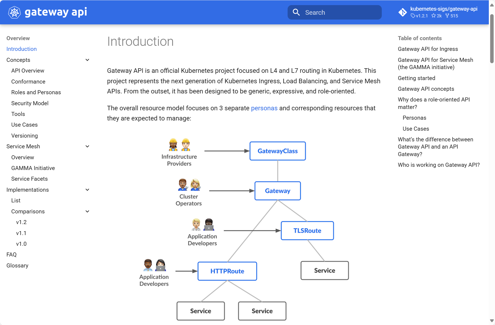

# CKA详解


## Kubernetes介绍


Kubernetes 是运行在操作系统之上的一个分布式系统内核，它将一组普通物理或虚拟机抽象为一个统一的资源池。相比传统操作系统，Kubernetes 实现了容器粒度的资源调度、服务治理、自愈恢复等能力，某种程度上，它是面向现代云应用的更高一级‘操作系统。

就像传统操作系统调度进程和线程一样，Kubernetes 调度的是 Pod；它不仅调度，还负责状态管理、服务发现、滚动升级等，是现代云原生应用运行的统一管理平台。


Kubernetes**集群分为两个角色**，分别是Master节点和Worker节点

在 Kubernetes 中，Master 节点负责管理整个集群，因此被称为控制平面（Control Plane）。它负责调度、集群状态维护、资源协调等核心任务。而集群中实际运行用户应用（如 Web 服务、数据库、后台任务等）的 Pod，通常调度部署在 Worker 节点上，也叫数据平面。

```ABAP
可以理解为：Master 是 Kubernetes 的‘大脑’，而 Worker 是‘手和脚’，控制平面做决策，数据平面去执行这些决策。
```


### Master节点介绍

#### **ApiServer**

**API Server 是 Kubernetes 的“前门”和“大脑”**

- 所有组件（controller-manager、scheduler、kubelet、kubectl）都**不能绕过 API Server**进行通信；
- 它是**唯一允许读写 etcd 的组件**；
- 它是整个集群的**状态总线**，维持着“**期望状态**”（用户提交）和“**实际状态**”（组件上报）的一致性。


**API Server 用于构建Kubernetes安全边界**

在 Kubernetes 中，API Server 是集群中所有通信的唯一入口，因此我们只需维护 API Server 的证书体系。组件通过 TLS 或 Token 方式与 API Server 建立通信，而 API Server 则统一负责所有请求的认证、授权和准入控制，从而构建起 Kubernetes 安全边界的核心框架


**提供 Watch 机制以实现实时变更推送**

- kube-apiserver 支持组件发起 `watch` 请求，它会将 etcd 中的变更以流式事件推送出去；
- 所有 controller、kubelet、operator 等组件都依赖这个机制进行状态监听。


#### Scheduler

**Kubernetes Scheduler** 是控制面组件之一，负责将尚未分配节点的 Pod 绑定到集群中最合适的节点上运行。

它的本质是一个 **决策器**：根据 Pod 的资源需求、调度策略和集群的当前状态，做出“**放哪儿运行最合适**”的决策。


#### Controller-Manager

**Kube-controller-manager** 是 Kubernetes 的自动化执行引擎。它通过一系列控制器，围绕集群中各种资源（Pod、Node、PVC、Deployment 等）持续执行状态对比和纠偏操作。只要用户声明了期望，控制器就会自动、持续地将实际状态向目标状态逼近，从而实现真正的自愈、自动扩缩、滚动更新等高级功能


#### etcd

`etcd` 是 Kubernetes 的唯一持久化存储后端，负责保存整个集群的所有状态数据（元数据）。


### Worker节点介绍

#### Kuber-proxy

`kube-proxy` 是 Kubernetes 中用于实现 `Service` 虚拟 IP（ClusterIP）访问能力的组件。它通过监听集群中的 `Service` 和 `Endpoints` 变化，生成网络转发规则（基于 `iptables` 或 `ipvs`），并将这些规则加载到 Linux 内核网络栈中，实现客户端访问 `Service IP` 时，能够自动负载均衡转发到后端 Pod。


 **工作机制：核心流程**

1. **Watch API Server**
   - 监听 `Service` 和 `Endpoints` 的变化
2. **生成规则**
   - 根据监听到的资源，构造转发规则（如 iptables 或 IPVS）
3. **下发到内核**
   - 利用 Linux 内核实现数据包转发（iptables 或 IPVS 模块）


 **kube-proxy 不是 Service 的创建者，而是转发规则的生成者**

- Service 和 Endpoints 由 kube-apiserver 管理；
- kube-proxy 只是**根据它们生成转发规则**；
- 它并不直接创建网络设备或虚拟接口。


#### kubelet

kubelet 是 Kubernetes 每个节点上的核心 agent，负责与 API Server 通信，并通过调用容器运行时（如 containerd、Docker）来管理该节点上所有 Pod 的生命周期。


### Kubernetes扩展接口

Kubernetes提供了三个特定功能的接口,kubernetes通过调用这几个接口，来完成相应的功能。

- **容器运行时接口CRI**: Container Runtime Interface 

  - CRI 首次发布于2016年12月的Kubernetes 1.5 版本。 

  - 在此版本之前，Kubernetes 直接与 Docker 通信，没有标准化的接口。 

  - 从 Kubernetes 1.5 开始，CRI 成为 Kubernetes 与容器运行时交互的标准接口，使得 Kubernetes  可以与各种容器运行时进行通信，从而增加了灵活性和可移植性。

  - kubernetes 对于容器的解决方案，只是预留了容器接口，只要符合CRI标准的解决方案都可以使用

- **容器网络接口CN**I: Container Network Interface
  - kubernetes 对于网络的解决方案，只是预留了网络接口，只要符合CNI标准的解决方案都可以使用
- **容器存储接口CSI:** Container Storage Interface
  - kubernetes 对于存储的解决方案，只是预留了存储接口，只要符合CSI标准的解决方案都可以使用 此接口非必须


### Kubernetes中的通信

在 Kubernetes 中，Protobuf 和 JSON 是两种**序列化协议**，分别用于内部组件高效通信和外部用户交互。而这些序列化后的数据，通常通过 HTTP 或 HTTP/2 协议传输。

在 Kubernetes 中，kubectl 默认通过 HTTP/1.1 与 API Server 通信，而内部组件则通常通过支持 HTTP/2 的 client-go 与 API Server 通信。当它们使用 Watch 机制监听资源变化时，不论是 HTTP/1.1 还是 HTTP/2，都能建立流式响应，只不过 HTTP/2 在性能上更优

```ABAP
序列化：把程序中的数据结构或对象转换为可以存储或传输的格式（如字符串或二进制流）的过程。
```


**Kubernetes 的 API 通信最常使用的是：**

- **HTTP/1.1**（默认最广泛支持）
- **HTTP/2**（在使用 gRPC 或 Watch 时支持，提升多路复用性能）

例如：

- `kubelet` 与 `kube-apiserver` 使用 **HTTP/2 + Protobuf**
- `kubectl` 与 `kube-apiserver` 使用 **HTTP/1.1 + JSON**


#### 通信中的安全机制

**Kubernetes集群中有三套CA机制**

- **etcd-ca**        ETCD集群内部的TLS通信
- **kubernetes-ca**    Kubernetes集群内部节点间的双向TLS通信
- **front-proxy-ca**    Kubernetes集群与外部扩展服务简单双向TLS通信


### Kerbernetes的运维工作

- **业务的运行**：应用发布与部署
  - 主要包括：镜像构建，Pod编排（Deployment，StatefulSet等），CICD流程

- **外部用户的访问**：流量入口与服务治理
  - 主要包括：Ingress/Nginx，LoadBalancer，GatewayAPI，服务发现，恢复发布，限流熔断等
- **调度业务运行所需资源**：资源编排与调度
  - 主要包括：节点调度（Pod Scheduling）、亲和性（Affinity）、Taint/Toleration、资源限制、HPA/VPA
- **运维保障服务**：可观测性
  - 主要包括：日志，指标监控，链路跟踪


## 1. HPA

**HPA本质**：是 Kubernetes 的一个控制器，用于根据实时监控的指标（如 CPU 使用率、内存、自定义指标等）**自动增加或减少 Pod 副本数量**，从而实现弹性扩缩容。


#### HPA控制器简介

Horizontal Pod Authscaling（HPA）控制器，根据预定义的阈值及Pod当前的资源利用率，自动控制在K8S集群中运行的Pod数量（自动弹性水平自动伸缩）

```bash
--horizontal-pod-autoscaler-sync-period                # 默认每隔15s（可以通过 --horizontal-pod-autoscaler-sync-period修改）查询metrics的资源使用情况
--horizontal-pod-autoscaler-downscale-stabilization    # 缩容间隔周期，默认5分钟（防止流量抖动）
--horizontal-pod-autoscaler-sync-period                # HPA控制器同步pod副本数的间隔周期
--horizontal-pod-autoscaler-cpu-initalization-period   # 初始化延迟时间，在此时间内pod的CPU资源指标将不会生效，默认为5分钟
--horizontal-pod-autoscaler-initial-readiness-delay    # 用于设置pod准备时间，在此时间内的pod统统被认为未就绪及不采集数据，默认为30秒,举例解释：该参数是为了防止刚创建的 Pod 在还未就绪时就被纳入 HPA 的指标采集中（因为启动期资源占用可能非常低），从而误导缩容决策。
#比如：如果你新扩容了 3 个 Pod，它们刚启动时的资源使用率几乎为 0，如果不设置这个延迟，HPA 会马上认为整体使用率下降，从而错误触发缩容。
--horizontal-pod-autoscaler-tolerance   # HPA控制器能容忍的数据差异（浮点数，默认为0.1）即新的指标要与当前的阈值差异在0.1或以上，比如：target CPU utilization = 50%; tolerance = 0.1; 
# 当实际 CPU < 45%（= 50% × 0.9） → 触发 缩容
# 当实际 CPU > 55%（= 50% × 1.1） → 触发 扩容
# 当 CPU 在 45%～55% 区间内 → 不变，维持当前副本数

# 计算公式：TargetNumOfPods = ceil(sum(CurrentPodsCPUUtilization) / Target) #ceil是向上取整的目的pod整数

# 指标数据需要部署metrics-server，即HPA使用metrics-server作为数据源

[root@master-01 ~]# kube-controller-manager --help|grep horizontal 
......
      --concurrent-horizontal-pod-autoscaler-syncs int32               The number of horizontal pod autoscaler objects that are allowed to sync concurrently. Larger number = more responsive horizontal pod autoscaler objects processing, but more CPU (and network) load. (default 5)
      --horizontal-pod-autoscaler-cpu-initialization-period duration   The period after pod start when CPU samples might be skipped. (default 5m0s)
      --horizontal-pod-autoscaler-downscale-stabilization duration     The period for which autoscaler will look backwards and not scale down below any recommendation it made during that period. (default 5m0s)
      --horizontal-pod-autoscaler-initial-readiness-delay duration     The period after pod start during which readiness changes will be treated as initial readiness. (default 30s)
      --horizontal-pod-autoscaler-sync-period duration                 The period for syncing the number of pods in horizontal pod autoscaler. (default 15s)
      --horizontal-pod-autoscaler-tolerance float                      The minimum change (from 1.0) in the desired-to-actual metrics ratio for the horizontal pod autoscaler to consider scaling. (default 0.1)

```

使用 HPA 的前提条件：必须部署 `metrics-server` 和 该对象必须设置资源限制，即Request的值

```ABAP
HPA 默认依赖 metrics.k8s.io API 来获取 Pod 的资源使用情况（如 CPU、内存），而这个 API 是由 metrics-server 提供的。
metrics-server 向每个 kubelet 发请求（HTTPS），拉取数据。
然后将这些实时数据提供给 Kubernetes API Server 作为聚合 API

HPA通过 API Server 查询
/apis/metrics.k8s.io/v1beta1/pods
/apis/metrics.k8s.io/v1beta1/nodes
```

```ABAP
使用HPA，该对象必须设置资源限制，即Request的值，否则HPA取不到值，HPA是根据:当前使用的值 / Request = 使用率，从而和阈值进行比较来决定如何扩缩容的（这里注意，不是Limit值，而是Request的值）
```

```ABAP
一旦部署了 HPA，Pod 的副本数控制权就从 Deployment / StatefulSet 转移到了 HPA。
如果你同时设置了 Deployment 的 replicas: 3 和 HPA 的 minReplicas=5，最终副本数会是 ≥5。
如果你删除了 HPA 对象，Deployment 或 StatefulSet 会回退到自己 .spec.replicas 的值
```


## 2. Request与Limit


## 3. Pod优先级

首先需要明确的是，优先级和抢占机制，解决的是 **Pod 调度失败时该怎么办的问题**。

正常情况下，当一个 Pod 调度失败后，它就会被暂时“搁置”起来，直到 Pod 被更新，或者集群状态发生变化，调度器才会对这个 Pod 进行重新调度。

但在有时候，我们希望的是这样一个场景。当一个高优先级的 Pod 调度失败后，该 Pod 并不会被“搁置”，而是会“挤走”某个 Node 上的一些低优先级的 Pod 。这样就可以保证这个高优先级 Pod 的调度成功。这个特性，其实也是一直以来就存在于 Borg 以及 Mesos 等项目里的一个基本功能。

在 Kubernetes 里，优先级和抢占机制是在 1.10 版本后才逐步可用的。要使用这个机制，你首先需要在 Kubernetes 里提交一个 **PriorityClass** 的定义，如下所示：

```yaml
apiVersion: scheduling.k8s.io/v1beta1
kind: PriorityClass
metadata:
  name: high-priority
value: 1000000
globalDefault: false
description: "This priority class should be used for high priority service pods only."
```

上面这个 YAML 文件，定义的是一个名叫 high-priority 的 PriorityClass，其中 value 的值是 1000000 （一百万）

**Kubernetes 规定，优先级是一个 32 bit 的整数，最大值不超过 1000000000（10 亿，1 billion），并且值越大代表优先级越高**。而超出 10 亿的值，其实是被 Kubernetes 保留下来分配给系统 Pod 使用的。显然，这样做的目的，就是保证系统 Pod 不会被用户抢占掉。

而一旦上述 YAML 文件里的 **globalDefault 被设置为 true 的话**，**那就意味着这个 PriorityClass 的值会成为系统的默认值**。而如果这个值是 false，就表示我们只希望声明使用该 PriorityClass 的 Pod 拥有值为 1000000 的优先级，而对于没有声明 PriorityClass 的 Pod 来说，它们的优先级就是 0。

在创建了 PriorityClass 对象之后，Pod 就可以声明使用它了，如下所示：

```yaml
apiVersion: v1
kind: Pod
metadata:
  name: nginx
  labels:
    env: test
spec:
  containers:
  - name: nginx
    image: nginx
    imagePullPolicy: IfNotPresent
  priorityClassName: high-priority
```

可以看到，这个 Pod 通过 priorityClassName 字段，声明了要使用名叫 high-priority 的 PriorityClass。当这个 Pod 被提交给 Kubernetes 之后，Kubernetes 的 PriorityAdmissionController 就会自动将这个 Pod 的 spec.priority 字段设置为 1000000。

前文讲过，调度器里维护着一个调度队列。所以，当 Pod 拥有了优先级之后，高优先级的 Pod 就可能会比低优先级的 Pod 提前出队，从而尽早完成调度过程。这个过程，就是“优先级”这个概念在 Kubernetes 里的主要体现。

```ABAP
当一个高优先级的 Pod 调度失败的时候，调度器的抢占能力就会被触发。这时，调度器就会试图从当前集群里寻找一个节点，使得当这个节点上的一个或者多个低优先级 Pod 被删除后，待调度的高优先级 Pod 就可以被调度到这个节点上。这个过程，就是“抢占”这个概念在 Kubernetes 里的主要体现
```

为了方便叙述，我接下来会把待调度的高优先级 Pod 称为“抢占者”（Preemptor）。

当上述抢占过程发生时，抢占者并不会立刻被调度到被抢占的 Node 上。事实上，调度器只会将抢占者的 spec.nominatedNodeName 字段，设置为被抢占的 Node 的名字。然后，抢占者会重新进入下一个调度周期，然后在新的调度周期里来决定是不是要运行在被抢占的节点上。这当然也就意味着，即使在下一个调度周期，调度器也不会保证抢占者一定会运行在被抢占的节点上。

这样设计的一个重要原因是，调度器只会通过标准的 DELETE API 来删除被抢占的 Pod，所以，这些 Pod 必然是有一定的“优雅退出”时间（默认是 30s）的。而在这段时间里，其他的节点也是有可能变成可调度的，或者直接有新的节点被添加到这个集群中来。所以，鉴于优雅退出期间，集群的可调度性可能会发生的变化，**把抢占者交给下一个调度周期再处理，是一个非常合理的选择。**

而在抢占者等待被调度的过程中，如果有其他更高优先级的 Pod 也要抢占同一个节点，那么调度器就会清空原抢占者的 spec.nominatedNodeName 字段，从而允许更高优先级的抢占者执行抢占，并且，这也就使得原抢占者本身，也有机会去重新抢占其他节点。这些，都是设置 **nominatedNodeName** 字段的主要目的

**官方默认 PriorityClass 对照表：**

| PriorityClass 名称        | 值（value）                   | 用途                                                        |
| ------------------------- | ----------------------------- | ----------------------------------------------------------- |
| `system-cluster-critical` | `2000001000`                  | 集群级关键组件（如 `kube-apiserver`, `controller-manager`） |
| `system-node-critical`    | `2000000000`                  | 节点级关键组件（如 `kubelet`, `kube-proxy`）                |
| 用户自定义                | 通常从 `0` 或 `1000000000` 起 | 应用程序使用，越高越优先                                    |


## 4. Service

### Service是什么

Service 本质上就是一个**四层的反向代理**，集群内和外的客户端可以通过如下流程最终实现访问Pod应用

```ABAP
集群内部Client --> service网络 --> Pod网络 --> 容器应用
集群外部Client --> 集群内节点网络 --> service网络 --> Pod网络 --> 容器应用

Kubernetes网络
Pod网络     ----  cni
Service网络 ----  kubeproxy
node网络    ----  宿主机网络
```


**Service 核心功能**

- 服务发现: 利用标签选择器，在同一个namespace中筛选符合的条件的Pod, 从面实现发现一组提供 了相同服务的Pod
- 负载均衡: Service作为流量入口和负载均衡器，其入口为ClusterIP, 这组筛选出的Pod的IP地址，将 作为该Service的后端服务器
- 名称解析: 利用Cluster DNS，为该组Pod所代表的服务提供一个名称, 在DNS中 对于每个Service， 自动生成一个A、PTR和SRV记录


**Endpoints**

当创建 Service资源的时候，最重要的就是为Service指定能够提供服务的标签选择器

Service Controller就会根据标签选择器会自动创建一个同名的**Endpoint**资源对象，Kubernetes新版中还增加了**endpointslices**资源

- Endpoint Controller使用Endpoint的标签选择器(继承自Service标签选择器)，筛选符合条件(包括 符合标签选择器条件和处于Ready 状态)的pod资源
- Endpoint Controller 将符合要求的pod资源绑定到Endpoint上，并告知给Service资源谁可以正常提供服务
- Service 会自动获取一个固定的 **cluster IP**向外提供由Endpoint提供的服务资源
- Service 其实就是为动态的一组 pod 资源对象提供一个固定的访问入口。即 Service实现了后端Pod 应用服务的


- 每创建一个Service ,自动创建一个和之同名的API 资源类型 Endpoints
- Endpoints负责维护由相关Service标签选择器匹配的Pod对象
- Endpoints对象上保存Service匹配到的所有Pod的IP和Port信息,称之为端点
- ETCD是K/V数据库, 而一个**Endpoints对象对应一个Key**,所有**后端Pod端点信息为其Value**
- 当一个Endpoints对象对应后端每个Pod的每次变动，都需更新整个Endpoints对象，并将新的 Endpoints对象重新保存至API Server和ETCD
- 此外还需要将该对象同步至每个节点的kube-proxy
- 在ETCD中的对象默认最大为1.5MB,一个Endpoints对象至多可以存储5000个左右的端点信息,这意 味着平均每端点占300KB


**Service类型**

对于Kubernetes 可以实现内部服务的自由通信,也可以将平台内部的服务发布到外部环境

Service主要有四种类型，实现不同的网络通信功能

- ClusterIP
- NodePort
- LoadBalancer
- ExternalName


| 类型         | 解析                                                         |
| ------------ | ------------------------------------------------------------ |
| ClusterIP    | 此为Service的默认类型<br />为**集群内部的客户端访问**,包括节点和Pod等，**外部网络无法访问**<br />In client --> clusterIP: ServicePort (Service) --> PodIP: PodPort |
| NodePort     | 本质上**在ClusterIP模式基础上,再多加了一层端口映射的封装**,相当于增强版的 ClusterIP<br />通过NodeIP:NodePort对外部网络提供服务，默认**随机端口范围30000~32767**, 可指定为固定端口<br />NodePort是一个随机的端口，以防止端口冲突,在**所有安装kube-proxy的节点 上都会打开此相同的端口**<br />可通过访问ClusterIP实现集群内部访问,也可以通过NodeIP:NortPort的方式实 现从集群外部至内部的访问<br />Ex Client --> NodeIP:NodePort (Service) --> PodIP:PodPort |
| LoadBalancer | 基于NodePort基础之上**，使用集群外部的运营商负载均衡器方式实现对外提供** 服务,增强版的NodePort<br/>基于云运营商IaaS云创建一个Kubernetes云，云平台也支持LBaaS(Load Balance as a Service)产品服务<br/>Master借助cloud-manager向LBaaS的API请求动态创建软件LB,即支持和Kubernetes API Server 进行交互<br/>如果没有云服务,将无法获取EXTERNAL-IP,显示Pending状态,则降级为 NodePort类型<br/>Ex Client --> LB_IP:LB_PORT --> NodeIP:NodePort(Service)--> PodIP:PodPort |
| ExternalName | 当Kubernetes集群需要访问集群外部服务时，需要通过externalName**将外部主机引入到集群内部**<br />外部主机名以 DNS方式解析为一个 CNAME记录给Kubernetes集群的其他主机来使用<br />**这种Service既没有ClusterIP，也没有NodePort.而且依赖于内部的CoreDNS功能**<br />In client -->Cluster ServiceName --> CName --> External Service Name |


## 5. Ingress

Ingress 是 Kubernetes 中用来管理外部 HTTP/HTTPS 流量进入集群的 API 对象，配合 Ingress Controller 实现基于域名、路径等规则的七层反向代理路由功能。


**ingress 主要包含两个组件Ingress API和Ingress Controller**

ingress 其具备了动态更新并加载新配置的特性。而且ingress本身是不具备实现集群内外流量通信的功能的，这个功能是通过 controller来实现的。**Ingress Controller本身是运行于集群中的Pod资源对象**

| 组件               | 解析                                                         |
| ------------------ | ------------------------------------------------------------ |
| Ingress API        | Kubernetes上的标准API资源类型之一 仅定义了抽象路由配置信息，只是元数据，需要由相应的控制器动态加载 将代理配置抽象成一个Ingress对象，每个服务对应一个yaml配置文件 负责以k8s标准的资源格式定义流量调度、路由等规则 属于名称空间级资源,完成将同一个名空间的service资源进行暴露 |
| Ingress Controller | 七层反向代理服务程序 需要监视（watch）API Server上 Ingress资源的变动，并生成具体应用的自身的配 置文件格式，即将新加入的Ingress转化成反向代理的配置文件并动态加载使之生效，最终并据此完成流量转发 <br />Ingress Controller非为内置的控制器，需要额外自行部署 <br />通常以Pod形式运行于Kubernetes集群之上 一般应该由专用的LB Service负责为其接入集群外部流量 |


#### Ingress 访问过程

- 从外部流量调度到kubernetes中Ingress service，有多种实现方案，比如使用节点网络中的 EXTERNAL-IP或者NodePort方式
- 从service调度到ingress-controller
- ingress-controller根据ingress Pod 中的定义，比如虚拟主机或者后端的url
- 根据虚拟主机名直接调度到后端的一组应用pod中


注意：

- 整个流程中涉及到了两处service内容
- service ingress-nginx 是帮助 ingress controller Pod 接入外部流量的
- **后端的服务对应的service**只起到帮助 ingress controller Pod 找到具体的服务的Pod，即**只用于服务发现** ，而**流量不需要经过后端服务的Service**，直接从ingress controller Pod转到至具体的Pod
- 虚线表示service对后端的应用进行分组，实线表示ingress实际的访问流向


#### 补充：三种 `pathType` 及其含义与使用方式

1️⃣ `Exact`

- **含义**：完全匹配路径，只有请求路径与规则中的路径 **完全一致** 才会被匹配。
- **场景**：适用于需要精确控制的 API 入口等情况。

**示例：**

```yaml
path: /app
pathType: Exact
```

| 请求路径  | 是否匹配 |
| --------- | -------- |
| `/app`    | ✅ 是     |
| `/app/`   | ❌ 否     |
| `/app/v1` | ❌ 否     |


2️⃣ `Prefix`

- **含义**：匹配以指定路径为前缀的请求路径，且路径分段（以 `/` 分隔）必须完整匹配。
- **这是使用最广泛的类型**。

**示例：**

```yaml
path: /app
pathType: Prefix
```

| 请求路径       | 是否匹配 |
| -------------- | -------- |
| `/app`         | ✅ 是     |
| `/app/`        | ✅ 是     |
| `/app/page`    | ✅ 是     |
| `/application` | ❌ 否     |

注意：**`/app/page`** ✅ 是因为它是以 `/app` 这个段开头，而 `/application` ❌ 是因为整个段不匹配。


3️⃣ `ImplementationSpecific`

- **含义**：由 Ingress Controller 自己决定如何匹配路径，行为 **可能因控制器不同而异**。
- **不推荐生产使用**，容易出现不一致行为。

 **示例：**

```
path: /app
pathType: ImplementationSpecific
```

| 请求路径    | 是否匹配 |
| ----------- | -------- |
| `/app`      | 可能是   |
| `/app2`     | 可能也是 |
| `/app/test` | 可能是   |

取决于你用的是哪个 Ingress Controller，例如 NGINX、Traefik、HAProxy 等都实现略有不同。


## 6. GatewayAPI

Gateway API 是 Kubernetes Ingress 模型的下一代标准。它通过将 Gateway（入口定义）和 Route（流量规则）解耦，支持多协议（HTTP、TCP、UDP、TLS），允许多租户协作管理，提供标准的状态反馈和更丰富的路由能力。相比 Ingress，Gateway API 更加灵活、可扩展，适合复杂企业环境中的流量治理和网关管理需求。


**Gateway API 解决了哪些 Ingress 的局限？**

| 能力/特点          | Ingress（V1）               | Gateway API（V2）                           |
| ------------------ | --------------------------- | ------------------------------------------- |
| **协议支持**       | 主要是 HTTP/HTTPS           | 支持 HTTP、HTTPS、TCP、UDP、TLS             |
| **资源粒度**       | 入口+路由 混在一个资源里    | 入口和路由解耦（Gateway + Route）           |
| **多租户管理**     | 不好控制，单一 IngressClass | Gateway 独立，Route 可分团队管理            |
| **负载均衡策略**   | 受限                        | 更丰富，比如 header、method、SNI 分流       |
| **跨命名空间路由** | 不支持                      | ✅ 支持跨命名空间管理                        |
| **可观测性**       | 依赖控制器                  | 定义标准的状态反馈                          |
| **标准化**         | Controller 自定义较多       | 提供统一 API 规范，跨 Controller 兼容性更好 |





如上图：Gateway API 把人员角色分为3类

1. **Infrastructure Provider**：基础设施提供者，主要负责GatewayClass，把Gateway Controller 和 Gateway 关联起来，负责整个底层设施的提供，给Gateway 提供 gatewayClassName
2. **Cluster Operator**：集群操作者，主要负责 Gateway，**类似反向代理的前端**
3. **Application Develops**：应用开发者，负责开发业务 Service，**类似反向代理的后端**


### Gateway-API-流量分发流程

#### A Simple Gateway


**1️⃣ 客户端请求**

客户端（例如浏览器或 API 调用）向某个域名或 IP 发起 HTTP/S 请求。

**2️⃣ 负载均衡（Gateway）**

**Gateway** 组件充当了整个系统的入口，通常对应一个 **Load Balancer**（负载均衡器）或者 Kubernetes 内部的 `Gateway` 资源。

- Gateway 的作用
  - 监听外部请求（通常是 HTTP 或 HTTPS）
  - 将匹配的流量转发给适当的 **HTTPRoute**
  - 可绑定多个 `HTTPRoute` 资源，处理不同路径的流量

**Gateway 配置示例**

```yaml
apiVersion: gateway.networking.k8s.io/v1
kind: Gateway
metadata:
  name: foo-gateway
  namespace: default
spec:
  gatewayClassName: nginx
  listeners:
    - protocol: HTTP
      port: 80
      name: http
      allowedRoutes:
        namespaces:
          from: All	
```

- **gatewayClassName: nginx** → 说明使用 Nginx Gateway Controller 处理流量

- **listeners.port: 80** → 监听 HTTP 80 端口

- **allowedRoutes** → 允许所有命名空间的 `HTTPRoute` 关联该 `Gateway`

**3️⃣ 路由匹配（HTTPRoute）**

**HTTPRoute** 负责定义流量的转发规则，例如：

- **路径匹配（Path Matching）**
- **主机匹配（Host Matching）**
- **流量权重（Traffic Splitting）**

**HTTPRoute 配置示例**

```yaml
apiVersion: gateway.networking.k8s.io/v1
kind: HTTPRoute
metadata:
  name: foo-route
  namespace: default
spec:
  parentRefs:
    - name: foo-gateway  # 绑定 Gateway
  rules:
    - matches:
        - path:
            type: PathPrefix
            value: "/"  # 匹配所有流量
      backendRefs:
        - name: foo-svc  # 指定 Service
          port: 80
```

- **`parentRefs: foo-gateway`** → 说明该 HTTPRoute 绑定到 `foo-gateway`
- **`matches: path: "/"`** → 说明匹配所有请求路径
- **`backendRefs: foo-svc`** → 指定流量转发到 `foo-svc` Service

**4️⃣ Service 发现**

Gateway 发现 `foo-svc` Service，并将流量转发给该 Service。

- Service 的作用
  - 负责负载均衡，将请求转发给 Pod
  - 通过 `selector` 选择匹配的 Pod

**Service 配置示例**

```yaml
apiVersion: v1
kind: Service
metadata:
  name: foo-svc
  namespace: default
spec:
  selector:
    app: foo
  ports:
    - port: 80
      targetPort: 8080  # 转发到 Pod 的 8080 端口
```

- **selector: app=foo** → 选择标签为 `app=foo` 的 Pod
- **port: 80 → targetPort: 8080** → Service 监听 80 端口，但实际转发给 Pod 的 8080 端口

**5️⃣ 进入 Pod**

最终，流量会被路由到 **符合 `app=foo` 选择器的 Pod**，Pod 上的应用程序处理请求并返回响应。

```ABAP
注意：和Ingress相同，从 Gateway API 接收请求会直接发往后端 Pod，Service在这里用作服务发现
```


### 补充：**为什么 Gateway 和 HTTPRoute 都要求 Hostname**

- **Gateway 上的 `hostname`**
   限制了入口能接受的**客户端请求的域名范围**（SNI 或 HTTP Host 头）。
  - 作用：**入口限制**
    - “哪些域名的流量可以进入这个 Gateway Listener？”
    - 比如：只允许 `*.example.com`
- **HTTPRoute 上的 `hostname`**
   **声明路由规则处理哪些 Hostname 的流量**（二次过滤或精确匹配）。
  - 作用：**路由匹配**
    - “进入 Gateway 后，哪些域名的流量归这个 Route 处理？”
    - 比如：`app.example.com`


#### 真实示例

**1. Gateway（入口限制）**

```yaml
apiVersion: gateway.networking.k8s.io/v1
kind: Gateway
metadata:
  name: shared-gateway
spec:
  listeners:
  - name: https
    protocol: HTTPS
    port: 443
    hostname: "*.example.com"
```

- 表示：**只允许 `\*.example.com` 的流量进入 Gateway**


**2. HTTPRoute-A（app1 专属）**

```yaml
apiVersion: gateway.networking.k8s.io/v1
kind: HTTPRoute
metadata:
  name: app1-route
spec:
  hostnames:
    - "app1.example.com"
```

- 表示：只处理 `app1.example.com` 的流量****


**3. HTTPRoute-B（app2 专属）**

```yaml
apiVersion: gateway.networking.k8s.io/v1
kind: HTTPRoute
metadata:
  name: app2-route
spec:
  hostnames:
    - "app2.example.com"
```

- 表示：**只处理 `app2.example.com` 的流量**


## 7. PVC

#### 存储机制

Container 中的文件在磁盘上是临时存放的，这给 Container 中运行的较重要的应用程序带来一些问题。

- 当容器崩溃时。 kubelet 可能会重新创建容器，可能会导致容器漂移至新的宿主机，容器会以干净的状态重建。导致数据丢失
- 在同一 Pod 中运行多个容器需要共享数据


Kubernetes 卷（Volume） 这一抽象概念能够解决这两个问题


**Kubernetes 存储架构**

存储的组件主要有：attach/detach controller、pv controller、volume manager、volume plugins、 scheduler

每个组件分工明确


**Controller-Manager中的组件**

- **Attach/Detach Controller**
  - **职责**：管理“远程存储卷”（如 iSCSI、NFS、云盘等）与节点之间的“挂载声明”。
  - **作用**：决定将卷“附加”到哪个节点或“卸载”从哪个节点移除。
  - **举例**：在阿里云、AWS、GCE 等云盘存储，**先 Attach 到 Node，再挂载给 Pod**。

- **PersistentVolume Controller**
  - **职责**：管理 **PV（Persistent Volume）** 与 **PVC（Persistent Volume Claim）** 的**生命周期和绑定关系**。
  - **作用**：自动绑定符合 PVC 需求的 PV，或根据 StorageClass 动态创建 PV。

- **VolumeBinding Controller**
  - **职责**：在 **Pod 调度之前** 预先确定 PVC 与 PV 的绑定关系。
  - **作用**：解决卷调度与 Pod 调度的一致性问题，保证卷和 Pod 调度到同一节点或可访问的节点

- **PVC Protection Controller**
  - **职责**：防止正在被 Pod 使用的 PVC 被误删。
  - **作用**：保证卷的安全性和数据完整性。

- **StorageClass Controller（如果使用）**
  - **职责**：管理存储策略（如存储类型、性能等级、回收策略）
  - **作用**：根据 PVC 请求自动选择或创建符合策略的存储卷。


**kubelet中的存储组件**

- **Volume Manager (Kubelet 内部模块)**
  - **职责**：管理节点上的卷挂载、卸载、格式化等操作。
  - **作用**：
    - **感知 Pod 生命周期**；
    - **协调卷与节点的关系**；
    - **驱动挂载操作（通过插件）**

- **Volume Plugin**

  - **In-Tree Plugin**：Kubelet内置了In-Tree的插件逻辑（逐步废弃）
  - **CSI Plugin**: Kubelet作为客户端，调用用独立部署的 CSI 插件 DaemonSet（比如 ceph-csi、nfs-csi）

  ```ABAP
  无论是内置插件还是 CSI 插件，kubelet 统一负责调用
  ```

  - **作用**
    - **Node Plugin** 提供挂载操作接口；
    - **Controller Plugin** 提供卷创建、删除、扩容等接口。


**CSI插件的典型架构**

- **Node Plugin（DaemonSet）**：运行在每个 Node 上，提供挂载/卸载操作能力。

- **Controller Plugin（Deployment/StatefulSet）**：集群级别，提供卷创建、删除、快照等控制操作。

- **示例**

  ```bash
  ceph-csi-cephfs-nodeplugin-xxxxx   # Node DaemonSet
  ceph-csi-cephfs-provisioner-xxxxx  # Controller Deployment
  ```

  

#### 存储全链路架构交互图

```less
[ User / DevOps ]
        |
        v
[ kube-apiserver ]
        |
        +------------------> [ PV Controller (Controller-Manager) ]
        |                               |
        |                          CreateVolume
        |                               v
        |                [ CSI Controller Plugin (Deployment) ]
        |
        +------------------> [ VolumeBinding Controller (Controller-Manager) ]
        |                               |
        |                          Bind Volumes
        |                               v
        +------------------> [ Attach/Detach Controller (Controller-Manager) ]
                                        |
                                   Attach Volume
                                        v
                            [ kubelet - VolumeManager ]
                                        |
                       +----------------+------------------+
                       |                                   |
             NodeStage/NodePublishVolume            Mount to Pod
                       |                                   |
                       v                                   v
       [ CSI Node Plugin (DaemonSet) ]                [ Pod ]

```


#### 完整、准确的 **Kubernetes 存储交互流程（控制面 + 数据面）**

**1️⃣ 用户提交 PVC 和 Pod**

- 用户通过 `kubectl apply` 提交 **PVC 和 Pod 定义**。
- **kube-apiserver** 接收到这些资源，并持久化到 etcd。

**2️⃣ PV Controller 监听 PVC**

- **PV Controller（Controller-Manager）** 发现 PVC 未绑定。

  - 如果 PVC 绑定了 StorageClass，则 **调用 CSI Controller Plugin 的 `CreateVolume` 接口** 创建物理存储卷。具体流程如下
    - **PV Controller 调用 CSI Controller Plugin（CreateVolume）**
      - CSI Controller Plugin **并不直接创建存储数据**，它调用的是：
        - Ceph 集群 API
        - NFS Provisioner API
        - AWS EBS API
      - **存储系统** 负责实际分配卷或创建后端存储资源
    - **CSI Controller Plugin 将状态返回 PV Controller**
      - 比如，返回卷 ID、容量等信息
    - **PV Controller 创建 PV 资源声明**
      - 包含存储卷 ID、StorageClass、容量等描述信息
      - 同步到 kube-apiserver

  ```ABAP
  PV Controller 发起请求 → CSI Controller Plugin 调用存储系统 → 返回结果给 PV Controller → PV Controller 创建 PV 资源
  
  这里 PV Controller 是请求的发起者，
  CSI Controller Plugin 是执行者，
  存储系统是最终提供者。
  ```

**3️⃣ VolumeBinding Controller 绑定 PVC 和 PV**

- **VolumeBinding Controller（Controller-Manager）** 发现有可用的 PVC 和 PV。
  - 将 **PVC 和 PV 进行绑定**。
  - 更新 PVC 的 `spec.volumeName` 字段。
  - 绑定信息同步回 kube-apiserver。

**4️⃣ Scheduler 调度 Pod 到节点**

- Scheduler 发现 Pod 绑定了 PVC，**结合 PVC 选择合适的 Node**（比如基于存储亲和性）。
- Pod 被调度到目标 Node。

**5️⃣ Attach/Detach Controller 介入（针对远程存储）**

- 如果使用的是 **远程存储**（如 iSCSI、EBS、NFS），
   **Attach/Detach Controller（Controller-Manager）** 会：
  - 标记需要将卷“附加（Attach）”到目标 Node。
  - 这个操作最终也是通过 **CSI Controller Plugin** 调用 `ControllerPublishVolume`。
- 这一阶段的目的是 **让云平台或存储系统将卷与 Node 绑定**（在 Node 上“看得见”这个卷）。

```ABAP
“Attach/Detach Controller 的作用是让 Node 能够看到远程存储卷，这样 Node 才能后续完成挂载。
```

**6️⃣ Kubelet - VolumeManager 启动挂载**

- Pod 被拉起之前，**Kubelet 的 VolumeManager 发现挂载需求**。
- Kubelet 通过 **CSI Node Plugin（DaemonSet）** 调用：
  - `NodeStageVolume`（预挂载到 Node）
  - `NodePublishVolume`（最终挂载到 Pod 的目录）


## 8. storageClass


## 9. Sidecar


## 10. ConfigMap


## 11. helm


## 12. NetworkPolicy


## 13. CRD


## 14. calico


## 15. etcd修复


## 16. cri-dockerd