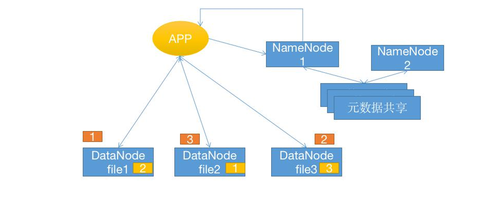

# 分布式存储概述

## 不同的存储类型的使用场景

**块存储**：需要格式化，将文件直接保存到磁盘上

**文件存储**：提供数据存储的接口，是由操作系统针对块存储的应用，即由操作系统提供存储 接口，应用程序通过调用操作系统将文件保存到块存储进行持久化

**对象存储**：也称为基于对象的存储，其中的文件被拆分成多个部分并散布在多个存储服务器， 在对象存储中，数据会被分解为称为“对象”的离散单元，并保存在单个存储库中，而不是 作为文件夹中的文件或服务器上的块来保存，对象存储需要一个简单的 HTTP 应用编程接 口 (API)，以供大多数客户端（各种语言）使用

## 分布式存储数据特性

**数据分为数据和元数据**： 

元数据即是文件的属性信息(文件名、权限(属主、属组)、大小、时间戳等)，在分布式存 储中当客户端或者应用程序产生的客户端数据被写入到分布式存储系统的时候，会有一个服 务(Name Node)提供文件元数据的路由功能，即告诉应用程序去哪个服务器去请求文件内 容，然后再有(DataNode)提供数据的读写请求及数据的高可用功能

# Ceph 基础

