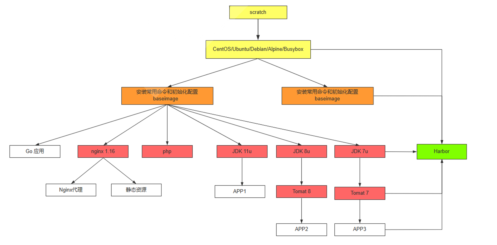
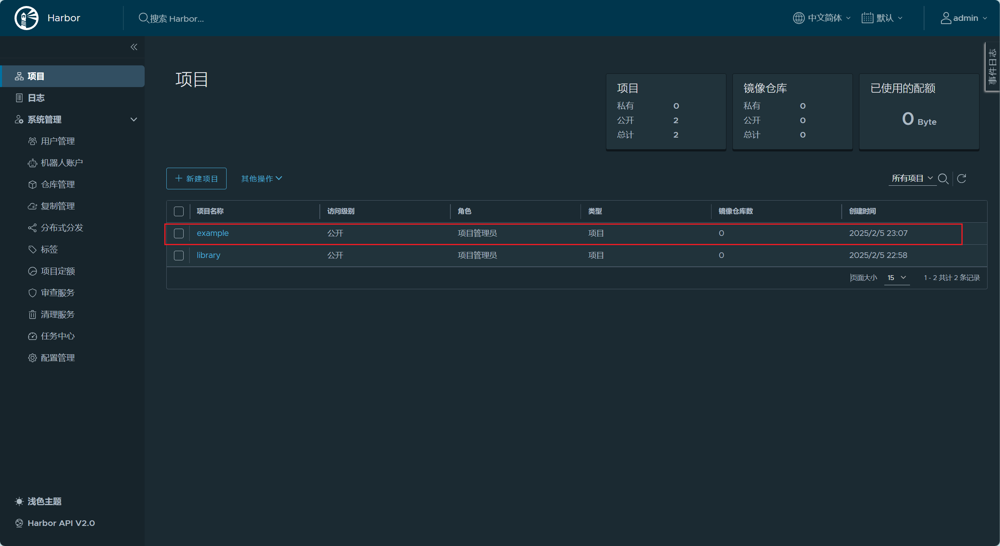

# Docker


## 认识Docker

- 基于Linux内核的**Cgroup**，**Namespace**，以及**Union FS**等技术，对进程进行封装隔离，属于操作系统层面的虚拟化技术，由于隔离的进程独立于宿主和其他的隔离的进程，因此也称其为容器


- 最初实现是基于**LXC**，从0.7以后开始去除LXC,，转而使用自行开发的**Libcontainer**，从1.11开始，则进一步演进为使用**Runc**和**Containerd**。


- Docker在容器的基础上，进行了进一步封装，从文件系统、网络互联到进程隔离等等，极大的简化了容器的创建和维护，使得Docker技术比虚拟机技术更为轻便、快捷。


### 为什么要用Docker


- **更高效地利用系统资源**

  ```ABAP
  相对于虚拟机还说，虚拟机是要虚拟操作系统，而操作系统本身是有开销的，通常一开机几百M内存就没了。
  容器技术基于Linux Kernel的Namespace和CGroup技术，它共享host的Kernel，它不需要额外占用很多资源来模拟操作系统
  从整体来看，企业的所有资源是给应用使用的，容器最终是跑应用的，所以它整体的资源利用率是高的
  ```

  

- **更快速的启动速度**

  ```ABAP
  正因为容器不需要模拟一个操作系统，因此它没有操作系统的启动时间，它没有boot，所以它启动更快
  ```

  

- **一致的运行环境**

  ```ABAP
  又因为它有Namespace这个技术，有了OverlayFS这个技术，使得这个容器可以构建成镜像，可以被分发到不同环境
  当你运行这个镜像，本质上是把这个镜像重放了一遍，所以在测试环境能够运行的程序，在其他环境一定也能运行
  因为容器在运行的时候，里面提供了一个完全封装掉，跟外面隔离的环境，既然是隔离环境，它就仿佛是一个箱子，这个箱子在这里打开和别的地方打开它里面的东西一定是一样的，它自身能够提供一致的运行环境
  ```

  

- **持续交付和部署**

  ```ABAP
  有了一致性的运行环境，就很容易迁移。而有了一致性运行环境的特性，持续交付和持续部署就很简单了。持续部署无非就是将这个盒子在不同的房间打开一遍，这就是持续部署
  ```

  

- **更轻松地迁移**

- **更轻松地维护和扩展**


### Docker三大技术


- **NameSpace**
- **Cgroup**
- **OverlayFS**


#### NameSpace

跟真实存在的虚拟机不同，在使用Docker的时候，并没有一个真正的“Docker容器”运行在宿主机里面。Docker项目帮助用户启动的，还是原来的应用进程，只不过创建这些进程时，Docker为他们加上了各种各样的Namespace参数

这时，这些进程就会觉得自己是各自PID Namespace里的第1号进程，只能看到各自Mount Namespace里挂载的目录和文件，只能访问到各自Network Namespace里的网络设备，就仿佛运行在一个个容器里面，与世隔绝。

- Linux Namespace是一种Linux Kernel提供的资源隔离方案
  - 系统可以为进程分配不同的Namespace
  - 并保证不同的Namespace资源独立分配，进程彼此隔离，即不同的Namespace下的进程互不干扰

##### Linux内核代码中Namespace的实现

```C
// 进程数据结构
struct task_struct {
    ...
    /* namesapce */
    struct nsproxy *nsproxy;
    ...
}

// Namespace数据结构
struct nsproxy {
    atomic_t count;
    struct uts_namespace *uts_ns;
    struct ipc_namespace *ipc_ns;
    struct mnt_namespace *mnt_ns;
    struct pid_namespace *pid_ns_for_children;
    struct net_namespace *net_ns;
}
```


##### Linux对Namespace操作的方法

一个进程是如何分Namespace的？

- 首先第一个进程(systemd)，pid为1的进程，它会被分配一个默认的Namespace

- 当init进程要起其他进程的时候，fork或者clone

  - clone(在clone的时候是可以指定新的Namespace的)

    - 在创建新进程的系统调用时，可以通过flags参数指定新建的Namespace类型：

    ```C
    // CLONE_NEWCGROUPS / CLONE_NEWPIC / CLONE_NEWNET / CLONE_NEWNS / CLONE_NEWPID / CLONE_NEWUSER / CLONE_NEWUTS
    int clone(int(*fn)(void*), void*child_stack, int flags, void *arg)
    ```

  - setns

    - 该系统调用可以让调用进程加入某个已经存在的Namespace中

    ```C
    int setns(int fd, int nstype)
    ```

  - unshare

    - 该系统调用可以将调用进程移动到新的Namespace下：

    ```C
    int unshare(int flags)
    ```


##### PID Namespace

- 不同用户的进程就是通过Pid Namespace隔离开的，且不同Namespace中可以有相同pid
- 有了Pid Namespace，每个namespace中的Pid能相互隔离
- pid namespace的意义
  - 一个主机可能有上千个进程，很难管理，但是使用namespace隔离开后，管理上更清晰
  - 进程将彼此隔离，则A进程无法杀死B进程，因为不同namespace下，进程相互看不到


##### Network Namespace

- 网络隔离是通过net namespace实现的，每个net namespace有独立的network devices, ip address, IP routing tables, /proc/net目录
  - 实现了微服务中，给每个服务分配自己的IP，实现服务间通信
- Docker默认采用veth的方式，将container中的虚拟网卡同host上的一个docker bridge：docker0连接在一起


##### IPC namespace

- Container中，进程交互还是采用Linux常见的进程间交互方法，包括常见的信号量，消息队列和共享内存
- container的进程间交互实际上还是host上具有相同pid namespace中的进程间交互，因此需要在IPC资源申请时加入namespace信息-每个IPC资源有一个唯一的32位ID


##### mnt namespace

- mnt namespace允许不同namespace的进程看到的文件结构不同，这样每个namespace中的进程所看到的文件目录就被隔离开了


##### uts namespace

UTS("UNIX Time-sharing System")namespace允许每个Container拥有独立的Hostname和domain name，使其在网络上可以被视作一个独立的节点而非Host上一个进程


##### user namespace

每个Container可以有不同的user和group id，也就是说可以在Container内部用container内部的用户执行程序而非Host上的用户


##### 关于Namespace的常用操作

- 查看当前系统的namespace

```shell
# 相当于list当前主机的namespace
lsns -t <type>
```

- 查看某进程的namespace

```shell
ls -la /用于Pod的环境准备，准备网络栈和存储卷的基础容器proc/<pid>/ns/

# 示例
[root@ubuntu2204 ~]#ls -la /proc/827/ns
总计 0
dr-x--x--x 2 root root 0  8月  6 10:17 .
dr-xr-xr-x 9 root root 0  8月  6 10:16 ..
lrwxrwxrwx 1 root root 0  8月  6 10:17 cgroup -> 'cgroup:[4026531835]'
lrwxrwxrwx 1 root root 0  8月  6 10:17 ipc -> 'ipc:[4026531839]'
lrwxrwxrwx 1 root root 0  8月  6 10:17 mnt -> 'mnt:[4026531841]'
lrwxrwxrwx 1 root root 0  8月  6 10:17 net -> 'net:[4026531840]'
lrwxrwxrwx 1 root root 0  8月  6 10:17 pid -> 'pid:[4026531836]'
lrwxrwxrwx 1 root root 0  8月  6 10:22 pid_for_children -> 'pid:[4026531836]'
lrwxrwxrwx 1 root root 0  8月  6 10:17 time -> 'time:[4026531834]'
lrwxrwxrwx 1 root root 0  8月  6 10:22 time_for_children -> 'time:[4026531834]'
lrwxrwxrwx 1 root root 0  8月  6 10:17 user -> 'user:[4026531837]'
lrwxrwxrwx 1 root root 0  8月  6 10:17 uts -> 'uts:[4026531838]'
```

- 进入某namespace运行命令（非常常用）
  - 当需要对docker容器进行调试，由于容器本身很小，没有调试工具，因此需要使用`nsenter`从主机进入该容器进行调试

```shell
 nsenter -t <pid> -n ip addr

# 第一步先去查容器id
docker ps|grep <container_name>

# 第二步通过docker inspect 去查找该容器在宿主机的Pid
docker inspect <docker_id> | grep -i pid

# 第三步使用nsenter进入该pid的net namespace
nsenter -t <pid> -n ip addr
```

- unshare，将进程移入新的ns

```shell
# 此时sleep 120这个进程会在新的ns中执行
unshare -fn sleep 120

# 使用ps查看sleep 120的pid
[root@ubuntu2204 ~]#ps -ef|grep sleep
root        3533    1024  0 10:47 pts/0    00:00:00 unshare -fn sleep 120
root        3534    3533  0 10:47 pts/0    00:00:00 sleep 120
root        3536    3446  0 10:47 pts/1    00:00:00 grep --color=auto sleep

# 使用nsenter就可以看到这个进程的网路是独立的
# 但是此时网络插件帮该进程去配ip
# docker中，由网络插件，默认bridge去给docker的容器也就是进程配置一个网络ip
[root@ubuntu2204 ~]#nsenter -t 3533 -n ip a
1: lo: <LOOPBACK> mtu 65536 qdisc noop state DOWN group default qlen 1000
    link/loopback 00:00:00:00:00:00 brd 00:00:00:00:00:00

# 文件系统也是独立的
[root@ubuntu2204 ~]#nsenter -t 3533 -m ls
bin   dev  home  lib32  libx32      media  opt   root  sbin  swap.img  tmp  var
boot  etc  lib   lib64  lost+found  mnt    proc  run   srv   sys       usr# 查看sleep 120的pid
ps aux|grep sleep    # pid为
```


#### Cgroup

虽然容器内的第1号进程在“障眼法”的干扰下只能看到容器里的情况，但是宿主机上，它作为第100号进程与其他所有进程之间依然是平等竞争关系。

而Linux Cgroups就是Linux内核中用来为进程设置资源限制的一个重要功能

Linux Cgruops的全称是Linux Contrlo Group。它最主要的作用，就是限制一个进程组能够使用的资源上限，包括CPU，内存，磁盘，网络带宽等
此外，Cgoups还能够对进程进行优先级设置，审计，以及将进程挂起和恢复等操作

<span style="color:red;font-weight:699">在 Linux 中，Cgroups 给用户暴露出来的操作接口是文件系统，即它以文件和目录的方式组织在操作系统的 /sys/fs/cgroup 路径下</span>

Ubuntu22.04采用的是cgroup v2，在cgroup v2创建一个控制组

```shell
cd /sys/fs/cgroup
mkdir container
# 创建的这个container的目录，就是一个控制组，操作系统会在这个新创建的container目录下，自动生成该子系统对应的资源限制文件
cgroup.controllers      cgroup.subtree_control  cpuset.cpus.effective  cpu.weight.nice  memory.events.local  memory.stat
cgroup.events           cgroup.threads          cpuset.cpus.partition  io.max           memory.high          memory.swap.current
cgroup.freeze           cgroup.type             cpuset.mems            io.pressure      memory.low           memory.swap.events
cgroup.kill             cpu.idle                cpuset.mems.effective  io.prio.class    memory.max           memory.swap.high
cgroup.max.depth        cpu.max                 cpu.stat               io.stat          memory.min           memory.swap.max
cgroup.max.descendants  cpu.max.burst           cpu.uclamp.max         io.weight        memory.numa_stat     pids.current
cgroup.procs            cpu.pressure            cpu.uclamp.min         memory.current   memory.oom.group     pids.events
cgroup.stat             cpuset.cpus             cpu.weight             memory.events    memory.pressure      pids.max
```

`cpu.max` 文件

- 功能：
  - cpu.max 文件用于设置 CPU 的最大使用时间配额和周期，类似于 cgroup v1 中的 cpu.cfs_quota_us 和 cpu.cfs_period_us。
- 格式：cpu.max 文件的内容格式为 max_quota period，其中：
  - max_quota 表示 CPU 时间的最大配额（以微秒为单位）。
  - period 表示分配的周期（以微秒为单位）。
  - 如果 max_quota 设置为 max，表示没有限制（即与 cgroup v1 中的 -1 类似）。

```shell
# 默认max
[root@ubuntu2204 container]#cat cpu.max
max 100000

# 执行下列指令，控制每 100 ms 的时间里，被该控制组限制的进程只能使用 20 ms 的 CPU 时间，
# 也就是说这个进程只能使用到 20% 的 CPU 带宽。
echo 20000 100000 > cpu.max  # 单位是纳秒，1000纳秒=1毫秒
# 运行下列指令
# 它执行了一个死循环，可以把计算机的 CPU 吃到 100%
# 根据它的输出，我们可以看到这个脚本在后台运行的进程号（PID）是 226
$ while : ; do : ; done &
[1] 226

# 使用top查看可以看到进程号226的程序将CPU打满
```

`cgroup.procs`

- cgroup.procs：在 cgroup v2 中，cgroup.procs 文件用于管理控制组中的进程和线程，与 cgroup v1 中的 tasks 文件功能相同

```shell
echo 226 > cgroup.procs

# 将226进程加入控制组，，此时上面的限制生效，该进程的CPU使用被控制到20%
```

除CPU外，Cgroups的每个文件都有其独有的资源限制能力

Linux Cgroups的设计还是比较易用的，简单粗暴地理解，就是一个子系统目录加上一组资源限制文件的组合。对于Docker等linux容器项目来说，它们只需要为每个容器创建一个控制组（即创建一个新目录），然后在启动容器进程之后，把这个进程的PID填写到对应的控制组的cgroup.procs中就可以了


##### **Docker 使用 cgroups-v1 的步骤**

- 创建控制组目录

  - 当 Docker 启动一个新的容器时，它会在 /sys/fs/cgroup 下创建一个新的控制组目录。这可以用于 CPU、内存、设备访问等各类资源的控制。例如，为某个容器创建一个新的控制组目录

  ```shell
  sudo mkdir /sys/fs/cgroup/cpu/docker/container_id
  sudo mkdir /sys/fs/cgroup/memory/docker/container_id
  # 其他资源类型的控制组目录
  ```

- 配置控制组资源限制

  - 在新的控制组目录中，可以配置资源限制。例如，限制 CPU 和内存使用

  ```shell
  # 设置 CPU 使用配额
  echo "50000 100000" > /sys/fs/cgroup/cpu/docker/container_id/cpu.max
  
  # 设置内存限制
  echo "500M" > /sys/fs/cgroup/memory/docker/container_id/memory.max
  ```

- 启动容器进程

  - 启动容器进程。假设启动的容器进程的 PID 是 12345。

- 将容器进程的 PID 添加到控制组

  - 将容器进程PID写入控制组的cgroup.procs

  ```shell
  echo 12345 > /sys/fs/cgroup/cpu/docker/container_id/cgroup.procs
  echo 12345 > /sys/fs/cgroup/memory/docker/container_id/cgroup.procs
  # 其他资源类型的控制组
  ```


##### 在Cgroups-v2中docker路径

如果 Docker 使用了 `systemd` 驱动，Cgroup 文件路径可能类似于：

```ABAP
/sys/fs/cgroup/system.slice/docker-<container-id>.scope/
```


#### Union FS

- 将不同目录挂载到同一个虚拟文件系统下(unite several directories into a single virtual filesystem的文件系统)
- 支持为每一个成员目录(类似Git Branch)设定readonly、readwrite和whiteout-able权限
- 文件系统分层，对readonly权限的branch可以逻辑上进行修改(增量地，不影响readonly部分的)
- 通常Union FS有两个用途，一方面可以将多个disk挂到同一个目录下，另一个更常用的就是将一个readonly的branch和一个writeable的branch联合在一起

##### Docker的文件系统

典型的Linux文件系统组成

- Bootfs(boot file system)
  - Bootloader - 引导加载kernel
  - Kernel - 当kernel被加载到内存中后umount bootfs
- rootfs(root file system)
  - /dev, /proc, /bin, /etc等标准目录和文件
  - 对于不同的Linux发行版，bootfs基本是一致的，但rootfs会有差别

Docker没有bootfs，它复用主机的Kernel
Docker有自己的rootfs，该rootfs有容器驱动加载出来

##### Docker启动

Linux

- 在启动后，首先将rootfs设置为readonly，进行一系列检查，然后将其切换为"readwrite"供用户使用

Docker

- 初始化时也是将rootfs以readonly方式加载并检查，然后接下来利用union mount的方式将一个readwrite文件系统挂载在readonly的rootfs之上
- 并且允许再次将下层的FS(file system)设定为readonly并向上叠加
- 这样一组readonly和一个writeable的结构构成一个container的运行时态，每一个FS被称为FS层

##### 特点1：写操作

由于镜像具有共享特性，所以对容器可写层的操作需要依赖存储驱动提供的写时复制和用时分配机制，以此来支持对容器可写层的修改，进而提高对存储和内存资源的利用率

- 写时复制
  - 写时复制，即Copy-on-Write。一个镜像可以被多个容器使用，但是不需要在内存和磁盘上做多个拷贝。
  - 在需要对镜像提供的文件进行修改时，该文件会从镜像的文件系统被复制到容器的可写层的文件系统进行修改，而镜像里面的文件不会改变。不同容器对文件的修改都相互独立，互不影响

- 用时分配
  - 按需分配空间，而非提前分配，即当一个文件被创建出来后，才会分配空间

##### OverlayFS文件系统练习

```shell
mkdir upper lower merged work
echo "from lower" > lower/in_lower.txt
echo "from upper" > upper/in_upper.txt
echo "from lower" > lower/in_both.txt
echo "from upper" > upper/in_both.txt

mount -t overlay overlay -o lowerdir=`pwd`/lower,upperdir=`pwd`/upper,workdir=`pwd`/work `pwd`/merged

# upperdir 是最上层的可写层，而 lowerdir 是只读层。当多个层次中存在相同的文件时，优先展示 upperdir 中的版本
cat merged/in_both.txt
from upper

# 在merged层添加一个文件
[root@mystical ~/test/merged]# echo aaa > a.txt

# 查看upper目录和lower目录
[root@mystical ~/test/upper]# ls
a.txt  in_both.txt  in_upper.txt
[root@mystical ~/test/lower]# ls
in_both.txt  in_lower.txt

# 结论1：对 merged 目录的任何写入操作，都会发生在 upperdir，而 lowerdir 仍然是只读的
# 结论2：果 merged 目录中的文件来自 lowerdir，修改它时会触发 "copy-up" 机制，将文件复制到 upperdir，然后再修改（COW 机制）
```

##### Docker文件系统的本质

就是一次次的`mount -t overlay overlay -o <下层>,<上层> <合并>`
通过这种方式，确保进程所需要的所有依赖和配置都在我的隔离环境中，这样迁移到其他环境中，才能完整的replay出来


##### Union FS的优点

```ABAP
1. 多个容器共享相同的 lowerdir，这是 Docker 的层存储机制（Layered Storage）。
2. 每个容器都有自己的 upperdir，存放容器的修改和新增文件，确保容器间互不影响。
3. 如果容器修改 lowerdir 的文件，会触发 "copy-up" 机制，将文件复制到 upperdir，然后容器修改 upperdir 中的文件。
4. lowerdir 仅在 docker rmi 镜像时才会真正删除，而不是删除容器时就消失。

Docker 的存储机制极大地提高了存储效率，让多个容器共享基础镜像层，同时保持隔离性。
```


### Docker组件及其关系


#### Docker组件

- **Docker Client**
- **Dockerd**
- **Containerd**
- **Containerd-shim**
- **Runc**


#### Docker组件详解


##### Dockerd (Docker Daemon)

- 负责接收和解析来自 Docker 客户端（`docker` CLI 或 API）的请求
- 是 Docker 的核心守护进程，主要负责
  - 容器生命周期管理
  - 网络和存储的管理
  - 与其他组件（如 `containerd`）的通信


##### Containerd

- 是一个高性能的容器运行时守护进程，用于管理容器生命周期
- 收 `dockerd` 的请求后，负责更底层的操作，比如
  - 拉取和管理容器镜像。
  - 创建和删除容器。
  - 处理容器的运行状态。
  - 与 `runc` 交互来创建和管理容器的具体运行环境。


##### Containerd-shim

- **了解****`containerd-shim`**
  - **`containerd-shim` 是 `containerd` 的一部分**，它由 `containerd` 创建和管理，用于处理容器的生命周期及相关操作

- **作用**

  - 它`containerd-shim` 是 `containerd` 的一个独立进程，为每个运行的容器提供隔离层
    - 通过 `containerd-shim`，每个容器都可以独立运行，无需依赖 `dockerd`。

- **启动 `containerd-shim`**

  - 当 `containerd` 接收到创建容器的请求时，会启动一个新的 `containerd-shim` 进程。
  - 每个容器都会对应一个独立的 `containerd-shim`。

- **主要职责**

  - **管理生命周期**: 通过与运行时（如 `runc`）交互，控制容器的创建、启动、停止等。
  - **标准输入/输出处理**: 处理容器的 `stdin`、`stdout`、`stderr` 管道。
  - **信号转发**: 将主机的信号（如 `SIGTERM`）转发给容器的主进程
  - **资源监控**: 通过与 cgroup 的交互，监控和限制容器的资源使用

- **关于独立进程的解读**

  - 容器的生命周期独立于 `containerd`：
    - 如果 `containerd` 崩溃或重启，容器不会受影响。
    - 通过 `containerd-shim`，每个容器都有一个进程在管理它。
  - 提供更细粒度的进程管理：
    - 每个容器的 `containerd-shim` 是一个独立的进程，确保容器进程隔离，不受其他容器影响。

- **与 `runc` 的关系**:

  - `containerd-shim` 是 `containerd` 与运行时（如 `runc`）之间的**桥梁**。

  - 它调用 `runc` 来实际执行容器创建、运行、暂停等操作。


##### runc

- 是一个轻量级工具，用于按照 OCI（Open Container Initiative）标准创建和运行容器
- 主要职责：
  - 使用 Linux 内核的 **`namespace`** 和 **`cgroup`** 功能隔离容器。
  - 执行容器进程的初始化


#### 工作流程拆解


**创建容器**

1. **`docker` CLI**:

   - 用户通过 `docker` CLI 发起容器创建请求（如 `docker run`）。

   - CLI 将请求发送到 `dockerd`。

2. **`dockerd`**:

   - 接收请求后，解析用户的需求（如镜像名、资源限制等）。

   - 将请求转发给 `containerd`。

3. **`containerd`**:

   - 拉取镜像（如果镜像尚未本地存在）。

   - 创建容器相关的**元数据**。

   - 调用 `runc` 来设置容器的运行环境。

3. **`runc`**:

   - 使用 Linux 的 **`namespace`** 隔离文件系统、进程、网络等资源。

   - 使用 **`cgroup`** 控制容器的 CPU、内存、磁盘等资源使用。

   - 启动容器进程。

   

```ABAP
docker CLI --> dockerd --> containerd --> containerd-shim --> runc
```


### 容器标准


#### **Open Container Initiative（OCI）**

**Open Container Initiative (OCI)** 是由 **Linux Foundation** 于 2015 年创建的一个开放治理结构，旨在为容器格式和运行时制定开放的行业标准。**OCI 的目标是解决容器生态系统中存在的兼容性和可移植性问题**，推动不同容器平台之间的互操作性。


**OCI 成立的背景**

在 OCI 成立之前，容器技术缺乏统一的标准，具体表现为：

- 各大平台（如 Docker、CoreOS rkt 等）使用不同的镜像格式和运行时实现，导致工具之间无法兼容。

- 开发者在一个平台上构建的容器，可能无法在其他平台无缝运行。

为了解决这些问题，Docker 将其 **容器运行时规范**（libcontainer）和 **镜像格式规范** 捐献给 OCI，成为该组织的奠基。


#### OCI 的核心规范


OCI 目前有三个主要规范：

1. **OCI 运行时规范 (Runtime Specification)：**

   - 定义文件系统包如何解压至硬盘
   - 定义容器的运行方式。
   - 描述容器的配置文件格式和生命周期。
   - 涉及低层实现细节，如 Linux 的 namespaces（命名空间）、cgroups（控制组）、文件系统和挂载点。
   - 实现：
     - **runc** 是 OCI 运行时规范的参考实现，也是许多容器引擎使用的核心组件。
     - Runc依托于Namespace和Cgroup技术（这两个技术和Docker没有任何关系）

2. **OCI 镜像规范 (Image Specification)：**

   - 标准化容器镜像的格式。
   - 描述镜像的打包、分发和分层结构。
   - 确保不同容器引擎和镜像仓库之间的兼容性。
   - 实现：
     - Docker、Podman 和 Buildah 等工具均遵循 OCI 镜像规范。

   ```ABAP
   Docker的创举：基于OverlayFS，把以前虚拟机镜像这种整个二进制包揉在一起的模式，通过Dockerfile这种分层的方式，使得容器变得更有调理；容器镜像分为很多层，每一层分发的时候，可以去并行分发，而且每一层有自己的checksum，当checksum一致（也就是没发生变化）的时候，它是认缓存的
   
   比如有一个2G的镜像，分了10层，只有最上面的几M是你的增量（也就是每次更新版本，变更在几兆），当你docker pull的时候，如果本地已经有老版本的，当你Pull新版本的时候，会直接利用缓存，而只Pull更新的几兆。
   
   通过上述方式，巧妙的解决了业界一直头痛的问题，也就是应用如何分发的问题，在最大程度上做到了复用
   多个容器可以共享相同的镜像层，而不需要为每个容器单独存储一份镜像
   ```

   

3. **OCI 分发规范 (Distribution Specification)：**

   - 定义容器镜像及其工件的分发方式。
   - 提供标准 API 用于镜像的发现、拉取和推送。
   - 基于 Docker 的 Registry HTTP API V2。


### Docker安装

#### Ubuntu内置仓库安装

```bash
[root@mystical ~]# apt update && apt install -y docker.io

# 查看
[root@mystical ~]# docker info
Client:
 Version:    24.0.7
 Context:    default
 Debug Mode: false

Server:
 Containers: 0
  Running: 0
  Paused: 0
  Stopped: 0
 Images: 0
 Server Version: 24.0.7
 Storage Driver: overlay2
  Backing Filesystem: extfs
  Supports d_type: true
  Using metacopy: false
  Native Overlay Diff: true
  userxattr: false
 Logging Driver: json-file
 Cgroup Driver: systemd
 Cgroup Version: 2
 Plugins:
  Volume: local
  Network: bridge host ipvlan macvlan null overlay
  Log: awslogs fluentd gcplogs gelf journald json-file local logentries splunk syslog
 Swarm: inactive
 Runtimes: io.containerd.runc.v2 runc
 Default Runtime: runc
 Init Binary: docker-init
 containerd version: 
 runc version: 
 init version: 
 Security Options:
  apparmor
  seccomp
   Profile: builtin
  cgroupns
 Kernel Version: 5.15.0-102-generic
 Operating System: Ubuntu 22.04.3 LTS
 OSType: linux
 Architecture: x86_64
 CPUs: 2
 Total Memory: 1.883GiB
 Name: mystical
 ID: ca263d13-ae96-4c86-bba5-be8480d1ea64
 Docker Root Dir: /var/lib/docker
 Debug Mode: false
 Experimental: false
 Insecure Registries:
  127.0.0.0/8
 Live Restore Enabled: false
```


#### 官方仓库安装

**阿里云官方仓库**

- 官方地址

```http
https://developer.aliyun.com/mirror/docker-ce?spm=a2c6h.13651102.0.0.57e31b11DDIh92
```

- 官方操作（可以看做是脚本运行）

```bash
# step 1: 安装必要的一些系统工具
sudo apt-get update
sudo apt-get -y install apt-transport-https ca-certificates curl software-properties-common
# step 2: 安装GPG证书
curl -fsSL https://mirrors.aliyun.com/docker-ce/linux/ubuntu/gpg | sudo apt-key add -
# Step 3: 写入软件源信息
sudo add-apt-repository "deb [arch=amd64] https://mirrors.aliyun.com/docker-ce/linux/ubuntu $(lsb_release -cs) stable"
# Step 4: 更新并安装Docker-CE
sudo apt-get -y update
sudo apt-get -y install docker-ce # 默认下载最新版

# 安装Docker-CE特定版本
sudo apt-get -y install docker-ce=[VERSION] docker-ce-cli=[VERSION]
```


#### 二进制安装（离线）

本方法适用于无法上网或无法通过包安装方式安装的主机上安装docker

```bash
# 二进制安装下载路径
https://download.docker.com/linux/
https://mirrors.aliyun.com/docker-ce/linux/static/stable/x86_64/
```

示例：在CentOS上实现二进制安装docker

```bash
wget https://download.docker.com/linux/static/stable/x86_64/docker-19.03.5.tgz

# 解压到指定目录
tar xvf docker-19.03.5.tgz    

# 加入环境变量
cp docker/* /usr/bin/

# 创建 service文件
cat > /lib/systemd/system/docker.service <<-EOF
[Unit]
Description=Docker Application Container Engine
Documentation=https://docs.docker.com
After=network-online.target firewalld.service
Wants=network-online.target
[Service]
Type=notify
# the default is not to use systemd for cgroups because the delegate issues 
still
# exists and systemd currently does not support the cgroup feature set required
# for containers run by docker
ExecStart=/usr/bin/dockerd -H unix://var/run/docker.sock
ExecReload=/bin/kill -s HUP \$MAINPID
# Having non-zero Limit*s causes performance problems due to accounting overhead
# in the kernel. We recommend using cgroups to do container-local accounting.
LimitNOFILE=infinity
LimitNPROC=infinity
LimitCORE=infinity
# Uncomment TasksMax if your systemd version supports it.
# Only systemd 226 and above support this version.
#TasksMax=infinity
TimeoutStartSec=0
# set delegate yes so that systemd does not reset the cgroups of docker 
containers
Delegate=yes
# kill only the docker process, not all processes in the cgroup
KillMode=process
# restart the docker process if it exits prematurely
Restart=on-failure
StartLimitBurst=3
StartLimitInterval=60s
[Install]
WantedBy=multi-user.target
EOF

# 重启
systemctl daemon-reload
systemctl enable --now docker   
```


#### 脚本安装

- install_docker_offine.sh

```bash
#!/bin/bash
#
#********************************************************************
#Author:            wangxiaochun
#QQ:                29308620
#Date:              2022-10-14
#FileName:          install_docker_offline.sh
#URL:               http://www.wangxiaochun.com
#Description:       The test script
#Copyright (C):     2022 All rights reserved
#********************************************************************

#支持在线和离线安装

DOCKER_VERSION=26.1.4
#DOCKER_VERSION=26.0.0
#DOCKER_VERSION=24.0.7
#DOCKER_VERSION=24.0.5
#DOCKER_VERSION=23.0.3
#DOCKER_VERSION=20.10.19

URL=https://mirrors.tuna.tsinghua.edu.cn
#URL=https://mirrors.aliyun.com
#URL=https://download.docker.com

color () {
    RES_COL=60
    MOVE_TO_COL="echo -en \\033[${RES_COL}G"
    SETCOLOR_SUCCESS="echo -en \\033[1;32m"
    SETCOLOR_FAILURE="echo -en \\033[1;31m"
    SETCOLOR_WARNING="echo -en \\033[1;33m"
    SETCOLOR_NORMAL="echo -en \E[0m"
    echo -n "$1" && $MOVE_TO_COL
    echo -n "["
    if [ $2 = "success" -o $2 = "0" ] ;then
        ${SETCOLOR_SUCCESS}
        echo -n $"  OK  "    
    elif [ $2 = "failure" -o $2 = "1"  ] ;then 
        ${SETCOLOR_FAILURE}
        echo -n $"FAILED"
    else
        ${SETCOLOR_WARNING}
        echo -n $"WARNING"
    fi
    ${SETCOLOR_NORMAL}
    echo -n "]"
    echo 
}

prepare () {
    if [ ! -e docker-${DOCKER_VERSION}.tgz ];then
        #wget ${URL}/docker-ce/linux/static/stable/x86_64/docker-${DOCKER_VERSION}.tgz
        wget ${URL}/docker-ce/linux/static/stable/x86_64/docker-${DOCKER_VERSION}.tgz
    fi
    [ $? -ne 0  ] && { echo "文件下载失败"; exit; }
}

install_docker () {
    tar xf docker-${DOCKER_VERSION}.tgz -C /usr/local/
    cp /usr/local/docker/* /usr/local/bin/
    cat > /lib/systemd/system/docker.service <<-EOF
[Unit]
Description=Docker Application Container Engine
Documentation=https://docs.docker.com
After=network-online.target firewalld.service
Wants=network-online.target

[Service]
Type=notify
# the default is not to use systemd for cgroups because the delegate issues still
# exists and systemd currently does not support the cgroup feature set required
# for containers run by docker
ExecStart=/usr/local/bin/dockerd -H unix://var/run/docker.sock
ExecReload=/bin/kill -s HUP \$MAINPID
# Having non-zero Limit*s causes performance problems due to accounting overhead
# in the kernel. We recommend using cgroups to do container-local accounting.
LimitNOFILE=infinity
LimitNPROC=infinity
LimitCORE=infinity
# Uncomment TasksMax if your systemd version supports it.
# Only systemd 226 and above support this version.
#TasksMax=infinity
TimeoutStartSec=0
# set delegate yes so that systemd does not reset the cgroups of docker containers
Delegate=yes
# kill only the docker process, not all processes in the cgroup
KillMode=process
# restart the docker process if it exits prematurely
Restart=on-failure
StartLimitBurst=3
StartLimitInterval=60s

[Install]
WantedBy=multi-user.target
EOF
    systemctl daemon-reload
}

config_docker () {
    mkdir -p /etc/docker
    tee /etc/docker/daemon.json <<-'EOF'
    {
      "registry-mirrors": ["https://si7y70hh.mirror.aliyuncs.com"]
     }
EOF
    #systemctl restart docker

}

start_docker (){
    systemctl enable --now docker
    docker version && color "Docker 安装成功" 0 ||  color "Docker 安装失败" 1
}


config_docker_completion () {
    wget -P /etc/bash_completion.d http://www.wangxiaochun.com:8888/testdir/docker/docker_completion 
    #source /etc/bash_completion.d/docker_completion
}


prepare

install_docker

config_docker

start_docker

config_docker_completion
```


#### Docker卸载

```bash
apt purge docker-ce
rm -rf /var/lib/docker
```


#### 停止Docker服务

```bash
# 仅停止docker.service，暂停后会被自动激活
systemctl stop docker.service

# 想停止该服务，还需停止docker.socket
systemctl stop docker.service docker.socket
```


### Docker配置优化

#### 优化方法1：用空间足够的高速磁盘用来存放docker的相关数据

```shell
# 在/etc/docker/目录下创建配置文件daemon.json(该文件默认不存在，需要自己创建)
vim /etc/docker/daemon.json

# daemon.json
{
  #指定docker数据目录,新版24.0.0不支持，
  # 实现：修改service文件
  # ExecStart=/usr/bin/dockerd --data-root=/data/docker
  "graph": "/data/docker",  
}
```

#### 优化方法2：从自建仓库下载镜像

```shell
# 查看docker信息
docker info

# 默认不信任外部仓库
···
Insecure Registries:
  127.0.0.0/8
···

# 需要在配置文件中添加信任的仓库
vim /etc/docker/daemon.json
{
  "insecure-registries": ["harbor.wang.org","172.18.0.253"]
}

# 添加后重启
systemctl restart docker

# 再次查看docker信息
docker info
···
Insecure Registries:
  harbor.wang.org
  172.18.0.253
  127.0.0.0/8
```

#### 优化方法3：调整允许最多同时下载docker镜像的数量（使其性能更好）

```shell
vim /etc/docker/daemon.json
{
  # 允许最多同时下载docker镜像的数量
  "max-concurrent-downloads": 10,
  # 最大允许同时上传多少个
  "max-concurrent-uploads": 5
}
```

#### 优化方法4：对容器中生成的日志进行约束

```shell
vim /etc/docker/daemon.json
{
  # 防止容器的日志过大，撑满磁盘
  "log-opts": {
    # 指定容器日志文件的最大值
    "max-size": "300m",
    # 指定容器日志文件的个数
    # 循环写入日志文件
    # 即一个日志满，会写入第二个
    "max-file": "2"
  }
}
```

#### 优化方法5：镜像加速，加快镜像下载速度

```shell
# docker网站被墙的情况下，该加速无效
vim /etc/docker/daemon.json
{
  "registry-mirrors": [
    "https://registry.docker-cn.com",
    "http://hub-mirror.c.163.com",
    "https://docker.mirrors.ustc.edu.cn",
    "https://si7y70hh.mirror.aliyuncs.com/"
  ]
}
```

#### 扩展：docker远程连接

```shell
systemctl cat docker

...
# -H 指定客户端和服务端通信的媒介
# docker客户端通过该socket文件发送指令
# docker服务端通过该socket通过该文件接收指令
# for containers run by docker
ExecStart=/usr/bin/dockerd -H unix://var/run/docker.sock  --data-root=/data/docker
ExecReload=/bin/kill -s HUP $MAINPID
...
# 但是这只能保证同主机间的通信
# 如果客户端和服务器端不再同一主机
# 比如在10.0.0.101的客户端，去访问10.0.0.100的docker服务端，需要打开远程连接
# 方法：在dockerd的守护进程上开启远程连接
# -H,--host=
# tcp://host:port,
# 默认2375端口（不加密），加密：2376
# unix://path/to/socket
# fd://* or fd://socketfd
```

#### 远程连接的实现方法1

**方法1：修改service文件**

```shell
vim /lib/systemd/system/docker.service
# 后面加一行 -H tcp://0.0.0.0:2375
ExecStart=/usr/bin/dockerd -H unix://var/run/docker.sock  --data-root=/data/docker -H tcp://0.0.0.0:2375
```

**问题：当虚拟机的全局环境变量开启代理，该虚拟机远程连接其他机器的docker服务端失效**

```shell
cat .bashrc
...
export http_proxy=http://10.0.0.1:10809
export https_proxy=http://10.0.0.1:10809
export ftp_proxy=ftp://10.0.0.1:10809
```

此时运行`docker -H 10.0.0.208 version`失败

原因：Docker 客户端直接连接：Docker 客户端连接 Docker 守护进程通常通过直接 TCP 连接 (tcp://) 而不是 HTTP(S) 代理。代理的设置会导致 Docker 客户端尝试通过代理去连接，而代理并不支持这种直接 TCP 连接，从而导致连接失败。

**解决方案**

```shell
export http_proxy=http://10.0.0.1:10809
export https_proxy=http://10.0.0.1:10809
export ftp_proxy=ftp://10.0.0.1:10809
export NO_PROXY="10.0.0.208"
```

指定连接10.0.0.208的通信不走代理即可

#### 远程连接的实现方法2（更安全）

通过ssh远程连接

```shell
docker -H ssh://root@10.0.0.206 version
```

实现ssh远程连接的前提

- 打通key验证

```shell
# 生成密钥私钥对
ssh-keygen

# 将公钥拷贝到指定服务器
ssh-copy-id root@10.0.0.206
```


#### 优化方法6：重启docker不影响容器运行

```shell
vim /etc/docker/daemon.json

{
  # docker.service重启，不影响容器的运行
  "live-restore": true
}
```

#### 优化方法7：修改默认 `docker0` 网络的网段

```bash
# 编辑或创建 Docker 配置文件
sudo mkdir -p /etc/docker
sudo vi /etc/docker/daemon.json

# 添加或修改 bip 选项
{
  "bip": "192.168.100.1/24"
}

# 重启Docker
sudo systemctl restart docker

# 验证新的 docker0 网段
ip a show docker0
```

#### 优化方法8：添加代理

```bash
# 核心代码
PROXY_SERVER_IP=10.0.0.1
PROXY_PORT=10808
[ -d /etc/systemd/system/docker.service.d ] || mkdir -p /etc/systemd/system/docker.service.d
cat >> /etc/systemd/system/docker.service.d/http-proxy.conf <<EOF
[Service]
Environment="HTTP_PROXY=http://${PROXY_SERVER_IP}:${PROXY_PORT}/"
Environment="HTTPS_PROXY=http://${PROXY_SERVER_IP}:${PROXY_PORT}/"
# 如果有本地镜像仓，不走代理，可以把镜像仓的IP或者域名写在这里
Environment="NO_PROXY=127.0.0.0/8,172.17.0.0/16,10.0.0.0/24,10.244.0.0/16,192.168.0.0/16,wang.org,cluster.local"
EOF
systemctl daemon-reload
systemctl restart docker.service
```


## Docker命令

### Docker镜像管理

#### 镜像结构和原理

镜像即创建容器的模版，含有启动容器所需要的文件系统及所需要的内容，因此镜像主要用于方便和快速的创建并启动容器

镜像含里面是一层层的文件系统,叫做 **Union FS（联合文件系统）**,联合文件系统，可以将几层目录挂载 到一起（就像千层饼，洋葱头，俄罗斯套娃一样），形成一个虚拟文件系统,虚拟文件系统的目录结构就像普通 linux 的目录结构一样，镜像通过这些文件再加上宿主机的内核共同提供了一个 linux 的虚拟环境，每一层文件系统叫做一层 layer，联合文件系统可以对每一层文件系统设置三种权限，**只读 （readonly）、读写（readwrite）和写出（whiteout-able）**，但是镜像中每一层文件系统都是只读的, 构建镜像的时候，从一个最基本的操作系统开始，每个构建提交的操作都相当于做一层的修改，增加了 一层文件系统，一层层往上叠加，上层的修改会覆盖底层该位置的可见性，这也很容易理解，就像上层 把底层遮住了一样，当使用镜像的时候，我们只会看到一个完全的整体，不知道里面有几层,实际上也不需要知道里面有几层，结构如下:


一个典型的 Linux文件系统由 **bootfs** 和 **rootfs** 两部分组成

bootfs(boot file system) 主要包含bootloader和kernel，bootloader主要用于引导加载 kernel，Linux 刚启动时会加载bootfs文件系统,当boot加载完成后,kernel 被加载到内存中后接管系统的控制权,bootfs 会被 umount 掉

rootfs (root file system) 包含的就是典型 Linux 系统中的/dev，/proc，/bin，/etc 等标准目录和文件， 不同的 linux 发行版（如 ubuntu 和 CentOS ) 主要在 rootfs 这一层会有所区别。

一般的镜像通常都比较小，官方提供的Ubuntu镜像只有60MB多点，而 CentOS 基础镜像也只有200MB 左右，一些其他版本的镜像甚至只有几MB，比如:  busybox 才1.22MB，alpine镜像也只有5M左右。镜像直接调用宿主机的内核，镜像中只提供 rootfs，也就是只需要包括最基本的命令,配置文件和程序库等相关文件就可以了。


#### 查看镜像

范例:  查看镜像的分层结构

```bash
[root@ubuntu2204 ~]# docker pull nginx
Using default tag: latest
latest: Pulling from library/nginx
af302e5c37e9: Pull complete 
207b812743af: Pull complete 
841e383b441e: Pull complete 
0256c04a8d84: Pull complete 
38e992d287c5: Pull complete 
9e9aab598f58: Pull complete 
4de87b37f4ad: Pull complete 
Digest: sha256:0a399eb16751829e1af26fea27b20c3ec28d7ab1fb72182879dcae1cca21206a
Status: Downloaded newer image for nginx:latest
docker.io/library/nginx:latest

# 查看镜像分层历史
[root@ubuntu2204 docker-entrypoint.d]#docker image  history nginx
IMAGE          CREATED        CREATED BY                                       SIZE      COMMENT
9bea9f2796e2   2 months ago   CMD ["nginx" "-g" "daemon off;"]                 0B        buildkit.dockerfile.v0
<missing>      2 months ago   STOPSIGNAL SIGQUIT                               0B        buildkit.dockerfile.v0
<missing>      2 months ago   EXPOSE map[80/tcp:{}]                            0B        buildkit.dockerfile.v0
<missing>      2 months ago   ENTRYPOINT ["/docker-entrypoint.sh"]             0B        buildkit.dockerfile.v0
<missing>      2 months ago   COPY 30-tune-worker-processes.sh /docker-ent…   4.62kB    buildkit.dockerfile.v0
<missing>      2 months ago   COPY 20-envsubst-on-templates.sh /docker-ent…   3.02kB    buildkit.dockerfile.v0
<missing>      2 months ago   COPY 15-local-resolvers.envsh /docker-entryp…   389B      buildkit.dockerfile.v0
<missing>      2 months ago   COPY 10-listen-on-ipv6-by-default.sh /docker…   2.12kB    buildkit.dockerfile.v0
<missing>      2 months ago   COPY docker-entrypoint.sh / # buildkit           1.62kB    buildkit.dockerfile.v0
<missing>      2 months ago   RUN /bin/sh -c set -x     && groupadd --syst…   117MB     buildkit.dockerfile.v0
<missing>      2 months ago   ENV DYNPKG_RELEASE=1~bookworm                    0B        buildkit.dockerfile.v0
<missing>      2 months ago   ENV PKG_RELEASE=1~bookworm                       0B        buildkit.dockerfile.v0
<missing>      2 months ago   ENV NJS_RELEASE=1~bookworm                       0B        buildkit.dockerfile.v0
<missing>      2 months ago   ENV NJS_VERSION=0.8.7                            0B        buildkit.dockerfile.v0
<missing>      2 months ago   ENV NGINX_VERSION=1.27.3                         0B        buildkit.dockerfile.v0
<missing>      2 months ago   LABEL maintainer=NGINX Docker Maintainers <d…   0B        buildkit.dockerfile.v0
<missing>      2 months ago   # debian.sh --arch 'amd64' out/ 'bookworm' '…   74.8MB    debuerreotype 0.15

[root@ubuntu2204 ~]#docker inspect nginx
[
    {
        "Id": "sha256:9bea9f2796e236cb18c2b3ad561ff29f655d1001f9ec7247a0bc5e08d25652a1",
        "RepoTags": [
            "nginx:latest"
        ],
        "RepoDigests": [
            "nginx@sha256:0a399eb16751829e1af26fea27b20c3ec28d7ab1fb72182879dcae1cca21206a"
        ],
        "Parent": "",
        "Comment": "buildkit.dockerfile.v0",
        "Created": "2024-11-26T18:42:08Z",
        "DockerVersion": "",
        "Author": "",
        "Config": {
            "Hostname": "",
            "Domainname": "",
            "User": "",
            "AttachStdin": false,
            "AttachStdout": false,
            "AttachStderr": false,
            "ExposedPorts": {
                "80/tcp": {}
            },
            "Tty": false,
            "OpenStdin": false,
            "StdinOnce": false,
            "Env": [
                "PATH=/usr/local/sbin:/usr/local/bin:/usr/sbin:/usr/bin:/sbin:/bin",
                "NGINX_VERSION=1.27.3",
                "NJS_VERSION=0.8.7",
                "NJS_RELEASE=1~bookworm",
                "PKG_RELEASE=1~bookworm",
                "DYNPKG_RELEASE=1~bookworm"
            ],
            "Cmd": [
                "nginx",
                "-g",
                "daemon off;"
            ],
            "Image": "",
            "Volumes": null,
            "WorkingDir": "",
            "Entrypoint": [
                "/docker-entrypoint.sh"
            ],
            "OnBuild": null,
            "Labels": {
                "maintainer": "NGINX Docker Maintainers <docker-maint@nginx.com>"
            },
            "StopSignal": "SIGQUIT"
        },
        "Architecture": "amd64",
        "Os": "linux",
        "Size": 191717838,
        "GraphDriver": {
            "Data": {
                "LowerDir": "/var/lib/docker/overlay2/1249b5e460970bc0669325f672f717926c587d2c90e5fb83acd0e8b2a7f2ac5a/diff:/var/lib/docker/overlay2/9656448c1b2636d76bd98557faad6c8caf5a0d1ad84f2e5bead8b6347fc7ad77/diff:/var/lib/docker/overlay2/0dde63244c35f47fdb37dc8d59c6675c71d522910ae5caa9539a622f2598b634/diff:/var/lib/docker/overlay2/5e09fb9bb9e90097695a35f40ae7ac5e30d97ef9d899f550d435b8cf6bf5aa74/diff:/var/lib/docker/overlay2/1c7db90446e2df6c7a062ed3519d0c42ac36d6ec04cd8d1eb1090a796c4ea76c/diff:/var/lib/docker/overlay2/7c5ef05f1f440ea899031a98ee13da160e10cf1446e6abc4c26d12b99b2ce59e/diff",
                "MergedDir": "/var/lib/docker/overlay2/e24c38f35989f4ad2a6680b0a7e14c149c050fb757e76d8b34a035198a173e13/merged",
                "UpperDir": "/var/lib/docker/overlay2/e24c38f35989f4ad2a6680b0a7e14c149c050fb757e76d8b34a035198a173e13/diff",
                "WorkDir": "/var/lib/docker/overlay2/e24c38f35989f4ad2a6680b0a7e14c149c050fb757e76d8b34a035198a173e13/work"
            },
            "Name": "overlay2"
        },
        "RootFS": {
            "Type": "layers",
            "Layers": [
                "sha256:f5fe472da25334617e6e6467c7ebce41e0ae5580e5bd0ecbf0d573bacd560ecb",
                "sha256:88ebb510d2fb3ed50f4268455a38443074cad5c6957f6d2cd0126c899a159e6e",
                "sha256:9431321431991c4e64246007e04602160bca8984439ff96461fb992072dd49af",
                "sha256:32c977818204dc910140b3b7abcad06a6613dd1f511ce8f33626a364a3bb68b6",
                "sha256:541cf9cf006d6c9920e5897bf63a4dce0ae1a8388bc82bfa1abedc48b8eb1de9",
                "sha256:58045dd06e5b2c1220ab200c36b450ce3adbfd3fa0f8e3c2c17ffaf7f2906455",
                "sha256:b57b5eac2941c7c1f1f5bc2391123e553d0082eb8e1c6675101aab47a11b26ee"
            ]
        },
        "Metadata": {
            "LastTagTime": "0001-01-01T00:00:00Z"
        }
    }
]
```


#### 搜索镜像

官方网站进行镜像的搜索

```http
http://hub.docker.com
http://dockerhub.com
https://hub-stage.docker.com
```


在官方的docker 仓库中搜索指定名称的docker镜像，也会有很多三方镜像。


##### docker search命令详解

格式如下

```bash
Usage:  docker search [OPTIONS] TERM

options:
    -f, --filter filter   Filter output based on conditions provided
        --format string   Pretty-print search using a Go template
        --limit int       Max number of search results (default 25)
        --no-trunc        Don't truncate output
# 说明: 
# OFFICIAL:  官方
# AUTOMATED:  使用第三方docker服务来帮助编译镜像，可以在互联网上面直接拉取到镜像，减少了繁琐的编译过程
```

范例

```bash
[root@ubuntu2204 ~]#docker search alpine
NAME                DESCRIPTION                                      STARS     OFFICIAL
alpine              A minimal Docker image based on Alpine Linux…   11172     [OK]
alpine/git          A  simple git container running in alpine li…   239       
alpine/socat        Run socat command in alpine container            105       
alpine/helm         Auto-trigger docker build for kubernetes hel…   68        
alpine/k8s          Kubernetes toolbox for EKS (kubectl, helm, i…   58 
...
```

范例:  选择性的查找镜像

```bash
#搜索点赞100个以上的镜像
[root@ubuntu2204 ~]#docker  search --filter=stars=100 centos
NAME             DESCRIPTION                                 STARS     OFFICIAL
centos           DEPRECATED; The official build of CentOS.   7763      [OK]
centos/systemd   systemd enabled base container.             115 
```


#### **alpine 介绍**


Alpine 操作系统是一个面向安全的轻型 Linux 发行版。它不同于通常 Linux 发行版，Alpine 采用了  musl libc 和 busybox 以减小系统的体积和运行时资源消耗，但功能上比 busybox 又完善的多，因此得 到开源社区越来越多的青睐。在保持瘦身的同时，Alpine 还提供了自己的**包管理工具 apk**，可以通过 https://pkgs.alpinelinux.org/packages 网站上查询包信息，也可以直接通过 apk 命令直接查询和安装各 种软件。

Alpine 由非商业组织维护的，支持广泛场景的 Linux发行版，它特别为资深/重度Linux用户而优化，关 注安全，性能和资源效能。Alpine 镜像可以适用于更多常用场景，并且是一个优秀的可以适用于生产的 基础系统/环境

Alpine Docker 镜像也继承了 Alpine Linux 发行版的这些优势。相比于其他 Docker 镜像，它的容量非常小，仅仅只有 5 MB 左右（对比 Ubuntu 系列镜像接近 200 MB），且拥有非常友好的包管理机制。 官方镜像来自 docker-alpine 项目

目前 Docker 官方已开始推荐使用 Alpine 替代之前的 Ubuntu 做为基础镜像环境。这样会带来多个好 处。包括镜像下载速度加快，镜像安全性提高，主机之间的切换更方便，占用更少磁盘空间等。

下表是官方镜像的大小比较: 

```bash
REPOSITORY          TAG           IMAGE ID          VIRTUAL SIZE
 busybox            latest        beae173ccac6      1.24MB
 alpine             latest        4e38e38c8ce0      4.799 MB
 debian             latest        4d6ce913b130      84.98 MB 
 ubuntu             latest        b39b81afc8ca      188.3 MB
 centos             latest        8efe422e6104      210 MB
```

- Alpine 官网:   https://www.alpinelinux.org/
- Alpine 官方仓库:   https://github.com/alpinelinux 
- Alpine 官方镜像:   https://hub.docker.com/_/alpine/
- Alpine 官方镜像仓库:   https://github.com/gliderlabs/docker-alpine
- Alpine 阿里云的镜像仓库:   https://mirrors.aliyun.com/alpine/


alpine管理软件

```bash
# 下载apline
[root@ubuntu2204 ~]#docker pull alpine
Using default tag: latest
latest: Pulling from library/alpine
1f3e46996e29: Pull complete 
Digest: sha256:56fa17d2a7e7f168a043a2712e63aed1f8543aeafdcee47c58dcffe38ed51099
Status: Downloaded newer image for alpine:latest
docker.io/library/alpine:latest

# 查看软件源文件
[root@ubuntu2204 ~]# docker run --name myapline --rm alpine cat /etc/apk/repositories
https://dl-cdn.alpinelinux.org/alpine/v3.21/main
https://dl-cdn.alpinelinux.org/alpine/v3.21/community

# 默认是国外源，替换为中科大的源
[root@ubuntu2204 ~]#sed -i 's/dl-cdn.alpinelinux.org/mirrors.ustc.edu.cn/' /etc/apk/repositories

#修改源替换成阿里源，将里面 dl-cdn.alpinelinux.org 的 改成 mirrors.aliyun.com
vi /etc/apk/repositories
https://mirrors.ustc.edu.cn/alpine/v3.16/main
https://mirrors.ustc.edu.cn/alpine/v3.16/community

http://mirrors.aliyun.com/alpine/v3.8/main/
http://mirrors.aliyun.com/alpine/v3.8/community/

#更新源
apk update = apt update

#安装软件
apk add vim = apt install vim

#删除软件
apk del openssh openntp vim = apt remove openssh 

#安装常见软件
apk update && apk --no-cache add bash curl telnet  wget net-tools pstree  zip unzip 

#安装常用编译工具
apk update && apk --no-cache add gcc make curl zip unzip net-tools pstree wget libgcc libc-dev libcurl libc-utils pcre-dev zlib-dev  libnfs  pcre pcre2 libevent libevent-dev iproute2 

#修改时区
apk update && apk --no-cache add tzdata  && ln -s /usr/share/zoneinfo/Asia/Shanghai /etc/localtime && echo "Asia/Shanghai" > /etc/timezone
```


#### 下载镜像

从 docker 仓库将镜像下载到本地，命令格式如下

```bash
docker pull [OPTIONS] NAME[:TAG|@DIGEST]

Options:
    -a, --all-tags                 Download all tagged images in the repository
        --disable-content-trust    Skip image verification (default true)
        --platform string          Set platform if server is multi-platform capable
    -q, --quiet                    Suppress verbose output
    
# NAME: 是镜像名,一般的形式  仓库服务器:端口/项目名称/镜像名称
# :TAG: 即版本号,如果不指定:TAG,则下载最新版镜像
```

镜像下载说明

```bash
[root@ubuntu1804 ~]#docker pull hello-world
Using default tag: latest #默认下载最新版本
latest: Pulling from library/hello-world
1b930d010525: Pull complete  #分层下载
Digest: sha256:9572f7cdcee8591948c2963463447a53466950b3fc15a247fcad1917ca215a2f
#摘要
Status: Downloaded newer image for hello-world:latest
docker.io/library/hello-world:latest  #下载的完整地址
```

镜像下载保存的路径:  

```http
/var/lib/docker/overlay2/OverlayFS目录ID（Layer ID）
```

注意:  镜像下载完成后，会自动解压缩，比官网显示的可能会大很多，如:   centos8.1.1911下载时只有 70MB，下载完后显示237MB

下载镜像 alpine,busybox等镜像,查看下载的存放目录

```bash
# 你可以使用以下命令找到 镜像的底层 Layer ID
[root@ubuntu2204 docker-entrypoint.d]#docker inspect --format='{{.GraphDriver.Data.LowerDir}}' nginx
/var/lib/docker/overlay2/1249b5e460970bc0669325f672f717926c587d2c90e5fb83acd0e8b2a7f2ac5a/diff:/var/lib/docker/overlay2/9656448c1b2636d76bd98557faad6c8caf5a0d1ad84f2e5bead8b6347fc7ad77/diff:/var/lib/docker/overlay2/0dde63244c35f47fdb37dc8d59c6675c71d522910ae5caa9539a622f2598b634/diff:/var/lib/docker/overlay2/5e09fb9bb9e90097695a35f40ae7ac5e30d97ef9d899f550d435b8cf6bf5aa74/diff:/var/lib/docker/overlay2/1c7db90446e2df6c7a062ed3519d0c42ac36d6ec04cd8d1eb1090a796c4ea76c/diff:/var/lib/docker/overlay2/7c5ef05f1f440ea899031a98ee13da160e10cf1446e6abc4c26d12b99b2ce59e/diff

# 可以直接查看 镜像的最高层（顶层）
[root@ubuntu2204 docker-entrypoint.d]#docker inspect --format='{{.GraphDriver.Data.UpperDir}}' nginx
/var/lib/docker/overlay2/e24c38f35989f4ad2a6680b0a7e14c149c050fb757e76d8b34a035198a173e13/diff

# 实际目录内容
[root@ubuntu2204 overlay2]#pwd
/var/lib/docker/overlay2
[root@ubuntu2204 overlay2]#ls
0dde63244c35f47fdb37dc8d59c6675c71d522910ae5caa9539a622f2598b634
1249b5e460970bc0669325f672f717926c587d2c90e5fb83acd0e8b2a7f2ac5a
1c7db90446e2df6c7a062ed3519d0c42ac36d6ec04cd8d1eb1090a796c4ea76c
3de5cf009108cf7c0aab9084cfdd7a5121ea9d1c791797da7dd54c1cc6d91efd
5e09fb9bb9e90097695a35f40ae7ac5e30d97ef9d899f550d435b8cf6bf5aa74
7c5ef05f1f440ea899031a98ee13da160e10cf1446e6abc4c26d12b99b2ce59e
9656448c1b2636d76bd98557faad6c8caf5a0d1ad84f2e5bead8b6347fc7ad77
e24c38f35989f4ad2a6680b0a7e14c149c050fb757e76d8b34a035198a173e13
l   
# l目录的作用
# 用于管理和优化 Docker 存储层， 
# 里面的文件是 Layer ID 的短哈希，链接到真实 overlay2 目录
# Docker 通过 l/ 目录优化镜像层的访问速度，减少存储开销
```


##### 镜像加速配置和优化

docker 镜像官方的下载站点是:   https://hub.docker.com/


从国内下载官方的镜像站点有时候会很慢，因此可以更改docker配置文件添加一个加速器，可以通过加 速器达到加速下载镜像的目的

国内有许多公司都提供了docker 加速镜像，比如:  阿里云，腾讯云，网易云，以下以阿里云为例


##### **Docker 镜像加速配置**

```bash
1. 安装／升级Docker客户端
推荐安装1.10.0以上版本的Docker客户端，参考文档 docker-ce

2. 配置镜像加速器
修改daemon配置文件/etc/docker/daemon.json来使用加速器

mkdir -p /etc/docker
tee /etc/docker/daemon.json <<-'EOF'
{
 "registry-mirrors": ["https://docker.mirrors.ustc.edu.cn","http://hub mirror.c.163.com/","https://si7y70hh.mirror.aliyuncs.com"],
 "live-restore": true,      #docker服务重启,不会重启容器,
 "graph": "/data/docker"，  #指定docker数据目录
 "insecure-registries": ["harbor.wang.org"]
}
EOF

#网易云:  http://hub-mirror.c.163.com/
#中科大:  https://docker.mirrors.ustc.edu.cn
#腾讯云:  https://mirror.ccs.tencentyun.com
#七牛云:  https://reg-mirror.qiniu.com

systemctl daemon-reload
systemctl restart docker
```

范例： 镜像加速器

```bash
[root@ubuntu1804 ~]vim /etc/docker/daemon.json
{
   # 设置 Docker 镜像加速器（Registry Mirrors），加速从 Docker Hub 拉取镜像。
   "registry-mirrors" : [
   "http://registry.docker-cn.com",
   "http://docker.mirrors.ustc.edu.cn",
   "http://hub-mirror.c.163.com"
  ],
   # 允许 Docker 访问不安全（未启用 HTTPS）的私有镜像仓库。
   "insecure-registries" : [
   "registry.docker-cn.com",
   "docker.mirrors.ustc.edu.cn"
  ],
 "debug" : true,
 "experimental" : true
}
```


#### 查看本地镜像

docker images 可以查看下载至本地的镜像

```http
https://docs.docker.com/engine/reference/commandline/images/
```

格式

```bash
# docker images 和 docker image ls 等价
docker images [OPTIONS] [REPOSITORY[:TAG]]
docker image ls [OPTIONS] [REPOSITORY[:TAG]]

#常用选项: 
-q, --quiet            # Only show numeric IDs       
-a, --all              # Show all images (default hides intermediate images)     
    --digests          # Show digests
    --no-trunc         # Don't truncate output(显示完整的image ID)
-f, --filter filter    # Filter output based on conditions provided
    --format string    # Pretty-print images using a Go template
```

执行结果的显示信息说明:  

```bash
REPOSITORY          #镜像所属的仓库名称 
TAG                 #镜像版本号（标识符），默认为latest        
IMAGE ID            #镜像唯一ID标识,如果ID相同,说明是同一个镜像有多个名称   
CREATED             #镜像在仓库中被创建时间   
VIRTUAL SIZE        #镜像的大小
```

docker images --format命令用于指定在输出中显示映像信息的格式。格式字符串由多个占位符组成， 每个占位符代表映像的特定属性。

```bash
#常用的格式占位符：
{{.Repository}}：映像的仓库名称。
{{.Tag}}：映像的标签。
{{.ID}}：映像的ID。
{{.Digest}}：映像的摘要值
{{.CreatedAt}}：映像的创建时间
{{.Size}}：映像的大小。

#示例，括号内首字母大写
docker images --format "{{.Repository}}\t{{.Tag}}\t{{.Size}}"
docker images --format "{{.CreatedAt}}\t{{.Repository}}:{{.Tag}}" | sort -k 1 -r
```

查看dangling状态的镜像

dangling images表示TAG为none的镜像

```bash
[root@ubuntu2204 l]#docker images  -f dangling=true
REPOSITORY   TAG       IMAGE ID       CREATED        SIZE
<none>       <none>    c012b71a41fc   2 months ago   701MB
```


##### 补充：出现dangling状态的原因

```bash
# 重现dangling状态的容器
# 重现方法1：
# 拉取一个镜像，eg:wordpress
[root@ubuntu2204 l]#docker pull wordpress

# 使用该镜像创建一个容器
[root@ubuntu2204 l]#docker run -d -p 80:80 -name mywordpress wordpress
d6facffb0290702f0a83d3798b3de7d4f6fad59ec378be8d172d8da0e7dead1c

# 查看创建的容器
[root@ubuntu2204 l]#docker ps
CONTAINER ID   IMAGE       COMMAND                   CREATED         STATUS        PORTS                               NAMES
d6facffb0290   wordpress   "docker-entrypoint.s…"   3 seconds ago   Up 1 second   0.0.0.0:80->80/tcp, :::80->80/tcp   mywordpress

# 在容器运行的状态下，强行删除镜像
[root@ubuntu2204 l]#docker rmi -f wordpress:latest
Untagged: wordpress:latest
Untagged: wordpress@sha256:b60e01ce06202c836b46d54cb3eceba3a6f30950491e6805ce17d840ff6943c0

# 查看镜像，之前的wordpress镜像，变成了dangling状态的镜像
[root@ubuntu2204 l]#docker images
REPOSITORY   TAG       IMAGE ID       CREATED        SIZE
alpine       latest    b0c9d60fc5e3   3 weeks ago    7.83MB
nginx        latest    9bea9f2796e2   2 months ago   192MB
<none>       <none>    c012b71a41fc   2 months ago   701MB

# 恢复该镜像
[root@ubuntu2204 l]#docker tag c012b71a41fc wordpress:latest
[root@ubuntu2204 l]#docker images
REPOSITORY   TAG       IMAGE ID       CREATED        SIZE
alpine       latest    b0c9d60fc5e3   3 weeks ago    7.83MB
nginx        latest    9bea9f2796e2   2 months ago   192MB
wordpress    latest    c012b71a41fc   2 months ago   701MB

# 重现方法2：
# Docker save 使用IMAGE ID导出，在导入后的镜像没有REPOSITORY和TAG,显示为<none>
[root@ubuntu2204 images]#docker save `docker images -qa` -o mynone.tar

# 将生成的tar包，将其传到另一个机器上
[root@ubuntu2204 images]#scp mynone.tar 10.0.0.101:

# 然后导入docker
[root@ubuntu2204 ~]#docker load -i mynone.tar 

# 查看镜像
[root@ubuntu2204 ~]#docker images
REPOSITORY   TAG       IMAGE ID       CREATED        SIZE
<none>       <none>    b0c9d60fc5e3   3 weeks ago    7.83MB
<none>       <none>    9bea9f2796e2   2 months ago   192MB
<none>       <none>    c012b71a41fc   2 months ago   701MB
```


##### 查看指定镜像的详细信息

```bash
# docker inspect <镜像名:Tags>
[root@ubuntu2204 l]#docker inspect nginx:latest
[
    {
        "Id": "sha256:9bea9f2796e236cb18c2b3ad561ff29f655d1001f9ec7247a0bc5e08d25652a1",
        "RepoTags": [
            "nginx:latest"
        ],
        "RepoDigests": [
            "nginx@sha256:0a399eb16751829e1af26fea27b20c3ec28d7ab1fb72182879dcae1cca21206a"
        ],
        "Parent": "",
        "Comment": "buildkit.dockerfile.v0",
        "Created": "2024-11-26T18:42:08Z",
        "DockerVersion": "",
        "Author": "",
        "Config": {
            "Hostname": "",
            "Domainname": "",
            "User": "",
            "AttachStdin": false,
            "AttachStdout": false,
            "AttachStderr": false,
            "ExposedPorts": {
                "80/tcp": {}
            },
            "Tty": false,
            "OpenStdin": false,
            "StdinOnce": false,
            "Env": [
                "PATH=/usr/local/sbin:/usr/local/bin:/usr/sbin:/usr/bin:/sbin:/bin",
                "NGINX_VERSION=1.27.3",
                "NJS_VERSION=0.8.7",
                "NJS_RELEASE=1~bookworm",
                "PKG_RELEASE=1~bookworm",
                "DYNPKG_RELEASE=1~bookworm"
            ],
            "Cmd": [
                "nginx",
                "-g",
                "daemon off;"
            ],
            "Image": "",
            "Volumes": null,
            "WorkingDir": "",
            "Entrypoint": [
                "/docker-entrypoint.sh"
            ],
            "OnBuild": null,
            "Labels": {
                "maintainer": "NGINX Docker Maintainers <docker-maint@nginx.com>"
            },
            "StopSignal": "SIGQUIT"
        },
        "Architecture": "amd64",
        "Os": "linux",
        "Size": 191717838,
        "GraphDriver": {
            "Data": {
                "LowerDir": "/var/lib/docker/overlay2/1249b5e460970bc0669325f672f717926c587d2c90e5fb83acd0e8b2a7f2ac5a/diff:/var/lib/docker/overlay2/9656448c1b2636d76bd98557faad6c8caf5a0d1ad84f2e5bead8b6347fc7ad77/diff:/var/lib/docker/overlay2/0dde63244c35f47fdb37dc8d59c6675c71d522910ae5caa9539a622f2598b634/diff:/var/lib/docker/overlay2/5e09fb9bb9e90097695a35f40ae7ac5e30d97ef9d899f550d435b8cf6bf5aa74/diff:/var/lib/docker/overlay2/1c7db90446e2df6c7a062ed3519d0c42ac36d6ec04cd8d1eb1090a796c4ea76c/diff:/var/lib/docker/overlay2/7c5ef05f1f440ea899031a98ee13da160e10cf1446e6abc4c26d12b99b2ce59e/diff",
                "MergedDir": "/var/lib/docker/overlay2/e24c38f35989f4ad2a6680b0a7e14c149c050fb757e76d8b34a035198a173e13/merged",
                "UpperDir": "/var/lib/docker/overlay2/e24c38f35989f4ad2a6680b0a7e14c149c050fb757e76d8b34a035198a173e13/diff",
                "WorkDir": "/var/lib/docker/overlay2/e24c38f35989f4ad2a6680b0a7e14c149c050fb757e76d8b34a035198a173e13/work"
            },
            "Name": "overlay2"
        },
        "RootFS": {
            "Type": "layers",
            "Layers": [
                "sha256:f5fe472da25334617e6e6467c7ebce41e0ae5580e5bd0ecbf0d573bacd560ecb",
                "sha256:88ebb510d2fb3ed50f4268455a38443074cad5c6957f6d2cd0126c899a159e6e",
                "sha256:9431321431991c4e64246007e04602160bca8984439ff96461fb992072dd49af",
                "sha256:32c977818204dc910140b3b7abcad06a6613dd1f511ce8f33626a364a3bb68b6",
                "sha256:541cf9cf006d6c9920e5897bf63a4dce0ae1a8388bc82bfa1abedc48b8eb1de9",
                "sha256:58045dd06e5b2c1220ab200c36b450ce3adbfd3fa0f8e3c2c17ffaf7f2906455",
                "sha256:b57b5eac2941c7c1f1f5bc2391123e553d0082eb8e1c6675101aab47a11b26ee"
            ]
        },
        "Metadata": {
            "LastTagTime": "0001-01-01T00:00:00Z"
        }
    }
]
```


#### 镜像导出

利用docker save命令可以将从本地镜像导出为一个打包 tar文件，然后复制到其他服务器进行导入使用

注意：镜像导出支持多个镜像导出

格式

```bash
docker save [OPTIONS] IMAGE [IMAGE...]
选项: 
-o, --output string   Write to a file, instead of STDOUT

# 说明
Docker save 使用IMAGE ID导出，在导入后的镜像没有REPOSITORY和TAG,显示为<none>
```

常见用法

```bash
#导出为tar格式
docker save -o /path/file.tar IMAGE1 IMAGE2 ...
docker save IMAGE1 IMAGE2 ... > /path/file.tar

#导出为压缩格式
docker save IMAGE1 IMAGE2 ... | gzip > /path/file.tar.gz
```

范例

```bash
# 导出所有镜像至不同的文件中
[root@centos8 ~]#docker images | awk 'NR!=1{print $1,$2}' | while read repo tag ;do docker save $repo:$tag -o ~/images/$repo-$tag.tar ;done

[root@ubuntu2204 images]#ls
alpine-latest.tar  nginx-latest.tar  wordpress-latest.tar
```

导出所有镜像到一个打包文件

```bash
#方法1: 使用image ID导出镜像,在导入后的镜像没有REPOSITORY和TAG,显示为<none>
[root@ubuntu1804 ~]#docker save `docker images -qa` -o all.tar

#方法2:将所有镜像导入到一个文件中,此方法导入后可以看REPOSITORY和TAG
[root@ubuntu1804 ~]#docker save `docker images | awk 'NR!=1{print $1":"$2}'` -o all.tar

#方法3:将所有镜像导入到一个文件中,此方法导入后可以看REPOSITORY和TAG
[root@centos8 ~]#docker image save `docker image ls --format "{{.Repository}}:{{.Tag}}"` -o all.tar
 [root@centos8 ~]#docker image save `docker image ls --format "{{.Repository}}:{{.Tag}}"` | gzip > all.tar.gz
```


#### 镜像导入

利用docker load命令可以将镜像导出的打包或压缩文件再导入

注意：镜像导入只能支持单个镜像导入，不支持多个镜像导入

格式

```bash
docker load [OPTIONS]

#选项
-i, --input string    # Read from tar archive file, instead of STDIN
-q, --quiet           # Suppress the load output
```

常见用法

```bash
docker load -i /path/file.tar
docker load < /path/file.tar.gz
```

镜像导入

```bash
[root@centos7 ~]# docker load -i /data/myimages.tar
#或者
[root@centos7 ~]# docker load < /data/myimages.tar
```


#### 删除镜像

docker rmi 命令可以删除本地镜像

格式

```bash
docker rmi [OPTIONS] IMAGE [IMAGE...]
docker image rm [OPTIONS] IMAGE [IMAGE...]

 #选项:
 -f, --force     # Force removal of the image
 --no-prune      # Do not delete untagged parents
```


#### 清理dangling状态的镜像

dangling images表示TAG为None的镜像

```bash
#dangling images表示TAG为<none>的镜像	
# 查看所有dangling状态的镜像
[root@ubuntu2204 ~]#docker images -q -f dangling=true

# 删除
[root@ubuntu2204 ~]#docker rmi -f `docker images -q -f dangling=true`
```

 清除dangling和不再使用的镜像

```bash
[root@ubuntu1804 ~]#docker image prune -a -f
```


#### 镜像打标签

docker tag 可以给镜像打标签，类似于起别名,但通常要遵守一定的命名规范,才可以上传到指定的仓库

格式

```bash
docker tag SOURCE_IMAGE[:TAG] TARGET_IMAGE[:TAG]

# TARGET_IMAGE[:TAG]格式一般形式
# 仓库主机FQDN或IP[:端口]/项目名(或用户名)/image名字:版本
# TAG默认为latest
```


### 容器操作命令

#### 容器生命周期


#### 启动容器用法

命令格式

```bash
docker run [选项]  [镜像名]  [shell命令] [参数]

#选项:  
-i, --interactive   # Keep STDIN open even if not attached，通常和-t一起使用
-t, --tty           # 分配pseudo-TTY，通常和-i一起使用,注意对应的容器必须运行shell才支持进入
-d, --detach        # Run container in background and print container ID,台后运行，默认前台
--name string       # Assign a name to the container
--h, --hostname string  # Container host name
--rm                # Automatically remove the container when it exits
-p, --publish list  # Publish a container's port(s) to the host
-P, --publish-all   # Publish all exposed ports to random ports
--dns list          # Set custom DNS servers
--entrypoint string # Overwrite the default ENTRYPOINT of the image
--restart policy    # 后续详解
--privileged        # Give extended privileges to container
-e, --env=[]        # Set environment variables
--env-file=[]       # Read in a line delimited file of environment variables
--sysctl net.ipv4.ip_unprivileged_port_start=0 #指定容器的内核参数,但不修改宿主机内核
--ulimit ulimit     #指定ulimit限制配置，比如： --ulimit nofile=10240:10240

[shell命令] [参数]   #使用指定的命令和参数，替换容器默认的命令 
```


##### 详解--restart的四种policy

```bash
# no: 默认策略，不会自动重启容器
docker run --name mycontainer --restart no myimage

# no-failure[:max-retries]: 如果容器因错误退出（非零退出码），则重启容器，可以选择性地指定最大重启次数
docker run --name mycontainer --restart on-failure:5 myimage

# always：无论容器因何原因停止，都会重启容器。如果手动停止容器，只有在Docker守护进程重启或手动重启容器时才会重新启动(这里意味容器因错误退出可能导致无限重启，所以建议在这里配置一个监控项并设置报警或者触发器，以防止容器重现重启导致的负载上升)
docker run --name mycontainer --restart always myimage

# unless-stopped：类似于always，但如果容器被手动停止，则不会在Docker守护进程重启后重新启动
docker run --name mycontainer --restart unless-stopped myimage

# always和unless-stopped都可以实现开机自启，不同点在于，如果手动停止容器后，重启docker进程，比如systemctl restart docker,此时always会重启容器，而unless-stopped不会
```

```ABAP
一个容器要持续运行，条件：在镜像中有一个持续运行并以前台方式运行的进程作为容器启动的默认程序
- 持续运行
- 启动程序以前台方式运行
```

注意: 容器启动后,如果容器内没有前台运行的进程,将自动退出停止


##### 从容器中退出

```bash
# 使用-it进入容器，然后使用exit退出
[root@ubuntu2204 ~]#docker run -it --name myapline alpine
/ # exit

# exit之后，容器是Exited状态
[root@ubuntu2204 ~]#docker ps -a
CONTAINER ID   IMAGE       COMMAND                   CREATED         STATUS                      PORTS                               NAMES
c66494c6babc   alpine      "/bin/sh"                 6 minutes ago   Exited (0) 26 seconds ago                                       myapline

# 使用staret和attach重新进入容器
[root@ubuntu2204 ~]#docker start myapline 
myapline
[root@ubuntu2204 ~]#docker attach myapline 
/ # #同时按三个键:ctrl+p+q

# #用同时按三个键ctrl+p+q退出后容器不会停止
[root@ubuntu2204 ~]#docker ps
CONTAINER ID   IMAGE       COMMAND                   CREATED         STATUS              PORTS                               NAMES
c66494c6babc   alpine      "/bin/sh"                 8 minutes ago   Up About a minute                                       myapline
```


##### 一次性运行容器，退出后立即删除，用于测试

```bash
[root@ubuntu2204 ~]#docker run --rm alpine cat /etc/resolv.conf
# Generated by Docker Engine.
# This file can be edited; Docker Engine will not make further changes once it
# has been modified.

nameserver 180.76.76.76
nameserver 223.6.6.6
search wang.org

# Based on host file: '/run/systemd/resolve/resolv.conf' (legacy)
# Overrides: []
```


#####  设置容器内的主机名

```bash
[root@ubuntu2204 ~]#docker run --rm -h a1.mystical.org alpine hostname
a1.mystical.org
```


##### 使用--privileged 让容器获取 root 权限

```bash
[root@ubuntu2204 ~]#docker run -it --name myubuntu ubuntu:22.04
root@2f482ba39e27:/# sysctl -w net.ipv4.ip_forward=1
sysctl: setting key "net.ipv4.ip_forward", ignoring: Read-only file system

# 提权为root权限
[root@ubuntu2204 ~]#docker run -it --name myubuntu --privileged ubuntu:22.04
root@51b83f476575:/# sysctl -w net.ipv4.ip_forward=1
net.ipv4.ip_forward = 1
```


##### 修改容器的内核参数

```bash
[root@ubuntu2204 ~]#docker run --name mynginx  --sysctl net.ipv4.icmp_echo_ignore_all=1 -d nginx 
01d3b844929590d6b0469e77ec1f6b8c4f54ce88c1baab6decaacbd2eadf4eca

# 进入容器查看
[root@ubuntu2204 ~]#docker exec -it mynginx /bin/bash
root@01d3b8449295:/# cat /proc/sys/net/ipv4/icmp_echo_ignore_all 
1

# 容器外不受影响
[root@ubuntu2204 /]#cat /proc/sys/net/ipv4/icmp_echo_ignore_all
0
```


##### 限制容器内部的资源使用

Docker 支持多个 `ulimit` 限制项，以下是常见的限制资源及其作用：

| 选项      | 作用                                                | 示例                        |
| --------- | --------------------------------------------------- | --------------------------- |
| `nofile`  | 限制 **最大文件描述符数（打开的文件数量）**         | `--ulimit nofile=1024:2048` |
| `nproc`   | 限制 **最大进程数**                                 | `--ulimit nproc=50`         |
| `memlock` | 限制 **进程可锁定的最大内存量（防止锁住过多内存）** | `--ulimit memlock=64M:64M`  |
| `stack`   | 限制 **线程栈大小**                                 | `--ulimit stack=8M:16M`     |
| `cpus`    | 限制 **CPU 数**                                     | `--ulimit cpus=1`           |
| `fsize`   | 限制 **最大文件大小**                               | `--ulimit fsize=100M`       |
| `core`    | 限制 **Core Dump 文件大小**                         | `--ulimit core=0`           |
| `rtprio`  | 限制 **实时调度优先级**                             | `--ulimit rtprio=10`        |

**`--ulimit` 具体使用示例**

**限制容器的最大打开文件数**

**场景：** 防止单个容器打开太多文件句柄，导致宿主机资源耗尽。

```bash
docker run -d --ulimit nofile=1024:2048 nginx
```

- `1024`：软限制（Soft Limit，警告但允许超出）。

- `2048`：硬限制（Hard Limit，不能超过此值）。

验证限制是否生效

```bash
docker exec -it <container_id> bash
ulimit -n   # 1024，表示容器最多可以打开 1024 个文件。
```


**限制容器最大进程数**

**场景：** 防止容器内创建 **过多进程**，导致宿主机 **负载过高**。

```bash
# 最大允许 100 个进程。
docker run -d --ulimit nproc=100 ubuntu
```

**验证限制**

```bash
docker exec -it <container_id> bash
ulimit -u
```


**限制容器的 CPU 使用**

**场景：** 使用 `--cpus` 限制 CPU 数，防止高 CPU 负载影响其他进程。

```bash
# 限制容器最多使用 1 个 CPU 核心
docker run -d --cpus=1 ubuntu
```


**限制容器的内存锁定**

**场景：** 防止容器锁定大量内存，影响宿主机的正常运行。

```bash
# 限制容器内最大可锁定内存量为 64M
docker run -d --ulimit memlock=64M:64M ubuntu
```

 **验证内存锁定**

```bash
docker exec -it <container_id> bash
ulimit -l
```


#### 查看容器信息

##### 显示当前存在容器

格式

```bash
docker ps [OPTIONS]
docker container ls [OPTIONS]

# 选项
-a, --all            # Show all containers (default shows just running)
-q, --quiet          # Only display numeric IDs
-s, --size           # Display total file sizes
-f, --filter filter  # Filter output based on conditions provided
-l, --latest         # Show the latest created container (includes all states)
-n, --last int       # Show n last created containers (includes all states) (default -1)
    --format         # 按格式输出信息           
```

docker ps --format 命令中，你可以使用不同的占位符来指定要在输出中显示的容器信息。

```bash
#以下是一些常用的占位符：
{{.ID}}          # 容器的ID。
{{.Image}}       # 容器使用的映像名称。
{{.Command}}     # 容器的启动命令。
{{.CreatedAt}}   # 容器的创建时间。
{{.RunningFor}}  # 容器运行的时间。
{{.Ports}}       # 容器的端口映射信息。
{{.Status}}      # 容器的状态。
{{.Size}}        # 容器的大小。
{{.Names}}       # 容器的名称。
{{.Label}}       # 容器的标签。

# 示例
[root@ubuntu2204 /]#docker ps --format "{{.ID}}\t{{.Image}}\t{{.Status}}"
01d3b8449295	nginx	    Up 2 hours
2bc478010524	wordpress	Up 3 hours
```

 显示指定状态的容器

```bash
# 查看退出状态的容器
[root@ubuntu2204 /]#docker ps -f "status=exited"
CONTAINER ID   IMAGE     COMMAND   CREATED   STATUS    PORTS     NAMES

# 查看运行中的容器
[root@ubuntu2204 /]#docker ps -f "status=running"
CONTAINER ID   IMAGE       COMMAND                   CREATED       STATUS       PORTS                               NAMES
01d3b8449295   nginx       "/docker-entrypoint.…"   2 hours ago   Up 2 hours   80/tcp                              mynginx
2bc478010524   wordpress   "docker-entrypoint.s…"   3 hours ago   Up 3 hours   0.0.0.0:80->80/tcp, :::80->80/tcp   mywordpres
```


##### 查看容器内的进程

```bash
docker top CONTAINER [ps OPTIONS]
```

示例

```bash
[root@ubuntu2204 /]#docker top mynginx 
UID                 PID                 PPID                C                   STIME               TTY                 TIME                CMD
root                3146                3126                0                   20:01               ?                   00:00:00            nginx: master process nginx -g daemon off;
systemd+            3192                3146                0                   20:01               ?                   00:00:00            nginx: worker process
systemd+            3193                3146                0                   20:01               ?                   00:00:00            nginx: worker process
root                3261                3126                0                   20:02               pts/0               00:00:00            /bin/bash
```


##### 查看容器资源使用情况

```bash
docker stats [OPTIONS] [CONTAINER...]

Display a live stream of container(s) resource usage statistics
 
# options
-a, --all             # Show all containers (default shows just running)
    --format string   # Pretty-print images using a Go template
    --no-stream       # Disable streaming stats and only pull the first result
    --no-trunc        # Do not truncate output
```

示例

```bash
[root@ubuntu2204 /]#docker stats --no-stream mynginx
CONTAINER ID   NAME      CPU %     MEM USAGE / LIMIT     MEM %     NET I/O       BLOCK I/O         PIDS
01d3b8449295   mynginx   0.00%     5.312MiB / 3.785GiB   0.14%     1.29kB / 0B   16.3MB / 24.6kB   4
```


##### 查看容器的详细信息

**docker inspect** 可以查看docker各种对象的详细信息,包括:镜像,容器,网络等

```bash
docker inspect [OPTIONS] NAME|ID [NAME|ID...]

# Options:
-f, --format string   # Format the output using the given Go template
-s, --size            # Display total file sizes if the type is container
```

示例

```bash
# 全部查看
[root@ubuntu2204 /]#docker inspect mynginx

# 选择性查看
[root@ubuntu2204 /]#docker inspect -f "{{.State.Status}}" mynginx
running

[root@ubuntu2204 /]#docker inspect -f "{{.NetworkSettings.Networks.bridge.IPAddress}}" mynginx
172.17.0.3

[root@ubuntu2204 /]#docker inspect -f "{{.Created}}" mynginx
2025-02-02T12:01:25.168043364Z
```


#### 删除容器

docker rm 可以删除容器，即使容器正在运行当中，也可以被强制删除掉

格式

```bash
docker rm [OPTIONS] CONTAINER [CONTAINER...]
docker container rm [OPTIONS] CONTAINER [CONTAINER...]

# 选项:  
-f, --force     # Force the removal of a running container (uses SIGKILL)
-v, --volumes   # Remove the volumes associated with the container

# 删除停止的容器
docker container prune [OPTIONS]

# 选项：
--filter filter   # Provide filter values (e.g. 'until=<timestamp>')
-f, --force       # Do not prompt for confirmation
```

示例

```bash
# 正在运行的容器，要先停止再删除
[root@ubuntu2204 /]#docker stop mynginx 
mynginx
[root@ubuntu2204 /]#docker rm mynginx 
mynginx

# 强行删除运行中的容器
[root@ubuntu2204 /]#docker rm -f mywordpress 
mywordpress

# 删除所有停止的容器
[root@ubuntu1804 ~]#docker rm `docker ps -qf status=exited`
[root@ubuntu1804 ~]#docker ps -f status=exited -q  | xargs docker rm -f
[root@ubuntu1804 ~]#docker container prune  -f 
```


#### 容器的启动和停止

格式

```ABAP
docker start|stop|restart|pause|unpause 容器ID|容器name
```

批量正常启动或关闭所有容器

```ABAP
docker start $(docker ps -a -q)  
docker stop $(docker ps -a -q) 
```

##### 补充：stop和pause的区别

**✅ `docker pause` vs `docker stop`**

| **操作**       | **作用**         | **进程是否终止** | **是否释放 CPU 资源** | **是否释放内存** |
| -------------- | ---------------- | ---------------- | --------------------- | ---------------- |
| `docker pause` | **暂停**容器进程 | ❌ 进程保留       | ✅ CPU 停止使用        | ❌ 仍占用内存     |
| `docker stop`  | **停止**容器     | ✅ 进程终止       | ✅ CPU 释放            | ✅ 释放内存       |


✅ **`docker pause` 的工作原理**

Docker 使用 **`cgroup freezer`** 机制来暂停容器

- **`FREEZE` 状态**：所有进程被挂起，CPU 不再调度该容器的进程。
- **`THAW` 状态**（恢复）：`docker unpause` 解除暂停，恢复进程调度。

示例

```bash
# 暂停一个运行中的容器
[root@ubuntu2204 /]# docker run -d --name mynginx nginx
[root@ubuntu2204 /]# docker pause mynginx

# 此时容器不会继续执行任务，但不会被销毁。
# 检查容器状态,STATUS 显示 (Paused)，表示该容器已暂停
[root@ubuntu2204 /]# docker ps
CONTAINER ID   IMAGE   COMMAND   CREATED   STATUS                NAMES
f3b1d0a98d0b   nginx   "nginx"   2 mins    Up 2 mins (Paused)    mynginx

# 解除暂停
[root@ubuntu2204 /]# docker unpause mynginx
```


#### 给正在运行的容器发信号

docker kill  可以给容器发信号,默认号SIGKILL,即9信号

**`docker kill` 的本质是** **从容器外部向容器内的 `PID 1` 进程发送信号**

格式

```bash
docker kill [OPTIONS] CONTAINER [CONTAINER...]

#选项:
-s, --signal string   Signal to send to the container (default "KILL")
```

示例

```bash
[root@ubuntu2204 /]#docker run -d -p 80:80 --name mynginx nginx
6c009fc597dbc1535e0f0affc3562a80f21f50126a76979caaad0f6390941325

[root@ubuntu2204 /]#docker ps
CONTAINER ID   IMAGE     COMMAND                   CREATED         STATUS         PORTS                               NAMES
6c009fc597db   nginx     "/docker-entrypoint.…"   6 seconds ago   Up 4 seconds   0.0.0.0:80->80/tcp, :::80->80/tcp   mynginx

[root@ubuntu2204 /]#docker kill 6c009fc597db
6c009fc597db

[root@ubuntu2204 /]#docker ps -a
CONTAINER ID   IMAGE     COMMAND                   CREATED          STATUS                        PORTS     NAMES
6c009fc597db   nginx     "/docker-entrypoint.…"   40 seconds ago   Exited (137) 21 seconds ago             mynginx
```


#### 进入正在运行的容器

注意：容器只有正在运行状态时，才能进入

##### 使用attach命令

docker attach 容器名，attach 类似于vnc，操作会在同一个容器的多个会话界面同步显示，所有使用此方式进入容器的操作都是同步显示的，且使用exit退出后容器自动关闭，**不推荐使用**，需要进入到有shell环境的容器

格式: 

```ABAP
docker attach [OPTIONS] CONTAINER
```

示例

```bash
# 启动一个alpine容器
[root@ubuntu2204 ~]#docker run -it --name myalpine alpine

# ctrl + q + p 退出
# 查看状态
[root@ubuntu2204 ~]#docker ps
CONTAINER ID   IMAGE     COMMAND     CREATED          STATUS          PORTS     NAMES
16ee7828079d   alpine    "/bin/sh"   17 seconds ago   Up 15 seconds             myalpine

# attach进入容器
[root@ubuntu2204 ~]#docker attach myalpine

# 在另一个会话中，也使用attach进入容器
[root@ubuntu2204 /]#docker attach myalpine

# 在任意会话中，执行ls
[root@ubuntu2204 /]#docker attach myalpine
/ # ls
bin    etc    lib    mnt    proc   run    srv    tmp    var
dev    home   media  opt    root   sbin   sys    usr

# 两个会话同时都会出现ls的执行结果
/ # exit

# exit退出，两个会话同时退出
```


##### 使用exec命令

在运行中的容器启动新进程,可以执行单次命令，以及进入容器

测试环境使用此方式，**使用exit退出,但容器还在运行**，此为推荐方式

格式

```bash
docker exec [OPTIONS] CONTAINER COMMAND [ARG...]

# 常用选项
-d, --detach           # Detached mode: run command in the background
-e, --env list         # Set environment variables
-i, --interactive      # Keep STDIN open even if not attached
-t, --tty              # Allocate a pseudo-TTY

#常见用法
docker exec -it 容器ID sh|bash
```


#### 暴露容器端口

##### 暴露所有容器端口

容器启动后,默认处于预定义的NAT网络中,所以外部网络的主机无法直接访问容器中网络服务

docker run -P  可以将事先容器预定义的所有端口映射宿主机的网卡的随机端口，默认从32768开始

使用随机端口时,当停止容器后再启动可能会导致端口发生变化

```bash
-P , --publish-all= true | false默认为false

#示例:
docker run -P docker.io/nginx  #映射容器所有暴露端口至随机本地端口
```

**docker port 可以查看容器的端口映射关系**

格式

```ABAP
docker port CONTAINER [PRIVATE_PORT[/PROTO]]
```

范例

```bash
[root@ubuntu2204 ~]#docker run -d --name mynginx -P nginx
7c9191c1b96a1609535a3622b7c528818270587d09e5edd98d410e414472730d

[root@ubuntu2204 ~]#docker port mynginx
80/tcp -> 0.0.0.0:32769
80/tcp -> [::]:32769

# 更改index.html文件
[root@ubuntu2204 ~]#echo hello > index.html
[root@ubuntu2204 ~]#docker cp index.html mynginx:/usr/share/nginx/html/
Successfully copied 2.05kB to mynginx:/usr/share/nginx/html/

# 测试
[root@ubuntu2204 ~]#curl 127.1:32769
hello
```

**端口映射的本质就是利用NAT技术实现的**

```bash
# 查看宿主机防火墙
[root@ubuntu2204 ~]#iptables -t nat -vnL|grep 32769
    0     0 DNAT       tcp  --  !docker0 *       0.0.0.0/0            0.0.0.0/0            tcp dpt:32769 to:172.17.0.2:80
```


##### 指定端口映射

docker run -p 可以将容器的预定义的指定端口映射到宿主机的相应端口

注意:  多个容器映射到宿主机的端口不能冲突，但容器内使用的端口可以相同 

方式1:  容器80端口映射宿主机本地随机端口

```bash
docker run  -p 80 --name nginx-test-port1 nginx
```

方式2:  容器80端口映射到宿主机本地端口81

```bash
docker run  -p 81:80 --name nginx-test-port2 nginx
```

方式3:  宿主机本地IP:宿主机本地端口:容器端口

```bash
docker run  -p 10.0.0.100:82:80 --name nginx-test-port3 docker.io/nginx
```

方式4:  宿主机本地IP:宿主机本地随机端口:容器端口，默认从32768开始

```bash
docker run -p 10.0.0.100::80 --name nginx-test-port4 docker.io/nginx
```

方式5:  宿主机本机ip:宿主机本地端口:容器端口/协议，默认为tcp协议

```bash
docker run  -p 10.0.0.100:83:80/udp --name nginx-test-port5 docker.io/nginx
```

方式6:  一次性映射多个端口+协议

```bash
docker run  -p 8080:80/tcp -p 8443:443/tcp -p 53:53/udp --name nginx-test-port6 nginx
```

**实战案例: 修改已经创建的容器的端口映射关系**

```bash
# 创建一个nginx容器，并暴露本机80端口
[root@ubuntu2204 ~]#docker run -d -p 80:80 --name mynginx nginx
a38b2ad1e33c2574da35edc7d284b43b4963389e79510d04cc23e277ee402ac8

# 查看状态
[root@ubuntu2204 a38b2ad1e33c2574da35edc7d284b43b4963389e79510d04cc23e277ee402ac8]#docker port mynginx
80/tcp -> 0.0.0.0:80
80/tcp -> [::]:80

# 查看完整的容器ID
[root@ubuntu2204 ~]#docker inspect mynginx|grep -i 'id'
        "Id": "a38b2ad1e33c2574da35edc7d284b43b4963389e79510d04cc23e277ee402ac8",
        
# 进入容器数据目录，找到元数据文件，并修改
[root@ubuntu2204 ~]#cd /var/lib/docker/containers/a38b2ad1e33c2574da35edc7d284b43b4963389e79510d04cc23e277ee402ac8

# stop停止容器
[root@ubuntu2204 a38b2ad1e33c2574da35edc7d284b43b4963389e79510d04cc23e277ee402ac8]# docker stop mynginx
mynginx
# 查看该目录下的文件
[root@ubuntu2204 a38b2ad1e33c2574da35edc7d284b43b4963389e79510d04cc23e277ee402ac8]# ls
a38b2ad1e33c2574da35edc7d284b43b4963389e79510d04cc23e277ee402ac8-json.log  hostconfig.json  mounts
checkpoints                                                                hostname         resolv.conf
config.v2.json                                                             hosts            resolv.conf.hash

# 查看hostconfig.json
[root@ubuntu2204 a38b2ad1e33c2574da35edc7d284b43b4963389e79510d04cc23e277ee402ac8]# cat hostconfig.json |jq
{
  "Binds": null,
  "ContainerIDFile": "",
  "LogConfig": {
    "Type": "json-file",
    "Config": {}
  },
  "NetworkMode": "bridge",
  "PortBindings": {
    "80/tcp": [
      {
        "HostIp": "",
        "HostPort": "80"   # 这里改为8000
      }
    ]
  },
  "RestartPolicy": {
    "Name": "no",
    "MaximumRetryCount": 0
  },
  ......
  
# 修改完端口后，重启docker服务
[root@ubuntu2204 a38b2ad1e33c2574da35edc7d284b43b4963389e79510d04cc23e277ee402ac8]# systemctl restart docker
[root@ubuntu2204 a38b2ad1e33c2574da35edc7d284b43b4963389e79510d04cc23e277ee402ac8]# docker start mynginx
mynginx

# 再次查看，已修改端口号
[root@ubuntu2204 a38b2ad1e33c2574da35edc7d284b43b4963389e79510d04cc23e277ee402ac8]#docker port mynginx
80/tcp -> 0.0.0.0:8000
80/tcp -> [::]:8000
```


#### 查看容器的日志

docker logs 可以查看容器中运行的进程在控制台的标准输出和标准错误，一般对应是日志信息

docker 日志是存放在宿主机的 `/var/lib/docker/containers//-json.log`文 件中

```bash
# 查看image_ID
[root@ubuntu2204 ~]#docker inspect mynginx|grep -i 'id'
        "Id": "a38b2ad1e33c2574da35edc7d284b43b4963389e79510d04cc23e277ee402ac8",

# 进入该目录下，查看<id>_json.log
[root@ubuntu2204 ~]#ls /var/lib/docker/containers/a38b2ad1e33c2574da35edc7d284b43b4963389e79510d04cc23e277ee402ac8
a38b2ad1e33c2574da35edc7d284b43b4963389e79510d04cc23e277ee402ac8-json.log  hostconfig.json  mounts
checkpoints                                                                hostname         resolv.conf
config.v2.json                                                             hosts            resolv.conf.hash

# 查看该日志文件
[root@ubuntu2204 ~]# cat /var/lib/docker/containers/a38b2ad1e33c2574da35edc7d284b43b4963389e79510d04cc23e277ee402ac8/a38b2ad1e33c2574da35edc7d284b43b4963389e79510d04cc23e277ee402ac8-json.log 
```

格式

```bash
docker logs [OPTIONS] CONTAINER

# 选项
--details        # Show extra details provided to logs
-f, --follow     # Follow log output
--since string   # Show logs since timestamp (e.g.2013-01-02T13:23:37) or relative (e.g. 42m for 42 minutes)
--tail string    # Number of lines to show from the end of the logs (default "all")
-t, --timestamps # Show timestamps
--until string   # Show logs before a timestamp (e.g. 2013-01-02T13:23:37) or relative (e.g. 42m for 42 minutes)
```

示例：持续查看nginx访问日志

```bash
# 在10.0.0.100上持续查看mynginx容器的日志
[root@ubuntu2204 ~]#docker logs -f mynginx

# 在10.0.0.101上访问
[root@ubuntu2204 ~]#curl 10.0.0.100:8000

# 在10.0.0.100上的日志显示
10.0.0.101 - - [03/Feb/2025:02:52:08 +0000] "GET / HTTP/1.1" 200 615 "-" "curl/7.81.0" "-"
```


#### 传递运行命令

容器需要有一个前台运行的进程才能保持容器的运行，可以在构建镜像的时候指定容器启动时运行的前 台命令，也可以通过启动容器时传递运行参数实现

容器里的PID为1的守护进程的实现方式

- 服务类:  如:  Nginx，Tomcat，Apache ，但服务不能停
- 命令类:  如:  tail -f  /etc/hosts ，主要用于测试环境，注意:  不要tail -f <服务访问日志>  会产生不必要的磁盘IO

示例

```bash
[root@ubuntu2204 ~]# docker run -d --name myalpine alpine tail -f /etc/hosts
8796b4458f633823a5eaaafee8876eb5079a790268a0c8a3270d7b01b38916e7

# 此时查看，容器处于运行中状态
[root@ubuntu2204 ~]# docker ps
CONTAINER ID   IMAGE     COMMAND                   CREATED          STATUS          PORTS                                   NAMES
8796b4458f63   alpine    "tail -f /etc/hosts"      3 seconds ago    Up 2 seconds                                            myalpine
```


#### 容器内部的hosts文件

容器会自动将容器的ID加入自已的/etc/hosts文件中，并解析成容器的IP

示例

```bash
[root@ubuntu2204 ~]#docker exec myalpine cat /etc/hosts
127.0.0.1	localhost
::1	localhost ip6-localhost ip6-loopback
fe00::0	ip6-localnet
ff00::0	ip6-mcastprefix
ff02::1	ip6-allnodes
ff02::2	ip6-allrouters
172.17.0.3	8796b4458f63    #默认会将实例的ID 添加到自己的hosts文件

[root@ubuntu2204 ~]#docker exec myalpine ping 8796b4458f63
PING 8796b4458f63 (172.17.0.3): 56 data bytes
64 bytes from 172.17.0.3: seq=0 ttl=64 time=0.079 ms
64 bytes from 172.17.0.3: seq=1 ttl=64 time=0.135 ms
......
```

修改容器的 hosts文件

```bash
[root@ubuntu2204 ~]#docker run -it --rm --add-host www.mystical.com:6.6.6.6 --add-host www.mystical.org:8.8.8.8 alpine
/ # cat /etc/hosts
127.0.0.1	localhost
::1	localhost ip6-localhost ip6-loopback
fe00::0	ip6-localnet
ff00::0	ip6-mcastprefix
ff02::1	ip6-allnodes
ff02::2	ip6-allrouters
6.6.6.6	www.mystical.com
8.8.8.8	www.mystical.org
172.17.0.4	d332cdde61b8
```


#### 指定容器 DNS

容器的dns服务器，默认采用宿主机的dns 地址，可以用下面方式指定其它的DNS地址

- 修改宿主机的DNS地址址配置
- 在容器启动时加选项 `--dns=x.x.x.x`
- 在/etc/docker/daemon.json 文件中指定

范例:  容器的DNS默认从宿主机的DNS获取

```bash
# 查看宿主机DNS
[root@ubuntu2204 ~]#resolvectl status
......
Link 2 (eth0)
    Current Scopes: DNS
         Protocols: +DefaultRoute +LLMNR -mDNS -DNSOverTLS DNSSEC=no/unsupported
Current DNS Server: 180.76.76.76
       DNS Servers: 180.76.76.76 223.6.6.6
        DNS Domain: wang.org

# 查看容器内DNS
[root@ubuntu2204 ~]# docker run --rm  alpine cat /etc/resolv.conf
# Generated by Docker Engine.
# This file can be edited; Docker Engine will not make further changes once it
# has been modified.

nameserver 180.76.76.76
nameserver 223.6.6.6
search wang.org
......
```

示例：指定DNS地址

```bash
[root@ubuntu2204 ~]#docker run --rm --dns 1.1.1.1 --dns 8.8.8.8 alpine cat /etc/resolv.conf
# Generated by Docker Engine.
# This file can be edited; Docker Engine will not make further changes once it
# has been modified.

nameserver 1.1.1.1
nameserver 8.8.8.8
```

示例：指定domain名

```bash
[root@ubuntu2204 ~]#docker run --rm --dns 1.1.1.1 --dns 8.8.8.8 --dns-search a.com --dns-search b.com  alpine cat /etc/resolv.conf
......
nameserver 1.1.1.1
nameserver 8.8.8.8
search a.com b.com
......
```

示例：配置文件指定DNS和搜索domain名

```bash
[root@ubuntu1804 ~]#vim /etc/docker/daemon.json 
[root@ubuntu1804 ~]#cat /etc/docker/daemon.json 
{
 "storage-driver": "overlay2",
 "registry-mirrors": ["https://si7y70hh.mirror.aliyuncs.com"],
 "dns" : [  "114.114.114.114", "119.29.29.29"],
 "dns-search": [ "magedu.com", "wang.org"]
}
 
[root@ubuntu1804 ~]#systemctl restart docker
[root@ubuntu1804 ~]#docker run -it --rm   centos bash
[root@7a2d8fac6f6b /]# cat /etc/resolv.conf 
search magedu.com wang.org
nameserver 114.114.114.114
nameserver 119.29.29.29
[root@7a2d8fac6f6b /]# exit
exit
 
#用--dns指定优先级更高
[root@ubuntu1804 ~]#docker run -it --rm  --dns 8.8.8.8 --dns 8.8.4.4 centos bash
[root@80ffe3547b87 /]# cat /etc/resolv.conf 
search magedu.com wang.org
nameserver 8.8.8.8
nameserver 8.8.4.4
[root@80ffe3547b87 /]# exit
exit
```


#### 容器内和宿主机之间复制文件

不论容器的状态是否运行，复制都可以实现

```bash
docker cp [OPTIONS] CONTAINER:SRC_PATH DEST_PATH
docker cp [OPTIONS] SRC_PATH|- CONTAINER:DEST_PATH

# 选项
-a, --archive        # Archive mode (copy all uid/gid information)
-L, --follow-link    # Always follow symbol link in SRC_PATH
```

范例： 复制容器的文件至宿主机

```bash
[root@ubuntu2004 ~]#docker run -it --name b1  busybox sh
[root@ubuntu2004 ~]#docker cp  b1:/bin/busybox /usr/local/bin/
[root@ubuntu2004 ~]#busybox ls
```

示例

```bash
[root@ubuntu1804 ~]#docker run -itd centos
1311fe67e6708dac71c01f7d1752a6dcb5e85c2f1fa4ac2efcef9edfe4fb6bb5
[root@ubuntu1804 ~]#docker ps
......

#将容器内文件复制到宿主机
[root@ubuntu1804 ~]#docker cp -a 1311:/etc/centos-release .
[root@ubuntu1804 ~]#cat centos-release 
CentOS Linux release 8.1.1911 (Core) 

#将宿主机文件复制到容器内
[root@ubuntu1804 ~]#docker cp /etc/issue  1311:/root/
[root@ubuntu1804 ~]#docker exec 1311 cat /root/issue
Ubuntu 18.04.1 LTS \n \l
```


#### 传递环境变量

有些容器运行时，需要传递变量，可以使用 -e <参数> 或 --env-file <参数文件> 实现

范例:  传递变量创建MySQL

```bash
#MySQL容器运行时需要指定root的口令
[root@ubuntu1804 ~]#docker run --name mysql-test1 -v /data/mysql:/var/lib/mysql -e MYSQL_ROOT_PASSWORD=123456 -e MYSQL_DATABASE=wordpress -e MYSQL_USER=wpuser -e MYSQL_PASSWORD=123456 -d -p 3306:3306 mysql:5.7.30

# 使用文件传递变量
[root@ubuntu1804 ~]#docker run --name mysql-test2 -v /root/mysql/:/etc/mysql/conf.d -v /data/mysql2:/var/lib/mysql --env-file=env.list -d -p 3307:3306 mysql:5.7.30

[root@ubuntu1804 ~]#cat mysql/mysql-test.cnf 
[mysqld]
server-id=100
log-bin=mysql-bin

[root@ubuntu1804 ~]#cat env.list 
MYSQL_ROOT_PASSWORD=123456
MYSQL_DATABASE=wordpress
MYSQL_USER=wpuser
MYSQL_PASSWORD=wppass
```


#### 清除不再使用的数据

```bash
#dangling images表示TAG为<none>的镜像
[root@ubuntu2204 ~]#docker system prune
WARNING! This will remove:
  - all stopped containers
  - all networks not used by at least one container
  - all dangling images
  - unused build cache

Are you sure you want to continue? [y/N] y
Total reclaimed space: 0B

# 清除不再使用的镜像
[root@ubuntu1804 ~]#docker system  prune -f -a

# 查看docker的系统信息
[root@ubuntu2204 ~]#docker system df
TYPE            TOTAL     ACTIVE    SIZE      RECLAIMABLE
Images          4         2         903.4MB   778.6MB (86%)
Containers      2         2         1.095kB   0B (0%)
Local Volumes   3         0         222.8MB   222.8MB (100%)
Build Cache     0         0         0B        0B
```


#### 导出和导出容器文件系统

docker export 和  docker save 都可以用于将 Docker 的容器/镜像导出到本地文件系统，但是它们 用途和效果是不同的：

**docker export**：此命令是用于将一个运行的或者停止的容器的文件系统导出为一个 tar 归档文件。需 要注意的是， docker export 不会包含该容器的历史（也就是每个层的变更），并且也不会包含容器 的环境变量、元数据和其他相关的配置信息。这意味着如果你导入一个用  docker export 导出的 tar  文件并运行，你得到的将是一个新的、干净的容器，没有之前容器的运行历史和配置。

**docker save**：此命令用于将一个或多个镜像导出为一个 tar 归档文件。与  docker export 不同， docker save 会完整地保存镜像的所有内容，包括每一层的变更、所有的元数据、所有的标签等。这 意味着如果你导入一个用  docker save 导出的 tar 文件并运行，你得到的将是一个与原镜像完全一样 的新镜像，包括所有的历史和配置。

总结来说， docker export 是用来导出容器的文件系统，而  docker save 是用来导出镜像的全部内容。

```bash
[root@ubuntu2204 ~]#docker export mynginx -o nginx.tar
[root@ubuntu2204 ~]#tar tvf nginx.tar |head
-rwxr-xr-x 0/0               0 2025-02-03 10:30 .dockerenv
lrwxrwxrwx 0/0               0 2025-01-13 08:00 bin -> usr/bin
drwxr-xr-x 0/0               0 2024-12-31 18:25 boot/
drwxr-xr-x 0/0               0 2025-02-03 10:30 dev/
-rwxr-xr-x 0/0               0 2025-02-03 10:30 dev/console
drwxr-xr-x 0/0               0 2025-02-03 10:30 dev/pts/
drwxr-xr-x 0/0               0 2025-02-03 10:30 dev/shm/
drwxr-xr-x 0/0               0 2025-01-14 10:21 docker-entrypoint.d/
-rwxr-xr-x 0/0            2125 2025-01-14 10:20 docker-entrypoint.d/10-listen-on-ipv6-by-default.sh
-rwxr-xr-x 0/0             389 2025-01-14 10:20 docker-entrypoint.d/15-local-resolvers.envsh

# 将容器文件传到另一个服务器上
[root@ubuntu2204 ~]#scp nginx.tar 10.0.0.101:

#import 实现将容器文件生成镜像
[root@ubuntu2204 ~]#docker import nginx.tar nginx:test
sha256:0f9c43c5b5e9b819099236ac75442b1da5399e810a862503b790f53d7eb52db1
[root@ubuntu2204 ~]#docker images
REPOSITORY   TAG       IMAGE ID       CREATED         SIZE
nginx        test      0f9c43c5b5e9   7 seconds ago   190MB
```


## Docker镜像制作

### Docker 镜像说明

#### Docker 镜像中有没有内核

从镜像大小上面来说，一个比较小的镜像只有1MB多点或几MB，镜像在被启动为容器后将直接使用宿主机的内核，因此使制作的镜像更小,而镜像本身则只提供相应的rootfs，即系统正常运行所必须的用户空间的文件系统，比如: /dev/，/proc，/bin，/etc等目录，容器当中/boot目录是空的，而/boot当中保存的就是与内核相关的文件和目录。 


#### 为什么没有内核

由于容器启动和运行过程中通常不会直接调用物理硬件，所以也不会涉及到硬件驱动，因此也无需容器内拥有自已的内核和驱动,而是直接使用了宿主机的内核，而如果使用虚拟机技术，对应每个虚拟机都有自已独立的内核


#### 容器中的程序后台运行会导致此容器启动后立即退出

当容器启动时，它会运行一个指定的初始化主进程，通常是容器的PID 1。如果这个主进程退出或停止， 容器也会相应地退出和停止。

在Docker容器中的初始化进程可以被Dockerfile中的ENTRYPOINT或CMD指令所指明；也可以被docker  run命令的启动参数所覆盖。

如果主进程以后台方式（即通过在命令后加上&符号）运行，因为容器认为主进程已经完成，它就会停止整个容器

Docker容器如果希望启动后能持续运行,就必须有一个能**前台持续运行**的进程，如果在容器中启动传统的服务，如:httpd,php-fpm等均为后台进程模式运行,就导致 docker 在前台没有运行的应用,这样的容器启动后会立即退出。所以一般会将服务程序以前台方式运行，对于有一些可能不知道怎么实现前台运行的 程序,只需要在你启动的该程序之后添加类似于 tail ，top 这种可以前台运行的程序即可. 比较常用的方 法，如  tail  -f  /etc/hosts 。

范例:  

```bash
#httpd
ENTRYPOINT [ "/usr/sbin/apache2" ]  
CMD ["-D", "FOREGROUND"] 

#nginx
ENTRYPOINT [ "/usr/sbin/nginx", "-g", "daemon off;" ] 

#用脚本运行容器
c基于容器手动制作镜像步骤at run_haproxy.sh 
#!/bin/bash
haproxy -f /etc/haproxy/haproxy.cfg
tail -f /etc/hosts

tail -n1 Dockerfile 
CMD ["run_haproxy.sh"]
```


### 将现有容器通过 docker commit 手动构建镜像

#### 基于容器手动制作镜像步骤

**docker commit 格式**

```bash
docker commit [OPTIONS] CONTAINER [REPOSITORY[:TAG]]

# 选项
-a, --author string    # Author (e.g., "John Hannibal Smith <hannibal@ateam.com>")
-c, --change list      # Apply Dockerfile instruction to the created image
-m, --message string   # Commit message
-p, --pause            # Pause container during commit (default true)

#说明:
制作镜像和CONTAINER状态无关,停止状态也可以制作镜像
如果没有指定[REPOSITORY[:TAG]],REPOSITORY和TAG都为<none>
提交的时候标记TAG号:  生产当中常用，后期可以根据TAG标记创建不同版本的镜像以及创建不同版本的容器
```

**基于容器手动制作镜像步骤具体如下:**

- 下载一个系统的官方基础镜像，如:  CentOS 或 Ubuntu 
- 基于基础镜像启动一个容器,并进入到容器  
- 在容器里面做配置操作
  - 安装基础命令
  - 配置运行环境
  - 安装服务和配置服务
  - 放业务程序代码
- 提交为一个新镜像  docker commit
- 基于自己的的镜像创建容器并测试访问


#### 实战案例: 基于 busybox 制作 httpd 镜像

```bash
[root@ubuntu2204 ~]#docker run -it --name b1 busybox
Unable to find image 'busybox:latest' locally
latest: Pulling from library/busybox
9c0abc9c5bd3: Pull complete 
Digest: sha256:a5d0ce49aa801d475da48f8cb163c354ab95cab073cd3c138bd458fc8257fbf1
Status: Downloaded newer image for busybox:latest
/ # mkdir /data/html -p
/ # echo httpd website in busybox > /data/html/index.html
/ # httpd --help
BusyBox v1.37.0 (2024-09-26 21:31:42 UTC) multi-call binary.

Usage: httpd [-ifv[v]] [-c CONFFILE] [-p [IP:]PORT] [-u USER[:GRP]] [-r REALM] [-h HOME]
or httpd -d/-e/-m STRING

Listen for incoming HTTP requests

	-i		Inetd mode
	-f		Run in foreground
	-v[v]		Verbose
	-p [IP:]PORT	Bind to IP:PORT (default *:80)
	-u USER[:GRP]	Set uid/gid after binding to port
	-r REALM	Authentication Realm for Basic Authentication
	-h HOME		Home directory (default .)
	-c FILE		Configuration file (default {/etc,HOME}/httpd.conf)
	-m STRING	MD5 crypt STRING
	-e STRING	HTML encode STRING
	-d STRING	URL decode STRING
/ # exit

# 使用commit从编辑好的容器上，生成镜像
[root@ubuntu2204 ~]#docker commit -a "wang<root@wangxiaochun.com>" -c 'CMD /bin/httpd -fv -h /data/html' -c "EXPOSE 80" b1 httpd-busybox:v1.0
sha256:14fc46128d53349a2feb401cdf108c3584bc89f1b57260e9ebb8ce5f301f6572

# 查看
[root@ubuntu2204 ~]#docker images
REPOSITORY      TAG       IMAGE ID       CREATED         SIZE
httpd-busybox   v1.0      14fc46128d53   9 seconds ago   4.27MB

# 运行生成的镜像，进行测试
[root@ubuntu2204 ~]#docker run  -d -P --name httpd01 httpd-busybox:v1.0 
f7dbd52b05d67f5427f187845c5c06e5b9ebbb890742e20a444b58e9ca5ae147

[root@ubuntu2204 ~]#docker port httpd01 
80/tcp -> 0.0.0.0:32768
80/tcp -> [::]:32768

# 测试
[root@ubuntu2204 ~]#curl 127.1:32768
httpd website in busybox

# 查看进程
[root@ubuntu2204 ~]#docker exec -it httpd01 sh
/ # pstree -p
httpd(1)
/ # ps aux
PID   USER     TIME  COMMAND
    1 root      0:00 /bin/httpd -fv -h /data/html
    8 root      0:00 sh
   15 root      0:00 ps aux
```


#### 实战案例: 基于官方镜像生成的容器制作 tomcat 镜像

##### 下载官方的tomcat镜像并运行

```bash
[root@ubuntu2204 ~]#docker run -d -p 8080:8080 tomcat
Unable to find image 'tomcat:latest' locally
latest: Pulling from library/tomcat
de44b265507a: Pull complete 
dde9ea9bd15b: Pull complete 
8e785af5c591: Pull complete 
a612cb0b0ff4: Pull complete 
9a1e83616f3e: Pull complete 
fd0eb1230e44: Pull complete 
4f4fb700ef54: Pull complete 
11282d08385c: Pull complete 
Digest: sha256:c147f0e1141b7b389077d94aed5abb5108793bf1f763f3de3210043145f9637e
Status: Downloaded newer image for tomcat:latest
75a5bc77769bc7228aa9cc5136b1fd1b075db9aa873c9006b0d1c09dc4596084

# 测试
[root@ubuntu2204 ~]#curl -I 127.0.0.1:8080
HTTP/1.1 404 
Content-Type: text/html;charset=utf-8
Content-Language: en
Content-Length: 682
Date: Mon, 03 Feb 2025 06:10:37 GMT
```


##### **修改容器**

```bash
[root@ubuntu2204 ~]#docker ps
CONTAINER ID   IMAGE                COMMAND                   CREATED              STATUS              PORTS                                       NAMES
75a5bc77769b   tomcat               "catalina.sh run"         About a minute ago   Up About a minute   0.0.0.0:8080->8080/tcp, :::8080->8080/tcp   objective_goldwasser

# 进入tomcat的容器
[root@ubuntu2204 ~]#docker exec -it 75a5bc bash
root@75a5bc77769b:/usr/local/tomcat# ls
bin           conf             filtered-KEYS  LICENSE  native-jni-lib  README.md      RUNNING.txt  upstream-KEYS  webapps.dist
BUILDING.txt  CONTRIBUTING.md  lib            logs     NOTICE          RELEASE-NOTES  temp         webapps        work
root@75a5bc77769b:/usr/local/tomcat# cp -a webapps.dist/* webapps/
root@75a5bc77769b:/usr/local/tomcat# ls webapps/
docs  examples  host-manager  manager  ROOT
root@75a5bc77769b:/usr/local/tomcat# exit
exit

# 测试，返回200,成功
[root@ubuntu2204 ~]#curl -I 127.1:8080
HTTP/1.1 200 
Content-Type: text/html;charset=UTF-8
Date: Mon, 03 Feb 2025 06:13:21 GMT
```


##### 提交新镜像

```bash
[root@ubuntu2204 ~]#docker commit -m "add webapps app" -a "mystical" 75a5bc tomcat:9.0.37-v1
sha256:d11deed49556ed73a36d305e7a1edd2748f2c352024220a77a0f3ed6c7e92209
[root@ubuntu2204 ~]#docker images
REPOSITORY      TAG         IMAGE ID       CREATED          SIZE
tomcat          9.0.37-v1   d11deed49556   3 seconds ago    484MB

#查看
[root@ubuntu2204 ~]#docker history tomcat:9.0.37-v1 
IMAGE          CREATED          CREATED BY                                       SIZE      COMMENT
d11deed49556   46 seconds ago   catalina.sh run                                  5.37MB    add webapps app
9a15eef1e849   3 weeks ago      CMD ["catalina.sh" "run"]                        0B        buildkit.dockerfile.v0
<missing>      3 weeks ago      ENTRYPOINT []                                    0B        buildkit.dockerfile.v0
<missing>      3 weeks ago      EXPOSE map[8080/tcp:{}]                          0B        buildkit.dockerfile.v0 #删除当前的容器
......

#删除当前的容器
[root@ubuntu2204 ~]#docker rm -f `docker ps -aq`
75a5bc77769b
```


##### 利用新镜像启动容器

```bash
[root@ubuntu2204 ~]#docker run  -d -p 8080:8080 --name tomcat tomcat:9.0.37-v1
b18c27f2e7621f94aea988f2d9dac6610c17a11fda1077c8b5af88601b6e3c6f

# 访问10.0.0.100:8080
```


#### 实战案例: 基于Ubuntu的基础镜像利用 apt 安装手动制作 nginx 的镜像

##### 启动Ubuntu基础镜像并实现相关的配置

```bash
[root@ubuntu2204 ~]#docker run -it -p 80 --name nginx_ubuntu ubuntu bash
root@bd4982935c9c:/# sed -i 's/cn.archive.ubuntu.com/mirrors.ustc.edu.cn/' /etc/apt/sources.list
root@bd4982935c9c:/# apt update && apt install -y nginx

# 下载nginx，查看
root@bd4982935c9c:/# nginx -v
nginx version: nginx/1.24.0 (Ubuntu)
# 查看页面所在路径
root@bd4982935c9c:/# grep root /etc/nginx/sites-enabled/default 
	root /var/www/html;
	# deny access to .htaccess files, if Apache's document root
#	root /var/www/example.com;
root@bd4982935c9c:/#  echo Nginx Website in Docker >  /var/www/html/index.html
root@bd4982935c9c:/# cat /etc/os-release  
PRETTY_NAME="Ubuntu 24.04.1 LTS"
NAME="Ubuntu"
VERSION_ID="24.04"
VERSION="24.04.1 LTS (Noble Numbat)"
VERSION_CODENAME=noble
ID=ubuntu
ID_LIKE=debian
HOME_URL="https://www.ubuntu.com/"
SUPPORT_URL="https://help.ubuntu.com/"
BUG_REPORT_URL="https://bugs.launchpad.net/ubuntu/"
PRIVACY_POLICY_URL="https://www.ubuntu.com/legal/terms-and-policies/privacy-policy"
UBUNTU_CODENAME=noble
LOGO=ubuntu-logo
root@bd4982935c9c:/# exit
```

##### 提交为镜像

```bash
[root@ubuntu2204 ~]#docker commit -a 'mystical' -m 'nginx-ubuntu:24.04' nginx_ubuntu nginx_ubuntu24.04:v1.24.0
sha256:9a761128ce8059e821abac7f5efe6d0d684948d30790f6a8869c679977b8dc4f
[root@ubuntu2204 ~]#docker images
REPOSITORY          TAG         IMAGE ID       CREATED          SIZE
nginx_ubuntu24.04   v1.24.0     9a761128ce80   6 seconds ago    132MB
```

##### 从制作的新镜像启动容器并测试访问

```bash
[root@ubuntu2204 ~]#docker run -d -p 80 --name nginx-web nginx_ubuntu24.04:v1.24.0 nginx -g 'daemon off;'
ba7793edf56740afd16d5ba458200d58ccdefabffade91f74904a7c767ff408a

# 查看
[root@ubuntu2204 ~]#docker ps
CONTAINER ID   IMAGE                       COMMAND                   CREATED         STATUS         PORTS                                       NAMES
ba7793edf567   nginx_ubuntu24.04:v1.24.0   "nginx -g 'daemon of…"   3 seconds ago   Up 2 seconds   0.0.0.0:32771->80/tcp, :::32771->80/tcp     nginx-web

# 访问容器测试
[root@ubuntu2204 ~]#curl 10.0.0.100:32771
Nginx Website in Docker
```


### 利用 DockerFile 文件执行 docker build 自动构建镜像

#### Dockerfile 使用详解

DockerFile 是一种被Docker程序解释执行的脚本，由一条条的命令组成的，每条命令对应linux下面的 一条命令，Docker程序将这些DockerFile指令再翻译成真正的linux命令，其有自己的书写方式和支持的命令，Docker程序读取DockerFile并根据指令生成Docker镜像，相比手动制作镜像的方式，DockerFile 更能直观的展示镜像是怎么产生的，有了DockerFile，当后期有额外的需求时，只要在之前的 DockerFile添加或者修改响应的命令即可重新生成新的Docker镜像，避免了重复手动制作镜像的麻烦,类似与shell脚本一样,可以方便高效的制作镜像

Docker守护程序 Dockerfile 逐一运行指令，如有必要，将每个指令的结果提交到新镜像，然后最终输出新镜像的ID。

Docker守护程序将自动清理之前发送的上下

请注意，每条指令都是独立运行的，并会导致创建新镜像，比如影响。

Docker将尽可能重用中间镜像层（缓存），以显著加速 docker build 命令的执行过程，这由 cache 控制台输出中的消息指示


#### Dockerfile文件的制作镜像的分层结构




#### 生产环境的最佳实践

在实际生产环境中，为了**便于管理、维护和扩展**，Dockerfile 及其相关资源通常按照 **业务类型、系统类型、服务角色** 进行分类，确保团队可以高效协作，方便 CI/CD 部署。

**生产环境一般按照以下方式进行组织**：

```bash
/data/dockerfiles/
├── base_images/            # 存放基础镜像 Dockerfile
│   ├── centos/             # 基于 CentOS 生成的基础镜像
│   │   ├── Dockerfile
│   │   ├── entrypoint.sh
│   │   └── sources.list
│   ├── ubuntu/             # 基于 Ubuntu 生成的基础镜像
│   │   ├── Dockerfile
│   │   ├── entrypoint.sh
│   │   └── sources.list
│   ├── alpine/             # 轻量级 Alpine
│   │   ├── Dockerfile
│   │   ├── entrypoint.sh
│   │   └── sources.list
│   └── debian/             # Debian
│       ├── Dockerfile
│       ├── entrypoint.sh
│       └── sources.list
│
├── app_images/             # 存放具体应用的 Dockerfile
│   ├── web/                # Web 相关服务
│   │   ├── nginx/
│   │   │   ├── Dockerfile
│   │   │   ├── nginx.conf
│   │   │   ├── default.conf
│   │   │   ├── certs/      # SSL 证书存放
│   │   │   │   ├── server.crt
│   │   │   │   ├── server.key
│   │   │   └── html/       # 静态资源
│   │   │       ├── index.html
│   │   │       ├── styles.css
│   │   │       └── script.js
│   │   ├── apache/
│   │   │   ├── Dockerfile
│   │   │   ├── httpd.conf
│   │   │   ├── modules.conf
│   │   │   └── logs/
│   │   ├── tomcat/
│   │   │   ├── Dockerfile
│   │   │   ├── tomcat-users.xml
│   │   │   ├── webapps/
│   │   │   └── logs/
│   │   ├── jdk/
│   │   │   ├── Dockerfile
│   │   │   ├── java.policy
│   │   │   └── jvm.options
│   │   ├── nodejs/
│   │   │   ├── Dockerfile
│   │   │   ├── package.json
│   │   │   ├── index.js
│   │   │   └── node_modules/
│   │   ├── php/
│   │   │   ├── Dockerfile
│   │   │   ├── php.ini
│   │   │   ├── www.conf
│   │   │   └── fpm.conf
│   │   ├── python/
│   │   │   ├── Dockerfile
│   │   │   ├── requirements.txt
│   │   │   ├── app.py
│   │   │   └── wsgi.py
│
├── db_images/              # 数据库相关镜像
│   ├── mysql/
│   │   ├── Dockerfile
│   │   ├── my.cnf
│   │   ├── init.sql
│   │   ├── data/
│   │   ├── backup/
│   │   └── logs/
│   ├── redis/
│   │   ├── Dockerfile
│   │   ├── redis.conf
│   │   ├── data/
│   │   ├── backup/
│   │   ├── logs/
│   │   └── redis_init.sh
│   ├── postgres/
│   │   ├── Dockerfile
│   │   ├── postgresql.conf
│   │   ├── pg_hba.conf
│   │   ├── init.sql
│   │   ├── data/
│   │   ├── backup/
│   │   ├── logs/
│
└── tools/                   # 其他工具相关
    ├── logstash/
    ├── filebeat/
    ├── elasticsearch/
    ├── kafka/
```


##### 按照功能划分目录

- `base_images/` 存放基础镜像，避免重复构建。
- `app_images/` 存放应用，如 `nginx`, `tomcat`, `nodejs`。
- `db_images/` 存放数据库，如 `mysql`, `redis`。
- `tools/` 存放监控、日志工具，如 `logstash`, `filebeat`。


##### Dockerfile 结构清晰

- **基础镜像**
- **复制配置**
- **复制静态资源**
- **暴露端口**
- **启动命令**


##### 所有配置文件（如 `nginx.conf`）都单独存放

- **不写死在 Dockerfile 里**，而是使用 `COPY` 复制。


##### 使用 `.dockerignore`

`.dockerignore` 用于排除构建 Docker 镜像时不需要的文件和目录，优化构建速度，减少镜像体积，提高安全性。

`.dockerignore` 语法

`.dockerignore` 语法类似 `.gitignore`，支持：

| 语法       | 作用                                     |
| ---------- | ---------------------------------------- |
| `file`     | 忽略 `file` 文件                         |
| `dir/`     | 忽略 `dir` 目录（包含子目录）            |
| `*.log`    | 忽略所有 `.log` 结尾的文件               |
| `!file`    | **强制包含** `file`，即使上面已忽略      |
| `**/temp/` | 忽略所有 `temp` 目录，无论在哪个子目录中 |

示例：优化 `Python` Flask 应用

```bash
# 适用于： Python、Flask、Django 等项目。
[root@ubuntu2204 dockerfile]#vim .dockerignore
__pycache__/        # 排除 Python 编译缓存
*.pyc               # 排除 Python 生成的 .pyc 文件。
*.pyo
.env                # 排除环境变量文件，防止 .env 泄露
.vscode/            # 排除 IDE 配置。
.idea/              # 排除 IDE 配置。
logs/
```


##### 日志和数据存储持久化

`logs/` 目录绑定宿主机，避免日志丢失

```bash
docker run -d -v /data/logs/nginx:/var/log/nginx nginx
```


#### Dockerfile 文件格式

Dockerfile 是一个有特定语法格式的文本文件

dockerfile 官方说明:   https://docs.docker.com/engine/reference/builder

Dockerfile 文件说明

- 每一行以Dockerfile的指令开头，指令不区分大小写，但是惯例使用大写
- 使用 # 开始作为注释
- 每一行只支持一条指令，每条指令可以携带多个参数
- 指令按文件的顺序从上至下进行执行
- 每个指令的执行会生成一个新的镜像层，为了减少分层和镜像大小，尽可能将多条指令合并成一条 指令
- 制作镜像一般可能需要反复多次，每次执行dockfile都按顺序执行，从头开始，已经执行过的指令 已经缓存，不需要再执行，如果后续有一行新的指令没执行过，其往后的指令将会重新执行，所以 为加速镜像制作，将最常变化的内容放下dockerfile的文件的后面


#### Dockerfile 相关指令

| Instruction              | Description                                                |
| ------------------------ | ---------------------------------------------------------- |
| **ADD**                  | Add local or remote files and directories.                 |
| **ARG**                  | Use build-time variables.                                  |
| **CMD**                  | Specify default commands.                                  |
| **COPY**                 | Copy files and directories.                                |
| **ENTRYPOINT**           | Specify default executable.                                |
| **ENV**                  | Set environment variables.                                 |
| **EXPOSE**               | Describe which ports your application is listening on      |
| **FROM**                 | Create a new build stage from a base image.                |
| **HEALTHCHECK**          | Check a container's health on startup                      |
| **LABEL**                | Add metadata to an image.                                  |
| **MAINTAINER（已废弃）** | Specify the author of an image                             |
| **ONBUILD**              | Specify instructions for when the image is used in a build |
| **RUN**                  | Execute build commands.                                    |
| **SHELL**                | Specify the system call signal for exiting a container.    |
| **USER**                 | Set user and group ID.                                     |
| **VOLUME**               | Create volume mounts.                                      |
| **WORKDIR**              | Change working directory                                   |


##### FROM: 指定基础镜像

定制镜像，需要先有一个基础镜像，在这个基础镜像上进行定制。

**FROM** 就是指定基础镜像，此指令通常必需放在Dockerfile文件第一个非注释行。后续的指令都是运行 于此基准镜像所提供的运行环境

基础镜像可以是任何可用镜像文件，默认情况下，docker build会在docker主机上查找指定的镜像文 件，在其不存在时，则会从Docker Hub Registry上拉取所需的镜像文件.如果找不到指定的镜像文件， docker build会返回一个错误信息

**格式**

```bash
FROM [--platform=<platform>] <image> [AS <name>]
FROM [--platform=<platform>] <image>[:<tag>] [AS <name>]
FROM [--platform=<platform>] <image>[@<digest>] [AS <name>]

# 说明
--platform=<platform> 可选  # 指定目标 CPU 架构（如 linux/amd64 或 linux/arm64）。
image                      # 基础镜像名称（如 ubuntu、nginx）。
tag：可选，                 # 指定版本（如 :latest、:20.04）。
digest：可选                # 指定精确的 SHA256 哈希值，确保镜像的一致性。
AS <name>（可选）           # 用于多阶段构建，命名阶段。

# 推荐实践
开发环境：可以用 FROM ubuntu（默认 latest）。
生产环境：推荐用 FROM ubuntu:20.04 或 FROM ubuntu@sha256:xxx 确保版本一致。
跨架构支持：用 --platform=linux/arm64 指定架构。
```

```ABAP
使用 digest 可确保每次构建的镜像一致性，更适用于生产环境！
```


**说明: 关于scratch 镜像**

```bash
FROM scratch
参考链接:
https://hub.docker.com/_/scratch?tab=description
https://docs.docker.com/develop/develop-images/baseimages/
该镜像是一个空的镜像，可以用于构建busybox等超小镜像，可以说是真正的从零开始构建属于自己的镜像
该镜像在构建基础镜像（例如debian和busybox）或超最小镜像（仅包含一个二进制文件及其所需内容，例
如:hello-world）的上下文中最有用。
```


##### LABEL: 指定镜像元数据

可以指定镜像元数据，如:  镜像作者等

```bash
LABEL <key>=<value> <key>=<value> <key>=<value> ...
```

范例:

```bash
LABEL "com.example.vendor"="ACME Incorporated"
LABEL com.example.label-with-value="foo"
LABEL version="1.0"
LABEL description="This text illustrates \
that label-values can span multiple lines."
```

一个镜像可以有多个label ,还可以写在一行中,即多标签写法,可以减少镜像的层数

多标签写法

```bash
#一行格式
LABEL multi.label1="value1" multi.label2="value2" other="value3"

#多行格式
LABEL multi.label1="value1" \
      multi.label2="value2" \
      other="value3"
```

docker inspect 命令可以查看LABEL

```bash
"Labels": {
 "com.example.vendor": "ACME Incorporated"
 "com.example.label-with-value": "foo",
 "version": "1.0",
 "description": "This text illustrates that label-values can span multiple lines.",
 "multi.label1": "value1",
 "multi.label2": "value2",
 "other": "value3"
},
```


##### MAINTAINER: 指定维护者信息(已废弃)

此指令已过时，用LABEL代替

```bash
MAINTAINER wangxiaochun <root@wangxiaochun.com>
#用LABEL代替
LABEL maintainer="wangxiaochun <root@wangxiaochun.com>"
```


##### RUN: 执行 shell 命令

**RUN** 指令用来在**构建镜像阶段**需要执行 FROM 指定镜像所支持的Shell命令。

通常各种基础镜像一般都支持丰富的shell命令

注意:  RUN 可以写多个，每一个RUN指令都会建立一个镜像层，所以尽可能合并成一条指令,比如将多个 shell命令通过 && 连接一起成为在一条指令

```ABAP
每个RUN都是独立运行的,和前一个RUN无关
```

格式

```bash
#shell 格式: 相当于 /bin/sh -c  <命令>  此种形式支持环境变量
RUN <命令> 

#如果想使用其它shell,可以用SHELL指令指定不同的shell
SHELL ["/bin/bash", "-c"]
RUN <命令> 

#exec 格式: 此种形式不支持环境变量,注意:是双引号,不能是单引号
RUN ["executable","param1","param2"...] 

#exec格式可以指定其它shell
RUN ["/bin/bash","-c","echo hello wang"]
```

**关于 shell 和 exec 形式**

- **Shell解释**
  - **Shell形式**：命令通过Shell解释，这意味着可以使用Shell特性，例如环境变量替换、管道和重定向。
  - **Exec形式**：命令直接执行，不经过Shell。因此，没有Shell特性支持。
- **可移植性和安全性**
  - **Shell形式**：由于依赖Shell解释，可能会受到Shell注入攻击或其他Shell相关的问题
  - **Exec形式**：更安全和可移植，因为命令直接执行，不依赖Shell。
- **性能**
  - **Shell形式**：需要额外启动一个Shell进程，可能略有性能开销
  - **Exec形式**：直接执行命令，通常更高效。
- **复杂命令**
  - **Shell形式**：适合编写复杂的命令或使用Shell特性的场景
  - **Exec形式**：适合简单的命令或不需要Shell功能的场景

范例

```bash
RUN echo '<h1>Hello, Docker!</h1>' > /usr/share/nginx/html/index.html
RUN ["/bin/bash", "-c", "echo hello world"]
RUN yum -y install epel-release \
      && yum -y install nginx \
      && rm -rf /usr/share/nginx/html/*
      && echo "<h1> docker test nginx </h1>" > /usr/share/nginx/html/index.html
```

 多个前后RUN命令独立无关和shell命令不同

```bash
#world.txt并不存放在/app内
RUN cd /app
RUN echo "hello" > world.txt

#下面写法可以实现关联关系
RUN cd /app &&  echo "hello" > world.txt
```


##### ENV: 设置环境变量

ENV 可以定义环境变量和值，会被后续指令(如:ENV,ADD,COPY,RUN等)通过$KEY或${KEY}进行引用， 并在容器运行时保持

```bash
#变量赋值格式1
ENV <key> <value>   #此格式只能对一个key赋值,<key>之后的所有内容均会被视作其<value>的组成部分

#变量赋值格式2
ENV <key1>=<value1> <key2>=<value2> \  #此格式可以支持多个key赋值,定义多个变量建议使用,减少镜像层
    <key3>=<value3> ...
    
#如果<value>中包含空格，可以以反斜线\进行转义，也可通过对<value>加引号进行标识;另外，反斜线也可用于续行    
    
#只使用一次变量
RUN <key>=<value> <command>
 
#引用变量
RUN $key .....
```

如果运行容器时如果需要修改变量,可以执行下面通过基于 exec 机制实现

注意: 下面方式只影响容器运行时环境,而不影响构建镜像的过程,即只能覆盖docker run时的环境变量,而 不会影响docker build时环境变量的值

```bash
docker run -e|--env <key>=<value>
 
#说明
-e, --env list              # Set environment variables
    --env-file filename     # Read in a file of environment variables
```

示例:  两种格式功能相同
```bash
#格式1
 ENV myName="John Doe" myDog=Rex\ The\ Dog \
     myCat=fluffy
     
#格式2
ENV myName John Doe
ENV myDog Rex The  Dog
ENV myCat fluffy
```

示例

```dockerfile
[root@ubuntu2204 alpine]# cat dockerfile 
FROM alpine
LABEL AUTH=mystical
ENV NAME=mystical ID=1
RUN touch /$ID.txt
CMD echo $NAME > $ID.txt && tail -f /etc/hosts	
```

```bash
# 根据dockerfile，创建镜像
[root@ubuntu2204 alpine]#docker build -t alpine-test:vp0.1 .

# 使用新镜像创建容器，并指定环境变量
[root@ubuntu2204 alpine]#docker run -d  -e NAME=mage -e ID=12 alpine-test:vp0.1
a3b6fda28b05d603a3ad5a86b0234444e42c96bd85ee099349a169923f14b7bf

# 查看结果
[root@ubuntu2204 alpine]#docker exec -it laughing_bassi /bin/sh
/ # ls
1.txt   bin     etc     lib     mnt     proc    run     srv     tmp     var
12.txt  dev     home    media   opt     root    sbin    sys     usr
/ # cat 12.txt 
mage
/ # exit

# 上述结果可以看出，RUN执行在dockerfile -> images 这个阶段
# CMD执行在images -> containers 这个阶段
```


##### COPY: 复制文本

复制本地宿主机的到容器中的 

```BASH
COPY [--chown=<user>:<group>] <src>... <dest>
COPY [--chown=<user>:<group>] ["<src>",... "<dest>"] #路径中有空白字符时,建议使用此格式
```

说明: 

- 可以是多个,可以使用通配符，通配符规则满足Go的filepath.Match 规则
  - filepath.Match 参考链接:  https://golang.org/pkg/path/filepath/#Match
- 必须是build上下文中的相对路径(为 Dockerfile 所在目录的相对路径），不能是其父目录中的文件
- 如果是目录，则其内部文件或子目录会被递归复制，但**目录自身不会被复制**
- 如果指定了多个, 或在中使用了通配符，则必须是一个目录，且**必须以 / 结尾**
- 可以是绝对路径或者是 WORKDIR 指定的相对路径
- 使用 COPY 指令，源文件的各种元数据都会保留。比如读、写、执行权限、文件变更时间等
- 如果事先不存在，它将会被自动创建，这包括其父目录路径,即**递归创建目录** 

示例

```dockerfile
COPY hom* /mydir/    
COPY hom?.txt /mydir/
```


##### ADD: 复制和解包文件

该命令可认为是增强版的COPY，不仅支持COPY，还**支持自动解压缩**。可以将复制指定的到容器中的

```dockerfile
ADD [--chown=<user>:<group>] <src>... <dest>
ADD [--chown=<user>:<group>] ["<src>",... "<dest>"] 
```

说明

- `<src>`可以是Dockerfile所在目录的一个相对路径；也可是一个 URL；还可是一个 tar 文件（自动解压）
- `<dest>`可以是绝对路径或者是 WORKDIR 指定的相对路径
- 如果`<src>`是目录，只复制目录中的内容，而**非目录本身**
- 如果`<src>`是一个 URL ，下载后的文件权限自动设置为 600
- 如果`<src>`为URL且`<dest>`不以/结尾，则`<src>`指定的文件将被下载并直接被创建为`<dest>`,如果以 / 结尾，则文件名URL指定 的文件将被直接下载并保存为`<dest>`/`< filename>`
- 如果`<src>`是一个本地文件系统上的打包文件,如: gz, bz2 ,xz ，它将被解包 ，其行为类似于"tar -x"命令, 但是**通过URL获取到的tar文件将不会自动展开**
- 如果`<src>`有多个，或其间接或直接使用了通配符，则`<dest>`必须是一个以/结尾的目录路径;如果不以/结尾，则 其被视作一个普通文件，`<src>`的内容将被直接写入到 `<dest>`

范例

```dockerfile
ADD test relativeDir/            # adds "test" to `WORKDIR`/relativeDir/
ADD test /absoluteDir/           # adds "test" to /absoluteDir/
ADD --chown=55:mygroup files* /somedir/
ADD --chown=bin files* /somedir/
ADD --chown=1 files* /somedir/
ADD --chown=10:11 files* /somedir/
ADD ubuntu-xenial-core-cloudimg-amd64-root.tar.gz/
```


##### CMD: 容器启动命令


一个容器中通常需要一个持续运行的业务主进程

CMD 用来指定启动容器时默认执行的一个初始命令

如果容器内没有一个持续运行的前台进程,容器会停止

- 如果docker run没有指定任何的执行命令或者dockerfile里面也没有ENTRYPOINT命令，那么开启 容器时就会使用执行CMD指定的默认的命令
- RUN 命令是在构建镜像时执行的命令
- 每个 Dockerfile 只能有一条 CMD 命令。如指定了多条，只有最后一条被执行
- 如果用户启动容器时用 docker run xxx 指定运行的命令，则会覆盖 CMD 指定的命令

格式

```dockerfile
#格式1:使用exec形式，推荐方式，第一个参数必须是命令的全路径,此种形式不支持环境变量,注意:是双引号,不能是单引号
CMD ["executable","param1","param2"] 

#格式2:shell形式,默认/bin/sh 中执行，提供给需要交互的应用；此种形式支持环境变量,相当于执行 
/bin/sh -c "command param1 param2"
CMD command param1 param2 

#指定不同的shell
SHELL ["/bin/bash", "-c"]
CMD command param1 param2

#格式3:使用exec形式,提供给 ENTRYPOINT 命令的充当其参数
CMD ["param1","param2"]
```

示例

```dockerfile
CMD ["nginx", "-g", "daemon off;"]
```

示例：使用CMD构建可传参脚本

```dockerfile
FROM nginx:1.26.1-alpine-3.20.0-2024-06-14
ENV SERVER=m58.wang,org
RUN mkdir /data/html -p
COPY start.sh /usr/local/bin/
CMD ["start.sh"]
```

```bash
vim start.sh
#!/bin/bash

mkdir -p /usr/local/nginx/conf/conf.d/
cat > /usr/local/nginx/conf/conf.d/wang.org.conf
server {
   listen 80;
   server_name ${SERVER};
   location / {
      root /data/html;
   }
}
EOF
echo $SERVER > /data/html/index.html
nginx -g "daemon off;"
```

```bash
# 启动容器
docker run -p 80:80 -e SERVER=m59 --rm --name nginx01 nginx-mx:1.27
```


##### ENTRYPOINT: 入口点

ENTRYPOINT和CMD的区别

- ENTRYPOINT后面的指令会追加，作为前面指令的参数
- CMD后面如果有后续输入，则会替换之前设置的指令
- 如果ENTRYPOINT和CMD共存，则CMD的值看作是ENTRYPOINT的参数

ENTRYPOINT和CMD之间配合使用

- ENTRYPOINT负责执行环境初始化
- CMD作为容器启动的默认进程

示例

```dockerfile
CMD ["nginx","-g","daemon off;"]
ENTRYPOINT ["start.sh"]
```

```bash
# vim start.sh
# 环境初始化后面追加CMD指令
# exec的功能是使用指令命令，替换当前进程
...
exec "$@"
```

```ABAP
可以通过docker run --entrypoint string 参数在运行时替换,注意string不要加空格

```


##### SHELL: 指定 Shell 类型

```dockerfile
SHELL ["executable", "parameters"]
```

该指令允许默认 shell 用于 shell 形式的要覆盖的命令。

Linux 上的默认 shell 是  `["/bin/sh", "-c"]`

该指令可以多次出现。每条指令都覆盖所有先前的指令，并影响所有后续指令。


##### ARG: 构建参数

`ARG`是唯一允许写在`FROM`之前的指令

ARG指令在build 阶段指定变量

和ENV不同的是，容器运行时并不存在ARG定义的环境变量

```dockerfile
ARG <name>[=<default value>]
```

如果和ENV同名，ENV覆盖ARG变量

```ABAP
可以用  docker build --build-arg <参数名>=<值> 来覆盖
```

示例

```dockerfile
#FROM指令支持ARG指令放在第一个FROM之前声明变量
ARG CODE_VERSION=latest
FROM base:${CODE_VERSION}
CMD  /code/run-app

FROM extras:${CODE_VERSION}
CMD  /code/run-extras

#在FROM之前声明的ARG在构建阶段之外，所以它不能在FROM之后的任何指令中使用。 要使用在第一个FROM之前声明的ARG的默认值，请在构建阶段内使用没有值的ARG指

ARG VERSION=latest
FROM busybox:$VERSION
ARG VERSION
RUN echo $VERSION > image_version
```


##### VOLUME: 匿名卷

在容器中创建一个可以从本地主机或其他容器挂载的挂载点，一般用来存放数据库和需要保持的数据 等，默认会将宿主机上的目录挂载至VOLUME 指令指定的容器目录。即使容器后期被删除，此宿主机的目录仍会保留，从而实现容器数据的持久保存。

宿主机目录为

```ABAP
/var/lib/docker/volumes/<volume_id>/_data
```

语法:

```html
VOLUME <容器内路径>
VOLUME ["<容器内路径1>", "<容器内路径2>"...]

注意: 
<容器内路径>如果在容器内不存在,在创建容器时会自动创建
<容器内路径>如果是存在的,同时目录内有内容,将会把此目录的内容复制到宿主机的实际目录
```

注意:

- Dockerfile中的VOLUME实现的是匿名数据卷,无法指定宿主机路径和容器目录的挂载关系
- 通过`docker rm -fv <容器ID> `可以删除容器的同时删除VOLUME指定的卷

示例： 在容器创建两个/data/ ,/data2的挂载点

```dockerfile
VOLUME [ "/data1","/data2" ] 
```


##### EXPOSE: 暴露端口

指定服务端的容器需要对外暴露(监听)的端口号，以实现容器与外部通信。

EXPOSE **仅仅是声明容器打算使用什么端口**而已,并不会真正暴露端口,即不会自动在宿主进行端口映射

因此，在启动容器时需要通过 -P 或 -p ，Docker 主机才会真正分配一个端口转发到指定暴露的端口才可使用

注意: 即使 Dockerfile 没有 EXPOSE 端口指令,也可以通过`docker run -p ` 临时暴露容器内程序真正监听的端口,所以EXPOSE 相当于指定默认的暴露端口,可以通过`docker run -P` 进行真正暴露

 格式

```dockerfile
EXPOSE <port>[/ <protocol>] [<port>[/ <protocol>] ..]
    
#说明
<protocol>用于指定传输层协议，可为tcp或udp二者之一，默认为TCP协议
```

示例

```dockerfile
EXPOSE 80 443
EXPOSE 11211/udp 11211/tcp
```


##### WORKDIR: 指定工作目录

为后续的 RUN、CMD、ENTRYPOINT 指令配置工作目录，当容器运行后，进入容器内WORKDIR指定的 默认目录

WORKDIR 指定工作目录（或称当前目录），以后各层的当前目录就被改为指定的目录，如该目录不存 在，WORKDIR 会自行创建

```ABAP
注意: 在RUN可以生效,在CMD、ENTRYPOINT可能会有问题
```

示例

```dockerfile
#两次RUN独立运行,不在同一个目录
RUN cd /app 
RUN echo "hello" > world.txt

#如果想实现相同目录
RUN cd /app && echo "hello" > world.txt

#可以使用WORKDIR
WORKDIR /app
RUN echo "hello" > world.tx 
```

可以使用多个 WORKDIR 指令，后续命令如果参数是相对路径，则会基于之前命令指定的路径。例如

```dockerfile
WORKDIR /a
WORKDIR b
WORKDIR c
RUN pwd
#则最终路径为 /a/b/c
```


##### ONBUILD: 子镜像引用父镜像的指令

可以用来配置当构建当前镜像的子镜像时，会自动触发执行的指令,但在当前镜像构建时,并不会执行,即 延迟到子镜像构建时才执行

```dockerfile
ONBUILD [INSTRUCTION]
```

例如，Dockerfile 使用如下的内容创建了镜像 image-A。

```dockerfile
...
ONBUILD ADD http://www.magedu.com/wp-content/uploads/2017/09/logo.png /data/
ONBUILD RUN /usr/local/bin/python-build --dir /app/src...
```

如果基于 image-A 创建新的镜像image-B时，新的Dockerfile中使用 FROM image-A指定基础镜像时， 会自动执行ONBUILD 指令内容，等价于在后面添加了两条指令。

```dockerfile
FROM image-A

#Automatically run the following
ADD http://www.magedu.com/wp-content/uploads/2017/09/logo.png /data
RUN /usr/local/bin/python-build --dir /app/src
```

说明

- 尽管任何指令都可注册成为触发器指令，但ONBUILD不能自我能套，且不会触发`FROM`和 `MAINTAINER`指令
- 使用 `ONBUILD` 指令的镜像，推荐在标签中注明，例如  `ruby:1.9-onbuild`


#####  USER: 指定当前用户

指定运行容器的用户名或 UID，在后续dockerfile中的 RUN ，CMD和ENTRYPOINT指令时使用此用户

当服务不需要管理员权限时，可以通过该命令指定运行用户

这个用户必须是事先建立好的，否则无法切换

如果没有指定 USER,**默认是 root 身份执行**

```html
USER <user>[:<group>] 
USER <UID>[:<GID>]
```

示例

```dockerfile
RUN groupadd -r mysql && useradd -r -g mysql mysql
USER mysql
```


##### HEALTHCHECK: 健康检查

检查容器的健康性

```bash
HEALTHCHECK [选项] CMD <命令> #设置检查容器健康状况的命令,如果命令执行失败,则返回1,即unhealthy
HEALTHCHECK NONE #如果基础镜像有健康检查指令，使用这行可以屏蔽掉其健康检查指令

HEALTHCHECK 支持下列选项: 
--interval=<间隔>             #两次健康检查的间隔，默认为 30 秒
--timeout=<时长>              #健康检查命令运行超时时间，如果超过这个时间，本次健康检查就被视为失败，默认 30 秒
--retries=<次数>              #当连续失败指定次数后，则将容器状态视为 unhealthy，默认3次 
--start-period=<FDURATION>   #容器启动后多久进行健康性检查，default: 0s

#检查结果返回值:
0  #success    the container is healthy and ready for use
1  #unhealthy   the container is not working correctly
2  #reserved   do not use this exit code
```

示例

```dockerfile
FROM nginx
RUN apt-get update && apt-get install -y curl && rm -rf /var/lib/apt/lists/*
HEALTHCHECK --interval=5s --timeout=3s CMD curl -fs http://localhost/ 
```


#### 多阶段构建

多阶段构建可以帮助你在构建阶段使用大型的构建工具和依赖项,但是在最终阶段只包含运行时所需的内容。

利用多阶段构建,可以大大减小镜像的大小,但要**注意相关依赖文件都要复制到新构建中**才能正常运行容器

多阶段构建比较适用于静态编译的程序，比如：**Golang**

另外在Dockerfile文件中删除文件，也不会让镜像变小，也可以利用多阶段构建缩小镜像


##### 实战案例：编译一个Go语言的镜像

**创建一个GO语言程序**

```go
# cat hello.go
package main

import (
   "fmt"
   "time"
)

func main() {
   for {
      fmt.Println("hello,world")
      time.Sleep(time.Second)
   }
}
```

**基于传统方式构建Golang应用**

```dockerfile
# cat Dockerfile
FROM golang:1.18-alpine
COPY hello.go /
# WORKDIR /
RUN cd / && go build hello.go
CMD ["/hello"]
```

**多阶段构建1:GO语言程序**

```dockerfile
# cp Dockerfile Dockerfile-v1.0
# vim Dockerfile
FROM golang:1.18-alpine as builder
COPY hello.go /opt
WORKDIR /opt
RUN go build hello.go

FROM alpine:3.15.0
#FROM scratch
COPY --from=builder /opt/hello /hello
#COPY --from=0 /opt/hello /hello
CMD ["/hello"]
```


##### 多阶段构建2：C语言程序

```dockerfile
ARG VERSION=3.20.0
FROM alpine:$VERSION
LABEL maintainer="mystical<mysticalrecluse@gmail.com>"

ENV NGINX_VERSION=1.26.1
ENV NGINX_DIR=/apps/nginx

ADD nginx-$NGINX_VERSION.tar.gz /usr/local/src

RUN sed -i 's/dl-cdn.alpinelinux.org/mirrors.ustc.edu.cn/' /etc/apk/repositories && \
    apk update && apk --no-cache add gcc make libgcc libc-dev libcurl lib-utils pcre-dev zlib-dev libnfs pcre pcre2 net-tools curl pstree wget libevent libevent-dev iproute2 openssl-dev && \
    cd /usr/local/src/nginx-$NGINX_VERSION && \
    ./configure --prefix=${NGINX_VERSION} --user=nginx --group=nginx --with-http_ssl_module --with-http_v2_module --with-http_realip_module --with-http_stub_status_module --with-http_gzip_static_module --with-pcre --with-stream --with-stream_ssl_module --with-stream_realip_module && \
    make && make install && \
    rm -rf /usr/local/src/nginx-$NGINX_VERSION

COPY nginx.conf ${NGINX_DIR}/conf/nginx.conf

FROM alpine:$VERSION
ENV NGINX_DIR=/apps/nginx
COPY --from=0 ${NGINX_DIR}/ ${NGINX_DIR}/
RUN sed -i 's/dl-cdn.alpinelinux.org/mirrors.ustc/edu.cn/' /etc/apk/repositories \
    && apk update && apk --no-cache add tzdate pcre pcre2 \
    && ln -s /usr/share/zoneinfo/Asia/Shanghai /etc/localtime \
    && addgroup -g 888 -S nginx \
    && adduser -u 888 -G nginx -D -S -s /sbin/nologin nginx \
    && chown -R nginx.nginx ${NGINX_DIR}/ \
    # 在容器化环境中，推荐的做法是将应用程序的日志输出到标准输出和标准错误。容器运行时（如 Docker）会捕获这些日志并将它们存储在宿主机上。这样，日志就可以被宿主机上的日志收集和处理系统统一管理。
    && ln -sf /dev/stdout ${NGINX_DIR}/logs/access.log \
    && ln -sr /dev/stderr ${NGINX_DIR}/logs/error.log
EXPOSE 80 443
CMD ["nginx","-g","daemon off;"]
```


## 容器数据管理


Docker镜像由多个只读层叠加而成，启动容器时，Docker会加载只读镜像层并在镜像栈顶部添加一个读写层

如果运行中的容器修改了现有的一个已经存在的文件，那该文件将会从读写层下面的只读层复制到读写层，该文件的只读版本仍然存在，只是已经被读写层中该文件的副本所隐藏，此即“写时复制(COW copy  on write)"机制

如果将正在运行中的容器修改生成了新的数据，那么新产生的数据将会被复制到读写层，进行持久化保 存，这个读写层也就是容器的工作目录，也为写时复制(COW) 机制

COW机制节约空间,但会导致性低下,虽然关闭重启容器,数据不受影响,但会随着容器的删除,其对应的可写 层也会随之而删除,即数据也会丢失.如果容器需要持久保存数据,并不影响性能可以用**数据卷技术实现**


### 容器的数据管理介绍

Docker镜像是分层设计的，**镜像层是只读的**，通过镜像启动的**容器添加了一层可读写**的文件系统，用户 写入的数据都保存在这一层中。


#### Docker容器的分层

当 Docker 使用 `overlay2` 作为存储驱动时，每个容器的文件系统结构类似如下

```bash
/var/lib/docker/overlay2/<container-id>/
├── lowerdir   # 只读层（基础镜像）
├── upperdir   # 可写层（当前容器的变化）
├── workdir    # 临时目录（合并时的工作目录）
└── merged     # 容器实际看到的文件系统（挂载点）
```

查看

```bash
[root@ubuntu2204 alpine]#docker inspect nginx
......
"GraphDriver": {
            "Data": {
                "LowerDir": "/var/lib/docker/overlay2/1249b5e460970bc0669325f672f717926c587d2c90e5fb83acd0e8b2a7f2ac5a/diff:/var/lib/docker/overlay2/9656448c1b2636d76bd98557faad6c8caf5a0d1ad84f2e5bead8b6347fc7ad77/diff:/var/lib/docker/overlay2/0dde63244c35f47fdb37dc8d59c6675c71d522910ae5caa9539a622f2598b634/diff:/var/lib/docker/overlay2/5e09fb9bb9e90097695a35f40ae7ac5e30d97ef9d899f550d435b8cf6bf5aa74/diff:/var/lib/docker/overlay2/1c7db90446e2df6c7a062ed3519d0c42ac36d6ec04cd8d1eb1090a796c4ea76c/diff:/var/lib/docker/overlay2/7c5ef05f1f440ea899031a98ee13da160e10cf1446e6abc4c26d12b99b2ce59e/diff",
                "MergedDir": "/var/lib/docker/overlay2/e24c38f35989f4ad2a6680b0a7e14c149c050fb757e76d8b34a035198a173e13/merged",
                "UpperDir": "/var/lib/docker/overlay2/e24c38f35989f4ad2a6680b0a7e14c149c050fb757e76d8b34a035198a173e13/diff",
                "WorkDir": "/var/lib/docker/overlay2/e24c38f35989f4ad2a6680b0a7e14c149c050fb757e76d8b34a035198a173e13/work"
            },
            "Name": "overlay2"
        },
......

#删除容器后，所有容器数据目录都随之而删除
```


#### 容器数据持久保存方式

如果要将写入到容器的数据永久保存，则需要将容器中的数据保存到宿主机的指定目录

Docker 提供了多种方法将宿主机的文件系统挂载到容器内，包括以下几种主要方式：

**卷（Volume）**

- 这是 Docker 推荐的挂载方式。卷是完全由 Docker 管理的文件目录，可以在容器之间共享和重用。在创建卷时，Docker 创建了一个目录在宿主机上，然后将这个目录挂载到容器内。卷的主要优点是你可以使用 Docker CLI 或 Docker API 来备份、迁移或者恢复卷，而无需关心卷在宿主机上的具体位置。

**绑定挂载（Bind Mount）**

- 这种方式可以将宿主机上的任意文件或目录挂载到容器内。与卷不同，绑定挂载依赖于宿主机的文件系统结构。
- 因此，如果你在 Docker CLI 或 Docker API 中使用绑定挂载，你需要知道宿主机上的文件或目录的具体路径。
- 另外，由于绑定挂载可以访问宿主机上的任意文件和目录，使用这种方式可能会有一定的安全风险。

**tmpfs 挂载**

- tmpfs 挂载不与宿主机上的任何文件或目录相关联，而是将一个临时文件系统挂载到容器的某个目录下。这种方式的主要优点是它提供了一个高速且安全的挂载方式，因为 **tmpfs 挂载通常驻留在宿主机的内存**中，且在**容器停止后会被自动删除**。
- tmpfs 挂载是临时的，只存留在容器宿主机的内存中。当容器停止时，tmpfs 挂载文件路径将被删除，在那里写入的文件不会被持久化。


#### tmpfs 挂载

```bash
[root@ubuntu2204 ~]#docker run -d --tmpfs /data --name test wangxiaochun/pod-test:v0.1
[root@ubuntu2204 ~]#docker exec -it test sh
[root@931b40b1ae29 /]# df /data
Filesystem           1K-blocks      Used   Available Use% Mounted on 
tmpfs                4046088        0      4046088   0%   /data

#宿主机内存空间
[root@ubuntu2204 ~]#free -hh
               total        used        free      shared  buff/cache   available
内存：          1.9Gi       401Mi        82Mi       1.0Mi   1.4Gi       1.3Gi
交换：          2.0Gi        20Mi        2.0Gi
      
[root@931b40b1ae29 /]# dd if=/dev/zero of=/data/test.img bs=1M count=500
100+0 records in
100+0 records out
[root@931b40b1ae29 /]# ls  -lh /data/test.img
-rw-r--r--    1 root     root     500.0M Aug 28 05:52 /data/test.img

#宿主机内存消耗了500M
 [root@ubuntu2204 ~]#free -h
               total        used        free      shared  buff/cache   available
内存：          1.9Gi       385Mi        65Mi       490Mi   1.4Gi       860Mi

[root@931b40b1ae29 /]# exit

#停止容器重启动
[root@ubuntu2204 ~]#docker stop test
 test
 
#宿主机内存释放前面占用的500M
[root@ubuntu2204 ~]#free -hh
               total        used        free      shared  buff/cache   available
内存：          1.9Gi       377Mi       560Mi       0.0Ki  990Mi         1.3Gi
交换：          2.0Gi        21Mi       2.0Gi

[root@ubuntu2204 ~]#docker start test
test
      
#查看文件已经不存在
[root@ubuntu2204 ~]#docker exec -it test ls /data
[root@ubuntu2204 ~]#
```


#### 数据卷(data volume)

##### 数据卷特点和使用

数据卷实际上就是宿主机上的目录或者是文件，可以被直接mount到容器当中使用 

实际生成环境中，需要针对不同类型的服务、不同类型的数据存储要求做相应的规划，最终保证服务的可扩展性、稳定性以及数据的安全性

**数据卷使用场景**

- 数据库
- 日志输出
- 静态web页面
- 应用配置文件
- 多容器间目录或文件共享

**数据卷的特点**

- 数据卷是目录或者文件，并且可以在多个容器之间共同使用,实现容器之间共享和重用
- 对数据卷更改数据在所有容器里面会立即更新
- 数据卷的数据可以持久保存，即使删除使用使用该容器卷的容器也不影响。
- 在容器里面的写入数据不会影响到镜像本身,即数据卷的变化不会影响镜像的更新
- 依赖于宿主机目录，宿主机出问题，上面容器会受影响，当宿主机较多时，不方便统一管理
- 匿名和命名数据卷在容器启动时初始化，如果容器使用的镜像在挂载点包含了数据，会拷贝到新初始化的数据卷中

**数据卷分类**

- 启动容器时，可以指定使用数据卷实现容器数据的持久化,数据卷有三种
  - 指定宿主机目录或文件（**绑定挂载**）: 指定宿主机的具体路径和容器路径的挂载关系，此方式不会创建数据卷
  - **匿名卷**:  不指定数据名称,只指定容器内目录路径充当挂载点,docker自动指定宿主机的路径进行挂载，此方式会创建匿名数据卷,Dockerfile中VOLUME指定的卷即为此种
  - **命名卷**:  指定数据卷的名称和容器路径的挂载关系，此方式会创建命名数据卷


##### 数据卷使用方法

`docker run` 命令的以下格式可以实现数据卷

```bash
-v, --volume=[host-src:]container-dest[:<options>]

# options
ro          # 从容器内对此数据卷是只读，不写此项默认为可读可写
rw          # 从容器内对此数据卷可读可写,此为默认值
host-src    # 宿主机目录如果不存在,会自动创建
```

**方式1: 绑定挂载（Bind Mount）**

```bash
#指定宿主机目录或文件格式: 
-v <宿主机绝对路径的目录或文件>:<容器目录或文件>[:ro]  #将宿主机目录挂载容器目录，两个目录都可自动创建

#注意：如果初始容器中有旧数据，将被宿主机目录覆盖
#注意:如果挂载文件,必须指定文件的相对或绝对路径,否则会将文件名当成命名卷
```

**方式2: 匿名卷**

```bash
#匿名卷,只指定容器内路径,没有指定宿主机路径信息,宿主机自动生成/var/lib/docker/volumes/<卷ID>/_data目录,并挂载至容器指定路径
#注意：如果初始容器中有旧数据，将被复制到宿主机数据卷目录
-v <容器内路径>

#示例:
docker run --name nginx -v /etc/nginx nginx
```

**方式3: 命名卷**

```bash
#命名卷将固定的存放在/var/lib/docker/volumes/<卷名>/_data
#注意：如果初始容器中有旧数据，将被复制到宿主机数据卷目录

-v <卷名>:<容器目录路径>

#可以通过以下命令事先创建,如可没有事先创建卷名,docker run时也会自动创建卷
docker volume  create <卷名>

#示例:
docker volume  create vol1  #也可以事先不创建
docker run -d  -p 80:80 --name nginx01 -v vol1:/usr/share/nginx/html  nginx
```

**docker rm 的 -v 选项可以删除容器时，同时删除相关联的匿名卷**

```bash
-v, --volumes      # Remove the volumes associated with the container
```

**管理数据卷命令**

```bash
docker volume COMMAND

Commands:
  create      Create a volume
  inspect     Display detailed information on one or more volumes
  ls          List volumes
  prune       Remove all unused local volumes
  rm          Remove one or more volumes
```

**关于匿名数据卷和命名数据卷**

```ABAP
命名卷就是有名字的卷，使用 docker volume create <卷名> 形式创建并命名的卷；而匿名卷就是没名字的卷，一般是 docker run -v /data 这种不指定卷名的时候所产生，或者 Dockerfile 里面的定义直接使用的。

有名字的卷，在用过一次后，以后挂载容器的时候还可以使用，因为有名字可以指定。所以一般需要保存的数据使用命名卷保存。
而匿名卷则是随着容器建立而建立，随着容器消亡而淹没于卷列表中（对于 docker run 匿名卷不会被自动删除）。 因此匿名卷只存放无关紧要的临时数据，随着容器消亡，这些数据将失去存在的意义。

Dockerfile中指定VOLUME为匿名数据卷,其目的只是为了将某个路径确定为卷。

按照最佳实践的要求，不应该在容器存储层内进行数据写入操作，所有写入应该使用卷。如果定制镜像的时候，就可以确定某些目录会发生频繁大量的读写操作，那么为了避免在运行时由于用户疏忽而忘记指定卷，导致容器发生存储层写入的问题，就可以在 Dockerfile 中使用 VOLUME 来指定某些目录为匿名卷。这样即使用户忘记了指定卷，也不会产生不良的后果

这个设置可以在运行时覆盖。通过 docker run 的 -v 参数或者 docker-compose.yml 的 volumes指定。使用命名卷的好处是可以复用，其它容器可以通过这个命名数据卷的名字来指定挂载，共享其内容（不过要注意并发访问的竞争问题）。

比如，Dockerfile 中说 VOLUME /data，那么如果直接 docker run，其 /data 就会被挂载为匿名卷，向 /data 写入的操作不会写入到容器存储层，而是写入到了匿名卷中。但是如果运行时 docker run -v mydata:/data，这就覆盖了 /data 的挂载设置，要求将 /data 挂载到名为 mydata 的命名卷中。所以说 Dockerfile 中的 VOLUME 实际上是一层保险，确保镜像运行可以更好的遵循最佳实践，不向容器存储层内进行写入操作。

数据卷默认可能会保存于 /var/lib/docker/volumes，不过一般不需要、也不应该访问这个位置。
```


## 容器网络管理

### 浅谈容器网络

**这个被隔离的容器进程，该如何跟其他 Network Namespace 里的容器进程进行交互呢？**

为了理解这个问题，你其实可以把每一个容器看做一台主机，它们都有一套独立的“网络栈”。

如果你想要实现两台主机之间的通信，最直接的办法，就是把它们用一根网线连接起来；而如果你想要实现多台主机之间的通信，那就需要**用网线，把它们连接在一台交换机上**。

在 Linux 中，能够起到虚拟交换机作用的网络设备，是**网桥（Bridge）**。它是一个**工作在数据链路层（Data Link）的设备**，主要功能是**根据 MAC 地址学习来将数据包转发到网桥的不同端口（Port）上**。

而为了实现上述目的，Docker 项目会默认在宿主机上创建一个名叫 docker0 的网桥，凡是连接在 docker0 网桥上的容器，就可以通过它来进行通信。

可是，我们又该如何把这些容器“连接”到 docker0 网桥上呢？

这时候，我们就需要使用一种名叫**Veth Pair**的虚拟设备了。

**Veth Pair 设备**的特点是：它被创建出来后，总是以两张虚拟网卡（Veth Peer）的形式成对出现的。并且，**从其中一个“网卡”发出的数据包，可以直接出现在与它对应的另一张“网卡”上**，哪怕这两个“网卡”在不同的 Network Namespace 里。

这就使得 Veth Pair 常常被用作连接不同 Network Namespace 的“网线”。

```bash
# 拉取一个测试镜像
[root@mystical ~]# docker pull ubuntu

# 启动两个容器
[root@mystical ~]# docker run -d --name myubuntu ubuntu sleep 3600
[root@mystical ~]# docker run -d --name myubuntu2 ubuntu sleep 3600

# 查看IP
[root@mystical ~]# ip a
1: lo: <LOOPBACK,UP,LOWER_UP> mtu 65536 qdisc noqueue state UNKNOWN group default qlen 1000
    link/loopback 00:00:00:00:00:00 brd 00:00:00:00:00:00
    inet 127.0.0.1/8 scope host lo
       valid_lft forever preferred_lft forever
    inet6 ::1/128 scope host 
       valid_lft forever preferred_lft forever
2: eth0: <BROADCAST,MULTICAST,UP,LOWER_UP> mtu 1500 qdisc fq_codel state UP group default qlen 1000
    link/ether 00:0c:29:1b:11:2e brd ff:ff:ff:ff:ff:ff
    altname enp2s1
    altname ens33
    inet 10.0.0.150/24 brd 10.0.0.255 scope global eth0
       valid_lft forever preferred_lft forever
    inet6 fe80::20c:29ff:fe1b:112e/64 scope link 
       valid_lft forever preferred_lft forever
3: docker0: <BROADCAST,MULTICAST,UP,LOWER_UP> mtu 1500 qdisc noqueue state UP group default 
    link/ether 02:42:65:02:5c:d1 brd ff:ff:ff:ff:ff:ff
    inet 172.17.0.1/16 brd 172.17.255.255 scope global docker0
       valid_lft forever preferred_lft forever
    inet6 fe80::42:65ff:fe02:5cd1/64 scope link 
       valid_lft forever preferred_lft forever
5: vethebb1471@if4: <BROADCAST,MULTICAST,UP,LOWER_UP> mtu 1500 qdisc noqueue master docker0 state UP group default 
    link/ether e6:f4:5f:1b:1c:82 brd ff:ff:ff:ff:ff:ff link-netnsid 0
    inet6 fe80::e4f4:5fff:fe1b:1c82/64 scope link 
       valid_lft forever preferred_lft forever
7: veth753a3ed@if6: <BROADCAST,MULTICAST,UP,LOWER_UP> mtu 1500 qdisc noqueue master docker0 state UP group default 
    link/ether 4a:0d:31:f2:1f:3c brd ff:ff:ff:ff:ff:ff link-netnsid 1
    inet6 fe80::480d:31ff:fef2:1f3c/64 scope link 
       valid_lft forever preferred_lft foreve
       
      
# 查看网桥
[root@mystical ~]# brctl show
bridge name	bridge id		STP enabled	interfaces
docker0		8000.024265025cd1	no		veth753a3ed
							            vethebb1471

# 查看容器内的网络
[root@mystical ~]# docker inspect myubuntu|grep -i pid
            "Pid": 3940,
            "PidMode": "",
            "PidsLimit": null,
            
[root@mystical ~]# nsenter -t 3940 -n ip a
1: lo: <LOOPBACK,UP,LOWER_UP> mtu 65536 qdisc noqueue state UNKNOWN group default qlen 1000
    link/loopback 00:00:00:00:00:00 brd 00:00:00:00:00:00
    inet 127.0.0.1/8 scope host lo
       valid_lft forever preferred_lft forever
    inet6 ::1/128 scope host 
       valid_lft forever preferred_lft forever
4: eth0@if5: <BROADCAST,MULTICAST,UP,LOWER_UP> mtu 1500 qdisc noqueue state UP group default 
    link/ether 02:42:ac:11:00:02 brd ff:ff:ff:ff:ff:ff link-netnsid 0
    inet 172.17.0.2/16 brd 172.17.255.255 scope global eth0
       valid_lft forever preferred_lft forever
       
[root@mystical ~]# docker inspect myubuntu2|grep -i pid
            "Pid": 4030,
            "PidMode": "",
            "PidsLimit": null,
[root@mystical ~]# nsenter -t 4030 -n ip a
1: lo: <LOOPBACK,UP,LOWER_UP> mtu 65536 qdisc noqueue state UNKNOWN group default qlen 1000
    link/loopback 00:00:00:00:00:00 brd 00:00:00:00:00:00
    inet 127.0.0.1/8 scope host lo
       valid_lft forever preferred_lft forever
    inet6 ::1/128 scope host 
       valid_lft forever preferred_lft forever
6: eth0@if7: <BROADCAST,MULTICAST,UP,LOWER_UP> mtu 1500 qdisc noqueue state UP group default 
    link/ether 02:42:ac:11:00:03 brd ff:ff:ff:ff:ff:ff link-netnsid 0
    inet 172.17.0.3/16 brd 172.17.255.255 scope global eth0
       valid_lft forever preferred_lft forever

```


基于上述的`brctl show`可以看出，`veth753a3ed `和 `vethebb1471`都“插”在docker0网桥上

此时`myubuntu`和`myubuntu2`这两个容器进行通信，其中原理如下

- 当在`myubuntu`容器里访问`myubuntu2`容器的IP地址（比如：`ping 172.17.0.3`）的时候，这个目的IP地址会匹配到myubuntu容器里的第二条路由规则，可以看到，这条路由规则的**网关（Gateway）是 0.0.0.0**，这就意味着这是一条直连规则，即：凡是匹配到这条规则的 IP 包，应该经过本机的 eth0 网卡，通过二层网络直接发往目的主机。

  ```bash
  [root@mystical ~]# nsenter -t 4030 -n route -n
  Kernel IP routing table
  Destination     Gateway         Genmask         Flags Metric Ref    Use Iface
  0.0.0.0         172.17.0.1      0.0.0.0         UG    0      0        0 eth0
  172.17.0.0      0.0.0.0         255.255.0.0     U     0      0        0 eth0
  ```

  

- 而要通过二层网络到达 `myubuntu2` 容器，就需要有 `172.17.0.3` 这个 IP 地址对应的 MAC 地址。所以 `myubuntu` 容器的网络协议栈，就需要通过 eth0 网卡发送一个 ARP 广播，来通过 IP 地址查找对应的 MAC 地址


- 前面提到过，这个 eth0 网卡，是一个 Veth Pair，它的一端在这个 nginx-1 容器的 Network Namespace 里，而另一端则位于宿主机上（Host Namespace），并且被“插”在了宿主机的 docker0 网桥上。

  - 一旦一张虚拟网卡被“插”在网桥上，它就会变成该网桥的“从设备”。从设备会被“剥夺”调用网络协议栈处理数据包的资格，从而“降级”成为网桥上的一个端口。而这个端口唯一的作用，就是接收流入的数据包，然后把这些数据包的“生杀大权”（比如转发或者丢弃），全部交给对应的网桥。
  - 所以，在收到这些 ARP 请求之后，docker0 网桥就会扮演二层交换机的角色，把 ARP 广播转发到其他被“插”在 docker0 上的虚拟网卡上。这样，同样连接在 docker0 上的 nginx-2 容器的网络协议栈就会收到这个 ARP 请求，从而将 172.17.0.3 所对应的 MAC 地址回复给`myubuntu`容器

  

- 有了这个目的 MAC 地址，`myubuntu` 容器的 eth0 网卡就可以将数据包发出去。


- 而根据 Veth Pair 设备的原理，这个数据包会立刻出现在宿主机上的 `vethebb1471` 虚拟网卡上。不过，此时这个 `vethebb1471` 网卡的网络协议栈的资格已经被“剥夺”，所以这个数据包就直接流入到了 docker0 网桥里。


- docker0 处理转发的过程，则继续扮演二层交换机的角色。此时，docker0 网桥根据数据包的目的 MAC 地址（也就是 `ubuntu2` 容器的 MAC 地址），在它的 CAM 表（即交换机通过 MAC 地址学习维护的端口和 MAC 地址的对应表）里查到对应的端口（Port）为：vethb4963f3，然后把数据包发往这个端口。

  ```bash
  [root@mystical ~]# brctl showmacs docker0
  port no	mac addr		is local?	ageing timer
    2	4a:0d:31:f2:1f:3c	yes		   0.00
    2	4a:0d:31:f2:1f:3c	yes		   0.00
    1	e6:f4:5f:1b:1c:82	yes		   0.00
    1	e6:f4:5f:1b:1c:82	yes		   0.00
    
  [root@mystical ~]# ip a
  ......
  5: vethebb1471@if4: <BROADCAST,MULTICAST,UP,LOWER_UP> mtu 1500 qdisc noqueue master docker0 state UP group default 
      link/ether e6:f4:5f:1b:1c:82 brd ff:ff:ff:ff:ff:ff link-netnsid 0
      inet6 fe80::e4f4:5fff:fe1b:1c82/64 scope link 
         valid_lft forever preferred_lft forever
  7: veth753a3ed@if6: <BROADCAST,MULTICAST,UP,LOWER_UP> mtu 1500 qdisc noqueue master docker0 state UP group default 
      link/ether 4a:0d:31:f2:1f:3c brd ff:ff:ff:ff:ff:ff link-netnsid 1
      inet6 fe80::480d:31ff:fef2:1f3c/64 scope link 
         valid_lft forever preferred_lft forever
  ```


- 而这个端口，正是 `ubuntu2` 容器“插”在 docker0 网桥上的另一块虚拟网卡，当然，它也是一个 Veth Pair 设备。这样，数据包就进入到了 `ubuntu2` 容器的 Network Namespace 里。


```ABAP
在实际的数据传递时，上述数据的传递过程在网络协议栈的不同层次，都有 Linux 内核 Netfilter 参与其中
以通过打开 iptables 的 TRACE 功能查看到数据包的传输过程
# 在宿主机上执行
$ iptables -t raw -A OUTPUT -p icmp -j TRACE
$ iptables -t raw -A PREROUTING -p icmp -j TRACE

less /var/log/syslog
Jan 16 06:42:16 mystical kernel: [ 7105.605200] eth0: renamed from vetha24fcee
Jan 16 06:42:16 mystical systemd-networkd[838]: veth753a3ed: Gained carrier
Jan 16 06:42:16 mystical kernel: [ 7105.615808] IPv6: ADDRCONF(NETDEV_CHANGE): veth753a3ed: link becomes ready
Jan 16 06:42:16 mystical kernel: [ 7105.615858] docker0: port 2(veth753a3ed) entered blocking state
Jan 16 06:42:16 mystical kernel: [ 7105.615860] docker0: port 2(veth753a3ed) entered forwarding state
```


当容器试图连接到另外一个宿主机时，比如：`ping 10.0.0.151`，最终到达 10.168.0.3 对应的宿主机上。当然，这个过程的实现要求这两台宿主机本身是连通的。这个过程的示意图，如下所示：


这里当容器内的数据包从容器的 `eth0` 到达宿主机的 `eth0` 时，**Linux 内核在某种程度上扮演了路由器的角色**，处理了数据包的转发。


**容器到宿主机的数据转发过程**

- **容器内的 `eth0` 发送数据包：**

  - 数据包从容器内的应用程序发出，经过容器的虚拟网络接口（`eth0`）。
  - `eth0` 是容器内部的虚拟网络设备，通常连接到宿主机的虚拟接口（如 `vethXXX`）。

- **通过虚拟接口进入宿主机：**

  - 容器的 `eth0` 另一端是宿主机上的 `vethXXX` 设备。
  - `vethXXX` 是一个虚拟以太网设备，与容器的 `eth0` 成对，数据包通过它进入宿主机网络栈

- **宿主机的 `docker0` 网桥处理数据包：**

  - 宿主机的 `docker0` 是一个 Linux 桥接设备，扮演了二层交换机的角色。
  - 如果目标是同一宿主机内的其他容器，`docker0` 会根据 MAC 地址表（CAM 表）将数据包转发到对应的容器。

- **从 `docker0` 网桥到宿主机的 `eth0`（外部网络）：**

  - 如果数据包的目标地址不是容器，而是外部网络（如互联网），则会通过 NAT 和路由规则转发到宿主机的 `eth0` 接口。

- **宿主机执行 NAT 转换：**

  - 在默认的 Docker 设置中，宿主机为容器提供 NAT 转换，将容器的源地址（如 `172.17.x.x`）转换为宿主机的 IP 地址。
  - 这是通过 `iptables` 的 `POSTROUTING` 链实现的。

  ```bash
  [root@mystical ~]# iptables -t nat -vnL
  Chain POSTROUTING (policy ACCEPT 0 packets, 0 bytes)
   pkts bytes target     prot opt in     out     source               destination         
      3   252 MASQUERADE  all  --  *      !docker0  172.17.0.0/16        0.0.0.0/0 
      
  # MASQUERADE 是一种特殊的 NAT 操作，会修改匹配数据包的源地址，使其看起来像是从宿主机的出口 IP 地址发出。
  # out --> !docker0 : !docker0 表示数据包的出口接口不是 docker0，即不处理通过 docker0 网桥发送的数据包。
  # source (源地址)：172.17.0.0/16 表示匹配容器子网（docker0 默认创建的子网）。
  # destination (目标地址)：0.0.0.0/0 表示匹配所有目标地址（发送到任意外部网络）
  ```

- **隔离与转发：**

  - 内核中的网桥（如 `docker0`）和虚拟以太网设备负责在容器和宿主机之间转发数据包，同时维护隔离。

  ```ABAP
  当容器访问外部（或另一个宿主机）时，数据包不需要在 docker0 网桥上处理。
  容器直接通过宿主机的出口网卡发出。
  ```

  - 在宿主机查看追踪表，看SNAT信息

  ```bash
  root@mystical ~]# nsenter -t 5234 -n curl 10.0.0.151
  hello
  [root@mystical ~]# conntrack -L
  tcp      6 113 TIME_WAIT src=172.17.0.3 dst=10.0.0.151 sport=51906 dport=80 src=10.0.0.151 dst=10.0.0.150 sport=80 dport=51906 [ASSURED] mark=0 use=1
  tcp      6 96 TIME_WAIT src=172.17.0.3 dst=10.0.0.151 sport=42030 dport=80 src=10.0.0.151 dst=10.0.0.150 sport=80 dport=42030 [ASSURED] mark=0 use=1
  ```

  

### 容器网络通信

#### 容器间通信

##### 同一个宿主机的不同容器可相互通信

默认情况下

- 同一个宿主机的不同容器之间可以相互通信

```bash
dockerd --icc Enable inter-container communication (default true)
--icc=false  #此配置可以禁止同一个宿主机的容器之间通
```

- 不同宿主机之间的容器IP地址重复，默认不能相互通信

范例:  同一个宿主机的容器之间访问

```bash
# 查看当前容器
[root@ubuntu2204 alpine]#docker ps
CONTAINER ID   IMAGE               COMMAND                   CREATED         STATUS         PORTS                               NAMES
05376bf09814   nginx               "/docker-entrypoint.…"   5 seconds ago   Up 4 seconds   0.0.0.0:80->80/tcp, :::80->80/tcp   mynginx
a3b6fda28b05   alpine-test:vp0.1   "/bin/sh -c 'echo $N…"   13 hours ago    Up 13 hours                                        laughing_bassi

# 查看容器的ip
root@ubuntu2204 alpine]#docker inspect mynginx|grep -i pid
            "Pid": 5063,
            "PidMode": "",
            "PidsLimit": null,
[root@ubuntu2204 alpine]#nsenter -t 5063 -n ip a
1: lo: <LOOPBACK,UP,LOWER_UP> mtu 65536 qdisc noqueue state UNKNOWN group default qlen 1000
    link/loopback 00:00:00:00:00:00 brd 00:00:00:00:00:00
    inet 127.0.0.1/8 scope host lo
       valid_lft forever preferred_lft forever
    inet6 ::1/128 scope host 
       valid_lft forever preferred_lft forever
38: eth0@if39: <BROADCAST,MULTICAST,UP,LOWER_UP> mtu 1500 qdisc noqueue state UP group default 
    link/ether 02:42:ac:11:00:03 brd ff:ff:ff:ff:ff:ff link-netnsid 0
    inet 172.17.0.3/16 brd 172.17.255.255 scope global eth0
       valid_lft forever preferred_lft forever
       
[root@ubuntu2204 alpine]#docker exec laughing_bassi ip a
1: lo: <LOOPBACK,UP,LOWER_UP> mtu 65536 qdisc noqueue state UNKNOWN qlen 1000
    link/loopback 00:00:00:00:00:00 brd 00:00:00:00:00:00
    inet 127.0.0.1/8 scope host lo
       valid_lft forever preferred_lft forever
    inet6 ::1/128 scope host 
       valid_lft forever preferred_lft forever
36: eth0@if37: <BROADCAST,MULTICAST,UP,LOWER_UP,M-DOWN> mtu 1500 qdisc noqueue state UP 
    link/ether 02:42:ac:11:00:02 brd ff:ff:ff:ff:ff:ff
    inet 172.17.0.2/16 brd 172.17.255.255 scope global eth0
       valid_lft forever preferred_lft forever

# 两容器相互通信
[root@ubuntu2204 alpine]#docker exec laughing_bassi ping 172.17.0.3
PING 172.17.0.3 (172.17.0.3): 56 data bytes
64 bytes from 172.17.0.3: seq=0 ttl=64 time=0.347 ms
64 bytes from 172.17.0.3: seq=1 ttl=64 time=0.206 ms
```


##### 禁止同一个宿主机的不同容器间通信

范例: 同一个宿主机不同容器间禁止通信

```bash
#dockerd 的 --icc=false 选项可以禁止同一个宿主机的不同容器间通信
[root@ubuntu1804 ~]#vim /lib/systemd/system/docker.service
ExecStart=/usr/bin/dockerd -H fd:// --containerd=/run/containerd/containerd.sock --icc=false
[root@ubuntu1804 ~]#systemctl daemon-reload
[root@ubuntu1804 ~]#systemctl restart docker

#创建两个容器,测试无法通信
#添加--icc选项，本质上就是修改iptables规则 -A FORWARD -i docker0 -o docker0 -j ACCEPT修改为DROP
[root@ubuntu2204 ~]#iptables -S > icc.txt
[root@ubuntu2204 ~]#diff icc.txt no_icc.txt 
13c13
< -A FORWARD -i docker0 -o docker0 -j DROP--
> -A FORWARD -i docker0 -o docker0 -j ACCEPT
```


#### 修改默认docker0网桥的网络配置

默认docker后会自动生成一个docker0的网桥,使用的IP是172.17.0.1/16,可能和宿主机的网段发生冲突, 可以将其修改为其它网段的地址,避免冲突

范例: 将docker0的IP修改为指定IP

```bash
#方法1
[root@ubuntu1804 ~]#vim /etc/docker/daemon.json 
[root@ubuntu1804 ~]#cat /etc/docker/daemon.json
{
 "bip": "192.168.100.1/24",
 "registry-mirrors": ["https://si7y70hh.mirror.aliyuncs.com"]
}

# 方法2
[root@ubuntu1804 ~]#vim /lib/systemd/system/docker.service
ExecStart=/usr/bin/dockerd -H fd:// --containerd=/run/containerd/containerd.sock --bip=192.168.100.1/24 
[root@ubuntu1804 ~]#systemctl daemon-reload 
[root@ubuntu1804 ~]#systemctl restart docker.service

#注意两种方法不可混用,否则将无法启动docker服务
```


#### 修改默认网络设置使用自定义网桥

新建容器默认使用docker0的网络配置,可以修改默认指向自定义的网桥网络

范例:  用自定义的网桥代替默认的docker0

```bash
[root@ubuntu2204 alpine]#ip a
1: lo: <LOOPBACK,UP,LOWER_UP> mtu 65536 qdisc noqueue state UNKNOWN group default qlen 1000
    link/loopback 00:00:00:00:00:00 brd 00:00:00:00:00:00
    inet 127.0.0.1/8 scope host lo
       valid_lft forever preferred_lft forever
    inet6 ::1/128 scope host 
       valid_lft forever preferred_lft forever
2: eth0: <BROADCAST,MULTICAST,UP,LOWER_UP> mtu 1500 qdisc fq_codel state UP group default qlen 1000
    link/ether 00:50:56:22:42:a6 brd ff:ff:ff:ff:ff:ff
    altname enp2s1
    altname ens33
    inet 10.0.0.100/24 brd 10.0.0.255 scope global eth0
       valid_lft forever preferred_lft forever
    inet6 fe80::250:56ff:fe22:42a6/64 scope link 
       valid_lft forever preferred_lft forever
3: docker0: <BROADCAST,MULTICAST,UP,LOWER_UP> mtu 1500 qdisc noqueue state UP group default 
    link/ether 02:42:6f:a2:16:cf brd ff:ff:ff:ff:ff:ff
    inet 172.17.0.1/16 brd 172.17.255.255 scope global docker0
       valid_lft forever preferred_lft forever
    inet6 fe80::42:6fff:fea2:16cf/64 scope link 
       valid_lft forever preferred_lft forever

[root@ubuntu2204 alpine]#apt -y install bridge-utils
[root@ubuntu2204 alpine]#brctl addbr br0

#给网桥添加IP，用于给容器分配置IP，如果不指定IP，会自动向后续网段，默认是172.18.0.0/16
[root@ubuntu2204 alpine]#ip a a 192.168.100.1/24 dev br0
[root@ubuntu2204 alpine]#brctl show
bridge name	bridge id		STP enabled	interfaces
br0		8000.0a2400beff3d	no		
docker0		8000.02426fa216cf	no		vethac3c076
							            vethd7a2ac6
							        
[root@ubuntu2204 alpine]#ip a
1: lo: <LOOPBACK,UP,LOWER_UP> mtu 65536 qdisc noqueue state UNKNOWN group default qlen 1000
    link/loopback 00:00:00:00:00:00 brd 00:00:00:00:00:00
    inet 127.0.0.1/8 scope host lo
       valid_lft forever preferred_lft forever
    inet6 ::1/128 scope host 
       valid_lft forever preferred_lft forever
2: eth0: <BROADCAST,MULTICAST,UP,LOWER_UP> mtu 1500 qdisc fq_codel state UP group default qlen 1000
    link/ether 00:50:56:22:42:a6 brd ff:ff:ff:ff:ff:ff
    altname enp2s1
    altname ens33
    inet 10.0.0.100/24 brd 10.0.0.255 scope global eth0
       valid_lft forever preferred_lft forever
    inet6 fe80::250:56ff:fe22:42a6/64 scope link 
       valid_lft forever preferred_lft forever
3: docker0: <BROADCAST,MULTICAST,UP,LOWER_UP> mtu 1500 qdisc noqueue state UP group default 
    link/ether 02:42:6f:a2:16:cf brd ff:ff:ff:ff:ff:ff
    inet 172.17.0.1/16 brd 172.17.255.255 scope global docker0
       valid_lft forever preferred_lft forever
    inet6 fe80::42:6fff:fea2:16cf/64 scope link 
       valid_lft forever preferred_lft forever
40: br0: <BROADCAST,MULTICAST> mtu 1500 qdisc noop state DOWN group default qlen 1000
    link/ether 0a:24:00:be:ff:3d brd ff:ff:ff:ff:ff:ff
    inet 192.168.100.1/24 scope global br0
       valid_lft forever preferred_lft forever

[root@ubuntu2204 alpine]#vim /lib/systemd/system/docker.service 
ExecStart=/usr/local/bin/dockerd -H unix://var/run/docker.sock -b br0

[root@ubuntu2204 alpine]#systemctl daemon-reload 
[root@ubuntu2204 alpine]#systemctl restart docker
[root@ubuntu2204 alpine]#ps -ef |grep dockerd
root        5693       1  0 23:50 ?        00:00:00 /usr/local/bin/dockerd -H unix://var/run/docker.sock -b br0

# 启动容器，查看新容器的ip
[root@ubuntu2204 alpine]#docker run -d --name=mynginx2 nginx
c03848a8d6b01a655268a1d7224e26a74049c606a1624c08ad8ee75024c6244d
[root@ubuntu2204 alpine]#docker inspect mynginx2 |grep -i pid
            "Pid": 5914,
            "PidMode": "",
            "PidsLimit": null,
[root@ubuntu2204 alpine]#nsenter -t 5914 -n ip a
1: lo: <LOOPBACK,UP,LOWER_UP> mtu 65536 qdisc noqueue state UNKNOWN group default qlen 1000
    link/loopback 00:00:00:00:00:00 brd 00:00:00:00:00:00
    inet 127.0.0.1/8 scope host lo
       valid_lft forever preferred_lft forever
    inet6 ::1/128 scope host 
       valid_lft forever preferred_lft forever
41: eth0@if42: <BROADCAST,MULTICAST,UP,LOWER_UP> mtu 1500 qdisc noqueue state UP group default 
    link/ether 02:42:c0:a8:64:02 brd ff:ff:ff:ff:ff:ff link-netnsid 0
    inet 192.168.100.2/24 brd 192.168.100.255 scope global eth0
       valid_lft forever preferred_lft forever

```


### 容器名称互联

新建容器时，docker会自动分配容器名称，容器ID和IP地址，导致容器名称，容器ID和IP都不固定，那 么如何区分不同的容器，实现和确定目标容器的通信呢？解决方案是**给容器起个固定的名称**，容器之间通过固定名称实现确定目标的通信

有两种固定名称: 

- 容器名称
- 容器名称的别名

注意:  两种方式都最少需要两个容器才能实现


#### 通过容器名称互联

##### 容器名称介绍

即在同一个宿主机上的容器之间可以通过自定义的容器名称相互访问，比如:  一个业务前端静态页面是使用nginx，动态页面使用的是tomcat，另外还需要负载均衡调度器，如:  haproxy 对请求调度至nginx 和tomcat的容器，由于容器在启动的时候其内部IP地址是DHCP 随机分配的，而给容器起个固定的名称，则是相对比较固定的，因此比较适用于此场景

**注意: 如果被引用的容器地址变化,必须重启当前容器才能生效**


##### 容器名称实现

`docker run` 创建容器，可使用`--link`选项实现容器名称的引用，其本质就是在容器内的`/etc/hosts`中添加`--link`后指定的容器的IP和主机名的对应关系，从而实现名称解析

```bash
--link list                                      #Add link to another container 

格式:  
docker run --name <容器名称>                      #先创建指定名称的容器                  
docker run --link <目标通信的容器ID或容器名称>       #再创建容器时引用上面容器的名称   
```

```bash
[root@ubuntu2204 ~]#docker run -d --name myalpine1 alpine tail -f /etc/hosts
ba9112e5d111d9d7a6d42e147e03247f5606ef44afffd49a388af85ac2150e96

[root@ubuntu2204 ~]#docker ps
CONTAINER ID   IMAGE     COMMAND                CREATED         STATUS         PORTS     NAMES
ba9112e5d111   alpine    "tail -f /etc/hosts"   6 seconds ago   Up 4 seconds             myalpine1

[root@ubuntu2204 ~]#docker exec myalpine1 cat /etc/hosts
127.0.0.1	localhost
::1	localhost ip6-localhost ip6-loopback
fe00::0	ip6-localnet
ff00::0	ip6-mcastprefix
ff02::1	ip6-allnodes
ff02::2	ip6-allrouters
172.17.0.2	ba9112e5d111

[root@ubuntu2204 ~]#docker run -d --link myalpine1 --name myalpine2 alpine tail -f /etc/hosts
cbd192e95d68ac5aea14c5ae3a0c4d6d8cf9aca98588133583efd9db47bc1709

[root@ubuntu2204 ~]#docker exec myalpine2 cat /etc/hosts
127.0.0.1	localhost
::1	localhost ip6-localhost ip6-loopback
fe00::0	ip6-localnet
ff00::0	ip6-mcastprefix
ff02::1	ip6-allnodes
ff02::2	ip6-allrouters
172.17.0.2	myalpine1 ba9112e5d111       # 本质是在hosts添加了一条解析
172.17.0.3	cbd192e95d68
[root@ubuntu2204 ~]#docker exec myalpine2 ping myalpine1
PING myalpine1 (172.17.0.2): 56 data bytes
64 bytes from 172.17.0.2: seq=0 ttl=64 time=0.310 ms
64 bytes from 172.17.0.2: seq=1 ttl=64 time=0.209 ms
```

```ABAP
注意：--link 指定容器名后，如果容器后期重启，可能会由于ip更改导致报错，示例如下
```

```bash
# 删除之前的myalpine1
[root@ubuntu2204 ~]#docker rm -f myalpine1
myalpine1

# 创建一个test容器，目的是占住之前myalpine1的ip，使新创建的myalpine1的ip发生变化
[root@ubuntu2204 ~]#docker run -d --name test1 alpine tail -f /etc/hosts
8f451cf032df9180e6d42cee7f999b09f6e462c448bff3ea6142498fac43f657

[root@ubuntu2204 ~]#docker run -d --name myalpine1 alpine tail -f /etc/hosts
218caa62e2f89e4febc9a4e932b6f05d14ca3fadf1ceccaa498b7fe51de9bb33

# 查看新创建的myalpine1的ip
root@ubuntu2204 ~]#docker exec myalpine1 ip a
1: lo: <LOOPBACK,UP,LOWER_UP> mtu 65536 qdisc noqueue state UNKNOWN qlen 1000
    link/loopback 00:00:00:00:00:00 brd 00:00:00:00:00:00
    inet 127.0.0.1/8 scope host lo
       valid_lft forever preferred_lft forever
    inet6 ::1/128 scope host 
       valid_lft forever preferred_lft forever
10: eth0@if11: <BROADCAST,MULTICAST,UP,LOWER_UP,M-DOWN> mtu 1500 qdisc noqueue state UP 
    link/ether 02:42:ac:11:00:04 brd ff:ff:ff:ff:ff:ff
    inet 172.17.0.4/16 brd 172.17.255.255 scope global eth0
       valid_lft forever preferred_lft forever

# 然后查看原myalpine2则会发现报错
[root@ubuntu2204 ~]#docker exec myalpine2 cat /etc/hosts
Error response from daemon: Cannot link to a non running container: /myalpine1 AS /myalpine2/myalpine1

# 进入其名称空间查看hosts文件
[root@ubuntu2204 ~]#docker inspect myalpine2 | grep -i pid
            "Pid": 1758,
            "PidMode": "",
            "PidsLimit": null,
[root@ubuntu2204 ~]#nsenter -t 1758 -m cat /etc/hosts
127.0.0.1	localhost
::1	localhost ip6-localhost ip6-loopback
fe00::0	ip6-localnet
ff00::0	ip6-mcastprefix
ff02::1	ip6-allnodes
ff02::2	ip6-allrouters
172.17.0.2	myalpine1 ba9112e5d111
172.17.0.3	cbd192e95d68

# 原纪录并未动态变化，导致域名解析不匹配，所以发生报错
```


#### 通过自定义容器别名互联

##### 容器别名介绍

自定义的容器名称可能后期会发生变化，那么一旦名称发生变化，容器内程序之间也必须要随之发生变化，比如:程序通过固定的容器名称进行服务调用，但是容器名称发生变化之后再使用之前的名称肯定是无法成功调用，每次都进行更改的话又比较麻烦，因此可以使用自定义别名的方式解决，即容器名称可以随意更改，只要不更改别名即可


##### 容器别名实现

命令格式

```bash
docker run --name <容器名称>                                                       
#先创建指定名称的容器
docker run --name <容器名称> --link <目标容器名称>:"<容器别名1>  <容器别名2> ..."       
#给上面创建的容器起别名,来创建新容器
```

作用

```ABAP
当配置文件写死的时候，不需要更改容器名，只需要在创建容器的时候指定该容器名的别名和配置文件中引用的名称一致即可
```

示例

```bash
[root@ubuntu2204 ~]# dokcer run -d -name mysql123 -e MYSQL_ROOT_PASSWORD=123456 -e MYSQL_DATABASE=wordpress -e MYSQL_USER=wordpress -e MYSQL_PASSWORD=123456 mysql:8.0.29-oracle

# 由于配置文件写死，链接的mysql的host是mysql，但是上面的容器的name是mysql123,因此可以使用别名解决
[root@ubuntu2204 ~]# docker run -p 80:80 --name wordpress --link mysql123:mysql -e WORDPRESS_DB_HOST=mysql -e WORDPRESS_DB_NAME=wordpress -e WORDPRESS_DB_USER=wordpress -e WORDPRESS_DB_PASSWORD=123456 -d wordpress:php8.2-apache
```


### Docker 网络连接模式

#### 网络模式介绍

**Docker 的网络支持5种网络模式:** 

- **none**
- **host**
- **bridge**
- **container**
- **network-name**


查看默认的网络模式有三个

```bash	
[root@ubuntu2204 ~]#docker network ls
NETWORK ID     NAME      DRIVER    SCOPE
d22f3b149636   bridge    bridge    local
70cb08699f16   host      host      local
233da050125d   none      null      local
```


####  网络模式指定

默认新建的容器使用Bridge模式，创建容器时，docker run 命令使用以下选项指定网络模式

```bash
docker run --network <mode>
docker run --net=<mode>

<mode>:  可是以下值
none
bridge
host
container:<容器名或容器ID>
<自定义网络名称>
```


#### Bridge网络模式

本模式是docker的默认模式，即不指定任何模式就是bridge模式，也是使用比较多的模式，此模式创建的容器会为每一个容器分配自己的网络 IP 等信息，并将容器连接到一个虚拟网桥与外界通信

可以和外部网络之间进行通信，通过**SNAT**访问外网，使用**DNAT**可以让容器被外部主机访问，所以此模式也称为NAT模式

此模式宿主机需要启动`ip_forward`功能

bridge网络模式特点

- 网络资源隔离:  不同宿主机的容器无法直接通信，各自使用独立网络
- 无需手动配置:  容器默认自动获取172.17.0.0/16的IP地址，此地址可以修改
- 可访问外网:  利用宿主机的物理网卡，SNAT连接外网
- 外部主机无法直接访问容器:  可以通过配置DNAT接受外网的访问(暴露端口的本质就是DNAT)
- 低性能较低:  因为可通过NAT，网络转换带来更的损耗
- 端口管理繁琐:  每个容器必须手动指定唯一的端口，容器产生端口冲容


#### Host 模式

如果指定host模式启动的容器，那么新创建的容器不会创建自己的虚拟网卡，而是直接使用宿主机的网卡和IP地址，因此在容器里面查看到的IP信息就是宿主机的信息，访问容器的时候直接使用宿主机IP+容器端口即可，不过容器内除网络以外的其它资源，如:  文件系统、系统进程等仍然和宿主机保持隔离

此模式由于直接使用宿主机的网络无需转换，网络性能最高，但是各容器内使用的端口不能相同，适用于运行容器端口比较固定的业务

Host 网络模式特点: 

- 使用参数 `--network host` 指定
- 共享宿主机网络
- 各容器网络无隔离
- 网络性能无损耗
- 网络故障排除相对简单
- 容易产生端口冲突
- 网络资源无法分别统计
- 不支持端口映射

示例

```bash
[root@ubuntu2204 ~]#docker run --network host --name myalpine1 -d alpine tail -f /etc/hosts
9e2e18708d7c8b060f36e008b1f491d40be22a4d4186ab43c8e2fc1f935740ff

# 和宿主机公用一个网络
[root@ubuntu2204 ~]#docker exec myalpine1 ip a
1: lo: <LOOPBACK,UP,LOWER_UP> mtu 65536 qdisc noqueue state UNKNOWN qlen 1000
    link/loopback 00:00:00:00:00:00 brd 00:00:00:00:00:00
    inet 127.0.0.1/8 scope host lo
       valid_lft forever preferred_lft forever
    inet6 ::1/128 scope host 
       valid_lft forever preferred_lft forever
2: eth0: <BROADCAST,MULTICAST,UP,LOWER_UP> mtu 1500 qdisc fq_codel state UP qlen 1000
    link/ether 00:50:56:22:42:a6 brd ff:ff:ff:ff:ff:ff
    inet 10.0.0.100/24 brd 10.0.0.255 scope global eth0
       valid_lft forever preferred_lft forever
    inet6 fe80::250:56ff:fe22:42a6/64 scope link 
       valid_lft forever preferred_lft forever
3: docker0: <NO-CARRIER,BROADCAST,MULTICAST,UP> mtu 1500 qdisc noqueue state DOWN 
    link/ether 02:42:e5:0f:48:0e brd ff:ff:ff:ff:ff:ff
    inet 172.17.0.1/16 brd 172.17.255.255 scope global docker0
       valid_lft forever preferred_lft forever
    inet6 fe80::42:e5ff:fe0f:480e/64 scope link 
       valid_lft forever preferred_lft forever
```

```ABAP
注意：host模式下端口映射无法实现
```


#### None 模式

在使用 none 模式后，Docker 容器不会进行任何网络配置，没有网卡、没有IP也没有路由，因此默认无 法与外界通信，需要手动添加网卡配置IP等，所以极少使用

none 模式特点

- 使用参数 `--network none` 指定
- 默认无网络功能，无法和外部通信
- 无法实现端口映射
- 适用于测试环境

范例:  启动none模式的容器

```bash
[root@ubuntu2204 ~]#docker run --network none -d --name myalpine2 alpine tail -f /etc/hosts
58ce25d229297c9d35a2dfdda97b3ef2ddadb5f60729b27d660fa78147fcd6ed
[root@ubuntu2204 ~]#docker exec myalpine2 ip a
1: lo: <LOOPBACK,UP,LOWER_UP> mtu 65536 qdisc noqueue state UNKNOWN qlen 1000
    link/loopback 00:00:00:00:00:00 brd 00:00:00:00:00:00
    inet 127.0.0.1/8 scope host lo
       valid_lft forever preferred_lft forever
    inet6 ::1/128 scope host 
       valid_lft forever preferred_lft forever
```


#### Container 模式

使用此模式创建的容器**需指定和一个已经存在的容器共享一个网络**，而不是和宿主机共享网络，新创建的容器不会创建自己的网卡也不会配置自己的IP，而是和一个被指定的已经存在的容器共享IP和端口范 围，因此这个容器的端口不能和被指定容器的端口冲突，除了网络之外的文件系统、进程信息等仍然保持相互隔离，两个容器的进程可以通过lo网卡进行通信

Container 模式特点

- 使用参数 `–-network container`:名称 或 ID 指定
- 与宿主机网络空间隔离
- 空器间共享网络空间,直接使用对方的网络
- 第一个容器的网络可能是bridge，或none，或者host，而第二个容器模式依赖于第一个容器，它们共享网络
- 如果第一个容器停止，将导致无法创建第二个容器
- 第二个容器可以直接使用127.0.0.1访问第一个容器
- 适合频繁的容器间的网络通信
- 默认不支持端口映射，较少使用

范例： 通过容器模式实现 wordpress

```bash
#方法1
[root@ubuntu2004 ~]#docker run -d  -p 80:80 --name wordpress -v /data/wordpress:/var/www/html --restart=always  wordpress:php7.4-apache

[root@ubuntu2004 ~]#docker run --network container:wordpress -e MYSQL_ROOT_PASSWORD=123456 -e MYSQL_DATABASE=wordpress -e MYSQL_USER=wordpress -e MYSQL_PASSWORD=123456 --name mysql -d  -v /data/mysql:/var/lib/mysql --restart=always mysql:8.0.29-oracle

#方法2
#MySQL提前为wordpress暴露端口
[root@ubuntu2004 ~]#docker run -d  -p 80:80 -e MYSQL_ROOT_PASSWORD=123456 -e MYSQL_DATABASE=wordpress -e MYSQL_USER=wordpress -e MYSQL_PASSWORD=123456 --name mysql  --restart=always mysql:8.0.29-oracle

[root@ubuntu2004 ~]#docker run -d  --network container:mysql  --name wordpress --restart=always  wordpress:php7.4-apache

#注意：数据库主机地址为127.0.0.1或wordpress容器的IP，不支持localhost
```


####  自定义网络模式

除了以上的网络模式，也可以自定义网络，使用自定义的网段地址，网关等信息

可以使用自定义网络模式,实现不同集群应用的独立网络管理,而互不影响,而且在网一个网络内,可以直接利用容器名相互访问，非常便利

**注意: 自定义网络内的容器可以直接通过容器名进行相互的访问,而无需使用 --link**


##### 自定义网络实现

```bash
[root@ubuntu1804 ~]#docker network  --help
Usage:  docker network COMMAND
Manage networks

Commands:
    connect     Connect a container to a network
    create      Create a network
    disconnect  Disconnect a container from a network
    inspect     Display detailed information on one or more networks
    ls          List networks
    prune       Remove all unused networks
    rm          Remove one or more networks
```

创建自定义网络: 

```bash
docker network create -d <mode> --subnet <CIDR> --gateway <网关> <自定义网络名称>

#注意mode不支持host和none,默认是bridge模式
-d <mode> 可省略，默认为bridg
```

查看自定义网络信息

```bash
docker network inspect <自定义网络名称或网络ID>
```

引用自定义网络

```bash
docker run --network  <自定义网络名称> <镜像名称>
docker run --net  <自定义网络名称> --ip <指定静态IP> <镜像名称>
#注意：静态IP只支持自定义网络模型

#指定自定义网络中的容器的别名
docker run --network  <自定义网络名称> --network-alias list  <镜像名称>
```

删除自定义网络

```bash
doccker network rm <自定义网络名称或网络ID>
```

示例

```bash
# 创建两个自定义网络
[root@ubuntu2204 ~]#docker network create --subnet 172.31.0.0/16 net1
a4e6f84b267cba0e0c138baa921841c1d724bb9e423cdcf87da87f6cdab1e36d

[root@ubuntu2204 ~]#docker network create --subnet 172.32.0.0/16 net2
5e34d958aed1d9a8f9b19f0d600e3f5dcdf10494acff91c24668f9a937785b76

# 两个自定义网络，各自创建一个容器
[root@ubuntu2204 ~]#docker run --network net1 -d --name myalpine alpine tail -f /etc/hosts
1c354d82d663fac1a1cc3c4132f9b4f43ad9194033729ef060a9f195b748d11e
[root@ubuntu2204 ~]#docker run --network net2 -d --name myalpine2 alpine tail -f /etc/hosts
18af7a7b9d593e921ac7cb1825c19e18def43aa78b53d4c2468c5cfbe99e0821

# 查看
[root@ubuntu2204 ~]#docker exec myalpine ip a
1: lo: <LOOPBACK,UP,LOWER_UP> mtu 65536 qdisc noqueue state UNKNOWN qlen 1000
    link/loopback 00:00:00:00:00:00 brd 00:00:00:00:00:00
    inet 127.0.0.1/8 scope host lo
       valid_lft forever preferred_lft forever
    inet6 ::1/128 scope host 
       valid_lft forever preferred_lft forever
23: eth0@if24: <BROADCAST,MULTICAST,UP,LOWER_UP,M-DOWN> mtu 1500 qdisc noqueue state UP 
    link/ether 02:42:ac:1f:00:02 brd ff:ff:ff:ff:ff:ff
    inet 172.31.0.2/16 brd 172.31.255.255 scope global eth0
       valid_lft forever preferred_lft forever
[root@ubuntu2204 ~]#docker exec myalpine2 ip a
1: lo: <LOOPBACK,UP,LOWER_UP> mtu 65536 qdisc noqueue state UNKNOWN qlen 1000
    link/loopback 00:00:00:00:00:00 brd 00:00:00:00:00:00
    inet 127.0.0.1/8 scope host lo
       valid_lft forever preferred_lft forever
    inet6 ::1/128 scope host 
       valid_lft forever preferred_lft forever
25: eth0@if26: <BROADCAST,MULTICAST,UP,LOWER_UP,M-DOWN> mtu 1500 qdisc noqueue state UP 
    link/ether 02:42:ac:20:00:02 brd ff:ff:ff:ff:ff:ff
    inet 172.32.0.2/16 brd 172.32.255.255 scope global eth0
       valid_lft forever preferred_lft forever
       
# 两个容器之间不通
[root@ubuntu2204 ~]#docker exec myalpine ping 172.32.0.2
PING 172.32.0.2 (172.32.0.2): 56 data bytes

# 在net1再创建一个容器
[root@ubuntu2204 ~]#docker run --network net1 -d --name myalpine3 alpine tail -f /etc/hosts
105b37d1da5c39ea9a625343c1727496613592a979afdc36a3823839a7a75ec2

# 通网络的容器可以直接使用容器名称进行通信，无需使用--link
[root@ubuntu2204 ~]#docker exec myalpine3 ping myalpine
PING myalpine (172.31.0.2): 56 data bytes
64 bytes from 172.31.0.2: seq=0 ttl=64 time=0.267 ms
64 bytes from 172.31.0.2: seq=1 ttl=64 time=0.343 ms
64 bytes from 172.31.0.2: seq=2 ttl=64 time=4.989 ms
```

```bash
# 不同自定义网络之间容器不通的本质原因是因为iptablesc策略
[root@ubuntu2204 ~]#iptables -vnL 
Chain INPUT (policy ACCEPT 0 packets, 0 bytes)
 pkts bytes target     prot opt in     out     source               destination         

Chain FORWARD (policy DROP 0 packets, 0 bytes)
 pkts bytes target     prot opt in     out     source               destination         
  189 15876 DOCKER-USER  all  --  *      *       0.0.0.0/0            0.0.0.0/0           
  189 15876 DOCKER-ISOLATION-STAGE-1  all  --  *      *       0.0.0.0/0            0.0.0.0/0           
    0     0 ACCEPT     all  --  *      br-5e34d958aed1  0.0.0.0/0            0.0.0.0/0            ctstate RELATED,ESTABLISHED
    0     0 DOCKER     all  --  *      br-5e34d958aed1  0.0.0.0/0            0.0.0.0/0           
    0     0 ACCEPT     all  --  br-5e34d958aed1 !br-5e34d958aed1  0.0.0.0/0            0.0.0.0/0           
    0     0 ACCEPT     all  --  br-5e34d958aed1 br-5e34d958aed1  0.0.0.0/0            0.0.0.0/0           
  107  8988 ACCEPT     all  --  *      br-a4e6f84b267c  0.0.0.0/0            0.0.0.0/0            ctstate RELATED,ESTABLISHED
    1    84 DOCKER     all  --  *      br-a4e6f84b267c  0.0.0.0/0            0.0.0.0/0           
    0     0 ACCEPT     all  --  br-a4e6f84b267c !br-a4e6f84b267c  0.0.0.0/0            0.0.0.0/0           
    1    84 ACCEPT     all  --  br-a4e6f84b267c br-a4e6f84b267c  0.0.0.0/0            0.0.0.0/0           
 6677  561K ACCEPT     all  --  *      docker0  0.0.0.0/0            0.0.0.0/0            ctstate RELATED,ESTABLISHED
    3   252 DOCKER     all  --  *      docker0  0.0.0.0/0            0.0.0.0/0           
    0     0 ACCEPT     all  --  docker0 !docker0  0.0.0.0/0            0.0.0.0/0           
    3   252 ACCEPT     all  --  docker0 docker0  0.0.0.0/0            0.0.0.0/0           

Chain OUTPUT (policy ACCEPT 0 packets, 0 bytes)
 pkts bytes target     prot opt in     out     source               destination         

Chain DOCKER (3 references)
 pkts bytes target     prot opt in     out     source               destination         

Chain DOCKER-ISOLATION-STAGE-1 (1 references)
 pkts bytes target     prot opt in     out     source               destination         
    0     0 DOCKER-ISOLATION-STAGE-2  all  --  br-5e34d958aed1 !br-5e34d958aed1  0.0.0.0/0            0.0.0.0/0           
   81  6804 DOCKER-ISOLATION-STAGE-2  all  --  br-a4e6f84b267c !br-a4e6f84b267c  0.0.0.0/0            0.0.0.0/0           
    0     0 DOCKER-ISOLATION-STAGE-2  all  --  docker0 !docker0  0.0.0.0/0            0.0.0.0/0           
 6788  570K RETURN     all  --  *      *       0.0.0.0/0            0.0.0.0/0           

Chain DOCKER-ISOLATION-STAGE-2 (3 references)
 pkts bytes target     prot opt in     out     source               destination         
   81  6804 DROP       all  --  *      br-5e34d958aed1  0.0.0.0/0            0.0.0.0/0           
    0     0 DROP       all  --  *      br-a4e6f84b267c  0.0.0.0/0            0.0.0.0/0           
    0     0 DROP       all  --  *      docker0  0.0.0.0/0            0.0.0.0/0           
    0     0 RETURN     all  --  *      *       0.0.0.0/0            0.0.0.0/0           

Chain DOCKER-USER (1 references)
 pkts bytes target     prot opt in     out     source               destination         
 6869  577K RETURN     all  --  *      *       0.0.0.0/0            0.0.0.0/0
```

更改`iptables`规则使不同网络之间的容器可以通信

```bash
[root@ubuntu2204 ~]#iptables -I DOCKER-ISOLATION-STAGE-2  -j ACCEPT
[root@ubuntu2204 ~]#docker exec myalpine ping 172.32.0.2
PING 172.32.0.2 (172.32.0.2): 56 data bytes
64 bytes from 172.32.0.2: seq=0 ttl=63 time=0.953 ms
64 bytes from 172.32.0.2: seq=1 ttl=63 time=0.144 ms
```


## Docker Compose单机编排

### Docker Compose 介绍


当在宿主机启动较多的容器时候，如果都是手动操作会觉得比较麻烦而且容易出错，此时推荐使用  docker 单机编排工具 docker-compose

docker-compose 是 docker 容器的一种单机编排服务，docker-compose 是一个管理多个容器的工具，比如:  可以解决容器之间的依赖关系，就像启动一个nginx 前端服务的时候会调用后端的 tomcat， 那就得先启动tomcat，但是启动tomcat 容器还需要依赖数据库，那就还得先启动数据库，docker compose 可以用来解决这样的嵌套依赖关系，并且可以替代docker命令对容器进行创建、启动和停止等手工的操作

因此，如果说docker命令就像linux的命令，docker-compose.yml 文件就像shell脚本，可以自动的执行容器批量操作，从而实现自动化的容器管理，或者说docker命令相当于ansible命令，那么docker  compose文件，就相当于ansible-playbook的yaml文件

docker-compose 项目是Docker 官方的开源项目，负责实现对Docker 容器集群的快速编排，docker compose 将所管理的容器分为三层，分别是工程（project），服务（service）以及容器（container）

github地址:   https://github.com/docker/compose

官方地址:   https://docs.docker.com/compose/


### 安装和准备

#### 安装 Docker Compose

##### 方法1：通过 Compose plugin 形式安装

即通过docker 内置子命令实现, 此方式无需专门安装独立的 docker-compose 工具

注意：此方式需要配置官方仓库才支持，Ubuntu内置仓库没有此插件包

```bash
# Add Docker's official GPG key:
apt-get update
apt-get install ca-certificates curl
install -m 0755 -d /etc/apt/keyrings
curl -fsSL https://download.docker.com/linux/ubuntu/gpg -o /etc/apt/keyrings/docker.asc
chmod a+r /etc/apt/keyrings/docker.asc

echo "GPG OVER"

# Add the repository to Apt sources:
echo \
  "deb [arch=$(dpkg --print-architecture) signed-by=/etc/apt/keyrings/docker.asc] https://download.docker.com/linux/ubuntu \
  $(. /etc/os-release && echo "${UBUNTU_CODENAME:-$VERSION_CODENAME}") stable" | \
  sudo tee /etc/apt/sources.list.d/docker.list > /dev/null
sudo apt-get update

# 官方仓库配置好后，执行下面的指令
[root@ubuntu2204 ~]#apt install -y docker-compose-plugin

# 执行之后，查看docker
[root@ubuntu2204 ~]#docker
......
Management Commands:
  builder     Manage builds
  compose*    Docker Compose
  container   Manage containers
  context     Manage contexts
......
```


##### 方法2: 在线直接从包仓库安装

此方法安装的版本较旧，不推荐使用

```bash
#ubuntu安装,此为默认版本
[root@ubuntu2204 ~]#apt list  docker-compose
正在列表... 完成
docker-compose/jammy 1.29.2-1 all
[root@ubuntu1804 ~]#apt -y install docker-compose
[root@ubuntu1804 ~]#docker-compose --version
docker-compose version 1.17.1, build unknown

#CentOS7安装，依赖EPEL源
[root@centos7 ~]#yum -y install docker-compose
[root@centos7 ~]#docker-compose --version
docker-compose version 1.18.0, buil 8dd22a9 
```


##### 方法3: 离线安装，直接从github或国内镜像站下载安装对应版本

参看说明:   https://github.com/docker/compose/releases

此方法安装版本可方便指定，推荐方法，但网络下载较慢

```bash
[root@ubuntu1804 ~]#curl -L https://github.com/docker/compose/releases/download/1.25.3/docker-compose-`uname -s`-`uname -m` -o /usr/local/bin/docker-compose

#从国内镜像站下载
[root@ubuntu1804 ~]#curl -L https://get.daocloud.io/docker/compose/releases/download/1.25.3/docker-compose-$(uname -s)-$(uname -m) -o /usr/local/bin/docker-compose

[root@ubuntu1804 ~]#chmod +x /usr/local/bin/docker-compose
[root@ubuntu1804 ~]#ldd /usr/local/bin/docker-compose
    不是动态可执行文件
```


##### 方法4: 在线通过 pip安装

python-pip 包将安装一个 pip 的命令，pip 命令是一个python 安装包的安装工具，其类似于ubuntu 的 apt 或者 redhat 的yum，但是pip 只安装 python 相关的安装包，可以在多种操作系统安装和使用pip

此方式当前安装的版本较新，为docker_compose-1.25.3，推荐使用

```bash
Ubuntu:   
# apt  update 
# apt  install -y  python-pip 

CentOS:   
# yum install epel-release 
# yum install -y python-pip 
# pip install --upgrade pip 
```

基于python3 安装 docker-compose

```bash
#配置加速
[root@ubuntu2004 ~]#mkdir ~/.pip
[root@ubuntu2004 ~]#cat > ~/.pip/pip.conf <<-EOF
[global]
index-url = https://pypi.tuna.tsinghua.edu.cn/simple
EOF

[root@ubuntu2004 ~]#apt -y install python3-pip
[root@ubuntu2004 ~]#pip3 install --upgrade pip

[root@ubuntu2004 ~]#pip3 install docker-compose
[root@ubuntu2004 ~]#docker-compose --version
docker-compose version 1.27.4, build unknown

#基于python2安装docker-compose
[root@ubuntu1804 ~]#apt -y install python-pip
[root@ubuntu1804 ~]#pip install docker-compose
[root@ubuntu1804 ~]#docker-compose --version
```


### Compose 文件

docker-compose命令默认于当前⽬目录中搜索docker-compose.yaml配置文件，除了了version以外，该 ⽂ 文件主要由三个顶级参数组成：**services**、**networks**和**volumes**

- **serivces**：用于定义组成每个服务的容器的相关配置，相关配置项类似于传递给docker container create命令的相关参数；每个服务启动的容器实例可能不止⼀个，而每个容器依赖的镜像要么通过 二级指令image指定位置直接获取，要么由二级指令build指定的Dockerfile临时构建；另外，服务中可内嵌networks指令引用顶级指令networks中定义的网络，以及内嵌volumes引用顶级指令 volumes中定义的存储卷。
- **networks**：用于定义容器网络，相关配置项类似于传递给docker network create命令的相关参数；
- **volumes**：用于定义容器器存储卷，相关配置项类似于传递给docker volume create命令的相关参数；


#### Services的常用指令

##### build

用于定义构建镜像的相关配置，它自身可以直接以上下文路径为参数，例如“build ./dir”即为于当前目录 下的dir子目录中搜索Dockerfile配置文件。不过，也可以使用二级参数context来完成此类功能。它常用的二级参数如下：

- **context**：包含Dockerfile的目录的路路径，或者是git仓库的url；相对路径通常意味着以docker compose.yaml文件所在的目录为起始目录

```yaml
# context 指定构建镜像的上下文路径，即 Docker 构建的工作目录
version: '3.8'
services:
  app:
    build:
      context: ./app  # Dockerfile 存放在 ./app 目录
    ports:
      - "8080:80"
# 运行 docker-compose up 时，docker-compose 会将 app 目录作为上下文发送给 Docker 守护进程。
```

- **dockerfile**：备用的Dockerfile文件，此指令依赖于context指令；

```yaml
# dockerfile 用于指定要使用的 Dockerfile 文件名（默认是 Dockerfile）
version: '3.8'
services:
  app:
    build:
      context: ./app
      dockerfile: Dockerfile.prod
    ports:
      - "8080:80"
# dockerfile: Dockerfile.prod 指定使用 app 目录中的 Dockerfile.prod 文件，而不是默认的 Dockerfile。
# 适用于同一目录下有多个 Dockerfile 的情况，比如开发和生产环境分开。
```

- **args**：构建参数，常用于向Dockerfile中由ARG指令定义的构建参数传值；

```dockerfile
# ./app/dockerfile
FROM python:3.9
ARG APP_ENV=development
ENV APP_ENV=${APP_ENV}
RUN echo "Building for environment: ${APP_ENV}"
```

```yaml
version: '3.8'
services:
  app:
    build:
      context: ./app
      args:
        APP_ENV: production

# args 将 APP_ENV 设置为 production，覆盖 Dockerfile 中的默认值 development。
# 构建时会输出：Building for environment: production。
```

- **cache_from**：解析缓存时使用的镜像列表，由3.2版本引入；

```yaml
# Docker 使用缓存来避免重复构建相同的步骤
# cache_from 允许指定已存在的镜像作为缓存来源
version: '3.8'
services:
  app:
    build:
      context: ./app
      cache_from:
        - myregistry.com/myapp:cache

# cache_from 指定镜像 myregistry.com/myapp:cache 作为缓存
# 如果该镜像中有匹配的构建步骤，Docker 会跳过这些步骤，从而加速构建
```

- **labels**：向镜像添加元数据的标签，由3.3版本引入；

```yaml
version: '3.8'
services:
  app:
    build:
      context: ./app
      labels:
        com.example.version: "1.0.0"
        com.example.author: "Your Name"
        
# 可以通过 docker inspect 查看这些标签
```

- **target**：基于多阶段镜像构建方式构建镜像时指定目标阶段，由3.4版本引入；

```dockerfile
FROM node:16 AS build
WORKDIR /app
COPY package.json .
RUN npm install
COPY . .
RUN npm run build

FROM nginx:alpine
COPY --from=build /app/dist /usr/share/nginx/html
```

```yaml
version: '3.8'
services:
  app:
    build:
      context: .
      target: build

# target: build 指定只构建 Dockerfile 中的 build 阶段，而不包含 nginx 阶段
# 常用于调试构建过程，或仅构建特定阶段
```

**综合示例**

```yaml
version: '3.8'
services:
  app:
    build:
      context: ./app
      dockerfile: Dockerfile.prod
      args:
        APP_ENV: production
      cache_from:
        - myregistry.com/myapp:cache
      labels:
        com.example.version: "1.0.0"
        com.example.author: "Your Name"
      target: build
    ports:
      - "8080:80"
```

##### command和entrypoint

基于镜像启动容器器时，command指定的命令覆盖镜像上默认的由CMD定义要运行的命令，而 entrypoint指定的命令则覆盖镜像上由ENTRYPOINT定义要运行的命令，二者命令格式分别同 Dockerfile的CMD和ENTRYPOINT。

##### cap_add和cap_drop

用于调整容器器操作内核的权利与能力，cap_add用于添加容器运行时可用的能力，而cap_drop则相反。 群集模式（swarm）会忽略此参数。

```yaml
```


#### Compose的网络配置


#### Volumes的常用指令


### docker-compose 命令行

docker-compose命令用于构建和管理Compose文件定义的服务等对象，命令的语法格式：

```bash
docker-compose [-f <arg>...] [options] [COMMAND] [ARGS...]
```

其中的-f选项用于指定使用Compose配置文件，默认为当前目录下的docker-compose.yaml，但也可以使用多个-f选项同时指定多个配置文件，运行时，Compose会将它们合并为一个配置，并按照文件的顺序构建配置，后续的文件将覆盖并添加到前面的文件中。另外，每个配置都应该有一个项目名称，也可以使用-p选项指定项目名称。未指定时，Compose将使用当前目录的名称。下面是命令的简明使用帮助。

```bash
# 启动compose
docker-compose -f file up

# 关闭并删除容器
docker-compose -f file down

# 检查compose语法
docker-compose -f file config -q

# 查看镜像
docker-compose -f file images

# 查看容器
docker-compose -f file ps
```


## 仓库管理

### 分布式仓库 Harbor

#### Harbor 介绍和架构


Harbor (港口,海港) 是一个用于存储和分发Docker镜像的企业级Registry服务器，由VMware开源，其通过添加一些企业必需的功能特性，例如安全、标识和管理等，扩展了开源 Docker Distribution。作为一 个企业级私有Registry服务器，Harbor 提供了更好的性能和安全。提升用户使用Registry构建和运行环境传输镜像的效率。Harbor支持安装在多个Registry节点的镜像资源复制，镜像全部保存在私有  Registry 中， 确保数据和知识产权在公司内部网络中管控，另外，Harbor也提供了高级的安全特性，诸如用户管理，访问控制和活动审计等

vmware 官方开源服务:   https://vmware.github.io/

harbor 官方 github 地址:   https://github.com/vmware/harbor 

harbor 官方网址:  https://goharbor.io/

harbor 官方文档:   https://goharbor.io/docs/

github文档:  :   https://github.com/goharbor/harbor/tree/master/docs


#### Harbor 功能官方介绍

- 基于角色的访问控制:  用户与Docker镜像仓库通过“项目”进行组织管理，一个用户可以对多个镜像 仓库在同一命名空间（project）里有不同的权限
- 镜像复制:  镜像可在多个Registry实例中复制（同步）。尤其适合于负载均衡，高可用，混合云和 多云的场景
- 图形化用户界面:  用户可以通过浏览器来浏览，检索当前Docker镜像仓库，管理项目和命名空间
- AD/LDAP 支:  Harbor可以集成企业内部已有的AD/LDAP，用于鉴权认证管理
- 审计管理:  所有针对镜像仓库的操作都可以被记录追溯，用于审计管理
- 国际化:  已拥有英文、中文、德文、日文和俄文的本地化版本。更多的语言将会添加进来
- RESTful API:  提供给管理员对于Harbor更多的操控, 使得与其它管理软件集成变得更容易
- 部署简单:  提供在线和离线两种安装工具， 也可以安装到vSphere平台(OVA方式)虚拟设备


#### 安装 Harbor

下载地址:   https://github.com/vmware/harbor/releases


##### 环境准备:  共四台主机

- 两台主机harbor服务器，地址:  10.0.0.101|102
- 两台主机harbor客户端上传和下载镜像


##### 安装 docker

使用脚本安装，脚本内容如下

```bash
#!/bin/bash
#
#********************************************************************
#Author:            wangxiaochun
#QQ:                29308620
#Date:              2022-10-14
#FileName:          install_docker_offline.sh
#URL:               http://www.wangxiaochun.com
#Description:       The test script
#Copyright (C):     2022 All rights reserved
#********************************************************************

#支持在线和离线安装

DOCKER_VERSION=26.1.4
#DOCKER_VERSION=26.0.0
#DOCKER_VERSION=24.0.7
#DOCKER_VERSION=24.0.5
#DOCKER_VERSION=23.0.3
#DOCKER_VERSION=20.10.19

URL=https://mirrors.tuna.tsinghua.edu.cn
#URL=https://mirrors.aliyun.com
#URL=https://download.docker.com

color () {
    RES_COL=60
    MOVE_TO_COL="echo -en \\033[${RES_COL}G"
    SETCOLOR_SUCCESS="echo -en \\033[1;32m"
    SETCOLOR_FAILURE="echo -en \\033[1;31m"
    SETCOLOR_WARNING="echo -en \\033[1;33m"
    SETCOLOR_NORMAL="echo -en \E[0m"
    echo -n "$1" && $MOVE_TO_COL
    echo -n "["
    if [ $2 = "success" -o $2 = "0" ] ;then
        ${SETCOLOR_SUCCESS}
        echo -n $"  OK  "    
    elif [ $2 = "failure" -o $2 = "1"  ] ;then 
        ${SETCOLOR_FAILURE}
        echo -n $"FAILED"
    else
        ${SETCOLOR_WARNING}
        echo -n $"WARNING"
    fi
    ${SETCOLOR_NORMAL}
    echo -n "]"
    echo 
}

prepare () {
    if [ ! -e docker-${DOCKER_VERSION}.tgz ];then
        #wget ${URL}/docker-ce/linux/static/stable/x86_64/docker-${DOCKER_VERSION}.tgz
        wget ${URL}/docker-ce/linux/static/stable/x86_64/docker-${DOCKER_VERSION}.tgz
    fi
    [ $? -ne 0  ] && { echo "文件下载失败"; exit; }
}

install_docker () {
    tar xf docker-${DOCKER_VERSION}.tgz -C /usr/local/
    cp /usr/local/docker/* /usr/local/bin/
    cat > /lib/systemd/system/docker.service <<-EOF
[Unit]
Description=Docker Application Container Engine
Documentation=https://docs.docker.com
After=network-online.target firewalld.service
Wants=network-online.target

[Service]
Type=notify
# the default is not to use systemd for cgroups because the delegate issues still
# exists and systemd currently does not support the cgroup feature set required
# for containers run by docker
ExecStart=/usr/local/bin/dockerd -H unix://var/run/docker.sock
ExecReload=/bin/kill -s HUP \$MAINPID
# Having non-zero Limit*s causes performance problems due to accounting overhead
# in the kernel. We recommend using cgroups to do container-local accounting.
LimitNOFILE=infinity
LimitNPROC=infinity
LimitCORE=infinity
# Uncomment TasksMax if your systemd version supports it.
# Only systemd 226 and above support this version.
#TasksMax=infinity
TimeoutStartSec=0
# set delegate yes so that systemd does not reset the cgroups of docker containers
Delegate=yes
# kill only the docker process, not all processes in the cgroup
KillMode=process
# restart the docker process if it exits prematurely
Restart=on-failure
StartLimitBurst=3
StartLimitInterval=60s

[Install]
WantedBy=multi-user.target
EOF
    systemctl daemon-reload
}

config_docker () {
    mkdir -p /etc/docker
    tee /etc/docker/daemon.json <<-'EOF'
    {
      "registry-mirrors": ["https://si7y70hh.mirror.aliyuncs.com"]
     }
EOF
    #systemctl restart docker

}

start_docker (){
    systemctl enable --now docker
    docker version && color "Docker 安装成功" 0 ||  color "Docker 安装失败" 1
}


config_docker_completion () {
    wget -P /etc/bash_completion.d http://www.wangxiaochun.com:8888/testdir/docker/docker_completion 
    #source /etc/bash_completion.d/docker_completion
}


prepare

install_docker

config_docker

start_docker

config_docker_completion
```


##### 先安装docker compose

```bash
# Add Docker's official GPG key:
apt-get update
apt-get install ca-certificates curl
install -m 0755 -d /etc/apt/keyrings
curl -fsSL https://download.docker.com/linux/ubuntu/gpg -o /etc/apt/keyrings/docker.asc
chmod a+r /etc/apt/keyrings/docker.asc

echo "GPG OVER"

# Add the repository to Apt sources:
echo \
  "deb [arch=$(dpkg --print-architecture) signed-by=/etc/apt/keyrings/docker.asc] https://download.docker.com/linux/ubuntu \
  $(. /etc/os-release && echo "${UBUNTU_CODENAME:-$VERSION_CODENAME}") stable" | \
  sudo tee /etc/apt/sources.list.d/docker.list > /dev/null
sudo apt-get update

# 官方仓库配置好后，执行下面的指令
[root@ubuntu2204 ~]#apt install -y docker-compose-plugin
```


##### 下载Harbor安装包并解压缩

```bash
[root@ubuntu2204 ~]#wget https://github.com/goharbor/harbor/releases/download/v2.12.2/harbor-offline-installer-v2.12.2.tgz

[root@ubuntu2204 ~]#mkdir /apps
[root@ubuntu2204 ~]#tar xvf harbor-offline-installer-v2.12.2.tgz -C /apps/
harbor/harbor.v2.12.2.tar.gz
harbor/prepare
harbor/LICENSE
harbor/install.sh
harbor/common.sh
harbor/harbor.yml.tmpl
```


##### 编辑 harbor 配置文件

```bash
[root@ubuntu2204 harbor]#cd /apps/harbor
[root@ubuntu2204 harbor]#cp harbor.yml.tmpl harbor.yml
[root@ubuntu2204 harbor]#vim harbor.yml
# 更改配置文件的主机名，这里为了实验简单，故而使用ip
# hostname: harbor.mystical.org
hostname: 10.0.0.100

# 将https注视掉
#https:
  # https port for harbor, default is 443
#  port: 443
  # The path of cert and key files for nginx
#  certificate: /your/certificate/path
#  private_key: /your/private/key/path

# 更改harbor的登录密码
harbor_admin_password: 123456

# 更改数据目录
# The default data volume
data_volume: /data/harbor

[root@ubuntu2204 harbor]#ls
common.sh  harbor.v2.12.2.tar.gz  harbor.yml  harbor.yml.tmpl  install.sh  LICENSE  prepare

# 使用prepare拉取镜像并生成配置文件
[root@ubuntu2204 harbor]#./prepare 

# 使用install.sh
[root@ubuntu2204 harbor]#./install.sh 

# 查看
[root@ubuntu2204 harbor]#docker compose ps
NAME                IMAGE                                 COMMAND                   SERVICE       CREATED          STATUS                             PORTS
harbor-core         goharbor/harbor-core:v2.12.2          "/harbor/entrypoint.…"   core          26 seconds ago   Up 19 seconds (health: starting)   
harbor-db           goharbor/harbor-db:v2.12.2            "/docker-entrypoint.…"   postgresql    26 seconds ago   Up 20 seconds (health: starting)   
harbor-jobservice   goharbor/harbor-jobservice:v2.12.2    "/harbor/entrypoint.…"   jobservice    26 seconds ago   Up 9 seconds (health: starting)    
harbor-log          goharbor/harbor-log:v2.12.2           "/bin/sh -c /usr/loc…"   log           26 seconds ago   Up 24 seconds (health: starting)   127.0.0.1:1514->10514/tcp
harbor-portal       goharbor/harbor-portal:v2.12.2        "nginx -g 'daemon of…"   portal        26 seconds ago   Up 20 seconds (health: starting)   
nginx               goharbor/nginx-photon:v2.12.2         "nginx -g 'daemon of…"   proxy         26 seconds ago   Up 18 seconds (health: starting)   0.0.0.0:80->8080/tcp, [::]:80->8080/tcp
redis               goharbor/redis-photon:v2.12.2         "redis-server /etc/r…"   redis         26 seconds ago   Up 21 seconds (health: starting)   
registry            goharbor/registry-photon:v2.12.2      "/home/harbor/entryp…"   registry      26 seconds ago   Up 20 seconds (health: starting)   
registryctl         goharbor/harbor-registryctl:v2.12.2   "/home/harbor/start.…"   registryctl   26 seconds ago   Up 20 seconds (health: starting) 
```


##### 实现开机自动启动 harbor

旧版 Harbor 开机不会自动启动，可以创建 service 文件实现

新版 Harbor 默认开机自动，比如：harbor-v2.9.1

```bash
[root@harbor ~]#vim /lib/systemd/system/harbor.service
[Unit]
Description=Harbor
After=docker.service systemd-networkd.service systemd-resolved.service
Requires=docker.service
Documentation=http://github.com/vmware/harbor

[Service]
Type=simple
Restart=on-failure
RestartSec=5
ExecStart=/usr/bin/docker-compose -f  /apps/harbor/docker-compose.yml up
ExecStop=/usr/bin/docker-compose -f /apps/harbor/docker-compose.yml down

[Install]
WantedBy=multi-user.target

[root@harbor ~]#systemctl daemon-reload 
[root@harbor ~]#systemctl enable harbor
```


#### 登录 harbor 主机网站

用浏览器访问:   http://10.0.0.100/

- 用户名:  admin
- 密码:  即前面harbor.yml中指定的密码


### 使用单主机 Harbor

#### 建立项目

**harbor上必须先建立项目，才能上传镜像**





#### 创建用户和项目授权

##### 创建用户


##### 在项目内对用户授权

进入对应的项目，，注意：至少是开发者以上才能上传镜像


#### 命令行登录 Harbor

查看推送地址与相关命令


```bash
# 推送镜像前，要将镜像改名
# docker tag SOURCE_IMAGE[:TAG] 10.0.0.100/example/REPOSITORY[:TAG]
[root@ubuntu2204 ~]#docker tag nginx:latest 10.0.0.100/example/nginx:latest

# 目前推送会报错
# 首先默认会使用https推送，但是我们这边使用http，所以需要将host加入Insecure Registries中
# 这里不安全的仓库，指的就是使用http，而不是https
[root@ubuntu2204 ~]#cat /etc/docker/daemon.json 
{
   "registry-mirrors": ["https://si7y70hh.mirror.aliyuncs.com"],
   "insecure-registries": ["harbor.mystical.org", "10.0.0.100"]
}

# 重启docker服务
[root@ubuntu2204 ~]#systemctl restart docker

# 查看
[root@ubuntu2204 ~]#docker info
......
 Insecure Registries:
  10.0.0.100
  harbor.mystical.org
  127.0.0.0/8
......

# 推送镜像前，要登录harbor
[root@ubuntu2204 ~]#docker login 10.0.0.100
Username: zhangyifeng
Password: 
# 只需登录一次，登录信息会记录在config.json文件中，无需反复登录
WARNING! Your password will be stored unencrypted in /root/.docker/config.json.
Configure a credential helper to remove this warning. See
https://docs.docker.com/engine/reference/commandline/login/#credentials-store

Login Succeeded

# 推送镜像
[root@ubuntu2204 ~]#docker push 10.0.0.100/example/nginx:latest 
The push refers to repository [10.0.0.100/example/nginx]
e2eb04df0bda: Pushed 
1b78ffef68d1: Pushed 
16649054d94a: Pushed 
a280e15d559d: Pushed 
0b2dafd61482: Pushed 
2cdcaebcf23c: Pushed 
7914c8f600f5: Pushed 
latest: digest: sha256:0b2c307c84395005578e9e35ee4bc6c00387cd4573e8098d656245895dc1f7d5 size: 1778

# 浏览器查看
```


```bash
# 在10.0.0.100查看harbor数据目录
[root@ubuntu2204 harbor]#du -sh /data/harbor
119M	/data/harbor

# 在其他服务器上拉去harbor上的镜像
# 将其加入insecure-registries
[root@ubuntu2204 ~]#cat /etc/docker/daemon.json 
{
   "registry-mirrors": ["https://si7y70hh.mirror.aliyuncs.com"],
   "insecure-registries": ["harbor.mystical.org", "10.0.0.100"]
}

# 重启docker服务
[root@ubuntu2204 ~]#systemctl restart docker

# 拉取镜像
[root@ubuntu2204 ~]#docker pull 10.0.0.100/example/nginx:latest
latest: Pulling from example/nginx
d2eb42b4a5eb: Pull complete 
ee083de5ceda: Pull complete 
5afd6583b29c: Pull complete 
8c2914db26a3: Pull complete 
1e8aefce6919: Pull complete 
a982d09283a6: Pull complete 
ab571a6216e3: Pull complete 
Digest: sha256:0b2c307c84395005578e9e35ee4bc6c00387cd4573e8098d656245895dc1f7d5
Status: Downloaded newer image for 10.0.0.100/example/nginx:latest
10.0.0.100/example/nginx:latest
```


### 实现 Harbor 高可用


Harbor支持基于策略的Docker镜像复制功能，这类似于MySQL的主从同步，其可以实现不同的数据中 心、不同的运行环境之间同步镜像，并提供友好的管理界面，大大简化了实际运维中的镜像管理工作， 已经有用很多互联网公司使用harbor搭建内网docker仓库的案例，并且还有实现了双向复制功能


#### 安装第二台 harbor主机

在第二台主机上安装部署好harbor，并登录系统


#### 第二台harbor上新建项目

参考第一台harbor服务器的项目名称，在第二台harbor服务器上新建与之同名的项目


#### 在源主机上新建目标

注意：有镜像的，将要传递镜像给目的主机的服务器为源主机，该实验中为10.0.0.100


#### 复制管理


#### 初始手动触发复制


#### 在目标服务器上查看


#### 在镜像上传至源服务器，观察目标服务器

```bash
[root@ubuntu2204 ~]#docker pull alpine
Using default tag: latest
latest: Pulling from library/alpine
1f3e46996e29: Pull complete 
Digest: sha256:56fa17d2a7e7f168a043a2712e63aed1f8543aeafdcee47c58dcffe38ed51099
Status: Downloaded newer image for alpine:latest
docker.io/library/alpine:latest

[root@ubuntu2204 ~]#docker tag alpine:latest 10.0.0.100/example/alpine:latest
[root@ubuntu2204 ~]#docker push 10.0.0.100/example/alpine:latest
The push refers to repository [10.0.0.100/example/alpine]
a0904247e36a: Pushed 
latest: digest: sha256:c10f729849a3b03cbf222e2220245dd44c39a06d444aa32cc30a35c4c1aba59d size: 527
```

**查看源harbor**


**查看目标服务器**


#### 反向再做一遍，实现双向复制


# Containerd


## 安装 Containerd


### apt/yum 安装

通过 `apt/yum` 源安装Containerd


#### 验证仓库版本

```bash
[root@mystical ~]# apt-cache madison containerd
containerd | 1.7.24-0ubuntu1~22.04.1 | http://cn.archive.ubuntu.com/ubuntu jammy-updates/main amd64 Packages
containerd | 1.6.12-0ubuntu1~22.04.3 | http://cn.archive.ubuntu.com/ubuntu jammy-security/main amd64 Packages
containerd | 1.5.9-0ubuntu3 | http://cn.archive.ubuntu.com/ubuntu jammy/main amd64 Packages
```


#### 安装 containerd

```bash
[root@mystical ~]# apt install containerd=1.7.24-0ubuntu1~22.04.2
Reading package lists... Done
Building dependency tree... Done
Reading state information... Done
The following additional packages will be installed:
  runc
The following NEW packages will be installed:
  containerd runc       # 会同时安装runc
0 upgraded, 2 newly installed, 0 to remove and 163 not upgraded.
......
```


#### 查看 Service 文件

```bash
[root@mystical ~]# cat /lib/systemd/system/containerd.service 
# Copyright The containerd Authors.
#
# Licensed under the Apache License, Version 2.0 (the "License");
# you may not use this file except in compliance with the License.
# You may obtain a copy of the License at
#
#     http://www.apache.org/licenses/LICENSE-2.0
#
# Unless required by applicable law or agreed to in writing, software
# distributed under the License is distributed on an "AS IS" BASIS,
# WITHOUT WARRANTIES OR CONDITIONS OF ANY KIND, either express or implied.
# See the License for the specific language governing permissions and
# limitations under the License.

[Unit]
Description=containerd container runtime
Documentation=https://containerd.io
After=network.target local-fs.target dbus.service

[Service]
#uncomment to enable the experimental sbservice (sandboxed) version of containerd/cri integration
#Environment="ENABLE_CRI_SANDBOXES=sandboxed"
ExecStartPre=-/sbin/modprobe overlay
ExecStart=/usr/bin/containerd

Type=notify
Delegate=yes
KillMode=process
Restart=always
RestartSec=5
# Having non-zero Limit*s causes performance problems due to accounting overhead
# in the kernel. We recommend using cgroups to do container-local accounting.
LimitNPROC=infinity
LimitCORE=infinity
LimitNOFILE=infinity
# Comment TasksMax if your systemd version does not supports it.
# Only systemd 226 and above support this version.
TasksMax=infinity
OOMScoreAdjust=-999

[Install]
WantedBy=multi-user.target
```


#### 验证 runc 环境

```bash
[root@mystical ~]# whereis runc
runc: /usr/bin/runc /usr/sbin/runc /usr/share/man/man8/runc.8.gz

# 查看runc版本
[root@mystical ~]# runc -v
runc version 1.1.12-0ubuntu2~22.04.1
spec: 1.0.2-dev
go: go1.21.1
libseccomp: 2.5.3
```


#### 查看并修改 containerd 的配置

```bash
# 查看containerd的默认配置路径
[root@mystical ~]# containerd --help|grep config
by using this command. If none of the *config*, *publish*, *oci-hook*, or *help* commands
A default configuration is used if no TOML configuration is specified or located
at the default file location. The *containerd config* command can be used to
generate the default configuration for containerd. The output of that command
can be used and modified as necessary as a custom configuration.
   config    Information on the containerd config
   --config value, -c value     Path to the configuration file (default: "/etc/containerd/config.toml")

# 创建目录
[root@mystical ~]# mkdir /etc/containerd

# 显示默认所有配置
[root@mystical ~]# containerd config default

# 将配置文件输出到默认路径
[root@mystical ~]# containerd config default > /etc/containerd/config.toml

# 修改config.toml配置文件
[root@mystical ~]# vim /etc/containerd/config.toml 
......
    # sandbox_image="registry.cn-hangzhou.aliyuncs.com/google_containers/pause:3.9"
    sandbox_image = "registry.k8s.io/pause:3.8" # 这里如果无法翻墙会导致k8s无法拉取pod，可以修改为国内源路径
......
    [plugins."io.containerd.grpc.v1.cri".registry.mirrors]  # 这里负责配置镜像加速


# 重启service
[root@mystical ~]# systemctl restart containerd.service
```


#### 通过命令行测试下载镜像

**containerd **的命令行客户端有 `ctr` ，`crictl` ，`nerdctl`等，`containerd` 相比 docker 多了一个名称空间的逻辑概念，自身的命令行客户端 `ctr命令(很不好用)` 默认是在 `default` 名称空间里，`nerdctl` 也是在 `default`，当使用`crictl` 命令的时候，是在 `k8s.io` 这个命名空间，而 k8s 的创建的pod也是在 `k8s.io` 命名空间，因此在使用 `nerdctl` 管理Kubernetes 环境的 Pod 的时候要指定命名空间为 `k8s.io`，否则看不到 Kubernetes 环境中的 Pod。

```ABAP
ctr 和 crictl 都不是很好用，建议使用 nerdctl
nerdctl 是 docker 贡献出来的，完全兼容containerd
```

```bash
# ctr拉取镜像，必须使用完整名称
[root@mystical ~]# ctr images pull docker.io/library/alpine:latest
docker.io/library/alpine:latest:                                                  resolved       |++++++++++++++++++++++++++++++++++++++| 
index-sha256:a8560b36e8b8210634f77d9f7f9efd7ffa463e380b75e2e74aff4511df3ef88c:    done           |++++++++++++++++++++++++++++++++++++++| 
manifest-sha256:1c4eef651f65e2f7daee7ee785882ac164b02b78fb74503052a26dc061c90474: done           |++++++++++++++++++++++++++++++++++++++| 
layer-sha256:f18232174bc91741fdf3da96d85011092101a032a93a388b79e99e69c2d5c870:    done           |++++++++++++++++++++++++++++++++++++++| 
config-sha256:aded1e1a5b3705116fa0a92ba074a5e0b0031647d9c315983ccba2ee5428ec8b:   done           |++++++++++++++++++++++++++++++++++++++| 
elapsed: 9.6 s                                                                    total:  3.0 Mi (321.1 KiB/s)                                     
unpacking linux/amd64 sha256:a8560b36e8b8210634f77d9f7f9efd7ffa463e380b75e2e74aff4511df3ef88c...
done: 120.150087ms
```


#### 验证镜像

```bash
[root@mystical ~]# ctr image ls
REF                             TYPE                                    DIGEST                                                                  SIZE    PLATFORMS                                                                                              LABELS 
docker.io/library/alpine:latest application/vnd.oci.image.index.v1+json sha256:a8560b36e8b8210634f77d9f7f9efd7ffa463e380b75e2e74aff4511df3ef88c 3.5 MiB linux/386,linux/amd64,linux/arm/v6,linux/arm/v7,linux/arm64/v8,linux/ppc64le,linux/riscv64,linux/s390x 
```


#### ctr 客户端创建测试容器

运行容器并使用宿主机网络

```bash
[root@mystical ~]# ctr run -t --net-host docker.io/library/alpine:latest test-container sh
/ # ls
bin    etc    lib    mnt    proc   run    srv    tmp    var
dev    home   media  opt    root   sbin   sys    usr

# 查看容器
[root@mystical ~]# ctr container ls
CONTAINER         IMAGE                              RUNTIME                  
test-container    docker.io/library/alpine:latest    io.containerd.runc.v2
```


### 二进制安装 containerd

通过官方二进制安装containerd、runc及CNI，Kubernetes从v.1.24.0开始默认使用containerd作为容器运行时，因此需要提前安装好containerd之后在安装v1.24或更高版本的Kubernetes（如果要继续使用docker，则需要单独安装docker及cri-dockerd）


#### 下载 containerd 二进制并创建 service文件

```bash
[root@mystical ~]# wget https://github.com/containerd/containerd/releases/download/v2.0.4/containerd-2.0.4-linux-amd64.tar.gz

# 解压
[root@mystical ~]# tar xf containerd-2.0.4-linux-amd64.tar.gz -C /usr/local

# 查看
[root@mystical /usr/local/bin]# ls /usr/local/bin
containerd  containerd-shim-runc-v2  containerd-stress  ctr

# 验证containerd执行结果
[root@mystical /usr/local/bin]# containerd -v
containerd github.com/containerd/containerd/v2 v2.0.4 1a43cb6a1035441f9aca8f5666a9b3ef9e70ab20

# 创建service
[root@mystical /usr/local/bin]# cat /lib/systemd/system/containerd.service
[Unit]
Description=containerd container runtime
Documentation=https://containerd.io
After=network.target local-fs.target dbus.service

[Service]
#uncomment to enable the experimental sbservice (sandboxed) version of containerd/cri integration
#Environment="ENABLE_CRI_SANDBOXES=sandboxed"
ExecStartPre=-/sbin/modprobe overlay
ExecStart=/usr/local/bin/containerd

Type=notify
Delegate=yes
KillMode=process
Restart=always
RestartSec=5
# Having non-zero Limit*s causes performance problems due to accounting overhead
# in the kernel. We recommend using cgroups to do container-local accounting.
LimitNPROC=infinity
LimitCORE=infinity
LimitNOFILE=infinity
# Comment TasksMax if your systemd version does not supports it.
# Only systemd 226 and above support this version.
TasksMax=infinity
OOMScoreAdjust=-999

[Install]
WantedBy=multi-user.target

# 启用
[root@mystical /usr/local/bin]# systemctl daemon-reload 
[root@mystical /usr/local/bin]# systemctl start containerd.service
```


#### 编辑配置文件

```bash
[root@mystical /usr/local/bin]# mkdir /etc/containerd
[root@mystical /usr/local/bin]# containerd config default > /etc/containerd/config.toml

# 修改
[root@mystical /usr/local/bin]# vim /etc/containerd/config.toml
......
    [plugins.'io.containerd.cri.v1.images'.pinned_images]
    # sandbox = "registry.aliyuncs.com/google_containers/pause:3.10"
      sandbox = 'registry.k8s.io/pause:3.10'   # 可以更改为国内的pause
......
# 在文件末尾添加如下内容（用于镜像加速）
[plugins."io.containerd.grpc.v1.cri".registry.mirrors."docker.io"]
  endpoint = ["https://lnrjc2d4.mirror.aliyuncs.com"]  # 阿里云的镜像加速地址
# 也可以配置多个镜像源备用
[plugins."io.containerd.grpc.v1.cri".registry.mirrors."docker.io"]
  endpoint = [
    "https://registry.aliyuncs.com",
    "https://docker.mirrors.ustc.edu.cn",
    "https://hub-mirror.c.163.com"
  ]

# 修改后，重启containerd
[root@mystical /usr/local/bin]# systemctl restart containerd.service

# containerd起来后，会有一个socket文件，kubelet默认情况下，会在这个地址找到socket文件
# 该文件目录可以通过修改配置文件/etc/containerd/config.toml指定
[root@mystical /usr/local/bin]# ll /run/containerd/containerd.sock
srw-rw---- 1 root root 0 Apr  3 14:50 /run/containerd/containerd.sock=
```


#### 部署 runc

```bash
# 下载
[root@mystical ~]# wget https://github.com/opencontainers/runc/releases/download/v1.2.6/runc.amd64

# 添加执行权限，并放入环境变量
[root@mystical ~]# chmod a+x runc.amd64 
[root@mystical ~]# mv runc.amd64 /usr/local/bin/runc

# 查看
[root@mystical ~]# runc -v
runc version 1.2.6
commit: v1.2.6-0-ge89a2992
spec: 1.2.0
go: go1.23.7
libseccomp: 2.5.5

# 为containerd配置代理
[root@mystical /etc/containerd]# vim /lib/systemd/system/containerd.service
......
[Service]
Environment="HTTP_PROXY=http://your-proxy:port"
Environment="HTTPS_PROXY=http://your-proxy:port"
......

# 重启
[root@mystical /etc/containerd]# systemctl daemon-reload
[root@mystical /etc/containerd]# systemctl restart containerd.service

# 拉取镜像测试
[root@mystical /etc/containerd]# ctr images pull docker.io/library/alpine:latest

# 查看
[root@mystical /etc/containerd]# ctr images ls
[root@mystical /etc/containerd]# ctr -n k8s.io images ls
```


### 部署 crictl

**官网**

```http
https://github.com/kubernetes-sigs/cri-tools/releases/download/v1.32.0/crictl-v1.32.0-linux-amd64.tar.gz
```

```bash
[root@mystical ~]# wget https://github.com/kubernetes-sigs/cri-tools/releases/download/v1.32.0/crictl-v1.32.0-linux-amd64.tar.gz
[root@mystical ~]# tar xf crictl-v1.32.0-linux-amd64.tar.gz -C /usr/local/bin

# 查看
[root@mystical ~]# crictl -v
crictl version v1.32.0

# 创建配置文件
[root@mystical ~]# vim /etc/crictl.yaml
[root@mystical ~]# cat /etc/crictl.yaml 
runtime-endpoint: "unix:///run/containerd/containerd.sock"
image-endpoint: "unix:///run/containerd/containerd.sock"
timeout: 10
debug: false    # 如果报错需要调试，可以临时看起debug，解决后再关上

# 查看
[root@mystical ~]# crictl images
IMAGE               TAG                 IMAGE ID            SIZE

# 下载
[root@mystical ~]# crictl pull nginx:latest
Image is up to date for sha256:53a18edff8091d5faff1e42b4d885bc5f0f897873b0b8f0ace236cd5930819b0
[root@mystical ~]# crictl images
IMAGE                     TAG                 IMAGE ID            SIZE
docker.io/library/nginx   latest              53a18edff8091       72.2MB
```


### nerdctl-推荐使用

```http
https://github.com/containerd/nerdctl
```

`nerdctl` 是 docker 开发的containerd的客户端，和docker的使用99%相似 

#### 安装 nerdctl

```bash
[root@mystical ~]# wget https://github.com/containerd/nerdctl/releases/download/v2.0.4/nerdctl-2.0.4-linux-amd64.tar.gz

[root@mystical ~]# tar xf nerdctl-2.0.4-linux-amd64.tar.gz  -C /usr/local/bin

# 查看
[root@mystical ~]# nerdctl version
WARN[0000] unable to determine buildctl version          error="exec: \"buildctl\": executable file not found in $PATH"
Client:
 Version:	v2.0.4
 OS/Arch:	linux/amd64
 Git commit:	39058fbce68e29feecc9cec992ade74b272817d8
 buildctl:
  Version:	

Server:
 containerd:
  Version:	v2.0.4
  GitCommit:	1a43cb6a1035441f9aca8f5666a9b3ef9e70ab20
 runc:
  Version:	1.2.6
  GitCommit:	v1.2.6-0-ge89a299
  
# 上述警告的原因是nerdctl 在启动时尝试探测 buildctl 的版本（用于构建镜像时的 BuildKit 支持），但系统中没有找到 buildctl 可执行文件。
# 解决方案：安装 buildctl（用于使用nerdctl build 来构建镜像）
[root@mystical ~]# wget https://github.com/moby/buildkit/releases/download/v0.20.2/buildkit-v0.20.2.linux-amd64.tar.gz

[root@mystical ~]# tar xf buildkit-v0.20.2.linux-amd64.tar.gz 
[root@mystical ~/bin]# mv bin/* /usr/local/bin

# 再次测试
[root@mystical ~]# nerdctl version
Client:
 Version:	v2.0.4
 OS/Arch:	linux/amd64
 Git commit:	39058fbce68e29feecc9cec992ade74b272817d8
 buildctl:
  Version:	v0.20.2
  GitCommit:	97437fdd7e32f29bb80288d800cd4ffcb34e1c15

Server:
 containerd:
  Version:	v2.0.4
  GitCommit:	1a43cb6a1035441f9aca8f5666a9b3ef9e70ab20
 runc:
  Version:	1.2.6
  GitCommit:	v1.2.6-0-ge89a2992
```


#### nerdctl配置文件

```bash
[root@mystical ~]# mkdir /etc/nerdctl
[root@mystical ~]# vim /etc/nerdctl/nerdctl.toml
[root@mystical ~]# cat /etc/nerdctl/nerdctl.toml
namespace    = "k8s.io"
debug        = false
debug_full   = false
insecure_registry = true
address = "/run/containerd/containerd.sock"
```


#### 安装 CNI

在部署Kubernetes之前必须准备CNI

```http
https://github.com/containernetworking/plugins/releases
```

```bash
# 下载
[root@mystical ~]# wget https://github.com/containernetworking/plugins/releases/download/v1.6.2/cni-plugins-linux-amd64-v1.6.2.tgz

# 创建目录并解压
[root@mystical ~]# mkdir /opt/cni/bin -p
[root@mystical ~]# tar xf cni-plugins-linux-amd64-v1.6.2.tgz -C /opt/cni/bin/
[root@mystical ~]# ls /opt/cni/bin/
bandwidth  dummy        host-local  loopback  ptp        static  vlan
bridge     firewall     ipvlan      macvlan   README.md  tap     vrf
dhcp       host-device  LICENSE     portmap   sbr        tuning

```


#### 创建Nginx测试容器并指定端口

```bash
# 查看镜像
[root@mystical ~]# nerdctl images
nginx         latest    124b44bfc9cc    3 hours ago    linux/amd64    206.5MB    72.17MB

# 启动容器
[root@mystical ~]# nerdctl run -d -p 80:80 --name=web1 --restart=always nginx
6dabc5a3e0bae073ce32a7917b545c301b680cc6185333b5105b64150d348329
[root@mystical ~]# nerdctl ps
CONTAINER ID    IMAGE                             COMMAND                   CREATED          STATUS    PORTS                 NAMES
6dabc5a3e0ba    docker.io/library/nginx:latest    "/docker-entrypoint.…"    5 seconds ago    Up        0.0.0.0:80->80/tcp    web1
```


#### 创建Tomcat容器并指定端口

```bash
[root@mystical ~]# nerdctl run -d -p 8080:8080 --name=tomcat-web1 --restart=always tomcat

# 查看容器
[root@mystical ~]# nerdctl ps
CONTAINER ID    IMAGE                              COMMAND                   CREATED               STATUS    PORTS                     NAMES
13617e96eeb7    docker.io/library/tomcat:latest    "catalina.sh run"         About a minute ago    Up        0.0.0.0:8080->8080/tcp    tomcat-web1
6dabc5a3e0ba    docker.io/library/nginx:latest     "/docker-entrypoint.…"    5 minutes ago         Up        0.0.0.0:80->80/tcp        web1

# 查看
[root@mystical ~]# ss -nlt
State     Recv-Q    Send-Q       Local Address:Port        Peer Address:Port    Process    
LISTEN    0         4096         127.0.0.53%lo:53               0.0.0.0:*                  
LISTEN    0         128              127.0.0.1:6010             0.0.0.0:*                  
LISTEN    0         128                0.0.0.0:22               0.0.0.0:*                  
LISTEN    0         4096             127.0.0.1:37377            0.0.0.0:*                  
LISTEN    0         128                  [::1]:6010                [::]:*                  
LISTEN    0         128                   [::]:22                  [::]:* 

# 并没有端口listen，原因是虽然你用了 -p 8080:8080 等参数，但宿主机上无法看到 ss 中端口监听的主要原因是你可能使用了 CNI 的 bridge 模式。
# 这个时候容器的 -p 是通过 iptables NAT 表做端口转发 的，并不会在宿主机看到 LISTEN 的 socket。
# 查看
[root@mystical ~]# iptables -t nat -L -n | grep 8080
CNI-HOSTPORT-SETMARK  tcp  --  10.4.0.0/24          0.0.0.0/0            tcp dpt:8080
CNI-HOSTPORT-SETMARK  tcp  --  127.0.0.1            0.0.0.0/0            tcp dpt:8080
DNAT       tcp  --  0.0.0.0/0            0.0.0.0/0            tcp dpt:8080 to:10.4.0.3:808
CNI-DN-fe0d317f921227af7dacd  tcp  --  0.0.0.0/0            0.0.0.0/0            /* dnat name: "bridge" id: "k8s.io-13617e96eeb7ed49b9c06af1b34d723b7035dae2a69f342425c2277379059846" */ multiport dports 8080
```


## 基于nerdctl + buildkitd + containerd 构建容器镜像


容器技术除了docker之外，还有CoreOS的rkt，google的gvisor，以及docker开源的containerd，redhat的podman，阿里的pouch等，为了保证容器生态的标准性和健康可持续发展，包括Linux基金会，Docker，微软，红帽，Google和IBM等公司在2015年6月共同成立了一个Open Container（OCI）的组织，其目的就是定制开放的标准的容器规范，目前OCI一共发布了另两个规范，分别是runtime spec和image format spec，有了这两个规范，不同的容器公司开发的容器只要兼容这两个规范，就可以保证容器的可移植性和相互可操作性。


buildkit：从Docker公司的开源出来的一个镜像构建工具包，支持OCI标准的镜像构建

```http
https://github.com/moby/buildkit
```


### buildkitd

**buildkitd（服务端）**，目前支持runc和containerd作为构建环境，默认是runc，可以更换为containerd

**buildctl（客户端）**，负责解析Dockerfile文件，并向服务端buildkitd发出构建请求


#### 部署 buildkitd

```bash
[root@worker-01 src]# pwd
/usr/local/src

[root@worker-01 src]# wget https://github.com/moby/buildkit/releases/download/v0.21.0/buildkit-v0.21.0.linux-amd64.tar.gz

[root@worker-01 src]# tar xf buildkit-v0.21.0.linux-amd64.tar.gz
[root@worker-01 src]# mv bin/* /usr/local/bin
[root@worker-01 src]#buildctl --help
NAME:
   buildctl - build utility

USAGE:
   buildctl [global options] command [command options] [arguments...]

VERSION:
   v0.21.0

......

[root@worker-01 src]#vim /lib/systemd/system/buildkitd.socket
[Unit]
Description=BuildKit
Documentation=https://github.com/moby/buildkit

[Socket]
ListenStream=%t/buildkit/buildkitd.sock

[Install]
WantedBy=sockets.target

[root@worker-01 src]#vim /lib/systemd/system/buildkitd.service
[Unit]
Description=BuildKit
Requires=buildkitd.socket
After=buildkitd.socket
Documentation=https://github.com/moby/buildkit

[Service]
ExecStart=/usr/local/bin/buildkitd --oci-worker=false --containerd-worker=true

[Install]
WantedBy=multi-user.target

[root@worker-01 src]#systemctl daemon-reload
[root@worker-01 src]#systemctl enable --now buildkitd.socket
[root@worker-01 src]#systemctl enable --now buildkitd.service
```


### 测试镜像构建

#### nerdctl常用命令

```bash
# 配置命令补全
[root@worker-01 ~]# vim .bashrc
......
source <(nerdctl completion bash)

[root@worker-01 ~]# . .bashrc

# 确保镜像能上传成功
[root@worker-01 ~]#nerdctl pull ubuntu
[root@worker-01 ~]#nerdctl tag ubuntu:latest harbor.mysticalrecluse.com/baseimages/ubuntu:latest
[root@worker-01 ~]#nerdctl push harbor.mysticalrecluse.com/baseimages/ubuntu:latest

```


### 镜像构建

```bash
[root@worker-01 ~]# /usr/local/bin/nerdctl build -t harbor.mysticalrecluse.com/libaray/nginx-base:1.22.0 .
[root@worker-01 ~]# /usr/local/bin/nerdctl push harbor.mysticalrecluse.com/libaray/nginx-base:1.22.0
```

