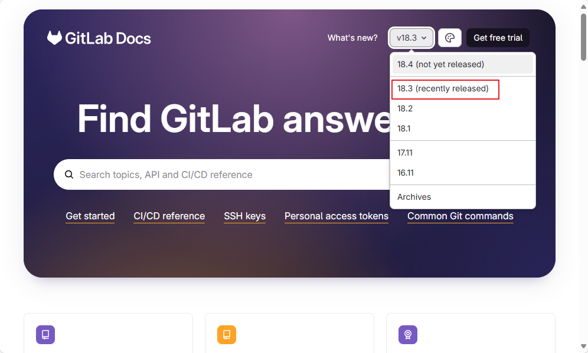

# Kubernetes Jenkins DevOps 实战


## Gitlab 部署 

### Gitlab 部署说明

Gitlab官方提供了Helm的方式在Kubernetes集群中来快速安装，但是在使用的过程中发现Helm提供的Chart包中有很多其他额外的配置，所以我们这里使用自定义的方式来安装，也就是自己来定义一些资源清单文件


Gitlab主要涉及到3个应用：Redis、Postgresql、Gitlab核心程序，实际上我们只要将这3个应用分别启动起来，然后加上对应的配置就可以很方便的安装Gitlab了。


Gitlab 官方手册地址：https://docs.gitlab.com/ee/




Gitlab github地址：https://github.com/sameersbn/docker-gitlab

往下翻，我们可以观察，使用docker是怎么部署，我们再用Kubernetes的方式进行部署即可：


```bash
docker run --name gitlab-postgresql -d \
    --env 'DB_NAME=gitlabhq_production' \
    --env 'DB_USER=gitlab' --env 'DB_PASS=password' \
    --env 'DB_EXTENSION=pg_trgm,btree_gist' \
    --volume /srv/docker/gitlab/postgresql:/var/lib/postgresql \
    kkimurak/sameersbn-postgresql:16
```

```bash
docker run --name gitlab-redis -d \
    --volume /srv/docker/gitlab/redis:/data \
    redis:7
```

```bash
docker run --name gitlab -d \
    --link gitlab-postgresql:postgresql --link gitlab-redis:redisio \
    --publish 10022:22 --publish 10080:80 \
    --env 'GITLAB_PORT=10080' --env 'GITLAB_SSH_PORT=10022' \
    --env 'GITLAB_SECRETS_DB_KEY_BASE=long-and-random-alpha-numeric-string' \
    --env 'GITLAB_SECRETS_SECRET_KEY_BASE=long-and-random-alpha-numeric-string' \
    --env 'GITLAB_SECRETS_OTP_KEY_BASE=long-and-random-alpha-numeric-string' \
    --env 'GITLAB_SECRETS_ENCRYPTED_SETTINGS_KEY_BASE=long-and-random-alpha-numeric-string' \
    --env 'GITLAB_SECRETS_ACTIVE_RECORD_ENCRYPTION_PRIMARY_KEY=["long-and-random-alpha-numeric-string"]' \
    --env 'GITLAB_SECRETS_ACTIVE_RECORD_ENCRYPTION_DETERMINISTIC_KEY=["long-and-random-alpha-numeric-string"]' \
    --env 'GITLAB_SECRETS_ACTIVE_RECORD_ENCRYPTION_KEY_DERIVATION_SALT=long-and-random-alpha-numeric-string' \
    --volume /srv/docker/gitlab/gitlab:/home/git/data \
    sameersbn/gitlab:18.3.2
```


### 配置默认存储

我们后面部署的应用可能需要将数据目录持久化出去，如果不做持久化，容器发生重启，数据就会丢失。


#### **创建NFS服务**

```bash
[root@master1 ~] # apt update && apt -y install nfs-server
[root@master1 ~] # systemctl status nfs-server.service 
● nfs-server.service - NFS server and services
     Loaded: loaded (/lib/systemd/system/nfs-server.service; enabled; vendor 
preset: enabled)
     Active: active (exited) since Thu 2021-09-29 09:28:41 CST; 5min ago
   Main PID: 64029 (code=exited, status=0/SUCCESS)
     Tasks: 0 (limit: 2236)
     Memory: 0B
     CGroup: /system.slice/nfs-server.service
9月 29 09:28:40 master1.wang.org systemd[1]: Starting NFS server and services...
9月 29 09:28:41 master1.wang.org systemd[1]: Finished NFS server and services.


[root@master1 ~]#mkdir -pv /data/sc-nfs 
[root@master1 ~]#chown 777 /data/sc-nfs
[root@master1 ~]#vim /etc/exports
#授权worker节点的网段可以挂载
#/data/sc-nfs *(rw,no_root_squash,all_squash,anonuid=0,anongid=0) 
/data/sc-nfs *(rw,no_root_squash)

[root@master1 ~]#exportfs -r
[root@master1 ~]#exportfs -v
/data/sc-nfs <world>
(sync,wdelay,hide,no_subtree_check,anonuid=0,anongid=0,sec=sys,rw,secure,no_root_squash,all_squash)

#并在所有worker节点安装NFS客户端 
[root@nodeX ~]#apt update && apt -y install nfs-common 或者 nfs-client
```


#### **创建ServiceAccount并授权**

```yaml
[root@master1 yaml] # cat rbac.yaml 
# 创建独立的名称空间
apiVersion: v1
kind: Namespace
metadata:
  name: nfs-provisioner-demo
---
apiVersion: v1
kind: ServiceAccount
metadata:
  name: nfs-client-provisioner
  # replace with namespace where provisioner is deployed 根据业务需要修改此处名称空间
  namespace: nfs-provisioner-demo
  
---
apiVersion: rbac.authorization.k8s.io/v1
kind: ClusterRole
metadata:
  name: nfs-client-provisioner-runner
rules:
  - apiGroups: [""]
    resources: ["nodes"]
    verbs: ["get", "list", "watch"]
  - apiGroups: [""]
    resources: ["persistentvolumes"]
    verbs: ["get", "list", "watch", "create", "delete"]
  - apiGroups: [""]
    resources: ["persistentvolumeclaims"]
    verbs: ["get", "list", "watch", "update"]
  - apiGroups: ["storage.k8s.io"]
    resources: ["storageclasses"]
    verbs: ["get", "list", "watch"]
  - apiGroups: [""]
    resources: ["events"]
    verbs: ["create", "update", "patch"]
  - apiGroups: [""]
    resources: ["services", "endpoints"]
    verbs: ["get", "list", "watch", "create", "update", "delete"]
    
---
apiVersion: rbac.authorization.k8s.io/v1
kind: ClusterRoleBinding
metadata:
  name: run-nfs-client-provisioner
subjects:
  - kind: ServiceAccount
    name: nfs-client-provisioner
    # replace with namespace where provisioner is deployed
    namespace: nfs-provisioner-demo
roleRef:
  kind: ClusterRole
  name: nfs-client-provisioner-runner
  apiGroup: rbac.authorization.k8s.io
  
---
apiVersion: rbac.authorization.k8s.io/v1
kind: Role
metadata:
  name: leader-locking-nfs-client-provisioner
  # replace with namespace where provisioner is deployed
  namespace: nfs-provisioner-demo
rules:
  - apiGroups: [""]
    resources: ["endpoints"]
    verbs: ["get", "list", "watch", "create", "update", "patch"]
    
---
kind: RoleBinding
apiVersion: rbac.authorization.k8s.io/v1
metadata:
  name: leader-locking-nfs-client-provisioner
  # replace with namespace where provisioner is deployed
  namespace: nfs-provisioner-demo
subjects:
  - kind: ServiceAccount
    name: nfs-client-provisioner
    # replace with namespace where provisioner is deployed
    namespace: nfs-provisioner-demo
roleRef:
  kind: Role
  name: leader-locking-nfs-client-provisioner
  apiGroup: rbac.authorization.k8s.io


# 应用
[root@master1 yaml] # kubectl apply -f rbac.yaml
serviceaccount/nfs-client-provisioner created
clusterrole.rbac.authorization.k8s.io/nfs-client-provisioner-runner created
clusterrolebinding.rbac.authorization.k8s.io/run-nfs-client-provisioner created
role.rbac.authorization.k8s.io/leader-locking-nfs-client-provisioner created
rolebinding.rbac.authorization.k8s.io/leader-locking-nfs-client-provisioner created

# 查看系统用户
[root@master1 yaml]#kubectl get sa
NAME                     SECRETS   AGE
default                  0         34d
nfs-client-provisioner   0         9s
```


#### **部署 NFS-Subdir-External-Provisioner 对应的 Deployment**

```yaml
[root@master1 nsf-provisioner] #vim nfs-client-provisioner.yaml
apiVersion: apps/v1
kind: Deployment
metadata:
  name: nfs-client-provisioner
  labels:
    app: nfs-client-provisioner
  namespace: nfs-provisioner-demo
spec:
  replicas: 1
  strategy:
    type: Recreate
  selector:
    matchLabels:
      app: nfs-client-provisioner
  template:
    metadata:
      labels:
        app: nfs-client-provisioner
    spec:
      serviceAccountName: nfs-client-provisioner
      containers:
      - name: nfs-client-provisioner     
        image: k8s.gcr.io/sig-storage/nfs-subdir-external-provisioner:v4.0.2 #此镜像国内可能无法访问
        imagePullPolicy: IfNotPresent
        volumeMounts:
        - name: nfs-client-root
          mountPath: /persistentvolumes
        env:
        - name: PROVISIONER_NAME
          value: k8s-sigs.io/nfs-subdir-external-provisioner # 名称确保与nfs-StorageClass.yaml文件中的provisioner名称保持一致
        - name: NFS_SERVER
          value: nfs.mystical.org
        - name: NFS_PATH
          value: /nfs-data/sc-nfs
      volumes:
      - name: nfs-client-root
        nfs:
          server: nfs.mystical.org
          path: /nfs-data/sc-nfs
          
# 应用
[root@master1 nsf-provisioner]# kubectl apply -f nfs-client-provisioner.yaml 
deployment.apps/nfs-client-provisioner created

# 查看
[root@master1 nsf-provisioner]#kubectl get pod -n nfs-provisioner-demo 
NAME                                      READY   STATUS    RESTARTS   AGE
nfs-client-provisioner-74d7c6bf46-kkpmd   1/1     Running   0          4m9s
```


#### **创建NFS资源的storageClass**

```yaml
[root@master1 nsf-provisioner] # vim nfs-storageClass.yaml
apiVersion: storage.k8s.io/v1
kind: StorageClass
metadata:
  name: sc-nfs
  annotations:
    storageclass.kubernetes.io/is-default-class: "false" # 是否设置为默认的storageClass
provisioner: k8s-sigs.io/nfs-subdir-external-provisioner # or choose another name, must match deployment's env PROVISIONER_NAME
parameters:
  archiveOnDelete: "true" # 设置为false时删除PVC不会保留数据，"true"则保留数据，基于安全原因建议设为"true"


# 应用
[root@master1 nsf-provisioner] # kubectl apply -f nfs-storageClass.yaml 
storageclass.storage.k8s.io/sc-nfs created

# 查看
[root@master1 nsf-provisioner]#kubectl get sc -n nfs-provisioner-demo 
NAME     PROVISIONER                                   RECLAIMPOLICY   VOLUMEBINDINGMODE   ALLOWVOLUMEEXPANSION   AGE
sc-nfs   k8s-sigs.io/nfs-subdir-external-provisioner   Delete          Immediate           false                  15s
```


### 部署Redis

部署redis deployment 和 redis svc 资源，操作如下：

```bash
# 创建资源存放位置
[root@master1 ~]# mkdir /root/cicd/gitlab -p
[root@master1 ~]# cd /root/cicd/gitlab/

# 创建名称空间，之后的服务都放在这个命名空间下
[root@master1 ~/cicd/gitlab]# kubectl create ns cicd
namespace/cicd created

# 创建资源清单文件
[root@master1 ~/cicd/gitlab]# cat redis-deploy-svc.yaml 
apiVersion: apps/v1
kind: Deployment
metadata:
  name: redis
  namespace: cicd
  labels:
    name: redis
spec:
  selector:
    matchLabels:
      name: redis
  template:
    metadata:
      labels:
        name: redis
    spec:
      containers:
      - name: redis
        image: harbor.magedu.mysticalrecluse.com/k8simage/redis:6.2.8
        imagePullPolicy: IfNotPresent
        ports:
        - name: redis
          containerPort: 6379
        livenessProbe:
          exec:
            command:
            - redis-cli
            - ping
          initialDelaySeconds: 30
          timeoutSeconds: 5
        readinessProbe:
          exec:
            command:
            - redis-cli
            - ping
          initialDelaySeconds: 5
          timeoutSeconds: 1
---
apiVersion: v1
kind: Service
metadata:
  name: redis
  namespace: cicd
  labels:
    name: redis
spec:
  ports:
    - name: redis
      port: 6379
      targetPort: redis
  selector:
    name: redis

# 更新资源清单文件
[root@master1 ~/cicd/gitlab]# kubectl apply -f redis-deploy-svc.yaml 
deployment.apps/redis created
service/redis created

# 查看
[root@master1 ~/cicd/gitlab]# kubectl get pod -n cicd
NAME                     READY   STATUS    RESTARTS   AGE
redis-7d8b975bf7-vntms   1/1     Running   0          19s
```


### 部署Postgresql

在k8s集群部署PostgresSQL，需要将数据库的数据文件持久化，因此需要创建对应的pv，本次安装通过storageclass创建pv。由于postgre 只需要集群内部链接，因此采用Headless service 来创建数据库对应的svc，数据库的端口是5432


**PostgreSQL数据库部署操作如下：**

创建postgresql pvc

```bash
# 创建postgresql pvc
[root@master1 ~/cicd/gitlab]# vim postgresql-pvc.yaml 
apiVersion: v1
kind: PersistentVolumeClaim
metadata:
  name: postgres-data
  namespace: cicd
spec:
  accessModes:
    - ReadWriteMany
  storageClassName: "nfs-storage"
  resources:
    requests:
      storage: 20Gi
      
# 启用pvc
[root@master1 ~/cicd/gitlab]# kubectl apply -f postgresql-pvc.yaml 
persistentvolumeclaim/postgres-data created
```


创建postgresql deployment 和 svc

```bash
# 创建deployment和svc
[root@master1 ~/cicd/gitlab]# vim postgresql-deployment-svc.yaml 
[root@master1 ~/cicd/gitlab]# cat postgresql-deployment-svc.yaml 
apiVersion: apps/v1
kind: Deployment
metadata:
  name: postgresql
  namespace: cicd
  labels:
    name: postgresql
spec:
  selector:
    matchLabels:
      name: postgresql
  template:
    metadata:
      labels:
        name: postgresql
    spec:
      containers:
      - name: postgresql
        image: harbor.magedu.mysticalrecluse.com/k8simage/sameersbn/postgresql:12-20200524
        imagePullPolicy: IfNotPresent
        env:
        - name: DB_USER
          value: gitlab
        - name: DB_PASS
          value: password
        - name: DB_NAME
          value: gitlab_production
        - name: DB_EXTENSION
          value: pg_trgm,btree_gist
        ports:
        - name: postgres
          containerPort: 5432
        volumeMounts:
        - name: data
          mountPath: /var/lib/postgresql
        livenessProbe:
          exec:
            command:
            - pg_isready
            - -h
            - localhost
            - -U
            - postgres
          initialDelaySeconds: 30
          timeoutSeconds: 5
        readinessProbe:
          exec:
            command:
            - pg_isready
            - -h
            - localhost
            - -U
            - postgres
          initialDelaySeconds: 5
          timeoutSeconds: 1
      volumes:
        - name: data
          persistentVolumeClaim:
            claimName: postgres-data
---
apiVersion: v1
kind: Service
metadata:
  name: postgresql
  namespace: cicd
  labels:
    name: postgresql
spec:
  ports:
    - name: postgres
      port: 5432
      targetPort: postgres
  selector:
    name: postgresql
```


部署Gitlab

注意：gitlab比较吃内存，node节点至少要有5G的空闲内存，才能正常运行gitlab

Gitlab部署操作如下：

创建 gitlab pvc

```bash
# 创建资源清单文件
[root@master1 ~/cicd/gitlab]# vim gitlab-pvc.yaml
apiVersion: v1
kind: PersistentVolumeClaim
metadata:
  name: gitlab-data
  namespace: cicd
spec:
  accessModes:
    - ReadWriteMany
  storageClassName: "sc-nfs"
  resources:
    requests:
      storage: 20Gi
      
# 更新资源清单
[root@master1 ~/cicd/gitlab]# kubectl apply -f gitlab-pvc.yaml 
```


创建gitlab deployment 和 svc

环境变量说明：

```bat
TZ: 时区配置
GITLAB_TIMEZONE: 时间配置
GITLAB_SECRETS_DB_KEY_BASE、GITLAB_SECRETS_SECRET_KEY_BASE、GITLAB_SECRETS_OTP_KEY_BASE: 使用官网推荐的值即可，这些是用于加密数据库的。
GITLAB_ROOT_PASSWORD: gitlab登录密码
GITLAB_ROOT_EMAIL: 管理员用户邮箱
GITLAB_HOST: gitlab默认主机名
GITLAB_PORT: gitlab启动时监听端口
GITLAB_SSH_PORT: ssh端口号
GITLAB_NOTIFY_ON_BROKEN_BUILDS: 启用或禁用生成通知电子邮件
GITLAB_NOTIFY_PUSHER: 将pusher添加到通知电子邮箱的收件人列表中
GITLAB_BACKUP_SCHEDULE: 备份策略，默认是disable禁用。daily(每日)、weekly(每周)、monthly(每月)
GITLAB_BACKUP_TIME: 以HH:MM格式设置自动备份的时间。默认为04:00
DB_TYPE: 数据库类型
DB_HOST: 连接数据库地址
DB_PORT: 连接数据库端口
DB_USER: 连接数据库的用户
DB_PASS: 连接数据库的密码
DB_NAME: 连接数据库的库名
REDIS_HOST: redis数据库连接地址
REDIS_PORT: redis数据库端口
```


部署操作如下：

```bash
# 创建资源清单如下：

```

