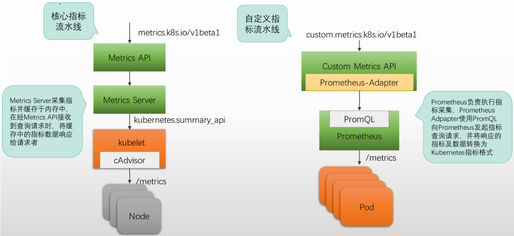

## Kubernetes 指标流水线

### 资源指标

Kubernetes有一些依赖于指标数据的组件，例如**HPA**和**VPA**等、

- Kubernetes 使用 Metrics API 暴露系统指标给这些组件
- 该 API 仅提供 CPU 和内存相关的指标数据
- 负责支撑Metrics API、生成并提供指标数据的组件，称为核心指标流水线（Core Metrics Pipeline）


- **cAdvisor**: 用于收集、聚合和公开 Kubelet 中包含的容器指标的守护程序。
- **kubelet**: 用于管理容器资源的节点代理。 可以使用 /metrics/resource 和 /stats kubelet API 端点访问资源指标。
- **Summary API**: kubelet 提供的 API，用于发现和检索可通过 /stats 端点获得的每个节点的汇总统计信息。
- **metrics-server**: 集群插件组件，用于收集和聚合从每个 kubelet 中提取的资源指标。 API 服务器提供 Metrics API 以供 HPA、VPA 和 kubectl top 命令使用。Metrics Server 是 Metrics API 的参考实现。
- **Metrics API**: Kubernetes API 支持访问用于工作负载自动缩放的 CPU 和内存。 要在你的集群中进行这项工作，你需要一个提供 Metrics API 的 API 扩展服务器。

```ABAP
cAdvisor 是 kubelet 内置的容器监控模块，负责将节点上每个容器的资源使用数据采集并提供给监控系统使用。
```


Kubernetes设计用于暴露其它指标的API，是**Custom  Metrics API** 和 **External Metrics API**

- 此二者通常也要由专用的辅助API Server提供，例如著名的 **Prometheus Adapter** 项目
- 负责支撑Custom Metrics API，生成并提供指标数据的组件，称为**自定义流水线**


### 核心指标流水线和自定义指标流水线





#### Metrics-Server

**Metrics Server介绍**

由Kubernetes SIG社区维护

从Kubelet收集CPU和内存的资源指标，默认每15秒收集一次，并经由Metrics API暴露

设计用于支撑HPA和VPA等组件的功能，不适用于作为监控系统组件


**部署要求**

kube-apiserver 必须启用聚合层

各节点必须启用Webhook认证和鉴权机制

kubelet证书需要由Kubernetes CA签名，或者要使用"**--kubelet-insecure-tls**" 选项禁用证书验证

Container Runtime需要支持container metrics RPC，或者内置**cAdvisor**

控制平面节点需要经由**10250/TCP** 端口访问 Metrics Server

Metrics Server需要访问所有的节点以采集指标，默认为 kubelet 监听的 10250 端口

```bash
[root@master1 ~]# curl -LO https://github.com/kubernetes-sigs/metrics-server/releases/latest/download/components.yaml

#默认文件需要修改才能工作,因为默认需要内部证书验证和镜像地址k8s.gcr.io所以修改
# vim components.yaml
spec:
      containers:
      - args:
        - --cert-dir=/tmp
        - --secure-port=10250
        - --kubelet-preferred-address-types=InternalIP,ExternalIP,Hostname
        - --kubelet-use-node-status-port
        - --metric-resolution=15s
        - --kubelet-insecure-tls
        #image: registry.cn-hangzhou.aliyuncs.com/google_containers/metricsserver:v0.7.1 # 可以添加国内源
        image: registry.k8s.io/metrics-server/metrics-server:v0.7.2
        imagePullPolicy: IfNotPresent
        livenessProbe:
          failureThreshold: 3
          httpGet:
            path: /livez
            port: https
            scheme: HTTPS
          periodSeconds: 10
        name: metrics-server
        ports:
        - containerPort: 10250
          name: https
          protocol: TCP
          
[root@master1 yaml]# kubectl apply -f components.yaml 
serviceaccount/metrics-server created
clusterrole.rbac.authorization.k8s.io/system:aggregated-metrics-reader created
clusterrole.rbac.authorization.k8s.io/system:metrics-server created
rolebinding.rbac.authorization.k8s.io/metrics-server-auth-reader created
clusterrolebinding.rbac.authorization.k8s.io/metrics-server:system:auth-delegator created
clusterrolebinding.rbac.authorization.k8s.io/system:metrics-server created
service/metrics-server created
deployment.apps/metrics-server created
apiservice.apiregistration.k8s.io/v1beta1.metrics.k8s.io created


root@master1 yaml]#kubectl get pod -n kube-system metrics-server-b79d5c976-hqrct 
NAME                             READY   STATUS    RESTARTS   AGE
metrics-server-b79d5c976-hqrct   1/1     Running   0          60s
[root@master1 yaml]#kubectl top node
NAME      CPU(cores)   CPU%   MEMORY(bytes)   MEMORY%   
master1   62m          3%     910Mi           49%       
node1     30m          1%     669Mi           36%       
node2     20m          1%     927Mi           50%       
node3     27m          1%     715Mi           39% 
```


#### 核心指标流水线Core-Metrics-Pipeline定义

**核心指标流水线（Core Metrics Pipeline）** 是 Kubernetes 中一条由 kubelet 提供指标，Metrics Server 聚合处理的基础监控数据链路，专门用于支持 HPA（Horizontal Pod Autoscaler）、VPA（部分场景）、`kubectl top` 命令等核心功能。


**构成组件**

| 组件                  | 角色       | 说明                                                         |
| --------------------- | ---------- | ------------------------------------------------------------ |
| **cAdvisor**          | 指标采集器 | kubelet 内嵌，采集容器的 CPU、内存等实时指标                 |
| **kubelet**           | 指标提供者 | 提供 `/metrics/resource` 和 `/stats/summary` 接口，被 Metrics Server 拉取 |
| **Metrics Server**    | 指标聚合器 | 负责从每个 Node 的 kubelet 拉取指标，存入内存中，暴露 `/apis/metrics.k8s.io/` 接口 |
| **HPA / kubectl top** | 消费者     | HPA 查询 Metrics Server 的 API，根据策略进行自动扩缩容；kubectl top 命令展示节点/Pod 实时资源使用 |


在 **核心指标流水线** 中，**Metrics Server** 就是一个中间桥梁，它的核心作用就是：

✅ **从各个 Node 的 kubelet（底层由 cAdvisor 提供指标）拉取指标**，
✅ **转化为 Kubernetes 所理解的 Metrics API 格式**，
✅ 并通过 `/apis/metrics.k8s.io/v1beta1` 暴露出来，供 **HPA、kubectl top、VPA（部分）** 使用。


**整体流程**

- `cAdvisor` 是 kubelet 内置组件，采集容器级别的 CPU、内存、网络等原始指标；
- `kubelet` 会提供 `/stats/summary` 接口，把这些原始指标结构化；
- `Metrics Server` 以 **定时轮询（默认 60s）** 的方式，从所有节点上的 kubelet 拉这些数据；
- 然后聚合并缓存（保留短时间）这些数据；
- 最后通过 Kubernetes 的 API Server 统一暴露为 `metrics.k8s.io` API 组。

```ABAP
核心指标流水线 = kubelet + cAdvisor + Metrics Server + HPA，它是 Kubernetes 内建的最轻量级的实时资源监控和自动扩缩容通道。
```


核心指标流水线仅暴露CPU和内存指标，而更多的其他指标并不支持，如果需要使用更多的指标，此需要自定义指标流水线


#### 自定义指标流水线Custom-Metrics-Pipeline

**自定义指标流水线定义**

**自定义指标流水线**是指 Kubernetes 集群中，用于收集、处理、暴露和消费用户自己定义的业务指标或应用性能指标的整套体系。它通常服务于：

- ⏫ **HPA（HorizontalPodAutoscaler）基于自定义指标的自动扩缩容**
- 📈 **VPA 或其他策略型控制器的指标输入**
- ✅ 更复杂的业务场景（比如 QPS、数据库连接数、Redis hit rate）


##### 自定义指标流水线的组成结构

可以分为 **三个层次**：

**1️⃣ 应用层（业务侧）：产生指标**

- 应用自身暴露 Prometheus 格式的 `/metrics` 接口，例如：

  ```properties
  http_requests_total{job="myapp", status="200"} 1234
  redis_connection_pool_size{instance="redis"} 42
  ```

**2️⃣ 指标收集层：Prometheus + Adapter**

- **Prometheus**：负责抓取业务 Pod 暴露的指标
- **Custom Metrics Adapter**（如 Prometheus Adapter）：
  - 负责将 Prometheus 中的指标转换为 Kubernetes 所识别的 API 格式
  - 并将其注册在 API Server 中的 `/apis/custom.metrics.k8s.io/v1beta1/`

**3️⃣ 消费层：HPA 控制器**

- HPA 控制器通过 Kubernetes API 请求 `/apis/custom.metrics.k8s.io/...`
- 拿到你设置的指标值
- 再结合你的 HPA 配置（目标值、容器副本数）进行决策

```ABAP
App (指标源) --> Prometheus --> Prometheus Adapter --> custom.metrics.k8s.io --> HPA 控制器
```


#### kube-state-metrics

Prometheus 本身只支持抓取 **Kubernetes 的运行时资源（Runtime objects）**，通过 `kubernetes_sd_config` 抓取的 `role` 主要包括：

| Role 类型   | 描述                                        |
| ----------- | ------------------------------------------- |
| `pod`       | 采集 Pod 的 metrics（需 Pod 提供 /metrics） |
| `endpoints` | 采集某个 Service 的 endpoints               |
| `service`   | 采集 Service IP（通常用于静态探测）         |
| `ingress`   | 获取 Ingress 信息                           |
| `node`      | 节点级指标（如 node_exporter）              |
| `apiserver` | 采集 K8s API Server 的状态                  |

这些都是 **运行中的对象**，并不能提供资源定义层面的状态，例如：

- Deployment 期望副本 vs 实际副本数量
- PVC 是否绑定了 PV？
- StatefulSet 的滚动升级状态
- CronJob 上次运行是否成功？

这些信息 **Prometheus 默认是拿不到的**，因为它不是通过 Metrics API 暴露的。


##### kube-state-metrics 的作用

✅ 专门为了 Prometheus 提供 **Kubernetes 状态对象的指标**。

它以 Kubernetes Controller 的形式运行，监听如下 **控制层（Control Plane）对象**：

| 类型        | 示例指标                               |
| ----------- | -------------------------------------- |
| Deployment  | `.spec.replicas` vs `.status.replicas` |
| StatefulSet | `.status.readyReplicas`                |
| DaemonSet   | `.status.numberUnavailable`            |
| PVC / PV    | pvc phase（Bound、Pending）            |
| CronJob     | 上次是否成功 / 下次调度时间            |
| HPA         | 当前副本数 / 目标指标值                |
| Namespace   | 状态（Active/Terminating）             |

举个例子：

```properties
kube_deployment_status_replicas_ready{deployment="myapp"} = 3
kube_persistentvolumeclaim_status_phase{namespace="default",persistentvolumeclaim="mypvc",phase="Bound"} 1
```

这些指标是 **Prometheus 本身无法直接获取的**，只有通过 `kube-state-metrics` 暴露给 Prometheus，才能实现这类业务逻辑或报警

```ABAP
类似于用于补充抓取Kubernetes默认可获取资源类型指标之外的资源类型指标的exporter
```


### Kubernetes-API-Aggregation-Layer工作机制

API Aggregation Layer（简称 **AA Layer**）是 Kubernetes **扩展 API 的机制之一**，允许你将外部的、非核心的 API Server 集成到主 Kubernetes API Server 中，表现得就像是原生的一部分。


#### 工作流程说明

当客户端发起请求时：

```ABAP
Client → kube-apiserver → Aggregation Layer → 外部扩展 API Server（如 Metrics Server） → 返回数据
```


#### 场景举例-以Metrics-Server为例

当你运行如下命令：

```bash
kubectl top pod
```

实际过程：

1. `kubectl` 向 `kube-apiserver` 发起请求 `/apis/metrics.k8s.io/v1beta1/...`
2. kube-apiserver 的 **Aggregation Layer** 判断该 API 由 `metrics-server` 提供；
3. 请求被**代理转发**给注册在 Aggregation Layer 的扩展 API Server（即 `metrics-server`）；
4. `metrics-server` 返回指标数据；
5. kube-apiserver 将结果返回给 `kubectl`。


**支持 API Aggregation 的组件举例**

| 组件                         | 说明                                                         |
| ---------------------------- | ------------------------------------------------------------ |
| `metrics-server`             | 采集资源指标的扩展 API，路径是 `/apis/metrics.k8s.io`        |
| `custom-metrics-apiserver`   | 提供 HPA 使用的自定义指标                                    |
| `external-metrics-apiserver` | 提供外部服务指标（如队列长度）                               |
| 你自定义的 API Server        | 如基于 [KubeBuilder](https://github.com/kubernetes-sigs/kubebuilder) 构建 |


#### Prometheus-Adapter

在 Kubernetes 中，**Prometheus Adapter** 就是一个**扩展 API Server**，它通过 **[API Aggregation Layer（聚合层）]** 与主 API Server 进行集成，从而支持 **自定义指标（Custom Metrics）** 和 **外部指标（External Metrics）** 的查询。


**使用 Prometheus Adapter 的关键流程如下：**

✅ 1. **Adapter 本身是一个扩展 API Server**

- 它实现了 Kubernetes 自定义指标 API (`custom.metrics.k8s.io`) 和/或外部指标 API (`external.metrics.k8s.io`)。
- 它会暴露出这些 API 的路径，如 `/apis/custom.metrics.k8s.io/v1beta1/...`。

✅ 2. **通过注册 `APIService` 对象使其可用**

- 要使 Kubernetes 聚合层识别并转发请求给这个扩展 API Server，需要注册一个 `APIService` 资源。

- 这个资源指定：

  - API 的组名（如 `custom.metrics.k8s.io`）
  - 对应的服务地址（即 Prometheus Adapter 的 `Service`）

  示例：

  ```yaml
  apiVersion: apiregistration.k8s.io/v1
  kind: APIService
  metadata:
    name: v1beta1.custom.metrics.k8s.io
  spec:
    group: custom.metrics.k8s.io
    version: v1beta1
    service:
      name: prometheus-adapter
      namespace: monitoring
    groupPriorityMinimum: 100
    versionPriority: 100
  ```

✅ 3. **使用场景**

- **Horizontal Pod Autoscaler（HPA）v2** 就可以通过这个 API 使用 Prometheus 提供的自定义指标。
- 例如，你可以根据某个应用暴露的自定义 `requests_per_second` 指标来自动扩缩容。


#### APIService资源类型

要使用扩展apiServer必须，必须注册对应的APIService对象

Kubernetes 的聚合层机制允许你通过扩展 API Server 提供额外的 API 组，但前提是：

> ☑️ 你要告诉主 API Server：
> “这个 API 组（例如 `custom.metrics.k8s.io`）不是你本身提供的，请转发到我这里（扩展 API Server）。”

这个“告诉”的动作，就是通过创建一个 `APIService` 资源来实现的。


**工作流程如下：**

1. **Prometheus Adapter**（或其他扩展 API Server）启动并在集群中运行，通常作为一个 `Deployment` 和 `Service`。

2. **你创建 `APIService` 对象**：

   ```yaml
   apiVersion: apiregistration.k8s.io/v1
   kind: APIService
   metadata:
     name: v1beta1.custom.metrics.k8s.io
   spec:
     group: custom.metrics.k8s.io
     version: v1beta1
     service:
       name: prometheus-adapter     # 指向 adapter 的 Service 名
       namespace: monitoring
     groupPriorityMinimum: 100
     versionPriority: 100
   ```

3. Kubernetes 聚合层会自动将对 `/apis/custom.metrics.k8s.io/v1beta1/...` 的请求，转发给这个 Adapter。

4. HPA 等组件就可以通过这个路径拿到 Prometheus 中的指标了。


### Prometheus部署至Kubernetes

#### Prometheus为什么能服务发现Kubernetes的apiServer

Prometheus 通过 `kubernetes_sd_configs` 实现对 Kubernetes 集群的自动服务发现，它是靠 **Kubernetes 官方 Go Client（client-go）** 连接 API Server 的。

```bash
# 解释GO Client
✅ Prometheus 内置了对 Kubernetes 的服务发现功能，而它内部用的正是 Kubernetes 官方的 Go 客户端库 client-go！
✅ client-go 是 Kubernetes 官方提供的 用于操作 Kubernetes API 的 Go 语言客户端库。
✅ 凡是要与 Kubernetes API Server 通信的 Go 应用（比如 Prometheus、Ingress Controller、Operator 等），基本都会用它。

# Prometheus 是如何使用 client-go 的？
📦Prometheus 的模块结构里有一个叫：discovery/kubernetes
这个模块就是专门用于与 Kubernetes 集成的，里面封装了对 Kubernetes API 的访问逻辑。
它的实现直接依赖 client-go，可以自动实现：
✅ pod/service/endpoint/ingress/node 的服务发现（通过 kubernetes_sd_configs）
✅ 自动读取集群内部的 service account（含 token、CA、namespace）
✅ 自动构造客户端与 API Server 通信
```


**而 `client-go` 会自动从以下几个地方读取 API Server 的地址和凭据：**

| 优先级 | 来源说明                                                     |
| ------ | ------------------------------------------------------------ |
| 1️⃣      | 环境变量 `KUBERNETES_SERVICE_HOST` 和 `KUBERNETES_SERVICE_PORT`（**Pod 运行在集群中自动注入**） |
| 2️⃣      | 默认的 service DNS 名 `https://kubernetes.default.svc`       |
| 3️⃣      | `~/.kube/config`（如果你在外部部署 Prometheus）              |


**场景说明**

**✅ 场景1：Prometheus 运行在 K8s 集群内部（通常是这种）**

1. Kubernetes 会将以下环境变量注入到 Pod 中：

   ```bash
   KUBERNETES_SERVICE_HOST=10.96.0.1
   KUBERNETES_SERVICE_PORT=443
   ```

2. 并挂载 `/var/run/secrets/kubernetes.io/serviceaccount` 目录中的：

   - `ca.crt`
   - `token`
   - `namespace`

3. Prometheus 通过这些信息自动连接到 API Server，然后开始基于 `kubernetes_sd_configs` 的服务发现。

**✅ 场景2：Prometheus 在集群外部运行**

- 你需要手动配置 `kubeconfig` 文件：

  ```yaml
  kubernetes_sd_configs:
    - role: pod
      api_server: https://<apiserver-ip>:6443
      kubeconfig_file: /path/to/kubeconfig
  ```


**🧪 验证方法**

你可以 exec 进 Prometheus Pod 中，看下环境变量：

```bash
kubectl exec -it <prometheus-pod> -n <namespace> -- env | grep KUBERNETES
```

你也可以看下挂载的 token：

```bash
kubectl exec -it <prometheus-pod> -n <namespace> -- cat /var/run/secrets/kubernetes.io/serviceaccount/token
```

```ABAP
Prometheus 是通过 kubernetes_sd_configs + Kubernetes 的 service account token 自动连接到当前集群的 API Server 的，无需手动指定地址。
```


#### Prometheus在Kubernetes中抓取目标的完整流程

**1️⃣ 使用 `client-go` 自动发现 Kubernetes API Server**

Prometheus 启动后，会自动使用内置的 `client-go`：

- 通过集群中的 **ServiceAccount Token** 和 **Kube API 的 CA** 来访问 API Server。
- 这些信息默认在容器内 `/var/run/secrets/kubernetes.io/serviceaccount/` 下挂载。

**2️⃣ `kubernetes_sd_configs` 实现资源发现（Service Discovery）**

在 `prometheus.yml` 中配置：

```yaml
kubernetes_sd_configs:
  - role: pod        # 这里可以换成 endpoints、service、node、ingress 等
```

每个 `role` 对应一种资源发现对象，例如：

| role        | 含义                               |
| ----------- | ---------------------------------- |
| `pod`       | 获取所有 Pod 列表                  |
| `service`   | 获取所有 Service                   |
| `endpoints` | 获取所有 Endpoint（Pod IP + 端口） |
| `node`      | 获取所有 Node                      |
| `ingress`   | 获取所有 Ingress                   |

3️⃣ `relabel_configs` + 注解精准控制抓取目标

比如你用 `endpoints` 作为 role，会抓到所有带有 endpoint 的服务，然后你可以通过注解在特定 Pod 或 Service 上控制 Prometheus 是否抓取：

```yaml
# 仅抓取带有 prometheus.io/scrape=true 的目标
relabel_configs:
  - source_labels: [__meta_kubernetes_pod_annotation_prometheus_io_scrape]
    action: keep
    regex: true

# 自定义抓取路径
  - source_labels: [__meta_kubernetes_pod_annotation_prometheus_io_path]
    action: replace
    target_label: __metrics_path__
    regex: (.+)

# 自定义抓取端口
  - source_labels: [__meta_kubernetes_pod_annotation_prometheus_io_port]
    action: replace
    target_label: __address__
    regex: (.+)
    replacement: $1
```

**常用注解示例（加在 Pod 或 Service 上）：**

```yaml
annotations:
  prometheus.io/scrape: "true"       # 是否抓取该目标的指标。设为 true 时才抓取。
  prometheus.io/port: "8080"         # 指定抓取指标的端口号。默认为容器暴露的端口。   
  prometheus.io/path: "/metrics"     # 指定抓取指标的 HTTP 路径，默认为 /metrics。
```


#### Prometheus 部署实现

##### manifests方式部署

```bash
# 创建名称空间
[root@master1 k8s-prom]#kubectl create namespace prom
namespace/prom created

# git拉取Prometheus的配置文件
[root@master1 ~]# git clone https://github.com/iKubernetes/k8s-prom.git

# 启用部署Prometheus
[root@master1 ~]#cd k8s-prom/prometheus
[root@master1 prometheus]#ls
ingress              prometheus-deploy.yaml  prometheus-rules.yaml
prometheus-cfg.yaml  prometheus-rbac.yaml    prometheus-svc.yaml
[root@master1 prometheus]#kubectl apply -f . -n prom 
configmap/prometheus-config created
deployment.apps/prometheus-server created
clusterrole.rbac.authorization.k8s.io/prometheus created
serviceaccount/prometheus created
clusterrolebinding.rbac.authorization.k8s.io/prometheus created
configmap/prometheus-rules created
service/prometheus created

# 使用ingress暴露Prometheus
[root@master1 prometheus]#cat ingress/ingress-prometheus.yaml 
apiVersion: networking.k8s.io/v1
kind: Ingress
metadata:
  name: prometheus
  namespace: prom
  labels:
    app: prometheus
spec:
  ingressClassName: 'nginx'
  rules:
  - host: prom.mystical.org
    http:
      paths:
      - path: /
        pathType: Prefix
        backend:
          service:
            name: prometheus
            port:
              number: 9090
  - host: prometheus.mystical.org
    http:
      paths:
      - path: /
        pathType: Prefix
        backend:
          service:
            name: prometheus
            port: 
              number: 9090

# 启用kube-state-metrics,将deploy，Statefulset等默认不暴露的资源也纳入监控
[root@master1 k8s-prom]#cd kube-state-metrics/
[root@master1 kube-state-metrics]#ls
kube-state-metrics-deploy.yaml  kube-state-metrics-rbac.yaml  kube-state-metrics-svc.yaml

[root@master1 kube-state-metrics]#kubectl apply -f . -n prom 
deployment.apps/kube-state-metrics created
serviceaccount/kube-state-metrics created
clusterrole.rbac.authorization.k8s.io/kube-state-metrics created
clusterrolebinding.rbac.authorization.k8s.io/kube-state-metrics created
service/kube-state-metrics created
```


##### Helm方式部署（生产使用）

```bash
# 从github拉取仓库
[root@master1 ~]# git clone https://github.com/iKubernetes/k8s-prom.git

[root@master1 ~]#cd k8s-prom/helm
[root@master1 helm]#ls 
blackbox-exporter-values.yaml  prom-adapter-values.yaml  prom-values.yaml  README.md

# 添加Prometheus Community的Chart仓库。
[root@master1 k8s-prom]#helm repo add prometheus-community https://prometheus-community.github.io/helm-charts
"prometheus-community" has been added to your repositories

# 更新仓库
[root@master1 k8s-prom]#helm repo update
Hang tight while we grab the latest from your chart repositories...
...Successfully got an update from the "harbor" chart repository
...Successfully got an update from the "prometheus-community" chart repository
Update Complete. ⎈Happy Helming!⎈

# 运行如下命令，即可加载本地的values文件，部署Prometheus生态组件。
[root@master1 helm]#helm install prometheus prometheus-community/prometheus --namespace monitoring --values prom-values.yaml --create-namespace
NAME: prometheus
LAST DEPLOYED: Mon Mar 31 11:01:31 2025
NAMESPACE: monitoring
STATUS: deployed
REVISION: 1
TEST SUITE: None
NOTES:
The Prometheus server can be accessed via port 9090 on the following DNS name from within your cluster:
prometheus-server.monitoring.svc.cluster.local

From outside the cluster, the server URL(s) are:
http://prometheus.magedu.com
......

# 查看ingress
[root@master1 helm]#kubectl get ingress -n monitoring 
NAME                CLASS   HOSTS                   ADDRESS     PORTS   AGE
prometheus-server   nginx   prometheus.magedu.com   10.0.0.11   80      2m45s

# 查看pod
[root@master1 helm]#kubectl get pod -n monitoring 
NAME                                                 READY   STATUS    RESTARTS   AGE
prometheus-alertmanager-0                            1/1     Running   0          3m19s
prometheus-kube-state-metrics-55f8b5d87b-b24hh       1/1     Running   0          3m19s
prometheus-prometheus-node-exporter-b9bck            1/1     Running   0          3m19s
prometheus-prometheus-node-exporter-dzvv8            1/1     Running   0          3m19s
prometheus-prometheus-node-exporter-klghj            1/1     Running   0          3m19s
prometheus-prometheus-node-exporter-xl4qb            1/1     Running   0          3m19s
prometheus-prometheus-pushgateway-79964b5788-zq6ds   1/1     Running   0          3m19s
prometheus-server-65996d7b65-tqqhf                   2/2     Running   0          3m19s

# 浏览器访问
http://prometheus.magedu.com/query
```


```bash
# 部署测试pod
[root@master1 example-metrics]#cat metrics-example-app.yaml 
apiVersion: apps/v1
kind: Deployment
metadata:
    name: metrics-app
spec:
  replicas: 2
  selector:
    matchLabels:
      app: metrics-app
      controller: metrics-app
  template:
    metadata:
      labels:
        app: metrics-app
        controller: metrics-app
      annotations:
        prometheus.io/scrape: "true"
        prometheus.io/port: "80"
        prometheus.io/path: "/metrics"
    spec:
      containers:
      - image: ikubernetes/metrics-app
        name: metrics-app
        ports:
        - name: web
          containerPort: 80
        resources:
          requests:
            memory: "256Mi"
            cpu: "500m"
          limits:
            memory: "256Mi"
            cpu: "500m"
---
apiVersion: v1
kind: Service
metadata:
  name: metrics-app
spec:
  type: NodePort
  ports:
  - name: web
    port: 80
    targetPort: 80
  selector:
    app: metrics-app
    controller: metrics-app
    
# 启用
[root@master1 example-metrics]# kubectl apply -f metrics-example-app.yaml

# 查看
[root@master1 example-metrics]#kubectl get pod
NAME                           READY   STATUS    RESTARTS        AGE
metrics-app-56c77b4999-d4nkl   1/1     Running   0               61m
metrics-app-56c77b4999-rw9nv   1/1     Running   0               61m


# 此时查看浏览器上Prometheus上的服务发现，会看到报错
Error scraping target: non-compliant scrape target sending blank Content-Type and no fallback_scrape_protocol specified for target

# 这个报错的原因是：这表示某些 target 的 /metrics 接口没有返回 Content-Type 头（或返回为空），Prometheus 无法判断如何解析响应体（默认是 text/plain; version=0.0.4）。

# 解决方法：
[root@master1 helm]#kubectl edit cm -n monitoring prometheus-server 
......
- honor_labels: true
      job_name: kubernetes-pods
      fallback_scrape_protocol: PrometheusText0.0.4  # 添加这行
      kubernetes_sd_configs:
      - role: pod
      scheme: http
......
```


### Prometheus-Adapter

#### manifest方式部署Prometheus-Adapter

```http
https://github.com/iKubernetes/k8s-prom/tree/master/prometheus-adpater
```

```bash
# 进入Prometheus-adpater目录
[root@master1 k8s-prom]#cd prometheus-adpater/

# 创建名称空间
[root@master1 prometheus-adpater]#kubectl create namespace custom-metrics

# 安装 golang-cfssl
[root@master1 prometheus-adpater]#apt install -y golang-cfssl

# 运行脚本
[root@master1 prometheus-adpater]#bash gencerts.sh

# 执行脚本后，在Manifest目录下，会创建一个文件cm-adapter-serving-certs.yaml
[root@master1 prometheus-adpater]#ls manifests/cm-adapter-serving-certs.yaml 
manifests/cm-adapter-serving-certs.yaml

# 启用清单文件
[root@master1 prometheus-adpater]#kubectl apply -f manifests/
secret/cm-adapter-serving-certs created
clusterrolebinding.rbac.authorization.k8s.io/custom-metrics:system:auth-delegator created
rolebinding.rbac.authorization.k8s.io/custom-metrics-auth-reader created
deployment.apps/custom-metrics-apiserver created
clusterrolebinding.rbac.authorization.k8s.io/custom-metrics-resource-reader created
serviceaccount/custom-metrics-apiserver created
service/custom-metrics-apiserver created
apiservice.apiregistration.k8s.io/v1beta1.custom.metrics.k8s.io created
apiservice.apiregistration.k8s.io/v1beta2.custom.metrics.k8s.io created
apiservice.apiregistration.k8s.io/v1beta1.external.metrics.k8s.io created
clusterrole.rbac.authorization.k8s.io/custom-metrics-server-resources created
configmap/adapter-config created
clusterrole.rbac.authorization.k8s.io/custom-metrics-resource-reader created
clusterrolebinding.rbac.authorization.k8s.io/hpa-controller-custom-metrics created

# 查看扩展api资源
[root@master1 prometheus-adpater]#kubectl api-versions |grep external.metrics
external.metrics.k8s.io/v1beta1
[root@master1 prometheus-adpater]#kubectl api-versions |grep custom
custom.metrics.k8s.io/v1beta1
custom.metrics.k8s.io/v1beta2

# 运行下面命令，部署示例应用。该示例应用提供了一个Counter类型的指标http_requests_total。
[root@master1 prometheus-adpater]#kubectl apply -f example-metrics/metrics-example-app.yaml
deployment.apps/metrics-app created
service/metrics-app created

# 查看
[root@master1 prometheus-adpater]#kubectl get pod
NAME                           READY   STATUS    RESTARTS      AGE
metrics-app-56c77b4999-6gmwk   1/1     Running   0             60s
metrics-app-56c77b4999-p4kmt   1/1     Running   0             60s

# 查看示例pod暴露的指标
[root@master1 prometheus-adpater]#curl 192.168.253.38/metrics
# HELP http_requests_total The amount of requests in total
# TYPE http_requests_total counter
http_requests_total 8
# HELP http_requests_per_second The amount of requests per second the latest ten seconds
# TYPE http_requests_per_second gauge
http_requests_per_second 0.2
```

```ABAP
上述Manifest方式创建的Prometheus Adapter和Manifest方式创建Prometheus版本不是很兼容，导致手动将PromQL转到为K8S API出现问题，建议使用helm部署Prometheus和Prometheus Adapter
```


#### Helm方式部署Prometheus-Adapter

```bash
# helm 部署Prometheus-adapter
[root@master1 helm]#helm install prometheus-adapter prometheus-community/prometheus-adapter --values prom-adapter-values.yaml --namespace monitoring
NAME: prometheus-adapter
LAST DEPLOYED: Mon Mar 31 11:38:59 2025
NAMESPACE: monitoring
STATUS: deployed
REVISION: 1
TEST SUITE: None
NOTES:
prometheus-adapter has been deployed.
In a few minutes you should be able to list metrics using the following command(s):

  kubectl get --raw /apis/metrics.k8s.io/v1beta1
  kubectl get --raw /apis/custom.metrics.k8s.io/v1beta1

  kubectl get --raw /apis/external.metrics.k8s.io/v1beta1
  
# 查看Prometheus -> 转换为Kubernetes-API，转换成功
[root@master1 example-metrics]#kubectl get --raw /apis/custom.metrics.k8s.io/v1beta1/namespaces/default/pods/*/http_requests_per_second|jq
{
  "kind": "MetricValueList",
  "apiVersion": "custom.metrics.k8s.io/v1beta1",
  "metadata": {},
  "items": [
    {
      "describedObject": {
        "kind": "Pod",
        "namespace": "default",
        "name": "metrics-app-56c77b4999-d4nkl",
        "apiVersion": "/v1"
      },
      "metricName": "http_requests_per_second",
      "timestamp": "2025-03-31T04:20:03Z",
      "value": "100m",
      "selector": null
    },
    {
      "describedObject": {
        "kind": "Pod",
        "namespace": "default",
        "name": "metrics-app-56c77b4999-rw9nv",
        "apiVersion": "/v1"
      },
      "metricName": "http_requests_per_second",
      "timestamp": "2025-03-31T04:20:03Z",
      "value": "100m",
      "selector": null
    }
  ]
}

# 查看浏览器
```


#### Prometheus-Adapter与自定义指标的使用逻辑

✅ **Prometheus Adapter 的基本作用：**

Prometheus Adapter 是一个 **扩展 API Server**，它的作用是：

将 Prometheus 中的 **PromQL 查询结果** 暴露为 Kubernetes 可识别的 **Custom Metrics API 或 External Metrics API**，供 HPA / VPA 使用。


**✅ 默认支持的指标**

Prometheus Adapter 默认可以暴露一些「标准格式」的 Prometheus 指标，例如：

- Pod、Deployment 的 CPU、内存（这些其实就是 `metrics.k8s.io` 提供的核心指标）
- 已知标签结构（比如有 `namespace`, `pod`, `container` 等标签）

这些通常不需要复杂配置就能转发出来。


✅ **定义/计算型指标 ➜ 需要配置 rules**

对于 **非标准格式** 或 **需要计算得出** 的指标，比如：

- `http_requests_total`（需要聚合成 QPS）
- `queue_length`
- `latency_bucket`（直方图类型）
- 非标准 label，比如 `app`, `instance`, `custom_tag`

就需要在 Prometheus Adapter 的配置中定义 `rules`，手动将 PromQL 查询转换成 API 指标。

**示例配置（适用于 `custom-metrics`）**

```yaml
rules:
  custom:
    - seriesQuery: 'http_requests_total{job="my-app"}'
      resources:
        overrides:
          namespace: {resource: "namespace"}
          pod: {resource: "pod"}
      name:
        matches: "http_requests_total"
        as: "http_requests_per_second"
      metricsQuery: 'sum(rate(http_requests_total{job="my-app"}[2m])) by (pod, namespace)'
```


#### Prometheus-Adapter的rules配置详解

配置路径通常在 Prometheus Adapter 的 Helm chart 中：

```yaml
prometheus-adapter
└── values.yaml
    └── rules:
        └── custom:  # 或 external:
```


**一个完整的 `rules.custom` 配置示例：**

```yaml
rules:
  custom:
    - seriesQuery: 'http_requests_total{job="my-app"}'
      resources:
        overrides:
          namespace: {resource: "namespace"}
          pod: {resource: "pod"}
      name:
        matches: "http_requests_total"
        as: "http_requests_per_second"
      metricsQuery: 'sum(rate(http_requests_total{job="my-app"}[2m])) by (pod, namespace)'
```


**配置字段解释**

1️⃣ **`seriesQuery` — 匹配原始指标名**

- 匹配 Prometheus 中的原始指标（例如 `http_requests_total`）

- 也可以加入标签筛选，比如 `job="my-app"`，减少范围。

  ```yaml
  seriesQuery: 'http_requests_total{job="my-app"}'
  ```

**2️⃣ `resources.overrides` — 标签转为资源**

将 Prometheus 指标中的标签映射为 Kubernetes 的资源对象：
```yaml
resources:
  overrides:
    pod:        # 指定标签为 pod
      resource: "pod"
    namespace:  # 指定标签为 namespace
      resource: "namespace"
```

👉 表示这条指标对应的是哪个 namespace 和哪个 pod。

**补充详解**

Prometheus 是靠**标签（label）系统**组织指标的，比如：

```properties
http_requests_total{pod="myapp-67kkp", namespace="default", job="my-app"}
```

而 Kubernetes 是靠资源对象（Pod、Namespace、Deployment）来组织管理的。

所以 Prometheus Adapter 需要知道：
 ➡️ **这个指标的哪个 label 表示 Kubernetes 中哪个资源。**


**举个实际例子**

假设你 Prometheus 中有一条指标：

```cpp
http_requests_total{pod="myapp-67kkp", namespace="default"}
```

你想通过 HPA 对这个 Pod 做伸缩，那么 Prometheus Adapter 就要知道：

- `pod="myapp-67kkp"` 这表示 **Kubernetes 的 Pod 名字**
- `namespace="default"` 表示 **这个 Pod 属于哪个 Namespace**

如果你不告诉它，它就不知道这些标签该怎么“翻译”为 K8s 对象。

所以你在配置里加：

```yaml
resources:
  overrides:
    pod:
      resource: "pod"
    namespace:
      resource: "namespace"
```

就表示：

- Prometheus 中叫 `pod` 的 label，对应 Kubernetes 中的 `Pod` 资源。
- Prometheus 中叫 `namespace` 的 label，对应 Kubernetes 中的 `Namespace`。


**最终 Adapter 就知道：**

- “这条指标是来自哪个 pod 的”
- “它属于哪个 namespace”
- “我可以暴露成一个 pod 级别的指标，给 Kubernetes 使用”


 **HPA 才能这样配置**

```yaml
metrics:
- type: Pods
  pods:
    metric:
      name: http_requests_per_second
    target:
      type: AverageValue
      averageValue: "10"
```

⚠️ 否则，HPA 会报错：**无法找到这个指标对应的资源对象**。


**3️⃣ `name.matches` / `as` — 重命名指标名（暴露给 K8s）**

- `matches`: 匹配原指标名
- `as`: 自定义暴露给 K8s 的新名称（用于 HPA）

```yaml
name:
  matches: "http_requests_total"
  as: "http_requests_per_second"
```

最终你可以在 HPA 中这么使用：

```yaml
metrics:
  - type: Pods
    pods:
      metric:
        name: http_requests_per_second
      target:
        type: AverageValue
        averageValue: "10"
```


**4️⃣ `metricsQuery` — 实际 PromQL 查询语句**

这是关键的转换部分，用于生成最终指标值：

```yaml
metricsQuery: 'sum(rate(http_requests_total{job="my-app"}[2m])) by (pod, namespace)'
```


**实战示例**


```bash
# 添加转换规则
[root@master1 ~]#kubectl edit cm -n custom-metrics adapter-config
    - seriesQuery: 'http_requests_total{kubernetes_namespace!="",kubernetes_pod_name!=""}'
      resources:
        overrides:
          kubernetes_namespace: {resource: "namespace"}
          kubernetes_pod_name: {resource: "pod"}
      name:
        matches: "^(.*)_total"
        as: "${1}_per_second"
      metricsQuery: rate(<<.Series>>{<<.LabelMatchers>>}[1m])
      
# 测试
[root@master1 ~]# kubectl get --raw /apis/custom.metrics.k8s.io/v1beta1/namespaces/default/pods/*/http_requests_per_second | jq .
```


#### Prometheus-Adapter的配置文件中rules规则段中Go模板语法占位符详解

Prometheus Adapter 的配置文件中 `rules` 段使用了一些 **Go 模板语法的占位符**，这些占位符用于将 Prometheus 中的指标信息自动 **填充并转化** 为 Kubernetes API 所需的格式。这些占位符是在 `metricsQuery` 生成 PromQL 查询语句时动态替换的。

✅ **Prometheus Adapter 中 `rules` 的结构回顾**

```yaml
rules:
  - seriesQuery: <PromQL匹配指标的规则>
    resources:
      overrides:     # 或 template
    name:
      matches: <正则表达式>
      as: <转换后的指标名称>
    metricsQuery: <真正用于 PromQL 查询的表达式>
```

**✅ 占位符模板变量详解（Go Template）**

这些变量写法如 `<<.Series>>`、`<<.LabelMatchers>>`、`<<.GroupBy>>` 等，都是 [Go template](https://golang.org/pkg/text/template/) 风格。

| 模板变量名           | 含义说明                                                     |
| -------------------- | ------------------------------------------------------------ |
| `<<.Series>>`        | 匹配的指标名（如 `container_cpu_usage_seconds_total`）       |
| `<<.LabelMatchers>>` | 转换自 `seriesQuery` 中的标签条件（如 `{pod!="",namespace!="",container!="POD"}`） |
| `<<.GroupBy>>`       | 资源相关标签组成的 `by (namespace, pod)` 字段                |
| `<<.Resource>>`      | 只用于 external metrics，表示当前资源对象类型（如 `deployment`） |

**✅ 各字段使用示例**

**1️⃣ `<<.Series>>`**

表示你在 `seriesQuery` 中匹配到的指标名。

```yaml
seriesQuery: '{__name__=~"^container_.*"}'
metricsQuery: sum(<<.Series>>{<<.LabelMatchers>>}) by (<<.GroupBy>>)
```

如果 `__name__=~"^container_cpu_usage_seconds_total"`，则最终生成：

```properties
sum(container_cpu_usage_seconds_total{...}) by (...)
```

**2️⃣ `<<.LabelMatchers>>`**

这个变量根据 `seriesQuery` 中的标签匹配表达式，自动抽取出需要带入的 label 过滤器。

```yaml
seriesQuery: '{__name__=~"^container_.*", container!="POD", pod!="", namespace!=""}'
```

最终变成：

```properties
sum(container_cpu_usage_seconds_total{container!="POD", pod!="", namespace!=""})
```

**3️⃣ `<<.GroupBy>>`**

自动使用和资源映射相关的标签作为 `group by` 的字段。

```yaml
resources:
  overrides:
    namespace:
      resource: "namespace"
    pod:
      resource: "pod"
```

会生成：

```properties
by (namespace, pod)
```

**4️⃣ `<<.Resource>>`（只用于 external.metrics）**

这个用于 external metrics 规则中，用于将资源名（如 deployment、statefulset）写入 metric 名中。

```yaml
resources:
  template: <<.Resource>>
```

比如 `<<.Resource>>` 是 `deployment`，那么生成的路径将是：

```properties
apis/external.metrics.k8s.io/v1beta1/namespaces/default/deployments/<name>/http_requests_pe
```

**✅ 进阶示例（完整）**

```yaml
rules:
  - seriesQuery: '{__name__=~"^container_memory_usage_bytes$", container!="POD", pod!="", namespace!=""}'
    resources:
      overrides:
        namespace:
          resource: namespace
        pod:
          resource: pod
    name:
      matches: "^container_memory_usage_bytes$"
      as: "memory_usage"
    metricsQuery: sum(<<.Series>>{<<.LabelMatchers>>, container!="POD"}) by (<<.GroupBy>>)
```

会转化为 PromQL：

```properties
sum(container_memory_usage_bytes{namespace!="", pod!="", container!="POD"}) by (namespace, pod)
```

然后暴露为：

```http
/apis/custom.metrics.k8s.io/v1beta1/namespaces/<namespace>/pods/<pod>/memory_usage
```

**🚀 小结**

| 占位符               | 作用                                                |
| -------------------- | --------------------------------------------------- |
| `<<.Series>>`        | 指代 Prometheus 指标名                              |
| `<<.LabelMatchers>>` | 从 `seriesQuery` 中解析出的 label 条件              |
| `<<.GroupBy>>`       | 根据 `resources.overrides` 推断出的 `group by` 字段 |
| `<<.Resource>>`      | external metrics 中用于生成资源类型路径             |


#### 对于Prometheus-adapter转换后的Kubernetes-API类型的指标的请求方式

```bash
kubectl get --raw "/apis/custom.metrics.k8s.io/v1beta1/namespaces/<namespace>/<resource>/<resource-name>/<metric-name>"
```

**参数说明：**

| 字段                     | 含义                                                         |
| ------------------------ | ------------------------------------------------------------ |
| `/apis`                  | 说明这是一个扩展 API Server 的路径（聚合层下的 API）         |
| `custom.metrics.k8s.io`  | Prometheus Adapter 注册的 API Group（也有可能是 `external.metrics.k8s.io`） |
| `v1beta1`                | 当前版本（注意：可能因版本不同而变化）                       |
| `namespaces/<namespace>` | 指定命名空间                                                 |
| `<resource>`             | 资源类型，如 `pods`、`deployments`                           |
| `<resource-name>`        | 资源对象名称，例如 pod 名或 deployment 名                    |
| `<metric-name>`          | 指标名称，比如 `http_requests_per_second`                    |

**示例**

```bash
kubectl get --raw "/apis/custom.metrics.k8s.io/v1beta1/namespaces/default/pods/myapp-547df679bb-67kkp/http_requests_per_second"
```

这条命令的含义是：

- 查询 default 命名空间下的 pod `myapp-547df679bb-67kkp`
- 对应指标名是 `http_requests_per_second`
- 由 Prometheus Adapter 代理，从 Prometheus 拉取并返回指标数据


**🆚 另外一种：External Metrics 的格式**

如果你配置的是 `external.metrics.k8s.io`，格式会略有不同，**没有 resource-name**：

```bash
kubectl get --raw "/apis/external.metrics.k8s.io/v1beta1/namespaces/<namespace>/<metric-name>"
```

比如：

```bash
kubectl get --raw "/apis/external.metrics.k8s.io/v1beta1/namespaces/default/qps"
```

**🚨 小结**

| 类型                           | API Group                 | 使用方式          | 示例                                                         |
| ------------------------------ | ------------------------- | ----------------- | ------------------------------------------------------------ |
| 自定义指标（Pod/Deployment等） | `custom.metrics.k8s.io`   | 每个资源一个      | `/apis/custom.metrics.k8s.io/v1beta1/namespaces/default/pods/mypod/cpu_usage` |
| 外部指标（不绑定资源）         | `external.metrics.k8s.io` | 按命名空间+指标名 | `/apis/external.metrics.k8s.io/v1beta1/namespaces/defaul`    |


#### 对自定义指标进行测试

上面创建的测试Pod（metrics-app）暴露了自定义指标（http_requests_per_second），对其进行测试

```bash
# 查看测试Pod
[root@master1 example-metrics]#kubectl get pod
NAME                           READY   STATUS    RESTARTS        AGE
metrics-app-56c77b4999-d4nkl   1/1     Running   0               139m
metrics-app-56c77b4999-rw9nv   1/1     Running   0               139m

# 查看service
[root@master1 example-metrics]#kubectl get svc metrics-app
NAME                         TYPE           CLUSTER-IP       EXTERNAL-IP   PORT(S)        AGE
metrics-app                  NodePort       10.109.188.210   <none>        80:30574/TCP   14h

# 测试
[root@master1 ~]# while true; do curl 10.109.188.210; sleep 0.$RANDOM;done
```


### HPA

**HPA** 是 Kubernetes 的一个控制器，用于根据实时监控的指标（如 CPU 使用率、内存、自定义指标等）**自动增加或减少 Pod 副本数量**，从而实现弹性扩缩容。


#### 动态伸缩控制器类型

**水平Pod自动缩放器（HPA）**

- 基于pod资源利用率横向调整pod副本数量

**垂直pod自动缩放器（VPA）**

- 基于Pod资源利用率，调整对单个pod的最大资源限制，不能与HPA同时使用

**集群伸缩（Cluster Autoscaler, CA）**

- 基于集群node资源使用情况，动态伸缩node节点，从而保证有CPU和内存资源用于创建Pod


#### HPA控制器简介

Horizontal Pod Authscaling（HPA）控制器，根据预定义的阈值及Pod当前的资源利用率，自动控制在K8S集群中运行的Pod数量（自动弹性水平自动伸缩）

```bash
--horizontal-pod-autoscaler-sync-period                # 默认每隔15s（可以通过 --horizontal-pod-autoscaler-sync-period修改）查询metrics的资源使用情况
--horizontal-pod-autoscaler-downscale-stabilization    # 缩容间隔周期，默认5分钟（防止流量抖动）
--horizontal-pod-autoscaler-sync-period                # HPA控制器同步pod副本数的间隔周期
--horizontal-pod-autoscaler-cpu-initalization-period   # 初始化延迟时间，在此时间内pod的CPU资源指标将不会生效，默认为5分钟
--horizontal-pod-autoscaler-initial-readiness-delay    # 用于设置pod准备时间，在此时间内的pod统统被认为未就绪及不采集数据，默认为30秒,举例解释：该参数是为了防止刚创建的 Pod 在还未就绪时就被纳入 HPA 的指标采集中（因为启动期资源占用可能非常低），从而误导缩容决策。
#比如：如果你新扩容了 3 个 Pod，它们刚启动时的资源使用率几乎为 0，如果不设置这个延迟，HPA 会马上认为整体使用率下降，从而错误触发缩容。
--horizontal-pod-autoscaler-tolerance   # HPA控制器能容忍的数据差异（浮点数，默认为0.1）即新的指标要与当前的阈值差异在0.1或以上，即要大于1+0.1=1.1,或小于1-0.1=0.9，比如阈值为CPU利用率50%，当前为80%，那么80/50=1.6 > 1.1则会触发扩容，反之会缩容，即触发条件：avg(CurrentPodsConsumption / Target > 1.1 或 <0.9=把N个pod的数据相加后根据pod的数量计算出平均数除以阈值，大于1.1就扩容，小于0.9就缩容)

# 计算公式：TargetNumOfPods = ceil(sum(CurrentPodsCPUUtilization) / Target) #ceil是向上取整的目的pod整数

# 指标数据需要部署metrics-server，即HPA使用metrics-server作为数据源

[root@master-01 ~]#kube-controller-manager --help|grep horizontal 
......
      --concurrent-horizontal-pod-autoscaler-syncs int32               The number of horizontal pod autoscaler objects that are allowed to sync concurrently. Larger number = more responsive horizontal pod autoscaler objects processing, but more CPU (and network) load. (default 5)
      --horizontal-pod-autoscaler-cpu-initialization-period duration   The period after pod start when CPU samples might be skipped. (default 5m0s)
      --horizontal-pod-autoscaler-downscale-stabilization duration     The period for which autoscaler will look backwards and not scale down below any recommendation it made during that period. (default 5m0s)
      --horizontal-pod-autoscaler-initial-readiness-delay duration     The period after pod start during which readiness changes will be treated as initial readiness. (default 30s)
      --horizontal-pod-autoscaler-sync-period duration                 The period for syncing the number of pods in horizontal pod autoscaler. (default 15s)
      --horizontal-pod-autoscaler-tolerance float                      The minimum change (from 1.0) in the desired-to-actual metrics ratio for the horizontal pod autoscaler to consider scaling. (default 0.1)

```

使用 HPA 的前提条件：必须部署 `metrics-server`

```ABAP
HPA 默认依赖 metrics.k8s.io API 来获取 Pod 的资源使用情况（如 CPU、内存），而这个 API 是由 metrics-server 提供的。
```

**注意：**

```ABAP
使用HPA，该对象必须设置资源限制，即Request的值，否则HPA取不到值，HPA是根据:当前使用的值 / Request = 使用率，从而和阈值进行比较来决定如何扩缩容的（这里注意，不是Limit值，而是Request的值）
```

```ABAP
一旦部署了 HPA，Pod 的副本数控制权就从 Deployment / StatefulSet 转移到了 HPA。
如果你同时设置了 Deployment 的 replicas: 3 和 HPA 的 minReplicas=5，最终副本数会是 ≥5。
如果你删除了 HPA 对象，Deployment 或 StatefulSet 会回退到自己 .spec.replicas 的值
```


#### kube-controller-manager的启动参数调优示例

**找到 kube-controller-manager 的 systemd 文件**

如果是用 `kubeadm` 部署的集群，一般是在这：

```bash
/etc/kubernetes/manifests/kube-controller-manager.yaml
```

这是一个 **static Pod** 的配置文件，由 `kubelet` 管理，修改后会**自动生效**。


**示例修改内容**

打开文件：

```bash
vim /etc/kubernetes/manifests/kube-controller-manager.yaml
```

找到 `command:` 字段，添加以下参数：

```yaml
    - --horizontal-pod-autoscaler-downscale-stabilization=2m
    - --horizontal-pod-autoscaler-initial-readiness-delay=10s
    - --horizontal-pod-autoscaler-sync-period=10s
    - --horizontal-pod-autoscaler-upscale-delay=30s
```

示例片段如下（截取）：

```yaml
spec:
  containers:
  - command:
    - kube-controller-manager
    - --allocate-node-cidrs=true
    - --horizontal-pod-autoscaler-downscale-stabilization=2m
    - --horizontal-pod-autoscaler-initial-readiness-delay=10s
    - --horizontal-pod-autoscaler-sync-period=10s
    - --horizontal-pod-autoscaler-upscale-delay=30s
    ...
```

**保存后自动生效：**

这是 static pod 配置，修改后 **无需手动重启**，`kubelet` 会检测文件变化并自动重建该组件

可以通过以下命令查看是否重启并应用成功：

```bash
kubectl -n kube-system get pods | grep controller-manager
kubectl -n kube-system logs -l component=kube-controller-manager
```

也可以通过 `ps -ef | grep kube-controller-manager` 在主节点确认参数是否生效。

```ABAP
注意；如果是多 master 高可用架构，要在每个主节点都修改
```


#### HPA命令基础

**✅ 创建 HPA**

```bash
kubectl autoscale deployment <deployment-name> \
  --cpu-percent=75 \
  --min=2 \
  --max=10
```

**示例**：

```bash
kubectl autoscale deployment myapp --cpu-percent=70 --min=2 --max=6
```

这个命令：

- 为 `myapp` 部署创建一个 HPA。
- 指定当 CPU 使用率超过 70% 时进行扩容。
- 限定副本数量为 2～6 之间。


#### 查看HPA

✅ 查看所有命名空间下的 HPA

```bash
kubectl get hpa --all-namespaces
```

✅ 查看某个 HPA 的详情

```bash
kubectl describe hpa <hpa-name>
```

示例

```bash
kubectl describe hpa myapp
```

这会展示：

- 当前/目标 CPU 使用率
- 扩容历史
- 当前 Pod 数
- 是否触发了扩缩容
- 使用的指标等


#### HPA的清单结构和字段说明

以下是一个**生产级别** HPA 完整示例（基于 CPU 利用率）：

```yaml
apiVersion: autoscaling/v2
kind: HorizontalPodAutoscaler
metadata:
  name: myapp-hpa
  namespace: default
spec:
  scaleTargetRef:                       # 目标对象：即被扩缩容的Deployment或Statefulset
    apiVersion: apps/v1                 # 被扩缩容的目标资源的 api 版本
    kind: Deployment                    # 资源类型，可以是 Deployment、StatefulSet 等
    name: myapp                         # 目标资源名称
  minReplicas: 2                        # 最小 Pod 数
  maxReplicas: 10                       # 最大 Pod 数
  metrics:                              # 指标来源（支持多个）
  - type: Resource                      # 类型为资源级别，eg:Pods
    resource:
      name: cpu                         # 资源类型为 CPU
      target:
        type: Utilization               # 指标类型为利用率
        averageUtilization: 75          # 期望 CPU 利用率为 75%
  behavior:
    scaleUp:
      stabilizationWindowSeconds: 0
      policies:
      - type: Percent
        value: 100
        periodSeconds: 60
      - type: Pods
        value: 4
        periodSeconds: 60
    scaleDown:
      stabilizationWindowSeconds: 300
      policies:
      - type: Percent
        value: 50
        periodSeconds: 60
      - type: Pods
        value: 2
        periodSeconds: 60
```

**字段详细解析**

**✅ `scaleTargetRef`**

- 目标对象：即被扩缩容的 Deployment 或 StatefulSet。

**✅ minReplicas` / `maxReplicas**

- 控制 Pod 副本数量上下限，保证系统不被无限扩展或缩减。

**✅ `metrics` — 指标配置（资源型）**

```yaml
metrics:
- type: Resource
  resource:
    name: cpu
    target:
      type: Utilization
      averageUtilization: 75
```

- 表示：当平均 CPU 使用率超出 75%，将触发扩容操作。

**✅ `behavior` — 控制扩缩容速率与抖动抑制**

```yaml
behavior:
  scaleUp:
    stabilizationWindowSeconds: 0
    policies:
    - type: Percent
      value: 100
      periodSeconds: 60
    - type: Pods
      value: 4
      periodSeconds: 60
```

🟢 **scaleUp**

- `stabilizationWindowSeconds: 0`
  - 扩容时不等待，立即根据指标扩容。
- 两条策略并存：
  - 每 60 秒最多增加 100% 的 pod 数量。
  - 或者每 60 秒最多增加 4 个 Pod。
- **最终值取两者中较小值**。

```yaml
  scaleDown:
    stabilizationWindowSeconds: 300
    policies:
    - type: Percent
      value: 50
      periodSeconds: 60
    - type: Pods
      value: 2
      periodSeconds: 60
```

**🔴 scaleDown**

- `stabilizationWindowSeconds: 300`
  - 过去 5 分钟内如果没有持续下降趋势，则不缩容，**防止因突发流量下降而频繁缩容抖动**。
- 策略含义：
  - 每分钟最多缩小 50% 副本数，或者每分钟最多缩容 2 个 Pod。
- 也是取两者较小值。


**推荐生产配置建议表**

| 项目                                   | 建议值                | 说明                                   |
| -------------------------------------- | --------------------- | -------------------------------------- |
| `minReplicas`                          | ≥2                    | 单副本容易故障，2 是高可用起步         |
| `scaleDown.stabilizationWindowSeconds` | 300                   | 防止抖动建议设置为 300 秒              |
| `scaleUp.policies`                     | 限速策略              | 控制扩容时不会猛增                     |
| `metrics`                              | CPU / Memory / 自定义 | 可组合多种指标一起判断                 |
| `requests.cpu`                         | 必须配置              | 否则无法基于 `averageUtilization` 生效 |


**扩展建议：结合 VPA + HPA**

| 模式      | 描述                                                       |
| --------- | ---------------------------------------------------------- |
| HPA       | 通过指标调整副本数量（横向扩缩容）                         |
| VPA       | 通过指标调整 Pod 的资源规格（纵向扩缩容）                  |
| HPA + VPA | VPA 设置 mode 为 `"Initial"` 只推荐初始值，避免与 HPA 冲突 |


### VPA

**VPA（垂直自动扩缩容器）** 是 Kubernetes 中一个 **自动为 Pod 分配适当 CPU 和内存资源（requests/limits）** 的组件。

它的目标是：根据 Pod 的实际运行情况，**自动调整资源请求**，从而提升资源利用率与应用性能。


**和 HPA（Horizontal Pod Autoscaler）的区别**

| 特性     | HPA（水平）      | VPA（垂直）                      |
| -------- | ---------------- | -------------------------------- |
| 调整对象 | Pod 的副本数量   | Pod 的资源请求（CPU/内存）       |
| 触发条件 | CPU/内存利用率等 | 实际运行资源使用（通过 Metrics） |
| 使用场景 | 应对负载波动     | 保证单个 Pod 的性能              |
| 重建 Pod | ❌ 不重建         | ✅ 会重建 Pod 使新资源生效        |


**VPA 的核心组件**

VPA 通常包含 3 个子组件（也可以通过 Helm 或 Operator 安装）：

| 组件                     | 功能描述                              |
| ------------------------ | ------------------------------------- |
| **Recommender**          | 收集历史指标数据，计算资源建议        |
| **Updater**              | 判断哪些 Pod 需要重启以应用建议       |
| **Admission Controller** | 在 Pod 创建时注入推荐资源（如果开启） |


**使用示例**

```yaml
apiVersion: autoscaling.k8s.io/v1
kind: VerticalPodAutoscaler
metadata:
  name: myapp-vpa
spec:
  targetRef:
    apiVersion: "apps/v1"
    kind: Deployment
    name: myapp
  updatePolicy:
    updateMode: "Auto"   # 可选：Auto / "Off" / "Initial"
```

这表示会监控 `myapp` Deployment，并自动调整它的 CPU 和内存 request/limit。


**updateMode 三种模式**

| 模式      | 含义                                 |
| --------- | ------------------------------------ |
| `Off`     | 不进行任何推荐或自动更新             |
| `Initial` | 只在 **Pod 第一次创建时** 注入推荐值 |
| `Auto`    | 自动更新资源值并重启 Pod（慎用）     |


#### HAP和VPA的应用对比

HPA（Horizontal Pod Autoscaler）和 VPA（Vertical Pod Autoscaler）虽然都是自动伸缩组件，但它们解决的问题不同，**场景各有侧重，也可以协同工作**。下面从 **场景对比**、**协作建议**、**实际案例** 三方面进行对比


**HPA 和 VPA 的应用场景对比**

| 项目             | HPA（水平扩缩容）                         | VPA（垂直扩缩容）                                          |
| ---------------- | ----------------------------------------- | ---------------------------------------------------------- |
| 🔄 核心功能       | 自动调整 Pod 副本数                       | 自动调整 Pod 所需的 CPU/内存                               |
| 🎯 适用场景       | 瞬时访问量激增的 Web 服务（比如电商秒杀） | 启动后资源使用固定、对性能要求高的服务（如数据库、中间件） |
| 📈 指标来源       | Metrics Server（CPU、内存、定制指标）     | Recommender 组件（从 Prometheus/Metrics API）              |
| ⚠️ 注意事项       | 需设置资源 requests/limits，才能生效      | 自动重启 Pod 应用新配置，注意是否影响业务                  |
| 🤝 与弹性能力关系 | 提高系统弹性，适应流量波动                | 提高单个 Pod 的资源利用率                                  |


**HPA 和 VPA 能协作使用吗？**

✅ 可以，但要注意：

- **默认不能同时控制同一个 Pod 的 CPU request 值**
- Kubernetes 官方建议两者搭配时，**VPA 只设置内存 request，HPA 负责副本扩缩容**
- 或者使用 VPA 的 `updateMode: Initial` 模式，仅在创建时注入推荐值


#### 实际应用案例

当你有一个 **Java 程序**，尤其是像 Spring Boot 这类应用，**启动时需要大量内存（JVM 启动 + 类加载 + 缓存等）**，而你**又不确定到底需要多少内存才合理**，此时可以使用：**VPA 的 `updateMode: Initial` 模式**


**VPA Initial 模式的行为特点：**

| 特性           | 说明                                                         |
| -------------- | ------------------------------------------------------------ |
| 💡 一次性注入   | 只在 Pod 创建时使用推荐的 `resources.requests/limits` 进行注入 |
| 🔁 不会自动更新 | 后续不会在运行时动态更改 Pod 的资源，也不会触发 Pod 重启     |
| 📈 依赖历史数据 | **VPA 会根据历史运行数据或类似 Pod 的资源使用建议进行初始化推荐** |
| 💥 避免副作用   | 避免因资源变化带来的自动重启，适合生产环境慎重扩容           |


**示例配置**

```yaml
apiVersion: autoscaling.k8s.io/v1
kind: VerticalPodAutoscaler
metadata:
  name: java-app-vpa
spec:
  targetRef:
    apiVersion: apps/v1
    kind: Deployment
    name: java-app
  updatePolicy:
    updateMode: "Initial"   # 只在Pod创建时注入推荐资源
```


**实际建议：**

1. **第一次部署时用 Initial 模式**，让 VPA 帮你“猜”一个合适的初始资源
2. 后续通过监控（比如 Prometheus + Grafana）观察 JVM 使用，再微调
3. 如需长期运行并保持资源适配，可以考虑后期切换为 `Auto` 模式


#### Java应用自动调参与VPA配置建议表

**基础知识理解**

| 组件             | 含义                                      | 备注                                   |
| ---------------- | ----------------------------------------- | -------------------------------------- |
| HPA              | Horizontal Pod Autoscaler                 | 根据负载水平调节副本数（scale out/in） |
| VPA              | Vertical Pod Autoscaler                   | 根据历史资源使用建议调整 CPU / 内存    |
| VPA Initial 模式 | 只在 Pod 创建时设置推荐的 requests/limits | 推荐生产环境使用                       |
| VPA Auto 模式    | 自动观察 + 自动调节 + 自动重启 Pod        | 建议非核心服务或开发环境用             |
| JVM 特点         | 启动瞬间资源高，长期内存逐渐释放          | 建议初始设置略宽裕                     |


 **VPA 推荐配置（用于生产 Java 应用）**

```yaml
apiVersion: autoscaling.k8s.io/v1
kind: VerticalPodAutoscaler
metadata:
  name: java-app-vpa
spec:
  targetRef:
    apiVersion: apps/v1
    kind: Deployment
    name: java-app
  updatePolicy:
    updateMode: "Initial"  # 仅 Pod 启动时注入资源
  resourcePolicy:
    containerPolicies:
      - containerName: java-container
        minAllowed:
          cpu: 200m
          memory: 512Mi
        maxAllowed:
          cpu: 2
          memory: 4Gi
        controlledResources: ["cpu", "memory"]
```


**Pod 初始资源设置建议**

| 资源项                      | 推荐值                        | 原因                  |
| --------------------------- | ----------------------------- | --------------------- |
| `resources.requests.cpu`    | 300m~500m                     | JVM 启动非轻量        |
| `resources.requests.memory` | 512Mi~1Gi                     | JVM 启动堆内存较大    |
| `resources.limits`          | 可略高于 requests             | 避免限制 JVM 扩容空间 |
| JVM 参数                    | `-Xms` 和 `-Xmx` 不建议配置死 | 让 JVM 自适应容器限制 |


**运行期观察**

配合 VPA 使用推荐结合如下工具：

- 🔍 **Prometheus**：采集 JVM CPU/内存资源使用
- 📊 **Grafana**：实时展示容器资源趋势
- 🔧 **jvm-exporter**：导出堆内存、GC 等 JVM 内部指标


**后期优化建议**

| 场景           | 建议                              |
| -------------- | --------------------------------- |
| 服务运行稳定   | 可以考虑将 VPA 切换为 Auto 模式   |
| 启动内存仍不够 | 适当手动提升 minAllowed memory    |
| 频繁 OOMKilled | 调高 memory limit 或配置 JVM 参数 |
| 多副本部署     | HPA + VPA 联合使用，但需规避冲突  |


### 各类服务监控

#### harbor

```bash
# 创建harbor-values.yaml，暴露Prometheus
[root@master1 harbor]#cat harbor-values.yaml 
expose:
  type: ingress
  tls:
    enabled: true
    certSource: auto
  ingress:
    className: "nginx"
    hosts:
      core: harbor.mystical.org
    annotations:
      nginx.ingress.kubernetes.io/ssl-redirect: "true"

externalURL: https://harbor.mystical.org

persistence:
  enabled: true
  resourcePolicy: "keep"
  persistentVolumeClaim:
    registry:
      storageClass: "openebs-hostpath"
      accessMode: ReadWriteOnce
      size: 5Gi
    jobservice:
      storageClass: "openebs-hostpath"
      accessMode: ReadWriteOnce
      size: 1Gi
    database:
      storageClass: "openebs-hostpath"
      accessMode: ReadWriteOnce
      size: 1Gi
    redis:
      storageClass: "openebs-hostpath"
      accessMode: ReadWriteOnce
      size: 1Gi
    trivy:
      storageClass: "openebs-hostpath"
      accessMode: ReadWriteOnce
      size: 5Gi

harborAdminPassword: "Zyf646130"

metrics:
  enabled: true
  core:
    path: /metrics
    port: 8001
  registry:
    path: /metrics
    port: 8001
  jobservice:
    path: /metrics
    port: 8001
  exporter:
    path: /metrics
    port: 8001

core:
  podAnnotations:
    prometheus.io/scrape: "true"
    prometheus.io/port: "8001"
    prometheus.io/path: "/metrics"

jobservice:
  podAnnotations:
    prometheus.io/scrape: "true"
    prometheus.io/port: "8001"
    prometheus.io/path: "/metrics"

registry:
  podAnnotations:
    prometheus.io/scrape: "true"
    prometheus.io/port: "8001"
    prometheus.io/path: "/metrics"

exporter:
  podAnnotations:
    prometheus.io/scrape: "true"
    prometheus.io/port: "8001"
    prometheus.io/path: "/metrics"
    
# 使用helm部署
[root@master1 harbor]#helm install myharbor harbor/harbor --namespace harbor -f harbor-values.yaml 
NAME: myharbor
LAST DEPLOYED: Mon Mar 31 18:20:50 2025
NAMESPACE: harbor
STATUS: deployed
REVISION: 1
TEST SUITE: None
NOTES:
Please wait for several minutes for Harbor deployment to complete.
Then you should be able to visit the Harbor portal at https://harbor.mystical.org
For more details, please visit https://github.com/goharbor/harbor
```


#### Gitlab

```bash
# 创建secret用于存放邮件密码
[root@master1 ~]# kubectl create secret generic smtp-password-secret --from-literal=password='<passwd>' -n gitlab

# 生成gitlab-values清单
[root@master1 ~]# helm show values gitlab/gitlab > gitlab-values.yaml

# 修改清单
[root@master1 ~]#cat gitlab/gitlab-values.yaml |grep -Pv "^\s*#"
......
  hosts:
    domain: gitlab.mystical.org        # 添加域名
    hostSuffix:
    https: true
    externalIP:
    ssh:
    gitlab: {}
    minio: {}
    registry: {}
    tls:                                # 自动或手动签发的 TLS secret 名称
      enabled: true
      secretName: gitlab-gitlab-tls
    smartcard: {}
    kas: {}
    pages: {}

  ingress:
    apiVersion: ""
    configureCertmanager: true
    useNewIngressForCerts: false
    provider: nginx                  # 使用nginx
    annotations: {}
    enabled: true
    tls: {}
    path: /
    pathType: Prefix

  monitoring:
    enabled: true                   # 启用监控
    
......
    sidekiq:
       routingRules: []
       livenessProbe:
         timeoutSeconds: 300
         initialDelaySeconds: 20
 
       readinessProbe:
         timeoutSeconds: 300
         periodSeconds: 5
......
  webservice:
     workerTimeout: 60
 
     livenessProbe:
        timeoutSeconds: 300
        initialDelaySeconds: 20
        periodSeconds: 10
        failureThreshold: 5
 
      readinessProbe:
        timeoutSeconds: 300
        periodSeconds: 5
        successThreshold: 1

......
  smtp:                             # 配置邮件
    enabled: true
    address: smtp.163.com
    port: 465
    user_name: "15104600741@163.com"
    password:
      secret: smtp-password-secret
      key: password
    authentication: "login"
    starttls_auto: true
    openssl_verify_mode: "peer"
    open_timeout: 30
    read_timeout: 60
    pool: false

  email:
    from: "15104600741@163.com"
    display_name: GitLab
    reply_to: "15104600741@163.com"
    subject_suffix: ""
    smime:
      enabled: false
      secretName: ""
      keyName: "tls.key"
      certName: "tls.crt"

......

prometheus:
  install: false           # 不安装Prometheus
  rbac:
    create: true
  alertmanager:
    enabled: false
  alertmanagerFiles:
    alertmanager.yml: {}
  kubeStateMetrics:
    enabled: false
  nodeExporter:
    enabled: false
  pushgateway:
    enabled: false
  server:
    retention: 15d
    strategy:
      type: Recreate
    image:
      tag: v2.38.0
    containerSecurityContext:
      runAsUser: 1000
      allowPrivilegeEscalation: false
      runAsNonRoot: true
      capabilities:
        drop: [ "ALL" ]
      seccompProfile:
        type: "RuntimeDefault"
  
redis:
  install: true
  image:
    tag: "7.0.15-debian-12-r20"
  auth:
    existingSecret: gitlab-redis-secret
    existingSecretKey: redis-password
    usePasswordFiles: true
  architecture: standalone
  cluster:
    enabled: false
  metrics:
    enabled: true               # 启用指标监控

postgresql:
  install: true
  auth:
    password: bogus-satisfy-upgrade
    postgresPassword: bogus-satisfy-upgrade
    usePasswordFiles: false
    existingSecret: '{{ include "gitlab.psql.password.secret" . }}'
    secretKeys:
      adminPasswordKey: postgresql-postgres-password
      userPasswordKey: '{{ include "gitlab.psql.password.key" $ }}'
  image:
    tag: 14.8.0
  primary:
    initdb:
      scriptsConfigMap: '{{ include "gitlab.psql.initdbscripts" $}}'
    extraVolumeMounts:
      - name: custom-init-scripts
        mountPath: /docker-entrypoint-preinitdb.d/init_revision.sh
        subPath: init_revision.sh
    podAnnotations:
      postgresql.gitlab/init-revision: "1"
  metrics:
    enabled: true                                 # 启用指标监控
    service:
      annotations:
        prometheus.io/scrape: "true"
        prometheus.io/port: "9187"
        gitlab.com/prometheus_scrape: "true"
        gitlab.com/prometheus_port: "9187"


gitlab-runner:
  install: false                   # 用不到，只要gitlab独立执行cicd才会用到
  rbac:
    create: true
......

# 使用helm部署gitlab
[root@master1 ~]# helm install gitlab gitlab/gitlab --namespace gitlab --create-namespace -f ./gitlab-values.yaml

# 将gitlab-webservice-default和gitlab-sidekiq-all-in-1-v2的probe进行修改，后重启
[root@master1 ~]# kubectl edit deployments.apps -n gitlab gitlab-sidekiq-all-in-1-v2
......
        livenessProbe:
          failureThreshold: 3
          httpGet:
            path: /-/liveness
            port: 8080
            scheme: HTTP
          initialDelaySeconds: 300   # 改为300s，使其服务启动后再探测
          periodSeconds: 60
          successThreshold: 1
          timeoutSeconds: 5
......
        readinessProbe:
          failureThreshold: 2
          httpGet:
            path: /-/readiness
            port: 8080
            scheme: HTTP
          initialDelaySeconds: 300   # 添加此行，使其服务启动后再探测
          periodSeconds: 300
          successThreshold: 1
          timeoutSeconds: 10
          
# 重启加载更改后的配置
[root@master1 ~]# kubectl rollout restart -n gitlab deployment gitlab-sidekiq-all-in-1-v2

[root@master1 ~]# kubectl edit deployments.apps -n gitlab gitlab-webservice-default 
......
        livenessProbe:
          failureThreshold: 3
          httpGet:
            path: /-/liveness
            port: 8080
            scheme: HTTP
          initialDelaySeconds: 300   # 添加此行，使其服务启动后再探测
          periodSeconds: 60
          successThreshold: 1
          timeoutSeconds: 5
......
        readinessProbe:
          failureThreshold: 2
          httpGet:
            path: /-/readiness
            port: 8080
            scheme: HTTP
          initialDelaySeconds: 300   # 添加此行，使其服务启动后再探测
          periodSeconds: 300
          successThreshold: 1
          timeoutSeconds: 10
......

[root@master1 ~]# kubectl rollout restart -n gitlab deployment gitlab-webservice-default

# 最后查看gitlab的资源
[root@master1 ~]#kubectl get all -n gitlab 
NAME                                                   READY   STATUS      RESTARTS      AGE
pod/gitlab-certmanager-cainjector-5b94bb559d-zv8fv     1/1     Running     0             97m
pod/gitlab-certmanager-cc885cb67-8tzfs                 1/1     Running     0             97m
pod/gitlab-certmanager-webhook-6c455f9fd-fzwh7         1/1     Running     0             97m
pod/gitlab-gitaly-0                                    1/1     Running     0             97m
pod/gitlab-gitlab-exporter-596cf46c54-rp64m            1/1     Running     0             97m
pod/gitlab-gitlab-shell-5d57f57c75-7z4ln               1/1     Running     0             96m
pod/gitlab-gitlab-shell-5d57f57c75-splnn               1/1     Running     0             97m
pod/gitlab-kas-68c8956f7f-5nsgr                        1/1     Running     2 (96m ago)   96m
pod/gitlab-kas-68c8956f7f-s6ll9                        1/1     Running     2 (96m ago)   97m
pod/gitlab-migrations-f35ac4f-ljbnx                    0/1     Completed   0             97m
pod/gitlab-minio-7bfcd7d6d8-5vxxz                      1/1     Running     0             97m
pod/gitlab-minio-create-buckets-4123c12-gtchx          0/1     Completed   0             97m
pod/gitlab-nginx-ingress-controller-7d9d8848c8-tmtrs   1/1     Running     0             97m
pod/gitlab-nginx-ingress-controller-7d9d8848c8-wzwfn   1/1     Running     0             97m
pod/gitlab-postgresql-0                                2/2     Running     0             97m
pod/gitlab-redis-master-0                              2/2     Running     0             97m
pod/gitlab-registry-bd6b97679-kps52                    1/1     Running     2 (96m ago)   96m
pod/gitlab-registry-bd6b97679-kvsgl                    1/1     Running     1 (96m ago)   97m
pod/gitlab-sidekiq-all-in-1-v2-7658ffbd85-5q8rm        1/1     Running     3 (65m ago)   72m
pod/gitlab-toolbox-df86f6f45-pwdnq                     1/1     Running     0             97m
pod/gitlab-webservice-default-5cbd9f9b45-9vwf2         2/2     Running     0             68m
pod/gitlab-webservice-default-5cbd9f9b45-m9xjt         2/2     Running     0             75m

NAME                                              TYPE           CLUSTER-IP       EXTERNAL-IP   PORT(S)                                   AGE
service/gitlab-certmanager                        ClusterIP      10.101.32.235    <none>        9402/TCP                                  97m
service/gitlab-certmanager-webhook                ClusterIP      10.107.215.140   <none>        443/TCP                                   97m
service/gitlab-gitaly                             ClusterIP      None             <none>        8075/TCP,9236/TCP                         97m
service/gitlab-gitlab-exporter                    ClusterIP      10.106.244.139   <none>        9168/TCP                                  97m
service/gitlab-gitlab-shell                       ClusterIP      10.101.30.26     <none>        22/TCP                                    97m
service/gitlab-kas                                ClusterIP      10.108.54.136    <none>        8150/TCP,8153/TCP,8154/TCP,8151/TCP       97m
service/gitlab-minio-svc                          ClusterIP      10.104.163.204   <none>        9000/TCP                                  97m
service/gitlab-nginx-ingress-controller           LoadBalancer   10.103.231.66    10.0.0.12     80:31911/TCP,443:31577/TCP,22:30732/TCP   97m
service/gitlab-nginx-ingress-controller-metrics   ClusterIP      10.101.98.218    <none>        10254/TCP                                 97m
service/gitlab-postgresql                         ClusterIP      10.111.148.49    <none>        5432/TCP                                  97m
service/gitlab-postgresql-hl                      ClusterIP      None             <none>        5432/TCP                                  97m
service/gitlab-postgresql-metrics                 ClusterIP      10.105.53.96     <none>        9187/TCP                                  97m
service/gitlab-redis-headless                     ClusterIP      None             <none>        6379/TCP                                  97m
service/gitlab-redis-master                       ClusterIP      10.97.60.154     <none>        6379/TCP                                  97m
service/gitlab-redis-metrics                      ClusterIP      10.107.109.193   <none>        9121/TCP                                  97m
service/gitlab-registry                           ClusterIP      10.108.14.20     <none>        5000/TCP                                  97m
service/gitlab-webservice-default                 ClusterIP      10.110.52.164    <none>        8080/TCP,8181/TCP,8083/TCP                97m

NAME                                              READY   UP-TO-DATE   AVAILABLE   AGE
deployment.apps/gitlab-certmanager                1/1     1            1           97m
deployment.apps/gitlab-certmanager-cainjector     1/1     1            1           97m
deployment.apps/gitlab-certmanager-webhook        1/1     1            1           97m
deployment.apps/gitlab-gitlab-exporter            1/1     1            1           97m
deployment.apps/gitlab-gitlab-shell               2/2     2            2           97m
deployment.apps/gitlab-kas                        2/2     2            2           97m
deployment.apps/gitlab-minio                      1/1     1            1           97m
deployment.apps/gitlab-nginx-ingress-controller   2/2     2            2           97m
deployment.apps/gitlab-registry                   2/2     2            2           97m
deployment.apps/gitlab-sidekiq-all-in-1-v2        1/1     1            1           97m
deployment.apps/gitlab-toolbox                    1/1     1            1           97m
deployment.apps/gitlab-webservice-default         2/2     2            2           97m

NAME                                                         DESIRED   CURRENT   READY   AGE
replicaset.apps/gitlab-certmanager-cainjector-5b94bb559d     1         1         1       97m
replicaset.apps/gitlab-certmanager-cc885cb67                 1         1         1       97m
replicaset.apps/gitlab-certmanager-webhook-6c455f9fd         1         1         1       97m
replicaset.apps/gitlab-gitlab-exporter-596cf46c54            1         1         1       97m
replicaset.apps/gitlab-gitlab-shell-5d57f57c75               2         2         2       97m
replicaset.apps/gitlab-kas-68c8956f7f                        2         2         2       97m
replicaset.apps/gitlab-minio-7bfcd7d6d8                      1         1         1       97m
replicaset.apps/gitlab-nginx-ingress-controller-7d9d8848c8   2         2         2       97m
replicaset.apps/gitlab-registry-bd6b97679                    2         2         2       97m
replicaset.apps/gitlab-sidekiq-all-in-1-v2-686d999f5c        0         0         0       97m
replicaset.apps/gitlab-sidekiq-all-in-1-v2-7658ffbd85        1         1         1       72m
replicaset.apps/gitlab-sidekiq-all-in-1-v2-79bd6cbbb5        0         0         0       84m
replicaset.apps/gitlab-sidekiq-all-in-1-v2-7cb69cb5d         0         0         0       84m
replicaset.apps/gitlab-sidekiq-all-in-1-v2-88696485c         0         0         0       72m
replicaset.apps/gitlab-sidekiq-all-in-1-v2-c5cc986db         0         0         0       72m
replicaset.apps/gitlab-toolbox-df86f6f45                     1         1         1       97m
replicaset.apps/gitlab-webservice-default-5cbd9f9b45         2         2         2       75m
replicaset.apps/gitlab-webservice-default-6b5cd877b5         0         0         0       97m
replicaset.apps/gitlab-webservice-default-6b9976799c         0         0         0       79m
replicaset.apps/gitlab-webservice-default-6cf64577cf         0         0         0       83m
replicaset.apps/gitlab-webservice-default-7558674d           0         0         0       79m
replicaset.apps/gitlab-webservice-default-89df84c7d          0         0         0       83m
replicaset.apps/gitlab-webservice-default-bdbddc85d          0         0         0       75m

NAME                                   READY   AGE
statefulset.apps/gitlab-gitaly         1/1     97m
statefulset.apps/gitlab-postgresql     1/1     97m
statefulset.apps/gitlab-redis-master   1/1     97m

NAME                                                             REFERENCE                               TARGETS               MINPODS   MAXPODS   REPLICAS   AGE
horizontalpodautoscaler.autoscaling/gitlab-gitlab-shell          Deployment/gitlab-gitlab-shell          cpu: <unknown>/100m   2         10        2          97m
horizontalpodautoscaler.autoscaling/gitlab-kas                   Deployment/gitlab-kas                   cpu: <unknown>/100m   2         10        2          97m
horizontalpodautoscaler.autoscaling/gitlab-registry              Deployment/gitlab-registry              cpu: <unknown>/75%    2         10        2          97m
horizontalpodautoscaler.autoscaling/gitlab-sidekiq-all-in-1-v2   Deployment/gitlab-sidekiq-all-in-1-v2   cpu: <unknown>/350m   1         10        1          97m
horizontalpodautoscaler.autoscaling/gitlab-webservice-default    Deployment/gitlab-webservice-default    cpu: <unknown>/1      2         10        2          97m

NAME                                            STATUS     COMPLETIONS   DURATION   AGE
job.batch/gitlab-migrations-f35ac4f             Complete   1/1           7m20s      97m
job.batch/gitlab-minio-create-buckets-4123c12   Complete   1/1           83s        97m
```