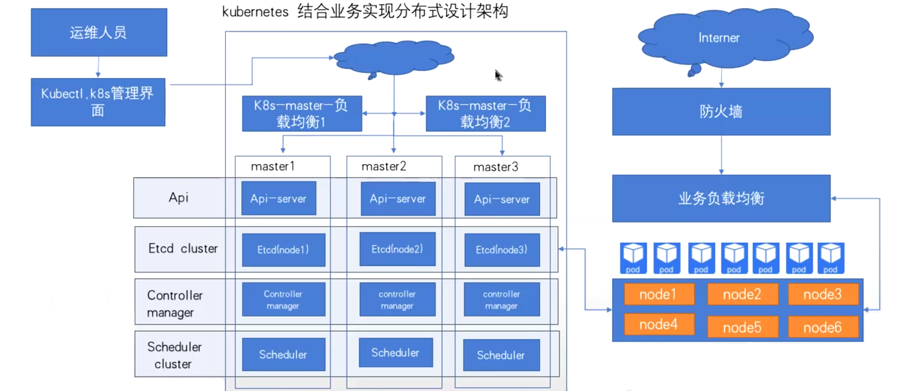

# Kubernetes-资源限制


## Kubernetes中资源限制概括





如果运行的容器没有定义资源（Memory，CPU）等限制，但是在namespace定义了**LimitRange**限制，那么该容器会继承LimitRange中的默认限制

如果namespace没有定义LimitRange限制，那么该容器可以只要宿主机的最大可用资源，直到无资源可用而触发宿主机（OOM Killer）


### 各类型服务资源分配

```bash
# 微服务，轻量级
1C/1G，1C/2G

# 中间件：redis,zookeeper,nginx(nginx上千并发，通常2C/2G够了)
2C/2G，2C/4G

# MySQL，ES,Kafka
2C/4G，4C/6G
```

#### 微服务（轻量级）

配置：`1C/1G` 或 `1C/2G`
 **分析：**

- 很适合用于 **SpringBoot**、**Flask**、**FastAPI**、**Node.js** 这类轻量服务。
- 如果服务是 I/O 密集型（如 Web 服务、API 转发器），这种配比非常经济。
- **建议：**
  - 如果服务涉及 CPU 密集型计算（如图像处理、加密），可以将 CPU 提升至 `2C`。
  - 配合 HPA 设置资源上限与阈值，防止资源抢占。


#### 间件（Redis、Zookeeper、Nginx）

配置：`2C/2G`，或 `2C/4G`
 **分析：**

- `Redis` 通常对内存更敏感，`2G` 是入门配置，**4G 更稳妥**（尤其是大量 Key/Value 数据）。
- `Zookeeper` 是 CP 型服务，**对内存和稳定性有要求**，`2C/4G` 是推荐配置。
- `Nginx` 的配置视并发数而定，上千并发时，`2C/2G` 足够，实际瓶颈在网络 I/O 和连接上。
- **建议：**
  - Redis 建议设置 `maxmemory` 和 `maxclients`，避免 OOM。
  - 所有中间件类 Pod 建议使用 `StatefulSet`+`PVC` 持久化存储。


#### 重型组件（MySQL、ES、Kafka）

配置：`2C/4G` 或 `4C/8G`
 **分析：**

- `MySQL` 一般来说 `2C/4G` 是最小可用规格，**读写频繁时建议提升至 `4C/8G`+ 高 IOPS 存储**。
- `Elasticsearch` 是典型的内存+CPU 重度组件，**官方建议 Heap 为总内存的一半，最多不超过 32G**。
  - 所以 `ES` 起步推荐 `4C/8G`，更大规模场景甚至 `8C/16G` 起步。
- `Kafka` 对 CPU 依赖相对较低，**更看重磁盘 I/O 性能和 Page Cache 命中率**，内存越大越好。
- **建议：**
  - 为这些组件配置 `resource.limits` 和 `livenessProbe` 监控重启机制。
  - 不要用 `Deployment` 管理它们，**必须使用 StatefulSet + PVC**。


## kubernetes对单个容器的CPU及memory实现资源限制

```http
https://kubernetes.io/zh/docs/tasks/configure-pod-container/assign-memory-resource/
```


### 使用压测镜像的pod进行资源测试

```yaml
apiVersion: apps/v1
kind: Deployment
metadata:
  name: limit-test-deployment
  namespace: magedu
spec:
  replicas: 1
  selector:
    matchLabels:
      app: limit-test-pod
  template:
    metadata:
      labels:
        app: limit-test-pod
    spec:
      containers:
      - name: limit-test-container
        image: lorel/docker-stress-ng
        args: ["--vm","2","--vm-bytes","256M"]   # 指定占用2核CPU,512M内存
```

对其进行资源限制

```yaml
apiVersion: apps/v1
kind: Deployment
metadata:
  name: limit-test-deployment
  namespace: magedu
spec:
  replicas: 1
  selector:
    matchLabels:
      app: limit-test-pod
  template:
    metadata:
      labels:
        app: limit-test-pod
    spec:
      containers:
      - name: limit-test-container
        image: lorel/docker-stress-ng
        resources:
          limits:
            cpu: 1
            memory: "250Mi"
          requests:
            cpu: 1
            memory: "250Mi"
        args: ["--vm","2","--vm-bytes","256M"]   # 指定占用2核CPU,512M内存
```


## kubernetes对单个pod的CPU及memory实现资源限制

**Limit Range**是对具体某个Pod或容器的资源使用进行限制

```http
https://kubernetes.io/zh/docs/concepts/policy/limit-range/
```

限制namespace中每个Pod或容器的最小与最大计算资源

 限制namespace中每个Pod或容器计算资源request、limit之间的比例

 限制namespace中每个存储卷声明（PersistentVolumeClaim）可使用的最小与最大存储空间

 设置namespace中容器默认计算资源的request、limit，并在运行时自动注入到容器中


### **示例**

```yaml
[root@master-01 ~] # vim limitrange.yaml
apiVersion: v1
kind: LimitRange
metadata:
  name: limitrange-test
  namespace: test
spec:
  limits:
  - type: Container                  # 限制的资源类型
    max:
      cpu: "2"                       # 限制单个容器的最大CPU
      memory: "2Gi"                  # 限制单个容器的最大内存
    min:
      cpu: "500m"                    # 限制单个容器的最小CPU
      memory: "512Mi"                # 限制单个容器的最小内存
    default:
      cpu: "500m"                    # 默认单个容器的CPU限制
      memory: "512Mi"                # 默认单个容器的内存限制
    defaultRequest:
      cpu: "500m"                    # 默认单个容器的CPU创建请求
      memory: "512Mi"                # 默认单个容器的内存创建请求
    maxLimitRequestRatio:
      cpu: 2                         # 限制CPU limit/request比值最大为2
      memory: 2                      # 限制内存 limit/request比值最大为1.5
  - type: Pod
    max:
      cpu: "4"                       # 限制单个Pod的最大CPU
      memory: "4Gi"                  # 限制单个Pod的最大内存
  - type: PersistentVolumeClaim
    max:
      storage: 50Gi                  # 限制PVC最大的requests.storage
    min:
      storage: 30Gi                   # 限制PVC最小的requests.storage
```

```bash
[root@master-01 ~]#kubectl create ns test
namespace/test created

# 启用资源限制
[root@master-01 ~]#kubectl apply -f limitrange.yaml 
limitrange/limitrange-test created

# 查看
[root@master-01 ~]#kubectl get limitranges -n test 
NAME              CREATED AT
limitrange-test   2025-04-24T14:08:10Z

# 查看详情
[root@master-01 ~]#kubectl describe limitranges -n test
Name:                  limitrange-test
Namespace:             test
Type                   Resource  Min    Max   Default Request  Default Limit  Max Limit/Request Ratio
----                   --------  ---    ---   ---------------  -------------  -----------------------
Container              cpu       500m   2     500m             500m           2
Container              memory    512Mi  2Gi   512Mi            512Mi          2
Pod                    cpu       -      4     -                -              -
Pod                    memory    -      4Gi   -                -              -
PersistentVolumeClaim  storage   30Gi   50Gi  -                -              -
```


### 基于资源限制的常见报错

```bash
# 创建一个deployment
[root@master-01 ~]#cat deployment-resources-test.yaml
apiVersion: apps/v1
kind: Deployment
metadata:
  labels:
    app: myapp
  name: myapp
  namespace: test
spec:
  replicas: 1
  selector:
    matchLabels:
      app: myapp
  template:
    metadata:
      creationTimestamp: null
      labels:
        app: myapp
    spec:
      containers:
      - image: registry.cn-beijing.aliyuncs.com/wangxiaochun/pod-test:v0.1
        name: pod-test
        resources: 
          limits:
            cpu: 2.2
            memory: 1Gi
          requests:
            cpu: 2.2
            memory: 1Gi

# 启用
[root@master-01 ~]#kubectl apply  -f deployment-resources-test.yaml 
deployment.apps/myapp created

# 发现没有任何pod创建
[root@master-01 ~]#kubectl get pod -n test
No resources found in test namespace

# 使用json输出deploy信息，即可看到报错
[root@master-01 ~]#kubectl get deploy -n test myapp -o json
{
    "apiVersion": "apps/v1",
    "kind": "Deployment",
    "metadata": {
        "annotations": {
            "deployment.kubernetes.io/revision": "1",
            "kubectl.kubernetes.io/last-applied-configuration": "{\"apiVersion\":\"apps/v1\",\"kind\":\"Deployment\",\"metadata\":{\"annotations\":{},\"labels\":{\"app\":\"myapp\"},\"name\":\"myapp\",\"namespace\":\"test\"},\"spec\":{\"replicas\":1,\"selector\":{\"matchLabels\":{\"app\":\"myapp\"}},\"template\":{\"metadata\":{\"creationTimestamp\":null,\"labels\":{\"app\":\"myapp\"}},\"spec\":{\"containers\":[{\"image\":\"registry.cn-beijing.aliyuncs.com/wangxiaochun/pod-test:v0.1\",\"name\":\"pod-test\",\"resources\":{\"limits\":{\"cpu\":2.2,\"memory\":\"1Gi\"},\"requests\":{\"cpu\":2.2,\"memory\":\"1Gi\"}}}]}}}}\n"
        },
        "creationTimestamp": "2025-04-24T14:15:51Z",
        "generation": 1,
        "labels": {
            "app": "myapp"
        },
        "name": "myapp",
        "namespace": "test",
        "resourceVersion": "1661285",
        "uid": "51ada55d-6145-408f-9f3f-f22e2f32da91"
    },
    "spec": {
        "progressDeadlineSeconds": 600,
        "replicas": 1,
        "revisionHistoryLimit": 10,
        "selector": {
            "matchLabels": {
                "app": "myapp"
            }
        },
        "strategy": {
            "rollingUpdate": {
                "maxSurge": "25%",
                "maxUnavailable": "25%"
            },
            "type": "RollingUpdate"
        },
        "template": {
            "metadata": {
                "creationTimestamp": null,
                "labels": {
                    "app": "myapp"
                }
            },
            "spec": {
                "containers": [
                    {
                        "image": "registry.cn-beijing.aliyuncs.com/wangxiaochun/pod-test:v0.1",
                        "imagePullPolicy": "IfNotPresent",
                        "name": "pod-test",
                        "resources": {
                            "limits": {
                                "cpu": "2200m",
                                "memory": "1Gi"
                            },
                            "requests": {
                                "cpu": "2200m",
                                "memory": "1Gi"
                            }
                        },
                        "terminationMessagePath": "/dev/termination-log",
                        "terminationMessagePolicy": "File"
                    }
                ],
                "dnsPolicy": "ClusterFirst",
                "restartPolicy": "Always",
                "schedulerName": "default-scheduler",
                "securityContext": {},
                "terminationGracePeriodSeconds": 30
            }
        }
    },
    "status": {
        "conditions": [
            {
                "lastTransitionTime": "2025-04-24T14:15:51Z",
                "lastUpdateTime": "2025-04-24T14:15:51Z",
                "message": "Created new replica set \"myapp-8649dc569d\"",
                "reason": "NewReplicaSetCreated",
                "status": "True",
                "type": "Progressing"
            },
            {
                "lastTransitionTime": "2025-04-24T14:15:51Z",
                "lastUpdateTime": "2025-04-24T14:15:51Z",
                "message": "Deployment does not have minimum availability.",
                "reason": "MinimumReplicasUnavailable",
                "status": "False",
                "type": "Available"
            },
            {
                "lastTransitionTime": "2025-04-24T14:15:51Z",
                "lastUpdateTime": "2025-04-24T14:15:51Z",
                "message": "pods \"myapp-8649dc569d-khs8k\" is forbidden: maximum cpu usage per Container is 2, but limit is 2200m",      # CPU最大允许2，但是该deploy的Container里的request2.2，因此无法创建pod
                "reason": "FailedCreate",
                "status": "True",
                "type": "ReplicaFailure"
            }
        ],
        "observedGeneration": 1,
        "unavailableReplicas": 1
    }
}
```


## kubernetes对整个namespace的CPU及memory实现资源限制

```http
https://kubernetes.io/zh/docs/concepts/policy/resource-quotas/
```

- 限定某个对象类型（如Pod、service）可创建对象的总数；
- 限定某个对象类型可消耗的计算资源（CPU、内存）与存储资源（存储卷声明）总数


### 资源配额

当多个用户或团队共享具有固定节点数目的集群时，人们会担心有人使用超过其基于公平原则所分配到的资源量。

资源配额是帮助管理员解决这一问题的工具。

资源配额，通过 `ResourceQuota` 对象来定义，对每个命名空间的资源消耗总量提供限制。 它可以限制命名空间中某种类型的对象的总数目上限，也可以限制命名空间中的 Pod 可以使用的计算资源的总上限。


**资源配额的工作方式如下：**

- 不同的团队可以在不同的命名空间下工作，这可以通过 [RBAC](https://kubernetes.io/zh-cn/docs/reference/access-authn-authz/rbac/) 强制执行。
- 集群管理员可以为每个命名空间创建一个或多个 ResourceQuota 对象。
- 当用户在命名空间下创建资源（如 Pod、Service 等）时，Kubernetes 的配额系统会跟踪集群的资源使用情况， 以确保使用的资源用量不超过 ResourceQuota 中定义的硬性资源限额。
- 如果资源创建或者更新请求违反了配额约束，那么该请求会报错（HTTP 403 FORBIDDEN）， 并在消息中给出有可能违反的约束。
- 如果命名空间下的计算资源（如 `cpu` 和 `memory`）的配额被启用， 则用户必须为这些资源设定请求值（request）和约束值（limit），否则配额系统将拒绝 Pod 的创建。 提示: 可使用 `LimitRanger` 准入控制器来为没有设置计算资源需求的 Pod 设置默认值。


### 对整个namespace的资源限制示例

```yaml
apiVersion: v1
kind: ResourceQuota
metadata:
  name: quota-test
  namespace: test
spec:
  hard:
    requests.cpu: "8"
    limits.cpu: "8"
    requests.memory: 4Gi
    limits.memory: 4Gi
    requests.nvidia.com/gpu: 4
    pods: "2"
    services: "6"
```


### 计算资源配额

配额机制所支持的资源类型：

| 资源名称           | 描述                                                         |
| ------------------ | ------------------------------------------------------------ |
| `limits.cpu`       | 所有非终止状态的 Pod，其 CPU 限额总量不能超过该值。          |
| `limits.memory`    | 所有非终止状态的 Pod，其内存限额总量不能超过该值。           |
| `requests.cpu`     | 所有非终止状态的 Pod，其 CPU 需求总量不能超过该值。          |
| `requests.memory`  | 所有非终止状态的 Pod，其内存需求总量不能超过该值。           |
| `hugepages-<size>` | 对于所有非终止状态的 Pod，针对指定尺寸的巨页请求总数不能超过此值。 |
| `cpu`              | 与 `requests.cpu` 相同。                                     |
| `memory`           | 与 `requests.memory` 相同。                                  |


### 扩展资源的资源配额

除上述资源外，在 Kubernetes 1.10 版本中， 还添加了对[扩展资源](https://kubernetes.io/zh-cn/docs/concepts/configuration/manage-resources-containers/#extended-resources) 的支持。

由于扩展资源不可超量分配，因此没有必要在配额中为同一扩展资源同时指定 `requests` 和 `limits`。 对于扩展资源而言，仅允许使用前缀为 `requests.` 的配额项。

以 GPU 拓展资源为例，如果资源名称为 `nvidia.com/gpu`，并且要将命名空间中请求的 GPU 资源总数限制为 4，则可以如下定义配额：

- `requests.nvidia.com/gpu: 4`


### 存储资源配额

用户可以对给定命名空间下的[存储资源](https://kubernetes.io/zh-cn/docs/concepts/storage/persistent-volumes/) 总量进行限制。

此外，还可以根据相关的存储类（Storage Class）来限制存储资源的消耗。

| 资源名称                                                     | 描述                                                         |
| ------------------------------------------------------------ | ------------------------------------------------------------ |
| `requests.storage`                                           | 所有 PVC，存储资源的需求总量不能超过该值。                   |
| `persistentvolumeclaims`                                     | 在该命名空间中所允许的 [PVC](https://kubernetes.io/zh-cn/docs/concepts/storage/persistent-volumes/#persistentvolumeclaims) 总量。 |
| `<storage-class-name>.storageclass.storage.k8s.io/requests.storage` | 在所有与 `<storage-class-name>` 相关的持久卷申领中，存储请求的总和不能超过该值。 |
| `<storage-class-name>.storageclass.storage.k8s.io/persistentvolumeclaims` | 在与 storage-class-name 相关的所有持久卷申领中，命名空间中可以存在的[持久卷申领](https://kubernetes.io/zh-cn/docs/concepts/storage/persistent-volumes/#persistentvolumeclaims)总数。 |

例如，如果你想要将 `gold` StorageClass 与 `bronze` StorageClass 分开进行存储配额配置， 则可以按如下方式定义配额：

- `gold.storageclass.storage.k8s.io/requests.storage: 500Gi`
- `bronze.storageclass.storage.k8s.io/requests.storage: 100Gi`

在 Kubernetes 1.8 版本中，本地临时存储的配额支持已经是 Alpha 功能：

| 资源名称                     | 描述                                                         |
| ---------------------------- | ------------------------------------------------------------ |
| `requests.ephemeral-storage` | 在命名空间的所有 Pod 中，本地临时存储请求的总和不能超过此值。 |
| `limits.ephemeral-storage`   | 在命名空间的所有 Pod 中，本地临时存储限制值的总和不能超过此值。 |
| `ephemeral-storage`          | 与 `requests.ephemeral-storage` 相同。                       |

#### 说明：

如果所使用的是 CRI 容器运行时，容器日志会被计入临时存储配额， 这可能会导致存储配额耗尽的 Pod 被意外地驱逐出节点。 参考[日志架构](https://kubernetes.io/zh-cn/docs/concepts/cluster-administration/logging/)了解详细信息。


### 对象数量配额

你可以使用以下语法为 Kubernetes API 中“一种特定资源类型的总数”设置配额：

- `count/<resource>.<group>`：用于非核心（core）组的资源
- `count/<resource>`：用于核心组的资源

这是用户可能希望利用对象计数配额来管理的一组资源示例：

- `count/persistentvolumeclaims`
- `count/services`
- `count/secrets`
- `count/configmaps`
- `count/replicationcontrollers`
- `count/deployments.apps`
- `count/replicasets.apps`
- `count/statefulsets.apps`
- `count/jobs.batch`
- `count/cronjobs.batch`

如果你以这种方式定义配额，它将应用于属于 API 服务器一部分的 Kubernetes API，以及 CustomResourceDefinition 支持的任何自定义资源。 如果你使用[聚合 API](https://kubernetes.io/zh-cn/docs/concepts/extend-kubernetes/api-extension/apiserver-aggregation/) 添加未定义为 CustomResourceDefinitions 的其他自定义 API，则核心 Kubernetes 控制平面不会对聚合 API 实施配额管理。 如果合适，扩展 API 服务器需要为自定义 API 提供配额管理。 例如，要对 `example.com` API 组中的自定义资源 `widgets` 设置配额，请使用 `count/widgets.example.com`。

当使用这样的资源配额（几乎涵盖所有对象类别）时，如果对象类别在控制平面中已存在（已定义）， 则该对象管理会参考配额设置。 这些类型的配额有助于防止存储资源耗尽。例如，用户可能想根据服务器的存储能力来对服务器中 Secret 的数量进行配额限制。 集群中存在过多的 Secret 实际上会导致服务器和控制器无法启动。 用户可以选择对 Job 进行配额管理，以防止配置不当的 CronJob 在某命名空间中创建太多 Job 而导致集群拒绝服务。

还有另一种语法仅用于为某些资源设置相同类型的配额。

支持以下类型：

| 资源名称                 | 描述                                                         |
| ------------------------ | ------------------------------------------------------------ |
| `configmaps`             | 在该命名空间中允许存在的 ConfigMap 总数上限。                |
| `persistentvolumeclaims` | 在该命名空间中允许存在的 [PVC](https://kubernetes.io/zh-cn/docs/concepts/storage/persistent-volumes/#persistentvolumeclaims) 的总数上限。 |
| `pods`                   | 在该命名空间中允许存在的非终止状态的 Pod 总数上限。Pod 终止状态等价于 Pod 的 `.status.phase in (Failed, Succeeded)` 为真。 |
| `replicationcontrollers` | 在该命名空间中允许存在的 ReplicationController 总数上限。    |
| `resourcequotas`         | 在该命名空间中允许存在的 ResourceQuota 总数上限。            |
| `services`               | 在该命名空间中允许存在的 Service 总数上限。                  |
| `services.loadbalancers` | 在该命名空间中允许存在的 LoadBalancer 类型的 Service 总数上限。 |
| `services.nodeports`     | 在该命名空间中允许存在的 NodePort 或 LoadBalancer 类型的 Service 的 NodePort 总数上限。 |
| `secrets`                | 在该命名空间中允许存在的 Secret 总数上限。                   |

例如，`pods` 配额统计某个命名空间中所创建的、非终止状态的 `pods` 个数并确保其不超过某上限值。 用户可能希望在某命名空间中设置 `pods` 配额，以避免有用户创建很多小的 Pod， 从而耗尽集群所能提供的 Pod IP 地址。


**注意**

```ABAP
如果是资源配额限制，则可能导致资源无法创建，而如果是node节点资源不足，则会导致pod呈现Pending状态，二则情况和现象都不相同
```

