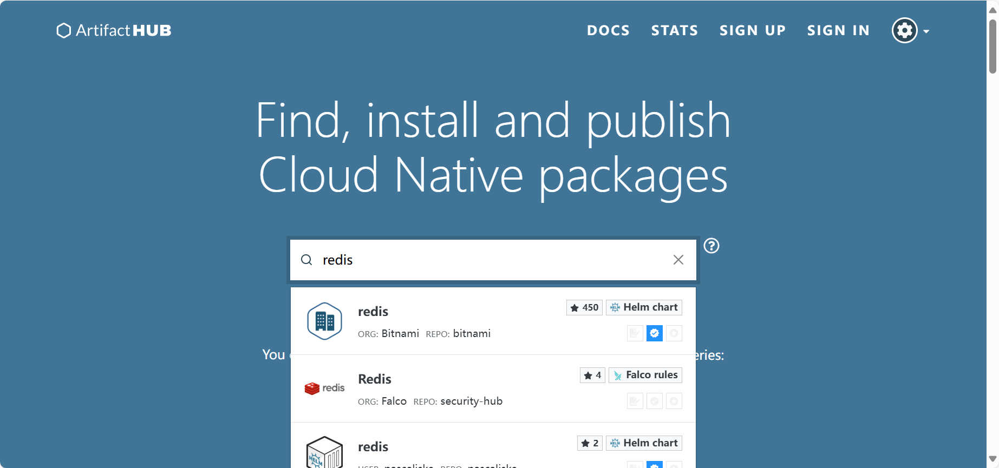
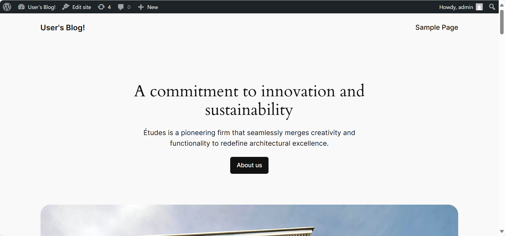
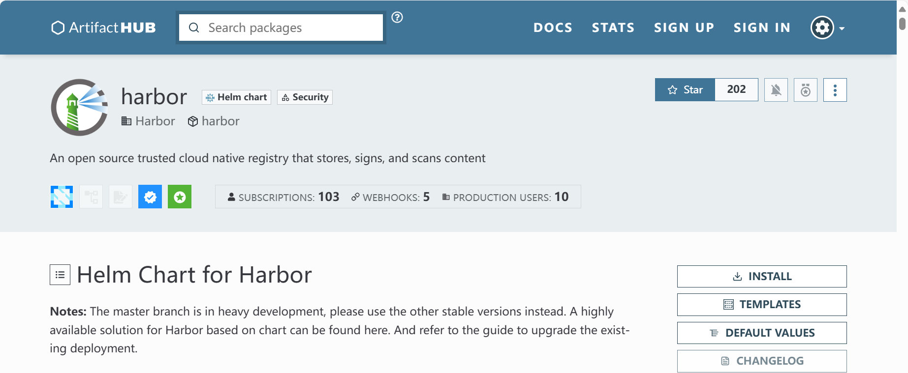
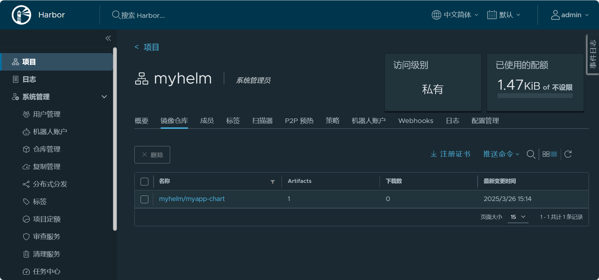

## Kubernetes包管理Helm


**内容**

- **Helm 介绍**
- **Helm 部署**
- **Helm 命令用法**
- **基于 Helm 部署**
- **自定义 Chart 结构**
- **自定义 Chart 语法说明**
- **自定义 Chart 案例**


### Helm 说明和部署

#### Helm 说明

**Helm 介绍**


**传统的软件管理机制**

传统的软件安装基于编译安装方式非常繁琐，所以会使用包管理方式简化软件安装的过程

包管理器：

- deb
- rpm

程序包仓库：维护有仓库内部各程序文件元数据，其中包含了包依赖关系 


**将应用服务部署到 Kubernetes 集群的传统流程**

- 拉取代码
- 打包编译
- 构建镜像
- 准备一堆相关部署资源清单的 yaml 文件(如:deployment、statefulset、service、ingress等)
- kubectl apply 部署


**传统方式部署引发的问题**

- 随着资源引用的增多，需要**维护大量的yaml文件**
- 微服务场景下，每个微服务所需配置差别不大，但是众多的微服务的yaml文件**无法高效复用**
- **无法**将相关yaml文件做为一个**整体管理**，并实现应用级别的升级和回滚等功能
- 无法根据一套yaml文件来创建多个环境，需要手动进行修改，尤其是微服务众多的情况，效率低下 
  例如: 部署的环境都分为开发、预生产、生产环境，在开发这套环境部署完了，后面再部署到预生产和生产环境，还需要重新复制出两套配置文件，并手动修改才能完成


**Kubernetes 的软件管理器 Helm 介绍**

```ABAP
Helm is a tool for managing Charts. Charts are packages of pre-configured Kubernetes resources.
```

Kubernetes也提供了类似于包管理机制Helm 

Helm 是一个用于简化和管理 Kubernetes 应用部署的包管理器。

Helm 可以将部署应用所需要的所有配置清单文件YAML打包至一个**Chart**的包文件中，并支持针对多套环境的定制部署

Helm 允许用户进行定义、安装和升级 Kubernetes 应用程序的资源，称为 Helm Charts。

Helm 不是 Kubernetes 官方提供的工具，但它是由 Kubernetes 社区维护和支持的。

Helm 在社区中得到了广泛的支持和采用，并成为 Kubernetes 生态系统中流行的部署工具之一

**Helm 官网**

```http
https://helm.sh/
https://github.com/helm/helm
```

 **Helm 文档**

```http
https://helm.sh/zh/docs/
https://helm.sh/zh/docs/intro/quickstart/
```


**Helm 重要特性**

- 将各种资源文件进行打包，基于包的方式安装，更加方便
- 提供template功能，可以基于同一套template文件，但对于不同环境可以赋予不同的值从而实现的灵活部署
- 提供版本管理功能，比如，升级，回滚等


#### Helm 相关概念

- **Helm**：Helm的客户端工具，负责和API Server 通信

  Helm 和kubectl类似，也是Kubernetes API Server的命令行客户端工具

  支持kubeconfig认证文件

  需要事先从仓库或本地加载到要使用目标Chart，并基于Chart完成应用管理，Chart可缓存于Helm本地主机上
  支持仓库管理和包管理的各类常用操作，例如Chart仓库的增、删、改、查，以及Chart包的制作、 发布、搜索、下载等

- **Chart**：打包文件，将所有相关的资源清单文件YAML的打包文件

  Chart  是一种打包格式，文件后缀为tar.gz或者 tgz，代表着可由Helm管理的有着特定格式的程序包，类似于RPM，DEB包格式

  Chart 包含了应用所需的资源相关的各种yaml/json配置清单文件，比如：deployment,service 等，但不包含容器的镜像

  Chart 可以使用默认配置，或者定制用户自已的配置进行安装应用

  Chart 中的资源配置文件通常以模板(go template)形式定义，在部署时，用户可通过向模板参数赋值实现定制化安装的目的

  Chart 中各模板参数通常也有**默认值**，这些默认值定义在Chart包里一个名为**`values.yml`**的文件中

- **Release**：表示基于chart部署的一个实例。通过chart部署的应用都会生成一个唯一的Release,即使同一个chart部署多次也会产生多个Release.将这些release应用部署完成后，也会记录部署的一个版本，维护了一个release版本状态,基于此可以实现版本回滚等操作

- **Repository**：chart包存放的仓库，相当于APT和YUM仓库


#### Helm 版本

##### Helm-v2

**C/S 架构:**

- **Client** : helm client，通过gRPC协议和Tiller通信
- **Server**: 称为Tiller, 以Operator形式部署Kubernetes 集群内，表现为相应的一个Pod，还需要做 RBAC的授权

**Tiller Server**

Tiller Server是一个部署在Kubernetes集群内部的 server，其与 Helm client、Kubernetes API server  进行交互。

Tiller server 主要负责如下：

- 监听来自 Helm client 的请求
- 通过 chart 及其配置构建一次发布
- 安装 chart 到Kubernetes集群，并跟踪随后的发布
- 通过与Kubernetes交互升级或卸载 chart

**权限管理**

- **Helm 客户端**配置 kubeconfig 文件，以便能够与 Kubernetes API 服务器通信。这个配置通常在  ~/.kube/config 文件中。加载认证配置文件的机制同kubectl
- **Tiller 服务端**需要在其运行的命名空间中具有足够的权限来管理 Kubernetes 资源。这通常通过创 建一个服务账户（ServiceAccount）并绑定适当的角色（例如 ClusterRole 和  ClusterRoleBinding）来实现。


#####  Helm-v3

2019年11月发布Helm-v3版本


**Helm 3 的变化**

- Tiller 服务器端被废弃

  仅保留helm客户端，helm 通过 kubeconfig 认证到 API Server ， 加载认证配置文件的机制同 kubectl

-  Release 可以在不同名称空间重用，每个名称空间名称唯一即可

- 支持将 Chart 推送至 Docker 镜像仓库

- 支持更强大的 Chart templating 语法，包括 Go 模板和新的 templating 函数。

  这使得 Helm 3 更灵活，可以用于更复杂的部署场景

- Helm 3 默认使用secrets来存储发行信息，提供了更高的安全性。

  Helm 2 默认使用configmaps存储发行信息。

- 自动创建名称空间

  在不存在的命名空间中创建发行版时，Helm 2 创建了命名空间。

  Helm 3 遵循其他Kubermetes对象的行为，如果命名空间不存在则返回错误。

  Helm 3 可以通过 `--create-namespace` 选项当名称空间不存在时自动创建

- 不再需要requirements.yaml,依赖关系是直接在 Chart.yaml中定义

- 命令变化

  - 删除 release 命令变化

    helm delete RELEASE_NAME --purge => helm uninstall RELEASE_NAME

  - 查看 chart 信息命令变化

    helm inspect RELEASE_NAME   => helm  show RELEASE_NAME

  - 拉取 chart包命令变化

    helm fetch CHART_NAME => helm pull CHART_NAME

  - 生成release的随机名

    helm-v3 必须指定release名，如果想使用随机名，必须通过--genrate-name 选项实现，

    helm-v2 可以自动生成随机名

    helo install ./mychart  --generate-name


#### Chart 仓库

**Chart 仓库**：用于实现Chart包的集中存储和分发,类似于Docker仓库Harbor

**Chart 仓库**

- **官方仓库**:  https://artifacthub.io/
- **微软仓库**: 推荐使用，http://mirror.azure.cn/kubernetes/charts/
- **阿里云仓库**：http://kubernetes.oss-cn-hangzhou.aliyuncs.com/charts
- **项目官方仓库**：项目自身维护的Chart仓库
- **Harbor 仓库**：新版支持基于 **OCI:// 协议**，将Chart 存放在公共的docker 镜像仓库

**Chart 官方仓库Hub:**

```http
https://artifacthub.io/
```


可以搜索需要的应用，如下示例：redis




#### 使用Helm部署应用流程

- 安装 helm 工具

- 查找合适的 chart 仓库

- 配置 chart 仓库

- 定位 chart

- 通过向Chart中模板文件中字串赋值完成其实例化，即模板渲染， 实例化的结果就可以部署到目标 Kubernetes上

  模板字串的定制方式三种：

  - 默认使用 chart 中的 values.yaml 中定义的默认值
  - 直接在helm install的命令行，通过--set选项进行
  - 自定义values.yaml，由helm install -f values.yaml 命令加载该文件

- 同一个chart 可以部署出来的多个不同的实例，每个实例称为一个release

   Chart 和 Release 的关系，相当于OOP开发中的Class和对象的关系,相当于image和container

  应用release 安装命令：helm install 


### Helm 客户端安装

#### 官方说明

```http
https://helm.sh/docs/intro/install/
```

**Helm 下载链接**

```http
https://github.com/helm/helm/releases
```


#### 范例：二进制安装 Helm

```bash
# 在kubernetes的管理节点部署
[root@master1 ~]# wget -P /usr/local/src https://get.helm.sh/helm-v3.17.2-linux-amd64.tar.gz
[root@master1 ~]# tar xf /usr/local/src/helm-v3.17.2-linux-amd64.tar.gz -C /usr/local/
[root@master1 ~]# ls /usr/local/linux-amd64/
helm  LICENSE  README.md
[root@master1 ~]# ln -s /usr/local/linux-amd64/helm /usr/local/bin/

# helm-v3版本显示效果如下
[root@master1 ~]#helm version
version.BuildInfo{Version:"v3.17.2", GitCommit:"cc0bbbd6d6276b83880042c1ecb34087e84d41eb", GitTreeState:"clean", GoVersion:"go1.23.7"}

# Helm命令补会,重新登录生效
# 方法1
[root@master1 ~]# echo 'source <(helm completion bash)' >> .bashrc && exit

# 方法2
[root@master1 ~]# helm completion bash > /etc/bash_completion.d/helm  && exit
```


### Helm 命令用法

```http
https://v3.helm.sh/zh/docs/helm/
https://docs.helm.sh/docs/helm/helm/
```


#### Helm 命令用法说明

**常用的 helm命令分类**

- **Repostory 管理**

  repo 命令，支持 repository 的`add`、`list`、`remove`、`update` 和 `index` 等子命令

- **Chart 管理**

  `create`、`package`、`pull`、`push`、`dependency`、`search`、`show` 和 `verify` 等操作

- **Release 管理**

  `install`、`upgrade`、`get`、`list`、`history`、`status`、`rollback `和 `uninstall` 等操作


**Helm常见子命令**

```bash
version          # 查看helm客户端版本
repo             # 添加、列出、移除、更新和索引chart仓库，相当于apt/yum仓库,可用子命令:add、index、list、remove、update
search           # 根据关键字搜索chart包
show             # 查看chart包的基本信息和详细信息，可用子命令:all、chart、readme、values
pull             # 从远程仓库中拉取chart包并解压到本地，通过选项 --untar 解压,默认不解压
create           # 创建一个chart包并指定chart包名字
install          # 通过chart包安装一个release实例
list             # 列出release实例名
upgrade          # 更新一个release实例
rollback         # 从之前版本回滚release实例，也可指定要回滚的版本号
uninstall        # 卸载一个release实例
history          # 获取release历史，用法:helm history release实例名
package          # 将chart目录打包成chart存档文件.tgz中
get              # 下载一个release,可用子命令:all、hooks、manifest、notes、values
status           # 显示release实例的状态，显示已命名版本的状态
```


**Helm 常见命令用法**

```bash
# 仓库管理
helm repo list    # 列出已添加的仓库
helm repo add [REPO_NAME] [URL]  # 添加远程仓库并命名,如下示例
helm repo add myharbor https://harbor.wangxiaochun.com/chartrepo/myweb --username admin --password 123456
helm repo remove [REPO1 [REPO2 ...]]   # 删除仓库
helm repo update                       # 更新仓库,相当于apt update
helm search hub  [KEYWORD]             # 从artifacthub网站搜索,无需配置本地仓库,相当于docker search
helm search repo [KEYWORD]             # 本地仓库搜索,需要配置本地仓库才能搜索,相当于apt search
helm search repo [KEYWORD] --versions  # 显示所有版本
helm show chart [CHART]                # 查看chart包的信息,类似于apt info
helm show values [CHART]               # 查看chart包的values.yaml文件内容

# 拉取chart到本地
helm pull repo/chartname               # 下载charts到当前目录下，表现为tgz文件,默认最新版本，相当于wget  
helm pull chart_URL                    # 直接下载，默认为.tgz文件
helm pull myrepo/myapp --version 1.2.3 --untar      # 直接下载指定版本的chart包并解压缩

# 创建chart目录结构
helm create NAME

# 检查语法
helm lint [PATH]  #默认检查当前目录

# 安装
helm install [NAME] [CHART] [--version <string> ]    # 安装指定版本的chart
helm install [CHART] --generate-name                 # 自动生成  RELEASE_NAME
helm install --set KEY1=VALUE1 --set KEY2=VALUE2  RELEASE_NAME CHART ...    #指定属性实现定制配置
helm install -f values.yaml  RELEASE_NAME CHART..... # 引用文件实现定制配置
helm install --debug --dry-run RELEASE_NAME CHART    # 调试并不执行，可以查看到执行的渲染结果

# 删除
helm uninstall RELEASE_NAME                          # 卸载RELEASE


# 查看
helm list                                            # 列出安装的release
helm status RELEASE_NAME                             # 查看RELEASE的状态
helm get notes RELEASE_NAME -n NAMESPACE             # 查看RELEASE的说明
helm get values RELEASE_NAME -n NAMESPACE > values.yaml   # 查看RELEASE的生成值，可以导出方便以后使用
helm get manifest RELEASE_NAME -n NAMESPACE          # 查看RELEASE的生成的资源清单文件

# 升价和回滚
helm upgrade RELEASE_NAME CHART --set key=newvalue       # release 更新
helm upgrade RELEASE_NAME CHART -f mychart/values.yaml   # release 更新
helm rollback RELEASE_NAME [REVISION]                    # release 回滚到指定版本，如果不指定版本，默认回滚至上一版本
helm history RELEASE_NAME                                # 查看历史

# 打包
helm package mychart/ #将指定目录的chart打包为.tgz到当前目录下
```


#### Helm 命令范例

范例：添加仓库并下载MySQL chart

```bash
# 默认没有仓库
[root@master1 ~]#helm repo list
Error: no repositories to show

# 默认没有通过Helm安装的release
[root@master1 ~]#helm list
NAME	NAMESPACE	REVISION	UPDATED	STATUS	CHART	APP VERSION

# 从官方仓库搜索MySQL
[root@master1 ~]#helm search hub mysql|head -n 5
URL                                               	CHART VERSION	APP VERSION            	DESCRIPTION                                       
https://artifacthub.io/packages/helm/bitnami/mysql	12.3.2       	8.4.4                  	MySQL is a fast, reliable, scalable, and easy t...
https://artifacthub.io/packages/helm/dify-tidb/...	11.1.17      	8.4.2                  	MySQL is a fast, reliable, scalable, and easy t...
https://artifacthub.io/packages/helm/kubesphere...	1.0.2        	5.7.33                 	High Availability MySQL Cluster, Open Source.     
https://artifacthub.io/packages/helm/cloudnativ...	5.0.1        	8.0.16                 	Chart to create a Highly available MySQL cluster 

# 添加仓库
[root@master1 ~]#helm repo add bitnami https://charts.bitnami.com/bitnami
"bitnami" has been added to your repositories

# 添加第二个仓库
[root@master1 ~]#helm repo add ingress-nginx https://kubernetes.github.io/ingress-nginx
"ingress-nginx" has been added to your repositories

# 查看本地配置的仓库
[root@master1 ~]#helm repo list
NAME         	URL                                       
bitnami      	https://charts.bitnami.com/bitnami        
ingress-nginx	https://kubernetes.github.io/ingress-nginx

# 查看配置的仓库，但没有安装的release
[root@master1 ~]#helm list 
NAME	NAMESPACE	REVISION	UPDATED	STATUS	CHART	APP VERSION

# 新版路径支持OCI，无需先创建仓库，可以拉取互联网上的chart
[root@master1 ~]#helm pull oci://registry-1.docker.io/bitnamicharts/mysql
Pulled: registry-1.docker.io/bitnamicharts/mysql:12.3.2
Digest: sha256:ba0fd39f3d592c08e90f7c6fe86ea499df5810be3f296546f9eb27f6c51ba24b

# 查看
[root@master1 ~]#ll mysql-12.3.2.tgz 
-rw-r--r-- 1 root root 64599  3月 25 10:14 mysql-12.3.2.tgz


# 解压chart文件，并查看目录结构
[root@master1 ~]#tree mysql
mysql
├── Chart.lock
├── charts
│   └── common
│       ├── Chart.yaml
│       ├── README.md
│       ├── templates
│       │   ├── _affinities.tpl
│       │   ├── _capabilities.tpl
│       │   ├── _compatibility.tpl
│       │   ├── _errors.tpl
│       │   ├── _images.tpl
│       │   ├── _ingress.tpl
│       │   ├── _labels.tpl
│       │   ├── _names.tpl
│       │   ├── _resources.tpl
│       │   ├── _secrets.tpl
│       │   ├── _storage.tpl
│       │   ├── _tplvalues.tpl
│       │   ├── _utils.tpl
│       │   ├── validations
│       │   │   ├── _cassandra.tpl
│       │   │   ├── _mariadb.tpl
│       │   │   ├── _mongodb.tpl
│       │   │   ├── _mysql.tpl
│       │   │   ├── _postgresql.tpl
│       │   │   ├── _redis.tpl
│       │   │   └── _validations.tpl
│       │   └── _warnings.tpl
│       └── values.yaml
├── Chart.yaml
├── README.md
├── templates
│   ├── ca-cert.yaml
│   ├── cert.yaml
│   ├── extra-list.yaml
│   ├── _helpers.tpl
│   ├── metrics-svc.yaml
│   ├── networkpolicy.yaml
│   ├── NOTES.txt
│   ├── primary
│   │   ├── configmap.yaml
│   │   ├── initialization-configmap.yaml
│   │   ├── pdb.yaml
│   │   ├── startdb-configmap.yaml
│   │   ├── statefulset.yaml
│   │   ├── svc-headless.yaml
│   │   └── svc.yaml
│   ├── prometheusrule.yaml
│   ├── rolebinding.yaml
│   ├── role.yaml
│   ├── secondary
│   │   ├── configmap.yaml
│   │   ├── pdb.yaml
│   │   ├── statefulset.yaml
│   │   ├── svc-headless.yaml
│   │   └── svc.yaml
│   ├── secrets.yaml
│   ├── serviceaccount.yaml
│   ├── servicemonitor.yaml
│   ├── tls-secret.yaml
│   └── update-password
│       ├── job.yaml
│       ├── new-secret.yaml
│       └── previous-secret.yaml
├── values.schema.json
└── values.yaml

8 directories, 58 files
```


### Helm 案例

#### 案例：部署 MySQL

```http
https://artifacthub.io/packages/helm/bitnami/mysql
```


##### 案例：添加仓库并使用默认配置安装 MySQL8.0

```bash
# 添加仓库
[root@master1 ~]#helm repo add bitnami https://charts.bitnami.com/bitnami
"bitnami" has been added to your repositories

[root@master1 ~]#helm search repo mysql
NAME                  	CHART VERSION	APP VERSION	DESCRIPTION                                       
bitnami/mysql         	12.3.2       	8.4.4      	MySQL is a fast, reliable, scalable, and easy t...
bitnami/phpmyadmin    	18.1.5       	5.2.2      	phpMyAdmin is a free software tool written in P...
bitnami/mariadb       	20.4.2       	11.4.5     	MariaDB is an open source, community-developed ...
bitnami/mariadb-galera	14.2.1       	11.4.5     	MariaDB Galera is a multi-primary database clus...

# 查看版本
[root@master1 ~]#helm search repo mysql --versions
NAME                  	CHART VERSION	APP VERSION	DESCRIPTION                                       
bitnami/mysql         	12.3.2       	8.4.4      	MySQL is a fast, reliable, scalable, and easy t...
bitnami/mysql         	12.3.1       	8.4.4      	MySQL is a fast, reliable, scalable, and easy t...
bitnami/mysql         	12.3.0       	8.4.4      	MySQL is a fast, reliable, scalable, and easy t...
bitnami/mysql         	12.2.4       	8.4.4      	MySQL is a fast, reliable, scalable, and easy t...
bitnami/mysql         	12.2.2       	8.4.4      	MySQL is a fast, reliable, scalable, and easy t...
......

# 查看详细信息
[root@master1 ~]#helm show values bitnami/mysql --version 12.3.2
# Copyright Broadcom, Inc. All Rights Reserved.
# SPDX-License-Identifier: APACHE-2.0

## @section Global parameters
## Global Docker image parameters
## Please, note that this will override the image parameters, including dependencies, configured to use the global value
## Current available global Docker image parameters: imageRegistry, imagePullSecrets and storageClass
##

## @param global.imageRegistry Global Docker image registry
## @param global.imagePullSecrets Global Docker registry secret names as an array
## @param global.defaultStorageClass Global default StorageClass for Persistent Volume(s)
## @param global.storageClass DEPRECATED: use global.defaultStorageClass instead
......

#安装时必须指定存储卷，否则会处于Pending状态
[root@master1 statefulset]#helm install mysql bitnami/mysql --version 12.3.2 --set primary.persistence.storageClass=sc-nfs
NAME: mysql
LAST DEPLOYED: Tue Mar 25 10:44:22 2025
NAMESPACE: default
STATUS: deployed
REVISION: 1
TEST SUITE: None
NOTES:
CHART NAME: mysql
CHART VERSION: 12.3.2
APP VERSION: 8.4.4

Did you know there are enterprise versions of the Bitnami catalog? For enhanced secure software supply chain features, unlimited pulls from Docker, LTS support, or application customization, see Bitnami Premium or Tanzu Application Catalog. See https://www.arrow.com/globalecs/na/vendors/bitnami for more information.

** Please be patient while the chart is being deployed **

Tip:

  Watch the deployment status using the command: kubectl get pods -w --namespace default

Services:

  echo Primary: mysql.default.svc.cluster.local:3306

Execute the following to get the administrator credentials:

  echo Username: root
  MYSQL_ROOT_PASSWORD=$(kubectl get secret --namespace default mysql -o jsonpath="{.data.mysql-root-password}" | base64 -d)

To connect to your database:

  1. Run a pod that you can use as a client:

      kubectl run mysql-client --rm --tty -i --restart='Never' --image  docker.io/bitnami/mysql:8.4.4-debian-12-r7 --namespace default --env MYSQL_ROOT_PASSWORD=$MYSQL_ROOT_PASSWORD --command -- bash

  2. To connect to primary service (read/write):

      mysql -h mysql.default.svc.cluster.local -uroot -p"$MYSQL_ROOT_PASSWORD"


WARNING: There are "resources" sections in the chart not set. Using "resourcesPreset" is not recommended for production. For production installations, please set the following values according to your workload needs:
  - primary.resources
  - secondary.resources
+info https://kubernetes.io/docs/concepts/configuration/manage-resources-containers/

# 查看
[root@master1 statefulset]#helm list 
NAME 	NAMESPACE	REVISION	UPDATED                                	STATUS    CHART       	APP VERSION
mysql	default  	1       	2025-03-25 10:44:22.868931866 +0800 CST	deployed  mysql-12.3.2	8.4.4 

# 按照上述的提示操作
[root@master1 ~]# MYSQL_ROOT_PASSWORD=$(kubectl get secret --namespace default mysql -o jsonpath="{.data.mysql-root-password}" | base64 -d)

# 创建一个用于访问的客户端pod
[root@master1 ~]# kubectl run mysql-client --rm --tty -i --restart='Never' --image  docker.io/bitnami/mysql:8.4.4-debian-12-r7 --namespace default --env MYSQL_ROOT_PASSWORD=$MYSQL_ROOT_PASSWORD --command -- bash

# 访问mysql
I have no name!@mysql-client:/$ mysql -h mysql.default.svc.cluster.local -uroot -p"$MYSQL_ROOT_PASSWORD"
mysql: [Warning] Using a password on the command line interface can be insecure.
Welcome to the MySQL monitor.  Commands end with ; or \g.
Your MySQL connection id is 122
Server version: 8.4.4 Source distribution

Copyright (c) 2000, 2025, Oracle and/or its affiliates.

Oracle is a registered trademark of Oracle Corporation and/or its
affiliates. Other names may be trademarks of their respective
owners.

Type 'help;' or '\h' for help. Type '\c' to clear the current input statement.

mysql> 

# 卸载mysql
[root@master1 ~]#helm uninstall mysql 
release "mysql" uninstalled

# 拉取chart包
[root@master1 ~]# helm pull oci://registry-1.docker.io/bitnamicharts/mysql
Pulled: registry-1.docker.io/bitnamicharts/mysql:12.3.2
Digest: sha256:ba0fd39f3d592c08e90f7c6fe86ea499df5810be3f296546f9eb27f6c51ba24b

# 使用本地pull下来的chart进行离线安装
[root@master1 ~]#helm install mysql ./mysql-12.3.2.tgz --set primary.persistence.storageClass=sc-nfs
```


##### helm install 说明

```bash
# 安装的CHART有六种形式

1. By chart reference: helm install mymaria example/mariadb  #在线安装,先通过helm repo add添加仓库，才能在线安装
2. By path to a packaged chart: helm install myweb ./nginx-1.2.3.tgz  #离线安装
3. By path to an unpacked chart directory: helm install myweb ./nginx #离线安装
4. By absolute URL: helm install myweb https://example.com/charts/nginx-1.2.3.tgz #在线安装
5. By chart reference and repo url: helm install --repo https://example.com/charts/ myweb nginx #在线安装
6. By OCI registries: helm install myweb --version 1.2.3 oci://example.com/charts/nginx #在线安装。
```


##### 案例：指定值文件values.yaml内容实现定制Release

```bash
[root@master1 ~]# helm show values bitnami/mysql --version 10.3.0 > value.yaml

# 定制内容
[root@master1 ~]# vim values.yaml
image:
  registry: docker.io
  repository: bitnami/mysql
  tag: 8.0.37-debian-12-r2
  
auth:
  rootPassword: "123456"
  database: mysticaldb
  username: mystical
  password: "654321"
  
primary:
  persistence:
    storageClass: "sc-nfs"
    
persistence:
  enabled: true
  storageClass: "sc-nfs"
  accessMode: ReadWrite0nce
  size: 8Gi
  
[root@master1 ~]#helm install mysql bitnami/mysql -f values.yaml

# 测试访问
[root@master1 ~]# MYSQL_ROOT_PASSWORD=$(kubectl get secret --namespace default mysql -o jsonpath="{.data.mysql-root-password}" | base64 -d)
[root@master1 ~]# kubectl run mysql-client --rm --tty -i --restart='Never' --image  docker.io/bitnami/mysql:8.0.37-debian-12-r2 --namespace default --env MYSQL_ROOT_PASSWORD=$MYSQL_ROOT_PASSWORD --command -- bash
I have no name!@mysql-client:/$ mysql -h mysql.default.svc.cluster.local -uroot -p"$MYSQL_ROOT_PASSWORD"
mysql: [Warning] Using a password on the command line interface can be insecure.
Welcome to the MySQL monitor.  Commands end with ; or \g.
Your MySQL connection id is 22
Server version: 8.0.37 Source distribution

Copyright (c) 2000, 2024, Oracle and/or its affiliates.

Oracle is a registered trademark of Oracle Corporation and/or its
affiliates. Other names may be trademarks of their respective
owners.

Type 'help;' or '\h' for help. Type '\c' to clear the current input statement.

mysql> show databases;
+--------------------+
| Database           |
+--------------------+
| information_schema |
| mysql              |
| mysticaldb         |
| performance_schema |
| sys                |
+--------------------+
5 rows in set (0.03 sec)

# 更改mystical用户登录
I have no name!@mysql-client:/$ mysql -h mysql.default.svc.cluster.local -u mystical -p"654321"
mysql: [Warning] Using a password on the command line interface can be insecure.
Welcome to the MySQL monitor.  Commands end with ; or \g.
Your MySQL connection id is 83
Server version: 8.0.37 Source distribution

Copyright (c) 2000, 2024, Oracle and/or its affiliates.

Oracle is a registered trademark of Oracle Corporation and/or its
affiliates. Other names may be trademarks of their respective
owners.

Type 'help;' or '\h' for help. Type '\c' to clear the current input statement.

mysql> show databases;
+--------------------+
| Database           |
+--------------------+
| information_schema |
| mysticaldb         |
| performance_schema |
+--------------------+
3 rows in set (0.01 sec)
```


##### 案例：MySQL 主从复制

```bash
# 方法1：通过仓库
[root@master1 ~]#helm repo add bitnami https://charts.bitnami.com/bitnami
"bitnami" has been added to your repositories

# 注意：\ 后面不能有任何字符（包括空格、Tab）
[root@master1 ~]# helm install mysql bitnami/mysql  \
    --set 'auth.rootPassword=Zyf646130' \
    --set 'auth.replicationPassword=Zyf646130' \
    --set global.storageClass=sc-nfs \
    --set auth.database=wordpress \
    --set auth.username=wordpress \
    --set 'auth.password=Zyf646130' \
    --set architecture=replication \
    --set secondary.replicaCount=1 \
    -n wordpress --create-namespace
    
# 方法2：通过OCI协议
[root@master1 ~]# helm install mysql  \
    --set auth.rootPassword='P@ssw0rd' \
    --set global.storageClass=sc-nfs \
    --set auth.database=wordpress \
    --set auth.username=wordpress \
    --set auth.password='P@ssw0rd' \
    --set architecture=replication \
    --set secondary.replicaCount=1 \
    --set auth.replicationPassword='P@ssw0rd' \
    oci://registry-1.docker.io/bitnamicharts/mysql \
    -n wordpress --create-namespace
```

主从复制更新副本数为2

```bash
[root@master1 ~]# helm upgrade mysql \
    --set auth.rootPassword='Zyf646130' \
    --set global.storageClass=sc-nfs \
    --set auth.database=wordpress \
    --set auth.username=wordpress \
    --set auth.password='Zyf646130' \
    --set architecture=replication \
    --set secondary.replicaCount=2 \
    --set auth.replicationPassword='Zyf646130' \
    bitnami/mysql \
    -n wordpress
    
# 查看
[root@master1 ~]# kubectl get pod -n wordpress 
NAME                READY   STATUS     RESTARTS   AGE
mysql-primary-0     1/1     Running    0          7m7s
mysql-secondary-0   1/1     Running    0          7m7s
mysql-secondary-1   0/1     Init:0/1   0          6s

# 三分钟，有点慢
[root@master1 ~]# kubectl get pod -n wordpress 
NAME                READY   STATUS    RESTARTS   AGE
mysql-primary-0     1/1     Running   0          10m
mysql-secondary-0   1/1     Running   0          10m
mysql-secondary-1   1/1     Running   0          3m30s
```


#### 案例：部署 WordPress

```http
https://artifacthub.io/packages/helm/bitnami/wordpress
```

##### 使用外部MySQL主从复制和并实现Ingress暴露服务

```bash
[root@master1 ~]# helm install wordpress \
    --version 22.4.20 \
    --set mariadb.enabled=false \
    --set externalDatabase.host=mysql-primary.wordpress.svc.cluster.local \
    --set externalDatabase.user=wordpress \
    --set externalDatabase.password='Zyf646130' \
    --set externalDatabase.port=3306 \
    --set wordpressUsername=admin \
    --set wordpressPassword='Zyf646130' \
    --set persistence.storageClass=sc-nfs \
    --set ingress.enabled=true \
    --set ingress.ingressClassName=nginx \
    --set ingress.hostname=wordpress.mystical.org \
    --set ingress.pathType=Prefix \
    --set externalDatabase.database=wordpress \
    --set volumePermissions.enabled=true \
    --set livenessProbe.enabled=false \
    --set readinessProbe.enabled=false \
    --set startupProbe.enabled=false \
    bitnami/wordpress \
    -n wordpress --create-namespace
    
# 全过程：15分钟左右，其中数据下载：10分钟左右
# NFS上的wordpress数据大小
[root@ubuntu2204 wordpress-wordpress-pvc-7704d2ef-3f52-4fd7-9c1f-add88dd30c1f]#du -sh wordpress/
256M	wordpress/
```





#### 案例：部署 Harbor

```http
https://artifacthub.io/packages/helm/harbor/harbor
```



​        

**实现流程**

- 使用 `helm` 将 `harbor` 部署到 `kubernetes` 集群
- 使用ingress发布到集群外部
- 使用 PVC 持久存储

范例

```bash
# 安装前准备
# ingress controller 基于nginx实现
# SC名称为sc-nfs

# 添加仓库配置
[root@master1 ~]#helm repo add harbor https://helm.goharbor.io
"harbor" has been added to your repositories

# 查看
[root@master1 ~]#helm search repo harbor
NAME          	CHART VERSION	APP VERSION	DESCRIPTION                                       
bitnami/harbor	24.4.1       	2.12.2     	Harbor is an open source trusted cloud-native r...
harbor/harbor 	1.16.2       	2.12.2     	An open source trusted cloud native registry th...


# 定制配置
[root@master1 ~]#helm show values bitnami/harbor > harbor.values.yaml

[root@master1 ~]#cat harbor.values.yaml |grep -Pv "^\s*#"
expose:
  type: ingress
  tls:
    enabled: true                                       # 开启tls
    certSource: auto                                    # 自动配置ca
    auto:
      commonName: ""
    secret:
      secretName: ""
  ingress:
    hosts:
      core: harbor.mystical.org                          # 指定harbor访问的域名
    controller: default
    kubeVersionOverride: ""
    className: "nginx"                                   # 指定ingress
    annotations:
      ingress.kubernetes.io/ssl-redirect: "true"
      ingress.kubernetes.io/proxy-body-size: "0"
      nginx.ingress.kubernetes.io/ssl-redirect: "true"
      nginx.ingress.kubernetes.io/proxy-body-size: "0"
      kubernetes.io/ingress.class: "nginx"               # 指定ingress，旧版用法
......
externalURL: https://harbor.mystical.org                 # 指定harbor访问的域名

persistence:
  enabled: true
  resourcePolicy: "keep"
  persistentVolumeClaim:
    registry:
      existingClaim: ""
      storageClass: "sc-nfs"
      subPath: ""
      accessMode: ReadWriteOnce
      size: 5Gi
      annotations: {}
    jobservice:
      jobLog:
        existingClaim: ""
        storageClass: "sc-nfs"
        subPath: ""
        accessMode: ReadWriteOnce
        size: 1Gi
        annotations: {}
    database:                                       # PostgreSQl数据库组件
      existingClaim: ""
      storageClass: "sc-nfs"
      subPath: ""
      accessMode: ReadWriteOnce
      size: 1Gi
      annotations: {}
    redis:
      existingClaim: ""
      storageClass: "sc-nfs"
      subPath: ""
      accessMode: ReadWriteOnce
      size: 1Gi
      annotations: {}
    trivy:
      existingClaim: ""
      storageClass: "sc-nfs"
      subPath: ""
      accessMode: ReadWriteOnce
      size: 5Gi
      annotations: {}
......

existingSecretAdminPasswordKey: HARBOR_ADMIN_PASSWORD
harborAdminPassword: "123456"                           # 更改密码
    
#创建名称空间(可选)
[root@master1 ~]# kubectl create namespace harbor    

[root@master1 ~]#helm install myharbor -f harbor.values.yaml harbor/harbor -n harbor --create-namespace

# 查看生成的值
[root@master1 ~]#helm get values -n harbor myharbor

# 查看生成的资源清单文件
[root@master1 ~]#helm get manifest -n harbor myharbor

# 查看ingress
[root@master1 ~]#kubectl get ingress -n harbor 
NAME               CLASS   HOSTS                 ADDRESS         PORTS     AGE
myharbor-ingress   nginx   harbor.mystical.org   172.22.200.10   80, 443   15m

# 查看pod
[root@master1 ~]#kubectl get pod -n harbor 
NAME                                   READY   STATUS    RESTARTS      AGE
myharbor-core-65876d6984-c8j6w         1/1     Running   2 (13m ago)   15m
myharbor-database-0                    1/1     Running   0             15m
myharbor-jobservice-5cfbf75f96-8zv2g   1/1     Running   6 (12m ago)   15m
myharbor-portal-9884f7648-4dwhc        1/1     Running   0             15m
myharbor-redis-0                       1/1     Running   0             15m
myharbor-registry-784898f8cb-xq8bw     2/2     Running   0             15m
myharbor-trivy-0                       1/1     Running   0             15m

# 在宿主机配置域名解析
# 访问浏览器：https://harbor.mystical.org
# 账号/密码：admin/123456
```


### 自定义 Chart

#### Chart 目录结构

```http
https://docs.helm.sh/docs/chart_template_guide/getting_started/
```

```bash
# 创建chart文件结构
[root@master1 ~]#helm create mychart
Creating mychart

[root@master1 ~]#tree mychart/
mychart/
├── charts
├── Chart.yaml                        # 必须项，包含了该chart的描述，helm show chart [CHART] 查看到即此文件内容
├── templates                         # 包括了各种资源清单的模板文件
│   ├── deployment.yaml
│   ├── _helpers.tpl
│   ├── hpa.yaml
│   ├── ingress.yaml
│   ├── NOTES.txt
│   ├── serviceaccount.yaml
│   ├── service.yaml
│   └── tests
│       └── test-connection.yaml
└── values.yaml                       # 如果templates/目录中包含变量时,可以通过此文件提供变量的默认值
                                      # 这些值可以在用户执行 helm install 或 helm upgrade 时被覆盖
                                      # helm show values  [CHART]  查看到即此文件内容
3 directories, 10 files
```

**Chart.yaml 文件**

```bash
# harbor的chart.yaml示例
[root@master1 harbor]#cat Chart.yaml 
apiVersion: v1
appVersion: 2.12.2
description: An open source trusted cloud native registry that stores, signs, and
  scans content
home: https://goharbor.io
icon: https://raw.githubusercontent.com/goharbor/website/main/static/img/logos/harbor-icon-color.png
keywords:
- docker
- registry
- harbor
maintainers:
- email: yan-yw.wang@broadcom.com
  name: Yan Wang
- email: stone.zhang@broadcom.com
  name: Stone Zhang
- email: miner.yang@broadcom.com
  name: Miner Yang
name: harbor
sources:
- https://github.com/goharbor/harbor
- https://github.com/goharbor/harbor-helm
version: 1.16.2

[root@master1 harbor]#helm list -n harbor
NAME    	NAMESPACE	REVISION	UPDATED                     STATUS  	CHART        	APP VERSION
myharbor	harbor   	1       	2025-03-25 22... +0800 CST	deployed	harbor-1.16.2	2.12.2
```

**templates/ 目录**

包括了各种资源清单的模板文件。比如: `deployment` ,`service` ,`ingress` , `configmap` , `secret` 等

可以是固定内容的文本,也可以包含一些变量,函数等模板语法

当Helm评估chart时，会通过模板渲染引擎将所有文件发送到 `templates/` 目录中。 然后收集模板的结果并发送给Kubernetes。

```bash
# 以harbor的chart中，template/nginx/secret为例
[root@master1 templates]#cat nginx/secret.yaml 
{{- if eq (include "harbor.autoGenCertForNginx" .) "true" }}
{{- $ca := genCA "harbor-ca" 365 }}
{{- $cn := (required "The \"expose.tls.auto.commonName\" is required!" .Values.expose.tls.auto.commonName) }}
apiVersion: v1
kind: Secret
metadata:
  name: {{ template "harbor.nginx" . }}
  namespace: {{ .Release.Namespace | quote }}
  labels:
{{ include "harbor.labels" . | indent 4 }}
type: Opaque
data:
  {{- if regexMatch `^((25[0-5]|2[0-4][0-9]|[01]?[0-9][0-9]?)\.){3}(25[0-5]|2[0-4][0-9]|[01]?[0-9][0-9]?)$` $cn }}
  {{- $cert := genSignedCert $cn (list $cn) nil 365 $ca }}
  tls.crt: {{ $cert.Cert | b64enc | quote }}
  tls.key: {{ $cert.Key | b64enc | quote }}
  ca.crt: {{ $ca.Cert | b64enc | quote }}
  {{- else }}
  {{- $cert := genSignedCert $cn nil (list $cn) 365 $ca }}
  tls.crt: {{ $cert.Cert | b64enc | quote }}
  tls.key: {{ $cert.Key | b64enc | quote }}
  ca.crt: {{ $ca.Cert | b64enc | quote }}
  {{- end }}
{{- end }}
```

**values.yaml 文件（可选项）**

如果 `templetes/` 目录下文件都是固定内容,此文件无需创建

如果 `templates/` 目录中包含变量时,可以通过此文件提供变量的默认值

这些值可以在用户执行 `helm install` 或 `helm upgrade` 时被覆盖

`helm show values  [CHART]`  查看到即此文件内容

**charts/ 目录（可选项）**

可以包含依赖的其他的chart, 称之为 子chart


#### 常用的内置对象

Chart 中支持多种内置对象,即相关内置的相关变量,可以通过对这些变量进行定义和引用,实现定制 Chart 的目的

- **Release 对象**
- **Values 对象**
- **Chart 对象**
- **Capabilities 对象**
- **Template 对象**


##### helm3 的内置对象详解

**Release对象**

描述应用发布自身的一些信息,主要包括如下对象

```bash
.Release.Name              # release 的名称
.Release.Namespace         # release 的命名空间
.Release.Revision          # 获取此次修订的版本号。初次安装时为1，每次升级或回滚都会递增
.Release.Service           # 获取渲染当前模板的服务名称。一般都是 Helm
.Release.IsInstall         # 如果当前操作是安装，该值为 true
.Release.IsUpgrade         # 如果当前操作是升级或回滚，该值为true
.Release.Time              # Chart发布时间

#引用
{{ .Release.Name }}
```


**Values 对象**

描述 values.yaml 文件(用于定义默认变量的值文件)中的内容，默认为空。

使用 Values 对象可以获取到 values.yaml 文件中已定义的任何变量数值

形式为 `key/value` 对

示例

```bash
# 变量赋值
key1: value1

info:
  key2: value2

# 变量引用
# 注意: 大写字母V
{{ .Value.key1 }}
{{ .Value.info.key2 }}
```

**定制值的两种方法**

| values.yaml 文件                                  | --set 选项                                     |
| ------------------------------------------------- | ---------------------------------------------- |
| name: mystical                                    | --set name=mystical                            |
| name: "mystical,recluse"                          | --set name=mystical\,recluse                   |
| name: mystical<br />age: 18                       | --set name=mystical, age=18                    |
| info:<br />  name: mystical                       | --set info.name=mystical                       |
| name:<br />- mystical<br />- recluse<br />- curry | --set name={mystical,recluse,curry}            |
| info:<br />- name: mystical                       | --set info[0].name=mystical                    |
| info:<br />- name: mystical<br />  age: 18        | --set info[0].name=mystical, info[0].age=18    |
| nodeSelector:<br />  kubernetes.io/role: worker   | --set nodeSelector."kubernetes.io/role"=worker |


 **Chart 对象**

用于获取Chart.yaml 文件中的内容

```bash
.Chart.Name                # 引用Chart.yaml文件定义的chart的名称
.Chart.Version             # 引用Chart.yaml文件定义的Chart的版本

#引用
{{ .Chart.Name }}
```


**Capabilities 对象**

提供了关于kubernetes 集群相关的信息。该对象有如下对象

```bash
.Capabilities.APIVersions               # 返回kubernetes集群 API版本信息集合
.Capabilities.APIVersions.Has $version  # 检测指定版本或资源在k8s中是否可用，例如:apps/v1/Deployment,可用为true
.Capabilities.KubeVersion和.Capabilities.KubeVersion.Version  # 都用于获取kubernetes 的版本,包括Major和Minor
.Capabilities.KubeVersion.Major         # 引用kubernetes 的主版本号,第一位的版本号,比如:v1.18.2中为1
.Capabilities.KubeVersion.Minor         # 引用kubernetes 的小版本号,第二位版本号,比如:v1.18.2中为18

# 引用
{{ .Capabilities.APIVersions }}
```


**Template 对象**

用于获取当前模板的信息，它包含如下两个对象

```bash
.Template.BasePath  # 引用当前模板的名称和路径(示例:mychart/templates/configmap.yaml)
.Template.Name      # 引用当前模板的目录路径(示例:mychart/templates)

# 引用
{{ .Template.Name }}c
```


##### 函数

```http
https://helm.sh/zh/docs/chart_template_guide/function_list/
```

到目前为止，我们已经知道了如何将信息传到模板中。 但是传入的信息并不能被修改。

有时我们希望以一种更有用的方式来转换所提供的数据。

比如: 可以通过调用模板指令中的 quote 函数把 `.Values` 对象中的字符串属性用双引号引起来，然后放到模板中。

```bash
apiVersion: v1
kind: ConfigMap
metadata: 
  name: {{ .Release.Name }}-configmap
data:
  myvalue: "Hello World"
  # 格式1
  drink: {{ quote .Values.favorite.drink }}
  food: {{ squote .Values.favorite.food }}
  # 格式2
  #drink: {{ .Value.favorite.drink | quote }}   # 双引号函数quote
  #food: {{ .Value.favorite.food | squote }}    # 单引号函数squote
```

模板函数的语法是

```bash
# 格式1
function arg1 arg2...
# 格式2： 多次函数处理
arg1 | functionName1 | functionName2 ...
```

在上面的代码片段中， `quote .Values.favorite.drink` 调用了 `quote` 函数并传递了一个参数 `(.Values.favorite.drink)`。

Helm 有超过60个可用函数。其中有些通过  Go模板语言 本身定义。其他大部分都是`Sprig 模版库`  可以在示例看到其中很多函数。

Helm 包含了很多可以在模板中利用的模板函数。以下列出了具体分类：

```ABAP
Cryptographic and Security
Date
Dictionaries
Encoding
File Path
Kubernetes and Chart
Logic and Flow Control
Lists
Math
Float Math
Network
Reflection
Regular Expressions
Semantic Versions
String
Type Conversion
URL
UUID
```


##### 常用语法

###### `with` 语法

**作用**：进入某个值的上下文，简化访问路径

```yaml
# values.yaml
image:
  repository: nginx
  tag: 1.21.6
  pullPolicy: IfNotPresent
```

```yaml
# templates/deployment.yaml
spec:
  containers:
    - name: nginx
      {{- with .Values.image }}
      image: {{ .repository }}:{{ .tag }}
      imagePullPolicy: {{ .pullPolicy }}
      {{- end }}
```

**等价于**

```yaml
image: {{ .Values.image.repository }}:{{ .Values.image.tag }}
```

但 `with` 会把 `image` 当作当前上下文，写法更清晰。

**适合场景**：

- 多次使用 `.Values.xxx` 结构体的子字段
- 条件存在时才进入使用（避免空指针）

**注意**：

- `with` 只在值非空时执行其内部代码块


###### `range` 语句

**作用**：**迭代数组、列表、字典**

示例 1：迭代列表

```yaml
# values.yaml
tolerations:
  - key: "node-type"
    operator: "Equal"
    value: "gpu"
    effect: "NoSchedule"
```

```yaml
# templates/deployment.yaml
spec:
  tolerations:
    {{- range .Values.tolerations }}
    - key: {{ .key }}
      operator: {{ .operator }}
      value: {{ .value }}
      effect: {{ .effect }}
    {{- end }}
```

示例 2：迭代字典（map）

```yaml
# values.yaml
config:
  A: "value-a"
  B: "value-b"
```

```yaml
env:
{{- range $key, $val := .Values.config }}
  - name: {{ $key }}
    value: {{ $val | quote }}
{{- end }}
```

- `$key` 和 `$val` 是自定义变量名

- `quote` 用于给字符串加引号


###### `with` 和 `range` 组合用法

```yaml
# values.yaml
service:
  ports:
    - name: http
      port: 80
    - name: https
      port: 443
```

```yaml
{{- with .Values.service }}
  ports:
    {{- range .ports }}
    - name: {{ .name }}
      port: {{ .port }}
    {{- end }}
{{- end }}
```

先进入 `service` 再遍历 `ports`，更结构化。


###### 空白控制（whitespace control）语法

**写法说明**

| 写法          | 作用                             |
| ------------- | -------------------------------- |
| `{{ ... }}`   | 默认渲染，前后保留空格和换行     |
| `{{- ... }}`  | 去除左侧的所有空白符（包括换行） |
| `{{ ... -}}`  | 去除右侧的所有空白符（包括换行） |
| `{{- ... -}}` | 同时去除左右两侧空白符           |

**示例对比**

**普通写法（保留空行）**

```yaml
containers:
  - name: nginx
    image: {{ .Values.image.repository }}:{{ .Values.image.tag }}

    imagePullPolicy: {{ .Values.image.pullPolicy }}
```

可能多出一个空行或多余缩进。

**加 `-` 控制空白**

```yaml
{{- with .Values.image }}
image: {{ .repository }}:{{ .tag }}
imagePullPolicy: {{ .pullPolicy }}
{{- end }}
```

会去掉前后多余的空格和空行，输出更紧凑。


**使用建议**

| 情况                                      | 是否加 `-`                              |
| ----------------------------------------- | --------------------------------------- |
| 在逻辑语句块前后（`with`, `if`, `range`） | ✅建议加                                 |
| 在内容行中间                              | ❌避免用，否则会破坏 YAML 格式           |
| 代码缩进很重要的地方                      | 👀需小心使用，确认不会破坏 YAML 缩进结构 |


**实战总结**

```yaml
# 推荐
{{- if .Values.enabled }}
spec:
  containers:
    - name: my-app
      {{- with .Values.image }}
      image: {{ .repository }}:{{ .tag }}
      imagePullPolicy: {{ .pullPolicy }}
      {{- end }}
{{- end }}
```

这样可以保持生成的 YAML **干净、无多余空行、缩进整齐**。


##### 变量

在 helm3 中，变量通常是搭配 `with` 语句 和 `range` 语句使用，这样能有效的简化代码。

变量的定义格式如下: 

```bash
$name :=  value
# :=  为赋值运算符，将后面值赋值给前面的变量 name
```

使用变量解决对象作用域问题

因为with语句里不能调用父级别的变量，所以如果需要调用父级别的变量，需要声明一个变量名，将父级别的变量值赋值给声明的变量

helm流控制结构中使用with 更改当前作用域的用法，当时存在一个问题是在with 语句中，无法使用父作用域中的对象，需要使用$符号或者将语句移到 `{{-end }}` 的外面才可以。现在使用变量也可以解决这个问题。

```yaml
# values.yaml
people:
  info:
    name: mystical
    age: 18
    sex: boy
    
# configmap.yaml
apiVersion: v1
kind: ConfigMap
metadata:
  name: {{ .Release.Name }}-configmap
  data:
    {{ - $releaseName := .Release.Name }}
    {{ - with .Values.people.info }}       # 指定作用域
    name: {{ .name }}
    age: {{ .age }}
    # release1: {{ .Release.Name }} # 在with语句内(因为改变了变量作用域)，不能调用父级别的变量,且会报错
    release2: {{ $releaseName }}    # 通过变量名解决调用父级别的变量
    release3: {{ - Release.Name }}  # 在with语句外，可以调用父级别的变量
```


**变量在列表或元组中的使用**

变量也常用在遍历列表或元组中，可以获取到索引和值

```yaml
# values.yaml
address:
- beijing
- shanghai
- guangzhou

# configmap.yaml
apiVersion: v1
kind: ConfigMap
metadata:
  name: {{ .Release.Name }}-configmap
  namespace: {{ .Release.Namespace }}
data:
  address: |-
    {{ - range $index,$add := .Values.address }}  # 将遍历的列表元素赋值给两个变量,一个是索引号，一个是元素值,并且通过                                                     range语句循环遍历出来
    {{ $index }}:{{ $add }}
    {{ - end }}

# 结果：
address: |-
  0: beijing
  1: shanghai
  2: guangzhou
```

**变量在字典中的使用**

变量也能用于变量字典，获取每个键值对 `key/value`

对于字典类型的结构，可以使用 range 获取到每个键值对的 `key` 和 `value`

注意，字典是无序的，所以遍历出来的结果也是无序的。

示例：

```yaml
# values.yaml 定义变量和赋值
person:
  info:
    name: mystical
    sex: boy
    address: beijing
    age: 18
    
# configmap.yaml
apiVersion: v1
kind: ConfigMap
metadata:
  name: {{ .Release.Name }}-configmap
data:
  info: |-
    {{ - range $key, $value := .Values.person.info }}
    {{ $key }}:{{ $value }}
    {{ - end }}

# 结果
info: |-
  address: beijing
  age: 18
  name: mystical
  sex: boy
```


##### 调用子模版

###### 定义并调用子模板说明

定义子模板的两个位置

- 主模板中
- `helpers.tp`l 文件内, `helpers.tpl` 是专门提供的定义子模板的文件，实际使用中，通常建议放在  `helpers.tpl` 文件内

子模板的定义和调用

- 定义子模板: 通过define定义
- 调用子模板: 通过template或者include调用(推荐),template和include 用法一样，稍微有点区别 


###### 演示案例

使用define在主模板中定义子模板的语句块，使用template进行调用子模板

注意: define定义的子模板，需要通过调用才能输出，如果不调用是不会有输出的。

```yaml
# 格式：
{{ - define "mychart.labels" }}
  labels:
    author: mystical
    date: {{ now | htmlDate }}
{{ - end }}
```

示例

```yaml
# 编写一个自己需要的模板文件
# ./mychart/templates/configmap.yaml
{{ - define "mychart.labels" }}
  labels:
    author: mystical
    date: {{ now | htmlDate }}
{{ - end }}
apiVersion: v1
kind: ConfigMap
metadata:
  name: {{ .Release.Name }}-configmap
  {{ - template "mychart.labels" }}
data:
  message: "hello"
  
# 说明
# define 定义一个子模板,子模板的名称是: mychart.labels
# template 调用子模板,通过子模板的名称调用,输出子模板的内容
```


##### 流控制

```http
https://helm.sh/zh/docs/chart_template_guide/control_structures/
```

控制结构(在模板语言中称为"actions")提供给你和模板作者控制模板迭代流的能力。 Helm的模板语言提供了以下控制结构：

- `if / else` ， 用来创建条件语句
- `with` ， 主要是用来控制变量的范围，也就是修改查找变量的作用域
- `range` ， 提供"for each"类型的循环


######  If/Else

第一个控制结构是在按照条件在一个模板中包含一个块文本。即 `if/else`块

基本的条件结构看起来像这样：

```bash
{{ if PIPELINE }}
  # Do something
{{ else if OTHER PIPELINE }}
  # DO somehting
{{ else }}
  # Default case
{{ end }}
```

注意我们讨论的是 PIPELINE 而不是值。这样做的原因是要清楚地说明控制结构可以执行整个管道，而不仅仅是计算一个值。

如果是以下值时，PIPELINE会被设置为 false

- 布尔 false
- 数字 0
- 空字符串
- nil ( 空 或 null )
- 空集合( map ,  slice ,  tuple ,  dict ,  array )

在所有其他条件下，条件都为true。

让我们先在配置映射中添加一个简单的条件。如果饮品是coffee会添加另一个配置：

```yaml
apiVersion: v1
kind: ConfigMap
metadata:
  name: {{ .Release.Name }}-configmap
data:
  myvalue: "Hello World"
  drink: {{ .Values.favorite.drink | default "tea" | quote }}
  food: {{ .Values.favorite.food | upper | quote }}
  {{ if eq .Values.favorite.drink "coffee" }}mug: "true" {{ end }}
```

由于我们在最后一个例子中注释了 `drink: coffee` ，输出中就不会包含 `mug: "true"` 标识。但如果将 这行添加到 values.yaml 文件中，输入就会是这样：

```yaml
# Source: mychart/templates/configmap.yaml
apiVersion: v1
kind: ConfigMap
metadata:
  name: eyewitness-elk-configmap
data:
  myvalue: "Hello World"
  drink: "coffee"
  food: "PIZZA"
  mug: "true"
```

范例

```yaml
# mychart/values.yaml #定义变量和赋值
person:
  name: mystical
  age: 18
  sex: boy
  address: beijing
ingress:
  enabled: true
  
# 编写一个需要的模板文件
#./mychart/templates/configmap.yaml
apiVersion: v1
kind: ConfigMap
metadata:
  name: {{ .Release.Name }}-configmap
  namespace: {{ .Release.Namespace }}
data:
  name: {{ .Values.person.name | default "mystical" | quote }}
  sex: {{ .Values.person.sex | upper quote }}
  {{- if .Value.ingress.enabled }}
  ingress: "配置ingress..."    # 若ingress开关开启,做ingress相关配置
  {{- else }}
  ingress: "不配置ingress..."  #否则ingress开关没开启,不配置ingress
  {{- end }}
  {{- if eq .Values.person.address "beijing" }}
  address: {{ .Values.person.address | quote }}
  {{- else }}
  address: "other city"
  {{- end }}
  
# 注意:执行报错时候，去掉下面注释
# {{- }} 表示向左删除空白包括删除空格和换行,不加可能会增加一个换行,前面加横线是为了去掉该行的空格,如果不加,该行渲染时会形成空格
# {{ -}} 表示向右删除空白,并且会删除换行,一般慎用,因为删除换行时候，打印内容就乱了,还可能语法报错
```


#### 案例：自定义 Chart 实现部署升级回滚版本管理

##### 固定配置的 Chart

```bash
[root@master1 helm]# helm create myapp-chart
Creating myapp-chart

[root@master1 helm]# tree myapp-chart/
myapp-chart/
├── charts
├── Chart.yaml
├── templates
│   ├── deployment.yaml
│   ├── _helpers.tpl
│   ├── hpa.yaml
│   ├── ingress.yaml
│   ├── NOTES.txt
│   ├── serviceaccount.yaml
│   ├── service.yaml
│   └── tests
│       └── test-connection.yaml
└── values.yaml

3 directories, 10 files

# 删除不需要的文件
[root@master1 helm]# rm -rf myapp-chart/templates/* myapp-chart/values.yaml myapp-chart/charts/
[root@master1 helm]# tree .
.
└── myapp-chart
    ├── Chart.yaml
    └── templates

2 directories, 1 file

# 生成相关的资源清单文件
[root@master1 helm]# kubectl create deployment myapp --image registry.cn-beijing.aliyuncs.com/wangxiaochun/pod-test:v0.1 --replicas 3 --dry-run=client -o yaml > myapp-chart/templates/myapp-deployment.yaml
[root@master1 helm]# kubectl create service nodeport myapp --tcp 80:80 --dry-run=client -o yaml > myapp-chart/templates/myapp-service.yaml
[root@master1 helm]# tree myapp-chart/
myapp-chart/
├── Chart.yaml
└── templates
    ├── myapp-deployment.yaml
    └── myapp-service.yaml

1 directory, 3 files

# 修改清单文件
[root@master1 helm]#vim myapp-chart/templates/myapp-deployment.yaml
apiVersion: apps/v1
kind: Deployment
metadata:
  labels:
    app: myapp
  name: myapp
spec:
  replicas: 3
  selector:
    matchLabels:
      app: myapp
  template:
    metadata:
      labels:
        app: myapp
    spec:
      containers:
      - image: registry.cn-beijing.aliyuncs.com/wangxiaochun/pod-test:v0.1
        name: pod-test

[root@master1 helm]# vim myapp-chart/templates/myapp-service.yaml 
apiVersion: v1
kind: Service
metadata:
  labels:
    app: myapp
  name: myapp
spec:
  ports:
  - name: 80-80
    port: 80
    protocol: TCP
    targetPort: 80
  selector:
    app: myapp
  type: NodePort

# 修改配置
[root@master1 helm]# vim myapp-chart/Chart.yaml
apiVersion: v2
name: myapp-chart
description: A Helm chart for Kubernetes
type: application
version: 0.0.1
appVersion: "0.1.0"

# 检查语法
[root@master1 helm]#helm lint myapp-chart/
==> Linting myapp-chart/
[INFO] Chart.yaml: icon is recommended
[INFO] values.yaml: file does not exist

1 chart(s) linted, 0 chart(s) failed

# 部署应用
[root@master1 helm]#helm install myapp ./myapp-chart/ --create-namespace --namespace helmdemo
NAME: myapp
LAST DEPLOYED: Wed Mar 26 13:44:00 2025
NAMESPACE: helmdemo
STATUS: deployed
REVISION: 1
TEST SUITE: None

[root@master1 helm]#kubectl get pod -n helmdemo 
NAME                     READY   STATUS    RESTARTS   AGE
myapp-547df679bb-cj4hh   1/1     Running   0          10s
myapp-547df679bb-nz52d   1/1     Running   0          10s
myapp-547df679bb-z6978   1/1     Running   0          10s

[root@master1 helm]#kubectl get svc -n helmdemo 
NAME    TYPE       CLUSTER-IP      EXTERNAL-IP   PORT(S)        AGE
myapp   NodePort   10.105.237.73   <none>        80:30503/TCP   20s

# 查看
[root@master1 helm]#helm list -n helmdemo 
NAME 	NAMESPACE	REVISION	UPDATED                                	STATUS    CHART            	APP VERSION
myapp	helmdemo 	1       	2025-03-26 13:44:00.261990749 +0800 CST	deployed  myapp-chart-0.0.1	0.1.0

# 卸载
[root@master1 helm]#helm uninstall -n helmdemo myapp 
release "myapp" uninstalled

[root@master1 helm]#kubectl get pod -n helmdemo 
NAME                     READY   STATUS        RESTARTS   AGE
myapp-547df679bb-cj4hh   1/1     Terminating   0          5m17s
myapp-547df679bb-nz52d   1/1     Terminating   0          5m17s
myapp-547df679bb-z6978   1/1     Terminating   0          5m17s

# 将目录打包至文件
[root@master1 ~]# helm package ./myapp-chart/
Successfully packaged chart and saved it to: /root/myapp-chart-0.1.0.tgz
[root@master1 helm]#ll myapp-chart-0.0.1.tgz 
-rw-r--r-- 1 root root 774  3月 26 14:10 myapp-chart-0.0.1.tgz
```


##### 可变配置的 Chart

```bash
[root@master1 helm]#helm create myweb-chart
Creating myweb-chart
[root@master1 helm]#tree myweb-chart/
myweb-chart/
├── charts
├── Chart.yaml
├── templates
│   ├── deployment.yaml
│   ├── _helpers.tpl
│   ├── hpa.yaml
│   ├── ingress.yaml
│   ├── NOTES.txt
│   ├── serviceaccount.yaml
│   ├── service.yaml
│   └── tests
│       └── test-connection.yaml
└── values.yaml

3 directories, 10 files

# 删除多余的文件
[root@master1 helm]#rm -rf myweb-chart/templates/*
[root@master1 helm]#tree myweb-chart/
myweb-chart/
├── charts
├── Chart.yaml
├── templates
└── values.yaml

2 directories, 2 files

# 创建资源清单文件
[root@master1 helm]##kubectl create deployment myweb --image nginx:1.22.0 --replicas=3 --dry-run=client -o yaml > myweb-chart/templates/myweb-deployment.yaml

[root@master1 helm]#kubectl create service nodeport myweb --tcp 80:80  --dry-run=client -o yaml > myweb-chart/templates/myweb-service.yaml

# 修改清单文件为动态模版文件
[root@master1 helm]#vim myweb-chart/templates/myweb-deployment.yaml
apiVersion: apps/v1
kind: Deployment
metadata:
  name: {{ .Values.deployment_name }}
  #namespace: {{ .Values.namespace }} 
  namespace: {{ .Release.Namespace }}
spec:
  replicas: {{ .Values.replicas }}
  selector:
    matchLabels:
      app: {{ .Values.pod_label }}
  template:
    metadata:
      labels:
        app: {{ .Values.pod_label }}
    spec:
      containers:
      - image: {{ .Values.image }}:{{ .Values.imageTag }}
        name: {{ .Values.container_name }}
        ports:
        - containerPort: {{ .Values.containerport }}
        
[root@master1 helm]#vim myweb-chart/templates/myweb-service.yaml
apiVersion: v1
kind: Service
metadata:
  name: {{ .Values.service_name }}
  namespace: {{ .Release.Namespace }}
spec:
  ports:
  - port: {{ .Values.port }}
    protocol: TCP
    targetPort: {{ .Values.targetport }}
  selector:
    app: {{ .Values.pod_label }}
  type: NodePort
  
# 编辑values.yaml文件
[root@master1 helm]#vim myweb-chart/values.yaml
#namespace: default
deployment_name: myweb-deployment
replicas: 3
pod_label: myweb-pod-label
image: registry.cn-beijing.aliyuncs.com/wangxiaochun/pod-test
imageTag: v0.1
container_name: myweb-container
service_name: myweb-service
port: 80targetport: 80
containerport: 80

# 查看Chart.yaml
[root@master1 helm]#grep -v "#" myweb-chart/Chart.yaml
apiVersion: v2
name: myweb-chart
description: A Helm chart for Kubernetes

type: application

version: 0.1.0

appVersion: "1.16.0"

[root@master1 helm]#tree myweb-chart/
myweb-chart/
├── charts
├── Chart.yaml
├── templates
│   ├── myweb-deployment.yaml
│   └── myweb-service.yaml
└── values.yaml

2 directories, 4 files

[root@master1 helm]#helm install myweb ./myweb-chart/ --create-namespace --namespace helmdemo
NAME: myweb
LAST DEPLOYED: Wed Mar 26 16:27:23 2025
NAMESPACE: helmdemo
STATUS: deployed
REVISION: 1
TEST SUITE: None

# 查看
[root@master1 helm]# kubectl get pod -n helmdemo 
NAME                                READY   STATUS    RESTARTS   AGE
myweb-deployment-745dc5b6c5-2zgn5   1/1     Running   0          16s
myweb-deployment-745dc5b6c5-rmgx5   1/1     Running   0          16s
myweb-deployment-745dc5b6c5-z5js4   1/1     Running   0          16s

[root@master1 helm]# kubectl get svc -n helmdemo 
NAME            TYPE       CLUSTER-IP       EXTERNAL-IP   PORT(S)        AGE
myweb-service   NodePort   10.105.117.141   <none>        80:30814/TCP   32s

#打包
[root@master1 helm]#helm package ./myweb-chart/
Successfully packaged chart and saved it to: /root/helm/myweb-chart-0.1.0.tgz
```


##### 上传至harbor

从 **Harbor v2.2 起（尤其是 v2.5+）**，官方推荐 **全面使用 OCI（Open Container Initiative）标准** 来管理 Helm Charts，而不再推荐使用老旧的 **ChartMuseum 插件**。

**ChartMuseum 在新版 Harbor 的现状**

| 项目        | 说明                                                         |
| ----------- | ------------------------------------------------------------ |
| ChartMuseum | 已从 Harbor 默认组件中移除（但仍支持通过 Helm 自定义启用）   |
| 支持情况    | 仍支持兼容，但不推荐新项目再使用 ChartMuseum                 |
| 原因        | ChartMuseum 是老式非 OCI 协议的仓库，功能有限、安全性弱      |
| 官方建议    | 使用 Harbor 本身作为 **OCI Helm Chart 仓库**，更简洁、更标准、更安全 |

```bash
# 使用 OCI协议上传helm包
# Helm 的 OCI 模式 强制要求使用 HTTPS 协议，不支持 HTTP！
# 前置要求，导出harbor的自签CA证书，并将其加入信任链，同时放入helm的信任路径

# 导出自签证书
[root@master1 helm]# kubectl get secret myharbor-ingress -n harbor -o jsonpath="{.data['tls\.crt']}"|base64 -d > harbor-ca.crt

# 然后将其放入 Helm 使用的目录：
[root@master1 helm]# mkdir -p ~/.config/helm/registry/certs
[root@master1 helm]# cp harbor-ca.crt ~/.config/helm/registry/certs/harbor.mystical.org.crt

# 【重点】还要把 CA 证书加入到 系统信任链中
# 虽然 Helm 支持本地 certs/，但某些版本（尤其老版本或 go 模块编译时未启用自定义 CA 路径）还是会依赖系统 CA。

# 拷贝证书到系统信任目录
[root@master1 helm]# cp harbor.mystical.org.crt /etc/pki/ca-trust/source/anchors/

# 或者对于 Debian/Ubuntu 系统
[root@master1 helm]#  cp harbor.mystical.org.crt /usr/local/share/ca-certificates/harbor.crt

# 更新信任链
[root@master1 helm]# update-ca-trust extract
# Ubuntu 用这个：
[root@master1 helm]# update-ca-certificates

# 重启shell，再重新登陆
[root@master1 ~]#helm registry login harbor.mystical.org
Username: admin
Password: 
Login Succeeded

# 将打好的包上传至harbor
[root@master1 helm]#helm push myapp-chart-0.0.1.tgz oci://harbor.mystical.org/myhelm
Pushed: harbor.mystical.org/myhelm/myapp-chart:0.0.1
Digest: sha256:02d3f2b5ecdb89369284d8fdb34813a9a6e7bab910e98c36febc78c478bd86e4

# 可以运行以下命令查看 Helm 的注册表登录信息
[root@master1 helm]#cat ~/.config/helm/registry/config.json 
{
	"auths": {
		"harbor.mystical.org": {
			"auth": "YWRtaW46MTIzNDU2"
		}
	}
}

# auth 字段是 Base64 编码的 username:password。
[root@master1 helm]#echo "YWRtaW46MTIzNDU2" |base64 -d
admin:123456
```

