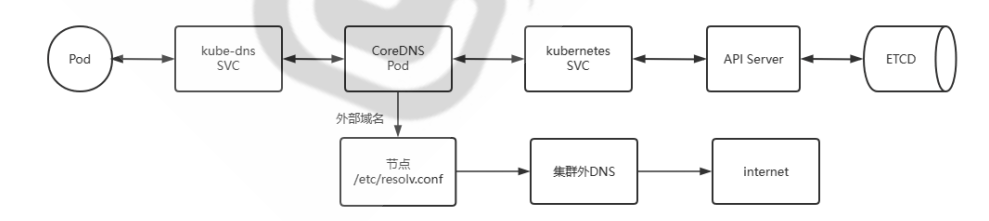

## Kubernetes域名解析

### 服务发现机制

在传统的系统部署中，服务运行在一个固定的已知的 IP 和端口上，如果一个服务需要调用另外一个服 务，可以通过地址直接调用

在Kubernetes 集群中，基于clusterip地址来访问每service是很不方便的

虽然通过配置DNS可以实现名称解析来访问，但是在Kubernetes集群中，服务实例的启动和销毁是很频 繁的，服务地址在动态的变化，所以传统的方式配置DNS解析记录就很不友好了。


将请求发送到动态变化的服务实例上，可以通过以下两个步骤来实现：

- **服务注册** — 创建服务实例后，主动将当前服务实例的信息，存储到一个集中式的服务管理中心。
- **服务发现** — 当A服务需要找未知的B服务时，先去服务管理中心查找B服务地址，然后根据该地址找到B服务


**Kubernetes主要有两种服务发现机制：**

- 环境变量
- DNS解析


### 环境变量

对于环境变量来说，它主要有两种实现方式

- **Kubernetes Service环境变量**

  - Kubernetes为每个Service资源生成包括以下形式的环境变量在内一系列环境变量
  - 在同一名称空间中后续创建的Pod对象都会自动拥有这些变量
  - 注意：此方式不支持Service的动态变化，即在创建Pod对象以后，Service的变化不会生成相关的 环境变量，生产此方式不太常见
  - Service相关环境变量形式如下

  ```bash
  {SVCNAME}_SERVICE_HOST {SVCNAME}_PORT
  
  # 比如：default名称空间创建名为test的Service，default名称空间下的每个Pod内部会被自动注入 和service相关的变量
  TEST_SERVICE_HOST=ClusterIP
  TEST_PORT=tcp://ClusterIP:80
  ```

  ```yaml
  # 注意：如果先创建Pod，然后关联到Service是不生效的
  # 一定要先创建Service，在创建Service下的pod资源类型或者deploy等，才会看到环境变量
  
  
  # 相关实验
  创建service
  [root@master1 controller]#kubectl create svc clusterip myweb --tcp=80:80
  service/myweb created
  
  # 创建相关svc下的deployment
  apiVersion: apps/v1
  kind: Deployment
  metadata:
    labels:
      app: myweb                            # 必须是myweb,因为svc是myweb
    name: myweb
  spec:
    progressDeadlineSeconds: 600
    replicas: 3
    revisionHistoryLimit: 10
    selector:
      matchLabels:
        app: myweb
    template:
      metadata:
        labels:
          app: myweb
      spec:
        containers:
        - image: registry.cn-beijing.aliyuncs.com/wangxiaochun/pod-test:v0.1
          imagePullPolicy: IfNotPresent
          name: pod-test
        dnsPolicy: ClusterFirst
        restartPolicy: Always
        schedulerName: default-scheduler
  
  # 应用
  [root@master1 controller] # kubectl apply -f myweb-deploy-test1.yaml
  deployment.apps/myweb created
  
  # 查看
  [root@master1 controller] # kubectl get pod
  NAME                     READY   STATUS        RESTARTS   AGE
  myweb-565cb68445-btlj8   1/1     Running       0          12s
  myweb-565cb68445-c8drb   1/1     Running       0          12s
  myweb-565cb68445-lj7bq   1/1     Running       0          12s
  
  [root@master1 controller] # kubectl get svc
  NAME         TYPE        CLUSTER-IP       EXTERNAL-IP   PORT(S)   AGE
  kubernetes   ClusterIP   10.96.0.1        <none>        443/TCP   4h59m
  myweb        ClusterIP   10.104.153.124   <none>        80/TCP    13m
  
  
  # 查看pod内的环境变量
  [root@master1 controller] # kubectl exec myweb-565cb68445-btlj8 -it -- /bin/sh
  [root@myweb-565cb68445-btlj8 /]# env
  KUBERNETES_SERVICE_PORT=443
  KUBERNETES_PORT=tcp://10.96.0.1:443
  HOSTNAME=myweb-565cb68445-btlj8
  MYWEB_SERVICE_HOST=10.104.153.124        # MYWEB_SERVICE_HOST
  SHLVL=1
  HOME=/root
  PS1=[\u@\h \w]\$ 
  MYWEB_SERVICE_PORT=80
  MYWEB_PORT=tcp://10.104.153.124:80       # MYWEB_PORT
  TERM=xterm
  MYWEB_PORT_80_TCP_ADDR=10.104.153.124
  KUBERNETES_PORT_443_TCP_ADDR=10.96.0.1
  MYWEB_SERVICE_PORT_80_80=80
  PATH=/usr/local/sbin:/usr/local/bin:/usr/sbin:/usr/bin:/sbin:/bin
  MYWEB_PORT_80_TCP_PORT=80
  
  ```


### COREDNS

#### CoreDNS介绍


专用于kubernetes集群中的服务注册和发现的解决方案就是KubeDNS。

kubeDNS自从Kubernetes诞生以来，其方案的具体实现方案前后经历了三代，分别是 SkyDNS、 KubeDNS、CoreDNS。

Kubernetes-v1.3之前使用SkyDNS, 之后到Kubernetes-v1.13之前使用KubeDNS,当前默认使用 **CoreDNS**

CoreDNS 是一个DNS服务器。Go实现，由于其灵活性，它可以在多种环境中使用。

CoreDNS 是一个云原生计算基金会毕业的项目。CoreDNS通过 Kubernetes 插件与 Kubernetes 集 成，或者通过etcd插件与etcd 集成,实现服务发现

**CoreDNS 官方网站**

```ABAP
https://coredns.io/
https://github.com/coredns/coredns
```


#### CoreDNS解析流程

CoreDNS 通过访问名为 kubernetes 的 Service,找到 API Server 进而连接到 ETCD, 从而实现 Kubernetess集群中的Service,Endpoint,Pod 等资源的查找




- Client Pod **查询自身的/etc/resolv.conf** 指向的DNS服务器地址,此地址为kube-dns service的地址, 即将解析请求转发给名为 kube-dns的 service

  ```bash
  [root@master1 controller]#kubectl exec myweb-565cb68445-btlj8 -it -- /bin/sh
  [root@myweb-565cb68445-btlj8 /]# cat /etc/resolv.conf 
  nameserver 10.96.0.10      # COREDNS的svc地址
  search default.svc.cluster.local svc.cluster.local cluster.local wang.org
  options ndots:5
  ```

- kube-dns service会将请求转发到后端CoreDNS Pod,为了DNS的高可用,通常有两个CoreDNS Pod, 并位于kube-system名称空间

  ```bash
  [root@master1 controller]#kubectl get svc -n kube-system
  NAME       TYPE        CLUSTER-IP   EXTERNAL-IP   PORT(S)                  AGE
  kube-dns   ClusterIP   10.96.0.10   <none>        53/UDP,53/TCP,9153/TCP   5d3h
  ```

- Coredns Pod 根据Corefile的配置会连接到在default名称空间的名为kubernetes的service,而 kubernetes service对应的Endpoints为所有kube-apiserver:6443的地址

  ```bash
  [root@master1 controller]#kubectl get svc -n kube-system
  NAME       TYPE        CLUSTER-IP   EXTERNAL-IP   PORT(S)                  AGE
  kube-dns   ClusterIP   10.96.0.10   <none>        53/UDP,53/TCP,9153/TCP   5d3h
  
  [root@master1 controller]#kubectl get ep
  NAME         ENDPOINTS                                        AGE
  kubernetes   10.0.0.201:6443                                  5h17m
  ```

- kubernetes service 监视service IP的变动，维护DNS解析记录,并将变化发送至ETCD实现DNS记录 的存储

- CoreDNS查询到service name对应的IP后返回给客户端

- 如果查询的是外部域名，**CoreDNS无法解析，就转发给指定的域名服务器**，**一般是节点 上/etc/resolv.conf中的服务器解析**

  ```bash
  # 要使其生效，需要在更改coredns所在节点上的dns后，更新corednsPod
  [root@master1 controller]#kubectl rollout restart deployment -n kube-system coredns 
  deployment.apps/coredns restarted
  ```


#### CoreDNS域名解析


Cluster DNS（CoreDNS）是Kubernetes集群的必备附件，负责为Kubernetes提供名称解析和服务发现

每个Service资源对象，在**CoreDNS上都会自动生成如下格式的名称，结合该名称会生成对应的一些不同 类型的DNS资源记录**

```bash
<service>.<ns>.svc.<zone>
<service>： #当前Service对象的名称
<ns>：      #当前Service对象所属的名称空间
<zone>：    #当前Kubernetes集群使用的域名后缀，默认为“cluster.local”pass
```

范例：kubeadm安装方式时查看默认Zone名称

```bash
[root@master1 ~]#kubeadm config print init-defaults |grep dns
dns: {}
  dnsDomain: cluster.local
```

CoreDNS会持续监视API Server上的Service资源对象的变动，并实时反映到相关的DNS资源记录中

Pod中各容器内部默认会在其 /etc/resolv.conf中，将nameserver指向CoreDNS相关的Service的 ClusterIP，默认为service网段的第10个IP，比如：10.96.0.10，其后面的Endpoint是coredns对应的 Pod的IP，此配置由kubelet创建Pod时根据指定的配置自动注入


范例：集群上的一个随机选择的Pod中的容器查看DNS客户端配置

```bash
[root@master1 ~]#kubectl exec myweb-5d78b4dcbd-6rgv4 -- cat /etc/resolv.conf
nameserver 10.96.0.10
search default.svc.cluster.local svc.cluster.local cluster.local wang.org
options ndots:5

#上述search参数中指定的DNS各搜索域，是以次序指定的几个域名后缀，它们各自的如下所示。
#<ns>.svc.<zone>：附带有特定名称空间的域名，例如default.svc.cluster.local
#svc. <zone>：附带了Kubernetes标识Service专用子域svc的域名，例如svc.cluster.local；
<zone>：集群本地域名，例如cluster.local。
#ndots:5，表示如果手工查询时候给的域名包含的点“.”不超过5个，那么进行DNS查找时将使用非完全限定
名称，即用search指定的域名补全
即 <手工输入域名> 或者 <手工输入域名>.<search 部分给定的域名后缀>
如果你查询的域名包含点数大于等于5，那么DNS查询，默认会使用绝对域名进行查询。
即 <手工输入域名>
```


#### Service资源对应的DNS资源记录

基于DNS的服务发现，对于每个Service对象，都会具有以下3个类型的DNS资源记录**A/AAAA**，**PTR**和 **SRV**

- 根据ClusterIP的地址类型，为IPv4生成固定格式的 A记录，为IPv6生成AAAA记录

```bash
<service>.<ns>.svc.<zone>. <ttl> IN A <cluster-ip>
<service>.<ns>.svc.<zone>. <ttl> IN AAAA <cluster-ip>
#示例：
testapp.default.svc.cluster.local.
#注意：cluster.local 是默认zone名称，在初始化Kubernetes集群中，自己通过dnsDomain属性定制的。
```

- 对于每个给定的A记录或AAAA记录都要生成PTR记录，格式如下所示

```bash
<d>.<c>.<b>.<a>.in-addr.arpa. <ttl> IN PTR <service>.<ns>.svc.<zone>.
h4.h3.h2.h1.g4.g3.g2.g1.f4.f3.f2.f1.e4.e3.e2.e1.d4.d3.d2.d1.c4.c3.c2.c1.b4.b3.b2
.b1.a4.a3.a2.a1.ip6.arpa <ttl> IN PTR <service>.<ns>.svc.<zone>.
```

- 为每个定义了名称的端口生成一个SRV记录，未命名的端口号则不具有该记录

```bash
_<port_name>._<proto>.<service>.<ns>.svc.<zone>. <ttl> IN SRV <weight> 
<priority> <port-number> <service>.<ns>.svc.<zone>.
```


#### Pod的DNS解析策略和配置

Kubernetes支持在单个Pod资源规范上自定义DNS解析策略和配置，并组合生效

- **pod.spec.dnsPolicy**：解析策略
  - **Default**：从运行在的节点/etc/resolv.conf继承DNS名称解析相关的配置
  - **ClusterFirst**：**此为默认值**，优先使用集群内DNS服务上解析集群域内的名称，其他域名的解析则 交由从节点/etc/resolv.conf继承的名称服务器 即使用Default策略
  - **ClusterFirstWithHostNet**：专用于在设置了hostNetwork（使用宿主机的网络）的Pod对象上并不会使用节点网络的DNS，仍然使用的ClusterFirst策略
  - **None**：用于忽略Kubernetes集群的默认设定，而仅使用由dnsConfig自定义的配置
- **pod.spec.dnsConfig**：名称解析机制
  - **nameservers <[]string>**：DNS名称服务器列表，附加于由dnsPolicy生成的DNS名称服务器之后
  - **searches <[]string>**：DNS名称解析时的搜索域，附加由于dnsPolicy生成的搜索域之后
  - **options <[]Object>**：DNS解析选项列表，同dnsPolicy生成的解析选项合并成最终生效的定义


范例：dnsPolicy 的 None 的解析策略

```yaml
# cat service-pod-with-dnspolicy.yaml
apiVersion: v1
kind: Pod
metadata:
  name: service-pod-with-dnspolicy
  namespace: default
spec:
  containers:
  - name: demo
    image: wangxiaochun/pod-test:v0.1
    imagePullPolicy: IfNotPresent
  dnsPolicy: None     # ⚠️ 必须设置为 None 才能使用 dnsConfig
  dnsConfig:
    nameservers:
    - 10.96.0.10
    - 180.76.76.76
    - 233.6.6.6
    searches:
    - svc.cluster.local
    - cluster.local
    - wang.org
    options:
    - name: ndots
      value: "5"  #意味着如果域名中只有5个或更少的点，则系统会尝试在其末尾添加搜索域。
```


#### Pod 的 DNS 工作原理

当你没有显式配置 `dnsPolicy` 时，Pod 使用的是：

```yaml
dnsPolicy: ClusterFirst
```

这意味着：

1. Pod 的 `/etc/resolv.conf` 中的 nameserver 是 CoreDNS 的 ClusterIP（如 `10.96.0.10`）；
2. 所有 DNS 请求都会先发给 CoreDNS；
3. 如果 CoreDNS 解析不到（如 `yang.test.org`），CoreDNS **返回 NXDOMAIN 或 SERVFAIL**；
4. ❌ 不会“自动尝试”节点的 DNS，也不会 fallback 到 `/etc/resolv.conf` 中的其它 DNS；
5. 除非 CoreDNS 自己配置了 fallback 或 `forward .` 到外部 DNS。


**Pod 不会继承 Node 的 DNS 服务器设置**

如果你想让所有未匹配的域名都交给私有 DNS：

```bash
.:53 {
    ...
    forward . 192.168.100.2  # 或多个 IP
    ...
}
```


**查看是否 CoreDNS 真的接收请求？**

```bash
kubectl logs -n kube-system -l k8s-app=kube-dns
```


##### ClusterFirst 和 None的区别

| 模式                   | DNS 从哪儿解析                                               |
| ---------------------- | ------------------------------------------------------------ |
| `ClusterFirst`（默认） | 使用集群内的 DNS 服务（CoreDNS）解析，优先解析 Kubernetes 服务域名 |
| `None`                 | 不使用 CoreDNS，完全由你自己指定 DNS 服务器和搜索域（`dnsConfig`） |


##### Default 和 None的区别

| 属性                             | `dnsPolicy: Default`                      | `dnsPolicy: None`                                |
| -------------------------------- | ----------------------------------------- | ------------------------------------------------ |
| DNS 来自哪里？                   | ✅ **直接继承 Node 的 `/etc/resolv.conf`** | ❌ **完全自定义，需搭配 `dnsConfig` 手动指定**    |
| 是否使用 CoreDNS？               | ❌ 否，除非节点 DNS 配置中写了 CoreDNS     | ❌ 否                                             |
| 是否可以解析 Kubernetes 服务名？ | ❌ 不能（除非 Node 自己能解析）            | ❌ 不能（除非你在 `dnsConfig` 指定）              |
| 是否可以控制 DNS 设置？          | ❌ 不行，只继承 Node 配置                  | ✅ 可以通过 `dnsConfig` 指定 DNS、search、options |
| 使用场景                         | 你想让 Pod 的 DNS 和 Node 完全一致        | 你要手动控制 DNS 配置（特别精细）                |


##### ClusterFirstWithHostNet的场景示例

`dnsPolicy: ClusterFirstWithHostNet` 是 Kubernetes 中一个**特殊的 DNS 策略**，它结合了：

- **`hostNetwork: true`（Pod 直接使用宿主机网络）**
- **集群内 DNS 解析能力（CoreDNS）**


**默认情况下的问题：**

如果你使用 `hostNetwork: true`，**默认的 `dnsPolicy` 会是 `Default`**，这会导致：

- Pod 使用的是 Node 的 `/etc/resolv.conf`
- 🚫 无法解析 Kubernetes 服务名称（例如 `svc.cluster.local`）

这可能导致：

- 应用连接服务失败
- 解析 `kubernetes.default` 报错


**解决方法：设置为 `ClusterFirstWithHostNet`**

```yaml
spec:
  hostNetwork: true
  dnsPolicy: ClusterFirstWithHostNet
```

这样即使你用了 Node 网络，Pod 依然会使用 **CoreDNS 的 ClusterIP 作为 nameserver**，解析服务名就不会失效 ✅


**应用场景**

**网络插件、守护进程、监控代理**

这些组件必须运行在 **hostNetwork**，但仍然需要解析服务名，如：

- `kube-proxy`
- `calico-node` / `cilium-agent`
- `fluentd` / `vector`（日志收集器，可能要连接内部服务）
- `node-exporter`（需要访问 Prometheus service）

> 如果没有设置 `ClusterFirstWithHostNet`，这些组件解析不了服务，会日志报错！


#### CoreDNS配置

CoreDNS的配置都存储在名为**coredns的ConfigMap**对象中，该对象位于**kube-system**名称空间中

服务器配置段(Server Blocks)，用于定义负责解析的权威区域，配置段放置于其后的花括号{}中

服务器配置段也可以指定要监听的端口号,端口号之前需要使用一个冒号，默认为53


**配置解析**

```bash
# coredns的配置是存放在 configmap中
[root@master1 ~]#kubectl get cm -n kube-system
NAME                                                   DATA   AGE
coredns                                                1      5d20h

#查看配置内容
apiVersion: v1
data:
  Corefile: |
    .:53 {                               # 包括跟区域的所有区域对应的监听端口进行解析
        errors                           # 将错误信息进行输出
        health {                         # LivenessProbe检测，http://localhost:8080/health实现
           lameduck 5s
        }
        ready                            # readinessProbe检测，http://localhost:8181/ready coredns就绪返回200
        kubernetes cluster.local in-addr.arpa ip6.arpa {  # 基于Kubernetes的service名称进行查询返回查询结果
           pods insecure
           fallthrough in-addr.arpa ip6.arpa    # 如果in-addr.arpa ip6.arpa区域解析失败，交由后续的插件进行解析
           ttl 30
        }
        prometheus :9153                # 配置访问端口给Prometheus实现监控
        forward . /etc/resolv.conf {    # forward 转发配置，如果集群内部无法解析，交由宿主机的文件解析，也可为IP地址
           max_concurrent 1000          # 最大连接数，提高此值可以提高并发性
        }
        cache 30                        # 启用缓存，单位s
        loop                            # 检测发现环路时重建corendns对应的Pod显示CrashLoopBackOff状态而停止查询，比如CoreDNS直接将请求发给上游服务器，后者再将请求转发回CoreDNS
        reload                          # 检测Corefile是否变化，修改configmap会默认2M后自动加载
        loadbalance                     # 基于随机算法实现DNS查询记录负载均衡
    }

...
        # 对于企业内的dns解决方案，可以通过forward来实现，格式如下
        forward <域名> <转发至外部DNS的地址> {  # 转发配置，如果集群内部无法解析，交由宿主机文件或外部DNS的IP解析
            max_concurrent 最大连接配置
            except 排除域名
        }
        # 示例：转发域名解析至集群外的DNS服务器,"."点表示所有域名
        forward . 10.0.0.10 10.0.0.20 {
            prefer_udp                   # 优先使用UDP
        }
        #注意：如果仅仅对某个域名进行转发的话，只需要将 <域名> 部分设置为指定的域名即可。
        #生产中不推荐直接将 "." 的转发地址使用公网的dns地址，推荐在当前主机的/etc/resolv.conf中配置外网，实现间接效果
        
        # 添加特定主机的正向解析记录，类似于/etc/hosts文件功能
        hosts {
            192.168.10.100 www.example.com
            10.0.0.101 gitlab.example.org nfs.example.org
            10.0.0.102 jenkins.wang.org
            10.0.0.100 harbor.wang.org
            fallthrough
        }
```

```ABAP
插件的定义和执行是按照配置文件的顺序进行解析的，并且 CoreDNS 会对第一个匹配的 forward 插件进行处理。一旦匹配成功，就不会继续处理后续的 forward 插件。

如果匹配后无法解析该域名，CoreDNS 将返回 NXDOMAIN 或 SERVFAIL。
如果希望前面无法解析的情况下，继续尝试后续的配置，可以在配置中添加fallthrough

# 示例：
forward wang.org 10.0.0.200 {
    fallthrough
}
```


范例: 不使用默认的转发策略，使用自定义的转发策略

```bash
# 修改配置文件
[root@master1 ~]#kubectl edit cm coredns -n kube-system 
configmap/coredns edited

# 修改之后重启CoreDNS
[root@master1 ~]#kubectl rollout restart -n kube-system deployment coredns 
deployment.apps/coredns restarted
```


### Headless-Service

#### 无头服务机制

无头服务场景下，Kubernetes会将一个集群内部的所有Pod成员提供唯一的DNS域名来作为每个成员的 网络标识，集群内部成员之间使用域名通信，这个时候，就特别依赖service的selector属性配置了。


**广义上Headless Service，它们又可以为分两种情形**

- 有标签选择器，或者没有标签选择器,但有着与Service对象同名的Endpoint资源
  - Service的DNS名称直接解析为后端各就绪状态的Pod的IP地址
  - 调度功能也将由DNS完成
  - 各Pod IP相关PTR记录将解析至Pod名称，假设Pod IP为a.b.c.d，则其Pod名称为a-b-c-d...SVC.
  - 这种类型也就是狭义上的Headless Service
  - 主要应用于有状态服务的**statefulSet**资源对象

- 无标签选择器且也没有与Service对象同名的Endpoint资源
  - 用于集群外部 ExternalName 类型的Service
  - Service的DNS名称将会生成一条CNAME记录，对应值由Service对象上的spec.externalName字段指定

```ABAP
注意: headless service是一个四层调度，因为iptatbles/ipvs都是四层的
```


**主要的应用场景**

- ServiceName --> (label Selector，Pod) --> 所有Pod的IP地址，此方式又称为狭义的Headless  Service，主要应用在 **StatefulSet**
- ServiceName --> CName （**ExternalName**） --> ExternalService IP，此方式称为狭义的 External Service


**无头服务管理的域名是如下的格式：**

```bash
$(service_name).$(Kubernetes_namespace).svc.cluster.local
```


**DNS 解析记录**

```bash
#A记录
<a>-<b>-<c>-<d>.<service>.<ns>.svc.<zone> A PodIP

#PodIP的PTR反解析记录  
<d>.<c>.<b>.<a>.in-addr.arpa IN PTR <用横线分隔的PodIP>.<service>.<ns>.svc.<zone>

#关键点：
正向解析:svc_name的解析结果从常规Service的ClusterIP，转为解析成各个Pod的IP地址
反向解析:从常规的clusterip解析为service name，转为从podip到hostname, <a>-<b>-<c>-<d>.
<service>.<ns>.svc.<zone>
<hostname>指的是a-b-c-d格式，而非Pod自己的主机名；
```


**案例：: Headless Service**

```bash
# 命令行方式
[root@master1 ~]#kubectl create service clusterip service-headless-cmd --clusterip="None"

# 创建文件
[root@master1 headlessService]#vim service-headless.yaml
apiVersion: v1
kind: Service
metadata:
  name: service-headless
spec:
  selector:
    app: myweb
  clusterIP: "None"  #无头服务
  
# 应用
[root@master1 headlessService]#kubectl apply -f service-headless.yaml 
service/service-headless created

# 查看
[root@master1 headlessService]#kubectl exec myweb-565cb68445-btlj8 -- host service-headless
service-headless.default.svc.cluster.local has address 10.244.1.104
service-headless.default.svc.cluster.local has address 10.244.2.56
service-headless.default.svc.cluster.local has address 10.244.3.111
```