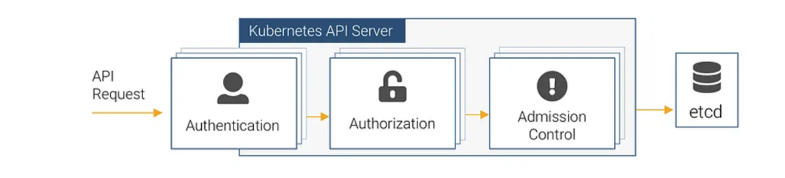
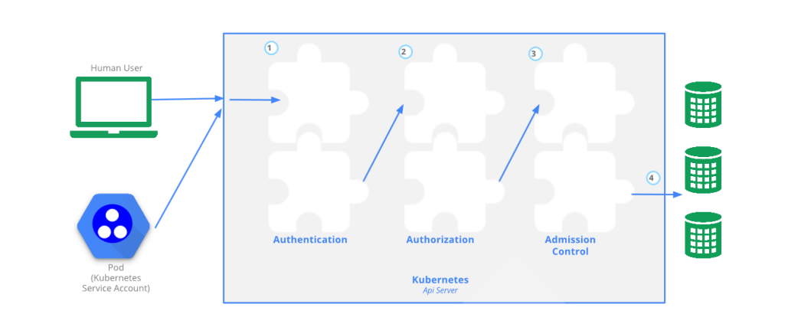
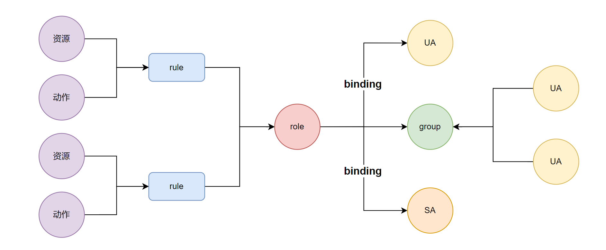
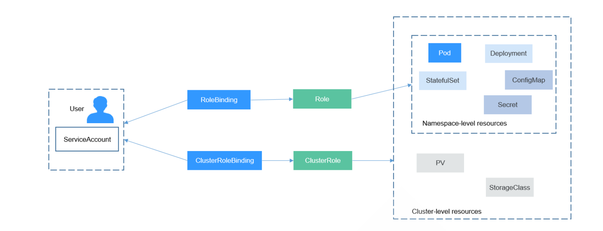
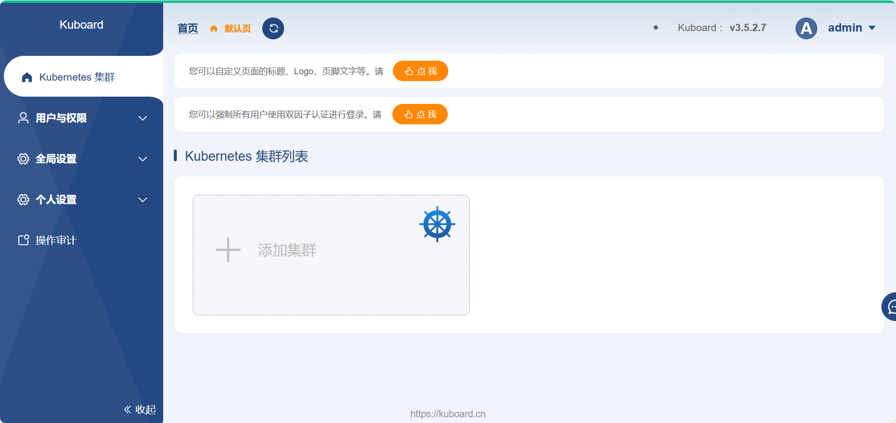
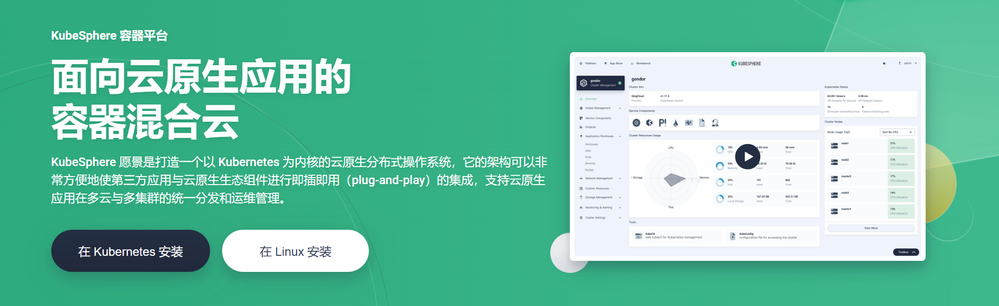
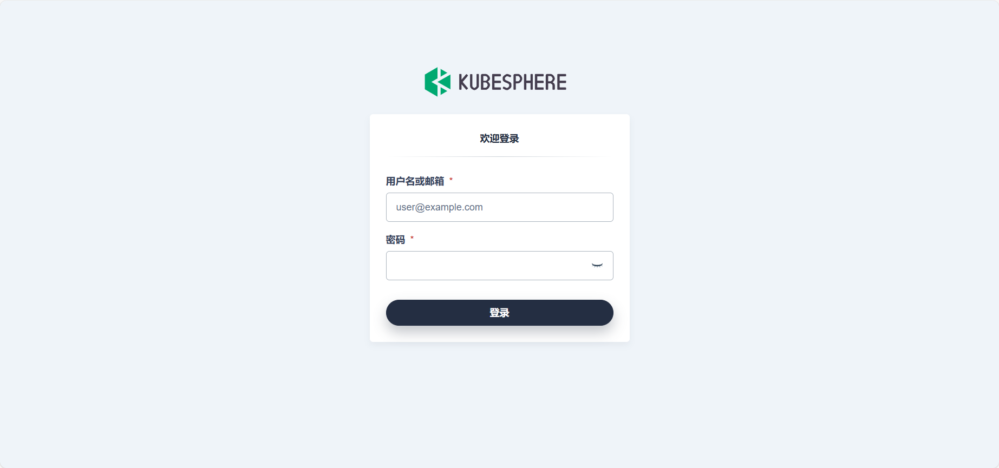

## Kubernetes安全机制


**本章内容**

- **安全体系**
- **认证机制**
- **授权机制**
- **准入机制**


### 安全体系


**用户访问Kubernetes业务应用的流程**

- 无需api_server认证
  - 用户 --> Service(ingress-nginx) --> ingress(controller) --> service --> pod
- 基于api_server认证
  - 管理Kubernetes平台上各种应用现象

对于Kubernetes平台来说，几乎所有的操作基本上都是通过kube apiserver这个组件进行的，该组件提供HTTP RESTful形式的API集群内外客户端调用

对于Kubernetes集群的部署样式主要由两种：http形式和https形式

采用Kubernetes部署的形式默认对外是基于https的方式，而内部组件的通信是基于http方式

而Kubernetes的认证授权机制仅仅存在于https形式的api访问中，也就是说，如果客户端使用HTTP连接到kube-apiserver,那么是不会进行认证授权的，这样即增加了安全性，也不至于太复杂

Kubelet和kubeapi类似，提供一个简单的REST API服务，也监听一些TCP的套接字

- 10250：具有所有节点上Pod管理权限的读写端口，应谨慎管理，Kubelet管理的端口
- 10255：仅提供只读操作，是REST API的子集，新版不再使用
- 10248：是本地healthz端点使用的端口，Kubelet管理的端口

```bash
[root@master1 project-caray]# ss -ntlp|grep kubelet
LISTEN 0      4096       127.0.0.1:10248      0.0.0.0:*    users:(("kubelet",pid=1256,fd=17))       
LISTEN 0      4096               *:10250            *:*    users:(("kubelet",pid=1256,fd=14))  
```


#### 安全基本流程




- 认证 Authentication
- 授权 Authorization
- 准入控制 Admission contro


此安全机制在一定程度上提高安全性，不过更多是资源管理方面的作用。

认证,授权和准入控制功能都是以**插件化的方式**来实现的，这样可以最大化的用户自定义灵活性。


| 步骤                 | 解析                                                         |
| -------------------- | ------------------------------------------------------------ |
| 认证(Authn)          | 对用户进行身份认证，只允许被许可的用户才能进入集群内部，认证失败返回 401。<br />遵循“或”逻辑,且任何一个插件核验成功后都将不再进行后续的插件验证<br />前面的插件检查失败,则检查下一个插件,如里都不成功,才失败,或以匿名身份访 问 |
| 授权(Authz)          | 不同用户获取不同的资源操作权限，比如普通用户、超级用户等。权限不足返 回403<br />鉴权过程遵循“或”逻辑，且任何一个插件对操作的许可授权后都将不再进行后 续的插件验证<br />如果都未许可,则拒绝请求 |
| 准入控制 (Admission) | 用户认证、授权之后，当进行一些写操作的时候，需要遵循的一些限制的要 求,比如资源限制<br />内容合规性检查，遵循“与”逻辑，且无论成败，每次操作都要经由所有插件检 验,最后统一返回结果<br />只对写操作进行合规性检查，在授权范围内，对用户的某些命令或者操作进行 进一步的限制<br />分为两类: validaing 校验(合规性,资源默认和最大和最小限制)和 mutating 变 更(补全,默认值填充) |





### 认证机制

主要涉及到**用户帐号UA**和**服务帐号SA**的认证内容


#### 认证机制说明

所有 Kubernetes 集群都有**两类用户**：由 Kubernetes 管理的**服务账号**和**普通用户**。

在 Kubernetes 中，**subject** 是指一个对象或实体，该对象或实体可以**是用户、服务帐户、组或其他可识别的实体**。它在授权策略中用于标识哪些实体被允许或被拒绝访问资源。简而言之，**subject 就是需要被授权访问资源的实体**。认证用户即属于Subject


在Kubernetes集群中定义了**两种类型的subject资源的认证用户**：

| 用户种类        | 解析                                                         |
| --------------- | ------------------------------------------------------------ |
| User Account    | 用户账户，指非Pod类的客户端访问API Server时使用的身份标识，一般是现实中的 “人”<br />API Server没有为这类账户提供保存其信息的资源类型，**相关的信息通常保存于外部的文件或认证系统中**,由外部独立服务进行管理，所以用户不能通过集群内部的 API 来 进行管理。<br />身份核验操作可由API Server进行，也可能是由外部身份认证服务完成 作用域为整个集群级别,常见的管理方式，如： openssl等 |
| Service Account | Service Accounts（SA）在 Kubernetes 中是一种内建的、与 Pod 关联的账号类型。 它们主要是为了在Pod中运行的进程提供一个身份标识，以便访问 Kubernetes API 通过Kubernetes API 来管理的用户帐号，适用于集群中Pod内的进程访问API Server 时使用的身份信息，需要通过 API 来完成权限认证<br />API Server使用ServiceAccount类型的资源对象来保存该类账号<br />认证到API Server的认证信息称为**Service Account Token**，它们**保存于同名的专用类型的Secret对象中**<br />在集群内部进行权限操作，都需要使用到 ServiceAccount<br />**namespace 别级的资源类型,即帐号隶属于名称空间,但可以授予集群级别的权限** |
| 匿名用 户       | 不能被识别为Service Account，也不能被识别为User Account的用户，即“匿名用户" |

尽管无法通过 API 调用来添加普通用户， Kubernetes 仍然认为**能够提供**由集群的证书机构签名的**合法证书**的**用户**是**通过身份认证的用户**。 基于这样的配置**，Kubernetes 使用证书中的 'subject' 的通用名称** （Common Name）**字段** （例如，"/CN=bob"）**来确定用户名**。 接下来，**基于角色访问控制**（RBAC） 子系统会**确定用户是否有权针对某资源执行特定的操作**。


##### 用户组

在kubernetes集群中，为了更方便的对某一类用户帐号UA进行方便管理，一般会通过用户组的方式来进行管理

注意: Kubernetes 不支持将一个SA服务帐户加入一个指定的组中,但是可以通过RBAC机制创建一个授权 的角色,再将服务帐户和角色绑定实现。

Kubernetes常见的内置用户组有以下四类：

| 用户组                              | 解析                                                         |
| ----------------------------------- | ------------------------------------------------------------ |
| system:unauthenticated              | 未能通过任何一个授权插件检验的账号的所有未通过认证测试的用户 统一隶属的用户组 |
| system:authenticated                | 认证成功后的用户自动加入的一个专用组，用于快捷引用所有正常通过认证的用户账号 |
| system:serviceaccounts              | 所有名称空间中的所有ServiceAccount对象                       |
| system:serviceaccounts: <namespace> | 特定名称空间内所有的ServiceAccount对象                       |

Kubernetes本身并没有对用户或用户组的内建概念或实体。

在**Kubernetes中**，**用户和组是在身份提供者**（如OpenID Connect，Active Directory等）**中创建和管理 的**，**而不是在Kubernetes集群自身中创建**。所以，无法直接在Kubernetes中创建组。

在Kubernetes中，用户和用户组主要在**认证 (Authentication)** 和**授权 (Authorization)** 环节中发挥作用。

**这就意味着在Kubernetes中没有直接的方式去查看用户或用户组**

如果想要查看当前Kubernetes集群中的用户和用户组，通常需要查看的是**外部身份提供商的设置**或**Kubeconfig文件**。同时，您可以查看在Kubernetes中定义的RBAC策略，以理解哪些用户和用户组有 权访问特定资源。

在Kubernetes中，**服务帐户(ServiceAccount)**默认会被放入两个组之一： **system:serviceaccounts （**表示集群中的所有服务帐户）和 **system:serviceaccounts: `<namespace>`**（表示给定命名空间中的所有服务帐户）。这些是内置的组。


**范例：查看用户组`system:master`的权限**

```bash
#所有的k8s集群资源操作，其实都是通过node节点上的kubelet和master节点上的apiserver之间的通信实现，而在kubernetes的认证目录中有其专用的通信认证证书 apiserver-kubelet-client.crt，可以通过该文件来检查一下这两者之间是一个怎样的关系。

# 新版
[root@master1 pki]#openssl x509 -in /etc/kubernetes/pki/apiserver-kubelet-client.crt -text -noout
Certificate:
    Data:
        Version: 3 (0x2)
        Serial Number: 8841619138675744303 (0x7ab3bdc300101e2f)
        Signature Algorithm: sha256WithRSAEncryption
        Issuer: CN = kubernetes
        Validity
            Not Before: Jan  4 01:39:06 2025 GMT
            Not After : Jan  4 01:44:06 2026 GMT
            # 下面Organization的值为kubeadm: cluster-admins，意思是将该用户加入组cluster-admins中
            # 下面有为什么cluster-admins有所有权限
        Subject: O = kubeadm:cluster-admins, CN = kube-apiserver-kubelet-client
        Subject Public Key Info:
            Public Key Algorithm: rsaEncryption
                Public-Key: (2048 bit)
                Modulus:
                ......
                
# 查看集群角色权限
[root@master1 pki]#kubectl get clusterrole cluster-admin -o yaml
apiVersion: rbac.authorization.k8s.io/v1
kind: ClusterRole
metadata:
  annotations:
    rbac.authorization.kubernetes.io/autoupdate: "true"
  creationTimestamp: "2025-01-04T01:44:14Z"
  labels:
    kubernetes.io/bootstrapping: rbac-defaults
  name: cluster-admin     # 给集群角色cluster-admin全部权限，下面都是*，就表示授予所有权限
  resourceVersion: "74"
  uid: 7defd096-536a-4bd1-890c-e496d1c5f35e
rules:
- apiGroups:
  - '*'
  resources:
  - '*'
  verbs:
  - '*'
- nonResourceURLs:
  - '*'
  verbs:
  - '*'

# 查看role角色cluster-admin同名的clusterrolebinding，分配权限给kubeadm:cluster-admins组
[root@master1 pki]# kubectl get clusterrolebinding kubeadm:cluster-admins -o yaml
apiVersion: rbac.authorization.k8s.io/v1
kind: ClusterRoleBinding
metadata:
  creationTimestamp: "2025-01-04T01:44:15Z"
  name: kubeadm:cluster-admins
  resourceVersion: "204"
  uid: c0010b58-45ce-4d63-a0b4-e1a1632f3977
roleRef:
  apiGroup: rbac.authorization.k8s.io
  kind: ClusterRole
  name: cluster-admin   # 将这个拥有全部权限的角色，赋予下面的组kubeadm:cluster-admins
subjects:
- apiGroup: rbac.authorization.k8s.io
  kind: Group
  name: kubeadm:cluster-admins   # 因此这里这个组cluster-admins有全部权限

```


##### 认证插件

Kubernetes 通过身份认证插件利用**客户端证书**、**持有者令牌（Bearer Token）**或**身份认证代理 （Proxy）** 来认证 API 请求的身份。

kubernetes提供了多种认证方式，可以同时使用一种或多种认证方式，只要通过任何一个成功即被认作 是认证通过。即或关系


**常见的认证方式如下：**

| 认证方式            | 解析                                                         |
| ------------------- | ------------------------------------------------------------ |
| X509 客户端证书认证 | TLS双向认证，客户端持有数字证书,API Server信任客户端证书的颁发者.即服务器客户端互相验证<br />**信任的CA**需要在kube-apiserver启动时,通过**--client-ca-file选项指定**.<br />证书中的Subject中的 **CN(CommonName)即被识别为用户名**，而**O（Organization） 被识别为组名**<br />对于这种客户的账号，k8s是无法管理的。为了使用这个方案，api-server需要用-- client-ca-file、--tls-private-key-file、--tls-cert-file选项来开启。<br />kubeadm部署的Kubernetes集群，默认使用 **/etc/kubernetes/pki/ca.crt** 进行客户端认证,此文件是kubeadm为Kubernetes各组件间颁发数字证书的**根CA** |
| 令牌认证 (Token)    | 在节点数量非常多的时候，大量手动配置TLS认证比较麻烦，可以**通过在api-server开 启 experimental-bootstrap-token-auth 特性**，**通过对客户端的和k8s平台预先定义的 token信息进行匹配**，**认证通过后，自动为节点颁发证书**，可以大大减轻工作量，而且 应用场景非常广。<br />包括: Service Account 令牌,静态令牌文件,Bootstrap令牌,OIDC(OpenID Connect)令 牌,Webhook 令牌 等 |
| 代理认证            | 一般借助于中间代理的方式来进行统用的认证方式，样式不固定     |
| 匿名                | 无法认证的其它请求                                           |


**API Server启用的身份认证机制**

- 基于认证插件支持多种认证方式，而相应认证插件的启用需要经由kube-apiserver上的专用选项完成
- kubeadm 部署的集群默认启用的认证机制包括如下几种
  - X509客户端证书认证
  - Bootstrap令牌认证
  - 前端代理身份认证 front-proxy
  - Service Account 令牌
- 注意：API Server并不保证各认证插件的生效次序与定义的次序相同


**范例: 查看API Server 的认证机制**

```bash
#在Master节查看认证机制
[root@master1 pki] # cat /etc/kubernetes/manifests/kube-apiserver.yaml 
apiVersion: v1
kind: Pod
metadata:
  annotations:
    kubeadm.kubernetes.io/kube-apiserver.advertise-address.endpoint: 10.0.0.201:6443
  creationTimestamp: null
  labels:
    component: kube-apiserver
    tier: control-plane
  name: kube-apiserver
  namespace: kube-system
spec:
  containers:
  - command:
    - kube-apiserver
    - --advertise-address=10.0.0.201
    - --allow-privileged=true
    - --authorization-mode=Node,RBAC
    - --client-ca-file=/etc/kubernetes/pki/ca.crt             # x509客户端认证，此CA颁发的证书对应的用户是合法用户
    - --enable-admission-plugins=NodeRestriction
    - --enable-bootstrap-token-auth=true                      # Bootstrap 令牌认证
    - --etcd-cafile=/etc/kubernetes/pki/etcd/ca.crt
    - --etcd-certfile=/etc/kubernetes/pki/apiserver-etcd-client.crt
    - --etcd-keyfile=/etc/kubernetes/pki/apiserver-etcd-client.key
    - --etcd-servers=https://127.0.0.1:2379
    - --kubelet-client-certificate=/etc/kubernetes/pki/apiserver-kubelet-client.crt
    - --kubelet-client-key=/etc/kubernetes/pki/apiserver-kubelet-client.key
    - --kubelet-preferred-address-types=InternalIP,ExternalIP,Hostname
    - --proxy-client-cert-file=/etc/kubernetes/pki/front-proxy-client.crt     # 身份认证代理
    - --proxy-client-key-file=/etc/kubernetes/pki/front-proxy-client.key      # 身份认证代理
    - --requestheader-allowed-names=front-proxy-client                        # 身份认证代理
    - --requestheader-client-ca-file=/etc/kubernetes/pki/front-proxy-ca.crt   # 身份认证代理
    - --requestheader-extra-headers-prefix=X-Remote-Extra-                    # 身份认证代理
    - --requestheader-group-headers=X-Remote-Group                            # 身份认证代理
    - --requestheader-username-headers=X-Remote-User                          # 身份认证代理
    - --secure-port=6443
    - --service-account-issuer=https://kubernetes.default.svc.cluster.local   # SA认证
    - --service-account-key-file=/etc/kubernetes/pki/sa.pub                   # SA认证
    - --service-account-signing-key-file=/etc/kubernetes/pki/sa.key           # SA认证
    - --service-cluster-ip-range=10.96.0.0/12
    - --tls-cert-file=/etc/kubernetes/pki/apiserver.crt
    - --tls-private-key-file=/etc/kubernetes/pki/apiserver.key
    image: registry.aliyuncs.com/google_containers/kube-apiserver:v1.30.2
    imagePullPolicy: IfNotPresent
    livenessProbe:
      failureThreshold: 8
      httpGet:
        host: 10.0.0.201
        path: /livez
        port: 6443
        scheme: HTTPS
      initialDelaySeconds: 10
      periodSeconds: 10
      timeoutSeconds: 15
    name: kube-apiserver
    readinessProbe:
      failureThreshold: 3
      httpGet:
        host: 10.0.0.201
        path: /readyz
        port: 6443
        scheme: HTTPS
      periodSeconds: 1
      timeoutSeconds: 15
    resources:
      requests:
        cpu: 250m
    startupProbe:
      failureThreshold: 24
      httpGet:
        host: 10.0.0.201
        path: /livez
        port: 6443
        scheme: HTTPS
      initialDelaySeconds: 10
      periodSeconds: 10
      timeoutSeconds: 15
    volumeMounts:
    - mountPath: /etc/ssl/certs
      name: ca-certs
      readOnly: true
    - mountPath: /etc/ca-certificates
      name: etc-ca-certificates
      readOnly: true
    - mountPath: /etc/pki
      name: etc-pki
      readOnly: true
    - mountPath: /etc/kubernetes/pki
      name: k8s-certs
      readOnly: true
    - mountPath: /usr/local/share/ca-certificates
      name: usr-local-share-ca-certificates
      readOnly: true
    - mountPath: /usr/share/ca-certificates
      name: usr-share-ca-certificates
      readOnly: true
  hostNetwork: true
  priority: 2000001000
  priorityClassName: system-node-critical
  securityContext:
    seccompProfile:
      type: RuntimeDefault
  volumes:
  - hostPath:
      path: /etc/ssl/certs
      type: DirectoryOrCreate
    name: ca-certs
  - hostPath:
      path: /etc/ca-certificates
      type: DirectoryOrCreate
    name: etc-ca-certificates
  - hostPath:
      path: /etc/pki
      type: DirectoryOrCreate
    name: etc-pki
  - hostPath:
      path: /etc/kubernetes/pki
      type: DirectoryOrCreate
    name: k8s-certs
  - hostPath:
      path: /usr/local/share/ca-certificates
      type: DirectoryOrCreate
    name: usr-local-share-ca-certificates
  - hostPath:
      path: /usr/share/ca-certificates
      type: DirectoryOrCreate
    name: usr-share-ca-certificates
status: {}
```


**Kubelet启用的身份认证机制**

- kubelet的REST API端点默认通过TCP协议的10250端口提供，支持管理操作

| Kubelet API | 功能简介                   |
| ----------- | -------------------------- |
| /pods       | 列出当前kubelet节点上的Pod |
| /run        | 在一个容器内运行指定的命令 |
| /exec       | 在一个容器内运行指定的命令 |
| /configz    | 设置Kubelet的配置文件参数  |
| /debug      | 调试信息                   |

- 需要对客户端身份进行认证
- 启用的身份认证:webhook,x509客户端证书认证
  - 注意：建议显式禁用匿名用户
- API Server是该API端点的客户端，因此，kubelet需要在验证客户端身份时信任给API Server颁发数字证书的CA


**范例：查看Kubelet的认证机制**

```yaml
#在每个worker节点查看
[root@node1 pki] # cat /var/lib/kubelet/config.yaml 
apiVersion: kubelet.config.k8s.io/v1beta1
authentication:
  anonymous:
    enabled: false                             # 匿名认证，true为允许匿名访问，但是权限不足
  webhook:
    cacheTTL: 0s                               # webhook认证
    enabled: true
  x509:
    clientCAFile: /etc/kubernetes/pki/ca.crt   # 证书认证
authorization:
  mode: Webhook
  webhook:
    cacheAuthorizedTTL: 0s
    cacheUnauthorizedTTL: 0s
cgroupDriver: systemd
clusterDNS:
- 10.96.0.10
clusterDomain: cluster.local
containerRuntimeEndpoint: ""
cpuManagerReconcilePeriod: 0s
evictionPressureTransitionPeriod: 0s
fileCheckFrequency: 0s
healthzBindAddress: 127.0.0.1
healthzPort: 10248
httpCheckFrequency: 0s
imageMaximumGCAge: 0s
imageMinimumGCAge: 0s
kind: KubeletConfiguration
logging:
  flushFrequency: 0
  options:
    json:
      infoBufferSize: "0"
    text:
      infoBufferSize: "0"
  verbosity: 0
memorySwap: {}
nodeStatusReportFrequency: 0s
nodeStatusUpdateFrequency: 0s
resolvConf: /run/systemd/resolve/resolv.conf
rotateCertificates: true
runtimeRequestTimeout: 0s
shutdownGracePeriod: 0s
shutdownGracePeriodCriticalPods: 0s
staticPodPath: /etc/kubernetes/manifests
streamingConnectionIdleTimeout: 0s
syncFrequency: 0s
volumeStatsAggPeriod: 0s

#如果修改,不建议修改/var/lib/kubelet/config.yaml配置文件,而通过修改对应的configmap实现
[root@master1 pki]#kubectl get -n kube-system cm kubelet-config -o yaml
apiVersion: v1
data:
  kubelet: |
    apiVersion: kubelet.config.k8s.io/v1beta1
    authentication:
      anonymous:
        enabled: false
      webhook:
        cacheTTL: 0s
        enabled: true
      x509:
        clientCAFile: /etc/kubernetes/pki/ca.crt
    authorization:
      mode: Webhook
      webhook:
        cacheAuthorizedTTL: 0s
        cacheUnauthorizedTTL: 0s
    cgroupDriver: systemd
    clusterDNS:
    - 10.96.0.10
    clusterDomain: cluster.local
    containerRuntimeEndpoint: ""
    cpuManagerReconcilePeriod: 0s
    evictionPressureTransitionPeriod: 0s
    fileCheckFrequency: 0s
    healthzBindAddress: 127.0.0.1
    healthzPort: 10248
    httpCheckFrequency: 0s
    imageMaximumGCAge: 0s
    imageMinimumGCAge: 0s
    kind: KubeletConfiguration
    logging:
      flushFrequency: 0
      options:
        json:
          infoBufferSize: "0"
        text:
          infoBufferSize: "0"
      verbosity: 0
    memorySwap: {}
    nodeStatusReportFrequency: 0s
    nodeStatusUpdateFrequency: 0s
    resolvConf: /run/systemd/resolve/resolv.conf
    rotateCertificates: true
    runtimeRequestTimeout: 0s
    shutdownGracePeriod: 0s
    shutdownGracePeriodCriticalPods: 0s
    staticPodPath: /etc/kubernetes/manifests
    streamingConnectionIdleTimeout: 0s
    syncFrequency: 0s
    volumeStatsAggPeriod: 0s
kind: ConfigMap
metadata:
  annotations:
    kubeadm.kubernetes.io/component-config.hash: sha256:14a463ee2caafeaa2b6d58bb8c225fb8e9e4509ed1a77d8c55a943bc7d89f7ac
  creationTimestamp: "2025-01-04T01:44:15Z"
  name: kubelet-config
  namespace: kube-system
  resourceVersion: "208"
  uid: 4e74f407-d431-4379-9a22-4cd5b9f64916
```


#### X509客户端认证

Kubernetes集群中的X509客户端认证依赖于PKI证书体系,有如下三套CA证书系统


kubeadm部署Kubernetes集群时会自动生成所需要的证书，它们位于**/etc/kubernetes/pki**自录下

| 文件                                     | Default CN               | 说明                           |
| ---------------------------------------- | ------------------------ | ------------------------------ |
| ca.crt,ca.key                            | kubernetes-ca            | Kubernetes general CA          |
| etcd/ca.crt,etcd/ca.key                  | etcd-ca                  | For all etcd-related functions |
| front-proxy-ca.crt,front-proxyca.crt.key | kubernetes-frontproxy-ca | For the front-end proxy        |


**案例**

#####  **创建基于X509客户端普通的用户证书**

```ABAP
原理：客户端，无论是使用kubectl还是curl，和apiServer通信，客户端使用的证书是apiServer服务端上有的ca证书生成的，所以客户端使用的证书可以被服务端信任，就这么简单，哈哈哈
```


```bash
# 查看到以下内容，表示默认kubernetes的CA签发的证书，都是k8s客户端的用户
[root@master1 kubelet]#grep '\-\-client-ca-file' /etc/kubernetes/manifests/kube-apiserver.yaml 
    - --client-ca-file=/etc/kubernetes/pki/ca.crt

# #在master节点创建test用户证书
[root@master1 ~]#mkdir pki
[root@master1 pki]#(umask 077; openssl genrsa -out pki/mystical.key 4096)
[root@master1 pki]#ls pki/
mystical.key

# 生成证书申请,加入ops组只具有普通权限
[root@master1 pki]# openssl req -new -key ./mystical.key -out ./mystical.csr -subj "/CN=mystical/O=ops"
[root@master1 pki]# ls
mystical.csr  mystical.key

#使用kubernetes-ca颁发证书
[root@master1 pki]#openssl x509 -req -days 3650 -CA /etc/kubernetes/pki/ca.crt -CAkey /etc/kubernetes/pki/ca.key -CAcreateserial -in ./mystical.csr -out ./mystical.crt
Certificate request self-signature ok
subject=CN = mystical, O = ops

# 复制证书文件到worker节点
[root@master1 ~]#scp -r pki/ 10.0.0.202:
mystical.key                                        100% 3272     1.7MB/s   00:00    
mystical.csr                                        100% 1602     2.4MB/s   00:00    
mystical.crt                                        100% 1359     2.0MB/s   00:00 

#在worker节点使用kubectl访问，正常是没有权限的
[root@node1 pki]#kubectl get pod
E0107 20:00:19.853410  205917 memcache.go:265] couldn't get current server API group list: Get "http://localhost:8080/api?timeout=32s": dial tcp 127.0.0.1:8080: connect: connection refused

# 使用刚创建的证书进行访问，显示的是无权限，而不是拒绝访问，是Forbidden
[root@node1 ~]#kubectl get pod --server=https://10.0.0.201:6443 --client-certificate=pki/mystical.crt --client-key=pki/mystical.key --certificate-authority=/etc/kubernetes/pki/ca.crt
Error from server (Forbidden): pods is forbidden: User "mystical" cannot list resource "pods" in API group "" in the namespace "default"

# 或者下面选项忽略证书校验也可以
[root@node1 ~]#kubectl get pod --server=https://10.0.0.201:6443 --client-certificate=pki/mystical.crt --client-key=pki/mystical.key --insecure-skip-tls-verify=true
Error from server (Forbidden): pods is forbidden: User "mystical" cannot list resource "pods" in API group "" in the namespace "default"

# 通过curl使用证书访问，仍是权限不足
[root@node1 ~]#curl --cert pki/mystical.crt --key pki/mystical.key --key-type PEM --cacert /etc/kubernetes/pki/ca.crt https://10.0.0.201:6443
{
  "kind": "Status",
  "apiVersion": "v1",
  "metadata": {},
  "status": "Failure",
  "message": "forbidden: User \"mystical\" cannot get path \"/\"",
  "reason": "Forbidden",
  "details": {},
  "code": 403
}
```


##### 创建基于X509客户端管理员的用户证书

```bash
# 创建管理员用户admin证书
[root@master1 pki]#(umask 077; openssl genrsa -out ./admin.key 4096)

[root@master1 pki]#ls
admin.key  mystical.crt  mystical.csr  mystical.key

# 生成证书申请文件，注意：加入system:masters组成System组才具有管理权限
# 新版
[root@master1 pki]#openssl req -new -key ./admin.key -out ./admin.csr -subj "/CN=admin/O=kubeadm:cluster-admins"

[root@master1 pki]#ls
admin.csr  admin.key  mystical.crt  mystical.csr  mystical.key

#查看到system:masters组被授权ClusterRole角色,具有集群的管理权限
#新版
[root@master1 pki]#kubectl get clusterrolebindings.rbac.authorization.k8s.io kubeadm:cluster-admins -o yaml
apiVersion: rbac.authorization.k8s.io/v1
kind: ClusterRoleBinding
metadata:
  creationTimestamp: "2025-01-04T01:44:15Z"
  name: kubeadm:cluster-admins
  resourceVersion: "204"
  uid: c0010b58-45ce-4d63-a0b4-e1a1632f3977
roleRef:
  apiGroup: rbac.authorization.k8s.io
  kind: ClusterRole
  name: cluster-admin            # 该角色被赋予了所有权限
subjects:
- apiGroup: rbac.authorization.k8s.io
  kind: Group
  name: kubeadm:cluster-admins   # 组
  
# 使用kubernetes-ca颁发证书
[root@master1 pki]#openssl x509 -req -days 3650 -CA /etc/kubernetes/pki/ca.crt -CAkey /etc/kubernetes/pki/ca.key -CAcreateserial -in ./admin.csr -out ./admin.crt
Certificate request self-signature ok
subject=CN = admin, O = kubeadm:cluster-admins

[root@master1 pki]#ls
admin.crt  admin.csr  admin.key  mystical.crt  mystical.csr  mystical.key

# 传给worker节点
[root@master1 ~]#scp -r pki/ 10.0.0.202:

# work节点使用证书访问测试
[root@node1 ~]#kubectl get ns -s https://10.0.0.201:6443 --certificate-authority=/etc/kubernetes/pki/ca.crt --client-certificate=pki/admin.crt --client-key=pki/admin.key
NAME              STATUS   AGE
default           Active   3d11h
ingress-nginx     Active   3d9h
kube-flannel      Active   3d11h
kube-node-lease   Active   3d11h
kube-public       Active   3d11h
kube-system       Active   3d11h
metallb-system    Active   3d9h

# curl命令使用证书访问
[root@node1 ~]#curl --cert pki/wang.crt --key pki/wang.key --key-type PEM --cacert /etc/kubernetes/pki/ca.crt https://10.0.0.201:6443/api
{
  "kind": "APIVersions",
  "versions": [
    "v1"
  ],
  "serverAddressByClientCIDRs": [
    {
      "clientCIDR": "0.0.0.0/0",
      "serverAddress": "10.0.0.201:6443"
    }
  ]

#注意：如果在master节点执行会出现下面提示错
[root@master1 ~]#kubectl get ns -s https://10.0.0.201:6443 --certificate-authority=/etc/kubernetes/pki/ca.crt --client-certificate=pki/wang.crt --client-key=pki/wang.key
Error in configuration: 
* client-cert-data and client-cert are both specified for kubernetes-admin. client-cert-data will override.
* client-key-data and client-key are both specified for kubernetes-admin; client-key-data will override

#提示错误的原因:$HOME/.kube/config文件还有其它用户身份，解决方法如下
[root@master1 ~]# mv ~/.kube/config /tmp

#再次执行成功
[root@master1 ~]#]#kubectl get ns -s https://10.0.0.201:6443 --certificate-authority=/etc/kubernetes/pki/ca.crt --client-certificate=pki/wang.crt --client-key=pki/wang.key
pod-test-6d8c97ff75-qt8zq   1/1     Running   1 (10h ago)   2d
pod-test-6d8c97ff75-rhwkv   1/1     Running   1 (10h ago)   2d
pod-test-6d8c97ff75-tmtl9   1/1     Running   1 (10h ago)   2d
```


##### 方法2：使用kubernetes资源接管CSR证书申请文件

```bash
# 创建私钥
[root@master1 ~]#openssl genrsa -out test2.key 2048

# 创建证书申请
[root@master1 pki]#openssl req -new -key test2.key -out test2.csr -subj "/CN=test2/O=devops"

# 查看证书信息
[root@master1 pki]#cat test2.csr|base64 |tr -d "\n"
LS0tLS1CRUdJTiBDRVJUSUZJQ0FURSBSRVFVRVNULS0tLS0KTUlJQ1pqQ0NBVTRDQVFBd0lURU9NQXdHQTFVRUF3d0ZkR1Z6ZERJeER6QU5CZ05WQkFvTUJtUmxkbTl3Y3pDQwpBU0l3RFFZSktvWklodmNOQVFFQkJRQURnZ0VQQURDQ0FRb0NnZ0VCQUpoSUFOUzlra2x4ZFVxZjlqanRWZ2VnCm1ibkk1TUFYTjNJMU9WakZpQjd0UlhURzZuQngwOHFjM1lBc0NYcmQ5NFExYlVKbUNJR3Fyd0xVU1N4ZURJRlQKcEwreWR1QjlWdkN2MEhXbHFPbE9FcjNlUGtsV3pheUJpNUhqbUJYYlZrNUpsMlk2L1NZTkdzLzFhZWFFMk1FZApwSlAydTJFSDdqMFVvYVhSNlNVV1hwLzFGYjhkRXAvR2VaM29taFFKaC9uM0dvKzhCSlV5MStVRlF3b1VMMEtKCm05R2tKbnFPUkR4OTQ0RVptRmxKOFg1bXFFbHhkUUg3TGtRcXhpTkY4TitJUmZtdXplVVp6VncrbzFzRGo3STMKY2JrZCsrTGVVVmJkbC9VZThlUlphdHVZTzJZQy9TMk85S2loTWZONXR2K0ZnNjl1Ylc5RkhIK1g2L25XS3JjQwpBd0VBQWFBQU1BMEdDU3FHU0liM0RRRUJDd1VBQTRJQkFRQXFyVlVLR3VWaHdxdjRuZnBsQVV3T0NaSkFNemcwCm5tMVpNYnFUeGM4ZE1BZFFBQTJOcTVOOEhMQzJ4NFhQeDdlUlFGL2hVSUh5SE0wZUNCcTVlV1htTlRlbERkdTUKWTVja1hkbjJOZmVVd0lJMmtNcGxyMXlxam9nTXc3QTIzemVYdHB6R29PbkxvZ1ZkV3Z0c1ludmNIS0hHSUVnWApSRUwwdDRtY0d2UkMrMFFRVjVEd1pBb2FTdnE0d3pzdllQSktFUmNSdzBNT2dzVGZ2ZXBlMW1mWVNYUCtMRUswCkVHYVVaY0tuY3FpTFFLdzY2SzVyU1ZMa25VMDBhcktIUGlvWWNyb0pRYktWN0w5ekMrblFtNHRYNFJDWFRPd2UKZ1QrdFVxTEZHK1hwNDlSUWNvblZhU0tZWjgzVnlHa2lPMjZqWUpOWHJUSUFPYmsrQ1ZJajJQMngKLS0tLS1FTkQgQ0VSVElGSUNBVEUgUkVRVUVTVC0tLS0tCg==


[root@master1 pki]#cat security-certificaterequests-test2.yaml 
apiVersion: certificates.k8s.io/v1
kind: CertificateSigningRequest
metadata:
  name: test2
spec:
  # request: XXXX...
  requests: LS0tLS1CRUdJTiBDRVJUSUZJQ0FURSBSRVFVRVNULS0tLS0KTUlJQ1pqQ0NBVTRDQVFBd0lURU9NQXdHQTFVRUF3d0ZkR1Z6ZERJeER6QU5CZ05WQkFvTUJtUmxkbTl3Y3pDQwpBU0l3RFFZSktvWklodmNOQVFFQkJRQURnZ0VQQURDQ0FRb0NnZ0VCQUpoSUFOUzlra2x4ZFVxZjlqanRWZ2VnCm1ibkk1TUFYTjNJMU9WakZpQjd0UlhURzZuQngwOHFjM1lBc0NYcmQ5NFExYlVKbUNJR3Fyd0xVU1N4ZURJRlQKcEwreWR1QjlWdkN2MEhXbHFPbE9FcjNlUGtsV3pheUJpNUhqbUJYYlZrNUpsMlk2L1NZTkdzLzFhZWFFMk1FZApwSlAydTJFSDdqMFVvYVhSNlNVV1hwLzFGYjhkRXAvR2VaM29taFFKaC9uM0dvKzhCSlV5MStVRlF3b1VMMEtKCm05R2tKbnFPUkR4OTQ0RVptRmxKOFg1bXFFbHhkUUg3TGtRcXhpTkY4TitJUmZtdXplVVp6VncrbzFzRGo3STMKY2JrZCsrTGVVVmJkbC9VZThlUlphdHVZTzJZQy9TMk85S2loTWZONXR2K0ZnNjl1Ylc5RkhIK1g2L25XS3JjQwpBd0VBQWFBQU1BMEdDU3FHU0liM0RRRUJDd1VBQTRJQkFRQXFyVlVLR3VWaHdxdjRuZnBsQVV3T0NaSkFNemcwCm5tMVpNYnFUeGM4ZE1BZFFBQTJOcTVOOEhMQzJ4NFhQeDdlUlFGL2hVSUh5SE0wZUNCcTVlV1htTlRlbERkdTUKWTVja1hkbjJOZmVVd0lJMmtNcGxyMXlxam9nTXc3QTIzemVYdHB6R29PbkxvZ1ZkV3Z0c1ludmNIS0hHSUVnWApSRUwwdDRtY0d2UkMrMFFRVjVEd1pBb2FTdnE0d3pzdllQSktFUmNSdzBNT2dzVGZ2ZXBlMW1mWVNYUCtMRUswCkVHYVVaY0tuY3FpTFFLdzY2SzVyU1ZMa25VMDBhcktIUGlvWWNyb0pRYktWN0w5ekMrblFtNHRYNFJDWFRPd2UKZ1QrdFVxTEZHK1hwNDlSUWNvblZhU0tZWjgzVnlHa2lPMjZqWUpOWHJUSUFPYmsrQ1ZJajJQMngKLS0tLS1FTkQgQ0VSVElGSUNBVEUgUkVRVUVTVC0tLS0tCg==
  signerName: kubernetes.io/kube-apiserver-client
  expirationSeconds: 8640000
  usages:
  - client auth

# 生成CSR资源对象
[root@master1 pki]#kubectl apply -f security-certificaterequests-test2.yaml 
certificatesigningrequest.certificates.k8s.io/test2 created

# 查看
[root@master1 pki]#kubectl get csr
NAME    AGE    SIGNERNAME                            REQUESTOR          REQUESTEDDURATION   CONDITION
test2   119s   kubernetes.io/kube-apiserver-client   kubernetes-admin   100d                Pending

# 以kubernetes管理员身份，颁发证书
[root@master1 pki]# kubectl certificate approve test2
certificatesigningrequest.certificates.k8s.io/test2 approved

# 查看状态已颁发
[root@master1 pki]#kubectl get csr
NAME    AGE    SIGNERNAME                            REQUESTOR          REQUESTEDDURATION   CONDITION
test2   3m4s   kubernetes.io/kube-apiserver-client   kubernetes-admin   100d                Approved,Issued

# 获取证书
[root@master1 pki]#kubectl get csr test2 -o jsonpath={.status.certificate}|base64 -d > test2.crt

[root@master1 pki]#cat test2.crt 
-----BEGIN CERTIFICATE-----
MIIDBzCCAe+gAwIBAgIRAMjOBLtzoxNSnwuFWP0q0awwDQYJKoZIhvcNAQELBQAw
FTETMBEGA1UEAxMKa3ViZXJuZXRlczAeFw0yNTAxMDcxNDMxNDVaFw0yNTA0MTcx
NDMxNDVaMCExDzANBgNVBAoTBmRldm9wczEOMAwGA1UEAxMFdGVzdDIwggEiMA0G
CSqGSIb3DQEBAQUAA4IBDwAwggEKAoIBAQCYSADUvZJJcXVKn/Y47VYHoJm5yOTA
FzdyNTlYxYge7UV0xupwcdPKnN2ALAl63feENW1CZgiBqq8C1EksXgyBU6S/snbg
fVbwr9B1pajpThK93j5JVs2sgYuR45gV21ZOSZdmOv0mDRrP9WnmhNjBHaST9rth
B+49FKGl0eklFl6f9RW/HRKfxnmd6JoUCYf59xqPvASVMtflBUMKFC9CiZvRpCZ6
jkQ8feOBGZhZSfF+ZqhJcXUB+y5EKsYjRfDfiEX5rs3lGc1cPqNbA4+yN3G5Hfvi
3lFW3Zf1HvHkWWrbmDtmAv0tjvSooTHzebb/hYOvbm1vRRx/l+v51iq3AgMBAAGj
RjBEMBMGA1UdJQQMMAoGCCsGAQUFBwMCMAwGA1UdEwEB/wQCMAAwHwYDVR0jBBgw
FoAU1qvukPDcEq9gVsqNRan7GdWoTHswDQYJKoZIhvcNAQELBQADggEBAAenQ8eL
1+eOA7hpwuNcEZJs+OCn2CUFtYWQ+SHQQ0yhcfACcxXzXt7XagShKC4ZmP0oeAwq
YBgoFSGiJKetDhFLVdvN/ZeUsXoplg017QgfQZ0N3kOqhwkKeIPlY0dAB5S2v1Nb
CvMk/gyXqTGqGB57bVXYZUEHZ3G5xAB2mmskNa38tBykOFrhQfL7BB7rCD9HUZDE
QGbgyZxi7Oio8MDc7wEsG85GyE6FWyE+2ad6SLOLtB7pLvGltencMF2q0JWhqFzv
oWJ7T9b93TS5Xj2yQNg2zIDhZlNi8Wr9qdC0Qe2Kbr/Ose7I9M8gtmmUaNxj0UY/
ZMZO1382+baf02Q=
-----END CERTIFICATE-----

[root@master1 pki]#openssl x509 -in test2.crt -text -noout
Certificate:
    Data:
        Version: 3 (0x2)
        Serial Number:
            c8:ce:04:bb:73:a3:13:52:9f:0b:85:58:fd:2a:d1:ac
        Signature Algorithm: sha256WithRSAEncryption
        Issuer: CN = kubernetes
        Validity
            Not Before: Jan  7 14:31:45 2025 GMT
            Not After : Apr 17 14:31:45 2025 GMT
        Subject: O = devops, CN = test2

# 后续使用这个证书可以正常访问，按上述方法
```


#### 令牌认证

#####  常见的令牌认证

- **引导令牌**

  - kubeadm创建集群初始化环境时，自动创建好的一次性令牌，用于其他节点加入到集群环境中

  ```bash
  kubeadm join kubeapi.wang.org:6443 --token jizd9o.tjfoyvdoisbklfi5 \
  	--discovery-token-ca-cert-hash sha256:c27e15a7a39394b6d64e419b60df835f9dedb7b015a92c1d9285effa1fbea600 \  # 这里就是引导令牌
  	--control-plane --certificate-key 9fa84696a800c6b995a9249972c1dd76735701e5ea2ae05191c9f612a0d1252c --cri-socket=unix:///run/cri-dockerd.sock # 后面追加 --cri-socket=unix:///run/cri-dockerd.sock
  ```

  

- **静态令牌**
  - 将用户和令牌存放于**文本文件**中,并启动API Server进程时加载此文件，该文件内容会由API Server缓存于内存中
  - 由kube-apiserver在启动时通过--token-auth-file选项加载,**默认没有加载此选项**
  - 加载完成后的文件变动，仅能通过重启程序进行重载，因此，相关的令牌会长期有效
  - 客户端在HTTP请求中，通过“**Authorization Bearer TOKEN**”标头附带令牌令牌以完成认证
  - 比如在使用kubelet的时候，需要依赖的token文件


- **静态密码**
  - 存储于API Server进程可直接加载到的文件中保存的账户和密码令牌，该文件内容会由API Server 缓存于内存中
  - 比如在使用kubelet的时候，需要依赖的.kube/config文件


- **Service Account 令牌**
  - 此令牌专用于ServiceAccount
  - 用于将Pod认证到API Server 上，以支持集群内的进程与API Server通信
  - 该认证方式将由kube-apiserver程序内置直接启用它借助于经过签名的Bearer Token来验证请求
  - 签名时使用的密钥可以由--service-account-key-file选项指定，也可以默认使用API Server的tls私钥
  - Kubernetes可使用ServiceAccount准入控制器自动为Pod关联ServiceAccount


- **OIDC令牌**
  - OIDC 就是 OpenID Connect，是一种动态令牌,主要应用于集成第三方认证的一种集中式认证方式
  - 比如: KeyCloak,通常遵循OAuth 2协议。尤其是第三方云服务商的认证


- **Webhook令牌**
  - 常应用于触发第三方的动作时候的一些认证机制，主要侧重于http协议场景。


##### 静态令牌认证实现

- **静态令牌认证的配置说明**

  - 令牌信息保存于**格式为CSV**的文本文件，每行定义一个用户，由“**令牌、用户名、用户ID和所属的用户组**”四个字段组成，用户组为可选字段

  ```ABAP
  格式: token, user, uid, "group1, group2, ......"
  ```

  - 由kube-apiserver在启动时通过--token-auth-file选项加载
  - 加载完成后如果再有文件变动，需要通过重启kube-apiserver进行重载
  - 可在客户端在HTTP请求中，通过“Authorization Bearer TOKEN”标头附带令牌令牌以完成认证


- **静态令牌认证配置过程**

  - 生成token，命令：echo "$(openssl rand -hex 3).$(openssl rand -hex 8)"

  ```bash
  echo "$(openssl rand -hex 3).$(openssl rand -hex 8)"  # 3和8表示的字节数，整体意思是3个字节的16进制显示的随机数
  ```

  - 生成static token文件
  - 配置kube-apiserver加载该静态令牌文件以启用相应的认证功能
  - 测试命令

  ```bash
  #方法1
  curl -k -H "Authorization: Bearer $TOKEN"
  https://API_SERVER:6443/api/v1/namespaces/default/pods/
  
  #方法2
  kubectl --insecure-skip-tls-verify  --token=$TOKEN -s
  https://kubeapi.wang.org:6443 get pod
  
  #说明： TOKEN表示上面用户生成的token 
  ```


**范例: 基于静态token令牌向API Server添加认证用户**

```bash
#在所有Master节点上配置下面过程,如果只有一个Master节点配置,只能连接此Master节点测试
#准备Token文件存放的独立目录
[root@master1 ~]#mkdir /etc/kubernetes/auth

# 创建静态令牌文件并添加用户信息
[root@master1 auth]#echo "$(openssl rand -hex 3).$(openssl rand -hex 8),wang,1001,ops" > /etc/kubernetes/auth/token.csv
[root@master1 auth]#echo "$(openssl rand -hex 3).$(openssl rand -hex 8),test,1002,dev" >> /etc/kubernetes/auth/token.csv

# 查看
[root@master1 auth]#cat /etc/kubernetes/auth/token.csv 
1ec32a.838c37d29a7c43b6,wang,1001,ops
fd3e78.2a0395a1c58fb561,test,1002,dev

#先备份配置文件，注意：不要将备份文件放在原目录下；
[root@master1 backup]#cp /etc/kubernetes/manifests/kube-apiserver.yaml .

#直接修改原文件
[root@master1 ~]#vim /etc/kubernetes/manifests/kube-apiserver.yaml 
......
  - command:
    - kube-apiserver
    - --advertise-address=10.0.0.200
    - --allow-privileged=true
    - --authorization-mode=Node,RBAC
    - --client-ca-file=/etc/kubernetes/pki/ca.crt
    - --token-auth-file=/etc/kubernetes/auth/token.csv  #指定前面创建文件的路径
.....
   volumeMounts:
   ......
    - mountPath: /etc/kubernetes/auth                   #添加三行,实现数据卷的挂载配置
     name: static-auth-token
     readOnly: true
 hostNetwork: true
......
 volumes:
 .......
  - hostPath:                                           #添加三行数据卷定义
     path: /etc/kubernetes/auth
     type: DirectoryOrCreate
   name: static-auth-token
   
# 上面文件修改后,Kubernetes会自动重启名为kube-apiserver-master1.wang.org的Pod,可能需要等一会儿才能启动成功
# apiServer重启期间可能报错，访问可能报错，需等待
[root@master1 backup]# kubectl get pod -n kube-system kube-apiserver
The connection to the server master1.mystical.org:6443 was refused - did you specify the right host or port?


# 一段时间后，重启成功
[root@master1 backup]#kubectl get pod -n kube-system kube-apiserver-master1 
NAME                     READY   STATUS    RESTARTS   AGE
kube-apiserver-master1   1/1     Running   0          2m54s


#查看容器是否加载了token.csv文件
[root@master1 backup]# docker ps |grep api
a8e08a3f681f   56ce0fd9fb53                                        "kube-apiserver --ad…"   33 seconds ago   Up 32 seconds             k8s_kube-apiserver_kube-apiserver-master1_kube-system_a940e438a9aff369d80b49179ee0f235_0
a90cdbbf53f0   registry.aliyuncs.com/google_containers/pause:3.9   "/pause"                  33 seconds ago   Up 32 seconds             k8s_POD_kube-apiserver-master1_kube-system_a940e438a9aff369d80b49179ee0f235_0

[root@master1 backup]# docker inspect a8e08a3f681f |grep -n token.csv
11:            "--token-auth-file=/etc/kubernetes/auth/token.csv",
302:                "--token-auth-file=/etc/kubernetes/auth/token.csv",


#验证方法1:使用上面任意用户的token访问,提示用户wang被禁止访问，说明用户验证成功，只是权限不足
#注意:如果只是修改一下master节点的配置,只能连接此节点测试,示例: "https://修改配置的master节点:6443/api/....."

[root@master1 backup]#TOKEN="1ec32a.838c37d29a7c43b6";curl -k -H"Authorization: Bearer $TOKEN" https://10.0.0.201:6443/api/v1/namespaces/default/pods/
{
  "kind": "Status",
  "apiVersion": "v1",
  "metadata": {},
  "status": "Failure",
  "message": "pods is forbidden: User \"wang\" cannot list resource \"pods\" in API group \"\" in the namespace \"default\"",
  "reason": "Forbidden",
  "details": {
    "kind": "pods"
  },
  "code": 403

# 验证方法2:在worker节点执行,提示用户wang被禁止访问，说明用户验证成功，只是权限不足
#注意:如果只是修改一下master节点的配置,只能连接此节点测试,示例: -s "https://修改配置的master节点:6443"

[root@node1 ~]#TOKEN="1ec32a.838c37d29a7c43b6";kubectl -s "https://10.0.0.201:6443" --token="$TOKEN" --insecure-skip-tls-verify=true get pod
Error from server (Forbidden): pods is forbidden: User "wang" cannot list resource "pods" in API group "" in the namespace "default"


# 使用错误Token访问，观察结果
[root@master1 backup]#TOKEN="1ec32a.838c37d29a7c43b5";curl -k -H"Authorization: Bearer $TOKEN" https://10.0.0.201:6443/api/v1/namespaces/default/pods/
{
  "kind": "Status",
  "apiVersion": "v1",
  "metadata": {},
  "status": "Failure",
  "message": "Unauthorized",
  "reason": "Unauthorized",
  "code": 401


#不使用Token访问，观察结果，即匿名访问
[root@master1 backup]##curl -k https://10.0.0.201:6443/api/v1/namespaces/default/pods/{
  "kind": "Status",
  "apiVersion": "v1",
  "metadata": {},
  "status": "Failure",
  "message": "pods is forbidden: User \"system:anonymous\" cannot list resource \"pods\" in API group \"\" in the namespace \"default\"",
  "reason": "Forbidden",
  "details": {
    "kind": "pods"
  },
  "code": 403
}
```


#### Kubeconfig管理

kubeconfig 是YAML格式的文件，用于存储身份认证信息，以便于客户端加载并认证接入到API Server

kubeconfig 保存有认证到一或多个Kubernetes集群的相关配置信息，并允许管理员按需在各配置间灵活切换


##### Kubeconfig 文件格式

Kubeconfig包括如下信息


- **clusters**：每个Kubernetes集群的信息，包括集群对应访问端点（API Server）的地址
- **users**：认证到API Server的用户的身份凭据列表
- **contexts**：将每一个user同可认证到的cluster建立关联关系的上下文列表
- **current-context**：当前默认使用的context


**客户端程序kubectl 加载的kubeconfig文件的途径及从高到低优先级次序**


- --kubeconfig选项,只支持一个文件
- KUBECONFIG环境变量：其值是包含有kubeconfig文件的列表,支持多个文件,用冒号隔离
- 默认路径：$HOME/.kube/config


**默认 /etc/kubernetes/*.conf 的文件都属于 Kubeconfig 文件**

```bash
[root@master1 backup]# ls /etc/kubernetes/*.conf
/etc/kubernetes/admin.conf               /etc/kubernetes/scheduler.conf
/etc/kubernetes/controller-manager.conf  /etc/kubernetes/super-admin.conf
/etc/kubernetes/kubelet.conf

[root@master1 backup]#grep "^[a-z]" /etc/kubernetes/*.conf
/etc/kubernetes/admin.conf: apiVersion: v1
/etc/kubernetes/admin.conf: clusters:
/etc/kubernetes/admin.conf: contexts:
/etc/kubernetes/admin.conf: current-context: kubernetes-admin@kubernetes
/etc/kubernetes/admin.conf: kind: Config
/etc/kubernetes/admin.conf: preferences: {}
/etc/kubernetes/admin.conf: users:

/etc/kubernetes/controller-manager.conf: apiVersion: v1
/etc/kubernetes/controller-manager.conf: clusters:
/etc/kubernetes/controller-manager.conf: contexts:
/etc/kubernetes/controller-manager.conf: current-context: system:kube-controller-manager@kubernetes
/etc/kubernetes/controller-manager.conf: kind: Config
/etc/kubernetes/controller-manager.conf: preferences: {}
/etc/kubernetes/controller-manager.conf: users:

/etc/kubernetes/kubelet.conf: apiVersion: v1
/etc/kubernetes/kubelet.conf: clusters:
/etc/kubernetes/kubelet.conf: contexts:
/etc/kubernetes/kubelet.conf: current-context: system:node:master1@kubernetes
/etc/kubernetes/kubelet.conf: kind: Config
/etc/kubernetes/kubelet.conf: preferences: {}
/etc/kubernetes/kubelet.conf: users:

/etc/kubernetes/scheduler.conf: apiVersion: v1
/etc/kubernetes/scheduler.conf: clusters:
/etc/kubernetes/scheduler.conf: contexts:
/etc/kubernetes/scheduler.conf: current-context: system:kube-scheduler@kubernetes
/etc/kubernetes/scheduler.conf: kind: Config
/etc/kubernetes/scheduler.conf: preferences: {}
/etc/kubernetes/scheduler.conf: users:

/etc/kubernetes/super-admin.conf: apiVersion: v1
/etc/kubernetes/super-admin.conf: clusters:
/etc/kubernetes/super-admin.conf: contexts:
/etc/kubernetes/super-admin.conf: current-context: kubernetes-super-admin@kubernetes
/etc/kubernetes/super-admin.conf: kind: Config
/etc/kubernetes/super-admin.conf: preferences: {}
/etc/kubernetes/super-admin.conf: users:
```


**利用kubeconfig实现集群外主机访问集群资源**

```bash
#在集群外节点安装kubectl工具
#方法1
[root@ubuntu2204 ~]# curl -s https://mirrors.aliyun.com/kubernetes/apt/doc/apt-key.gpg | apt-key add -
Warning: apt-key is deprecated. Manage keyring files in trusted.gpg.d instead (see apt-key(8)).
OK

[root@ubuntu2204 ~]# cat << EOF > /etc/apt/sources.list.d/kubernetes.list
> deb https://mirrors.aliyun.com/kubernetes/apt/ kubernetes-xenial main
> EOF

# 查看
[root@ubuntu2204 ~]# cat /etc/apt/sources.list.d/kubernetes.list 
deb https://mirrors.aliyun.com/kubernetes/apt/ kubernetes-xenial main

# 更新元数据并安装
[root@ubuntu2204 ~]# apt update &> /dev/null && apt install -y kubectl &> /dev/null


# 方法2：直接将master节点的kubectl程序文件复制到集群外节点
[root@ubuntu2204 ~]#scp master1.wang.org:/usr/bin/kubectl /usr/local/bin/
[root@ubuntu2204 ~]#ls -l /usr/local/bin/
total 46904
-rwxr-xr-x 1 root root 48029696 Jul  6 14:23 kubectl
[root@ubuntu2204 ~]#ldd /usr/local/bin/kubectl 
 not a dynamic executable


# 将主节点的./kube/config传递到集群外节点
[root@master1 ~]# scp .kube/config 10.0.0.131:

# 在集群外节点配置hosts文件使其能够解析config中的apiServer地址的域名
echo "10.0.0.201 mater1.mystical.org" >> /etc/hosts

# 执行kubectl测试是否能够访问集群
[root@ubuntu2204 ~]# kubectl get nodes --kubeconfig=./config
NAME      STATUS   ROLES           AGE    VERSION
master1   Ready    control-plane   4d1h   v1.30.8
node1     Ready    <none>          4d1h   v1.30.8
node2     Ready    <none>          4d1h   v1.30.8
node3     Ready    <none>          4d1h   v1.30.8
```


##### Kubeconfig创建和管理


kubectl config 命令可以创建和管理kubeconfig文件

扩展工具: **kubectx** 和 **kubens**

**kubectx** is a tool to switch between contexts (clusters) on kubectl faster.

**kubens** is a tool to switch between Kubernetes namespaces (and configure them for kubectl) easily.


**kubectl config 命令用法**

```bash
#kubernetes 配置文件管理
[root@master1 ~]#kubectl config -h
Modify kubeconfig files using subcommands like "kubectl config set
current-context my-context".

 The loading order follows these rules:
 
 # 配置文件的基本信息
    1 使用 --kubeconfig 参数管理某个指定的配置文件路径
    2 该文件可以使用 $KUBECONFIG 变量来管理
    3 其他情况下，配置文件指的就是 ${HOME}/.kube/config 
   优先级： 1 > 2 > 3

  1.  If the --kubeconfig flag is set, then only that file is loaded. The flag
may only be set once and no merging takes place.

  2.  If $KUBECONFIG environment variable is set, then it is used as a list of
paths (normal path delimiting rules for your system). These paths are merged.
When a value is modified, it is modified in the file that defines the stanza.
When a value is created, it is created in the first file that exists. If no
files in the chain exist, then it creates the last file in the list.

  3.  Otherwise, ${HOME}/.kube/config is used and no merging takes place.


Available Commands:
  current-context   Display the current-context
  delete-cluster    从 kubeconfig 中删除指定的集群
  delete-context    从 kubeconfig 中删除指定的上下文
  delete-user       Delete the specified user from the kubeconfig
  get-clusters      显示在 kubeconfig 中定义的集群
  get-contexts      描述一个或多个上下文
  get-users         Display users defined in the kubeconfig
  rename-context    Rename a context from the kubeconfig file
  set               Set an individual value in a kubeconfig file
  set-cluster       Set a cluster entry in kubeconfig
  set-context       Set a context entry in kubeconfig
  set-credentials   Set a user entry in kubeconfig
  unset             Unset an individual value in a kubeconfig file
  use-context       Set the current-context in a kubeconfig file
  view              显示合并的 kubeconfig 配置或一个指定的 kubeconfig 文件

Usage:
  kubectl config SUBCOMMAND [options]

# 集群相关
  delete-cluster
  set-cluster
  get-clusters
  
# 用户相关
  set-credentials
  get-users
  delete-user
  
# 上下文相关
  delete-context
  get-contexts
  set-context
  rename-context
  
# current-context相关子命令
  user-context
  current-context

# 查看
  view
  
#结果显示：对于一个用户账号，至少包含三部分：
1.用户条目-credentials 设定具体的user account名称
2.集群-cluster 设定该user account所工作的区域
3.上下文环境-context 设定用户和集群的关系
```


**创建和使用kubeconfig流程**

```bash
# 1) 在kubeconfig中添加集群信息
# 需指定3个重要信息
# 1. Kubernetes集群的CA证书信息
# 2. apiServer的IP地址
# 3. 指定生成的config文件所在路径
[root@node1 ~]# kubectl config set-cluster mykube --embed-certs=true --certificate-authority=/etc/kubernetes/pki/ca.crt --server="https://10.0.0.201:6443" --kubeconfig=$HOME/.kube/mykube.conf
Cluster "mykube" set.

# 查看文件
[root@node1 ~]#ls .kube/
cache  mykube.conf

[root@node1 ~]#cat .kube/mykube.conf 
apiVersion: v1
clusters:
- cluster:
    certificate-authority-data: LS0tLS1CRUdJTiBDRVJUSUZJQ0FURS0tLS0tCk1JSURCVENDQWUyZ0F3SUJBZ0lJRmQ2UW5LYmkzK2t3RFFZSktvWklodmNOQVFFTEJRQXdGVEVUTUJFR0ExVUUKQXhNS2EzVmlaWEp1WlhSbGN6QWVGdzB5TlRBeE1EUXdNVE01TURaYUZ3MHpOVEF4TURJd01UUTBNRFphTUJVeApFekFSQmdOVkJBTVRDbXQxWW1WeWJtVjBaWE13Z2dFaU1BMEdDU3FHU0liM0RRRUJBUVVBQTRJQkR3QXdnZ0VLCkFvSUJBUURObjZibnVuWVZkV1kvQ1JPczVIaGE0TE8zYk81dEtZRlNOMnNYQ2pERXYyM0VWRTVDTE9qMmJlblkKRUt4YUcrdHR2UFJqWWpQUkZCWldjOFFJcmdQc2gzWHI4YzRHNFVMU1grdkJhdEdhVFhpSU9DQXNSRUxRcUExcgpXajkvZ0hrZlRvQlRCY2J5M0xEbms5RFJ3SXR4SXJYSTFxUUJLL2VLRmNFOVlBaG93YkpBK2I3TTJ3SHlPdFg2CmVnV09WVWRDQjRzN05qZHAvYytDamJXeStUYTBmbDQ4RVM4VHFFY3kxUXMvYXMybjAxOFdJei80TExDazFYSmwKTFdDRlJrOE5BOTVIcVZQbkRmVWVLK3RaSXpBS0dFbVpuM290RXNPdHgzanJBV2ZxbjV5UzVDVEZFZlRBU2FpWApFL3k4eFZrSzREQi8xNlFGSXM1cVBVSzVSMkhYQWdNQkFBR2pXVEJYTUE0R0ExVWREd0VCL3dRRUF3SUNwREFQCkJnTlZIUk1CQWY4RUJUQURBUUgvTUIwR0ExVWREZ1FXQkJUV3ErNlE4TndTcjJCV3lvMUZxZnNaMWFoTWV6QVYKQmdOVkhSRUVEakFNZ2dwcmRXSmxjbTVsZEdWek1BMEdDU3FHU0liM0RRRUJDd1VBQTRJQkFRQzRLOHRLaktMQQpUMWJaV1NHTmlGZStEVGRKZEx0NlEyRkdaTUdCT3Yyc04ybXhJZDJzMW1rSHFCbEJzQ1JEcDdpRXdwVE1EcWtjCjlJdWEzcG1hdDAxMWJZMVZmNUF6aktiVVYzYlplSXJUWWkrSEtZWThCWnZ2WTVUcDJOdTBOUjk5NkJjSE5zRWsKdlhCSS9JcmlOd0swUHZqRTNVeGFlMUx4T2MvcjdyZWI5bVZQSTlXYWorVDY3KzZZS3BhTHBYWXQ0dGFMWDFBOQpiU1lGekdFVzZqRFpJSG9hSDFxTDNXcGRud2VMcThldjRCV0dmdURHNUltY0tibHUrT3crNjRUZ05taC9oNk9CClVFa0FDQThqQVR4R2g4eEtQZFBtRHFNbEdET0kvOXVkc2U2b1E2QW40c1k2RldTb2NUYjEyWU1TUDVjbkhVa0sKTERhR0tWRUhmUFllCi0tLS0tRU5EIENFUlRJRklDQVRFLS0tLS0K
    server: https://10.0.0.201:6443         # apiServer地址
  name: mykube
contexts: null
current-context: ""
kind: Config
preferences: {}
users: null

# 2) 在kubeconfig中添加用户凭证
# 方式1：X509数字证书认证
[root@node1 ~]# kubectl config set-credentials wang --embed-certs=true --client-certificate=pki/wang.crt --client-key=pki/wang.key --kubeconfig=$HOME/.kube/mykube.conf
User "wang" set.

# 查看
[root@node1 ~]#cat .kube/mykube.conf 
apiVersion: v1
clusters:
- cluster:
    certificate-authority-data: LS0tLS1CRUdJTiBDRVJUSUZJQ0FURS0tLS0tCk1JSURCVENDQWUyZ0F3SUJBZ0lJRmQ2UW5LYmkzK2t3RFFZSktvWklodmNOQVFFTEJRQXdGVEVUTUJFR0ExVUUKQXhNS2EzVmlaWEp1WlhSbGN6QWVGdzB5TlRBeE1EUXdNVE01TURaYUZ3MHpOVEF4TURJd01UUTBNRFphTUJVeApFekFSQmdOVkJBTVRDbXQxWW1WeWJtVjBaWE13Z2dFaU1BMEdDU3FHU0liM0RRRUJBUVVBQTRJQkR3QXdnZ0VLCkFvSUJBUURObjZibnVuWVZkV1kvQ1JPczVIaGE0TE8zYk81dEtZRlNOMnNYQ2pERXYyM0VWRTVDTE9qMmJlblkKRUt4YUcrdHR2UFJqWWpQUkZCWldjOFFJcmdQc2gzWHI4YzRHNFVMU1grdkJhdEdhVFhpSU9DQXNSRUxRcUExcgpXajkvZ0hrZlRvQlRCY2J5M0xEbms5RFJ3SXR4SXJYSTFxUUJLL2VLRmNFOVlBaG93YkpBK2I3TTJ3SHlPdFg2CmVnV09WVWRDQjRzN05qZHAvYytDamJXeStUYTBmbDQ4RVM4VHFFY3kxUXMvYXMybjAxOFdJei80TExDazFYSmwKTFdDRlJrOE5BOTVIcVZQbkRmVWVLK3RaSXpBS0dFbVpuM290RXNPdHgzanJBV2ZxbjV5UzVDVEZFZlRBU2FpWApFL3k4eFZrSzREQi8xNlFGSXM1cVBVSzVSMkhYQWdNQkFBR2pXVEJYTUE0R0ExVWREd0VCL3dRRUF3SUNwREFQCkJnTlZIUk1CQWY4RUJUQURBUUgvTUIwR0ExVWREZ1FXQkJUV3ErNlE4TndTcjJCV3lvMUZxZnNaMWFoTWV6QVYKQmdOVkhSRUVEakFNZ2dwcmRXSmxjbTVsZEdWek1BMEdDU3FHU0liM0RRRUJDd1VBQTRJQkFRQzRLOHRLaktMQQpUMWJaV1NHTmlGZStEVGRKZEx0NlEyRkdaTUdCT3Yyc04ybXhJZDJzMW1rSHFCbEJzQ1JEcDdpRXdwVE1EcWtjCjlJdWEzcG1hdDAxMWJZMVZmNUF6aktiVVYzYlplSXJUWWkrSEtZWThCWnZ2WTVUcDJOdTBOUjk5NkJjSE5zRWsKdlhCSS9JcmlOd0swUHZqRTNVeGFlMUx4T2MvcjdyZWI5bVZQSTlXYWorVDY3KzZZS3BhTHBYWXQ0dGFMWDFBOQpiU1lGekdFVzZqRFpJSG9hSDFxTDNXcGRud2VMcThldjRCV0dmdURHNUltY0tibHUrT3crNjRUZ05taC9oNk9CClVFa0FDQThqQVR4R2g4eEtQZFBtRHFNbEdET0kvOXVkc2U2b1E2QW40c1k2RldTb2NUYjEyWU1TUDVjbkhVa0sKTERhR0tWRUhmUFllCi0tLS0tRU5EIENFUlRJRklDQVRFLS0tLS0K
    server: https://10.0.0.201:6443
  name: mykube
contexts: null
current-context: ""
kind: Config
preferences: {}
users:
- name: wang
  user:
    client-certificate-data: LS0tLS1CRUdJTiBDRVJUSUZJQ0FURS0tLS0tCk1JSUR6RENDQXJRQ0ZGY3lqanV6VXpFUmVXcVV4MkNmVkpYcDJSTFhNQTBHQ1NxR1NJYjNEUUVCQ3dVQU1CVXgKRXpBUkJnTlZCQU1UQ210MVltVnlibVYwWlhNd0hoY05NalV3TVRBM01UTXdNakU1V2hjTk16VXdNVEExTVRNdwpNakU1V2pBd01RMHdDd1lEVlFRRERBUjNZVzVuTVI4d0hRWURWUVFLREJacmRXSmxZV1J0T21Oc2RYTjBaWEl0CllXUnRhVzV6TUlJQ0lqQU5CZ2txaGtpRzl3MEJBUUVGQUFPQ0FnOEFNSUlDQ2dLQ0FnRUFyaDVoL1NOWDdSZHEKem04UzB1UUUwKzFRNkI3dklmQm5QK0xWbWkvS0crVHB5N0YwKzM1K2dsNy80NCsvc1RmcFR1SlNEYVh6VTVydwpOd3NyNlNqV2o3NVlYOCtBSVlja0VWVVNwS3hwUkJ0ZDJjbENUanF3bTVHZ21EUk1Ca1ptNzl1S1NmdmZKZnZqCjF5M3U1Q0lhTmNjZWJia29TdUZXeUtxWHQwcEM5WTFDTWhpV0FoNjFJRVU5UFZjSURqK0JoNjNSNS8yOXJSZHEKTk52ZlNuYUY0c2dVL09wRTZXd3lMdUQ4aVhLdFBMeUExa0tpbE5RaWlsS0NFbm13RmxLNVk5N3EwQU45RElRbgpmbStleGhDTnRwdHhvU3R6OXE1aHM2QWUvK041azBKZDQ1Q0dUZm5NbzMvYjE4SDdxSGlvaVlvUXNEaitlWkt3Ck9ua3A0YmVDZXAyZGZxNDlKcG1FOGprY0FUd2NtMFJoVFlUbG5IZ1crZWczSjV3SkRhT2RGRlVUQ29rOUhIS0kKMy9UMzVwdnZaNWRLcXJKYjJHajdFT210bUp5MGowQ2YvaVB1QkxBK0lwbm12NGg3TmFjaDAwb0p2LytBV3pUegpHOGRTcWhHMWR1ekFNOG9uZlBiU292Y0ZaYmZmSUhPSEpydlVxdkF1Y25aanNCQnFTbmt0d2U3L05hbWU0WDk5ClVZVU9TNVBHVGdBWG1WaUEyb1NpOWxaSnB4czVBZkhwUllKenpQRlFNZnFxS2o1VUhaV0ZzSW5JR25rTm5XcEkKNWtRcWZMUFNvSGVVQmp2TytqU3pLSnZyeTBJTGtyZmgzRHN0THlYV3kyK0pnaFQrUFprT0J5RnZma1VBVlpKRgpsUUtuN0czZlZXYmxDeUdOU0NjaHB0Z3FnNmxBVjBzQ0F3RUFBVEFOQmdrcWhraUc5dzBCQVFzRkFBT0NBUUVBCkpRdGRsblQvRm5PRklDeFY3NDFJNHRRT1dROEhWdVU4Y1F6eDV2b3FtZmU1OStZbUJxT2FPMjcxS0c2akVGMEsKTzM4RmNLVEltTGRhaHdXRkNWSkROV1B4cmFtM2FxUHoveXkxd0VXMkY1c0lSZ004VzAwc0tzTnNpMlR3MjJZawpiQ0NkUWYrZnhLTkh4TXJpS2FoYXYvNXFkWHA5elRkUFRLU1E2U0tTQm9Jd2NCYk1lTWZPWU1WZDdoSmJBdHFMCkh5ZmNOMkdHMW9LSjhMRDBrU1FHa1h2eEZQNFR6WThUenlEcnVFN0laMkJ3V0s1VFdlWXFXUTVXNjBNMnFMYncKLzlBMHJsMFhEM0hHZStpVkd3UWdYWXkxaWhhOUZaSUpTb3lVLzJhd2MvU3pENkFTWkFGNGpLOXZxa29iTHdjdgpQdTQzUmJicFl2WXJPNU9qakxWdm13PT0KLS0tLS1FTkQgQ0VSVElGSUNBVEUtLS0tLQo=
    client-key-data: LS0tLS1CRUdJTiBQUklWQVRFIEtFWS0tLS0tCk1JSUpRZ0lCQURBTkJna3Foa2lHOXcwQkFRRUZBQVNDQ1N3d2dna29BZ0VBQW9JQ0FRQ3VIbUg5STFmdEYyck8KYnhMUzVBVFQ3VkRvSHU4aDhHYy80dFdhTDhvYjVPbkxzWFQ3Zm42Q1h2L2pqNyt4TitsTzRsSU5wZk5UbXZBMwpDeXZwS05hUHZsaGZ6NEFoaHlRUlZSS2tyR2xFRzEzWnlVSk9PckNia2FDWU5Fd0dSbWJ2MjRwSis5OGwrK1BYCkxlN2tJaG8xeHg1dHVTaEs0VmJJcXBlM1NrTDFqVUl5R0pZQ0hyVWdSVDA5VndnT1A0R0hyZEhuL2IydEYybzAKMjk5S2RvWGl5QlQ4NmtUcGJESXU0UHlKY3EwOHZJRFdRcUtVMUNLS1VvSVNlYkFXVXJsajN1clFBMzBNaENkKwpiNTdHRUkyMm0zR2hLM1Aycm1Hem9CNy80M21UUWwzamtJWk4rY3lqZjl2WHdmdW9lS2lKaWhDd09QNTVrckE2CmVTbmh0NEo2bloxK3JqMG1tWVR5T1J3QlBCeWJSR0ZOaE9XY2VCYjU2RGNubkFrTm81MFVWUk1LaVQwY2NvamYKOVBmbW0rOW5sMHFxc2x2WWFQc1E2YTJZbkxTUFFKLytJKzRFc0Q0aW1lYS9pSHMxcHlIVFNnbS8vNEJiTlBNYgp4MUtxRWJWMjdNQXp5aWQ4OXRLaTl3Vmx0OThnYzRjbXU5U3E4QzV5ZG1Pd0VHcEtlUzNCN3Y4MXFaN2hmMzFSCmhRNUxrOFpPQUJlWldJRGFoS0wyVmttbkd6a0I4ZWxGZ25QTThWQXgrcW9xUGxRZGxZV3dpY2dhZVEyZGFram0KUkNwOHM5S2dkNVFHTzg3Nk5MTW9tK3ZMUWd1U3QrSGNPeTB2SmRiTGI0bUNGUDQ5bVE0SElXOStSUUJWa2tXVgpBcWZzYmQ5Vlp1VUxJWTFJSnlHbTJDcURxVUJYU3dJREFRQUJBb0lDQUE1Qm9waE5hb2VaSVQraHpKTEQ1TGxOCmR4QnFaLzRKWndyT0VkczhDbnBhTmVKZHQweFlRUmQvbThnUUh3dnRuZ2E5ZFNaMDdnVnNiRHExaVhUZnlTR2YKM2pDS0Z0Mm42UVlhUnhxQW0yWGVMOE1EUFpDV01adXJRdER6aHo0RVNhMWQ5bWEwWHNNSGF0SlZpbmZYYXZuNApRYitPSjRScUN1Y0hRTURiTGJ4WlFwQkRmeFRSV3RjM2xCb1BwRE0yYys2ZUJzL044TmZaVVBMZkJkdGM5UDFxCmtIMWMyU09ibmtoRVY2a1JZS25XYlY0ZHVwNGcrR3NHOG10ODF6UWN0ZDA5aFZCZTJNQkxtY2c2YjIrY0wxNUMKUC8ySVIwaHRZc2FJVjhGdjZLWnNDcS8xUjJuZkNDaGk4YWNxMU9Zb2F2UkgvN0hPR05mdmNNcDQzVHNFQVlUUgovcjVGSDVMQ2xCNlJDK2VaU29GNURvYU5MY25xZGFkV3FTcW0rYml2ZS85WGszMHF0TERQL0o4WGQ2Y1BXQjZZCjVUd2JOWmVnOHlPb0t4a0d6NDJMYzJ1UlV2VlR3bXJOVEdtVlNnUkZEdE5BeWZlbGNkOEtLank4VVpOSTJ1cTcKK3ZoenJsbVBPRnlHU2RFSEFFajBrbXVXM2xpUGRTNXRBOEJPUVlCQVVuVWRiVUVaSjdsSFpGdDNwYURoYVJuQwp0V2hqU3ZmZ0diS0ZzeldmOXlhRzZFYVhFMEgzQUJaSTBxcWhyeVdmQlhMb1YzY0lYbHNsbzFhanhLcmhSK0JVCjVKbUlyQlhiczh6VEFxbFZ6V2daK1ExL1JoSnkrUy95amtuZkhmMFUyOC9ZNkxyN1RIS0MyQTlnTW5RcnlRRjYKVDY2SkROcVdST1BaYjhlaS9nRFJBb0lCQVFESDFObUxnczdUdXB6dkhvN3ZYdkRnb3JWcGJkZ2l6WWNrejN6Zwp4a0lqTUNERkpVdmE1dTZ3ZEJZL1RUNlpPUDlTSXRxWlBEMjhJYmhySStPZkxlQzVJT2owbXFtSGdRSW94b3pvCmVleVdSNVdYWlpyUHVieVlrbCt2Sk1jNTRNRUp4ZHdPeHR2TkIzMkkwMXlhOVh0RmNkeVFLMWhEdG5kb0pseG8KY2NOaGczcjVRTmxNY1UxY3RHK2NzL2RrQWlSQTZ4OXRkcGdzWWFrVVVLdjlPUTB4VFpDTVN0R3U3VlNobC9MWgorRTdSbnFVQ3RkWU05dzRTRzNVQ2FtazNobENmUXAwb2RQZGg1eUJ6K0w5elk5OFdDOUZrWjFZeEp6L1FqbXVjClhxTVZ5ZGFrTTdCSHJWUFA4K0xLTjlmb2NaU0FpamJ5bGUxZ3kxZlJta1RQM1RoUEFvSUJBUURmRDFYYUIxbEsKd2ZvMCtlS2tiRDFadWRlU29DdkFkWW80ZEswY0wzRVY2TUxycmNmdFVWWGxVUW9EOTZHcVpaZlZodjFtTzg2bQpuRUF5UTg1SG91aG1EZy9teU9DRUVFMWxiVmpPTkl0c2ZxQ1JGNVBOSTZCc0NXTHpKS1pVUGtKOGhBRzdQbWxkCm02UTA3Z2wwb2VVUlRDVmZ3dXZycFdkd09SREUvSUxPbzI4aXFxNGRsNUNOWVpvUE91bDJYK3U4V2RkOHhUZk0KVFFJWlZwMm1OMTU0VnlDR29HUmxIVytzQ1k5QXgzZzNIUTI3Yjgzc2kvRzMyeTVSVmduWjNWeXdmRHRQazdaUApiUkYzMWpiUlNwU20xb3R4anJYamJzOUliWGg5eUZZbm4vSU5rZC90SVg3Sml5QTQ3RXN1MUtXTVVwVXNuQ2VVCkUvMDlLS3NiNkxaRkFvSUJBR2FadWF5dzErTE1FT0dSVGhCSExlUVlobzZBTUpZRjh0cUtrZktTdU1oNllJajQKa2s3dGZTWXFKSFlTQWc4SHZjZjlUMEdZTlpaUHRmR0V0czAyOEFmOWhyNTRYb3pOUnorS1dqVE96Uk9INDUyZApOSFJ0U0JFS0xvaXRtSUQyRGdjbmlNb3BmaGR5UGhrdmRIKzNoTGh1TXJIdkgxMTg1U2diY2h6S05HZnY2d2JwCkxlamF6NzdHZ2Z2eVJ4WVpKMllSa3N4UU5PZXNxUFJlUzBBenQ3dFZ1TjdmVjNPNk5WYld2b0Q5eGZKSXd5NTIKRUZZTnp6S3EyRlFLTU1XcWQrQ2RnaldRZ0tmSzFOWFdwTzNwSEZTa2NybGJlVnk1YTBGNHJuWFYvV1FsZ3NoQwpKY05Ya2czV2lkNEwrQlpIb3Rpd25tL0ZYT0R5NXI4ZXR6QUd4RzhDZ2dFQUUvNFo0Y3JhMC9xQzVKQ3BJYmVaCjRCcnFHWGhGczZCVlhTNEgvZ2k2aUE0dXVsVC9JR1F6NExQY3cvSkVDVFBGNGh1UlJzS0JpU2xrRDUxSU5kK0MKR1BPVnRVZTM1OTVXTVlzVmRKWDlFU0pnWGVEUkhJZmU3eEFBVUc2dWdjcDZ4eEpGM1hTQW1TVkVHSUpsVXBEWQpLUzY4QXRORHRnRkRQaW0vT1FpdzZMaDVVNUFjdndaQXJJdGM5WlNBTEYzNGtRODBZemlDQWN1OUxtdzNBUmpoClhNUGlaRzZuMFBCTWZBejNUQVVVMzB1NVdWMXlCWXVkaEs4ZWZhZktoajV5K2xhSU1sKzQ3WEdIS1VpSDdVWlUKQUlnbVEyMVpIQ05vYk1OekUwTUxoYzJ1TWswcTF1UXpxdmpQVUlyTlNrdEE4MHpMbGc0QTlpSzhoZWpKUFYwawpTUUtDQVFFQWxuWlMzR2NrTTBjRlJibm9VUmp4M2VEUFhrZldEUis0c29FUk9OTndLRnVLaDRRU3M0SGVONTIwCjlBOXlxald5NTVRNUJSamhaNHprOWhMdEVPTERsL3BSQWUxbjNGNmtxZGJocG5XTk9iOWhFRnFRWGJZdmY4bk8KRzdWbkwra0FqUDhXbHAwMERudEtzT0VvVUpGYWRMK3AxdDIrSnlCOXlhUmJjRUFneWxIM1ZUN3hpdUg1NFUwMwpCZ1hqQ0ZhMll0Mjg0L0FkWkRGMWx3c1E3alpUSFAxa3pSbVphYmhKemZCa3ZYTGtVL0JRZ0Q4amtzTFVmN2tICmVYTDFMbVJGTUwxejgxYjRXZE42RXBEUXNFckNWdGYzdnByMGFaRzFlcmZ4U2E1VWs4b3lWYnlvL0sxTHIremIKaytOc2wyQ1dtOUd5UWtSd3BZd0VkNk13MFNDcXR3PT0KLS0tLS1FTkQgUFJJVkFURSBLRVktLS0tLQo=
    
# 查看证书
[root@node1 ~]#echo "LS0tLS1CRUdJTiBDRVJUSUZJQ0FURS0tLS0tCk1JSUR6RENDQXJRQ0ZGY3lqanV6VXpFUmVXcVV4MkNmVkpYcDJSTFhNQTBHQ1NxR1NJYjNEUUVCQ3dVQU1CVXgKRXpBUkJnTlZCQU1UQ210MVltVnlibVYwWlhNd0hoY05NalV3TVRBM01UTXdNakU1V2hjTk16VXdNVEExTVRNdwpNakU1V2pBd01RMHdDd1lEVlFRRERBUjNZVzVuTVI4d0hRWURWUVFLREJacmRXSmxZV1J0T21Oc2RYTjBaWEl0CllXUnRhVzV6TUlJQ0lqQU5CZ2txaGtpRzl3MEJBUUVGQUFPQ0FnOEFNSUlDQ2dLQ0FnRUFyaDVoL1NOWDdSZHEKem04UzB1UUUwKzFRNkI3dklmQm5QK0xWbWkvS0crVHB5N0YwKzM1K2dsNy80NCsvc1RmcFR1SlNEYVh6VTVydwpOd3NyNlNqV2o3NVlYOCtBSVlja0VWVVNwS3hwUkJ0ZDJjbENUanF3bTVHZ21EUk1Ca1ptNzl1S1NmdmZKZnZqCjF5M3U1Q0lhTmNjZWJia29TdUZXeUtxWHQwcEM5WTFDTWhpV0FoNjFJRVU5UFZjSURqK0JoNjNSNS8yOXJSZHEKTk52ZlNuYUY0c2dVL09wRTZXd3lMdUQ4aVhLdFBMeUExa0tpbE5RaWlsS0NFbm13RmxLNVk5N3EwQU45RElRbgpmbStleGhDTnRwdHhvU3R6OXE1aHM2QWUvK041azBKZDQ1Q0dUZm5NbzMvYjE4SDdxSGlvaVlvUXNEaitlWkt3Ck9ua3A0YmVDZXAyZGZxNDlKcG1FOGprY0FUd2NtMFJoVFlUbG5IZ1crZWczSjV3SkRhT2RGRlVUQ29rOUhIS0kKMy9UMzVwdnZaNWRLcXJKYjJHajdFT210bUp5MGowQ2YvaVB1QkxBK0lwbm12NGg3TmFjaDAwb0p2LytBV3pUegpHOGRTcWhHMWR1ekFNOG9uZlBiU292Y0ZaYmZmSUhPSEpydlVxdkF1Y25aanNCQnFTbmt0d2U3L05hbWU0WDk5ClVZVU9TNVBHVGdBWG1WaUEyb1NpOWxaSnB4czVBZkhwUllKenpQRlFNZnFxS2o1VUhaV0ZzSW5JR25rTm5XcEkKNWtRcWZMUFNvSGVVQmp2TytqU3pLSnZyeTBJTGtyZmgzRHN0THlYV3kyK0pnaFQrUFprT0J5RnZma1VBVlpKRgpsUUtuN0czZlZXYmxDeUdOU0NjaHB0Z3FnNmxBVjBzQ0F3RUFBVEFOQmdrcWhraUc5dzBCQVFzRkFBT0NBUUVBCkpRdGRsblQvRm5PRklDeFY3NDFJNHRRT1dROEhWdVU4Y1F6eDV2b3FtZmU1OStZbUJxT2FPMjcxS0c2akVGMEsKTzM4RmNLVEltTGRhaHdXRkNWSkROV1B4cmFtM2FxUHoveXkxd0VXMkY1c0lSZ004VzAwc0tzTnNpMlR3MjJZawpiQ0NkUWYrZnhLTkh4TXJpS2FoYXYvNXFkWHA5elRkUFRLU1E2U0tTQm9Jd2NCYk1lTWZPWU1WZDdoSmJBdHFMCkh5ZmNOMkdHMW9LSjhMRDBrU1FHa1h2eEZQNFR6WThUenlEcnVFN0laMkJ3V0s1VFdlWXFXUTVXNjBNMnFMYncKLzlBMHJsMFhEM0hHZStpVkd3UWdYWXkxaWhhOUZaSUpTb3lVLzJhd2MvU3pENkFTWkFGNGpLOXZxa29iTHdjdgpQdTQzUmJicFl2WXJPNU9qakxWdm13PT0KLS0tLS1FTkQgQ0VSVElGSUNBVEUtLS0tLQo=" |base64 -d|openssl x509 -noout -text
Certificate:
    Data:
        Version: 1 (0x0)
        Serial Number:
            57:32:8e:3b:b3:53:31:11:79:6a:94:c7:60:9f:54:95:e9:d9:12:d7
        Signature Algorithm: sha256WithRSAEncryption
        Issuer: CN = kubernetes
        Validity
            Not Before: Jan  7 13:02:19 2025 GMT
            Not After : Jan  5 13:02:19 2035 GMT
        Subject: CN = wang, O = kubeadm:cluster-admins    # 管理员组
        Subject Public Key Info:
            Public Key Algorithm: rsaEncryption
                Public-Key: (4096 bit)
                Modulus:
                ......
                
# 方法2：静态令牌认证
kubectl config set-credentials wang --token="xxxxxxx" -- kubeconfig=$HOME/.kube/mykube.conf

# 3) 在kubeconfig中添加context,实现集群和用户关联
[root@node1 ~]# kubectl config set-context wang@mykube --cluster=mykube --user=wang --kubeconfig=$HOME/.kube/mykube.conf
Context "wang@mykube" created.

# 使用指定的context访问集群
[root@node1 ~]#kubectl get ns --context="wang@mykube"  --kubeconfig=.kube/mykube.conf
NAME              STATUS   AGE
default           Active   4d2h
ingress-nginx     Active   4d
kube-flannel      Active   4d2h
kube-node-lease   Active   4d2h
kube-public       Active   4d2h
kube-system       Active   4d2h
metallb-system    Active   4d

# 设置默认context
[root@node1 ~]#kubectl config use-context wang@mykube --kubeconfig=.kube/mykube.conf
Switched to context "wang@mykube".

# 查看
[root@node1 ~]#kubectl get nodes --kubeconfig=.kube/mykube.conf
NAME      STATUS   ROLES           AGE    VERSION
master1   Ready    control-plane   4d2h   v1.30.8
node1     Ready    <none>          4d2h   v1.30.8
node2     Ready    <none>          4d2h   v1.30.8
node3     Ready    <none>          4d2h   v1.30.8

# 查看kubeconfig内容
[root@node1 ~]#kubectl config view --kubeconfig=.kube/mykube.conf --raw


# 使用kubeconfig总结
1)kubectl get pods --kubeconfig=$HOME/.kube/mykube.conf
2)export KUBECONFIG="$HOME/.kube/mykube.conf"; kubectl get pods 
3)kubectl get pods 
```


**查看默认的kubeconfig配置内容**

```bash
# 查看默认的配置文件内容
[root@master1 ~]# kubectl config view
apiVersion: v1
clusters:                                                  # 集群列表
- cluster:
    certificate-authority-data: DATA+OMITTED               # 证书认证方式
    server: https://master1.mystical.org:6443              # api_server的地址
  name: kubernetes                                         # 当前集群名称
contexts:                                                  # 上下文列表，一般指的是多集群间用户的切换所需的环境属性
- context:
    cluster: kubernetes                                    # 集群名称：kubernetes
    user: kubernetes-admin                                 # 使用kubernetes-admin用户来访问集群kubernetes
  name: kubernetes-admin@kubernetes                        # 该context的名称标准写法
current-context: kubernetes-admin@kubernetes               # 当前正在使用的上下文的名称
kind: Config
preferences: {}
users:                                                     # 用户列表
- name: kubernetes-admin                                   # 用户名称
  user:                                                    # 用户自己认证属性
    client-certificate-data: DATA+OMITTED                  # 客户端证书
    client-key-data: DATA+OMITTED                          # 客户端私钥

# 结果总结
# 一个config主要包含了三部分内容：users、clusters、contexts，每个部分都有两部分组成：
# name和user|cluster|context
# 对于cluster，对外的地址-server 和 基本的认证方式-certificate-authority-data
# 对于context，连接到的集群-cluster 和 连接集群的用户-user
# 对于user，连接集群的认证方式-client-certificate-data 和 私钥信息-client-key-data
# current-context表明我们是处于哪一个环境中。
```


##### 合并多个kubeconfig文件

客户端能够通过多种途径获取到kubeconfig文件时，将遵循如下优先级顺序进行文件合并

- 设置了**--kubeconfig参数**时，则仅使用指定的文件，且不进行合并；该参数只能使用一次，即**不支持多个文件合并**
- 若设置了**KUBECONFIG环境变量**，则**可以指定用冒号分隔的多个文件**，**进行合并处理规则**
  - 忽略不存在的文件
  - 遇到内容无法反序列化的文件时，将生成错误信息
  - 文件列表中，第一个设定了特定值或映射键(map key)的文件是为生效文件，即**第一个文件优先生效**
    - 修改某个映射键的值时，将修改列表中第一个出现该键的文件中的内容
    - 创建一个键时，其将保存于列表中的第一个文件中
    - 若列表中指定的文件均不存在时，则自动创建列表中的最后一个文件
- 将使用默认的${HOME}/**.kube/config**，且**不进行合并**

```ABAP
以上说明: 只有KUBECONFIG变量一种方式才支持合并多个kubeconfig文件
```


**利用KUBECONFIG变量合并多个文件**

```bash
# 设置环境变量
[root@node1 ~]#export KUBECONFIG="/root/.kube/config:/root/.kube/mykube.conf"

# 查看
[root@node1 ~]#kubectl config view
apiVersion: v1
clusters:
- cluster:
    certificate-authority-data: DATA+OMITTED
    server: https://master1.mystical.org:6443
  name: kubernetes
- cluster:
    certificate-authority-data: DATA+OMITTED
    server: https://10.0.0.201:6443
  name: mykube
contexts:
- context:
    cluster: kubernetes
    user: kubernetes-admin
  name: kubernetes-admin@kubernetes
- context:
    cluster: mykube
    user: wang
  name: wang@mykube
current-context: kubernetes-admin@kubernetes           # 默认左边的文件生效
kind: Config
preferences: {}
users:
- name: kubernetes-admin
  user:
    client-certificate-data: DATA+OMITTED
    client-key-data: DATA+OMITTED
- name: wang
  user:
    client-certificate-data: DATA+OMITTED
    client-key-data: DATA+OMITTED
    
    
#使用当前context身份kubernetes-admin@kubernetes访问
[root@node1 ~]# kubectl get nodes
NAME      STATUS   ROLES           AGE    VERSION
master1   Ready    control-plane   4d4h   v1.30.8
node1     Ready    <none>          4d4h   v1.30.8
node2     Ready    <none>          4d4h   v1.30.8
node3     Ready    <none>          4d4h   v1.30.8
```


#### User Account 综合案例


##### UA创建流程

以基于X509的客户端为例,用户认证的创建流程

**创建证书**

- 创建私钥文件
  - 对于用户名和用户组需要提前规划好，如果用户多权限集中的情况下，一定要规划好用户组信息
- 基于私钥文件创建证书签名请求
  - 要基于我们自建的私钥来创建签证请求文件
- 基于私钥和签名请求生成证书文件
  - 因为生成的证书要应用在kubernetes环境中，所以必须由kubernetes的全局证书来认证


**创建user**

- 基于证书文件在k8s上创建用户 credentials

  ```bash
  kubectl config set-credentials wang --embed-certs=true --client-certificate=pki/wang.crt --client-key=pki/wang.key --kubeconfig=$HOME/.kube/mykube.conf
  ```


**创建Cluster**

- 创建工作区域-cluster

  - 所谓的工作区域是用户的工作场景，必须定制好，一个cluster可以被多个用户使用

  ```bash
  kubectl config set-cluster mykube --embed-certs=true --certificate-authority=/etc/kubernetes/pki/ca.crt --server="https://10.0.0.201:6443" --kubeconfig=$HOME/.kube/mykube.conf
  ```

  

**关联 user 和 cluster**

- 将cluster和user关联起来-context

- 关联的作用就是，将用户和区域整合在一起，使用资源的时候便于调用

  ```bash
  kubectl config set-context wang@mykube --cluster=mykube --user=wang --kubeconfig=$HOME/.kube/mykube.conf
  ```

  

**验证用户**

- 因为前面只做了认证，而用户的操作涉及到资源权限，这部分是需要结合授权机制才能进行
- 默认情况下，如果另外的没有授权, 基于创建好的文件来获取资源是被forbidden的


#####  创建私钥文件

```bash
# 给用户feng创建一个私钥，命名成：feng.key（无加密）
[root@master1 ~]# (umask 077; openssl genrsa -out pki/feng.key 2048)

#命令解析：
#    genrsa 该子命令用于生成RSA私钥，不会生成公钥，因为公钥提取自私钥
#    -out filename 生成的私钥保存至filename文件，若未指定输出文件，则为标准输出
#    -numbits 指定私钥的长度，默认1024，该项必须为命令行的最后一项参数

# 查看
[root@master1 ~]# ls pki/
admin.crt  feng.key      mystical.key                             test2.csr  wang.csr
admin.csr  mystical.crt  security-certificaterequests-test2.yaml  test2.key  wang.key
admin.key  mystical.csr  test2.crt 
```


#####  签名请求

```bash
# 用刚创建的私钥创建一个证书签名请求文件：feng.csr
[root@master1 ~]#openssl req -new -key pki/feng.key -out feng.csr -subj "/CN=feng/O=kubeadm:cluster-admins"

#参数说明：
    -new 生成证书请求文件
    -key   指定已有的秘钥文件生成签名请求，必须与-new配合使用
    -out 输出证书文件名称
    -subj 输入证书拥有者信息，这里指定 CN 以及 O 的值，/表示内容分隔
           CN以及O的值对于kubernetes很重要，因为kubernetes会从证书这两个值对应获取相关信息：
       "CN"：Common Name，用于从证书中提取该字段作为请求的用户名 (User Name)；浏览器使用该字段验证网站是否合法；
       "O"： Organization，用于分组认证
# 注意： 用户是feng,组是kubeadm:cluster-admins

# 查看
[root@master1 ~]#ls pki/
admin.crt  feng.csr      mystical.csr                             test2.crt  wang.crt
admin.csr  feng.key      mystical.key                             test2.csr  wang.csr
admin.key  mystical.crt  security-certificaterequests-test2.yaml  test2.key  wang.key
#结果显示：*.key 是私钥，*.csr是签名请求文件
```


##### **生成证书**

刚才的私钥和认证并没有被Kubernetes集群纳入到管理体系，需要基于kubeadm集群的CA相关证书来 进行认证

CA相关文件位于/etc/kubernetes/pki/目录下面，利用该目录下面的ca.crt和ca.key两个文件来批准上面 的证书请求

```bash
[root@master1 ~]# cd /etc/kubernetes/pki
[root@master1 pki]#openssl x509 -req -CA ./ca.crt -CAkey ./ca.key -CAcreateserial -in /root/pki/feng.csr -out /root/pki/feng.crt  -days 365 
Certificate request self-signature ok
subject=CN = feng, O = kubeadm:cluster-admins


#参数说明：
    -req                 产生证书签发申请命令
    -in                  指定需要签名的请求文件
    -CA                  指定CA证书文件
    -CAkey               指定CA证书的秘钥文件
    -CAcreateserial      生成唯一的证书序列号
    -x509                表示输出一个X509格式的证书
    -days                指定证书过期时间为365天
    -out                 输出证书文件
    
# 检查文件效果[root@master1 pki]# ls /root/pki/
admin.crt  feng.csr      mystical.key                             test2.key
admin.csr  feng.key      security-certificaterequests-test2.yaml  wang.crt
admin.key  mystical.crt  test2.crt                                wang.csr
feng.crt   mystical.csr  test2.csr                                wang.key
#结果显示：*.crt就是最终生成的签证证书

# 查看证书信息
[root@master1 pki]#openssl x509 -in /root/pki/feng.crt -noout -text
Certificate:
    Data:
        Version: 1 (0x0)
        Serial Number:
            08:b6:f7:4d:94:a6:7f:15:ed:18:36:29:c0:4b:1a:d0:85:1c:de:f9
        Signature Algorithm: sha256WithRSAEncryption
        Issuer: CN = kubernetes
        Validity
            Not Before: Jan  8 06:38:55 2025 GMT
            Not After : Jan  8 06:38:55 2026 GMT
        Subject: CN = feng, O = kubeadm:cluster-admins
        Subject Public Key Info:
            Public Key Algorithm: rsaEncryption
                Public-Key: (2048 bit)
                ......
#结果显示：Issuer: 表示是哪个CA机构帮我们认证的,我们关注的重点在于Subject内容中的请求用户所属的组信息
```


##### 创建Kubernetes用户

```bash
#创建用户信息
[root@master1 pki]# kubectl config set-credentials feng --client-certificate=/root/pki/feng.crt --client-key=/root/pki/feng.key --embed-certs=true --kubeconfig=/tmp/feng.conf
User "feng" set.

#参数详解：
set-credentials                          #子命令的作用就是给kubeconfig认证文件创建一个用户条目
--client-certificate=path/to/certfile    #指定用户的签证证书文件
--client-key=path/to/keyfile             #指定用户的私钥文件
--embed-certs=true                       #在kubeconfig中为用户条目嵌入客户端证书/密钥，默认值是false
--kubeconfig=/path/other_config.file     #表示将属性信息单独输出到一个文件，如不指定，默认存放在 ~/.kube/config文件中

# 查看生成文件
[root@master1 pki]#cat /tmp/feng.conf
apiVersion: v1
clusters: null
contexts: null
current-context: ""
kind: Config
preferences: {}
users:
- name: feng
  user:
......

# 查看效果
kubect
[root@master1 pki]# kubectl config view --kubeconfig=/tmp/feng.conf 
apiVersion: v1
clusters: null
contexts: null
current-context: ""
kind: Config
preferences: {}
users:
- name: feng
  user:
    client-certificate-data: DATA+OMITTED
    client-key-data: DATA+OMITTED
```


##### 创建集群

```bash
#创建一个新的集群mycluster
[root@master1 pki]# kubectl config set-cluster fengcluster --server="https://10.0.0.201:6443" --certificate-authority=./ca.crt --embed-certs=true --kubeconfig=/tmp/feng.conf 
Cluster "fengcluster" set.

#参数详解：
--server=cluster_api_server
--certificate-authority=path/to/certificate/authority
--embed-certs=true  #默认为false,会将证书文件路径存入kubeconfig文件中,true时会将证书内容存入kubdconfig文件中
#注意：这里使用到的证书必须是kubernetes的ca证书

# 检查效果
[root@master1 pki]#kubectl config view --kubeconfig=/tmp/feng.conf
apiVersion: v1
clusters:
- cluster:
    certificate-authority-data: DATA+OMITTED
    server: https://10.0.0.201:6443
  name: fengcluster
contexts: null
current-context: ""
kind: Config
preferences: {}
users:
- name: feng
  user:
    client-certificate-data: DATA+OMITTED
    client-key-data: DATA+OMITTED
```


##### 关联用户和集群

所谓关联实际上就是设置用户能在哪个集群的使用

```bash
#配置上下文信息
[root@master1 pki]#kubectl config set-context feng@fengcluster --cluster=fengcluster --user=feng --kubeconfig=/tmp/feng.conf 
Context "feng@fengcluster" created.

#属性详解
--cluster=cluster_nickname     # 关联的集群名称
--user=user_nickname           # 关联的用户名称
--namespace=namespace          # 可以设置该生效的命名空间

#最终效果
[root@master1 pki]#kubectl config view --kubeconfig=/tmp/feng.conf
apiVersion: v1
clusters:
- cluster:
    certificate-authority-data: DATA+OMITTED
    server: https://10.0.0.201:6443
  name: fengcluster
contexts:
- context:
    cluster: fengcluster
    user: feng
  name: feng@fengcluster
current-context: ""
kind: Config
preferences: {}
users:
- name: feng
  user:
    client-certificate-data: DATA+OMITTED
    client-key-data: DATA+OMITTED
```


##### 验证效果

```bash
#根据刚才的信息显示，current-context的信息是空，那么切换上下文
#更改上下文
[root@master1 pki]# kubectl config use-context feng@fengcluster --kubeconfig=/tmp/feng.conf 
Switched to context "feng@fengcluster".

# 验证访问
[root@master1 pki]#kubectl get nodes --kubeconfig=/tmp/feng.conf 
NAME      STATUS   ROLES           AGE    VERSION
master1   Ready    control-plane   4d5h   v1.30.8
node1     Ready    <none>          4d5h   v1.30.8
node2     Ready    <none>          4d5h   v1.30.8
node3     Ready    <none>          4d5h   v1.30.8
```


#### Service Account 管理

#####  Service Account 基础

**Service Account 功能**

- Kubernetes原生（kubernetes-native）应用托管运行于Kubernetes之上，通常需要直接与API  Server进行交互以获取必要的信息
- API Server同样需要对这类来自于Pod资源中客户端程序进行身份验证，Service Account也就是设计专用于这类场景的账号
- ServiceAccount是API Server支持的标准资源类型之一


**ServiceAccont：标准的API资源类型**

- 基于资源对象保存ServiceAccount的数据
- 认证信息保存于ServiceAccount对象专用的Secret中
- 隶属名称空间级别，专供集群上的Pod中的进程**访问API Server**时使用
- 需要用到特殊权限时，可为Pod指定要使用的自定义ServiceAccount资源对象


**在Pod上使用Service Account**

- 自动设定：Service Account通常由API Server自动创建并通过 ServiceAccount准入控制器自动关 联到集群中创建的每个Pod上

  - K8S自动为每个Pod注入一个 ServiceAccount 及配套的令牌

  ```bash
  # 默认叫default，每个名称空间都有一个名为default的sa，该sa权限很小
  [root@master1 pki]#kubectl get sa -A |grep default
  default           default                                       0         4d5h
  ingress-nginx     default                                       0         4d3h
  kube-flannel      default                                       0         4d5h
  kube-node-lease   default                                       0         4d5h
  kube-public       default                                       0         4d5h
  kube-system       default                                       0         4d5h
  metallb-system    default                                       0         4d3h
  ```

- 自定义：在Pod规范上，使用serviceAccountName指定要使用的特定ServiceAccount

- Pod中的字段imagePullSecrets，可为Pod提供从私有image registry获取时使用的认证凭据

  ```bash
  imagePullSecrets:
        - name: harbor-docker-registry-secret  # 指定docker-registry类型的secret，如果有多个会逐个验证
  ```

  


**为Pod提供向私有image registry提供认证凭据的方法**

- pods.spec.imagePullSecrets: 直接调用的方式

- pods.spec.serviceAccountName指定使用的特有ServiceAccount，而后在ServiceAccount资源对象上，使用serviceaccounts.imagePullSecrets 指定 secret ,此为间接调用的方式

  ```ABAP
  pod使用ServiceAccount，该SA上设置imagePullSecrets，从而实现Pod能够从私有仓拉镜像的权限
  ```


**Kubernetes基于三个组件完成Pod上service account的自动化**

- ServiceAccount Admission Controller
- Token Controller
- ServiceAccount Controller


在每个名称空间中，会自动生成(由ServiceAccount准入控制器负责)一个名称为default的 ServiceAccount，并默认将其自动分配给该空间下的每个Pod共享使用。

```bash
[root@master1 pki]#kubectl get sa -A |grep default
default           default                                       0         4d5h
ingress-nginx     default                                       0         4d3h
kube-flannel      default                                       0         4d5h
kube-node-lease   default                                       0         4d5h
kube-public       default                                       0         4d5h
kube-system       default                                       0         4d5h
metallb-system    default                                       0         4d3h
```

认证令牌保存于该名称空间下的一个Secret对象中，该对象中共有三个信息：namespace、ca.crt、 token


**SA 就是集群内部资源操作的账号**

- 每个命名空间自动生成一个名称为default的sa用户
- 每个命名空间可以有很多sa
- sa内部是secrets类型的token


**ServiceAccount使用专用的Secret类型存储相关的敏感信息**

- 类型标识为“kubernetes.io/serviceaccount”
- data 字段有三个固定的属性字段，名称分别为
  - ca.crt：Kubernetes CA的数字证书
  - namespace：该ServiceAccount可适用的名称空间
  - token：认证到API Server的令牌


**Pod用sa上附加的认证凭据：**

- **Secret卷**：Kubernetes-v1.23版本之前,被挂载至一个固定路径`/var/run/secrets/kubernetes.io/serviceaccount`

  - 在该路径下将会存在三个文件
    - ca.crt：kubernetes root ca的证书
    - namesapce：生效的名称空间
    - token：认证令牌

- **Projected卷**：Kubernetes-v1.24版本以后, 同样映射到固定路径`/var/run/secrets/kubernetes.io/serviceaccount/`

  - serviceAccountToken：用于ServiceAccount的Token信息提供给Pod，同样为token文件
  - configMap/kube-root-ca.crt：将kubernetes root ca自身的证书提供给Pod，同样为ca.crt
  - downwardAPI: metadata.namespace，用于限制该SA可生效的名称空间，同样为 namespace文件

  ```bash
  [root@master1 yaml]#kubectl exec -it myapp-7b94444f8d-hws2b -- /bin/sh
  / # cd /var/run/secrets/kubernetes.io/serviceaccount/
  /var/run/secrets/kubernetes.io/serviceaccount # ls
  ca.crt     namespace  token
  /var/run/secrets/kubernetes.io/serviceaccount # ls -l
  total 0
  lrwxrwxrwx    1 root     root            13 Jan  8 16:11 ca.crt -> ..data/ca.crt
  lrwxrwxrwx    1 root     root            16 Jan  8 16:11 namespace -> ..data/namespace
  lrwxrwxrwx    1 root     root            12 Jan  8 16:11 token -> ..data/token
  /var/run/secrets/kubernetes.io/serviceaccount # ls -la
  total 4
  drwxrwxrwt    3 root     root           140 Jan  8 16:11 .
  drwxr-xr-x    3 root     root          4096 Jan  8 16:11 ..
  drwxr-xr-x    2 root     root           100 Jan  8 16:11 ..2025_01_08_08_11_17.4084613224
  lrwxrwxrwx    1 root     root            32 Jan  8 16:11 ..data -> ..2025_01_08_08_11_17.4084613224
  lrwxrwxrwx    1 root     root            13 Jan  8 16:11 ca.crt -> ..data/ca.crt
  lrwxrwxrwx    1 root     root            16 Jan  8 16:11 namespace -> ..data/namespace
  lrwxrwxrwx    1 root     root            12 Jan  8 16:11 token -> ..data/token
  ```

  

**ServiceAccount Admission Controller负责完成Pod上的ServiceAccount的自动化**

- 为每个名称空间生成一个默认的default **ServiceAccount及其**依赖到的**Secret对象**
- 为未定义serviceAccountName的Pod资源自动附加名称空间下的serviceaccounts/default
- 为定义了serviceAccountName的Pod资源检查其引用的目标对象是否存在


每个serviceaccount，被API Server认证为**`“system:serviceaccount:NAMESPACE:SA”`**

ServiceAccount用到的token，也可以为被创建为kubeconfig文件，从而被kubectl等其它客户端引用；

```BASH
kubectl config set-cluster myk8s --server=https://kubernetes.default -certificate-authority=ca.crt
kubectl config set-credentials user --token={serviceaccount_token}
kubectl config set-context user@myk8s --cluster=myk8s
kubectl config set-context user@myk8s --user=user
kubectl config use-context user@myk8s
```


**默认认证示例**

```bash
#在k8s环境中创建任意一个pod的时候，它都会自动创建一个属性信息：
# 新版情况
[root@master1 yaml]#kubectl get pod myapp-7b94444f8d-hws2b -o yaml
...
 volumes:
  - name: kube-api-access-6ffvs
    projected:
      defaultMode: 420
      sources:
      - serviceAccountToken:
          expirationSeconds: 3607
          path: token
      - configMap:
          items:
          - key: ca.crt
            path: ca.crt
          name: kube-root-ca.crt
      - downwardAPI:
          items:
          - fieldRef:
              apiVersion: v1
              fieldPath: metadata.namespace
            path: namespace
...

# 默认的sa:default权限很小
# 验证default权限
[root@master1 yaml]#kubectl cp myapp-7b94444f8d-hws2b:var/run/secrets/kubernetes.io/serviceaccount/..data/token token

# 查看token文件
[root@master1 yaml]#cat token 
eyJhbGciOiJSUzI1NiIsImtpZCI6IjVyZ2VtUUFRUk0zdnhNVUpRRHlqcUxCUGRVOGhqbFRTMDlCdEZTNmpSbE0ifQ.eyJhdWQiOlsiaHR0cHM6Ly9rdWJlcm5ldGVzLmRlZmF1bHQuc3ZjLmNsdXN0ZXIubG9jYWwiXSwiZXhwIjoxNzY3ODU5ODc1LCJpYXQiOjE3MzYzMjM4NzUsImlzcyI6Imh0dHBzOi8va3ViZXJuZXRlcy5kZWZhdWx0LnN2Yy5jbHVzdGVyLmxvY2FsIiwianRpIjoiMTlhMzMzZjQtZWJjMi00MDYxLWFkNTYtZGZjZWFiZmY2ZmNmIiwia3ViZXJuZXRlcy5pbyI6eyJuYW1lc3BhY2UiOiJkZWZhdWx0Iiwibm9kZSI6eyJuYW1lIjoibm9kZTEiLCJ1aWQiOiJmN2NkYjk5Yy1iYjQ5LTQ0N2MtOTQ4MS1jMzZjMTNhNWU3NTMifSwicG9kIjp7Im5hbWUiOiJteWFwcC03Yjk0NDQ0ZjhkLWh3czJiIiwidWlkIjoiZGEyYTk1MTctZTM1Mi00N2RlLWJiMDEtOGU1NDUwYmUzOTkxIn0sInNlcnZpY2VhY2NvdW50Ijp7Im5hbWUiOiJkZWZhdWx0IiwidWlkIjoiMDIyNjYxODItNzRlYS00NWRjLWIwZDctNmY3NDQ5ZjlhZTExIn0sIndhcm5hZnRlciI6MTczNjMyNzQ4Mn0sIm5iZiI6MTczNjMyMzg3NSwic3ViIjoic3lzdGVtOnNlcnZpY2VhY2NvdW50OmRlZmF1bHQ6ZGVmYXVsdCJ9.HERqhyZGaNj5juZWrfCJBJvoAGRfiHyzjqKyv8lNpwoBhH86ujnD4ql_f4thXY2lsM_1YCLrjtGssFLD7blaO4Ln91ekJLm-uMOvFZQKjCXwMxuLNNviC-OzqHrSmzoXyEqCaNGa5yJkjmpxbdXOk_zn0nu_HSkqk_qaegxYt9sDW_alQcWIsBtec2oN4CSnwUDTt_X7QvWceib5_2oKIgZlZXDpFViT9K2KtT3SxWUUFeFXGCLd7CaEGVckO1GhDI35oUobLZ2RjWrtoBsHYRzLa-zQhI43t9zpu7I1ss0bylFFOTdQkf7RtJzitpC1LKN70qYOf4GIlF4i2fqOIA

# 将这个token解码
# SA 的 Token 是 JWT 格式，并非简单的 Base64 编码数据，因此直接用 Base64 解码可能失败。
# JWT 的格式：{Header}.{Payload}.{Signature}

# 解密方法如下
[root@master1 yaml]#cat token |cut -d '.' -f1 | base64 -d |jq
{
  "alg": "RS256",
  "kid": "5rgemQAQRM3vxMUJQDyjqLBPdU8hjlTS09BtFS6jRlM"
}

[root@master1 yaml]#cat token |cut -d '.' -f2 | base64 -d |jq
{
  "aud": [
    "https://kubernetes.default.svc.cluster.local"
  ],
  "exp": 1767859875,
  "iat": 1736323875,
  "iss": "https://kubernetes.default.svc.cluster.local",
  "jti": "19a333f4-ebc2-4061-ad56-dfceabff6fcf",
  "kubernetes.io": {
    "namespace": "default",
    "node": {
      "name": "node1",
      "uid": "f7cdb99c-bb49-447c-9481-c36c13a5e753"
    },
    "pod": {
      "name": "myapp-7b94444f8d-hws2b",
      "uid": "da2a9517-e352-47de-bb01-8e5450be3991"
    },
    "serviceaccount": {
      "name": "default",
      "uid": "02266182-74ea-45dc-b0d7-6f7449f9ae11"
    },
    "warnafter": 1736327482
  },
  "nbf": 1736323875,
  "sub": "system:serviceaccount:default:default"
}

# 默认的default的Sa权限过小
[root@ubuntu2204 ~]#kubectl get pod --insecure-skip-tls-verify -s https://10.0.0.201:6443 --token `cat token`
Error from server (Forbidden): pods is forbidden: User "system:serviceaccount:default:default" cannot list resource "pods" in API group "" in the namespace "default"
```


**sa资源属性**

```bash
apiVersion: v1                           # ServiceAccount所属的API群组及版本
kind: ServiceAccount                     # 资源类型标识
metadata:
  name <string>                          # 资源名称
  namespace <string>                     # ServiceAccount是名称空间级别的资源
automountServiceAccountToken <boolean>   # 是否让Pod自动挂载API令牌
secrets <[]Object>                       # 以该SA运行的Pod所要使用的Secret对象组成的列表
  apiVersion <string>                    # 引用的Secret对象所属的API群组及版本，可省略
  kind <string>                          # 引用的资源的类型，这里是指Secret，可省略
  name <string>                          # 引用的Secret对象的名称，通常仅给出该字段即可
  namespace <string>                     # 引用的Secret对象所属的名称空间
  uid <string>                           # 引用的Secret对象的标识符；
imagePullSecrets <[]Object>              # 引用的用于下载Pod中容器镜像的Secret对象列表
  name <string>                          # docker-registry类型的Secret资源的名称
```


#### 创建和使用SA账号

##### 创建方法

```bash
# 命令格式
[root@master1 yaml]# kubectl create serviceaccount NAME [--dry-run] [options]
#作用：创建一个"服务账号"

#参数详解
--dry-run=false                  # 模拟创建模式
--generator='serviceaccount/v1'  # 设定api版本信息
-o, --output=''                  # 设定输出信息格式，常见的有：json|yaml|name|template|...
--save-config=false              # 保存配置信息
--template=''                    # 设定配置模板文件

#文件格式:
apiVersion: v1
kind: ServiceAccount
metadata:
  name: <SA名称>

#创建SA资源文件的简单方法
[root@master1 yaml]# kubectl create serviceaccount mysa --dry-run -o yaml
apiVersion: v1
kind: ServiceAccount
metadata:
 name: mysa
```


**范例: 创建SA及其对应的Token**

```yaml
# 清单文件
[root@master1 sa] # cat security-sa-admin.yaml 
apiVersion: v1
kind: ServiceAccount
metadata:
  name: admin

---
# v1.24版之后添加下面内容手动创建secret
apiVersion: v1
kind: Secret
type: kubernetes.io/service-account-token
metadata:
  name: admin-secret
  annotations:
    kubernetes.io/service-account.name: "admin"

---
apiVersion: v1
kind: Pod
metadata:
  name: pod-sa-admin
spec:
  containers:
  - name: pod-sa-admin
    image: registry.cn-beijing.aliyuncs.com/wangxiaochun/pod-test:v0.1
    imagePullPolicy: IfNotPresent
  serviceAccountName: admin
  
# 应用
[root@master1 sa] # kubectl apply -f security-sa-admin.yaml 
serviceaccount/admin created
secret/admin-secret created
pod/pod-sa-admin created

# 查看
[root@master1 sa] # kubectl describe sa admin 
Name:                admin
Namespace:           default
Labels:              <none>
Annotations:         <none>
Image pull secrets:  <none>
Mountable secrets:   <none>
Tokens:              admin-secret
Events:              <none>
```


### 授权机制

k8s集群默认的认证插件有 **Node** 和 **RBAC**，其他的都是使用大量的证书来进行的

如果没有鉴权方式允许,则默认为拒绝


**配置方法**

- 在kube-apiserver上使用 --authorization-mode 选项进行定义
- 多个模块彼此间以逗号分隔

```bash
[root@master1 sa]#cat /etc/kubernetes/manifests/kube-apiserver.yaml 
apiVersion: v1
kind: Pod
metadata:
  annotations:
    kubeadm.kubernetes.io/kube-apiserver.advertise-address.endpoint: 10.0.0.201:6443
  creationTimestamp: null
  labels:
    component: kube-apiserver
    tier: control-plane
  name: kube-apiserver
  namespace: kube-system
spec:
  containers:
  - command:
    - kube-apiserver
    - --advertise-address=10.0.0.201
    - --allow-privileged=true
    - --authorization-mode=Node,RBAC       # 这里进行定义
    - --client-ca-file=/etc/kubernetes/pki/ca.crt
    - --token-auth-file=/etc/kubernetes/auth/token.csv
    - --enable-admission-plugins=NodeRestriction
    - --enable-bootstrap-token-auth=true
    ......
```





####  RBAC 机制


##### RBAC基础概念

- **实体（Entity）**：在RBAC也称为**Subject**，通常指的是**User**、**Group** 或者 **ServiceAccount**,即对哪些人进行授权
- **资源（Resource）**：在RBAC中也称为**Object**，指代Subject期望操作的目标，例如**Secret、Pod及 Service对象**等
  - 仅限于/api/v1/ 或 /apis/// 开始的路径
  - 其它路径对应的端点均被视作“非资源类请求（Non-Resource Requests）”，例如: /healthz  端点
- **动作（Actions）**：Subject可以于Object上有权限执行的特定操作，具体的可用动作取决于Kubernetes的定义
  - **Object**
    - 读操作：get、list、watch等
    - 写操作：create、update、patch、delete、deletecollection等
  - **非Object**: 仅支持get操作
- **规则Rules**: 是一组属于不同 API Group 资源上的操作的权限集合,即资源Resource和动作Actions 的组合的授权规则
- **角色（Role）**：承载资源操作权限的容器,包含一组权限的规则,只有允许没有拒绝权限
- **Role：**名称空间级别，生效范围为其所属的名称空间
  - **ClusterRole：**集群级别，生效范围为整个集群
- **角色绑定（Role Binding）**：将角色关联至实体上，它能够将角色具体的操作权限赋予给实体,即将角色上的权限授予给账号，标准的资源类型
- **RoleBinding:** 绑定在名称空间级别,即只授权拥有指定名称空间范围的权限 
  - **ClusterRoleBinding:** 绑定在集群级别,即授权拥有集群范围中所有名称空间的权限


#####  RBAC 授权机制

 **角色和角色绑定**

授权指的是将某些subject对象赋予执行某些资源动作的权限。有时候会将其称为Group(权限组)，有两 部分组成：角色（组名）和角色绑定(组关联)。

简单来说：**授权为用户授予某种角色**

| 组 成    | 解析                                                         |
| -------- | ------------------------------------------------------------ |
| 角色     | 其实是附加在某些资源上的一系列权限的集合，对于k8s来说，它主要有两类：**Role和 clusterRole**<br />其中Role主要是作用于namespace，而clusterRole主要作用于多个namespace，它们之间 是一对多的关系。<br />为了将权限应用和具体权限列表分开描述，一般称权限列表为规则-rules |
| 角色绑定 | 将之前定义的Subject和对应的权限组关联在一起，表示某个Subject具 有执行某个资源的一系列动作权限。<br />它主要涉及到两个RoleBinding和 ClusterRoleBinding。 |





**角色Role分类：**

- **ClusterRole：**集群范围内的资源的操作权限的集合,存在于所有名称空间
- **Role：**名称空间范围内资源操作的权限的集合,只存在于特定的名称空间


**角色绑定 RoleBinding 分类**

- **ClusterRoleBinding**：集群范围内的角色绑定,即分配给集群中所有名称空间相应的权限
- **RoleBinding**：名称空间范围内的角色绑定,,即只分配给指定名称空间相应的权限


##### 角色和角色绑定组合


- namespace 级别
- cluster 级别
- 混合级别


**namespace级别组合**

| 术语        | 解析                                                         |
| ----------- | ------------------------------------------------------------ |
| rules       |                                                              |
| role        | 名称空间级别，生效范围为其所属的名称空间<br />表示在一个namespace中基于rules使用资源的权限，属于集群内部的 API 资源， 主要涉及到操作和对象 |
| RoleBinding | 将Subject关联至Role,授权给Subject可以在RoleBinding所在的名称空间使用指定 资源的role角色权限<br />也可以将Subject使用RoleBinding关联至ClusterRole上，**该角色赋予到Subject的 权限也会降级到RoleBinding所属的Namespace范围之内** |

```ABAP
注意: 在名称空间级授权时,必须要保证ServiceAccounts (SA) and RoleBindings 都在同个名称空间下
```


**cluster级别组合**

| 术语               | 解析                                                         |
| ------------------ | ------------------------------------------------------------ |
| ClusterRole        | 定义集群范围内的资源操作权限集合，包括集群级别及名称空间级别的资源对象<br />表示在一个cluster中基于rules使用资源的权限，属于集群内部的 API 资 源，一个cluster有多个namespace即有多个role |
| ClusterRoleBinding | 将Subject关联至ClusterRole，授权给Subject可以在集群中使用指定资源 的ClusterRole角色权限<br />即将实体（User、Group或ServiceAccount）关联至ClusterRole |


**混合级别组合**

| 术语        | 解析                                                         |
| ----------- | ------------------------------------------------------------ |
| ClusterRole | 定义集群范围内的资源操作权限集合，包括集群级别及名称空间级别的资源对象 表示在一个cluster中基于rules使用资源的权限，属于集群内部的 API 资源，一个 cluster有多个namespace即有多个role |
| RoleBinding | 将Subject基于RoleBinding与ClusterRole绑定在一起，表示Subject可以使用所有 namespace中指定资源的role角色，从而避免了多次role和user的RoleBinding。 同样的操作，站在ClusterRole的角度，我们可以理解为，用户得到的权限仅是 ClusterRole的权限在Rolebinding所属的名称空间上的一个子集，也就是所谓 的"权限降级" |


**RoleBinding 绑定 ClusterRole 的场景和原因**

**场景1：限定集群级权限在特定命名空间中**

- `ClusterRole` 通常定义集群级别的权限，但某些情况下，你可能希望将这些集群级权限限制到一个特定的命名空间。
- 通过 `RoleBinding` 绑定 `ClusterRole`，你可以有效地**将集群级的操作权限仅应用于某个命名空间**。

**示例：**

```yaml
apiVersion: rbac.authorization.k8s.io/v1
kind: RoleBinding
metadata:
  name: admin-binding
  namespace: my-namespace
subjects:
- kind: User
  name: alice
  apiGroup: rbac.authorization.k8s.io
roleRef:
  kind: ClusterRole
  name: admin
  apiGroup: rbac.authorization.k8s.io
```

- 里的 `admin` 是一个集群级别的角色（`ClusterRole`），但通过 `RoleBinding` 将其权限限制在 `my-namespace` 命名空间中。


**用途**

- 限制用户（如开发人员）在特定命名空间中的操作权限，防止其对集群其他部分造成影响。


**场景2：重用 ClusterRole**

- 有时集群管理员可能已经定义了一些通用的 `ClusterRole`，如 `view`、`edit`、`admin`，这些角色可以覆盖很多场景。
- 为了避免重新创建一个相同规则的 `Role`，可以直接通过 `RoleBinding` 绑定已有的 `ClusterRole`。


**示例：**

- 为了避免重新创建一个相同规则的 `Role`，可以直接通过 `RoleBinding` 绑定已有的 `ClusterRole`。
- 这样可以减少管理复杂度，并重用已有的权限模型。


##### 默认的ClusterRole及ClusterRoleBinding

启用RBAC鉴权模块时，API Server会自动创建一组ClusterRole和ClusterRoleBinding对象

- 多数都以“system:”为前缀，也有几个面向用户的ClusterRole未使用该前缀，如cluster-admin、 admin等
- 它们都默认使用“kubernetes.io/bootstrapping: rbac-defaults”这一标签


**默认的ClusterRole大体可以分为如下5个类别**

- **API发现相关的角色**
  - 包括system:basic-user、system:discovery和system:public-info-viewer
- **面向用户的角色**
  - 包括cluster-admin、admin、edit和view
- **核心组件专用的角色**
  - 包括system:kube-scheduler、system:volume-scheduler、system:kube-controller-manager、 system:node和system:node-proxier等
- **其它组件专用的角色**
  - 包括system:kube-dns、system:node-bootstrapper、system:node-problem-detector和 system:monitoring等
- **内置控制器专用的角色**


**用于交互式用户授权目的的常见角色**

```bash
# 查看cluster-admin
#可以通过clusterrole 资源来查看cluster-admin的所有权限信息
[root@master1 sa]# kubectl get clusterrole cluster-admin  -o yaml
apiVersion: rbac.authorization.k8s.io/v1
kind: ClusterRole
metadata:
  annotations:
    rbac.authorization.kubernetes.io/autoupdate: "true"
  creationTimestamp: "2025-01-04T01:44:14Z"
  labels:
    kubernetes.io/bootstrapping: rbac-defaults
  name: cluster-admin
  resourceVersion: "74"
  uid: 7defd096-536a-4bd1-890c-e496d1c5f35e
rules:
- apiGroups:
  - '*'
  resources:
  - '*'
  verbs:
  - '*'
- nonResourceURLs:
  - '*'
  verbs:
  - '*'

#查看role角色cluster-admin同名的clusterrolebinding
[root@master1 sa]# kubectl get clusterrolebinding cluster-admin -o yaml
apiVersion: rbac.authorization.k8s.io/v1
kind: ClusterRoleBinding
metadata:
  annotations:
    rbac.authorization.kubernetes.io/autoupdate: "true"
  creationTimestamp: "2025-01-04T01:44:14Z"
  labels:
    kubernetes.io/bootstrapping: rbac-defaults
  name: cluster-admin
  resourceVersion: "138"
  uid: 969955ea-19c0-4590-836c-68652f9deb73
roleRef:
  apiGroup: rbac.authorization.k8s.io
  kind: ClusterRole
  name: cluster-admin
subjects:
- apiGroup: rbac.authorization.k8s.io
  kind: Group
  name: system:masters    #对组system:masters进行角色绑定

# 查看admin
[root@master1 sa]#kubectl get clusterrole admin  -o yaml
aggregationRule:
  clusterRoleSelectors:
  - matchLabels:
      rbac.authorization.k8s.io/aggregate-to-admin: "true"
apiVersion: rbac.authorization.k8s.io/v1
kind: ClusterRole
metadata:
  annotations:
    rbac.authorization.kubernetes.io/autoupdate: "true"
  creationTimestamp: "2025-01-04T01:44:14Z"
  labels:
    kubernetes.io/bootstrapping: rbac-defaults
  name: admin
  resourceVersion: "355"
  uid: 74c723db-9eac-4c11-89eb-172f8c98ec7b
rules:
- apiGroups:
  - ""          # ""（空字符串）表示默认的 Core API 组，即属于 Kubernetes 核心 API 的资源
  resources:
  - pods/attach
  - pods/exec
  - pods/portforward
  - pods/proxy
  - secrets
  - services/proxy
  verbs:
  - get
  - list
  - watch
......

# 重启apiServer的方法
# 删掉当前的API Server Pod，kubelet 会自动重新创建
kubectl delete pod kube-apiserver-<node-name> -n kube-system
```


#### Role 和 RoleBinding 组合实现


##### 创建Role

**属性解析**

```bash
#因为角色由于级别不一样，作用的范围也不同，Role的属性，可以使用 kubectl explain role 的方式来查看
[root@master1 ~]#kubectl explain role.rules
apiVersion <string>
kind <string>
metadata     <Object>
rules       <[]Object>
  apiGroups   <[]string>
  nonResourceURLs     <[]string>
  resourceNames       <[]string>
  resources   <[]string>
  verbs       <[]string> -required-
  
#结果显示：
对于role来说，其核心的内容主要是rules的权限规则
在这么多rules属性中，最重要的是verbs就是权限条目，而且所有的属性都是可以以列表的形式累加存在

#命令式命令
kubectl create role NAME --verb=verb --resource=resource.group/subresource [--resource-name=resourcename]
verb：#允许在资源上使用的操作（verb）列表
resources.group/subresource：#操作可施加的目标资源类型或子资源列表
resourcename：#特定的资源对象列表，可选

# 示例
# 创建一个对所有pod,service,deployment具有get,list权限的role的资源定义文件格式
[root@master1 ~]# kubectl create role pods-viewer --verb=get,list --resource=pods,services,deployments --dry-run -o yaml
apiVersion: rbac.authorization.k8s.io/v1
kind: Role
metadata:
  creationTimestamp: null
  name: pods-viewer            
rules:                          
- apiGroups:                 
  - ""
  resources:
  - pods
  - services
  verbs:
  - get
  - list
- apiGroups:
  - apps
  resources:
  - deployments
  verbs:
  - get
  - list

#结果显示：
#role必备的rules主要有三部分组成：apiGroup、resources、verbs
apiGroups #设定包含资源的api组，如果是多个，表示只要属于api组范围中的任意资源都可以操作
resources #位于apiGroup范围中的某些具体的资源对象
verbs #针对具体资源对象的一些具体操作
```


##### 角色绑定rolebinding

RoleBinding 或者 ClusterRoleBinding 可绑定角色到某主体（Subject） 上。 主体可以是组，用户或者 服务账户。

Kubernetes 用字符串来表示用户名。 

- 用户名可以是普通的用户名，像 "alice"；
- 邮件风格的名 称，如 "bob@example.com"， 
- 以字符串形式表达的数字 ID。


**注意：**

前缀 system: 是 Kubernetes 系统保留的，所以你**要确保所配置的用户名或者组名不能出现上述 system: 前缀**。除了对前缀的限制之外，RBAC 鉴权系统不对用户名格式作任何要求。

服务账户（ServiceAccount） 的用户名前缀为 system:serviceaccount:，属于前缀为 system:serviceaccounts: 的用户组。

- **system:serviceaccount**: （单数）是用于服务账户用户名的前缀
- **system:serviceaccounts**: （复数）是用于服务账户组名的前缀


**RoleBinding 示例**

下面示例是 RoleBinding 中的片段，仅展示其 subjects 的部分


**对于名称为 alice@example.com 的用户：**

```yaml
subjects:
- kind: User
  name: "alice@example.com"
  apiGroup: rbac.authorization.k8s.io
```


**对于名称为 frontend-admins 的用户组：**

```yaml
subjects:
- kind: Group
  name: "frontend-admins"
  apiGroup: rbac.authorization.k8s.io

```


**对于 kube-system 名字空间中的默认服务账户：**

```yaml
subjects:
- kind: ServiceAccount
  name: default
  namespace: kube-system
```


**对于 "qa" 名称空间中的所有服务账户：**

```yaml
subjects:
- kind: Group
  name: system:serviceaccounts:qa
  apiGroup: rbac.authorization.k8s.io
```


**对于在任何名字空间中的服务账户：**

```yaml
subjects:
- kind: Group
  name: system:serviceaccounts
  apiGroup: rbac.authorization.k8s.io
```


**对于所有已经过身份认证的用户：**

```yaml
subjects:
- kind: Group
  name: system:authenticated
  apiGroup: rbac.authorization.k8s.io
```


**对于所有未通过身份认证的用户：**

```yaml
subjects:
- kind: Group
  name: system:unauthenticated
  apiGroup: rbac.authorization.k8s.io
```


**对于所有用户：**

```yaml
subjects:
- kind: Group
  name: system:authenticated
  apiGroup: rbac.authorization.k8s.io
- kind: Group
  name: system:unauthenticated
  apiGroup: rbac.authorization.k8s.io
```

**注意**

```ABAP
RoleBinding 的权限作用范围仅限于其所在的命名空间。即使绑定的角色（Role）定义了可以操作某些资源的权限，这些权限也只能在 RoleBinding 所在的命名空间内生效。
```


##### UA绑定

**用户绑定属性简介**

```bash
#查看rolebinding的属性信息
[root@master1 ~]# kubectl explain rolebinding
apiVersion        <string>
kind              <string>
metadata          <Object>
roleRef           <Object> -required
subjects          <[]Object>

#结果显示：对于角色绑定来说，主要涉及到两点：subject和对应的role权限列表，其中roleRef是必选项。

#命令式命令：
kubectl create rolebinding NAME --clusterrole=NAME|--role=NAME [--user=username] [--group=groupname] [--namespace=namespace_name]

#可以绑定到Role，也可以绑定到ClusterRole，后者会将ClusterRole的权限缩减至当前名称空间之内
#Subject可以是User、Group或者ServiceAccount

#示例：将用户tom绑定至角色pods-viewer之上,注意：pods-viewer和tom-attachto-pods-viewer都要求在default名称空间中
kubectl create rolebinding tom-attachto-pods-viewer --role=pods-viewer --user=tom --namespace=default
#而后可测试tom用户是否可读取default名称空间内的pods资源，以及其它资源
```


**范例: 配置文件**

```yaml
# 准备一个role资源文件，允许用户操作Deployment，Pod，RS的所有权限
[root@master1 sa] # cat security-role-myrole.yaml 
apiVersion: rbac.authorization.k8s.io/v1
kind: Role
metadata:
  name: myrole
rules:
- apiGroups: ["", "extensions", "apps"]
  resources: ["pods", "deployments", "replicasets"]
  verbs: ["get", "list", "watch", "create", "update", "patch", "delete"]
  
  
# 以pod-sa-admin或者wang的subject来与myrole进行一次模拟绑定查看属性效果
[root@master1 ~]#kubectl create rolebinding test-myrole --role=myrole --user=test -o yaml --dry-run
W0109 22:24:54.445293  235536 helpers.go:703] --dry-run is deprecated and can be replaced with --dry-run=client.
apiVersion: rbac.authorization.k8s.io/v1
kind: RoleBinding
metadata:
  creationTimestamp: null
  name: test-myrole
roleRef:
  apiGroup: rbac.authorization.k8s.io
  kind: Role
  name: myrole
subjects:
- apiGroup: rbac.authorization.k8s.io
  kind: User
  name: test


# 创建kubeconfig文件
[root@master1 sa] # kubectl config set-cluster mykube --embed-certs=true --certificate-authority=/etc/kubernetes/pki/ca.crt --server="https://10.0.0.201:6443" --kubeconfig=$HOME/.kube/mykube.conf
Cluster "mykube" set.

[root@master1 sa] # kubectl config set-credentials test --token="fd3e78.2a0395a1c58fb561" --kubeconfig=$HOME/.kube/mykube.conf
User "test" set.

[root@master1 sa] # kubectl config set-context test@mykube --cluster=mykube --user=test --kubeconfig=$HOME/.kube/mykube.conf 
Context "test@mykube" created.
[root@master1 sa]#

# 使用被授权的test账号进行测试
# default下的pod资源可以访问
[root@master1 sa] # kubectl get pod --context=test@mykube --kubeconfig=$HOME/.kube/mykube.conf
NAME           READY   STATUS    RESTARTS        AGE
pod-sa-admin   1/1     Running   2 (3h33m ago)   2d21h

# default下的secrets资源没有权限访问
[root@master1 sa]#kubectl get secrets --context=test@mykube --kubeconfig=$HOME/.kube/mykube.conf
Error from server (Forbidden): secrets is forbidden: User "test" cannot list resource "secrets" in API group "" in the namespace "default"

# 其他名称空间的pod资源也没有权限访问
[root@master1 sa]#kubectl get pod -n kube-system --context=test@mykube --kubeconfig=$HOME/.kube/mykube.conf
Error from server (Forbidden): pods is forbidden: User "test" cannot list resource "pods" in API group "" in the namespace "kube-system"
```


##### SA绑定

SA可以跨名称空间进行授权，比如:名称空间A的SA帐号可以授权给名称空间B的权限，甚至对所有名称空间授权


**命令格式**

```bash
# 查看sa的角色绑定格式
kubectl create rolebinding NAME --role=NAME [--serviceaccount=namespace:serviceaccoutname] [--namespace=namespace_name]

# 注意：在基于服务账号进行关联的时候，需要关注一下该SA所属的namespace信息。
```


**范例**

```bash
# 自建的sa是admin而且是属于default空间，先将admin和myrole进行绑定，查看一下效果
[root@master1 sa] # kubectl create rolebinding myrolebinding1 --role=myrole --serviceaccount=default:admin
rolebinding.rbac.authorization.k8s.io/myrolebinding1 created

# 查看效果
[root@master1 sa]#kubectl describe rolebinding myrolebinding1 
Name:         myrolebinding1
Labels:       <none>
Annotations:  <none>
Role:
  Kind:  Role
  Name:  myrole
Subjects:
  Kind            Name   Namespace
  ----            ----   ---------
  ServiceAccount  admin  default
```


##### 综合案例

**实现Jenkins的权限**

运行Kubernetes上的Jenkins，为能够动态创建jenkins-slave相关的Pod，需要对运行该Pod对应的ServiceAccount进行认证和授权

```yaml
# 创建Role
apiVersion: rbac.authorization.k8s.io/v1
kind: Role
metadata:
  name: jenkins-master
  namespace: jenkins
rules:
  - apiGroups: [""]
    resources: ["pods"]
    verbs: ["create", "delete", "get", "list", "patch", "update", "watch"]
  - apiGroups: [""]
    resources: ["pods/exec"]
    verbs: ["create", "delete", "get", "list", "patch", "update", "watch"]
  - apiGroups: [""]
    resources: ["events"]
    verbs: ["watch"]
  - apiGroups: [""]
    resources: ["secrets"]
    verbs: ["get"]

---
# 创建SA
apiVersion: v1
kind: ServiceAccount
metadata:
  name: jenkins-master
  namespace: jenkins

---
# 角色绑定
apiVersion: rbac.authorization.k8s.io/v1
kind: RoleBinding
metadata:
  name: jenkins-master
  namespace: jenkins
roleRef:
  kind: Role
  name: jenkins-master
  apiGroup: rbac.authorization.k8s.io
subjects:
- kind: ServiceAccount
  name: jenkins-master
  namespace: jenkins     # 这里指定SA是jenkins名称空间下的SA，因为SA是名称空间级别的资源
```


#### ClusterRole和ClusterRoleBinding组合实现

cluster级别的实践主要涉及到clusterRole和ClusterRoleBinding之间的操作，即可以操作**集群内所有 namespace空间的资源**。


##### 创建Clusterrole

```bash
# kubectl explain clusterrole
aggregationRule     <Object>   #可以实现role的嵌套关系
apiVersion <string>
kind <string>
metadata     <Object>
rules        <[]Object>
  apiGroups           <[]string>
  nonResourceURLs     <[]string>
  resourceNames       <[]string>
  resources           <[]string>
  verbs               <[]string> -required-
  
#结果显示：clusterrole相对于role的属性多了一个集中控制器的属性aggregationRule，而这是一个可选的属性


# 查看一个简单的配置格式
[root@master1 sa]#kubectl create clusterrole myclusterrole --verb=get,list --resource=pods -o yaml --dry-run=client
apiVersion: rbac.authorization.k8s.io/v1
kind: ClusterRole
metadata:
  creationTimestamp: null
  name: myclusterrole
rules:
- apiGroups:
  - ""
  resources:
  - pods
  verbs:
  - get
  - list
#结果显示：单从模板的资源配置样式来说，其配置信息与role的配置信息几乎一样
```


**`aggregationRule` 的含义和用法**

在 Kubernetes 中，`aggregationRule` 是 `ClusterRole` 的一个属性，它允许实现**角色的嵌套关系**。通过 `aggregationRule`，你可以动态组合多个 `ClusterRole` 的权限，使得一个 `ClusterRole` 可以聚合其他角色的权限。


**`aggregationRule` 的结构**

- **`clusterRoleSelectors`**：这是 `aggregationRule` 的核心字段，用于指定一个 LabelSelector，通过匹配其他 `ClusterRole` 的标签来聚合其权限。

  - 结构示例

  ```yaml
  aggregationRule:
    clusterRoleSelectors:
    - matchLabels:
        rbac.example.com/aggregate-to-admin: "true"
    - matchLabels:
        rbac.example.com/aggregate-to-edit: "true"
  ```

  

**`aggregationRule` 的用法**

- **动态聚合角色权限**
  - `aggregationRule` 允许将其他 `ClusterRole` 的规则动态地组合到当前角色中。
  - 如果某个 `ClusterRole` 的标签匹配了 `aggregationRule` 中的 `clusterRoleSelectors`，它的权限会自动添加到定义了 `aggregationRule` 的角色中。


**详细示例**

- **场景:** 假设我们希望创建一个名为 `super-admin` 的角色，该角色需要聚合两个子角色的权限
  - 一个角色 `read-only`，只能对资源执行只读操作。
  - 一个角色 `edit`，可以编辑资源。

- **子角色定义**：

  - **`read-only` ClusterRole**

  ```YAML
  apiVersion: rbac.authorization.k8s.io/v1
  kind: ClusterRole
  metadata:
    name: read-only
    labels:
      rbac.example.com/aggregate-to-super-admin: "true"
  rules:
  - apiGroups: [""]
    resources: ["pods", "services"]
    verbs: ["get", "list"]
  ```

  - **`edit` ClusterRole**

  ```yaml
  apiVersion: rbac.authorization.k8s.io/v1
  kind: ClusterRole
  metadata:
    name: edit
    labels:
      rbac.example.com/aggregate-to-super-admin: "true"
  rules:
  - apiGroups: [""]
    resources: ["pods", "services"]
    verbs: ["get", "list", "create", "update", "delete"]
  ```

- **聚合角色定义**

  - 使用 `aggregationRule` 动态聚合这两个角色：

  ```yaml
  apiVersion: rbac.authorization.k8s.io/v1
  kind: ClusterRole
  metadata:
    name: super-admin
  aggregationRule:
    clusterRoleSelectors:
    - matchLabels:
        rbac.example.com/aggregate-to-super-admin: "true"
  ```

  - **聚合结果**
    - `super-admin` 角色自动继承了 `read-only` 和 `edit` 的规则。
    - 不需要手动写规则，只要某个角色被打上 `rbac.example.com/aggregate-to-super-admin: "true"` 标签，它的权限就会动态添加到 `super-admin` 中。


**`aggregationRule` 的优势**

- **动态聚合权限**：
  - 无需手动维护组合角色的权限规则，只需给子角色打上特定的标签即可
- **模块化和复用**：
  - 子角色可以单独使用，也可以通过聚合规则组合成更大的权限集，便于复用。
- **简化管理**
  - 当需要扩展权限时，只需创建新角色并添加对应的标签，主聚合角色会自动更新权限


**`aggregationRule` 注意事项**

- **只适用于 `ClusterRole`**：
  - 目前 `aggregationRule` 仅能用于聚合 `ClusterRole`，不能用于 `Role`。
- **动态更新**：
  - 如果修改了某个子角色的规则或标签，聚合角色会动态更新，无需重新创建。
- **标签管理**：
  - 子角色需要正确配置标签，确保能被聚合规则选择到。


##### 角色绑定Clusterrolebinding

```bash
# 命令格式
kubectl create clusterrolebinding NAME --clusterrole=NAME [--user=username] [--group=groupname]
[--serviceaccount=namespace:serviceaccountname] [--dry-run=server|client|none] [options]

#属性解析:对于clusterrolebinding来说，仅仅允许集群角色进行和其进行绑定，对于普通的role来说就无效了

#将wang用户和myclasterrole进行角色绑定，查看资源配置效果
[root@master1 sa]#kubectl create clusterrolebinding myclusterrolebinding --clusterrole=myclusterrole --user=test --dry-run=client -o yaml
apiVersion: rbac.authorization.k8s.io/v1
kind: ClusterRoleBinding
metadata:
  creationTimestamp: null
  name: myclusterrolebinding
roleRef:
  apiGroup: rbac.authorization.k8s.io
  kind: ClusterRole
  name: myclusterrole
subjects:
- apiGroup: rbac.authorization.k8s.io
  kind: User
  name: test

#属性解析：这里的属性配置与我们之前的role和rolebinding的方法几乎一样,区别就是kind和--clusterrole的不同
```


##### 案例: 实现 Prometheus 的权限

将Prometheus部署运行于Kubernetes之上并监控集群时，需要使用专用的ServiceAccount运行该Pod 并认证和授权到API Server

```yaml
[root@master1 sa] # vim clusterrolebinding-prometheus.yaml
# ClusterRole
apiVersion: rbac.authorization.k8s.io/v1beta1
kind: ClusterRole
metadata:
  name: prometheus
rules:
- apiGroups: [""]
  resources:
  - nodes
  - nodes/proxy
  - services
  - endpoints
  - pods
  verbs: ["get", "list", "watch"]
- apiGroups:
  - extensions
  resources:
  - ingresses
  verbs: ["get", "list", "watch"]
- nonResourceURLs: ["/metrics"]
  verbs: ["get"]

---
# 创建SA
apiVersion: v1 
kind: ServiceAccount
metadata:
  name: prometheus
  namespace: prom

---
# ClusterRoleBinding
apiVersion: rbac.authoriaztion.k8s.io/v1beta1
kind: ClusterRoleBinding
metadata:
  name: prometheus
roleRef:
  apiGroup: rbac.authorization.k8s.io
  kind: ClusterRole
  name: prometheus
subjects:
- kind: ServiceAccount
  name: prometheus
  namespace: prom
```


#### ClusterRole和RoleBingding混合组合实现


##### 实现对指定多个名称空间的资源设置特定权限

实现对指定多个名称空间的资源设置特定权限的方法，但需要组合使用 **`RoleBinding`** 和 **`ClusterRole`**

**实现思路**

- 创建一个 `ClusterRole`
  - `ClusterRole` 是集群级别的角色，可以指定资源的操作权限，但不绑定到任何特定名称空间。
- 在目标名称空间中创建多个 `RoleBinding`
  - 每个 `RoleBinding` 将该 `ClusterRole` 绑定到指定的名称空间和对应的用户或服务账户


**示例配置**：假设需要在 `namespace1` 和 `namespace2` 中，赋予 `UserA` 对 `pods` 和 `services` 资源的只读权限。

- **创建 `ClusterRole`**

  ```yaml
  apiVersion: rbac.authorization.k8s.io/v1
  kind: ClusterRole
  metadata:
    name: readonly-pods-services
  rules:
  - apiGroups: [""]
    resources:
    - pods
    - services
    verbs:
    - get
    - list
    - watch
  ```

- **为 `namespace1` 创建 `RoleBinding`**

  ```yaml
  apiVersion: rbac.authorization.k8s.io/v1
  kind: RoleBinding
  metadata:
    name: readonly-access
    namespace: namespace1  # 绑定到 namespace1
  subjects:
  - kind: User
    name: UserA  # 授予权限的用户
    apiGroup: rbac.authorization.k8s.io
  roleRef:
    kind: ClusterRole
    name: readonly-pods-services  # 引用上面定义的 ClusterRole
    apiGroup: rbac.authorization.k8s.io
  ```

- **为 `namespace2` 创建 `RoleBinding`**

  ```yaml
  apiVersion: rbac.authorization.k8s.io/v1
  kind: RoleBinding
  metadata:
    name: readonly-access
    namespace: namespace2  # 绑定到 namespace2
  subjects:
  - kind: User
    name: UserA  # 授予权限的用户
    apiGroup: rbac.authorization.k8s.io
  roleRef:
    kind: ClusterRole
    name: readonly-pods-services  # 引用上面定义的 ClusterRole
    apiGroup: rbac.authorization.k8s.io
  ```


**工作原理**

- `ClusterRole` 定义了对资源的具体权限，但不限定作用范围
- `RoleBinding` 将该 `ClusterRole` 的权限限定在指定的名称空间中，并指定用户或服务账户。
- 每个 `RoleBinding` 只在其所在的名称空间中生效，因此可以通过在多个名称空间中创建 `RoleBinding`，实现对特定多个名称空间的资源进行权限控制。


### 图形化面板

#### kuboard

```ABAP
官网：https://kuboard.cn/install/v3/install.html
```


##### 以Docker方式在集群外部署

```bash
sudo docker run -d \
  --restart=unless-stopped \
  --name=kuboard \
  -p 80:80/tcp \
  -p 10081:10081/tcp \
  -e KUBOARD_ENDPOINT="http://内网IP:80" \
  -e KUBOARD_AGENT_SERVER_TCP_PORT="10081" \
  -v /root/kuboard-data:/data \
  eipwork/kuboard:v3
  # 也可以使用镜像 swr.cn-east-2.myhuaweicloud.com/kuboard/kuboard:v3 ，可以更快地完成镜像下载。
  # 请不要使用 127.0.0.1 或者 localhost 作为内网 IP \
  # Kuboard 不需要和 K8S 在同一个网段，Kuboard Agent 甚至可以通过代理访问 Kuboard Server \

```


##### 基于Kubernetes集群中部署

**使用StorageClass持久化**

```yaml
[root@master1 nfc-sc] # cat rbac.yaml 
apiVersion: v1
kind: Namespace
metadata:
  name: nfs-provisioner-demo
---
apiVersion: v1
kind: ServiceAccount
metadata:
  name: nfs-client-provisioner
  # replace with namespace where provisioner is deployed 根据业务需要修改此处名称空间
  namespace: nfs-provisioner-demo
  
---
apiVersion: rbac.authorization.k8s.io/v1
kind: ClusterRole
metadata:
  name: nfs-client-provisioner-runner
rules:
  - apiGroups: [""]
    resources: ["nodes"]
    verbs: ["get", "list", "watch"]
  - apiGroups: [""]
    resources: ["persistentvolumes"]
    verbs: ["get", "list", "watch", "create", "delete"]
  - apiGroups: [""]
    resources: ["persistentvolumeclaims"]
    verbs: ["get", "list", "watch", "update"]
  - apiGroups: ["storage.k8s.io"]
    resources: ["storageclasses"]
    verbs: ["get", "list", "watch"]
  - apiGroups: [""]
    resources: ["events"]
    verbs: ["create", "update", "patch"]
  - apiGroups: [""]
    resources: ["services", "endpoints"]
    verbs: ["get", "list", "watch", "create", "update", "delete"]
    
---
apiVersion: rbac.authorization.k8s.io/v1
kind: ClusterRoleBinding
metadata:
  name: run-nfs-client-provisioner
subjects:
  - kind: ServiceAccount
    name: nfs-client-provisioner
    # replace with namespace where provisioner is deployed
    namespace: nfs-provisioner-demo
roleRef:
  kind: ClusterRole
  name: nfs-client-provisioner-runner
  apiGroup: rbac.authorization.k8s.io
  
---
apiVersion: rbac.authorization.k8s.io/v1
kind: Role
metadata:
  name: leader-locking-nfs-client-provisioner
  # replace with namespace where provisioner is deployed
  namespace: nfs-provisioner-demo
rules:
  - apiGroups: [""]
    resources: ["endpoints"]
    verbs: ["get", "list", "watch", "create", "update", "patch"]
    
---
kind: RoleBinding
apiVersion: rbac.authorization.k8s.io/v1
metadata:
  name: leader-locking-nfs-client-provisioner
  # replace with namespace where provisioner is deployed
  namespace: nfs-provisioner-demo
subjects:
  - kind: ServiceAccount
    name: nfs-client-provisioner
    # replace with namespace where provisioner is deployed
    namespace: nfs-provisioner-demo
roleRef:
  kind: Role
  name: leader-locking-nfs-client-provisioner
  apiGroup: rbac.authorization.k8s.io


[root@master1 nfc-sc] # cat nfs-client-provisioner.yaml 
apiVersion: apps/v1
kind: Deployment
metadata:
  name: nfs-client-provisioner
  labels:
    app: nfs-client-provisioner
  namespace: nfs-provisioner-demo
spec:
  replicas: 1
  strategy:
    type: Recreate
  selector:
    matchLabels:
      app: nfs-client-provisioner
  template:
    metadata:
      labels:
        app: nfs-client-provisioner
    spec:
      serviceAccountName: nfs-client-provisioner
      containers:
      - name: nfs-client-provisioner     
        image: k8s.gcr.io/sig-storage/nfs-subdir-external-provisioner:v4.0.2 #此镜像国内可能无法访问
        imagePullPolicy: IfNotPresent
        volumeMounts:
        - name: nfs-client-root
          mountPath: /persistentvolumes
        env:
        - name: PROVISIONER_NAME
          value: k8s-sigs.io/nfs-subdir-external-provisioner # 名称确保与nfs-StorageClass.yaml文件中的provisioner名称保持一致
        - name: NFS_SERVER
          value: nfs.mystical.org
        - name: NFS_PATH
          value: /nfs-data/sc-nfs
      volumes:
      - name: nfs-client-root
        nfs:
          server: nfs.mystical.org
          path: /nfs-data/sc-nfs


[root@master1 nfc-sc] # cat nfs-storageClass.yaml 
apiVersion: storage.k8s.io/v1
kind: StorageClass
metadata:
  name: sc-nfs
  annotations:
    storageclass.kubernetes.io/is-default-class: "false" # 是否设置为默认的storageClass
provisioner: k8s-sigs.io/nfs-subdir-external-provisioner # or choose another name, must match deployment's env PROVISIONER_NAME
parameters:
  archiveOnDelete: "true"   # 即使删除PVC，依然会保留数据
```


**获取部署 Kuboard 所需的 YAML 文件**

```bash
curl -o kuboard-v3.yaml https://addons.kuboard.cn/kuboard/kuboard-v3-storage-class.yaml
```


**编辑 `kuboard-v3.yaml` 文件中的配置，该部署文件中，有两处配置必须修改**

```bash
# KUBOARD_ENDPOINT
---
apiVersion: v1
kind: ConfigMap
metadata:
  name: kuboard-v3-config
  namespace: kuboard
data:
  # 关于如下参数的解释，请参考文档 https://kuboard.cn/install/v3/install-built-in.html
  # [common]
  KUBOARD_ENDPOINT: 'http://your-node-ip-address:30080' # 这里改为自己指定的域名，后续用ingress暴露，所以不用写端口
 #KUBOARD_ENDPOINT: 'http://kuboard.mystical.org'
  KUBOARD_AGENT_SERVER_UDP_PORT: '30081'
  KUBOARD_AGENT_SERVER_TCP_PORT: '30081'

# storageClassName
  volumeClaimTemplates:
  - metadata:
      name: data
    spec:
      # 请填写一个有效的 StorageClass name
      storageClassName: please-provide-a-valid-StorageClass-name-here
      #storageClassName: sc-nfs
      accessModes: [ "ReadWriteMany" ]
      resources:
        requests:
          storage: 5Gi

---
apiVersion: v1
kind: PersistentVolumeClaim
metadata:
  name: kuboard-data-pvc
  namespace: kuboard   # 这里官方没有加名称空间，但是PVC是名称空间资源，这里需要加上
spec:
  # 请填写一个有效的 StorageClass name
  storageClassName:  please-provide-a-valid-StorageClass-name-here
  #storageClassName: sc-nfs
  accessModes:
    - ReadWriteOnce
    
    
# 上述官方文件修改后，应用
[root@master1 ~] # kubectl apply -f kuboard-v3.yaml 
namespace/kuboard created
configmap/kuboard-v3-config created
statefulset.apps/kuboard-etcd created
persistentvolumeclaim/kuboard-data-pvc created
service/kuboard-etcd created
deployment.apps/kuboard-v3 created
service/kuboard-v3 created


# 添加ingress，要提前部署ingress-nginx
[root@ubuntu2204 ~]# kubectl create ingress kuboard-ingress --rule=kuboard.mystical.org/*=kuboard-v3:80 --class nginx -n kuboard -o yaml --dry-run=client > kuboard-ingress.yaml

[root@ubuntu2204 ~]#kubectl apply -f kuboard-ingress.yaml 
ingress.networking.k8s.io/kuboard-ingress created

[root@ubuntu2204 ~]#kubectl get ingress -n kuboard
NAME              CLASS   HOSTS                  ADDRESS     PORTS   AGE
kuboard-ingress   nginx   kuboard.mystical.org   10.0.0.10   80      21s

# 在宿主机解析域名后在浏览器访问kuboard.mystical.org
# 默认用户名：admin
# 默认密码：Kuboard123
```





#### KubeSphere

```ABAP
官网：https://www.kubesphere.io/zh/docs/v3.4/installing-on-linux/introduction/multioverview/
```





##### 部署KubeSphere

确保您的机器满足安装的前提条件之后，可以按照以下步骤安装 KubeSphere。

```bash
wget https://github.com/kubesphere/ks-installer/releases/download/v3.4.1/kubesphere-installer.yaml

# 在该文件指定存储，或者配置好默认存储
wget https://github.com/kubesphere/ks-installer/releases/download/v3.4.1/cluster-configuration.yaml
```

可以通过修改`cluster-configuration.yaml`，来启用可插拔插件，比如日志，商店，告警等


比如启用日志系统


比如安装Devops，其实就是部署个jenkins


也可以启用后部署


启用部署

```bash
[root@master-01 kubesphere]# kubectl apply -f kubesphere-installer.yaml 
customresourcedefinition.apiextensions.k8s.io/clusterconfigurations.installer.kubesphere.io created
namespace/kubesphere-system created
serviceaccount/ks-installer created
clusterrole.rbac.authorization.k8s.io/ks-installer created
clusterrolebinding.rbac.authorization.k8s.io/ks-installer created
deployment.apps/ks-installer created

[root@master-01 kubesphere]# kubectl apply  -f cluster-configuration.yaml 
clusterconfiguration.installer.kubesphere.io/ks-installer created

```

检查安装日志：

```bash
kubectl logs -n kubesphere-system $(kubectl get pod -n kubesphere-system -l 'app in (ks-install, ks-installer)' -o jsonpath='{.items[0].metadata.name}') -f
```

使用 `kubectl get pod --all-namespaces` 查看所有 Pod 是否在 KubeSphere 的相关命名空间中正常运行。如果是，请通过以下命令检查控制台的端口（默认为 `30880`）：

```bash
kubectl get svc/ks-console -n kubesphere-system
```

确保在安全组中打开了端口 `30880`，并通过 NodePort `(IP:30880)` 使用默认帐户和密码 `(admin/P@88w0rd)` 访问 Web 控制台


执行下列命令

```bash
[root@master1 kubesphere]#kubectl logs -n kubesphere-system $(kubectl get pod -n kubesphere-system -l 'app in (ks-install, ks-installer)' -o jsonpath='{.items[0].metadata.name}') -f

# 显示下方
......
**************************************************
Collecting installation results ...
#####################################################
###              Welcome to KubeSphere!           ###
#####################################################

Console: http://172.22.201.124:30880
Account: admin
Password: P@88w0rd
NOTES：
  1. After you log into the console, please check the
     monitoring status of service components in
     "Cluster Management". If any service is not
     ready, please wait patiently until all components 
     are up and running.
  2. Please change the default password after login.

#####################################################
https://kubesphere.io             2025-02-11 13:35:25
#####################################################

```

访问http://172.22.201.124:30880




##### 卸载KubeSphere

```bash
# 下载官方的卸载脚本
[root@master-01 ~]# wget https://github.com/kubesphere/ks-installer/blob/release-3.1/scripts/kubesphere-delete.sh

# 卸载k8s资源
[root@master-01 ~]# kubectl delete statefulsets.apps -n kubesphere-logging-system elasticsearch-logging-data
[root@master-01 ~]# kubectl delete statefulsets.apps -n kubesphere-logging-system elasticsearch-logging-discovery
[root@master-01 ~]# kubectl delete statefulsets.apps -n kubesphere-system openldap
[root@master-01 ~]# kubectl delete daemonsets.apps -n kubesphere-monitoring-system node-exporter

[root@master-01 ~]#  ./kubesphere-delete.sh

[root@master-01 ~]#  kubectl get pv | awk '{print $1}'
[root@master-01 ~]#  kubectl delete pv PV_NAME

# 最后删掉kubesphere创建的所有的namespace
```