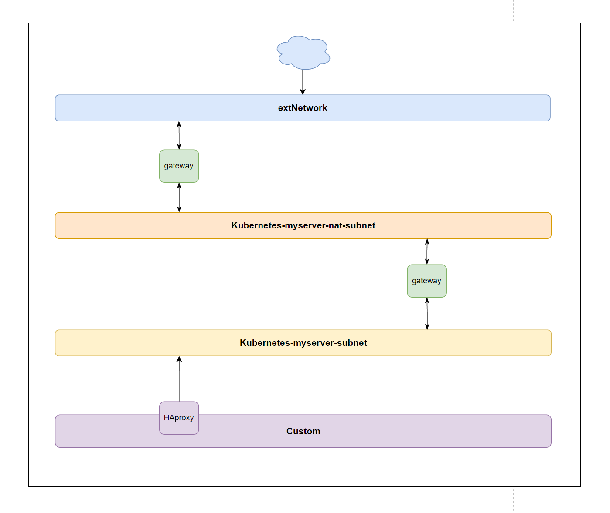

# Kubernetes完整生产环境部署

基于马哥云的k8s完整生产项目部署，包含业务服务，运维保障服务（指标监控，日志采集，链路跟踪），CICD

## 网络划分

| 子网                   | 用途                    | 推荐部署                     | 公网连接 |
| ---------------------- | ----------------------- | ---------------------------- | -------- |
| extNetwork             | 连接外网出口            | NAT Gateway                  | ✅        |
| NAT子网                | 提供内网访问外网服务    | NAT设备                      | ❌        |
| Kubernetes子网         | K8s节点内部服务运行环境 | Kubernetes master/worker节点 | ❌        |
| 内部用户子网（Custom） | 内部用户访问系统        | 用户终端, HAproxy负载均衡    | ❌        |

