## Kubernetes数据存储


**本章内容**

- **存储机制**
- **emptyDir**
- **hostPath**
- **网络共享存储**
- **PV和PVC**
- **StorageClass**
- **CNS的存储方案OpenEBS**


### 数据存储


#### 存储机制

Container 中的文件在磁盘上是临时存放的，这给 Container 中运行的较重要的应用程序带来一些问题。

- 当容器崩溃时。 kubelet 可能会重新创建容器，可能会导致容器漂移至新的宿主机，容器会以干净的状态重建。导致数据丢失
- 在同一 Pod 中运行多个容器需要共享数据


Kubernetes 卷（Volume） 这一抽象概念能够解决这两个问题


Kubernetes 集群中的容器数据存储

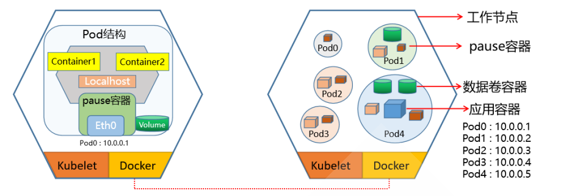


**Kubernetes支持的存储类型**

Kubernetes支持丰富的存储类型，可以分为树内和树外两种


**树内 In-Tree 存储卷插件**

| 类型         | 举例                                                         |
| ------------ | ------------------------------------------------------------ |
| 临时存储卷   | emptyDir                                                     |
| 本地数据卷   | hostPath、local                                              |
| 文件系统     | NFS、CephFS、GlusterFS、fastdfs、Cinder、gitRepo(DEPRECATED) |
| 块设备       | iSCSI、FC、rdb(块设备)、vSphereVolume                        |
| 存储平台     | Quobyte、PortworxVolume、StorageOS、ScaleIO                  |
| 云存储数据卷 | Aliyun OSS、Amazon S3、AWS Elastic Block Store、Google gcePersistentDisk等 |
| 特殊存储卷   | ConfigMap、Secret、DownwardAPI、Projectd、flocker            |


**树外 Out-of_Tree 存储卷插件**

经由**容器存储接口CSI**或**FlexVolume接口（已淘汰）**扩展出的外部的存储系统称为Out-of-Trec类的存储插件


- **CSI 插件**

  - Container Storage Interface 是当前Kubernetes社区推荐的插件实现方案
  - CSI 不仅支持Kubernetes平台存储插件接口，而且也作为云原生生态中容器存储接口的标准,公用 云对其有更好的支持
  - Kubernetes 支持 CSI 的接口方式实现更大范围的存储功能扩展,更为推荐使用

  ```bash
  https://github.com/container-storage-interface/spec/blob/master/spec.md
  ```

  

CSI 主要包含两个部分：**CSI Controller Server** 与 **CSI Node Server**，分别对应**Controller Server Pod**和 **Node Server Pod**


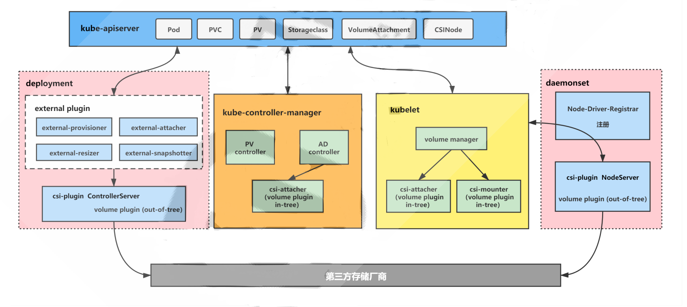

- **Controller Server**
  - 也称为CSI Controller
  - 在集群中只需要部署一个 Controller Server，以 deployment 或者 StatefulSet 的形式运行
  - 主要负责与存储服务API通信完成后端存储的管理操作，比如 provision 和 attach 工作。


- **Node Server**
  - 也称为CSI Node 或 Node Plugin
  - 保证每一个节点会有一个 Pod 部署出来，负责在节点级别完成存储卷管理，和 CSI Controller 一起 完成 volume 的 mount 操作。
  - Node Server Pod 是个 DaemonSet，它会在每个节点上进行注册。
  - Kubelet 会直接通过 Socket 的方式直接和 CSI Node Server 进行通信、调用 Attach/Detach/Mount/Unmount 等。


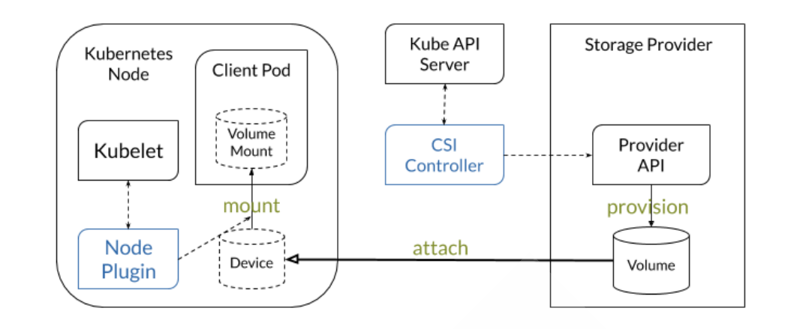


**CSI 插件包括以下两部分**

- **CSI-Plugin**:实现数据卷的挂载、卸载功能。
- **CSI-Provisioner**: 制备器（Provisioner）实现数据卷的自动创建管理能力，即驱动程序，比如: 支 持云盘、NAS等存储卷创建能力


**Kubernetes 存储架构**

存储的组件主要有：attach/detach controller、pv controller、volume manager、volume plugins、 scheduler

每个组件分工明确

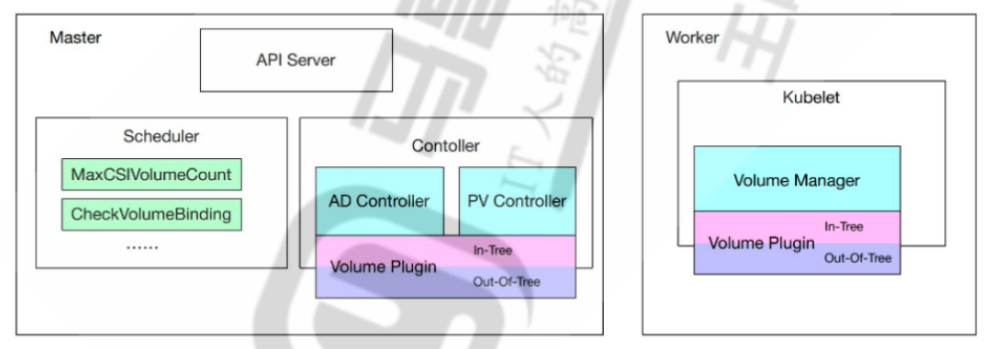

- **AD控制器**：负责存储设备的Attach/Detach操作
  - Attach：将设备附加到目标节点
  - Detach：将设备从目标节点上卸载
- **Volume Manager**：存储卷管理器，负责完成卷的Mount/Umount操作，以及设备的格式化操作等
- **PV Controller** ：负责PV/PVC的绑定、生命周期管理，以及存储卷的Provision/Delete操作
- **volume plugins**：包含k8s原生的和各厂商的的存储插件，扩展各种存储类型的卷管理能力
  - 原生的包括：emptydir、hostpath、csi等
  - 各厂商的包括：aws-ebs、azure等
- scheduler：实现Pod的调度，涉及到volume的调度。比如ebs、csi关于单node最大可attach磁盘 数量的predicate策略，scheduler的调度至哪个指定目标节点也会受到存储插件的影响


### Pod的存储卷Volume

Kubernetes 支持在Pod上创建不同类型的任意数量的卷来实现不同数据的存储


**单节点存储**

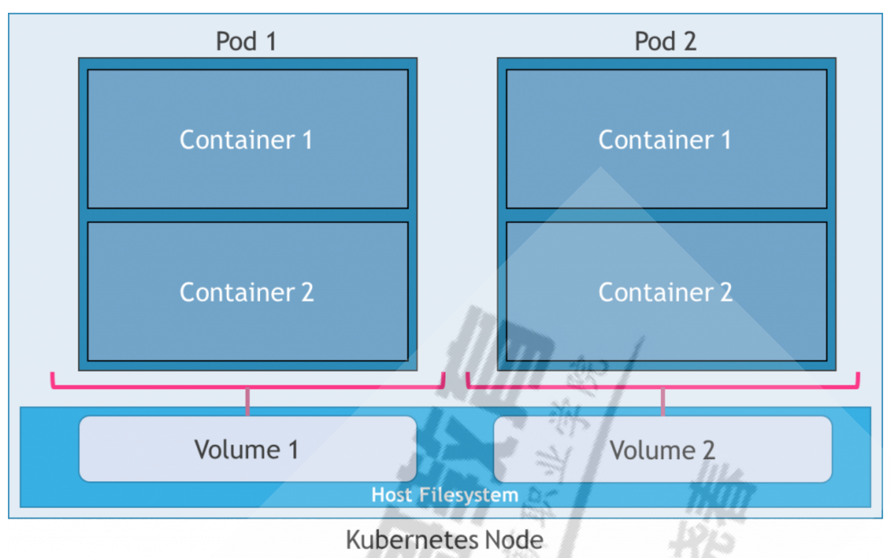


**多节点存储**

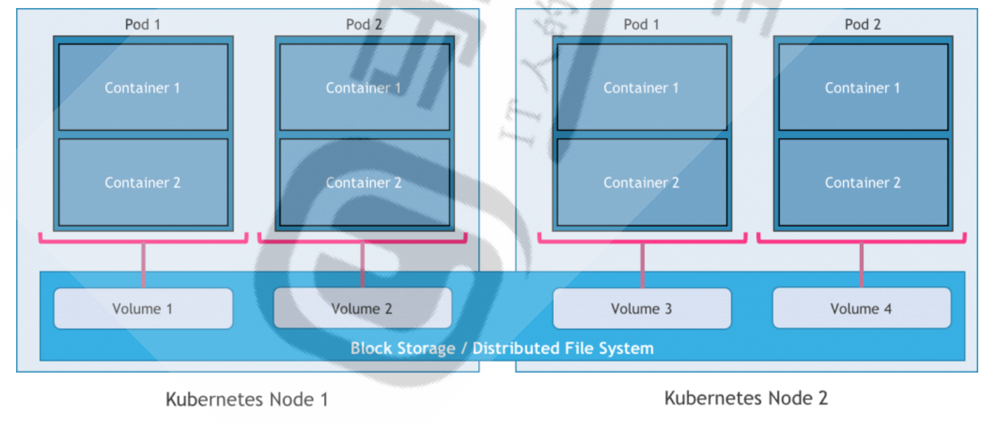


存储卷本质上表现为 Pod中**所有容器共享访问的目录**

而此目录的创建方式、使用的存储介质以及目录的初始内容是由Pod规范中声明的存储卷类型来源决定

**kubelet内置支持多种存储卷插件**，**存储卷是由各种存储插件(存储驱动)来提供存储服务**

存储卷插件(存储驱动)决定了支持的后端存储介质或存储服务，例如hostPath插件使用宿主机文件系 统，而nfs插件则对接指定的NFS存储服务等

Pod在规范中需要指定其包含的卷以及这些卷在容器中的挂载路径

**存储卷需要定义在指定的Pod之上**

有些卷本身的生命周期与Pod相同，但其后端的存储及相关数据的生命周期通常要取决于存储介质


存储卷可以分为：**临时卷和持久卷**

- **临时卷类型**的生命周期与 Pod 相同， 当 Pod 不再存在时，Kubernetes 也会销毁临时卷
- 持久卷可以比 Pod 的存活期长。当 Pod 不再存在时，Kubernetes 不会销毁持久卷。
- 但对于给定 Pod 中任何类型的卷，在容器重启期间数据都不会丢失。


#### Pod中卷的使用

- 一个Pod可以添加任意个卷
- 同一个Pod内每个容器可以在不同位置按需挂载Pod上的任意个卷，或者不挂载任何卷
- 同一个Pod上的某个卷，也可以同时被该Pod内的多个容器同时挂载，以共享数据
- 如果支持，多个Pod也可以通过卷接口访问同一个后端存储单元

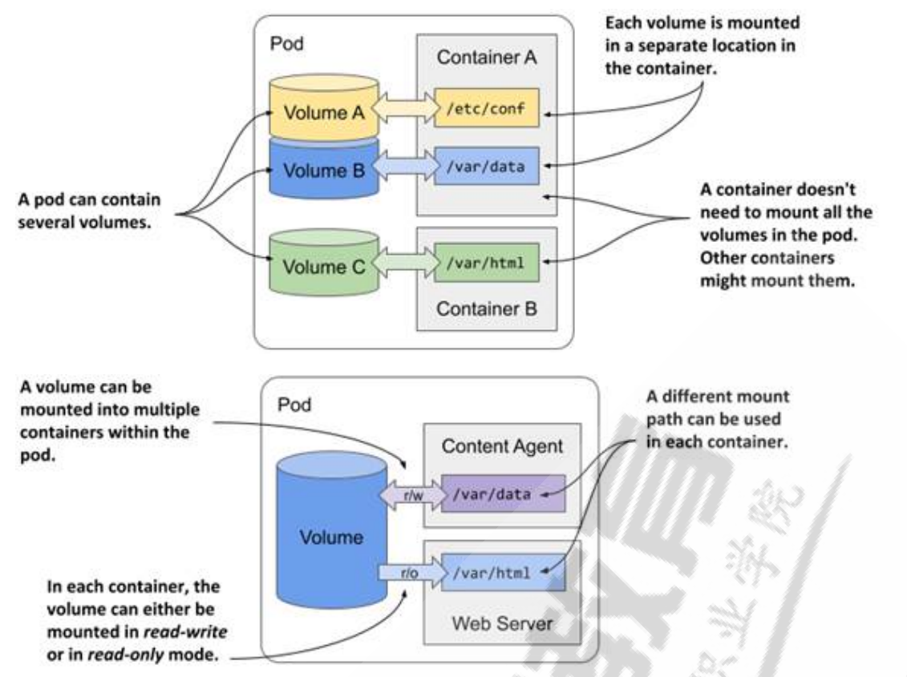


**存储卷的配置由两部分组成**

- 通过.spec.volumes字段定义在Pod之上的存储卷列表，它经由特定的存储卷插件并结合特定的存储供给方的访问接口进行定义
- 嵌套定义在容器的volumeMounts字段上的存储卷挂载列表，它只能挂载当前Pod对象中定义的存储卷


**Pod 内部容器使用存储卷有两步：**

- 在Pod上定义存储卷，并关联至目标存储服务上 **volumes**
  - **定义卷**
- 在需要用到存储卷的容器上，挂载其所属的Pod中pause的存储卷 **volumesMount**
  - **引用卷**


**容器引擎对共享式存储设备的支持类型：**

- **单路读写** - 多个容器内可以通过同一个中间容器对同一个存储设备进行读写操作
- **多路并行读写** - 多个容器内可以同时对同一个存储设备进行读写操作
- **多路只读** - 多个容器内可以同时对同一个存储设备进行只读操作


**Pod的卷资源对象属性**

```yaml
apiVersion: v1
kind: Pod
metadata:
  name: <string>
  namespace: <string>
spec:
  volumes:                       # 定义卷
  - name: <string>               # 存储卷名称标识，仅可使用DNS标签格式的字符，在当前Pod必须唯一
    VOL_TYPE: <Object>           # 存储卷插件及具体的目标存储供给方的相关配置
  containers:
  - name: ...
    image: ...
    volumeMounts:                # 挂载卷
    - name: <string>             # 要挂载的存储卷的名称，必须匹配存储卷列表中某项的定义
      mountPath: <string>        # 容器文件系统上的挂载点路径
      readOnly: <boolean>        # 是否挂载为只读模式，默认为"否"，即可读可写
      subPath: <string>          # 挂载存储卷上的一个子目录至指定挂载点
      subPathExpr: <string>      # 挂载有指定的模式匹配到的存储卷的文件或目录至挂载点
```


### emptyDir

一个emptyDir volume在pod被调度到某个Node时候自动创建的，无需指定宿主机上对应的目录。 适用于在一个**Pod中不同容器间的临时数据的共享**


**emptyDir 数据存放在宿主机的路径如下**

```bash
/var/lib/kubelet/pods/<pod_id>/volumes/kubernetes.io~empty-dir/<volume_name>/<FILE>

#注意：此目录随着Pod删除，也会随之删除，不能实现持久化

# 查看pod所在节点
[root@master1 pods]#kubectl get pods -o wide
NAME                     READY   STATUS    RESTARTS        AGE   IP             NODE    NOMINATED NODE   READINESS GATES
myweb-565cb68445-btlj8   1/1     Running   1 (7h25m ago)   24h   10.244.2.56    node2   <none>           <none>
myweb-565cb68445-c8drb   1/1     Running   1 (7h26m ago)   24h   10.244.1.104   node1   <none>           <none>
myweb-565cb68445-lj7bq   1/1     Running   1 (7h25m ago)   24h   10.244.3.111   node3   <none>           <none>

# 查看pod节点上emptyDir数据存放的路径
[root@master1 pods]#ssh 10.0.0.203 ls /var/lib/kubelet/pods/
242cc64b-4330-4c00-ba80-9228f2186367
4a737c21-36e2-413d-a53f-ce65b9b4698e
9fe61621-a076-4d35-add9-c329ca6b12db
eed8a3fa-73e0-4a1e-b897-4235d77cae66

# 查看对应的pod的uid
[root@master1 pods]#kubectl get pod myweb-565cb68445-btlj8 -o yaml|grep -i uid
    uid: 4db8879a-ee0d-48d3-8b7e-675581eb4fa2
  uid: eed8a3fa-73e0-4a1e-b897-4235d77cae66      # -------- 匹配上面的路径uid
```


**emptyDir 特点如下：**

- 此为**默认存储类型**
- 此方式只能临时存放数据，不能实现数据持久化
- 跟随Pod初始化而来，开始是空数据卷
- Pod 被删除，emptyDir对应的宿主机目录也被删除，当然目录内的数据随之永久消除
- emptyDir 数据卷介质种类跟当前主机的磁盘一样。
- emptyDir 主机可以为同一个Pod内多个容器共享
- emptyDir 容器数据的临时存储目录主要用于数据缓存和**同一个Pod内的多个容器共享使用**


**emptyDir属性解析**

```bash
kubectl explain pod.spec.volumes.emptyDir
    medium       # 指定媒介类型，主要有default和memory两种
                 # 默认情况下，emptyDir卷支持节点上的任何介质，SSD、磁盘或网络存储，具体取决于自身所在Node的环境
                 # 将字段设置为Memory，让K8S使用tmpfs，虽然tmpfs快，但是Pod重启时，数据会被清除，并且设置的大小会被计入                    # Container的内存限制当中
    sizeLimit    # 当前存储卷的空闲限制，默认值为nil表示不限制
    
kubectl explain pod.spec.containers.volumeMounts
    mountPath    # 挂载到容器中的路径,此目录会自动生成
    name         # 指定挂载的volumes名称
    readOnly     # 是否只读挂载
    subPath      # 是否挂载子目录的路径,默认不挂载子目录
```


**配置示例**

```yaml
# volume配置格式
volumes:
- name: volume_name
  emptyDir: {}
  
# volume使用格式
containers:
- volumeMounts:
  - name: volume_name
    mountPath: /path/to/container/  # 容器内路径


# 示例1
apiVersion: v1
kind: Pod
metadata:
  name: test-pod
spec:
  containers:
  - image: registry.k8s.io/test-webserver
    name: test-container
    volumeMounts:
    - mountPath: /cache
      name: cache-volume
  volumes:
  - name: cache-volume
    emptyDir: {}
    
# 示例2：
apiVersion: v1
kind: Pod
metadata:
  name: test-pd
spec:
  containers:
  - image: registry.k8s.io/test-webserver
    name: test-container
    volumeMounts:
    - mountPath: /cache
      name: cache-volume
  volumes:
  - name: cache-volume
    emptyDir:
      medium: Memory
      sizeLimit: 500Mi
```


范例：在一个Pod中定义多个容器通过emptyDir共享数据

```yaml
[root@master1 storage] # vim storage-emptydir-2.yaml
apiVersion: v1
kind: Pod
metadata:
  name: storage-emptydir
spec:
  volumes:
  - name: nginx-data
    emptyDir: {}
  containers:
  - name: storage-emptydir-nginx
    image: registry.cn-beijing.aliyuncs.com/wangxiaochun/nginx:1.20.0
    volumeMounts:
    - name: nginx-data
      mountPath: /usr/share/nginx/html/
  - name: storage-emptydir-busybox
    image: registry.cn-beijing.aliyuncs.com/wangxiaochun/busybox:1.32.0
    volumeMounts:
    - name: nginx-data
      mountPath: /data/
    command:
    - "/bin/sh"
    - "-c"
    - "while true; do date > /data/index.html; sleep 1; done"

# 应用
[root@master1 storage]#kubectl apply -f storage-emptydir-2.yaml 
pod/storage-emptydir created

# 查看Pod
[root@master1 storage] # kubectl get pod -o wide
NAME                     READY   STATUS              RESTARTS      AGE   IP             NODE    NOMINATED NODE   READINESS GATES
myweb-565cb68445-btlj8   1/1     Running             1 (11h ago)   27h   10.244.2.56    node2   <none>           <none>
myweb-565cb68445-c8drb   1/1     Running             1 (11h ago)   27h   10.244.1.104   node1   <none>           <none>
myweb-565cb68445-lj7bq   1/1     Running             1 (11h ago)   27h   10.244.3.111   node3   <none>           <none>
storage-emptydir         0/2     ContainerCreating   0             9s    <none>         node2   <none>           <none>

# 查看Pod的网络IP
[root@master1 storage] # kubectl get pod -o wide
NAME                     READY   STATUS    RESTARTS      AGE   IP             NODE    NOMINATED NODE   READINESS GATES
myweb-565cb68445-btlj8   1/1     Running   1 (11h ago)   27h   10.244.2.56    node2   <none>           <none>
myweb-565cb68445-c8drb   1/1     Running   1 (11h ago)   27h   10.244.1.104   node1   <none>           <none>
myweb-565cb68445-lj7bq   1/1     Running   1 (11h ago)   27h   10.244.3.111   node3   <none>           <none>
storage-emptydir         2/2     Running   0             14s   10.244.2.59    node2   <none>           <none>

# 测试效果
[root@master1 storage] #curl 10.244.2.59
Wed Dec 25 12:05:05 UTC 2024
[root@master1 storage] #curl 10.244.2.59
Wed Dec 25 12:05:06 UTC 2024
[root@master1 storage] #curl 10.244.2.59
Wed Dec 25 12:05:07 UTC 2024
[root@master1 storage] #curl 10.244.2.59
Wed Dec 25 12:05:08 UTC 2024
[root@master1 storage] #curl 10.244.2.59
Wed Dec 25 12:05:08 UTC 2024
```


### hostPath

hostPath 可以将**宿主机上的目录**挂载到 Pod 中作为数据的存储目录


**hostPath 一般用在如下场景：**

- 容器应用程序中某些文件需要永久保存

- Pod删除，hostPath数据对应在宿主机文件不受影响,即hostPath的生命周期和Pod不同,而和节点相同
- **宿主机和容器的目录都会自动创建**
- 某些容器应用需要用到容器的自身的内部数据，可将宿主机的/var/lib/[docker|containerd]挂载到 Pod中


**hostPath 使用注意事项：**

- 不同宿主机的目录和文件内容不一定完全相同，所以Pod迁移前后的访问效果不一样
- 不适合Deployment这种分布式的资源，更适合于DaemonSet
- 宿主机的目录不属于独立的资源对象的资源，所以**对资源设置的资源配额限制对hostPath目录无效**


**配置属性**

```bash
# 配置属性
kubectl explain pod.spec.volumes.hostPath
path                         # 指定哪个宿主机的目录或文件被共享给Pod使用
type                         # 指定路径的类型，一共有7种，默认的类型是没有指定
     空字符串                 # 默认配置，在关联hostPath存储卷之前不进行任何检查，如果宿主机没有对应的目录，会自动创建
     DirectoryCreate         # 宿主机上不存在，创建此0755权限的空目录，属主属组均为kubelet
     Directory               # 必须存在，挂载已存在目录
     FileOrCreate            # 宿主机上不存在挂载文件，就创建0644权限的空文件，属主属组均为kubelet
     File                    # 必须存在文件
     Socket                  # 事先必须存在Socket文件路径
     CharDevice              # 事先必须存在的字符设备文件路径
     BlockDevice             # 事先必须存在的块设备文件路径
     
     
# 配置格式：
  volumes:
  - name: volume_name
    hostPath:
      path: /path/to/host
      
# 示例：
apiVersion: v1
kind: Pod
metadata:
  name: test-pod
  spec:
    containers:
    - image: registry.k8s.io/test-webserver
      name: test-container
      volumeMounts:
      - mountPath: /test-pod
        name: test-volume
    volumes:
    - name: test-volume
      hostPath:
        path: /data           # 宿主机上目录位置
        type: Directory       # 此字段为可选
```


范例：使用你主机的时区配置

```yaml
[root@master1 storage] # vim storage-hostpath-timezone.yaml
apiVersion: v1
kind: Pod
metadata:
  name: pod-hostpath-timezone
spec:
  volumes:
  - name: timezone
    hostPath:
      path: /etc/timezone        # 此文件是影响时区
      type: File
  - name: localtime              # 此文件挂载失败，不影响时区
    hostPath:
      path: /etc/localtime
      type: File
  containers:
  - name: c01
    image: registry.cn-beijing.aliyuncs.com/wangxiaochun/nginx:1.20.0
    command: ["sh", "-c", "sleep 3600"]
  - name: c02
    image: registry.cn-beijing.aliyuncs.com/wangxiaochun/nginx:1.20.0
    command: ["sh", "-c", "sleep 3600"]
    volumeMounts:
    - name: timezone
      mountPath: /etc/timezone    # 容器此为文件是普通文件， 挂载节点目录成功
    - name: localtime
      mountPath: /etc/localtime   # 容器此为文件是软连接， 挂载节点目录失败

# 应用
[root@master1 storage] # kubectl apply -f storage-hostpath-timezone.yaml 
pod/pod-hostpath-timezone created

# 查看Pod
[root@master1 storage]#kubectl get pod
NAME                     READY   STATUS    RESTARTS      AGE
pod-hostpath-timezone    2/2     Running   0             3s

# 测试效果
[root@master1 storage] # kubectl exec pod-hostpath-timezone -c c01 -- date
Wed Dec 25 13:19:40 UTC 2024
[root@master1 storage] # kubectl exec pod-hostpath-timezone -c c02 -- date
Wed Dec 25 21:19:46 CST 2024

[root@master1 storage] # kubectl exec pod-hostpath-timezone -c c01 -- cat /etc/timezone
Etc/UTC
[root@master1 storage] # kubectl exec pod-hostpath-timezone -c c02 -- cat /etc/timezone
Asia/Shanghai
```


**范例：实现NFS服务**

```yaml
[root@master1 storage ]# cat storage-nfs-server.yaml
---
apiVersion: v1
kind: Service
metadata:
  name: nfs-server
  labels:
    app: nfs-server
spec:
  type: ClusterIP
  selector: 
    app: nfs-server
  ports:
    - name: tcp-2049            # 未显示指定tartPort，默认和port一致
      port: 2049
      protocol: TCP
    - name: udp-111
      port: 111
      protocol: UDP
---
apiVersion: apps/v1
kind: Deployment
metadata:
  name: nfs-server
spec:
  replicas: 1
  selector:
    matchLabels:
      app: nfs-server
  template:
    metadata:
      name: nfs-server
      labels:
        app: nfs-server
    spec:
      nodeSelector:
        "kubernetes.io/os": linux
        "server": nfs
      containers:
      - name: nfs-server
        image: registry.cn-beijing.aliyuncs.com/wangxiaochun/nfs-server-alpine:12
        env:
        - name: SHARED_DIRECTORY
          value: "/exports"
        volumeMounts:
        - mountPath: /exports
          name: nfs-vol
        securityContext:
          privileged: true
        ports:                       # 声明性说明，无直接功能，除非Service配置了targetPort匹配这些端口
        - name: tcp-2049
          containerPort: 2049
          protocol: TCP
        - name: udp-111
          containerPort: 111
          protocol: UDP
      volumes:
      - name: nfs-vol
        hostPath:
          path: /nfs-vol
          type: DirectoryOrCreate
```


### 网络共享存储

和传统的方式一样, 通过 NFS 网络文件系统可以实现Kubernetes数据的网络存储共享

使用NFS提供的共享目录存储数据时，需要在系统中部署一个NFS环境，通过volume的配置，实现pod 内的容器间共享NFS目录。


**属性解析**

```bash
# 配置属性
kubectl explain pod.spec.volumes.nfs
server                                     #指定nfs服务器的地址
path                                       #指定nfs服务器暴露的共享地址
readOnly                                   #是否只能读，默认false

#配置格式：
 volumes:
  - name: <卷名称>
   nfs:
     server: nfs_server_address           #指定NFS服务器地址
     path: "共享目录"                      #指定NFS共享目录
     readOnly: false                      #指定权限

# 示例
apiVersion: v1
kind: Pod
metadata:
 name: test-pd
spec:
 containers:
  - image: registry.k8s.io/test-webserver
   name: test-container
   volumeMounts:
    - mountPath: /my-nfs-data
     name: test-volume
 volumes:
  - name: test-volume
   nfs:
     server: my-nfs-server.example.com
     path: /my-nfs-volume
     readonly: true
```


范例：使用集群外的NFS存储

```bash
#NFS服务器软件安装,10.0.0.131
[root@nfs ~]#apt update && apt install -y nfs-kernel-server 或者 nfs-server

#配置共享目录
[root@nfs ~]#mkdir /nfs-data
[root@nfs ~]#echo '/nfs-data *(rw,all_squash,anonuid=0,anongid=0)' >> /etc/exports

#重启服务
[root@nfs ~]#exportfs -r
[root@nfs ~]#exportfs -v

# 在所有kubernetes的worker节点充当NFS客户端，都需要安装NFS客户端软件
[root@node1 ~]#apt update && apt -y install nfs-common 或者 nfs-client
[root@node2 ~]#apt update && apt -y install nfs-common 或者 nfs-client
[root@node3 ~]#apt update && apt -y install nfs-common 或者 nfs-client

#测试访问
[root@node1 ~]#showmount -e 10.0.0.131
Export list for 10.0.0.101:
/nfs-data *

#编写资源配置文件
[root@master1 storage]#cat storage-nfs-1.yaml
apiVersion: v1
kind: Namespace
metadata:
  name: storage

---
apiVersion: apps/v1
kind: Deployment
metadata:
  name: nginx-nfs
  namespace: storage
  labels:
    app: nginx-nfs
spec:
  replicas: 3
  selector:
    matchLabels:
      app: nginx-nfs
  template:
    metadata:
      labels:
        app: nginx-nfs
    spec:
      volumes:
      - name: html
        nfs:
          server: nfs.mystical.org
          path: /nfs-data/nginx
      containers:
      - image: registry.cn-beijing.aliyuncs.com/wangxiaochun/nginx:1.20.0
        name: nginx
        volumeMounts:
        - name: html
          mountPath: /usr/share/nginx/html
          
# 注意：nfs中的域名解析，使用的式Node上的DNS，而不是COREDNS，所以需要在Node节点上将DNS指向私有DNS
```


### **PV和PVC**

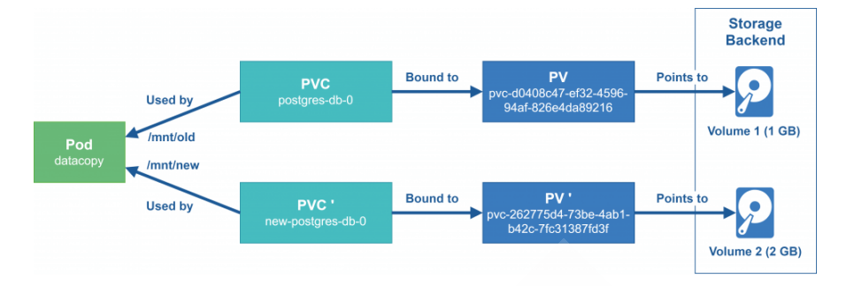

#### PV-Persistent-Volume定义

工作中的存储资源一般都是独立于Pod的，将之称为资源对象Persistent Volume(PV)，是由管理员设置的存储，它是kubernetes集群的一部分，PV 是 Volume 之类的卷插件，**但具有独立于使用 PV 的 Pod  的生命周期**


**Persistent Volume 跟 Volume类似，区别就是：**

- PV 是集群级别的资源，负责将存储空间引入到集群中，通常由管理员定义
- PV 就是Kubernetes集群中的网络存储，不属于Namespace、Node、Pod等资源，但可以被它们访问
- **PV 属于Kubernetes 整个集群,即可以被所有集群的Pod访问**
- **PV是独立的网络存储资源对象，有自己的生命周期**
- PV 支持很多种volume类型,PV对象可以有很多常见的类型：本地磁盘、NFS、分布式文件系统...


**PV持久卷的类型**

PV持久卷是用插件的形式来实现的。Kubernetes目前支持一下插件：

- **cephfs** - CephFS volume
- **csi** - 容器存储接口（CSI）
- **fc** - Fibre Channel（FC）存储
- **hostPath** - HostPath卷（仅供单节点测试使用，不适用于多节点集群；请尝试使用lcoal作为替代）
- **iscsi** = iSCSI（SCSI over IP）存储
- **local** - 节点上挂载的本地存储设备
- **nfs** - 网络文件系统（NFS）存储
- **rbd** - Rados块设备（RBD）卷


#### PVC-Persistent-Volume-Claim定义

Persistent Volume Claim(PVC) 是一个网络存储服务的**请求**。

**PVC 属于名称空间级别的资源**，只能被同一个名称空间的Pod引用

由用户定义，用于在空闲的PV中申请使用符合过滤条件的PV之一，与选定的PV是“一对一”的关系

用户在Pod上**通过pvc插件**请求绑定使用定义好的PVC资源

Pod能够申请特定的CPU和MEM资源，但是Pod只能通过PVC到PV上请求一块独立大小的网络存储空 间，而PVC 可以动态的根据用户请求去申请PV资源，不仅仅涉及到存储空间，还有对应资源的访问模 式，对于真正使用存储的用户不需要关心底层的存储实现细节，只需要直接使用 PVC 即可。


#### Pod、PV、PVC 关系

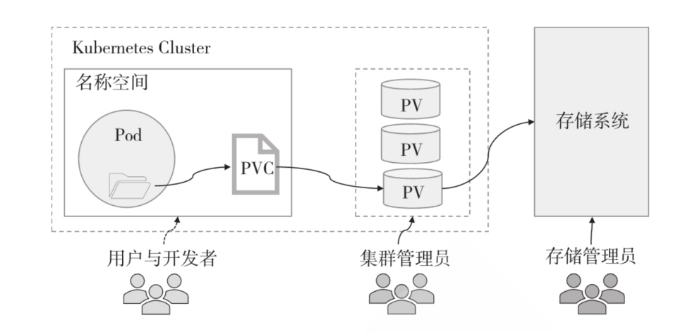


**前提：**

- 存储管理员配置各种类型的PV对象
- Pod、PVC 必须在同一个命名空间


**用户需要存储资源的时候：**

- 用户根据资源需求创建PVC，由PVC自动匹配(权限、容量)合适的PV对象
- PVC 允许用户按需指定期望的存储特性，并以之为条件，按特定的条件顺序进行PV的过滤 
  - VolumeMode → LabelSelector → StorageClassName → AccessMode → Size 
- 在Pod内部通过 PVC 将 PV 绑定到当前的空间，进行使用
- 如果用户不再使用存储资源，解绑 PVC 和 Pod 即可


**PV和PVC的生命周期**

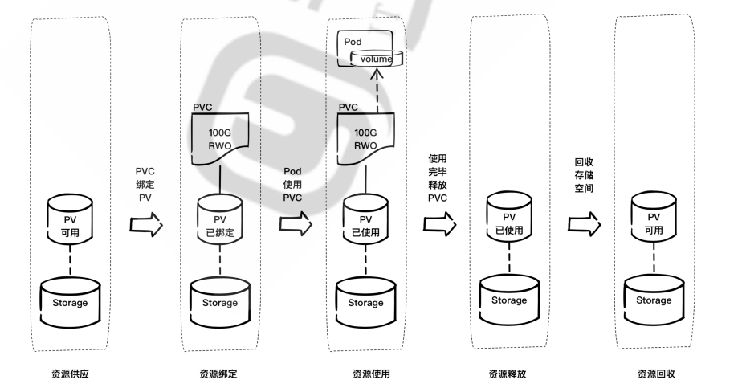


**PV和PVC的配置流程**

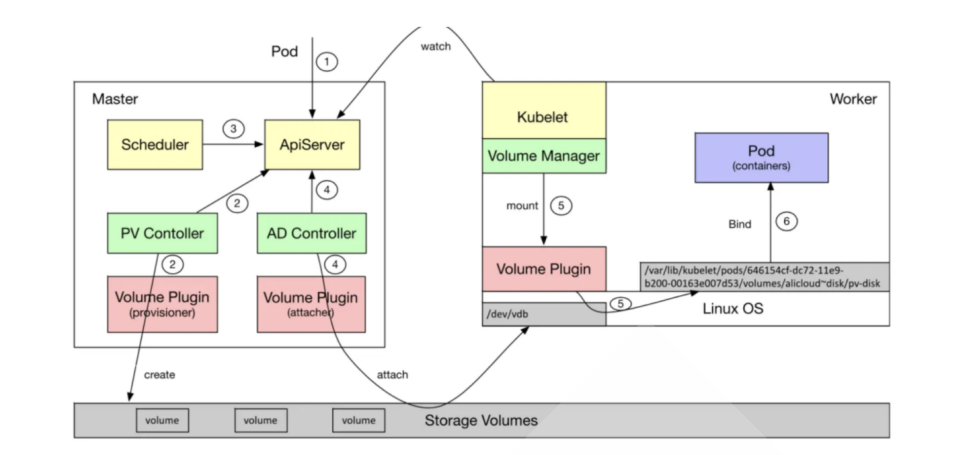


- 用户创建了一个包含 PVC 的 Pod，该 PVC 要求使用动态存储卷
- Scheduler 根据 Pod 配置、节点状态、PV 配置等信息，把 Pod 调度到一个合适的 Worker 节点上
- PV 控制器 watch 到该 Pod 使用的 PVC 处于 Pending 状态，于是调用 Volume Plugin(in-tree)创 建存储卷，并创建 PV 对象(out-of-tree 由 External Provisioner 来处理)
- AD 控制器发现 Pod 和 PVC 处于待挂接状态，于是调用 Volume Plugin 挂接存储设备到目标 Worker 节点上
- 在 Worker 节点上，Kubelet 中的 Volume Manager 等待存储设备挂接完成，并通过 Volume  Plugin 将设备挂载到全局目录：**/var/lib/kubelet/pods/[pod_uid]/volumes/kubernetes.io~iscsi/[PVname] (以iscsi为例)**
- Kubelet 通过 Docker 启动 Pod 的 Containers，用 bind mount 方式将已挂载到本地全局目录的卷 映射到容器中


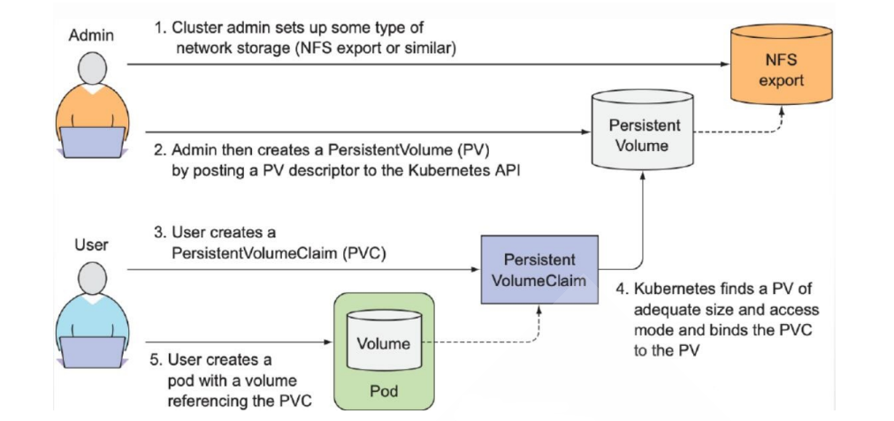


#### PV和PVC管理

**PV的Provison 置备（创建）方法**

- **静态**：集群管理员预先手动创建一些 PV。它们带有可供群集用户使用的实际存储的细节
- **动态**：集群尝试根据用户请求动态地自动完成创建卷。此配置基于 StorageClasses：PVC 必须请 求存储类，并且管理员必须预先创建并配置该 StorageClasses才能进行动态创建。声明该类为空字 符串 ""， 可以有效地禁用其动态配置。


##### PV属性

```bash
# PV作为存储资源，主要包括存储能力，访问模式，存储类型，回收策略等关键信息，注意：PV的名称不支持大写
kubectl explain pv.spec
    capacity                            # 定义pv使用多少资源，仅限于空间的设定
    accessModes                         # 访问模式,支持单路读写，多路读写，多路只读，单Pod读写，可同时支持多种模式
    volumeMode                          # 文件系统或块设备,默认文件系统
    mountOptions                        # 挂载选项,比如:["ro", "soft"]    
    persistentVolumeReclaimPolicy       # 资源回收策略，主要三种Retain、Delete、Recycle 
    storageClassName                    # 存储类的名称,如果配置必须和PVC的storageClassName相同才能绑定
    
#注意:PersistentVolume 对象的名称必须是合法的 DNS 子域名

# 示例
apiVersion: v1
kind: PersistentVolume
metadata:
  name: pv0003
  labels:
    release: "stable"    # 便签可以支持匹配过滤PVC
spec:
  capacity:
    storage: 5Gi
  volumeMode: Filesystem
  accessModes:
    - ReadWriteOnce
  persistentVolumeReclaimPolicy: Recycle
  storageClassName: slow  # 必须和PVC相同
  mountOptions:
    - hard
    - nfsvers=4.1
  nfs:
    path: /tmp
    server: 172.17.0.2  
```


##### PVC属性

```bash
#PVC属性信息,与所有空间都能使用的PV不一样，PVC是属于名称空间级别的资源对象，即只有特定的资源才能使用
kubectl explain pvc.spec
    accessModes            # 访问模式  
    resources              # 资源限制
    volumeMode             # 后端存储卷的模式,文件系统或块,默认为文件系统
    volumeName             # 指定绑定的卷(pv)的名称

kubectl explain pod.spec.volumes.persistentVolumeClaim
    claimName              # 定义pvc的名称,PersistentVolumeClaim 对象的名称必须是合法的 DNS 子域名
    readOnly               # 设定pvc是否只读
    storageClassName       # 存储类的名称,如果配置必须和PV的storageClassName相同才能绑定
    selector                # 标签选择器实现选择绑定PV
    
# storageClassName类
PVC可以通过为storageClassName属性设置StorageClass的名称来请求特定的存储类。只有所请求的类的PV的StorageClass值与PVC设置相同，才能绑定

# selector选择算符
PVC可以设置标签选择算符,来进一步过滤卷集合。只有标签与选择算符相匹配的卷能够绑定到PVC上。选择算符包含两个字段：

matchLabels - 卷必须包含带有此值的标签
 
matchExpressions - 通过设定键（key）、值列表和操作符（operator） 来构造的需求。合法的操作符
有 In、NotIn、Exists 和 DoesNotExist。
来自 matchLabels 和 matchExpressions 的所有需求都按逻辑与的方式组合在一起。 这些需求都必须被满足才被视为匹配。

# 示例：
apiVersion: v1
kind: PersistentVolumeClaim
metadata:
  name: myclaim
spec:
  accessModes:
  - ReadWriteOnce
  volumeMode: Filesystem
  resources:
    requests:
      storage: 8Gi
  storageClassName: slow  # 必须和PV相同
  selector：
    matchLabels:
      release: "stable"
    matchExpressions:
    - {key: environment, operator: In, values: [dev]}
```


##### 属性进阶

**PV状态**

PV 有生命周期,自然也有自己特定的状态

注意：这个过程是单向过程，不能逆向


| 状态       | 解析                                                  |
| ---------- | ----------------------------------------------------- |
| Availabled | 空闲状态，表示PV没有被其他PVC对象使用                 |
| Bound      | 绑定状态，表示PV已经被其他PVC对象使用                 |
| Released   | 未回收状态，表示PVC已经被删除了，但是资源还没有被回收 |
| Faild      | 资源回收失败                                          |


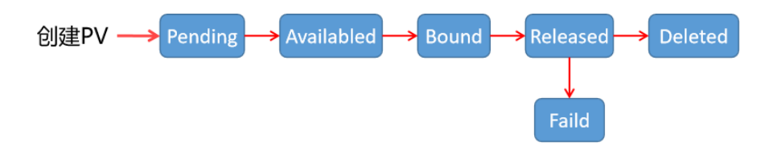


**AccessMode 访问模式**

AccessModes 是用来对 PV 进行访问模式的设置，用于描述用户应用对存储资源的访问权限，访问权限包括

| 类型                   | 解析                                                         |
| ---------------------- | ------------------------------------------------------------ |
| ReadWriteOnce（RWO）   | 单节点读写,卷可以被一个节点以读写方式挂载。 <br />ReadWriteOnce 访问模式仍然可以在同一节点上运行的多个 Pod <br />访问该卷即不支持并行(非并发)写入 |
| ReadOnlyMany（ROX）    | 多节点只读                                                   |
| ReadWriteMany（RWX）   | 多节点读写                                                   |
| ReadWriteOncePod(RWOP) | 卷可以被单个 Pod 以读写方式挂载。 如果你想确保整个集群中只 有一个 Pod 可以读取或写入该 PVC， 请使用 ReadWriteOncePod 访问模式。单Pod读写,v1.22版以后才支 持,v1.29版stable可用 |


注意：

- 不同的后端存储支持不同的访问模式，所以要根据后端存储类型来设置访问模式。
- 一些 PV 可能支持多种访问模式，但是在挂载的时候只能使用一种访问模式，多种访问模式是不会 生效的


**PV资源回收策略**

PV 三种资源回收策略

当 Pod 结束 volume 后可以回收资源对象删除PVC，而绑定关系就不存在了，当绑定关系不存在后这个 PV需要怎么处理，而PersistentVolume 的回收策略告诉集群在存储卷声明释放后应如何处理该PV卷。 目前，volume 的处理策略有保留、回收或删除。

当PVC被删除后, Kubernetes 会自动生成一个recycler-for-的Pod实现回收工作,但Retain策 略除外

回收完成后,PV的状态变为Availabled,如果其它处于Pending状态的PVC和此PV条件匹配,则可以再次此 PV进行绑定

| 类型    | 解析                                                         |
| ------- | ------------------------------------------------------------ |
| Retain  | 保留PV和存储空间数据，后续数据的删除需要人工干预，**一般推荐使用此项**，对于**手动创建的PV此为默认值** |
| Delete  | 相关的存储实例PV和数据都一起删除。需要支持删除功能的存储才能实现，**动态存储 一般会默认采用此方式** |
| Recycle | **当前此项已废弃**，保留PV，但清空存储空间的数据，仅支持NFS和hostPath |


##### PV和PVC的使用流程

实现方法

- 准备存储
- 基于存储创建PV
- 根据需求创建PVC: PVC会根据capacity和accessModes及其它条件自动找到相匹配的PV进行绑定, 一个PVC对应一个PV
- 创建Pod
  - 在Pod中的 volumes 指定调用上面创建的 PVC 名称
  - 在Pod中的容器中的volumeMounts指定PVC挂载容器内的目录路径


##### 案例

**PV和PVC使用**

```yaml
[root@master1 storage] # cat storage-mysql-pv-pvc.yaml 
apiVersion: v1
kind: PersistentVolume
metadata:
  name: mysql-pv-volume
  labels:
    type: local
spec:
  storageClassName: manual
  capacity:
    storage: 20Gi
  accessModes:
  - ReadWriteOnce
  hostPath:
    path: "/mnt/data"

---
apiVersion: v1
kind: PersistentVolumeClaim
metadata:
  name: mysql-pv-claim
spec:
  storageClassName: manual
  accessModes:
  - ReadWriteOnce
  resources:
    requests:
      storage: 20Gi

---
apiVersion: v1
kind: Service
metadata:
  name: mysql
spec:
  ports:
  - port: 3306
  selector:
    app: mysql
  clusterIP: None
---
apiVersion: apps/v1
kind: Deployment
metadata:
  name: mysql
spec:
  selector:
    matchLabels:
      app: mysql
  strategy:
    type: Recreate
  template:
    metadata:
      labels:
        app: mysql
    spec:
      containers:
      - image: registry.cn-beijing.aliyuncs.com/wangxiaochun/mysql:8.0.29-oracle
        name: mysql
        env:
        - name: MYSQL_ROOT_PASSWORD
          value: "123456"
        ports:
        - containerPort: 3306
          name: mysql
        volumeMounts:
        - name: mysql-persistent-storage
          mountPath: /var/lib/mysql
      volumes:
      - name: mysql-persistent-storage
        persistentVolumeClaim:
          claimName: mysql-pv-claim

# 安装mysql客户端
[root@master1 storage] #apt install -y mysql-client

# 通过svc域名，解析出mysql的pod的IP
[root@master1 storage]#nslookup mysql.default.svc.cluster.local 10.96.0.10
Server:		10.96.0.10
Address:	10.96.0.10#53

Name:	mysql.default.svc.cluster.local
Address: 10.244.2.73

# 测试访问
[root@master1 storage] # mysql -h10.244.2.73 -p123456 -uroot

# 查看Mysql的Pod所在主机
[root@master1 storage] # kubectl get pod -o wide
NAME                     READY   STATUS    RESTARTS   AGE     IP            NODE    NOMINATED NODE   READINESS GATES
mysql-7ffdfbdf6f-fsv6c   1/1     Running   0          7m34s   10.244.2.73   node2   <none>           <none>

# 查看node2节点的/mnt/data，自动创建/mnt/data目录
[root@node2 ~] # cd /mnt/data/
[root@node2 data]#ls
 auto.cnf        client-cert.pem      ib_logfile0     mysql.sock           sys
 binlog.000001   client-key.pem       ib_logfile1     performance_schema   undo_001
 binlog.000002  '#ib_16384_0.dblwr'   ibtmp1          private_key.pem      undo_002
 binlog.index   '#ib_16384_1.dblwr'  '#innodb_temp'   public_key.pem
 ca-key.pem      ib_buffer_pool       mysql           server-cert.pem
 ca.pem          ibdata1              mysql.ibd       server-key.pem
```


范例：以NFS类型创建一个3G大小的存储资源对象PV

```yaml
# 准备NFS共享存储
[root@master1 ~] #mkdir /nfs-data
[root@master1 ~] #apt -y install nfs-server
[root@master1 ~] #echo "/nfs-data *(rw,no_root_squash)" >> /etc/exports
[root@master1 ~] #exportfs -r
[root@master1 ~] #exportfs -v
/nfs-data     <world>
(rw,wdelay,no_root_squash,no_subtree_check,sec=sys,rw,secure,no_root_squash,no_a
ll_squash)

#在所有worker节点安装nfs软件
[root@node1 ~] #apt -y install nfs-common

# 准备PV，定制一个具体空间大小的存储对象
[root@master1 ~] #cat storage-pv.yaml 
apiVersion: v1
kind: PersistentVolume
metadata:
  name: pv-test
spec:
  capacity:
    storage: 3Gi
  accessModes:
    - ReadWriteOnce
    - ReadWriteMany
    - ReadOnlyMany
  nfs:
    path: /nfs-data
    server: nfs.mystical.org # 需要名称解析

# 应用
[root@master1 ~] #kubectl apply -f storage-pv.yaml
persistentvolume/pv-test created

# 查看
[root@master1 ~] #kubectl get pv
NAME     CAPACITY   ACCESS MODES   RECLAIM POLICY   STATUS     CLAIM   
STORAGECLASS   REASON   AGE
pv-test   3Gi       RWO,ROX,RWX   Retain           Available                   
                7s
# 结果显示：虽然我们在创建pv的时候没有指定回收策略，而其策略自动帮我们配置了Retain

# 准备PVC，定义一个资源对象，请求空间1Gi
[root@master1 ~] #cat storage-pvc.yaml 
apiVersion: v1
kind: PersistentVolumeClaim
metadata:
  name: pvc-test
spec:
  accessModes:
    - ReadWriteOnce
  resources:
    requests:
      storage: 1Gi
#注意：请求的资源大小必须在 pv资源的范围内

[root@master1 ~] #kubectl apply -f storage-pvc.yaml

#结果显示：一旦启动pvc会自动去搜寻合适的可用的pv，然后绑定在一起
#如果pvc找不到对应的pv资源，状态会一直处于pending

# 准备Pod
[root@master1 ~] #cat storage-nginx-pvc.yaml 
apiVersion: v1
kind: Pod
metadata:
  name: Pod-nginx
spec:
  volumes:
  - name: volume-nginx
    persistentVolumeClaim:
      claimName: pvc-test
  containers:
  - name: pvc-nginx-container
    image: registry.cn-beijing.aliyuncs.com/wangxiaochun/nginx:1.20.0
    volumeMounts:
    - name: volume-nginx
      mountPath: "/usr/share/nginx/html"
      
#属性解析：
#spec.volumes 是针对pod资源申请的存储资源来说的，这里使用的主要是pvc的方式。
#spec.containers.volumeMounts 是针对pod资源对申请的存储资源的信息。将pvc挂载的容器目录 
```


**案例： PVC自动绑定相匹配的PV,PVC和 PV 是自动关联的，而且会匹配容量和权限**

```yaml
[root@master1 ~] # mkdir /nfs-data/data{1..3}
[root@master1 ~] # cat /etc/exports
/nfs-data *(rw,no_root_squash)

# PV清单文件
[root@master1 ~] # cat storage-multi-pv.yaml
apiVersion: v1
kind: PersistentVolume
metadata:
  name: pv-nfs-1
spec:
  capacity:
    storage: 5Gi
  volumeMode: Filesystem
  accessModes:
    - ReadWriteMany
  persistentVolumeclaimPolicy: Retain
  nfs:
    path: "/nfs-data/data1"
    server: nfs.mystical.org
---
apiVersion: v1
kind: PersistentVolume
metadata:
  name: pv-nfs-2
spec:
  capacity:
    storage: 5Gi
  volumeMode: Filesystem
  accessModes:
  - ReadOnlyMany
  persistentVolumeReclaimPolicy: Retain
  nfs:
    path: "/nfs-data/data2"
    server: nfs.mystical.org
---
apiVersion: v1
kind: PersistentVolume
metadata:
  name: pv-nfs-3
spec:
  capacity:
    storage: 1Gi
  volumeMode: Filesystem
  accessModes:
  - ReadWriteOnce
  persistentVolumeReclaimPolicy: Retain
  nfs:
    path: "/nfs-data/data3"
    server: nfs.mystical.org

# 应用
[root@master1 ~] # kubectl apply -f storage-multi-pv.yaml

# kubectl get pv
[root@master1 storage] # kubectl get pv
NAME       CAPACITY   ACCESS MODES   RECLAIM POLICY   STATUS      CLAIM   STORAGECLASS   VOLUMEATTRIBUTESCLASS   REASON   AGE
pv-nfs-1   5Gi        RWX            Retain           Available                          <unset>                          3s
pv-nfs-2   5Gi        ROX            Retain           Available                          <unset>                          2m13s
pv-nfs-3   1Gi        RWO            Retain           Available                          <unset>                          2m13s


# PVC清单文件
[root@master1 ~] # cat storage-multi-pvc.yaml
apiVersion: v1
kind: PersistentVolumeClaim
metadata:
  name: pvc-demo-1
  namespace: default
spec:
  accessModes: ["ReadWriteMany"]
  volumeMode: Filesystem
  resources:
    requests:
      storage: 3Gi
    limits:
      storage: 10Gi
      
# 应用
[root@master1 storage] # kubectl apply -f storage-multi-pvc.yaml 
persistentvolumeclaim/pvc-demo-1 created

# 查看PVC
[root@master1 storage] # kubectl get pvc
NAME         STATUS   VOLUME     CAPACITY   ACCESS MODES   STORAGECLASS   VOLUMEATTRIBUTESCLASS   AGE
pvc-demo-1   Bound    pv-nfs-1   5Gi        RWX                           <unset>                 14s

# 自动绑定PVC至容器和权限都匹配的PV
[root@master1 storage]#kubectl get pv
NAME       CAPACITY   ACCESS MODES   RECLAIM POLICY   STATUS      CLAIM                STORAGECLASS   VOLUMEATTRIBUTESCLASS   REASON   AGE
pv-nfs-1   5Gi        RWX            Retain           Bound       default/pvc-demo-1                  <unset>                          3m7s
pv-nfs-2   5Gi        ROX            Retain           Available                                       <unset>                          5m17s
pv-nfs-3   1Gi        RWO            Retain           Available                                       <unset>                          5m17s
```


##### 强制删除

生产中，对于存储资源的释放，最好按照流程来，即先清空应用，然后在清空pvc，但是生产中，经常遇 到应用资源意外终止或者其他情况，导致我们的pvc资源没有使用，而且也没有清空

有多种方式解决，最常用的一种方式就是，在所有的应用pod中增加一个prestop的钩子函数，从而让我们的应用资源合理的清空

**而对于特殊的异常情况，我们还有另外一种策略，即强制清空,但是一般不推荐使用。**

```yaml
#对于这种无论何种方法都无法删除的时候，我们可以通过修改配置属性的方式，从记录中删除该信息
[root@master1 ~]#kubectl patch pv pv-nfs-1 -p '{"metadata":{"finalizers":null}}'
persistentvolume/pv-nfs-1 patched
```


##### subPath

上面范例中的nginx首页存放在/nfs-data的一级目录中，但是生产中，一个NFS共享资源通常是给多个应 用来使用的，比如需要定制每个app的分配单独的子目录存放首页资源，但是如果我们采用PV实现定制 的方式，就需要多个PV,此方式有些太繁琐了 

**可以通过subPath实现针对不同的应用对应子目录的挂载**

volumeMounts.subPath 属性可用于指定所引用的卷内的子路径，而不是其根路径。

下面例子展示了如何配置某包含 LAMP 堆栈（Linux Apache MySQL PHP）的 Pod 使用同一共享卷。 **此示例中的 subPath 配置不建议在生产环境中使用**。 PHP 应用的代码和相关数据映射到卷的 html 文 件夹，MySQL 数据库存储在卷的 mysql 文件夹中：

```yaml
[root@master1 storage] # cat storage-nginx-pvc-subdir.yaml 
apiVersion: v1
kind: Pod
metadata:
  name: pod-nginx-1
spec:
  volume:
  - name: nginx-volume
    persistentVolumeClaim:
      claimName: pvc-test
  containers:
  - name: nginx-pv
    image: registry.cn-beijing.aliyuncs.com/wangxiaochun/nginx:1.20.0
    volumeMounts:
    - name: nginx-volume
      mountPath: "/usr/share/nginx/html"
      subPath: web1
---
apiVersion: v1
kind: Pod
metadata:
  name: pod-nginx-2
spec:
  volumes:
  - name: nginx-volume
    persistentVolumeClaim:
      claimName: pvc-test
  containers:
  - name: nginx-flask
    image: registry.cn-beijing.aliyuncs.com/wangxiaochun/nginx:1.20.0
    volumeMounts:
    - name: nginx-volume
      mountPath: "/usr/share/nginx/html"
      subPath: web2
```


##### subPath 人话版

**`subPath` 是什么？**

在 Kubernetes 的 `volumeMounts` 中，`subPath` 表示：

**只挂载指定 Volume 的子目录** 到容器中，而不是整个 Volume。

**示例解析**

```yaml
volumeMounts:
  - name: data
    mountPath: /var/lib/mysql
    subPath: mysql
```

这段的含义是：

- 将 `data` 这个 Volume 中的 **`mysql/` 子目录**，挂载到容器内的 `/var/lib/mysql` 路径。
- 容器内部看到的是 `/var/lib/mysql`，但实际上只访问 Volume 中的 `mysql` 这个子目录。
- 如果 `data` Volume 持久化的是 `/mnt/data/`，那么容器中 `/var/lib/mysql` 实际对应的就是 `/mnt/data/mysql`。


**使用场景举例**

**✅多个容器或路径共享一个 Volume，但需要不同子目录：**

```yaml
volumeMounts:
- name: shared-data
  mountPath: /var/log/nginx
  subPath: nginx-logs

- name: shared-data
  mountPath: /var/log/mysql
  subPath: mysql-logs
```

- 上面的例子中，`nginx` 和 `mysql` 访问的是同一个 PVC，但分属不同子目录，互不干扰。

**✅配合 `emptyDir` 创建多个挂载点：**

```yaml
volumes:
- name: data
  emptyDir: {}
```

然后用不同容器挂不同的子目录：

```yaml
containers:
- name: web
  volumeMounts:
  - name: data
    mountPath: /app/cache
    subPath: web-cache
- name: worker
  volumeMounts:
  - name: data
    mountPath: /worker/cache
    subPath: worker-cache
```

⚠️ **注意事项**

- **`subPath` 是单独目录**，无法在容器内动态创建多级目录（比如 `a/b/c` 这样不行，除非 `a/b` 已存在）。
- 如果使用 `subPath` 写入数据后，删除 PVC，并重新使用这个 PVC，**子目录数据仍会保留**。
- `subPath` 不适合挂载只读 ConfigMap 或 Secret，这类挂载推荐用 `subPathExpr` 或 `items` 精确路径。


### StorageClass

#### storageClass说明

对于 PV 和 PVC 的使用整个过程是比较繁琐的，不仅需要自己定义PV和PVC还需要将其与Pod进行关 联，而且对于PV和PVC的适配我们也要做好前提规划，而生产环境中，这种繁琐的事情是有悖于我们使 用kubernetes的原则的，而且这种方式在很大程度上并不能满足我们的需求，而且不同的应用程序对于 存储性能的要求可能也不尽相同，比如读写速度、并发性能等，比如我们有一个应用需要对存储的并发 度要求比较高，而另外一个应用对读写速度又要求比较高，特别是对于 StatefulSet 类型的应用简单的来 使用静态的 PV 就很不合适了，这种情况下就需要用到**动态 PV**。


Kubernetes 引入了一个**新的资源对象：StorageClass**，通过 StorageClass 的定义，管理员可以将存储资源定义为某种类型的资源，比如存储质量、快速存储、慢速存储等，为了满足不同用户的多种多样的 需求，用户根据 StorageClass 的描述就可以非常直观的知道各种存储资源的具体特性了，这样就可以根据应用的特性去申请合适的存储资源了。

所以,StorageClass提供了一种资源使用的描述方式，使得管理员能够描述提供的存储的服务质量和等级，进而做出不同级别的存储服务和后端策略。

StorageClass 用于定义不同的存储配置和属性，以供 PersistentVolume（PV）的动态创建和管理。它 为开发人员和管理员提供了一种在不同的存储提供商之间抽象出存储配置的方式。

**在 Kubernetes 中，StorageClass 是集群级别的资源，而不是名称空间级别。**

PVC和PV可以属于某个SC，也可以不属于任何SC,PVC只能够在同一个storageClass中过滤PV


**能建立绑定关系的PVC和PV一定满足如下条件：**

- 二者隶属于同个SC
- 二者都不属于任何SC


**StorageClass这个API对象可以自动创建PV的机制,即:Dynamic Provisioning**


**StorageClass对象会定义下面两部分内容:**

- PV的属性.比如,存储类型,Volume的大小等
- 创建这种PV需要用到的存储插件

提供以上两个信息,Kubernetes就能够根据用户提交的PVC,找到一个对应的StorageClass,之后 Kubernetes就会调用该StorageClass声明的存储插件,进而创建出需要的PV.


要使用 StorageClass，就得**安装对应的自动配置程序**，比如存储后端使用的是 nfs，那么就需要使用到 一个 nfs-client 的自动配置程序，也称为 Provisioner，这个程序使用已经配置好的 nfs 服务器，来自动 创建持久卷 PV。


#### storageClass-API

每个 StorageClass 都包含 **provisioner** 、 **parameters** 和 **reclaimPolicy** 字段， 这些字段会在 StorageClass 需要动态制备 PersistentVolume 时会使用到。

StorageClass 对象的命名很重要，用户使用这个命名来请求生成一个特定的类。 当创建 StorageClass  对象时，管理员设置 StorageClass 对象的命名和其他参数。

```yaml
apiVersion: storage.k8s.io/v1
kind: StorageClass
metadata:
  name: standard
provisioner: kubernetes.io/aws-ebs
parameters:
  type: gp2
reclaimPolicy: Retain
# 允许 PVC 进行在线扩容，即在不删除 PVC 的情况下，调整存储大小
# 适用于支持在线扩容的存储提供程序，如 AWS EBS、GCE Persistent Disk、Ceph RBD 等。
# 仅适用于 支持动态存储扩容的存储提供商。
# 某些存储（如本地存储）不支持扩展，即使设置 allowVolumeExpansion: true 也无效。
# 扩容后，Pod 可能需要重新挂载 PVC 才能生效。
allowVolumeExpansion: true
mountOptions:
- discard   # discard 选项用于 TRIM 操作，适用于支持 SSD 硬盘 的存储系统。
            # 当 Kubernetes 释放块存储上的空间时，discard 允许操作系统通知存储设备，释放已删除的数据块，从而提高存储效率和               性能。
            # ✅ 适用于 SSD 存储（如 AWS EBS gp3、GCE PD SSD、Ceph RBD）
            # ❌ 不适用于机械硬盘（HDD），HDD 不支持 TRIM。
volumeBindingMode: Immediate | WaitForFirstConsumer（延迟绑定，只有Pod准备好才绑定）
# 如果使用 SSD 存储，建议 discard 选项。
# 如果需要保证存储性能，使用 guaranteedReadWriteLatency: "true"。


# 管理员可以为没有申请绑定到特定StorageClass的PVC指定一个默认的存储类
apiVersion: v1
kind: PersistentVolumeClaim
metadata:
  name: myclaim
spec:
  accessModes:
  - ReadWriteOnce
  volumeMode: Filesystem
  resources:
    requests:
      storage: 8Gi
  storageClassName: standard
  selector:
    matchLabels:
      release: "stable"
    matchExpressions:
      - {key: environment, operator: In, values: [dev]}
```


##### 补充：Kubernetes **Persistent Volume (PV) 绑定模式 (`volumeBindingMode`)** 

**volumeBindingMode: Immediate**

**工作机制**

- **PV 和 PVC 会立即绑定**，无论 Pod 是否已创建。
- **PVC 绑定后，PV 可能会被调度到与 Pod 运行的节点不匹配的存储上**。
- 适用于 **共享存储（Networked Storage），如 NFS、Ceph、EBS（非本地存储）**，因为这些存储不依赖特定节点。

**使用场景**

✅ **网络存储 (NFS, Ceph, AWS EBS, GCE Persistent Disk)**

- 这些存储可以跨多个节点访问，因此 PVC 立即绑定后，不会影响 Pod 的调度。

❌ **本地存储 (HostPath, Local SSD, Node-specific Storage)**

- 由于 PVC 可能绑定到不合适的 PV，导致 Pod 无法正确调度。


**volumeBindingMode: WaitForFirstConsumer**

**工作机制**

- **PVC 不会立即绑定 PV，直到 Pod 被调度到某个节点。**
- **存储调度会在 Pod 绑定节点后进行**，确保存储和计算节点匹配。
- 适用于 **本地存储（Local Storage, SSD, Node-specific Storage, EBS GP3/IO2等）**。

**使用场景**

✅ **本地存储 (Local SSD, Local Persistent Volumes)**

- 只有在 Pod 确定运行在哪个节点后，PVC 才绑定到该节点的 PV，防止存储和计算不匹配的问题。

✅ **Kubernetes 资源调度优化**

- 允许 Kubernetes **在调度 Pod 时综合考虑存储位置**，减少数据传输延迟。

❌ **共享存储 (NFS, Ceph, AWS EBS)**

- 这些存储没有节点限制，不需要延迟绑定


**`Immediate` vs `WaitForFirstConsumer` 对比总结**

| 绑定模式               | 绑定时间                             | 适用存储类型                          | 适用场景                                         | 主要问题                                |
| ---------------------- | ------------------------------------ | ------------------------------------- | ------------------------------------------------ | --------------------------------------- |
| `Immediate`            | PVC 立即绑定 PV                      | 共享存储 (NFS, Ceph, AWS EBS, GCE PD) | **云存储、网络存储**，PVC 可以提前绑定           | **本地存储可能导致 PVC 绑定到错误节点** |
| `WaitForFirstConsumer` | **Pod 运行在哪个节点，PVC 才会绑定** | 本地存储 (Local SSD, NVMe, EBS GP3)   | **本地存储或高性能 SSD**，确保存储与计算节点一致 | **Pod 需要先调度，PVC 才能绑定**        |


#### 存储制备器

每个 StorageClass 都有**一个制备器（Provisioner）**，用于提供存储驱动，用来决定使用哪个卷插件制备 PV。 **该字段必须指定**

| 卷插件         | 内置制备器 |                           配置示例                           |
| :------------- | :--------: | :----------------------------------------------------------: |
| AzureFile      |     ✓      | [Azure File](https://kubernetes.io/zh-cn/docs/concepts/storage/storage-classes/#azure-file) |
| CephFS         |     -      |                              -                               |
| FC             |     -      |                              -                               |
| FlexVolume     |     -      |                              -                               |
| iSCSI          |     -      |                              -                               |
| Local          |     -      | [Local](https://kubernetes.io/zh-cn/docs/concepts/storage/storage-classes/#local) |
| NFS            |     -      | [NFS](https://kubernetes.io/zh-cn/docs/concepts/storage/storage-classes/#nfs) |
| PortworxVolume |     ✓      | [Portworx Volume](https://kubernetes.io/zh-cn/docs/concepts/storage/storage-classes/#portworx-volume) |
| RBD            |     ✓      | [Ceph RBD](https://kubernetes.io/zh-cn/docs/concepts/storage/storage-classes/#ceph-rbd) |
| VsphereVolume  |     ✓      | [vSphere](https://kubernetes.io/zh-cn/docs/concepts/storage/storage-classes/#vsphere) |


#### Local-Volume


#####  hostPath存在的问题

过去我们经常会通过hostPath volume让Pod能够使用本地存储，将Node文件系统中的文件或者目录挂 载到容器内，但是hostPath volume的使用是很难受的，并不适合在生产环境中使用。

- 由于集群内每个节点的差异化，要使用hostPath Volume，我们需要通过**NodeSelector**等方式进行精确调度，这种事情多了，你就会不耐烦了。

- 注意DirectoryOrCreate和FileOrCreate两种类型的hostPath，当Node上没有对应的 File/Directory时，你需要保**证kubelet有在 Node上Create File/Directory的权限**。
- 另外，如果Node上的文件或目录是由root创建的，挂载到容器内之后，你通常还要保证容器内进程有权限对该文件或者目录进行写入，比如你需要以root用户启动进程并运行于privileged容器， 或者你需要事先修改好Node上的文件权限配置。
- **Scheduler并不会考虑hostPath volume的大小，hostPath也不能申明需要的storagesize**，这样调度时存储的考虑，就需要人为检查并保证。


#####  Local PV 使用场景

Local Persistent Volume 并不适用于所有应用。它的适用范围非常固定，比如：高优先级的系统应用， 需要在多个不同节点上存储数据，而且对 I/O 要求较高。Kubernetes 直接使用宿主机的本地磁盘目录 ，来持久化存储容器的数据。它的**读写性能相比于大多数远程存储来说，要好得多，尤其是 SSD 盘**。

典型的应用包括：分布式数据存储比如 MongoDB，分布式文件系统比如 GlusterFS、Ceph 等，以及需 要在本地磁盘上进行大量数据缓存的分布式应用，其次使用 Local Persistent Volume 的应用必须具备 数据备份和恢复的能力，允许你把这些数据定时备份在其他位置。


#####  Local PV 的实现

LocalPV 的实现可以理解为我们前面使用的 hostpath 加上 nodeAffinity ，比如：在宿主机 NodeA 上 提前创建好目录 ，然后在定义 Pod 时添加 nodeAffinity=NodeA ，指定 Pod 在我们提前创建好目录的 主机上运行。但是**我们绝不应该把一个宿主机上的目录当作 PV 使用**，因为本地目录的磁盘随时都可能 被应用写满，甚至造成整个宿主机宕机。而且，不同的本地目录之间也缺乏哪怕最基础的 I/O 隔离机 制。所以，**一个 Local Persistent Volume 对应的存储介质，一定是一块额外挂载在宿主机的磁盘或者 块设备**（“额外” 的意思是，它不应该是宿主机根目录所使用的主硬盘）。这个原则，我们可以称为 “**一个 PV 一块盘**”。


#####  Local PV 和常规 PV 的区别

对于常规的 PV，Kubernetes 都是先调度 Pod 到某个节点上，然后再持久化 这台机器上的 Volume 目 录。而 Local PV，则需要运维人员提前准备好节点的磁盘。它们在不同节点上的挂载情况可以完全不 同，甚至有的节点可以没这种磁盘。所以调度器就必须能够知道所有节点与 Local Persistent Volume  对应的磁盘的关联关系，然后根据这个信息来调度 Pod。也就是在调度的时候考虑 Volume 分布。


k8s v1.10+以上的版本中推出local pv方案。Local volume 允许用户通过标准 PVC 接口以简单且可移植 的方式访问 node 节点的本地存储。 PV 的定义中需要包含描述节点亲和性的信息，k8s 系统则使用该信 息将容器调度到正确的 node 节点。

在 Kubernetes 中，HostPath 和 Local Volume 都可以用于将主机上的文件系统挂载到容器内部。虽然 它们有一些相似之处，但是它们之间也有一些重要的区别。

HostPath卷类型会直接挂载主机的文件系统到Pod中，这个文件系统可以是一个文件或者是一个目录。 当Pod被调度到一个节点上时，该节点上的文件系统就会被挂载到Pod中。这使得可以很容易地在容器 内部访问主机上的文件，例如主机上的日志或配置文件。但是，使用 HostPath 卷类型可能会存在安全 风险，因为容器可以访问主机上的所有文件和目录，包括其他容器的文件。

相比之下，Local Volume 卷类型只能将节点上的一个目录挂载到容器内部。当Pod被调度到一个节点上 时，Kubernetes 会为该节点创建一个唯一的目录，并将该目录挂载到 Pod 中。因为每个 Pod 只能访问 其本地的 Local Volume 目录，所以这种卷类型更加安全。但是，如果节点故障或被删除，Local  Volume 中的数据将会丢失。因此，使用 Local Volume 卷类型需要谨慎，需要确保有备份机制或持久化 存储。


**local Volume 默认不支持动态配置，只能用作静态创建的持久卷国。但可以采有第三方方案实现动态配置**

local 类型的PV是一种更高级的本地存储抽象，它可以**允许通过StorageClass来进行管理**。

与 hostPath 卷相比， local 卷能够以持久和可移植的方式使用，而无需手动将 Pod 调度到节点。

同样使用节点上的本地存储，但相比于 hostPath ， l**ocal Volume可以声明为动态供应，并且可以利 用节点标签（nodeAffinity）实现存储亲和性，确保Pod调度到包含所需数据的节点上**。而hostPath卷 在Pod重建后可能会调度至新的节点，而导致旧的数据无法使用


然而， local 卷仍然取决于底层节点的可用性，并不适合所有应用程序。 如果节点变得不健康，那么 local 卷也将变得不可被 Pod 访问。使用它的 Pod 将不能运行。 使用 local 卷的应用程序必须能够 容忍这种可用性的降低，以及因底层磁盘的耐用性特征而带来的潜在的数据丢失风险


##### 创建Local PV

下面是一个使用 local 卷和 nodeAffinity 的持久卷示例：

```yaml
apiVersion: storage.k8s.io/v1
kind: StorageClass
metadata:
  name: local-storage
provisioner: kubernetes.io/no-provisioner #表示该存储类不使用任何 provisioner，即不支持动态分配持久卷。这意味着管理员需要手动创建并管理持久卷。
volumeBindingMode: WaitForFirstConsumer #延迟绑定，只有Pod准备好才绑定PV至PVC，否则PVC处于Pending状态

---
apiVersion: v1
kind: PersistentVolume
metadata:
  name: example-pv
spec:
  capacity:
    storage: 100Gi
  volumeMode: Filesystem
  accessModes:
  - ReadWriteOnce
  persistentVolumeReclaimPolicy: Delete
  sotrageClassName: local-storage
  local:
    path: /mnt/disks/ssd1
  nodeAffinity:
    required:
      nodeSelectorTerms:
      - matchExpressions:
        - key: kubernetes.io/hostname
          operator: In
          values:
          - example-node
```

使用 local 卷时，你需要设置 PersistentVolume 对象的 nodeAffinity 字段。 Kubernetes 调度器 使用 PersistentVolume 的 nodeAffinity 信息来将使用 local 卷的 Pod 调度到正确的节点。

使用 local 卷时，**建议创建一个 StorageClass 并将其 volumeBindingMode 设置为 WaitForFirstConsumer** 。要了解更多详细信息，请参考 local StorageClass 示例。 延迟卷绑定的操作 可以确保 Kubernetes 在为 PersistentVolumeClaim 作出绑定决策时，会评估 Pod 可能具有的其他节点 约束，例如：如节点资源需求、节点选择器、Pod 亲和性和 Pod 反亲和性。


**使用Local卷流程**

- 创建PV，使用 nodeAffinity 指定绑定的节点提供存储
- 创建 PVC，绑定PV的存储条件
- 创建Pod，引用前面的PVC和PV实现Local 存储


##### 案例：基于StorageClass实现Local卷

```yaml
#事先准备目标节点准备目录，对于本地存储Kubernetes 本身并不会自动创建路径，这是因为Kubernetes 不能控制节点上的本地存储，因此无法自动创建路径。
[root@node2 ~] # mkdir -p /data/www

#如果没有准备目录，会出现下面提示错误
[root@master1 yaml]#kubectl describe pod pod-sc-local-demo
Events:
 Type     Reason           Age               From               Message
  ----     ------            ----              ----               -------
 Warning FailedScheduling 2m2s             default-scheduler  0/4 nodes are 
available: pod has unbound immediate PersistentVolumeClaims. preemption: 0/4 
nodes are available: 4 No preemption victims found for incoming pod..
 Normal   Scheduled         2m1s             default-scheduler Successfully 
assigned default/pod-sc-local-demo to node2.wang.org
 Warning FailedMount       56s (x8 over 2m) kubelet           
MountVolume.NewMounter initialization failed for volume "example-pv" : path 
"/data/www" does not exist

#准备清单文件, #kubernetes内置了Local的置备器，所以下面StorageClass资源可以不创建
[root@master1 yaml] # cat storage-sc-local-pv-pvc-pod.yaml
---
apiVersion: storage.k8s.io/v1
kind: StorageClass
metadata:
  name: local-storage
provisioner: kubernetes.io/no-provisioner
volumeBindingMode: waitForFirstConsumer #延迟绑定，只有Pod启动后再绑定PV到Pod所在节点，否则PVC处于Pending状态

---
apiVersion: v1
kind: PersistentVolume
metadata:
  name: pv-sc-local
spec:
  capacity:
    storage: 100Gi
  volumeMode: Filesystem
  accessModes:
  - ReadWriteOnce
  persistentVolumeReclaimPolicy: Delete
  storageClassName: local-storage
  local:
    path: /data/www/
  nodeAffinity:
    required:
      nodeSelectorTerms:
      - matchExpressions:
        - key: kubernetes.io/hostname
          operator: In
          values:
          - node2.mystical.org
          
---
apiVersion: v1
kind: PersistentVolumeClaim
metadata:
  name: pvc-sc-local
spec:
  storageClassName: local-storage
  accessModes: ["ReadWriteOnce"]
  resources:
    requests:
      storage: 100Mi

---
apiVersion: v1
kind: Pod
metadata:
  name: pod-sc-local-demo
spec:
  containers:
  - name: pod-sc-local-demo
    image: registry.cn-beijing.aliyuncs.com/wangxiaochun/nginx:1.20.0
    volumeMounts:
    - name: pvc-sc-local
      mountPath: "/usr/share/nginx/html"
  restartPolicy: "Nerver"
  volumes:
  - name: pvc-sc-local
    persistentVolumeClaim:
      claimName: pvc-sc-local
      
#应用清单文件
[root@master1 yaml] # kubectl apply -f storage-sc-local-pv-pvc-pod.yaml
persistentvolume/pv-sc-local created
persistentvolumeclaim/pvc-sc-local created
pod/pod-sc-local-demo created

# 这里Pod的节点调度取决于PV定义的节点位置，是由于PV上定义了node2节点，因此Pod必然调度到node2节点
# 而hostPath是先确定Pod，然后在根据Pod调度到的节点来确定路径。
# 而且PV可以限定大小，而PV无法限定
```


#### NFS-StorageClass

##### NFS的存储制备器方案

NFS 的自动配置程序 Provisioner 可以通过不同的项目实现,比如：

- **csi-driver-nfs**

  ```http
  https://github.com/kubernetes-csi/csi-driver-nfs
  ```

  

- **nfs-client-provisioner**

  - nfs-client-provisioner 是一个自动配置卷程序，它使用现有的和已配置的 NFS 服务器来支持通过 PVC动态配置 PV
  - nfs-client-provisioner **目前已经不提供更新**，nfs-client-provisioner 的 Github 仓库当前已经迁移 到 NFS-Subdir-External-Provisioner的仓库

  ```http
  https://github.com/kubernetes-retired/external-storage/tree/master/nfs-client
  https://github.com/kubernetes-sigs/sig-storage-lib-external-provisioner
  ```


- **NFS-Subdir-External-Provisioner（官方推荐）**

  - 此组件是由Kubernetes SIGs 社区开发,也是Kubernetes官方推荐实现
  - 是对 nfs-client-provisioner 组件的扩展

  ```http
  https://kubernetes.io/docs/concepts/storage/storage-classes/#nfs
  ```

  - NFS-Subdir-External-Provisioner 是一个自动配置卷程序，可以在 NFS 服务器上通过PVC动态创 建和配置 Kubernetes 持久卷
  - PV命名规则如下

  ```bash
  自动创建的 PV 以${namespace}-${pvcName}-${pvName} 命名格式创建在 NFS 服务器上的共享数据目录中
  当这个 PV 被回收后会以 archieved-${namespace}-${pvcName}-${pvName} 命名格式存在NFS 服务器中
  ```


- **NFS Ganesha server and external provisioner**

  ```http
  https://github.com/kubernetes-sigs/nfs-ganesha-server-and-external-provisioner
  ```

  - nfs-ganesha-server-and-external-provisioner 是 Kubernetes 1.14+ 的树外动态配置程序。 您可以使用它快速轻松地部署几乎可以在任何地方使用的共享存储。


##### 案例: 基于 nfs-subdir-external-provisione 创建 NFS 共享存储的 storageclass

部署相关文件

```http
https://github.com/kubernetes-sigs/nfs-subdir-external-provisioner
https://github.com/kubernetes-sigs/nfs-subdir-external-provisioner/tree/master/deploy
https://github.com/kubernetes-sigs/nfs-subdir-external-provisioner?tab=readme-ov-file#manuall
```


创建NFS共享存储的storageclass步骤如下

- 创建 NFS 共享
- 创建 **Service Account** 并授予管控NFS provisioner在k8s集群中运行的权限
- 部署 NFS-Subdir-External-Provisioner 对应的 **Deployment**
- 创建 StorageClass 负责建立PVC并调用NFS provisioner进行预定的工作,并让PV与PVC建立联系
- 创建 PVC 时自动调用SC创建PV


**创建NFS服务**

```bash
[root@master1 ~] # apt update && apt -y install nfs-server
[root@master1 ~] # systemctl status nfs-server.service 
● nfs-server.service - NFS server and services
     Loaded: loaded (/lib/systemd/system/nfs-server.service; enabled; vendor 
preset: enabled)
     Active: active (exited) since Thu 2021-09-29 09:28:41 CST; 5min ago
   Main PID: 64029 (code=exited, status=0/SUCCESS)
     Tasks: 0 (limit: 2236)
     Memory: 0B
     CGroup: /system.slice/nfs-server.service
9月 29 09:28:40 master1.wang.org systemd[1]: Starting NFS server and services...
9月 29 09:28:41 master1.wang.org systemd[1]: Finished NFS server and services.


[root@master1 ~]#mkdir -pv /data/sc-nfs 
[root@master1 ~]#chown 777 /data/sc-nfs
[root@master1 ~]#vim /etc/exports
#授权worker节点的网段可以挂载
#/data/sc-nfs *(rw,no_root_squash,all_squash,anonuid=0,anongid=0) 
/data/sc-nfs *(rw,no_root_squash)

[root@master1 ~]#exportfs -r
[root@master1 ~]#exportfs -v
/data/sc-nfs <world>
(sync,wdelay,hide,no_subtree_check,anonuid=0,anongid=0,sec=sys,rw,secure,no_root_squash,all_squash)

#并在所有worker节点安装NFS客户端 
[root@nodeX ~]#apt update && apt -y install nfs-common 或者 nfs-client
```


**创建ServiceAccount并授权**

```yaml
[root@master1 yaml] # cat rbac.yaml 
# 创建独立的名称空间
apiVersion: v1
kind: Namespace
metadata:
  name: nfs-provisioner-demo
---
apiVersion: v1
kind: ServiceAccount
metadata:
  name: nfs-client-provisioner
  # replace with namespace where provisioner is deployed 根据业务需要修改此处名称空间
  namespace: nfs-provisioner-demo
  
---
apiVersion: rbac.authorization.k8s.io/v1
kind: ClusterRole
metadata:
  name: nfs-client-provisioner-runner
rules:
  - apiGroups: [""]
    resources: ["nodes"]
    verbs: ["get", "list", "watch"]
  - apiGroups: [""]
    resources: ["persistentvolumes"]
    verbs: ["get", "list", "watch", "create", "delete"]
  - apiGroups: [""]
    resources: ["persistentvolumeclaims"]
    verbs: ["get", "list", "watch", "update"]
  - apiGroups: ["storage.k8s.io"]
    resources: ["storageclasses"]
    verbs: ["get", "list", "watch"]
  - apiGroups: [""]
    resources: ["events"]
    verbs: ["create", "update", "patch"]
  - apiGroups: [""]
    resources: ["services", "endpoints"]
    verbs: ["get", "list", "watch", "create", "update", "delete"]
    
---
apiVersion: rbac.authorization.k8s.io/v1
kind: ClusterRoleBinding
metadata:
  name: run-nfs-client-provisioner
subjects:
  - kind: ServiceAccount
    name: nfs-client-provisioner
    # replace with namespace where provisioner is deployed
    namespace: nfs-provisioner-demo
roleRef:
  kind: ClusterRole
  name: nfs-client-provisioner-runner
  apiGroup: rbac.authorization.k8s.io
  
---
apiVersion: rbac.authorization.k8s.io/v1
kind: Role
metadata:
  name: leader-locking-nfs-client-provisioner
  # replace with namespace where provisioner is deployed
  namespace: nfs-provisioner-demo
rules:
  - apiGroups: [""]
    resources: ["endpoints"]
    verbs: ["get", "list", "watch", "create", "update", "patch"]
    
---
kind: RoleBinding
apiVersion: rbac.authorization.k8s.io/v1
metadata:
  name: leader-locking-nfs-client-provisioner
  # replace with namespace where provisioner is deployed
  namespace: nfs-provisioner-demo
subjects:
  - kind: ServiceAccount
    name: nfs-client-provisioner
    # replace with namespace where provisioner is deployed
    namespace: nfs-provisioner-demo
roleRef:
  kind: Role
  name: leader-locking-nfs-client-provisioner
  apiGroup: rbac.authorization.k8s.io


# 应用
[root@master1 yaml] # kubectl apply -f rbac.yaml
serviceaccount/nfs-client-provisioner created
clusterrole.rbac.authorization.k8s.io/nfs-client-provisioner-runner created
clusterrolebinding.rbac.authorization.k8s.io/run-nfs-client-provisioner created
role.rbac.authorization.k8s.io/leader-locking-nfs-client-provisioner created
rolebinding.rbac.authorization.k8s.io/leader-locking-nfs-client-provisioner created

# 查看系统用户
[root@master1 yaml]#kubectl get sa
NAME                     SECRETS   AGE
default                  0         34d
nfs-client-provisioner   0         9s
```


**部署 NFS-Subdir-External-Provisioner 对应的 Deployment**

```yaml
[root@master1 nsf-provisioner] #vim nfs-client-provisioner.yaml
apiVersion: apps/v1
kind: Deployment
metadata:
  name: nfs-client-provisioner
  labels:
    app: nfs-client-provisioner
  namespace: nfs-provisioner-demo
spec:
  replicas: 1
  strategy:
    type: Recreate
  selector:
    matchLabels:
      app: nfs-client-provisioner
  template:
    metadata:
      labels:
        app: nfs-client-provisioner
    spec:
      serviceAccountName: nfs-client-provisioner
      containers:
      - name: nfs-client-provisioner     
        image: k8s.gcr.io/sig-storage/nfs-subdir-external-provisioner:v4.0.2 #此镜像国内可能无法访问
        imagePullPolicy: IfNotPresent
        volumeMounts:
        - name: nfs-client-root
          mountPath: /persistentvolumes
        env:
        - name: PROVISIONER_NAME
          value: k8s-sigs.io/nfs-subdir-external-provisioner # 名称确保与nfs-StorageClass.yaml文件中的provisioner名称保持一致
        - name: NFS_SERVER
          value: nfs.mystical.org
        - name: NFS_PATH
          value: /nfs-data/sc-nfs
      volumes:
      - name: nfs-client-root
        nfs:
          server: nfs.mystical.org
          path: /nfs-data/sc-nfs
          
# 应用
[root@master1 nsf-provisioner]# kubectl apply -f nfs-client-provisioner.yaml 
deployment.apps/nfs-client-provisioner created

# 查看
[root@master1 nsf-provisioner]#kubectl get pod -n nfs-provisioner-demo 
NAME                                      READY   STATUS    RESTARTS   AGE
nfs-client-provisioner-74d7c6bf46-kkpmd   1/1     Running   0          4m9s
```


**创建NFS资源的storageClass**

```yaml
[root@master1 nsf-provisioner] # vim nfs-storageClass.yaml
apiVersion: storage.k8s.io/v1
kind: StorageClass
metadata:
  name: sc-nfs
  annotations:
    storageclass.kubernetes.io/is-default-class: "false" # 是否设置为默认的storageClass
provisioner: k8s-sigs.io/nfs-subdir-external-provisioner # or choose another name, must match deployment's env PROVISIONER_NAME
parameters:
  archiveOnDelete: "true" # 设置为false时删除PVC不会保留数据，"true"则保留数据，基于安全原因建议设为"true"


# 应用
[root@master1 nsf-provisioner] # kubectl apply -f nfs-storageClass.yaml 
storageclass.storage.k8s.io/sc-nfs created

# 查看
[root@master1 nsf-provisioner]#kubectl get sc -n nfs-provisioner-demo 
NAME     PROVISIONER                                   RECLAIMPOLICY   VOLUMEBINDINGMODE   ALLOWVOLUMEEXPANSION   AGE
sc-nfs   k8s-sigs.io/nfs-subdir-external-provisioner   Delete          Immediate           false                  15s
```


**创建PVC**

```yaml
[root@master1 nsf-provisioner] # vim pvc.yaml
apiVersion: v1
kind: PersistentVolumeClaim
metadata:
  name: pvc-nfs-sc
spec:
  storageClassName: sc-nfs # 需要和前面创建的storageClass名称相同
  accessModes: ["ReadWriteMany", "ReadOnlyMany"]
  resources:
    requests:
      storage: 100Mi


# 应用
[root@master1 nsf-provisioner] # kubectl apply -f pvc.yaml 
persistentvolumeclaim/pvc-nfs-sc created

# 查看pvc
[root@master1 nsf-provisioner] # kubectl get pvc
NAME         STATUS   VOLUME                                     CAPACITY   ACCESS MODES   STORAGECLASS   VOLUMEATTRIBUTESCLASS   AGE
pvc-nfs-sc   Bound    pvc-a77fd2d8-3f14-475c-8e81-b5c0b24c4358   100Mi      ROX,RWX        sc-nfs         <unset>                 9m46s

# 自动生成pv
[root@master1 nsf-provisioner]#kubectl get pv
NAME                                       CAPACITY   ACCESS MODES   RECLAIM POLICY   STATUS   CLAIM                STORAGECLASS   VOLUMEATTRIBUTESCLASS   REASON   AGE
pvc-a77fd2d8-3f14-475c-8e81-b5c0b24c4358   100Mi      ROX,RWX        Delete           Bound    default/pvc-nfs-sc   sc-nfs         <unset>                          10m


# 如果pv没有创建出来，可能的问题查看下rbac的权限，是否ServiceAccount给予的权限不够
# 可以通过logs命令查看，根据输出的日志进行排错
[root@master1 nsf-provisioner] # kubectl logs pod/nfs-client-provisioner-649b64df96-sb7sg -n nfs-provisioner-demo
```


**创建Pod**

```yaml
[root@master1 nsf-provisioner] # cat pod-test.yaml 
apiVersion: v1
kind: Pod
metadata:
  name: pod-nfs-sc-test
spec:
  containers:
  - name: pod-nfs-sc-test
    image: registry.cn-beijing.aliyuncs.com/wangxiaochun/nginx:1.20.0
    volumeMounts:
    - name: nfs-pvc
      mountPath: "/usr/share/nginx/html/"
  restartPolicy: "Never"
  volumes:
  - name: nfs-pvc
    persistentVolumeClaim:
      claimName: pvc-nfs-sc

# 应用
[root@master1 nsf-provisioner] # kubectl apply -f pod-test.yaml                          
pod/pod-nfs-sc-test created

# 查看
[root@master1 nsf-provisioner] # kubectl get pod -o wide
NAME              READY   STATUS    RESTARTS   AGE   IP             NODE    NOMINATED NODE   READINESS GATES
pod-nfs-sc-test   1/1     Running   0          11s   10.244.1.125   node1   <none>           <none>

# curlIP
[root@master1 nsf-provisioner] # curl 10.244.1.125
<html>
<head><title>403 Forbidden</title></head>
<body>
<center><h1>403 Forbidden</h1></center>
<hr><center>nginx/1.20.0</center>
</body>
</html>

# 因为根目录下没有内容，因此返回403
# 在nfs目录下，添加index.html文件
[root@ubuntu2204 ~] # echo web1 > /nfs-data/sc-nfs/default-pvc-nfs-sc-pvc-a77fd2d8-3f14-475c-8e81-b5c0b24c4358/index.html

# 等一段时间后（有短时间的延迟），再次查看，
[root@master1 nsf-provisioner] # curl 10.244.1.125
web1
```


### CAS和OpenEBS

#### Kubernetes存储架构

存储卷的具体的管理操作由相关的控制器向**卷插件**发起调用请求完成

这里的卷插件指的就是CSI插件，也就是存储制备器，比如：provisioner

- AD控制器：负责存储设备的Attach/Detach操作
  - Attach：将设备附加到目标节点
  - Detach：将设备从目标节点上拆除
- 存储卷管理器：负责完成卷的Mount/Umount操作，以及设备的格式化操作等
- PV控制器：负责PV/PVC的绑定、生命周期管理，以及存储卷的Provision/Delete操作


##### **三大组成组件（逻辑上）**

| 组件名                                          | 职责                                               | 举例                                                         |
| ----------------------------------------------- | -------------------------------------------------- | ------------------------------------------------------------ |
| **AD 控制器**（Attach/Detach Controller）       | 控制器组件，负责将远端卷挂载到节点（如果是网络盘） | 把阿里云的云盘 attach 到某个 node 上                         |
| **存储卷管理器**（Node Plugin / Mount Manager） | 运行在每个 Node 上，完成真正的挂载、格式化等操作   | 在某节点上将挂载好的云盘格式化为 ext4 并 mount 到 Pod 的路径 |
| **PV 控制器**（Volume Provisioner Controller）  | 创建 / 删除 Volume（Provision 和 Delete 操作）     | 根据 PVC 的请求，去阿里云 API 创建云盘                       |


##### **它们在 Kubernetes 中的体现**

**AD 控制器：Attach/Detach Controller**

- **是一个集群级别的控制器**，运行在 kube-controller-manager 里。
- 在 CSI 模型中，由 **external-attacher** Sidecar 容器实现。
- 作用：
  - 负责在需要时将 Volume 附加（attach）到对应的节点。
  - 如果是本地盘，则不需要该组件（不支持 attach）。

🧠 举例：

> Pod 计划在 Node1 上运行，使用了一块阿里云盘，这个组件就会让这块云盘先 attach 到 Node1。


**存储卷管理器：Node Plugin**

- 通常就是 CSI 插件部署在每个 Node 上的 `DaemonSet`。
- 作用：
  - 实际执行挂载动作（mount/umount）
  - 格式化卷（mkfs）
  - 确保挂载点可用

🧠 举例：

> Pod 在 Node1 上启动后，Node Plugin 会把刚刚 attach 过来的云盘 `/dev/vdb` 格式化，然后挂载到 `/var/lib/kubelet/pods/<uuid>/volumes/...`，再 bind mount 到 Pod 内。


**V控制器：external-provisioner**

- 由 CSI 插件附带的 Sidecar 实现（external-provisioner）。
- 当你创建 PVC 时，Kubernetes 会调用这个组件去创建实际的 Volume。
- 通常运行在控制器组件的 Deployment 中。

🧠 举例：

> 当你创建一个 PVC，请求 10Gi 云盘时，这个 controller 会调用云厂商 API 创建对应资源，并生成一个 PV。


**举个真实例子（以阿里云盘为例）**

阿里云盘 CSI 插件通常包含以下组件：

| Pod/容器            | 作用                                   |
| ------------------- | -------------------------------------- |
| **csi-provisioner** | 实现 PV Controller（provision/delete） |
| **csi-attacher**    | 实现 AD Controller（attach/detach）    |
| **csi-plugin**      | 节点上的 NodePlugin，挂载云盘          |

当你创建一个 PVC 的流程如下：

1. `external-provisioner` 监听 PVC 事件，并调用阿里云 API 创建一块盘。
2. 创建 PV 资源，并标注其 VolumeHandle。
3. 当 Pod 被调度到某个 Node 上，`external-attacher` 负责将云盘 attach 到该节点。
4. Node 上的 `csi-plugin`（DaemonSet）接收到请求，执行格式化和挂载动作。
5. Pod 中的路径挂载完成，数据可读写。

```ABAP
通常CSI 的 attach、provision 和 node plugin 都不是内置的，它们都是 由各个 CSI 插件厂商提供的组件，需要我们 手动部署（通常作为一组 Helm Chart 或 YAML 文件部署）。
```


Scheduler：特定调度插件的调度决策会受到目标节点上的存储卷的影响


##### CSI 简介

- 容器存储接口规范，与平台无关
- 驱动程序组件
  - **CSI Controller**：负责与存储服务的API通信，从而完成后端存储的管理操作
  - **Node Plugin**：也称为CSI-Node，负责在节点级别完成存储卷的管理

```ABAP
CSI 插件由 控制平面的 Controller（如 Provisioner 和 Attacher） 和 数据平面的 Node Plugin 组成，前者通常由 Deployment 或 StatefulSet 管理，后者作为 DaemonSet 运行在每个节点上，负责实际的存储操作。
```


#### CAS-Container-Attached-Storage

##### CAS 简介

**容器附加存储（Container Attached Storage）**

Kubernetes的卷通常是基于外部文件系统或块存储实现的，这种存储方案称为共享存储（Shared Storage）

CAS则是将存储系统自身部署为Kubernetes集群上的一种较新的存储解决方案

- 存储系统自身（包括存储控制器）在Kubernetes上以容器化微服务的方式运行

- 使得工作负载更易于移植，且更容器根据应用程序的需求改动使用的存储

- 通常基于工作负载或者按集群部署，因此消除了共享存储的跨工作负载甚至是跨集群的爆炸半径

  ```ABAP
  CAS 通过在每个节点部署 容器化的存储组件（如代理、存储引擎），聚合节点上的本地磁盘资源，构建起一个具备分布式特性、高可用能力、K8s 深度集成的存储系统。
  ```

存储在CAS中的数据可以直接从集群内的容器访问，从而能显著较少读/写时间

OpenEBS是CAS存储机制的著名实现之一，由CNCF孵化


**基于CAS的存储解决方案，通常包含两类组件**

**控制平面**

- 负责配置卷以及其他同存储相关的任务
- 由存储控制器，存储策略以及如何配置数据平面的指令组成

**数据平面**

- 接受并执行来自控制平面的有关如何保存和访问容器信息的指令
- 主要组件是实现池化存储的存储引擎，这类引擎本质上负责输入/输出卷路径
- OpenEBS支持存储引擎包括Mayastor、cStor、Jiva和 OpenEBS LocalPV 等


#### OpenEBS

##### openEBS 简介

OpenEBS能够将Kubernetes工作节点上可用的任何存储转换为本地卷或分布式复制卷

最初由MayaData构建，后捐赠给了CNCF，目前是CNCF的沙箱级项目


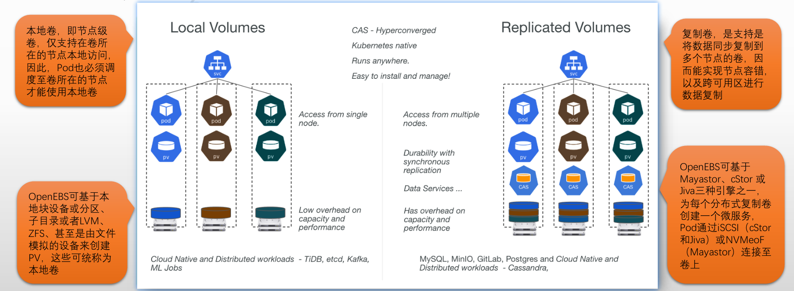


##### OpenEBS 架构

- **数据引擎**

- **控制平面**

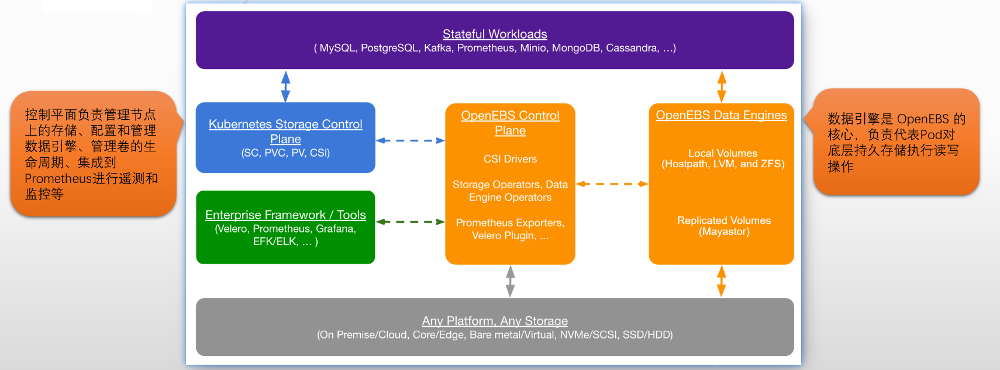


###### OpenEBS 数据引擎

**数据引擎的功能**

数据引擎类似于存储控制器，也可将其比作是一种SDS的实现

OpenEBS提供了一系列的数据引擎，所有引擎都支持PV的动态置备和数据的强一致性


**数据引擎的分类**

**本地引擎**

- 本地引擎可以从本地磁盘设备（依赖NDM【Node Disk Manager，后续详解】）或主机路径创建PV，也可以基于集群节点上的LVM或ZFS创建PV
- 适合内置可用性和可扩展性功能的应用程序，或者作业类的有状态工作负载
- 基于节点上支持的存储机制，可选的动态 Local PV 包括 Local PV hostpath、Local PV device、ZFS Local PV、LVM Local PV 和 Rawfile Local PV 这五种

✅ 什么是 Node Disk Manager？

**NDM 是 OpenEBS 项目中的一个关键组件，专门用于**：在每个节点上自动发现、管理、监控可用的物理存储设备（如裸盘、块设备）。

✅ NDM 的职责包括：

| 功能           | 描述                                                         |
| -------------- | ------------------------------------------------------------ |
| 🧭 自动发现     | 自动扫描节点上的所有块设备（例如 `/dev/sdb`, `/dev/nvme0n1`） |
| 🔍 过滤和标记   | 排除系统盘、正在被使用的盘，只暴露真正可用的裸设备           |
| 🧱 存储资源注册 | 把每个盘注册为 Kubernetes CR（如 BlockDevice）               |
| 🧩 卷调度支持   | 帮助 CSI 控制器根据磁盘情况调度 LocalPV 或 cStor Pool        |
| 📊 健康监控     | 监控盘的容量、状态、I/O 错误等信息                           |

✅ 工作流程（简化版）：

1. 每个节点运行一个 NDM DaemonSet
2. 启动后扫描本地 `/dev/` 下的块设备
3. 判断该设备是否空闲 & 非系统盘（通过 udev 规则、挂载点检测等）
4. 生成一个对应的 **`BlockDevice` CRD**
5. 控制面通过这些 CRD 调度和绑定设备
6. 用户请求 PVC 时，CSI Plugin 结合 BlockDevice 创建 Local PV

✅ 补充：NDM 发现后会生成哪些资源？

NDM 会创建这些 CRD 资源：

- `BlockDevice`：每块裸盘都会对应一个 BlockDevice 资源
- `BlockDeviceClaim`：请求使用 BlockDevice 时创建的声明
- `BD` 标签：会标记设备是 “Active”, “InUse”, “Unclaimed” 等状态


**复制引擎**

- 复制卷，顾名思义，就是那些可以将数据同步复制到多个节点的卷
- 复制引擎允许从复制节点范围内的任一节点上进行数据访问，并支持跨可用区进行复制
- 复制卷通常还支持快照、克隆、扩展等功能
- 基于节点上支持的存储机制，可选的复制引擎包括Mayastor、cStor 和 Jiva


###### **数据引擎 和 NDM**

**如何选择数据引擎**

- 应用程序处于生成状态且不需要存储级复制，则首先LocalPV
- 应用程序处于生产状态并且需要存储级复制，则首先cStor
- 应用程序较小，需要存储级复制但不需要快照和克隆，则首先Jiva
- 应用程序需要低延迟和接近磁盘的吞吐量，需要存储级复制，并且工作节点具有性能较高的CPU，RAM和NVME，那么Mayastor首选

**NDM（Node Disk Manager）**

- 部署OpenEBS的过程中，NDM由专用DaemonSet编排运行于每个节点上
  - 负责发现裸设别并过滤不支持使用的设备，比如已经带有文件系统的磁盘
  - 需要特权模式，访问/dev，/proc 和 /sys 目录来监视连接的设备，并使用各种探测器获取这些设备的详细信息
- 根据过滤器（filter）检测附加到节点上的裸磁盘设备，并将它们识别为“块设备CRD”
  - NDM 支持使用include filter 或 exclude filter
  - filter 的配置保存于 ConfigMap 中
- 基于节点上的罗磁盘设备提供PV的存储引擎，会依赖于NDM实现其功能，这包括LocalPV device 和 cStor


##### 配置使用OpenEBS

**openEBS官网**

```http
https://openebs.io/docs/quickstart-guide/installation
```

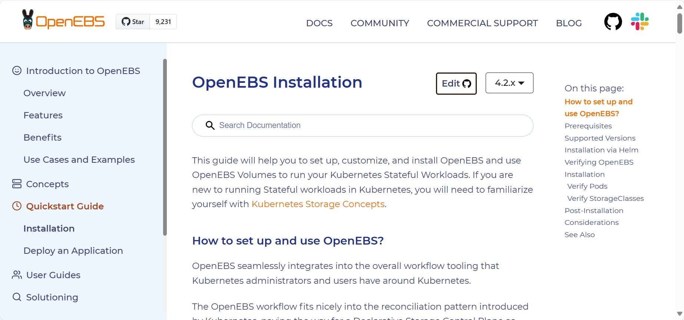


**部署使用OpenEBS的基本流程**

- 在各节点上部署 **iSCSI client**
- 在Kubernetes集群上部署OpenEBS
- 选择要使用的数据引擎
- 为选择的数据引擎准备StorageClass


```bash
# 下载yaml文件
[root@master1 OpenEBS]#wget https://openebs.github.io/charts/openebs-operator.yaml
[root@master1 OpenEBS]#ls
openebs-operator.yaml

# 启用
[root@master1 OpenEBS]#kubectl apply -f openebs-operator.yaml 
namespace/openebs created
serviceaccount/openebs-maya-operator created
clusterrole.rbac.authorization.k8s.io/openebs-maya-operator created
clusterrolebinding.rbac.authorization.k8s.io/openebs-maya-operator created
customresourcedefinition.apiextensions.k8s.io/blockdevices.openebs.io created
customresourcedefinition.apiextensions.k8s.io/blockdeviceclaims.openebs.io created
configmap/openebs-ndm-config created
daemonset.apps/openebs-ndm created
deployment.apps/openebs-ndm-operator created
deployment.apps/openebs-ndm-cluster-exporter created
service/openebs-ndm-cluster-exporter-service created
daemonset.apps/openebs-ndm-node-exporter created
service/openebs-ndm-node-exporter-service created
deployment.apps/openebs-localpv-provisioner created
storageclass.storage.k8s.io/openebs-hostpath created
storageclass.storage.k8s.io/openebs-device created

# 会创建一个OpenEBS的专用名称空间
[root@master1 OpenEBS]#kubectl get ns openebs 
NAME      STATUS   AGE
openebs   Active   58s

# 查看openebs-hostpath
[root@master1 OpenEBS]#kubectl get sc openebs-hostpath -o yaml
apiVersion: storage.k8s.io/v1
kind: StorageClass
metadata:
  annotations:
    # 可以在下面添加一行，将其设置为默认的目录
    storageclass.kubernetes.io/is-default-class: "true" # 是否设置为默认的storageClass
    cas.openebs.io/config: "#hostpath type will create a PV by \n# creating a sub-directory
      under the\n# BASEPATH provided below.\n- name: StorageType\n  value: \"hostpath\"\n#Specify
      the location (directory) where\n# where PV(volume) data will be saved. \n# A
      sub-directory with pv-name will be \n# created. When the volume is deleted,
      \n# the PV sub-directory will be deleted.\n#Default value is /var/openebs/local\n-
      name: BasePath\n  value: \"/var/openebs/local/\"\n"
    kubectl.kubernetes.io/last-applied-configuration: |
      {"apiVersion":"storage.k8s.io/v1","kind":"StorageClass","metadata":{"annotations":{"cas.openebs.io/config":"#hostpath type will create a PV by \n# creating a sub-directory under the\n# BASEPATH provided below.\n- name: StorageType\n  value: \"hostpath\"\n#Specify the location (directory) where\n# where PV(volume) data will be saved. \n# A sub-directory with pv-name will be \n# created. When the volume is deleted, \n# the PV sub-directory will be deleted.\n#Default value is /var/openebs/local\n- name: BasePath\n  value: \"/var/openebs/local/\"\n","openebs.io/cas-type":"local"},"name":"openebs-hostpath"},"provisioner":"openebs.io/local","reclaimPolicy":"Delete","volumeBindingMode":"WaitForFirstConsumer"}  # 可以看到会在每个节点上创建/var/openebs/local作为存储后端，
    openebs.io/cas-type: local
  creationTimestamp: "2025-03-30T03:37:03Z"
  name: openebs-hostpath
  resourceVersion: "284993"
  uid: f67224f9-6542-4003-8c3d-ec4661b6465b
provisioner: openebs.io/local
reclaimPolicy: Delete
volumeBindingMode: WaitForFirstConsumer

# 注意openebs-hostpath只支持单路读写，即ReadWriteOnce，不支持多路读写
```


###### 支持多路读写的解决方案

```bash
[root@master1 OpenEBS]#wget https://openebs.github.io/charts/nfs-operator.yaml

# 启用
[root@master1 OpenEBS]#kubectl apply -f nfs-operator.yaml 
namespace/openebs unchanged
serviceaccount/openebs-maya-operator unchanged
clusterrole.rbac.authorization.k8s.io/openebs-maya-operator configured
clusterrolebinding.rbac.authorization.k8s.io/openebs-maya-operator unchanged
deployment.apps/openebs-nfs-provisioner created
storageclass.storage.k8s.io/openebs-rwx created

# 查看
[root@master1 OpenEBS]#kubectl get sc openebs-rwx 
NAME          PROVISIONER         RECLAIMPOLICY   VOLUMEBINDINGMODE   ALLOWVOLUMEEXPANSION   AGE
openebs-rwx   openebs.io/nfsrwx   Delete          Immediate           false                  50s

# 测试
---
apiVersion: v1
kind: PersistentVolumeClaim
metadata:
  name: nfs-pvc
spec:
  accessModes:
    - ReadWriteMany
  storageClassName: "openebs-rwx"
  resources:
    requests:
      storage: 1Gi
```


#### OpenEBS-Jiva-复制卷部署

OpenEBS 管理每个 Kubernetes 节点上可用的存储，并使用该存储为有状态工作负载提供本地或分布式（也称为复制）持久卷。

如果是本地卷：

- OpenEBS 可以使用原始块设备或分区，或使用主机路径上的子目录，或使用 LVM、ZFS 或稀疏文件来创建持久卷。
- 本地卷直接安装到 Stateful Pod 中，数据路径中没有来自 OpenEBS 的任何额外开销，从而减少了延迟。
- OpenEBS 为本地卷提供了额外的工具，用于监控、备份/恢复、灾难恢复、ZFS 或 LVM 支持的快照、基于容量的调度等。


在分布式（又名复制）卷的情况下：

- OpenEBS 使用其引擎之一（Mayastor、cStor 或 Jiva）为每个分布式持久卷创建微服务。
- Stateful Pod 将数据写入 OpenEBS 引擎，这些引擎将数据同步复制到集群中的多个节点。OpenEBS 引擎本身部署为 pod，由 Kubernetes 编排。当运行有状态 pod 的节点发生故障时，该 pod 将被重新调度到集群中的另一个节点，OpenEBS 使用其他节点上的可用数据副本提供对数据的访问。
- Stateful Pod 使用 iSCSI（cStor 和 Jiva）或 NVMeoF（Mayastor）连接到 OpenEBS 分布式持久卷。
- OpenEBS cStor 和 Jiva 专注于存储的易用性和耐用性。这些引擎分别使用定制版本的 ZFS 和 Longhorn 技术将数据写入存储。
- OpenEBS Mayastor 是最新的引擎，以耐用性和性能为设计目标而开发；OpenEBS Mayastor 有效地管理计算（hugepages、内核）和存储（NVMe 驱动器）以提供快速的分布式块存储。


OpenEBS 贡献者更喜欢将分布式块存储卷称为**复制卷**，以避免与传统的分布式块存储混淆，原因如下：

- 分布式块存储倾向于将卷的数据块分片到集群中的多个节点上。复制卷将卷的所有数据块保存在节点上，并且为了持久性将整个数据复制到集群中的其他节点。
- 在访问卷数据时，分布式块存储依赖于元数据哈希算法来定位块所在的节点，而复制卷可以从任何持久保存数据的节点（也称为副本节点）访问数据。
- 与传统的分布式块存储相比，复制卷的爆炸半径更小。
- 复制卷专为云原生有状态工作负载而设计，这些工作负载需要大量容量的卷，这些容量通常可以从单个节点提供服务，而不是数据在集群中的多个节点之间分片的单个大卷。
- 复制卷是将其数据同步复制到多个节点的卷。复制卷可以承受节点故障。还可以跨可用性区域设置复制，帮助应用程序跨可用性区域移动。


##### **储存引擎**

OpenEBS 有三种储存引擎，不同的引擎能提供不同的功能。

- [Mayastor](https://wiki.pha.pub/Mayastor)
- [cStor](https://openebs.io/docs/concepts/cstor)
- [Jiva](https://openebs.io/docs/concepts/jiva)

超链接内有详细介绍。

除了这三种引擎，还有 Local PV，不太算存储引擎。
Local PV 意味着存储只能从单个节点使用。Local PV 表示已挂载的本地存储设备，例如磁盘、分区或目录。

以下表格部分摘自 https://zhuanlan.zhihu.com/p/519172233

| 特性                 | Jiva  | cStor    | Local PV | Mayastor |
| -------------------- | ----- | -------- | -------- | -------- |
| 轻量级运行于用户空间 | Yes   | Yes      | Yes      | 测试中   |
| 同步复制             | Yes   | Yes      | No       |          |
| 适合低容量工作负载   | Yes   | Yes      | Yes      |          |
| 支持快照，克隆       | Basic | Advanced | No       |          |
| 数据一致性           | Yes   | Yes      | NA       |          |
| 使用 Velero 恢复备份 | Yes   | Yes      | Yes      |          |
| 适合高容量工作负载   | No    | Yes      | Yes      |          |
| 自动精简配置         |       | Yes      | No       |          |
| 磁盘池或聚合支持     |       | Yes      | No       |          |
| 动态扩容             |       | Yes      | Yes      |          |
| 数据弹性 (RAID 支持) |       | Yes      | No       |          |
| 接近原生磁盘性能     | No    | No       | Yes      |          |

| 应用需求                                         | 存储类型                          | OpenEBS 卷类型                                               |
| ------------------------------------------------ | --------------------------------- | ------------------------------------------------------------ |
| 低时延、高可用性、同步复制、快照、克隆、精简配置 | 未格式化的块设备 (SSD/HDD/云硬盘) | OpenEBS Mayastor                                             |
| 高可用性、同步复制、快照、克隆、精简配置         | 未格式化的块设备 (SSD/HDD/云硬盘) | OpenEBS cStor                                                |
| 高可用性、同步复制、精简配置                     | 主机路径或外部挂载存储            | OpenEBS Jiva                                                 |
| 低时延、本地 PV                                  | 主机路径或外部挂载存储            | Dynamic Local PV - Hostpath, Dynamic Local PV - Rawfile      |
| 低时延、本地 PV                                  | 未格式化的块设备 (SSD/HDD/云硬盘) | Dynamic Local PV - Device                                    |
| 低延迟，本地 PV，快照，克隆                      | 未格式化的块设备 (SSD/HDD/云硬盘) | OpenEBS Dynamic Local PV - ZFS , OpenEBS Dynamic Local PV - LVM |

对于我的需求来说，Jiva 可以直接使用主机上的已有路径，而其他两个则需要使用空的块设备。
我不需要非常高性能的储存，添加新硬盘也不是想就能有的，所以选择 Jiva 是不错的选择。


##### **先决条件**

- Kubernetes 1.18 或更高版本；
- 所有工作节点安装并运行 iscsi-initiator-utils 或 open-iscsi；
- 有权将 RBAC 组件安装到 kube-system 命名空间中；
- OpenEBS localpv-hostpath 2.6.0 或更高版本；


##### **安装 iSCSI initiator utils**

###### **RHEL/CentOS 系列**

在所有工作节点执行

```bash
sudo yum install iscsi-initiator-utils
sudo systemctl enable --now iscsid
modprobe iscsi_tcp
echo iscsi_tcp >/etc/modules-load.d/iscsi-tcp.conf
```

###### Ubuntu/Debian 系列

在所有工作节点执行

```bash
# 1. 安装 iscsi initiator 工具包
sudo apt update
sudo apt install -y open-iscsi

# 2. 启用并启动 iscsid 服务
sudo systemctl enable --now iscsid

# 3. 加载内核模块 iscsi_tcp（如果未自动加载）
sudo modprobe iscsi_tcp

# 4. 设置开机自动加载该模块
echo iscsi_tcp | sudo tee /etc/modules-load.d/iscsi-tcp.conf
```


**通过 Helm 安装**

添加源：

```bash
helm repo add openebs https://openebs.github.io/charts
helm repo update
```

使用 CSI 驱动程序安装 Jiva：

```bash
helm install openebs openebs/openebs --namespace openebs --create-namespace \
--set legacy.enabled=false \
--set jiva.enabled=true \
--set openebs-ndm.enabled=true \
--set localpv-provisioner.enabled=true \
--set jiva.defaultStoragePath=/var/openebs \
--set image.repository=k8s-gcr.m.daocloud.io
```

- `legacy.enabled=false` 禁用旧的 out-of-tree 树外组件；
- `jiva.enabled=true` 启用 Jiva；
- `openebs-ndm.enabled=true` 启用 ndm；
- `localpv-provisioner.enabled=true` 启用Local PV provisioner；
- `jiva.defaultStoragePath=<储存路径>` 自定义 Jiva 储存目录，默认 /var/openebs；
- `image.repository=<源地址>` 自定义源地址，默认为 k8s.gcr.io，此处设置为 Daocloud 镜像；

此命令会在 openebs 命名空间内安装 OpenEBS Jiva 和 Local PV 组件。


##### **验证 OpenEBS 安装**

使用 `kubectl get pods -n openebs -o wide` 你应该能看到有以下几种 pod 正在全数正常运行。

```bash
[root@master-01 ~]#kubectl get pods -n openebs -o wide
NAME                                           READY   STATUS    RESTARTS      AGE   IP              NODE             NOMINATED NODE   READINESS GATES
openebs-jiva-csi-controller-0                  5/5     Running   8 (30m ago)   93m   10.200.129.17   k8s-10-0-0-213   <none>           <none>
openebs-jiva-csi-node-582gn                    3/3     Running   3 (55m ago)   93m   10.0.0.203      k8s-10-0-0-203   <none>           <none>
openebs-jiva-csi-node-j97w8                    3/3     Running   0             19m   10.0.0.201      master-01        <none>           <none>
openebs-jiva-csi-node-l2v9x                    3/3     Running   3 (50m ago)   93m   10.0.0.212      worker-02        <none>           <none>
openebs-jiva-csi-node-p9k64                    3/3     Running   3 (58m ago)   93m   10.0.0.202      master-02        <none>           <none>
openebs-jiva-csi-node-qwlz5                    3/3     Running   3 (50m ago)   93m   10.0.0.213      k8s-10-0-0-213   <none>           <none>
openebs-jiva-csi-node-tx4n8                    3/3     Running   3 (51m ago)   93m   10.0.0.211      worker-01        <none>           <none>
openebs-jiva-operator-6f9649578b-vzgq9         1/1     Running   2 (49m ago)   93m   10.200.171.28   worker-01        <none>           <none>
openebs-localpv-provisioner-574c44f48c-zfnpq   1/1     Running   5 (30m ago)   93m   10.200.37.204   worker-02        <none>           <none>
openebs-ndm-9p2dg                              1/1     Running   2 (52m ago)   93m   10.0.0.202      master-02        <none>           <none>
openebs-ndm-g9tp6                              1/1     Running   1 (50m ago)   93m   10.0.0.212      worker-02        <none>           <none>
openebs-ndm-m7jjs                              1/1     Running   1 (50m ago)   93m   10.0.0.213      k8s-10-0-0-213   <none>           <none>
openebs-ndm-mrbdl                              1/1     Running   1 (55m ago)   93m   10.0.0.203      k8s-10-0-0-203   <none>           <none>
openebs-ndm-operator-6c5cb7b544-8kcjw          1/1     Running   2 (49m ago)   93m   10.200.171.30   worker-01        <none>           <none>
openebs-ndm-z6zh2                              1/1     Running   1 (51m ago)   93m   10.0.0.211      worker-01        <none>           <none>
openebs-ndm-z8dmr                              1/1     Running   2 (64m ago)   93m   10.0.0.201      master-01        <none>           <none>
```

如果一直 ContainerCreating，大概率是镜像问题。
安装时别忘了设置镜像，默认的 k8s.gcr.io 大陆无法访问。

**验证储存类**

使用 `kubectl get sc` 你应该能看到一下几种 StorageClasses

```bash
[root@master-01 ~]#kubectl get sc
NAME                       PROVISIONER           RECLAIMPOLICY   VOLUMEBINDINGMODE
openebs-device             openebs.io/local      Delete          WaitForFirstConsu
openebs-hostpath           openebs.io/local      Delete          WaitForFirstConsu
openebs-jiva-csi-default   jiva.csi.openebs.io   Delete          Immediate
```

- `openebs-jiva-csi-default` 用于配置 jiva 卷，此类默认就会复制；
- `openebs-hostpath` 用于在主机路径上配置本地 PV，不会复制；
- `openebs-device` 用于在设备上配置本地 PV，不会复制；


##### **简单测试**

创建一个 PVC

```yaml
kind: PersistentVolumeClaim
apiVersion: v1
metadata:
  name: example-jiva-csi-pvc
spec:
  storageClassName: openebs-jiva-csi-default
  accessModes:
    - ReadWriteOnce
  resources:
    requests:
      storage: 4Gi
```

```ABAP
Pod 一律通过 Target Pod 来访问卷数据，数据不会直接从副本中“就近提取”；
```


##### 卷策略

如果你不想用默认的卷复制策略，或是需要调整资源限制、容忍读、节点选择器等，你可以创建 JivaVolumePolicy（JVP）。

```yaml
apiVersion: openebs.io/v1alpha1
kind: JivaVolumePolicy
metadata:
  name: example-jivavolumepolicy
  namespace: openebs
spec:
  replicaSC: openebs-hostpath
  target:
    # This sets the number of replicas for high-availability
    # replication factor <= no. of (CSI) nodes
    replicationFactor: 3
    # disableMonitor: false
    # auxResources:
    # tolerations:
    # resources:
    # affinity:
    # nodeSelector:
    # priorityClassName:
  # replica:
    # tolerations:
    # resources:
    # affinity:
    # nodeSelector:
    # priorityClassName:
```

然后使用 JVP 创建新的储存类：

```yaml
apiVersion: storage.k8s.io/v1
kind: StorageClass
metadata:
  name: openebs-jiva-csi-sc
provisioner: jiva.csi.openebs.io
allowVolumeExpansion: true
parameters:
  cas-type: "jiva"
  policy: "example-jivavolumepolicy"
```


##### 查看默认jvp

```yaml
[root@master1 ~] # kubectl get jivavolumepolicies.openebs.io openebs-jiva-default-policy  -n openebs -o yaml
apiVersion: openebs.io/v1
kind: JivaVolumePolicy
metadata:
  annotations:
    meta.helm.sh/release-name: openebs
    meta.helm.sh/release-namespace: openebs
  creationTimestamp: "2025-04-10T13:06:17Z"
  generation: 1
  labels:
    app.kubernetes.io/managed-by: Helm
  name: openebs-jiva-default-policy
  namespace: openebs
  resourceVersion: "209691"
  uid: 0d7baeb1-1e12-4225-aad1-41d445fa42b2
spec:
  replicaSC: openebs-hostpath
  target:
    replicationFactor: 3       # 默认副本数
```

**也可以在创建pvc的时候指定副本数**

```yaml
apiVersion: v1
kind: PersistentVolumeClaim
metadata:
  name: example-jiva-csi-pvc
  annotations:
    openebs.io/capacity: "2Gi"
    openebs.io/replica-count: "3"
spec:
  accessModes:
    - ReadWriteOnce
  storageClassName: openebs-jiva-csi-default
  resources:
    requests:
      storage: 2Gi
```