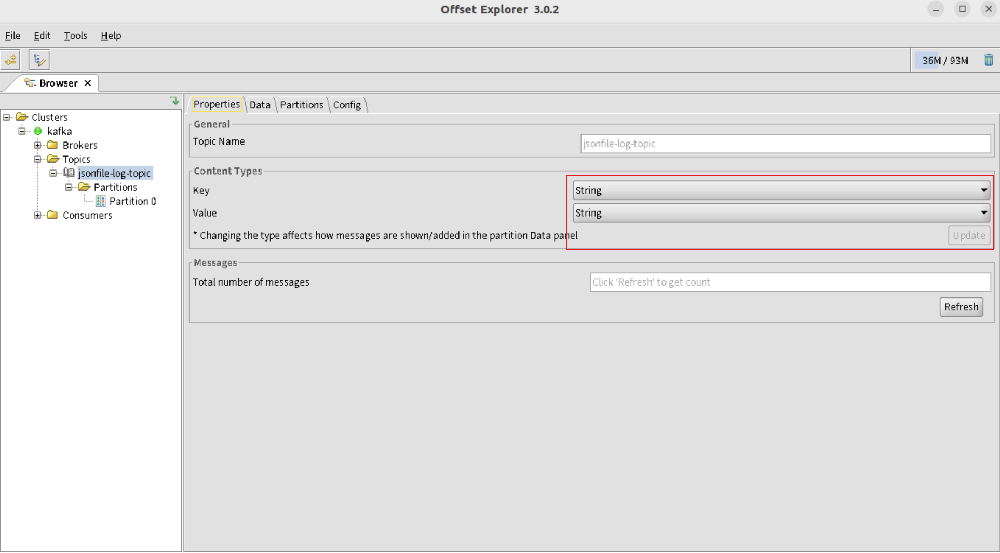
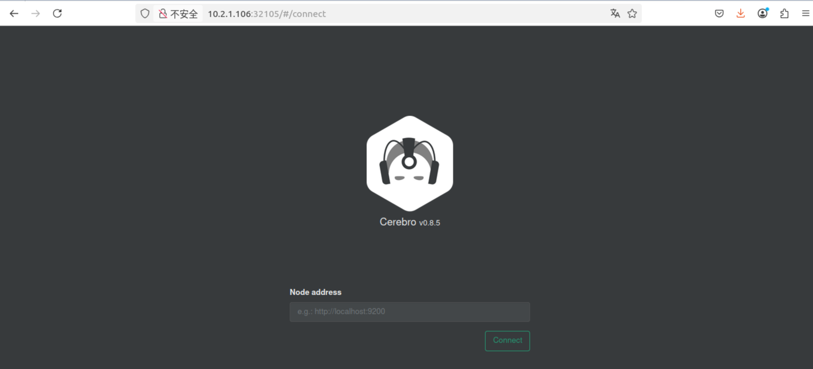
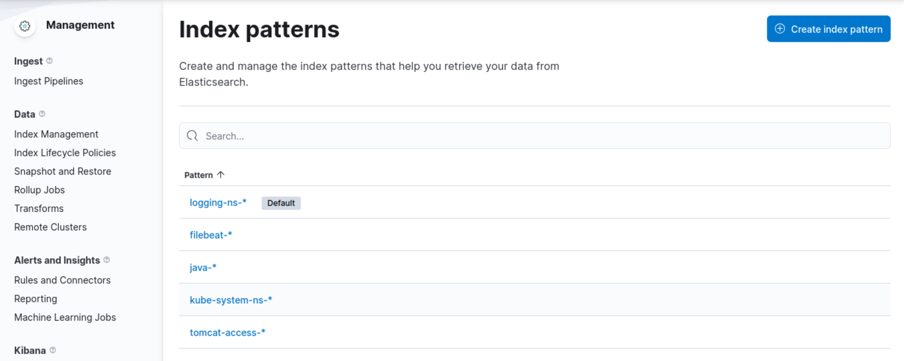

# Kubernetes日志收集


## 日志收集简介


**日志收集的目的**

- 分布式日志数据统一收集，实现集中式查询和管理
- 故障排查
- 安全信息和事件管理
- 报表统计及展示功能


**日志收集的价值**

- 日志查询，问题排查，故障恢复，故障自愈
- 应用日志分析，错误报警
- 性能分析，用户行为分析


### 日志收集流程


### 日志收集方式简介

```http
https://kubernetes.io/zh/docs/concepts/cluster-administration/logging/
```


1. node 节点收集，基于daemonset部署日志收集进程，实现json-file类型（标准输出/dev/stdout，错误输出/dev/stderr）日志收集
   - 公有云通常这种方式用的比较多，简化用户的使用成本

2. 使用sidecar容器（一个Pod多容器）收集当前Pod内一个或多个业务容器的日志（通常基于emptyDir实现业务容器与sidecar之间的日志共享）
3. 在容器内置日志收集服务进程


## 日志收集示例

### 日志示例—daemonset收集日志

基于daemonset运行日志收集服务，主要收集一下类型日志：

- node节点收集，基于daemonset部署日志收集进程，实现json-file类型（标准输出/dev/stdout，错误输出/dev/stderr）日志收集，即应用程序产生的标准输出和错误输出的日志
- 宿主机系统日志等以日志文件形式保存的日志

| 对比类型     | containerd                                                   | docker                                                       |
| ------------ | ------------------------------------------------------------ | ------------------------------------------------------------ |
| 日志存储路径 | 真实路径：/var/log/pods/$container_name  # 真实路径<br />软链接：同时kubelet也会在/var/log/contaiers目录下创建软连接指向/var/log/pods/$contaienr_name | 真实路径：/var/lib/contaienrs/$containerd<br />软链接：kubelet会在/var/log/pos和/var/log/contgainers创建软连接指向/var/lib/docker/containers/$CONTAINERID |
| 日志配置参数 | 配置文件：/etc/systemd/system/kubelet.service<br />配置参数：<br />- --container-log-max-files=5 \ <br />   --container-log-max-size="100Mi" \ <br />   --logging-forma="json" | 配置文件：/etc/docker/daemon.json<br />参数："log-driver": "json-file"<br />"log-opts": {<br />    "max-file": "5",<br />    "max-size": "100m"<br />} |


#### 日志示例—daemonset收集日志架构


#### 日志示例—daemonset收集jsonfile日志-部署web服务


**基础环境**

- **zookeeper && kafka**
- **elasticsearch cluster**
- **logstash**
- **kibana**


**前提准备**

```bash
# 部署好ELasticsearch集群和kafka集群
```


**构建logstash镜像**

```bash
# 查看准备文件
[root@master1 ~/ELK-case/daemonset-logstash]# pwd
/root/ELK-case/daemonset-logstash

# 查看目录下文件
[root@master1 ~/ELK-case/daemonset-logstash]# ls
1.logstash-image-Dockerfile  2.DaemonSet-logstash.yaml  3.logstash-daemonset-jsonfile-kafka-to-es.conf

# 进入镜像构建目录
[root@master1 ~/ELK-case/daemonset-logstash]# cd 1.logstash-image-Dockerfile/
[root@master1 ~/ELK-case/daemonset-logstash/1.logstash-image-Dockerfile]# ls
Dockerfile  command.sh  logstash.conf  logstash.yml

# 查看镜像构建文件
[root@master1 ~/ELK-case/daemonset-logstash/1.logstash-image-Dockerfile]# cat Dockerfile 
FROM harbor.magedu.mysticalrecluse.com/k8simage/logstash:7.12.1

USER root
WORKDIR /usr/share/logstash
ADD logstash.yml /usr/share/logstash/config/logstash.yml
ADD logstash.conf /usr/share/logstash/pipeline/logstash.conf

# 查看目录下其他配置文件
[root@master1 ~/ELK-case/daemonset-logstash/1.logstash-image-Dockerfile]# cat logstash.conf 
input {
  file {
    #path => "/var/lib/docker/containers/*/*-json.log" #docker
    path => "/var/log/pods/*/*/*.log"
    start_position => "beginning"
    type => "jsonfile-daemonset-applog"
  }
  file {
    path => "/var/log/*.log"
    start_position => "beginning"
    type => "jsonfile-daemonset-syslog"
  }
}

output {
  if [type] == "jsonfile-daemonset-applog" {
    kafka {
      bootstrap_servers => "${KAFKA_SERVER}"
      topic_id => "${TOPIC_ID}"
      batch_size => 16384
      codec => "${CODEC}"
    }
  }

  if [type] == "jsonfile-daemonset-syslog" {
    kafka {
      bootstrap_servers => "${KAFKA_SERVER}"
      topic_id => "${TOPIC_ID}"
      batch_size => 16384
      codec => "${CODEC}" # 系统日志不是json格式
    }
  }
}

[root@master1 ~/ELK-case/daemonset-logstash/1.logstash-image-Dockerfile]# cat logstash.yml 
http.host: "0.0.0.0"
#xpack.monitoring.elasticsearch.hosts: ["http://elasticsearch:9200"]

[root@master1 ~/ELK-case/daemonset-logstash/1.logstash-image-Dockerfile]# cat command.sh 
#!/bin/bash

nerdctl build -t harbor.magedu.mysticalrecluse.com/k8simage/logstash:v7.12.1-json-file-log-v1 .
nerdctl push harbor.magedu.mysticalrecluse.com/k8simage/logstash:v7.12.1-json-file-log-v1

# 构建镜像
# 构建的时候，如果报错，说没找到buildkit可以执行 buildkitd &，后台运行buildkit
[root@master1 ~/ELK-case/daemonset-logstash/1.logstash-image-Dockerfile]# bash command.sh
```


**启动logstash的pod**

```bash
# 查看清单文件
[root@master1 ~/ELK-case/daemonset-logstash]$ cat 2.DaemonSet-logstash.yaml 
apiVersion: apps/v1
kind: DaemonSet
metadata:
  name: logstash-elasticsearch
  namespace: kube-logging
  labels:
    k8s-app: logstash-logging
spec:
  selector:
    matchLabels:
      name: logstash-elasticsearch
  template:
    metadata:
      labels:
        name: logstash-elasticsearch
    spec:
      tolerations:
      - key: node-role.kubernetes.io/master
        operator: Exists
        effect: NoSchedule
      hostAliases:
      - ip: "10.2.1.139"
        hostnames:
        - "harbor"
      containers:
      - name: logstash-elasticsearch
        image: harbor.magedu.mysticalrecluse.com/k8simage/logstash:v7.12.1-json-file-log-v1
        env:
        - name: "KAFKA_SERVER"
          value: "10.2.1.139:9092"
        - name: "TOPIC_ID"
          value: "jsonfile-log-topic"
        - name: "CODEC"
          value: "json"
        volumeMounts:
        - name: varlog  # 定义宿主机系统日志挂载路径
          mountPath: /var/log # 宿主机系统日志挂载点
        - name: varlibdockercontainers # 定义容器日志挂载路径，和Logstash配置文件中的收集路径保持一致
          mountPath: /var/log/pods  # containerd挂载路径，，此路径与logstash的日志收集路径必须一致
          readOnly: false
      terminationGracePeriodSeconds: 30
      volumes:
      - name: varlog
        hostPath:
          path: /var/log
      - name: varlibdockercontainers
        hostPath:
          path: /var/log/pods
          
#启用清单文件
[root@master1 ~/ELK-case/daemonset-logstash]# kubectl apply -f 2.DaemonSet-logstash.yaml
daemonset.apps/logstash-elasticsearch created

# 使用offset Explorer查看，日志收集成功
```


将属性调为string,更新后查看具体日志信息




部署Logstash，从Kafka消费日志，并传递给Elasticsearch处理

```bash
[root@haproxy-dns-etc]# apt update && apt install -y openjdk-11-openjdk
[root@haproxy-dns-etc]# wget https://mirrors.aliyun.com/elasticstack/8.x/apt/pool/main/l/logstash/logstash-8.6.1-amd64.deb
[root@haproxy-dns-etc]# dpkg -i logstash-8.6.1-amd64.deb
[root@haproxy-dns-etc]# systemctl enable --now logstash.service

# 编写配置文件
[root@haproxy-dns-etc]$ cat /etc/logstash/conf.d/logstash-daemonset-jsonfile-kafka-to-es.conf
input {
  kafka {
    bootstrap_servers => "10.2.1.139:9092"
    topics => ["jsonfile-log-topic"]
    codec => "json"
  }
}

output {
  if [type] == "jsonfile-daemonset-applog" {
    elasticsearch {
      hosts => ["10.2.1.139:9200"]
      index => "jsonfile-daemonset-applog-%{+YYYY.MM.dd}"
    }
  }
  if [type] == "jsonfile-daemonset-syslog" {
    elasticsearch {
      hosts => ["10.2.1.139:9200"]
      index => "jsonfile-daemonset-syslog-%{+YYYY.MM.dd}"
    }
  }
}

# 重启
[root@haproxy-dns-etc]# systemctl restart logstash.service

# 查看ELasticsearch上的数据
# 注意：在单机Elasticsearch中，会出现一个现象
```


**黄牌（Yellow）意味着副本分片未分配**

- 你有 **1 个主分片（primary shard）已经成功分配并运行**，所以能写入数据。
- 但对应的 **副本分片（replica shard）未能分配到其他节点**，因此集群健康状态为 `yellow`。


**为什么是 Yellow？**

因为你运行的是**单节点**（如图中只有 `harbor-minio-etc` 一台机器），而默认情况下每个索引都有副本（`number_of_replicas: 1`），**而副本不能与主分片部署在同一个节点上**，所以副本就会处于 `Unassigned` 状态。


**如何让它变为 Green（全绿）**

方法一：降低副本数为 0（适合单节点部署）

```bash
[root@harbor-minio-etc]# curl -X PUT "http://10.2.1.139:9200/jsonfile-daemonset-applog-2025.05.04/_settings" -H 'Content-Type: application/json' -d '{
  "index": {
    "number_of_replicas": 0
  }
}'
{"acknowledged":true}
```

然后刷新页面，**集群状态就会变成 Green（绿色）**


测试只收集到了`jsonfile-daemonset-applog-2025.05.04`的日志，还没有syslog

```bash
# 在任意worker节点执行
[root@work1]# logger "hello"

# 刷新ELasticsearch Head，查看
```


查询发送的hello日志数据


降低副本数为 0，将集群变为绿色

```bash
[root@harbor-minio-etc]# curl -X PUT "http://10.2.1.139:9200/jsonfile-daemonset-syslog-2025.05.04/_settings" -H 'Content-Type: application/json' -d '{
  "index": {
    "number_of_replicas": 0
  }
}'
{"acknowledged":true}

# 查看结果
```


**部署Kibana**

```bash
[root@harbor-minio-etc]# wget https://mirrors.aliyun.com/elasticstack/8.x/apt/pool/main/k/kibana/kibana-8.15.0-amd64.deb

[root@harbor-minio-etc]# dpkg -i kibana-8.15.0-amd64.deb
#默认没有开机自动启动，需要自行设置
[root@harbor-minio-etc]# dpkg -i kibana-8.15.0-amd64.deb
(Reading database ... 110454 files and directories currently installed.)
Preparing to unpack kibana-8.15.0-amd64.deb ...
Unpacking kibana (8.15.0) over (8.15.0) ...
Setting up kibana (8.15.0) ...
Creating kibana group... OK
Creating kibana user... OK
Kibana is currently running with legacy OpenSSL providers enabled! For details and instructions on how to disable see h
ttps://www.elastic.co/guide/en/kibana/8.15/production.html#openssl-legacy-provider
Created Kibana keystore in /etc/kibana/kibana.keystore

# 修改配置文件
[root@es-node1 ~]#vim /etc/kibana/kibana.yml 
[root@es-node1 ~]#grep "^[a-Z]" /etc/kibana/kibana.yml 

server.port: 5601  #监听端口,此为默认值
server.host: "0.0.0.0" #修改此行的监听地址,默认为localhost，即：127.0.0.1:5601

#修改此行,指向ES任意服务器地址或多个节点地址实现容错,默认为localhost
elasticsearch.hosts: 
["http://10.0.0.101:9200","http://10.0.0.102:9200","http://10.0.0.103:9200"] 

i18n.locale: "zh-CN"   #修改此行,使用"zh-CN"显示中文界面,默认英文

#8.X版本新添加配置,默认被注释,会显示下面提示
server.publicBaseUrl: "http://kibana.mystical.org"

# 浏览器访问：http://kibana.mystical.org:5601
```


**配置索引**


**创建数据视图**


基于刚才创建的数据视图，查看数据


### 日志示例—sidecar模式架构


### 日志示例—完全基于K8S部署的日志采集系统

#### 基础环境准备

在安装ELasticsearch集群之前，我们先创建一个名称空间，我们之后部署的组件将在这个命名空间下

**创建资源存放位置**

```bash
[root@master1 ~]# mkdir logging/namespace -p
[root@master1 ~]# cd logging/namespace/
```


**创建logging命名空间**

```bash
# 创建资源清单文件
[root@master1 ~/logging/namespace]# vim logging-namespace.yaml

# 更新资源清单文件
[root@master1 ~/logging/namespace]# kubectl apply -f logging-namespace.yaml 
namespace/logging created

# 查看创建的logging名称空间
[root@master1 ~/logging/namespace]$ kubectl get ns logging 
NAME      STATUS   AGE
logging   Active   100s
```


**配置默认存储**

我们后面部署的应用可能需要将数据目录持久化出去，如果不做持久化，容器发生重启，数据就会丢失

**安装NFS Server并创建数据存放目录**

```bash
[root@haproxy-dns-etc]# apt update && apt -y install nfs-server

root@haproxy-dns-etc]# systemctl status nfs-server
● nfs-server.service - NFS server and services
     Loaded: loaded (/lib/systemd/system/nfs-server.service; enabled; vendor preset: enabled)
     Active: active (exited) since Mon 2025-05-05 10:42:23 UTC; 26s ago
   Main PID: 78911 (code=exited, status=0/SUCCESS)
        CPU: 16ms

May 05 10:42:21 haproxy-dns-etc systemd[1]: Starting NFS server and services...
May 05 10:42:21 haproxy-dns-etc exportfs[78910]: exportfs: can't open /etc/exports for reading
May 05 10:42:23 haproxy-dns-etc systemd[1]: Finished NFS server and services.

[root@master1 ~]# mkdir -pv /data/sc-nfs 
[root@master1 ~]# chown 777 /data/sc-nfs
[root@master1 ~]# vim /etc/exports
#授权worker节点的网段可以挂载
#/data/sc-nfs *(rw,no_root_squash,all_squash,anonuid=0,anongid=0) 
/data/sc-nfs *(rw,no_root_squash) 

[root@master1 ~]# exportfs -r
[root@master1 ~]# exportfs -v
/data/sc-nfs <world>
(sync,wdelay,hide,no_subtree_check,anonuid=0,anongid=0,sec=sys,rw,secure,no_root_squash,all_squash)

#并在所有worker节点安装NFS客户端 
[root@nodeX ~]# apt update && apt -y install nfs-common 或者 nfs-client
```


**创建ServiceAccount并授权**

```yaml
[root@master1 yaml] # cat rbac.yaml 
# 创建独立的名称空间
apiVersion: v1
kind: Namespace
metadata:
  name: nfs-provisioner-demo
---
apiVersion: v1
kind: ServiceAccount
metadata:
  name: nfs-client-provisioner
  # replace with namespace where provisioner is deployed 根据业务需要修改此处名称空间
  namespace: nfs-provisioner-demo
  
---
apiVersion: rbac.authorization.k8s.io/v1
kind: ClusterRole
metadata:
  name: nfs-client-provisioner-runner
rules:
  - apiGroups: [""]
    resources: ["nodes"]
    verbs: ["get", "list", "watch"]
  - apiGroups: [""]
    resources: ["persistentvolumes"]
    verbs: ["get", "list", "watch", "create", "delete"]
  - apiGroups: [""]
    resources: ["persistentvolumeclaims"]
    verbs: ["get", "list", "watch", "update"]
  - apiGroups: ["storage.k8s.io"]
    resources: ["storageclasses"]
    verbs: ["get", "list", "watch"]
  - apiGroups: [""]
    resources: ["events"]
    verbs: ["create", "update", "patch"]
  - apiGroups: [""]
    resources: ["services", "endpoints"]
    verbs: ["get", "list", "watch", "create", "update", "delete"]
    
---
apiVersion: rbac.authorization.k8s.io/v1
kind: ClusterRoleBinding
metadata:
  name: run-nfs-client-provisioner
subjects:
  - kind: ServiceAccount
    name: nfs-client-provisioner
    # replace with namespace where provisioner is deployed
    namespace: nfs-provisioner-demo
roleRef:
  kind: ClusterRole
  name: nfs-client-provisioner-runner
  apiGroup: rbac.authorization.k8s.io
  
---
apiVersion: rbac.authorization.k8s.io/v1
kind: Role
metadata:
  name: leader-locking-nfs-client-provisioner
  # replace with namespace where provisioner is deployed
  namespace: nfs-provisioner-demo
rules:
  - apiGroups: [""]
    resources: ["endpoints"]
    verbs: ["get", "list", "watch", "create", "update", "patch"]
    
---
kind: RoleBinding
apiVersion: rbac.authorization.k8s.io/v1
metadata:
  name: leader-locking-nfs-client-provisioner
  # replace with namespace where provisioner is deployed
  namespace: nfs-provisioner-demo
subjects:
  - kind: ServiceAccount
    name: nfs-client-provisioner
    # replace with namespace where provisioner is deployed
    namespace: nfs-provisioner-demo
roleRef:
  kind: Role
  name: leader-locking-nfs-client-provisioner
  apiGroup: rbac.authorization.k8s.io


# 应用
[root@master1 yaml] # kubectl apply -f rbac.yaml
serviceaccount/nfs-client-provisioner created
clusterrole.rbac.authorization.k8s.io/nfs-client-provisioner-runner created
clusterrolebinding.rbac.authorization.k8s.io/run-nfs-client-provisioner created
role.rbac.authorization.k8s.io/leader-locking-nfs-client-provisioner created
rolebinding.rbac.authorization.k8s.io/leader-locking-nfs-client-provisioner created

# 查看系统用户
[root@master1 yaml]#kubectl get sa
NAME                     SECRETS   AGE
default                  0         34d
nfs-client-provisioner   0         9s
```


**部署 NFS-Subdir-External-Provisioner 对应的 Deployment**

```yaml
[root@master1 nsf-provisioner] #vim nfs-client-provisioner.yaml
apiVersion: apps/v1
kind: Deployment
metadata:
  name: nfs-client-provisioner
  labels:
    app: nfs-client-provisioner
  namespace: nfs-provisioner-demo
spec:
  replicas: 1
  strategy:
    type: Recreate
  selector:
    matchLabels:
      app: nfs-client-provisioner
  template:
    metadata:
      labels:
        app: nfs-client-provisioner
    spec:
      serviceAccountName: nfs-client-provisioner
      containers:
      - name: nfs-client-provisioner     
        image: k8s.gcr.io/sig-storage/nfs-subdir-external-provisioner:v4.0.2 #此镜像国内可能无法访问
        imagePullPolicy: IfNotPresent
        volumeMounts:
        - name: nfs-client-root
          mountPath: /persistentvolumes
        env:
        - name: PROVISIONER_NAME
          value: k8s-sigs.io/nfs-subdir-external-provisioner # 名称确保与nfs-StorageClass.yaml文件中的provisioner名称保持一致
        - name: NFS_SERVER
          value: nfs.mystical.org
        - name: NFS_PATH
          value: /nfs-data/sc-nfs
      volumes:
      - name: nfs-client-root
        nfs:
          server: nfs.mystical.org
          path: /nfs-data/sc-nfs
          
# 应用
[root@master1 nsf-provisioner]# kubectl apply -f nfs-client-provisioner.yaml 
deployment.apps/nfs-client-provisioner created

# 查看
[root@master1 nsf-provisioner]#kubectl get pod -n nfs-provisioner-demo 
NAME                                      READY   STATUS    RESTARTS   AGE
nfs-client-provisioner-74d7c6bf46-kkpmd   1/1     Running   0          4m9s
```


**创建NFS资源的storageClass**

```bash
[root@master1 nsf-provisioner] # vim nfs-storageClass.yaml
apiVersion: storage.k8s.io/v1
kind: StorageClass
metadata:
  name: sc-nfs
  annotations:
    storageclass.kubernetes.io/is-default-class: "false" # 是否设置为默认的storageClass
provisioner: k8s-sigs.io/nfs-subdir-external-provisioner # or choose another name, must match deployment's env PROVISIONER_NAME
parameters:
  archiveOnDelete: "true" # 设置为false时删除PVC不会保留数据，"true"则保留数据，基于安全原因建议设为"true"


# 应用
[root@master1 nsf-provisioner] # kubectl apply -f nfs-storageClass.yaml 
storageclass.storage.k8s.io/sc-nfs created

# 查看
[root@master1 nsf-provisioner]#kubectl get sc -n nfs-provisioner-demo 
NAME     PROVISIONER                                   RECLAIMPOLICY   VOLUMEBINDINGMODE   ALLOWVOLUMEEXPANSION   AGE
sc-nfs   k8s-sigs.io/nfs-subdir-external-provisioner   Delete          Immediate           false                  15s
```


#### 部署ELasticsearch

使用StatefulSet部署Elasticsearch集群可以提供节点之间的稳定网络标识，有序的部署和扩展、持久化存储和状态管理功能。这些功能使得Elasticsearch在Kubernetes上更加可靠，易于管理，并保证数据的可靠性和可用性

**创建Headless Service**

```bash
[root@master1 ~]# mkdir /root/logging/elasticsearch
[root@master1 ~]# cd /root/logging/elasticsearch/
[root@master1 ~/logging/elasticsearch]# vim elasticsearch-svc.yaml
kind: Service
apiVersion: v1
metadata:
  name: elasticsearch
  namespace: logging
  labels:
    app: elasticsearch
spec:
  selector:
    app: elasticsearch
  clusterIP: None
  ports:
    - name: tcp-9200
      port: 9200
    - name: tcp-9300
      port: 9300
      
# 更新资源清单文件
[root@master1 ~/logging/elasticsearch]# kubectl apply -f elasticsearch-svc.yaml 
service/elasticsearch created

# 查看
[root@master1 ~/logging/elasticsearch]# kubectl get svc -n logging
NAME            TYPE        CLUSTER-IP   EXTERNAL-IP   PORT(S)             AGE
elasticsearch   ClusterIP   None         <none>        9200/TCP,9300/TCP   3m9s
```

对上述无头服务的yaml文件说明

```bash
    这是一个部署Elasticsearch集群时使用的Service配置示例。该Service使用了clusterIP：None，意味着该Service不会分配ClusterIP，它只会为集群中的每个ELasticsearch Pod 分配一个稳定的DNS名称
    
    这个Service的主要作用是为其他应用程序或服务提供与Elasticsearch节点的通信。在这个示例中，Service名称为“elasticsearch”，名称空间为“logging”。它使用了selector字段来匹配具有app：elasticsearch标签的Pod，并将流量导向这些Pod
    
    该Service在两个端口上定义了监听：
    “port: 9200”： 用于Elasticsearch HTTP API的通信
    “port: 9300”： 用于Elasticsearch集群内节点之间的通信
    
    这个配置示例可以在Kubernetes集群中部署，以便在其他应用程序中使用相应的DNS名称和端口来访问Elasticsearch集群
```


#### 基于StatefulSet资源部署Elasticsearch集群

创建资源清单文件

```bash
[root@master1 ~/logging/elasticsearch]# cat elasticsearch-statefulset.yaml 
apiVersion: apps/v1
kind: StatefulSet
metadata:
  name: es-cluster
  namespace: logging
spec:
  serviceName: elasticsearch
  replicas: 3
  selector:
    matchLabels:
      app: elasticsearch
  template:
    metadata:
      labels:
        app: elasticsearch
    spec:
      initContainers:
      - name: fix-permissions
        image: busybox  # 可以改为私有仓镜像地址
        imagePullPolicy: IfNotPresent
        command: ["sh", "-c", "chown -R 1000:1000 /usr/share/elasticsearch/data"] 
        securityContext:
          privileged: true
        volumeMounts:
        - name: data
          mountPath: /usr/share/elasticsearch/data
      - name: increase-vm-max-map
        image: busybox
        imagePullPolicy: IfNotPresent
        command: ["sysctl", "-w", "vm.max_map_count=262144"]
        securityContext:
          privileged: true
      - name: increase-fd-ulimit
        image: busybox
        imagePullPolicy: IfNotPresent
        command: ["sh", "-c", "ulimit -n 65536"]
        securityContext:
          privileged: true
      containers:
      - name: elasticsearch
        image: elasticsearch:7.17.8     # 可以改为私有仓镜像地址
        imagePullPolicy: IfNotPresent
        resources:
          limits:
            cpu: 1000m
          requests:
            cpu: 100m
        ports:
        - containerPort: 9200
          name: tcp-9200
          protocol: TCP
        - containerPort: 9300
          name: tcp-9300
          protocol: TCP
        volumeMounts:
        - name: data
          mountPath: /usr/share/elasticsearch/data
        env:
          - name: cluster.name
            value: k8s-logs
          - name: node.name
            valueFrom:
              fieldRef:  # Kubernetes中容器环境变量的定义方式
                fieldPath: metadata.name # 将当前Pod的名称（metadata.name）赋值给容器里的环境变量node.name
          - name: discovery.seed_hosts
            value: "es-cluster-0.elasticsearch.logging.svc.cluster.local,es-cluster-1.elasticsearch.logging.svc.cluster.local,es-cluster-2.elasticsearch.logging.svc.cluster.local" # 如果后期要新增节点数，这里将添加新增的名称
          - name: cluster.initial_master_nodes
            value: "es-cluster-0,es-cluster-1,es-cluster-2"
          - name: ES_JAVA_OPTS
            value: "-Xms512m -Xmx512m" # 生产环境的话，建议机器内存的一半，官方建议最多32G
  volumeClaimTemplates:
  - metadata:
      name: data
      labels:
        app: elasticsearch
    spec:
      accessModes: [ "ReadWriteOnce" ]
      storageClassName: sc-nfs
      resources:
        requests:
          storage: 5Gi
          
# 启用清单文件
[root@master1 ~/logging/elasticsearch]# kubectl apply -f elasticsearch-statefulset.yaml

# 查看
[root@master1 ~/logging/elasticsearch]# kubectl get pod -n logging
NAME           READY   STATUS    RESTARTS   AGE
es-cluster-0   1/1     Running   0          2m2s
es-cluster-1   1/1     Running   0          90s
es-cluster-2   1/1     Running   0          48s

# pod部署完成之后，可以通过REST API检测Elasticsearch集群是否部署成功，使用下面的命令将本地端口9200转发到Elasticsearch节点（如es-cluster-0）对应的端口
[root@master1 ~/logging/elasticsearch]# kubectl port-forward es-cluster-0 9200:9200 -n logging

# 在另外的终端窗口中，执行如下请求，新开一个k8s-master01终端
[root@master1 ~]# curl http://localhost:9200/_cat/nodes
10.200.200.6 46 51 5 0.64 0.39 0.25 cdfhilmrstw - es-cluster-0
10.200.32.6  64 53 5 0.05 0.06 0.10 cdfhilmrstw * es-cluster-1
10.200.236.7 40 54 5 0.56 0.30 0.24 cdfhilmrstw - es-cluster-2
```

看到上面的信息就表明我们的Elasticsearch集群成功创建了3个节点：`es-cluster-0`，`es-cluster-1`和`es-cluster-2`，当前主节点是`es-cluster-0`


#### cerebro可视化查看ES集群

Cerebro是一个开源的可视化工具，用于管理和监控Elasticsearch集群。他提供了一个直观的界面，使用户能够轻松地查看和配置索引，节点，分片等信息

Cerebro提供了一些有用的功能，例如执行索引操作，搜索，创建和删除索引，运行查询和聚合等。它还允许用户查看和监控节点的状态，负载，性能指标等。

Cerebro是一个独立的Java应用程序，可以在本地部署，也可以作为一个Docker容器运行。它可以与远程的Elasticsearch集群连接，并提供强大的可视化工具来管理和操作集群


**创建cerebro svc**

```bash
# 创建 Cerebro svc 资源清单文件
[root@master1 ~/logging/elasticsearch]# mkdir /root/logging/cerebro
[root@master1 ~/logging/elasticsearch]# cd /root/logging/cerebro/
[root@master1 ~/logging/cerebro]# vim cerebro-svc.yaml
apiVersion: v1
kind: Service
metadata:
  labels:
    app: cerebro
  name: cerebro
  namespace: logging
spec:
  ports:
  - port: 9000
    protocol: TCP
    targetPort: 9000
  selector:
    app: cerebro
  type: NodePort
    
# 启用资源清单
[root@master1 ~/logging/cerebro]# kubectl apply -f cerebro-svc.yaml 
service/cerebro created

# 查看
[root@master1 ~/logging/cerebro]$ kubectl get svc -n logging cerebro 
NAME      TYPE       CLUSTER-IP     EXTERNAL-IP   PORT(S)          AGE
cerebro   NodePort   10.100.98.81   <none>        9000:32105/TCP   36s
```


**创建Cerebro deployment**

```bash
# 创建cerebro deployment资源清单文件
[root@master1 ~/logging/cerebro]# vim cerebro-deployment.yaml
apiVersion: apps/v1
kind: Deployment
metadata:
  labels:
    app: cerebro
  name: cerebro
  namespace: logging
spec:
  replicas: 1
  selector:
    matchLabels:
      app: cerebro
  template:
    metadata:
      labels:
        app: cerebro
      name: cerebro
    spec:
      containers:
      - image: lmenezes/cerebro:0.8.5   # 这里可以替换成私有仓的镜像
        imagePullPolicy: IfNotPresent
        name: cerebro
        resources:
          limits:
            cpu: 1
            memory: 1Gi
          requests:
            cpu: 100m
            memory: 250Mi
            
# 更新资源清单
[root@master1 ~/logging/cerebro]# kubectl apply -f cerebro-deployment.yaml 
deployment.apps/cerebro created

# 查看
[root@master1 ~/logging/cerebro]# kubectl get pod -n logging 
NAME                       READY   STATUS    RESTARTS   AGE
cerebro-67d4d8bc85-ktwrr   1/1     Running   0          85s
es-cluster-0               1/1     Running   0          158m
es-cluster-1               1/1     Running   0          157m
es-cluster-2               1/1     Running   0          156m

# 访问浏览器：http://worker1IP:32105
```



使用`http://elasticsearch.logging.svc.cluster.local:9200`连接Elasticsearch集群


#### 部署Kibana可视化UI界面

Kibana是Elastic Stack中的一个数据可视化工具，用于展示分析Elasticsearch中的数据。通过Kibana，您可以创建仪表盘，图表，地图等多种可视化方式，以便更好的理解和呈现您的数据

**创建Kibana svc**

```bash
# 创建Kibana svc 资源清单
[root@master1 ~]# mkdir /root/logging/kibana
[root@master1 ~]# cd /root/logging/kibana/
[root@master1 ~/logging/kibana]# vim kibana-svc.yaml
apiVersion: v1
kind: Service
metadata: 
  name: kibana
  namespace: logging
  labels:
    app: kibana
spec:
  type: NodePort
  ports:
  - port: 5601
  selector:
    app: kibana
   
# 更新资源清单
[root@master1 ~/logging/kibana]# kubectl apply -f kibana-svc.yaml 
service/kibana created

# 查看
[root@master1 ~/logging/kibana]# kubectl get svc -n logging
NAME            TYPE        CLUSTER-IP      EXTERNAL-IP   PORT(S)             AGE
cerebro         NodePort    10.100.98.81    <none>        9000:32105/TCP      7h32m
elasticsearch   ClusterIP   None            <none>        9200/TCP,9300/TCP   11h
kibana          NodePort    10.100.35.184   <none>        5601:31802/TCP      101s
```


**创建Kibana Deployment**

```bash
[root@master1 ~/logging/kibana]# vim kibana-deploy.yaml 
apiVersion: apps/v1
kind: Deployment
metadata:
  name: kibana
  namespace: logging
  labels:
    app: kibana
spec:
  replicas: 1
  selector:
    matchLabels:
      app: kibana
  template:
    metadata:
      labels:
        app: kibana
    spec:
      containers:
      - name: kibana
        image: kibana:7.17.8   # 可以使用私用仓镜像
        imagePullPolicy: IfNotPresent
        resources:
          limits:
            cpu: 1000m
          requests:
            cpu: 100m
        env:
          - name: ELASTICSEARCH_URL
            value: http://elasticsearch.logging.svc.cluster.local:9200
        ports:
        - containerPort: 5601

# 更新资源清单
[root@master1 ~/logging/kibana]# kubectl apply -f kibana-deploy.yaml 
deployment.apps/kibana created

# 查看
[root@master1 ~/logging/kibana]# kubectl get pod -n logging 
NAME                       READY   STATUS    RESTARTS   AGE
cerebro-67d4d8bc85-ktwrr   1/1     Running   0          7h20m
es-cluster-0               1/1     Running   0          9h
es-cluster-1               1/1     Running   0          9h
es-cluster-2               1/1     Running   0          9h
kibana-7b5ff7fb95-8mrgj    1/1     Running   0          33s

# 查看svc
[root@master1 ~/logging/kibana]# kubectl get svc -n logging
NAME            TYPE        CLUSTER-IP      EXTERNAL-IP   PORT(S)             AGE
cerebro         NodePort    10.100.98.81    <none>        9000:32105/TCP      7h32m
elasticsearch   ClusterIP   None            <none>        9200/TCP,9300/TCP   11h
kibana          NodePort    10.100.35.184   <none>        5601:31802/TCP      101s

# 浏览器访问
http://workerIP:31802
```


#### Filebeat日志采集实战

filebeat采集器配置文件，参考地址

```http
https://github.com/elastic/beats/blob/7.17/deploy/kubernetes/filebeat-kubernetes.yaml
```


说明：

这里部署Filebeat按照名称空间进行分类采集。一个名称空间对应一个索引。采集logging和kube-system名称空间

##### **创建sa、role、cluster role、rolebinding**

```bash
[root@master1 ~/logging]# mkdir /root/logging/filebeat
[root@master1 ~/logging]# cd /root/logging/filebeat/

# 创建sa资源清单文件
[root@master1 ~/logging/filebeat]# vim filebeat-role.yaml
apiVersion: rbac.authorization.k8s.io/v1
kind: ClusterRoleBinding
metadata:
  name: filebeat
subjects:
- kind: ServiceAccount
  name: filebeat
  namespace: logging
roleRef:
  kind: ClusterRole
  name: filebeat
  apiGroup: rbac.authorization.k8s.io
---
apiVersion: rbac.authorization.k8s.io/v1
kind: RoleBinding
metadata:
  name: filebeat
  namespace: logging
subjects:
  - kind: ServiceAccount
    name: filebeat
    namespace: logging
roleRef:
  kind: Role
  name: filebeat
  apiGroup: rbac.authorization.k8s.io
---
apiVersion: rbac.authorization.k8s.io/v1
kind: RoleBinding
metadata:
  name: filebeat-kubeadm-config
  namespace: logging
subjects:
  - kind: ServiceAccount
    name: filebeat
    namespace: logging
roleRef:
  kind: Role
  name: filebeat-kubeadm-config
  apiGroup: rbac.authorization.k8s.io
---
apiVersion: rbac.authorization.k8s.io/v1
kind: ClusterRole
metadata:
  name: filebeat
  labels:
    k8s-app: filebeat
rules:
- apiGroups: [""]
  resources:
  - namespaces
  - pods
  - nodes
  verbs:
  - get
  - watch
  - list
- apiGroups: ["apps"]
  resources:
  - replicasets
  verbs: ["get","list","watch"]
---
apiVersion: rbac.authorization.k8s.io/v1
kind: Role
metadata:
  name: filebeat
  namespace: logging
  labels:
    k8s-app: filebeat
rules:
  - apiGroups:
      - coordination.k8s.io
    resources:
      - leases
    verbs: ["get","create","update"]
---
apiVersion: rbac.authorization.k8s.io/v1
kind: Role
metadata:
  name: filebeat-kubeadm-config
  namespace: logging
  labels:
    k8s-app: filebeat
rules:
  - apiGroups: [""]
    resources:
      - configmaps
    resourceNames:
      - kubeadm-config
    verbs: ["get"]
---
apiVersion: v1
kind: ServiceAccount
metadata:
  name: filebeat
  namespace: logging
  labels:
    k8s-app: filebeat
    
# 更新资源清单
[root@master1 ~/logging/filebeat]# kubectl apply -f filebeat-role.yaml
clusterrolebinding.rbac.authorization.k8s.io/filebeat created
rolebinding.rbac.authorization.k8s.io/filebeat unchanged
rolebinding.rbac.authorization.k8s.io/filebeat-kubeadm-config unchanged
clusterrole.rbac.authorization.k8s.io/filebeat unchanged
role.rbac.authorization.k8s.io/filebeat unchanged
role.rbac.authorization.k8s.io/filebeat-kubeadm-config unchanged
serviceaccount/filebeat unchanged
```

##### 创建filebeat configmap配置文件

```bash
[root@master1 ~/logging/filebeat]# cat filebeat-configmap.yaml 
apiVersion: v1
kind: ConfigMap
metadata:
  name: filebeat-config
  namespace: logging
  labels:
    k8s-app: filebeat
data:
  filebeat.yaml: |-
    filebeat.inputs:
    - type: container
      paths:
        - /var/log/containers/*logging*.log         # 采集源路径
      fields:
        index: logging
      processors:                                   # 对采集的日志进行处理的配置
        - add_kubernetes_metadata:                  # 添加Kubernetes相关的元数据到采集的日志
            default_indexers.enabled: true          # 启用默认的索引器，，用在日志中添加索引信息
            default_matchers.enabled: true          # 启用默认的匹配器，，用于匹配相关日志
            host: ${NODE_NAME}                      # configmap里的内容只是静态模版，需要后续某种方式做渲染
            matchers:                               # 指定匹配规则
            - logs_path:
                logs_path: "/var/log/containers/"

    - type: container
      paths:
        - /var/log/containers/*kube-system*.log
      fields:
        index: kube-system
      processors:
        - add_kubernetes_metadata:
            default_indexers.enabled: true
            default_matchers.enabled: true
            hosts: ${NODE_NAME}
            matchers:
            - logs_path:
                logs_path: "/var/log/containers/"

    output.elasticsearch:
      hosts: ['elasticsearch.logging.svc.cluster.local:9200']
      indices:
        - index: "logging-ns-%{+yyyy.MM.dd}"
          when.equals:
            fields:
              index: "logging"
        - index: "kube-system-ns-%{+yyyy.MM.dd}"
          when.equals:
            fields:
              index: "kube-system"

# 更新资源清单
[root@master1 ~/logging/filebeat]# kubectl apply -f filebeat-configmap.yaml 
configmap/filebeat-config created
```

**核心配置字段详解**

```bash
      processors:
        - add_kubernetes_metadata:
            default_indexers.enabled: true
            default_matchers.enabled: true
            hosts: ${NODE_NAME}
            matchers:
            - logs_path:
                logs_path: "/var/log/containers/"
```

上述配置是**Filebeat 与 Kubernetes 集成中最核心的配置之一**，主要功能是自动为日志打上 Kubernetes 的元数据标签，比如 pod 名、namespace、container 名等，方便后续日志分析和筛选。我们逐行来详细解释每一项内容：


###### **✅`processors` 字段**

在 Filebeat 的配置中，`processors` 字段表示使用内置或自定义的插件，对日志数据进行“处理增强、过滤、添加字段”等操作。它是 **Filebeat 官方支持的机制**。

```yaml
processors:
  - add_kubernetes_metadata:
```

表示配置 **Filebeat 日志处理插件（处理器）**。
 其中 `add_kubernetes_metadata` 是一个 **官方内置插件**，用于自动为日志添加 Kubernetes 上下文（metadata）。

✅**Filebeat 中常见的 `processors` 插件举例**

| 插件名                    | 作用描述                                   |
| ------------------------- | ------------------------------------------ |
| `add_kubernetes_metadata` | 添加 Kubernetes 上下文                     |
| `drop_event`              | 丢弃不需要的日志                           |
| `drop_fields`             | 移除多余字段                               |
| `add_fields`              | 给日志添加静态字段                         |
| `decode_json_fields`      | 将 JSON 字符串字段解析成结构化字段         |
| `rename`                  | 重命名字段                                 |
| `copy_fields`             | 拷贝字段内容到其他字段名                   |
| `script`                  | 使用 JS 脚本对事件做自定义处理（高级用法） |

**🔍 示例：使用多个 processors 插件**

```yaml
filebeat.inputs:
- type: container
  paths:
    - /var/log/containers/*.log
  processors:
    - add_kubernetes_metadata:
        default_indexers.enabled: true
        default_matchers.enabled: true
    - decode_json_fields:
        fields: ["message"]
        target: "json"
        overwrite_keys: true
    - drop_event:
        when:
          equals:
            json.level: "debug"
    - add_fields:
        target: ""
        fields:
          env: "prod"
```


###### **✅add_kubernetes_metadata详解**

**该插件的目的是：**“为每一条日志自动打上 Kubernetes 上下文的元信息（metadata）。”

**原始日志内容（未加元数据）**

假设某个 Nginx 容器中输出了如下日志：

```log
127.0.0.1 - - [05/May/2025:09:00:00 +0000] "GET /index.html HTTP/1.1" 200 612
```

这条日志只包含 HTTP 请求信息，**我们不知道它是哪个容器、哪个 Pod、哪个 Namespace 打印的**。

**加上 Kubernetes 元数据后的效果**

通过 Filebeat 的 `add_kubernetes_metadata` 插件处理之后，它变成结构化的 JSON，如下：

```json
{
  "@timestamp": "2025-05-05T09:00:00Z",
  "message": "127.0.0.1 - - [05/May/2025:09:00:00 +0000] \"GET /index.html HTTP/1.1\" 200 612",
  "kubernetes": {
    "pod": {
      "name": "nginx-deployment-7db8b57b95-jkzpt"
    },
    "namespace": "production",
    "node": {
      "name": "worker-node-1"
    },
    "container": {
      "name": "nginx"
    },
    "labels": {
      "app": "nginx",
      "env": "prod"
    }
  },
  "log": {
    "file": {
      "path": "/var/log/containers/nginx-deployment-7db8b57b95-jkzpt_default_nginx-xxxx.log"
    }
  }
}
```

**🎯核心工作机制**

在 Filebeat 使用 `add_kubernetes_metadata` 插件时，它的核心流程就是：**通过 Indexer 定位出容器 ID**，再**通过 Matcher 关联该容器的 Kubernetes 元数据（Pod、Node、Namespace 等）**。

🔍**`default_indexers.enabled: true`详解**

**作用：**默认开启时，Filebeat 会尝试从日志路径中**提取容器 ID**，并将其作为索引 key 去查询该容器对应的 Kubernetes 元数据。

**✅ 默认的 Indexer 类型（容器 ID）：**

举例：日志路径为：

```bash
# 容器的日志名规则：<pod名称>_<名称空间>_<container名称>-<容器ID>.log
/var/log/containers/nginx-pod_default_nginx-12345abcde.log
```

Filebeat 会解析出 container ID 为 `12345abcde`，然后调用 K8s API 查询该 ID 的容器所属 pod 等信息，并加到日志中。

**🔍`default_matchers.enabled: true`**

 **作用：**默认开启时，Filebeat 会使用自带的 **路径匹配逻辑** 去“猜测”日志对应的容器。

**它如何匹配：**

Matcher 会扫描配置中指定的日志路径（如 `/var/log/containers/`），并将日志文件名中的信息拆解为：

- pod 名称
- namespace 名称
- container 名称

再与当前主机上 kubelet 提供的容器状态信息对比，确定容器来源。

**示例：**

日志路径：

```lua
/var/log/containers/nginx-6799fc88d8-kpx8z_default_nginx-abcdef123456.log
```

filebeat 会从中提取：

| 字段         | 值                     |
| ------------ | ---------------------- |
| Pod 名       | nginx-6799fc88d8-kpx8z |
| Namespace    | default                |
| Container 名 | nginx                  |
| 容器 ID      | abcdef123456           |

然后通过 Kubernetes API Server 查询 `nginx-6799fc88d8-kpx8z` 这个 Pod 的元数据，并自动添加到日志中。

**🔍`matchers` 字段（自定义匹配规则）**

如果你想更精细地控制匹配行为，比如在自定义路径下收集日志时无法触发默认规则，就可以使用 `matchers` 自定义匹配规则

```yaml
matchers:
  - logs_path:
      logs_path: "/var/log/containers/"
```

这个规则会明确告诉插件：“你从这个路径下的文件读取日志时，请用文件名来匹配 Kubernetes 容器的元数据”。

**⚙️ 工作流程图示**

```lua
        +---------------------------+
        |   Filebeat 读取日志文件   |
        +------------+--------------+
                     |
                     v
     +------------------------------------+
     | default_indexers: 提取容器 ID       |
     +------------------------------------+
                     |
                     v
     +------------------------------------+
     | default_matchers: 匹配 Pod 信息路径  |
     +------------------------------------+
                     |
                     v
        +---------------------------+
        |   调用 K8s API 查询元数据  |
        +---------------------------+
                     |
                     v
     +------------------------------------+
     | 将 Kubernetes metadata 加到日志中  |
     +------------------------------------+
```

**🧠实际意义**

**提高可观察性**：你可以在 Kibana 等地方根据 namespace、pod、container 查询；

**按责任人/服务归档**：比如不同团队部署在不同 namespace，日志自动带 namespace，便于区分；

**自动化路由**：可根据 metadata 配置 logstash 或 elasticsearch 将不同服务日志写到不同索引；

**增强审计能力**：日志记录清楚来自哪个 pod/node，便于追踪问题。


```ABAP
问题：既然 default_indexers 和 default_matchers 都是为了获取 Kubernetes 元数据，为什么要有两个机制？
```

两者**功能类似，但机制不同、互为补充**，用于增强 **鲁棒性（健壮性）与兼容性**。

**区别与使用时机详解：**

| 功能项     | `default_indexers.enabled`                           | `default_matchers.enabled`                        |
| ---------- | ---------------------------------------------------- | ------------------------------------------------- |
| 作用方式   | **从日志内容或路径中提取容器 ID**，作为关键索引      | **从日志路径中提取 pod/container 名称**，用于匹配 |
| 精确度     | 高（容器 ID 唯一）                                   | 中（可能多个 pod 名称重复）                       |
| 对路径依赖 | 低（哪怕你日志不在标准目录，只要能拿到容器 ID 就行） | 高（要求日志路径符合标准 Kubernetes 日志结构）    |
| 使用场景   | 任意日志收集位置；支持容器 runtime                   | 日志路径符合 `/var/log/containers/xxx.log`        |
| 实现原理   | 通过 container runtime 获取 metadata                 | 直接匹配日志路径规则，关联 kubelet 提供的元数据   |
| 通常优先级 | **先用 indexer，fallback 到 matcher**                | 被动匹配，辅助兜底                                |

**🔧 为什么要两个都开？**

因为生产中可能遇到这些情况：

1. 🔁 **容器运行时信息丢失**
    比如容器刚结束或 kubelet 状态未同步，container ID 查不到时，matcher 可以兜底匹配；
2. 🪵 **自定义日志路径或非标准容器运行时**
    有些定制化系统，无法提取容器 ID，matcher 可以从路径中“猜”出 pod 名；
3. 🧩 **增加兼容性与弹性**
    两种机制互为 backup，提高日志元数据采集的成功率，不易丢数据。

**📌 实际使用建议：**

```yaml
processors:
  - add_kubernetes_metadata:
      default_indexers.enabled: true
      default_matchers.enabled: true
```

- 推荐两个都开；
- 默认 Indexer 提供精确匹配；
- Matcher 是容错机制，兜底补全元数据。


###### **✅ `hosts: ${NODE_NAME}` 的作用**

它用于**告诉 Filebeat 当前运行在哪个 Node 上**，让它知道应该从哪个 kubelet 上去查询容器运行情况，以便解析日志和附加 Kubernetes 元数据。

**🔍 背后机制：**

1. **Filebeat 会读取日志文件（如 `/var/log/containers/\*.log`）**；

2. 为了给日志添加正确的 Kubernetes 元数据（Pod 名、Namespace、容器名等）：

   - 它会根据容器 ID 查询 kubelet；
   - kubelet 返回这个容器属于哪个 Pod；

3. **但 kubelet 是 Node 本地的组件**，所以 Filebeat 必须知道它当前运行在哪台主机（Node）；

4. `hosts: ${NODE_NAME}` 就是明确指定 “这是哪台主机”，从而 Filebeat 可以构造请求 URL，如：

   ```http
   https://<NODE_NAME>:10250/pods
   ```

**🧩 变量来源**

`${NODE_NAME}` 是来自 Pod 的环境变量，一般在 DaemonSet 中通过如下方式设置：

```yaml
env:
  - name: NODE_NAME
    valueFrom:
      fieldRef:
        fieldPath: spec.nodeName
```

**✅ 总结**

| 配置项                | 作用说明                                                     |
| --------------------- | ------------------------------------------------------------ |
| `hosts: ${NODE_NAME}` | 指定 Filebeat 当前运行的 Node 名，用于联系本地 kubelet 采集 Pod 元数据 |
| `${NODE_NAME}`        | 来自 Pod 的 `spec.nodeName`，通过 `env` 注入容器环境变量     |


###### ✅ 为什么 **不需要 `envsubst`**渲染？

当你将 `ConfigMap` 挂载为文件时（比如 `filebeat.yaml`），**Kubernetes 不会替换文件中的 `${}` 占位符**。但是：

- 如果你的应用（如 Filebeat）在运行时**自己解析配置中的环境变量**，那么就不需要提前 `envsubst`；
- **Filebeat 支持在其配置文件中动态解析 `${ENV_VAR}` 格式的变量**，会在运行时自动用容器的环境变量值替换。

**✅ 正确的做法（你目前的方式是对的）：**

1. `ConfigMap` 中保留 `${NODE_NAME}`：

   ```
   yaml
   
   
   CopyEdit
   host: ${NODE_NAME}
   ```

2. 在 DaemonSet 的容器定义中通过 `env` 设置变量：

   ```
   yamlCopyEditenv:
     - name: NODE_NAME
       valueFrom:
         fieldRef:
           fieldPath: spec.nodeName
   ```

3. Filebeat 启动时读取配置，发现有 `${NODE_NAME}`，自动替换成实际值（如 `work1.mystical.org`）。

**🔍 Filebeat 的能力：**

Filebeat、Logstash、Elasticsearch 等 Elastic Stack 组件本身支持解析 `${ENV_VAR}` 形式变量（基于 Go 的 `os.Getenv`），所以可以放心在 ConfigMap 中用占位符，不需要预处理。


##### Filebeat 采集容器日志的完整机制流程

以 DaemonSet 模式为例，每个 Node 启动一个 Filebeat 实例，流程如下：

###### 🧭 步骤 1：读取容器日志文件

- Filebeat 通过挂载 `/var/log/containers/*.log` 路径读取日志；
- 这些文件是 Kubelet 把容器 stdout/stderr 重定向到本地文件后的路径。

###### 🧭 步骤 2：使用 `add_kubernetes_metadata` 插件解析日志来源

- 插件会从日志路径中解析出 container ID；
- 然后向 K8s API 查询该 container ID 属于哪个 Pod；
- 并获取 Pod 的相关信息（如 namespace、labels、annotations、node 名）；

👉 所以这一步必须能访问 kube-apiserver。

###### 🧭 步骤 3：向日志中注入元信息

处理后的日志会添加如下字段（举例）：

```json
{
  "log": "app started",
  "kubernetes": {
    "container": {
      "name": "nginx"
    },
    "pod": {
      "name": "nginx-7c97bd8fc9-4kwnr",
      "uid": "f32f42fa..."
    },
    "namespace": "default",
    "node": {
      "name": "node1"
    },
    "labels": {
      "app": "nginx"
    }
  }
}
```

###### 🧭 步骤 4：发送日志到 Elasticsearch / Logstash / Kafka

- 可以直接输出到 Elasticsearch；
- 或者中转至 Logstash 处理再输出；
- 索引名、字段可以根据 `kubernetes.namespace` 等进行分流。


**✅ 示例：ServiceAccount + ClusterRole 的配置权限**

```yaml
apiVersion: rbac.authorization.k8s.io/v1
kind: ClusterRole
metadata:
  name: filebeat
rules:
  - apiGroups: [""]
    resources: ["pods", "namespaces", "nodes"]
    verbs: ["get", "watch", "list"]

---
apiVersion: v1
kind: ServiceAccount
metadata:
  name: filebeat
  namespace: logging

---
apiVersion: rbac.authorization.k8s.io/v1
kind: ClusterRoleBinding
metadata:
  name: filebeat
roleRef:
  kind: ClusterRole
  name: filebeat
  apiGroup: rbac.authorization.k8s.io
subjects:
  - kind: ServiceAccount
    name: filebeat
    namespace: logging
```


**✅ 总结**

| 问题                        | 解答                                          |
| --------------------------- | --------------------------------------------- |
| 为什么要 ServiceAccount？   | 因为需要通过 Kubernetes API 获取 Pod 元信息   |
| Filebeat 需要访问哪些资源？ | Pod、Node、Namespace，部分情况还包括 Service  |
| Filebeat 的核心流程是？     | 读取日志 → 添加 k8s 元数据 → 输出到 ES 等系统 |


##### 创建filebeat daemonset配置

```bash
[root@master1 ~/logging/filebeat]# cat filebeat-daemonset.yaml 
apiVersion: apps/v1
kind: DaemonSet
metadata:
  name: filebeat
  namespace: logging
  labels:
    k8s-app: filebeat
spec:
  selector:
    matchLabels:
      k8s-app: filebeat
  template:
    metadata:
      labels:
        k8s-app: filebeat
    spec:
      serviceAccountName: filebeat
      terminationGracePeriodSeconds: 30
      hostNetwork: true
      dnsPolicy: ClusterFirstWithHostNet
      tolerations:
        - key: "node-role.kubernetes.io/control-plane"
          operator: "Exists"
          effect: "NoSchedule"
      containers:
      - name: filebeat
        image: docker.elastic.co/beats/filebeat:7.17.12
        args: [
          "-c","/etc/filebeat.yaml",
          "-e",
        ]
        env:
        - name: NODE_NAME
          valueFrom:
            fieldRef:
              fieldPath: spec.nodeName
        securityContext:
          runAsUser: 0
        resources:
          limits:
            memory: 200Mi
          requests:
            cpu: 100m
            memory: 100Mi
        volumeMounts:
        - name: config
          mountPath: /etc/filebeat.yaml
          readOnly: true
          subPath: filebeat.yaml
        - name: data
          mountPath: /usr/share/filebeat/data
            #        - name: varlibdockercontainers
            #          mountPath: /var/lib/docker/containers
            #          readOnly: true
        - name: varlog
          mountPath: /var/log
          readOnly: true
      volumes:
      - name: config
        configMap:
          defaultMode: 0640
          name: filebeat-config
            #      - name: varlibdockercontainers
            #        hostPath:
            #          path: /var/lib/docker/containers
      - name: varlog
        hostPath:
          path: /var/log
      - name: data
        hostPath:
          path: /var/lib/filebeat-data
          type: DirectoryOrCreate
          
# 更新资源清单

```


###### 上述filebeat-daemonset.yaml解读

**1. 详细解释 Filebeat 使用 `hostNetwork: true` 的意义**

**✅获取真实的 Node IP**

某些插件，比如 `add_kubernetes_metadata` 需要使用 node IP 去匹配 kubelet 上的日志来源（尤其是容器运行时的 socket 文件），比如：

```yaml
processors:
  - add_kubernetes_metadata:
      host: ${NODE_NAME}
```

这个 `host` 对应的是 node 的名称，**最终会通过 node 名查找其 IP，然后访问相关 API（如 kubelet 10250 端口）来提取容器的元信息**。

但如果你 **没有启用 `hostNetwork`**，容器内部可能拿到的是虚拟 IP，不是真实的 node IP，导致：

- 访问 kubelet 失败；
- 获取容器 metadata 失败；
- 最终日志中没有 pod.name、namespace 等字段。

💡 启用 `hostNetwork: true` 后，容器的 IP = Node 的 IP，此时访问 kubelet 更容易成功。

**✅ 举例说明**

假设你有一个 Node，IP 是 `10.2.1.100`，有一个 pod 在此运行，日志文件路径是：

```bash
/var/log/containers/nginx-pod_default_nginx-container-<container-id>.log
```

启用 `hostNetwork: true` 的 Filebeat Pod 会：

- **直接访问** `/var/log/containers/...`；
- 使用自身 IP（即 10.2.1.100）**与 kubelet 通信**；
- `add_kubernetes_metadata` 成功从 kubelet 中拉取元信息；
- 日志最终会带上以下字段：

```json
{
  "log": "...",
  "kubernetes": {
    "container": {
      "name": "nginx-container"
    },
    "pod": {
      "name": "nginx-pod",
      "uid": "xxxxx",
      "namespace": "default"
    },
    "node": {
      "name": "node-1"
    }
  }
}
```

 

**2. `dnsPolicy: ClusterFirstWithHostNet` 是什么意思？**

默认情况下：

| `hostNetwork` | `dnsPolicy` 默认值 | 能否解析 cluster.local 域名                 |
| ------------- | ------------------ | ------------------------------------------- |
| false         | `ClusterFirst`     | ✅ 可以解析（使用 kube-dns）                 |
| true          | `Default`          | ❌ 无法解析（使用宿主机 `/etc/resolv.conf`） |


**✅ 解决方式：**

当设置了 `hostNetwork: true` 后，如果想继续使用 **Kubernetes 内部 DNS（如 `elasticsearch.logging.svc.cluster.local`）**，就必须加上：

```yaml
dnsPolicy: ClusterFirstWithHostNet
```

📌 **这是你配置 `elasticsearch.logging.svc.cluster.local` 为 hosts 的前提**，否则会解析失败。


**3. `/var/lib/filebeat-data` 是用来干嘛的？挂载到 `/usr/share/filebeat/data` 有什么意义？**

这是 Filebeat 的 **状态数据目录**，默认用于存放：

- **offset 信息**：已经读取到哪个位置；
- **注册状态**：哪些文件被采集；
- **harvester 元信息** 等。

挂载宿主机的 `/var/lib/filebeat-data` 的意义：

| 目的         | 说明                                          |
| ------------ | --------------------------------------------- |
| 持久化       | 防止 Pod 重启后重新采集已读文件（避免重复）； |
| 单节点多 Pod | 容器之间共享采集状态，避免重复；              |
| 故障恢复     | 记录读取进度，容器挂了重新读不会错乱          |


**4. 为什么宿主机会有 `/var/lib/filebeat-data`？需要自己创建吗？**

是的，需要手动创建，**或者使用 `type: DirectoryOrCreate` 自动创建**：

```yaml
volumes:
  - name: data
    hostPath:
      path: /var/lib/filebeat-data
      type: DirectoryOrCreate
```

这段 YAML 的意思是：

- 如果目录不存在，就自动创建一个空目录；
- 否则使用已有的目录；

它被挂载到容器内的 `/usr/share/filebeat/data`，作为 Filebeat 的状态存储。


##### 在kibana中创建索引


**再次创建索引**


目前已经可以实现一个索引对应一个命名空间，一个索引对应一个当前命名空间下所有pod日志


#### Filebeat采集Java日志到ES集群

思路：

- 在创建java业务pod时，给pod命名带上指定字眼，比如："java"。
- 在Filebeat采集器中，过滤java日志


##### 创建tomcat容器

```bash
# 创建资源清单文件
[root@master1 ~]# mkdir /root/logging/test-java
[root@master1 ~]# cd /root/logging/test-java/
[root@master1 ~/logging/test-java]# vim tomcat.yaml
[root@master1 ~/logging/test-java]# cat tomcat.yaml 
apiVersion: v1
kind: Pod
metadata:
  name: tomcat-java    # 后续就可以使用*java*来匹配这个pod
  namespace: default
  labels:
    app: tomcat
spec:
  containers:
  - name: tomcat-java
    ports:
    - containerPort: 8080
    image: tomcat:8.5-jre8-alpine
    imagePullPolicy: IfNotPresen
 
# 更新资源清单
[root@master1 ~/logging/test-java]# kubectl apply -f tomcat.yaml 
pod/tomcat-java created

# 查看
[root@master1 ~/logging/test-java]# kubectl get pod
NAME          READY   STATUS    RESTARTS   AGE
tomcat-java   1/1     Running   0          64s
```


##### 修改Filebeat的configmap

```bash
[root@master1 ~/logging/filebeat]# cat filebeat-configmap.yaml 
apiVersion: v1
kind: ConfigMap
metadata:
  name: filebeat-config
  namespace: logging
  labels:
    k8s-app: filebeat
data:
  filebeat.yaml: |-
    filebeat.inputs:
    - type: container
      paths:
        - /var/log/containers/*logging*.log         # 采集源路径
      fields:
        index: logging
      processors:                                   # 对采集的日志进行处理的配置
        - add_kubernetes_metadata:                  # 添加Kubernetes相关的元数据到采集的日志
            default_indexers.enabled: true          # 启用默认的索引器，，用在日志中添加索引信息
            default_matchers.enabled: true          # 启用默认的匹配器，，用于匹配相关日志
            host: ${NODE_NAME}                      # configmap里的内容只是静态模版，需要后续某种方式做渲染
            matchers:                               # 指定匹配规则
            - logs_path:
                logs_path: "/var/log/containers/"

    - type: container
      paths:
        - /var/log/containers/*kube-system*.log
      fields:
        index: kube-system
      processors:
        - add_kubernetes_metadata:
            default_indexers.enabled: true
            default_matchers.enabled: true
            hosts: ${NODE_NAME}
            matchers:
            - logs_path:
                logs_path: "/var/log/containers/"

####### 添加下面配置，用来匹配java服务的日志，并对其进行调整 ############################
    - type: container
      paths:
        - /var/log/containers/*java*.log
      multiline.pattern: '^\d{2}'
      multiline.negate: true
      multiline.match: after
      multiline.max_lines: 10000
      fields:
        index: java
      processors:
        - add_kubernetes_metadata:
            default_indexers.enabled: true
            default_matchers.enabled: true
            hosts: ${NODE_NAME}
            matchers:
            - logs_path:
                logs_path: "/var/log/containers/"
###################################################################

    output.elasticsearch:
      hosts: ['elasticsearch.logging.svc.cluster.local:9200']
      indices:
        - index: "logging-ns-%{+yyyy.MM.dd}"
          when.equals:
            fields:
              index: "logging"
        - index: "kube-system-ns-%{+yyyy.MM.dd}"
          when.equals:
            fields:
              index: "kube-system"
########## 添加下面的配置，将java放入指定索引中 ####################
        - index: "java-%{+yyyy.MM.dd}"
          when.equals:
            fields:
              index: "java
              
# 更新清单文件
[root@master1 ~/logging/filebeat]# kubectl apply -f filebeat-configmap.yaml 
configmap/filebeat-config configured

# 重启filebeat
[root@master1 ~/logging/filebeat]# kubectl rollout restart -n logging daemonset filebeat
```


##### 使用Sidecar完成日志采集

上述tomcat的服务的问题是它的访问信息并没有输出到标准输出，也就是说必须使用sidecar才能采集

```bash
# 在tomcat的清单文件中加入sidecar
# 准备tomcat的配置文件，将日志格式变为json输出
[root@master1 ~/logging/test-java]# cat server.xml 
<?xml version="1.0" encoding="UTF-8"?>
<!--
  Licensed to the Apache Software Foundation (ASF) under one or more
  contributor license agreements.  See the NOTICE file distributed with
  this work for additional information regarding copyright ownership.
  The ASF licenses this file to You under the Apache License, Version 2.0
  (the "License"); you may not use this file except in compliance with
  the License.  You may obtain a copy of the License at

      http://www.apache.org/licenses/LICENSE-2.0

  Unless required by applicable law or agreed to in writing, software
  distributed under the License is distributed on an "AS IS" BASIS,
  WITHOUT WARRANTIES OR CONDITIONS OF ANY KIND, either express or implied.
  See the License for the specific language governing permissions and
  limitations under the License.
-->
<!-- Note:  A "Server" is not itself a "Container", so you may not
     define subcomponents such as "Valves" at this level.
     Documentation at /docs/config/server.html
 -->
<Server port="8005" shutdown="SHUTDOWN">
  <Listener className="org.apache.catalina.startup.VersionLoggerListener" />
  <!-- Security listener. Documentation at /docs/config/listeners.html
  <Listener className="org.apache.catalina.security.SecurityListener" />
  -->
  <!--APR library loader. Documentation at /docs/apr.html -->
  <Listener className="org.apache.catalina.core.AprLifecycleListener" SSLEngine="on" />
  <!-- Prevent memory leaks due to use of particular java/javax APIs-->
  <Listener className="org.apache.catalina.core.JreMemoryLeakPreventionListener" />
  <Listener className="org.apache.catalina.mbeans.GlobalResourcesLifecycleListener" />
  <Listener className="org.apache.catalina.core.ThreadLocalLeakPreventionListener" />

  <!-- Global JNDI resources
       Documentation at /docs/jndi-resources-howto.html
  -->
  <GlobalNamingResources>
    <!-- Editable user database that can also be used by
         UserDatabaseRealm to authenticate users
    -->
    <Resource name="UserDatabase" auth="Container"
              type="org.apache.catalina.UserDatabase"
              description="User database that can be updated and saved"
              factory="org.apache.catalina.users.MemoryUserDatabaseFactory"
              pathname="conf/tomcat-users.xml" />
  </GlobalNamingResources>

  <!-- A "Service" is a collection of one or more "Connectors" that share
       a single "Container" Note:  A "Service" is not itself a "Container",
       so you may not define subcomponents such as "Valves" at this level.
       Documentation at /docs/config/service.html
   -->
  <Service name="Catalina">

    <!--The connectors can use a shared executor, you can define one or more named thread pools-->
    <!--
    <Executor name="tomcatThreadPool" namePrefix="catalina-exec-"
        maxThreads="150" minSpareThreads="4"/>
    -->


    <!-- A "Connector" represents an endpoint by which requests are received
         and responses are returned. Documentation at :
         Java HTTP Connector: /docs/config/http.html
         Java AJP  Connector: /docs/config/ajp.html
         APR (HTTP/AJP) Connector: /docs/apr.html
         Define a non-SSL/TLS HTTP/1.1 Connector on port 8080
    -->
    <Connector port="8080" protocol="HTTP/1.1"
               connectionTimeout="20000"
               redirectPort="8443" />
    <!-- A "Connector" using the shared thread pool-->
    <!--
    <Connector executor="tomcatThreadPool"
               port="8080" protocol="HTTP/1.1"
               connectionTimeout="20000"
               redirectPort="8443" />
    -->
    <!-- Define a SSL/TLS HTTP/1.1 Connector on port 8443
         This connector uses the NIO implementation. The default
         SSLImplementation will depend on the presence of the APR/native
         library and the useOpenSSL attribute of the
         AprLifecycleListener.
         Either JSSE or OpenSSL style configuration may be used regardless of
         the SSLImplementation selected. JSSE style configuration is used below.
    -->
    <!--
    <Connector port="8443" protocol="org.apache.coyote.http11.Http11NioProtocol"
               maxThreads="150" SSLEnabled="true">
        <SSLHostConfig>
            <Certificate certificateKeystoreFile="conf/localhost-rsa.jks"
                         type="RSA" />
        </SSLHostConfig>
    </Connector>
    -->
    <!-- Define a SSL/TLS HTTP/1.1 Connector on port 8443 with HTTP/2
         This connector uses the APR/native implementation which always uses
         OpenSSL for TLS.
         Either JSSE or OpenSSL style configuration may be used. OpenSSL style
         configuration is used below.
    -->
    <!--
    <Connector port="8443" protocol="org.apache.coyote.http11.Http11AprProtocol"
               maxThreads="150" SSLEnabled="true" >
        <UpgradeProtocol className="org.apache.coyote.http2.Http2Protocol" />
        <SSLHostConfig>
            <Certificate certificateKeyFile="conf/localhost-rsa-key.pem"
                         certificateFile="conf/localhost-rsa-cert.pem"
                         certificateChainFile="conf/localhost-rsa-chain.pem"
                         type="RSA" />
        </SSLHostConfig>
    </Connector>
    -->

    <!-- Define an AJP 1.3 Connector on port 8009 -->
    <Connector port="8009" protocol="AJP/1.3" redirectPort="8443" />


    <!-- An Engine represents the entry point (within Catalina) that processes
         every request.  The Engine implementation for Tomcat stand alone
         analyzes the HTTP headers included with the request, and passes them
         on to the appropriate Host (virtual host).
         Documentation at /docs/config/engine.html -->

    <!-- You should set jvmRoute to support load-balancing via AJP ie :
    <Engine name="Catalina" defaultHost="localhost" jvmRoute="jvm1">
    -->
    <Engine name="Catalina" defaultHost="localhost">

      <!--For clustering, please take a look at documentation at:
          /docs/cluster-howto.html  (simple how to)
          /docs/config/cluster.html (reference documentation) -->
      <!--
      <Cluster className="org.apache.catalina.ha.tcp.SimpleTcpCluster"/>
      -->

      <!-- Use the LockOutRealm to prevent attempts to guess user passwords
           via a brute-force attack -->
      <Realm className="org.apache.catalina.realm.LockOutRealm">
        <!-- This Realm uses the UserDatabase configured in the global JNDI
             resources under the key "UserDatabase".  Any edits
             that are performed against this UserDatabase are immediately
             available for use by the Realm.  -->
        <Realm className="org.apache.catalina.realm.UserDatabaseRealm"
               resourceName="UserDatabase"/>
      </Realm>

      <Host name="localhost"  appBase="webapps"
            unpackWARs="true" autoDeploy="true">

        <!-- SingleSignOn valve, share authentication between web applications
             Documentation at: /docs/config/valve.html -->
        <!--
        <Valve className="org.apache.catalina.authenticator.SingleSignOn" />
        -->

        <!-- Access log processes all example.
             Documentation at: /docs/config/valve.html
             Note: The pattern used is equivalent to using pattern="common" -->
        <!--<Valve className="org.apache.catalina.valves.AccessLogValve" directory="logs"
               prefix="localhost_access_log" suffix=".txt"
        pattern="%h %l %u %t &quot;%r&quot; %s %b" /> -->
#################### 日志格式改为Json格式 ########################################################
        <Valve className="org.apache.catalina.valves.AccessLogValve" directory="logs"
               prefix="localhost_access_log" suffix=".txt"
               pattern="{&quot;clientip&quot;:&quot;%h&quot;,&quot;ClientUser&quot;:&quot;%l&quot;,&quot;authenticated&quot;:&quot;%u&quot;,&quot;AccessTime&quot;:&quot;%t&quot;,&quot;method&quot;:&quot;%r&quot;,&quot;status&quot;:&quot;%s&quot;,&quot;SendBytes&quot;:&quot;%b&quot;,&quot;Query?string&quot;:&quot;%q&quot;,&quot;partner&quot;:&quot;%{Referer}i&quot;,&quot;AgentVersion&quot;:&quot;%{User-Agent}i&quot;}" />

      </Host>
    </Engine>
  </Service>
</Server>

# 将配置文件生成configmap,后续挂载到容器中
[root@master1 ~/logging/test-java]# kubectl create cm tomcat-config --from-file=./server.xml 

# 准备filebeat.yml的configmap资源清单文件
[root@master1 ~/logging/test-java]# cat filebeat-configmap.yaml 
apiVersion: v1
kind: ConfigMap
metadata:
  name: filebeat-config
    #  namespace: logging
  labels:
    k8s-app: filebeat
data:
  filebeat.yml: |-
    filebeat.inputs:
    - type: log
      enabled: true
      paths:
        - /tomcat-logs/localhost_access_log.*
      json.keys_under_root: true
      json.overwrite_keys: false
      tags: ["tomcat-access"]
    - type: log
      enabled: true
      paths:
        - /tomcat-logs/catalina.*.log
      tags: ["tomcat-error"]
      multiline.pattern: '^\d{2}'
      multiline.negate: true
      multiline.match: after
      multiline.max_lines: 10000


    output.elasticsearch:
      hosts: ['elasticsearch.logging.svc.cluster.local:9200']
      indices:
        - index: "tomcat-access-%{[agent.version]}-%{+yyy.MM.dd}"
          when.contains:
            tags: "tomcat-access"
        - index: "tomcat-error-%{[agent.version]}-%{+yyy.MM.dd}"
          when.contains:
            tags: "tomcat-error"
    setup.ilm.enabled: false
    setup.template.name: "tomcat"
    setup.template.pattern: "tomcat-*"
    
# 更新资源清单文件
[root@master1 ~/logging/test-java]# kubectl apply -f filebeat-configmap.yaml

# 准备tomcat和sidecar的资源清单文件
[root@master1 ~/logging/test-java]# cat filebeat-configmap.yaml 
apiVersion: v1
kind: ConfigMap
metadata:
  name: filebeat-config
    #  namespace: logging
  labels:
    k8s-app: filebeat
data:
  filebeat.yml: |-
    filebeat.inputs:
    - type: log
      enabled: true
      paths:
        - /tomcat-logs/localhost_access_log.*
      json.keys_under_root: true
      json.overwrite_keys: false
[root@master1 ~/logging/test-java]# kubectl apply -f filebeat-configmap.yaml ^C
[root@master1 ~/logging/test-java]# cat tomcat.yaml 
apiVersion: v1
kind: Pod
metadata:
  name: tomcat-java    # 后续就可以使用*java*来匹配这个pod
  namespace: default
  labels:
    app: tomcat
spec:
  containers:
  - name: tomcat-java
    ports:
    - containerPort: 8080
    image: harbor.magedu.mysticalrecluse.com/k8simage/tomcat:8.5-jre8-alpine
    imagePullPolicy: IfNotPresent
    volumeMounts:
      - name: tomcat-logs
        mountPath: /usr/local/tomcat/logs
      - name: tomcat-config
        mountPath: /usr/local/tomcat/conf/server.xml
        subPath: server.xml
  - name: filebeat
    image: harbor.magedu.mysticalrecluse.com/k8simage/filebeat:7.17.12
    volumeMounts:
      - name: tomcat-logs
        mountPath: /tomcat-logs
      - name: config
        mountPath: /usr/share/filebeat/filebeat.yml
        subPath: filebeat.yml
        readOnly: true
  volumes:
  - name: config
    configMap:
      defaultMode: 0640
      name: filebeat-config
  - name: tomcat-config
    configMap:
      defaultMode: 0640
      name: tomcat-config
  - name: tomcat-logs
    emptyDir: {}
    
# 更新资源清单文件
[root@master1 ~/logging/test-java]# kubectl apply -f tomcat.yaml 

# 查看
[root@master1 ~/logging/test-java]# kubectl get pod
NAME          READY   STATUS    RESTARTS   AGE
tomcat-java   2/2     Running   0          10m
```

**查看Elasticsearch的索引生成情况**


**后续在Kibana上展示（过程如上）**


#### Filebeat采集日志到Kafka

##### 安装Kafka集群

```bash
# 在kubernetes的管理节点部署helm
[root@master1 ~]# wget -P /usr/local/src https://get.helm.sh/helm-v3.17.2-linux-amd64.tar.gz
[root@master1 ~]# tar xf /usr/local/src/helm-v3.17.2-linux-amd64.tar.gz -C /usr/local/
[root@master1 ~]# ls /usr/local/linux-amd64/
helm  LICENSE  README.md
[root@master1 ~]# ln -s /usr/local/linux-amd64/helm /usr/local/bin/

# helm-v3版本显示效果如下
[root@master1 ~]#helm version
version.BuildInfo{Version:"v3.17.2", GitCommit:"cc0bbbd6d6276b83880042c1ecb34087e84d41eb", GitTreeState:"clean", GoVersion:"go1.23.7"}

# Helm命令补会,重新登录生效
# 方法1
[root@master1 ~]# echo 'source <(helm completion bash)' >> .bashrc && exit

# 添加bitnami仓库到helm
[root@master1 ~/logging/kafka]# helm repo add bitnami https://charts.bitnami.com/bitnami
"bitnami" has been added to your repositories

# 创建kafka目录
[root@master1 ~/logging]# mkdir /root/logging/kafka
[root@master1 ~/logging]# cd /root/logging/kafka/

# 为模拟实际生产环境，部署一个老一点的版本
[root@master1 ~/logging/kafka]# helm pull bitnami/kafka --version 23.0.5
[root@master1 ~/logging/kafka]# helm pull bitnami/zookeeper --version 11.4.7

[root@master1 ~/logging/kafka]# ls
kafka-23.0.5.tgz  zookeeper-11.4.7.tgz 

[root@master1 ~/logging/kafka]# tar xf kafka-23.0.5.tgz 
[root@master1 ~/logging/kafka]# tar xf zookeeper-11.4.7.tgz

[root@master1 ~/logging/kafka]# cd zookeeper/
[root@master1 ~/logging/kafka/zookeeper]# ls
Chart.lock  Chart.yaml  README.md  charts  templates  values.yaml

[root@master1 ~/logging/kafka/zookeeper]# vim values.yaml
# 添加时区
extraEnvVars:
  - name: TZ
    value: "Asia/Shanghai"
    
# 运行任意用户连接（默认不存在）
allowAnonymousLogin: true

# 关闭认证（默认关闭）
auth:
    enabled: false
    
# 修改副本数
replicaCount: 3

# 配置持久化，按需使用
persistence:
  enabled: true
  existingClaim: ""
  storageClass: "sc-nfs"
  accessModes:
    - ReadWriteOnce
  size: 10Gi
  annotations: {}
  
[root@master1 ~/logging/kafka/zookeeper]# helm install zookeeper -n logging .
NAME: zookeeper
LAST DEPLOYED: Wed May  7 16:51:34 2025
NAMESPACE: logging
STATUS: deployed
REVISION: 1
TEST SUITE: None
NOTES:
CHART NAME: zookeeper
CHART VERSION: 11.4.7
APP VERSION: 3.8.1

** Please be patient while the chart is being deployed **

ZooKeeper can be accessed via port 2181 on the following DNS name from within your cluster:

    zookeeper.logging.svc.cluster.local

To connect to your ZooKeeper server run the following commands:

    export POD_NAME=$(kubectl get pods --namespace logging -l "app.kubernetes.io/name=zookeeper,app.kubernetes.io/instance=zookeeper,app.kubernetes.io/component=zookeeper" -o jsonpath="{.items[0].metadata.name}")
    kubectl exec -it $POD_NAME -- zkCli.sh

To connect to your ZooKeeper server from outside the cluster execute the following commands:

    kubectl port-forward --namespace logging svc/zookeeper 2181:2181 &
    zkCli.sh 127.0.0.1:2181
    
# 查看
[root@master1 ~/logging/kafka/zookeeper]# kubectl get pod -n logging 
NAME                       READY   STATUS    RESTARTS   AGE
cerebro-67d4d8bc85-ktwrr   1/1     Running   0          39h
es-cluster-0               1/1     Running   0          41h
es-cluster-1               1/1     Running   0          41h
es-cluster-2               1/1     Running   0          41h
filebeat-g6nzq             1/1     Running   0          5h11m
filebeat-v8h5f             1/1     Running   0          5h11m
filebeat-vqxbm             1/1     Running   0          5h12m
filebeat-xg2p5             1/1     Running   0          5h12m
kibana-7b5ff7fb95-8mrgj    1/1     Running   0          31h
zookeeper-0                1/1     Running   0          40s
zookeeper-1                1/1     Running   0          40s
zookeeper-2                1/1     Running   0          40s

# 进入kafka的目录，修改values.yaml
[root@master1 ~/logging/kafka/zookeeper]# cd ../kafka/
[root@master1 ~/logging/kafka/kafka]# vim values.yaml 
# 添加时区
extraEnvVars: 
  - name: TZ
    value: "Asia/Shanghai"
    
# 关闭kraft模式
# Kafka从版本2.8.0开始引入了一种新的存储模式，称为Kraft模式。Kraft模式是一种可复制，高可用的存储模式，它替代了传统的Zookeeper依赖，并提供了更好的容错性，容量和可扩展性。这里我们使用Zookeeper依赖，所以需要禁用kraft模式
kraft:
  enabled: false
  
# 修改副本数
replicaCount: 3

# 配置持久化，按需使用
persistence:
 enabled:true
 storageClass: "sc-nfs" # storageClass
 accessModes:-ReadWriteOnce
 size: 20Gi
 annotations:{}

# 使用Zookeeper外部连接
externalZookeeper:
  servers: zookeeper
  
# 高可用配置
# 默认分区数，默认副本数，日志过期时间。（需根据kafka节点数设定）
# 允许删除topic（按需开启）
deleteTopicEnable: true

# 日志保留时间（默认一周）
logRetentionHours: 168

# 自动创建topic时的默认副本数
defaultReplicationFactor: 1

# 用于配置offset记录的topic的partition的副本个数
offsetsTopicReplicationFactor: 1

# 事务主题的复制因子
transactionStateLogReplicationFactor: 1

# 新建Topic时默认的分区数
numPartitions: 1

# 启用kafka
[root@master1 ~/logging/kafka/kafka]# helm install kafka -n logging .
NAME: kafka
LAST DEPLOYED: Wed May  7 17:27:18 2025
NAMESPACE: logging
STATUS: deployed
REVISION: 1
TEST SUITE: None
NOTES:
CHART NAME: kafka
CHART VERSION: 23.0.5
APP VERSION: 3.5.0

** Please be patient while the chart is being deployed **

Kafka can be accessed by consumers via port 9092 on the following DNS name from within your cluster:

    kafka.logging.svc.cluster.local

Each Kafka broker can be accessed by producers via port 9092 on the following DNS name(s) from within your cluster:

    kafka-0.kafka-headless.logging.svc.cluster.local:9092
    kafka-1.kafka-headless.logging.svc.cluster.local:9092
    kafka-2.kafka-headless.logging.svc.cluster.local:9092

To create a pod that you can use as a Kafka client run the following commands:

    kubectl run kafka-client --restart='Never' --image harbor.magedu.mysticalrecluse.com/k8simage/kafka:3.5.0-debian-11-r21 --namespace logging --command -- sleep infinity
    kubectl exec --tty -i kafka-client --namespace logging -- bash

    PRODUCER:
        kafka-console-producer.sh \
            --broker-list kafka-0.kafka-headless.logging.svc.cluster.local:9092,kafka-1.kafka-headless.logging.svc.cluster.local:9092,kafka-2.kafka-headless.logging.svc.cluster.local:9092 \
            --topic test

    CONSUMER:
        kafka-console-consumer.sh \
            --bootstrap-server kafka.logging.svc.cluster.local:9092 \
            --topic test \
            --from-beginning

# 查看
[root@master1 ~]# kubectl get pod -n logging 
NAME                       READY   STATUS    RESTARTS   AGE
cerebro-67d4d8bc85-ktwrr   1/1     Running   0          39h
es-cluster-0               1/1     Running   0          42h
es-cluster-1               1/1     Running   0          42h
es-cluster-2               1/1     Running   0          42h
filebeat-g6nzq             1/1     Running   0          5h41m
filebeat-v8h5f             1/1     Running   0          5h41m
filebeat-vqxbm             1/1     Running   0          5h41m
filebeat-xg2p5             1/1     Running   0          5h41m
kafka-0                    1/1     Running   0          6m11s
kafka-1                    1/1     Running   0          6m11s
kafka-2                    1/1     Running   0          6m11s
kibana-7b5ff7fb95-8mrgj    1/1     Running   0          32h
zookeeper-0                1/1     Running   0          29m
zookeeper-1                1/1     Running   0          29m
zookeeper-2                1/1     Running   0          29m

# 测试kafka
# 1. 创建kafka-0容器
[root@master1 ~]# kubectl exec -it kafka-0 -n logging -- bash

# 创建主题，创建一个分区数为1，副本为1，名称为test的主题
I have no name!@kafka-0:/# kafka-topics.sh --bootstrap-server localhost:9092 --create --topic test --partitions 1 --replication-factor 1
Created topic test.

# 退出kafka-0容器
I have no name!@kafka-0:/# exit
exit

# 进入kafka-1容器
[root@master1 ~]# kubectl exec -it kafka-1 -n logging -- bash

# 查看主题
I have no name!@kafka-1:/# kafka-topics.sh --list --bootstrap-server localhost:9092
test
```


#### Kafka监控管理平台（Kafka-Eagle）

##### 基于Kubernetes部署kafka-eagle

**部署MySQL Pod**

```bash
# 创建资源清单文件
[root@master1 ~/logging/kafka-eagle]# cat mysql.yaml
apiVersion: v1
kind: PersistentVolumeClaim
metadata:
  name: mysql-pvc
  namespace: logging
spec:
  accessModes:
    - ReadWriteOnce
  resources:
    requests:
      storage: 20Gi
  storageClassName: sc-nfs
---
apiVersion: apps/v1
kind: Deployment
metadata:
  name: mysql
  namespace: logging
spec:
  selector:
    matchLabels:
      app: mysql
  template:
    metadata:
      labels:
        app: mysql
    spec:
      containers:
        - image: mysql:5.7
          name: mysql
          env:
            - name: MYSQL_ROOT_PASSWORD
              value: Magedu123..
          ports:
            - name: tcp-3306
              containerPort: 3306
          volumeMounts:
            - name: host-time
              readOnly: true
              mountPath: /etc/localtime
            - name: mysql-data
              mountPath: /var/lib/mysql
      volumes:
        - name: host-time
          hostPath:
            path: /etc/localtime
        - name: mysql-data
          persistentVolumeClaim:
            claimName: mysql-pvc
      restartPolicy: Always
---
apiVersion: v1
kind: Service
metadata:
  name: mysql-svc
  namespace: logging
spec:
  clusterIP: None
  selector:
    app: mysql
  ports:
    - name: tcp
      port: 3306
      targetPort: 3306
      
# 更新资源清单
[root@master1 ~/logging/kafka-eagle]# kubectl apply -f mysql.yaml

# 进入mysql容器，创建kafka数据表
[root@master1 ~/logging/kafka-eagle]# kubectl exec -it -n logging mysql-79f6cc4bb7-l4wjh -- bash
bash-4.2# mysql -uroot -pMagedu123..
mysql: [Warning] Using a password on the command line interface can be insecure.
Welcome to the MySQL monitor.  Commands end with ; or \g.
Your MySQL connection id is 2
Server version: 5.7.44 MySQL Community Server (GPL)

Copyright (c) 2000, 2023, Oracle and/or its affiliates.

Oracle is a registered trademark of Oracle Corporation and/or its
affiliates. Other names may be trademarks of their respective
owners.

Type 'help;' or '\h' for help. Type '\c' to clear the current input statement.

mysql> create database kafka;
Query OK, 1 row affected (0.06 sec)

mysql> show databases;
+--------------------+
| Database           |
+--------------------+
| information_schema |
| kafka              |
| mysql              |
| performance_schema |
| sys                |
+--------------------+
5 rows in set (0.04 sec)

mysql> exit
Bye
```


##### 创建kafka-eagle configmap

```bash
# 创建system-config.properties文件
[root@master1 ~/logging/kafka-eagle]# cat system-config.properties 
 ######################################
 #multi zookeeper&kafkaclusterlist
 ######################################
 kafka.eagle.zk.cluster.alias=cluster1
 # zookeeper svc:Port
 cluster1.zk.list=zookeeper:2181

 ######################################
 #zk clientthreadlimit
 ######################################
 # 客户端线程的限制
 kafka.zk.limit.size=25

 ######################################
 #kafka eaglewebui port
 ######################################
 # Web UI 的端口
 kafka.eagle.webui.port=8048

 ######################################
 #kafka offsetstorage
 ######################################
 # kafka的偏量存储
 cluster1.kafka.eagle.offset.storage=kafka

 ######################################
 #enable kafka metrics
 ######################################
 # 启用Kafka指标图表。
 kafka.eagle.metrics.charts=true
 # 启用SQL修复错误功能。
 kafka.eagle.sql.fix.error=true

 ######################################
 #kafka sqltopicrecordsmax
 ######################################
 # kafka注意记录数，最大5000
 kafka.eagle.sql.topic.records.max=5000

 ######################################
 #alarm emailconfigure
 ######################################
 kafka.eagle.mail.enable=false
 kafka.eagle.mail.sa=alert_sa@163.com
 kafka.eagle.mail.username=alert_sa@163.com
 kafka.eagle.mail.password=mqslimczkdqabbbh
 kafka.eagle.mail.server.host=smtp.163.com
 kafka.eagle.mail.server.port=25

 ######################################
 #delete kafkatopic token
 ######################################
 # ：删除Kafka主题所需的令牌设置为“keadmin”
 kafka.eagle.topic.token=keadmin

 ######################################
 #kafka saslauthenticate
 ######################################
 # 这行代码表示SASL认证在“cluster1”这个Kafka集群上是禁用的。false表示不启用。
 cluster1.kafka.eagle.sasl.enable=false
 # ：这行代码设置了SASL协议为“SASL_PLAINTEXT”，这意味着使用明文协议进行SASL认证。
 cluster1.kafka.eagle.sasl.protocol=SASL_PLAINTEXT
 # 这行代码设置了SASL机制为“PLAIN”，PlainSASL机制是其中一种简单的认证机制，通常用于测试和开发环境
 cluster1.kafka.eagle.sasl.mechanism=PLAIN
 # 这行代码设置了JASS配置文件为“kafka_client_jaas.conf”。这个配置文件通常包含用于SASL认证的用户名和密码等信息。
 cluster1.kafka.eagle.sasl.jaas.config=kafka_client_jaas.conf
 
 # 总的来说，这段代码是在配置Kafka的SASL认证，但目前它是禁用的，并且使用了明文协议和Plain机制进行认证。
 ######################################
 #kafka jdbcdriveraddress
 ######################################
 kafka.eagle.driver=com.mysql.jdbc.Driver
 # kafka连接数据库
 kafka.eagle.url=jdbc:mysql://mysql-svc:3306/kafka
 kafka.eagle.username=root
 kafka.eagle.password=Magedu123..
 
# 创建kafka_client_jaas.conf 文件
[root@master1 ~/logging/kafka-eagle]# cat kafka_client_jaas.conf 
KafkaClient {
 org.apache.kafka.common.security.plain.PlainLoginModule required
 username="admin"
 password="admin-secret";
};

# 创建configmap
[root@master1 ~/logging/kafka-eagle]# kubectl create cm kafka-eagle-config -n logging --from-file=./kafka_client_jaas.conf --from-file=system-config.properties 
configmap/kafka-eagle-config created
```


##### 创建kafka-eagle pod容器

```bash
# 创建资源清单文件
[root@master1 ~/logging/kafka-eagle]# cat kafka-eagle.yaml 
---
apiVersion: apps/v1
kind: Deployment
metadata:
  name: kafka-eagle
  namespace: logging
spec:
  replicas: 1
  selector:
    matchLabels:
      app: kafka-eagle
  template:
    metadata:
      labels:
        app: kafka-eagle
    spec:
      containers:
      - image: buzhiyun/kafka-eagle:latest
        name: kafka-eagle
        ports:
        - name: kafka-eagle
          protocol: TCP
          containerPort: 8048
        volumeMounts:
        - mountPath: /opt/kafka-eagle/conf
          name: conf
      restartPolicy: Always
      volumes:
      - name: conf
        configMap:
          name: kafka-eagle-config
---
apiVersion: v1
kind: Service
metadata:
  name: kafka-eagle
  namespace: logging
spec:
  type: NodePort
  ports:
    - port: 8048
      targetPort: 8048
      nodePort: 30048
  selector:
    app: kafka-eagle
    
# 更新资源清单
[root@master1 ~/logging/kafka-eagle]# kubectl apply -f kafka-eagle.yaml 
deployment.apps/kafka-eagle created
service/kafka-eagle created

#浏览器访问测试kafka-eagle管理平台
workerIP:30048/ke
```


**登录用户名：admin；登录密码：123456**


**点击左侧栏BScreen**


#### Filebeat采集日志到Kafka

```ABAP
注意：先删除filebeat pod，删除ES，Kibana中创建的索引
```

```bash
# 删除filebeat pod 和 configMap
[root@master1 ~/logging/filebeat]# kubectl delete -f filebeat-configmap.yaml 
configmap "filebeat-config" deleted
[root@master1 ~/logging/filebeat]# kubectl delete -f filebeat-daemonset.yaml 
daemonset.apps "filebeat" deleted
```

##### 将之前ES里的索引全部删除


基本全部删掉，方便后面看效果，将filebeat的data目录也删除，到时候所有日志重新导入

```bash
[root@work1]# rm -rf /var/lib/filebeat-data/*
[root@work2]# rm -rf /var/lib/filebeat-data/*
[root@work3]# rm -rf /var/lib/filebeat-data/*
```

将Kibana中之前创建的索引清理掉




##### 修改filebeat configmap文件，部署filebeat

```bash
[root@master1 ~/logging/filebeat]# vim filebeat-configmap.yaml 
apiVersion: v1
kind: ConfigMap
metadata:
  name: filebeat-config
  namespace: logging
  labels:
    k8s-app: filebeat
data:
  filebeat.yml: |-
    filebeat.inputs:
    - type: container
      paths:
        - /var/log/containers/*logging*.log         # 采集源路径
      fields:
        index: logging
        topic: logging                              # 添加这行
      processors:                                   # 对采集的日志进行处理的配置
        - add_kubernetes_metadata:                  # 添加Kubernetes相关的元数据到采集的日志
            default_indexers.enabled: true          # 启用默认的索引器，，用在日志中添加索引信息
            default_matchers.enabled: true          # 启用默认的匹配器，，用于匹配相关日志
            host: ${NODE_NAME}                      # configmap里的内容只是静态模版，需要后续某种方式做渲染
            matchers:                               # 指定匹配规则
            - logs_path:
                logs_path: "/var/log/containers/"

    - type: container
      paths:
        - /var/log/containers/*kube-system*.log
      fields:
        index: kube-system
        topic: kube-system                          # 添加这行
      processors:
        - add_kubernetes_metadata:
            default_indexers.enabled: true
            default_matchers.enabled: true
            hosts: ${NODE_NAME}
            matchers:
            - logs_path:
                logs_path: "/var/log/containers/"

    - type: container
      paths:
        - /var/log/containers/*java*.log
      multiline.pattern: '^\d{2}'
      multiline.negate: true
      multiline.match: after
      multiline.max_lines: 10000
      fields:
        index: java
        topic: java                                 # 添加这行
      processors:
        - add_kubernetes_metadata:
            default_indexers.enabled: true
            default_matchers.enabled: true
            hosts: ${NODE_NAME}
            matchers:
            - logs_path:
                logs_path: "/var/log/containers/"


    output.kafka:
      hosts: ["kafka.logging.svc.cluster.local:9092"]
      topic: '%{[fields.topic]}'
      
# 重新部署filebeat configmap资源
[root@master1 ~/logging/filebeat]# kubectl apply -f .
configmap/filebeat-config created
daemonset.apps/filebeat created
clusterrolebinding.rbac.authorization.k8s.io/filebeat unchanged
rolebinding.rbac.authorization.k8s.io/filebeat unchanged
rolebinding.rbac.authorization.k8s.io/filebeat-kubeadm-config unchanged
clusterrole.rbac.authorization.k8s.io/filebeat unchanged
role.rbac.authorization.k8s.io/filebeat unchanged
role.rbac.authorization.k8s.io/filebeat-kubeadm-config unchanged
serviceaccount/filebeat unchanged
```

##### 进入到kafka容器内，查询主题

```bash
# 进入kafka容器
I have no name!@kafka-0:/$ kafka-topics.sh --list --bootstrap-server localhost:9092
java
kube-system
logging
test

# 查看表盘数据
```


#### LogStash消息到ES

部署Logstash从kafka中读取数据，然后发送到ES集群

##### 创建Logstash-configmap

注意：

- topics要与前面输入到kafka的topics一致
- kafka集群地址和ES集群地址要填写正确，如果不通，那么会出现读取失败或者发送失败。具体保存查看Pod日志进行排查
- Logstash的版本要与Elasticsearch版本一致

```bash
# 创建资源清单存放位置
[root@master1 ~/logging/filebeat]# mkdir /root/logging/logstash
[root@master1 ~/logging/filebeat]# cd /root/logging/logstash/

# 创建logstash configmap资源清单文件
[root@master1 ~/logging/logstash]# vim logstash-configmap.ya# 更新清单文件

apiVersion: v1
kind: ConfigMap
metadata:
  name: logstash-k8s-config
  namespace: logging
data:
  containers.conf: |
    input {
      kafka {
        codec => "json"
        topics => ["logging"]
        bootstrap_servers => ["kafka.logging.svc.cluster.local:9092"]
        type => "logging"
      }
      kafka {
        codec => "json"
        topics => ["kube-system"]
        bootstrap_servers => ["kafka.logging.svc.cluster.local:9092"]
        type => "kube-system"
      }
      kafka {
        codec => "json"
        topics => ["java"]
        bootstrap_servers => ["kafka.logging.svc.cluster.local:9092"]
        type => "java"
      }
    }

    output {
      if [type] == "logging" {
        elasticsearch {
          hosts => ["elasticsearch.logging.svc.cluster.local:9200"]
          index => "logging-%{+YYYY.MM.dd}"
        }
      }
      if [type] == "kube-system" {
        elasticsearch {
          hosts => ["elasticsearch.logging.svc.cluster.local:9200"]
          index => "kube-system-%{+YYYY.MM.dd}"
        }
      }
      if [type] == "java" {
        elasticsearch {
          hosts => ["elasticsearch.logging.svc.cluster.local:9200"]
          index => "java-%{+YYYY.MM.dd}"
        }
      }
    }
    
# 更新清单文件
[root@master1 ~/logging/logstash]# kubectl apply -f logstash-configmap.yaml 
configmap/logstash-k8s-config created

# 创建logstash deployment
[root@master1 ~/logging/logstash]# cat logstash-configmap.yaml 
apiVersion: v1
kind: ConfigMap
metadata:
  name: logstash-k8s-config
  namespace: logging
data:
  containers.conf: |
    input {
      kafka {
        codec => "json"
        topics => ["logging"]
        bootstrap_servers => ["kafka.logging.svc.cluster.local:9092"]
        type => "logging"
      }
      kafka {
        codec => "json"
        topics => ["kube-system"]
        bootstrap_servers => ["kafka.logging.svc.cluster.local:9092"]
        type => "kube-system"
      }
      kafka {
        codec => "json"
[root@master1 ~/logging/logstash]# ls
logstash-configmap.yaml
[root@master1 ~/logging/logstash]# kubectl apply -f logstash-configmap.yaml 
configmap/logstash-k8s-config created
[root@master1 ~/logging/logstash]# vim logstash-deployment.yaml
[root@master1 ~/logging/logstash]# cat logstash-deployment.yaml 
apiVersion: apps/v1
kind: Deployment
metadata:
  name: logstash
  namespace: logging
spec:
  replicas: 1
  selector:
    matchLabels:
      app: logstash
  template:
    metadata:
      labels:
        app: logstash
    spec:
      containers:
      - name: logstash
        image: logstash:7.17.10
        volumeMounts:
        - name: config
          mountPath: /opt/logstash/config/containers:conf
          subPath: containers.conf
        command:
        - "/bin/sh"
        - "-c"
        - "/opt/logstash/bin/logstash -f /opt/logstash/config/containers.conf >/dev/null"
      volumes:
      - name: config
        configMap:
          name: logstash-k8s-config

# 更新资源清单
[root@master1 ~/logging/logstash]# kubectl apply -g logstash-deployment.yaml

# 查看
[root@master1 ~/logging/filebeat]# kubectl get pod -n logging 
NAME                           READY   STATUS    RESTARTS   AGE
cerebro-67d4d8bc85-ktwrr       1/1     Running   0          46h
es-cluster-0                   1/1     Running   0          2d
es-cluster-1                   1/1     Running   0          2d
es-cluster-2                   1/1     Running   0          2d
filebeat-4jk7q                 1/1     Running   0          7m40s
filebeat-6g59h                 1/1     Running   0          7m40s
filebeat-c9fd7                 1/1     Running   0          7m40s
filebeat-sgtbb                 1/1     Running   0          7m40s
kafka-0                        1/1     Running   0          6h38m
kafka-1                        1/1     Running   0          6h38m
kafka-2                        1/1     Running   0          6h38m
kafka-eagle-847db5d5bd-l6w2l   1/1     Running   0          3h16m
kibana-7b5ff7fb95-8mrgj        1/1     Running   0          38h
logstash-7f4c9b6bdc-5csqn      1/1     Running   0          17m
mysql-79f6cc4bb7-l4wjh         1/1     Running   0          5h53m
zookeeper-0                    1/1     Running   0          7h1m
zookeeper-1                    1/1     Running   0          7h1m
zookeeper-2                    1/1     Running   0          7h1m

# 查看Cerebro，出现索引，则证明成功，后续在Kibana创建索引
```


