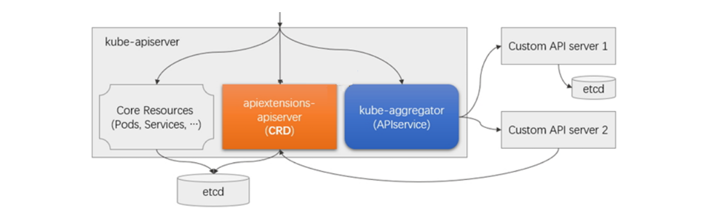
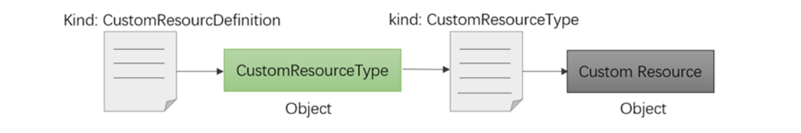
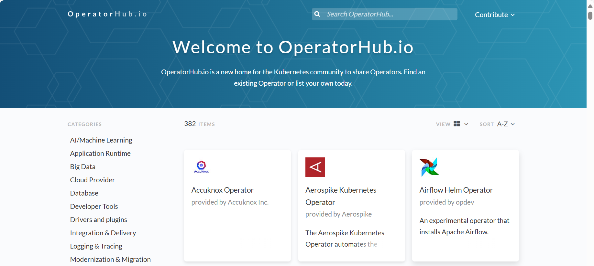

## Kubernetes有状态服务管理

**本章内容**

- **StatefulSet**
- **CRD**
- **Operator**


### StatefulSet

#### StatefulSet 机制

```http
https://kubernetes.io/zh-cn/docs/tutorials/stateful-application/
https://kubernetes.io/zh-cn/docs/tasks/run-application/run-single-instance-stateful-application/
```


##### 应用状态说明

**无状态 和 有状态**

- **无状态（Stateless）**

  无状态的系统不会在多个请求之间保存任何状态信息。每个请求都独立处理，不考虑之前的请求或状态。

  无状态的每次的请求都是独立的，它的执行情况和结果与前面的请求和之后的请求是无直接关系 的，它不会受前面的请求应答情况直接影响，也不会直接影响后面的请求应答情况

  典型的无状态系统包括HTTP协议、RESTful API等。每个请求都包含了足够的信息来完成其处理， 服务器不需要保存任何客户端的状态信息。

- **有状态（Statefulset）**

  有状态的系统在处理请求或通信时会记住之前的状态信息。这意味着系统会存储客户端的历史信息 或状态，并基于这些信息进行处理

  有状态应用会在其会话中保存客户端的数据，并且有可能会在客户端下一次的请求中使用这些数据

  应用上常见的状态类型:会话状态、连接状态、配置状态、集群状态、持久性状态等

  典型的有状态系统包括数据库系统、TCP连接等。这些系统需要在通信过程中维护状态信息，以确 保数据的可靠性和一致性。

**无状态和有状态应用区别**

- **复杂度**：有状态系统通常比无状态系统更复杂，因为它们需要维护和管理状态信息。无状态系统则 更简单，因为它们不需要处理状态信息。
- **可伸缩性**：无状态系统通常更易于扩展，因为它们不需要考虑会话状态，可以更容易地实现负载均 衡和水平扩展。有状态系统可能需要更复杂的状态管理和同步机制，因此在大规模应用中可能需要 更多的资源和设计考虑。

大型应用通常具有众多功能模块，这些模块通常会被设计为**有状态模块**和**无状态模块**两部分

- 业务逻辑模块一般会被设计为无状态，这些模块需要将其状态数据保存在有状态的中间件服务上， 如消息队列、数据库或缓存系统等
- 无状态的业务逻辑模块易于横向扩展，有状态的后端则存在不同的难题

Http 协议是无状态的，对于http协议本身的每一次请求都是相互独立的，彼此之间没有关联关系。

而 Http 相关的应用往往是有状态的。

很多的 Web 程序是需要有大量的业务逻辑相互关联才可以实现最终的目标，也就是说基于http协议的 web应用程序是有状态的。

只不过这个状态是需要借助于其他的机制来实现，比如 cookies、session、token以及其他辅助的机 制。

为了实现http的会话有状态，基于 cookies、session、token等机制都涉及到文件的保存，要么保存到 客户端，要么保存到服务端。

以session为例，就在服务端保存相关的信息，提高正常通信的效率。

实际的生产环境中，web程序为了保证高可用，所以通过集群的方式实现，应用的访问分布式效果。

在这种场景中，可以基于下面方法实现有状态的会话保持

- **session sticky** - 根据用户的行为数据，找到上次响应请求的服务器，直接响应
- **session cluster** - 通过服务集群之间的通信机制实现会话数据的同步
- **session server** - 借助于一个专用的服务器来保存会话信息。


生产中一些中间件业务集群，比如MySQL集群、Redis集群、ElasticSearch集群、MongoDB集群、 Nacos集群、MinIO集群、Zookeeper集群、Kafka集群、RabbitMQ集群等

这些应用集群都有以下相同特点：

- 每个节点都有固定的身份ID，集群成员通过身份ID进行通信
- 集群的规模是比较固定的，一般不能随意变动
- 节点都是由状态的，而且状态数据通常会做持久化存储
- 集群中某个节点出现故障，集群功能肯定受到影响。

像这种状态类型的服务，只要过程中存在一点问题，那么影响及范围都是不可预测。

**应用编排工作负载型控制器**

- 无状态应用编排:Deployment<--ReplicaSet
- 系统级应用编排:DaemonSet
- 有状态应用编排: StatefulSet
- 作业类应用编排:CronJob <--job


##### StatefulSet 工作机制

###### StatefulSet 介绍

Pod的管理对象有Deployment，RS、DaemonSet、RC这些都是面向无状态的服务，满足不了上述的有 状态集群的场景需求

从Kubernetes-v1.4版本引入了集群状态管理的功能，v1.5版本更名为StatefulSet 有状态应用副本集

StatefulSet 最早在 Kubernetes 1.5 版本中引入，作为一个 alpha 特性。经过几个版本的改进和稳定， 在 Kubernetes 1.9 版本中，StatefulSet 变成了一个稳定的、通用可用（GA，General Availability）的 特性。

StatefulSet 旨在与有状态的应用及分布式系统一起使用。然而在 Kubernetes 上管理有状态应用和分布 式系统是一个宽泛而复杂的话题。

由于每个有状态服务的特点，工作机制和配置方式都存在很大的不同，因此当前Kubernetes并没有提供 统一的具体的解决方案

```ABAP
而 Statefulset 只是为有状态应用提供了基础框架，而非完整的解决方案
如果想实现具体的有状态应用，建议可以使用相应的专用 Operator 实现
```


###### StatefulSet 特点

- 每个Pod 都有稳定、唯一的网络访问标识
- 每个**Pod 彼此间的通信基于Headless Service实现**
- StatefulSet 控制的Pod副本启动、扩展、删除、更新等操作都是有顺序的
- StatefulSet里的每个Pod存储的数据不同，所以采用专用的稳定独立的持久化存储卷，用于存储 Pod的状态数据


###### StatefulSet 对应Pod 的网络标识

- 每个StatefulSet对象对应于一个专用的Headless Service 对象

- 使用 Headless service 给每一个StatufulSet控制的Pod提供一个唯一的DNS域名来作为每个成员的 网络标识
- 每个Pod都一个从0开始，从小到的序号的名称，创建和扩容时序号从小到大，删除，缩容和更新 镜像时从大到小
- 通过ClusterDNS解析为Pod的地址，从而实现集群内部成员之间使用域名通信

每个Pod对应的DNS域名格式：

```bash
$(statefulset_name)-$(orederID).$(headless_service_name).$(namespace_name).svc.cluster.local
 
#示例
mysql-0.mysql.wordpress.svc.cluster.local
mysql-1.mysql.wordpress.svc.cluster.local
mysql-2.mysql.wordpress.svc.cluster.local
```


###### StatefulSet的 Pod 管理策略 Pod Management Policy

定义创建、删除及扩缩容等管理操作期间，在Pod副本上的创建两种模式

- **OrderedReady**

  创建或扩容时，**顺次**完成各Pod副本的创建，且要求只有前一个Pod转为Ready状态后，才能进行后一个Pod副本的创建

  删除或缩容时，逆序、依次完成相关Pod副本的终止

- **Parallel**

  各Pod副本的创建或删除操作不存在顺序方面的要求，可同时进行


###### StatefulSet 的存储方式

- 基于podTempiate定义Pod模板
- 在`podTemplate`上使用`volumeTemplate`为各Pod副本动态置备`PersistentVolume`
- 因为每个Pod存储的状态数据不尽相同，所以在创建每一个Pod副本时绑定至专有的固定的PVC
-  **PVC的名称遵循特定的格式，从而能够与StatefulSet控制器对象的Pod副本建立紧密的关联关系**
- 支持从静态置备或动态置备的PV中完成绑定
- 删除Pod(例如缩容)，并不会一并删除相关的PVC


###### StatefulSet 组件

| 组件                | 描述                                                         |
| ------------------- | ------------------------------------------------------------ |
| headless service    | 一般的Pod名称是随机的，而为了statefulset的唯一性，所以借用 headless service通过唯一的"网络标识"来直接指定的pod应用，所以它要求我们的**dns环境**是完好的。<br />当一个StatefulSet挂掉，新创建的StatefulSet会被赋予跟原来的Pod 一样的名字，通过这个名字来匹配到原来的存储，实现了状态保存。 |
| volumeClaimTemplate | 有状态集群中的副本数据是不一样的(例：redis)，如果用共享存储的 话，会导致多副本间的数据被覆盖，为了statefulsed数据持久化，需要将pod和其申请的数据卷隔离开，**每一种pod都有其独立的对应的数据卷配置模板**，来满足该要求。 |


###### StatefulSet 局限性

根据对 StatefulSet的原理解析，如果实现一个通用的有状态应用的集群，那基本没有可能完成

原因是不同的应用集群，其内部的状态机制几乎是完全不同的

| 集群           | 解析                                                         |
| -------------- | ------------------------------------------------------------ |
| MySQL 主从集群 | 当向当前数据库集群添加从角色节点的时候，可不仅仅为添加一个唯一的节点标识及对 应的后端存储就完了。我们要提前知道，从角色节点的时间、数据复制的起始位置(日志文件名、日志位置、时间戳等)，然后才可以进行数据的同步。 |
| Redis 主从集群 | 集群中，添加节点的时候，会自动根据slaveof设定的主角色节点上获取最新的数据， 然后直接在本地还原，然后借助于软件专用的机制进行数据的同步机制。 |

- StatefulSet本身的代码无法考虑周全到所有的集群状态机制
- StatefulSet 只是提供了一个基础的编排框架
- 有状态应用所需要的管理操作，需要由用户自行编写代码完成

这也是为什么早期的Kubernetes只能运行无状态的应用，为了实现所谓的状态集群效果，只能将所有的 有状态服务独立管理，然后以自建EndPoint或者ExternalName的方式引入到Kubernetes集群中，实现 所谓的类似状态效果.

当前而这种方法仍然在很多企业中使用。


##### StatefulSet 配置

注意：StatefulSet除了需要定义自身的标签选择器和Pod模板等属性字段，StatefulSet必须要配置一个专用的Headless Service，而且还可能要根据需要，编写代码完成扩容、缩容等功能所依赖的必要操作步骤

**属性解析**

```yaml
apiVersion: apps/v1                    # API群组及版本
kind: StatefulSet                      # 资源类型的特有标识
metadata:             
  name: <string>                       # 资源名称，在作用域中要唯一
  namespace: <string>                  # 名称空间：Statefulset隶属名称空间级别
spec:
  replicas: <integer>                  # 期望的pod副本数，默认为1
  selector: <object>                   # 标签选择器，须匹配pod模版中的标签，必选字段
  template: <object>                   # pod模版对象，必选字段
  revisionHistoryLimit: <integer>      # 滚动更新历史记录数量，默认为10
  updateStragegy: <Object>             # 滚动更新策略
    type: <string>                     # 指定更新策略类型，可用值：OnDelete和Rollingupdate
                                       # OnDelete 表示只有在手动删除旧 Pod 后才会触发更新
                                       # RollingUpdate 表示会自动进行滚动更新
    rollingUpdate: <Object>            # 滚动更新参数，专用于RollingUpdate类型
      maxUnavailable: <integer>        # 更新期间可比期望的Pod数量缺少的数量或比例
      partition: <integer>             # 分区值，表示只更新大于等于此索引值的Pod，默认为0,一般用于金丝雀场景，更新和                                              缩容时都是索引号的Pod从大到小进行，即按从大到小的顺序进行，比如：                                                       MySQL2,MySQL-1,MySQL-0
  serviceName: <string>                # 相关的Headless Service的名称，必选字段
    apiVersion: <string>               # PVC资源所属的API群组及版本，可省略
    kind: <string>                     # PVC资源类型标识，可省略
    metadata: <Object>                 # 卷申请模板元数据
    spec: <Object>                     # 期望的状态，可用字段同PVC
  podManagementPolicy: <string>        # Pod管理策略，默认“OrderedReady”表示顺序创建并逆序删除，“Parallel”表示并                                              行模式
  volumeClaimTemplates: <[]Object>     # 指定PVC的模板.存储卷申请模板，实现数据持久化
  - metadata:
    name: <string>                     # 生成的PVC的名称格式为：<volumeClaimTemplates>. <StatefulSet>-<orederID>
    spec:
      accessModes: ["ReadWriteOnce"]
      storageClassName: "sc-nfs"       #  如果有动态置备的StorageClass,可以指定名称
      resources:
        requests:
          storage: 1Gi
```

范例:  简单 statefulset

```bash
[root@master1 yaml]# cat statefulset-demo.yaml
apiVersion: v1
kind: Service
metadata:
  name: nginx
  labels:
    app: nginx
spec:
  ports:
  - port: 80
    name: http
  clusterIP: None   # 可使用无头服务或有头服务,因为每个有状态服务的Pod功能不同,所以一般会使用无头服务,防止利用同一个Service                       名称随机解析到不同的Pod
  selector:
    app: nginx
    
---
apiVersion: apps/v1
kind: StatefulSet
metadata:
  name: web
spec:
  serviceName: "nginx"
  replicas: 2
  selector:
    matchLabels:
      app: nginx
  template:
    metadata:
      labels:
        app: nginx
    spec:
      containers:
      - name: nginx
        image: registry.cn-beijing.aliyuncs.com/wangxiaochun/pod-test:v0.1
        ports:
        - containerPort: 80
          name: http
          
[root@master1 yaml]# kubectl apply -f statefulset-demo.yaml

# 观察到Pod按顺序创建
[root@master1 ~]#kubectl get pod -w
NAME                        READY   STATUS    RESTARTS       AGE
web-0                       1/1     Running   0              11s
web-1                       1/1     Running   0              7s

# 测试名称解析
[root@master1 ~]#kubectl exec pod-test1-cd487559d-cjmxk -- host nginx
nginx.default.svc.cluster.local has address 192.168.123.19
nginx.default.svc.cluster.local has address 192.168.22.162

# 查看
[root@master1 ~]#kubectl get pod -o wide 
NAME                        READY   STATUS    RESTARTS       AGE    IP                NODE
web-0                       1/1     Running   0              20m    192.168.123.19    node3.mystical.org   <none>           <none>
web-1                       1/1     Running   0              20m    192.168.22.162    node1.mystical.org   <none>           <none>

# 访问完整的service名称,注意最后的点号
[root@master1 ~]#kubectl exec pod-test1-cd487559d-cjmxk -- host nginx.default.svc.cluster.local.
nginx.default.svc.cluster.local has address 192.168.123.19
nginx.default.svc.cluster.local has address 192.168.22.162

# 访问测试
[root@master1 ~]#kubectl exec -it pod-test1-cd487559d-cjmxk -- sh
[root@pod-test1-cd487559d-cjmxk /]# curl nginx
kubernetes pod-test v0.1!! ClientIP: 192.168.22.130, ServerName: web-1, ServerIP: 192.168.22.162!
[root@pod-test1-cd487559d-cjmxk /]# curl nginx
kubernetes pod-test v0.1!! ClientIP: 192.168.22.130, ServerName: web-0, ServerIP: 192.168.123.19!


# 观察扩容和缩容都按顺序
[root@master1 ~]#kubectl scale sts web --replicas 5
statefulset.apps/web scaled
[root@master1 ~]#kubectl get statefulsets.apps 
NAME   READY   AGE
web    3/5     4h38m
[root@master1 ~]#kubectl get statefulsets.apps 
NAME   READY   AGE
web    4/5     4h38m
[root@master1 ~]#kubectl get statefulsets.apps 
NAME   READY   AGE
web    5/5     4h38m

# 查看扩容和缩容的过程,扩容是Pod编号从小到大,缩容正好反之
# 观察到service为无头服务
[root@master1 ~]#kubectl get svc nginx
NAME    TYPE        CLUSTER-IP   EXTERNAL-IP   PORT(S)   AGE
nginx   ClusterIP   None         <none>        80/TCP    4h48m

# 支持缩写
[root@master1 ~]#kubectl get sts
NAME   READY   AGE
web    5/5     4h54m

# 查看主机名和host解析
[root@master1 ~]#kubectl exec -it web-0 -- hostname
web-0
[root@master1 ~]#kubectl exec -it web-1 -- hostname
web-1
[root@master1 ~]#kubectl exec -it web-2 -- hostname
web-2

[root@master1 ~]#kubectl exec -it web-1 -- cat /etc/hosts
# Kubernetes-managed hosts file.
127.0.0.1	localhost
::1	localhost ip6-localhost ip6-loopback
fe00::0	ip6-localnet
fe00::0	ip6-mcastprefix
fe00::1	ip6-allnodes
fe00::2	ip6-allrouters
192.168.22.162	web-1.nginx.default.svc.cluster.local	web-1
```

范例: 级联删除和非级联删除

```bash
# 默认是级联删除,即删除 sts 同时删除 Pod
[root@master1 ~]#kubectl delete sts web 
statefulset.apps "web" deleted

#非级联删除,即删除sts不同时删除Pod,选项--cascade=orphan(旧版false废弃)
[root@master1 ~]#kubectl delete sts web --cascade=orphan
statefulset.apps "web" deleted

# 查看sts删除,Pod仍在,但Pod为孤儿状态,即删除Pod,将不会被重建
[root@master1 ~]#kubectl get sts
No resources found in default namespace.

[root@master1 ~]#kubectl get pod
web-0                       1/1     Running   0               2m50s
web-1                       1/1     Running   0               2m46s

# 删除Pod查看是否被重建
[root@master1 ~]#kubectl delete pod web-0
pod "web-0" deleted
```


##### StatefulSet 更新策略

更新策略可以实现滚动更新发布

```yaml
  updateStrategy: <Object>         # 滚动策略
    type: <string>                 # 滚动更新类型，可用值有OnDelete和RollingUpdate
    rollingUpdate: <Object>        # 滚动更新参数，专用于RollingUpdate类型
      partition: <integer>         # 分区指示索引值，默认为0,一般用于版本分区域更新场景
```

**快速对比表**：

| 类型            | 含义                                        | 是否自动更新 Pod     | 使用场景                                 | 是否常用 |
| --------------- | ------------------------------------------- | -------------------- | ---------------------------------------- | -------- |
| `RollingUpdate` | 自动按顺序滚动更新 StatefulSet 中的 Pod     | ✅ 是                 | 版本更新、无状态或轻微有状态的服务       | 常用     |
| `OnDelete`      | 仅当手动删除 Pod 后，才会用新的版本重新创建 | ❌ 否（需手动删 Pod） | 对升级控制要求严格的数据库、中间件等场景 | 次常用   |

**结合 `rollingUpdate.partition` 使用（灰度升级）**

```yaml
updateStrategy:
  type: RollingUpdate
  rollingUpdate:
    partition: 1
```

表示只有 `ordinal >= 1` 的 Pod 会被更新，比如：

- `pod-1`, `pod-2` 会更新
- `pod-0` 保持原样

🎯 用于灰度或分批升级，比如先升级从节点，最后升级主节点。

**范例: 更新策略**

```bash
# 查看更新策略
[root@master1 ~]#kubectl get sts web -o yaml|grep -A5 -i UpdateStrategy
  updateStrategy:
    rollingUpdate:
      partition: 0               #此编号表示更新时只更新大于等于此编号对应的Pod,小于此编号的Pod不会更新,0表示每次全部更                                     新,比如:共5个Pod: web{0..4},此处设为2,则从Web-2开始更新,可以通过不断从大到小的修改此                                   值,可以实现滚动更新策略
    type: RollingUpdate
......

#升级image版本
[root@master1 yaml]#kubectl edit sts web
    - image: registry.cn-beijing.aliyuncs.com/wangxiaochun/pod-test:v0.2
    
#观察更新顺序,发现Pod编号从大到小更新
[root@master1 ~]#kubectl get pod
web-0                       1/1     Running       0               5m12s
web-1                       1/1     Terminating   0               5m8s

[root@master1 ~]#kubectl get pod
web-0                       1/1     Running             0               5m16s
web-1                       0/1     ContainerCreating   0               2s

[root@master1 ~]#kubectl get pod
web-0                       1/1     Terminating   0               5m37s
web-1                       1/1     Running       0               23s

[root@master1 ~]#kubectl get pod
web-0                       1/1     Running   0               15s
web-1                       1/1     Running   0               58s

#扩容为5个Pod
[root@master1 ~]#kubectl scale sts web --replicas 5

#修改更新策略为4
[root@master1 ~]#kubectl edit sts web
.....
      - image: registry.cn-beijing.aliyuncs.com/wangxiaochun/pod-test:v0.3  #修改镜像版本
.....
  updateStrategy:
    rollingUpdate:
      partition: 4  #将此处的0修改为4
    type: RollingUpdate
.....

#确认web-4以下Pod不更新
[root@master1 ~]#kubectl get pod web-4 -o yaml|grep -m1  image
  - image: registry.cn-beijing.aliyuncs.com/wangxiaochun/pod-test:v0.3
[root@master1 ~]#kubectl get pod web-3 -o yaml|grep -m1  image
  - image: registry.cn-beijing.aliyuncs.com/wangxiaochun/pod-test:v0.2
[root@master1 ~]#kubectl get pod web-2 -o yaml|grep -m1  image
  - image: registry.cn-beijing.aliyuncs.com/wangxiaochun/pod-test:v0.2
[root@master1 ~]#kubectl get pod web-1 -o yaml|grep -m1  image
  - image: registry.cn-beijing.aliyuncs.com/wangxiaochun/pod-test:v0.2
[root@master1 ~]#kubectl get pod web-0 -o yaml|grep -m1  image
  - image: registry.cn-beijing.aliyuncs.com/wangxiaochun/pod-test:v0.2
  
# 修改更新策略为1
[root@master1 ~]#kubectl edit sts web
......
  updateStrategy:
    rollingUpdate:
      partition: 1  #修改此处为1
    type: RollingUpdate
......

#观察结果,发现web-1以上都更新
[root@master1 ~]#kubectl get pod web-4 -o yaml|grep -m1  image
  - image: registry.cn-beijing.aliyuncs.com/wangxiaochun/pod-test:v0.3
[root@master1 ~]#kubectl get pod web-3 -o yaml|grep -m1  image
  - image: registry.cn-beijing.aliyuncs.com/wangxiaochun/pod-test:v0.3
[root@master1 ~]#kubectl get pod web-2 -o yaml|grep -m1  image
  - image: registry.cn-beijing.aliyuncs.com/wangxiaochun/pod-test:v0.3
[root@master1 ~]#kubectl get pod web-1 -o yaml|grep -m1  image
  - image: registry.cn-beijing.aliyuncs.com/wangxiaochun/pod-test:v0.3
[root@master1 ~]#kubectl get pod web-0 -o yaml|grep -m1  image
  - image: registry.cn-beijing.aliyuncs.com/wangxiaochun/pod-test:v0.2
  
# 修改更新策略为OnDelete,表示只有删除时才更新
[root@master1 ~]#kubectl edit sts web
.......
      containers:
      - image: registry.cn-beijing.aliyuncs.com/wangxiaochun/pod-test:v0.3  #修改版本
      ....
 updateStrategy:
    type: OnDelete       # 修改更新策略
.......

# 观察到没有变化

# 删除指定Pod
[root@master1 ~]#kubectl delete pod web-0
pod "web-0" deleted
[root@master1 ~]#kubectl get pod
NAME                        READY   STATUS               RESTARTS        AGE
web-0                       0/1     ContainerCreating    0               43s
web-1                       1/1     Running              0               79s
web-2                       1/1     Running              0               115s

#发现只有删除的Pod才更新镜像

# 全部删除，删除后，则会按顺序从小到大创建Pod
```


#### 案例：StatefulSet 简单案例

##### 准备NFS服务和动态置备

```bash
# 详情参考Kubernetes数据存储 -> StorageClass -> NFS StorageClass
# 查看定义好的StorageClass
[root@master1 ~]#kubectl get storageclasses.storage.k8s.io
NAME               PROVISIONER                                   RECLAIMPOLICY   VOLUMEBINDINGMODE   ALLOWVOLUMEEXPANSION   AGE
sc-nfs (default)   k8s-sigs.io/nfs-subdir-external-provisioner   Delete          Immediate           false                  40d
```

##### 准备 Service资源

```bash
# 准备无头服务
[root@master1 statefulset]#cat sts-headless.yaml 
apiVersion: v1
kind: Service
metadata:
  name: statefulset-headless
spec:
  ports:
  - port: 80
  clusterIP: None
  selector:
    app: myapp-pod

[root@master1 statefulset]#kubectl apply -f sts-headless.yaml 
service/statefulset-headless created

[root@master1 statefulset]#kubectl get svc statefulset-headless 
NAME                   TYPE        CLUSTER-IP   EXTERNAL-IP   PORT(S)   AGE
statefulset-headless   ClusterIP   None         <none>        80/TCP    58s
```

##### 创建 statefulset 资源

```bash
#清单文件
[root@master1 statefulset]#cat sts-test.yaml 
apiVersion: apps/v1
kind: StatefulSet
metadata:
  name: myapp
spec:
  serviceName: statefulset-headless
  replicas: 3
  selector:
    matchLabels:
      app: myapp-pod
  template:
    metadata:
      labels:
        app: myapp-pod
    spec:
      containers:
      - name: myapp
        image: registry.cn-beijing.aliyuncs.com/wangxiaochun/nginx:1.20.0
        volumeMounts:
        - name: myappdata
          mountPath: /usr/share/nginx/html
  volumeClaimTemplates:
  - metadata:
      name: myappdata
    spec:
      accessModes: ["ReadWriteOnce"]
      storageClassName: "sc-nfs"
      resources:
        requests:
          storage: 1Gi

[root@master1 statefulset]#kubectl apply -f sts-test.yaml 
statefulset.apps/myapp created
```

**验证结果**

```bash
# 结果显示：所有的资源对象(pod+pv)都是按照顺序创建的，而且每个pv都有自己独有的标识符
[root@master1 statefulset]#kubectl get pod
NAME                        READY   STATUS    RESTARTS      AGE
myapp-0                     1/1     Running   0             3m23s
myapp-1                     1/1     Running   0             2m45s
myapp-2                     1/1     Running   0             2m7s

[root@master1 statefulset]#kubectl get pvc
NAME                STATUS   VOLUME                                     CAPACITY   ACCESS MODES   STORAGECLASS   VOLUMEATTRIBUTESCLASS   AGE
myappdata-myapp-0   Bound    pvc-4affd28a-5835-4018-bb49-ad07f19b89c4   1Gi        RWO            sc-nfs         <unset>                 4m16s
myappdata-myapp-1   Bound    pvc-d617b16a-112c-4355-b88f-d81bb699c2a7   1Gi        RWO            sc-nfs         <unset>                 3m38s
myappdata-myapp-2   Bound    pvc-357b644a-5de5-4889-a9cb-40250d89d6f3   1Gi        RWO            sc-nfs         <unset>                 3m

[root@ubuntu2204 default-myappdata-myapp-0-pvc-4affd28a-5835-4018-bb49-ad07f19b89c4]#echo myapp-0 > /data/sc-nfs/default-myappdata-myapp-0-pvc-4affd28a-5835-4018-bb49-ad07f19b89c4/index.html
[root@ubuntu2204 default-myappdata-myapp-1-pvc-d617b16a-112c-4355-b88f-d81bb699c2a7]#echo myapp-1 > /data/sc-nfs/default-myappdata-myapp-1-pvc-d617b16a-112c-4355-b88f-d81bb699c2a7/index.html
[root@ubuntu2204 default-myappdata-myapp-2-pvc-357b644a-5de5-4889-a9cb-40250d89d6f3]#echo myapp-2 > /data/sc-nfs/default-myappdata-myapp-2-pvc-357b644a-5de5-4889-a9cb-40250d89d6f3/index.html

[root@master1 /]#kubectl get pod -o wide
myapp-0                     1/1     Running   0             22m     192.168.123.49   node3.mystical.org   <none>           <none>
myapp-1                     1/1     Running   0             21m     192.168.22.223   node1.mystical.org   <none>           <none>
myapp-2                     1/1     Running   0             20m     192.168.253.40   node2.mystical.org   <none> 

[root@master1 /]#curl 192.168.123.49
myapp-0
[root@master1 /]#curl 192.168.22.223
myapp-1
[root@master1 /]#curl 192.168.253.40
myapp-2
```


##### 缩容和扩容

缩容和扩容都是按一定的顺序进行的

扩容是从编号为0到N的顺序创建Pod

缩容正好相反, 是从编号N到0的顺序销毁Pod

```bash
# 缩容，从大到小删除
[root@master1 /]#kubectl scale sts myapp --replicas=1; kubectl get pod -w
statefulset.apps/myapp scaled
NAME                        READY   STATUS        RESTARTS      AGE
myapp-0                     1/1     Running       0             30m
myapp-1                     1/1     Running       0             29m
myapp-2                     1/1     Terminating   0             29m
myapp-2                     0/1     Terminating   0             29m
myapp-1                     1/1     Terminating   0             30m
myapp-1                     0/1     Terminating   0             30m

[root@master1 /]#kubectl get pvc
NAME                STATUS   VOLUME                                     CAPACITY   ACCESS MODES   STORAGECLASS   VOLUMEATTRIBUTESCLASS   AGE
myappdata-myapp-0   Bound    pvc-4affd28a-5835-4018-bb49-ad07f19b89c4   1Gi        RWO            sc-nfs         <unset>                 32m
myappdata-myapp-1   Bound    pvc-d617b16a-112c-4355-b88f-d81bb699c2a7   1Gi        RWO            sc-nfs         <unset>                 31m
myappdata-myapp-2   Bound    pvc-357b644a-5de5-4889-a9cb-40250d89d6f3   1Gi        RWO            sc-nfs         <unset>                 31m

# 可以看到：pod的删除不影响pv和pvc，说明pod的状态数据没有丢失，而且pvc指定的名称不变，只要是同一个statufulset创建的pod，会自动找到根据指定的pvc找到具体的pv
# pvc 的名称是 <PVC_name>-<POD_name>的组合，所以pod可以直接找到绑定的pvc

# 扩容，从小到大创建pod
[root@master1 /]#kubectl scale sts myapp --replicas=4; kubectl get pod -w
statefulset.apps/myapp scaled
NAME                        READY   STATUS              RESTARTS      AGE 
myapp-0                     1/1     Running             0             33m
myapp-1                     0/1     ContainerCreating   0             1s
myapp-1                     0/1     ContainerCreating   0             3s
myapp-1                     1/1     Running             0             5s
myapp-2                     0/1     Pending             0             0s
myapp-2                     0/1     Pending             0             0s
myapp-2                     0/1     ContainerCreating   0             0s
myapp-2                     0/1     ContainerCreating   0             2s
myapp-2                     1/1     Running             0             4s
myapp-3                     0/1     Pending             0             0s
myapp-3                     0/1     Pending             0             0s
myapp-3                     0/1     Pending             0             2s
myapp-3                     0/1     ContainerCreating   0             2s
myapp-3                     0/1     ContainerCreating   0             4s
myapp-3                     1/1     Running             0             6s

# 只要是同一个statufulset创建的pod，会自动找到根据指定的pvc找到具体的pv
[root@master1 /]#curl 192.168.253.72
myapp-2
```

##### 名称访问

自动创建pod的名称默认是可以解析的

```bash
[root@master1 /]#kubectl exec -it pod-test1-cd487559d-cjmxk -- sh
[root@pod-test1-cd487559d-cjmxk /]# nslookup statefulset-headless
Server:		10.96.0.10
Address:	10.96.0.10#53

Name:	statefulset-headless.default.svc.cluster.local
Address: 192.168.123.47
Name:	statefulset-headless.default.svc.cluster.local
Address: 192.168.253.72
Name:	statefulset-headless.default.svc.cluster.local
Address: 192.168.123.49
Name:	statefulset-headless.default.svc.cluster.local
Address: 192.168.22.215

# 注意：Pod可以直接解析自己的pod名称，解析其他pod的名称必须携带其无头服务的完整名称
# 完整名称格式：
# <statefulsetNmae>-<n>.<headless_name>.<ns_name>.svc.<k8s-clusterDoamin>
[root@pod-test1-cd487559d-cjmxk /]# nslookup myapp-0.statefulset-headless.default.svc.clust
er.local
Server:		10.96.0.10
Address:	10.96.0.10#53

Name:	myapp-0.statefulset-headless.default.svc.cluster.local
Address: 192.168.123.49

[root@pod-test1-cd487559d-cjmxk /]# nslookup myapp-1.statefulset-headless.default.svc.clust
er.local
Server:		10.96.0.10
Address:	10.96.0.10#53

Name:	myapp-1.statefulset-headless.default.svc.cluster.local
Address: 192.168.22.215

[root@pod-test1-cd487559d-cjmxk /]# nslookup myapp-2.statefulset-headless.default.svc.clust
er.local
Server:		10.96.0.10
Address:	10.96.0.10#53

Name:	myapp-2.statefulset-headless.default.svc.cluster.local
Address: 192.168.253.72

# 直接访问svc-headless，则会自动轮询访问
[root@pod-test1-cd487559d-cjmxk /]# curl statefulset-headless
myapp-1
[root@pod-test1-cd487559d-cjmxk /]# curl statefulset-headless
myapp-2
[root@pod-test1-cd487559d-cjmxk /]# curl statefulset-headless
myapp-0

# statefulset中，pod的主机名和pod名一致
[root@master1 /]#kubectl exec myapp-0 -- hostname
myapp-0
```


#### 案例：MySQL 主从复制集群

注意: MySQL5.7.39失败,其它版本MySQL5.7.36，44 都成功

```http
https://kubernetes.io/zh-cn/docs/tasks/run-application/run-replicated-stateful-application/
```

架构设计

```bash
# 创建两个SVC实现读写分离
# SVC：所有节点，读操作
# SVC-headless：mysql-0 写操作
```


##### 准备 NFS 服务和 StorageClass 动态置备

```bash
# 详情参考Kubernetes数据存储 -> StorageClass -> NFS StorageClass
# 查看定义好的StorageClass
[root@master1 ~]#kubectl get storageclasses.storage.k8s.io
NAME               PROVISIONER                                   RECLAIMPOLICY   VOLUMEBINDINGMODE   ALLOWVOLUMEEXPANSION   AGE
sc-nfs (default)   k8s-sigs.io/nfs-subdir-external-provisioner   Delete          Immediate           false                  40d
```


##### 创建 ConfigMap

```bash
# MySQL的配置
[root@master1 statefulset]#cat sts-mysql-configmap.yaml 
apiVersion: v1
kind: ConfigMap
metadata:
  name: mysql
  labels:
    app: mysql
    app.kubernetes.io/name: mysql
data:
  primary.cnf: |
    [mysqld]
    log-bin
  replica.cnf: |
    [mysqld]
    super-read-only
```


##### 创建 Service

```bash
# 为 StatefulSet 成员提供稳定的 DNS 表项的无头服务（Headless Service）
#  主节点的对应的Service

[root@master1 statefulset]#cat sts-mysql-svc.yaml 
apiVersion: v1
kind: Service
metadata:
  name: mysql
  labels:
    app: mysql
    app.kubernetes.io/name: mysql
spec:
  ports:
  - name: mysql
    port: 3306
  clusterIP: None
  selector:
    app: mysql
---
# 用于连接到任一 MySQL 实例执行读操作的客户端服务
# 对于写操作，必须连接到主服务器：mysql-0.mysql
# 从节点的对应的Service，注意：此处无需无头服务（Headless Service）
# 下面的service可以不创建，直接使用无头服务mysql也可以
apiVersion: v1
kind: Service
metadata:
  name: mysql-read
  labels:
    app: mysql
    app.kubernetes.io/name: mysql
    readonly: "true"
spec:
  ports:
  - name: mysql
    port: 3306
  selector:
    app: mysql
```


##### 创建 statefulset

```bash
[root@master1 statefulset]#cat sts-mysql-sts.yaml 
apiVersion: apps/v1
kind: StatefulSet
metadata:
  name: mysql
spec:
  selector:
    matchLabels:
      app: mysql
      app.kubernetes.io/name: mysql
  serviceName: mysql
  replicas: 3
  template:
    metadata:
      labels:
        app: mysql
        app.kubernetes.io/name: mysql
    spec:
      initContainers:
      - name: init-mysql
        image: registry.cn-beijing.aliyuncs.com/wangxiaochun/mysql:5.7
        command:
        - bash
        - "-c"
        - |
          # -e: 如果任何命令失败（返回非0），立即退出脚本
          # -x: 输出执行的每一条命令（调试用），可以帮助追踪问题
          # 目的是为了确保脚本执行时透明、可调试，并且失败即停。
          set -ex
          # 基于 Pod 序号生成 MySQL 服务器的 ID。
          [[ $HOSTNAME =~ -([0-9]+)$ ]] || exit 1
          # BASH_REMATCH 是 Bash Shell 的一个内置数组变量，专门用于 正则表达式匹配结果的
          # 当你使用 [[ string =~ regex ]] 这种语法做 正则匹配 时
          # BASH_REMATCH[0] 会包含完整匹配的字符串
          # BASH_REMATCH[1] 开始依次是 每个括号捕获组（capture group）匹配到的内容
          ordinal=${BASH_REMATCH[1]}
          echo [mysqld] > /mnt/conf.d/server-id.cnf
          # 添加偏移量以避免使用 server-id=0 这一保留值。
          echo server-id=$((100 + $ordinal)) >> /mnt/conf.d/server-id.cnf
          # 将合适的 conf.d 文件从 config-map 复制到 emptyDir
          if [[ $ordinal -eq 0 ]]; then
            cp /mnt/config-map/primary.cnf /mnt/conf.d/
          else
            cp /mnt/config-map/replica.cnf /mnt/conf.d/
          fi
        volumeMounts:
        - name: conf
          mountPath: /mnt/conf.d
        - name: config-map
          mountPath: /mnt/config-map
      - name: clone-mysql
        image: registry.cn-beijing.aliyuncs.com/wangxiaochun/xtrabackup:1.0
        command:
        # 副本 Pod 启动时，从前一个副本（ordinal-1）克隆数据库数据，用于初始化数据目录。
        # Pod 是有序启动的（如：mysql-0, mysql-1, mysql-2），且 mysql-1 从 mysql-0 取数据，mysql-2 从 mysql-1 取数据
        - bash
        - "-c"
        - |
          set -ex
          # 如果已有数据，则跳过克隆
          [[ -d /var/lib/mysql/mysql ]] && exit 0
          # 跳过主实例（序号索引0）的克隆
          [[ `hostname` =~ -([0-9]+)$ ]] || exit 1
          ordinal=${BASH_REMATCH[1]}
          [[ $ordinal -eq 0 ]] && exit 0
          # 从原来的对等节点克隆数据
          ncat --recv-only mysql-$(($ordinal-1)).mysql 3307 | xbstream -x -C /var/lib/mysql
          # 准备备份
          xtrabackup --prepare --target-dir=/var/lib/mysql
        volumeMounts:
        - name: data
          mountPath: /var/lib/mysql
          subPath: mysql
        - name: conf
          mountPath: /etc/mysql/conf.d
      containers:
      - name: mysql
        image: registry.cn-beijing.aliyuncs.com/wangxiaochun/mysql:5.7 
        env:
        - name: MYSQL_ALLOW_EMPTY_PASSWORD
          value: "1"
        ports:
        - name: mysql
          containerPort: 3306
        volumeMounts:
        - name: data
          mountPath: /var/lib/mysql
          subPath: mysql
        - name: conf
          mountPath: /etc/mysql/conf.d
        resources:
          requests:
            cpu: 500m
            memory: 1Gi
        livenessProbe:
          exec:
            command: ["mysqladmin", "ping"]
          initialDelaySeconds: 30
          periodSeconds: 10
          timeoutSeconds: 5
        readinessProbe:
          exec:
            # 检查我们是否可以通过 TCP 执行查询（skip-networking 是关闭的）
            command: ["mysql", "-h", "127.0.0.1", "-e", "SELECT 1"]
          initialDelaySeconds: 5
          periodSeconds: 2
          timeoutSeconds: 1
      - name: xtrabackup
        image: registry.cn-beijing.aliyuncs.com/wangxiaochun/xtrabackup:1.0
        ports:
        - name: xtrabackup
          containerPort: 3307
        command:
        - bash
        - "-c"
        - |
          set -ex
          cd /var/lib/mysql

          # 确定克隆数据的 binlog 位置（如果有的话）。
          if [[ -f xtrabackup_slave_info && "x$(<xtrabackup_slave_info)" != "x" ]]; then
            # XtraBackup 已经生成了部分的 “CHANGE MASTER TO” 查询
            # 因为从一个现有副本进行克隆。(需要删除末尾的分号!)
            cat xtrabackup_slave_info | sed -E 's/;$//g' > change_master_to.sql.in
            #  在这里要忽略 xtrabackup_binlog_info （它是没用的）
            rm -f xtrabackup_slave_info xtrabackup_binlog_info
          elif [[ -f xtrabackup_binlog_info ]]; then
            # 直接从主实例进行克隆。解析 binlog 位置
            [[ `cat xtrabackup_binlog_info` =~ ^(.*?)[[:space:]]+(.*?)$ ]] || exit 1
            rm -f xtrabackup_binlog_info xtrabackup_slave_info
            echo "CHANGE MASTER TO MASTER_LOG_FILE='${BASH_REMATCH[1]}',\
                  MASTER_LOG_POS=${BASH_REMATCH[2]}" > change_master_to.sql.in
          fi

          # 检查是否需要通过启动复制来完成克隆
          if [[ -f change_master_to.sql.in ]]; then
            echo "Waiting for mysqld to be ready (accepting connections)"
            until mysql -h 127.0.0.1 -e "SELECT 1"; do sleep 1; done

            echo "Initializing replication from clone position"
            mysql -h 127.0.0.1 \
                  -e "$(<change_master_to.sql.in), \
                          MASTER_HOST='mysql-0.mysql', \
                          MASTER_USER='root', \
                          MASTER_PASSWORD='', \
                          MASTER_CONNECT_RETRY=10; \
                        START SLAVE;" || exit 1
            # 如果容器重新启动，最多尝试一次
            mv change_master_to.sql.in change_master_to.sql.orig
          fi

          # 当对等点请求时，启动服务器发送备份。
          exec ncat --listen --keep-open --send-only --max-conns=1 3307 -c \
            "xtrabackup --backup --slave-info --stream=xbstream --host=127.0.0.1 --user=root"
        volumeMounts:
        - name: data
          mountPath: /var/lib/mysql
          subPath: mysql
        - name: conf
          mountPath: /etc/mysql/conf.d
        resources:
          requests:
            cpu: 100m
            memory: 100Mi
      volumes:
      - name: conf
        emptyDir: {} 
      - name: config-map
        configMap:
          name: mysql
  volumeClaimTemplates:
  - metadata: 
      name: data
    spec:
      accessModes: ["ReadWriteOnce"]
      storageClassName: "sc-nfs"
      resources:
        requests:
          storage: 10Gi
```

**验证**

```bash
[root@master1 statefulset]# kubectl apply -f sts-mysql-configmap.yaml
[root@master1 statefulset]#kubectl apply -f sts-mysql-svc.yaml
[root@master1 statefulset]#kubectl apply -f sts-mysql-sts.yaml

# 跟踪查看
[root@master1 statefulset]#kubectl get pod
NAME                        READY   STATUS    RESTARTS        AGE
mysql-0                     2/2     Running   0               15m
mysql-1                     2/2     Running   1 (10m ago)     13m
mysql-2                     2/2     Running   1 (7m23s ago)   10m


[root@master1 statefulset]#kubectl get pvc
NAME                STATUS   VOLUME                                     CAPACITY   ACCESS MODES   STORAGECLASS   VOLUMEATTRIBUTESCLASS   AGE
data-mysql-0        Bound    pvc-d5652db9-83f6-4cba-9948-41701ad1bf28   10Gi       RWO            sc-nfs         <unset>                 34m
data-mysql-1        Bound    pvc-a01ad5de-f70b-44af-a076-676285143eb1   10Gi       RWO            sc-nfs         <unset>                 13m
data-mysql-2        Bound    pvc-33d51af1-3ea0-4b90-afe9-e2ae0733517c   10Gi       RWO            sc-nfs         <unset>                 10m

# 测试主从
[root@master1 statefulset]#kubectl exec -it mysql-0 -- mysql
Defaulted container "mysql" out of: mysql, xtrabackup, init-mysql (init), clone-mysql (init)
Welcome to the MySQL monitor.  Commands end with ; or \g.
Your MySQL connection id is 258
Server version: 5.7.13-log MySQL Community Server (GPL)

Copyright (c) 2000, 2016, Oracle and/or its affiliates. All rights reserved.

Oracle is a registered trademark of Oracle Corporation and/or its
affiliates. Other names may be trademarks of their respective
owners.

Type 'help;' or '\h' for help. Type '\c' to clear the current input statement.

mysql> show processlist;
+-----+------+----------------------+------+-------------+------+---------------------------------------------------------------+------------------+
| Id  | User | Host                 | db   | Command     | Time | State                                                         | Info             |
+-----+------+----------------------+------+-------------+------+---------------------------------------------------------------+------------------+
| 112 | root | 192.168.22.226:44306 | NULL | Binlog Dump |  250 | Master has sent all binlog to slave; waiting for more updates | NULL             |
| 222 | root | 192.168.253.22:58180 | NULL | Binlog Dump |   67 | Master has sent all binlog to slave; waiting for more updates | NULL             |
| 258 | root | localhost            | NULL | Query       |    0 | starting                                                      | show processlist |
+-----+------+----------------------+------+-------------+------+---------------------------------------------------------------+------------------+
3 rows in set (0.00 sec)
```


### CRD 定制资源

#### CRD 说明

为了在k8s上能够正常的运行所需的服务，需要遵循以下方式来创建相关资源：

- 合理的分析业务需求
- 梳理业务需求的相关功能
- 定制不同功能的资源配置文件
- 应用资源配置文件，完善业务环境。

当前所有的操作基本上都是在k8s内置的有限的资源对象中进行相关的操作，这些资源对象适用于通用的 业务场景，而在我们的业务场景中，多多少少的会涉及到特殊功能的资源对象。

比如：监控场景需要监控的数据、日志场景需要收集的日志、流量场景需要传递的数据等等

为了高效的定制我们需要的环境，那么需要拥有一些专用的资源方便我们来使用，而在k8s之上提供了一个专用的接口，可以方便我们自己来定制需要的资源。


**扩展Kubernetes API常用方式：**

- 二次开发 API Server 源码,适合在添加新的**核心类型**时采用
- 开发自定义API Server并聚合至主API Server ,富于弹性但代码工作量大
- 使用CRD( Custom Resource Definition )自定义资源类型 , 易用但限制较多，对应的控制器还需再自行开发



示例: 查看calico 自定义的资源CRD

```bash
# calico环境创建的时候，就用到了很多CRD对象，而且我们为了让CRD能够生效，该软件还提供了一个controller的CRD控制器。这个控制器就是将CRD对象转换为真正有意义的现实的代码。
[root@master1 statefulset]#kubectl get pod -n kube-system |grep -i calico
calico-kube-controllers-77d59654f4-rwl4p       1/1     Running   22 (8h ago)   41d
calico-node-7xpvt                              1/1     Running   25 (8h ago)   41d
calico-node-8tn8p                              1/1     Running   22 (8h ago)   41d
calico-node-qqmsz                              1/1     Running   24 (8h ago)   41d
calico-node-wzdrm                              1/1     Running   24 (8h ago)   41d
```


##### CRD简介

资源（Resource） 是 Kubernetes API 中的一个端点， 其中存储的是某个类别的 API 对象 的一个集合。 例如内置的 pods 资源包含一组 Pod 对象

定制资源（Custom Resource） 是对 Kubernetes API 的扩展，不一定在默认的 Kubernetes 安装中就可用。定制资源所代表的是对特定 Kubernetes 安装的一种定制。 不过，很多 Kubernetes 核心功能现在都用定制资源来实现，这使得 Kubernetes 更加模块化。

CRD( Custom Resource Definition ) 定制资源可以通过动态注册的方式在运行中的集群内或出现或消失，集群管理员可以独立于集群更新定制资源。一旦某定制资源被安装，用户可以使用 kubectl 来创建 和访问其中的对象，就像他们为 pods 这种内置资源所做的一样。

CRD 功能是在 Kubernetes 1.7 版本被引入的，用户可以根据自己的需求添加自定义的 Kubernetes 对象资源。



##### 定制CRD的控制器

就定制资源本身而言，它只能用来存取结构化的数据。 当你将**定制资源**与**定制控制器**（Custom  Controller） 相结合时，定制资源就能够 提供真正的声明式 API（Declarative API）。

使用声明式 API， 你可以声明或者设定你的资源的期望状态，并尝试让 Kubernetes 对象的当前状态同 步到其期望状态。控制器负责将结构化的数据解释为用户所期望状态的记录，并持续地维护该状态。

**资源对象的定制方式:**

- 在现有的控制器基础上，扩展资源对象
- 从0开始定制资源对象和资源对象控制器，此方式需要具有编程语言的开发能力

通常情况下，一个CRD会结合对应的Controller，并添加一些其它资源，组成一个专属应用的 **Operator**，来解决特定应用的功能


#### CRD 配置解析

```yaml
apiVersion: apiextensions.k8s.io/v1          # API群组和版本
kind: CustomResourceDefinition               # 资源类别
metadata:
  name: <string>                             # 资源名称
spec:
  conversion: <Object>                       # 定义不同版本间的格式转换方式
    trategy: <string>                        # 不同版本间的自定义资源转换策略，有None和Webhook两种取值
    webhook: <Object>                        # 如何调用用于进行格式转换的webhook
  group: <string>                            # 资源所属的API群组
  names: <Object>                            # 自定义资源的类型，即该CRD创建资源规范时使用的kind
    categories: <[]string>                   # 资源所属的类别编目，例如”kubectl get all”中的all
    kind: <string>                           # kind名称，必选字段
    listkind: <string>                       # 资源列表名称，默认为"`kind`List"
    plural: <string>                         # 用于API路径，/apis/<group>/<version>/.../<plural>
    shortNames: <[]string>                   # 该资源的kind的缩写格式
    singular: <string>                       # 资源kind的单数形式，必须使用全小写字母
  preserveUnknownFields: <boolean>           # 预留的非知名字段，kind等都是知名的预留字段
  scope: <string>                            # 作用域，可用值为Cluster和Namespaced
  versions: <[]Object>                       # 版本号定义
    additionalPrinterColumns: <[]Object>     # 需要返回的额外信息
    name: <string>                           # 形如vM[alphaN|betaN]格式的版本名称，例如v1或v1alpha2
    schema: <Object>                         # 该资源的数据格式（schema）定义，必选字段
    openAPIV3Schame: <Object>                # 用于校验字段的schema对象，格式请参考相关手册
  served: <boolean>                          # 是否允许通过RESTful API调度该版本，必选字段
  storage: <boolean>                         # 将自定义资源存储于etcd中时是不是使用该版本
  subresources: <Object>                     # 子资源定义
    scale: <Object>                          # 启用scale子资源，通过autoscaling/v1.Scale发送负荷
    status <map[string]>                     # 启用status子资源，为资源生成/status端点
```


#### CRD 案例

范例: 定义CRD资源

```bash
[root@master1 statefulset]#cat crd-user.yaml 
apiVersion: apiextensions.k8s.io/v1
kind: CustomResourceDefinition
metadata:
  name: users.auth.democrd.io
spec:
  group: auth.democrd.io
  names:
    kind: User
    plural: users          # 复数
    singular: user         # 单数
    shortNames:
    - u
  scope: Namespaced
  versions:
  - served: true
    storage: true
    name: v1alpha1
    schema:
      openAPIV3Schema:
        type: object
        properties:
          spec:
            type: object
            properties:
              userID:
                type: integer
                minimum: 1
                maximum: 65535
              groups:
                type: array
                items:
                  type: string
              email:
                type: string
              password:
                type: string
                format: password
            required: ["userID","groups"]
            
# 启用
[root@master1 statefulset]#kubectl apply -f crd-user.yaml

# 查看效果
[root@master1 statefulset]#kubectl get crd|grep 'users'
users.auth.democrd.io                                 2025-03-24T10:04:14Z
```


### Operator

#### Operator 说明

由于不同集群的特殊性，所以StatefulSet只能应用于通用的状态管理机制,用户自已实现应用的集群又比较麻烦

一些热心的软件开发者利用Statefulset等技术将应用封装成各种应用程序专用的 Operator，以便于帮助 相关企业进行使用Kubernetes，并将这些做好的状态管理工具放到了 GitHub网站的awsomes operators项目中，当前迁移到了  https://operatorhub.io/

因此如果涉及到一些状态集群场景，建议可以直接使用operatorhub提供好的工具，而无需自己编写实现


##### Operator 工作机制

Kubernetes中两个核心的理念：“声明式API”和“控制器模式”。

“声明式API”的核心原理，就是当用户向Kubernetes提交了一个API对象描述之后，Kubernetes会负责为 你保证整个集群里各项资源的状态，都与你的API对象描述的需求保持一致

Kubernetes通过启动一种叫做“控制器模式”的无限循环，watch这些API对象的变化，不断检查，然后调谐，最后确保整个集群的状态与这个API对象的描述一致。

Operator就是基于以上原理工作，以Redis Operator为例，为了实现Operator，首先需要将自定义对 象CRD(Custom Resource Definition)的说明，注册到Kubernetes中，用于描述Operator控制的应用： Redis集群实例，这样当用户告诉Kubernetes想要一个redis集群实例后，Redis Operator就能通过控制 循环执行调谐逻辑达到用户定义状态。

所以**Operator本质上是一个特殊应用的控制器**，其提供了一种在Kubernetes API之上构建应用程序， 并在Kubernetes上部署程序的方法，它允许开发者扩展Kubernetes API，增加新功能，像管理 Kubernetes原生组件一样管理自定义的资源。

如果你想运行一个Redis哨兵模式的主从集群，或者TiDB集群，那么你只需要提交一个声明就可以了， 而不需要关心部署这些分布式的应用需要的相关领域的知识

Operator本身就可以做到创建应用、监控应用状态、扩缩容、升级、故障恢复、及资源清理等，从而将 分布式应用的门槛降到最低。

**基于专用的Operator编排运行某有状态应用的流程：**

- 部署Operator及其专用的资源类型
- 使用上面创建的专用的资源类型，来声明一个有状态应用的编排需求


**Operator 链接：**

```http
https://operatorhub.io/
https://github.com/operator-framework/awesome-operators
```

