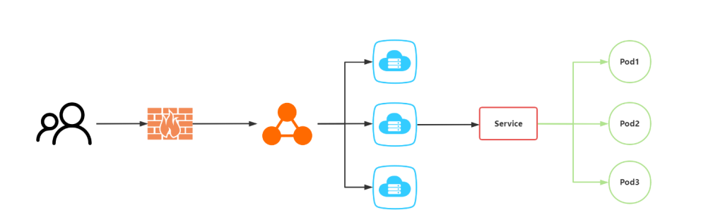
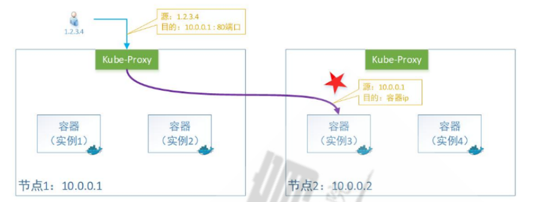
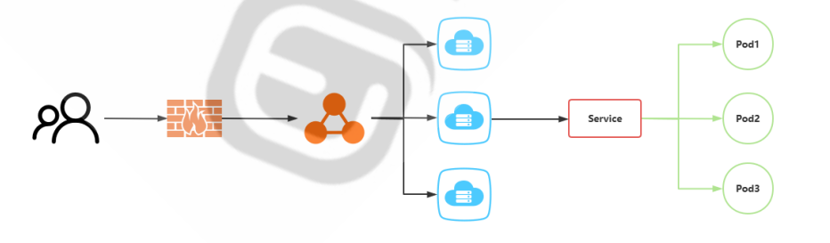
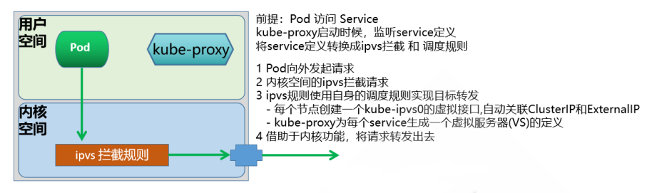

## Kubernetes服务发现


**本章内容**

- **服务访问**
- **服务发现**
- **域名解析**
- **无头服务**


### 服务访问

Kubernetes集群提供了这样的一个资源对象Service，它定义了一组Pod的逻辑集合和一个用于访问它们 的入口策略

Service 可以**基于标签的方式**自动找到对应的pod应用，而无需关心pod的ip地址变化与否，从而实现了 类似负载均衡的效果

Service 本质上就是一个**四层的反向代理**，集群内和外的客户端可以通过如下流程最终实现访问Pod应用

```ABAP
集群内部Client --> service网络 --> Pod网络 --> 容器应用
集群外部Client --> 集群内节点网络 --> service网络 --> Pod网络 --> 容器应用

Kubernetes网络
Pod网络     ----  cni
Service网络 ----  kubeproxy
node网络    ----  宿主机网络
```


Service 资源在master端的Controller组件中，由 Service Controller 来进行统一管理。

service是Kubernetes里最核心的API资源对象之一，它是由coredns或者kube-dns组件提供的功能。

Service 是基于名称空间的资源


Kubernetes 的 Service定义了一个服务的访问入口地址，前端的应用Pod通过Service访问其背后一组有 Pod副本组成的集群实例，Service通过**Label Selector**访问指定的后端Pod，RC保证Service的服务能力和服务质量处于预期状态。


每个Pod都有一个专用的IP地址，加上Pod内部容器的Port端口，就组成了一个访问Pod专用的 EndPoint(Pod IP+Container Port)，从而实现了用户外部资源访问Pod内部应用的效果。

这个EndPoint资源在master端的Controller组件中，由EndPoint Controller 来进行统一管理。

当多个Pod组成了一个业务集群来提供外部服务，那么外部客户端怎么才能访问业务集群服务呢？



根据Pod所处的Node场景，有两种情况：

- 所有Pod副本都在同一Node节点上：对于这种情况，将Node物理节点专用的IP，作为负载均衡器 的VIP，即可实现负载均衡后端服务的效果。
- 所有Pod副本不在同一Node节点上：Node节点的物理ip就没有办法作为负载均衡器的VIP了，这也 是更为常见的情况。


Kubernetes发明了一种设计，给Service分配一个全局唯一的虚拟ip地址--**cluster IP**，它不存在任何网络 设备上，Service通过内部的**标签选择器**，指定相应该Service的Pod资源，当请求发给cluster IP，后端 的Pod资源收到请求后，就会响应请求。

这种情况下，每个Service都有一个全局唯一通信地址，整个系统的内部服务间调用就变成了最基础的 TCP/IP网络通信问题。如果我们的集群内部的服务想要和外部的网络进行通信，可以有多种方法，比 如：

- NodePort类型，通过在所有节点上增加一个对外的端口，用于接入集群外部请求
- ingress类型，通过集群附加服务功能，将外部的域名流量转交到集群内部。


**Service 核心功能**

- 服务发现: 利用标签选择器，在同一个namespace中筛选符合的条件的Pod, 从面实现发现一组提供 了相同服务的Pod
- 负载均衡: Service作为流量入口和负载均衡器，其入口为ClusterIP, 这组筛选出的Pod的IP地址，将 作为该Service的后端服务器
- 名称解析: 利用Cluster DNS，为该组Pod所代表的服务提供一个名称, 在DNS中 对于每个Service， 自动生成一个A、PTR和SRV记录


```ABAP
[root@master1 loadBalancer]#kubectl get svc -A
NAMESPACE     NAME         TYPE        CLUSTER-IP   EXTERNAL-IP   PORT(S)                  AGE
default       kubernetes   ClusterIP   10.96.0.1    <none>        443/TCP                  4d1h
kube-system   kube-dns     ClusterIP   10.96.0.10   <none>        53/UDP,53/TCP,9153/TCP   4d1h

# 使用10.96.0.1来访问api-server
# 使用10.96.0.10来访问dns，进行域名解析
# 因为在k8s中，core-dns和api-server都是以容器方式存在，本身地址不固定，因此需要借助service进行访问
```


#### Endpoints

当创建 Service资源的时候，最重要的就是为Service指定能够提供服务的标签选择器

Service Controller就会根据标签选择器会自动创建一个同名的**Endpoint**资源对象，Kubernetes新版中还增加了**endpointslices**资源

- Endpoint Controller使用Endpoint的标签选择器(继承自Service标签选择器)，筛选符合条件(包括 符合标签选择器条件和处于Ready 状态)的pod资源
- Endpoint Controller 将符合要求的pod资源绑定到Endpoint上，并告知给Service资源谁可以正常提供服务
- Service 会自动获取一个固定的 **cluster IP**向外提供由Endpoint提供的服务资源
- Service 其实就是为动态的一组 pod 资源对象提供一个固定的访问入口。即 Service实现了后端Pod 应用服务的发现功能 


- 每创建一个Service ,自动创建一个和之同名的API 资源类型 Endpoints
- Endpoints负责维护由相关Service标签选择器匹配的Pod对象
- Endpoints对象上保存Service匹配到的所有Pod的IP和Port信息,称之为端点
- ETCD是K/V数据库, 而一个**Endpoints对象对应一个Key**,所有**后端Pod端点信息为其Value**
- 当一个Endpoints对象对应后端每个Pod的每次变动，都需更新整个Endpoints对象，并将新的 Endpoints对象重新保存至API Server和ETCD
- 此外还需要将该对象同步至每个节点的kube-proxy
- 在ETCD中的对象默认最大为1.5MB,一个Endpoints对象至多可以存储5000个左右的端点信息,这意 味着平均每端点占300KB


#### EndpointSlice

新版Kubernetes为什么需要引用EndpointSlice呢?


- 基于Endpoints机制，即便只有一个Pod的IP等信息发生变动，就需要向集群中的每个节点上的 kube-proxy发送整个endpoints对象
- 比如: 一个由2000个节点组成的集群中，更新一个有5000个Pod IP占用1.5MB空间的Endpoints 对 象，就需要发送3GB的数据
  - 若以滚动更新机制，一次只升级更新一个Pod的信息，这将导致更新这个Endpoints对象需要发送 15T的数据
- EndpointSlice资源通过将Endpoints切分为多片来解决上述问题
- 自Kubernetes v1.16引入EndpointSlice
- 每个端点信息的变动，仅需要更新和发送一个**EndpontSlice对象**,而非整个Endpoints对象
- 每个EndpointSlice默认存储100个端点信息，不会超过 etcd对单个对象的存储限制
- 可在kube-controller-manager程序上使用 **--max-endpoints-per-slice** 选项进行配置
- EndpointSlice并未取代Endpoints，二者同时存在


```bash
# 查看endpoint和endpointslices
[root@master1 loadBalancer]#kubectl get endpointslices -A
NAMESPACE     NAME             ADDRESSTYPE   PORTS        ENDPOINTS                 AGE
default       kubernetes       IPv4          6443         10.0.0.201                4d2h
kube-system   kube-dns-5zfkl   IPv4          9153,53,53   10.244.2.40,10.244.2.38   4d2h
[root@master1 loadBalancer]#kubectl get ep -A
NAMESPACE     NAME         ENDPOINTS                                                  AGE
default       kubernetes   10.0.0.201:6443                                            4d2h
kube-system   kube-dns     10.244.2.38:53,10.244.2.40:53,10.244.2.38:53 + 3 more...   4d2h
```


#### Service访问过程


#### endpoints扩展思路

```ABAP
可以手动创建endpoints，并将集群外资源加入endpoints的队列中，实现集群内的pod访问集群外资源的效果
```


#### Service 工作模型

一个Service对象最终体现为工作节点上的一些**iptables或ipvs规则**，这些规则是由kube-proxy进行实时生成和维护\


**针对某一特定服务，如何将集群中的每个节点都变成其均衡器：**

- 在每个节点上运行一个kube-proxy，由kube-proxy注册监视API Server的Service资源的创建、修 改和删除
- 将Service的定义，转为本地负载均衡功能的落地实现


**kube-proxy将请求代理至相应端点的实现方式有四种：**

- userspace（在kubernetes  v1.2以后淘汰）
- **iptables**： iptables工具，默认模式
- **ipvs**
- nftables: 从kubernetes-v1.29.0 之后版本支持,nft 工具
- kernelspace: 仅Windows使用


这些方法的目的是：kube-proxy如何确保service能在每个节点实现并正常工作

注意: 一个集群只能选择使用一种Mode，即集群中所有节点要使用相同的方式


#### Service和kube-proxy关联关系


- Service作为一个独立的API资源对象，它会在API Service服务中定义出来的
- 在创建任何存在标签选择器的Service时，都会被自动创建一个同名的Endpoints资源，Endpoints  对象会使用Label Selector自动发现后端端点，并各端点的IP配置为可用地址列表的元素
- Service Controller 触发每个节点上的kube-proxy，由kube-proxy实时的转换为本地节点上面的 ipvs/iptables规则。
- 默认情况下，内核中的ipvs或iptables规则，仅仅是负责本地节点用户空间pod客户端发出请求时 的拦截或者转发规则
- 如果Pod客户端向Service发出请求,客户端向内核发出请求，根据ipvs或iptables规则，匹配目标 service
- 如果service匹配，会返回当前service随对应的后端endpoint有哪些
- iptables或ipvs会根据情况挑选一个合适的endpoint地址
  - 如果endpoint是本机上的，则会转发给本机的endpoint
  - 如果endpoint是其他主机上的，则转发给其他主机上的endpoint


#### Service类型

对于Kubernetes 可以实现内部服务的自由通信,也可以将平台内部的服务发布到外部环境

Service主要有四种类型，实现不同的网络通信功能

- ClusterIP
- NodePort
- LoadBalancer
- ExternalName


| 类型         | 解析                                                         |
| ------------ | ------------------------------------------------------------ |
| ClusterIP    | 此为Service的默认类型<br />为**集群内部的客户端访问**,包括节点和Pod等，**外部网络无法访问**<br />In client --> clusterIP: ServicePort (Service) --> PodIP: PodPort |
| NodePort     | 本质上**在ClusterIP模式基础上,再多加了一层端口映射的封装**,相当于增强版的 ClusterIP<br />通过NodeIP:NodePort对外部网络提供服务，默认**随机端口范围30000~32767**, 可指定为固定端口<br />NodePort是一个随机的端口，以防止端口冲突,在**所有安装kube-proxy的节点 上都会打开此相同的端口**<br />可通过访问ClusterIP实现集群内部访问,也可以通过NodeIP:NortPort的方式实 现从集群外部至内部的访问<br />Ex Client --> NodeIP:NodePort (Service) --> PodIP:PodPort |
| LoadBalancer | 基于NodePort基础之上**，使用集群外部的运营商负载均衡器方式实现对外提供** 服务,增强版的NodePort<br/>基于云运营商IaaS云创建一个Kubernetes云，云平台也支持LBaaS(Load Balance as a Service)产品服务<br/>Master借助cloud-manager向LBaaS的API请求动态创建软件LB,即支持和Kubernetes API Server 进行交互<br/>如果没有云服务,将无法获取EXTERNAL-IP,显示Pending状态,则降级为 NodePort类型<br/>Ex Client --> LB_IP:LB_PORT --> NodeIP:NodePort(Service)--> PodIP:PodPort |
| ExternalName | 当Kubernetes集群需要访问集群外部服务时，需要通过externalName**将外部主机引入到集群内部**<br />外部主机名以 DNS方式解析为一个 CNAME记录给Kubernetes集群的其他主机来使用<br />**这种Service既没有ClusterIP，也没有NodePort.而且依赖于内部的CoreDNS功能**<br />In client -->Cluster ServiceName --> CName --> External Service Name |


### ExternalIP

如果有外部 IP 能够路由到一个或多个集群节点上，则 Kubernetes 可以通过 externalIPs 将Service  公开出去。

当网络流量进入集群时，如果 externalIPs 作为目的 IP 地址和端口都与该 Service 匹配， Kubernetes  所配置的规则和路由会确保流量被路由到该 Service 的端点之一。

Service可通过使用节点上配置的辅助IP地址接入集群外部客户端流量

流量入口仅能是配置有该IP地址的节点，其它节点无效，因而此时在节点间无负载均衡的效果

external IP所在的节点故障后，该流量入口失效，除非将该IP地址转移配置到其它节点

定义 Service 时，你可以为任何服务类型externalIPs。

由于 externalIPs 是绑定在某一个节点上,而此节点存在单点问题,可以通过Keepalived等方式实现高可用

**高可用对外解决方案**

```ABAP
ExternalIP + VRRP Keepalived -----> Service -----> Pod
```


#### ExternalIP实现

```yaml
# 创建带externalIPs的service
apiVersion: v1
kind: Service
metadata:
  name: my-service
spec:
  selector:
    app.kubernetes.io/name: MyApp
  ports:
    - name: http
      protocol: TCP
      port: 80
      targetPort: 80
  externalIPs:
    - 10.0.0.88   

# 查看
[root@master1 ExternalIP]#kubectl get svc
NAME         TYPE        CLUSTER-IP       EXTERNAL-IP   PORT(S)   AGE
kubernetes   ClusterIP   10.96.0.1        <none>        443/TCP   4d4h
my-service   ClusterIP   10.108.156.228   10.0.0.88     80/TCP    60s

# 创建deployment
apiVersion: apps/v1
kind: Deployment
metadata:
  name: deployment-test
spec:
  replicas: 3
  selector:
    matchLabels:
      app: rs-test
  template:
    metadata:
      labels:
        app: rs-test
        app.kubernetes.io/name: MyApp
    spec:
      containers:
      - name: pod-test
        image: registry.cn-beijing.aliyuncs.com/wangxiaochun/pod-test:v0.1


[root@master1 loadBalancer] #kubectl apply -f controller-deployment-test.yaml 
deployment.apps/deployment-test created

# 查看ep
[root@master1 loadBalancer]#kubectl get ep
NAME         ENDPOINTS                                      AGE
kubernetes   10.0.0.201:6443                                4d4h
my-service   10.244.1.88:80,10.244.2.44:80,10.244.3.99:80   11m

# 在其中一个节点上添加ip
ip a a 10.0.0.88 dev eth0:1

# 验证效果
[root@master1 ExternalIP]#curl 10.0.0.88
kubernetes pod-test v0.1!! ClientIP: 10.244.0.0, ServerName: deployment-test-74b7f7d459-j4fx6, ServerIP: 10.244.2.44!
```


### Service管理


#### 创建 Service 方式说明

对于Service的创建有两种方法：

- 命令行方法
- YAML 文件方法


##### 命令行的方式

```bash
# 创建命令1：（单独创建一个service服务）
kubectl create service [flags] NAME [--tcp=port:targetPort] [--dry-run]

# flags参数详解：
clusterip   Create a ClusterIP service.将集群专用服务接口
nodeport     创建一个 NodePort service.将集群内部服务以端口形式对外提供
loadbalancer 创建一个 LoadBalancer service.主要针对公有云服务
externalname Create an ExternalName service.将集群外部服务引入集群内部

# 创建命令2：（针对一个已存在的deployment、pod、ReplicaSet等创建一个service）
kubectl expose (-f FILENAME | TYPE NAME) [--port=port] [--protocol=TCP|UDP|SCTP] [--target-port=number-or-name] [--name=name] [--external-ip=external-ip-of-service] [--type=type] [options]

# 参数详解
--port=''            #设定service对外的端口信息
--target-port=''     #设定容器的端口,默认和service的端口相同    
--type=''            #设定类型，支持四种：ClusterIP(默认), NodePort, LoadBalancer,ExternalName    
--cluster-ip=''      #设定对外的ClusterIP地址
--name=''            #创建service对外的svc名称

# 创建命令3：（创建自主式Pod时动创建Service）
kubectl run <Pod_name> --image 镜像 --expose --port <容器端口>

# 查看命令
kubectl get svc

# 删除service
kubectl delete svc <svc_name> [ -n <namespace>[] [--all]
```


##### 文件方式

语法解析

```yaml
apiVersion: v1
kind: Service
metadata:
  name: ...
  namespace: ...
  labels:
    key1: value1
    key2: value2
spec:
  type: <string>                    # service类型，默认为ClusterIP
  selector: <map[string]string>     # 指定用于过滤出service所代理的后端pod的标签，指支持等值类型的标签选择器
  ports:                            # Service的端口对象列表
  - name: <string>                  # 端口名称，需要保证唯一性
    protocol: <string>              # 协议，目前仅支持TCP、UDP和SCTP，默认为TCP
    port: <integer>                 # Service端口号
    targetPort: <string>            # 后端Pod的端口号或名称，名称需由Pod中的规范定义，如果不写，默认和port一致
    nodePort: <integer>             # 节点端口号，仅使用NodePort和LoadBalancerl类型，范围：30000-32768，建议系统分配
  - name: <string>
    ...
  clusterIP: <string>               # 指定Service的集群IP，建议不指定而由系统分配
  internalTrafficPolicy: <string>   # 内部流量策略处理方式，Local表示由当前节点处理，Cluster表示向集群范围调度，默认                                         Cluster
  externalTrafficPolicy: <string>   # 外部流量策略处理方式，默认为Cluster，当为Local时，表示由当前节点处理，性能好，但无                                       负载均衡功能，且可以看到客户端真实IP，Cluster表示向集群范围调度，和Local相反，基于                                       性能原因，生产更建议Local，此方式只支持type是NodePort和LoadBalancer类型或者                                         ExternalIps
  loadBalancerIP: <string>          # 外部负载均衡器使用的IP地址，仅适用于LoadBalancer，此字段未来可能删除
  externalName: <string>            # 外部服务名称，该名称将作为Service的DNS CNAME值
  externalIPs: <[]string>           # 群集中的节点将接受此服务的流量的IP地址列表。这些IP不由Kubernetes管理。用户负责确保                                       流量到达具有此 IP 的节点。常见的是不属于 Kubernetes 系统的外部负载均衡器，注意：                                       此IP和Type类型无关
```


#### 补充：Deployment.Name 和 Service.Name 相同时会自动匹配的原理

```bash
[root@master1 manifests]#kubectl create deployment pod-test1 --image=registry.cn-beijing.aliyuncs.com/wangxiaochun/pod-test:v0.1 --replicas=3
deployment.apps/pod-test1 created

[root@master1 manifests]# kubectl create service clusterip pod-test1 --tcp=80:80
service/pod-test1 created

[root@master1 manifests]#kubectl get svc
NAME         TYPE        CLUSTER-IP       EXTERNAL-IP   PORT(S)   AGE
kubernetes   ClusterIP   10.96.0.1        <none>        443/TCP   36d
pod-test1    ClusterIP   10.109.224.115   <none>        80/TCP    4s

[root@master1 manifests]#kubectl get ep pod-test1 
NAME        ENDPOINTS                                                 AGE
pod-test1   192.168.123.238:80,192.168.22.134:80,192.168.253.172:80   26s
```

- **Service 并不会直接匹配 Deployment 的 name**，它匹配的是 **Pod 的 labels**。

- **`kubectl create deployment` 默认会给 Pod 加上 `app: <name>` 作为 label**。

- **`kubectl create service` 也默认使用 `app: <name>` 作为 `selector`，从而实现“自动匹配”**。

- **如果你 `kubectl create service` 时加 `--selector` 指定不同的 label，就不会匹配成功**。


#### ClusterIP Service实现

#####  单端口应用

```yaml
# 如果基于资源配置文件创建资源，依赖于后端pod的标签，才可以关联后端的资源
# 准备多个后端Pod对象
[root@master1 loadBalancer] # kubectl create deployment myweb --image=registry.cn-beijing.aliyuncs.com/wangxiaochun/pod-test:v0.1 --replicas=3
deployment.apps/myweb created

# 查看效果
[root@master1 service] # kubectl get pod --show-labels 
NAME                     READY   STATUS    RESTARTS   AGE     LABELS
myweb-565cb68445-6c928   1/1     Running   0          5m49s   app=myweb,pod-template-hash=565cb68445
myweb-565cb68445-fc6xg   1/1     Running   0          5m49s   app=myweb,pod-template-hash=565cb68445
myweb-565cb68445-rsbs6   1/1     Running   0          5m49s   app=myweb,pod-template-hash=565cb68445


# 创建service对象
[root@master1 service] # vim service-clusterip-test.yaml
apiVersion: v1
kind: Service
metadata: 
  name: service-clusterip-test
spec:
  #type: ClusterIP            # 默认即为ClusterIP，此行可省略
  #clusterIP: 192.168.64.100  #可以手动指定IP，但一般都是系统自动指定而无需添加此行
  selector:
    app: myweb                # 引用上面deployment的名称，同时也是Pod的Lable中的app值
  ports:
  - name: http
    protocol: TCP
    port: 80
    targetPort: 80

[root@master1 service] # kubectl apply -f service-clusterip-test.yaml 
service/service-clusterip-test created

# 查看
[root@master1 service] # kubectl get svc
NAME                     TYPE        CLUSTER-IP       EXTERNAL-IP   PORT(S)   AGE
kubernetes               ClusterIP   10.96.0.1        <none>        443/TCP   4d7h
my-service               ClusterIP   10.108.156.228   10.0.0.88     80/TCP    158m
service-clusterip-test   ClusterIP   10.102.58.175    <none>        80/TCP    4s

# 测试
[root@master1 service]# curl 10.102.58.175
kubernetes pod-test v0.1!! ClientIP: 10.244.0.0, ServerName: myweb-565cb68445-rsbs6, ServerIP: 10.244.1.89!

```


##### 多端口实现

有很多服务都会同时开启多个端口，典型的比如：tomcat三个端口，接下来实现创建多端口的Service

```yaml
# 创建多端口Service
[root@master1 service] # vim service-clusterip-multi-port.yaml
apiVersion: v1
kind: Service
metadata:
  name: service-clusterip-multi-port
spec:
  selector:
    app: myweb
  ports:
  - name: http
    protocol: TCP
    port: 80
  - name: https
    protocol: TCP
    port: 443
#关键点：只能有一个ports属性，多了会覆盖,每一个子port必须有一个name属性,由于service是基于标签的方式来管理pod的，所以必须有标签选择器 
```


#### NodePort Service实现

NodePort会在所有节点主机上，向外暴露一个指定或者随机的端口，供集群外部的应用能够访问

注意：nodePort 属性范围为 30000-32767，且type 类型只支持 NodePort或LoadBalancer

**注意: 此方式有安全风险，端口为非标端口,而且性能一般,生产一般较少使用**

**生产中建议使用Ingress方式向外暴露集群内的服务**


##### externaltrafficpolicy 的两种策略


- **cluster模式**
  - 此为默认模式
  - 集群外的请求报文从某节点的NodePort进入，该节点的Service可以将请求流量调度到其他节点上的Pod，无需关心Pod在哪个节点上
  - **Kube-proxy转发外部请求时会替换掉报文的源IP和目标IP,相当于FULLNAT**
  - 返回时需要从原路返回,可能会产生跨节点的跃点转发流量
  - 此模式负载均衡效果好，因为无论容器实例怎么分布在多个节点上，它都会转发过去。
  - 但是由于多了一次转发，性能会损失
  - 如果是NodePort类型,Pod无法获取外部客户端真实客户端IP




- **local模式**
  - 集群外的请求报文从某节点的NodePort进入,该节点的Service 只会将请求流量调度到当前节点上 的Pod
  - **外部请求流量只发给本机的Pod, Kube-proxy转发时只会替换掉报文的目标IP,即只实现DNAT**
  - 即：容器收到的报文，看到源IP地址还是用户的原有 IP  
  - 此模式的负载均衡效果不是很好，因为一旦容器实例分布在多个节点上，它只转发给本机，不产生 跨节点的跃点转发流量。
  - 但是少了一次转发，性能会相对好
  - 由于本机不会跨节点转发报文，所以要想对所有节点上的容器实现负载均衡，就需要借助外部的 Loadbalancer来实现
  - 因此使用Local 模式,一般会使用 LoadBalancer Service 类型结合 Loadbalancer 实现


##### nodePort实现

```yaml
[root@master1 service] # vim service-nodeport.yaml
apiVersion: v1
kind: Service
metadata:
  name: service-nodeport
spec:
  type: NodePort
  #externalTrafficPolicy: Local # 默认值为Cluster,如果是Local只能被当前运行Pod的节点处理流量，并且可以获取客户端真实IP
  selector:
    app: myweb
  ports:
  - name: http
    protocol: TCP
    port: 80
    targetPort: 80
    nodePort: 30066   # 指定固定端口(30000-32767)，使用NodePort类型且不指定nodeport，会自动分配随机端口向外暴露

[root@master1 service] # kubectl apply -f service-nodeport.yaml 
service/service-nodeport created

# 查看
[root@master1 service] # kubectl get svc
NAME                     TYPE        CLUSTER-IP       EXTERNAL-IP   PORT(S)        AGE
service-nodeport         NodePort    10.104.196.234   <none>        80:30066/TCP   33s

# 默认externalTrafficPolicy: Cluster，所以使用访问集群中任意一个物理节点的地址都可以，但是Pod上看不到真实客户端地址
[root@master1 service]#curl 10.0.0.202:30066
kubernetes pod-test v0.1!! ClientIP: 10.244.1.0, ServerName: myweb-565cb68445-6c928, ServerIP: 10.244.2.46!
[root@master1 service]#curl 10.0.0.202:30066
kubernetes pod-test v0.1!! ClientIP: 10.244.1.1, ServerName: myweb-565cb68445-rsbs6, ServerIP: 10.244.1.90!
[root@master1 service]#curl 10.0.0.202:30066
kubernetes pod-test v0.1!! ClientIP: 10.244.1.0, ServerName: myweb-565cb68445-fc6xg, ServerIP: 10.244.3.101!
[root@master1 

# 指定externalTrafficPolicy: Local，Pod能看到客户端真实IP，同时每个节点只能调度该节点上的Pod
[root@master1 service] #curl 10.0.0.202:30066
kubernetes pod-test v0.1!! ClientIP: 10.0.0.201, ServerName: myweb-565cb68445-rsbs6, ServerIP: 10.244.1.90!
[root@master1 service] #curl 10.0.0.202:30066
kubernetes pod-test v0.1!! ClientIP: 10.0.0.201, ServerName: myweb-565cb68445-rsbs6, ServerIP: 10.244.1.90!
[root@master1 service] #curl 10.0.0.202:30066
kubernetes pod-test v0.1!! ClientIP: 10.0.0.201, ServerName: myweb-565cb68445-rsbs6, ServerIP: 10.244.1.90!
[root@master1 service] #curl 10.0.0.203:30066
kubernetes pod-test v0.1!! ClientIP: 10.0.0.201, ServerName: myweb-565cb68445-6c928, ServerIP: 10.244.2.46!
[root@master1 service] #curl 10.0.0.203:30066
kubernetes pod-test v0.1!! ClientIP: 10.0.0.201, ServerName: myweb-565cb68445-6c928, ServerIP: 10.244.2.46!
[root@master1 service] #curl 10.0.0.203:30066
kubernetes pod-test v0.1!! ClientIP: 10.0.0.201, ServerName: myweb-565cb68445-6c928, ServerIP: 10.244.2.46!

# 将deploy缩容至1
[root@master1 service] #kubectl scale deployment myweb --replicas=1
deployment.apps/myweb scaled

# 查看
[root@master1 service]#kubectl get pod -o wide
NAME                     READY   STATUS    RESTARTS      AGE   IP             NODE    NOMINATED NODE   READINESS GATES
myweb-565cb68445-fc6xg   1/1     Running   1 (17m ago)   13h   10.244.3.101   node3   <none>           <none>

# 访问node1上的端口
[root@master1 service]#curl 10.0.0.202:30066
阻塞...
```


#### LoadBalancer Service实现



只有Kubernetes集群是部署在一个LBaaS平台上且指供有一个集群外部的LB才适合使用LoadBalancer 

一般的公有云都提供了此功能,但可能会有费用产生

如果在一个非公用云的普通的Kubernetes集群上，创建了一个LoadBalancer类型的Service，一般情况 默认环境中是没有LBaaS的，所以会导致由于找不到指定的服务，状态会一直处于 Pending 状态

如果在私有云环境中使用 LoadBalancer Service，可以使用云原生的开源项目实现负载均衡器，比如 **OpenELB, MetalLB** 实现

Loadbalancer 可以获取用户访问的Service对应的Pod在哪个节点上,因此支持externaltrafficpolicy为 Local模式的流量转发


##### OpenElB实现LBaas服务


OpenELB 是一个开源的云原生负载均衡器实现

可以在基于裸金属服务器、边缘以及虚拟化的 Kubernetes 环境中使用 LoadBalancer 类型的 Service 对 外暴露服务。

OpenELB 项目最初由国内青云的 KubeSphere 社区发起，目前已作为 CNCF 沙箱项目加入 CNCF 基金 会，由 OpenELB 开源社区维护与支持。

官网: 

```ABAP
https://openelb.io/
https://github.com/openelb/openelb
```


OpenELB 也拥有两种主要工作模式：**Layer2** 模式和 **BGP** 模式。OpenELB 的 BGP 模式目前暂不支持 IPv6。

因为 OpenELB 是针对裸金属服务器设计的，因此如果是在云环境中部署，需要注意是否满足条件。

核心功能

- BGP模式和二层网络模式下的负载均衡
- ECMP路由和负载均衡
- IP地址池管理
- 基于CRD来管理BGP配置

**注意: 此应用可能不支持 Openstack 等云环境**


##### OpenELB 实现

部署和使用OpenELB

```bash
[root@master1 ~]#wget https://raw.githubusercontent.com/openelb/openelb/master/deploy/openelb.yaml

# 启用
[root@master1 openelb] #kubectl apply -f openelb.yaml 
namespace/openelb-system created
customresourcedefinition.apiextensions.k8s.io/bgpconfs.network.kubesphere.io created
customresourcedefinition.apiextensions.k8s.io/bgppeers.network.kubesphere.io created
customresourcedefinition.apiextensions.k8s.io/eips.network.kubesphere.io created
serviceaccount/openelb-admission created
serviceaccount/openelb-controller created
serviceaccount/openelb-speaker created
role.rbac.authorization.k8s.io/openelb-admission created
clusterrole.rbac.authorization.k8s.io/openelb-admission created
clusterrole.rbac.authorization.k8s.io/openelb-controller created
clusterrole.rbac.authorization.k8s.io/openelb-speaker created
rolebinding.rbac.authorization.k8s.io/openelb-admission created
clusterrolebinding.rbac.authorization.k8s.io/openelb-admission created
clusterrolebinding.rbac.authorization.k8s.io/openelb-controller created
clusterrolebinding.rbac.authorization.k8s.io/openelb-speaker created
secret/memberlist created
service/openelb-controller created
deployment.apps/openelb-controller created
daemonset.apps/openelb-speaker created
job.batch/openelb-admission-create created
job.batch/openelb-admission-patch created
validatingwebhookconfiguration.admissionregistration.k8s.io/openelb-admission created

# 查看创建的CRD自定义资源类型
[root@master1 openelb]#kubectl get crd
NAME                             CREATED AT
bgpconfs.network.kubesphere.io   2024-12-24T01:49:36Z
bgppeers.network.kubesphere.io   2024-12-24T01:49:36Z
eips.network.kubesphere.io       2024-12-24T01:49:36Z

# 确认openelb-manager Pod已经处于Running状态，且容器已经Ready
[root@master1 openelb]#kubectl get pods -n openelb-system 
NAME                                  READY   STATUS      RESTARTS   AGE
openelb-admission-create-r28c5        0/1     Completed   0          69s
openelb-admission-patch-h8g6n         0/1     Completed   2          69s
openelb-controller-7f8788f446-22j7d   1/1     Running     0          69s
openelb-speaker-f462b                 1/1     Running     0          69s
openelb-speaker-mzhpb                 1/1     Running     0          69s
openelb-speaker-phzd8                 1/1     Running     0          69s
openelb-speaker-tb2ms                 1/1     Running     0          69s

#创建了一个Eip资源对象，它提供了一个地址池给LoadBalancer Service使用
[root@master1 openelb] #vim service-loadbalancer-eip-pool.yaml
apiVersion: network.kubesphere.io/v1alpha2
kind: Eip
metadata:
  name: eip-pool
  annotations:
    eip.openelb.kubesphere.io/is-default-eip: "true" #指定当前EIP作为向LoadBalancer Server分片地>址时使用的默认的eip对象
spec:
  address: 10.0.0.10-10.0.0.50 #指定排除主机节点之外的地址范围，可以使用单个IP或者带有掩码长度的>网络地址
  protocol: layer2 #指定OpenELB模式，支持bgp,layer2和vip三种，默认bgp
  interface: eth0 #OpenELB侦听ARP或NDP请求时使用的网络接口名称，仅layer2模式下有效
  disable: false
  
  
# 创建资源
[root@master1 openelb]#kubectl apply -f service-loadbalancer-eip-pool.yaml 
eip.network.kubesphere.io/eip-pool created

# 查看结果
[root@master1 openelb]#kubectl get eip
NAME       CIDR                  USAGE   TOTAL
eip-pool   10.0.0.10-10.0.0.50           41

# 创建Deployment和LoadBalancer类型的Service，测试地址池是否能给Service分配LoadBalancerIP
[root@master1 openelb] #kubectl create deployment myapp --image=registry.cn-beijing.aliyuncs.com/wangxiaochun/pod-test:v0.1 --replicas=3
deployment.apps/myapp created

[root@master1 openelb]#vim service-loadbalancer-lbaas.yaml
apiVersion: v1
kind: Service
metadata:
  name: service-loadbalancer-lbaas
spec:
  type: LoadBalancer
  externalTrafficPolicy: Local
  selector:
    app: myapp
  ports:
  - name: http
    protocol: TCP
    port: 80
    targetPort: 80

# 应用
[root@master1 openelb ]#kubectl apply -f service-loadbalancer-lbaas.yaml 
service/service-loadbalancer-lbaas created

# 查看service资源对象myapp是否自动获得了EXTERNAL IP，获取失败...
[root@master1 openelb]#kubectl get svc service-loadbalancer-lbaas 
NAME                         TYPE           CLUSTER-IP      EXTERNAL-IP   PORT(S)        AGE
service-loadbalancer-lbaas   LoadBalancer   10.97.215.163   <pending>     80:30214/TCP   8m41s
```


##### metalLB实现LBaaS服务


官网

```ABAP
https://github.com/metallb/metallb
https://metallb.universe.tf/
```

MetalLB 是由 Google 开源提供

MetalLB 功能实现依赖于两种机制

- Address Allocation 地址分配：基于用户配置的地址池，为用户创建的LoadBalancer分配IP地址, 并配置在节点上
- External Announcement 对外公告：让集群外部的网络了解新分配的P地址，MetalLB使用ARP、 NDP或BGP实现


MetallB 可配置为在二层模式或BGP模式下运行

- 二层模式(ARP/NDP)
  - LoadBalancer IP地址配置在某一个节点上，并使用ARP(IPv4)或NDP(IPv6)对外公告
  - 拥有LoadBalancer IP 地址的节点将成为Service流量的惟一入口，并在节点故障时自动进行故障转 移
  - 并未真正实现负载均衡，存在性能瓶颈，且故障转移存在秒级的延迟
- BGP模式
  - 集群中的所有节点与本地网络中的BGP Router建立BGP对等会话，通告LoadBalancer IP，从而告知Router如何进行流量路由
  - 可以实现跨多个节点的真正意义上的负载均衡


**注意: 此应用可能不支持 Openstack 等云环境**


##### MetalLB 实现

```bash
# 部署MetalLB至Kubernetes集群
METALLB_VERSION='v0.14.7'
wget https://raw.githubusercontent.com/metallb/metallb/${METALLB_VERSION}/config/manifests/metallb-native.yaml

# 应用
[root@master1 metalLB]# kubectl apply -f metallb-native.yaml 
namespace/metallb-system created
customresourcedefinition.apiextensions.k8s.io/bfdprofiles.metallb.io created
customresourcedefinition.apiextensions.k8s.io/bgpadvertisements.metallb.io created
customresourcedefinition.apiextensions.k8s.io/bgppeers.metallb.io created
customresourcedefinition.apiextensions.k8s.io/communities.metallb.io created
customresourcedefinition.apiextensions.k8s.io/ipaddresspools.metallb.io created
customresourcedefinition.apiextensions.k8s.io/l2advertisements.metallb.io created
customresourcedefinition.apiextensions.k8s.io/servicel2statuses.metallb.io created
serviceaccount/controller created
serviceaccount/speaker created
role.rbac.authorization.k8s.io/controller created
role.rbac.authorization.k8s.io/pod-lister created
clusterrole.rbac.authorization.k8s.io/metallb-system:controller created
clusterrole.rbac.authorization.k8s.io/metallb-system:speaker created
rolebinding.rbac.authorization.k8s.io/controller created
rolebinding.rbac.authorization.k8s.io/pod-lister created
clusterrolebinding.rbac.authorization.k8s.io/metallb-system:controller created
clusterrolebinding.rbac.authorization.k8s.io/metallb-system:speaker created
configmap/metallb-excludel2 created
secret/metallb-webhook-cert created
service/metallb-webhook-service created
deployment.apps/controller created
daemonset.apps/speaker created
validatingwebhookconfiguration.admissionregistration.k8s.io/metallb-webhook-configuration created

# 查看CRD资源类型
[root@master1 metalLB]#kubectl get crd
NAME                           CREATED AT
bfdprofiles.metallb.io         2024-12-24T02:27:38Z
bgpadvertisements.metallb.io   2024-12-24T02:27:38Z
bgppeers.metallb.io            2024-12-24T02:27:38Z
communities.metallb.io         2024-12-24T02:27:38Z
ipaddresspools.metallb.io      2024-12-24T02:27:38Z
l2advertisements.metallb.io    2024-12-24T02:27:38Z
servicel2statuses.metallb.io   2024-12-24T02:27:38Z

# 创建地址池
# 注意: IPAddressPool 必须使用Kuberetes集群节点的IP地址段
[root@master1 metalLB]#vim service-metallb-IPAddressPool.yaml
apiVersion: metallb.io/v1beta1
kind: IPAddressPool
metadata:
  name: localip-pool
  namespace: metallb-system
spec:
  addresses:
  - 10.0.0.10-10.0.0.50
  autoAssign: true
  avoidBuggyIPs: true
  
# 应用
[root@master1 metalLB]#kubectl apply -f service-metallb-IPAddressPool.yaml
ipaddresspool.metallb.io/localip-pool created

# 创建二层公告机制
[root@master1 metalLB]#vim service-metallb-L2Advertisement.yaml
apiVersion: metallb.io/v1beta1
kind: L2Advertisement
metadata:
  name: localip-pool-l2a
  namespace: metallb-system
spec:
  ipAddressPools:
  - localip-pool
  interfaces:
  - eth0 # 用于发送免费ARP公告

[root@master1 metalLB]#kubectl apply -f service-metallb-L2Advertisement.yaml 
l2advertisement.metallb.io/localip-pool-l2a created

# 创建Service和Deployment，测试地址池是否能给Service分配LoadBalancer IP
[root@master1 ~]#kubectl create deployment myapp --image=registry.cn-beijing.aliyuncs.com/wangxiaochun/pod-test:v0.1 --replicas=3

[root@master1 metalLB]# vim service-loadbalancer-lbaas.yaml
apiVersion: v1
kind: Service
metadata:
  name: service-loadbalancer-lbaas
spec:
  type: LoadBalancer
  externalTrafficPolicy: Local
  selector:
    app: myapp
  ports:
  - name: http
    protocol: TCP
    port: 80
    targetPort: 80
    
# 应用
[root@master1 metalLB]#kubectl apply -f service-loadbalancer-lbaas.yaml 
service/service-loadbalancer-lbaas created

# 查看
[root@master1 metalLB]#kubectl get svc service-loadbalancer-lbaas 
NAME                         TYPE           CLUSTER-IP       EXTERNAL-IP   PORT(S)        AGE
service-loadbalancer-lbaas   LoadBalancer   10.111.219.193   10.0.0.10     80:32248/TCP   7s

# 从外部访问测试
[root@master1 metalLB]#curl 10.0.0.10
kubernetes pod-test v0.1!! ClientIP: 10.244.0.0, ServerName: myapp-547df679bb-57pnm, ServerIP: 10.244.2.51!
```


##### 实际生产环境

- 通常使用公有云提供的LBaaS，而不是这种开源的负载均衡器，MetalLB有Bug，在Local模式下，没有负载均衡效果
- 更多的是使用ingress进行对外暴露


#### ExternalName Service实现

Service 不仅可以实现Kubernetes集群内Pod应用之间的相互访问以及从集群外部访问集群中的Pod

还可以支持做为外部服务的代理实现集群中Pod访问集群外的服务

```ABAP
Pod --> Service_name --> External Name --> 外部DNS --> 外部服务IP
```


**Service代理Kubernetes外部应用的使用场景**

- 在生产环境中Pod 希望使用某个固定的名称而非IP地址进行访问集群外部的服务
- 使用Service指向另一个Namespace中或其它Kubernetes集群中的服务
- 某个项目正在迁移至Kubernetes集群，但是一部分服务仍然在集群外部，此时可以使用service代理至k8s集群外部的服务


**使用ExternalName Service实现代理外部服务（公网IP的服务）**

```bash
[root@master1 service]# vim service-externalname-web.yaml
apiVersion: v1
kind: Service
metadata:
  name: svc-externalname-web
  namespace: default
spec:
  type: ExternalName
  externalName: www.mysticalrecluse.com
  ports:                      # 可选字段（optional），而且基本是 占位作用，不会实际参与流量转发或监听端口。
  - protocol: TCP
    port: 80
    targetPort: 80
    nodePort: 0
  selector: {}

# 应用
[root@master1 service]#kubectl apply -f service-externalname-web.yaml 
service/svc-externalname-web created

# 查看
#注意: service没有Cluster-IP,即为无头服务Headless Service
[root@master1 service]#kubectl get svc
NAME                   TYPE           CLUSTER-IP   EXTERNAL-IP               PORT(S)   AGE
svc-externalname-web   ExternalName   <none>       www.mysticalrecluse.com   80/TCP    7s

# 创建一个测试pod，解析域名
[root@master1 service]# kubectl run pod-$RANDOM --image=registry.cn-beijing.aliyuncs.com/wangxiaochun/admin-box:v0.1 -it --rm --command -- /bin/bash
If you don't see a command prompt, try pressing enter.
root@pod-18379 /# 
root@pod-18379 /# host svc-externalname-web
svc-externalname-web.default.svc.cluster.local is an alias for www.mysticalrecluse.com.
root@pod-18379 /# ping -c1 svc-externalname-web
PING svc-externalname-web (101.35.250.82): 56 data bytes
64 bytes from 101.35.250.82: seq=0 ttl=127 time=30.567 ms
```


##### ExternalName本质

它是 Kubernetes 中的一种特殊 Service 类型，用来**给一个外部域名起别名**，让集群内的 Pod 通过 Kubernetes 的服务域名来访问这个外部地址

**举个例子说明**

比如你有一个外部服务 `api.external.com`，你想让 Pod 通过 `my-external-svc.default.svc.cluster.local` 来访问它：

```yaml
apiVersion: v1
kind: Service
metadata:
  name: my-external-svc
  namespace: default
spec:
  type: ExternalName
  externalName: api.external.com
```

那么集群中的 Pod 就可以这样访问它

```bash
curl http://my-external-svc.default.svc.cluster.local
```

DNS 会把这个地址解析为 `api.external.com`。


**关键特性总结**：

| 特性                | 说明                                                         |
| ------------------- | ------------------------------------------------------------ |
| 是否创建 Endpoint   | ❌ 不创建。没有 selector、没有 endpoints。                    |
| 是否负载均衡        | ❌ 不会轮询，只是一个 DNS 别名。                              |
| 是否可以是 IP       | ⚠️ 不推荐。应使用 **合法的 DNS 名称**。                       |
| 作用机制            | CoreDNS 通过 `CNAME` 把 Service 名称解析为 `externalName` 指定的域名。 |
| 是否会转发流量      | ❌ 不做流量转发，仅 DNS 层处理。                              |
| 能否用于 TLS 等功能 | ❌ 不适合做 Ingress 或 Gateway 的后端，因为它不是一个真正的 Endpoint。 |


**使用自建的Endpoint实现基于ClusterIP类型的Service代理集群外部服务**

- 手动创建一个Endpoints资源对象，直接把外部端点的IP地址，放入可用地址列表
- 额外创建一个不带selector的同名的Service对象

```bash
# 在k8s集群外安装redis
[root@master1 ~]#apt update && apt -y install redis
[root@master1 ~]#vim /etc/redis/redis.conf
bind 0.0.0.0
[root@master1 ~]#systemctl restart redis

[root@master1 service]# vim service-endpoints.yaml
apiVersion: v1
kind: Endpoints
metadata:
  name: service-redis  # 和下面的service必须同名
  namespace: default
subsets:
  - addresses:
    - ip: 10.0.0.131  # 外部服务的FQDN或IP
    ports:
    - name: reids
      port: 6379
      protocol: TCP
---
apiVersion: v1
kind: Service
metadata:
  name: service-redis  # 和上面的endpoints必须同名
  namespace: default
spec:
  type: ClusterIP
  clusterIP: "None"
  ports:
  - name: redis
    port: 6379
    protocol: TCP
    targetPort: 6379

  
# 应用
[root@master1 service]#kubectl apply -f service-endpoints.yaml 
endpoints/service-redis created
service/service-redis created

# 查看
[root@master1 service]#kubectl get svc
NAME                   TYPE           CLUSTER-IP   EXTERNAL-IP               PORT(S)    AGE
kubernetes             ClusterIP      10.96.0.1    <none>                    443/TCP    26m
service-redis          ClusterIP      None         <none>                    6379/TCP   38s

[root@master1 service]#kubectl get ep service-redis 
NAME            ENDPOINTS         AGE
service-redis   10.0.0.131:6379   76s

# 测试访问，使用service名做为域名，访问外部redis
[root@master1 service]#kubectl run pod-$RANDOM --image=registry.cn-beijing.aliyuncs.com/wangxiaochun/admin-box:v0.1 -it --rm --command -- /bin/bash
If you don't see a command prompt, try pressing enter.
root@pod-28779 /# nc service-redis 6379
info
```


#### 会话粘滞

kubernetes的Service默认是按照轮询机制进行转发至后端的多个pod

如果用户请求有一定的会话要求，即希望同一个客户每次总是能访问同一个pod的时候，可以使用 service的**affinity机制**来实现

它能将同一个客户端的请求始终转发至同一个后端Pod对象，它是由**kube-proxy的ipvs机制**来实现的。

默认情况下，service所提供的会话粘性效果默认在**10800s(3小时)**后会重新调度,而且仅能基于客户端IP 进行识别，调度粒度较粗


**属性解析**

```yaml
# 属性信息
service.spec.sessionAffinity  # 定义粘性会话的类型，可为 None 和 ClientIP,默认值为None即不开启会话沾滞
service.spec.sessionAffinityConfig.clinetIP.timeoutSeconds # 配置会话保持时长，默认10800s，范围1-86400

# 配置格式
  sessionAffinity: ClientIP
  sessionAffinityConfig:
    clientIP:
      timeoutSeconds: 10800
```


**实现会话粘滞**

```yaml
# 创建deployment资源
[root@master1 service] # kubectl create deployment myweb --image=registry.cn-beijing.aliyuncs.com/wangxiaochun/pod-test:v0.1 --replicas=3
deployment.apps/myweb created

[root@master1 service] # kubectl get pod
NAME                     READY   STATUS    RESTARTS   AGE
myweb-565cb68445-2sqx9   1/1     Running   0          3s
myweb-565cb68445-8z59d   1/1     Running   0          3s
myweb-565cb68445-nts2b   1/1     Running   0          3s

# 创建Service资源对象
[root@master1 service] # vim service-session.yaml
apiVersion: v1
kind: Service
metadata:
  name: service-session
spec:
  type: LoadBalancer
  ports:
  - port: 80
  selector:
    app: myweb
  sessionAffinity: ClientIP
  sessionAffinityConfig:
    clientIP:
      timeoutSeconds: 1800 # 默认值为10800，即3小时

# 应用
[root@master1 service]  #kubectl apply -f service-session.yaml 
service/service-session created

# 同一个客户端，多次访问都是调度到同一个Pod上
[root@master1 service] # curl 10.109.193.1
kubernetes pod-test v0.1!! ClientIP: 10.244.0.0, ServerName: myweb-565cb68445-8z59d, ServerIP: 10.244.2.52!
[root@master1 service] # curl 10.109.193.1
kubernetes pod-test v0.1!! ClientIP: 10.244.0.0, ServerName: myweb-565cb68445-8z59d, ServerIP: 10.244.2.52!
[root@master1 service] # curl 10.109.193.1
kubernetes pod-test v0.1!! ClientIP: 10.244.0.0, ServerName: myweb-565cb68445-8z59d, ServerIP: 10.244.2.52!
```


#### ipvs模式




ipvs会在每个节点上创建一个名为kube-ipvs0的虚拟接口，并将集群所有Service对象的ClusterIP和ExternalIP都配置在该接口； 所以每增加一个ClusterIP 或者ExternalIP，就相当于为 kube-ipvs0 关联 了一个地址罢了。

kube-proxy为每个service生成一个虚拟服务器( IPVS Virtual Server)的定义。


**基本流程：**

- 当前节点接收到外部流量后，如果该数据包是交给当前节点上的clusterIP，则会直接将数据包交给 kube-ipvs0，而这个接口是内核虚拟出来的，而kube-proxy定义的VS直接关联到kube-ipvs0上。
- 如果是本地节点pod发送的请求，基本上属于本地通信，效率是非常高的。
- 默认情况下，这里的ipvs使用的是nat转发模型，而且支持更多的后端调度算法。仅仅在涉及到源地址转 换的场景中，会涉及到极少量的iptables规则(应该不会超过20条)
- 对于Kubernetes来说，默认情况下，支持的规则是 iptables，可以通过多种方式对代理模式进行更改， 因为这些规则都是**基于kube-proxy**来定制的，所以，如果要更改代理模式的话，就需要调整kube-proxy 的属性。


**注意：Kubernetes-v1.29版本后，不再使用iptables，而使用nftables framework，工具使用nft  list ruleset 查看**


更改kube-proxy为IPVS模式方法说明

```bash
#方法1： 在集群创建的时候，修改kubeadm-init.yml 添加如下配置，此方法是生产中推荐
kubeadm config print init-defaults > kubeadm-init.yaml

# 在文件最后面添加一下几行
---
apiVersion: kubeproxy.config.Kubernetes.io/v1alpha1
kind: KubeProxyConfiguration
featureGates:
  SupportIPVSProxyMode: true
mode: ipvs

# 在初始阶段可能修改的参数
apiVersion: kubeadm.k8s.io/v1beta3
kind: InitConfiguration
localAPIEndpoint:
  advertiseAddress: 192.168.0.100
  bindPort: 6443
nodeRegistration:
  criSocket: unix:///run/cri-dockerd.sock                  # 配置cri-dockerd插槽
  name: master1
  taints:
  - effect: NoSchedule
    key: node-role.kubernetes.io/control-plane

---
apiVersion: kubeadm.k8s.io/v1beta3
kind: ClusterConfiguration
kubernetesVersion: "v1.30.2"
controlPlaneEndpoint: "master1.mystical.org:6443"            # 修改控制平面域名
networking:
  podSubnet: "10.244.0.0/16"                                 # 修改集群网路配置，pod网络
  serviceSubnet: "10.96.0.0/12"                              # service网络
imageRepository: registry.aliyuncs.com/google_containers     # 修改镜像仓库（如使用国内镜像）
apiServer:
  extraArgs:
    authorization-mode: Node,RBAC


# 更改好配置文件后，执行命令初始化
kubeadm init --config=kubeadm-init.yaml --token-ttl --upload-certs

# 验证集群状态
mkdir -p $HOME/.kube
sudo cp -i /etc/kubernetes/admin.conf $HOME/.kube/config
sudo chown $(id -u):$(id -g) $HOME/.kube/config

# 看集群是否正常运行
kubectl get nodes
kubectl get pods -n kube-system


# 方法2：在测试环境中，临时修改一下configmap中proxy的基本属性，此方式在测试环境中推荐使用
[root@master1 ~] # kubectl edit cm  kube-proxy -n kube-system
...
mode: "ipvs"  #修改此行，默认为空”“表示iptables模式
...

# 更改后，需要稍等一会儿才能生效

# 如果想立即生效，需要重启所有的kube-proxy pod对象
[root@master1 ~]#kubectl get ds -n kube-system 
NAME         DESIRED   CURRENT   READY   UP-TO-DATE   AVAILABLE   NODE SELECTOR            AGE
kube-proxy   4         4         4       4            4           kubernetes.io/os=linux   5d1h

[root@master1 ~]#kubectl get pod -n kube-system -l k8s-app=kube-proxy
NAME               READY   STATUS    RESTARTS        AGE
kube-proxy-7fc2q   1/1     Running   5 (5h50m ago)   5d1h
kube-proxy-7slb9   1/1     Running   5 (5h49m ago)   5d1h
kube-proxy-n66cg   1/1     Running   5 (5h49m ago)   5d1h
kube-proxy-vkqh5   1/1     Running   5 (5h47m ago)   5d1h

# 重启pod
[root@master1 ~]#kubectl rollout restart daemonset -n kube-system kube-proxy 
daemonset.apps/kube-proxy restarted

# 重启方式2：删除原pod，使damonset自动重新创建
kubectl delete pod -n kube-system -l k8s-app=kube-proxy

# 安装ipvsadm查看效果
[root@master1 ~]#apt update && apt -y install ipvsadm
[root@master1 ~]#ipvsadm -Ln
IP Virtual Server version 1.2.1 (size=4096)
Prot LocalAddress:Port Scheduler Flags
  -> RemoteAddress:Port           Forward Weight ActiveConn InActConn
TCP  172.17.0.1:30433 rr persistent 1800
  -> 10.244.1.99:80               Masq    1      0          0         
  -> 10.244.2.52:80               Masq    1      0          0         
  -> 10.244.3.106:80              Masq    1      0          0         
TCP  10.0.0.201:30433 rr persistent 1800
  -> 10.244.1.99:80               Masq    1      0          0         
  -> 10.244.2.52:80               Masq    1      0          0         
  -> 10.244.3.106:80              Masq    1      0          0 
  ......
```

```ABAP
kube-proxy 启用 IPVS 后仍保留部分 iptables 是 设计如此，不要手动清理，否则可能影响 Service 功能。只要 IPVS 规则已生效，说明你的服务流量已经走 IPVS，iptables 是辅助存在的。
```


### 综合案例：Wordpress

```yaml
[root@master1 controller] # vim wordpress-mysql.yaml
apiVersion: v1
kind: Namespace
metadata:
  name: demo
---
apiVersion: v1
kind: Service
metadata:
  name: wordpress
  namespace: demo
spec:
  type: LoadBalancer
  externalTrafficPolicy: Local
  selector:
    app: wordpress
  ports:
  - name: http
    protocol: TCP
    port: 80
    targetPort: 80
---
apiVersion: apps/v1
kind: Deployment
metadata:
  name: wordpress
  namespace: demo
spec:
  replicas: 1
  selector:
    matchLabels:
      app: wordpress
  template:
    metadata:
      labels:
        app: wordpress
    spec:
      containers:
      - image: registry.cn-beijing.aliyuncs.com/wangxiaochun/wordpress:php8.2-apache
        name: wordpress
        env:
        - name: WORDPRESS_DB_HOST
          value: mysql.demo.svc.cluster.local.
        - name: WORDPRESS_DB_USER
          value: wordpress
        - name: WORDPRESS_DB_PASSWORD
          value: "123456"
        - name: WORDPRESS_DB_NAME
          value: wordpress
---
apiVersion: v1
kind: Service
metadata:
  name: mysql
  namespace: demo
spec:
  ports:
  - port: 3306
    protocol: TCP
    targetPort: 3306
  selector:
    app: mysql

---
apiVersion: apps/v1
kind: Deployment
metadata:
  name: mysql
  namespace: demo
spec:
  replicas: 1
  selector:
    matchLabels:
      app: mysql
  template:
    metadata:
      labels:
        app: mysql
    spec:
      containers:
      - image: registry.cn-beijing.aliyuncs.com/wangxiaochun/mysql:8.0.29-oracle
        name: mysql
        env:
        - name: MYSQL_ROOT_PASSWORD
          value: "123456"
        - name: MYSQL_DATABASE
          value: "wordpress"
        - name: MYSQL_USER
          value: wordpress
        - name: MYSQL_PASSWORD
          value: "123456"
          
# 查看svc
[root@master1 controller]#kubectl get svc -n demo 
NAME        TYPE           CLUSTER-IP    EXTERNAL-IP   PORT(S)        AGE
mysql       ClusterIP      10.111.9.21   <none>        3306/TCP       23s
wordpress   LoadBalancer   10.97.65.76   10.0.0.11     80:30371/TCP   23s

# 浏览器访问
http://10.0.0.11/
```


