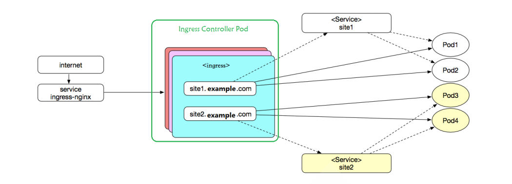
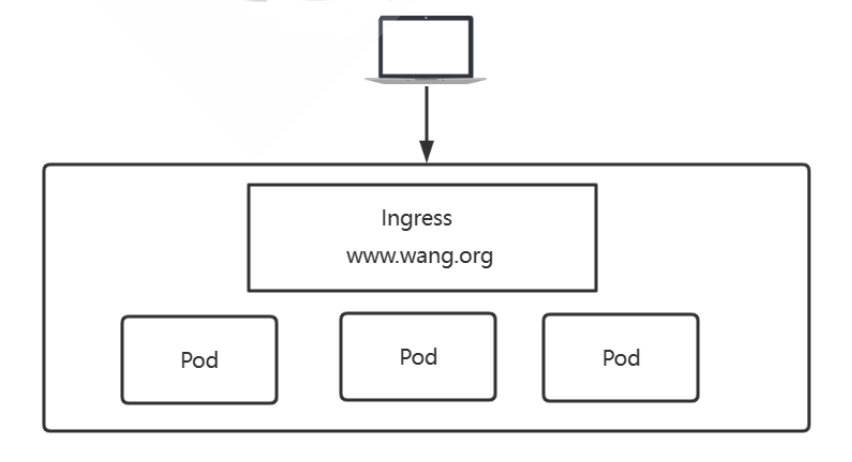

## Kubernetes流量调度-Ingress


**本章内容**

- **Ingress原理**
- **Ingress-nginx安装和配置**
- **Ingress-nginx实现**
- **Ingress-nginx 实现蓝绿和灰度发布**


### Ingress原理

Ingress本质就是**七层代理**, 所以可以基于http/https的方式，将集群外部的流量统一的引入到集群内部

通过一个统一的流量入口，避免将集群内部大量的端口直接暴露给外部

Ingress 可为 Service 提供外部可访问的 URL、负载均衡流量、终止 SSL/TLS，以及基于名称的虚拟托管。 Ingress 控制器 通常负责通过负载均衡器来实现 Ingress，尽管它也可以配置边缘路由器或其他前端来帮助处理流量。

Ingress 不会公开任意端口或协议。 将 HTTP 和 HTTPS 以外的服务公开到 Internet 时，通常使用 Service.Type=NodePort 或 Service.Type=LoadBalancer 类型的 Service。

Ingress这种利用应用层协议来进行流量的负载均衡效果，它可以实现让用户通过域名来访问相应的 service就可以了，无需关心Node IP及Port是什么，避免了信息的泄露。


**ingress 主要包含两个组件Ingress API和Ingress Controller**

ingress 其具备了动态更新并加载新配置的特性。而且ingress本身是不具备实现集群内外流量通信的功能的，这个功能是通过 controller来实现的。**Ingress Controller本身是运行于集群中的Pod资源对象**

| 组件               | 解析                                                         |
| ------------------ | ------------------------------------------------------------ |
| Ingress API        | Kubernetes上的标准API资源类型之一 仅定义了抽象路由配置信息，只是元数据，需要由相应的控制器动态加载 将代理配置抽象成一个Ingress对象，每个服务对应一个yaml配置文件 负责以k8s标准的资源格式定义流量调度、路由等规则 属于名称空间级资源,完成将同一个名空间的service资源进行暴露 |
| Ingress Controller | 七层反向代理服务程序 需要监视（watch）API Server上 Ingress资源的变动，并生成具体应用的自身的配 置文件格式，即将新加入的Ingress转化成反向代理的配置文件并动态加载使之生效，最终并据此完成流量转发 <br />Ingress Controller非为内置的控制器，需要额外自行部署 <br />通常以Pod形式运行于Kubernetes集群之上 一般应该由专用的LB Service负责为其接入集群外部流量 |


**因为ingress Controller是以pod的方式部署的,所以需要解决如下问题**

- ingress的pod如何引入外部流量
  - 通过一个专用的service 即可实现
- 如何实现ingress的Pod的流量负载均衡
  - 关于pod负载均衡的流量，直接通过deployment/daemonset等controller转发给后端pod即可。
- 后端应用的 Pod 很多，如何找到要转发的目标？
  - 通过k8s的service对所有的pod进行分组管理，再用controller内部的负载均衡配置，找到对应的目标。
  - 即后端应用的Pod对应的service 只是起到服务发现Pod的功能，而从外部访问应用的Pod的流量转发过程中不需要再经过此service 


#### Ingress 访问过程

- 从外部流量调度到kubernetes中Ingress service，有多种实现方案，比如使用节点网络中的 EXTERNAL-IP或者NodePort方式
- 从service调度到ingress-controller
- ingress-controller根据ingress Pod 中的定义，比如虚拟主机或者后端的url
- 根据虚拟主机名直接调度到后端的一组应用pod中




注意：

- 整个流程中涉及到了两处service内容
- service ingress-nginx 是帮助 ingress controller Pod 接入外部流量的
- **后端的服务对应的service**只起到帮助 ingress controller Pod 找到具体的服务的Pod，即**只用于服务发现** ，而**流量不需要经过后端服务的Service**，直接从ingress controller Pod转到至具体的Pod
- 虚线表示service对后端的应用进行分组，实线表示ingress实际的访问流向


###  Ingress controller 常见的解决方案

对于Ingress controller的软件实现，其实没有特殊的要求，只要能够实现七层的负载均衡功能效果即可

Ingress controller 支持由任何具有反向代理功能的程序实现，如Nginx、Traefik、Envoy、HAProxy、 Vulcand等

Kubernetes支持同时部署二个或以上的数量的Ingress Controller

**Ingress资源配置指定Ingress Controller类型的方法**

- 专用的**annotation**：kubernetes.io/ingress.class，老版本用法
- Ingress资源的spec的专有字段：**ingressClassName**，引用的IngressClass是一种特定的资源类 型，此方式v1.18版本起使用，新版本推荐


### Ingress-nginx-Controller安装和配置


#### 基于YAML部署

基于kubectl apply 部署

```bash
#获取配置文件,可能需要科学上网才能下载
https://kubernetes.github.io/ingress-nginx/deploy/

# 新版
[root@master1 ~]#wget https://raw.githubusercontent.com/kubernetes/ingress-nginx/controller-v1.11.1/deploy/static/provider/cloud/deploy.yaml

[root@master1 ~]#wget https://raw.githubusercontent.com/kubernetes/ingress-nginx/controller-v1.8.2/deploy/static/provider/cloud/deploy.yaml

[root@master1 ~]#wget https://raw.githubusercontent.com/kubernetes/ingress-nginx/controller-v1.8.0/deploy/static/provider/cloud/deploy.yaml

# 查看资源
[root@master1 ~]#cat deploy-v1.11.1.yaml |grep "^kind"
kind: Namespace
kind: ServiceAccount
kind: ServiceAccount
kind: Role
kind: Role
kind: ClusterRole
kind: ClusterRole
kind: RoleBinding
kind: RoleBinding
kind: ClusterRoleBinding
kind: ClusterRoleBinding
kind: ConfigMap
kind: Service
kind: Service
kind: Deployment
kind: Job
kind: Job
kind: IngressClass
kind: ValidatingWebhookConfiguration

# 编辑deploy-v1.11.1.yaml
# 1）默认镜像可能需要翻墙，需要修改基础镜像（共改3处，其中2处相同）
[root@master1 ~]#vim deploy.yaml
        # image: registry.k8s.io/ingress-nginx/controller:v1.11.1@sha256:e6439a12b52076965928e83b7b56aae6731231677b01e81818bce7fa5c60161a
          image: registry.cn-hangzhou.aliyuncs.com/google_containers/nginx-ingress-controller:v1.11.1
        # image: registry.k8s.io/ingress-nginx/kube-webhook-certgen:v1.4.1@sha256:36d05b4077fb8e3d13663702fa337f124675ba8667cbd949c03a8e8ea6fa4366  
          image: registry.cn-hangzhou.aliyuncs.com/google_containers/kube-webhook-certgen:v20230407
        # image: registry.k8s.io/ingress-nginx/kube-webhook-certgen:v1.4.1@sha256:36d05b4077fb8e3d13663702fa337f124675ba8667cbd949c03a8e8ea6fa4366  
          image: registry.cn-hangzhou.aliyuncs.com/google_containers/kube-webhook-certgen:v20230407
          
#2）开放外部访问入口地址
apiVersion: v1
kind: Service
metadata:
  labels:
    app.kubernetes.io/component: controller
    app.kubernetes.io/instance: ingress-nginx
    app.kubernetes.io/name: ingress-nginx
    app.kubernetes.io/part-of: ingress-nginx
    app.kubernetes.io/version: 1.11.1
  name: ingress-nginx-controller
  namespace: ingress-nginx
  annotations:                       # 添加如下三行，用于支持Prometheus监控，可选
    prometheus.io/scrape: "true"
    prometheus.io/port: "10254"
spec:
  externalTrafficPolicy: Local
  ipFamilies:
  - IPv4
  ipFamilyPolicy: SingleStack
  ports:
  - appProtocol: http
    name: http
    port: 80
    protocol: TCP
    targetPort: http
  - appProtocol: https
    name: https
    port: 443
    protocol: TCP
    targetPort: https
  selector:
    app.kubernetes.io/component: controller
    app.kubernetes.io/instance: ingress-nginx
    app.kubernetes.io/name: ingress-nginx
  type: LoadBalancer             # 这里使用LoadBalancer，因此需要部署MetalLB
  
#3）默认ingress-nginx-controller只有一个Pod副本的,
#方法1: 指定2个副本实现高可用（此步可选）
  name: ingress-nginx-controller
  namespace: ingress-nginx
spec:
  replicas: 2  # 添加副本数
  
# 配置MetalLB
[root@master1 metalLB]#kubectl apply -f metallb-native.yaml 
namespace/metallb-system created
customresourcedefinition.apiextensions.k8s.io/bfdprofiles.metallb.io created
customresourcedefinition.apiextensions.k8s.io/bgpadvertisements.metallb.io created
customresourcedefinition.apiextensions.k8s.io/bgppeers.metallb.io created
customresourcedefinition.apiextensions.k8s.io/communities.metallb.io created
customresourcedefinition.apiextensions.k8s.io/ipaddresspools.metallb.io created
customresourcedefinition.apiextensions.k8s.io/l2advertisements.metallb.io created
customresourcedefinition.apiextensions.k8s.io/servicel2statuses.metallb.io created
serviceaccount/controller created
serviceaccount/speaker created
role.rbac.authorization.k8s.io/controller created
role.rbac.authorization.k8s.io/pod-lister created
clusterrole.rbac.authorization.k8s.io/metallb-system:controller created
clusterrole.rbac.authorization.k8s.io/metallb-system:speaker created
rolebinding.rbac.authorization.k8s.io/controller created
rolebinding.rbac.authorization.k8s.io/pod-lister created
clusterrolebinding.rbac.authorization.k8s.io/metallb-system:controller created
clusterrolebinding.rbac.authorization.k8s.io/metallb-system:speaker created
configmap/metallb-excludel2 created
secret/metallb-webhook-cert created
service/metallb-webhook-service created
deployment.apps/controller created
daemonset.apps/speaker created
validatingwebhookconfiguration.admissionregistration.k8s.io/metallb-webhook-configuration created

[root@master1 metalLB]#kubectl apply -f service-metallb-IPAddressPool.yaml 
ipaddresspool.metallb.io/localip-pool created

[root@master1 metalLB]#kubectl apply -f service-metallb-L2Advertisement.yaml 
l2advertisement.metallb.io/localip-pool-l2a created

# 应用Ingress-nginx资源配置文件
[root@master1 ~]#kubectl apply -f deploy-v1.11.1.yaml 
namespace/ingress-nginx created
serviceaccount/ingress-nginx created
serviceaccount/ingress-nginx-admission created
role.rbac.authorization.k8s.io/ingress-nginx created
role.rbac.authorization.k8s.io/ingress-nginx-admission created
clusterrole.rbac.authorization.k8s.io/ingress-nginx created
clusterrole.rbac.authorization.k8s.io/ingress-nginx-admission created
rolebinding.rbac.authorization.k8s.io/ingress-nginx created
rolebinding.rbac.authorization.k8s.io/ingress-nginx-admission created
clusterrolebinding.rbac.authorization.k8s.io/ingress-nginx created
clusterrolebinding.rbac.authorization.k8s.io/ingress-nginx-admission created
configmap/ingress-nginx-controller created
service/ingress-nginx-controller created
service/ingress-nginx-controller-admission created
deployment.apps/ingress-nginx-controller created
job.batch/ingress-nginx-admission-create created
job.batch/ingress-nginx-admission-patch created
ingressclass.networking.k8s.io/nginx created
validatingwebhookconfiguration.admissionregistration.k8s.io/ingress-nginx-admission created

# 查看
[root@master1 ~]# kubectl get all -n ingress-nginx 
NAME                                        READY   STATUS      RESTARTS   AGE
pod/ingress-nginx-admission-create-lx764    0/1     Completed   0          91s
pod/ingress-nginx-admission-patch-vqttt     0/1     Completed   1          91s
pod/ingress-nginx-controller-666487-9cvb7   1/1     Running     0          91s
pod/ingress-nginx-controller-666487-z24f8   1/1     Running     0          91s

NAME                                         TYPE           CLUSTER-IP       EXTERNAL-IP   PORT(S)                      AGE
service/ingress-nginx-controller             LoadBalancer   10.100.252.99    10.0.0.10     80:30529/TCP,443:31050/TCP   91s
service/ingress-nginx-controller-admission   ClusterIP      10.110.228.129   <none>        443/TCP                      91s

NAME                                       READY   UP-TO-DATE   AVAILABLE   AGE
deployment.apps/ingress-nginx-controller   2/2     2            2           91s

NAME                                              DESIRED   CURRENT   READY   AGE
replicaset.apps/ingress-nginx-controller-666487   2         2         2       91s

NAME                                       STATUS     COMPLETIONS   DURATION   AGE
job.batch/ingress-nginx-admission-create   Complete   1/1           20s        91s
job.batch/ingress-nginx-admission-patch    Complete   1/1           22s        91s

```


### Ingress命令式实现

#### 命令式实现说明

```bash
# 类比nginx反向代理配置文件
http {
    upstream service_name {
        server xxxx: port
        server xxxx: port
    }
    server {
        listen 80;
        server_name domain;
        location /url {
            proxy_pass http://upstream_name;
        }
    }
}

# 创建Ingress命令
kubectl create ingress NAME --rule=domain/url=service:port[, tls[=secret]] [option]

# 常用option
--annotation=[]  # 注解信息：格式"annotation=value"
--rule=[]        # 代理规则，格式"host/path=service:port[,tls=secretname]",,注意:rule中外部域名要在所有的名称空间唯一
--class=''       # 此Ingress适配的Ingress Class Controller

# 基于URI方式代理不同应用的请求时，后端应用的URI若与代理时使用的URI不同，则需要启用URL Rewrite完成URI的重写
# Ingress-Nginx支持使用“annotation nginx.ingress.kubernetes.io/rewrite-target”注解进行
```


#### 命令式实现案例

**准备环境实现两个service应用 pod-test1和pod-test2**

```bash
# 准备后端的应用pod-test v0.1和相应的service
[root@master1 ~]# kubectl create deployment pod-test1 --image=registry.cn-beijing.aliyuncs.com/wangxiaochun/pod-test:v0.1 --replicas=3
deployment.apps/pod-test1 created

[root@master1 ~]# kubectl create service clusterip pod-test1 --tcp=80:80
service/pod-test1 created

# 准备后端的应用pod-test v0.2和相应的service
[root@master1 ~]# kubectl create deployment pod-test2 --image=registry.cn-beijing.aliyuncs.com/wangxiaochun/pod-test:v0.2 --replicas=3
deployment.apps/pod-test2 created

[root@master1 ~]#kubectl create service clusterip pod-test2 --tcp=80:80
service/pod-test2 created

[root@master1 ~]#kubectl get ep
NAME         ENDPOINTS                                         AGE
kubernetes   10.0.0.201:6443                                   4h47m
pod-test1    10.244.1.159:80,10.244.2.107:80,10.244.3.173:80   3m10s
pod-test2    10.244.1.160:80,10.244.2.108:80,10.244.3.174:80   13s
```


##### 单域名单URL

**实现单域名不支持子URL**

范例：命令式实现单域名不支持子URL，子URL无法访问，返回404

```bash
#路径精确匹配,对于发往www.wang.org的请求，代理至service/pod-test1，其它的URL则无法代理
[root@master1 ~]# kubectl create ingress demo-ingress --rule="www.mystical.org/=pod-test1:80" --class=nginx -o yaml --dry-run=client
apiVersion: networking.k8s.io/v1
kind: Ingress
metadata:
  creationTimestamp: null
  name: demo-ingress
spec:
  ingressClassName: nginx
  rules:
  - host: www.mystical.org
    http:
      paths:
      - backend:
          service:
            name: pod-test1
            port:
              number: 80
        path: /
        pathType: Exact    # #表示精确匹配，--rule="www.wang.org/*=pod-test1:80",则为prefix
status:
  loadBalancer: {}

# 创建
[root@master1 ~]#kubectl create ingress demo-ingress --rule="www.mystical.org/=pod-test1:80" --class=nginx
ingress.networking.k8s.io/demo-ingress created

# 查看生成的yaml文件
[root@master1 ~]#kubectl get ingress demo-ingress -o yaml
apiVersion: networking.k8s.io/v1
kind: Ingress
metadata:
  creationTimestamp: "2025-01-04T06:37:06Z"
  generation: 1
  name: demo-ingress
  namespace: default
  resourceVersion: "30734"
  uid: a87cc2f4-3755-45fd-ab85-36a800869698
spec:
  ingressClassName: nginx
  rules:
  - host: www.mystical.org
    http:
      paths:
      - backend:
          service:
            name: pod-test1
            port:
              number: 80
        path: /
        pathType: Exact
status:
  loadBalancer: {}


# 查看ingress资源
[root@master1 ~]#kubectl get ingress
NAME           CLASS   HOSTS              ADDRESS     PORTS   AGE
demo-ingress   nginx   www.mystical.org   10.0.0.10   80      2m37s


# 查看ingress-nginx-controller对应的Pod中Nginx配置文件的变化
[root@master1 ~]# kubectl exec -it -n ingress-nginx ingress-nginx-controller-666487-9cvb7  -- grep mystical.org /etc/nginx/nginx.conf
	## start server www.mystical.org
		server_name www.mystical.org ;
	## end server www.mystical.org


# 集群外访问
[root@master1 ~]#curl -H"host: www.mystical.org" http://10.0.0.10
kubernetes pod-test v0.1!! ClientIP: 10.244.1.158, ServerName: pod-test1-cd487559d-pmf2j, ServerIP: 10.244.3.173!
[root@master1 ~]#curl -H"host: www.mystical.org" http://10.0.0.10
kubernetes pod-test v0.1!! ClientIP: 10.244.1.158, ServerName: pod-test1-cd487559d-v6pl7, ServerIP: 10.244.1.159!


# 访问子URL失败，原因是只发布了www.wang.org的根目录，其它URL没有发布
[root@master1 ~]#curl -H"host: www.mystical.org" http://10.0.0.10/hostname
<html>
<head><title>404 Not Found</title></head>
<body>
<center><h1>404 Not Found</h1></center>
<hr><center>nginx</center>
</body>
</html>


#清理
[root@master1 ~]#kubectl delete ingress demo-ingress 
ingress.networking.k8s.io "demo-ingress" deleted
```


**实现单域名支持子URL**

```bash
#添加/*，支持子URL，如果有URL则转发至Pod对应相同的URL
[root@master1 ~]# kubectl create ingress demo-ingress --class=nginx --rule="www.mystical.org/*=pod-test1:80" -o yaml --dry-run=client
apiVersion: networking.k8s.io/v1
kind: Ingress
metadata:
  creationTimestamp: null
  name: demo-ingress
spec:
  ingressClassName: nginx
  rules:
  - host: www.mystical.org
    http:
      paths:
      - backend:
          service:
            name: pod-test1
            port:
              number: 80
        path: /
        pathType: Prefix
status:
  loadBalancer: {}


# 创建
[root@master1 ~]#kubectl create ingress demo-ingress --rule="www.mystical.org/*=pod-test1:80" --class=nginx
ingress.networking.k8s.io/demo-ingress created

# 查看
[root@master1 ~]#kubectl get ingress
NAME           CLASS   HOSTS              ADDRESS   PORTS   AGE
demo-ingress   nginx   www.mystical.org             80      5s

# 测试访问，且支持子URL
[root@master1 ~]#curl -H"host: www.mystical.org" 10.0.0.10/hostname
ServerName: pod-test1-cd487559d-gs725

# 清理
[root@master1 ~]#kubectl delete ingress demo-ingress 
ingress.networking.k8s.io "demo-ingress" deleted
```


##### 单域名多URL


在同一个FQDN下通过不同的URL完成不同应用间的流量分发


**单域名多URL不支持子URL**

范例: 命令式实现单域名多URL，不支持子URL，如果子URL访问，也全部转发至后端Pod的根路径 / 

```bash
#路径精确匹配,对于发往www.wang.org/v1和www.wang.org/v2的请求，分别代理至service/pod-test1和service/pod-test2的对应的子URL
[root@master1 ~]# kubectl create ingress demo-ingress1 --rule="www.mystical.org/v1=pod-test1:80" --rule="www.mystical.org/v2=pod-test2:80" --class=nginx
ingress.networking.k8s.io/demo-ingress1 created

# 集群外访问失败，原因是后端服务没有对应的/v1这样的子URL资源
[root@master1 ~]# curl -H"host: www.mystical.org" 10.0.0.10/v1/
<html>
<head><title>404 Not Found</title></head>
<body>
<center><h1>404 Not Found</h1></center>
<hr><center>nginx</center>
</body>
</html>
[root@mas

[root@master1 ~]# curl -H"host: www.mystical.org" 10.0.0.10/v2/
<html>
<head><title>404 Not Found</title></head>
<body>
<center><h1>404 Not Found</h1></center>
<hr><center>nginx</center>
</body>
</html>

# 路径精确匹配,对于发往www.wang.org/v1和/v2的请求，分别代理至service/pod-test1和service/pod-test2的根
[root@master1 ~]# kubectl create ingress demo-ingress1 --rule="www.mystical.org/v1=pod-test1:80" --rule="www.mystical.org/v2=pod-test2:80" --class=nginx --annotation nginx.ingress.kubernetes.io/rewrite-target="/"

# --annotation nginx.ingress.kubernetes.io/rewrite-target="/" 表示代理至后端服务的根/，而非默认代理至后端服务的子URL/v1和/v2

# 查看对应的yaml文件
[root@master1 ~]# kubectl get ingress demo-ingress1 -o yaml
apiVersion: networking.k8s.io/v1
kind: Ingress
metadata:
  annotations:
    nginx.ingress.kubernetes.io/rewrite-target: /
  creationTimestamp: "2025-01-04T07:49:12Z"
  generation: 1
  name: demo-ingress1
  namespace: default
  resourceVersion: "38353"
  uid: 822e0bb2-0ae3-4b17-acc2-13db0bfe5499
spec:
  ingressClassName: nginx
  rules:
  - host: www.mystical.org
    http:
      paths:
      - backend:
          service:
            name: pod-test1
            port:
              number: 80
        path: /v1
        pathType: Exact
      - backend:
          service:
            name: pod-test2
            port:
              number: 80
        path: /v2
        pathType: Exact
status:
  loadBalancer:
    ingress:
    - ip: 10.0.0.10


# 测试
[root@master1 ~]#curl -H"host: www.mystical.org" 10.0.0.10/v2/
kubernetes pod-test v0.2!! ClientIP: 10.244.3.172, ServerName: pod-test2-6fb54b5db8-jkvjx, ServerIP: 10.244.1.160!
[root@master1 ~]#curl -H"host: www.mystical.org" 10.0.0.10/v1
kubernetes pod-test v0.1!! ClientIP: 10.244.1.158, ServerName: pod-test1-cd487559d-pmf2j, ServerIP: 10.244.3.173!

# 如果有URL，则访问的资源仍然是根目录，不支持对应的子URL
[root@master1 ~]#curl -H"host: www.mystical.org" 10.0.0.10/v1/hostname
kubernetes pod-test v0.1!! ClientIP: 10.244.1.158, ServerName: pod-test1-cd487559d-v6pl7, ServerIP: 10.244.1.159!

# 清理
[root@master1 ~]#kubectl delete ingress demo-ingress1 
ingress.networking.k8s.io "demo-ingress1" deleted
```


**单域名多URL支持子URL**

范例：命令式实现单域名多URL，支持子URL

```bash
# 使用URI的前缀匹配，而非精确匹配，且基于正则表达式模式进行url rewrite
[root@master1 ~]# kubectl create ingress demo-ingress2 --rule='www.mystical.org/v1(/|$)(.*)=pod-test1:80' --rule='www.mystical.org/v2(/|$)(.*)=pod-test2:80' --class=nginx --annotation nginx.ingress.kubernetes.io/rewrite-target='/$2'
Warning: path /v1(/|$)(.*) cannot be used with pathType Exact
Warning: path /v2(/|$)(.*) cannot be used with pathType Exact
ingress.networking.k8s.io/demo-ingress2 created


# 查看
[root@master1 ~]#kubectl get ingress
NAME            CLASS   HOSTS              ADDRESS     PORTS   AGE
demo-ingress2   nginx   www.mystical.org   10.0.0.10   80      75s


# 查看yaml文件
[root@master1 ~]# kubectl get ingress demo-ingress2 -o yaml
apiVersion: networking.k8s.io/v1
kind: Ingress
metadata:
  annotations:
    nginx.ingress.kubernetes.io/rewrite-target: /$2
  creationTimestamp: "2025-01-04T07:58:21Z"
  generation: 1
  name: demo-ingress2
  namespace: default
  resourceVersion: "39303"
  uid: de4a2bb8-e2aa-4458-ba39-3660dc46ed5f
spec:
  ingressClassName: nginx
  rules:
  - host: www.mystical.org
    http:
      paths:
      - backend:
          service:
            name: pod-test1
            port:
              number: 80
        path: /v1(/|$)(.*)
        pathType: Exact
      - backend:
          service:
            name: pod-test2
            port:
              number: 80
        path: /v2(/|$)(.*)
        pathType: Exact
status:
  loadBalancer:
    ingress:
    - ip: 10.0.0.10


# 测试
[root@master1 ~]# curl -H"host: www.mystical.org" 10.0.0.10/v1/hostname
ServerName: pod-test1-cd487559d-v6pl7
[root@master1 ~]# curl -H"host: www.mystical.org" 10.0.0.10/v2/hostname
ServerName: pod-test2-6fb54b5db8-p6bwc
 
# 清理
[root@master1 ~]# kubectl delete ingress demo-ingress2 
ingress.networking.k8s.io "demo-ingress2" deleted
```


##### 多域名


范例：命令式实现基于主机头的多虚拟主机

```bash
# 环境准备：
# 基于FQDN名称代理不同应用的请求时，需要事先准备好多个域名，且确保对这些域名的解析能够达到Igress Controller

# 对test1.wang.org的请求代理至service/pod-test1，对test2.wang.org请求代理至service/pod-test2
[root@master1 ~]# kubectl create ingress demo-ingress3 --rule="test1.mystical.org/*=pod-test1:80" --rule="test2.mystical.org/*=pod-test2:80" --class=nginx
ingress.networking.k8s.io/demo-ingress3 created


# 查看
[root@master1 ~]# kubectl get ingress
NAME            CLASS   HOSTS                                  ADDRESS   PORTS   AGE
demo-ingress3   nginx   test1.mystical.org,test2.mytical.org             80      25s

[root@master1 ~]# kubectl get ingress demo-ingress3 -o yaml
apiVersion: networking.k8s.io/v1
kind: Ingress
metadata:
  creationTimestamp: "2025-01-04T08:11:21Z"
  generation: 1
  name: demo-ingress3
  namespace: default
  resourceVersion: "40668"
  uid: af274e94-7c95-4ee3-9dd3-4da09fcd0937
spec:
  ingressClassName: nginx
  rules:
  - host: test1.mystical.org
    http:
      paths:
      - backend:
          service:
            name: pod-test1
            port:
              number: 80
        path: /
        pathType: Prefix
  - host: test2.mystical.org
    http:
      paths:
      - backend:
          service:
            name: pod-test2
            port:
              number: 80
        path: /
        pathType: Prefix
status:
  loadBalancer:
    ingress:
    - ip: 10.0.0.10


# 测试
[root@master1 ~]#curl -H'host: test1.mystical.org' 10.0.0.10
kubernetes pod-test v0.1!! ClientIP: 10.244.3.172, ServerName: pod-test1-cd487559d-gs725, ServerIP: 10.244.2.107!

[root@master1 ~]#curl -H'host: test2.mystical.org' 10.0.0.10
kubernetes pod-test v0.2!! ClientIP: 10.244.1.158, ServerName: pod-test2-6fb54b5db8-jkvjx, ServerIP: 10.244.1.160!

# 清理
[root@master1 ~]#kubectl delete ingress demo-ingress3 
ingress.networking.k8s.io "demo-ingress3" deleted
```


##### HTTPS

范例：命令式实现HTTPS

```bash
# 基于TLS的Ingress要求事先准备好专用的“kubernetes.io/tls”类型的Secret资源对象
[root@master1 tls]#ls
mystical.org.crt  mystical.org.key

#创建Secret
[root@master1 tls]#kubectl create secret tls tls-mystical --cert=./mystical.org.crt --key=./mystical.org.key 
secret/tls-mystical created

# 查看
[root@master1 tls]#kubectl get secrets
NAME           TYPE                DATA   AGE
tls-mystical   kubernetes.io/tls   2      45s

#创建虚拟主机代理规则，同时将该主机定义为TLS类型，默认HTTP自动跳转至HTTPS
[root@master1 tls]#kubectl create ingress tls-demo-ingress --rule='www.mystical.org/*=pod-test1:80, tls=tls-mystical' --class=nginx
ingress.networking.k8s.io/tls-demo-ingress created

# 注意：启用tls后，该域名下的所有URI默认为强制将http请求利用308跳转至https，若不希望使用该跳转功能，可以使用如下注解选项
--annotation nginx.ingress.kubernetes.io/ssl-redirect=false，即如下形式
[root@master1 ~]# kubectl create ingress tls-demo-ingress -- rule='www.wang.org/*=pod-test1:80,tls=tls-wang' --class=nginx --annotation nginx.ingress.kubernetes.io/ssl-redirect=false

# 查看
[root@master1 tls]#kubectl get ingress tls-demo-ingress -o yaml
apiVersion: networking.k8s.io/v1
kind: Ingress
metadata:
  creationTimestamp: "2025-01-04T08:47:00Z"
  generation: 1
  name: tls-demo-ingress
  namespace: default
  resourceVersion: "44442"
  uid: 42e90245-143b-4f74-a128-8216da28b839
spec:
  ingressClassName: nginx
  rules:
  - host: www.mystical.org
    http:
      paths:
      - backend:
          service:
            name: pod-test1
            port:
              number: 80
        path: /
        pathType: Prefix
  tls:
  - hosts:
    - www.mystical.org
    secretName: tls-mystical
status:
  loadBalancer:
    ingress:
    - ip: 10.0.0.10


#集群外客户端测试访问
https://www.mystical.org/
```


##### 证书更新

HTTPS 的证书的有效期一般为1年,到期前需要提前更新证书

```bash
#重新颁发证书
[root@master1 ~]# (umask 077; openssl genrsa -out wang.key 2048)
[root@master1 ~]# openssl req -new -x509 -key wang.key -out wang.crt -subj /C=CN/ST=Beijing/L=Beijing/O=SRE/CN=www.wang.org -days 3650

# 方法1：
#在线修改证书配置,需要提前先将新证书文件用base64编码并删除换行符
[root@master1 ~]# cat wang.crt |base64 | tr -d '\n' 
[root@master1 ~]# cat wang.key |base64 | tr -d '\n'

#上面生成的内容替换下面命令的内容,立即生效
[root@master1 ~]# kubectl edit secrets tls-wang 

# 方法2：
#方法2
#删除旧证书配置
[root@master1 ~]#kubectl delete secrets tls-wang 

#创建新证书配置
[root@master1 ~]# kubectl create secret tls tls-wang --cert=./wang.crt --key=./wang.key
```


### Ingress声明式实现

#### 声明式实现说明

基于命令方式格式功能有限，且不利于后续的重复使用，**工作中更多的使用声明式实现Ingress**

在实际的工作中，可能会基于域名访问,也可能会基于不同的功能服务以子路径的方式来进行访问，以及 与https相关的访问。


**配置文件解析**

```yaml
apiVersion: networking.k8s.io/v1
kind: Ingress
metadata:
  name: <string>
  annotations:                                 # 资源注解，v1beta1使用下面的注解来指定要解析该资源的控制器类型
    kubernetes.io/ingress.class: <string>      # 适配的Ingress控制器类别，便于多ingress组件场景下，挑选针对的类型
    # 用于URL重写
    nginx.ingress.kubernetes.io/rewrite-target: /   
  namespace: <string>
spec:
  rules: <[]object>                            # Ingress规则列表，也就是http转发时候用到的 url关键字
  - host: <string>                             # 虚拟主机的FQDN，支持"*"前缀通配，不支持IP，不支持指定端口
    http: <object>
      paths: <[]object>                        # 虚拟主机PATH定义的列表，由path和backend组成
      - path: <string>                         # 流量匹配的HTTP PATH，必须以/开头
        pathType: <string>                     # 支持Exact、Prefix和ImplementationSpecific, 必须
        backend: <object>                      # 匹配到的流量转发到的目标后端
          resource: <object>                   # 引用的同一名称空间下的资源，与下面两个字段互斥
          service: <object>                    # 关联的后端Service对象
            name: <string>                     # 后端Service的名称
            port: <string>                     # 后端Service上的端口对象
              name: <string>                   # 端口名称
              number: <integer>                # 后端Service的端口号cat
  tls: <[]Object>                              # TLS配置，用于指定上rules中定义的哪些host需要工作https模式
  - hosts: <[]string>                          # 使用同一组证书的主机名称列表
    secretName: <string>                       # 保存于数字证书和私钥信息的Secret资源名称，用于主机认证
  backend: <Object>                            # 默认backend的定义，可嵌套字段及使用格式跟rules字段中的相同
  ingressClassName: <string>                   # ingress类名称，用于指定适配的控制器，类似于注解的功能，未来代替                                                        annotations
```


#### 补充：三种 `pathType` 及其含义与使用方式

1️⃣ `Exact`

- **含义**：完全匹配路径，只有请求路径与规则中的路径 **完全一致** 才会被匹配。
- **场景**：适用于需要精确控制的 API 入口等情况。

**示例：**

```yaml
path: /app
pathType: Exact
```

| 请求路径  | 是否匹配 |
| --------- | -------- |
| `/app`    | ✅ 是     |
| `/app/`   | ❌ 否     |
| `/app/v1` | ❌ 否     |


2️⃣ `Prefix`

- **含义**：匹配以指定路径为前缀的请求路径，且路径分段（以 `/` 分隔）必须完整匹配。
- **这是使用最广泛的类型**。

**示例：**

```yaml
path: /app
pathType: Prefix
```

| 请求路径       | 是否匹配 |
| -------------- | -------- |
| `/app`         | ✅ 是     |
| `/app/`        | ✅ 是     |
| `/app/page`    | ✅ 是     |
| `/application` | ❌ 否     |

注意：**`/app/page`** ✅ 是因为它是以 `/app` 这个段开头，而 `/application` ❌ 是因为整个段不匹配。


3️⃣ `ImplementationSpecific`

- **含义**：由 Ingress Controller 自己决定如何匹配路径，行为 **可能因控制器不同而异**。
- **不推荐生产使用**，容易出现不一致行为。

 **示例：**

```
path: /app
pathType: ImplementationSpecific
```

| 请求路径    | 是否匹配 |
| ----------- | -------- |
| `/app`      | 可能是   |
| `/app2`     | 可能也是 |
| `/app/test` | 可能是   |

取决于你用的是哪个 Ingress Controller，例如 NGINX、Traefik、HAProxy 等都实现略有不同。


#### 补充：Ingress重定向实现

`nginx.ingress.kubernetes.io/rewrite-target: /` 这个 annotation 用于 **URL 重写**，它的作用是 **将进入 Ingress 的请求路径“修改后”再转发给后端服务**。

##### 例子：URL 重写

**目标**

- 用户访问 **`http://example.org/app`** 时，后端实际收到的是 `/`。
- 适用于后端服务不希望处理 `app` 这个前缀的情况。

**1️⃣ 创建 Service**

```yaml
apiVersion: v1
kind: Service
metadata:
  name: echo-service
  namespace: default
spec:
  selector:
    app: echo
  ports:
    - protocol: TCP
      port: 80
      targetPort: 80
```

**2️⃣ 创建 Deployment**

```yaml
apiVersion: apps/v1
kind: Deployment
metadata:
  name: echo-deployment
  namespace: default
spec:
  replicas: 2
  selector:
    matchLabels:
      app: echo
  template:
    metadata:
      labels:
        app: echo
    spec:
      containers:
      - name: echo-container
        image: hashicorp/http-echo
        args:
        - "-text=Hello from backend!"
        ports:
        - containerPort: 80
```

**3️⃣ 创建 Ingress**

```yaml
apiVersion: networking.k8s.io/v1
kind: Ingress
metadata:
  name: echo-ingress
  namespace: default
  annotations:
    nginx.ingress.kubernetes.io/rewrite-target: /
spec:
  ingressClassName: nginx
  rules:
  - host: example.org
    http:
      paths:
      - path: /app
        pathType: Prefix
        backend:
          service:
            name: echo-service
            port:
              number: 80
```

**解析**

1. **用户请求**：`http://example.org/app`
2. Ingress 处理：
   - 由于 `rewrite-target: /`，请求的路径 `/app` 会被**替换成 `/`**。
   - Nginx Ingress 发送请求给后端时，路径变为 `/`。
3. 后端收到请求：
   - `echo-service` 只接收 `/`，返回 `Hello from backend!`。


#### 补充：Ingress 记录 `Service` 端口的意义

##### 为什么 `Ingress` 需要 `Service` 端口

**🔹 Ingress Controller 需要找到 `Service`**

- `Ingress` 不能直接定义 **Pod** 作为后端，而是 **必须通过 `Service`**，以实现负载均衡和动态更新后端 Pod 列表
- `Service` 可能有多个端口，而 Ingress Controller **必须知道应该把流量转发到哪个端口**。

**🔹 Ingress 需要匹配 `Service` 的 `port`**

- `Ingress` 规则指定的是 **Service 的端口**，而不是 Pod 的端口

- `Service` 可能映射 Pod 上的不同端口，比如

  ```yaml
  apiVersion: v1
  kind: Service
  metadata:
    name: my-service
  spec:
    ports:
      - name: http
        port: 8080        # Service 暴露的端口
        targetPort: 80    # Pod 内部的端口
  ```

  此时，Ingress 规则必须指定 `port: 8080`，否则流量不会正确转发！

  ```bash
  apiVersion: networking.k8s.io/v1
  kind: Ingress
  metadata:
    name: my-ingress
  spec:
    rules:
    - host: "example.org"
      http:
        paths:
        - path: "/"
          pathType: Prefix
          backend:
            service:
              name: my-service
              port:
                number: 8080  # 这里必须匹配 Service 的端口
  ```

  **🔹 重点：**

  - `Ingress` 通过 **`Service` 端口** 查找后端服务，并转发流量。
  - `Service` 再将流量转发到对应的 `Pod`（`targetPort`）。


##### Ingress 实际上如何和 Pod 通信

虽然 `Ingress` 配置的是 `Service` 的端口，但 `Ingress Controller` **最终会绕过 `Service`，直接和 Pod 通信**（Service 主要用于发现 Pod）。

**流程如下：**

1. 用户请求 `example.org`

   ```bash
   curl http://example.org
   ```

2. DNS 解析 `example.org`，指向 `Ingress Controller`

3. `Ingress Controller` 根据 `Host` 和 `Path` 规则匹配到 `Service`

4. `Ingress Controller` 查询 `Service` 的 `Endpoints`（实际的 Pod 列表）

5. `Ingress Controller` 直接转发流量到后端`Pod`

   - Ingress Controller **不会再经过 `Service` 负载均衡，而是直接选择一个 `Pod` 并转发请求**。


#### 声明式实现案例

##### 单域名案例



范例 : 单域名支持子URL

```yaml
# 准备后端服务所需资源
[root@master1 ingress] # cat ingress-deployment-svc.yaml 
apiVersion: apps/v1
kind: Deployment
metadata:
  name: deployment-test
spec:
  replicas: 3
  selector:
    matchLabels:
      app: pod-test
  template:
    metadata:
      labels:
        app: pod-test
    spec:
      containers:
      - name: pod-test
        image: registry.cn-beijing.aliyuncs.com/wangxiaochun/pod-test:v0.1
        imagePullPolicy: IfNotPresent
        ports:
        - containerPort: 80
          name: http
---
apiVersion: v1
kind: Service
metadata:
  name: deployment-service
spec:
  selector:
    app: pod-test
  ports:
  - name: http
    port: 80
    targetPort: 80
    
# 应用
[root@master1 yaml] # kubectl apply -f ingress-deployment-svc.yaml 
deployment.apps/deployment-test created

# 自定义创建ingress资源文件
[root@master1 ingress] # vim ingress-http-test.yaml 
apiVersion: networking.k8s.io/v1
kind: Ingress
metadata:
  name: ingress-test
  #annotations:
  #  kubernetes.io/ingress.class: "nginx"
spec:
  ingressClassName: nginx
  rules:
  - host: www.mystical.org
    http:
      paths:
      - path: /
        pathType: Prefix
        backend:
          service:
            name: deployment-service
            port:
              number: 80

# 查看ingress
[root@master1 ingress] # kubectl get ingress
NAME           CLASS   HOSTS              ADDRESS     PORTS   AGE
ingress-test   nginx   www.mystical.org   10.0.0.10   80      2m12s

# 测试
# 这里的客户端显示的是ingress的Pod的IP，而不是真实的客户端IP
[root@master1 ingress] # curl -H"host: www.mystical.org" 10.0.0.10
kubernetes pod-test v0.1!! ClientIP: 10.244.3.178, ServerName: deployment-test-5cc5b8d4cd-bzbnm, ServerIP: 10.244.2.112!
[root@master1 ingress] # curl -H"host: www.mystical.org" 10.0.0.10
kubernetes pod-test v0.1!! ClientIP: 10.244.1.164, ServerName: deployment-test-5cc5b8d4cd-qv78g, ServerIP: 10.244.3.177!

# 清理删除
[root@master1 ingress]#kubectl delete -f ingress-http-test.yaml 
ingress.networking.k8s.io "ingress-test" deleted
```


##### 获取真实客户端IP

```yaml
# 环境准备，直接使用上述环境即可
[root@master1 ingress] # kubectl create deployment myapp --image registry.cn-beijing.aliyuncs.com/wangxiaochun/nginx:1.20.0
deployment.apps/myapp created

[root@master1 ingress] # kubectl create svc clusterip myapp --tcp 80
service/myapp created

# Ingress配置
[root@master1 ingress] # cat ingress-http-real-ip.yaml 
apiVersion: networking.k8s.io/v1
kind: Ingress
metadata:
  name: ingress-myapp
  annotations:
    nginx.ingress.kubernetes.io/enable-real-ip: "true" # 允许IP透传，此为默认值
spec:
  ingressClassName: nginx
  rules:
  - host: www.mystical.org
    http:
      paths:
      - backend:
          service:
            name: myapp
            port:
              number: 80
        path: /
        pathType: Prefix
        
# 查看ingress-nginx的pod里的配置
[root@master1 ingress] # kubectl exec -n ingress-nginx ingress-nginx-controller-666487-9cvb7 -- nginx -T|grep 'proxy_set_header X-Forwarded-For'
nginx: the configuration file /etc/nginx/nginx.conf syntax is ok
nginx: configuration file /etc/nginx/nginx.conf test is successful
			proxy_set_header X-Forwarded-For        $remote_addr;
			proxy_set_header X-Forwarded-For        $remote_addr;
			
# 从集群外访问 
[root@ubuntu2204 ~] # curl www.mystical.org
<!DOCTYPE html>
<html>
<head>
<title>Welcome to nginx!</title>
...

# 查看日志信息
[root@master1 ingress] # kubectl logs myapp-56cc856b4-k9hjv 
10.244.3.178 - - [06/Jan/2025:06:28:39 +0000] "GET / HTTP/1.1" 200 612 "-" "curl/7.81.0" "10.0.0.132"
10.244.3.178 - - [06/Jan/2025:06:28:42 +0000] "GET / HTTP/1.1" 200 612 "-" "curl/7.81.0" "10.0.0.132"
```


##### 单域名多URL案例

范例：环境准备两个HTTP应用

```yaml
# 如果前面的资源已删除，重新应用上面小节的资源文件生成deployment和对应的SVC
#访问 www.wang.org/flask的时候，返回flask的结果
#访问 www.wang.org/nginx的时候，返回nginx的结果

[root@master1 ingress] # cat ingress-deployment-svc.yaml 
apiVersion: apps/v1
kind: Deployment
metadata:
  name: deployment-test
spec:
  replicas: 3
  selector:
    matchLabels:
      app: pod-test
  template:
    metadata:
      labels:
        app: pod-test
    spec:
      containers:
      - name: pod-test
        image: registry.cn-beijing.aliyuncs.com/wangxiaochun/pod-test:v0.1
        imagePullPolicy: IfNotPresent
        ports:
        - containerPort: 80
          name: http
---
apiVersion: v1
kind: Service
metadata:
  name: deployment-service
spec:
  selector:
    app: pod-test
  ports:
  - name: http
    port: 80
    targetPort: 80


# 应用
[root@master1 ingress] # kubectl apply -f ingress-deployment-svc.yaml 
deployment.apps/deployment-test created
service/deployment-service created

# 在添加一个nginx的服务，定义资源文件
[root@master1 ingress] # cat ingress-deployment-nginx.yaml 
apiVersion: apps/v1
kind: Deployment
metadata:
  name: deployment-nginx
spec:
  replicas: 3
  selector:
    matchLabels:
      app: nginx-test
  template:
    metadata:
      labels:
        app: nginx-test
    spec:
      containers:
      - name: nginx-test
        image: registry.cn-beijing.aliyuncs.com/wangxiaochun/nginx:1.20.0
        imagePullPolicy: IfNotPresent
        ports:
        - containerPort: 80
          name: nginx

---
apiVersion: v1
kind: Service
metadata:
  name: nginx-service
spec:
  selector:
    app: nginx-test
  ports:
  - name: nginx
    port: 80
    targetPort: 80
    
# 应用
[root@master1 ingress] # kubectl apply -f ingress-deployment-nginx.yaml 
deployment.apps/deployment-nginx created
service/nginx-service created

# 查看
[root@master1 ingress] # kubectl get deployments,svc
NAME                               READY   UP-TO-DATE   AVAILABLE   AGE
deployment.apps/deployment-nginx   3/3     3            3           113s
deployment.apps/deployment-test    3/3     3            3           10m
deployment.apps/myapp              1/1     1            1           21m

NAME                         TYPE        CLUSTER-IP       EXTERNAL-IP   PORT(S)   AGE
service/deployment-service   ClusterIP   10.105.47.74     <none>        80/TCP    10m
service/kubernetes           ClusterIP   10.96.0.1        <none>        443/TCP   2d5h
service/myapp                ClusterIP   10.102.162.246   <none>        80/TCP    21m
service/nginx-service        ClusterIP   10.102.157.212   <none>        80/TCP    113s
```


**单域名多URL不支持子URL**

```yaml
# 清单文件
[root@master1 ingress] # cat ingress-http-mul-url.yaml 
apiVersion: networking.k8s.io/v1
kind: Ingress
metadata:
  name: ingress-mul-url
  annotations:
#    kubenetes.io/ingress.class: "nginx"   # 新版k8s好像不支持注解的用法
    nginx.ingress.kubernetes.io/rewrite-target: / # 默认会转发给后端时会带URL，添加此行，表示转发时删除后面的URL
spec:
  ingressClassName: nginx  # 新版建议使用此项指定controller类型
  rules:
  - host: www.mystical.org
    http:
      paths:
      - path: /flask
        pathType: Prefix # 表示以/flask为开始即可
        backend:
          service:
            name: deployment-service  # 指定对应Service的名称
            port:
              name: http
      - path: /nginx
        pathType: Prefix
        backend:
          service:
            name: nginx-service
            port:
              name: nginx

# 应用
[root@master1 ingress] # kubectl apply -f ingress-http-mul-url.yaml 
ingress.networking.k8s.io/ingress-mul-url created

# 查看
[root@master1 ingress] # kubectl get ingress
NAME              CLASS   HOSTS              ADDRESS     PORTS   AGE
ingress-mul-url   nginx   www.mystical.org   10.0.0.10   80      5s

# 测试
[root@ubuntu2204 ~] # curl www.mystical.org/flask
kubernetes pod-test v0.1!! ClientIP: 10.244.3.178, ServerName: deployment-test-5cc5b8d4cd-nrv8t, ServerIP: 10.244.1.166!

[root@ubuntu2204 ~] # curl www.mystical.org/nginx
<!DOCTYPE html>
<html>
<head>
<title>Welcome to nginx!</title>
......

#注意事项：
#默认转给后端服务时会将url也同时转发，而后端服务有可能不存在此URL，所以需要在后端url转发的时候，取消转发关键字。
#方法就是，在annotation中添加一个重写的规则nginx.ingress.kubernetes.io/rewrite-target: / 即所有的请求把ingress匹配到的url关键字清除掉

```


**单域名多URL支持子URL**

```yaml
# 准备后端的应用pod-test v0.1和相应的service
[root@master1 ~]# kubectl create deployment pod-test1 --image=registry.cn-beijing.aliyuncs.com/wangxiaochun/pod-test:v0.1 --replicas=3
deployment.apps/pod-test1 created

[root@master1 ~]# kubectl create service clusterip pod-test1 --tcp=80:80
service/pod-test1 created

# 准备后端的应用pod-test v0.2和相应的service
[root@master1 ~]# kubectl create deployment pod-test2 --image=registry.cn-beijing.aliyuncs.com/wangxiaochun/pod-test:v0.2 --replicas=3
deployment.apps/pod-test2 created

[root@master1 ~]#kubectl create service clusterip pod-test2 --tcp=80:80
service/pod-test2 created

[root@master1 ~]#kubectl get ep
NAME         ENDPOINTS                                         AGE
kubernetes   10.0.0.201:6443                                   4h47m
pod-test1    10.244.1.159:80,10.244.2.107:80,10.244.3.173:80   3m10s
pod-test2    10.244.1.160:80,10.244.2.108:80,10.244.3.174:80   13s


# 资源文件
[root@master1 ingress] # cat ingress-http-mul-suburl.yaml 
apiVersion: networking.k8s.io/v1
kind: Ingress
metadata:
  annotations:
    nginx.ingress.kubernetes.io/rewrite-target: /$2  # 正则表达式
  name: ingress-http-mul-suburl
spec:
  ingressClassName: nginx
  rules:
  - host: www.mystical.org
    http:
      paths:
      - backend:
          service:
            name: pod-test1
            port:
              number: 80
        path: /v1(/|$)(.*)
        pathType: Exact
      - backend:
          service:
            name: pod-test2
            port:
              number: 80
        path: /v2(/|$)(.*)
        pathType: Exact

# 应用
[root@master1 ingress] # kubectl apply -f ingress-http-mul-suburl.yaml 
Warning: path /v1(/|$)(.*) cannot be used with pathType Exact
Warning: path /v2(/|$)(.*) cannot be used with pathType Exact
ingress.networking.k8s.io/ingress-http-mul-suburl created

# 查看
[root@master1 ingress] # kubectl get ingress
NAME                      CLASS   HOSTS              ADDRESS     PORTS   AGE
ingress-http-mul-suburl   nginx   www.mystical.org   10.0.0.10   80      9s

# 测试
[root@ubuntu2204 ~]#curl www.mystical.org/v1/hostname
ServerName: pod-test1-cd487559d-wfvhs
[root@ubuntu2204 ~]#curl www.mystical.org/v2/hostname
ServerName: pod-test2-6fb54b5db8-mmrjm
```


##### 多域名案例

```yaml
# 访问flask.mystical.org/的时候，返回flask的结果
# 访问flask.mystical.org/的时候，返回nginx的结果
[root@master1 ingress] # kubectl apply -f ingress-deployment-nginx.yaml 
deployment.apps/deployment-nginx created
service/nginx-service created

[root@master1 ingress] # kubectl apply -f ingress-deployment-svc.yaml
deployment.apps/deployment-test created
service/deployment-service created

# 编辑Ingress资源定义文件
[root@master1 ingress]#cat ingress-http-mul-host.yaml 
apiVersion: networking.k8s.io/v1
kind: Ingress
metadata:
  name: ingress-mul-url
  annotations:
    nginx.ingress.kubernetes.io/use-regex: "true"           # 指定后面rules定义的path使用的正则表达式
    nginx.ingress.kubernetes.io/proxy-body-size: "100m"     # 客户端上传文件最大值，默认1m
    nginx.ingress.kubernetes.io/proxy-connect-timeout: "60" # 后端服务器的连接超时的时间，默认值为5s
    nginx.ingress.kubernetes.io/proxy-send-timeout: "120"   # 后端服务器数据回传超时时间，即规定时间之内后端服务器必须传完所有的数据，默认值为60s
    nginx.ingress.kubernetes.io/proxy-read-timeout: "120"   # 后端服务器响应的超时时间，默认60s
    #nginx.ingress.kubernetes.io/app-root: /index.html      #指定默认页面文件
spec:
  ingressClassName: nginx                                   # 新版建议使用此项指定controllerl类型
  rules:
  - host: flask.mystical.org
    http:
      paths:
      - path: /
        pathType: Prefix
        backend:
          service:
            name: deployment-service
            port:
              name: http                                  # 匹配service中的端口 name: http
  - host: nginx.mystical.org
    http:
      paths:
      - path: /
        pathType: Prefix
        backend:
          service:
            name: nginx-service
            port:
              name: nginx

# 应用
[root@master1 ingress] # kubectl apply -f ingress-http-mul-host.yaml 
ingress.networking.k8s.io/ingress-mul-url created

# 查看
[root@master1 ingress]#kubectl get ingress
NAME              CLASS   HOSTS                                   ADDRESS     PORTS   AGE
ingress-mul-url   nginx   flask.mystical.org,nginx.mystical.org   10.0.0.10   80      65s

# 测试
[root@ubuntu2204 ~] # curl flask.mystical.org
kubernetes pod-test v0.1!! ClientIP: 10.244.3.178, ServerName: deployment-test-5cc5b8d4cd-69cgm, ServerIP: 10.244.3.184!

[root@ubuntu2204 ~] # curl nginx.mystical.org
<!DOCTYPE html>
<html>
<head>
<title>Welcome to nginx!</title>
<style>

#清理环境
[root@master1 ingress] # kubectl delete -f ingress-http-mul-host.yaml 
ingress.networking.k8s.io "ingress-mul-url" deleted

[root@master1 ingress] # kubectl delete -f ingress-deployment-svc.yaml 
deployment.apps "deployment-test" deleted
service "deployment-service" deleted

[root@master1 ingress] # kubectl delete -f ingress-deployment-nginx.yaml 
deployment.apps "deployment-nginx" deleted
service "nginx-service" deleted
```


#####  HTTPS 案例

```yaml
# 准备好证书相关的secret
[root@master1 ingress] # kubectl get secret
NAME           TYPE                DATA   AGE
tls-mystical   kubernetes.io/tls   2      47h

# 准备好后面的deployment和service
[root@master1 ingress] # kubectl apply -f ingress-deployment-svc.yaml 
deployment.apps/deployment-test created
service/deployment-service created

# 定义资源配置文件，实现HTTP自动跳转至HTTPS
[root@master1 ingress]#cat ingress-http-tls-test.yaml 
apiVersion: networking.k8s.io/v1
kind: Ingress
metadata:
  name: ingress-test
spec:
  ingressClassName: nginx
  rules:
  - host: www.mystical.org
    http:
      paths:
      - path: /
        pathType: Prefix
        backend:
          service:
            name: deployment-service
            port:
              number: 80
# - host: m.mystical.org
# ...

# https证书配置
  tls:
  - hosts:
    - www.mystical.org
    secretName: tls-mystical
 #- hosts:                                             # 多个域名分别对应不同的证书
 #  - m.mystical.org
 #  secretName: ingress-tls-m


# 应用
[root@master1 ingress] # kubectl apply -f ingress-http-tls-test.yaml 
ingress.networking.k8s.io/ingress-test created

# 查看
[root@master1 ingress] # kubectl get ingress
NAME           CLASS   HOSTS              ADDRESS     PORTS     AGE
ingress-test   nginx   www.mystical.org   10.0.0.10   80, 443   2m11s


# 测试
[root@ubuntu2204 ~] # curl www.mystical.org -Lk
kubernetes pod-test v0.1!! ClientIP: 10.244.3.178, ServerName: deployment-test-5cc5b8d4cd-ww8fc, ServerIP: 10.244.3.185!
[root@ubuntu2204 ~] # curl www.mystical.org -Lk
kubernetes pod-test v0.1!! ClientIP: 10.244.3.178, ServerName: deployment-test-5cc5b8d4cd-lkf2v, ServerIP: 10.244.2.119!
```


### Ingress-Nginx实现蓝绿BlueGreen和灰度Canary发布


####  Ingress Nginx 进行BlueGreen 和 Canary 灰度发布说明


Service 虽然支持流量分配,但是**只支持基于Pod的数量或比例实现**,而**不支持基于Header,cookie,权重等** 更为清确的流量发配策略

**Ingress-Nginx支持配置Ingress Annotations来实现不同场景下的灰度发布和测试**，它能够满足金丝雀 发布、蓝绿部署与A/B测试等不同的业务场景

**注意**：Ingress-Nginx 只能支持南北向的流量发布，而东西向流量的发布可以利用工作负载型如 deployment的更新策略或者服务网格技术实现


**Ingress Nginx的流量发布机制**


- **蓝绿**：
  - production: 100%, canary: 0%
  - production: 0%, canary: 100% --> Canary变成后面的Production
- **金丝雀Canary**：
  - **流量比例化切分**: 逐渐调整
  - **流量识别，将特定的流量分发给Canary**：
    - By-Header：基于特定的标头识别
      -  Header 值默认：只有Always 或 Nerver 两种值 
      - Header 值自定义 
      - Header 值可以基于正则表达式Pattern进行匹配
    - By-Cookie: 基于Cookie识别


**基于Ingress Nginx的Canary规则**

Ingress Nginx 的 Annotations支持的Canary规则， Annotations 和 Label 相似也是保存资源对象上的 元数据，但不能被标签选择器选择，且没有Label的名称最长63个字符的限制


- **nginx.ingress.kubernetes.io/canary-weight**：
  - 基于服务权重进行流量切分，适用于蓝绿或灰度发布，权重范围0 - 100按百分比将请求路由到 Canary Ingress中指定的服务
  - 权重为 0 意味着该金丝雀规则不会向Canary入口的服务发送任何请求
  - 权重为100意味着所有请求都将被发送到 Canary 入口

- **nginx.ingress.kubernetes.io/canary-by-cookie**：
  - 基于 cookie 的流量切分，适用于灰度发布与 A/B 测试
  - cookie 的值设置为 always 时，它将被路由到Canary入口
  - cookie 的值设置为 never 时，请求不会被发送到Canary入口
  - 对于任何其他值，将忽略 cookie 并将请求与其他金丝雀规则进行优先级的比较，默认转发给旧版 本


**规则的应用次序**

- Canary规则会按特定的次序进行评估
- 优先级从低到高顺序：**canary -weight- -> canary-by-cookie --> canary-by-header** 


#### 实战案例

##### 初始环境准备新旧两个版本应用

```yaml
# 准备新旧版本对应的各自独立的两套deployment和service
[root@master1 project-caray] # cat deploy-pod-test-v1.yaml 
apiVersion: apps/v1
kind: Deployment
metadata:
  labels:
    app: pod-test
  name: pod-test-v1
spec:
  replicas: 1
  selector:
    matchLabels:
      app: pod-test
      version: v0.1
  strategy: {}
  template:
    metadata:
      labels:
        app: pod-test
        version: v0.1
    spec:
      containers:
      - image: registry.cn-beijing.aliyuncs.com/wangxiaochun/pod-test:v0.1
        name: pod-test

---
apiVersion: v1
kind: Service
metadata:
  labels:
    app: pod-test
  name: pod-test-v1
spec:
  ports:
  - name: http-80
    port: 80
    protocol: TCP
    targetPort: 80
  selector:
    app: pod-test
    version: v0.1
  type: ClusterIP

[root@master1 project-caray] # cat deploy-pod-test-v2.yaml 
apiVersion: apps/v1
kind: Deployment
metadata:
  labels:
    app: pod-test
  name: pod-test-v2
spec:
  replicas: 1
  selector:
    matchLabels:
      app: pod-test
      version: v0.2
  strategy: {}
  template:
    metadata:
      labels:
        app: pod-test
        version: v0.2
    spec:
      containers:
      - image: registry.cn-beijing.aliyuncs.com/wangxiaochun/pod-test:v0.2
        name: pod-test

---
apiVersion: v1
kind: Service
metadata:
  labels:
    app: pod-test
  name: pod-test-v2
spec:
  ports:
  - name: http-80
    port: 80
    protocol: TCP
    targetPort: 80
  selector:
    app: pod-test
    version: v0.2
  type: ClusterIP


# 部署新旧两个版本
[root@master1 project-caray] # kubectl apply -f deploy-pod-test-v1.yaml 
deployment.apps/pod-test-v1 created
service/pod-test-v1 created

[root@master1 project-caray] # kubectl apply -f deploy-pod-test-v2.yaml 
deployment.apps/pod-test-v2 created
service/pod-test-v2 created

# 测试
[root@master1 project-caray] # kubectl get svc
NAME          TYPE        CLUSTER-IP      EXTERNAL-IP   PORT(S)   AGE
kubernetes    ClusterIP   10.96.0.1       <none>        443/TCP   2d7h
pod-test-v1   ClusterIP   10.99.14.10     <none>        80/TCP    84s
pod-test-v2   ClusterIP   10.96.114.114   <none>        80/TCP    81s

[root@master1 project-caray] # curl 10.99.14.10
kubernetes pod-test v0.1!! ClientIP: 10.244.0.0, ServerName: pod-test-v1-5b856c4b5b-g9ltz, ServerIP: 10.244.1.173!

[root@master1 project-caray] # curl 10.96.114.114
kubernetes pod-test v0.2!! ClientIP: 10.244.0.0, ServerName: pod-test-v2-54df7d7958-c427f, ServerIP: 10.244.3.186!
```


##### 蓝绿发布

```yaml
# 创建Ingress，使其对应旧版本应用
[root@master1 project-caray] # cat ingress-blue-green.yaml 
apiVersion: networking.k8s.io/v1
kind: Ingress
metadata:
  name: ingress-blue-green
spec:
  ingressClassName: nginx
  rules:
  - host: www.mystical.org
    http:
      paths:
      - backend:
          service:
            name: pod-test-v1
            port:
              number: 80 
        path: /
        pathType: Prefix

# 查看
[root@master1 project-caray] # kubectl get ingress
NAME                 CLASS   HOSTS              ADDRESS     PORTS   AGE
ingress-blue-green   nginx   www.mystical.org   10.0.0.10   80      54s

# 测试
[root@ubuntu2204 ~] # curl www.mystical.org
kubernetes pod-test v0.1!! ClientIP: 10.244.3.178, ServerName: pod-test-v1-5b856c4b5b-g9ltz, ServerIP: 10.244.1.173!

# 修改Ingress切换成v0.2版本
[root@master1 project-caray]#cat ingress-blue-green.yaml 
apiVersion: networking.k8s.io/v1
kind: Ingress
metadata:
  name: ingress-blue-green
spec:
  ingressClassName: nginx
  rules:
  - host: www.mystical.org
    http:
      paths:
      - backend:
          service:
            name: pod-test-v2              # 修改Service版本
            port:
              number: 80 
        path: /
        pathType: Prefix

# 应用
[root@master1 project-caray] # kubectl apply -f ingress-blue-green.yaml 
ingress.networking.k8s.io/ingress-blue-green configured

# 测试
[root@ubuntu2204 ~] # curl www.mystical.org
kubernetes pod-test v0.2!! ClientIP: 10.244.3.178, ServerName: pod-test-v2-54df7d7958-c427f, ServerIP: 10.244.3.186!
```


##### 基于权重的金丝雀发布

```yaml
# 清单文件
[root@master1 project-caray] # cat canary-by-weight.yaml 
apiVersion: networking.k8s.io/v1
kind: Ingress
metadata:
  annotations:
    nginx.ingress.kubernetes.io/canary: "true"
    nginx.ingress.kubernetes.io/canary-weight: "10"  # 指定使用金丝雀新版占用百分比
  name: pod-test-canary-by-weight
spec:
  ingressClassName: nginx
  rules:
  - host: www.mystical.org
    http:
      paths:
      - backend:
          service:
            name: pod-test-v2
            port:
              number: 80
        path: /
        pathType: Prefix

# 应用
[root@master1 project-caray] # kubectl apply -f canary-by-weight.yaml 
ingress.networking.k8s.io/pod-test-canary-by-weight created

# 集群外客户端访问，观察新旧版本的比例
[root@ubuntu2204 ~]#while true; do curl www.mystical.org; sleep 1; done
kubernetes pod-test v0.1!! ClientIP: 10.244.3.178, ServerName: pod-test-v1-5b856c4b5b-g9ltz, ServerIP: 10.244.1.173!
kubernetes pod-test v0.1!! ClientIP: 10.244.3.178, ServerName: pod-test-v1-5b856c4b5b-g9ltz, ServerIP: 10.244.1.173!
kubernetes pod-test v0.1!! ClientIP: 10.244.3.178, ServerName: pod-test-v1-5b856c4b5b-g9ltz, ServerIP: 10.244.1.173!
kubernetes pod-test v0.1!! ClientIP: 10.244.3.178, ServerName: pod-test-v1-5b856c4b5b-g9ltz, ServerIP: 10.244.1.173!
kubernetes pod-test v0.1!! ClientIP: 10.244.3.178, ServerName: pod-test-v1-5b856c4b5b-g9ltz, ServerIP: 10.244.1.173!
kubernetes pod-test v0.1!! ClientIP: 10.244.3.178, ServerName: pod-test-v1-5b856c4b5b-g9ltz, ServerIP: 10.244.1.173!
kubernetes pod-test v0.1!! ClientIP: 10.244.3.178, ServerName: pod-test-v1-5b856c4b5b-g9ltz, ServerIP: 10.244.1.173!
kubernetes pod-test v0.1!! ClientIP: 10.244.3.178, ServerName: pod-test-v1-5b856c4b5b-g9ltz, ServerIP: 10.244.1.173!
kubernetes pod-test v0.1!! ClientIP: 10.244.3.178, ServerName: pod-test-v1-5b856c4b5b-g9ltz, ServerIP: 10.244.1.173!
kubernetes pod-test v0.1!! ClientIP: 10.244.3.178, ServerName: pod-test-v1-5b856c4b5b-g9ltz, ServerIP: 10.244.1.173!
kubernetes pod-test v0.1!! ClientIP: 10.244.3.178, ServerName: pod-test-v1-5b856c4b5b-g9ltz, ServerIP: 10.244.1.173!
kubernetes pod-test v0.2!! ClientIP: 10.244.3.178, ServerName: pod-test-v2-54df7d7958-c427f, ServerIP: 10.244.3.186!

# 调整weight权重为90
[root@master1 project-caray]# cat canary-by-weight.yaml 
......
    nginx.ingress.kubernetes.io/canary-weight: "90"
    ......
    
# 观察比例变化
[root@ubuntu2204 ~] # while true; do curl www.mystical.org; sleep 1; done
kubernetes pod-test v0.1!! ClientIP: 10.244.3.178, ServerName: pod-test-v1-5b856c4b5b-g9ltz, ServerIP: 10.244.1.173!
kubernetes pod-test v0.1!! ClientIP: 10.244.3.178, ServerName: pod-test-v1-5b856c4b5b-g9ltz, ServerIP: 10.244.1.173!
kubernetes pod-test v0.1!! ClientIP: 10.244.3.178, ServerName: pod-test-v1-5b856c4b5b-g9ltz, ServerIP: 10.244.1.173!
kubernetes pod-test v0.1!! ClientIP: 10.244.3.178, ServerName: pod-test-v1-5b856c4b5b-g9ltz, ServerIP: 10.244.1.173!
kubernetes pod-test v0.1!! ClientIP: 10.244.3.178, ServerName: pod-test-v1-5b856c4b5b-g9ltz, ServerIP: 10.244.1.173!
kubernetes pod-test v0.1!! ClientIP: 10.244.3.178, ServerName: pod-test-v1-5b856c4b5b-g9ltz, ServerIP: 10.244.1.173!
kubernetes pod-test v0.2!! ClientIP: 10.244.3.178, ServerName: pod-test-v2-54df7d7958-c427f, ServerIP: 10.244.3.186!
kubernetes pod-test v0.2!! ClientIP: 10.244.3.178, ServerName: pod-test-v2-54df7d7958-c427f, ServerIP: 10.244.3.186!
kubernetes pod-test v0.2!! ClientIP: 10.244.3.178, ServerName: pod-test-v2-54df7d7958-c427f, ServerIP: 10.244.3.186!
kubernetes pod-test v0.2!! ClientIP: 10.244.3.178, ServerName: pod-test-v2-54df7d7958-c427f, ServerIP: 10.244.3.186!
kubernetes pod-test v0.2!! ClientIP: 10.244.3.178, ServerName: pod-test-v2-54df7d7958-c427f, ServerIP: 10.244.3.186!
kubernetes pod-test v0.2!! ClientIP: 10.244.3.178, ServerName: pod-test-v2-54df7d7958-c427f, ServerIP: 10.244.3.186!
kubernetes pod-test v0.2!! ClientIP: 10.244.3.178, ServerName: pod-test-v2-54df7d7958-c427f, ServerIP: 10.244.3.186!
kubernetes pod-test v0.2!! ClientIP: 10.244.3.178, ServerName: pod-test-v2-54df7d7958-c427f, ServerIP: 10.244.3.186!
kubernetes pod-test v0.2!! ClientIP: 10.244.3.178, ServerName: pod-test-v2-54df7d7958-c427f, ServerIP: 10.244.3.186!
kubernetes pod-test v0.2!! ClientIP: 10.244.3.178, ServerName: pod-test-v2-54df7d7958-c427f, ServerIP: 10.244.3.186!
kubernetes pod-test v0.1!! ClientIP: 10.244.3.178, ServerName: pod-test-v1-5b856c4b5b-g9ltz, ServerIP: 10.244.1.173!
kubernetes pod-test v0.2!! ClientIP: 10.244.3.178, ServerName: pod-test-v2-54df7d7958-c427f, ServerIP: 10.244.3.186!

# 清理
[root@master1 project-caray] # kubectl delete -f canary-by-weight.yaml 
ingress.networking.k8s.io "pod-test-canary-by-weight" deleted
```


##### 基于Cookie实现金丝雀发布

```yaml
# 清单文件
[root@master1 project-caray] # cat canary-by-cookie.yaml 
apiVersion: networking.k8s.io/v1
kind: Ingress
metadata:
  annotations:
    nginx.ingress.kubernetes.io/canary: "true"
    nginx.ingress.kubernetes.io/canary-by-cookie: "vip_user"  # cookie中vip_user=always时才用金丝雀发布下面新版本
  name: pod-test-canary-by-cookie
spec:
  ingressClassName: nginx
  rules:
  - host: www.mystical.org
    http:
      paths:
      - backend:
          service:
            name: pod-test-v2
            port:
              number: 80
        path: /
        pathType: Prefix

# 应用
[root@master1 project-caray] # kubectl apply -f canary-by-cookie.yaml 
ingress.networking.k8s.io/pod-test-canary-by-cookie created

# 外部正常访问
[root@ubuntu2204 ~] # while true; do curl www.mystical.org; sleep 1; done
kubernetes pod-test v0.1!! ClientIP: 10.244.3.178, ServerName: pod-test-v1-5b856c4b5b-g9ltz, ServerIP: 10.244.1.173!
kubernetes pod-test v0.1!! ClientIP: 10.244.3.178, ServerName: pod-test-v1-5b856c4b5b-g9ltz, ServerIP: 10.244.1.173!
kubernetes pod-test v0.1!! ClientIP: 10.244.3.178, ServerName: pod-test-v1-5b856c4b5b-g9ltz, ServerIP: 10.244.1.173!

# 将Cookie上面添加：vip_user=always，测试成功
[root@ubuntu2204 ~]#while true; do curl -b "vip_user=always" www.mystical.org; sleep 1; done
kubernetes pod-test v0.2!! ClientIP: 10.244.3.178, ServerName: pod-test-v2-54df7d7958-c427f, ServerIP: 10.244.3.186!
kubernetes pod-test v0.2!! ClientIP: 10.244.3.178, ServerName: pod-test-v2-54df7d7958-c427f, ServerIP: 10.244.3.186!
kubernetes pod-test v0.2!! ClientIP: 10.244.3.178, ServerName: pod-test-v2-54df7d7958-c427f, ServerIP: 10.244.3.186!

# 清理

```


##### 基于请求Header固定值的金丝雀发布

```yaml
# 清单文件
[root@master1 project-caray ]# cat canary-by-header.yaml 
apiVersion: networking.k8s.io/v1
kind: Ingress
metadata:
  annotations:
    nginx.ingress.kubernetes.io/canary: "true"
    nginx.ingress.kubernetes.io/canary-by-header: "X-Canary" # X-Canary首部字段值为always时才使用金丝雀发布下面新版本,否则为旧版本
  name: pod-test-canary-by-header
spec:
  ingressClassName: nginx
  rules:
  - host: www.mystical.org
    http:
      paths:
      - backend:
          service:
            name: pod-test-v2
            port:
              number: 80
        path: /
        pathType: Prefix
        
# 应用
[root@master1 project-caray] # kubectl apply -f canary-by-header.yaml 
ingress.networking.k8s.io/pod-test-canary-by-header created

# 测试
[root@ubuntu2204 ~]#while true; do curl www.mystical.org; sleep 1; done
kubernetes pod-test v0.1!! ClientIP: 10.244.3.178, ServerName: pod-test-v1-5b856c4b5b-g9ltz, ServerIP: 10.244.1.173!
kubernetes pod-test v0.1!! ClientIP: 10.244.3.178, ServerName: pod-test-v1-5b856c4b5b-g9ltz, ServerIP: 10.244.1.173!

# 添加header，实现版本切换
[root@ubuntu2204 ~]#while true; do curl -H "X-Canary: always" www.mystical.org; sleep 1; done
kubernetes pod-test v0.2!! ClientIP: 10.244.3.178, ServerName: pod-test-v2-54df7d7958-c427f, ServerIP: 10.244.3.186!
kubernetes pod-test v0.2!! ClientIP: 10.244.3.178, ServerName: pod-test-v2-54df7d7958-c427f, ServerIP: 10.244.3.186!
kubernetes pod-test v0.2!! ClientIP: 10.244.3.178, ServerName: pod-test-v2-54df7d7958-c427f, ServerIP: 10.244.3.186!

# 清理

```

##### 基于请求Header精确匹配指定值的金丝雀发布

```yaml
# 清单
[root@master1 project-caray] # cat canary-by-header-value.yaml 
apiVersion: networking.k8s.io/v1
kind: Ingress
metadata:
  annotations:
    nginx.ingress.kubernetes.io/canary: "true"
    nginx.ingress.kubernetes.io/canary-by-header: "IsVIP"
    nginx.ingress.kubernetes.io/canary-by-header-value: "true" #IsVIP首部字段的值为true就使用金丝雀发布下面新版本,否则为旧版本
  name: pod-test-canary-by-header-value
spec:
  ingressClassName: nginx
  rules:
  - host: www.mystical.org
    http:
      paths:
      - backend:
          service:
            name: pod-test-v2
            port: 
              number: 80
        path: /
        pathType: Prefix


# 应用
[root@master1 project-caray] # kubectl apply -f canary-by-header-value.yaml 
ingress.networking.k8s.io/pod-test-canary-by-header-value created

# 测试
[root@ubuntu2204 ~] # while true; do curl -H "IsVIP: true" www.mystical.org; sleep 1; done
kubernetes pod-test v0.2!! ClientIP: 10.244.3.178, ServerName: pod-test-v2-54df7d7958-c427f, ServerIP: 10.244.3.186!
kubernetes pod-test v0.2!! ClientIP: 10.244.3.178, ServerName: pod-test-v2-54df7d7958-c427f, ServerIP: 10.244.3.186!
kubernetes pod-test v0.2!! ClientIP: 10.244.3.178, ServerName: pod-test-v2-54df7d7958-c427f, ServerIP: 10.244.3.186!

# 清理
[root@master1 project-caray] # kubectl delete -f canary-by-header-value.yaml 
ingress.networking.k8s.io "pod-test-canary-by-header-value" deleted
```


##### 基于请求Header正则表达式模式匹配的指定值的金丝雀发布

```yaml
# 清单文件
[root@master1 project-caray] # cat canary-by-header-pattern.yaml 
apiVersion: networking.k8s.io/v1
kind: Ingress
metadata:
  annotations:
    nginx.ingress.kubernetes.io/canary: "true"
    nginx.ingress.kubernetes.io/canary-by-header: "username"
    nginx.ingress.kubernetes.io/canary-by-header-pattern: "(vip|VIP)_.*" #首部字段的值为username且正则表达式匹配时使用新版，否则使用旧版
  name: pod-test-canary-by-header-pattern
spec:
  ingressClassName: nginx
  rules:
  - host: www.mystical.org
    http:
      paths:
      - backend:
          service:
            name: pod-test-v2
            port: 
              number: 80
        path: /
        pathType: Prefix

# 应用
[root@master1 project-caray] # kubectl apply -f canary-by-header-pattern.yaml 
ingress.networking.k8s.io/pod-test-canary-by-header-pattern created

# 集群外客户端访问
[root@ubuntu2204 ~]#while true; do curl -H "username: vip_user" www.mystical.org; sleep 1; done
kubernetes pod-test v0.2!! ClientIP: 10.244.3.178, ServerName: pod-test-v2-54df7d7958-c427f, ServerIP: 10.244.3.186!
kubernetes pod-test v0.2!! ClientIP: 10.244.3.178, ServerName: pod-test-v2-54df7d7958-c427f, ServerIP: 10.244.3.186!
kubernetes pod-test v0.2!! ClientIP: 10.244.3.178, ServerName: pod-test-v2-54df7d7958-c427f, ServerIP: 10.244.3.186!

# 换个username的值，可以匹配正则，因此仍是新版
[root@ubuntu2204 ~]#while true; do curl -H "username: VIP_man" www.mystical.org; sleep 1; done
kubernetes pod-test v0.2!! ClientIP: 10.244.3.178, ServerName: pod-test-v2-54df7d7958-c427f, ServerIP: 10.244.3.186!
kubernetes pod-test v0.2!! ClientIP: 10.244.3.178, ServerName: pod-test-v2-54df7d7958-c427f, ServerIP: 10.244.3.186!
kubernetes pod-test v0.2!! ClientIP: 10.244.3.178, ServerName: pod-test-v2-54df7d7958-c427f, ServerIP: 10.244.3.186!

# 清理
[root@master1 project-caray] # kubectl delete -f canary-by-header-pattern.yaml 
ingress.networking.k8s.io "pod-test-canary-by-header-pattern" deleted
```


**Ingress 的不足之处**

- Ingress只能根据 **Host** 和 **Path** 来对 HTTP/HTTPS 进行路由，但无法根据 **Query Parameter** 来路由请求
- Ingress 只能用到了 **Host 请求头**，无法对其他 **Request / Reponse 头**进行 **增加 / 删除 / 修改** 动作 
- Ingress **对于一个Path**，**不支持多个Service作为Backend**，做不到多版本的Service
- Ingress 不能支持跨名称空间的Service后端
- 不支持L4 和 非 HTTP/HTTPS 业务流量（如gRPC）