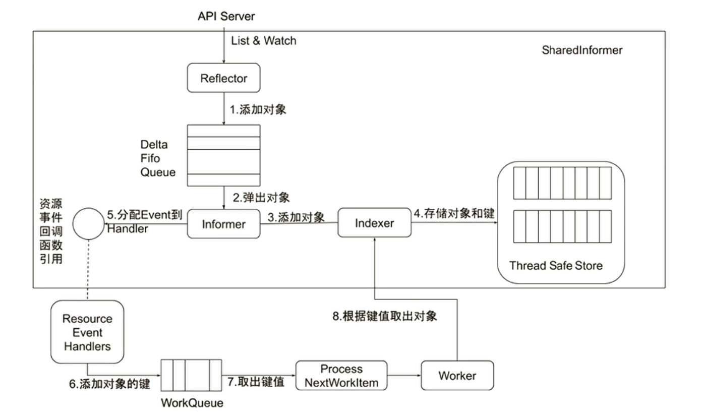
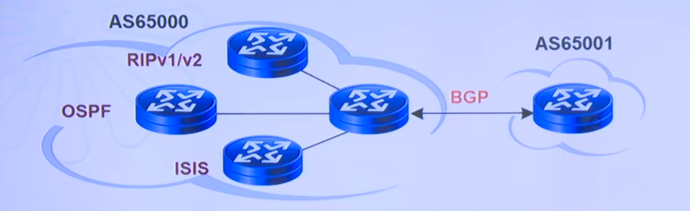
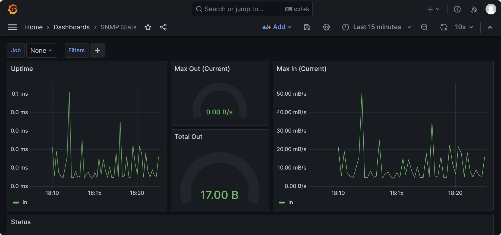
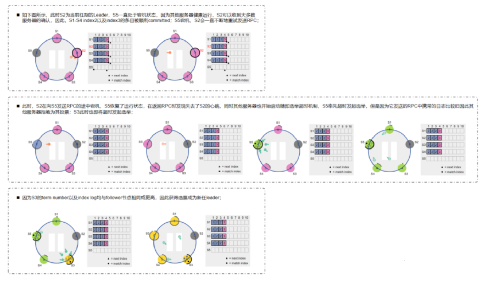
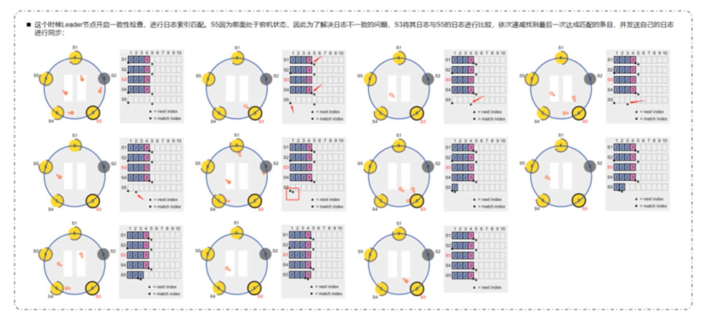
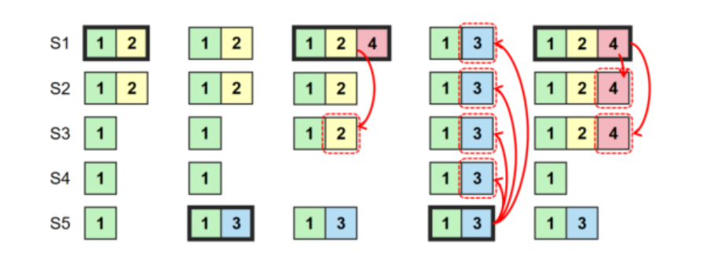

# 知识扩展


## Watch机制


**watch 本质上就是一个基于 HTTPS 的长连接请求**。在这个长连接中，**API Server 会向客户端主动推送资源变更事件**，但要注意的是，**客户端在发起 watch 请求后不会反复发送请求，后续的所有数据都是由 API Server 主动推送的**。


### HTTP/2实现

#### **1. 技术核心：HTTP/2 的特性**

Kubernetes 的 watch 机制依赖于**HTTP/2 协议**的**多路复用和流式数据传输**。和传统的 HTTP/1.1 不同，**HTTP/2 提供了持久的双向数据流**，这是实现“**一次请求，多次响应**”的核心。


##### **HTTP/2 的关键特性**

| **特性**            | **描述**                                   | **在 watch 中的作用**                                  |
| ------------------- | ------------------------------------------ | ------------------------------------------------------ |
| **多路复用**        | 单个 TCP 连接中允许多个流的并行交付        | 允许 kubelet 和 apiserver 通过单连接传输多个请求和响应 |
| **数据流 (Stream)** | 数据以流的形式发送，流 ID 用于标识数据段   | kube-apiserver 不断向 kubelet 发送流数据               |
| **流式响应**        | 不必等待请求完成，可以多次传输分段响应数据 | 在 watch 中，每次 Pod 变化都会立刻推送到客户端         |
| **长连接**          | 连接不关闭，维持客户端与服务端的长连接     | 客户端的 watch 请求一直保持连接，直到中断              |
| **头部压缩**        | HTTP 头的 HPACK 压缩，减少网络流量消耗     | kube-apiserver 的请求和响应的头部变小，减少延迟        |


##### **HTTP/2 是如何实现“请求-多次响应”的？**

1. **多路复用**：
   - 在 HTTP/2 中，客户端与服务端之间只建立一个 TCP 连接，但可以在该连接上同时处理多个 HTTP 请求。
   - watch 请求（`GET /api/v1/pods?watch=true`）**只占用一个 HTTP 流**，即使有其他请求（例如 List Pods）也不会影响 watch 流。
2. **数据流 (Stream)**：
   - HTTP/2 使用“**数据流**”的概念。
   - 当 kube-apiserver 监测到 Pod 变化时，**将变化的事件打包为一条消息**，推送到与客户端的流中。
   - **客户端监听到事件后可以立刻接收并处理，而不需要关闭或重新请求。**
3. **流式响应**：
   - 在 HTTP/1.1 中，响应数据必须等待请求完成后，才能完整返回。
   - 在 HTTP/2 中，服务端可以**一段一段地将数据发送回客户端**，这正是 Kubernetes 中 watch 机制的关键。
   - **每次 Pod 状态变化时，API Server 会将事件推送到客户端，客户端立即收到变化数据。**


#### **2. 在 Kubernetes 中的实现**

##### **Watch 请求**

``` 
GET /api/v1/pods?watch=true&resourceVersion=123456 HTTP/2
Host: kube-apiserver:6443
```

- **GET** 请求，路径是 `/api/v1/pods`，带有参数 `watch=true`。
- `resourceVersion=123456`：这表示客户端希望**从版本 123456 之后的事件开始监听**。
- 这是一个 HTTP/2 请求，它**不关闭连接**，相当于在 TCP 上创建一个**长连接**，并保持数据流。


##### **响应数据**

API Server 检测到 Pod 变化后，会不断地**流式传输**变更事件。

```json
jsonCopy code{
  "type": "ADDED",
  "object": {
    "metadata": {
      "name": "nginx-pod",
      "namespace": "default",
      "resourceVersion": "123457"
    },
    "status": {
      "phase": "Running"
    }
  }
}
{
  "type": "MODIFIED",
  "object": {
    "metadata": {
      "name": "nginx-pod",
      "namespace": "default",
      "resourceVersion": "123458"
    },
    "status": {
      "phase": "Terminating"
    }
  }
}
{
  "type": "DELETED",
  "object": {
    "metadata": {
      "name": "nginx-pod",
      "namespace": "default",
      "resourceVersion": "123459"
    }
  }
}
```

- 这些事件是**分段返回的 JSON 消息**。
- 每条事件都有一个**事件类型 (type)**，可以是 `ADDED`, `MODIFIED`, `DELETED`。
- **流式数据传输**：每个事件都是独立的 JSON 块，kubelet 立刻能读取这些数据，而不需要等待所有数据返回。
- **不关闭连接**：API Server **只会在连接断开时关闭流**，否则会持续发送数据。


#### **3. 这与 WebSocket 的对比**

| **特性**     | **HTTP/2**               | **WebSocket**              |
| ------------ | ------------------------ | -------------------------- |
| **连接类型** | HTTP/2 长连接，流式响应  | TCP 长连接，类似双工通信   |
| **协议层**   | TCP + HTTP/2             | TCP + WebSocket (ws://)    |
| **多路复用** | 支持                     | 不支持（一个请求一个通道） |
| **并发性**   | 高并发，多请求一个 TCP   | 需要多个 TCP 连接          |
| **数据传输** | 以**数据流**传输分段数据 | 以数据包/消息方式传输      |
| **使用场景** | Kubernetes watch、API流  | 聊天室、游戏等双工通信     |
| **网络效率** | 较高，资源利用率高       | 较高，适合双工通信         |


#### **4. 关键的网络协议特性**

| **网络协议/特性** | **HTTP/2** | **描述**                             |
| ----------------- | ---------- | ------------------------------------ |
| **TCP**           | 需要       | HTTP/2 是基于 TCP 传输的（TLS/SSL）  |
| **TLS/SSL**       | 必须       | 传输时使用 TLS 加密，增强数据安全    |
| **多路复用**      | 支持       | 单个 TCP 连接可传输多个 HTTP 请求    |
| **流控制**        | 支持       | 控制每个流的流量，避免某个流占满带宽 |
| **分段传输**      | 支持       | 不必等待所有数据，流式传输响应片段   |
| **头部压缩**      | 支持       | 使用 HPACK 压缩头部，减少带宽        |


#### **5. 关键问题解答**

1. **“一次请求，多次响应” 是怎么实现的？**

- 使用**HTTP/2 中的流式响应**。
- 通过在 HTTP/2 中维持一个**长连接**，服务端 API Server 会不断地将事件推送给客户端。
- 这些事件是一个个**分段的 JSON 数据块**，流式返回给客户端。
- **客户端只需要发起一次请求**，API Server 会主动推送资源的变化数据。


2. **watch 机制与传统的“轮询 (polling)” 有何不同？**

- **传统轮询**：客户端定期发送请求，获取全量资源列表，开销大，延迟高。
- **watch 机制**：客户端只发送一次请求，API Server 持续推送变更，实时性强，资源开销小。


3. **如果连接断开了怎么办？**

- 客户端会检测到断开，并自动重新发起 watch 请求。
- 如何避免丢失数据？
  - 客户端会使用最后的 `resourceVersion` 来恢复。
  - 如果 `resourceVersion` 太旧，API Server 会返回**HTTP 410 Gone**，这时客户端会触发**List + Watch**操作来重新同步数据。


#### **总结**

- **一次请求、多次响应**的关键在于**HTTP/2 的长连接和流式传输**。
- watch 使用的**HTTP/2 协议、流式响应、多路复用和长连接**技术，避免了客户端的重复请求，提升了性能。
- **不需要客户端反复请求**，一条请求，API Server 持续推送。
- **网络协议的支撑**：HTTP/2 流、长连接、TLS 加密和数据分段传输。


### 各组件在HTTP/2的角色

#### **1. 各组件在 HTTP/2 请求中的角色**

| **组件对**                 | **客户端 (Client)** | **服务端 (Server)** | **协议**   | **是否使用长连接** | **长连接的作用**                           |
| -------------------------- | ------------------- | ------------------- | ---------- | ------------------ | ------------------------------------------ |
| **Scheduler - API Server** | **Scheduler**       | **API Server**      | **HTTP/2** | 是                 | Scheduler 向 API Server 申请调度的资源更新 |
| **Kubelet - API Server**   | **Kubelet**         | **API Server**      | **HTTP/2** | 是                 | Kubelet 监听 Pod 变更 (watch)              |
| **API Server - etcd**      | **API Server**      | **etcd**            | **gRPC**   | 是                 | API Server 查询/更新 etcd 数据             |

------

#### **2. 角色解析**

##### **(1) Scheduler - API Server**

- **客户端**：Scheduler 是客户端。

- **服务端**：API Server 是服务端。

- **通信方式**：Scheduler 通过**HTTP/2 长连接**请求 API Server。

- **请求类型**：

  - Scheduler 向 API Server 发送请求，筛选出未绑定的 Pod。

  - 当 Scheduler 决定将 Pod 绑定到某个节点时，它会向 API Server 发送 **Bind API 请求**。

  - 请求示例：

    ```http
    POST /api/v1/namespaces/default/pods/<pod-name>/binding HTTP/2
    ```

- **长连接作用**：

  - 由于 Scheduler 不需要**watch**资源（不像 kubelet 监听 Pod 变更），所以 Scheduler 的长连接更多是为了**提高请求性能**，避免频繁建立和关闭 TCP 连接。
  - 当有多个调度请求时，长连接的**多路复用**特性显著提高了效率。


##### **(2) Kubelet - API Server**

- **客户端**：Kubelet 是客户端。

- **服务端**：API Server 是服务端。

- **通信方式**：**HTTP/2 长连接**，**watch 机制**。

- **请求类型**：

  - kubelet 监听特定的资源（如 Pods）：

    ```http
    GET /api/v1/nodes/<node-name>/pods?watch=true&resourceVersion=<RV> HTTP/2
    ```

  - 通过 watch 机制，Kubelet 可以**实时监听 Pod 的变化**（新增、修改、删除）。

  - watch 机制通过**流式响应**，API Server 在资源变更时，**主动推送变更事件**到 Kubelet。

- **长连接作用**：

  - Kubelet 只发送**一次请求**，API Server 保持长连接，推送资源变更事件。
  - 如果 watch 连接断开，Kubelet 会使用最后的 `resourceVersion` 重新发起 watch 请求。


##### **(3) API Server - etcd**

- **客户端**：API Server 是客户端。

- **服务端**：etcd 是服务端。

- **通信方式**：**gRPC 长连接**（HTTP/2）。

- **请求类型**：

  - 读操作：

    ```go
    etcdClient.Get(ctx, "/registry/pods/default/nginx-pod")
    ```

  - 写操作：

    ```go
    etcdClient.Put(ctx, "/registry/pods/default/nginx-pod", "<pod-data>")
    ```

- **长连接作用**：

  - gRPC 是基于 **HTTP/2** 的远程过程调用（RPC）框架。
  - **API Server 不会在每次请求时重新创建 TCP 连接**，而是维持一个**持久的 HTTP/2 连接**，这显著减少了 etcd 和 API Server 之间的网络开销。
  - **etcd 使用 MVCC（多版本并发控制）** 机制，每个变更都会生成一个**新的 revision**，API Server 使用这个 revision 来进行增量监听。


#### **3. HTTPS 证书的使用**

> **在 Kubernetes 中的 "三套证书" 是指：**

1. **ETCD 组件通信证书**（API Server ↔ ETCD）
2. **Kubernetes 组件之间的通信证书**（API Server、Scheduler、Kubelet、Controller Manager）
3. **外部用户的通信证书**（kubectl、外部 API 请求）


##### **(1) Scheduler - API Server**

- **证书类型**：**Kubernetes 组件内部通信证书**
- 证书说明：
  - Scheduler 需要与 API Server 进行 HTTPS 认证。
  - API Server 公开了**kube-apiserver.crt** 和 **kube-apiserver.key**。
  - Scheduler 使用 **kube-controller-manager.crt** 和 **kube-controller-manager.key** 来与 API Server 通信。
  - 这些证书存储在 **/etc/kubernetes/pki** 目录下。
  - 组件之间的**客户端证书**和**服务器证书**均由 **Kubernetes CA 证书**签名。


##### **(2) Kubelet - API Server**

- **证书类型**：**Kubernetes 组件内部通信证书**
- 证书说明：
  - Kubelet 需要与 API Server 通信以获取 Pod 信息。
  - Kubelet 证书：**kubelet.crt** 和 **kubelet.key**。
  - Kubelet 使用 **client-certificate-data** 和 **client-key-data** 进行客户端身份验证。
  - API Server 端的 **kube-apiserver.crt** 和 **kube-apiserver.key** 用于提供 HTTPS 连接的服务端证书。


##### **(3) API Server - etcd**

- **证书类型**：**ETCD 组件通信证书**

- 证书说明

  ：

  - API Server 作为**客户端**，etcd 作为**服务端**。
  - etcd 证书：**etcd-server.crt** 和 **etcd-server.key**。
  - API Server 作为客户端发起请求时，使用 **etcd-client.crt** 和 **etcd-client.key** 进行双向认证。
  - 这也是三套证书中**专门为 ETCD 组件通信生成的证书**。


##### **总结三套证书的作用**

| **证书类型**      | **通信场景**                    | **证书路径**               | **作用**                                  |
| ----------------- | ------------------------------- | -------------------------- | ----------------------------------------- |
| **ETCD 组件证书** | API Server ↔ etcd               | /etc/kubernetes/pki/etcd/  | etcd 和 API Server 之间的加密通信         |
| **K8s 组件证书**  | kubelet、Scheduler ↔ API Server | /etc/kubernetes/pki/       | Kubelet、Scheduler、API Server 之间的通信 |
| **用户 API 证书** | kubectl ↔ API Server            | /etc/kubernetes/admin.conf | 用户使用 kubectl 访问 API Server          |


#### **4. 关键总结**

1. **谁是客户端，谁是服务端？**
   - **Scheduler ↔ API Server**: Scheduler 是客户端，API Server 是服务端。
   - **Kubelet ↔ API Server**: Kubelet 是客户端，API Server 是服务端。
   - **API Server ↔ etcd**: API Server 是客户端，etcd 是服务端。
2. **长连接**
   - **Scheduler 和 API Server 之间**：HTTP/2 长连接。
   - **Kubelet 和 API Server 之间**：HTTP/2 长连接（watch 机制，推送变化事件）。
   - **API Server 和 etcd 之间**：gRPC（基于 HTTP/2 的长连接）。
3. **三套证书的使用**
   - **ETCD 证书**：API Server ↔ etcd 通信。
   - **Kubernetes 组件证书**：Scheduler、Kubelet、Controller Manager 与 API Server 之间的通信。
   - **用户 API 证书**：外部用户（如 kubectl）与 API Server 之间的通信。


## Controller Manager详解

控制器有很多种，但是里面的逻辑是一样的，都是thinkloop, 每一个Controller都是一个生产者，消费者模型，一边监控API Server的变化，API Server支持watchable,任何事件发生了变化，通过watch机制就会通知，controller manager中的生产者就会观测到这些变化，这些变化发生后，会有将其放入中心队列中，消费者从这里取数据，取出来之后去做配置，所以任何控制器都是生产者消费者模型

- Controller Manager是集群大脑，是确保整个集群动起来的关键；
- 作用是确保Kubernetes遵循声明式系统规范，确保系统的真实状态(Actual State)与用户定义的期望状态（Desired State）一致；
- Controller Manager是多个控制器的组合，每个Controller事实上都是一个Controll loop，负责侦听其管控的对象，当对象发生变更时完成配置；
- Controller配置失败通常会触发自动重试，整个集群会在控制器不断重试的机制下确保最终一致性（Eventual Consistency）


### 控制器工作流程


Informer and lister Overview

- Informer: Informers are responsible for watching Kubernetes resources and reacting to changes(events).They efficiently monitor resouces state by subscribing to API events like `add`,`update`and`Delete`.These events are produced by the Kubernetes API Server whenever relevant objects changed

- Lister: Listers provide cached access to resources. Instead of directly querying the API server, they interact with a local cache that is populated by informers. This makes controllers more efficient by reducing the number of API requests needed to get the current state of objects

Event Handling with Informers

- Event Registration: Informers register event handlers to listen for changes(like add, update,delete)to resources. Whenerver an event occurs (e.g.,a Pod is added or deleted), the informer triggers the corresponding handler

- Key Extraction: The handler processes the event by extracting the key of the affected object, typically composed of its namespace and name. This key uniquely identifies the object in the cluster

Queue and Rate-Limited Queue

- Work Queues: when an event occurs, instead of processing it immediately, the object's key is placed into a rate-limited queue. the rate-limiting aspect helps prevent overwhelming the controllers with too many requests, especially if there are repeated failures. if a failure occurs, the item can be re-enqueued after a delay based on the rate-limiting policy

- Rate Limiting: Rate limiting is crucial for handing failures gracefully. If processing an event fails (e.g., due to a temporary error or unavailability of resources),the object is re-enqueued after a backoff period, allowing the controller to retry the operation without overloading the system.

Worker and Consumer Logic:

- Workers: On the other side of the queue, worker goroutines continuously dequeue and process these events.Each worker pull a key from the queue and reconclies the state of the corresponding object by querying its details using the lister and then performing the required actions to converge the cluster's state towards the desired configuration.
- Reconciliation Loop: The worker performs a reconciliation loop,which consists of checking the current state of the resource,comparing it to the desired state, and taking corrective action if there is a discrepancy.For instance, if a Pod should be running but isn't the controller will take steps to start it.

Error Handling and Retry

- If the processing of an event fails, the key is re-queued with a delay(rate limiting) so that the controller can retry later. This mechanism helps handle transient error without discarding events and ensures that all objects eventually converge to their desired state.

Producer-Consumer Model

- THis entire flow is a classic producer-consumer model:
  - Producers: The informers produce events and enqueue the affected objects'keys.
  - Consumers: Workers act as consumers, dequeueing keys, and processing them until the queue is empty.

- 注意：
  - Informer 监听的是当前状态的变化，通过处理 API Server 推送的事件，确保本地缓存中的数据始终与 Kubernetes 集群中的实际状态保持同步。
  - Lister 提供的是对当前状态的访问，但这个状态是从 informer 的缓存中获取的。它是为了减少频繁的 API 请求，提升访问性能。


### Informer的内部机制




- kubernetes提供了一系列的项目，该项目叫code generator，（Kubernetes 提供了工具，如 code-generator，可以自动为你生成 Go 语言的客户端、informer、lister 和深度拷贝函数。这些工具能大大简化自定义控制器的开发。你只需专注于定义自定义资源的结构体，剩下的代码生成工作交由 code-generator 完成。）这个项目的作用就是你要定义任何Kubernetes对象，定义这些对象时，只需要去定义它的数据结构，这个数据结构一旦创建好，在API Server这边发布，你就可以通过api Server去访问这个数据

- Informer首先会提供一个list&watch机制（informer在启动后会发起一个长连接到API server，通常来讲，会在第一时间list一下，比如一个pod list&watch，它会把当前所有的podlist下来，然后回创建watch连接，那么api server上有哪些pod的变化，就会告诉informer）
  - API Server是一个标准的RESTfulAPI， 它提供了一个string，一个json格式的序列化数据，如果我们的程序要去消费这个序列化的数据，那么就要反序列化，（就是把这个字符串转换为一个个go对象，这里使用反射机制实现，反射机制回去解析api server中的key，每一个对象的定义，它都会有json_tag，通过json tag，我们就会知道，这个json的key,对应go语言中的哪个属性，通过这种反射机制，就把一个序列化的对象，转换为go的struct）
  - 后续有一个Delta buff，一个环状内存结构（任何时候都可以一直往里写），如果我的buffer满了，就会自动覆盖最老的数据的
  - 然后他会做一个通知，让informer来处理这些数据
  - informer会把这些反序列化好的数据，放入thread Safe Store里面，这里有indexer，会有索引，我们在未来要去访问这些Kubernete对象的时候，就不需要去api server去访问了，我们只需要对local store访问，减少对api server的访问，然后同时这个对象的变化会通过event发给event handler，然后将对应的key提取出来放入queue中，由另一边的woker将其取走进行处理


- 任何的控制器都应该使用shareinformer的freemoke，所有的对象只要用了shareinformer的freemoke，所有对象在客户端，比方你要写个控制器，在你控制器端，所有api server对象已经有一份本地的缓存了，由shareinformer保证本地缓存和apiserver中对象的版本一致性，所以当我们写控制器代码的时候，应该避免直接访问api server。读取任何对象都应该去local store去读取（Thread safe store），而不是直接去api server去读。一般来讲，只有更新一个对象的时候才会去apiserver中更新，要去调用api server. 

- 注意上述的local store指的是代码里，内存里的store不是本地的那个cache目录，那个地方只是去拉取一下当前支持的api，它不会存储对象，真实的对象是存在控制器的local store的


### 控制器的协同工作原理


- 创建一个deployment的资源清单，使用kubectl在客户端创建后，发给API Server

```shell
kubectl apply -f myapp-deployment.yaml
```

- API Server对我进行认证（通过读本地配置文件，知道我是谁），然后鉴权，因为我用的是admin的身份去登录的，所以我是有创建deployment的权限的，然后我的deployment又是合法的，所以我得deployment对象被API Server接收，并存入etcd中
- `kube-controller-manager`里面有一个deployment controller，顾名思义，它感兴趣的对象是deployment，它回去根据资源清单的属性，去创建一个replicaset的对象

```shell
# 查看deployment对象
kubectl describe deployment myapp -n learn01
Name:                   myapp
Namespace:              learn01
CreationTimestamp:      Tue, 01 Oct 2024 16:02:31 +0800
Labels:                 app=myapp
Annotations:            deployment.kubernetes.io/revision: 1
Selector:               app=myapp
Replicas:               3 desired | 3 updated | 3 total | 3 available | 0 unavailable
StrategyType:           RollingUpdate
MinReadySeconds:        0
RollingUpdateStrategy:  25% max unavailable, 25% max surge
Pod Template:
  Labels:  app=myapp
  Containers:
   pod-test2:
    Image:         registry.cn-beijing.aliyuncs.com/wangxiaochun/pod-test:v0.1
    Port:          <none>
    Host Port:     <none>
    Environment:   <none>
    Mounts:        <none>
  Volumes:         <none>
  Node-Selectors:  <none>
  Tolerations:     <none>
Conditions:
  Type           Status  Reason
  ----           ------  ------
  Available      True    MinimumReplicasAvailable
  Progressing    True    NewReplicaSetAvailable
OldReplicaSets:  <none>
NewReplicaSet:   myapp-7547f4df6 (3/3 replicas created)
Events:
  Type    Reason             Age    From                   Message
  ----    ------             ----   ----                   -------
  Normal  ScalingReplicaSet  6m31s  deployment-controller  Scaled up replica set myapp-7547f4df6 to 3
```

- `kube-controller-manager`里面又有ReplicaSet Controller，它也在监听API Server，然后它监听到需要创建3个pod，然后当前pod不存在，一次就需要它去创建这3个pod，然后这个pod的对象由replicaset发到API Server

```shell
[root@master201 iventory]#kubectl get replicaset -n learn01
NAME              DESIRED   CURRENT   READY   AGE
myapp-7547f4df6   3         3         3       7m37s
[root@master201 iventory]#kubectl describe replicaset -n learn01
Name:           myapp-7547f4df6
Namespace:      learn01
Selector:       app=myapp,pod-template-hash=7547f4df6
Labels:         app=myapp
                pod-template-hash=7547f4df6
Annotations:    deployment.kubernetes.io/desired-replicas: 3
                deployment.kubernetes.io/max-replicas: 4
                deployment.kubernetes.io/revision: 1
Controlled By:  Deployment/myapp
Replicas:       3 current / 3 desired
Pods Status:    3 Running / 0 Waiting / 0 Succeeded / 0 Failed
Pod Template:
  Labels:  app=myapp
           pod-template-hash=7547f4df6
  Containers:
   pod-test2:
    Image:         registry.cn-beijing.aliyuncs.com/wangxiaochun/pod-test:v0.1
    Port:          <none>
    Host Port:     <none>
    Environment:   <none>
    Mounts:        <none>
  Volumes:         <none>
  Node-Selectors:  <none>
  Tolerations:     <none>
Events:
  Type    Reason            Age   From                   Message
  ----    ------            ----  ----                   -------
  Normal  SuccessfulCreate  8m5s  replicaset-controller  Created pod: myapp-7547f4df6-fr2hh
  Normal  SuccessfulCreate  8m5s  replicaset-controller  Created pod: myapp-7547f4df6-nkgnd
  Normal  SuccessfulCreate  8m5s  replicaset-controller  Created pod: myapp-7547f4df6-s74wv
```

- API Server将该POd对象固化下来，存入etcd
- Pod对象被创建下来后，在初始状态下，pod内的nodename属性是没有被写值的

```shell
kubectl get pod myapp-7547f4df6-fr2hh -n learn01 -o yaml|grep -i nodename
nodeName: node205.feng.org
```

- 这个时候由于nodename是空，此时调度器Scheduler就会去做调度，调度器在API Server上watch了没有调度过的(nodename为空)pod对象，以及当前节点的所有节点，然后根据调度策略，判断当前那个节点最适合这个pod，然后将这个节点和pod做绑定，并将结果写入API Server

- 写回到API Server后，节点上的kubelet会关注当前API Server中，跟我的节点相关的pod有哪些，该节点发生了一个pod绑定后，会被kubelet发现，就会去本地查当前运行的pod有没有这个pod，如果没有，就会进入create pod的流程，起pod，如果pod没有外挂存储，就会使用runtime拉起pod，并调用网络插件为pod setup网络，如果需要外挂存储，就需要使用csi，为这个pod挂载磁盘


- 如果我删除一个pod，此时依然会产生一个事件event，这个事件是pod delete事件，该事件被replicaset controller监听到，它的职责是里面的所有pod的数量也用户的期望的数量应该是一样的，我删除了一个，此时实际pod数量和期望数量不等，就会被replicaset监测到，此时为了确保一致，他就会去创建一个新的pod


## SRV记录详解

SRV（**Service Locator Record**）是 DNS 中的一种记录类型，用于**指定某个服务的主机名（hostname）和端口号（port number）**，以便客户端可以通过它找到指定服务的实例。它的**主要作用是支持基于服务的发现**，特别是在分布式系统中非常有用。


### SRV 记录的结构

SRV 记录的结构由以下几个部分组成：

```kotlin
_service._protocol.name TTL class SRV priority weight port target
```

| **字段**    | **含义**                                                     |
| ----------- | ------------------------------------------------------------ |
| `_service`  | 服务名称，以 `_` 开头。例如，`_http` 表示 HTTP 服务。        |
| `_protocol` | 使用的协议，例如 `_tcp` 表示 TCP 协议，`_udp` 表示 UDP 协议。 |
| `name`      | 服务的域名，表示此服务所属的域。例如，`service-test.default.svc.cluster.local`。 |
| `TTL`       | 记录的生存时间（Time To Live），以秒为单位，表示该记录在 DNS 缓存中的有效期。 |
| `class`     | 通常为 `IN`，表示 Internet 类别的记录。                      |
| `SRV`       | 表示该记录是 SRV 类型。                                      |
| `priority`  | 优先级，数值越小优先级越高，客户端应优先使用优先级较高的目标服务器。 |
| `weight`    | 权重，用于在同一优先级下的负载均衡。权重越高，该服务器被选中的概率越高。 |
| `port`      | 服务运行的端口号。例如，HTTP 通常是 `80`，HTTPS 是 `443`。   |
| `target`    | 服务对应的主机名（域名），指向提供此服务的主机（可以是 Service 的名称或 Pod 的 IP）。 |


### **SRV 记录的示例**

假设 Kubernetes 中有一个名为 `service-test` 的 **Service**，位于 `default` 命名空间，域名后缀为 `cluster.local`，其 IP 为 `10.97.72.1`，并提供 TCP 协议的 HTTP 服务，监听端口 `80`。对应的 SRV 记录如下：

```kotlin
_http._tcp.service-test.default.svc.cluster.local. 30 IN SRV 0 100 80 service-test.default.svc.cluster.local.
```


### SRV记录的作用和用途

**服务发现：**

- SRV 记录可以让客户端动态发现服务的主机名和端口，而无需硬编码。
- 在 Kubernetes 中，Service 的 SRV 记录用于客户端通过 DNS 查询找到相应的服务实例。

**负载均衡：**

- SRV 记录支持通过 **priority** 和 **weight** 字段实现简单的负载均衡。
- 同一优先级的服务实例按照权重分配流量，优先级较高的服务会被优先选择。

**动态分布式系统：**

- 在微服务架构或分布式系统中，服务的实例可能动态扩缩容。SRV 记录允许客户端根据 DNS 动态获取服务的最新信息。

**灵活性：**

- SRV 记录可以为服务定义多个实例，每个实例的优先级和权重可以灵活调整，从而实现更复杂的负载分配策略。


## K8S中安全机制的证书体系


### Kubelet 和 apiServer之间通信

Kubernetes 中 **kubelet 和 API Server 之间的通信**确实很好地体现了 Kubernetes **双向 TLS（mTLS，Mutual TLS）**的加密机制。这种机制通过双向验证确保了通信的安全性和身份的可信性。


#### Kubernetes 双向 TLS 通信的工作机制

**双向 TLS 加密：**

- 双向 TLS 意味着：
  - **客户端（kubelet）验证服务端（API Server）的身份**。
  - **服务端（API Server）验证客户端（kubelet）的身份**。
- 这种双向认证确保了双方都是可信任的，并防止了中间人攻击（MitM）。


**涉及的证书：**

- **kubelet 的客户端证书** 

  ```bash
  [root@node1 pki]# ls /var/lib/kubelet/pki/kubelet-client-current.pem
  
  [root@node1 pki]# openssl x509 -in /var/lib/kubelet/pki/kubelet-client-current.pem -text -noout
  Certificate:
      Data:
          Version: 3 (0x2)
          Serial Number:
              f4:4c:9d:a8:f2:82:e8:fd:07:5a:3b:64:57:45:ed:cc
          Signature Algorithm: sha256WithRSAEncryption
          Issuer: CN = kubernetes            # 上级CA
          Validity
              Not Before: Jan  4 01:40:29 2025 GMT
              Not After : Jan  4 01:40:29 2026 GMT
          Subject: O = system:nodes, CN = system:node:node1
          Subject Public Key Info:
              Public Key Algorithm: id-ecPublicKey
              ......
  ```

  - kubelet 用于向 API Server 证明自己的身份。

- **API Server 的服务端证书**

  ```bash
  /etc/kubernetes/pki/apiserver.crt
  
  [root@master1 pki]#openssl x509 -in /etc/kubernetes/pki/apiserver.crt -text -noout
  Certificate:
      Data:
          Version: 3 (0x2)
          Serial Number: 8495257128868470889 (0x75e5375951cf6069)
          Signature Algorithm: sha256WithRSAEncryption
          Issuer: CN = kubernetes            # 上级CA
          Validity
              Not Before: Jan  4 01:39:06 2025 GMT
              Not After : Jan  4 01:44:06 2026 GMT
          Subject: CN = kube-apiserver
          Subject Public Key Info:
          ......
  ```

  - API Server 用于向 kubelet 证明自己的身份。

- **CA 证书**

  ```bash
  /etc/kubernetes/pki/ca.crt
  
  [root@node1 pki]# openssl x509 -in ca.crt -text -noout
  Certificate:
      Data:
          Version: 3 (0x2)
          Serial Number: 1575855922115436521 (0x15de909ca6e2dfe9)
          Signature Algorithm: sha256WithRSAEncryption
          Issuer: CN = kubernetes            # 上级CA
          Validity
              Not Before: Jan  4 01:39:06 2025 GMT
              Not After : Jan  2 01:44:06 2035 GMT
          Subject: CN = kubernetes          # 上级CA一致，因此是自签证书
          Subject Public Key Info:
          ......
  ```

  - kubelet 和 API Server 都通过该 CA 证书验证对方的证书是否合法。


**通信过程：**

- kubelet 连接到 API Server：
  1. kubelet 发起 HTTPS 请求，并发送自己的客户端证书和私钥。
  2. API Server 验证 kubelet 的客户端证书是否由可信 CA 签发。
  3. 验证通过后，API Server 确认 kubelet 是一个可信的客户端。

- API Server 返回响应：
  1. API Server 返回自己的服务端证书。
  2. kubelet 使用本地的 CA 证书验证 API Server 的服务端证书。
  3. 验证通过后，kubelet 确认 API Server 是可信的服务端。

- 最终，双向 TLS 验证完成，通信建立。


### Kubectl 和 apiServer之间通信

`Kubectl` 是 Kubernetes 的命令行工具，用于与集群的 API Server 通信。它是用户和 Kubernetes 集群之间的桥梁，所有对集群的操作都是通过 `kubectl` 发出的请求实现的。以下是 `kubectl` 和 API Server 之间通信的详细讲解：


#### 通信的基础概念

**kubectl 的工作原理：**

- `kubectl` 通过 **REST API** 与 API Server 通信。
- `kubectl` 使用配置文件（通常是 **`~/.kube/config`**）来确定需要连接的 API Server 的地址、认证信息、命名空间等。


**API Server 的职责**

- API Server 是 Kubernetes 控制平面的核心组件。
- 它接收 `kubectl` 发出的 REST 请求，验证、授权请求，并将其路由到相应的控制器或 etcd 存储。


**使用的协议**

- `kubectl` 和 API Server 的通信使用 **HTTPS** 协议。
- 通信通过 **双向 TLS（mTLS）** 认证进行加密和身份验证。


#### 通信过程详解

**加载配置文件**

- `kubectl` 在运行时，会读取默认的 `~/.kube/config` 文件，加载以下信息：
  - **API Server 的地址：** 如 `https://<api-server-ip>:6443`。
  - **认证信息：** 包括客户端证书、密钥、或 Bearer Token。
  - **命名空间：** 如果未指定，默认是 `default`。
  - **上下文：** 用于选择当前集群的配置。


**认证与授权**

- **认证：**
  - `kubectl` 提供客户端证书或 Token 给 API Server。
  - API Server 使用 CA 证书（如 `/etc/kubernetes/pki/ca.crt`）验证客户端证书的合法性
  - 若验证成功，API Server 识别用户身份
- **授权**
  - API Server 根据用户身份和RBAC（Role-Based Access Control）策略，检查用户是否有权限执行该操作。

- **请求的具体处理**
  - 请求可以是 `kubectl get pods`、`kubectl apply -f deployment.yaml` 等。
  - API Server 处理流程：
    - **解析请求：** 根据请求路径和方法（如 GET、POST、DELETE）判断操作目标和类型。
    - **验证请求：** 检查请求体格式是否正确。
    - **路由请求：** 将请求转发给对应的控制器或组件（如 Scheduler、Controller Manager）。
    - **返回响应：** 返回操作结果或数据（如 Pod 列表）。
- **传输安全性**
  - 通信使用 **TLS 加密**，防止数据被窃听或篡改。
  - 双向 TLS 确保：
    - **API Server 的身份：** `kubectl` 使用 CA 证书验证 API Server 的服务端证书。
    - **kubectl 的身份：** API Server 使用 CA 验证 `kubectl` 的客户端证书。


#### 双向 TLS 实现细节

**kubectl 客户端证书：**

- 通常存储在 `~/.kube/config` 文件中，指向以下字段：
  - `client-certificate`：客户端证书路径。
  - `client-key`：客户端私钥路径。
  - `certificate-authority`：CA 证书路径，用于验证 API Server 的服务端证书。


**API Server 服务端证书：**

- 存储在 `/etc/kubernetes/pki/apiserver.crt`。
- 配置在 API Server 的启动参数中，用于对外提供 HTTPS 服务。


**交互过程**

- `kubectl` 使用自己的客户端证书与 API Server 握手，证明身份。
- API Server 使用服务端证书提供 HTTPS 服务，`kubectl` 验证其身份


#### 通信示例

**kubectl 命令：**

```bash
kubectl get pods
```

**完整通信流程：**

- **kubectl 发起请求：**
  - 请求地址：从配置文件中读取，如 `https://<api-server-ip>:6443/api/v1/pods`。
  - 请求方法：`GET`。
  - 附带认证信息（客户端证书或 Token）。
- **API Server 验证身份：**
  - 验证 `kubectl` 提供的客户端证书是否由可信 CA 签发。
  - 根据 RBAC 权限检查用户是否有 `list pods` 的权限。

- **API Server 执行操作：**
  - 查询 etcd 数据库中的 Pod 信息。
  - 格式化查询结果为 JSON。
- **API Server 返回结果：**
  - 将 JSON 数据通过 HTTPS 返回给 `kubectl`。
  - `kubectl` 格式化并在终端显示结果。


#### 配置文件示例

**`~/.kube/config` 文件：**

```yaml
apiVersion: v1
kind: Config
clusters:
- cluster:
    certificate-authority: /etc/kubernetes/pki/ca.crt # CA 证书路径，用于验证 API Server 的服务端证书。
    server: https://<api-server-ip>:6443
  name: kubernetes
users:
- name: admin
  user:
    client-certificate: /etc/kubernetes/pki/admin.crt   # 客户端证书路径
    client-key: /etc/kubernetes/pki/admin.key
contexts:
- context:
    cluster: kubernetes
    user: admin
  name: admin@kubernetes
current-context: admin@kubernetes

```


## 实际生产中的服务版本


| 中间件        | 版本       | 是否依赖其他中间件 | 依赖中间件  | 是否支持容器化 | 是否支持Ubuntu |
| ------------- | ---------- | ------------------ | ----------- | -------------- | -------------- |
| rabbitmq      | 3.7.27     | 否                 |             | 是             | 是             |
| redis         | 5.0.14     | 否                 |             | 是             | 是             |
| nacos         | 1.4.2      | 是                 | mysql.nginx | 是             | 是             |
| tomcat        | 8.5.65     | 否                 |             | 是             | 是             |
| kafka         | 2.13_2.6.0 | 是                 | zookeeper   | 是             | 是             |
| zookeeper     | 3.8.0      | 否                 |             | 是             | 是             |
| elasticsearch | 7.10.2     | 否                 |             | 是             | 是             |
| tengine       | 2.3.3      | 否                 |             | 是             | 是             |


| 软件名称   | 软件版本        | 使用类型  | 备注         |
| ---------- | --------------- | --------- | ------------ |
| JDK/JRE    | 1.8             | 平台      | Java         |
| CEPH       | 13.2.10         | 平台/业务 | 分布式存储   |
| DOCKER     | 20.10.7         | 平台      | 镜像容器     |
| K8S        | 1.18.19         | 平台      | 容器编排     |
| KUBESPHERE | 3.1.0           | 平台      | 可视化容器   |
| HARBOR     | 2.2.0-ecobal116 | 平台      | 镜像仓库     |
| ZOOKEEPER  | 3.4.5           | 平台      | 分布式服务   |
| KAFKA      | 2.2.2           | 业务      | 队列         |
| REDIS      | 6.2.4           | 业务      | 缓存库       |
| ORACLE     | 12C及以上       | 业务      | 数据库       |
| NACOS      | 2.0.3           | 平台      | 服务配置     |
| SFTP       | /               | 业务      | 文件         |
| NGINX      | 1.18.0          | 业务      | 服务代理     |
| XX_JOB     | /               | 业务      | 任务调度平台 |


## BGP协议

### BGP概述

#### BGP简介

动态路由协议可以按照工作范围分为 **IGP (Internal Gateway Protocol)** 以及 **EGP (External Gateway Protocol)**。IGP 工作在同一个AS内，主要用来发现和计算路由，为AS内提供路由信息的交换；而 EGP工作在 AS 与 AS 之间，在 AS 间提供无环路的路由信息交换，**BGP 则是 EGP 的一种**


#### 自治系统



自治系统（AS）：由同一个技术管理机构管理，使用统一选路策略的一些路由器的集合

自治系统内部的路由协议：IGP（静态路由，OSPF，ISIS，RIP...）

自治系统之间的路由协议：EGP（BGP）


#### IGP 与 EGP

**IGP**

- 运行于AS内部的路由协议，主要有RIP，OSPF， ISIS等
- IGP着重于**快速**发现和计算路由

**EGP**

- 运行于AS之间的路由协议，现通常指BGP
- BGP着重于**控制路由的传播 **和 **选择最优的路由**（BGP的最佳路径并不以带宽为最佳，也不以跳数为最佳，算法复杂）

```ABAP
GBP发展路径：EGP -> BGP/v1 -> BGP/v4
```


#### BGP特征

- BGP是外部路由协议（**用来承载大容量的路由条目**，数以数十万计的路由毫无问题），用来在AS之间传递路由信息
- 是一种增强的距离矢量路由协议
  - 可靠的路由更新机制
  - 丰富的Metric量度方法
  - 从设计上避免了环路的发生
- 为路由附带属性信息
- 支持CIDR（无类别域间选路）
- 丰富的路由过滤和路由策略


#### AS号

AS号范围是1~65535，其中

- 1 ~ 64512 是公有AS号（已分配完，无剩余），需要运营商提供
- 64513 ~65535是私有AS号，大家都能用，类似于192.168...的内网Ip


### BGP可靠的路由更新

- 传输协议：TCP，端口号179（BGP协议的可靠，体现在使用TCP），BGP是基于TCP的协议
  - BGP需要先有IGP保证端到端的可达性，在IGP的基础上，才能实现大容量路由的传递
  - 即只需要保证两个AS之间的边界路由间的可达性即可（通常用静态路由保证），AS内的路由无需保证
  - BGP想通，IGP先通
- 无需周期性更新
- 路由更新：只发送增量路由，即只做增量更新
- 周期性发送Keepalived报文（很小，不到1K）检测TCP的连通性
  - 每60s，发送一个Keepalived报文


#### BGP报文种类

BGP报文有五种类型：

- **Open**：负责和对等体建立邻居关系
- **Keepalive**：该消息在对等体之间周期性地发送，用以维护连接
- **Update**：该消息被用来在BGP对等体之间传递路由信息
- **Notification**：当BGP Speaker检测到错误的时候，就发送该消息给对等体
- **Route-refresh**：用来通知对等体自己支持路由刷新能力


##### **BGP报文**


##### **Open报文**

 

- Version(1B)
  - 现在基本都是BGP/v4，因此Version这里通常是4
- My Autonomous System（2B）
  - 我自己的AS号
- Hold Time (保存时间)（2B）
- BGP Identifier（4B）
- Opt Param Len（1B）
  - 可选参数
- Optional Parameters（variable）
  - 这里会携带一些额外的能力的协商


##### **Keepalive 报文**


keepalive报文非常小，我发送一个Keepalive报文，然后收到一个ack报文确认即可，只要报头就够了


##### **Update 报文**


update报文是最大的，因为每一个报文要装在一个update里面

- Withdrawn Routes Length（2B）
  - 路由长度
- Withdrawn Routes（可变长度）
  - 路由条目
- Path Attribute Length（2B）
  - 各种路径属性的长度
- Path Attribute（可变长度）
  - 各种路径属性
- Network Layer Reachability Information（可变长度）
  - 路由的最终形态（地址）


##### Notification 报文


谁发现的错误，谁去发送Notification报文


##### Route-refresh报文


#### BGP协议中消息的应用

- 通过TCP建立BGP连接时，发送OPEN消息（TCP连接先建立好，然后发送OPEN报文）
- 连接建立后，如果有路由需要发送或路由变化时，发送UPDATE消息通告对端
- 稳定后定时发送KEEPALIVE消息以保持BGP连接的有效性
- 当本地BGP在运行中发现错误时，要发送Notification消息通告BGP对等体
- ROUTE-REFRESH消息用来通知对等体自己支持路由刷新


### BGP路由信息处理

#### BGP状态机


- BGP一旦在一个设备上启动，首先进入**Idle状态**，即空闲状态
- 开始尝试建立，进入**Connect状态**（尝试建立TCP连接）
- 如果连接状态失败，进入 **Active状态**（等待再次连接）
- 直到TCP连接状态建立，进入**Open-Sent状态**
- **上述 Idle 状态，Connect 状态和 Active 状态都是在做 TCP，从 Open-sent 开始才是在做BGP**
- Open消息报文发出，然后接收到返回的正确的Open报文后，进入**Open-confirm状态**
- 在进入Open-confirm状态后，又接受到Keepalive报文，说明这个邻居一直没有断，因此进入**ESTABLISH状态**
- ESTABLISH状态说明BGP建立完成，并不断地周期性发送Keepalive报文
- 在后期任何一个BGP的状态中，一但收到Notification报文，即错误通告，则直接断掉TCP连接，进入Idle状态


#### BGP的数据库

在邻居建立完后，BGP要维护自己的数据库，BGP的数据库有

- **IP路由表（IP-RIB）**
  - 全局路由信息库，包括所有IP路由信息
- **BGP路由表（Loc-RIB）**
  - BGP路由信息库，包括本地BGP Speaker选择的路由信息
  - 这里包含所有路径信息，不止是最佳路径，而最佳路径信息可能会记录到IP路由表中
  - 非常大
- **邻居表**
  - 对等体邻居清单列表
- **Adj-RIB-In**
  - 对等体宣告给本地Speaker的未处理的路由信息库
  - 通常是我从邻居那里收到的未处理的表项，这里的表项是处理给BGP，处理后，会将处理后的表项删掉
- **Adj-RIB-Out**
  - 本地Speaker宣告给指定对等体的路由信息库
  - 即我要把那些路由发送给别人


#### BGP路由信息处理


```ABAP
BGP的对等体 == BGP的邻居，是一个概念
BGP Speaker 指的是运行了BGP的网络设备
```

- 从邻居那里收到的路由信息，首先放到 `Adj-RIB-IN` 中
- 然后通过输入策略引擎，将需要的路由信息放入`Loc-RIB，即BGP表`中
- 处理完的信息，在 `Adj-RIB-IN` 中清除
- `BGP表中` 选出最优路径，然后放入 `IP-RIB，即IP表中` 供我的路由器进行使用
- 同时将选出的最优路径，通过输出策略引擎发给别人，发给别人的表为`Adj-RIB-Out`，发出的一定是最优的路由
- BGP 只宣告最优路径


### BGP的工作原理

#### BGP邻居关系

BGP是基于TCP连接的邻居关系，而TCP又是基于IP可达性实现的，因此

- BGP邻居关系建立在TPC连接的基础之上
- 可以通过IGP或静态路由来提供TCP连接的IP可达性


**BGP两种邻居关系 — IBGP 和 EBGP**


如果两个邻居，或者两个设备都在同一个AS，那么就叫做**IBGP**

如果两个设别在不同的AS，那么就叫做**EBGP**邻居关系

```ABAP
问题：为什么在同一个AS内，要建立IBGP邻居关系
```

- IBGP的第一个作用：传递大容量的路由信息
- IBGP的第二个作用：当需要跨越多个AS传递路由信息时，IBGP可以将BGP协议的属性传递过去，也可以更高的防止环路，属性的丢失对环路的生成影响很大。
- IGP为IBGP提供TCP/IP的可达性


#### BGP通告原则

#### BGP路由通告


## Git 相关用法补充

### 绕过 Git 的 SSL 证书验证方法


#### 临时禁用 SSL 验证（仅当前命令）

```bash
# 这个方法 仅对当前命令生效，不会影响其他 Git 操作
GIT_SSL_NO_VERIFY=true git clone http://gitlab.mygitlab.mystical.org/devops/meta.git
```


#### 全局禁用 Git SSL 证书验证

```bash
# 这会对 所有 Git 操作 关闭 SSL 验证，但并不推荐，因为可能会让你对 MITM（中间人攻击）更脆弱
git config --global http.sslVerify false
```


#### 仅对特定 GitLab 域名禁用 SSL 验证

```bash
# 只想对 gitlab.mygitlab.mystical.org 禁用 SSL 验证
git config --global http."http://gitlab.mygitlab.mystical.org".sslVerify false
```


#### 为 GitLab 添加自签证书

如果你的 GitLab 使用了自签名证书，推荐把它的 CA 证书添加到系统或 Git 的 CA 证书列表，而不是禁用 SSL 验证

**获取 GitLab 证书**

```bash
openssl s_client -showcerts -connect gitlab.mygitlab.mystical.org:443 < /dev/null | openssl x509 -outform PEM > gitlab-cert.pem
```

**把证书加入 Git 信任**

```bash
git config --global http.sslCAInfo ~/gitlab-cert.pem
```


### 解决 GitHub 上传大文件问题

GItHub 不允许单个文件超过 100MB

#### 方法：使用 Git LFS (推荐)

GitHub 提供了 **Git LFS（Large File Storage）**，专门用于管理超过 100MB 的大文件。

**1️⃣ 安装 Git LFS**

如果你尚未安装 Git LFS，可以运行

```bash
git lfs install
```

**2️⃣ 让 Git 追踪大文件**

```bash
git lfs track "*.pdf"
```

**3️⃣ 重新添加并提交**

```bash
git add .gitattributes
git add "AI/NVIDIA GPU 概论.pdf"
git commit -m "Track large PDF file with Git LFS"
git push origin master
```

这样 GitHub 就不会因为文件大小拒绝你的 push 了。


## Kubernetes GPU 集群部署

### **最小部署方案**

| 角色                      | 机器数量 | 规格建议                                       | 说明                                |
| ------------------------- | -------- | ---------------------------------------------- | ----------------------------------- |
| **Master 节点（控制面）** | 1 台     | `ecs.c6.large`（2 vCPU 4 GiB RAM）             | 运行 K8s 控制面，不需要 GPU         |
| **GPU Worker 节点**       | 2 台     | `ecs.sgn7i-vws-m2s.xlarge`（4 vCPU 8 GiB RAM） | 运行 AI 计算任务，支持 K8s GPU 调度 |

------


### **更推荐的生产模拟方案**

如果你想要 **更接近生产环境**，建议：

- 选择 **独占型 GPU 实例**，如 `ecs.gn6e-c12g1.2xlarge`（Tesla T4 GPU）
- 增加 **多 GPU Worker 节点**，模拟实际 K8s GPU 负载均衡调度
- 使用 **阿里云 ACK（托管 K8s）**，简化管理


## GitLab CPU和内存使用率很高，如何解决

### 快速诊断 GitLab 资源占用


**主要检查4个组件**

- **WebServer: Puma**
- **Sidekiq**
- **PostgreSQL**
- **Redis**


先通过以下命令 **检查 CPU 和内存占用情况**：

#### **1️⃣ 检查 GitLab 主要进程**

```bash
ps aux --sort=-%mem | grep gitlab
```

- **查找 CPU 和内存占用最高的进程**（如 `puma`, `postgres`, `sidekiq`）。
- 确保 GitLab 没有僵尸进程。

#### **2️⃣ 监控 GitLab 进程负载**

```bash
top -o %CPU
```

- **查看 CPU 密集的进程**（特别是 `puma`, `sidekiq`）。
- **观察 PostgreSQL 负载**（GitLab 内置数据库，容易导致高负载）。

#### **3️⃣ 监控 Sidekiq 队列任务（是否任务堆积？）**

```bash
gitlab-rake gitlab:sidekiq:queue
```

- 如果 Sidekiq 任务积压（队列过长），可能导致 GitLab 变慢。

#### **4️⃣ 检查 PostgreSQL 数据库查询（哪些 SQL 负载高？）**

```bash
gitlab-psql -d gitlabhq_production -c "SELECT pid, age(clock_timestamp(), query_start), usename, query FROM pg_stat_activity WHERE state = 'active' ORDER BY query_start;"
```

- 找到执行时间过长的 SQL 查询，可能影响 GitLab 性能。


### GitLab 资源优化方案

#### 方案 1：优化 Puma（Web 服务器）

GitLab 默认使用 `puma` 作为 Web 服务器，它可能占用大量 CPU 资源。

**✅ 降低 Puma 进程数**

编辑 `/etc/gitlab/gitlab.rb`：

```bash
puma['worker_processes'] = 2   # 默认 2，适当减少
puma['worker_timeout'] = 30    # 默认 60s，可减少
```

然后 **应用配置**：

```bash
gitlab-ctl reconfigure
gitlab-ctl restart puma
```

------

#### **方案 2：优化 Sidekiq（后台任务队列）**

**Sidekiq** 负责 GitLab 的异步任务（如 CI/CD 任务、邮件通知等），容易导致高 CPU/内存占用。

**✅ 降低 Sidekiq 进程数**

编辑 `/etc/gitlab/gitlab.rb`：

```bash
sidekiq['concurrency'] = 10  # 默认 25，可减少
```

然后 **应用配置**：

```
bashCopyEditgitlab-ctl reconfigure
gitlab-ctl restart sidekiq
```

**✅ 清理积压任务**

如果 Sidekiq 队列过长：

```bash
gitlab-rake gitlab:sidekiq:queue:clear
```

------

#### **方案 3：优化 PostgreSQL（数据库性能）**

GitLab 的 PostgreSQL 默认配置适用于小型环境，**大规模 GitLab 需要优化数据库参数**。

**✅ 调整 PostgreSQL 连接数**

编辑 `/var/opt/gitlab/postgresql/data/postgresql.conf`：

```bash
max_connections = 100        # 默认 200，减少数据库压力
shared_buffers = 2GB         # 调整为总内存的 25%
work_mem = 64MB              # 限制每个查询使用的内存
maintenance_work_mem = 512MB # 限制 VACUUM 操作的内存
```

然后 **重启数据库**：

```bash
gitlab-ctl restart postgresql
```

------

#### **方案 4：优化 GitLab 日志**

**✅ 清理 GitLab 日志**

```bash
gitlab-rake gitlab:cleanup:logs
```

**✅ 关闭 Debug 日志**

编辑 `/etc/gitlab/gitlab.rb`：

```bash
gitlab_rails['log_level'] = "info"  # 默认 "debug"，减少日志量
```

然后 **应用配置**：

```bash
gitlab-ctl reconfigure
gitlab-ctl restart
```

------

#### **方案 5：优化 GitLab 缓存**

GitLab 默认使用 **Redis 作为缓存**，但默认 Redis 可能占用过多内存。

**✅ 限制 Redis 内存**

编辑 `/etc/gitlab/gitlab.rb`：

```bash
redis['maxmemory'] = "512MB"
redis['maxmemory_policy'] = "allkeys-lru"
```

然后 **应用配置**：

```bash
gitlab-ctl reconfigure
gitlab-ctl restart redis
```

------

#### **方案 6：关闭不必要的 GitLab 组件**

GitLab 有一些 **默认启用但可能不需要的组件**，可以禁用它们来节省资源。

**✅ 禁用不使用的功能**

编辑 `/etc/gitlab/gitlab.rb`：

```bash
gitlab_rails['gitlab_default_projects_features_issues'] = false
gitlab_rails['gitlab_default_projects_features_wiki'] = false
gitlab_rails['gitlab_default_projects_features_snippets'] = false
```

然后 **应用配置**：

```bash
gitlab-ctl reconfigure
gitlab-ctl restart
```

------


### **进阶方案**（推荐）

#### **方案 7：使用外部数据库**

如果 GitLab **PostgreSQL 压力过大**，可以使用 **独立数据库服务器**（如 AWS RDS 或独立物理机）。

```bash
gitlab_rails['db_adapter'] = 'postgresql'
gitlab_rails['db_host'] = 'db.example.com'
gitlab_rails['db_port'] = 5432
gitlab_rails['db_username'] = 'gitlab'
gitlab_rails['db_password'] = 'yourpassword'
```

------

#### **方案 8：使用外部对象存储**

GitLab 默认使用本地存储来管理 **LFS（大文件存储）、CI/CD 产物**，可改为 S3 兼容对象存储：

```
bashCopyEditgitlab_rails['object_store']['enabled'] = true
gitlab_rails['object_store']['connection'] = {
  'provider' => 'AWS',
  'region' => 'us-east-1',
  'aws_access_key_id' => 'your-access-key',
  'aws_secret_access_key' => 'your-secret-key',
  'endpoint' => 'https://s3.example.com'
}
```

------

### **监控 GitLab**

优化后，可以通过以下方式 **监控 GitLab 资源使用情况**：

**✅ 1. GitLab 自带监控**

```bash
gitlab-ctl prometheus
```

然后访问 `http://gitlab-server:9090` 查看监控指标。

**✅ 2. 通过 `systemd` 监控服务状态**

```
systemctl status gitlab-runsvdir
```

**✅ 3. 通过 `htop` 监控**

```bash
htop
```

------

### **总结**

| **优化方向**          | **方法**                                    |
| --------------------- | ------------------------------------------- |
| **降低 CPU/内存占用** | **减少 Puma 进程**、优化 Sidekiq 并清理任务 |
| **优化数据库**        | **调整 PostgreSQL 连接数、分离数据库**      |
| **优化缓存**          | **减少 Redis 内存占用**                     |
| **清理日志**          | **关闭 Debug 日志、定期清理**               |
| **使用外部存储**      | **独立 PostgreSQL、对象存储（S3）**         |
| **监控 GitLab 资源**  | **Prometheus + htop + systemctl**           |

💡 **如果 GitLab 运行规模较大，建议使用** **外部 PostgreSQL + 对象存储（S3）+ 独立 Redis** 来优化性能。🚀
你当前 GitLab 的 **CPU 主要占用在哪个进程上？（Puma, Sidekiq, PostgreSQL）** 我可以提供更具体的优化建议！💪


## 存放业务的数据库是否能放在K8S上

具体是否把数据库部署在 Kubernetes（K8s）上，取决于 **业务需求、性能要求、存储架构**。在生产环境中，**数据库的高性能和稳定性是核心关注点**，而 K8s 的存储虚拟化确实可能导致 **性能损耗**。但 Kubernetes 也有成熟的方案来优化数据库部署


### 数据库可以放在 K8s 上吗？

✅ **可以，但有前提**：

- **对性能要求不高** 的小型业务数据库可以运行在 K8s（如轻量级 MySQL、PostgreSQL）。
- **适用于云原生数据库（如 Vitess, TiDB, CockroachDB）**，这些数据库天生支持 Kubernetes 运行。
- **适用于高可用场景（如 Operator 管理的 MySQL、PostgreSQL 集群）**。

🚨 **但要慎重考虑以下情况**：

- 传统单体数据库（如单机 MySQL / PostgreSQL / Oracle）对 **低延迟、高吞吐** 要求很高，存储虚拟化可能影响性能。
- **K8s 共享存储（如 Ceph、NFS）可能导致 IOPS 下降，影响数据库写入性能。**
- **Pod 调度、重启可能导致数据恢复时间过长**，不适合业务高可用场景。


### **主要性能问题分析**

K8s 本身不提供存储，而是依赖 **CSI（Container Storage Interface）**，常见的存储方式包括：

| **存储方案**                            | **IOPS/性能损耗**      | **适用场景**                                                 |
| --------------------------------------- | ---------------------- | ------------------------------------------------------------ |
| **本地 SSD 直挂（hostPath, Local PV）** | **损耗低（接近裸机）** | 高性能数据库（如 OLTP）解决方案：如何优化 K8s 上的数据库存储 |
| **Ceph / Rook / GlusterFS**             | **损耗 10%~30%**       | 适合分布式存储（大数据、对象存储）                           |
| **NFS / EFS / SMB（远程存储）**         | **损耗 30%+，高延迟**  | 低性能要求，如日志、备份                                     |
| **iSCSI / FC（SAN 存储）**              | **损耗 5~15%**         | 适合传统企业数据库                                           |

如果采用 K8s 提供的 **Persistent Volume（PV）+ StorageClass** 进行存储虚拟化，**IOPS（每秒输入输出操作）** 可能大幅下降，影响数据库的 **TPS（吞吐量）** 和 **查询延迟**。


### 解决方案：如何优化 K8s 上的数据库存储

#### **方案 1：本地 SSD 直挂（最佳性能）**

✅ **适用于高性能数据库（如 MySQL, PostgreSQL, MongoDB）**

- 直接使用 **物理机上的 NVMe SSD（本地持久化存储）**，避免存储虚拟化损耗。

- **使用 `hostPath` 或 `Local Persistent Volume`（Local PV），绑定数据库到固定节点**，保证高 IO 访问。

- 示例：Local PV 方式

  ```yaml
  apiVersion: v1
  kind: PersistentVolume
  metadata:
    name: local-pv-db
  spec:
    capacity:
      storage: 500Gi
    volumeMode: Filesystem
    accessModes:
      - ReadWriteOnce
    persistentVolumeReclaimPolicy: Retain
    storageClassName: local-storage
    local:
      path: /mnt/disks/local-db
    nodeAffinity:
      required:
        nodeSelectorTerms:
        - matchExpressions:
          - key: kubernetes.io/hostname
            operator: In
            values:
            - db-node-1
  ```

- 问题：

  - Pod 只能运行在固定的 **数据库专用节点**，缺乏调度灵活性。
  - 不能跨节点高可用（适合 **单机数据库**，但不适合分布式数据库）。

------

#### **方案 2：专用物理机存储 + K8s 访问（推荐）**

✅ **适用于高吞吐 OLTP/OLAP 数据库（如 MySQL, TiDB, ClickHouse）**

- **用独立物理机部署数据库（裸机 SSD / RAID 存储）**，通过 **K8s Service 访问**，避免存储虚拟化损耗。

- **数据库仍然运行在物理机上，但应用跑在 Kubernetes 内**，通过 **ClusterIP / Headless Service** 连接数据库。

- **示例：外部数据库集群**

  ```yaml
  apiVersion: v1
  kind: Service
  metadata:
    name: external-mysql
  spec:
    type: ExternalName
    externalName: mysql-db.example.com
  ```

- **优点**：

  - 数据库不受 K8s 调度影响，**高性能、稳定**。
  - **适合高并发、读写分离数据库架构**（如 MySQL + 读写分离）。

- **缺点**：

  - 需要 **额外管理数据库物理机**，不能完全云原生化。

------

#### **方案 3：分布式数据库（云原生架构）**

✅ **适用于云原生环境、弹性扩展需求**

- **使用 K8s Operator 部署 TiDB, Vitess, CockroachDB, YugabyteDB**，让数据库天然适配 K8s。

- **特点**：

  - **水平扩展（Scale-Out）**，数据库可弹性增长。
  - **分布式存储**（如 TiKV, FoundationDB）。
  - **数据库自动故障恢复**，避免 Pod 重启导致数据丢失。

- **示例：使用 Vitess 运行 MySQL 分布式集群**

  ```yaml
  apiVersion: apps/v1
  kind: StatefulSet
  metadata:
    name: vitess-mysql
  spec:
    replicas: 3
    selector:
      matchLabels:
        app: vitess-mysql
    template:
      metadata:
        labels:
          app: vitess-mysql
      spec:
        containers:
        - name: mysql
          image: vitess/lite:v12.0
  ```

- **适用场景**：

  - 互联网大规模数据库，如 **TiDB, Vitess（YouTube 的 MySQL 扩展方案）**。
  - **需要 Kubernetes 原生调度的云数据库**。

------

#### **4. 结论：是否在 K8s 上部署数据库？**

| **方案**                         | **适用场景**             | **性能损耗**           | **是否推荐？** |
| -------------------------------- | ------------------------ | ---------------------- | -------------- |
| **本地 SSD + Local PV**          | 高性能数据库，低延迟     | **损耗极低（≈ 裸机）** | ✅ 推荐         |
| **独立数据库 + K8s 访问**        | 传统数据库，企业生产环境 | **无损耗（物理机）**   | ✅ 强烈推荐     |
| **Ceph / Rook 存储**             | 分布式存储，AI 大数据    | **损耗 10~30%**        | 🟡 一般推荐     |
| **NFS / 远程存储**               | 低性能数据库             | **损耗 30%+**          | ❌ 不推荐       |
| **分布式数据库（TiDB, Vitess）** | 云原生数据库             | **性能优化好**         | ✅ 推荐         |

------

**最佳实践**

1. **性能要求高的数据库（如 MySQL, PostgreSQL）** → **运行在物理机**，K8s 访问。
2. **云原生数据库（如 TiDB, Vitess）** → **可以跑在 K8s 上**。
3. **K8s 本地 SSD 直挂（Local PV）** → **适合 OLTP 业务**，但 Pod 需绑定特定节点。

💡 **你们的业务更倾向哪种方案？是否有数据库存储优化的需求？** 🚀


## 生产环境下，多项目构建 CI/CD 体系

如果你的公司有 **80个项目**，在 **Jenkins** 上进行 CI/CD，必须考虑 **高效管理、资源优化、可维护性和自动化**。下面提供 **最佳实践**，帮助你构建一个可扩展、稳定的 **Jenkins CI/CD 体系**。


### Jenkins CI/CD 设计架构

对于 **80个项目**，应采用 **多层次的 Jenkins 结构**：

```lua
                         +---------------------+
                         |   GitLab / GitHub   |
                         +---------------------+
                                   │
                    GitLab Webhook │
                    +--------------+-------------+
                    | Jenkins 主控服务器（Master）|
                    +--------------+-------------+
                    |         |         |       |
            +----------------+--------------------+
            |     Jenkins Agent Nodes（Slave）    |
            |  - 运行构建任务                      |
            |  - 运行容器（Docker）                |
            +------------------------------------+
                     │        │        │
              +-----------------------------+
              |  部署到测试 / 生产环境 (K8s)  |
              +-----------------------------+
```

**核心原则**

✅ **主从架构（Master-Slave）**
✅ **流水线管理（Pipeline as Code）**
✅ **共享 Agent 资源，动态分配任务**
✅ **自动触发 CI/CD（Webhook）**
✅ **统一日志 & 监控**


### Jenkins 服务器架构

**1️⃣ Jenkins Master（管理中心）**

- 主要负责：
  - 触发构建任务（Job）
  - 任务调度（分配到不同的 Jenkins Agent）
  - 监控 CI/CD 运行状态
- 适用于：管理 **80个项目**，但不执行具体构建任务。

💡 **优化建议**：

- **分离 Master & Agent**（避免 Master 过载）
- **Jenkins 持久化存储**（如 NFS、S3 备份）

------

**2️⃣ Jenkins Agent（执行任务）**

- 适用于：运行 **构建任务**，避免 Master 过载
- **可以部署在 Kubernetes / Docker / 物理机**
- **按语言和技术栈划分（Node.js、Python、Java等）**
- **支持动态扩展**

💡 **优化建议**：

- 使用 **Kubernetes 作为 Jenkins Agent**（动态伸缩）
- 使用 **Docker + Jenkins Agent**（构建环境隔离）
- 采用 **Label 标签** 分配不同任务（Java、Python）


### 多项目管理策略

如果你有 **80个项目**，你可以用以下方法高效管理：

#### 方案 1：使用多级文件夹组织项目（推荐）

在 Jenkins **使用文件夹（Folder）分类管理**：

```scss
Jenkins
 ├── Backend Projects
 │   ├── project-a (Pipeline)
 │   ├── project-b (Pipeline)
 │   ├── project-c (Pipeline)
 ├── Frontend Projects
 │   ├── project-d (Pipeline)
 │   ├── project-e (Pipeline)
 ├── Mobile Projects
 │   ├── project-f (Pipeline)
 ├── DevOps Tools
 │   ├── Infrastructure (Terraform)
 │   ├── Monitoring (Prometheus)
```

**✅ 好处**：

- **管理更清晰**（不同类型的项目分层）
- **权限管理更方便**（不同团队管理自己的 Pipeline）

💡 **如何创建文件夹**

```bash
Jenkins -> New Item -> Folder
```


#### 方案 2：使用共享 Pipeline 模板

如果 **80个项目有相似的 CI/CD 逻辑**，你可以用 **共享 Pipeline 模板** 避免重复写流水线代码。

💡 **使用 `Jenkins Shared Library`**

1. **创建一个 Git 仓库，存放 Jenkins 通用 Pipeline**
2. **在 `Jenkinsfile` 里调用它**

**示例：`Jenkinsfile`**

```groovy
@Library('cicd-shared-library') _
pipeline {
    agent any
    stages {
        stage('Build') {
            steps {
                buildApp()
            }
        }
        stage('Test') {
            steps {
                runTests()
            }
        }
        stage('Deploy') {
            steps {
                deployToK8s()
            }
        }
    }
}
```

✅ **好处**：

- 只需要维护 **一个 CI/CD 逻辑**，每个项目都可以复用！
- **适合管理多个项目**，减少重复代码。


#### 方案 3：使用 Jenkins Job DSL 自动创建 80 个 Job

如果你有 **80个项目**，可以用 **Jenkins Job DSL** 自动创建所有 Job，而不需要手动配置。

**示例：Job DSL**

```groovy
pipelineJob('my-app') {
    definition {
        cps {
            script(readFileFromWorkspace('Jenkinsfile'))
            sandbox()
        }
    }
}
```

然后 **批量创建 80 个 Job**，所有项目都可以自动配置。

✅ **好处**：

- **所有项目配置一致**，方便批量管理。
- **自动化创建**，避免手动操作。


### 如何优化 CI/CD 构建效率

当你有 **80个项目** 时，需要优化 **CI/CD 执行速度**。

#### 1️⃣ 使用 Jenkins Agent 并行构建

- **每个 Job 运行在不同的 Jenkins Agent**
- **避免 Master 过载**
- **提高并发处理能力**

💡 **使用 Label 绑定特定 Agent**

```groovy
pipeline {
    agent {
        label 'java-agent'
    }
    stages {
        stage('Build') {
            steps {
                sh './gradlew build'
            }
        }
    }
}
```


#### 2️⃣ 使用 Docker 加速构建

使用 **Docker 构建环境** 避免 Jenkins 安装过多依赖：

```groovy
pipeline {
    agent {
        docker {
            image 'maven:3.8.1-jdk-11'
        }
    }
    stages {
        stage('Build') {
            steps {
                sh 'mvn clean install'
            }
        }
    }
}
```

✅ **好处**：

- **构建环境隔离**，防止依赖冲突。
- **支持多语言**（Node.js, Java, Python）。
- **动态拉取最新环境**。


#### 3️⃣ 代码变更最小化触发

避免 **每次推送全量构建**，只构建 **变更的部分**

```groovy
pipeline {
    triggers {
        pollSCM('* * * * *') // 仅拉取有变更的代码
    }
}
```


### 生产环境的 CI/CD 流程

你的 80 个项目可以遵循以下 **CI/CD 流程**

#### **✅ 1. CI（持续集成）**

1. **开发者提交代码（GitLab）**
2. **GitLab Webhook 触发 Jenkins**
3. **代码检查（SonarQube）**
4. **单元测试（JUnit, PyTest）**
5. **构建 Docker 镜像**
6. **推送到 Harbor / Docker Hub**

#### **✅ 2. CD（持续部署）**

1. **部署到 Kubernetes / 物理机**
2. **自动化测试（Selenium, API Test）**
3. **人工审批**
4. **发布到生产**
5. **监控 & 回滚（Prometheus, ArgoCD）**


### 进阶模拟生产架构

**三种架构模式**

- **Jenkins + 传统CICD**
- **Jenkins + docker + K8S**
- **Tekton + docker + K8S**


## Java 版本管理方案


### 使用 update-alternatives

如果你使用的是 **Ubuntu / Debian / Rocky Linux / CentOS**，可以使用 `update-alternatives` **管理多个 Java 版本**。


#### 1️⃣ 查看已安装的 Java 版本

```bash
update-alternatives --list java
```

**输出示例**

```bash
/usr/lib/jvm/java-8-openjdk-amd64/bin/java
/usr/lib/jvm/java-11-openjdk-amd64/bin/java
/usr/lib/jvm/java-17-openjdk-amd64/bin/java
```

#### 2️⃣ 设置默认 Java 版本

```bash
sudo update-alternatives --config java
```

**终端会显示**

```bash
There are 3 choices for the alternative java (providing /usr/bin/java).

  Selection    Path                                     Priority   Status
------------------------------------------------------------
  0            /usr/lib/jvm/java-17-openjdk-amd64/bin/java   200       auto mode
  1            /usr/lib/jvm/java-8-openjdk-amd64/bin/java    100       manual mode
  2            /usr/lib/jvm/java-11-openjdk-amd64/bin/java   150       manual mode
  3            /usr/lib/jvm/java-17-openjdk-amd64/bin/java   200       manual mode

Press <enter> to keep the current choice[*], or type selection number:
```

**输入 `1` 选择 Java 8，或者输入 `2` 选择 Java 11**

#### 3️⃣ 确保 `javac` 也切换

```bash
sudo update-alternatives --config javac
```

#### 4️⃣ 验证 Java 版本

```bash
java -version
```

**适用于全局 Java 版本切换！**


### 使用环境变量  JAVA_HOME（适用于特定用户）

如果你想让**不同项目或用户使用不同的 Java 版本**，可以使用 `JAVA_HOME` 变量。

#### 1️⃣ 找到 JDK 目录

```bash
ls /usr/lib/jvm/
```

**可能的输出**

```bash
java-8-openjdk-amd64
java-11-openjdk-amd64
java-17-openjdk-amd64
```

#### 2️⃣ 设置 Java 版本

**临时切换**

```bash
export JAVA_HOME=/usr/lib/jvm/java-11-openjdk-amd64
export PATH=$JAVA_HOME/bin:$PATH
```

**验证**

```bash
java -version
```

**让设置永久生效（针对当前用户）**

```bash
echo "export JAVA_HOME=/usr/lib/jvm/java-11-openjdk-amd64" >> ~/.bashrc
echo "export PATH=\$JAVA_HOME/bin:\$PATH" >> ~/.bashrc
source ~/.bashrc
```

✅ **适用于不同 Java 程序使用不同的 JDK 版本。**


### 使用 sdkman（推荐用于开发环境）

如果你频繁切换 JDK，`sdkman` 是一个 **更便捷的工具**。

#### 1️⃣ 安装 `sdkman`

```bash
curl -s "https://get.sdkman.io" | bash
source "$HOME/.sdkman/bin/sdkman-init.sh"
```

#### 2️⃣ 安装不同版本的 Java

```bash
sdk install java 8.0.292-open
sdk install java 11.0.16-open
sdk install java 17.0.5-open
```

#### 3️⃣ 切换 Java 版本

```bash
sdk use java 11.0.16-open
```

**或者设置默认 JDK**

```baash
sdk default java 11.0.16-open
```

#### 4️⃣ 验证 Java 版本

```bash
java -version
```

✅ **适用于开发环境，快速切换 JDK 版本！**


## Mutating Admission Webhook 教程（自动注入 `imagePullSecrets`）

**🧐 为什么使用 Mutating Admission Webhook？**

Kubernetes **不允许跨命名空间直接使用 Secret**，所以 `imagePullSecrets` 不能引用 `default` 命名空间的 Secret。但如果你的 **多个命名空间都要拉取 Harbor 镜像**，手动复制 Secret 不是最佳方案。

**✅ Mutating Admission Webhook 可以在 Pod 创建时自动注入 `imagePullSecrets`，避免手动管理 Secret！**


### 📌 Step 1: 编写 Webhook 服务器

Webhook 需要接收 Kubernetes 发送的 `AdmissionReview` 请求，并返回修改后的 `imagePullSecrets`

#### 1️⃣ 编写 Webhook 代码

📂 **创建 `mutating-webhook.go`**

```go
package main

import (
	"encoding/json"
	"fmt"
	"io/ioutil"
	"net/http"

	admissionv1 "k8s.io/api/admission/v1"
	v1 "k8s.io/api/core/v1"
	metav1 "k8s.io/apimachinery/pkg/apis/meta/v1"
)

const imagePullSecret = "my-secret" // 需要自动注入的 Secret 名称

func mutatePods(w http.ResponseWriter, r *http.Request) {
	// 解析 AdmissionReview 请求
	body, err := ioutil.ReadAll(r.Body)
	if err != nil {
		http.Error(w, "Failed to read request", http.StatusBadRequest)
		return
	}

	var admissionReviewReq admissionv1.AdmissionReview
	if err := json.Unmarshal(body, &admissionReviewReq); err != nil {
		http.Error(w, "Failed to unmarshal request", http.StatusBadRequest)
		return
	}

	// 确保是 Pod 资源
	if admissionReviewReq.Request.Kind.Kind != "Pod" {
		http.Error(w, "This webhook only handles Pod resources", http.StatusBadRequest)
		return
	}

	// 解析 Pod
	var pod v1.Pod
	if err := json.Unmarshal(admissionReviewReq.Request.Object.Raw, &pod); err != nil {
		http.Error(w, "Failed to unmarshal Pod", http.StatusBadRequest)
		return
	}

	// 检查是否已有 imagePullSecrets
	for _, secret := range pod.Spec.ImagePullSecrets {
		if secret.Name == imagePullSecret {
			// 如果 Secret 已经存在，则不修改
			sendAdmissionResponse(w, admissionReviewReq, nil)
			return
		}
	}

	// 创建 Patch 以添加 imagePullSecrets
	patch := `[{"op":"add","path":"/spec/imagePullSecrets","value":[{"name":"` + imagePullSecret + `"}]}]`
	sendAdmissionResponse(w, admissionReviewReq, &patch)
}

func sendAdmissionResponse(w http.ResponseWriter, req admissionv1.AdmissionReview, patch *string) {
	resp := admissionv1.AdmissionReview{
		TypeMeta: req.TypeMeta,
		Response: &admissionv1.AdmissionResponse{
			UID:     req.Request.UID,
			Allowed: true,
		},
	}

	if patch != nil {
		patchType := admissionv1.PatchTypeJSONPatch
		resp.Response.PatchType = &patchType
		resp.Response.Patch = []byte(*patch)
	}

	respBytes, _ := json.Marshal(resp)
	w.Header().Set("Content-Type", "application/json")
	w.Write(respBytes)
}

func main() {
	http.HandleFunc("/mutate", mutatePods)
	fmt.Println("Webhook server started on :8443")
	http.ListenAndServeTLS(":8443", "/etc/webhook/certs/tls.crt", "/etc/webhook/certs/tls.key", nil)
}
```


### 📌 Step 2: 生成 Webhook 证书

Kubernetes Webhook 需要 **TLS 证书**，你可以使用 `openssl` 生成自签名证书：

```bash
mkdir certs && cd certs

# 生成 CA 证书
openssl genrsa -out ca.key 2048
openssl req -x509 -new -nodes -key ca.key -subj "/CN=webhook-ca" -days 365 -out ca.crt

# 生成 Webhook 服务器证书
openssl genrsa -out webhook.key 2048
openssl req -new -key webhook.key -subj "/CN=mutating-webhook.default.svc" -out webhook.csr

# 签发 Webhook 证书
openssl x509 -req -in webhook.csr -CA ca.crt -CAkey ca.key -CAcreateserial -out webhook.crt -days 365
```

然后创建 Kubernetes Secret 存放证书：

```bash
kubectl create secret tls webhook-secret --cert=webhook.crt --key=webhook.key -n default
```


### 📌 Step 3: 部署 Webhook 服务器

📂 **创建 `webhook-deployment.yaml`**

```yaml
apiVersion: apps/v1
kind: Deployment
metadata:
  name: webhook-server
  namespace: default
spec:
  replicas: 1
  selector:
    matchLabels:
      app: webhook
  template:
    metadata:
      labels:
        app: webhook
    spec:
      containers:
        - name: webhook
          image: my-webhook:latest  # 你需要构建这个 Go Webhook 镜像
          ports:
            - containerPort: 8443
          volumeMounts:
            - name: tls-certs
              mountPath: "/etc/webhook/certs"
              readOnly: true
      volumes:
        - name: tls-certs
          secret:
            secretName: webhook-secret
```


### 📌 Step 4: 配置 MutatingWebhookConfiguration

📂 **创建 `mutating-webhook.yaml`**

```yaml
apiVersion: admissionregistration.k8s.io/v1
kind: MutatingWebhookConfiguration
metadata:
  name: pod-mutating-webhook
webhooks:
  - name: pod-imagepullsecrets.my-webhook.com
    admissionReviewVersions: ["v1"]
    sideEffects: None
    rules:
      - apiGroups: [""]
        apiVersions: ["v1"]
        operations: ["CREATE"]
        resources: ["pods"]
    clientConfig:
      service:
        name: webhook-server
        namespace: default
        path: "/mutate"
      caBundle: $(cat certs/ca.crt | base64 | tr -d '\n')
    failurePolicy: Ignore

```


### 📌 Step 5: 测试 Webhook

创建 Pod **不指定 `imagePullSecrets`**，然后看看 Webhook 是否自动注入

```yaml
apiVersion: v1
kind: Pod
metadata:
  name: test-pod
  namespace: my-namespace
spec:
  containers:
    - name: test
      image: harbor.mystical.org/my-image:latest
```

应用

```bash
kubectl apply -f test-pod.yaml
```

然后检查

```bash
kubectl get pod test-pod -o yaml | grep imagePullSecrets -A 2
```

如果成功，会看到

```yaml
imagePullSecrets:
  - name: my-secret
```


### **📌 总结**

✅ **Pod 自动注入 `imagePullSecrets`**，无需手动管理 Secret。
✅ **Webhook 适用于所有新创建的 Pod**，不需要修改 Deployment。
✅ **可以扩展为其他用途**，如自动设置 `labels`、`annotations` 等。

这就是 **Kubernetes Mutating Admission Webhook** **自动注入 `imagePullSecrets`** 的完整教程！🚀


## CICD 方案完整 pipeline 框架

### **🎯 目标**

1. **支持 Java、Go、前端（Node.js）应用**
2. **使用动态 Jenkins Agent 进行构建**
3. **将 `.jar`、`Go` 二进制、`Node.js` 前端打包成 Docker 镜像**
4. **推送 Docker 镜像到 Nexus/Harbor**
5. **部署到 Kubernetes**
6. **上传 `.jar`、`.deb`、`tar.gz` 制品到 Nexus 进行归档**


### **1️⃣ Jenkins Pipeline**

```groovy
pipeline {
    agent none  // 让所有任务在动态 Agent 上运行

    parameters {
        choice(name: 'APP_TYPE', choices: ['java', 'go', 'node'], description: 'Choose the application type')
        string(name: 'BRANCH_NAME', defaultValue: 'main', description: 'Git branch to build')
        choice(name: 'DEPLOY_ENV', choices: ['dev', 'staging', 'prod'], description: 'Deployment Environment')
    }

    environment {
        DOCKER_REGISTRY = 'nexus.mycompany.com:5000'
        IMAGE_NAME = "mycompany/${params.APP_TYPE}-app"
    }

    stages {
        stage('Checkout Code') {
            agent { docker 'alpine/git' }
            steps {
                script {
                    git branch: params.BRANCH_NAME, url: 'https://github.com/my-org/my-app.git'
                    stash name: 'source', includes: '**'
                }
            }
        }

        stage('Build Application') {
            agent {
                docker {
                    image params.APP_TYPE == 'java' ? 'maven:3.8.5' :
                          params.APP_TYPE == 'go' ? 'golang:1.19' :
                          'node:18'
                    reuseNode true
                }
            }
            steps {
                unstash 'source'
                script {
                    if (params.APP_TYPE == 'java') {
                        sh 'mvn clean package -DskipTests'
                        stash name: 'artifact', includes: 'target/*.jar'
                    } else if (params.APP_TYPE == 'go') {
                        sh 'go build -o myapp'
                        stash name: 'artifact', includes: 'myapp'
                    } else if (params.APP_TYPE == 'node') {
                        sh 'npm install && npm run build'
                        stash name: 'artifact', includes: 'dist/**'
                    }
                }
            }
        }

        stage('Build Docker Image') {
            agent { docker 'docker:24.0.5' }
            steps {
                unstash 'artifact'
                script {
                    sh "cp -r * /workspace/"
                    sh """
                        docker build -t ${DOCKER_REGISTRY}/${IMAGE_NAME}:latest -f Dockerfile .
                        docker push ${DOCKER_REGISTRY}/${IMAGE_NAME}:latest
                    """
                }
            }
        }

        stage('Upload to Nexus') {
            agent { docker 'curlimages/curl' }
            steps {
                unstash 'artifact'
                script {
                    if (params.APP_TYPE == 'java') {
                        sh 'curl -u user:password --upload-file target/my-app.jar http://nexus.mycompany.com/repository/maven-releases/com/mycompany/app/my-app.jar'
                    } else if (params.APP_TYPE == 'go') {
                        sh 'curl -u user:password --upload-file myapp http://nexus.mycompany.com/repository/go-releases/myapp'
                    } else if (params.APP_TYPE == 'node') {
                        sh 'tar -czf frontend.tar.gz dist'
                        sh 'curl -u user:password --upload-file frontend.tar.gz http://nexus.mycompany.com/repository/frontend-releases/frontend.tar.gz'
                    }
                }
            }
        }

        stage('Deploy to Kubernetes') {
            agent { docker 'bitnami/kubectl' }
            steps {
                script {
                    if (params.DEPLOY_ENV == 'prod') {
                        sh "kubectl set image deployment/${params.APP_TYPE}-app ${params.APP_TYPE}-app=${DOCKER_REGISTRY}/${IMAGE_NAME}:latest"
                    } else {
                        sh "kubectl set image deployment/${params.APP_TYPE}-app ${params.APP_TYPE}-app=${DOCKER_REGISTRY}/${IMAGE_NAME}:latest"
                    }
                }
            }
        }
    }

    post {
        always {
            cleanWs()
        }
        success {
            echo "Deployment Successful!"
        }
        failure {
            echo "Deployment Failed!"
        }
    }
}
```


### 2️⃣ Dockerfile（每种应用类型都有自己的 `Dockerfile`）

#### Java（Spring Boot）

```dockerfile
FROM openjdk:17
WORKDIR /app
COPY target/*.jar app.jar
CMD ["java", "-jar", "app.jar"]
```

#### **Go**

```dockerfile
FROM golang:1.19-alpine
WORKDIR /app
COPY myapp .
CMD ["./myapp"]
```

#### Node.js（React/Vue）

```dockerfile
FROM node:18-alpine
WORKDIR /usr/share/nginx/html
COPY dist/ .
CMD ["nginx", "-g", "daemon off;"]
```


### 3️⃣ Kubernetes `Deployment`

在 Kubernetes 里，每种应用部署不同的容器

```yaml
apiVersion: apps/v1
kind: Deployment
metadata:
  name: my-app
spec:
  replicas: 2
  selector:
    matchLabels:
      app: my-app
  template:
    metadata:
      labels:
        app: my-app
    spec:
      containers:
      - name: my-app
        image: nexus.mycompany.com:5000/mycompany/my-app:latest
        ports:
        - containerPort: 8080
```


### 4️⃣ Nexus 存储路径

```bash
nexus.mycompany.com/repository/
 ├── maven-releases/        # 存放 Java JAR 包
 ├── go-releases/           # 存放 Go 可执行文件
 ├── frontend-releases/     # 存放前端 tar.gz
 ├── docker-registry/       # 存放 Docker 镜像
```


### **5️⃣ 关键优化**

| 任务                  | 方案                                                         |
| --------------------- | ------------------------------------------------------------ |
| **动态 Agent 选择**   | `agent { docker "maven:3.8.5" }`                             |
| **代码拉取**          | `git branch: params.BRANCH_NAME, url: 'https://github.com/my-org/my-app.git'` |
| **支持不同语言构建**  | `mvn package` / `go build` / `npm install && npm run build`  |
| **上传制品到 Nexus**  | `curl --upload-file`                                         |
| **打包 Docker 镜像**  | `docker build` & `docker push`                               |
| **部署到 Kubernetes** | `kubectl set image`                                          |

🚀 **最终，这个 CI/CD 流水线能够自动构建、上传制品到 Nexus，并打包成 Docker 镜像后部署到 Kubernetes，实现完整的 DevOps！** 🚀


## 完整的企业级 CICD 方案 

Jenkins、GitLab、Nexus、Harbor、Kubernetes、MySQL 组成 CI/CD 基础设施，并通过 Prometheus 进行监控


### 1️⃣ CI/CD 组件

| 组件                     | 作用                                     | 运行环境                                |
| ------------------------ | ---------------------------------------- | --------------------------------------- |
| **Jenkins**              | **CI/CD 任务调度（流水线执行）**         | **K8s 外独立部署**（保证高可用 & 性能） |
| **GitLab**               | **代码管理 & Webhook 触发 Jenkins**      | **K8s 外独立部署**                      |
| **Nexus**                | **存储 JAR、Go 可执行文件、前端 tar.gz** | **K8s 外独立部署**                      |
| **Harbor**               | **存储 Docker 镜像**                     | **K8s 外独立部署**                      |
| **Kubernetes (K8s)**     | **容器编排 & 应用部署**                  | **集群**                                |
| **MySQL**                | **存储 Jenkins、Harbor、GitLab 数据**    | **K8s 外独立部署**                      |
| **Prometheus + Grafana** | **CI/CD 监控 & 预警**                    | **K8s 内部署**                          |

📌 **为什么 Jenkins、Harbor、Nexus 等 CI/CD 组件部署在 Kubernetes 外？**

- 避免 **CI/CD 任务占用 K8s 资源，影响业务应用**
- **Jenkins、Harbor、Nexus 需要持久化存储**，独立部署更稳定
- **K8s 主要负责业务应用**，CI/CD 组件更适合独立维护


### 2️⃣ 组件扩展

#### Prometheus 监控 CI/CD 流程

你的 **Prometheus 主要用于监控整个 CI/CD 流程**，但可以细化到：

| 监控项                      | 采集方式             |
| --------------------------- | -------------------- |
| **Jenkins Job 状态**        | `Jenkins Exporter`   |
| **Kubernetes Pod 资源**     | `kube-state-metrics` |
| **MySQL 监控**              | `mysqld_exporter`    |
| **Harbor 镜像拉取 & 存储**  | `Harbor Exporter`    |
| **Nexus 制品仓库大小**      | `Nexus Exporter`     |
| **GitLab Webhook 调用情况** | `GitLab Exporter`    |

📌 **推荐方案**

- **Prometheus + Grafana** 作为监控系统
- **Alertmanager** 实现 CI/CD 故障报警（如 Jenkins 任务失败、Nexus 存储不足）
- **Loki + Fluentd** 收集 **Jenkins、GitLab、Harbor** 日志


#### Webhook 触发优化

你的 **GitLab 触发 Jenkins** 可以优化： ✅ **WebHook 直连 Jenkins**

```http
http://jenkins-server-url/project/job-name
```

✅ **GitLab Runner 触发**

- **在 GitLab CI 里加 Job，触发 Jenkins**

```yaml
stages:
  - trigger-jenkins

trigger_jenkins:
  script:
    - curl -X POST http://jenkins-server-url/job/job-name/build
```

📌 **对比**

| 触发方式                        | 优点             | 缺点               |
| ------------------------------- | ---------------- | ------------------ |
| **GitLab Webhook 直连 Jenkins** | 低延迟           | 无法携带参数       |
| **GitLab Runner 触发 Jenkins**  | 可以动态传递参数 | 需要 GitLab Runner |


#### API Gateway 统一管理 CI/CD

**问题**：现在 **GitLab → Jenkins → Nexus → Harbor → K8s**，多个组件之间交互较多，调用地址分散

**解决方案**：使用 **API Gateway（如 Kong、Traefik）**

```http
https://cicd.mycompany.com/gitlab    -> GitLab
https://cicd.mycompany.com/jenkins   -> Jenkins
https://cicd.mycompany.com/nexus     -> Nexus
https://cicd.mycompany.com/harbor    -> Harbor
```

**安全**：可以加 RBAC 认证

**管理方便**：所有 CI/CD 组件通过 `cicd.mycompany.com` 访问


### 3️⃣ 项目优化建议

#### Nexus & Harbor 负载均衡

| **组件**    | **负载均衡方式**                                         |
| ----------- | -------------------------------------------------------- |
| **Jenkins** | Nginx 反向代理 + 负载均衡                                |
| **Nexus**   | Nginx 代理仓库请求                                       |
| **Harbor**  | **Harbor 本身支持 HA**，可用 **Keepalived + Nginx 代理** |
| **MySQL**   | **MySQL 主从 + ProxySQL 读写分离**                       |

📌 **高并发优化**

- **Harbor/Nexus 需要持久化存储**，推荐 **NFS/GlusterFS/MinIO**
- **Kubernetes StorageClass 提供动态存储**


#### Jenkins Master & Agent 拓展

**目前 Jenkins 只支持单 Master + 多 Agent，可以优化：**

**Jenkins HA（多 Master）**

- 使用 **Kubernetes Operator 运行 Jenkins**
- **Jenkins Master + StatefulSet + PVC**

**Agent 运行方式**

- **动态 Agent**

```groovy
agent {
    kubernetes {
        yamlFile 'jenkins-agent.yaml'
    }
}
```

- **静态 Agent（物理机 / 虚拟机）**

```groovy
agent {
    label 'linux-node'
}
```


#### Jenkinsfile 结构优化

目前你的 **Jenkinsfile 是所有应用共用一个 Pipeline**，可以优化成： ✅ **拆分多个 Jenkinsfile**

```bash
Jenkinsfile-java
Jenkinsfile-go
Jenkinsfile-node
```

 **一个 Pipeline 选择不同的构建方式**

```groovy
if (params.APP_TYPE == 'java') {
    buildJava()
} else if (params.APP_TYPE == 'go') {
    buildGo()
}
```


#### Kubernetes 部署优化

**HPA 自动扩缩容**

```yaml
apiVersion: autoscaling/v2
kind: HorizontalPodAutoscaler
metadata:
  name: my-app-hpa
spec:
  minReplicas: 2
  maxReplicas: 10
  metrics:
  - type: Resource
    resource:
      name: cpu
      targetAverageUtilization: 80
```


### 4️⃣ 结论

| 任务                    | 方案                        |
| ----------------------- | --------------------------- |
| **Jenkins 任务优化**    | 多 Master + 多 Agent        |
| **GitLab 触发 Jenkins** | WebHook + GitLab Runner     |
| **存储优化**            | Nexus 存制品、Harbor 存镜像 |
| **监控**                | Prometheus + Grafana        |
| **日志收集**            | Loki + Fluentd              |
| **K8s 资源管理**        | HPA 自动扩缩容              |

🚀 **最终，这个 DevOps 方案可以高效构建、测试、发布，支持高可用、监控、自动扩容，适合企业级 CI/CD！** 🚀


## 企业级 DevOps 全流程设计

### 🎯 目标

✅ **使用 Ansible 进行基础设施自动化部署**
✅ **GitLab Webhook 触发 Jenkins Pipeline**，自动执行 Ansible Playbook
✅ **Jenkins Pipeline 支持动态 Agent，根据应用类型（Java、Go、Node.js）选择不同的构建环境**
✅ **制品（JAR、Go 可执行文件、前端 tar.gz）上传到 Nexus**，Docker 镜像存入 Harbor
✅ **部署到 Kubernetes**，并支持**自动扩缩容**
✅ **日志收集使用 ELK（Elasticsearch + Logstash + Kibana）**，并结合 **Prometheus + Grafana** 进行监控


### 1️⃣ DevOps 组件架构

```bash
+----------------------+
|  Developer Push Code |
+----------------------+
         |
         v
+---------------------+       +--------------------+
|  GitLab Repository |------>|  GitLab Webhook   |
+---------------------+       +--------------------+
         |                         |
         | (Triggers Jenkins)       | (Triggers CI/CD)
         v                         v
+-----------------------+   +------------------------+
|  Jenkins Master      |   |  Ansible (Infrastructure) |
+-----------------------+   +------------------------+
         |                         |
         v                         v
+-------------------------------+  +----------------------------+
|  Dynamic Jenkins Agent        |  |  Infrastructure Components |
|  (Build, Test, Package)       |  |  (Jenkins, GitLab, Nexus,  |
+-------------------------------+  |  Harbor, K8s, MySQL)        |
         |                          +----------------------------+
         v
+--------------------------+
|  Nexus (Traditional Artifacts)  |
+--------------------------+
         |
         v
+----------------------+
|  Harbor (Docker Images) |
+----------------------+
         |
         v
+------------------------+
|  Kubernetes (Deploy)  |
+------------------------+
         |
         v
+----------------------+
|  ELK (Logging)      |
+----------------------+
         |
         v
+----------------------------+
|  Prometheus + Grafana (Monitoring) |
+----------------------------+
```


### **2️⃣ 组件功能**

| 组件                                         | 作用                                               | 运行方式                  |
| -------------------------------------------- | -------------------------------------------------- | ------------------------- |
| **GitLab**                                   | **代码管理 & Webhook 触发 Jenkins**                | **K8s 外独立部署**        |
| **Jenkins**                                  | **CI/CD 任务调度 & 执行 Ansible**                  | **K8s 外独立部署**        |
| **Ansible**                                  | **自动化部署 Jenkins、GitLab、Nexus、Harbor、K8s** | **Jenkins 执行 Playbook** |
| **Nexus**                                    | **存储 JAR、Go 可执行文件、前端 tar.gz**           | **K8s 外独立部署**        |
| **Harbor**                                   | **存储 Docker 镜像**                               | **K8s 外独立部署**        |
| **Kubernetes**                               | **容器编排 & 应用部署**                            | **K8s Cluster**           |
| **MySQL**                                    | **存储 Jenkins、GitLab、Harbor 数据**              | **K8s 外独立部署**        |
| **ELK（Elasticsearch + Logstash + Kibana）** | **收集 & 分析 CI/CD 日志**                         | **K8s 内部部署**          |
| **Prometheus + Grafana**                     | **监控 CI/CD & 预警**                              | **K8s 内部部署**          |


### **3️⃣ GitLab Webhook 触发 Jenkins**

**在 GitLab 配置 Webhook**，触发 Jenkins：

```http
http://jenkins.mycompany.com/project/deploy-ansible-pipeline
```

- **触发事件**：`Push Events`
- **Jenkins 监听 Webhook，执行 Ansible Playbook**


### 4️⃣ Jenkins Pipeline（触发 Ansible 自动部署 CI/CD 组件）

```groovy
pipeline {
    agent any

    stages {
        stage('Checkout Ansible Playbook') {
            steps {
                git branch: 'main', url: 'https://gitlab.mycompany.com/devops/ansible-playbooks.git'
            }
        }

        stage('Run Ansible Playbook') {
            steps {
                sh '''
                ansible-playbook -i inventory.ini playbook.yml \
                --extra-vars "env=prod"
                '''
            }
        }
    }
}
```


### 5️⃣ Ansible Playbook（自动化部署 CI/CD 组件）

```yaml
- name: Deploy CI/CD Infrastructure
  hosts: all
  become: true
  tasks:
    - name: Install Docker
      apt:
        name: docker.io
        state: present

    - name: Install Kubernetes (k3s)
      shell: |
        curl -sfL https://get.k3s.io | sh -

    - name: Deploy Jenkins
      docker_container:
        name: jenkins
        image: jenkins/jenkins:lts
        ports:
          - "8080:8080"

    - name: Deploy GitLab
      docker_container:
        name: gitlab
        image: gitlab/gitlab-ce
        ports:
          - "80:80"

    - name: Deploy Nexus
      docker_container:
        name: nexus
        image: sonatype/nexus3
        ports:
          - "8081:8081"

    - name: Deploy Harbor
      docker_container:
        name: harbor
        image: goharbor/harbor-core
        ports:
          - "443:443"
```


### 6️⃣ Jenkins Pipeline（CI/CD 流程）

**支持动态 Agent 编译不同类型应用**

```groovy
pipeline {
    agent none
    parameters {
        choice(name: 'APP_TYPE', choices: ['java', 'go', 'node'], description: 'Choose the application type')
    }
    environment {
        NEXUS_URL = 'http://nexus.mycompany.com/repository'
        HARBOR_URL = 'harbor.mycompany.com'
        IMAGE_NAME = "mycompany/${params.APP_TYPE}-app"
    }

    stages {
        stage('Build & Upload to Nexus') {
            agent { docker 'maven:3.8.5' }
            steps {
                sh 'mvn clean package -DskipTests'
                sh "curl -u user:password --upload-file target/my-app.jar ${NEXUS_URL}/maven-releases/com/mycompany/app/my-app.jar"
            }
        }

        stage('Build & Push Docker Image to Harbor') {
            agent { docker 'docker:24.0.5' }
            steps {
                sh """
                    docker build -t ${HARBOR_URL}/${IMAGE_NAME}:latest .
                    docker login ${HARBOR_URL} -u admin -p Harbor12345
                    docker push ${HARBOR_URL}/${IMAGE_NAME}:latest
                """
            }
        }

        stage('Deploy to Kubernetes') {
            agent { docker 'bitnami/kubectl' }
            steps {
                sh "kubectl set image deployment/${params.APP_TYPE}-app ${params.APP_TYPE}-app=${HARBOR_URL}/${IMAGE_NAME}:latest"
            }
        }
    }
}
```


### 7️⃣ 监控 & 日志

#### **🔹 日志收集（ELK）**

📌 **`logstash.conf`**

```
plaintextCopyEditinput {
  file {
    path => "/var/log/jenkins/jenkins.log"
    type => "jenkins"
  }
}

output {
  elasticsearch {
    hosts => ["http://elasticsearch:9200"]
  }
}
```

#### **🔹 监控**

| 监控项              | 采集方式             |
| ------------------- | -------------------- |
| **Jenkins 状态**    | `Jenkins Exporter`   |
| **Kubernetes 状态** | `kube-state-metrics` |
| **Nexus 存储情况**  | `Nexus Exporter`     |
| **Harbor 镜像情况** | `Harbor Exporter`    |


### **8️⃣ 结论**

🚀 **你的 DevOps 方案实现了完整的自动化：**

- **Ansible 自动部署 CI/CD 组件**
- **GitLab Webhook 触发 Jenkins**
- **CI/CD 流程支持动态 Agent**
- **制品存入 Nexus，Docker 镜像存入 Harbor**
- **Kubernetes 自动部署**
- **ELK + Prometheus 监控日志 & 运行状态**


## 搭建 Prometheus 监控环境，使用 SNMP Exporter 监控交换机

使用 **Prometheus + SNMP Exporter** 来监控 **交换机（Switch）**，这是一个典型的 **网络设备监控方案**

**目标**

- **搭建 Prometheus 监控环境**
- **使用 SNMP Exporter 获取交换机数据**
- **配置 Prometheus 采集 SNMP 数据**
- **在 Grafana 可视化交换机指标**


### SNMP 监控交换机的原理

**SNMP（Simple Network Management Protocol，简单网络管理协议）** 是网络设备（如 **交换机、路由器、防火墙**）的标准监控协议。

**SNMP Exporter** 负责：

- **从交换机 SNMP 端口抓取数据**
- **转换成 Prometheus 可识别的格式**
- **Prometheus 定期抓取并存储数据**

**监控示意图**

```lua
+------------------------+        +----------------+        +-----------------+
|  交换机（SNMP 设备）   | ----> | SNMP Exporter  | ----> |  Prometheus  |
+------------------------+        +----------------+        +-----------------+
                                                         |
                                                         V
                                                     +-----------+
                                                     |  Grafana  |
                                                     +-----------+
```


### Prometheus 使用 SNMP_exporter 抓取交换机指标的详细流程

**Prometheus 按照 `prometheus.yml` 里的 `targets` 发送 HTTP 请求到 `snmp_exporter`**

- `prometheus.yml` 里配置

  ```yaml
  scrape_configs:
    - job_name: 'snmp_huawei_switch'
      static_configs:
        - targets:
          - "192.168.1.1"  # 交换机 A
          - "192.168.1.2"  # 交换机 B
      metrics_path: /snmp
      params:
        module: [huawei_acc]  # 采集规则，snmp_exporter 会用它匹配 yml 文件
      relabel_configs:
        - source_labels: [__address__]
          target_label: __param_target
        - target_label: instance
          source_labels: [__address__]
        - target_label: __address__
          replacement: "localhost:9116"  # Prometheus 直接请求本机的 snmp_exporte
  ```

- `Prometheus` 最终会请求

  ```bash
  http://localhost:9116/snmp?module=huawei_acc&target=192.168.1.1
  http://localhost:9116/snmp?module=huawei_acc&target=192.168.1.2
  ```

- `localhost:9116` 是 `snmp_exporter`，它会解析 `target=192.168.1.1`，然后去访问 `192.168.1.1` 的 SNMP 端口

**`snmp_exporter` 收到请求后，按照 `snmp_huawei_switch.yml` 里的 `modules` 规则去抓取 `OID` 数据**

- **例如**

  ```yaml
  modules:
    huawei_acc:
      walk:
      - 1.3.6.1.2.1.2.2.1.13
      - 1.3.6.1.2.1.2.2.1.14
      get:
      - 1.3.6.1.4.1.2011.5.25.42.2.1.1.0
  ```

- `snmp_exporter` 知道 **目标 IP 是 `192.168.1.1`**，然后它会

  - **向 `192.168.1.1:161` 发送 SNMP 请求**
  -  **`walk` 和 `get` 指定的 `OID` 抓取 SNMP 指标**
  - **返回给 `Prometheus`**

**Prometheus 收到 `snmp_exporter` 采集的数据，并存入时序数据库**

- 你可以在 Prometheus UI (`http://localhost:9090/targets`) 查看 `snmp_exporter` 是否正常返回数据。


### 部署 SNMP Exporter

SNMP Exporter 需要 **`snmp.yml`** 文件来定义监控项，默认不包含 **交换机** 配置，你需要生成。

#### 编译生成 generator 二进制文件 和 snmp_exporter 二进制文件

源码编译 generator 用来生成 **`snmp_*.yml`** 文件

```bash
# clone 源码
[root@ubuntu2204 ~]# git clone https://github.com/prometheus/snmp_exporter.git

[root@ubuntu2204 ~]#cd snmp_exporter
[root@ubuntu2204 snmp_exporter]#ls
auth-split-migration.md  config_test.go   go.mod          Makefile         SECURITY.md
CHANGELOG.md             CONTRIBUTING.md  go.sum          Makefile.common  snmp-mixin
CODE_OF_CONDUCT.md       Dockerfile       LICENSE         NOTICE           snmp.yml
collector                examples         main.go         README.md        testdata
config                   generator        MAINTAINERS.md  scraper          VERSION

# 查看版本
[root@ubuntu2204 snmp_exporter]#cat VERSION 
0.28.0

# 注意: 因为这里的版本是0.28.0，因此后续生成的snmp.yml，需要“snmp_exporter-0.28.0”执行，否则会报错
# 报错内容如下，即无法再config.plain里找到对应的模块
level=info ts=2025-03-08T05:08:46.677Z caller=main.go:149 msg="Starting snmp_exporter" version="(version=bc02f59648b21fcf632de1b62a30df70f4649)"
level=info ts=2025-03-08T05:08:46.677Z caller=main.go:150 build_context="(go=go1.14.7, user=root@387afaad
level=error ts=2025-03-08T05:08:46.679Z caller=main.go:156 msg="Error parsing config file" err="yaml: unmublic_v2 not found in type config.plain\n  line 10: field huawei_acc not found in type config.plain\n  lid in type config.plain\n  line 717: field huawei_common not found in type config.plain\n  line 889: fieldnfig.plain"

# 查看建议编译版本
[root@ubuntu2204 snmp_exporter]# cat go.mod | grep go
go 1.22
toolchain go1.23.1
	github.com/gosnmp/gosnmp v1.38.0
	github.com/itchyny/timefmt-go v0.1.6
	github.com/prometheus/client_golang v1.21.0
	gopkg.in/yaml.v2 v2.4.0
	github.com/coreos/go-systemd/v22 v22.5.0 // indirect
	github.com/munnerz/goautoneg v0.0.0-20191010083416-a7dc8b61c822 // indirect
	github.com/mwitkow/go-conntrack v0.0.0-20190716064945-2f068394615f // indirect
	github.com/xhit/go-str2duration/v2 v2.1.0 // indirect
	golang.org/x/crypto v0.32.0 // indirect
	golang.org/x/net v0.33.0 // indirect
	golang.org/x/oauth2 v0.24.0 // indirect
	golang.org/x/sync v0.10.0 // indirect
	golang.org/x/sys v0.29.0 // indirect
	golang.org/x/text v0.21.0 // indirect
	google.golang.org/protobuf v1.36.1 // indirect

# 上述说明推荐 Go 1.22.1+ 或 Go 1.23.1

# 部署GO语言编译环境
[root@ubuntu2204 snmp_exporter]# wget -P /usr/local/src https://go.dev/dl/go1.23.1.linux-amd64.tar.gz
[root@ubuntu2204 snmp_exporter]# tar xf /usr/local/src/go1.23.1.linux-amd64.tar.gz -C /usr/local

# /etc/profile文件下添加三条语句
[root@ubuntu2204 snmp_exporter]# vim /etc/profile
export GOROOT=/usr/local/go
export PATH=$PATH:$GOROOT/bin
export GOPATH=$HOME/goprojects

[root@ubuntu2204 snmp_exporter]# . /etc/profile

# 检查go
[root@ubuntu2204 snmp_exporter]# go version
go version go1.23.1 linux/amd64

# generator是交叉编译，因此除了go之外，还要下载gcc和libsnmp-dev
[root@ubuntu2204 generator]# apt install -y gcc
[root@ubuntu2204 generator]# apt install -y libsnmp-dev

# go编译
[root@ubuntu2204 snmp_exporter]# go build .

# 查看编译结果
[root@ubuntu2204 snmp_exporter]# ls
auth-split-migration.md  CONTRIBUTING.md  LICENSE          README.md      testdata
CHANGELOG.md             Dockerfile       main.go          scraper        VERSION
CODE_OF_CONDUCT.md       examples         MAINTAINERS.md   SECURITY.md
collector                generator        Makefile         snmp_exporter #（编译的二进制文件）
config                   go.mod           Makefile.common  snmp-mixin
config_test.go           go.sum           NOTICE           snmp.yml

[root@ubuntu2204 snmp_exporter]# cd generator/
[root@ubuntu2204 generator]# go build .
[root@ubuntu2204 generator]#ls
config.go   Dockerfile-local  generator #（编译的二进制文件）      
huawei   Makefile  net_snmp.go  test.sh  tree_test.go
Dockerfile  FORMAT.md         generator.yml  main.go  mibs      README.md    tree.go
```


#### 导入 MIB 使用  generator 生成 snmp_*.yml 配置文件

```bash
[root@ubuntu2204 ~]# cd snmp_exporter/generator
[root@ubuntu2204 generator]# mkdir -pv huawei/mibs/switch
[root@ubuntu2204 generator]# mkdir -pv huawei/switch

# /root/snmp_exporter/generator/huawei/mibs/switch 目录中需要放置 MIB 后缀的 MIB 文件
[root@ubuntu2204 switch]# ls
ATM-TC-MIB.mib                         HUAWEI-QINQ-MIB.mib
BGP4-MIB.mib                           HUAWEI-RIPV2-EXT-MIB.mib
BRIDGE-MIB.mib                         HUAWEI-RM-EXT-MIB.mib
DIFFSERV-DSCP-TC.mib                   HUAWEI-RRPP-MIB.mib
DIFFSERV-MIB.mib                       HUAWEI-RSVPTE-MIB.mib
DISMAN-NSLOOKUP-MIB.mib                HUAWEI-RUMNG-MIB.mib
DISMAN-PING-MIB.mib                    HUAWEI-SECURITY-IPSEC-MIB.mib
DISMAN-TRACEROUTE-MIB.mib              HUAWEI-SECURITY-MIB.mib
ENTITY-MIB.mib                         HUAWEI-SECURITY-PKI-MIB.mib
......

# /root/snmp_exporter/generator/huawei/switch 目录中需要放置 generator_huawei_switch.yml 生成器配置文件 
```

#### **generator_huawei_switch.yml 配置文件**

```bash
[root@ubuntu2204 generator]# vim huawei/switch/generator_huawei_switch.yml
auths:
  public_v2:  # 认证模块名称
    version: 2  # snmp v2c版本
    community: public  # snmp 团体名

modules:
  huawei_common:  # 华为公共指标模块名称
    walk:
      # 交换机基础信息 温度信息 风扇信息 电源信息
      - 1.3.6.1.2.1.1.1                       # sysDescr 系统的文字描述
      - 1.3.6.1.2.1.1.5                       # sysName 交换机名称
      - 1.3.6.1.4.1.2011.5.25.31.1.1.6.1.1    # hwEntPowerUsedInfoBoardName 板卡实体名称
      - 1.3.6.1.4.1.2011.5.25.31.1.1.1.1.10   # hwEntityUpTime 板卡实体启动时间 单位秒
      - 1.3.6.1.4.1.2011.5.25.31.1.1.1.1.11   # hwEntityTemperature 实体温度 单位°C
      - 1.3.6.1.4.1.2011.5.25.31.1.1.1.1.12   # hwEntityTemperatureThreshold 实体温度高门限 单位°C
      - 1.3.6.1.4.1.2011.5.25.31.1.1.10.1.7   # hwEntityFanState 风扇状态
      - 1.3.6.1.4.1.2011.5.25.31.1.1.10.1.6   # hwEntityFanPresent 风扇的在位状态
      - 1.3.6.1.4.1.2011.5.25.31.1.1.10.1.5   # hwEntityFanSpeed 风扇的转速
      #- 1.3.6.1.4.1.2011.5.25.31.1.1.18.1.1  # hwEntityPwrSlot 电源的槽位号
      - 1.3.6.1.4.1.2011.5.25.31.1.1.18.1.6   # hwEntityPwrState 电源的状态
      - 1.3.6.1.4.1.2011.6.157.1.6            # hwCurrentPower 当前功率mW
      - 1.3.6.1.4.1.2011.6.157.1.3            # hwAveragePower 平均功率mW
      # 交换机CPU和内存信息
      - 1.3.6.1.4.1.2011.5.25.31.1.1.1.1.5    # hwEntityCpuUsage 实体CPU使用率
      - 1.3.6.1.4.1.2011.5.25.31.1.1.1.1.7    # hwEntityMemUsage 实体内存使用率
      - 1.3.6.1.4.1.2011.6.9.1.4.2.1.3        # hwStorageSpace Flash设备空间的大小 单位是千字节
      - 1.3.6.1.4.1.2011.6.9.1.4.2.1.4        # hwStorageSpaceFree Flash设备剩余空间 单位是千字节
      - 1.3.6.1.4.1.2011.6.9.1.4.2.1.5        # hwStorageName Flash设备名称
      #- 1.3.6.1.4.1.2011.6.3.4.1.2            # hwCpuDevDuty 5秒钟内的CPU的平均使用率
      #- 1.3.6.1.4.1.2011.6.3.4.1.3            # hwCpuDuty1min 1分钟内的CPU的平均使用率
      #- 1.3.6.1.4.1.2011.6.3.4.1.4            # hwCpuDuty5min 5分钟内的CPU的平均使用率
      #- 1.3.6.1.4.1.2011.6.3.5.1.1.2          # hwMemoryDevSize 每块板上内存总量
      #- 1.3.6.1.4.1.2011.6.3.5.1.1.3          # hwMemoryDevFree 每块板上空闲的内存总量
      #- 1.3.6.1.4.1.2011.6.3.5.1.1.4          # hwMemoryDevRawSliceUsed 每块板上已占用的raw slice内存总量

    max_repetitions: 50
    retries: 3
    timeout: 5s

    lookups:
      - source_indexes: [hwEntityFanSlot, hwEntityFanSn]
        lookup: hwEntityFanPresent
      - source_indexes: [hwEntityFanSlot, hwEntityFanSn]
        lookup: hwEntityFanState
      - source_indexes: [entPhysicalIndex]
        lookup: 1.3.6.1.4.1.2011.5.25.31.1.1.6.1.1
        #drop_source_indexes: true
      - source_indexes: [hwStorageIndex]
        lookup: hwStorageName

    overrides:
      hwEntityFanPresent:
        ignore: true
      hwEntityFanState:
        ignore: true
      hwEntPowerUsedInfoBoardName:
        ignore: true
        type: DisplayString
      hwStorageName:
        ignore: true
        type: DisplayString
  
  huawei_core:  # 华为核心交换机模块指标 基于CloudEngine S12700E-4
    walk:
      # 接口信息
      #- 1.3.6.1.2.1.2.2.1.1                  # ifIndex 接口索引 该值大于零且全局唯一
      #- 1.3.6.1.2.1.2.2.1.2                  # ifDescr 描述接口的字符串
      - 1.3.6.1.2.1.31.1.1.1.1                # ifName 由本地设备分配的接口名 同上指标 取其中之一
      - 1.3.6.1.2.1.2.2.1.7                   # ifAdminStatus 理想的接口状态
      - 1.3.6.1.2.1.2.2.1.8                   # ifOperStatus 接口当前的状态
      - 1.3.6.1.2.1.31.1.1.1.18               # ifAlias 该节点是由网络管理员指定的接口别名 description命令
      - 1.3.6.1.2.1.31.1.1.1.15               # ifHighSpeed 接口当前带宽 单位 Mbit/s
      - 1.3.6.1.2.1.31.1.1.1.6                # ifHCInOctets 接口上接收到的字节总数 byte/s
      - 1.3.6.1.2.1.31.1.1.1.10               # ifHCOutOctets 接口发送的字节总数 byte/s
      - 1.3.6.1.2.1.2.2.1.13                  # ifInDiscards 入方向的被丢弃的报文个数
      - 1.3.6.1.2.1.2.2.1.19                  # ifOutDiscards 出方向的被丢弃的报文个数
      - 1.3.6.1.2.1.2.2.1.14                  # ifInErrors 入方向出错报文个数
      - 1.3.6.1.2.1.2.2.1.20                  # ifOutErrors 出方向出错报文个数
      #- 1.3.6.1.4.1.2011.5.25.41.1.7.1.1.2    # hwIfMonitorCrcErrorStatistics CRC错包统计值
      #- 1.3.6.1.4.1.2011.5.25.41.1.7.1.1.8    # hwIfMonitorInputRate 接口入方向带宽占用率
      #- 1.3.6.1.4.1.2011.5.25.41.1.7.1.1.10   # hwIfMonitorOutputRate 接口出方向带宽占用率

      # 光模块信息
      #- 1.3.6.1.2.1.47.1.1.1.1.1             # entPhysicalIndex 物理实体索引
      - 1.3.6.1.2.1.47.1.1.1.1.7              # entPhysicalName 物理实体名 光模块接口名称
      - 1.3.6.1.4.1.2011.5.25.31.1.1.3.1.8    # hwEntityOpticalRxPower 光模块接收功率 单位 uW
      - 1.3.6.1.4.1.2011.5.25.31.1.1.3.1.9    # hwEntityOpticalTxPower 光模块发送功率 单位 uW
      - 1.3.6.1.4.1.2011.5.25.31.1.1.3.1.20   # hwEntityOpticalRxLowWarnThreshold 光模块接收功率过低的预警门限值 单位 dBm
      - 1.3.6.1.4.1.2011.5.25.31.1.1.3.1.21   # hwEntityOpticalRxHighWarnThreshold 光模块接收功率过高的预警门限值 单位 dBm
      - 1.3.6.1.4.1.2011.5.25.31.1.1.3.1.22   # hwEntityOpticalTxLowWarnThreshold 光模块发送功率过低的预警门限值 单位 dBm
      - 1.3.6.1.4.1.2011.5.25.31.1.1.3.1.23   # hwEntityOpticalTxHighWarnThreshold 光模块发送功率过高的预警门限值 单位 dBm
      # CSS集群状态 
      - 1.3.6.1.4.1.2011.5.25.183.3.1.1       # hwCssEnable 使能设备集群功能
      - 1.3.6.1.4.1.2011.5.25.183.3.2.1.8     # hwCssMemberRole 集群角色
      - 1.3.6.1.4.1.2011.5.25.183.3.2.1.7     # hwCssMemberConfigEnable 集群使能状态
      - 1.3.6.1.4.1.2011.5.25.42.2.1.14       # hwMacGlobalStatistics 获取设备上的MAC地址数
      - 1.3.6.1.4.1.2011.5.25.42.2.1.1        # hwL2MaxMacLimit MAC地址限定的最大规则数
    
    max_repetitions: 50
    retries: 3
    timeout: 5s
    
    lookups:
      - source_indexes: [ifIndex]
        lookup: ifAlias
        # 如果新的索引唯一 可以删除原来的索引 true
        #drop_source_indexes: false
      - source_indexes: [ifIndex]
        lookup: ifName
      - source_indexes: [ifIndex]
        lookup: ifOperStatus
      - source_indexes: [ifIndex]
        lookup: ifHighSpeed
      - source_indexes: [entPhysicalIndex]
        lookup: entPhysicalName
    
    overrides:
      ifAlias:
        ignore: true # 查找的指标在snmp_exporter输出控制台直接不显示该指标
        #regex_extracts:  # 根据正则表达式和指标值创建新指标
        #   Temp: 
        #     - regex: '(.*)' # 正则表达式从返回的 SNMP walks 值中提取一个值
        #       value: '$1' # 结果将被解析为 float64，默认为 $1
        #   Status:
        #     - regex: '.*Example'
        #       value: '1' # 正则表达式匹配且值解析的第一个条目获胜
        #     - regex: '.*'
        #       value: '0'
        #type: DisplayString
      ifName:
        ignore: true
      ifOperStatus:
        ignore: true
      ifHighSpeed:
        ignore: true
      entPhysicalName:
        ignore: true
    
    filters:
      # static:
      #   - targets:
      #     - ifIndex
      #     indices: ["2","3","4"]
      dynamic:  # 根据接口当前状态收集接口指标
        - oid: 1.3.6.1.2.1.2.2.1.7
          targets:
            - "1.3.6.1.2.1.31.1.1.1.6"
            - "1.3.6.1.2.1.31.1.1.1.10"
            - "1.3.6.1.2.1.2.2.1.13"
            - "1.3.6.1.2.1.2.2.1.19"
            - "1.3.6.1.2.1.2.2.1.14"
            - "1.3.6.1.2.1.2.2.1.20"
          values: ["1"]
  
  huawei_agg:  # 华为汇聚和接入交换机模块指标
    walk:
      # 接口信息
      #- 1.3.6.1.2.1.2.2.1.1                  # ifIndex 接口索引 该值大于零且全局唯一
      #- 1.3.6.1.2.1.2.2.1.2                  # ifDescr 描述接口的字符串
      - 1.3.6.1.2.1.31.1.1.1.1                # ifName 由本地设备分配的接口名 同上指标 取其中之一
      - 1.3.6.1.2.1.2.2.1.7                   # ifAdminStatus 理想的接口状态
      - 1.3.6.1.2.1.2.2.1.8                   # ifOperStatus 接口当前的状态
      - 1.3.6.1.2.1.31.1.1.1.18               # ifAlias 该节点是由网络管理员指定的接口别名 description命令
      - 1.3.6.1.2.1.31.1.1.1.15               # ifHighSpeed 接口当前带宽 单位 Mbit/s
      - 1.3.6.1.2.1.31.1.1.1.6                # ifHCInOctets 接口上接收到的字节总数 byte/s
      - 1.3.6.1.2.1.31.1.1.1.10               # ifHCOutOctets 接口发送的字节总数 byte/s
      - 1.3.6.1.2.1.2.2.1.13                  # ifInDiscards 入方向的被丢弃的报文个数
      - 1.3.6.1.2.1.2.2.1.19                  # ifOutDiscards 出方向的被丢弃的报文个数
      - 1.3.6.1.2.1.2.2.1.14                  # ifInErrors 入方向出错报文个数
      - 1.3.6.1.2.1.2.2.1.20                  # ifOutErrors 出方向出错报文个数
      #- 1.3.6.1.4.1.2011.5.25.41.1.7.1.1.2    # hwIfMonitorCrcErrorStatistics CRC错包统计值
      #- 1.3.6.1.4.1.2011.5.25.41.1.7.1.1.8    # hwIfMonitorInputRate 接口入方向带宽占用率
      #- 1.3.6.1.4.1.2011.5.25.41.1.7.1.1.10   # hwIfMonitorOutputRate 接口出方向带宽占用率

      # 光模块信息
      #- 1.3.6.1.2.1.47.1.1.1.1.1             # entPhysicalIndex 物理实体索引
      - 1.3.6.1.2.1.47.1.1.1.1.7              # entPhysicalName 物理实体名 光模块接口名称
      - 1.3.6.1.4.1.2011.5.25.31.1.1.3.1.8    # hwEntityOpticalRxPower 光模块接收功率 单位 uW
      - 1.3.6.1.4.1.2011.5.25.31.1.1.3.1.9    # hwEntityOpticalTxPower 光模块发送功率 单位 uW
      - 1.3.6.1.4.1.2011.5.25.31.1.1.3.1.20   # hwEntityOpticalRxLowWarnThreshold 光模块接收功率过低的预警门限值 单位 dBm
      - 1.3.6.1.4.1.2011.5.25.31.1.1.3.1.21   # hwEntityOpticalRxHighWarnThreshold 光模块接收功率过高的预警门限值 单位 dBm
      - 1.3.6.1.4.1.2011.5.25.31.1.1.3.1.22   # hwEntityOpticalTxLowWarnThreshold 光模块发送功率过低的预警门限值 单位 dBm
      - 1.3.6.1.4.1.2011.5.25.31.1.1.3.1.23   # hwEntityOpticalTxHighWarnThreshold 光模块发送功率过高的预警门限值 单位 dBm
      # 堆叠状态 
      - 1.3.6.1.4.1.2011.5.25.183.1.1         # hwStackRun 堆叠是否使能
      - 1.3.6.1.4.1.2011.5.25.183.1.2         # hwStackTopoType 环形拓扑还是链式拓扑
      - 1.3.6.1.4.1.2011.5.25.183.1.4         # hwStackSystemMac 堆叠系统MAC
      - 1.3.6.1.4.1.2011.5.25.183.1.5         # hwStackIsStackDevice 设备是否在堆叠环境
      - 1.3.6.1.4.1.2011.5.25.42.2.1.14       # hwMacGlobalStatistics 获取设备上的MAC地址数
      - 1.3.6.1.4.1.2011.5.25.42.2.1.1        # hwL2MaxMacLimit MAC地址限定的最大规则数
    
    max_repetitions: 50
    retries: 3
    timeout: 5s
    
    lookups:
      - source_indexes: [ifIndex]
        lookup: ifAlias
        # 如果新的索引唯一 可以删除原来的索引 true
        #drop_source_indexes: false
      - source_indexes: [ifIndex]
        lookup: ifName
      - source_indexes: [ifIndex]
        lookup: ifOperStatus
      - source_indexes: [ifIndex]
        lookup: ifHighSpeed
      - source_indexes: [entPhysicalIndex]
        lookup: entPhysicalName
    
    overrides:
      ifAlias:
        ignore: true # 查找的指标在snmp_exporter输出控制台直接不显示该指标
        #regex_extracts:  # 根据正则表达式和指标值创建新指标
        #   Temp: 
        #     - regex: '(.*)' # 正则表达式从返回的 SNMP walks 值中提取一个值
        #       value: '$1' # 结果将被解析为 float64，默认为 $1
        #   Status:
        #     - regex: '.*Example'
        #       value: '1' # 正则表达式匹配且值解析的第一个条目获胜
        #     - regex: '.*'
        #       value: '0'
        #type: DisplayString
      ifName:
        ignore: true
      ifOperStatus:
        ignore: true
      ifHighSpeed:
        ignore: true
      entPhysicalName:
        ignore: true
    
    filters:
      # static:
      #   - targets:
      #     - ifIndex
      #     indices: ["2","3","4"]
      dynamic:  # 根据接口当前状态收集接口指标
        - oid: 1.3.6.1.2.1.2.2.1.7
          targets:
            - "1.3.6.1.2.1.31.1.1.1.6"
            - "1.3.6.1.2.1.31.1.1.1.10"
            - "1.3.6.1.2.1.2.2.1.13"
            - "1.3.6.1.2.1.2.2.1.19"
            - "1.3.6.1.2.1.2.2.1.14"
            - "1.3.6.1.2.1.2.2.1.20"
          values: ["1"]

  huawei_acc:  # 华为接入交换机模块指标 未堆叠
    walk:
      # 接口信息
      #- 1.3.6.1.2.1.2.2.1.1                  # ifIndex 接口索引 该值大于零且全局唯一
      #- 1.3.6.1.2.1.2.2.1.2                  # ifDescr 描述接口的字符串
      - 1.3.6.1.2.1.31.1.1.1.1                # ifName 由本地设备分配的接口名 同上指标 取其中之一
      - 1.3.6.1.2.1.2.2.1.7                   # ifAdminStatus 理想的接口状态
      - 1.3.6.1.2.1.2.2.1.8                   # ifOperStatus 接口当前的状态
      - 1.3.6.1.2.1.31.1.1.1.18               # ifAlias 该节点是由网络管理员指定的接口别名 description命令
      - 1.3.6.1.2.1.31.1.1.1.15               # ifHighSpeed 接口当前带宽 单位 Mbit/s
      - 1.3.6.1.2.1.31.1.1.1.6                # ifHCInOctets 接口上接收到的字节总数 byte/s
      - 1.3.6.1.2.1.31.1.1.1.10               # ifHCOutOctets 接口发送的字节总数 byte/s
      - 1.3.6.1.2.1.2.2.1.13                  # ifInDiscards 入方向的被丢弃的报文个数
      - 1.3.6.1.2.1.2.2.1.19                  # ifOutDiscards 出方向的被丢弃的报文个数
      - 1.3.6.1.2.1.2.2.1.14                  # ifInErrors 入方向出错报文个数
      - 1.3.6.1.2.1.2.2.1.20                  # ifOutErrors 出方向出错报文个数
      #- 1.3.6.1.4.1.2011.5.25.41.1.7.1.1.2    # hwIfMonitorCrcErrorStatistics CRC错包统计值
      #- 1.3.6.1.4.1.2011.5.25.41.1.7.1.1.8    # hwIfMonitorInputRate 接口入方向带宽占用率
      #- 1.3.6.1.4.1.2011.5.25.41.1.7.1.1.10   # hwIfMonitorOutputRate 接口出方向带宽占用率

      # 光模块信息
      #- 1.3.6.1.2.1.47.1.1.1.1.1             # entPhysicalIndex 物理实体索引
      - 1.3.6.1.2.1.47.1.1.1.1.7              # entPhysicalName 物理实体名 光模块接口名称
      - 1.3.6.1.4.1.2011.5.25.31.1.1.3.1.8    # hwEntityOpticalRxPower 光模块接收功率 单位 uW
      - 1.3.6.1.4.1.2011.5.25.31.1.1.3.1.9    # hwEntityOpticalTxPower 光模块发送功率 单位 uW
      - 1.3.6.1.4.1.2011.5.25.31.1.1.3.1.20   # hwEntityOpticalRxLowWarnThreshold 光模块接收功率过低的预警门限值 单位 dBm
      - 1.3.6.1.4.1.2011.5.25.31.1.1.3.1.21   # hwEntityOpticalRxHighWarnThreshold 光模块接收功率过高的预警门限值 单位 dBm
      - 1.3.6.1.4.1.2011.5.25.31.1.1.3.1.22   # hwEntityOpticalTxLowWarnThreshold 光模块发送功率过低的预警门限值 单位 dBm
      - 1.3.6.1.4.1.2011.5.25.31.1.1.3.1.23   # hwEntityOpticalTxHighWarnThreshold 光模块发送功率过高的预警门限值 单位 dBm
      - 1.3.6.1.4.1.2011.5.25.42.2.1.14       # hwMacGlobalStatistics 获取设备上的MAC地址数
      - 1.3.6.1.4.1.2011.5.25.42.2.1.1        # hwL2MaxMacLimit MAC地址限定的最大规则数
    
    max_repetitions: 50
    retries: 3
    timeout: 5s
    
    lookups:
      - source_indexes: [ifIndex]
        lookup: ifAlias
        # 如果新的索引唯一 可以删除原来的索引 true
        #drop_source_indexes: false
      - source_indexes: [ifIndex]
        lookup: ifName
      - source_indexes: [ifIndex]
        lookup: ifOperStatus
      - source_indexes: [ifIndex]
        lookup: ifHighSpeed
      - source_indexes: [entPhysicalIndex]
        lookup: entPhysicalName
    
    overrides:
      ifAlias:
        ignore: true # 查找的指标在snmp_exporter输出控制台直接不显示该指标
        #regex_extracts:  # 根据正则表达式和指标值创建新指标
        #   Temp: 
        #     - regex: '(.*)' # 正则表达式从返回的 SNMP walks 值中提取一个值
        #       value: '$1' # 结果将被解析为 float64，默认为 $1
        #   Status:
        #     - regex: '.*Example'
        #       value: '1' # 正则表达式匹配且值解析的第一个条目获胜
        #     - regex: '.*'
        #       value: '0'
        #type: DisplayString
      ifName:
        ignore: true
      ifOperStatus:
        ignore: true
      ifHighSpeed:
        ignore: true
      entPhysicalName:
        ignore: true
    
    filters:
      # static:
      #   - targets:
      #     - ifIndex
      #     indices: ["2","3","4"]
      dynamic:  # 根据接口当前状态收集接口指标
        - oid: 1.3.6.1.2.1.2.2.1.7
          targets:
            - "1.3.6.1.2.1.31.1.1.1.6"
            - "1.3.6.1.2.1.31.1.1.1.10"
            - "1.3.6.1.2.1.2.2.1.13"
            - "1.3.6.1.2.1.2.2.1.19"
            - "1.3.6.1.2.1.2.2.1.14"
            - "1.3.6.1.2.1.2.2.1.20"
          values: ["1"]
```

#### **执行命令采集配置**

```bash
[root@ubuntu2204 generator]#/root/snmp_exporter/generator/generator --fail-on-parse-errors generate -m /root/snmp_exporter/generator/huawei/mibs/switch -g /root/snmp_exporter/generator/huawei/switch/generator_huawei_switch.yml -o /root/snmp_exporter/generator/huawei/switch/snmp_huawei_switch.yml

# 查看
[root@ubuntu2204 generator]#ls /root/snmp_exporter/generator/huawei/switch/snmp_huawei_switch.yml 
/root/snmp_exporter/generator/huawei/switch/snmp_huawei_switch.yml
```

#### 配置 Service 文件

```bash
[root@ubuntu2204 generator]#cat /lib/systemd/system/snmp_exporter.service
[Unit]
Description=snmp_exporter
After=network.target

[Service]
ExecStart=/root/snmp_exporter/snmp_exporter --config.file=/root/snmp_exporter/generator/huawei/switch/snmp_huawei_switch.yml
Restart=on-failure
user=root

[Install]
WantedBy=multi-user.target

# 启动服务
[root@ubuntu2204 generator]#systemctl daemon-reload 
[root@ubuntu2204 generator]#systemctl start snmp_exporter.service 

# 查看端口
[root@ubuntu2204 generator]#ss -nlt
State     Recv-Q    Send-Q       Local Address:Port        Peer Address:Port    Process                   
LISTEN    0         4096                     *:9116                   *:*  

# 浏览器访问查看
```


### 配置 Prometheus 采集 SNMP 数据

编辑 Prometheus 配置文件 **`prometheus.yml`**：

```yaml
[root@ubuntu2204 generator]#cat /usr/local/prometheus/conf/prometheus.yml 
......
  - job_name: 'snmp_huawei_switch'
    static_configs:
      - targets:
        - "10.0.0.206"  # 交换机 A
    metrics_path: /snmp
    params:
      module: [huawei_acc]  # 采集规则，snmp_exporter 会用它匹配 yml 文件
    relabel_configs:
      - source_labels: [__address__]
        target_label: __param_target
      - target_label: instance
        source_labels: [__address__]
      - target_label: __address__
        replacement: "localhost:9116"  # Prometheus 直接请求本机的 snmp_exporte
        
# 重启服务
[root@ubuntu2204 snmp_exporter]#systemctl restart prometheus.service 

# 浏览器查看
```


### 在 Grafana 可视化

**添加 Prometheus 数据源**

- **打开 Grafana**
- **进入 “Settings” → “Data Sources”**
- **添加 Prometheus**
  - URL: `http://localhost:9090`
  - Click **"Save & Test"**

**创建 SNMP 监控面板**

- **进入 "Dashboard" → "Create" → "New Panel"**

- **在 PromQL 输入**：

  ```bash
  snmp_scrape_walk_duration_seconds{instance="10.0.0.206", job="snmp_huawei_switch", module="huawei_acc"}
  ```

- **修改单位**

  - 在 **Panel → Visualization** 选择 **"Time Series"**
  - 在 **Axes → Unit** 选择 **"bits/sec"**

- **点击 "Apply" 保存面板**

**建议直接使用模版，在模版上修改**




### 在 VMware 虚拟机中模拟 SNMP 交换机

**目标：**

- 在 **VMware** 内创建一个 **Linux 虚拟机**
- **安装 SNMP 服务器（snmpd）**
- **配置 SNMP 允许 Prometheus 访问**
- **使用 Prometheus + SNMP Exporter 进行监控**


### 配置 SNMP 服务器（在 Linux 虚拟机上）

**在 VMware 内安装 Linux（推荐 Ubuntu 或 CentOS）**

**创建一台虚拟机**

- 操作系统选择 **Ubuntu 22.04 或 CentOS 7**
- **网络模式选择 "桥接模式"**（Bridge），这样 Prometheus 可以访问 SNMP 设备
- **分配固定 IP**（方便 Prometheus 监控）

**安装 SNMP 服务器**

```bash
# Ubuntu
sudo apt update && sudo apt install -y snmp snmpd

# （CentOS/RHEL）
sudo yum install -y net-snmp net-snmp-utils
```


### 配置 `snmpd` 作为 SNMP 交换机

**修改 `snmpd` 配置**

```bash
vim /etc/snmp/snmpd.conf
```

**替换以下内容**

```yaml
agentAddress udp:161  # 监听 SNMP 161 端口
rocommunity public     # 允许使用 "public" 读取 SNMP 数据
syslocation "VMware Simulated Switch"
syscontact "admin@example.com"
```

**添加接口流量监控**

```yaml
view all included .1 80
```

**重启 SNMP 服务**

```bash
sudo systemctl restart snmpd
sudo systemctl enable snmpd
```

**验证 SNMP 是否正常工作** 在虚拟机 **本地测试 SNMP 响应**

```bash
snmpwalk -v2c -c public localhost
```

**如果返回了 SNMP 数据，说明 SNMP 交换机模拟成功！**


## SNMP、OID 和 MIB

SNMP（Simple Network Management Protocol，简单网络管理协议）是一种用于管理和监控网络设备（如交换机、路由器、服务器等）的协议。它依赖 **OID（对象标识符）** 和 **MIB（管理信息库）** 进行数据查询和组织。


### OID（对象标识符，Object Identifier）

**OID 是 SNMP 设备中每个可管理对象（指标）的唯一编号**，它是一组以 **`.`（点号）分隔的数字**，比如：

```ABAP
1.3.6.1.2.1.1.3.0
```

它类似于 **路径** 或 **地址**，可以唯一地标识某个 SNMP 设备上的一个变量（比如 CPU 使用率、端口状态、流量统计等）。

**例子**

| **OID**                  | **描述**                               |
| ------------------------ | -------------------------------------- |
| `1.3.6.1.2.1.1.3.0`      | 设备的系统启动时间（`sysUpTime`）      |
| `1.3.6.1.2.1.2.2.1.10.1` | 端口 1 的接收字节数（`ifInOctets.1`）  |
| `1.3.6.1.2.1.2.2.1.16.2` | 端口 2 的发送字节数（`ifOutOctets.2`） |

**OID 作用**：

- **SNMP 只能通过 OID 访问数据**，你无法直接用 `"CPU 使用率"` 这样的字符串去查询设备，只能用 `1.3.6.1.4.1.xxxxxx` 这种 OID。
- **OID 组织方式是树状结构**，所有 SNMP 设备遵循相同的层次结构，每个设备厂商在 `1.3.6.1.4.1` 下面注册自己的 OID。


### MIB（管理信息库，Management Information Base）

MIB **是一种描述 OID 结构的文本文件**，用来解释 OID 代表的内容。例如

```ABAP
sysUpTime OBJECT-TYPE
    SYNTAX  TimeTicks
    ACCESS  read-only
    STATUS  current
    DESCRIPTION "The time since the network management portion of the system was last re-initialized."
    ::= { 1.3.6.1.2.1.1.3 }
```

📌 这个 MIB 定义了 `sysUpTime`：

- `1.3.6.1.2.1.1.3` 对应 **设备运行时间**
- **MIB 让 OID 更易读**（否则我们只能记 `1.3.6.1.2.1.1.3`）


### OID 和 MIB 的关系

**MIB = OID 的“翻译字典”**

- MIB 只是文本文件，不包含数据
- 设备里的 **真实数据** 只能通过 **OID** 获取
- **OID 是数值化的地址，MIB 只是给 OID 起了个易读的名字**
- SNMP 通过 OID 查询设备数据，MIB 只是帮助我们理解这些数据

👉 **例子**

| **OID**                  | **MIB 变量**    | **作用**            |
| ------------------------ | --------------- | ------------------- |
| `1.3.6.1.2.1.1.3.0`      | `sysUpTime.0`   | 设备运行时间        |
| `1.3.6.1.2.1.2.2.1.10.1` | `ifInOctets.1`  | 端口 1 的接收字节数 |
| `1.3.6.1.2.1.2.2.1.16.2` | `ifOutOctets.2` | 端口 2 的发送字节数 |

📌 **没有 MIB，我们仍然可以用 OID 访问数据**，但只能看到数字 OID，不知道它具体代表什么。


### **总结**

✅ **OID（对象标识符）**：每个 SNMP 指标的唯一编号，比如 `1.3.6.1.2.1.1.3`
 ✅ **MIB（管理信息库）**：OID 的文本描述文件，帮助我们理解 OID 代表什么
 ✅ **SNMP 必须通过 OID 抓取数据**，MIB 只是让 OID 更易读

🚀 **`snmp_exporter` 依赖 `snmp_huawei_switch.yml` 里的 OID 规则去抓取交换机数据**，而 Prometheus 通过 `snmp_exporter` 获取交换机的监控指标！


## Gossip协议

### Gossip是什么

Gossip协议是一个通信协议，一种传播消息的方式，灵感来自于：瘟疫、社交网络等。使用Gossip协议的有：Redis Cluster、Consul、Apache Cassandra等。


### 六度分隔理论

说到社交网络，就不得不提著名的**六度分隔理论**。1967年，哈佛大学的心理学教授Stanley Milgram想要描绘一个连结人与社区的人际连系网。做过一次连锁信实验，结果发现了“六度分隔”现象。简单地说：“你和任何一个陌生人之间所间隔的人不会超过六个，也就是说，最多通过六个人你就能够认识任何一个陌生人

数学解释该理论：若每个人平均认识260人，其六度就是260↑6 =1,188,137,600,000。消除一些节点重复，那也几乎**覆盖**了整个地球人口若干多多倍，这也是Gossip协议的雏形。


### 原理

Gossip协议基本思想就是：一个节点想要分享一些信息给网络中的其他的一些节点。于是，它**周期性**的**随机**选择一些节点，并把信息传递给这些节点。这些收到信息的节点接下来会做同样的事情，即把这些信息传递给其他一些随机选择的节点。一般而言，信息会周期性的传递给N个目标节点，而不只是一个。这个N被称为**fanout**（这个单词的本意是扇出）。


### 用途

Gossip协议的主要用途就是**信息传播和扩散**：即把一些发生的事件传播到全世界。它们也被用于数据库复制，信息扩散，集群成员身份确认，故障探测等。

基于Gossip协议的一些有名的系统：Apache Cassandra，Redis（Cluster模式），Consul等。


### 图解

接下来通过多张图片剖析Gossip协议是如何运行的。如下图所示，Gossip协议是周期循环执行的。图中的公式表示Gossip协议把信息传播到每一个节点需要多少次循环动作，需要说明的是，公式中的20表示整个集群有20个节点，4表示某个节点会向4个目标节点传播消息：


如下图所示，红色的节点表示其已经“受到感染”，即接下来要传播信息的源头，连线表示这个初始化感染的节点能正常连接的节点（其不能连接的节点只能靠接下来感染的节点向其传播消息）。并且N等于4，我们假设4根较粗的线路，就是它第一次传播消息的线路：


第一次消息完成传播后，新增了4个节点会被“感染”，即这4个节点也收到了消息。这时候，总计有5个节点变成红色：


那么在下一次传播周期时，总计有5个节点，且这5个节点每个节点都会向4个节点传播消息。最后，经过3次循环，20个节点全部被感染（都变成红色节点），即说明需要传播的消息已经传播给了所有节点：


需要说明的是，20个节点且设置fanout=4，公式结果是2.16，这只是个近似值。**真实传递时，可能需要3次甚至4次循环才能让所有节点收到消息**。这是因为每个节点在传播消息的时候，是随机选择N个节点的，这样的话，就有可能某个节点会被选中2次甚至更多次


### 发送消息

由前面对Gossip协议图解分析可知，节点传播消息是周期性的，并且**每个节点有它自己的周期**。另外，节点发送消息时的**目标节点数**由参数fanout决定。至于往哪些目标节点发送，则是**随机**的。

一旦消息被发送到目标节点，那么目标节点也会被感染。一旦某个节点被感染，那么它也会向其他节点传播消息，试图感染更多的节点。最终，每一个节点都会被感染，即消息被同步给了所有节点：


### 可扩展性与失败容错

Gossip协议是可扩展的，因为它只需要O(logN) 个周期就能把消息传播给所有节点。某个节点在往固定数量节点传播消息过程中，并不需要等待确认（ack），并且，即使某条消息传播过程中丢失，它也不需要做任何补偿措施。打个比方，某个节点本来需要将消息传播给4个节点，但是由于网络或者其他原因，只有3个消息接收到消息，即使这样，这对最终所有节点接收到消息是没有任何影响的。

如下表格所示，假定fanout=4，那么在节点数分别是20、40、80、160时，消息传播到所有节点需要的循环次数对比，在节点成倍扩大的情况下，循环次数并没有增加很多。所以，Gossip协议具备可扩展性：

| 节点数       | 20   | 40   | 80   | 160  | 320  |
| ------------ | ---- | ---- | ---- | ---- | ---- |
| **循环次数** | 2.16 | 2.66 | 3.16 | 3.44 | 4.16 |


## Raft协议

​        在分布式的世界里，要说最核心最复杂的功能，**一致性**的实现无出其右，之前的paxos算法堪称经典，被认为是同类算法中效果最好的，基本上成为分布式一致性的代名词，但是paxos算法也是出了名的难理解，而且相当不好实现。本人也花了很多时间、看了很多材料也没有真正理解。所以基于paxos的思想进行的一致性算法的简化和实现就成为了现实的需求，在此背景下，本文的主角Raft就出现了。
​        **Raft算法的头号目标就是容易理解（UnderStandable）**，这从论文中就可以看出来。当然，Raft增强了可理解性，在性能、可靠性、可用性方面是不输于Paxos的。建议大家拜读下作者的论文[Raft论文](https://docs.qq.com/doc/DY0VxSkVGWHFYSlZJ)，下面将详细说明raft的思想以及实现的过程


​        raft为了实现容易理解的目标，在paxos的基础上进行的状态简化以及问题拆分，将之前复杂的逻辑拆成若干个子问题，基本上可以总结成下面几个方面：

- **leader election**：选取主节点
- **log replication**：日志备份，数据同步
- **safety**：为了实现上述两点而产生的一些约束条件和保障条件


### 前置知识补充：

#### Raft 协议中的 `term`（任期）详解

##### **1️⃣ 什么是 `term`（任期）？**

在 Raft 协议中，**`term`（任期）是一个单调递增的整数**，用于标识集群当前所处的 **时间段** 或 **选举周期**。Raft 选举的基本规则是：

- **每次新的选举开始，`term +1`**（意味着进入了新的一轮选举）。

- **每个 Leader 在任期内保持有效，直到被新的 Leader 取代**。

- **如果一个节点发现自己落后于其他节点的 `term`，它会立即更新自己的 `term`，并转变为 Follower**。

**📌 重点：**

- `term` **保证了整个集群的线性时间顺序**，确保不同 Leader 的选举不会发生冲突。
- `term` **永远递增**，不会回退。
- **Leader 只能在某个特定 `term` 内存活**，如果 `term` 变化，则 Leader 失效，需要重新选举。


##### **2️⃣ `term` 变化的时机**

在 Raft 中，`term` 主要在 **选举过程中变化**。以下是 `term` 发生变化的场景：

**(1) Follower 超时，发起选举（`term +1`）**

如果 Follower **超过选举超时时间**（150ms-300ms），但 **没有收到 Leader 的心跳**，它会：

1. **进入 Candidate 状态**。
2. **`term +1`**（进入新的任期）。
3. **发送 `RequestVote RPC` 给其他节点**，请求投票

✅ 例子：

- 当前 `term = 3`，Follower 超时，成为 Candidate。
- Candidate `term +1`，变成 `term = 4`。
- 向其他节点请求投票。

**(2) Candidate 失败，重新进入下一轮选举（`term +1`）**

如果 Candidate 在某个 `term` 内 **未能获得半数选票**（比如两个 Candidate 竞争，导致选票分裂），它会：

1. **等待一个随机超时时间**（以避免再次分裂）。
2. **`term +1`，重新尝试选举**。
3. **继续向其他节点发送 `RequestVote RPC`**。

✅ 例子：

- `term = 4` 的选举失败。
- 进入下一轮选举，`term +1`，变成 `term = 5`。

**(3) 发现更大的 `term`，更新自己**

Raft 的规则：**如果某个节点收到一个比自己大的 `term`，它必须更新自己的 `term` 并降级为 Follower**。

- 如果 Candidate 或 Leader **收到一个更大的 `term`**（比如 `RequestVote RPC` 或 `AppendEntries RPC` 中的 `term` 更大），它会：
  - **更新自己的 `term`**
  - **变成 Follower**
  - **重置选举超时，等待新的 Leader**

✅ 例子：

- 当前 `term = 5`，Leader 正在工作。
- 突然收到来自其他节点的 `AppendEntries RPC`，发现 `term = 6`。
- 说明集群已经有了新的 Leader（自己是过期的）。
- 于是 Leader **回退为 Follower**，并更新 `term = 6`。


##### 3️⃣ `term` 在 Raft 中的作用

**(1) 维持全局时序**
 `term` **保证了集群的时间顺序**，使得不同 Leader 之间不会产生混乱：

- **不同 `term` 代表不同 Leader 选举周期**。
- **同一个 `term` 内最多只能有一个 Leader**。

**(2) 选举合法性判断**

- **Follower 只会投票给 `term` 大于等于自己的 Candidate**，确保 Leader 始终是最新的。
- **如果 Candidate `term` 过小，Follower 拒绝投票**。

**(3) 保护集群一致性**

- **如果 Leader `term` 过期，它不能提交日志**，避免提交无效日志。
- **如果 Leader 发现更高的 `term`，必须立即退位**，避免出现多个 Leader。


##### 4️⃣ `term` 的存储

- `term` **必须持久化存储到磁盘**，避免节点重启后丢失状态。
- `term` 作为 **Raft 元数据** 存储在 `etcd` 或 `Kubernetes` 的 `WAL`（Write Ahead Log）日志中。


##### **5️⃣ 举例：Raft 选举流程（带 `term`）**

假设一个 **5 节点集群（A, B, C, D, E）**，Leader A 崩溃后，会发生如下情况：

1. **初始状态**
   - **所有节点的 `term = 1`**
   - **Leader = `A`**
   - **Follower = `B, C, D, E`**
   - `A` 发送心跳 (`AppendEntries(term=1)`)
   - `B, C, D, E` 正常接受心跳，维持 Follower 状态
2. `A` **崩溃**
   - `B` 等待了一段时间，没有收到 `A` 的心跳，超时触发选举。
3. **`B` 进入 Candidate 状态**
   - `B.term + 1`，**从 `1` 变为 `2`**
   - `B` 向所有节点 **`C, D, E` 发送 `RequestVote(term=2)`**
   - **`C, D, E` 发现 `term = 2` 大于 `1`，于是更新 `term = 2`，并把票投给 `B`**
4. **`E` 也超时，进入 Candidate 状态**
   - `E` **超时稍微晚于 `B`**，此时 `B` 还未当选 Leader
   - `E` 进入 **Candidate 状态**，按照 Raft 规则：
     - `E.term + 1`，从 `2` 变为 `3`
     - `E` 发送 `RequestVote(term=3)` 给 `B, C, D`
   - `B, C, D` 发现 `term = 3` 大于当前的 `2`，于是
     - **更新 `term = 3`**
     - **把票投给 `E`**
   - `B` 发现 `term = 3` 大于自己的 `2`，于是
     - **退回 Follower 状态**
     - **不再参与本轮选举**


**📌 关键点总结**

1. **Raft 规定：每个 Candidate 进入选举时，必须 `term +1`**。
   - `B` 先发起选举，`term = 2`
   - `E` 由于超时时间较长，比 `B` 晚，发起选举时 `term = 3`
2. **Follower 在接收到更大的 `term` 时，必须更新自己的 `term` 并投票给更高的 `term`。**
   - `E` 发起 `RequestVote(term=3)` 时，`B, C, D` 发现 `term = 3 > 2`，于是都改成 `3` 并投票。
3. **`term` 只会递增，不会回退。**
   - 如果 `B` 选举失败（得票不够），它不会降低 `term`，而是等 `E` 当选 Leader 或重新发起选举。
4. **Raft 通过 `term` 递增机制，确保最终能选出一个 Leader**
   - 如果 `E` 也失败了（选票分裂），可能还会有 `term = 4`、`term = 5` 直到选举成功。


**📌 实践中的影响**

- **如果多个节点同时超时进入 Candidate，会造成选票分裂。**
- **Raft 通过随机超时降低 Split Vote 发生的概率，但仍可能发生，需要继续选举。**
- **Raft 的 `term` 递增机制确保了所有节点最终会收敛到一个 Leader**。


#### Raft 选举中的 RequestVote RPC 详解

在 Raft 选举过程中，当一个 **Follower 超时** 没有收到 **Leader 的心跳** 时，它会变成 **Candidate** 并发起选举，尝试成为新的 **Leader**。发起选举的关键步骤之一是 **RequestVote RPC**，即 **向其他节点发送请求，争取选票**。


##### 1️⃣ 选举触发

每个 **Follower** 维护一个 **选举超时时间（Election Timeout）**，一般为 **150ms ~ 300ms 的随机时间**。如果在此时间内：

- **Follower 没有收到 Leader 的心跳（AppendEntries RPC**）
- **没有其他节点当选 Leader**

那么 Follower **超时**，它将：

- **切换为 Candidate**
- **开始一个新的 Term（任期编号 +1）**
- **给自己投票**
- **向其他节点发送 RequestVote RPC 进行拉票**


##### 2️⃣ RequestVote RPC 工作原理

在 Raft 中，每个节点在选举过程中会发送 **RequestVote RPC** 请求给其他节点，拉取选票

 **(1) 发送投票请求**

Candidate 向集群中**所有其他节点** 发送 `RequestVote` RPC 请求，请求投票：

```go
RequestVote(term, candidateId, lastLogIndex, lastLogTerm)
```

| 参数           | 说明                     |
| -------------- | ------------------------ |
| `term`         | Candidate 的当前任期     |
| `candidateId`  | Candidate 自己的 ID      |
| `lastLogIndex` | Candidate 最新日志的索引 |
| `lastLogTerm`  | Candidate 最新日志的任期 |

每个 **Follower** 收到 `RequestVote` 请求后，会进行**投票判断**。

 **(2) Follower 处理投票请求**

当 Follower 收到 **Candidate** 的 `RequestVote RPC` 请求后，会执行如下逻辑：

**✅ 投票给 Candidate（同意）**

如果满足以下 **所有条件**，Follower **同意投票**：

1. **Candidate 的任期号（term）** **大于等于** Follower 当前的 `currentTerm`（任期号必须新）。

2. **Follower 还没有投过票（votedFor == nil）**，或者已经投票给这个 Candidate。

3. Candidate 的日志比自己新：

   - `lastLogTerm` 更大，或者
- `lastLogTerm` 相等，但 `lastLogIndex` 更大（保证 Leader 拥有最新的日志）。

如果以上条件成立，Follower **投票给 Candidate**，并更新：

- `votedFor = candidateId`
- `currentTerm = term`
- 回复 `VoteGranted = true`

**Follower 返回响应给 Candidate**

```go
RequestVoteResponse(term, VoteGranted)
```

| 参数          | 说明                 |
| ------------- | -------------------- |
| `term`        | Follower 当前的任期  |
| `VoteGranted` | 是否投票给 Candidate |

**❌ 拒绝投票**

Follower 在以下情况下 **拒绝投票**：

1. **Candidate 的 term 过旧（term < currentTerm）**
   - 说明 Candidate 不是最新的 Leader 候选者。
   - 直接返回 `VoteGranted = false`，拒绝投票。
2. **Follower 之前已经投票给另一个 Candidate（votedFor ≠ nil）**
   - Raft 选举规则规定，一个 Follower 在一个 Term **只能投一次票**。
   - 如果 Follower 已经投过票，则拒绝投票。
3. **Candidate 的日志比自己落后**
   - 如果 Candidate **日志没有自己新**，拒绝投票。
   - 这样可以避免选出一个日志过时的 Leader。


##### 3️⃣ 选举成功与失败

**📍 选举成功**

- 如果 Candidate **收到超过半数（>N/2）** 选票，则它当选为 **Leader**。

- 立即开始发送 **心跳（AppendEntries RPC）**，通知其他节点：

   ```go
   AppendEntries(term, leaderId, prevLogIndex, prevLogTerm, entries, leaderCommit)
   ```

- Follower 收到后，重置超时时间，继续作为 Follower。

**📍 选举失败** 如果 Candidate **没有获得多数票**，选举失败：

1. **多个 Candidate 竞争导致票数分裂**（Split Vote）
2. **部分 Follower 拒绝投票**
3. **网络问题导致部分节点无法投票**

这种情况下，Candidate 进入新的**随机超时时间**后 **再次发起新一轮选举**（Term +1）。


##### 4️⃣ 选举过程示例

假设有 **5 个节点（A、B、C、D、E）**，Leader **A 崩溃**，选举流程如下：

**🔹 Step 1: 触发选举**

1. **Leader A 崩溃**，其他节点等待 **Election Timeout**。
2. 由于没有收到 Leader 心跳，**C 变成 Candidate**：
   - `term = 2`
   - `votedFor = C`
   - 给自己投票
   - 发送 `RequestVote RPC` 给 B、D、E

**🔹 Step 2: 其他 Follower 投票**

- B、D、E **检查 term 和日志**，发现 C 的日志是最新的，投票给 C。
- C **获得 3/5 票**（超过半数 5/2），当选为 Leader。

**🔹 Step 3: Leader 开始工作**

- C 发送 **心跳（AppendEntries RPC）** 给所有 Follower。
- 其他 Follower 重置选举超时，继续作为 Follower。
- 选举完成！


##### 5️⃣ 解决 Split Vote（平票）的机制

果两个 Candidate 竞争，票数可能会 **平分**（Split Vote），导致无法选出 Leader。

**📍 解决方案**

- **随机选举超时（Election Timeout 随机 150ms-300ms）**
  - 避免所有 Follower **同时超时并变成 Candidate**。
  - 让某个 Follower **更早发起选举**，增加赢得选举的概率。
- **日志一致性检查**
  - 只有日志最新的 Candidate 才能赢得选举。
- **Term 递增**
  - 没有当选的 Candidate **等待新的超时**，进入下一轮选举（Term +1）。
  - 这样最终会有一个节点获得多数票，成为 Leader。


##### **6️⃣ 总结**

- **RequestVote RPC 作用**：在选举过程中，Candidate **向其他节点请求投票**。
- **投票条件**：
  - Candidate 的 term 必须大于等于当前 Follower 的 term。
  - Candidate 的日志必须是最新的。
  - Follower **只能投一次票**，且只能投给一个 Candidate。
- **赢得选举的条件**：
  - 必须获得 **超过半数（N/2）** 选票。
- **Split Vote 解决方案**：
  - 选举超时时间随机化。
  - 选最新日志的 Candidate。
  - 进入下一轮选举（Term +1）。


#### 复制状态机（RSM）详解

Raft 协议中的 **复制状态机（Replicated State Machine, RSM）** 是分布式一致性核心思想的体现。它保证即使多个节点协同处理请求，它们仍能保持一致的状态。这一概念是理解 Raft 以及 Paxos 等一致性协议的关键。


##### 复制状态机的核心定义

将同一个初始状态的状态机复制到多个节点，每个节点接收相同的操作指令序列，最终所有状态机状态保持一致。

简单来说

- 每个节点运行同一个“程序”（状态机）。
- 所有节点都接收到一样的操作顺序（通过 Raft 协议达成共识）。
- 因为状态机是**确定性**的，所以最终所有节点的状态是一样的。


##### 为什么需要复制状态机？

在分布式系统中，尤其是主从结构中，主节点处理请求后必须把状态“复制”到从节点。问题是：

- 网络可能丢包
- 节点可能崩溃
- 主节点可能切换

为了让新主节点知道之前发生了什么，就必须**准确地重放之前的操作**，这就需要复制状态机。


##### Raft 协议中如何实现复制状态机？

我们来看下 Raft 的几个关键角色与步骤：

**日志（Log）**

- 每个节点有一份日志（log），每条 log 是客户端的一条指令，例如 `SET x=1`。
- Leader 接收客户端命令，将其作为新的日志项写入本地，并**复制**给所有 Follower。

**日志复制过程**

- Leader 将日志广播给所有 Follower。
- Follower 收到后暂存在本地（未提交状态）。
- 一旦多数节点确认接受，Leader 提交该日志条目，并告诉所有 Follower“可以提交了”。

**应用到状态机**

- 日志提交后，节点就会**顺序地将日志应用到状态机**中
- 应用后的状态变更就是系统状态，比如变量 `x=1`。

```ABAP
只应用“已提交”的日志到状态机，确保一致性。
```


##### 示例讲解

假设我们有 3 个节点：`Node A`（Leader）、`Node B`、`Node C`，系统是一个简单的 KV 存储（key-value）。

**客户端操作：**

```bash
Client -> Leader: SET x = 1
```

**Raft 内部步骤：**

1. Leader（Node A）接收到操作 `SET x=1`，写入本地日志：

   ```sql
   log[1]: SET x = 1
   ```

2. Leader 将该日志广播给 B、C 节点。

   - B、C 也写入了 `log[1]: SET x=1`。

3. B、C 回复 Leader：写入成功。

4. Leader 收到“多数成功”（自己 + B），认为该日志已**提交**。

5. Leader 应用 `SET x=1` 到本地状态机：

   ```bash
   状态机: x = 1
   ```

6. Leader 通知 B、C 也“提交”该日志。

7. B、C 应用 `SET x=1` 到自己的状态机。

最终所有节点状态：

```sql
log[1]: SET x=1
# 状态机: x = 1
```


##### 为什么状态机必须是“确定性的”？

如果状态机是非确定性的（如依赖系统时间、随机数等），即使日志一样，最终状态也会不同 → 一致性就失效了。

所以，**复制状态机必须是：

- 初始状态一致
- 接收相同顺序的命令
- 状态转移逻辑是确定性的


##### 复制状态机 vs 数据复制

| 概念       | 描述                                                     |
| ---------- | -------------------------------------------------------- |
| 数据复制   | 把文件/数据块拷贝到多个节点（如 HDFS）                   |
| 复制状态机 | 把“操作”复制到多个节点，节点独立执行相同操作以保持一致性 |

复制状态机是**强一致性**的基础。


### leader election

#### Role

首先先说明下Raft算法中节点的角色，分为以下三种：

- **leader**：由所有节点选举，在candidate中产生，负责整个集群的状态以及元数据管理，当发现更大的term时，转化为follower
- **candidate**：由follower在集群选举时转化而成，选举时得到多数选票，则转化为leader，若发现主节点或者更大的term则转化为follower
- **follower**：集群初始化时所有节点的角色都是follower，若未发现leader心跳，则发起leader选举，并将角色转化为candidate；leader以及candidate在某些条件下也会转化成follower

给出状态机，协助大家理解


#### leader election process

下面就来说说leader选举的详细过程，从上面的状态机可以看出，集群初始化时，大家都是follower，当未发现leader心跳并超时后，则follower变成candidate，并发起leader election。每个candidate的动作如下：

- 给自己投一票
- 向其他节点发起RequestVote RPC来进行拉票
- 等待其他节点的响应

**在此过程中会出现三种情况**

- 该candidate收到了多数（majority）的选票当选了leader，并发送leader心跳告知其他节点，其他节点全部变成follower，集群选主成功

- 该candidate收到了其他节点发来的leader心跳，说明主节点已经选举成功，该candidate变成follower，集群选主成功
- 一段时间内（election timeout），该candidate未收到超过半数的选票，也未收到leader心跳，则说明该轮选主失败，重复进行leader election，直到选主成功

**上述情况的产生需要满足下面几个约束：**

- 在每个任期中每个人只能投出一票：注意是每个任期，任期变了（准确的说法是任期增加了）就可以重新投票
- 投票的规则：candidate肯定投给自己，follower是先到先得
- 当选leader的条件是得到多数（N/2+1）选票：此处的多数选票是为了避免脑裂而出现多leader的情况而进行的约束，保证了整个集群中leader的唯一性
- leader的消息是最新的（其实就是term最大，index也是最大的，后面的log replication模块进行详细分析）

**举例说明**

有五个小伙伴要选取一个组长，选举过程如下：

注：F,C,L分别对应的是follower，candidate和leader角色，在本例中就是组员，候选人和组长；名字是用来区分节点的标识；而括号中的数字则代表着term的值


1. 初始状态大家都是组员，等待组长联系自己
2. 等待一段时间后（leader heartbeat timeout），昌坦，继东和呈祥发现没有组长或者组长掉线了，这三个人就变成了候选人，然后发起了组长选举的流程
3. 选举开始后，三个候选人都将自己的任期加1变成了2，然后投了自己一票，而组员晓通选了昌坦，组员溪泽选了呈祥，三个候选人的票数比是2：1：2，未能达到法定的半数以上的多数票，未能选出组长
4. 漫长的等待后（election timeout），昌坦发现自己没有获得多数选票，也没有收到其他候选人当选组长的消息（leader heartbeat），意识到了此次选举失败，然后将自己的任期加1变成3，再次发起选举，组员晓通和溪泽发现该任期中未投票 ，先到先得，直接投给了昌坦，而候选人继东和呈祥发现昌坦的任期比自己大，则放弃候选人的角色变成了组员并投票给昌坦（此处从候选人变成组员也可能是收到了昌坦当选组长的消息后转变的，因为组长的当选并不需要全票，只要达到多数选票即可）
5. 昌坦全票当选组长，并向其他组员通报了自己成为组长的消息，后续所有的组内管理以及消息同步都通过组长昌坦向其他组员传达


整个leader election流程就是这样，是不是很好理解，基本上符合现实生活中的理解。但是上述的流程可能有一个问题，分为以下两种情况：

- 如果在第三阶段三个候选人同时发现选举未成功，同时发起二次选举，而恰好昌坦和晓通的关系很好，呈祥和溪泽的关系很好（关系好可以理解为网络近，优先到达，优先获得投票），则可能出现多次2：1：2，无法达到多数（majority）的情况
- 如果当前的组员不是5个人，而是4个人或者6个人，而候选人是2个，则会出现2：2或者3：3的情况，无法达到多数（majority）的情况

上述的两种情况会影响到leader election的成功率和效率，在设计中应该被规避，面对这两种情况，Raft给出了自己的解决方案：

- 节点数尽量是奇数个，尽量保证majority的产生
- 每个candidate的election timeout时间在某一个时间段内随机，如150ms-300ms,这样能最大程度上避免同时再次发起选举的概率，某个candidate可以率先发现election timeout然后增加term并重新发起选举，大概率能获得多数选票而当选，另外每一次选举每个candidate都会刷新election timeout，来保证majority的产生


### log replication

正如前面的内容提到的状态复制机，只要保证节点log的一致性，就可以保证最终的一致性。Raft赋予了leader节点更强的领导力，所有的log都必须交给leader节点处理，并由leader节点复制给其它节点。这个过程，就叫做日志复制（Log replication）

**下图就是请求写入处理的相关流程：**


1. 客户端向leader提交写入请求
2. leader接收到客户端请求后封装RPC并行将修改发送到follower
3. follower在接收到leader发送的RPC后，回复leader已经收到该请求
4. 在leader接收到多数（majority，含leader）follower的回复后，回复客户端接收成功，将变更状态设置为***\*commited\****，然后将变更写入到状态机，此时写入实际上已经生效，无法回滚
5. leader与follower通信，协助follower完成变更的提交，当变更提交完毕后，follower会将变更写入到状态机，此时变更才真正的影响到节点，此时的状态可以理解为applied。此过程中，可能会出现各种问题，比如说网络连接超时，命令执行不成功等问题，leader会持续和follower进行通信，保证follower最终完成所有的操作，与leader达成最终一致性。这种最终一致性是对内的，对外部的client的透明的，外部的client只会看到leader上状态的强一致性。这种强一致性和最终一致性的配合使用，不仅降低了一致性实现的各种成本，还保证了系统的健壮性，能保证在各种异常情况下的恢复与状态同步。
   


日志的结构通常如上图所示，每个日志条目都包含leader收到该条目时的任期和状态机的命令，任期号可以用于检测日志之间的不一致。每个日志条目还有一个唯一的整数索引值（log index），可以用于标识其在日志集合中的位置。此外，每条日志还会存储一个term number（日志条目方块最上方的数字，相同颜色任期号相同），该term表示leader收到这条指令时的当前任期，term相同的log是由同一个leader在其任期内发送的。
一旦Leader被选举出来，后续的接受客户端请求以及日志复制等操作主要由leader负责。客户端的每个请求都包含了需要由复制状态机执行的命令，leader会将命令作为新条目附加到其日志中，然后向其他服务器并行发出AppendEntries RPC以便它们复制该条目到相应的日志中。

如果follower节点宕机或者运行缓慢，再或者网络数据包丢失，leader会不断地重试AppendEntries RPC，直到follower节点最后存储了所有的日志条目。
一旦Leader收到超过一半follower的确认，则表明该条目已被成功复制（比如上图中的log index 7）。Leader将该条目应用（apply)到其本地状态机（被视为committed）并将执行结果返回给客户端。此事件还会提交leader日志中之前存在的条目，包括前任leader创建的条目。
Leader会持续发送心跳包给 followers，心跳包中会携带当前已经安全复制（我们称之为committed）的日志索引，以便其他服务器知晓。一旦follower得知日志条目已提交，它就会将该条目应用到其本地状态机（按日志顺序）。


Raft的日志机制（安全规则：日志匹配属性）确保了集群中所有服务器之间日志的高度一致性。日志匹配指的是说：

- 如果不同日志中的两个条目拥有相同的term和index，则它们存储着相同的命令。原因就是因为raft要求leader在一个term内针对同一个index只能创建一条日志，并且永远不会修改，保证“持久化”；

- 当发送AppendEntries RPC时，leader在其日志中会额外包含紧邻新条目之前的日志的index和term信息。如果followers在其日志中找不到具有相同索引和任期的日志条目，则它会拒绝新的日志条目。因此，如果不同日志中的两个条目如果拥有相同的index和term，则所有先前条目中的日志也都是相同的；

  **Raft 的 AppendEntries（心跳或日志同步）请求中，关键字段包括：**

  | 字段名         | 说明                                                       |
  | -------------- | ---------------------------------------------------------- |
  | `term`         | Leader 的当前任期                                          |
  | `leaderId`     | Leader 的 ID                                               |
  | `prevLogIndex` | 本次要追加的日志条目前一条的日志索引（即前置日志的 index） |
  | `prevLogTerm`  | 与 `prevLogIndex` 对应的日志条目的任期（term）             |
  | `entries[]`    | 本次要追加的日志条目数组（可能为空，表示仅心跳）           |
  | `leaderCommit` | Leader 当前的 commitIndex                                  |

- **为什么需要 `prevLogIndex` 和 `prevLogTerm`？**

  这个机制是 Raft 保证日志一致性的关键：

  **作用：**

  - 确保 Follower 的日志与 Leader 之间是“无缝对接”的。
  - 防止 Follower 接受和 Leader 不一致的日志条目。

  **举例说明：**

  假设 Leader 想要发送 index=5 的日志条目给 Follower， 那么它会在请求里带上：

  ```sql
  prevLogIndex = 4
  prevLogTerm = <term of log[4]>
  ```

  Follower 收到后会检查：

  - 它的日志中是否存在 index=4
  - 并且该位置的 term 是否等于 `prevLogTerm`

  如果都 **匹配**，说明日志前后一致，Follower 就会接受后续日志条目。

  否则，就会 **拒绝**此次日志追加请求（返回 false）， Leader 会向前回退 index，直到找到匹配点为止。

  

**AppendEntries会执行一致性检查保留上述属性**

每当 AppendEntries 成功返回时，leader就可以知道follower的日志与自己的日志相同。正常运行时，leader和follower的日志保持一致，因此AppendEntries一致性检查不会失败，只会成功。

但是，在leader崩溃的情况下，日志可能会不一致，前任leader可能没有完全复制其日志中的所有条目。这些不一致可能会引起一系列问题引起失败，比如下图所示的内容，followers的条目与leader不完全一致，要么多了，要么缺少。


为了避免上述情况的发生，**Leader通过强制follower复制自己的日志来处理不一致的问题**

- 既然要保证follower的日志与其自己的一致，leader需要将其日志与follower日志进行比较，找到它们之间最后一次达到一致的条目，就像前面提到的日志匹配属性，因此这个条目如果一致，之前的日志也一定都是一致的。然后接下来删除follower日志中此关键条目之后的所有条目，并向follower发送该点之后自己的所有条目进行同步
- Leader会针对每个follower都维护一个nextindex，表示下一条需要发送给该follower的日志索引。在leader选举成功上任的时候，会将所有的nextIndex值初始化为其日志中最后一条日志的的日志索引+1；
- 如果follower和leader的日志不一致，则下次AppendEntries RPC中的AppendEntries一致性检查将失败，Leader将递减nextIndex并重试AppendEntries RPC，直到nextIndex达到Leader和follower日志匹配的点为止；
- 至此，AppendEntries成功，然后将删除follower日志中任何冲突的条目，并附加领导者日志中的条目（如果有）


这样的话，leader以及follower的日志就会保持一致直到term任期结束都会保持这种状态。

图解





注意：Leader永远不会覆盖或删除其日志中的条目，它只会追加新条目。


### **安全属性（Safety）**

前面的部分主要描述了Raft的核心流程，也提及了个别机制比如说在给定任期内最多只能选举一名领导人。但是在分布式系统中有很多种情况可能发生，还需要更为详细的安全机制来确保每个状态机都可以以相同的顺序执行完全相同的命令。因此，我们需要针对“领导者选举”以及“日志复制”额外加上一些安全属性，来完善整个Raft算法。

#### **选举限制**

综上所述，Leader在整个Raft机制中真的充当着非常重要必不可少的角色，因此Leader的选举重中之重

我们来试想一个场景：当leader提交了多个日志条目时，follower如果此时不可用，还没来得及复制这些日志，就被选举为新任leader了，然后这个新任leader呢，又用新的日志条目覆盖了其他节点上面上任leader committed的日志条目。那么就会导致多个不同的状态机可能执行不同的命令序列
因此，核心问题还是在于leader选举出现了问题，对于哪些服务器有资格当选leader的限制对于Raft算法的完善十分重要，前面我们已经提过了个别的限制，下面我们再明确细化一下：

- 日志条目仅朝一个方向流动，leader永远不会覆盖其日志中的现有条目，也不会删除其日志中的条目，只能将新条目追加到其日志中（Leader Append-Only）；
- 在选举过程中，Candidate为了赢得选举，其日志中必须包含所有已提交的条目。为了当选，Candidate必须获得大多数服务器的投票才能当选新任leader，RequestVote RPC中包含有关Candidate日志的信息（term, index），如果其他服务器发现自己的日志比Candidate的日志新，那么将拒绝投票；

如何判定日志新旧？Raft通过比较日志中最后一个条目的index以及term来确定两个日志中哪一个更新。如果日志的最后一个条目有不同的term，那么更大的term对应的日志比较新。如果日志的term都相同，那么index大的日志更新。


#### Commit限制

Commit限制：通过计算副本数，仅提交leader当前term的日志条目。

为什么要增加这个限制？我们同样基于这个图进行场景模拟就知道了

- 阶段（a）：S1是leader，收到请求后仅复制index2的日志给了S2，尚未复制给S3 ~ S5；
- 阶段（b）：S1崩溃，S5凭借 S3、S4 和自身的投票当选为term3的leader，收到请求后保存了与index2不同的条目（term3），此时尚未复制给其他节点；
- 阶段（c）：S5崩溃,S1重新启动，当选为新任leader（term4），并继续复制，将term2, index2复制给了 S3。这个时候term2,index2已经的日志条目已复制到大多数的服务器上，但是还没提交。
- 阶段（d）：如果S1如d阶段所示，又崩溃了，S5重新当选了leader（获得S2、S3、S4的选票）然后将 term3, index2的条目赋值给了所有的节点并commit。那这个时候，已经 committed 的 term2, index2被 term3, index2覆盖了

```ABAP
因此，为了避免上述情况，commit需要增加一个额外的限制：仅commit leader当前term的日志条目。
```

举个例子，比如在c阶段，即使term4的时候S1已经把term2, index2复制给了大多数节点，但是它也不能直接将其commit，必须等待term4的日志并成功复制后一起commit。

所以除非说阶段c中term2, index2始终没有被 commit，这样S5在阶段d将其覆盖就是安全的，在要么就是像阶段e一样，term2, index2跟term4, index3一起被 commit，这样S5根本就无法当选leader，因为大多数节点的日志都比它新，也就不存在前边的问题了。


#### Follower 和 Candidate 崩溃

Follower和Candidate崩溃相对来说比Leader节点崩溃更好处理，如果Follower和Candidate出现了问题，那么也就意味着RequestVote和AppendEntries RPC将失败。Raft会无限期的重试，直到服务器重新启动，RPC将成功完成。如果很不凑巧，Follower和Candidate节点是在完成RPC之后但在响应之前崩溃，那么它将在重新启动后再次收到相同的 RPC。


#### 时间安排和可用性

Raft的安全机制不能依赖于时间（如果与预期时间不符，可能会导致一系列问题），但是可用性（系统及时响应客户端的能力）必然取决于时间，比如领导者选举必须有时间限制，否则系统无法运行下去。

领导者选举是Raft机制中最关键的一个模块。只要系统满足以下时间安排，Raft就能够顺利选举初一个稳定的Leader：

```bash
broadcastTime < electionTimeout < MTBF
```

- BroadcastTime：是服务器向集群中的每个服务器并行发送 RPC 并接收其响应所需的平均时间；
- ElectionTimeout：是前面所描述的选举超时时间；
- MTBF：是单个服务器的平均故障间隔时间；

在时间长短来看，广播时间是最短的，以便leader在当选后能够更可靠快速地发送心跳消息，以便阻止follower选举冲突；由于选举超时采用的是随即方法，这种方法可以降低分散选票的几率，选举超时时间比MTBF会小几个数量级。当leader节点崩溃时，系统在选举超时时间内不可用。因此，为了维持整个系统的完美可用性，选举超时时间仅占总时间的一小部分，防止影响系统运行。

BroadcastTime以及MTBF的时间具体由底层系统决定，但是ElectionTimeout时间是我们需要自行设定的。 


#### 快照

正如前面所介绍的内容，Raft核心算法维护了日志的一致性，通过apply日志我们就可以得到一致的状态机，客户端的操作命令会被包装成日志交给 Raft 处理。但是大家有没有想过一个问题，随着客户端请求的增多，这些日志是不是会越来越长，占用越来越高的存储空间？而且，每次系统重启时都需要完整回放一遍所有日志才能得到最新的状态机。如果没有某种机制来清除日志中积累的陈旧信息，最终就会导致可用性问题影响整个系统的运行。

所以，为了避免这一情况的发生，Raft采用了最简单的日志压缩方法--快照（Snapshot）。简单来说，就是将某一时刻系统的状态 dump 下来并落地存储，这样该时刻之前的所有日志条目就都可以丢弃了（也包括先前的快照）。每个服务器独立拍摄快照，仅覆盖committed完成的日志，因为只有committed日志才是确保最终会应用到状态机的。


上图展示了服务器用新快照替换了其日志中已提交的条目（index1-index5），新快照仅存储当前状态（变量x、y）。快照中显示的last included index以及的last included term用于定位日志位置以及支持AppendEntries一致性检查

Follower可以保持最新状态的方法就是leader通过网络向其发送最新快照。比如，当follower落后的时候，leader需要向其同步日志，但是这个时候假设leader已经做了快照，旧的日志已经被删除，leader就可以使用InstallSnapshot RPC向落后的follower发送快照，其中将包含该follower未包含的新信息。同样，当集群中有新节点加入，或者某个节点宕机太久落后了太多日志时，leader也可以直接发送快照，节约了大量日志传输和回放时间。


## 完整的 Prometheus 监控架构设计（适用于 K8s 集群内 & 集群外）

### **监控架构的三大层次**

你的 Prometheus 监控架构，大致可以分为以下三层：

1. **集群内部监控（K8s 内部 Prometheus）**
   - 监控 **Kubernetes 资源**（Pod、Node、Service、Ingress、Network）。
   - 监控 **应用程序指标**（HTTP 请求、QPS、错误率）。
   - 通过 **服务发现（Kubernetes SD）** 自动发现目标。
2. **集群外部监控（传统物理机/VM 监控）**
   - 监控 **物理机、数据库、第三方 API、黑盒探测**。
   - 监控 **自建服务（非 K8s 应用）**。
   - 需要 **手动配置目标** 或 **使用 Consul / DNS 进行服务发现**。
3. **统一汇总层（中央 Prometheus / Thanos / Cortex）**
   - 汇总 **Kubernetes 集群 + 物理机数据**。4
   - 进行 **全局查询、统一存储、长期存储**。
   - 实现 **多数据中心联邦**。


## 「命名空间删除卡住」问题

命名空间在删除前，Kubernetes 会尝试**优雅地清理其中所有资源对象（Pod、CRD、Finalizer 等）**。如果其中有一些资源：

- 存在 **`finalizers`** 没有清除
- 或某些资源关联的控制器已经失效（如某个 Operator 的 CRD 没响应）
- 或一些挂载、网络无法回收

就会导致命名空间删除被**“挂起”**。


### 快速排查思路

你可以用以下命令查看详细的删除信息

```bash
kubectl get namespace gitlab -o json | jq '.spec.finalizers'
```


### 解决方法

#### 强制清理1

**编辑 namespace 清除 finalizers**

```bash
kubectl get namespace gitlab -o json > gitlab-ns.json
```

**编辑文件 `gitlab-ns.json`，找到这一段**

```bash
"spec": {
  "finalizers": [
    "kubernetes"
  ]
}
```

把 `"finalizers"` 整段删除（或设为空数组：`[]`）。

**使用 `kubectl proxy` 启动代理（另一个终端执行）**

```bash
kubectl proxy
```

**然后在主终端执行强制删除命令**

```bash
curl -k -H "Content-Type: application/json" -X PUT \
--data-binary @gitlab-ns.json \
http://127.0.0.1:8001/api/v1/namespaces/gitlab/finalize
```


#### 更强力版本：强制删除 stuck 命名空间 `gitlab`

**第一步：删除 finalizers**

```bash
# 将 finalizers 清空
kubectl get namespace gitlab -o json | jq '.spec.finalizers = []' > /tmp/gitlab-finalize.json
```

**第二步：通过 REST 接口替换**

```bash
kubectl replace --raw "/api/v1/namespaces/gitlab/finalize" -f /tmp/gitlab-finalize.json
```

这条命令的作用是直接调用 API 来 finalize 命名空间，而不是等待 controller 来清理。

**第三步：检查是否成功**

```bash
kubectl get ns gitlab
```

如果输出是：

```
Error from server (NotFound): namespaces "gitlab" not found
```

说明你已经成功强制删除了 stuck 的命名空间 


### 强制删除原理

从 **finalizers 的作用原理** 到 **REST 接口替换实现强制删除** 的完整流程

#### 什么是 Finalizers

在 Kubernetes 中，`finalizers` 是一种 **资源删除保护机制**，用于在资源被删除前执行一些清理操作

- 每个 Kubernetes 资源对象都有一个 `metadata.finalizers` 字段
- 当你执行 `kubectl delete` 删除某个资源时
  - 这个对象不会立刻被从 etcd 中移除
  - 而是被设置为 `"deletionTimestamp"`
  - 然后 Kubernetes 会 **等待 finalizers 清理逻辑完成**，再真正删除这个对象


#### 示例：Namespace 中的 Finalizer

命名空间中常见的 finalizer

```json
"finalizers": [
  "kubernetes"
]
```

这个 `kubernetes` finalizer 表示 **控制器需要清理该命名空间下的所有资源**（Pod、PVC、Secrets、CRDs等），完成后才允许删除。

但是：

- 如果某些资源 **无法正常清理（比如 stuck 的 cert-manager 资源）**
- 就会导致 namespace 处于 **"Terminating" 卡死状态**


#### 为什么用 REST 接口替换可以强制删除

Kubernetes 的 `kubectl replace --raw` 实际上是直接访问 Kubernetes API 的一种方式，它跳过了控制器的行为，从 **资源对象层面直接修改字段**

**工作流程如下：**

1. 我们使用 `kubectl get namespace <ns> -o json` 得到完整的资源对象。

2. 然后用 `jq` 删除 `.spec.finalizers` 字段。

3. 接着使用 `kubectl replace --raw` 调用 API 接口：

   ```bash
   /api/v1/namespaces/gitlab/finalize
   ```

   

**这个接口的作用是**：

- **告诉 apiserver 强制 finalize 命名空间对象**
- 即使 Kubernetes 控制器没能成功清理完资源，也可以从 etcd 中直接清除该资源


#### 总结图示理解

```css
kubectl delete ns gitlab
   │
   └───> Kubernetes 标记 gitlab 为 "Terminating"
              │
              ├── 查找 gitlab 所有子资源（Pod、PVC 等）
              ├── 执行各控制器的清理任务
              └── 遇到 stuck resource ⇒ 无法完成 ⇒ 卡住

🛠 强制手动方式：
kubectl get ns gitlab -o json
    ↓
jq 删除 .spec.finalizers
    ↓
kubectl replace --raw "/api/v1/namespaces/gitlab/finalize" -f updated.json
    ↓
💥 命名空间立即从 etcd 删除（即使资源没清完）
```


#### 强制删除 Namespace 的隐患

❗**资源残留在 etcd**

虽然 namespace 看似删除了，但实际上里面的某些资源（Pod、PVC、Secret、CRD 等）可能 **还保留在 etcd 中**，但没有被 controller 彻底清理。

- 比如：
  - 被 cert-manager 创建的 `challenge` 资源
  - 被 PVC 创建的 `VolumeAttachment` 对象
  - 没有绑定成功的 PV 仍然存在

 ❌ **控制器状态不一致**

Kubernetes 控制器（如 controller-manager、cert-manager、csi-controller 等）在监听相关资源时，可能会检测到一些资源“不一致”，并打印大量报错日志。

例如：

- 某个 PVC 仍引用已被删除的 namespace
- 某个 pod 的 finalizer 永远得不到处理

🚫 **资源被孤立（Orphan）**

如果有资源脱离了 namespace 管理但仍存在，它们可能变成所谓的 “**孤儿资源**”（Orphan），后续可能会导致：

- 占用存储资源
- 影响调度（调度器以为 Pod 还存在）
- 控制器不断重试或报错


#### 应对措施：清理垃圾 & 善后建议

| 操作步骤                                  | 说明                                                         |
| ----------------------------------------- | ------------------------------------------------------------ |
| ✅ **1. 手动审查资源残留**                 | 例如：`kubectl get pv` / `kubectl get crd` / `kubectl get secrets --all-namespaces` 等查看是否有遗留资源 |
| ✅ **2. 清理无主的资源（Orphans）**        | 查看资源的 `metadata.namespace` 是否为空或已不存在的 namespace，如果是就手动删除 |
| ✅ **3. 查看控制器日志**                   | `kubectl logs -n kube-system <controller-pod>` 监测是否有相关错误，特别是 cert-manager、volume 相关组件 |
| ✅ **4. 检查 PVC 和 PV**                   | `kubectl get pvc,pv --all-namespaces`，手动删除失效或处于 `Released` 状态的 PV |
| ✅ **5. 检查存储系统（如 OpenEBS、Ceph）** | 如果你使用的是动态存储，还要去存储后端检查是否有 volume 残留 |
| ✅ **6. 定期扫描无效资源（推荐脚本工具）** | 使用 `kubectl unused`、`kubecleaner`、`kubectl-resource_cleaner.sh` 脚本做自动化处理 |


## 真实场景下的k8s资源配置

### 测试及小型的生产环境

3台master  4CPU8G内存60G硬盘 差不多能跑数百个pod

### 中等环境上千Pod

3台master 8CPU16G内存60G硬盘

### 大型环境上万Pod

3台master 16CPU32G内存60G硬盘

### ETCD

一定要使用ssd，非常消耗磁盘IO，磁盘IO一定要快，否则无论删除还是创建资源都会很慢

ETCD基于内存做缓存，因此ETCD是比较消耗内存的


上述IOPS上千的都是固态硬盘，通常机械盘的IOPS也就几百

通常一个项目，都有近百-200百左右的pod

国内通常小环境下（几百pod）：4C8G60G固态盘，中等环境（上千pod）：8C32G，大型环境：16/32C32/64G


### Node

按照主机组进行自定义配置

CPU密集型业务（比如：数据库MySQL，人工智能，视频转码，数据计算，（可能192C96G）

MEMROY类型服务器（比如：Java服务，可能512G128C）

GPU业务（人工智能，模型训练，多模态，智能客服等）


