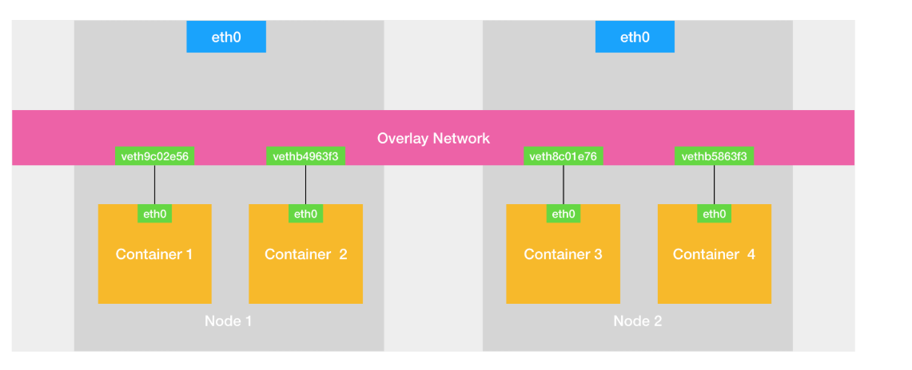
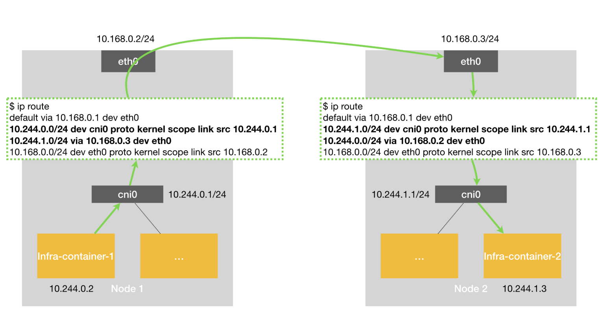
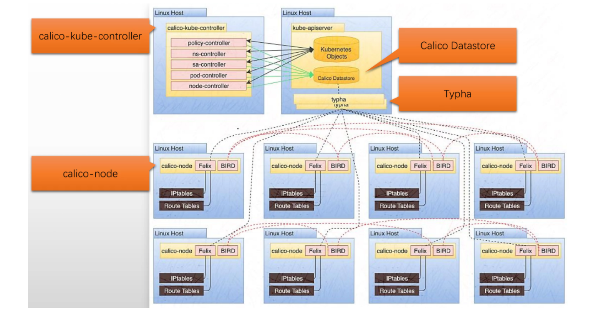
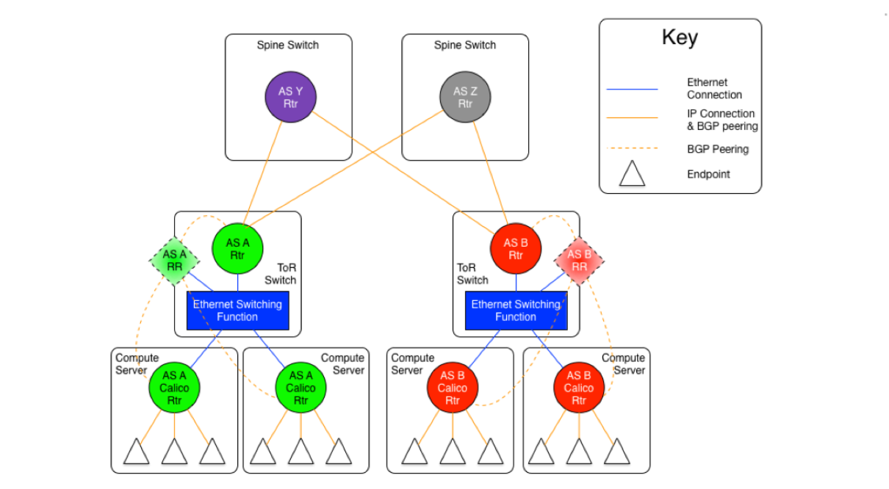

## Kubernetes网络剖析

在Docker模块的**`浅谈容器网络`**中，介绍了宿主机中的容器间通信是通过docker0作为网桥，将宿主机内的容器都连在这个网桥上。

那么Kubernetes中，不同节点间的容器进行通信，是不是可以**通过软件的方式，创建一个整个集群“公用”的网桥，然后把集群里的所有容器都连接到这个网桥上，不就可以相互通信了吗?**

这样一来，我们整个集群里的容器网络就会类似于下图所示的样子：



可以看到，构建这种容器网络的核心在于：我们需要在已有的宿主机网络上，再**通过软件构建一个覆盖在已有宿主机网络之上的、可以把所有容器连通在一起的虚拟网络**。所以，这种技术就被称为：**Overlay Network（覆盖网络）**。


### 深入了解容器跨主机网络


#### Flannel概述

Flannel 项目是 CoreOS 公司主推的容器网络方案。事实上，Flannel 项目本身只是一个框架，真正为我们提供容器网络功能的，是 Flannel 的后端实现。目前，Flannel 支持三种后端实现，分别是：

- **VXLAN**
- **host-gw**
- **UDP**


这三种不同的后端实现，正代表了三种容器跨主网络的主流实现方法


##### UDP模式的跨主网络实现原理（已废弃）

假设有两台宿主机

- 宿主机 Node 1 上有一个容器 container-1，它的 IP 地址是 10.244.2.20，对应的 docker0 网桥的地址是：172.17.0.1/16
- 宿主机 Node 2 上有一个容器 container-2，它的 IP 地址是 10.244.3.27，对应的 docker0 网桥的地址是：172.17.0.1/16


**让 container-1 访问 container-2**


container-1 容器里的进程发起的 IP 包，其源地址就是 10.244.2.20，目的地址就是 10.244.3.27。由于目的地址 10.244.3.27 并不在 Node 1 的 docker0 网桥的网段里，所以这个 IP 包会被交给默认路由规则，通过容器的网关进入 docker0 网桥（如果是同一台宿主机上的容器间通信，走的是直连规则），从而出现在宿主机上。


这时候，这个 IP 包的下一个目的地，就取决于宿主机上的路由规则了。此时，Flannel 已经在宿主机上创建出了一系列的路由规则，以 Node 1 为例，如下所示：

```bash
[root@node1 ~]# route -n
内核 IP 路由表
目标            网关            子网掩码        标志  跃点   引用  使用 接口
0.0.0.0         10.0.0.2        0.0.0.0         UG    0      0        0 eth0
10.0.0.0        0.0.0.0         255.255.255.0   U     0      0        0 eth0
10.244.0.0      10.244.0.0      255.255.255.0   UG    0      0        0 flannel.1 # 命中，并进入flannel1.1设备
10.244.1.0      0.0.0.0         255.255.255.0   U     0      0        0 cni0
10.244.2.0      10.244.2.0      255.255.255.0   UG    0      0        0 flannel.1
10.244.3.0      10.244.3.0      255.255.255.0   UG    0      0        0 flannel.1   
172.17.0.0      0.0.0.0         255.255.0.0     U     0      0        0 docker0
```

由于我们的 IP 包的目的地址是10.244.3.27，它匹配不到本机 docker0 网桥对应的 172.17.0.1/16 网段，只能匹配到第三条、也就是 10.244.0.0/16 对应的这条路由规则，从而进入到一个叫作 flannel1.1 的设备中。


 **flannel1.1 设备是一个TUN设备（Tunnel 设备）。**

```ABAP
在 Linux 中，TUN 设备是一种工作在三层（Network Layer）的虚拟网络设备。TUN 设备的功能非常简单，即：在操作系统内核和用户应用程序之间传递 IP 包。
```


当操作系统将一个 IP 包发送给 flannel0 设备之后，flannel0 就会把这个 IP 包，交给创建这个设备的应用程序，也就是 Flannel 进程。这是一个从内核态（Linux 操作系统）向用户态（Flannel 进程）的流动方向。

```ABAP
Container1-eth0 ---> 根据路由 ---> flannel1.1 ---> flanneld进程处理
```


反之，如果 Flannel 进程向 flannel0 设备发送了一个 IP 包，那么这个 IP 包就会出现在宿主机网络栈中，然后根据宿主机的路由表进行下一步处理。这是一个从用户态向内核态的流动方向。

当 IP 包从容器经过 docker0 出现在宿主机，然后又根据路由表进入 flannel0 设备后，宿主机上的 flanneld 进程（Flannel 项目在每个宿主机上的主进程），就会收到这个 IP 包。然后，flanneld 看到了这个 IP 包的目的地址，是 10.244.3.27，就把它发送给了 Node 2 宿主机。


**flanneld 又是如何知道这个 IP 地址对应的容器，是运行在 Node 2 上的呢？**


 Flannel 项目里一个非常重要的概念：子网（Subnet）。

事实上，在由 Flannel 管理的容器网络里，一台宿主机上的所有容器，都属于该宿主机被分配的一个“子网”。在我们的例子中，Node 1 的子网是 100.96.1.0/24，container-1 的 IP 地址是 100.96.1.2。Node 2 的子网是 100.96.2.0/24，container-2 的 IP 地址是 100.96.2.3。

而这些子网与宿主机的对应关系，正是保存在 Etcd 当中，如下所示：

```bash
$ etcdctl ls /coreos.com/network/subnets
/coreos.com/network/subnets/100.96.1.0-24
/coreos.com/network/subnets/100.96.2.0-24
/coreos.com/network/subnets/100.96.3.0-24
```


**注意：****如果 `--kube-subnet-mgr` 参数存在**，说明 Flannel 使用 Kubernetes API 而非 etcd 存储数据。

```bash
[root@master1 net.d]#kubectl -n kube-flannel describe daemonsets.apps kube-flannel-ds |grep -P "\-\-kube-subnet-mgr"
      --kube-subnet-mgr  # 说明Flannel使用的Kubernetes API

```


在Kubernetes API模式下，Flannel的子网分配信息存储在每个节点上的Annotation中，可以通过一下命令查看

```bash
[root@master1 ~]#kubectl get nodes -o json | jq '.items[] | {name: .metadata.name, podCIDR: .spec.podCIDR, flannelSubnet: .metadata.annotations["flannel.alpha.coreos.com/subnet"]}'
{
  "name": "master1",
  "podCIDR": "10.244.0.0/24",
  "flannelSubnet": null
}
{
  "name": "node1",
  "podCIDR": "10.244.1.0/24",
  "flannelSubnet": null
}
{
  "name": "node2",
  "podCIDR": "10.244.2.0/24",
  "flannelSubnet": null
}
{
  "name": "node3",
  "podCIDR": "10.244.3.0/24",
  "flannelSubnet": null
}
```


所以，flanneld 进程在处理由 flannel0 传入的 IP 包时，就可以根据目的 IP 的地址（比如 100.96.2.3），匹配到对应的子网（比如 100.96.2.0/24），从 Etcd 中找到这个子网对应的宿主机的 IP 地址


**当container-1发起对container-2的访问请求时，数据包的通信过程如下**

- container-1发出一个IP包，源地址为`10.244.2.20`，目的地址为`10.244.3.27`
- 这个IP包首先到达Node 1的docker0网桥**（这里进行一次判断）**。由于目的地址`10.244.3.37`不在docker0网桥的网段内，所以这个IP包会被转发给默认路由**。(应用进程发出数据包给到网桥设备，此时进行第一次用户态和内核态的切换)**
- 根据Node 1上的路由规则，这个IP包会被送往一个名为flannel0的设备。flannel0是一个TUN设备，它在三层网络上工作。
- flannel0设备会将这个IP包交给用户态的flanneld进程处理。**(此时进行第二次用户态和内核态的切换)**
- flanneld进程通过查询Etcd（或者**Kubernetes API**），得知目的IP地址10.244.3.27所在的子网对应的宿主机是Node 2，其IP地址为`10.0.0.202`。
- flanneld将原始的IP包封装在一个UDP包里，然后发送给Node 2的8285端口（flanneld默认监听的端口）。**(此时进行三次用户态和内核态的切换)**
- 当这个UDP包到达Node 2后，会被Node 2上的flanneld进程接收和解包，还原出原始的IP包。**(此时另一台主机进行一次用户态和内核态的切换)**
- Node 2的flanneld将还原出的IP包交给本机的flannel0设备。**(此时另一台主机进行二次用户态和内核态的切换)**
- flannel0设备将IP包转发给docker0网桥。
- docker0网桥根据目的IP地址，将包转发给container-2。**(此时另一台主机进行三次用户态和内核态的切换)**


**UDP封装与解封装过程**

- **封装过程包括以下步骤**

  - flanneld首先检查数据包的目的IP地址，确定目标容器所在的宿主机
  - flanneld然后创建一个新的UDP数据包。这个UDP数据包的源IP地址是当前宿主机的IP地址，目的IP地址是目标容器所在宿主机的IP地址。UDP端口通常是8285。
  - 原始的IP数据包被放入这个UDP数据包的负载部分。
  - flanneld将封装好的UDP数据包交给宿主机的网络栈，由宿主机的网络栈负责将这个UDP包发送出去。

  

- **拆解UDP解封装过程**

  - 目标宿主机的网络栈接收到UDP包，发现目的端口是8285，于是将这个包交给监听在8285端口的flanneld进程。
  - flanneld进程接收到UDP包后，从UDP包的负载中提取出原始的IP数据包
  - flanneld将提取出的原始IP包写入本机的flannel0设备。
  - Linux内核接收到这个IP包，根据路由规则将其转发给docker0网桥。
  - docker0网桥根据IP包的目的地址，将包转发给目标容器。


**UDP网络模式性能问题在实际应用中的表现可能如下:**

- **较高的网络延迟**: 由于每个数据包都需要经过多次处理和状态切换，网络延迟会显著增加。
- **CPU使用率升高**: 频繁的状态切换和数据拷贝会消耗大量的CPU资源。
- **吞吐量受限**: 由于单个flanneld进程需要处理所有流量，在高并发情况下可能会成为瓶颈。
- **内存带宽压力**: 多次数据拷贝会增加内存带宽的使用。
- **网络效率降低**: UDP封装增加了数据包大小，降低了网络的有效载荷比例。


我们在进行系统级编程的时候，有一个非常重要的优化原则，就是要减少用户态到内核态的切换次数，并且把核心的处理逻辑都放在内核态进行。这也是为什么，Flannel 后来支持的VXLAN 模式，逐渐成为了主流的容器网络方案的原因。


##### VXLAN网络模式剖析

VXLAN，即 Virtual Extensible LAN（虚拟可扩展局域网），是 Linux 内核本身就支持的一种网络虚似化技术。所以说，VXLAN 可以完全在内核态实现上述封装和解封装的工作，从而通过与前面相似的“隧道”机制，构建出覆盖网络（Overlay Network）。

VXLAN 的覆盖网络的设计思想是：在现有的三层网络之上，“覆盖”一层虚拟的、由内核 VXLAN 模块负责维护的**二层网络**，使得连接在这个 VXLAN 二层网络上的“主机”（虚拟机或者容器都可以）之间，可以像在同一个局域网（LAN）里那样自由通信。当然，实际上，这些“主机”可能分布在不同的宿主机上，甚至是分布在不同的物理机房里。

而为了能够在二层网络上打通“隧道”，VXLAN 会在宿主机上设置一个特殊的网络设备作为“隧道”的两端。这个设备就叫作 **VTEP**，即：**VXLAN Tunnel End Point（虚拟隧道端点）**。

而 VTEP 设备的作用，其实跟前面的 flanneld 进程非常相似。只不过，**它进行封装和解封装的对象，是二层数据帧（Ethernet frame）；而且这个工作的执行流程，全部是在内核里完成的（因为 VXLAN 本身就是 Linux 内核中的一个模块）**


图中每台宿主机上名叫 flannel.1 的设备，就是 VXLAN 所需的 VTEP 设备，它既有 IP 地址，也有 MAC 地址

container-1 的 IP 地址是 10.1.15.2，要访问的 container-2 的 IP 地址是 10.1.16.3。

那么，与前面 UDP 模式的流程类似，当 container-1 发出请求之后，这个目的地址是 10.1.16.3 的 IP 包，会先出现在 cni0 网桥，然后被路由到本机 flannel.1 设备进行处理。也就是说，来到了“隧道”的入口。为了方便叙述，我接下来会把这个 IP 包称为“原始 IP 包”。

**补充：从cni0到flannel.1是如何路由的**

```bash
[root@master1 ~]# kubectl get pod -o wide
NAME                     READY   STATUS    RESTARTS   AGE     IP           NODE             NOMINATED NODE   READINESS GATES
myweb-565cb68445-49fqg   1/1     Running   0          2m14s   10.244.1.3   node1.feng.org   <none>           <none>
myweb-565cb68445-7fv5x   1/1     Running   0          2m14s   10.244.2.2   node2.feng.org   <none>           <none>
myweb-565cb68445-tgnvw   1/1     Running   0          2m14s   10.244.1.2   node1.feng.org   <none>           <none>

[root@mystical ~]# kubectl exec -it myweb-565cb68445-49fqg -- sh
[root@myweb-565cb68445-49fqg /]# route -n
Kernel IP routing table
Destination     Gateway         Genmask         Flags Metric Ref    Use Iface
0.0.0.0         10.244.1.1      0.0.0.0         UG    0      0        0 eth0
10.244.0.0      10.244.1.1      255.255.0.0     UG    0      0        0 eth0
10.244.1.0      0.0.0.0         255.255.255.0   U     0      0        0 eth0

[root@master1 ~]# kubectl exec myweb-565cb68445-7fv5x -- route -n
Kernel IP routing table
Destination     Gateway         Genmask         Flags Metric Ref    Use Iface
0.0.0.0         10.244.2.1      0.0.0.0         UG    0      0        0 eth0
10.244.0.0      10.244.2.1      255.255.0.0     UG    0      0        0 eth0
10.244.2.0      0.0.0.0         255.255.255.0   U     0      0        0 eth0

# 每个pod里面会生成指向所在宿主机虚拟网络设备cni0虚拟网桥的默认路由

[root@node1 ~]# ip a show flannel.1
[root@node1 ~]# ip a show cni0
5: cni0: <BROADCAST,MULTICAST,UP,LOWER_UP> mtu 1450 qdisc noqueue state UP group default qlen 1000
    link/ether ca:d6:5b:9c:59:c7 brd ff:ff:ff:ff:ff:ff
    inet 10.244.1.1/24 brd 10.244.1.255 scope global cni0
       valid_lft forever preferred_lft forever
    inet6 fe80::c8d6:5bff:fe9c:59c7/64 scope link 
       valid_lft forever preferred_lft forever
       
# 数据进入cni0后，会根据宿主机的路由表，从而进入flannel1.1
[root@node1 ~]# route -n
Kernel IP routing table
Destination     Gateway         Genmask         Flags Metric Ref    Use Iface
0.0.0.0         11.0.1.2        0.0.0.0         UG    0      0        0 eth0
10.244.0.0      10.244.0.0      255.255.255.0   UG    0      0        0 flannel.1
10.244.1.0      0.0.0.0         255.255.255.0   U     0      0        0 cni0
10.244.2.0      10.244.2.0      255.255.255.0   UG    0      0        0 flannel.1
11.0.1.0        0.0.0.0         255.255.255.0   U     0      0        0 eth0
172.17.0.0      0.0.0.0         255.255.0.0     U     0      0        0 docker0
```

为了能够将“原始 IP 包”封装并且发送到正确的宿主机，VXLAN 就需要找到这条“隧道”的出口，即：目的宿主机的 VTEP 设备。

而这个设备的信息，正是每台宿主机上的 flanneld 进程负责维护的。

比如，当 Node 2 启动并加入 Flannel 网络之后，在 Node 1（以及所有其他节点）上，flanneld 就会添加一条如下所示的路由规则：

```bash
$ route -n
Kernel IP routing table
Destination     Gateway         Genmask         Flags Metric Ref    Use Iface
...
10.1.16.0       10.1.16.0       255.255.255.0   UG    0      0        0 flannel.1
```

这条规则的意思是：凡是发往 10.1.16.0/24 网段的 IP 包，都需要经过 flannel.1 设备发出，并且，它最后被发往的网关地址是：10.1.16.0。

从上图 的 Flannel VXLAN 模式的流程图中我们可以看到，10.1.16.0 正是 Node 2 上的 VTEP 设备（也就是 flannel.1 设备）的 IP 地址。

为了方便叙述，接下来我会把 Node 1 和 Node 2 上的 flannel.1 设备分别称为“**源 VTEP 设备**”和“**目的 VTEP 设备**”。

而这些 VTEP 设备之间，就需要想办法组成一个虚拟的二层网络，即：**通过二层数据帧进行通信**。

所以在我们的例子中，“源 VTEP 设备”收到“原始 IP 包”后，就要想办法把“原始 IP 包”加上一个目的 MAC 地址，封装成一个二层数据帧，然后发送给“目的 VTEP 设备”（当然，这么做还是因为这个 IP 包的目的地址不是本机）。

这里需要解决的问题就是：**目的 VTEP 设备”的 MAC 地址是什么**

此时，根据前面的路由记录，我们已经知道了“目的 VTEP 设备”的 IP 地址。而要根据三层 IP 地址查询对应的二层 MAC 地址，这正是 ARP（Address Resolution Protocol ）表的功能。

而这里要用到的 ARP 记录，也是 flanneld 进程在 Node 2 节点启动时，自动添加在 Node 1 上的。我们可以通过 ip 命令看到它，如下所示：

```bash
# 在Node 1上
$ ip neigh show dev flannel.1
10.1.16.0 lladdr 5e:f8:4f:00:e3:37 PERMANENT
# PERMANENT: 表示这个邻居项是手动或通过某种机制写入的，不会被系统自动清除
# 如果是动态学习到的，会是 REACHABLE / STALE / DELAY / FAILED 等状态
```

这条记录的意思非常明确，即：IP 地址 10.1.16.0，对应的 MAC 地址是 5e:f8:4f:00:e3:37。

```ABAP
可以看到，最新版本的 Flannel 并不依赖 L3 MISS 事件和 ARP 学习，而会在每台节点启动时把它的 VTEP 设备对应的 ARP 记录，直接下放到其他每台宿主机上。
```

**延伸知识**

可以通过以下命令手动添加一个 PERMANENT 条目：

```bash
ip neigh add 192.168.1.100 lladdr aa:bb:cc:dd:ee:ff dev eth0 nud permanent
# nud permanent: 表示这个邻居项永远有效（即使不在线也不会消失）
# lladdr: 映射的 MAC 地址
```

有了这个“目的 VTEP 设备”的 MAC 地址，Linux 内核就可以开始二层封包工作了。这个二层帧的格式，如下所示：


可以看到，Linux 内核会把“目的 VTEP 设备”的 MAC 地址，填写在图中的 Inner Ethernet Header 字段，得到一个二层数据帧

需要注意的是，上述封包过程只是加一个二层头，不会改变“原始 IP 包”的内容。所以图中的 Inner IP Header 字段，依然是 container-2 的 IP 地址，即 10.1.16.3。

但是，上面提到的这些 VTEP 设备的 MAC 地址，对于宿主机网络来说并没有什么实际意义。所以上面封装出来的这个数据帧，并不能在我们的宿主机二层网络里传输。为了方便叙述，我们把它称为“内部数据帧”（Inner Ethernet Frame）。

所以接下来，Linux 内核还需要再把“内部数据帧”进一步封装成为宿主机网络里的一个普通的数据帧，好让它“载着”“内部数据帧”，通过宿主机的 eth0 网卡进行传输。

我们把这次要封装出来的、宿主机对应的数据帧称为“外部数据帧”（Outer Ethernet Frame）。

为了实现这个“搭便车”的机制，Linux 内核会在“内部数据帧”前面，加上一个特殊的 VXLAN 头，用来表示这个“乘客”实际上是一个 VXLAN 要使用的数据帧。

而这个 VXLAN 头里有一个重要的标志叫作 **VNI**，它是 VTEP 设备识别某个数据帧是不是应该归自己处理的重要标识。而在 Flannel 中，**VNI 的默认值是 1**，这也是为何，宿主机上的 VTEP 设备都叫作 flannel.1 的原因，这里的“1”，其实就是 VNI 的值。

所以，跟 UDP 模式类似，在宿主机看来，它会以为自己的 flannel.1 设备只是在向另外一台宿主机的 flannel.1 设备，发起了一次普通的 UDP 链接。它哪里会知道，这个 UDP 包里面，其实是一个完整的二层数据帧

不过，不要忘了，一个 flannel.1 设备只知道另一端的 flannel.1 设备的 MAC 地址，却不知道对应的宿主机地址是什么

也就是说，这个 UDP 包该发给哪台宿主机呢？

在这种场景下，flannel.1 设备实际上要扮演一个“网桥”的角色，在二层网络进行 UDP 包的转发。而在 Linux 内核里面，“网桥”设备进行转发的依据，来自于一个叫作 **FDB（Forwarding Database）的转发数据库**。

不难想到，这个 flannel.1“网桥”对应的 FDB 信息，也是 flanneld 进程负责维护的。它的内容可以通过 bridge fdb 命令查看到，如下所示：

```bash
# 在Node 1上，使用“目的VTEP设备”的MAC地址进行查询
$ bridge fdb show flannel.1 | grep 5e:f8:4f:00:e3:37
5e:f8:4f:00:e3:37 dev flannel.1 dst 10.168.0.3 self permanent
```

可以看到，在上面这条 FDB 记录里，指定了这样一条规则，即：

发往我们前面提到的“目的 VTEP 设备”（MAC 地址是 5e:f8:4f:00:e3:37）的二层数据帧，应该通过 flannel.1 设备，发往 IP 地址为 10.168.0.3 的主机。显然，这台主机正是 Node 2，UDP 包要发往的目的地就找到了。

所以接下来的流程，就是一个正常的、宿主机网络上的封包工作

我们知道，UDP 包是一个四层数据包，所以 Linux 内核会在它前面加上一个 IP 头，即原理图中的 Outer IP Header，组成一个 IP 包。并且，在这个 IP 头里，会填上前面通过 FDB 查询出来的目的主机的 IP 地址，即 Node 2 的 IP 地址 10.168.0.3

然后，Linux 内核再在这个 IP 包前面加上二层数据帧头，即原理图中的 Outer Ethernet Header，并把 Node 2 的 MAC 地址填进去。这个 MAC 地址本身，是 Node 1 的 ARP 表要学习的内容，无需 Flannel 维护。这时候，我们封装出来的“外部数据帧”的格式，如下所示：


这样，封包工作就宣告完成了。

```bash
UDP 8472
# IANA 官方注册 的 VXLAN 端口
# Flannel 使用的默认端口
```

接下来，Node 1 上的 flannel.1 设备就可以把这个数据帧从 Node 1 的 eth0 网卡发出去。显然，这个帧会经过宿主机网络来到 Node 2 的 eth0 网卡。

这时候，Node 2 的内核网络栈会发现这个数据帧里有 VXLAN Header，并且 VNI=1。所以 Linux 内核会对它进行拆包，拿到里面的内部数据帧，然后根据 VNI 的值，把它交给 Node 2 上的 flannel.1 设备。

而 flannel.1 设备则会进一步拆包，取出“原始 IP 包”。最终，IP 包就进入到了 container-2 容器的 Network Namespace 里

以上，就是 Flannel VXLAN 模式的具体工作原理了。

**延伸知识**

大部分支持VXLAN的交换机都是三层交换机

```ABAP
三层交换机 = “能路由的交换机”
路由器 = “更智能、功能更丰富的网络决策中心”
```

**功能对比表格**

| 对比维度            | 三层交换机 (L3 Switch)                         | 路由器 (Router)                                              |
| ------------------- | ---------------------------------------------- | ------------------------------------------------------------ |
| **核心功能**        | 基于 IP 进行高速转发，注重交换+路由            | 网络层协议处理、路径选择、NAT、防火墙、QoS 等全套功能        |
| **目标场景**        | 高性能同构网络内部通信（如：数据中心、园区网） | 不同网络/不同协议之间的连接（如：公网/私网、广域网）         |
| **性能**            | 高（硬件ASIC芯片处理，转发线速）**硬件处理**   | 相对低（主要基于CPU处理即 **软件处理**，转发性能取决于型号） |
| **功能丰富性**      | 一般功能少（重点是转发快）                     | 功能非常全，如动态路由协议、VPN、ACL、QoS、流量策略等        |
| **协议支持**        | 支持部分路由协议（如 OSPF、静态路由）          | 支持多种路由协议（OSPF、BGP、RIP、IS-IS、EIGRP 等）          |
| **NAT/防火墙**      | 通常不支持                                     | 原生支持                                                     |
| **价格成本**        | 较低（用于局域网）                             | 高（适用于广域网、边界网络）                                 |
| **扩展性/灵活性**   | 一般                                           | 很强（更适合作为网络“边界设备”）                             |
| **可视化/监控能力** | 有限                                           | 更强，适合做策略、日志、监控中心                             |

```ABAP
/etc/cni/net.d/ 是 Kubernetes 或其他使用 CNI（Container Network Interface）的容器平台中用于存放 CNI 网络配置文件的目录。删除该目录下的内容会导致没有配置文件，从而导致网络失效
在实际生产环境中，/etc/cni/net.d/ 这个目录基本上是“高危区”，通常不会轻易动它。
一般只有初次安装网络插件（如 flannel、calico）或者 更换 CNI 插件才可能动它
```


#### Flannel VXLAN 通信过程总结

- Container-1（10.244.1.2）发送数据给 Container-2（10.244.2.2）

- 基于Container-1内的路由表，数据发给 `Container-1` 所在节点的 `cni0`

  ```bash
  # Container-1里的路由表
  [root@myweb-565cb68445-49fqg /]# route -n
  Kernel IP routing table
  Destination     Gateway         Genmask         Flags Metric Ref    Use Iface
  0.0.0.0         10.244.1.1      0.0.0.0         UG    0      0        0 eth0
  10.244.0.0      10.244.1.1      255.255.0.0     UG    0      0        0 eth0
  10.244.1.0      0.0.0.0         255.255.255.0   U     0      0        0 eth0
  
  #所在节点的ip
  [root@node1 ~]# ip a show cni0
  5: cni0: <BROADCAST,MULTICAST,UP,LOWER_UP> mtu 1450 qdisc noqueue state UP group default qlen 1000
      link/ether ca:d6:5b:9c:59:c7 brd ff:ff:ff:ff:ff:ff
      inet 10.244.1.1/24 brd 10.244.1.255 scope global cni0
         valid_lft forever preferred_lft forever
      inet6 fe80::c8d6:5bff:fe9c:59c7/64 scope link 
         valid_lft forever preferred_lft forever
  ```

- 数据包到达CNI0后，此时进入**宿主机网络名称空间**，根据宿主机上的路由，将数据发给flannel.1处理

  ```bash
  [root@node1 ~]# route -n
  Kernel IP routing table
  Destination     Gateway         Genmask         Flags Metric Ref    Use Iface
  0.0.0.0         11.0.1.2        0.0.0.0         UG    0      0        0 eth0
  10.244.0.0      10.244.0.0      255.255.255.0   UG    0      0        0 flannel.1
  10.244.1.0      0.0.0.0         255.255.255.0   U     0      0        0 cni0
  10.244.2.0      10.244.2.0      255.255.255.0   UG    0      0        0 flannel.1   # 命中
  11.0.1.0        0.0.0.0         255.255.255.0   U     0      0        0 eth0
  172.17.0.0      0.0.0.0         255.255.0.0     U     0      0        0 docker0
  
  # 注意：这里的 10.244.2.0 作为 下一跳 的写法是 flannel 特有，它不是标准网关地址，而是 Flannel 自己识别使用的“假网关”。
  ```

- 数据到达flannel.1后，根据ARP表，找到目的VETP设备对应的MAC地址(这个邻居表项是被flanneld进程写入的)，然后封装在目的容器IP地址前面，并在前面封装VXLAN的Header（带固定的 VNI=1），然后再最前面封装UDPHeader（UDP端口为8472）

  ```bash
  [root@master2 ~]# ip neigh show dev flannel.1
  10.244.2.0 lladdr 72:10:86:1f:57:18 PERMANENT
  10.244.0.0 lladdr 8e:1b:9f:a8:26:96 PERMANENT    # 表示这个邻居项是手动或通过某种机制写入的，不会被系统自动清除
  
  [root@master2 ~]# ss -unlp|grep 8472
  UNCONN 0      0            0.0.0.0:8472      0.0.0.0:* 
  ```

  ```ABAP
  在 Flannel 这类只支持单租户、无隔离需求的场景中，这里VXLANHeader中的 VNI 没有实际用途，但为了满足 VXLAN 协议格式，必须填写（即使它一直是固定的，比如 VNI=1）
  ```

- 封装完UDPHeader后，根据FDB，找到目的 VETP flannel.1 的 MAC 地址  对应的 所在节点的 IP

  ```bash
  [root@node1 ~]$ bridge fdb show flannel.1|grep 72:10:86:1f:57:18
  72:10:86:1f:57:18 dev flannel.1 dst 11.0.1.103 self permanent      # 根据这条记录找到正确的节点地址11.0.1.103
  ```

- 找到目的IP所在节点的IP后，将其封装在最外层，后续根据正常的路由发送到目的节点，也就是在最外层封装下一条网关的MAC地址


- 在封装目节点IP的时候，**源 IP 会被替换成宿主机节点的 IP**，因为**源地址 IP 会影响数据包的“返回路径”和“中间网络设备的行为”，这是必须替换成宿主机 IP 的根本原因之一。**

  ```css
  ''' 数据包封装结构图（从内到外）'''
  ┌──────────────────────────────────────┐
  │          原始Pod数据包               │
  │  Src IP: 10.244.1.2 (Pod1)           │
  │  Dst IP: 10.244.2.2 (Pod2)           │
  └──────────────────────────────────────┘
            ↓  封装在 VXLAN payload 中
  
  ┌──────────────────────────────────────┐
  │             VXLAN Header             │
  │         VNI = 1（固定值）            │
  └──────────────────────────────────────┘
            ↓  封装在 UDP 中
  
  ┌──────────────────────────────────────┐
  │             UDP Header               │
  │  Src Port: 随机                      │
  │  Dst Port: 8472（VXLAN标准端口）    │
  └──────────────────────────────────────┘
            ↓  封装在 IP 包中
  
  ┌──────────────────────────────────────┐
  │             Outer IP Header          │
  │  Src IP: 11.0.1.101（宿主机1）       │
  │  Dst IP: 11.0.1.103（宿主机2）       │
  └──────────────────────────────────────┘
  ```

  


### Kubernetes 网络模型 与 CNI 网络插件

在上述的讲解中，这些例子有一个共性，那就是用户的容器都连接在 docker0 网桥上。而网络插件则在宿主机上创建了一个特殊的设备（UDP 模式创建的是 TUN 设备，VXLAN 模式创建的则是 VTEP 设备），docker0 与这个设备之间，通过 IP 转发（路由表）进行协作

然后，网络插件真正要做的事情，则是通过某种方法，把不同宿主机上的特殊设备连通，从而达到容器跨主机通信的目的

上面这个流程，也正是 Kubernetes 对容器网络的主要处理方法。只不过，Kubernetes 是通过一个叫作 CNI 的接口，维护了一个单独的网桥来代替 docker0。这个网桥的名字就叫作：CNI 网桥，它在宿主机上的设备名称默认是：**cni0。**

以 Flannel 的 VXLAN 模式为例，在 Kubernetes 环境里，它的工作方式只不过，docker0 网桥被替换成了 CNI 网桥而已，如下所示：


在这里，Kubernetes 为 Flannel 分配的子网范围是 10.244.0.0/16。这个参数可以在部署的时候指定，比如：

```bash
$ kubeadm init --pod-network-cidr=10.244.0.0/16
```

也可以在部署完成后，通过修改 kube-controller-manager 的配置文件来指定。

这时候，假设 Infra-container-1 要访问 Infra-container-2（也就是 Pod-1 要访问 Pod-2），这个 IP 包的源地址就是 10.244.0.2，目的 IP 地址是 10.244.1.3。而此时，Infra-container-1 里的 eth0 设备，同样是以 Veth Pair 的方式连接在 Node 1 的 cni0 网桥上。所以这个 IP 包就会经过 cni0 网桥出现在宿主机上。

此时，Node 1 上的路由表，如下所示：

```bash
# 在Node 1上
$ route -n
Kernel IP routing table
Destination     Gateway         Genmask         Flags Metric Ref    Use Iface
...
10.244.0.0      0.0.0.0         255.255.255.0   U     0      0        0 cni0
10.244.1.0      10.244.1.0      255.255.255.0   UG    0      0        0 flannel.1
172.17.0.0      0.0.0.0         255.255.0.0     U     0      0        0 docker0
```

为我们的 IP 包的目的 IP 地址是 10.244.1.3，所以它只能匹配到第二条规则，也就是 10.244.1.0 对应的这条路由规则。

可以看到，这条规则指定了本机的 flannel.1 设备进行处理。并且，flannel.1 在处理完后，要将 IP 包转发到的网关（Gateway），正是“隧道”另一端的 VTEP 设备，也就是 Node 2 的 flannel.1 设备。所以，接下来的流程就跟Flannel VXLAN 模式完全一样了。

需要注意的是，CNI 网桥只是接管所有 CNI 插件负责的、即 Kubernetes 创建的容器（Pod）。而此时，如果你用 docker run 单独启动一个容器，那么 Docker 项目还是会把这个容器连接到 docker0 网桥上。所以这个容器的 IP 地址，一定是属于 docker0 网桥的 172.17.0.0/16 网段。

Kubernetes 之所以要设置这样一个与 docker0 网桥功能几乎一样的 CNI 网桥，主要原因包括两个方面：

- 一方面，Kubernetes 项目并没有使用 Docker 的网络模型（CNM），所以它并不希望、也不具备配置 docker0 网桥的能力；
- 另一方面，这还与 Kubernetes 如何配置 Pod，也就是 Infra 容器的 Network Namespace 密切相关。

我们知道，Kubernetes 创建一个 Pod 的第一步，就是创建并启动一个 Infra 容器，用来“hold”住这个 Pod 的 Network Namespace

所以，CNI 的设计思想，就是：**Kubernetes 在启动 Infra 容器之后，就可以直接调用 CNI 网络插件，为这个 Infra 容器的 Network Namespace，配置符合预期的网络栈**

```ABAP
一个 Network Namespace 的网络栈包括：
网卡（Network Interface）、回环设备（Loopback Device）、路由表（Routing Table）和 iptables 规则。
```


##### CNI 插件的部署方式

那么，这个网络栈的配置工作又是如何完成的呢？

为了回答这个问题，我们就需要从 CNI 插件的部署和实现方式谈起了。

我们在部署 Kubernetes 的时候，有一个步骤是安装 kubernetes-cni 包，它的目的就是在宿主机上安装 CNI 插件所需的基础可执行文件

```ABAP
在使用 kubeadm 安装 Kubernetes 集群的过程中，kubernetes-cni 包作为它们的依赖项自动安装的。
```

验证

```bash
[root@node1 ~]#apt-cache depends kubelet | grep kubernetes-cni
  依赖: kubernetes-cni
```

在安装完成后，你可以在宿主机的 /opt/cni/bin 目录下看到它们，如下所示：

```bash
[root@node1 ~]#ls -al /opt/cni/bin/
总计 209428
-rwxr-xr-x 1 root root  4141145  3月 26 21:44 bandwidth
-rwxr-xr-x 1 root root  4652757  1月 11  2024 bridge
-rwxr-xr-x 1 root root 65288440  3月 26 21:44 calico
-rwxr-xr-x 1 root root 65288440  3月 26 21:44 calico-ipam
-rwxr-xr-x 1 root root 11050013  1月 11  2024 dhcp
-rwxr-xr-x 1 root root  4297556  1月 11  2024 dummy
-rwxr-xr-x 1 root root  4736299  1月 11  2024 firewall
-rwxr-xr-x 1 root root  2586700  3月 26 21:44 flannel
-rwxr-xr-x 1 root root  4191837  1月 11  2024 host-device
-rwxr-xr-x 1 root root  3637994  3月 26 21:44 host-local
-rwxr-xr-x 1 root root  4315686  1月 11  2024 ipvlan
-rwxr-xr-x 1 root root  3705893  3月 26 21:44 loopback
-rwxr-xr-x 1 root root  4349395  1月 11  2024 macvlan
-rwxr-xr-x 1 root root  4178588  3月 26 21:44 portmap
-rwxr-xr-x 1 root root  4470977  1月 11  2024 ptp
-rwxr-xr-x 1 root root  3851218  1月 11  2024 sbr
-rwxr-xr-x 1 root root  3110828  1月 11  2024 static
-rwxr-xr-x 1 root root  4371897  1月 11  2024 tap
-rwxr-xr-x 1 root root  3861557  3月 26 21:44 tuning
-rwxr-xr-x 1 root root  4310173  1月 11  2024 vlan
-rwxr-xr-x 1 root root  4001842  1月 11  2024 vrf
```

这些 CNI 的基础可执行文件，按照功能可以分为三类：

**第一类，叫作 Main 插件，它是用来创建具体网络设备的二进制文件**。比如，bridge（网桥设备）、ipvlan、loopback（lo 设备）、macvlan、ptp（Veth Pair 设备），以及 vlan。

Flannel、Weave 等项目，都属于“网桥”类型的 CNI 插件。所以在具体的实现中，它们往往会调用 bridge 这个二进制文件。

**第二类，叫作 IPAM（IP Address Management）插件，它是负责分配 IP 地址的二进制文件。**比如，dhcp，这个文件会向 DHCP 服务器发起请求；host-local，则会使用预先配置的 IP 地址段来进行分配。

**第三类，是由 CNI 社区维护的内置 CNI 插件。**比如：flannel，就是专门为 Flannel 项目提供的 CNI 插件；tuning，是一个通过 sysctl 调整网络设备参数的二进制文件；portmap，是一个通过 iptables 配置端口映射的二进制文件；bandwidth，是一个使用 Token Bucket Filter (TBF) 来进行限流的二进制文件。

从这些二进制文件中，我们可以看到，如果要实现一个给 Kubernetes 用的容器网络方案，其实需要做两部分工作，以 Flannel 项目为例：

**首先，实现这个网络方案本身。**这一部分需要编写的，其实就是 flanneld 进程里的主要逻辑。比如，创建和配置 flannel.1 设备、配置宿主机路由、配置 ARP 和 FDB 表里的信息等等。

**然后，实现该网络方案对应的 CNI 插件**。这一部分主要需要做的，就是配置 Infra 容器里面的网络栈，并把它连接在 CNI 网桥上。

由于 Flannel 项目对应的 CNI 插件已经被内置了，所以它无需再单独安装。

接下来，你就需要在宿主机上安装 flanneld（网络方案本身）。而在这个过程中，flanneld 启动后会在每台宿主机上生成它对应的 **CNI 配置文件（它其实是一个 ConfigMap）**，从而告诉 Kubernetes，这个集群要使用 Flannel 作为容器网络方案。

这个 CNI 配置文件的内容如下所示：

```bash
$ cat /etc/cni/net.d/10-flannel.conflist 
{
  "name": "cbr0",
  "plugins": [
    {
      "type": "flannel",
      "delegate": {
        "hairpinMode": true,
        "isDefaultGateway": true
      }
    },
    {
      "type": "portmap",
      "capabilities": {
        "portMappings": true
      }
    }
  ]
}
```

需要注意的是，在 Kubernetes 中，处理容器网络相关的逻辑并不会在 kubelet 主干代码里执行，而是会在具体的 CRI（Container Runtime Interface，容器运行时接口）实现里完成。对于 Docker 项目来说，要继续使用 Docker 作为运行时，必须用社区维护的 [**cri-dockerd**](https://github.com/Mirantis/cri-dockerd) 适配器

所以，接下来cri-dockerd会加载上述的CNI配置文件

需要注意，Kubernetes 目前不支持多个 CNI 插件混用。如果你在 CNI 配置目录（/etc/cni/net.d）里放置了多个 CNI 配置文件的话，cri-dockerd 只会加载按字母顺序排序的第一个插件。

但另一方面，CNI 允许你在一个 CNI 配置文件里，通过 plugins 字段，定义多个插件进行协作。

比如，在我们上面这个例子里，Flannel 项目就指定了 flannel 和 portmap 这两个插件。

**这时候，cri-dockerd 会把这个 CNI 配置文件加载起来，并且把列表里的第一个插件、也就是 flannel 插件，设置为默认插件。**而在后面的执行过程中，flannel 和 portmap 插件会按照定义顺序被调用，从而依次完成“配置容器网络”和“配置端口映射”这两步操作


##### CNI 插件的工作原理

当 kubelet 组件需要创建 Pod 的时候，它第一个创建的一定是 Infra 容器。所以在这一步，cri-dockerd 就会先调用 Docker API 创建并启动 Infra 容器，紧接着执行一个叫作 SetUpPod 的方法。这个方法的作用就是：为 CNI 插件准备参数，然后调用 CNI 插件为 Infra 容器配置网络。

这里要调用的 CNI 插件，就是 `/opt/cni/bin/flannel`；而调用它所需要的参数，分为两部分。

**第一部分，是由 cri-dockerd 设置的一组 CNI 环境变量**

其中，最重要的环境变量参数叫作：CNI_COMMAND。它的取值只有两种：ADD 和 DEL。

**这个 ADD 和 DEL 操作，就是 CNI 插件唯一需要实现的两个方法。**

其中 ADD 操作的含义是：把容器添加到 CNI 网络里；DEL 操作的含义则是：把容器从 CNI 网络里移除掉。

而对于网桥类型的 CNI 插件来说，这两个操作意味着把容器以 Veth Pair 的方式“插”到 CNI 网桥上，或者从网桥上“拔”掉。


接下来，**以 ADD 操作为重点进行讲解**。

CNI 的 ADD 操作需要的参数包括：

- 容器里网卡的名字 eth0（CNI_IFNAME）
- Pod 的 Network Namespace 文件的路径（CNI_NETNS）
- 容器的 ID（CNI_CONTAINERID）等

这些参数都属于上述环境变量里的内容。其中，Pod（Infra 容器）的 Network Namespace 文件的路径，我在前面讲解容器基础的时候提到过，即：`/proc/< 容器进程的 PID>/ns/net`

除此之外，在 CNI 环境变量里，还有一个叫作 CNI_ARGS 的参数。通过这个参数，CRI 实现（比如 cri-dockerd）就可以以 Key-Value 的格式，传递自定义信息给网络插件。这是用户将来自定义 CNI 协议的一个重要方法。

```bash
# 如果你是调试 CNI 插件或自己写插件，可以通过设置环境变量来测试执行：
CNI_COMMAND=ADD \
CNI_CONTAINERID=dummy \
CNI_NETNS=/var/run/netns/test \
CNI_IFNAME=eth0 \
CNI_PATH=/opt/cni/bin \
/opt/cni/bin/bridge < /etc/cni/net.d/10-bridge.conf
```

```ABAP
在 Kubernetes 中，cri-dockerd 调用 CNI 插件时所需的环境变量确实是由 kubelet 传递给它的。
```

**详细解释如下：**

🌐 1. **Kubelet 决定网络插件和参数**

当 kubelet 启动时，它的参数中会包含如下与 CNI 相关的配置

```bash
# 下面参数为默认值
--network-plugin=cni
--cni-bin-dir=/opt/cni/bin
--cni-conf-dir=/etc/cni/net.d
```

这些参数告诉 kubelet

- 要使用 CNI 作为网络插件；
- 去哪里找插件二进制；
- 去哪里找 CNI 网络配置文件（JSON 格式）

🔗 2. **kubelet 通过 CRI 与 cri-dockerd 通信**

- kubelet 不直接调用 Docker，而是通过 CRI 与 **cri-dockerd** 通信；
- 当 kubelet 需要创建一个 Pod，它先让 cri-dockerd 创建 **infra 容器（Pause 容器）**；
- 然后调用 `SetUpPod()`，cri-dockerd 内部就会根据配置，执行对应的 CNI 插件；

🧠 3. **cri-dockerd 调用 CNI 插件时使用的环境变量**

当 cri-dockerd 调用某个 CNI 插件（如 `bridge`、`flannel`）时，它会自动设置以下环境变量 —— **这些变量的值就是由 kubelet 传递给 cri-dockerd 的：**

| 环境变量          | 含义                              |
| ----------------- | --------------------------------- |
| `CNI_COMMAND`     | 操作类型（如 ADD、DEL）           |
| `CNI_CONTAINERID` | 容器 ID（即 infra 容器）          |
| `CNI_NETNS`       | 容器网络命名空间路径              |
| `CNI_IFNAME`      | 网络接口名称，通常是 eth0         |
| `CNI_PATH`        | 插件路径，来自 `--cni-bin-dir`    |
| `CNI_ARGS`        | 附加信息，如 pod 名、namespace 等 |

这些变量会传递给插件，插件再依据 `/etc/cni/net.d/` 下的 JSON 文件执行具体的网络操作


**第二部分，则是 cri-dockerd 从 CNI 配置文件里加载到的、默认插件的配置信息。**


**上述的整体流程梳理如下**

1. **Pod 要创建了，kubelet 发起网络初始化**

- kubelet 负责调用容器运行时（比如 `cri-dockerd`）来创建 Pod。
- kubelet 会使用如下参数告诉运行时应该使用哪种网络插件：

```bash
--network-plugin=cni
--cni-conf-dir=/etc/cni/net.d
--cni-bin-dir=/opt/cni/bin
```

2. **kubelet 通过 cri-dockerd 调用 CNI 插件**

- kubelet 通过 `--container-runtime-endpoint=unix:///run/cri-dockerd.sock` 连接到 `cri-dockerd`
- 然后，cri-dockerd 会调用 `/opt/cni/bin` 目录下的 CNI 插件（如 flannel、bridge、calico）
- 并 **传递必要的环境变量和参数**（如下 👇）

3. **传入给 CNI 插件的典型环境变量**

```bash
CNI_COMMAND=ADD
CNI_CONTAINERID=<容器ID>
CNI_IFNAME=eth0
CNI_NETNS=/proc/<pid>/ns/net
CNI_PATH=/opt/cni/bin
```

这些环境变量 + 配置文件（如 `/etc/cni/net.d/10-flannel.conflist`）会一起交给插件执行

4. **如果 `.conflist` 使用 `delegate`**

- 如你看到的 Flannel 示例，它不会直接设置网络
- 它根据 Pod 的信息和 flannel 自己的状态（如 `subnet.env`）生成新的配置：
  - 把 bridge 类型、IPAM 分配等字段写入
- 然后调用内置的 bridge 插件、host-local 插件执行网络创建

```ABAP
总结一句话：
kubelet → cri-dockerd → 加载 /etc/cni/net.d/*.conflist → 调用插件（比如 flannel）→ flannel 内部通过 delegate 再调用 bridge 插件等 → 网络完成配置
```


**flannel 收到上述两部分参数后，网络配置的实际执行过程** 

首先，CNI bridge 插件会在宿主机上检查 CNI 网桥是否存在。如果没有的话，那就创建它。这相当于在宿主机上执行：

```bash
# 在宿主机上
$ ip link add cni0 type bridge
$ ip link set cni0 up
```

接下来，CNI bridge 插件会通过 Infra 容器的 Network Namespace 文件，进入到这个 Network Namespace 里面，然后创建一对 Veth Pair 设备。

紧接着，它会把这个 Veth Pair 的其中一端，“移动”到宿主机上。这相当于在容器里执行如下所示的命令：

```bash
#在容器里

# 创建一对Veth Pair设备。其中一个叫作eth0，另一个叫作vethb4963f3
$ ip link add eth0 type veth peer name vethb4963f3

# 启动eth0设备
$ ip link set eth0 up 

# 将Veth Pair设备的另一端（也就是vethb4963f3设备）放到宿主机（也就是Host Namespace）里
$ ip link set vethb4963f3 netns $HOST_NS

# 通过Host Namespace，启动宿主机上的vethb4963f3设备
$ ip netns exec $HOST_NS ip link set vethb4963f3 up 
```

这样，vethb4963f3 就出现在了宿主机上，而且这个 Veth Pair 设备的另一端，就是容器里面的 eth0。

当然，你可能已经想到，上述创建 Veth Pair 设备的操作，其实也可以先在宿主机上执行，然后再把该设备的一端放到容器的 Network Namespace 里，这个原理是一样的。

不过，CNI 插件之所以要“反着”来，是因为 CNI 里对 Namespace 操作函数的设计就是如此，如下所示：

```bash
err := containerNS.Do(func(hostNS ns.NetNS) error {
  ...
  return nil
})
```

这个设计其实很容易理解。在编程时，容器的 Namespace 是可以直接通过 Namespace 文件拿到的；而 Host Namespace，则是一个隐含在上下文的参数。所以，像上面这样，先通过容器 Namespace 进入容器里面，然后再反向操作 Host Namespace，对于编程来说要更加方便。

接下来，CNI bridge 插件就可以把 vethb4963f3 设备连接在 CNI 网桥上。这相当于在宿主机上执行：

```bash
# 在宿主机上
$ ip link set vethb4963f3 master cni0
```

在将 vethb4963f3 设备连接在 CNI 网桥之后，CNI bridge 插件还会为它设置 Hairpin Mode（发夹模式）。这是因为，在默认情况下，网桥设备是不允许一个数据包从一个端口进来后，再从这个端口发出去的。但是，它允许你为这个端口开启 Hairpin Mode，从而取消这个限制。

这个特性，主要用在容器需要通过NAT（即：端口映射）的方式，“自己访问自己”的场景下。

举个例子，比如我们执行 docker run -p 8080:80，就是在宿主机上通过 iptables 设置了一条DNAT（目的地址转换）转发规则。这条规则的作用是，当宿主机上的进程访问“< 宿主机的 IP 地址 >:8080”时，iptables 会把该请求直接转发到“< 容器的 IP 地址 >:80”上。也就是说，这个请求最终会经过 docker0 网桥进入容器里面。

但如果你是在容器里面访问宿主机的 8080 端口，那么这个容器里发出的 IP 包会经过 vethb4963f3 设备（端口）和 docker0 网桥，来到宿主机上。此时，根据上述 DNAT 规则，这个 IP 包又需要回到 docker0 网桥，并且还是通过 vethb4963f3 端口进入到容器里。所以，这种情况下，我们就需要开启 vethb4963f3 端口的 Hairpin Mode 了。

所以说，Flannel 插件要在 CNI 配置文件里声明 hairpinMode=true。这样，将来这个集群里的 Pod 才可以通过它自己的 Service 访问到自己

接下来，CNI bridge 插件会调用 CNI ipam 插件，从 ipam.subnet 字段规定的网段里为容器分配一个可用的 IP 地址。然后，CNI bridge 插件就会把这个 IP 地址添加在容器的 eth0 网卡上，同时为容器设置默认路由。这相当于在容器里执行：

```bash
# 在容器里
$ ip addr add 10.244.0.2/24 dev eth0
$ ip route add default via 10.244.0.1 dev eth0
```

最后，CNI bridge 插件会为 CNI 网桥添加 IP 地址。这相当于在宿主机上执行：

```bash
# 在宿主机上
$ ip addr add 10.244.0.1/24 dev cni0
```

在执行完上述操作之后，CNI 插件会把容器的 IP 地址等信息返回给 dockershim，然后被 kubelet 添加到 Pod 的 Status 字段

至此，CNI 插件的 ADD 方法就宣告结束了。接下来的流程，就跟我们上一篇文章中容器跨主机通信的过程完全一致了。

```ABAP
需要注意的是，对于非网桥类型的 CNI 插件，上述“将容器添加到 CNI 网络”的操作流程，以及网络方案本身的工作原理，就都不太一样了
```


### 解读 Kubernetes 三层网络方案

#### Flannel 的 host-gw 模式



​                        

假设现在，Node 1 上的 Infra-container-1，要访问 Node 2 上的 Infra-container-2

当你设置 Flannel 使用 host-gw 模式之后，flanneld 会在宿主机上创建这样一条规则，以 Node 1 为例：

```bash
$ ip route
...
10.244.1.0/24 via 10.168.0.3 dev eth0
```

这条路由规则的含义是：目的 IP 地址属于 10.244.1.0/24 网段的 IP 包，应该经过本机的 eth0 设备发出去（即：dev eth0）；并且，它下一跳地址（next-hop）是 10.168.0.3（即：via 10.168.0.3）。

所谓下一跳地址就是：如果 IP 包从主机 A 发到主机 B，需要经过路由设备 X 的中转。那么 X 的 IP 地址就应该配置为主机 A 的下一跳地址。

而从 host-gw 示意图中我们可以看到，这个下一跳地址对应的，正是我们的目的宿主机 Node 2。

一旦配置了下一跳地址，那么接下来，当 IP 包从网络层进入链路层封装成帧的时候，eth0 设备就会使用下一跳地址对应的 MAC 地址，作为该数据帧的目的 MAC 地址。显然，这个 MAC 地址，正是 Node 2 的 MAC 地址。

这样，这个数据帧就会从 Node 1 通过宿主机的二层网络顺利到达 Node 2 上。

可以看到，**host-gw 模式的工作原理，其实就是将每个 Flannel 子网（Flannel Subnet，比如：10.244.1.0/24）的“下一跳”，设置成了该子网对应的宿主机的 IP 地址。**

 ```ABAP
 也就是说，这台“主机”（Host）会充当这条容器通信路径里的“网关”（Gateway）。这也正是“host-gw”的含义。
 ```

当然，Flannel 子网和主机的信息，都是保存在 Etcd 当中的。flanneld 只需要 WACTH 这些数据的变化，然后实时更新路由表即可。

```ABAP
注意：在 Kubernetes v1.7 之后，类似 Flannel、Calico 的 CNI 网络插件都是可以直接连接 Kubernetes 的 APIServer 来访问 Etcd 的，无需额外部署 Etcd 给它们使用。
```

而在这种模式下，容器通信的过程就免除了额外的封包和解包带来的性能损耗。根据实际的测试，**host-gw 的性能损失大约在 10% 左右**，而**其他所有基于 VXLAN“隧道”机制的网络方案，性能损失都在 20%~30% 左右。**

当然，通过上面的叙述，你也应该看到，host-gw 模式能够正常工作的核心，就在于 IP 包在封装成帧发送出去的时候，会使用路由表里的“下一跳”来设置目的 MAC 地址。这样，它就会经过二层网络到达目的宿主机。

```ABAP
所以说，Flannel host-gw 模式必须要求集群宿主机之间是二层连通的。
```

需要注意的是，宿主机之间二层不连通的情况也是广泛存在的。比如，宿主机分布在了不同的子网（VLAN）里。但是，在一个 Kubernetes 集群里，宿主机之间必须可以通过 IP 地址进行通信，也就是说至少是三层可达的。否则的话，你的集群将不满足上一篇文章中提到的宿主机之间 IP 互通的假设（Kubernetes 网络模型）。当然，“三层可达”也可以通过为几个子网设置三层转发来实现。            

```ABAP
而在容器生态中，要说到像 Flannel host-gw 这样的三层网络方案，我们就不得不提到这个领域里的“龙头老大”Calico 项目了。
```

实际上，Calico 项目提供的网络解决方案，与 Flannel 的 host-gw 模式，几乎是完全一样的。也就是说，Calico 也会在每台宿主机上，添加一个格式如下所示的路由规则：

```bash
<目的容器IP地址段> via <网关的IP地址> dev eth0
```

正如前所述，**这个三层网络方案得以正常工作的核心，是为每个容器的 IP 地址，找到它所对应的、“下一跳”的网关。**

```ABAP
不同于 Flannel 通过 Etcd 和宿主机上的 flanneld 来维护路由信息的做法，Calico 项目使用了一个“重型武器”来自动地在整个集群中分发路由信息。
这个“重型武器”，就是 BGP。
```

**BGP 的全称是 Border Gateway Protocol，即：边界网关协议**。它是一个 Linux 内核原生就支持的、专门用在大规模数据中心里维护不同的“自治系统”之间路由信息的、无中心的路由协议。


#### BGP简述


​                       

在这个图中，我们有两个自治系统（Autonomous System，简称为 AS）：AS 1 和 AS 2。而所谓的一个自治系统，指的是一个组织管辖下的所有 IP 网络和路由器的全体。你可以把它想象成一个小公司里的所有主机和路由器。在正常情况下，自治系统之间不会有任何“来往”。

但是，如果这样两个自治系统里的主机，要通过 IP 地址直接进行通信，我们就必须使用路由器把这两个自治系统连接起来

如，AS 1 里面的主机 10.10.0.2，要访问 AS 2 里面的主机 172.17.0.3 的话。它发出的 IP 包，就会先到达自治系统 AS 1 上的路由器 Router 1。

而在此时，Router 1 的路由表里，有这样一条规则，即：目的地址是 172.17.0.2 包，应该经过 Router 1 的 C 接口，发往网关 Router 2（即：自治系统 AS 2 上的路由器）。

所以 IP 包就会到达 Router 2 上，然后经过 Router 2 的路由表，从 B 接口出来到达目的主机 172.17.0.3。

但是反过来，如果主机 172.17.0.3 要访问 10.10.0.2，那么这个 IP 包，在到达 Router 2 之后，就不知道该去哪儿了。因为在 Router 2 的路由表里，并没有关于 AS 1 自治系统的任何路由规则。

所以这时候，网络管理员就应该给 Router 2 也添加一条路由规则，比如：目标地址是 10.10.0.2 的 IP 包，应该经过 Router 2 的 C 接口，发往网关 Router 1。

上面这样负责把自治系统连接在一起的路由器，我们就把它形象地称为：**边界网关**。它跟普通路由器的不同之处在于，它的路由表里拥有其他自治系统里的主机路由信息。

上面的这部分原理，相信你理解起来应该很容易。毕竟，路由器这个设备本身的主要作用，就是连通不同的网络。

但是，你可以想象一下，假设我们现在的网络拓扑结构非常复杂，每个自治系统都有成千上万个主机、无数个路由器，甚至是由多个公司、多个网络提供商、多个自治系统组成的复合自治系统呢？

这时候，如果还要依靠人工来对边界网关的路由表进行配置和维护，那是绝对不现实的

而这种情况下，BGP 大显身手的时刻就到了。

在使用了 BGP 之后，你可以认为，在每个边界网关上都会运行着一个小程序，它们会将各自的路由表信息，通过 TCP 传输给其他的边界网关。而其他边界网关上的这个小程序，则会对收到的这些数据进行分析，然后将需要的信息添加到自己的路由表里。

这样，图 2 中 Router 2 的路由表里，就会自动出现 10.10.0.2 和 10.10.0.3 对应的路由规则了。

所以说，**所谓 BGP，就是在大规模网络中实现节点路由信息共享的一种协议。**

**关于BGP的详细知识，详情见知识扩展**

在了解了 BGP 之后，Calico 项目的架构就非常容易理解了。它由三个部分组成：

- **Calico 的 CNI 插件**。这是 Calico 与 Kubernetes 对接的部分。我已经在上一篇文章中，和你详细分享了 CNI 插件的工作原理，这里就不再赘述了。
- **Felix**。它是一个 DaemonSet，负责在宿主机上插入路由规则（即：写入 Linux 内核的 FIB 转发信息库），以及维护 Calico 所需的网络设备等工作。
- **BIRD**。它就是 BGP 的客户端，专门负责在集群里分发路由规则信息。

**除了对路由信息的维护方式之外，Calico 项目与 Flannel 的 host-gw 模式的另一个不同之处，就是它不会在宿主机上创建任何网桥设备。**这时候，Calico 的工作方式，可以用一幅示意图来描述，如下所示（在接下来的讲述中，我会统一用“BGP 示意图”来指代它）：


其中的绿色实线标出的路径，就是一个 IP 包从 Node 1 上的 Container 1，到达 Node 2 上的 Container 4 的完整路径

可以看到，Calico 的 CNI 插件会为每个容器设置一个 Veth Pair 设备，然后把其中的一端放置在宿主机上（它的名字以 cali 前缀开头）。

此外，由于 Calico 没有使用 CNI 的网桥模式，Calico 的 CNI 插件还需要在宿主机上为每个容器的 Veth Pair 设备配置一条路由规则，用于接收传入的 IP 包。比如，宿主机 Node 2 上的 Container 4 对应的路由规则，如下所示：

```bash
10.233.2.3 dev cali5863f3 scope link
# 即：发往 10.233.2.3 的 IP 包，应该进入 cali5863f3 设备。
```

有了这样的 Veth Pair 设备之后，容器发出的 IP 包就会经过 Veth Pair 设备出现在宿主机上。然后，宿主机网络栈就会根据路由规则的下一跳 IP 地址，把它们转发给正确的网关。接下来的流程就跟 Flannel host-gw 模式完全一致了。

其中，**这里最核心的“下一跳”路由规则，就是由 Calico 的 Felix 进程负责维护的。**这些路由规则信息，则是通过 BGP Client 也就是 BIRD 组件，使用 BGP 协议传输而来的。

而这些通过 BGP 协议传输的消息，你可以简单地理解为如下格式：

```bash
[BGP消息]
我是宿主机192.168.1.3
10.233.2.0/24网段的容器都在我这里
这些容器的下一跳地址是我
```

不难发现，Calico 项目实际上将集群里的所有节点，都当作是边界路由器来处理，它们一起组成了一个全连通的网络，互相之间通过 BGP 协议交换路由规则。这些节点，我们称为 **BGP Peer**。

需要注意的是，Calico 维护的网络在默认配置下，是一个被称为“Node-to-Node Mesh”的模式。这时候，每台宿主机上的 BGP Client 都需要跟其他所有节点的 BGP Client 进行通信以便交换路由信息。但是，随着节点数量 N 的增加，这些连接的数量就会以 N²的规模快速增长，从而给集群本身的网络带来巨大的压力。

所以，Node-to-Node Mesh 模式一般推荐用在少于 100 个节点的集群里。而在更大规模的集群中，你需要用到的是一个叫作 **Route Reflector** 的模式。

在这种模式下，Calico 会指定一个或者几个专门的节点，来负责跟所有节点建立 BGP 连接从而学习到全局的路由规则。而其他节点，只需要跟这几个专门的节点交换路由信息，就可以获得整个集群的路由规则信息了。

这些专门的节点，就是所谓的 Route Reflector 节点，它们实际上扮演了“中间代理”的角色，从而把 BGP 连接的规模控制在 N 的数量级上。

```ABAP
Flannel host-gw 模式最主要的限制，就是要求集群宿主机之间是二层连通的。而这个限制对于 Calico 来说，也同样存在。
```

举个例子，假如我们有两台处于不同子网的宿主机 Node 1 和 Node 2，对应的 IP 地址分别是 192.168.1.2 和 192.168.2.2。需要注意的是，这两台机器通过路由器实现了三层转发，所以这两个 IP 地址之间是可以相互通信的。

而我们现在的需求，还是 Container 1 要访问 Container 4。

按照我们前面的讲述，Calico 会尝试在 Node 1 上添加如下所示的一条路由规则：

```bash
10.233.2.0/16 via 192.168.2.2 eth0
```

但是，这时候问题就来了。

上面这条规则里的下一跳地址是 192.168.2.2，可是它对应的 Node 2 跟 Node 1 却根本不在一个子网里，没办法通过二层网络把 IP 包发送到下一跳地址。

**在这种情况下，你就需要为 Calico 打开 IPIP 模式。**

我把这个模式下容器通信的原理，总结成了一张图片，如下所示（接下来我会称之为：IPIP 示意图）：


在 Calico 的 IPIP 模式下，Felix 进程在 Node 1 上添加的路由规则，会稍微不同，如下所示：

```bash
10.233.2.0/24 via 192.168.2.2 tunl0
```

可以看到，尽管这条规则的下一跳地址仍然是 Node 2 的 IP 地址，但这一次，要负责将 IP 包发出去的设备，变成了 tunl0。注意，是 T-U-N-L-0，而不是 Flannel UDP 模式使用的 T-U-N-0（tun0），这两种设备的功能是完全不一样的。

**Calico 使用的这个 tunl0 设备，是一个 IP 隧道（IP tunnel）设备。**    

在上面的例子中，IP 包进入 IP 隧道设备之后，就会被 Linux 内核的 IPIP 驱动接管。IPIP 驱动会将这个 IP 包直接封装在一个宿主机网络的 IP 包中，如下所示：


 其中，经过封装后的新的 IP 包的目的地址（图 5 中的 Outer IP Header 部分），正是原 IP 包的下一跳地址，即 Node 2 的 IP 地址：192.168.2.2。

而原 IP 包本身，则会被直接封装成新 IP 包的 Payload。

这样，原先从容器到 Node 2 的 IP 包，就被伪装成了一个从 Node 1 到 Node 2 的 IP 包。

由于宿主机之间已经使用路由器配置了三层转发，也就是设置了宿主机之间的“下一跳”。所以这个 IP 包在离开 Node 1 之后，就可以经过路由器，最终“跳”到 Node 2 上。

这时，Node 2 的网络内核栈会使用 IPIP 驱动进行解包，从而拿到原始的 IP 包。然后，原始 IP 包就会经过路由规则和 Veth Pair 设备到达目的容器内部。

不难看到，当 Calico 使用 IPIP 模式的时候，集群的网络性能会因为额外的封包和解包工作而下降。在实际测试中，Calico IPIP 模式与 Flannel VXLAN 模式的性能大致相当。所以，在实际使用时，如非硬性需求，**建议将所有宿主机节点放在一个子网里，避免使用 IPIP。**

​                                                                                                                                                                                                                                                                                                                                                                                                                                                                                                                                                                                                                                                                                                                                                                                                                                                                                                                                                                                                                                                                                                                                                                                                                                                                                                                                                                                                                                                                                                                                                                                                                                                                                                                                                                                                                                                                                                                                                                                                                                                                                                                                                                                                                                                                                                                                                                                                                                                                                                                                                                                                                                                                                                                                                                                                                                                                                                                                                                                                                                                                                                                                                                                                                                                                                                                                                                                                                                                                                                                                                                                                                                                                                                                                                                                                                                                                                                                                                                                                                                                                                                                                                                                                                                                                                                                                                                                                                                                                                                                                                                                                                                                                                                                                                                                                                                                                                                                                                                                                                                                                                                                                                                                                                           

## Kubernetes网络插件详解


**Kubernetes网络** 

- **Node网络**
  - 各Node是否在同一网段（子网）会影响可以使用的Pod的网络模型
- **Service网络**
  - 由集群自行管理（Kube proxy）
- **Pod网络**
  - 只提供了CNI，具体实现交给第三方
  - Flanny
    - 默认网段：10.244.0.0/16
  - Calico
    - 默认网段：192.168.0.0/16
  - Cilium
    - 默认网段：192.168.0.0/16

```ABAP
Tip:正常情况下，节点的网络配置在节点的网络接口上，Service网络配置在节点的内核上，Pod网络节点上的虚拟的网络名称空间中。
对于任何一个节点来讲，它的内核，就是这三个网络交汇的位置，因此对于任何一个节点上，从任何一个网络发出的请求，到达另外一个网络，只要位于集群的任意节点，都是可达的。
这里可以抽象的将每个节点内核看做是一个路由，只要开启ip_forward转发，集群内和网络之间就是可达的
```


**将容器接入到网络中**

- 首先要有虚拟网络接口提供给容器，即向容器**注入虚拟网络接口**（创建Pod时）
- 为Pod**准备好专有网络**（由网络插件负责）
- 将Pod容器的网络接口连入到Pod网络（创建Pod时）
- 为该Pod的网络接口提供IP地址（启动Pod时，关闭Pod释放IP地址）

```ABAP
除了准备Pod网络是在部署网络插件时一次性提供好的之外，后续的注入接口，配置地址等，都和Pod自身的生命周期相关，而和网络插件无关
```


**真正给Pod分配地址的程序，是位于每个节点上都有一个节点范围的地址的维护程序，而不是整个集群范围的**

- 这个程序通常在节点范围内维护一个地址池，并从该地址池中分配 IP 地址给新创建的 Pod。这种设计体现了 Kubernetes 网络的去中心化特点。


**详细解释**

- **节点范围的地址池**
  - 每个节点上的 CNI 插件负责**从节点范围内的地址池**中为 Pod 分配 IP 地址。
  - 每个节点通常会分配一个**子网范围的地址池**，这个地址池是由网络插件在初始化时分配的。例如，节点 A 的地址池可能是 `10.244.1.0/24`，节点 B 的地址池可能是 `10.244.2.0/24`。
  - Pod 的 IP 地址是从该子网中分配的，比如节点 A 上的 Pod IP 可能是 `10.244.1.2`，而节点 B 上的 Pod IP 可能是 `10.244.2.3`。
- **本地分配与全局通信**
  - 分配 IP 的过程是本地化的，网络插件在每个节点上独立运行，不需要与整个集群的控制平面直接通信。
  - 分配完成后，Kubernetes 的控制平面（API Server 等）会知道每个 Pod 的 IP 地址，以便进行网络通信的路由设置。
- **去中心化的优势**
  - 去中心化分配降低了中心节点的负载，因为 IP 地址的分配和管理是分布式的。
  - 即使集群规模扩大，由于地址分配是每个节点独立完成的，分配速度不会显著受到影响


**如何避免每个节点上独立的网络地址分配程序所分配的IP在不同节点上不相互冲突**

整个Kubernetes有很多个节点，通常在节点上维护节点上Pod地址的是节点级的插件，叫**IPAM插件**（IP Addresses Manager）

**Flanny解决方案**

- 为每个节点分配一个子网
- 总的子网是10.244.0.0/16，将其再做子网划分，默认使用**24bits**掩码
- 因此，每个节点的子网是0-255，而整个Kubernetes集群**最多能管理256个节点**
- 每个节点上的**可用地址为254个**（256-2）

```ABAP
默认情况下，Kubernetes为每个节点最多调度运行的Pod数量为110个
```


**Calico解决方案**

- 总的子网是192.168.0.0/16
- 默认使用**26bits**掩码，进行子网划分，因此子网数量：2 ^ 10 = 24，每个节点上的可用地址：2 ^ 6 - 2 = 62


### Flannel网络插件

由CoreOS研发，兼容CNI插件API，支持Kubernetes，OpenShift，Cloud Foundry，Mesos，Amazon ECS，Singularity和OPenSVC等平台。

使用 “ 虚拟网桥 和 veth设备 ” 的方式为Pod创建虚拟网络接口，通过可配置的 “后端” 定义Pod间的通信网络，支持基于VXLAN 和 UDP 的 Overlay 网络，以及基于三层路由的Underlay网络

- 虚拟网桥 cni
- 隧道接口通常为 flannel.1

在IP地址分配方面，它将预留的一个专用网络（默认为10.244.0.0/16）切分成多个子网后作为每个节点的 podCIDR，而后由节点已IPAM插件host-local进行地址分配，并将子网分配信息保存于etcd之中。


#### Flannel 支持的“后端”

**Flanneld**

- Flannel在每个主机上运行一个名为flanneld的二进制代理程序

  ```bash
  [root@mystical ~]# ps -ef|grep flannel
  root       30446   30426  0 10:04 ?        00:00:00 /opt/bin/flanneld --ip-masq --kube-subnet-mg
  ```

- 该程序负载从预留的网络中按照指定或默认的掩码长度为当前节点申请分配一个子网，并将网络配置，已分配的子网和辅助数据（例如主机的公网IP等）存储于Kubernetes API 或 etcd 中


Flannel使用称为后端（backend）的容器网络机制转发跨节点的Pod报文，它目前支持的主流 backend 如下

- **vxlan**
  - 使用Linux内核中Vxlan模块封装隧道报文，以叠加网络模型支持跨节点的Pod间互联通信
  - **额外支持直接路由（Direct Routing）模式，即混合模式**，该模式下位于同二层网络内的节点上的Pod间通信可通过路由模式直接发送，而跨网络的节点之上的Pod间通信仍要使用VXLAN隧道协议转发
  - vxlan后端模式中，Flannel监听于**8472/UDP**发送封装的数据包
- **host-gw**
  - 类似于VXLAN中的直接路由模式，但不支持跨网络的节点，因此这种方式强制要求各节点本身必须在同一个二层网络中，不太适用于较大的网络规模
  - 有着较好的转发性能，且易于设定，推荐对报文转发性能要求较高的场景使用
- **udp**
  - 使用常规UDP报文封装完成隧道转发，性能较前两种方式低很多，它仅应该用在不支持前两种后端的环境中使用
  - UDP后端模式中，Flannel监听于**8285/UDP**发送封装的报文


#### Flannel更改后端网络模式

```bash
[root@mystical ~]# kubectl get cm -n kube-flannel 
NAME               DATA   AGE
kube-flannel-cfg   2      19m
kube-root-ca.crt   1      19m

[root@mystical ~]# kubectl edit cm -n kube-flannel kube-flannel-cfg
......
  net-conf.json: |
    {
      "Network": "10.244.0.0/16",
      "EnableNFTables": false,
      "Backend": {
        # "Type": "vxlan"   # 更改这里
        "Type": "host-gw"
      }
    }
    
# 重启DeamonSet
[root@mystical ~]# kubectl rollout restart daemonset kube-flannel-ds -n kube-flannel

# 查看 
[root@master2 ~]# route -n
Kernel IP routing table
Destination     Gateway         Genmask         Flags Metric Ref    Use Iface
0.0.0.0         11.0.1.2        0.0.0.0         UG    0      0        0 eth0 
10.244.0.0      11.0.1.101      255.255.255.0   UG    0      0        0 eth0      # 新生成的路由
10.244.1.0      0.0.0.0         255.255.255.0   U     0      0        0 cni0
10.244.2.0      11.0.1.103      255.255.255.0   UG    0      0        0 eth0      # 新生成的路由
11.0.1.0        0.0.0.0         255.255.255.0   U     0      0        0 eth0
172.17.0.0      0.0.0.0         255.255.0.0     U     0      0        0 docker0


# 更改为混合模式，即跨网段使用vxlan，不跨网段，使用host-gw
[root@mystical ~]# kubectl edit cm -n kube-flannel kube-flannel-cfg
......
  net-conf.json: |
    {
      "Network": "10.244.0.0/16",
      "EnableNFTables": false,
      "Backend": {
        "Type": "vxlan"
        "Directrouting": "true"   # 添加这行
      }
    }
......

# 重启DeamonSet
[root@mystical ~]# kubectl rollout restart daemonset kube-flannel-ds -n kube-flannel
```


### Calico 网络插件

#### calico简介

- calico被称作是纯三层网络插件，为什么
  - 对比flannel，flannel使用的是虚拟网路接口是veth-pair，一段连接容器pod，另一端连接虚拟网桥cni0上，同一节点上的两个pod通信，可以直接通过网桥cni0进行通信，而网桥是二层设备，因此这里是基于二层网络的通信
  - 而calico一样使用veth-pair（虚拟以太网接口对），一端注入到pod内部，另一端驻留在节点上，不会添加到某虚拟网桥上，而是直接保留在宿主机上，因此同一节点上的两个pod通信，相当于两个pod被内核链接起来，而内核相当于路由设备，因此同节点间的pod通信需要路由，因为没有网桥了，所以要指网关，最起码要指下一跳的地址，因此必须在通信前生成路由表条目
  - 就因为哪怕是同一节点的pod要通信，也必须需要路由表进行路由，所以是纯三层网络

- calico把每个节点都当做虚拟路由器(vrouter)，把每个节点上的pod都当做是“节点路由器”后的一个终端设备并为其分配一个ip地址

- 各节点路由器通过bgp(border gateway protocol)协议学习生成路由规则，从而实现不同节点上pod间的互联互通

- calico在每一个计算节点利用linux内核实现了一个高效的vrouter（虚拟路由器）进行报文转发，而每个 vrouter 通过 bgp协议 负责把自身所属的节点上的运行的pod资源的ip地址信息**基于节点的agent程序 (felix) 直接由vrouter生成路由规则**向整个calico网络内传播


#### Calico 系统组件


概括来说，calico主要由felix、orchestrator、etcd、bird和bgprouterreflector等组件组成

- **Felix**：核心 agent，负责配置本地节点，维护本节点的路由、iptables、安全策略

  - 读取 etcd 或 K8s API 中的数据（例如：Pod 信息、NetworkPolicy、IPPool 等）
  - 根据这些信息
    - 设置 iptables（用于网络策略），**通常都是修改Filter表**
    - 添加本节点的 `cali*` 接口（veth 对端）
    - 写入本节点的路由表（让本地内核知道怎么转发流量）

  ```ABAP
  重点：Felix 只配置本地内核，不负责跨节点通告。
  ```

- **Orchestrator Plugin**：编排系统（比如k8s，openstack等）用于将calico整合进行系统中的插件，例如k8s的cni

- **etcd**：持久存储calico数据的存储管理系统

- **BIRD**：进行 BGP 路由通告，告知其他节点我有哪些 Pod 网络

  - 从本地内核读取已经添加的路由（例如：某个 Pod CIDR 在我这里）
  - 通过 BGP 协议，将这些路由广播给 BGP peer（也就是其他节点或路由器）
  - 同时接收其他节点通告来的路由，更新本地路由表（使得跨节点通信可达）

  ```ABAP
  重点：BIRD 不负责路由添加，只负责“通告”和“接收”路由。
  ```

- **BGPRoute Reflector**：BGP路由反射器，可选组件，用于较大规模的网络场景


##### Felix 和 BIRD 的关系

**Felix 负责 IGP，BIRD 负责 BGP**

| 组件      | 类比                | 职责                                                         |
| --------- | ------------------- | ------------------------------------------------------------ |
| **Felix** | IGP（内部网关协议） | 配置本地路由表（Interface + 路由），就像传统 IGP 维护本地节点的邻接关系、接口信息 |
| **BIRD**  | BGP（边界网关协议） | 跨节点进行路由通告和学习，让所有节点知道彼此有哪些 Pod 网络段 |





##### Calico-kube-controller

`calico-kube-controllers` 是一个 **控制器组件**，部署在 Kubernetes 集群中，负责 **监听 Kubernetes 的资源变化（如 NetworkPolicy、Namespace、ServiceAccount 等）**，然后 **将它们同步为 Calico 所使用的自定义资源（CRD）**，并触发网络策略生效。


**🔹Calico-kube-controller 的作用**

Kubernetes 支持原生的 `NetworkPolicy` 资源，但它只定义了 API，对实际如何实现并不负责。

**Calico 的网络策略功能**非常强大，但它使用的是自己定义的一套 CRD，比如：

- `GlobalNetworkPolicy`
- `NetworkPolicy`
- `HostEndpoint`
- `NetworkSet`

所以我们需要一个组件来：

1. **监听 Kubernetes 原生的资源变化**
2. **将它们转换为 Calico 的 CRD 资源**
3. **驱动策略在节点上落地（例如通过 Felix）**

这就是 `calico-kube-controllers` 的职责。


🔹**它都包含了哪些 Controller**

这是一个控制器集合（controller set），包含多个子控制器，比如：

| 控制器名称                   | 功能说明                                                     |
| ---------------------------- | ------------------------------------------------------------ |
| `PolicyController`           | 监听 K8s 的 `NetworkPolicy`，并转换为 Calico 的策略          |
| `NamespaceController`        | 将 namespace 中的 labels 同步到 Calico 的策略域（便于策略使用 namespace selector） |
| `ServiceAccountController`   | 同步 K8s ServiceAccount 作为 Calico 策略的 selector 条件     |
| `NodeController`             | 将 K8s Node 的状态同步到 Calico 中（用于路由信息）           |
| `WorkloadEndpointController` | 维护每个 Pod 的网络端点资源                                  |
| `ServiceController`          | 管理 `Service` 资源相关的策略（例如 egress）                 |

可以通过 deployment 的 `--controllers` 参数启用/关闭其中某些 controller。


🔹**Calico-kube-controller 和 Felix 的关系**

- `calico-kube-controllers` 负责“翻译”K8s原生命令，并存入（API Server 或 etcd）

- 而 `Felix` 负责“执行”这些策略，且是直接从存储层（API Server 或 etcd）中读取翻译后的 CRD 数据。

```gfm
[Kubernetes 原生资源]
     │
     ▼
[calico-kube-controllers]
     │      （转换为 CRD）
     ▼
[CRD 存储：K8s API Server 或 etcd]
     │
     ▼
[Felix] —— 读取这些 CRD，生成网络策略和路由
```


##### Typha

**🔹 Typha 是什么？**

**Typha** 是 Calico 的一个组件，**用于优化大规模 Kubernetes 集群中 Felix 与 Kubernetes API Server（或 etcd）之间的数据同步效率**。

```ABAP
在一个大型集群中，每个节点上的 Felix 进程都需要 watch 来自 API Server 或 etcd 的资源更新（比如 Pod、NetworkPolicy、Node 等），当节点数量一多（比如 100+ 节点），Kubernetes API Server 会被大量连接压垮
```


**🔹Typha 的作用**

Typha 作为一个 **“中间代理”**，在 API Server 和大量 Felix 之间起到了中转作用：

```css
[API Server]
     ↑
     │  （少量连接）
 [Typha Server]
   ↑     ↑     ↑
 [Felix] [Felix] [Felix]   ← 每个节点上的 agent
```

🌟 **优点**

- 减少对 API Server 的压力（只需要 Typha 连接）
- 更高效的事件分发（Typha 将同样的事件“广播”给 Felix）
- 更适合 **大规模集群（>50节点）**


🔹**Typha 的部署方式**

- **使用 Tigera Operator 或 Helm 安装 Calico 时** 👉 **会自动配置 `calico-node` 指向 Typha**
- **使用 `calico.yaml` 手动安装时** 👉 **你需要手动修改 DaemonSet 中 `calico-node` 的环境变量来指定 Typha 的地址**。


###### 自动配置的情况（使用 Operator 或 Helm）

```bash
helm install calico projectcalico/tigera-operator \
  --set installation.typha.replicaCount=3
```

或者你使用的是包含 `operator.tigera.io` 的 manifest 文件安装（即 Tigera Operator），**Typha 会自动部署好并自动配置好 `calico-node` 连接 Typha**，你无需手动更改。

在 `calico-node` 的容器中，会自动有如下环境变量：

```yaml
- name: FELIX_TYPHAADDR
  valueFrom:
    fieldRef:
      fieldPath: status.podIP
```

或者直接是

```yaml
- name: FELIX_TYPHAADDR
  value: "typha.calico.svc.cluster.local:5473"
```


###### 手动部署时需要手动配置

如果你使用了官方的 `calico.yaml` 

```bash
curl https://docs.projectcalico.org/manifests/calico.yaml -O
```

然后又手动添加了 Typha 的部署，那么你还需要去手动编辑 `calico-node` 的 DaemonSet，在容器环境变量中添加：

```yaml
- name: FELIX_TYPHAADDR
  value: "typha.calico.svc.cluster.local:5473"
```

这一步是手动配置！否则 Felix 还是会默认去连 Kubernetes API Server。

**修改方式举例**

```bash
kubectl edit daemonset calico-node -n kube-system
```

添加到 `env:` 下：

```yaml
        env:
        - name: FELIX_TYPHAADDR
          value: "typha.calico.svc.cluster.local:5473"
```

保存后，`DaemonSet` 会滚动更新，Felix 会连上 Typha。


##### 补充问题：Felix 是从哪里 watch 网络策略（如 NetworkPolicy）等数据的？我如何指定它从 apiserver 还是 etcd 获取？

Calico 的 Felix 是通过 **`DatastoreType`** 参数来决定是从哪里获取数据的：

| 数据源       | 作用方式                                                     |
| ------------ | ------------------------------------------------------------ |
| `kubernetes` | Felix 从 **K8s API Server** 获取 Calico CRD 数据（推荐方式） |
| `etcd`       | Felix 从 **etcd** 直接获取 Calico 自定义资源（老方式）       |


**如何配置 `DatastoreType`**

在 `calico-node` Pod 中（DaemonSet 的容器），通过设置环境变量：

```yaml
- name: DATASTORE_TYPE
  value: "kubernetes"
```

或者

```yaml
- name: DATASTORE_TYPE
  value: "etcd"
```

就可以控制 Felix 的数据来源。通常这个配置在 `calico-node` DaemonSet 的 `calico` 容器中。

**示例：配置为使用 Kubernetes API Server**

```yaml
        env:
        - name: DATASTORE_TYPE
          value: "kubernetes"
        - name: KUBECONFIG
          value: "/etc/cni/net.d/calico-kubeconfig"
```

这表示 Felix 会去访问 Kubernetes API Server 中注册的 Calico CRDs，比如：

- `networkpolicies.crd.projectcalico.org`
- `bgppeers.crd.projectcalico.org`等等

**示例：配置为使用 etcd**

如果你使用 `etcd` 模式部署 Calico（常见于早期的纯 Calico 网络，无 Kubernetes），则配置：

```yaml
        env:
        - name: DATASTORE_TYPE
          value: "etcd"
        - name: ETCD_ENDPOINTS
          value: "https://<your-etcd-endpoint>:2379"
        - name: ETCD_CA_CERT_FILE
          value: "/calico-secrets/etcd-ca"
        - name: ETCD_CERT_FILE
          value: "/calico-secrets/etcd-cert"
        - name: ETCD_KEY_FILE
          value: "/calico-secrets/etcd-key"
```

**注意事项：**

- **Kubernetes 模式**（通过 CRD 存储）是目前 Calico 的 **默认和推荐模式**。
- 如果你部署的是 Calico 插件用于 K8s 网络，默认就是 `kubernetes` 模式。
- 只有当你明确部署了外部 etcd，并用了 old-school Calico 网络架构，才会设置为 `etcd` 模式。

```ABAP
通常50个节点以上使用Typha，而100个节点以上使用BGPRoute Reflector
```


#### 隧道模型 (Overlay)

- **IPIP（IP - IN - IP）**
- **VXLAN**


##### ipip隧道

- 适用性好，尤其是跨多子网的网络环境
- 存在额外开销，mtu一般要设置为1480
- ipip模式同样需要使用bgp协议，以完成路由分发

- 难以使用该模式的常见场景
  - 禁止使用ipip协议的环境，例如：azure
  - 阻止所有bgp报文的网络环境

- 报文的流向：pod --> eth0 --> calixx --> tunl0 --> enp1s0

##### vxlan隧道模式

- 完全不依赖于bgp，开销较之ipip略大(mtu为1450)，但功能更为强大
- 默认使用udp的4789端口
- vxlan隧道出入口：vxlan.calico
- 报文流向：pod --> eth0 --> calixxx --> vxlan.calico --> enp1so


#### 路由模型 (Underlay)

**基于BGP学习生成路由表**

```ABAP
如果节点间路由支持BGP协议，则可以跨子网，否则不能跨子网
```


- 每个 Pod 都会被 Calico 创建一个 `veth` 对（容器里是 `eth0`，宿主机上是以 `caliXXXX` 开头的接口）。
- 这个 `caliXXX` 虚拟接口直接挂载在宿主机的网络命名空间中。


**节点间通信：靠 主机路由表**

- 每个宿主机会将其本地 Pod 的 IP 段通过 `ip route` 注册到内核路由表。

- alico 会在每个节点上添加静态路由，指向其他节点的 Pod 网段：

  ```bash
  [root@node1 ~]#route -n
  内核 IP 路由表
  目标            网关            子网掩码        标志  跃点   引用  使用 接口
  0.0.0.0         10.0.0.2        0.0.0.0         UG    0      0        0 eth0
  10.0.0.0        0.0.0.0         255.255.255.0   U     0      0        0 eth0
  172.17.0.0      0.0.0.0         255.255.0.0     U     0      0        0 docker0
  192.168.22.0    0.0.0.0         255.255.255.0   U     0      0        0 *
  192.168.22.14   0.0.0.0         255.255.255.255 UH    0      0        0 calid1eb843872f
  192.168.22.15   0.0.0.0         255.255.255.255 UH    0      0        0 cali214a0d1d46d
  192.168.22.16   0.0.0.0         255.255.255.255 UH    0      0        0 cali2266a186640
  192.168.22.17   0.0.0.0         255.255.255.255 UH    0      0        0 cali2c6d5459769
  192.168.22.18   0.0.0.0         255.255.255.255 UH    0      0        0 caliecbcd92008b
  192.168.22.19   0.0.0.0         255.255.255.255 UH    0      0        0 calie58a73424e2
  192.168.123.0   10.0.0.102      255.255.255.0   UG    0      0        0 eth0
  192.168.252.0   10.0.0.104      255.255.255.0   UG    0      0        0 eth0
  192.168.253.0   10.0.0.105      255.255.255.0   UG    0      0        0 eth0
  ```

**数据包通过 ARP表 定位具体 Pod**

- 当数据包到达目标节点后，目的 IP 是 Pod 的地址
- Linux 内核会从路由表上看到这个 IP 是 `10.244.2.x`（即本地子网）
- 它查找这个地址在哪个 `caliXXXX` 接口上（ARP 查询），然后通过那个接口把包送入 Pod 容器的网络命名空间。

```bash
[root@node1 ~]#arp -n
地址                     类型    硬件地址            标志  Mask            接口
192.168.22.17            ether   5a:6c:92:d8:48:dd   C                     cali2c6d5459769
192.168.22.16            ether   3a:54:a9:7f:07:42   C                     cali2266a186640
192.168.22.19            ether   42:2f:fe:bf:f9:44   C                     calie58a73424e2
10.0.0.105               ether   00:50:56:25:92:3d   C                     eth0
10.0.0.103               ether   00:50:56:31:8d:87   C                     eth0
10.0.0.104               ether   00:50:56:3d:93:a0   C                     eth0
10.0.0.102               ether   00:50:56:3b:b3:19   C                     eth0
10.0.0.2                 ether   00:50:56:eb:68:01   C                     eth0
192.168.22.18            ether   26:cb:ed:9f:30:94   C                     caliecbcd92008b
192.168.22.14            ether   22:86:9f:08:b2:90   C                     calid1eb843872f
10.0.0.106               ether   00:50:56:27:b7:ba   C                     eth0
```

**补充：Pod内路由表解读**

```bash
[root@master1 ~]#kubectl exec myapp-547df679bb-67kkp -- route -n
Kernel IP routing table
Destination     Gateway         Genmask         Flags Metric Ref    Use Iface
0.0.0.0         169.254.1.1     0.0.0.0         UG    0      0        0 eth0
169.254.1.1     0.0.0.0         255.255.255.255 UH    0      0        0 eth0
```

这张路由表的含义是什么？

🔹 **网关 `169.254.1.1`**

- 这个 IP 是 **宿主机上 veth 对端（caliXXXX）接口的地址**。
- Pod 中的默认网关指向这个地址，是 CNI 插件（如 Calico）**自动分配并注入的“伪网关”地址**。

它其实 **并不是真正的物理设备 IP**，而是 CNI 网络插件用于出网路由的一种**抽象跳板**，用来让 Pod 的网络流量从容器网络空间出来。

**🔹 默认路由（0.0.0.0/0）**

这行代表：

```ABAP
任何不在本地子网的 IP，发给 169.254.1.1（由 eth0 接口送出）
```

意思是：

- 当 Pod 想访问任何非本地地址（比如其他 Pod、Service、外部网络）时，
- 它就会将数据包发给这个“默认网关”。

Pod 中出现 `169.254.1.1` 这样的网关地址，**通常就是跟 ARP Proxy（代理 ARP）机制有关**，而这个机制通常由像 Calico 这样的 CNI 插件启用的 **“代理网关”** 实现。

**🔹Proxy ARP（代理 ARP）**

**Proxy ARP** 指的是：

一台主机（通常是网关或路由器）**代替其他主机响应 ARP 请求**，使得局域网中的主机可以把流量发送给它，然后由它来转发。

这个行为在 **Calico 的直接路由（Direct Routing）模式或 BGP 模式中很常见**：

- 每个 Pod 的网关设为 `169.254.1.1`
- 宿主机（即 calico-node）通过开启 `Proxy ARP`，在内核中响应对这个地址的 ARP 请求
- Pod 发包时，目标 MAC 地址就会被宿主机（Proxy ARP）接收，从而将数据包送出

```bash
[root@node1 ~]#cat /proc/sys/net/ipv4/conf/cali2c6d5459769/proxy_arp
1
```

**示例**

Pod 路由：

```bash
Destination     Gateway         Genmask         Flags Iface
0.0.0.0         169.254.1.1     0.0.0.0         UG    eth0
```

宿主机上通过 Proxy ARP 响应 ARP 请求

```bash
# Pod 想找 169.254.1.1 的 MAC
# 宿主机响应：我就是（Proxy ARP）
```

宿主机收到后，如果发送给同节点的其他Pod，在使用宿主机上的arp表，将数据发送到对应的接口

```bash
[root@node1 ~]#arp -n
地址                     类型    硬件地址            标志  Mask            接口
192.168.22.17            ether   5a:6c:92:d8:48:dd   C                     cali2c6d5459769
192.168.22.16            ether   3a:54:a9:7f:07:42   C                     cali2266a186640
192.168.22.19            ether   42:2f:fe:bf:f9:44   C                     calie58a73424e2
10.0.0.105               ether   00:50:56:25:92:3d   C                     eth0
10.0.0.103               ether   00:50:56:31:8d:87   C                     eth0
10.0.0.104               ether   00:50:56:3d:93:a0   C                     eth0
10.0.0.102               ether   00:50:56:3b:b3:19   C                     eth0
10.0.0.2                 ether   00:50:56:eb:68:01   C                     eth0
192.168.22.18            ether   26:cb:ed:9f:30:94   C                     caliecbcd92008b
192.168.22.14            ether   22:86:9f:08:b2:90   C                     calid1eb843872f
10.0.0.106               ether   00:50:56:27:b7:ba   C                     eth0
```

如果不是同节点，则根据路由表发给对应节点

```ABAP
Calico模式启用IPIP模式，将 Calico 的 ipipMode 设置成ipipMode: Never，此时禁用了 IPIP 隧道封装，新的节点间通信会使用直接路由（host-gw 模式），不再使用 IPIP 了。

但是tunl0 还在
tunl0 是 Linux 系统下由 calico-node 的 felix 或 bird 自动创建的虚拟网络接口，用来封装/解封装 IPIP 数据包。
你即使将 IPIP 模式关闭了：

Felix 不会主动删除 tunl0 接口
因为 Calico 没法判断这个接口是否在被其他系统使用
所以为了安全起见，它保留了这个接口

可以手动删除tunl
ip link delete tunl0
删除后如果 Calico 再次启动时仍然启用了 IPIP，它会重新创建 tunl0
```


#### 混合模型

- **BGP With IPIP**
- **BGP With VXLAN**


#### 部署calico插件

- 部署方式：

  - operator：由专用的operator和crd管理
  - manifest：基于配置清单进行部署
    - 将kubernetes api作为存储，节点数小于等于50
    - 将kubernetes api作为存储，节点数大于50；重点在于启用typha
    - 使用专用的etcd数据存储，不推荐 

- 部署前要关注的几项配置

  - 选用的pod cidr及子网掩码长度
    - 默认为192.168.0.0/16
    - 可修改

  ```shell
  env:
  - name: calico_ipv4pool_cidr
    value: "192.168.0.0/16"
  - name: calico_ipv4pool_block_size
    value: "24"  # 默认26位
  ```

- 选用的路由模式

  - always, never, cross-subnet

  ```shell
  env:
  # 默认ipip:always，且ipip和vxlan只能二选一
  - name: calico_ipv4pool_ipip
    value: "Always"
  - name: calico_ipv4pool_vxlan
    value: "Never"
  - name: calico_ipv6pool_vxlan
    value: "Never"
  ```

- ipip和vxlan的mtu

  - 默认由configmap/calico-config提供配置

- bgp要是用的ip地址

```shell
env:
- name: ip
  value: "autodetect"
  # value: "interface=ens33" 
  # 选择bgp通过哪个接口将子网信息同步给其他节点
  # autodetect是自动探测
  # 如果探测错了，需要手动进行更改，手动更改的前提是标准化接口名称等
```


#### ippool crd

ippool的作用

- calico可用于为pod配置ip地址的地址池
- 配置路由模式
- 支持在同一集群上配置使用多个地址池
  - 可通过annotation配置默认的ippool
  - 可通过nodeselector限定其使用到的目标节点
- 需要预留一小段地址时，可通过ipreservation crd进行定义

```yaml
apiversion: crd.projectcalico.org/v1
kind: ippool
metadata:
  name: ...
spec:
  alloweduses: <[]string> #支持的使用场景，可选项有tunnel和workload
  blocksize: <integer> # 使用的子网掩码长度，ipv4默认为26，ipv6默认为122
  cidr: <string>  # 使用的cidr
  ipipmode: <string>   # ipip的启用模式，默认为never
  natoutgoing: <boolean>   # 目标地址不在本地cidr范围内时，是否启用snat
  vxlanmode: <string>   # vxlan的启用模式，默认为never
  nodeselector: <string>  # 地址池适用到的目标节点，此为节点的标签选择器
  disablebgpexport: <boolean>  # 是否禁止bgp传播本地址池内的相关路由
  disabled: <boolean> # 是否禁用本地址池
```


#### calico部署

- 重置kubeadm

```shell
kubeadm reset -f 

# 清除网路插件和残留数据
rm -rf /etc/cni/net.d
rm -rf $home/.kube

rm -rf /var/lib/cni
```

- 主节点执行kubeadm初始化

```shell
k8s_release_version=1.30.2 && kubeadm init --control-plane-endpoint kubeapi.feng.org --kubernetes-version=v${k8s_release_version} --pod-network-cidr ls
0/16 --service-cidr 10.96.0.0/12 --image-repository registry.aliyuncs.com/google_containers --token-ttl=0 --upload-certs --cri-socket=unix:///run/cri-dockerd.sock

# worker节点加入主节点
kubeadm join kubeapi.feng.org:6443 --token se55ec.bu2rwnwjz13os7ss \
--discovery-token-ca-cert-hash sha256:0b6211893138164398ebcb2b17661178e03010dc662ffeccc52843751a68ef91 --cri-socket=unix:///run/cri-dockerd.sock
```

- 下载calico的yaml文件

```shell
curl https://raw.githubusercontent.com/projectcalico/calico/v3.28.1/manifests/calico.yaml -o

# 编辑修改calico.yaml
# 选用的pod cidr及子网掩码长度  
- name: calico_ipv4pool_cidr
  vlaue: "192.168.0.0/16"
  name: calico_ipv4pool_block_size
  values: "24"

# 选用的路由模式：always, never, cross-subnet
env:
- name: calico_ipv4pool_ipip
  value: "always"
- name: calico_ipv4pool_vxlan
  value: "never"
- name: calico_ipv6pool_vxlan
  value: "never"
```

- 执行calico的yaml

```shell
kubectl apply -f calico.yaml

# 下载calicoctl
curl -l https://github.com/projectcalico/calico/releases/download/v3.28.1/calicoctl-linux-amd64 -o calicoctl

# 授权并加入path变量
chmod +x ./calicoctl
mv calicoctl /usr/local/bin

# 使用calicoctl查看node状态
[root@master1 ~]#calicoctl get node -o wide
name               asn       ipv4            ipv6   
master1.feng.org   (64512)   10.0.0.121/24          
worker1.feng.org   (64512)   10.0.0.122/24          
worker2.feng.org   (64512)   10.0.0.123/24          
worker3.feng.org   (64512)   10.0.0.124/24 
```

#### 路由模式分析

- ipip模式
  - ipip的隧道在隧道出入口处，抓不到封装的包，必须在物理网卡处才能看到封装成节点报文的包

#### calico切换模式

```shell
kubectl get ippool default-ipv4-ippool -o yaml > ippool.yaml

vim ippool.yaml

apiversion: crd.projectcalico.org/v1
kind: ippool
metadata:
  annotations:
    projectcalico.org/metadata: '{"creationtimestamp":"2024-08-25t11:47:34z"}'
  creationtimestamp: "2024-08-25t11:47:34z"
  generation: 1
  name: default-ipv4-ippool
  resourceversion: "1521"
  uid: 2a607e35-fdcd-4bf9-affc-86ef119e86ad
spec:
  alloweduses:
  - workload
  - tunnel
  blocksize: 24
  cidr: 192.168.0.0/16
  ipipmode: never    # 将其改为never，当ipip和vxlan都是never时，则成功切换成路由模式
  natoutgoing: true
  nodeselector: all()
  vxlanmode: never

# 在从节点查看路由表
# 隧道节点已经没了
内核 IP 路由表
目标            网关            子网掩码        标志  跃点   引用  使用 接口
0.0.0.0         10.0.0.2        0.0.0.0         UG    0      0        0 eth0
10.0.0.0        0.0.0.0         255.255.255.0   U     0      0        0 eth0
10.244.0.0      10.0.0.121      255.255.255.0   UG    0      0        0 eth0
10.244.1.0      10.0.0.122      255.255.255.0   UG    0      0        0 eth0
10.244.2.0      10.0.0.123      255.255.255.0   UG    0      0        0 eth0
172.17.0.0      0.0.0.0         255.255.0.0     U     0      0        0 docker0
192.168.163.0   10.0.0.123      255.255.255.0   UG    0      0        0 eth0
192.168.210.0   0.0.0.0         255.255.255.0   U     0      0        0 *
192.168.210.2   0.0.0.0         255.255.255.255 UH    0      0        0 cali1b10d3456be
192.168.222.0   10.0.0.122      255.255.255.0   UG    0      0        0 eth0
192.168.247.0   10.0.0.121      255.255.255.0   UG    0      0        0 eth0

# 切换混合模式
vim ippool.yaml

apiversion: crd.projectcalico.org/v1
kind: ippool
metadata:
  annotations:
    projectcalico.org/metadata: '{"creationtimestamp":"2024-08-25t11:47:34z"}'
  creationtimestamp: "2024-08-25t11:47:34z"
  generation: 1
  name: default-ipv4-ippool
  resourceversion: "1521"
  uid: 2a607e35-fdcd-4bf9-affc-86ef119e86ad
spec:
  alloweduses:
  - workload
  - tunnel
  blocksize: 24
  cidr: 192.168.0.0/16
  ipipmode: CrossSubnet    # 注意Cross和Subnet之间没有横杠
  natoutgoing: true
  nodeselector: all()
  vxlanmode: never

```


#### BGP Peering

- Calico在各节点间基于BGP传播路由信息
  - BGP是路由器交换路由信息的标准路由协议
    - iBGP：Interior Border Gateway Protocola, 负责在同一AS(自治系统,每个自治系统有自己的自治系统号)内的BGP路由器间传播路由，它通过递归方式进行路径选择
    - eBGP：Exterior Border Gateway Protocol，用于在不同AS间传播BGP路由，它基于hop-by-hop机制进行路径选择
  - 每个路由器都存在一到多个BGP Peer（对等端）
  - Calico Node能够基于BGP协议将物理路由器作为BGP Peer

- BGP的常用拓扑
  - Full-mesh
    - 启用BGP时，Calico默认在所有节点间建立一个AS(64512)，并基于iBGP为它们创建full-mesh连接
    - 该模式较适用于集群规模较小(100个节点以内)的场景
  - Route Reflectors
    - 在大规模的iBGP场景中，BGP route reflectors能显著降低每个节点需要维护的BGP Peer的数量
    - 可选择几个节点作为BGP RR,并在这些RR之间建立full-mesh拓扑
    - 其他节点只需要同这些RR之间建立Peer连接即可
  - ToR(Top of Rack)
    - 节点直接同机柜栈顶的L3交换机建立Peer连接，并禁用默认的full-mesh模式
    - Calico也能够完全支持eBGP机制，从而允许用户灵活构建出需要的网络拓扑



#### 配置Route Reflector模式

- 在100个节点规模以上的Calico集群环境中，为提升iBGP的效率，通常应该建立Router Reflector
- 在大规模 Kubernetes 集群中，**建议使用多个 Worker 节点作为 Route Reflector（RR）**，以提高 **BGP 路由的扩展性、稳定性和性能**。
- 配置步骤
  - 禁用默认的Full-mesh拓扑
  - 在选定的RR节点上添加专用的节点标签
  - 配置集群节点同RR节点建立BGP会话

- 创建BGPConfiguration对象，禁用默认的full-mesh拓扑

```yaml
# 查看calico的crd资源
[root@master1 ~]#kubectl get crd -n -A|grep -i bgp
bgpadvertisements.metallb.io                          2025-03-26T13:48:53Z
bgpconfigurations.crd.projectcalico.org               2025-03-26T13:42:55Z
bgpfilters.crd.projectcalico.org                      2025-03-26T13:42:55Z
bgppeers.crd.projectcalico.org                        2025-03-26T13:42:55Z
bgppeers.metallb.io                                   2025-03-26T13:48:53Z

# 创建bgpconfigurations.crd.projectcalico.org资源
apiVersion: crd.projectcalico.org/v1
kind: BGPConfiguration
metadata:
  name: default
spec:
  logSeverityScreen: Info
  # 是否启用full-mesh模式，默认为true
  nodeToNodeMeshEnabled: false
  nodeMeshMaxRestartTime: 120s
  # 使用的自治系统号，默认为64512
  asNumber: 65009
  # BGP要对外通告的Service CIDR
  ServiceClusterIPs:
  - cidr: 10.96.0.0/12
 
```

- 创建BGPPeer对象，配置所有节点同选定的RR节点建立BGP Peer

```yaml
# 创建bgppeers.crd.projectcalico.org
apiVersion: crd.projectcalico.org/v1
kind: BGPPeer
metadata:
  name: bgppeer-rr
spec:
  # 节点标签选择器，定义当前配置要生效到的目标节点
  nodeSelector: all()
  # 该节点要请求与之建立BGP Peer的节点标签选择器，用于过滤和选定远端节点
  peerSelector: route-reflector == 'true'
 
```


**详细配置示例**

```http
https://github.com/iKubernetes/learning-k8s/tree/master/ProjectCalico
```


### Cilium 网络插件

Flannel 和 Calico 是利用内核中的 Netfilter 从而实现网络路由实现，而 Cilium 是使用ebpf实现的

| 项目        | 技术机制                                                     | 实现说明                             |
| ----------- | ------------------------------------------------------------ | ------------------------------------ |
| **Flannel** | 使用 Linux 路由表 + VXLAN/IPIP + iptables（Netfilter）       | 比较简单，不负责安全策略、服务发现等 |
| **Calico**  | 使用 Linux 路由表、IPIP/VXLAN/直接路由 + iptables（Netfilter） | 负责网络策略，支持 BGP，功能更强     |
| **Cilium**  | 使用 **eBPF**（扩展的 BPF）来替代传统 iptables、实现负载均衡、网络策略、安全监控等 | 高性能、低延迟、云原生友好           |


#### eBPF 简介

eBPF 全称是：**extended Berkeley Packet Filter**

它是一种运行在 Linux 内核中的“沙盒化程序”，可以在内核中运行用户定义的逻辑，而 **不需要内核模块重编译或重启系统**。

**eBPF 可以做什么？**

- 数据包过滤（比 iptables 更高效）
- 路由转发（如 Cilium 直接用 eBPF 实现 pod 网络转发）
- 性能监控（如 `bcc`、`bpftrace` 工具）
- 系统调用拦截（用于安全策略、审计）
- 负载均衡（Cilium 的 kube-proxy 替代方案）


#### 隧道模式（Overlay）

- **VXLAN**
- **GENEVE**
- **BGP（Cilium要使用BGP，必须部署kube-router）**


#### 路由模型（Underlay）


### NetWork Policy

#### NetWork Policy **简介**

- 标准的 API 资源类型
- 由网络插件负责转换为节点上的iptables Filter规则，已定义 Pod 间的通信许可
- 主要针对 TCP、UDP的 SCTP 协议，实现在 IP地址 或者 Port层面 进行流量控制
- **NetworkPolicy 就是针对一组 Pod 进行管控，要么是管控自己能够访问谁（Egress），要么是管控谁能访问我（Ingress）**
  - NetworkPolicy 不是设置在集群全局的，它是 **作用于被选中的一组 Pod**（通过 `podSelector`）。
  - 就像你给某些 Pod 装了防火墙，它们能不能访问别人、能不能被别人访问，全看你在 Policy 里怎么写。


#### Network Policy 的功能

- 针对一组Pod，定义其同对端实体通信时，在入向（Ingress）或/和 出向（Egress）流量上的控制规则
- 描述对端实体的方法有如下几种
  - 一组 Pod 对象，通常基于标签选择器定义筛选条件
  - 单个或一组名称空间
  - IP地址块（但 Pod 同其所在的节点间的通信不受限制）
- Network Policy 的具体实现依赖于 Network Plugin


#### Network Policy 的生效机制

- 默认情况下，一组Pod上的出向和入向流量均被允许
- 同一方向上，适用于一组Pod的多个规则的生效遵循加法机制
  - 一组Pod上，多个Ingress策略相加所生成的集合（并集）是为最终生效的效果
  - 一组Pod上，多个Egress策略相同所生成的集合是为最终生效的策略	

- 若同时定义了Ingress和Egress规则，针对一个对端，双向策略都为“许可”，通信才能真实实现


#### Network Policy 资源规范

```yaml
apiVersion: networking.k8s.io/v1
kind: NetworkPolicy
metadata:
  name: ...
  namespace: ...          # NetworkPolicy是名称空间级别的资源
spec:
  egress:                 # 出向流量控制规则，默认开放
    to:                   # 出向流量控制规则，默认为开放；流量目标的表示方式与Ingress.from相同 
    ports:                # 出向流量的目标端口；流量目标端口的表示方式与Ingress.ports相同
  ingress:                # 入向流量控制规则，默认开放
    from:                 # 入向流量源，多个列表项之间为"或"逻辑；未给定任何值或未定义该字段，将匹配所有流量源；
                          # 定义了该字段且至少存在一个item，则表示仅允许指定的流量源
      ipBlock:            # 源IP地址段，通常是网络地址；不支持同NamespaceSelector或podSeletor同时使用；
        cidr:             # CIDR格式的网络地址
        except:           # 要排除的地址列表，可以是CIDR格式的子网地址
      namespaceSelector:  # namespace标签选择器，用于表示源自匹配到的Namespace内的所有流量
      podSelector:        # pod标签选择器，用于表示源自匹配到的Pod上的所有流量；可以同namespaceSelector同时使用
                          # 用于匹配选定的namespace中的pod
    ports:                # 入向流量的目标端口，即流量源要访问的目标端口，生效机制同from
      port:               # 端口，同endPort字段同时使用时，表示端口范围的起始端口号
      endpoint:           # 端口号：同port字段同时使用时，表示端口范围的结束端口号
      protocol:           # 协议，仅支持TCP、UDP和SCTP，默认为TCP
  podSelector:            # Pod标签选择器，用于选定流量规则适用的对象，必选字段
  policyTypes:            # 规则类型，支持Ingress，Egress，默认在两个方向上同时生效
```


#### Network Policy 资源示例

```yaml
---
apiVersion: networking.k8s.io/v1
kind: NetworkPolicy
metadata:
  name: allow-all-ingress
spec:
  podSelector: {}
  ingress:            
  - {}     # 此处，配置了Ingress字段，且添加了一个列表元素，表示仅允许匹配到的流量源，而一个为空的元素则表示匹配所有流量源
  policyTypes:
  - Ingress
```

```yaml
---
apiVersion: networking.k8s.io/v1
kind: NetworkPolicy
metadata:
  name: default-deny-ingress
spec:
  podSelector: {}
  # ingress:
  ingress: []  # 此处，不匹配ingress字段，或使用如下两种方式之一，意义相同；它们表示不匹配任何流量源：ingress:|ingress:[]
  policyTypes:
  - ingress
```

```yaml
---
apiVersion: networking.k8s.io/v1
kind: NetworkPolicy
metadata:
  name: allow-selector-ingresses
  namespace: default
spec:
  podSelector: {}
  ingress:
  - from:  # 第一个from中两个列表元素namespaceSelector和ipBlock，它们是并列关系，即匹配两个规则，因此取或
    - namespaceSelector:
      matchExpressions:
      - key: kubernetes.io/metadata.name
        operator: in
        values: ["default", "kuber-system", "monitor"]  # 如果同一名称空间中，没有匹配自己的名称空间，则名称空间内部无                                                           法通信
    - ipBlock:
      cidr: 192.168.10.0/24
    ports: []  # ports为空，表示全匹配
  - from:  # 第二个from中是第一个列表元素中的字段元素namespaceSelector和podSelector,即一个匹配规则两个条件，因此取与
    - namespaceSelector:   # 两个from彼此间是或逻辑
        matchLabels:
          kubernetes.io/metadata.name: demo
      podSelector:
        matchExpressions:
        - key: app
          operator: in
          values: ["demoapp","nginx"]
    ports:
    - port: 80
      protocol: TCP
  policyTypes:
  - ingress
```