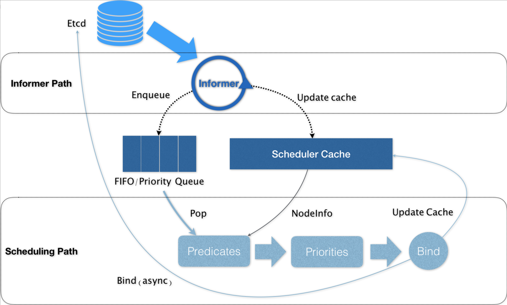
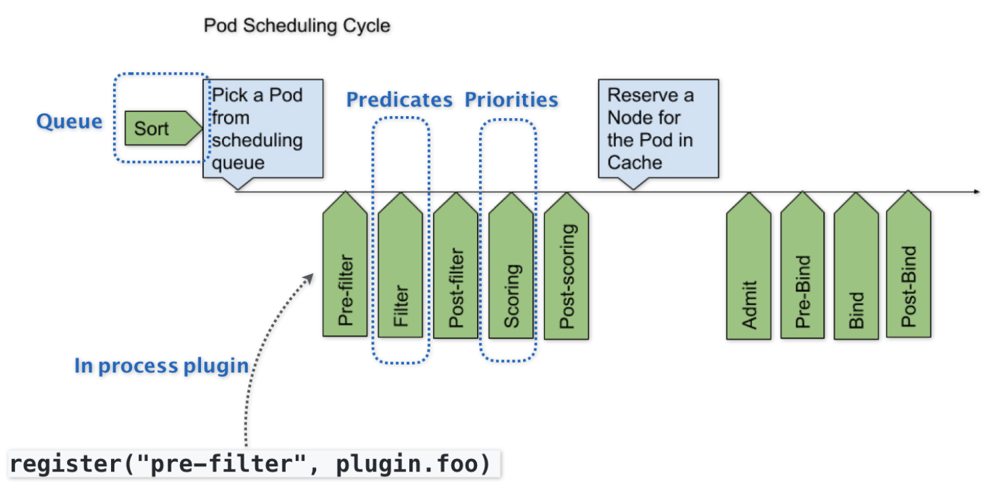

## Kubernetes调度框架

### Kubernetes的资源模型与资源管理

#### Kubernetes的资源模型

在 Kubernetes 里，Pod 是最小的原子调度单位。这也就意味着，所有跟调度和资源管理相关的属性都应该是属于 **Pod 对象的字段**，而这其中最重要的部分，就是 Pod 的 **CPU** 和**内存**配置，如下所示：

```yaml
apiVersion: v1
kind: Pod
metadata:
  name: frontend
spec:
  containers:
  - name: db
    image: mysql
    env:
    - name: MYSQL_ROOT_PASSWORD
      value: "password"
    resources:
      requests:
        memory: "64Mi"
        cpu: "250m"
      limits:
        memory: "128Mi"
        cpu: "500m"
  - name: wp
    image: wordpress
    resources:
      requests:
        memory: "64Mi"
        cpu: "250m"
      limits:
        memory: "128Mi"
        cpu: "500m"
```

在 Kubernetes 中，像 CPU 这样的资源被称作**“可压缩资源”（compressible resources）**。它的典型特点是，当可压缩资源不足时，Pod 只会“饥饿”，但不会退出。

而像内存这样的资源，则被称作“**不可压缩资源（incompressible resources）**。当不可压缩资源不足时，Pod 就会因为 OOM（Out-Of-Memory）被内核杀掉。

由于 Pod 可以由多个 Container 组成，所以 CPU 和内存资源的限额，是要配置在每个 Container 的定义上的。这样，Pod 整体的资源配置，就由这些 Container 的配置值累加得到。


##### CPU的表示方法

Kubernetes 里为 CPU 设置的单位是“CPU 的个数”。比如，cpu=1 指的就是，这个 Pod 的 CPU 限额是 1 个 CPU。当然，具体“1 个 CPU”在宿主机上如何解释，是 1 个 CPU 核心，还是 1 个 vCPU，还是 1 个 CPU 的超线程（Hyperthread），完全取决于宿主机的 CPU 实现方式。Kubernetes 只负责保证 Pod 能够使用到“1 个 CPU”的计算能力。

Kubernetes 允许你将 CPU 限额设置为分数，比如在我们的例子里，**CPU limits 的值就是 500m**。所谓 500m，指的就是 500 millicpu，也就是 0.5 个 CPU 的意思。这样，这个 Pod 就会被分配到 1 个 CPU 一半的计算能力。

```ABAP
可以直接把这个配置写成 cpu=0.5。但在实际使用时，推荐使用 500m 的写法，毕竟这才是 Kubernetes 内部通用的 CPU 表示方式。
```


##### 内存的表示方法

对于内存资源来说，它的单位自然就是 bytes。Kubernetes 支持你使用 Ei、Pi、Ti、Gi、Mi、Ki（或者 E、P、T、G、M、K）的方式来作为 bytes 的值。比如，在我们的例子里，Memory requests 的值就是 64MiB (2 的 26 次方 bytes) 。这里要注意区分 **MiB（mebibyte）**和 **MB（megabyte）**的区别。

```ABAP
备注：1Mi=1024*1024；1M=1000*1000
```


##### Limits 和 Requests

Kubernetes 里 Pod 的 CPU 和内存资源，实际上还要分为 limits 和 requests 两种情况，如下所示：

```css
spec.containers[].resources.limits.cpu
spec.containers[].resources.limits.memory
spec.containers[].resources.requests.cpu
spec.containers[].resources.requests.memory
```

- 在调度的时候，kube-scheduler 只会按照 requests 的值进行计算。
- 在真正设置 Cgroups 限制的时候，kubelet 则会按照 limits 的值来进行设置。


**Kubernetes 这种对 CPU 和内存资源限额的设计，实际上参考了 Borg 论文中对“动态资源边界”的定义**，既：容器化作业在提交时所设置的资源边界，并不一定是调度系统所必须严格遵守的，这是因为在实际场景中，大多数作业使用到的资源其实远小于它所请求的资源限额。

基于这种假设，Borg 在作业被提交后，会主动减小它的资源限额配置，以便容纳更多的作业、提升资源利用率。而当作业资源使用量增加到一定阈值时，Borg 会通过“快速恢复”过程，还原作业原始的资源限额，防止出现异常情况。

而 Kubernetes 的 requests+limits 的做法，其实就是上述思路的一个简化版：**用户在提交 Pod 时，可以声明一个相对较小的 requests 值供调度器使用，而 Kubernetes 真正设置给容器 Cgroups 的，则是相对较大的 limits 值**。不难看到，这跟 Borg 的思路相通的。


#### Kubernetes的QoS模型

在 Kubernetes 中，不同的 requests 和 limits 的设置方式，其实会将这个 Pod 划分到不同的 QoS 级别当中。


##### Guaranteed级别

**当 Pod 里的每一个 Container 都同时设置了 requests 和 limits，并且 requests 和 limits 值相等的时候，这个 Pod 就属于 Guaranteed 类别**，如下所示：

```yaml
apiVersion: v1
kind: Pod
metadata:
  name: qos-demo
  namespace: qos-example
spec:
  containers:
  - name: qos-demo-ctr
    image: nginx
    resources:
      limits:
        memory: "200Mi"
        cpu: "700m"
      requests:
        memory: "200Mi"
        cpu: "700m"
```

当这个 Pod 创建之后，它的 qosClass 字段就会被 Kubernetes 自动设置为 Guaranteed。需要注意的是，**当 Pod 仅设置了 limits 没有设置 requests 的时候，Kubernetes 会自动为它设置与 limits 相同的 requests 值，所以，这也属于 Guaranteed 情况**。


##### Burstable类别

当 Pod 不满足 Guaranteed 的条件，但至少有一个 Container 设置了 requests。那么这个 Pod 就会被划分到 Burstable 类别。比如下面这个例子：

```yaml
apiVersion: v1
kind: Pod
metadata:
  name: qos-demo-2
  namespace: qos-example
spec:
  containers:
  - name: qos-demo-2-ctr
    image: nginx
    resources:
      limits
        memory: "200Mi"
      requests:
        memory: "100Mi"
```


**BestEffort**

**如果一个 Pod 既没有设置 requests，也没有设置 limits，那么它的 QoS 类别就是 BestEffort。**比如下面这个例子

```yaml
apiVersion: v1
kind: Pod
metadata:
  name: qos-demo-3
  namespace: qos-example
spec:
  containers:
  - name: qos-demo-3-ctr
    image: nginx
```


**QoS 划分的主要应用场景，是当宿主机资源紧张的时候，kubelet 对 Pod 进行 Eviction（即资源回收）时需要用到的**

具体地说，当 Kubernetes 所管理的宿主机上不可压缩资源短缺时，就有可能触发 Eviction。比如，可用内存（memory.available）、可用的宿主机磁盘空间（nodefs.available），以及容器运行时镜像存储空间（imagefs.available）等等。

目前，Kubernetes 为你设置的 Eviction 的默认阈值如下所示：

```bash
memory.available<100Mi
nodefs.available<10%
nodefs.inodesFree<5%
imagefs.available<15%
```

当然，上述各个触发条件在 kubelet 里都是可配置的。比如下面这个例子：

```bash
kubelet \
--eviction-hard=imagefs.available<10%,memory.available<500Mi,nodefs.available<5%,nodefs.inodesFree<5% \
--eviction-soft=imagefs.available<30%,nodefs.available<10% \
--eviction-soft-grace-period=imagefs.available=2m,nodefs.available=2m \
--eviction-max-pod-grace-period=600
```

在这个配置中，你可以看到 Eviction 在 Kubernetes 里其实分为 **Soft 和 Hard 两种模式**。

**Soft Eviction** 允许你为 Eviction 过程设置一段“优雅时间”，比如上面例子里的 imagefs.available=2m，就意味着当 imagefs 不足的阈值达到 2 分钟之后，kubelet 才会开始 Eviction 的过程。

**Hard Eviction** 模式下，Eviction 过程就会在阈值达到之后立刻开始。

```ABAP
Kubernetes 计算 Eviction 阈值的数据来源，主要依赖于从 Cgroups 读取到的值，以及使用 cAdvisor 监控到的数据
```

当宿主机的 Eviction 阈值达到后，就会进入 MemoryPressure 或者 DiskPressure 状态，从而避免新的 Pod 被调度到这台宿主机上。


##### Eviction发生时kubele删除Pod的方式

参考这些 Pod 的 QoS 类别了

- 首当其冲的，自然是 **BestEffort** 类别的 Pod
- 其次，是属于 **Burstable** 类别、并且发生“饥饿”的资源使用量已经超出了 requests 的 Pod。
- 最后，才是 **Guaranteed** 类别。并且，Kubernetes 会保证只有当 Guaranteed 类别的 Pod 的资源使用量超过了其 limits 的限制，或者宿主机本身正处于 Memory Pressure 状态时，Guaranteed 的 Pod 才可能被选中进行 Eviction 操作。

对于同 QoS 类别的 Pod 来说，Kubernetes 还会根据 **Pod 的优先级**来进行进一步地排序和选择。


##### cpuset设置

在使用容器的时候，你可以通过设置 cpuset 把容器绑定到某个 CPU 的核上，而不是像 cpushare 那样共享 CPU 的计算能力。

这种情况下，由于操作系统在 CPU 之间进行上下文切换的次数大大减少，容器里应用的性能会得到大幅提升。事实上，**cpuset 方式，是生产环境里部署在线应用类型的 Pod 时，非常常用的一种方式**

**Kubernetes中的实现方式**

- 首先，你的 Pod 必须是 Guaranteed 的 QoS 类型；
- 然后，你只需要将 Pod 的 CPU 资源的 requests 和 limits 设置为同一个相等的整数值即可。

比如下面这个例子

```yaml
spec:
  containers:
  - name: nginx
    image: nginx
    resources:
      limits:
        memory: "200Mi"
        cpu: "2"
      requests:
        memory: "200Mi"
        cpu: "2"
```

这时候，该 Pod 就会被绑定在 2 个独占的 CPU 核上。当然，具体是哪两个 CPU 核，是由 kubelet 为你分配的

```ABAP
烈建议你将 DaemonSet 的 Pod 都设置为 Guaranteed 的 QoS 类型。否则，一旦 DaemonSet 的 Pod 被回收，它又会立即在原宿主机上被重建出来，这就使得前面资源回收的动作，完全没有意义了。
```


### Kubernetes默认调度器

#### Kubernetes的默认调度器default-scheduler

在 Kubernetes 项目中，**默认调度器**的主要职责，就是**为一个新创建出来的 Pod，寻找一个最合适的节点（Node）**。

这里“**最合适**”的含义，包括两层：

- 从集群所有的节点中，根据调度算法挑选出所有可以运行该 Pod 的节点
- 从第一步的结果中，再根据调度算法挑选一个最符合条件的节点作为最终结果

所以在具体的调度流程中，默认调度器会**首先调用一组叫作 Predicate 的调度算法**，来检查每个 Node。然后，**再调用一组叫作 Priority 的调度算法**，来给上一步得到的结果里的每个 Node 打分。最终的调度结果，就是得分最高的那个 Node。

```ABAP
调度器对一个 Pod 调度成功，实际上就是将它的 spec.nodeName 字段填上调度结果的节点名字。
```


在 Kubernetes 中，上述调度机制的工作原理，可以用如下所示的一幅示意图来表示



可以看到，Kubernetes 的调度器的核心，实际上就是**两个相互独立的控制循环**。

**第一个控制循环，我们可以称之为 Informer Path**。它的主要目的，是启动一系列 Informer，用来监听（Watch）Etcd 中 Pod、Node、Service 等与调度相关的 API 对象的变化。比如，当一个待调度 Pod（即：它的 nodeName 字段是空的）被创建出来之后，调度器就会通过 Pod Informer 的 Handler，将这个待调度 Pod 添加进调度队列。

在默认情况下，Kubernetes 的调度队列是一个 **PriorityQueue（优先级队列）**，并且当某些集群信息发生变化的时候，调度器还会对调度队列里的内容进行一些特殊操作。这里的设计，主要是出于调度优先级和抢占的考虑

此外，Kubernetes 的默认调度器还要负责对调度器缓存（即：scheduler cache）进行更新。事实上，Kubernetes 调度部分进行性能优化的一个最根本原则，就是**尽最大可能将集群信息 Cache 化**，以便从根本上提高 Predicate 和 Priority 调度算法的执行效率。


**第二个控制循环，是调度器负责 Pod 调度的主循环，我们可以称之为 Scheduling Path**

Scheduling Path 的主要逻辑，就是不断地从调度队列里出队一个 Pod。然后，调用 **Predicates 算法进行“过滤”**。这一步“过滤”得到的一组 Node，就是所有可以运行这个 Pod 的宿主机列表。当然，Predicates 算法需要的 Node 信息，都是从 Scheduler Cache 里直接拿到的，这是调度器保证算法执行效率的主要手段之一。

下来，调度器就会再调用 **Priorities 算法为上述列表里的 Node 打分**，分数从 0 到 10。得分最高的 Node，就会作为这次调度的结果

调度算法执行完成后，调度器就需要将 Pod 对象的 nodeName 字段的值，修改为上述 Node 的名字。这个步骤在 Kubernetes 里面被称作 **Bind**。

但是，为了不在关键调度路径里远程访问 APIServer，Kubernetes 的默认调度器在 Bind 阶段，只会更新 Scheduler Cache 里的 Pod 和 Node 的信息。**这种基于“乐观”假设的 API 对象更新方式，在 Kubernetes 里被称作 Assume。**

Assume 之后，调度器才会创建一个 Goroutine 来异步地向 APIServer 发起更新 Pod 的请求，来真正完成 Bind 操作。如果这次异步的 Bind 过程失败了，其实也没有太大关系，等 Scheduler Cache 同步之后一切就会恢复正常

当然，正是由于上述 Kubernetes 调度器的“乐观”绑定的设计，当一个新的 Pod 完成调度需要在某个节点上运行起来之前，该节点上的 kubelet 还会通过一个叫作 **Admit** 的操作来再次验证该 Pod 是否确实能够运行在该节点上。这一步 Admit 操作，实际上就是把一组叫作 GeneralPredicates 的、最基本的调度算法，比如：“资源是否可用”“端口是否冲突”等再执行一遍，作为 **kubelet 端的二次确认**。

**除了上述的“Cache 化”和“乐观绑定”，Kubernetes 默认调度器还有一个重要的设计，那就是“无锁化”。**

在 Scheduling Path 上，调度器会启动多个 Goroutine 以节点为粒度并发执行 Predicates 算法，从而提高这一阶段的执行效率。而与之类似的，Priorities 算法也会以 MapReduce 的方式并行计算然后再进行汇总。而在这些所有需要并发的路径上，调度器会避免设置任何全局的竞争资源，从而免去了使用锁进行同步带来的巨大的性能损耗。 

所以，在这种思想的指导下，如果你再去查看一下前面的调度器原理图，你就会发现，Kubernetes 调度器只有对调度队列和 Scheduler Cache 进行操作时，才需要加锁。而这两部分操作，都不在 Scheduling Path 的算法执行路径上。

Kubernetes 调度器的上述设计思想，也是在集群规模不断增长的演进过程中逐步实现的**。尤其是 “Cache 化”，这个变化其实是最近几年 Kubernetes 调度器性能得以提升的一个关键演化。**


#### Scheduler的可扩展性

随着 Kubernetes 项目发展到今天，它的默认调度器也已经来到了一个关键的十字路口。事实上，Kubernetes 现今发展的主旋律，是整个开源项目的“民主化”。也就是说，Kubernetes 下一步发展的方向，是组件的轻量化、接口化和插件化。所以，我们才有了 CRI、CNI、CSI、CRD、Aggregated APIServer、Initializer、Device Plugin 等各个层级的可扩展能力。可是，默认调度器，却成了 Kubernetes 项目里最后一个没有对外暴露出良好定义过的、可扩展接口的组件。

而现在，随着 Kubernetes 项目逐步趋于稳定，越来越多的用户开始把 Kubernetes 用在规模更大、业务更加复杂的私有集群当中。很多以前的 Mesos 用户，也开始尝试使用 Kubernetes 来替代其原有架构。在这些场景下，对默认调度器进行扩展和重新实现，就成了社区对 Kubernetes 项目最主要的一个诉求。

所以，Kubernetes 的默认调度器，是目前这个项目里为数不多的、正在经历大量重构的核心组件之一。这些正在进行的重构的目的，一方面是将默认调度器里大量的“技术债”清理干净；另一方面，就是为默认调度器的可扩展性设计进行铺垫。

而 Kubernetes 默认调度器的可扩展性设计，可以用如下所示的一幅示意图来描述：



默认调度器的可扩展机制，在 Kubernetes 里面叫作 Scheduler Framework。顾名思义，这个设计的主要目的，就是在调度器生命周期的各个关键点上，为用户暴露出可以进行扩展和实现的接口，从而实现由用户自定义调度器的能力。

上图中，每一个绿色的箭头都是一个可以插入自定义逻辑的接口。比如，上面的 Queue 部分，就意味着你可以在这一部分提供一个自己的调度队列的实现，从而控制每个 Pod 开始被调度（出队）的时机。

而 Predicates 部分，则意味着你可以提供自己的过滤算法实现，根据自己的需求，来决定选择哪些机器。

```ABAP
需要注意的是，上述这些可插拔式逻辑，都是标准的 Go 语言插件机制（Go plugin 机制），也就是说，你需要在编译的时候选择把哪些插件编译进去。
```

了上述设计之后，扩展和自定义 Kubernetes 的默认调度器就变成了一件非常容易实现的事情。这也意味着默认调度器在后面的发展过程中，必然不会在现在的实现上再添加太多的功能，反而还会对现在的实现进行精简，最终成为 Scheduler Framework 的一个最小实现。而调度领域更多的创新和工程工作，就可以交给整个社区来完成了。这个思路，是完全符合我在前面提到的 Kubernetes 的“民主化”设计的。


### Kubernetes默认调度器调度策略解析

#### Predicates阶段

**Predicates 在调度过程中的作用，可以理解为 Filter**，即：它按照调度策略，从当前集群的所有节点中，“过滤”出一系列符合条件的节点。这些节点，都是可以运行待调度 Pod 的宿主机。

**predicates执行具体过滤操作的是一组预选插件（plugin）**

**几个重要的Predicate说明**

- **PodFitsHostPorts**
  - 检查Pod的各Containers中声明的Ports是否已经被节点上现有的Pod所占用
- **MatchNodeSelector**
  - 检查Pod的`spec.affinity.nodeAffinity`和spec.nodeSelector的定义是否通节点的标签相匹配
- **PodFitsResources**
  - 检查Pod的资源需求是否能被节点上的可用资源量所满足
- **PodToleratesNodeTaints**
  - 检查Pod是否能容忍节点上的污点
- **MaxCSIVolumeCount**
  - 检查Pod依赖的由某CSI插件的提供的PVC，是否超过节点的单机上限
- **MatchInterPodAffinity**
  - 检查Pod间的亲和和反亲和定义是否得到满足
- **EvenPodsSpread**
  - 为一组Pod设定在指定ToplolgyKey上的散置要求，即打散一组Pod至不同的拓扑位置


在 Kubernetes 中，默认的调度策略有如下四种

1️⃣ **第一种类型，叫作 GeneralPredicates**

顾名思义，这一组过滤规则，负责的是最基础的调度策略。比如，PodFitsResources 计算的就是宿主机的 CPU 和内存资源等是否够用。

**PodFitsResources** 检查的只是 Pod 的 requests 字段。需要注意的是，**Kubernetes 的调度器并没有为 GPU 等硬件资源定义具体的资源类型，而是统一用一种名叫 Extended Resource 的、Key-Value 格式的扩展字段来描述的**。比如下面这个例子：

```yaml
apiVersion: v1
kind: Pod
metadata:
  name: extended-resource-demo
spec:
  containers:
  - name: extended-resource-demo-ctr
    image: nginx
    resources:
      requests:
        alpha.kubernetes.io/nvidia-gpu: 2
      limits:
        alpha.kubernetes.io/nvidia-gpu: 2
```

可以看到，我们这个 Pod 通过alpha.kubernetes.io/nvidia-gpu=2这样的定义方式，声明使用了两个 NVIDIA 类型的 GPU。

在 PodFitsResources 里面，调度器其实并不知道这个字段 Key 的含义是 GPU，而是直接使用后面的 Value 进行计算。当然，在 Node 的 Capacity 字段里，你也得相应地加上这台宿主机上 GPU 的总数，比如：alpha.kubernetes.io/nvidia-gpu=4。这些流程，在后面讲解 Device Plugin 的时候会详细介绍。

而 **PodFitsHost** 检查的是，宿主机的名字是否跟 Pod 的 spec.nodeName 一致。

**PodFitsHostPorts** 检查的是，Pod 申请的宿主机端口（spec.nodePort）是不是跟已经被使用的端口有冲突。

**PodMatchNodeSelector** 检查的是，Pod 的 nodeSelector 或者 nodeAffinity 指定的节点，是否与待考察节点匹配，等等

可以看到，像上面这样一组 GeneralPredicates，正是 Kubernetes 考察一个 Pod 能不能运行在一个 Node 上最基本的过滤条件。所以，GeneralPredicates 也会被其他组件（比如 kubelet）直接调用。

**之前已经提到过，kubelet 在启动 Pod 前，会执行一个 Admit 操作来进行二次确认。这里二次确认的规则，就是执行一遍 GeneralPredicates。**


2️⃣ **第二种类型，是与 Volume 相关的过滤规则**。

这一组过滤规则，负责的是跟容器持久化 Volume 相关的调度策略

其中，**NoDiskConflict** 检查的条件，是多个 Pod 声明挂载的持久化 Volume 是否有冲突。比如，AWS EBS 类型的 Volume，是不允许被两个 Pod 同时使用的。所以，当一个名叫 A 的 EBS Volume 已经被挂载在了某个节点上时，另一个同样声明使用这个 A Volume 的 Pod，就不能被调度到这个节点上了。

而 **MaxPDVolumeCountPredicate** 检查的条件，则是一个节点上某种类型的持久化 Volume 是不是已经超过了一定数目，如果是的话，那么声明使用该类型持久化 Volume 的 Pod 就不能再调度到这个节点了

而 **VolumeZonePredicate**，则是检查持久化 Volume 的 Zone（高可用域）标签，是否与待考察节点的 Zone 标签相匹配

此外，这里还有一个叫作 **VolumeBindingPredicate** 的规则。它负责检查的，是该 Pod 对应的 PV 的 nodeAffinity 字段，是否跟某个节点的标签相匹配

Local Persistent Volume（本地持久化卷），必须使用 nodeAffinity 来跟某个具体的节点绑定。这其实也就意味着，在 Predicates 阶段，Kubernetes 就必须能够根据 Pod 的 Volume 属性来进行调度。

此外，如果该 Pod 的 PVC 还没有跟具体的 PV 绑定的话，调度器还要负责检查所有待绑定 PV，当有可用的 PV 存在并且该 PV 的 nodeAffinity 与待考察节点一致时，这条规则才会返回“成功”。比如下面这个例子：

```yaml
apiVersion: v1
kind: PersistentVolume
metadata:
  name: example-local-pv
spec:
  capacity:
    storage: 500Gi
  accessModes:
  - ReadWriteOnce
  persistentVolumeReclaimPolicy: Retain
  storageClassName: local-storage
  local:
    path: /mnt/disks/vol1
  nodeAffinity:
    required:
      nodeSelectorTerms:
      - matchExpressions:
        - key: kubernetes.io/hostname
          operator: In
          values:
          - my-node
```

可以看到，这个 PV 对应的持久化目录，只会出现在名叫 my-node 的宿主机上。所以，任何一个通过 PVC 使用这个 PV 的 Pod，都必须被调度到 my-node 上才可以正常工作。VolumeBindingPredicate，正是调度器里完成这个决策的位置。


3️⃣ **第三种类型，是宿主机相关的过滤规则。**

这一组规则，主要考察待调度 Pod 是否满足 Node 本身的某些条件

比如，**PodToleratesNodeTaints**，负责检查的就是我们前面经常用到的 Node 的“污点”机制。只有当 Pod 的 **Toleration** 字段与 Node 的 **Taint** 字段能够匹配的时候，这个 Pod 才能被调度到该节点上

而 **NodeMemoryPressurePredicate**，检查的是当前节点的内存是不是已经不够充足，如果是的话，那么待调度 Pod 就不能被调度到该节点上。


4️⃣ **第四种类型，是 Pod 相关的过滤规则。**

这一组规则，跟 GeneralPredicates 大多数是重合的。而比较特殊的，是 **PodAffinityPredicate**。这个规则的作用，是**检查待调度 Pod 与 Node 上的已有 Pod 之间的亲密（affinity）和反亲密（anti-affinity）关系**。比如下面这个例子：

```yaml
apiVersion: v1
kind: Pod
metadata:
  name: with-pod-antiaffinity
spec:
  affinity:
    podAntiAffinity: 
      requiredDuringSchedulingIgnoredDuringExecution: 
      - weight: 100  
        podAffinityTerm:
          labelSelector:
            matchExpressions:
            - key: security 
              operator: In 
              values:
              - S2
          topologyKey: kubernetes.io/hostname
  containers:
  - name: with-pod-affinity
    image: docker.io/ocpqe/hello-pod
```

这个例子里的 **podAntiAffinity 规则**，就指定了这个 Pod 不希望跟任何携带了 security=S2 标签的 Pod 存在于同一个 Node 上。需要注意的是，PodAffinityPredicate 是有作用域的，比如上面这条规则，就仅对携带了 Key 是kubernetes.io/hostname标签的 Node 有效。这正是 topologyKey 这个关键词的作用

**而与 podAntiAffinity 相反的，就是 podAffinity，比如下面这个例子**

```yaml
apiVersion: v1
kind: Pod
metadata:
  name: with-pod-affinity
spec:
  affinity:
    podAffinity: 
      requiredDuringSchedulingIgnoredDuringExecution: 
      - labelSelector:
          matchExpressions:
          - key: security 
            operator: In 
            values:
            - S1 
        topologyKey: failure-domain.beta.kubernetes.io/zone
  containers:
  - name: with-pod-affinity
    image: docker.io/ocpqe/hello-pod
```

这个例子里的 Pod，就只会被调度到已经有携带了 security=S1 标签的 Pod 运行的 Node 上。而这条规则的作用域，则是所有携带 Key 是failure-domain.beta.kubernetes.io/zone标签的 Node

此外，上面这两个例子里的 **requiredDuringSchedulingIgnoredDuringExecution** 字段的含义是：这条规则必须在 Pod 调度时进行检查（requiredDuringScheduling）；但是如果是已经在运行的 Pod 发生变化，比如 Label 被修改，造成了该 Pod 不再适合运行在这个 Node 上的时候，Kubernetes 不会进行主动修正（IgnoredDuringExecution）。

上面这四种类型的 Predicates，就构成了调度器确定一个 Node 可以运行待调度 Pod 的基本策略。

```ABAP
在具体执行的时候， 当开始调度一个 Pod 时，Kubernetes 调度器会同时启动 16 个 Goroutine，来并发地为集群里的所有 Node 计算 Predicates，最后返回可以运行这个 Pod 的宿主机列表。
```

需要注意的是，在为每个 Node 执行 Predicates 时，调度器会按照固定的顺序来进行检查。这个顺序，是按照 Predicates 本身的含义来确定的。比如，宿主机相关的 Predicates 会被放在相对靠前的位置进行检查。要不然的话，在一台资源已经严重不足的宿主机上，上来就开始计算 PodAffinityPredicate，是没有实际意义的。


#### **Priorities阶段**

在 Predicates 阶段完成了节点的“过滤”之后，Priorities 阶段的工作就是为这些节点打分。这里打分的范围是 0-10 分，得分最高的节点就是最后被 Pod 绑定的最佳节点。

**Priorities经典优选算法的分类**

- **节点资源分配倾向**
  - **BalancedResourceAllocation**
  - **LeastRequestedPriority/MostRequestedPriority**
  - **ResourceLimitsPriority**
  - **RequestedToCapacityRatioPriority**
- **Pod散置**
  - **SelectorSpreadPriority**
  - **EvenPodsSpreadPriority**
  - **ServiceSpreadingPriority**
- **Node亲和与反亲和**
  - **NodeAffinityPriority、NodePreferSpreadPriority**
  - **TaintTolerationPriority**
  - **ImageLocalityPriority**
- **Pod间的亲和与反亲和**
  - **InterPodAffinityPriority**


Priorities 里最常用到的一个打分规则，是 **LeastRequestedPriority**。它的计算方法，可以简单地总结为如下所示的公式：

```ABAP
score = (cpu((capacity-sum(requested))10/capacity) + memory((capacity-sum(requested))10/capacity))/2
```

可以看到，这个算法实际上就是在选择空闲资源（CPU 和 Memory）最多的宿主机。

而与 **LeastRequestedPriority** 一起发挥作用的，还有 **BalancedResourceAllocation**。它的计算公式如下所示：

```ABAP
score = 10 - variance(cpuFraction,memoryFraction,volumeFraction)*10
```

中，每种资源的 Fraction 的定义是 ：Pod 请求的资源 / 节点上的可用资源。而 variance 算法的作用，则是计算每两种资源 Fraction 之间的“距离”。而最后选择的，则是资源 Fraction 差距最小的节点。

所以说，**BalancedResourceAllocation** 选择的，其实是调度完成后，所有节点里各种资源分配最均衡的那个节点，从而避免一个节点上 CPU 被大量分配、而 Memory 大量剩余的情况。

此外，还有 **NodeAffinityPriority**、**TaintTolerationPriority** 和 **InterPodAffinityPriority** 这三种 Priority。顾名思义，它们与前面的 **PodMatchNodeSelector**、**PodToleratesNodeTaints** 和 **PodAffinityPredicate** 这三个 Predicate 的含义和计算方法是类似的。但是作为 Priority，一个 Node 满足上述规则的字段数目越多，它的得分就会越高。

在默认 Priorities 里，还有一个叫作 **ImageLocalityPriority** 的策略。它是在 Kubernetes v1.12 里新开启的调度规则，即：如果待调度 Pod 需要使用的镜像很大，并且已经存在于某些 Node 上，那么这些 Node 的得分就会比较高

当然，为了避免这个算法引发调度堆叠，调度器在计算得分的时候还会根据镜像的分布进行优化，即：如果大镜像分布的节点数目很少，那么这些节点的权重就会被调低，从而“对冲”掉引起调度堆叠的风险。


以上，就是 Kubernetes 调度器的 Predicates 和 Priorities 里默认调度规则的主要工作原理了。

```ABAP
在实际的执行过程中，调度器里关于集群和 Pod 的信息都已经缓存化，所以这些算法的执行过程还是比较快的
```


### Kubernetes默认调度器的优先级和抢占机制

首先需要明确的是，优先级和抢占机制，解决的是 **Pod 调度失败时该怎么办的问题**。

正常情况下，当一个 Pod 调度失败后，它就会被暂时“搁置”起来，直到 Pod 被更新，或者集群状态发生变化，调度器才会对这个 Pod 进行重新调度。

但在有时候，我们希望的是这样一个场景。当一个高优先级的 Pod 调度失败后，该 Pod 并不会被“搁置”，而是会“挤走”某个 Node 上的一些低优先级的 Pod 。这样就可以保证这个高优先级 Pod 的调度成功。这个特性，其实也是一直以来就存在于 Borg 以及 Mesos 等项目里的一个基本功能。

在 Kubernetes 里，优先级和抢占机制是在 1.10 版本后才逐步可用的。要使用这个机制，你首先需要在 Kubernetes 里提交一个 **PriorityClass** 的定义，如下所示：

```yaml
apiVersion: scheduling.k8s.io/v1beta1
kind: PriorityClass
metadata:
  name: high-priority
value: 1000000
globalDefault: false
description: "This priority class should be used for high priority service pods only."
```

上面这个 YAML 文件，定义的是一个名叫 high-priority 的 PriorityClass，其中 value 的值是 1000000 （一百万）

**Kubernetes 规定，优先级是一个 32 bit 的整数，最大值不超过 1000000000（10 亿，1 billion），并且值越大代表优先级越高**。而超出 10 亿的值，其实是被 Kubernetes 保留下来分配给系统 Pod 使用的。显然，这样做的目的，就是保证系统 Pod 不会被用户抢占掉。

而一旦上述 YAML 文件里的 **globalDefault 被设置为 true 的话**，**那就意味着这个 PriorityClass 的值会成为系统的默认值**。而如果这个值是 false，就表示我们只希望声明使用该 PriorityClass 的 Pod 拥有值为 1000000 的优先级，而对于没有声明 PriorityClass 的 Pod 来说，它们的优先级就是 0。

在创建了 PriorityClass 对象之后，Pod 就可以声明使用它了，如下所示：

```yaml
apiVersion: v1
kind: Pod
metadata:
  name: nginx
  labels:
    env: test
spec:
  containers:
  - name: nginx
    image: nginx
    imagePullPolicy: IfNotPresent
  priorityClassName: high-priority
```

可以看到，这个 Pod 通过 priorityClassName 字段，声明了要使用名叫 high-priority 的 PriorityClass。当这个 Pod 被提交给 Kubernetes 之后，Kubernetes 的 PriorityAdmissionController 就会自动将这个 Pod 的 spec.priority 字段设置为 1000000。

前文讲过，调度器里维护着一个调度队列。所以，当 Pod 拥有了优先级之后，高优先级的 Pod 就可能会比低优先级的 Pod 提前出队，从而尽早完成调度过程。这个过程，就是“优先级”这个概念在 Kubernetes 里的主要体现。

```ABAP
当一个高优先级的 Pod 调度失败的时候，调度器的抢占能力就会被触发。这时，调度器就会试图从当前集群里寻找一个节点，使得当这个节点上的一个或者多个低优先级 Pod 被删除后，待调度的高优先级 Pod 就可以被调度到这个节点上。这个过程，就是“抢占”这个概念在 Kubernetes 里的主要体现
```

为了方便叙述，我接下来会把待调度的高优先级 Pod 称为“抢占者”（Preemptor）。

当上述抢占过程发生时，抢占者并不会立刻被调度到被抢占的 Node 上。事实上，调度器只会将抢占者的 spec.nominatedNodeName 字段，设置为被抢占的 Node 的名字。然后，抢占者会重新进入下一个调度周期，然后在新的调度周期里来决定是不是要运行在被抢占的节点上。这当然也就意味着，即使在下一个调度周期，调度器也不会保证抢占者一定会运行在被抢占的节点上。

这样设计的一个重要原因是，调度器只会通过标准的 DELETE API 来删除被抢占的 Pod，所以，这些 Pod 必然是有一定的“优雅退出”时间（默认是 30s）的。而在这段时间里，其他的节点也是有可能变成可调度的，或者直接有新的节点被添加到这个集群中来。所以，鉴于优雅退出期间，集群的可调度性可能会发生的变化，**把抢占者交给下一个调度周期再处理，是一个非常合理的选择。**

而在抢占者等待被调度的过程中，如果有其他更高优先级的 Pod 也要抢占同一个节点，那么调度器就会清空原抢占者的 spec.nominatedNodeName 字段，从而允许更高优先级的抢占者执行抢占，并且，这也就使得原抢占者本身，也有机会去重新抢占其他节点。这些，都是设置 **nominatedNodeName** 字段的主要目的


#### Kubernetes调度器里的抢占机制

抢占发生的原因，一定是一个高优先级的 Pod 调度失败。这一次，我们还是称这个 Pod 为“抢占者”，称被抢占的 Pod 为“牺牲者”（victims）。

而 Kubernetes 调度器实现抢占算法的一个最重要的设计，就是在调度队列的实现里，使用了**两个不同的队列。**

**第一个队列，叫作 activeQ**。凡是在 activeQ 里的 Pod，都是下一个调度周期需要调度的对象。所以，当你在 Kubernetes 集群里新创建一个 Pod 的时候，调度器会将这个 Pod 入队到 activeQ 里面。而我在前面提到过的、调度器不断从队列里出队（Pop）一个 Pod 进行调度，实际上都是从 activeQ 里出队的。

**第二个队列，叫作 unschedulableQ**，专门用来存放调度失败的 Pod

而这里的一个关键点就在于，当一个 unschedulableQ 里的 Pod 被更新之后，调度器会自动把这个 Pod 移动到 activeQ 里，从而给这些调度失败的 Pod “重新做人”的机会。

现在，回到我们的抢占者调度失败这个时间点上来。

调度失败之后，抢占者就会被放进 unschedulableQ 里面

然后，这次失败事件就会触发调度器为抢占者寻找牺牲者的流程。

**第一步**，调度器会检查这次失败事件的原因，来确认抢占是不是可以帮助抢占者找到一个新节点。这是因为有很多 Predicates 的失败是不能通过抢占来解决的。比如，PodFitsHost 算法（负责的是，检查 Pod 的 nodeSelector 与 Node 的名字是否匹配），这种情况下，除非 Node 的名字发生变化，否则你即使删除再多的 Pod，抢占者也不可能调度成功。

**第二步**，如果确定抢占可以发生，那么调度器就会把自己缓存的所有节点信息复制一份，然后使用这个副本来模拟抢占过程

这里的抢占过程很容易理解。调度器会检查缓存副本里的每一个节点，然后从该节点上最低优先级的 Pod 开始，逐一“删除”这些 Pod。而每删除一个低优先级 Pod，调度器都会检查一下抢占者是否能够运行在该 Node 上。一旦可以运行，调度器就记录下这个 Node 的名字和被删除 Pod 的列表，这就是一次抢占过程的结果了。

当遍历完所有的节点之后，调度器会在上述模拟产生的所有抢占结果里做一个选择，找出最佳结果。而这一步的判断原则，就是尽量减少抢占对整个系统的影响。比如，需要抢占的 Pod 越少越好，需要抢占的 Pod 的优先级越低越好，等等。

**在得到了最佳的抢占结果之后，这个结果里的 Node，就是即将被抢占的 Node；被删除的 Pod 列表，就是牺牲者。所以接下来，调度器就可以真正开始抢占的操作了，这个过程，可以分为三步。**

**第一步**，调度器会检查牺牲者列表，清理这些 Pod 所携带的 nominatedNodeName 字段。

**第二步**，调度器会把抢占者的 nominatedNodeName，设置为被抢占的 Node 的名字。

**第三步**，调度器会开启一个 Goroutine，同步地删除牺牲者。

而第二步对抢占者 Pod 的更新操作，就会触发到我前面提到的“重新做人”的流程，从而让抢占者在下一个调度周期重新进入调度流程。

所以接下来，调度器就会通过正常的调度流程把抢占者调度成功。这也是为什么，我前面会说调度器并不保证抢占的结果：在这个正常的调度流程里，是一切皆有可能的。

不过，对于任意一个待调度 Pod 来说，因为有上述抢占者的存在，它的调度过程，其实是有一些特殊情况需要特殊处理的

具体来说，在为某一对 Pod 和 Node 执行 Predicates 算法的时候，如果待检查的 Node 是一个即将被抢占的节点，即：调度队列里有 nominatedNodeName 字段值是该 Node 名字的 Pod 存在（可以称之为：“潜在的抢占者”）。那么，调度器就会对这个 Node ，将同样的 Predicates 算法运行两遍。

**第一遍**， 调度器会假设上述“潜在的抢占者”已经运行在这个节点上，然后执行 Predicates 算法

第二遍， 调度器会正常执行 Predicates 算法，即：不考虑任何“潜在的抢占者”

而只有这两遍 Predicates 算法都能通过时，这个 Pod 和 Node 才会被认为是可以绑定（bind）的。

不难想到，这里需要执行第一遍 Predicates 算法的原因，是由于 **InterPodAntiAffinity** 规则的存在。


### Kubernetes-GPU管理与Device-Plugin机制

对于云的用户来说，在 GPU 的支持上，他们最基本的诉求其实非常简单：我只要在 Pod 的 YAML 里面，声明某容器需要的 GPU 个数，那么 Kubernetes 为我创建的容器里就应该出现对应的 GPU 设备，以及它对应的驱动目录。

以 NVIDIA 的 GPU 设备为例，上面的需求就意味着当用户的容器被创建之后，这个容器里必须出现如下两部分设备和目录：

1. GPU 设备，比如 /dev/nvidia0；

2. GPU 驱动目录，比如 /usr/local/nvidia/*。

其中，GPU 设备路径，正是该容器启动时的 Devices 参数；而驱动目录，则是该容器启动时的 Volume 参数。所以，在 Kubernetes 的 GPU 支持的实现里，kubelet 实际上就是将上述两部分内容，设置在了创建该容器的 CRI （Container Runtime Interface）参数里面。这样，等到该容器启动之后，对应的容器里就会出现 GPU 设备和驱动的路径了。

不过，Kubernetes 在 Pod 的 API 对象里，并没有为 GPU 专门设置一个资源类型字段，而是使用了一种叫作 **Extended Resource（ER）**的特殊字段来负责传递 GPU 的信息。比如下面这个例子

```yaml
apiVersion: v1
kind: Pod
metadata:
  name: cuda-vector-add
spec:
  restartPolicy: OnFailure
  containers:
    - name: cuda-vector-add
      image: "k8s.gcr.io/cuda-vector-add:v0.1"
      resources:
        limits:
          nvidia.com/gpu: 1
```

可以看到，在上述 Pod 的 limits 字段里，这个资源的名称是nvidia.com/gpu，它的值是 1。也就是说，这个 Pod 声明了自己要使用一个 NVIDIA 类型的 GPU。

而在 kube-scheduler 里面，它其实并不关心这个字段的具体含义，只会在计算的时候，一律将调度器里保存的该类型资源的可用量，直接减去 Pod 声明的数值即可。所以说，Extended Resource，其实是 Kubernetes 为用户设置的一种对自定义资源的支持。

当然，为了能够让调度器知道这个自定义类型的资源在每台宿主机上的可用量，宿主机节点本身，就必须能够向 API Server 汇报该类型资源的可用数量。在 Kubernetes 里，各种类型的资源可用量，其实是 Node 对象 Status 字段的内容，比如下面这个例子：

```yaml
apiVersion: v1
kind: Node
metadata:
  name: node-1
...
Status:
  Capacity:
   cpu:  2
   memory:  2049008Ki
```

而为了能够在上述 Status 字段里添加自定义资源的数据，你就必须使用 PATCH API 来对该 Node 对象进行更新，加上你的自定义资源的数量。这个 PATCH 操作，可以简单地使用 curl 命令来发起，如下所示：

```bash
# 启动 Kubernetes 的客户端 proxy，这样你就可以直接使用 curl 来跟 Kubernetes  的API Server 进行交互了
$ kubectl proxy

# 执行 PACTH 操作
$ curl --header "Content-Type: application/json-patch+json" \
--request PATCH \
--data '[{"op": "add", "path": "/status/capacity/nvidia.com/gpu", "value": "1"}]' \
http://localhost:8001/api/v1/nodes/<your-node-name>/status
```

PATCH 操作完成后，你就可以看到 Node 的 Status 变成了如下所示的内容

```yaml
apiVersion: v1
kind: Node
...
Status:
  Capacity:
   cpu:  2
   memory:  2049008Ki
   nvidia.com/gpu: 1
```

这样在调度器里，它就能够在缓存里记录下 node-1 上的nvidia.com/gpu类型的资源的数量是 1。

当然，在 Kubernetes 的 GPU 支持方案里，你并不需要真正去做上述关于 Extended Resource 的这些操作。在 Kubernetes 中，对所有硬件加速设备进行管理的功能，都是由一种叫作 **Device Plugin** 的插件来负责的。这其中，当然也就包括了对该硬件的 **Extended Resource** 进行汇报的逻辑。

Kubernetes 的 Device Plugin 机制，我可以用如下所示的一幅示意图来和你解释清楚。


我们先从这幅示意图的右侧开始看起。

首先，对于每一种硬件设备，都需要有它所对应的 Device Plugin 进行管理，这些 Device Plugin，都通过 gRPC 的方式，同 kubelet 连接起来。以 NVIDIA GPU 为例，它对应的插件叫作**NVIDIA GPU device plugin**。

这个 Device Plugin 会通过一个叫作 ListAndWatch 的 API，定期向 kubelet 汇报该 Node 上 GPU 的列表。比如，在我们的例子里，一共有三个 GPU（GPU0、GPU1 和 GPU2）。这样，kubelet 在拿到这个列表之后，就可以直接在它向 APIServer 发送的心跳里，以 Extended Resource 的方式，加上这些 GPU 的数量，比如nvidia.com/gpu=3。所以说，用户在这里是不需要关心 GPU 信息向上的汇报流程的。

需要注意的是，**ListAndWatch 向上汇报的信息，只有本机上 GPU 的 ID 列表，而不会有任何关于 GPU 设备本身的信息**。而且 kubelet 在向 API Server 汇报的时候，只会汇报该 GPU 对应的 Extended Resource 的数量。当然，kubelet 本身，会将这个 GPU 的 ID 列表保存在自己的内存里，并通过 ListAndWatch API 定时更新。

而当一个 Pod 想要使用一个 GPU 的时候，它只需要像我在本文一开始给出的例子一样，在 Pod 的 limits 字段声明nvidia.com/gpu: 1。那么接下来，Kubernetes 的调度器就会从它的缓存里，寻找 GPU 数量满足条件的 Node，然后将缓存里的 GPU 数量减 1，完成 Pod 与 Node 的绑定。

这个调度成功后的 Pod 信息，自然就会被对应的 kubelet 拿来进行容器操作。而当 kubelet 发现这个 Pod 的容器请求一个 GPU 的时候，kubelet 就会从自己持有的 GPU 列表里，为这个容器分配一个 GPU。此时，kubelet 就会向本机的 Device Plugin 发起一个 Allocate() 请求。这个请求携带的参数，正是即将分配给该容器的设备 ID 列表。

当 Device Plugin 收到 Allocate 请求之后，它就会根据 kubelet 传递过来的设备 ID，从 Device Plugin 里找到这些设备对应的设备路径和驱动目录。当然，这些信息，正是 **Device Plugin 周期性的从本机查询到的。比如，在 NVIDIA Device Plugin 的实现里，它会定期访问 nvidia-docker 插件，从而获取到本机的 GPU 信息**

而被分配 GPU 对应的设备路径和驱动目录信息被返回给 kubelet 之后，kubelet 就完成了为一个容器分配 GPU 的操作。接下来，kubelet 会把这些信息追加在创建该容器所对应的 CRI 请求当中。这样，当这个 CRI 请求发给 Docker 之后，Docker 为你创建出来的容器里，就会出现这个 GPU 设备，并把它所需要的驱动目录挂载进去。

至此，Kubernetes 为一个 Pod 分配一个 GPU 的流程就完成了。

对于其他类型硬件来说，要想在 Kubernetes 所管理的容器里使用这些硬件的话，也需要遵循上述 Device Plugin 的流程来实现如下所示的 Allocate 和 ListAndWatch API：

```go
  service DevicePlugin {
        // ListAndWatch returns a stream of List of Devices
        // Whenever a Device state change or a Device disappears, ListAndWatch
        // returns the new list
        rpc ListAndWatch(Empty) returns (stream ListAndWatchResponse) {}
        // Allocate is called during container creation so that the Device
        // Plugin can run device specific operations and instruct Kubelet
        // of the steps to make the Device available in the container
        rpc Allocate(AllocateRequest) returns (AllocateResponse) {}
  }
```

目前，Kubernetes 社区里已经实现了很多硬件插件，比如FPGA、SRIOV、RDMA等等。感兴趣的话，你可以点击这些链接来查看这些 Device Plugin 的实现。


#### Kubernetes管理GPU应用

官方说明

```http
https://devblogs.nvidia.com/gpu-containers-runtime/
https://www.cnblogs.com/breezey/p/11801122.html
https://www.jianshu.com/p/8b84c597ce03
https://github.com/NVIDIA/nvidia-docker
https://github.com/NVIDIA/nvidia-container-runtime
https://github.com/NVIDIA/k8s-device-plugin
```


**在kubernetes中使用GPU资源**

安装步骤

1️⃣ **节点安装NVIDIA驱动**

```bash
rpm --import https://www.elrepo.org/RPM-GPG-KEY-elrepo.org
rpm -Uvh http://www.elrepo.org/elrepo-release-7.0-3.el7.elrepo.noarch.rpm
yum install -y kmod-nvidia

验证
# nvidia-smi 
```

2️⃣ **安装nvidia-docker2 # 注意不是nvidia-container-toolkit**

```bash
distribution=$(. /etc/os-release;echo $ID$VERSION_ID)
curl -s -L https://nvidia.github.io/nvidia-docker/$distribution/nvidia-docker.repo | sudo tee /etc/yum.repos.d/nvidia-docker.repo

yum install -y nvidia-docker2

pkill -SIGHUP dockerd
```

**3️⃣ 修改docker配置文件**

```bash
# vim /etc/docker/daemon.json
{
    "default-runtime": "nvidia",
    "runtimes": {
        "nvidia": {
            "path": "/usr/bin/nvidia-container-runtime",
            "runtimeArgs": []
        }
}

# systemctl restart docker
```

4️⃣ **安装Nvidia-device-plugin插件**

```bash
kubectl create -f https://raw.githubusercontent.com/NVIDIA/k8s-device-plugin/1.0.0-beta4/nvidia-device-plugin.yml
# URL https://github.com/NVIDIA/k8s-device-plugin

验证安装
# kubectl get pod -n kube-system |grep nvidia
nvidia-device-plugin-daemonset-76gm6            1/1     Running   2          20d
```

5️⃣ **验证node是否成功识别gpu资源**

```bash
kubectl describe node nodeName
```

多个pod共享一张GPU

- 不行，pod在创建的时候请求gpu最低是卡级别，一张显卡只能分配给一个pod。但是一个pod是由多个容器组成的，所以同一个pod的容器可以共享分配给当前pod的所有GPU。

多个docker容器共享一张GPU

- 可以。通过nvidia-docker启动的容器可以共享一张GPU。因为容器是进程级的程序所以分配GPU可以达到显存级。


### Kubernetes调度框架

**插件式调度框架**

- Kubernetes自v1.19版提供的调度框架提供了插件架构，为现有的调度器添加了一组新的 "插件" API
- 插件API中，大多数调度功能都以插件形式实现

**框架工作流程**

- 调度框架上定义了一些扩展点，调度器插件完成注册后可以一个或多个扩展点上被调用
- 每次调度一个Pod的尝试都可划分为两个阶段，调度周期和绑定周期
  - 调度周期完成为Pod挑选一个最佳匹配的节点，这类似于经典调度框架中的 Predicate 和 Priority 两阶段
  - 绑定周期则是将调度决策应用于集群上的过程


### Kubernetes中的Affinity-Secheduling

#### Node-Affinity

基于 Pod 和 Node 关系的调度策略，称为 Node 亲和度

**何时需要用到Affinity调度？**

- Pod 的运行依赖于特殊硬件，例如 SSD 或 GPU，但这些设备仅部分节点具备
- 具有高计算量要求的Pod，也可能需要限制运行在特定的节点

**设定 Pod 满足节点亲和的方式**

- **Node Selector**

  - spec.nodeSelector
  - 定向调度机制的一种实现

  ```bash
  # 假设有一个Node，打了如下标签
  kubectl label nodes node1 disktype=ssd
  ```

  ```yaml
  apiVersion: v1
  kind: Pod
  metadata:
    name: nginx-ssd
  spec:
    containers:
    - name: nginx
      image: nginx
    nodeSelector:
      disktype: ssd
  ```

- ****

  - spec.affinity.nodeAffinity
  - 支持基于软亲和和硬亲和两种逻辑来实现更精细的控制

  - 硬亲和：必须满足的亲和约束，约束评估仅发生在调度期间
  - 软亲和：有倾向性的亲和约束，不同的约束条件存在不同的权重，约束评估同样仅发生在调度期间


**硬亲和与软亲和**

Pod与Node的亲和关系存在两种约束强度

- **硬亲和**：必须满足的亲和约束，约束评估仅发生在调度期间
  - **requiredDuringSchedulingIgnoredDuringExecution**
    - 必须调度至满足条件的节点
- **软亲和**：有倾向性的亲和约束，不同的约束条件存在不同的权重，约束评估同样仅发生在调度期间
  - **preferredDuringSchedulingIgnoredDuringExecution**
    - 优先调度至更为满足条件（权重更高）的节点

示例 YAML：同时使用两种 Node Affinity

```yaml
apiVersion: v1
kind: Pod
metadata:
  name: affinity-pod
spec:
  containers:
  - name: nginx
    image: nginx
  affinity:
    nodeAffinity:
      requiredDuringSchedulingIgnoredDuringExecution:      # 硬亲和
        nodeSelectorTerms:        # 节点选择器列表
        - matchExpressions:
          - key: disktype
            operator: In
            values:
            - ssd
      preferredDuringSchedulingIgnoredDuringExecution:     # 软亲和 
      - weight: 1                 # 优选项的权重，调度器根据多个优选项打分
        preference:               # 节点选择器
          matchExpressions:       # 节点标签选择器表达式
          - key: zone             # 键
            operator: In          # 操作符
            values:               # 值列表
            - zone-a
            - zone-b
```

**🔍 解读：**

- `requiredDuringSchedulingIgnoredDuringExecution`：
  - 表示必须调度到有标签 `disktype=ssd` 的节点。
- `preferredDuringSchedulingIgnoredDuringExecution`：
  - 表示最好调度到 `zone` 在 `zone-a` 或 `zone-b` 的节点，如果没有也没关系。
- `matchExpressions` 支持高级逻辑匹配，优于简单的 `nodeSelector`。


**节点上的预定义标签**

- Kubernetes.io/hostname: 节点名称
- beta.kubernetes.io/os：操作系统，v1.18版本弃用
- beta.kubernetes.io/arch：平台架构类型，v1.18版本弃用
- kubernetes.io/os：操作系统
- kubernetes.io/arch：平台架构类型
- topology.kubernetes.io/zone：可用区
- topology.kubernetes.io/region：所有区域


**匹配节点表达式（matchExpressions）支持操作符**

- **In**：指定的label的值存在于给定列表中
- **NotIn**: 指定的label的值未存在于给定列表中
- **Gt**：指定的label的值大于给定值
- **Lt**：指定的label的值小于给定值
- **Exists**：指定label存在于节点上
- **DoesNotExist**：指定label未存在于节点上


#### Pod-Affinity和Anti-Affinity

基于Pod和Pod间关系的调度策略，称为**Pod亲和调度（Affinity）**，以及**Pod反亲和调度（AntiAffinity）**


**什么是 Pod 亲和调度？**

Pod 亲和调度是一种 **根据已有 Pod 的分布，来调度新 Pod** 的机制。它允许你表达“我希望（或必须）将这个 Pod 和某些其他特定 Pod 调度在一起（或者避开）”。


**什么是拓扑键（Topology Key）？**

拓扑键是一个 **Node 标签的键名**，用于告诉调度器：在哪种维度（比如节点、机架、区域）上进行分组。

常见拓扑键有：

| 拓扑键（Topology Key）          | 说明                 |
| ------------------------------- | -------------------- |
| `kubernetes.io/hostname`        | 单个节点（同一主机） |
| `topology.kubernetes.io/zone`   | 同一可用区           |
| `topology.kubernetes.io/region` | 同一地域             |


**什么是拓扑域（Topology Domain）？**

拓扑域是指 **具有相同拓扑键值的一组节点**，比如：

- 所有 `kubernetes.io/hostname=worker-1` 的节点 → 同一个拓扑域（即单节点）
- 所有 `topology.kubernetes.io/zone=cn-east-1a` 的节点 → 属于同一个“可用区”拓扑域


**Pod亲和调度**

- 必须同某些Pod调度至同一位置（拓扑域）
  - **requiredDuringSchedulingIgnoredDuringExecution**
- 优先同某些Pod调度至同一位置
  - **preferedDuringSchedulingIgnoredDuringExecution**


**示例讲解**

**1️⃣ `requiredDuringSchedulingIgnoredDuringExecution` 示例**

**场景：要求 Pod 必须部署在与 “app=web” 标签的 Pod 相同的节点上。**

```yaml
apiVersion: v1
kind: Pod
metadata:
  name: mypod
spec:
  affinity:
    podAffinity:
      requiredDuringSchedulingIgnoredDuringExecution:
        - labelSelector:
            matchExpressions:
              - key: app
                operator: In
                values:
                  - web
          topologyKey: kubernetes.io/hostname      # 必选项，调节颗粒度，节点级或区域级或地区级
  containers:
    - name: nginx
      image: nginx
```

**说明：**

- `labelSelector`：选择已经存在的 Pod，标签为 `app=web`
- `topologyKey: kubernetes.io/hostname`：调度到运行这个 Pod 的相同节点
- 是硬性规则：如果没有符合要求的节点，Pod 无法调度


**2️⃣ `preferredDuringSchedulingIgnoredDuringExecution` 示例**

**场景：希望 Pod 和 “app=web” 标签的 Pod 尽量调度在同一可用区中。**

```yaml
apiVersion: v1
kind: Pod
metadata:
  name: mypod
spec:
  affinity:
    podAffinity:
      preferredDuringSchedulingIgnoredDuringExecution: # 不是强制，如果没有也能调度
        - weight: 100            # weight: 越大代表优先级越高（1~100）
          podAffinityTerm:
            labelSelector:
              matchExpressions:
                - key: app
                  operator: In
                  values:
                    - web
            topologyKey: topology.kubernetes.io/zone # 表示希望与 web Pod 在同一个可用区
  containers:
    - name: nginx
      image: nginx
```


**什么是 Pod 反亲和调度？**

**避免**某个 Pod 和其它具有特定标签的 Pod 被调度到 **同一个拓扑域（比如 Node、Zone）** 上。换句话说，它是一种“**我不希望和某类 Pod 放在一起**”的调度策略，目的是增强**高可用性和资源隔离性**。


**核心字段结构**

Pod 反亲和调度的 YAML 配置位于 `.spec.affinity.podAntiAffinity` 字段下，结构如下

```yaml
affinity:
  podAntiAffinity:
    requiredDuringSchedulingIgnoredDuringExecution:    # 强制性约束
      - labelSelector:
          matchLabels:
            app: my-app
        topologyKey: kubernetes.io/hostname
    preferredDuringSchedulingIgnoredDuringExecution:   # 非强制性建议
      - weight: 100
        podAffinityTerm:
          labelSelector:
            matchLabels:
              app: my-app
          topologyKey: kubernetes.io/hostname
```


**应用场景**

| 场景             | 说明                                                   |
| ---------------- | ------------------------------------------------------ |
| 多副本服务高可用 | 避免副本都调度到同一个节点，一旦节点故障，服务全部瘫痪 |
| 减少热点竞争     | 分散计算资源、I/O 或网络带宽的争用                     |
| 安全隔离         | 避免高权限应用和低权限应用在同一节点运行               |
| 多租户架构       | 不同租户部署在不同节点或区域，增强安全性               |


**实战建议**

| 类型                                              | 用法建议                                   |
| ------------------------------------------------- | ------------------------------------------ |
| `requiredDuringSchedulingIgnoredDuringExecution`  | 多副本生产环境推荐使用，保证最小故障影响面 |
| `preferredDuringSchedulingIgnoredDuringExecution` | 开发环境、资源敏感环境优选，避免调度失败   |


#### Pod-Topology-Spread-Constraint

**什么是 Pod Topology Spread Constraints？**

Pod 拓扑扩展约束（Topology Spread Constraints，简称 TSC）是 Kubernetes 中一种用于控制 Pod **副本在集群中的分布**的机制

```ABAP
目的是：在不同的拓扑域之间均匀分布 Pod，提升高可用性、避免单点集中。
```

它比 PodAffinity/AntiAffinity 更灵活、精细、可控。


**基本语法结构**

TSC 配置在 Pod 的 `.spec.topologySpreadConstraints` 字段中

```yaml
topologySpreadConstraints:
  - maxSkew: 1                                    # 指 Pod 在不同拓扑域之间的最多差异数量
    topologyKey: topology.kubernetes.io/zone      # 拓扑键，表示分布维度，如 kubernetes.io/hostname、                                                                 topology.kubernetes.io/zone 等
    whenUnsatisfiable: ScheduleAnyway             # 调度不可满足约束时的行为，值为 DoNotSchedule（硬策略）或                                                           ScheduleAnyway（软策略）
    labelSelector:                                # 用来匹配要分布的 Pod，通常为某个 Deployment 的 Label
      matchLabels:
        app: web
```


**完整示例**

假设希望 `app=web` 的 Pod 尽量均匀分布在所有节点（Node）上：

```yaml
apiVersion: apps/v1
kind: Deployment
metadata:
  name: web
spec:
  replicas: 6
  selector:
    matchLabels:
      app: web
  template:
    metadata:
      labels:
        app: web
    spec:
      topologySpreadConstraints:
        - maxSkew: 1
          topologyKey: kubernetes.io/hostname
          whenUnsatisfiable: DoNotSchedule
          labelSelector:
            matchLabels:
              app: web
      containers:
        - name: nginx
          image: nginx:alpine
```

表示：

- Pod 应均匀分布在不同主机（hostname）上。
- 如果不能满足 maxSkew = 1 的分布，则拒绝调度。


**真实应用场景**

| 场景           | 描述                                         |
| -------------- | -------------------------------------------- |
| 高可用微服务   | 将副本尽量分布在不同节点或 zone 中           |
| 多租户隔离     | 避免某个租户集中在一个 Node 上造成“噪声”影响 |
| 资源利用率均衡 | 在资源利用不均时，通过调度扩散负载           |


#### Taints与Tolerations

**什么是 Taints 与 Tolerations？**

**Taints（污点）** 是对 Node 的标记，用来阻止不满足条件的 Pod 被调度上来。

**Tolerations（容忍）** 是 Pod 的声明，用于表明“我可以容忍哪些污点”。

```ABAP
作用：用来实现「节点选择性接收 Pod」的能力，是 反向调度控制机制。
```


**Taint 的结构**

Taint 是加在 Node 上的，格式如下

```bash
key=value:effect

# key：   键
# value： 值
# effect：效果（行为）
```

`**effect` 可选值：**

| effect 值          | 含义                               |
| ------------------ | ---------------------------------- |
| `NoSchedule`       | 不允许调度上来                     |
| `PreferNoSchedule` | 尽量别调度                         |
| `NoExecute`        | 调度上来的 Pod 会被驱逐（Evicted） |


**Taint 示例（添加在 Node 上）**

以下是几种常用的 Taint 设置方式

示例 1：为节点添加强制调度限制（NoSchedule）

```bash
kubectl taint nodes node1 dedicated=gitlab:NoSchedule
```

说明：

- 给 `node1` 添加一个 Taint：
  - `key=dedicated`
  - `value=gitlab`
  - `effect=NoSchedule`
- 意思是：不允许调度任何 Pod，**除非它声明了对应的 Toleration**。


**示例 2：添加软限制（PreferNoSchedule）**

```bash
kubectl taint nodes node2 test=true:PreferNoSchedule
```

说明：

- `PreferNoSchedule` 表示 **尽量不调度**，但调度器可以忽略。


**示例 3：添加强制驱逐规则（NoExecute）**

```bash
kubectl taint nodes node3 quarantine=virus:NoExecute
```

说明：

- 所有没有容忍这个 `taint` 的 Pod 会被驱逐（Evicted）。
- 新 Pod 也不能调度进来。


**示例 4：删除 Taint（移除污点）**

```bash
kubectl taint nodes node1 dedicated:NoSchedule-
```

说明：

- 删除 `dedicated=...:NoSchedule` 这个污点。
- 注意最后的 `-` 是必须的，表示 **移除操作**。


**查看节点上的所有 Taint**

```bash
kubectl describe node node1 | grep Taint
```


**Toleration 的结构**

```yaml
tolerations:
- key: "key1"                      # 容忍的污点键
  operator: "Equal"
  value: "value1"                  # 容忍的值
  effect: "NoSchedule"             # 需要匹配的污点行为
  tolerationSeconds: 3600          # 容忍时间，仅用于 NoExecute
```


**完整 YAML 示例**

Pod YAML 示例（具有 Toleration）

```yaml
apiVersion: v1
kind: Pod
metadata:
  name: test-pod
spec:
  containers:
  - name: nginx
    image: nginx
  tolerations:
  - key: "dedicated"
    operator: "Equal"
    value: "gitlab"
    effect: "NoSchedule"
    
# 特殊情况
# 若某个容忍度的key为空，且operator为Exists，表示其可以容忍任意污点
# 若effect为空，则可以匹配所有键名相同的污点
```


**调度行为分析**

1. 如果 Node 上有污点，而 Pod 没有相应 Toleration → ❌ 不会调度
2. 如果 Node 上有污点，而 Pod 有对应 Toleration → ✅ 允许调度
3. 如果 Pod 容忍的是 `NoExecute`，一旦不满足 `tolerationSeconds` → Pod 会被驱逐


节点状态相关的某些条件（Node Conditions）为真时，节点控制器会自动给节点添加一个污点

- node.kubernetes.io/not-ready：节点未就绪，即节点状况Ready的值为“False”
- node.kubernetes.io/unreachable：节点控制器访问不到节点，即节点状况Read的值为"Unknown"
- node.kubernetes.io/memory-pressure：节点内存资源紧张
- node.kubernetes.io/disk-pressure：节点磁盘空间紧张
- node.kubernetes.io/pid-pressure：节点PID资源紧张
- node.kubernetes.io/network-unavailable：节点网络不可用
- node.kubernetes.io/unschedulable：节点不可用于调度
- node.cloudprovider.kubernetes.io/uninitialized：cloud provider 尚未进行初始化